# 精讲精练-判断1

# (全部讲义+本节课笔记)

主讲教师：程永乐

授课时间：2025.04.10

# 判断推理课程设置

判断推理共分为图形推理、类比推理、定义判断和逻辑判断四个部分。精讲精练阶段共12次课。本阶段主要针对公务员考试中的必考题型和高频考点进行讲解，也是后续阶段的基础，请大家认真学完本阶段课程后再进行后续阶段的学习。

精讲精练阶段授课安排如下。

<table><tr><td>课程名称</td><td>课程内容</td></tr><tr><td>精讲精练——判断1</td><td>图形推理（位置规律，样式规律，属性规律—对称性）</td></tr><tr><td>精讲精练——判断2</td><td>图形推理（属性规律—曲直性、开闭性，数量规律）</td></tr><tr><td>精讲精练——判断3</td><td>图形推理（六面体，截面图，三视图）</td></tr><tr><td>精讲精练——判断4</td><td>类比推理（逻辑关系）</td></tr><tr><td>精讲精练——判断5</td><td>类比推理（语义关系，语法关系，拆分）；
定义判断（拆词，单定义—简单句）</td></tr><tr><td>精讲精练——判断6</td><td>定义判断（单定义一句式，多定义，特殊定义）</td></tr><tr><td>精讲精练——判断7</td><td>逻辑判断（翻译推理—前推后、后推前、“且”与“或”）</td></tr><tr><td>精讲精练——判断8</td><td>逻辑判断（翻译推理—德·摩根定律，组合排列一代入排除、推理起点之确定信息）</td></tr><tr><td>精讲精练——判断9</td><td>逻辑判断（组合排列—推理起点之最大信息与假设法、材料题）</td></tr><tr><td>精讲精练——判断10</td><td>逻辑判断（削弱之否定论点、因果倒置和他因削弱）</td></tr><tr><td>精讲精练——判断11</td><td>逻辑判断（削弱之否定论据、拆桥，加强之搭桥）</td></tr><tr><td>精讲精练——判断12</td><td>逻辑判断（加强之必要条件、补充论据，原因解释，日常结论）</td></tr></table>

注：实际授课进度会根据老师的授课节奏和多数学员的接受情况适度微调，请各位学员根据课程的进度提前做好预习，以保证听课效果。

# 判断推理 精讲精练1

# 学习任务：

1. 课程内容：图形推理（位置规律，样式规律，属性规律一对称性）  
2. 对应讲义：第  $204 \sim 216$  页  
3. 重点内容:

（1）每一类规律的图形特征  
(2) 位置规律中的平移考点  
(3) 样式规律中的复合考法  
(4) 属性规律中对称性及其细化考法

# 第一章 | 图形推理

# 第一节 位置规律

图形特征：元素组成基本相同

# 一、平移

1. 方向：直线（上下、左右、斜对角线），绕圈（顺时针、逆时针）  
2. 步数：恒定、递增

【例1】（2025国考）从所给的四个选项中，选择最合适的一个填入问号处，使之呈现一定的规律性。

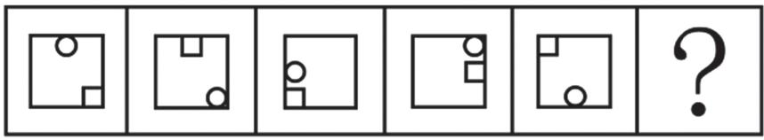

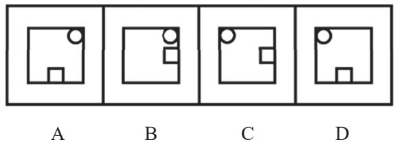

【例2】（2021黑龙江公检法司）从所给的四个选项中，选择最合适的一个填入问号处，使之呈现一定的规律性。

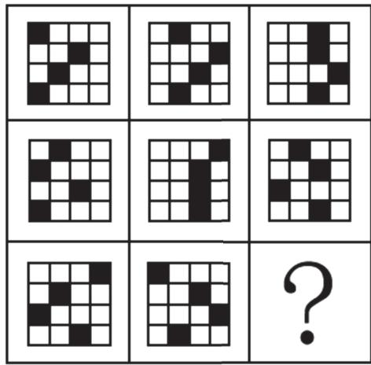

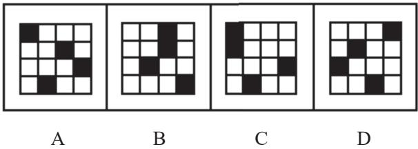

【例3】（2021 浙江）从所给的四个选项中，选择最合适的一个填入问号处，使之呈现一定的规律性。

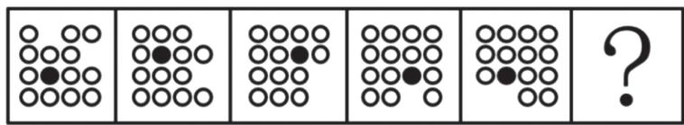

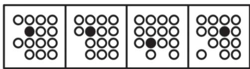  
A  
B  
C  
D

【例4】（2024事业单位）从所给的四个选项中，选择最合适的一个填入问号处，使之呈现一定的规律性。

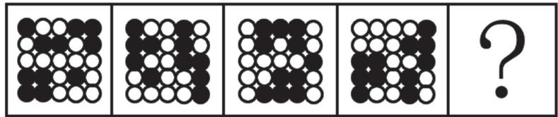

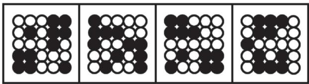  
A  
B  
C  
D

【例5】（2024国考）从所给的四个选项中，选择最合适的一个填入问号处，使之呈现一定的规律性。

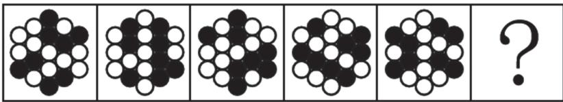

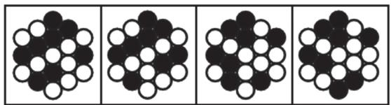  
A  
B  
C  
D

【例6】（2024国考）从所给的四个选项中，选择最合适的一个填入问号处，使之呈现一定的规律性。

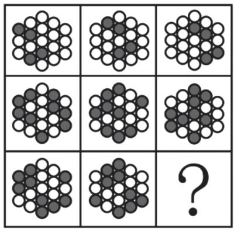

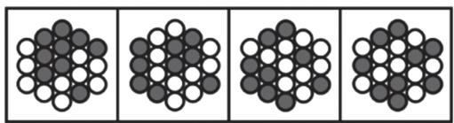

A

B

C

D

# 二、翻转、旋转

# 翻转：

1. 左右翻转：两图关于竖轴对称  
2. 上下翻转：两图关于横轴对称

# 旋转：

1. 方向：顺时针、逆时针  
2. 角度： $30^{\circ}$ 、 $45^{\circ}$ 、 $60^{\circ}$ 、 $90^{\circ}$ 、 $180^{\circ}$ 等常见角度

【例1】（2020联考）从所给的四个选项中，选择最合适的一个填入问号处，使之呈现一定的规律性。

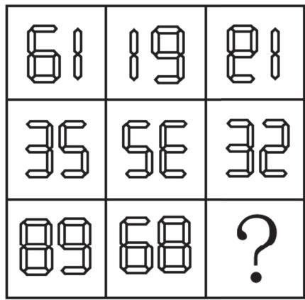

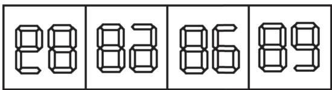  
A  
B  
C  
D

【例2】（2022事业单位）从所给的四个选项中，选择最合适的一个填入问号处，使之呈现一定的规律性。

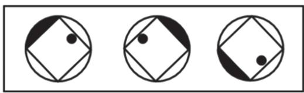

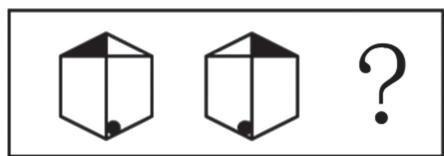

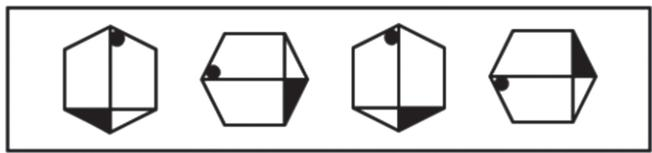  
A  
B  
C  
D

【例3】（2024江苏）从所给的四个选项中，选择最合适的一个填入问号处，使之呈现一定的规律性。

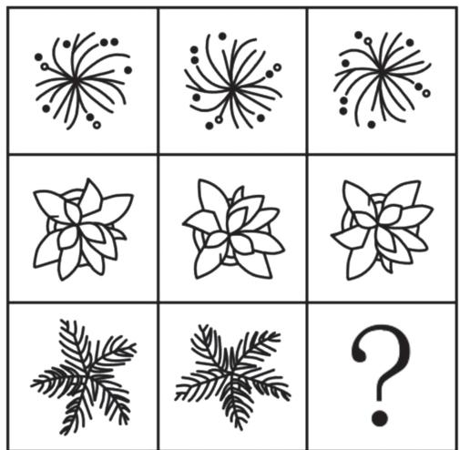

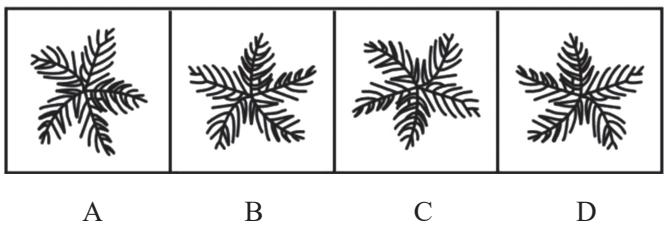

# $\mathcal{O}$  思维导图

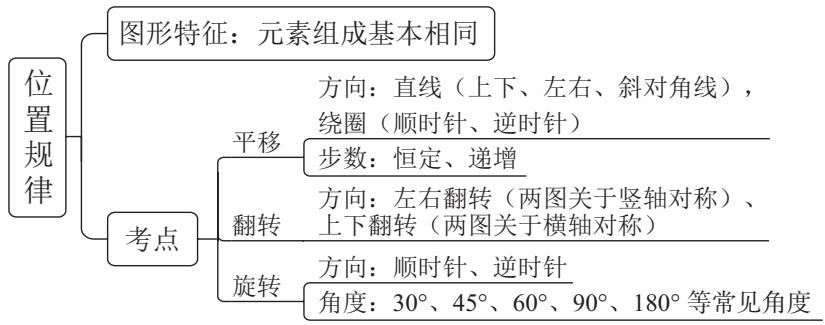

# 第二节 样式规律

图形特征：元素组成相似

# 一、加减同异

图形特征：元素组成相似，且相同线条重复出现

考点：

1. 相加、相减  
2. 求异：去掉相同线条，保留不同线条  
3. 求同：去掉不同线条，保留相同线条

【例1】（2021四川）从所给的四个选项中，选择最合适的一个填入问号处，使之呈现一定的规律性。

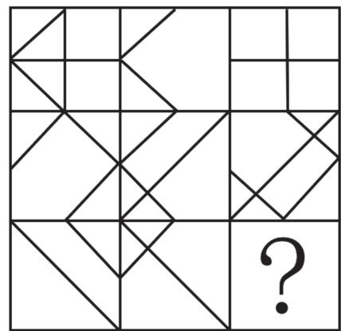

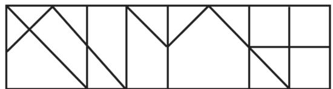

A

B

C

D

【例2】（2019国考）从所给的四个选项中，选择最合适的一个填入问号处，使之呈现一定的规律性。

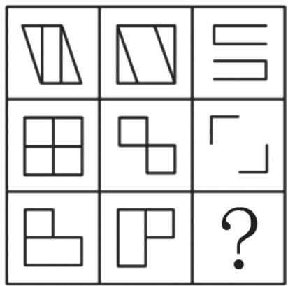

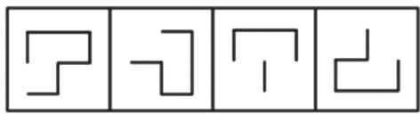

A

B

C

D

【例3】（2022江苏）从所给的四个选项中，选择最合适的一个填入问号处，使之呈现一定的规律性。

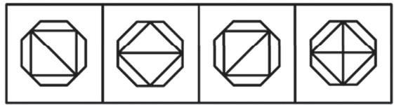

A

B

C

D

# 二、黑白运算

图形特征：图形轮廓和分割区域相同，且黑块数量不成规律

解题方法：按照对应位置进行“黑白”相加运算，将所得规律应用于所求图形

小技巧：从问号处入手，边找边验证

【例1】（2022广东）从所给的四个选项中，选择最合适的一个填入问号处，使之呈现一定的规律性。

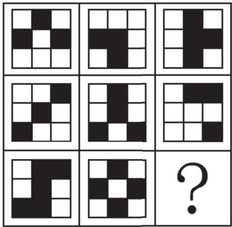

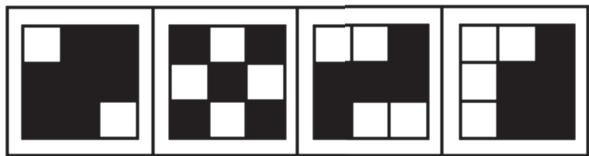

A

B

C

D

【例2】（2023国考）从所给的四个选项中，选择最合适的一个填入问号处，使之呈现一定的规律性。

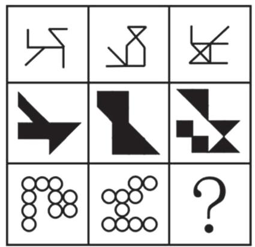

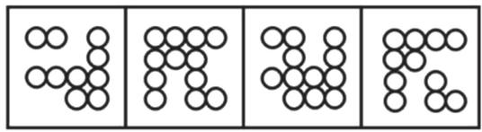  
A  
B  
C  
D

【例3】（2025国考）从所给的四个选项中，选择最合适的一个填入问号处，使之呈现一定的规律性。

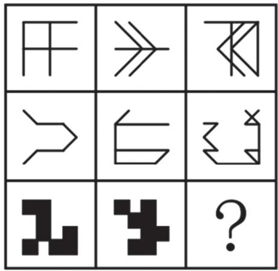

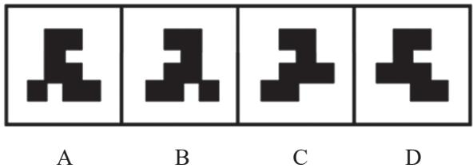

# $\mathring{\mathcal{O}}$  思维导图

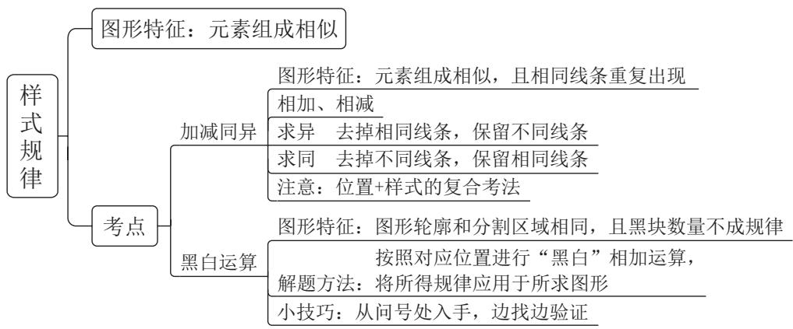

# 第三节 属性规律

图形特征：元素组成不相同、不相似

# 一、对称性

1. 轴对称（含义：图形沿着一条直线折叠后，直线两边的部分能够完全重合）
特征图：“等腰”图形  
2. 中心对称（含义：图形旋转  $180^{\circ}$  后和原图形完全重合）特征图：平行四边形，“S”“N”“Z”及其变形图等  
3. 轴对称 + 中心对称特征图：有两条相互垂直的对称轴的图形

【例1】（2020四川下）把下面的六个图形分为两类，使每一类图形都有各自的共同特征或规律，分类正确的一项是：

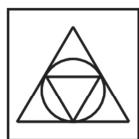  
$①$

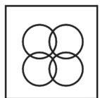  
②

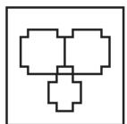  
$③$

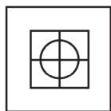  
$④$

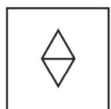  
(5)

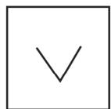  
(6)

A. ①②③, ④⑤⑥

B. ①③④, ②⑤⑥

C. ①②⑤，③④⑥

D. ①③⑥, ②④⑤

【例2】（2024事业单位）从所给的四个选项中，选择最合适的一个填入问号处，使之呈现一定的规律性。

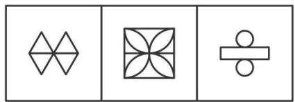

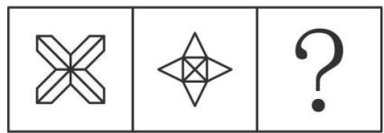

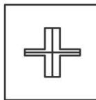  
A

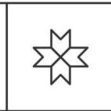  
B

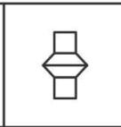  
C

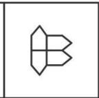  
D

【例3】（2023江苏）从所给的四个选项中，选择最合适的一个填入问号处，使之呈现一定的规律性。

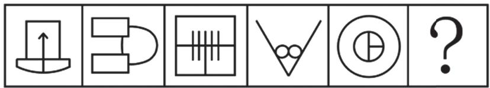

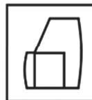  
A

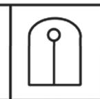  
B

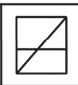  
C

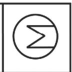  
D

【例4】（2023国考）把下面的六个图形分为两类，使每一类图形都有各自的共同特征或规律，分类正确的一项是：

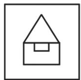  
①

  
②

  
$③$

  
$④$

  
⑤

  
(6)

A. ①③⑥, ②④⑤

B. ①③⑤, ②④⑥

C. ①②⑥，③④⑤

D. ①⑤⑥, ②③④

【例5】（2022联考）从所给的四个选项中，选择最合适的一个填入问号处，使之呈现一定的规律性。

  
A  
B  
C  
D

# 判断推理 精讲精练2

# 学习任务：

1. 课程内容：图形推理（属性规律—曲直性、开闭性，数量规律）  
2. 对应讲义：第  $217 \sim 230$  页  
3. 重点内容:

(1) 属性规律中曲直性、开闭性的特征图  
(2) 数量规律中每类考点的特征图  
(3) 数量规律的常规考法和复合考法

# 二、曲直性

特征图：明显的圆、弧等全曲线图

【例】（2023江苏）从所给的四个选项中，选择最合适的一个填入问号处，使之呈现一定的规律性。

# 三、开闭性

特征图：生活化或粗线条图形

【例】（2024事业单位）从所给的四个选项中，选择最合适的一个填入问号处，使之呈现一定的规律性。

# $\circ$  思维导图

# 第四节 数量规律

# 图形特征：

(1) 元素组成不同且无属性规律  
（2）数量特征明显

# 一、面数量

# 特征图：

(1) 图形被分割、封闭面明显  
(2) 生活化或粗线条图形中明显有留白区域

# 考查方式：

（1）所有面的数量  
(2) 所有面的形状 (三角形、四边形)  
(3) 是否有长得一样的面 (“双胞胎” “多胞胎”)  
(4) 最大面 / 最小面的形状、属性

【例1】（2023重庆选调）从所给的四个选项中，选择最合适的一个填入问号处，使之呈现一定的规律性。

A

B

C

D

【例2】（2021 浙江）从所给的四个选项中，去掉哪一个后，剩下的图形序列可以呈现一定的规律性？

【例3】（2024事业单位）从所给的四个选项中，选择最合适的一个填入问号处，使之呈现一定的规律性。

A

B

C

D

【例4】（2024联考）把下面的六个图形分为两类，使每一类图形都有各自的共同特征或规律，分类正确的一项是：

①

$②$

$③$

$④$

(5)

(6)

A. ①③④, ②⑤⑥

B. ①③⑤，②④⑥

C. ①⑤⑥, ②③④

D. ①④⑥, ②③⑤

# 二、线数量

# 特征图：

(1) 曲线数: 曲线图形 (全曲线图、圆、弧)  
(2) 直线数: 多边形、单一直线

# 考查方式：

(1) 分开数曲线/直线  
(2) 曲线数、直线数之间做运算  
(3) 平行线

【例1】（2022湖北选调）从所给的四个选项中，选择最合适的一个填入问号处，使之呈现一定的规律性。

A

B

C

D

【例2】（2023事业单位）从所给的四个选项中，选择最合适的一个填入问号处，使之呈现一定的规律性。

【例3】（2019浙江）把下面的六个图形分为两类，使每一类图形都有各自的共同特征或规律，分类正确的一项是：

A. ①③④, ②⑤⑥

B. ①③⑥, ②④⑤

C. ①②③, ④⑤⑥

D. ①④⑤, ②③⑥

【例4】（2022江苏）从所给的四个选项中，选择最合适的一个填入问号处，使之呈现一定的规律性。

A

B

C

D

一笔画图形需要同时满足以下两个条件：

1. 线条之间全部连通  
2. 奇点数为 0 或 2

注：奇点，即发射出奇数条线的点

所有的端点都是奇点，数奇点时要数上端点

# 多笔画图形：

连通图笔画数 = 奇点数 ÷ 2（任何图形的奇点数一定是偶数）

若图形存在多个部分，则每个部分的笔画数单独算，再相加

# 常见笔画数特征图：

1. 五角星等明显一笔画成的图形  
2. “日”“田”及其变形图（框 + 内部简单线条）  
3. 圆相切与相交及其变形图  
4. 多端点图

【例5】（2025国考）把下面的六个图形分为两类，使每一类图形都有各自的共同特征或规律，分类正确的一项是：

  
$①$

  
$②$

  
3

  
4

  
(5)

  
(6)

A. ①②④, ③⑤⑥

B. ①③④, ②⑤⑥

C. ①②⑤，③④⑥

D. ①④⑤, ②③⑥

【例6】（2023国考）把下面的六个图形分为两类，使每一类图形都有各自的共同特征或规律，分类正确的一项是：

  
$①$

  
②

  
$③$

  
$④$

  
$⑤$

  
(6)

A. ①③⑤, ②④⑥

B. ①④⑥, ②③⑤

C. ①③④, ②⑤⑥

D. ①②④, ③⑤⑥

# 三、点数量

# 特征图：

(1) 线条交叉明显（俗称“大树权”）  
(2) 多边形或圆中又出一些线条  
(3) 圆相切或圆相交较多

# 考查方式：

(1) 交点  
（2）切点  
(3) 框上/框内交点  
(4) 曲直交点

【例1】（2020山东）从所给的四个选项中，选择最合适的一个填入问号处，使之呈现一定的规律性。

A

B

C

D

【例2】（2024联考）从所给的四个选项中，选择最合适的一个填入问号处，使之呈现一定的规律性。

  
A  
B  
C  
D

【例3】（2022天津）把下面的六个图形分为两类，使每一类图形都有各自的共同特征或规律，分类正确的一项是：

  
$①$

  
$②$

  
$③$

  
$④$

  
$⑤$

  
$⑥$

A. ①②③, ④⑤⑥

B. ①④⑤, ②③⑥

C. ①②⑥, ③④⑤

D. ①③⑥, ②④⑤

【例4】（2023湖北）把下面的六个图形分为两类，使每一类图形都有各自的共同特征或规律，分类正确的一项是：

  
$①$

  
$②$

  
$③$

  
$④$

  
$⑤$

  
(6)

A. ①②③, ④⑤⑥

B. ①②⑤，③④⑥

C. ①③④, ②⑤⑥

D. ①④⑤, ②③⑥

# 四、素数量

1. 元素种类  
2. 元素个数

【例1】（2023事业单位）从所给的四个选项中，选择最合适的一个填入问号处，使之呈现一定的规律性。

  
A  
B  
C  
D

# 3. 部分数（线条连在一起的区域为一部分）

特征图：出现生活化或粗线条图形

【例2】（2021江苏）从所给的四个选项中，选择最合适的一个填入问号处，使之呈现一定的规律性。

A

B

C

D

# 五、数量规律的复合考法

【例1】（2021四川下）从所给的四个选项中，选择最合适的一个填入问号处，使之呈现一定的规律性。

【例2】（2020国考）从所给的四个选项中，选择最合适的一个填入问号处，使之呈现一定的规律性。

  
$\mathring{\mathcal{O}}$  思维导图

# 判断推理 精讲精练3

# 学习任务：

1. 课程内容：图形推理（六面体，截面图，三视图）  
2. 对应讲义: 第  $231 \sim 239$  页  
3. 重点内容:

(1) 六面体中的相对面和相邻面（公共边、公共点、画边法）  
（2）常见立体图形的截面图  
(3) 三视图的解题思维

# 第五节 空间类

# 一、六面体

# 解题思维：

1. 注意折向——平面图为纸盒的外表面  
2. 利用相对关系和相邻关系排除错误选项

# （一）相对面

应用：一组相对面同时出现的选项——排除

展开图中如何判断相对面？

1.同行或同列相隔一个面

2. 位于“Z”字形两端，且紧邻“Z”字形中间那条线

【例1】（2021事业单位）下图是给定的纸盒的外表面，选项中哪一个是由此外表面折叠而成的纸盒？

  
A

  
B

  
C

  
D

【例2】（2022天津）左边给定的是纸盒的外表面，右边哪项能由它折叠而成？

  
A  
B  
C  
D

# （二）相邻面

# 1. 两个面看公共边

(1) 平面图中构成直角的两条边是同一条边  
(2) 四个面连成一列 / 行, 最两头的两条边是同一条边  
(3) “ $3 + 1$  构成  $\mathrm{L}$  形”, 同方向的两条边是同一条边

# 2. 三个面看公共点

相邻三个面的公共点是唯一的

【例3】（2023江苏）左边给定的是一个六面体的外表面展开图，右边哪一项能由它折叠而成？

  
A

  
B

  
C

  
D

【例4】（2024江苏）左边给定的是六面体的外表面展开图，右边哪一项能由它折叠而成？

  
A

  
B

  
C

  
D

【例5】（2024国考）左图为8个白色正方体和4个灰色正方体粘接而成的长方体，右边哪一个可能是其外表面展开图？

  
A

  
B

  
C

  
D

【例6】（2024浙江选调）左边给定的是纸盒的外表面，右边哪项能够由它折叠而成？

  
A

  
B

  
C

  
D

【例7】（2024联考）右边哪项不能由左侧展开图折叠而成？

  
A

  
B

  
C

  
D

# 画边法步骤：

(1)结合选项, 找一个特殊面的唯一点或唯一边作为起点  
(2)顺时针 / 逆时针方向描边标号（描同一个面）  
(3)选项与题干对应面不一致——排除

(速记口诀: 三同, 即同一面、同一起点、同一方向)

【例 8】(2024 四川) 左图是给定纸盒的外表面, 右边哪项能由它折叠而成?

【例9】（2022国考）下列纸盒的外表面展开图中，哪项折叠成的纸盒和其他三个不一样？

# $\circ$  思维导图

# 二、截面图

解题原则：一刀切

(1) “刀”无限大, 一刀切到底  
（2）不能拐弯

# 熟记常见立体图形的截面图

(1) 正方体 / 长方体

(1)矩形（拦腰切、上下切、斜切）  
(2)梯形（斜切）  
(3)三角形（从棱上的某一点开始斜着切到面）

注意: ①正方体 / 长方体只能切出锐角三角形  
(2)有些不规则立体图形可能切出直角三角形

（2）圆柱

(1)圆 (横切) 
(2)椭圆 (斜切) 
(3)矩形 (竖直切)

注意：圆柱斜切，切不出梯形

（3）圆锥

(1)圆 (横切) 
(2)椭圆 (斜切) 
(3)三角形 (过顶点切)  
（4）圆台  
(1)圆 (横切) 
(2)椭圆 (斜切) 
(3)梯形 (竖切)

【例1】（2021广东）下图所示立体图形沿OMN面斜切，由切面所见截面最可能是：

  
A

  
B

  
C

  
D

【例2】（2020国考）左图为给定的立体图形，将其从任一面剖开，右边哪项不可能是该立体图形的截面？

【例3】（2019四川下）左图给定的是由4个相同正方体组合成的立体图形，将其从任一面剖开，右边哪一项不可能是该立体图形的截面？

【例4】（2025国考）左边为给定的多面体，现用经  $P$  、  $Q$  、  $R$  三个顶点的平面对其进行切割，则哪个选项是其切面？

【例5】（2024国考）左图为13个白色正方体和5个灰色正方体组合而成的多面体，现用经  $A$  、  $B$  、  $C$  三个顶点的平面对该多面体进行切割，正确的截面是：

# $\circ$  思维导图

# 三、三视图

# 解题思维：

(1) 观察到的视图都是平面图  
(2) 原图有线就有线, 原图没线就没线  
(3) 当存在被遮挡部分时, 看不见被遮挡部分  
(4) 某些角度下弧或斜线会被压直

#

【例1】（2021国考）左图为给定的多面体，从任一角度观看，右边哪项可能是该多面体的视图？

  
A

  
B

  
C

  
D

【例2】（2024江苏）左图是由14个黑白小正方体组成的立体图形，右面四个选项中有一项不是该立体图形的视图，请把它找出来。

  
A

  
B

  
C

  
D

# $\circ$  思维导图

# 判断推理 精讲精练4

# 学习任务：

1. 课程内容：类比推理（逻辑关系）  
2. 对应讲义: 第  $240 \sim 244$  页  
3. 重点内容:

(1) 并列关系中矛盾关系与反对关系的区分  
(2) 包容关系中种属关系与组成关系的区分  
(3) 交叉关系的辨析及其与并列关系的区分  
（4）常考的对应关系及其二级辨析

# 第二章 | 类比推理

# 题目要求：

给出一组相关的词，要求通过观察分析，在备选答案中找出一组与之在逻辑关系上最为贴近或相似的词

# 常见题型：

1. 两词型——A：B  
2. 三词型——A : B : C  
3. 填空型——A 对于（ ） 相当于（ ） 对于 B

# 第一节 逻辑关系

# 一、全同关系

全同关系：两个词语意思完全相同

例：上海：沪

【例】（2022联考）岳父：泰山

A.少女：娥眉

B. 儿子：孙子

C. 女婿：东床

D.兄弟：伯仲

# 二、并列关系

1. 矛盾关系：是指只有对立的两种情况，不存在第三种情况，二者是非此即彼的关系

例：男人：女人 盈利：非盈利

2. 反对关系：是指在所列的两种情况之外，还存在其他情况，二者不是非此即彼的关系

例：苹果：西瓜 狮子：老虎

【例1】（2023事业单位）吸尘器：加湿器

A.土豆：香菜

B. 除螨仪：螨虫

C. 水晶：宝石

D. 牙签：牙齿

【例2】（2023事业单位）真：伪

A.长：短

B.忙：闲

C.凹：凸

D.雌：雄

【例3】（2022联考）帛书：简牍

A.日晷：秒表

B. 熊猫：银杏

C. 青铜：礼器

D. 牛车：轿子

【例4】（2024联考）锁骨：肋骨：坐骨

A.头脑：头皮：头发

B.腹腔：口腔：鼻腔

C. 盲肠：大肠：直肠

D.颈椎：胸椎：腰椎

# 三、包容关系

1. 种属关系：A是B的一种

例：香蕉：水果

2. 组成关系：A 是 B 的一个组成部分

例：硬盘：电脑

区分：具有包容关系的词语，若能单独用“是”造句子且造得通顺，则词语间为种属关系

【例1】（2024联考）文字：汉字

A. 判断：概念

B. 宇宙：恒星

C. 中国：北京

D. 工人：矿工

【例2】（2024江苏）期刊：月刊：目录页

A.房屋：公寓：天花板

B.能源：电池：电子书

C. 银行：企业：理财室

D. 欧盟：法国：凯旋门

【例3】（2023联考）十二时辰：丑时：午时

A. 国家元首：主席：总理  
B.网络课程：直播：录播  
C. 河北特产：海鲜：菠萝  
D. 五金工具：钳子：扳手

【例4】（2021 浙江选调）心脏：器官：毛发

A.玫瑰：植物：生物

B.内存：硬件：显示器

C. 水银：金属：钻石

D.猫：生肖：龙

# 四、交叉关系

# 判定技巧——造句子：

有的A是B且有的A不是B

有的B是A且有的B不是A

例：青年：教师

【例1】（2022天津）报案人：嫌疑人

A.获益人：买家

B. 卖家：买家

C. 主角：配角

D.僧侣：道士

【例2】（2022国考）二线城市：港口城市：商业城市

A. 海上战争：常规战争：空中战争

B. 科技期刊：电子期刊：纸本期刊

C. 自助旅游：国内旅游：探亲旅游

D. 街心公园：森林公园：湿地公园

【例3】（2024黑龙江）国产灯：蘑菇灯：护眼灯

A. 社区公园：迷你公园：主题公园

B. 上皮细胞 : 扁平细胞 : 生殖细胞

C. 自制玩偶：人形玩偶：装饰玩偶

D. 水生植物：喜阴植物：防风植物

# 五、对应关系

# 高频对应关系：

1. 材料

例：面粉：面包

2.工艺

例：白醋：发酵

3. 功能

例：钢笔：书写

4. 属性

例：钻石：坚硬

5.时间顺序

例：构思：写作：发表

6.必要条件

例：上网：网购

7. 因果

例：勤奋：成功

8. 方式目的

例：撒网：捕鱼

【例1】（2022重庆选调）眼镜镜片 对于 （ ） 相当于 （ ） 对于铝合金

A.视力 坚固

B. 树脂 易拉罐

C. 凹透镜 重金

D.眼镜镜架 不锈钢

【例2】（2021新疆兵团）布：衣服

A.牛奶：酸奶

B. 粮食：酒

C. 木材：餐桌

D. 朱古力：巧克力

【例3】（2024事业单位）教务处：学校：教育

A. 飞机：交通工具：运输

B. 糯米：糍粑：食品

C. 笔芯：签字笔：写字

D. 鲜花：红色：颜色

【例4】（2025国考）直观性：即时性：网络直播

A.等边性：对称性：等腰梯形

B. 公开性：权威性：行政法律

C. 周期性：延展性：机械钟摆

D. 挥发性：保温性：石棉纤维

【例5】（2021北京）征稿：审校：出版

A. 组装：维修：报废

B. 送审：开题：毕业

C.分离：发射：入轨

D. 绘画：展出：装裱

【例6】（2022国考）提起公诉：宣告判决：收押罪犯

A. 撰写教案：课堂教学：解答疑问

B. 手机点餐：外卖送餐：五星好评

C. 违章行驶：交警处罚：行人受伤

D. 方案设计：建筑施工：竣工验收

【例7】（2024黑龙江公安）张嘴：喝水

A. 洗手：吃饭

B. 睡觉：做梦

C. 开门：通风

D. 复习：考试

【例8】（2024黑龙江公安）病毒：疾病

A.愉悦：满足

B. 锻炼：健康

C. 心高：气傲

D. 年龄：衰老

【例9】（2022重庆选调）灾害预警：减少损失

A. 寒风凛冽：树木凋零

B. 演出彩排：顺利演出

C. 调解纠纷：劳动仲裁

D.次贷危机：股市震荡

# 判断推理 精讲精练5

# 学习任务：

1. 课程内容：类比推理（语义关系，语法关系，拆分）；定义判断（拆词，单定义一简单句）  
2. 对应讲义：第  $245\sim 253$  页  
3. 重点内容:

(1) 类比推理中的语义关系  
(2) 类比推理中的语法关系  
(3) 类比推理中的拆分思维  
(4) 定义判断中的拆词  
(5) 定义判断中的单定义

# 第二节 语义关系

# 一、近义关系、反义关系

1. 近义关系：词语意思相近

例：表扬：赞扬 百折不挠：坚韧不拔

2. 反义关系：词语意思相反

例：忧伤：喜悦 了如指掌：一窍不通

【例1】（2024安徽）不胜枚举：寥若晨星

A.指鹿为马：颠倒黑白

B. 众望所归：不负众望

C. 国泰民安：安居乐业

D. 杀鸡取卵：高瞻远瞩

【例2】（2022青海）化险为夷：转危为安

A. 异曲同工：深入浅出

B. 承前启后：继往开来

C. 除旧布新：空前绝后

D.畏首畏尾：瞻前顾后

【例3】（2021事业单位）认真：一丝不苟

A. 清楚：一清二楚

B. 正确：分毫不差

C. 温暖：风和日丽

D. 干净：一尘不染

# 二、比喻义、象征义

1. 比喻义：用跟甲事物有某种相似之处的乙事物来说明甲事物

例：月亮：小船

2. 象征义：借助某物的具体形象，以表现某种抽象的概念、思想和情感

例：仙鹤：长寿

【例】（2023吉林）旌旗 对于（ ） 相当于（ ） 对于 船只

A.武器 船桨

B. 锣鼓 船夫

C. 军队 孤帆

D.旗帜 汽车

# 第三节 语法关系

通常在运用语义关系或逻辑关系找不到答案的情况下，再考虑语法关系

1. 主谓关系

例：学生：学习 医生：治疗

2. 动宾关系

例：观看：演出 消除：矛盾

3. 主宾关系

例：农民：水稻 士兵：敌情

4.偏正关系

例：晴朗：天气 飞快：奔跑

【例1】（2024黑龙江公安）明月：松间：照

A.青霭：入看：无

B.野旷：天低：树

C. 绿树：村边：合

D. 春风：花草：香

【例2】（2021联考）铭心刻骨：记忆

A.冥思苦想：思想

B.繁花似锦：繁华

C. 闭月羞花：容貌

D. 冷若冰霜：冷漠

# 第四节 拆分

# 什么时候考虑拆分？

(1) 成语 “已拆开” 例: 南征 : 北战  
(2) 成语或词语之间没有明显关系 例: 左顾右盼 : 上蹿下跳  
(3) 词语出现相同的单字 例: 甘 : 甘甜 ; 甘愿

# 拆分后的考点：

并列关系

对应关系（因果、方式目的等）

语义关系

语法关系（动宾关系、偏正关系等）

命名方式

【例1】（2022联考）水落：石出

A.理屈：词穷 B.狼奔：豕突  
C.枕戈：待旦 D.求全：责备

【例2】（2023广东）舍身：取义

A. 摩拳：擦掌 B. 含苞：欲放  
C.得陇：望蜀 D.格物：致知

【例3】（2024黑龙江公安）除暴：安良

A. 见贤：思齐 B. 水到：渠成

C. 激浊：扬清

D. 风平：浪静

【例4】（2024国考）明辨是非：静待成败

A.判若云泥：开释左右

B. 洞鉴古今：博观始终

C. 一争高低：弱肉强食

D. 惩恶劝善：天差地别

【例5】（2025国考）逐客令：挡箭牌

A.急先锋：领航者

B. 避风港：马后炮

C. 敲门砖：绊脚石

D. 鸿门宴：攻心计

【例6】（2024江苏）海：海沟：海量

A.天：天眼：天堑

B.碑：碑座：碑林

C. 火：火焰：火气

D. 心：心房：心腹

# $\circ$  思维导图

# 第三章 | 定义判断

# 解题步骤：

1. 看清提问方式，是“属于/符合”定义，还是“不属于/不符合”定义等  
2. 识别有效信息——找准关键词  
3. 逐一分析选项，当纠结时采用对比的思维进行排除，最终选择更符合题干要求的选项

# 第一节 拆词

运用：定义本身词汇通俗易懂，优先关注；题干读不懂或选项纠结时，可成为重要破题点

【例1】（2024国考）动态描写法是指记叙文中对人物、景物作运动状态的描写，创造具体而栩栩如生的形象的一种描写方法。动态描写法包括两类：一类是对运动着的景物的描写，一类是对静物所作的动态描写。动态描写法的目的在于赋予客观事物以运动感、活力感、变化感，克服形象的单调性，丰富形象的多样性，达到更好地表现事物、感染读者的艺术效果。

根据上述定义，下列没有体现动态描写法的是：

A. 有的松树望穿秋水, 不见你来, 独自上到高处, 斜着身子张望  
B. 夜阑人静，家养的大黄狗趴在院子里安静地睡了  
C. 七股大水, 从水库的桥孔跃出, 仿佛七幅闪光的黄锦, 直铺下去  
D. 一轮杏黄色的满月, 悄悄从山嘴处爬出来, 把倒影投入湖水中

【例2】（2022四川）食品安全风险评估指科学评估食品、食品添加剂及食品相关产品中的生物性、化学性和物理性危害对人体健康造成不良影响的可能性及其程度，

该评估包括危害识别、危害特征描述、暴露评估、风险特征描述等内容。

根据上述定义，下列不属于食品安全风险评估范围的是：

A. 某地消费者投诉超市售卖的酱油中防腐剂含量超标，要求主管部门进行核查  
B. 为了增加啤酒的口感和风味, 某啤酒生产厂家在其中添加了果胶  
C. 食品包装企业创新性地使用了一种新型材料来生产食品外包装箱  
D. 某地因为土壤原因, 所种植加工的大米中某重金属元素含量超标

【例3】（2024黑龙江公安）政府质量监管指政府主管的行政部门在市场机制框架内，为矫正市场失灵，依据质量、法律、法规及相关标准对市场主体的经济活动以及伴随其经济活动而产生的社会问题的微观层面上的干预和控制活动。

根据上述定义，下列没有涉及政府质量监管的是：

A. 从事产品生产加工的公民、法人或其他组织，必须具备保证产品质量安全的基本生产条件，按规定程序获得《工业产品生产许可证》  
B. 为保障人体的健康、人身安全，从事食品生产的企业要在政府的监管下，严格执行强制性的国家标准  
C. 某省产品质量监督管理部门依据国家法律法规规定，对生产领域、流通领域的产品实施质量监督  
D. 某市政府组织评选市政府质量奖，对获奖企业奖励人民币 100 万元，并颁发证书和奖牌

【例4】（2022浙江）最小干预原则是指在保证文物安全的基本前提下，通过最小程度的介入来最大限度地维系文物的原本面貌，保留文物的历史、文化价值，以实现延续现状、降低保护性破坏的目标。

根据上述定义，下列选项不属于最小干预原则的是：

A. 某博物馆在修复古籍时不拆开原线绳，只修补蛀洞严重的书页，而不修补强度未受蛀洞影响的书页  
B. 某博物馆的一幅雕塑作品中的人物手臂缺失, 专家们查阅了原始资料, 根据资料将其复原如初  
C. 某古城墙修缮时, 保留其残损的现状, 在靠近边墙的一侧恢复了很窄的台阶供游人安全通过  
D. 某古塔倾斜, 专家们在研究后最终决定只纠偏一度, 它看上去依旧是倾斜的状态

【例5】（2023国考）数字农业是指用数字化技术，按人类需要的目标，对农业所涉及的对象和全过程进行数字化和可视化表达、设计、控制、管理等的农业。

根据上述定义，下列没有体现数字农业的是：

A. 在大数据平台，点击任一块田地，就可以看到这块田地的土壤酸碱度、肥水条件、环境温度湿度等指标，农民可以根据这些信息进行田地管理  
B. 某柑橘生产大省建立“柑橘产业大数据中心”，以数据驱动柑橘产业结构性改革和高质量发展  
C. 通过电子标签等技术, 对单个产品赋予身份编码及认证信息, 在生产管理、仓储、物流、销售等环节实现信息追溯  
D. 遇到连绵阴雨天, 果蔬容易滋生病害, 需要及时喷药, 采用轻型直升机几个小时就可以完成传统作业方式十多人几天才能完成的工作

# 第二节 单定义

# 一、简单句

定义较短时，能看懂的关键词都很重要

【例1】（2025国考）回应型预算要求政府基于与人民的民主协商作出预算决策，相关责任部门应当及时反应并积极回复人民的质疑和诉求。

根据上述定义，下列属于回应型预算的是：

A. 甲国突发大规模严重旱情，财政部门从中央及各级政府应急预算中，通过多种财政政策安排，保障应急救援经费  
B. 乙省是地质灾害高发地区，年初该省编制《乙省地质灾害应急中心  $\times \times$  年度部门预算公开说明》，并在官网上发布  
C. 丙市在年初将上一年度的地方预算执行情况在官网进行公布, 诚邀广大市民和社会公众踊跃监督并提出意见  
D. 丁区实行预算听证制度, 对与公共服务和社会民生相关的重大支出项目开展听证, 并就意见和建议进行书面答复

【例2】（2024黑龙江公安）再社会化是指个体从原有的价值标准和生活方式向另一种新的价值标准和生活方式的转变、适应和不断内化的过程。

根据上述定义，下列不属于再社会化的是：

A. 散漫的小李在部队接受训练，努力成为合格的军人  
B. 某少年因偷盗财物进入少管所后接受思想改造  
C. 某同学大学毕业前进入当地企业进行岗前学习  
D. 小敏随父母移居国外后, 重新适应新的价值观念

【例3】（2024吉林）需求价格弹性是指某种商品的需求量对其价格变化所做出的反应程度，可以表示为需求量变动的百分比与其价格变动的百分比之比。

根据上述定义，下列体现了需求价格弹性的是：

A. 生产技术的进步使商品供给量大幅增加，引发价格下降  
B. 猪肉价格大幅下降引发牛肉销量大幅下降  
C. 原材料价格上涨引发某商品价格攀升，从而导致该商品滞销  
D. 消费者收入水平的提升，引发了中高端商品销量大幅增加

# 判断推理 精讲精练6

# 学习任务：

1. 课程内容：定义判断（单定义一句式，多定义，特殊定义）  
2. 对应讲义：第  $254 \sim 264$  页  
3. 重点内容:

(1) 定义中的常见关键词  
(2) 多定义  
（3）特殊定义

# 二、句式结构之“主体、客体”

关注主体、客体的种类和数量，主体、客体错误的选项一定不符合定义

注：需特别注意带修饰词的主体、客体

【例1】（2022湖北选调）质量成本是指企业为了保证和提高产品或服务质量而支出的一切费用，以及因未达到产品质量标准，不能满足用户和消费者需要而产生的一切损失。

根据上述定义，下列情形不符合质量成本含义的是：

A. 甲市行政服务中心为进一步提高窗口服务质量购置便民办公设备  
B. 乙公司卖出的产品在保修期内出现质量问题, 公司免费维修  
C. 内公司拨付专款让员工学习产品质量管理国际标准体系  
D. 丁工厂投入巨资研制出一条优化产品性能的生产线

【例2】（2023国考）异业合作是指两个或两个以上不同行业的企业，通过分享市场营销中的资源，以达到降低成本、提高效率、增强市场竞争力等目的的一种营销策略。

根据上述定义，下列体现了异业合作的是：

A.某集团下属的两家餐饮公司通过公众号互推产品信息，提升了各自的品牌影响力  
B. 某互联网公司和商业银行共同发行联名信用卡, 办卡成员将享受更大购物优惠

C. 某日用品企业将不同尺寸的收纳盒组成套装促销，销量剧增，其他企业也纷纷效仿  
D. 某运动品牌在奥运会期间推出绘有奥运标志的限量款球鞋, 搭配赠送新奥运吉祥物

【例3】（2024江苏）代际责任：指在不超出自身能力的前提下，相邻两代人的一方向另一方主动提供经济帮扶、生活照顾、健康保障、精神抚慰等各种支持的行为。下列不属于代际责任的是：

A. 苏女士把父母接到身边后，忙乎了一个多月，带着父母熟悉小区健身器材，到社区老年活动中心打牌下棋，在公园找人聊天，终于帮他们重新找到了“组织”  
B. 邵先生和妻子一直在城里忙于打拼, 女儿正在读小学。每到寒暑假, 邵先生的父母都会专程赶到城里, 把孙女接回农村老家痛痛快快地玩上整个假期  
C. 罗奶奶像无数为孩子婚事发愁的长辈一样, 每到周末就去附近公园的相亲角浏览展板上的照片、简历, 觉得合适的就记下基本情况、电话号码。虽然快三十岁的孙女根本不着急, 她却一直乐此不疲  
D. 毛先生喜欢第一时间把遇到的趣事分享到家族微信群, 却很少得到期待的回应, 一怒之下退了群。后来, 儿子又把他请回, 还邀约了几位有同样爱好的长辈, 群里逐渐热闹起来, 他也时不时点赞或评论几句

【例4】（2021四川下）选择性理解是指不同的受众对传播媒介所传播的同一信息做出不同的解释、结论和反应。造成这种现象的主要原因是受众在理解过程中加进了许多主观因素，如固有的观念、态度、立场，个人的感情、情绪、习惯，使用传播媒介的动机和目的，等等。

根据上述定义，下列情形属于选择性理解的是：

A. 小吴与小宋经常就新闻报道中的观点发生争执  
B. 小婷与小凤就新闻受众问题提出不同的学术观点  
C. 小陈认为看时政新闻有意思，而小李认为文体新闻更刺激  
D. 小伍觉得晚上看新闻更有感觉, 小王认为早上看能早知道

# 三、句式结构之“大前提、方式目的、原因结果、句号与补充说明”

# 常见句式引导词：

大前提：在……后、在……过程中、在……情况下、当……时

方式：通过、利用、把、用

目的：以、达到

原因：因为、由于

结果：导致、从而

注：重点关注“范围小且明确”的关键词，关注“……的……”

【例1】（2023重庆选调）反刍思维是指个体在经历了消极生活事件后不由自主地反复思考该事件的产生原因、经过和结果，表现为个体倾向于将负面信息与自我联系并过度解读、对事件细节和自身情绪状态过度加工、对事件思考的重复和持续等特点。

根据上述定义，下列属于反刍思维的是：

A. 老王最近感觉老忘事，明明锁了门，出门后却还是控制不住再回去看看  
B. 小林失恋了很痛苦, 他认为对方太自私太不懂得珍惜自己, 每每想起都愤愤不已  
C. 儿子成绩下滑严重，让刘女士这段时间寝食难安，一直念叨儿子究竟是哪里出了问题  
D. 老孙把目前困顿的家庭经济状况归咎于自己五年前的那场失败投资, 每次不自觉想起都懊悔不已

【例2】（2024江苏）温情执法：指执法人员在依法查处违法行为的过程中，综合考量各种特殊因素，对违法者进行灵活处置以体现法治温度的执法行为。

下列不属于温情执法的是：

A.冬天，许多菜农在路边叫卖，给城市交通卫生带来了挑战。区城管部门调研后划出28个覆盖全区的固定销售点，与菜农签订“摊前三包”协议，菜农卖得更安心了，城市面貌大有改观  
B. 民警发现电信诈骗嫌疑人王某潜回家中后迅速抓捕。当时，王某刚把4岁女儿从幼儿园接回家，民警为避免小女孩受惊，迅速收起警察证和手铐，以吃饭为

名把王某带了出去

C. 交警小周在公路上进行安全巡逻时, 发现一辆电动三轮车严重超员。处罚过程中得知因为老人突然生病, 全家人带他到县城治疗, 小周用警车把他们送到医院  
D. 某县卫生健康执法人员在查处无证行医过程中，发现郑某正在出租屋行医。得知小诊所是他家最主要的经济来源，郑某已考取职业资格证书，县卫生部门协助他办理了医生执业证书和执业许可证

【例3】（2024事业单位）共享经济是指通过互联网等网络平台提供互利共赢的共享服务，以达到资源优化利用和社会价值最大化的经济模式。

根据上述定义，下列属于共享经济的是：

A. 某图书馆为居民提供免费的图书借阅服务，鼓励大家多读书、读好书  
B. 某教师在网络平台上传和分享自己的教学视频  
C. 几家网络视频平台联合推出了一项会员服务, 会员可以享受更多的折扣续费  
D. 通过手机 APP，数百万注册司机和乘客实现了连接，用户可轻松预约车辆出行，减少道路拥堵和空气污染

【例4】（2025国考）形象史学是指把形与象作为主要材料，用以研究历史的一门学问。具体来说，是指把传世的包括出土（水）的具有研究价值的石刻、陶塑、壁画、雕砖、铜玉、织绣、漆器、木器、绘画等历史实物、文本图像以及文化史迹作为主要研究对象，并结合传统文献来综合考察历史的一种新的史学研究模式。

根据上述定义，下列属于形象史学研究范畴的是：

A. 结合《晋书》等史书，通过对吉林集安长川1号墓礼佛图主佛形象及莲花纹的考察，研究三燕文化对高句丽佛教产生的影响  
B. 通过对现存的汉画像石（汉代人雕刻在墓室、祠堂四壁的装饰石刻壁画）的实地考察，分析汉画像石的雕刻风格和雕刻技法  
C. 根据史诗《伊利亚特》的记载，找到特洛伊城的遗址，并在其中发掘出王冠、银瓶、短剑等大量器物  
D. 通过对二十世纪二三十年代齐白石、傅抱石等人具有代表性的国画作品进行研究, 分析当时国画中所蕴含的思想意境

【例5】（2020北京选调）前馈控制，是指通过观察情况、收集整理信息、掌握规律、预测趋势，正确预计未来可能出现的问题，提前采取措施，将可能发生的偏差消除在萌芽状态中，为避免在未来不同的发展阶段可能出现的问题而事先采取的措施。

根据上述定义，下列不属于前馈控制的是：

A.猎人把瞄准点定在飞奔的野兔的前方  
B. 海尔公司根据现有产品销售不畅的情况，改变产品结构  
C. 根据禽流感疫情预报，医药公司做好医药物品的储备  
D. 司机在汽车上坡时，为了保持一定的车速，提前踩加速器

【例6】（2022国考）地球物理勘探是通过研究和观测各种地球物理场的变化来探测地层岩性、地质构造等地质条件的过程。由于组成地壳的不同岩层介质往往在密度、弹性、导电性等方面存在差异，这些差异将引起相应的地球物理场的局部变化，通过测量这些物理场的分布和变化特征，结合已知地质资料进行分析研究，就可以达到推断地质性状的目的。

根据上述定义，下列不属于地球物理勘探的是：

A. 根据岩石和矿石导电性、电磁感应特性等来记录地层界面的深度和形态  
B. 利用人工激发的地震波在弹性不同地层内的传播规律, 了解水文地质的分布情况  
C. 采集岩石样品, 分析岩石内的微量元素, 通过发现与矿化有关的原生异常来寻找矿床  
D. 通过观测不同岩石引起的重力差异, 判断地下地层的岩性及状态, 确定沉积盆地范围

【例7】（2023江苏）消费暗区：指由于商家未充分提供与商品或服务相关联的信息，导致不具备专门知识或辨别能力的消费者未能得到预期的商品或服务却为之买单的现象。

下列属于消费暗区的是：

A. 高先生刚买了一组特价衣柜，按照说明书在家里折腾了半天也没有组装好，只得电话求助客服表示愿意付费请师傅上门安装  
B. 林先生参与有奖竞答活动, 组织方宣传特等奖是名牌扫地机器人。林先生获奖后却收到一台名为 “名牌” 的扫地机器人  
C. 黎先生在导购的极力推荐下, 高价购买了一款支持 8K 高清显示的电视机, 回家后发现几乎没有 8K 高清的电视节目资源, 只能当普通电视机使用  
D. 赵先生到银行存钱，在大堂经理推荐下填好合同办了信用卡。一年后收到欠费通知，才发现合同上有每年消费12次才能免年费的条款

【例8】（2023联考）新市民主要是指因本人创业就业、子女上学、投靠子女等原因来到城镇常住，未获得当地户籍或获得当地户籍不满三年的各类群体，包括但不限于进城务工人员、新就业大中专毕业生等，目前约有三亿人。

根据上述定义，下列画横线部分不属于新市民的是：

A. 小张 2017 年从乡下来到省会城市做快递员, 理想是在本市安家立业  
B. 老李夫妇在其女儿读书的大学附近租门面做生意, 不打算回农村老家了  
C. 小王 2015 年到市里工作, 户口随即解决, 今年想把乡下父母接来同住  
D. 黄婆婆体弱多病, 她女儿是大学副教授, 把黄婆婆从农村接到自己家里治病养老

【例9】（2024事业单位）沉没成本，是指以往发生的，但与当前决策无关的费用。它表示已经发生不可收回的支出，存在形式有多种，比如时间、金钱、精力。从决策的角度看，以往发生的费用只是造成当前状态的某个因素，当前决策所要考虑的是未来可能发生的费用及所带来的收益，而不考虑以往发生的费用。

根据上述定义，下列情形不涉及沉没成本的是：

A. 小静花 50 元买了张电影票, 看了几分钟觉得没意思, 纠结是否继续看下去  
B. 小明喜欢吃某饭店的招牌菜，排队半小时后，朋友推荐了另一家他也喜欢的饭店，但他想如果再换饭店将花费更多时间与精力，就继续等候  
C. 小刚大学时主修机械专业，毕业时面临职业选择，考虑到做工程师能学以致用、专业对口，遂选择了工程师职位  
D. 某公司高薪聘请名牌大学毕业生小王, 多年努力培养他, 但他工作业绩总是不如人意, 经理想辞退他, 但又不舍得

【例10】（2022天津）独特价值效应是影响顾客对产品价格及其变化的接受程度，最终影响其购买决策的一个重要因素。具体表现为：当购买者对某种产品区别于可替代性竞争产品的特色评价越高，他对产品的价格将越不敏感。

根据上述定义，下列体现了独特价值效应的是：

A. 目前, 诺西那生钠是唯一能从根本上治疗脊髓性肌萎缩症的特效药, 虽然一年药费几十万, 但不少患病家庭仍选择贷款购买此款药物  
B. 在水果购买上，相对价格来说消费者更看重营养价值，因此某网购平台在年货节期间的水果消费上，车厘子与砂糖橘在销量上平分秋色  
C. 某家竹笋店尽管比市场均价高了一倍, 但由于他家的竹笋都是每天现挖的, 味道鲜美, 因此一上架就被抢购一空

D. 某地服装批发市场已经营多年，因所售服装款式时尚、性价比高，吸引了全国各地的商家来此交易

# 第三节 多定义

1. 问哪个定义优先看哪个定义  
2. 在两个选项中纠结时，再与其他定义做对比

【例1】（2023联考）能够引起情绪反应及感受的词汇被称为情绪词，可以直接表达情绪状态的被称为情绪标签词；词汇本身不表达情绪状态，但能引发个体情绪反应的被称为情绪负载词。

根据上述定义，下列不含情绪标签词的是：

A. 白发三千丈，缘愁似个长  
B. 朱门酒肉臭，路有冻死骨  
C. 春风得意马蹄疾，一日看尽长安花  
D. 却看妻子愁何在，漫卷诗书喜欲狂

【例2】（2025国考）主体间性是指人对他人意图的判断与推测。主体间性有不同的级别，一级主体间性即人对另一个人意图的判断与推测，二级主体间性即人对另一个人关于其他人意图的判断与推测的认知的认识。

根据上述定义，下列体现了二级主体间性的是：

A. 小明饿了，去问妈妈饭做好没有，妈妈说爸爸正在做  
B. 老师知道学生们不喜欢做作业, 周五就在班级群里通知本周末不留作业  
C. 小王知道老板爱挑毛病, 每次提交的总结都得仔细检查好几遍  
D. 小花看见妈妈冲爸爸使了个眼色后, 爸爸尴尬地放下酒杯, 小花偷偷地笑了

【例3】（2025国考）元科学也称元理论，是一种以科学为研究对象的学科，它研究科学的性质、特征、形成和发展规律。科学概念是“科学内部”出现的概念，如“质量”“频率”等；而元科学概念是“谈论科学的”，表示科学的陈述或活动特征的概念。

根据上述定义，下列说法正确的是：

A. “黑洞”是科学概念，“量子”是元科学概念  
B. “物质波”“科学”都是科学概念  
C.“理论”“确证”都是元科学概念  
D. “经验”是科学概念，“宇宙”是元科学概念

【例4】（2024江苏）灯谜是独具特色的中华优秀传统文化，可以根据谜面和谜底的关系分为多种类型。其中，摘顶格指去掉谜底的共同部首就扣合谜面；秋千格指从后往前读谜底就扣合谜面；白头格指谜底的第一个字作谐音读就扣合谜面。

根据上述定义，对下列三个灯谜的类型判断正确的是：

（1）谜面：黄昏（打一地名）。谜底：洛阳  
（2）谜面：郎貌（打一花名）。谜底：芙蓉  
（3）谜面：思量（打一文具）。谜底：算盘

A.（1）秋千格，（2）白头格，（3）摘顶格  
B.（1）白头格，（2）摘顶格，（3）秋千格  
C.（1）白头格，（2）秋千格，（3）摘顶格  
D.（1）秋千格，（2）摘顶格，（3）白头格

# 第四节 特殊定义

# 特殊定义的类型：

1. 选项是图片  
2. 定义中的数学题

【例1】（2023江苏）桔榔：指一种从井里往外打水的工具。其结构相当于普通的杠杆，横杆的中间由竖柱支撑或悬吊，横杆的一端用竖杆连接水桶，另一端悬绑重物。汲水时，压竖杆则水桶向下灌水，灌满后压另一头，水桶就提升到井外。

下列属于桔榨的是：

  
B.

  
C.

  
D.

【例2】（2023国考）分布区是指某生物的活动、生存范围。如下图所示，用黑色方块表示该生物已知、推断或预计出现的位点。分布区的划定是环绕所有已知、推断或预计出现的位点的最短连续边界所包含的面积，经常用最小凸边形来表示。该最小凸边形的每个内角不能超过180度，并要包含所有出现的位点。

根据上述定义，对于下列位点所划定的分布区正确的是：

  
A

  
B

  
C

  
D

【例3】（2024国考）总被引频次是指期刊自创刊以来登载的全部论文在统计当年被引用的总次数。扩散因子是一个用于评估期刊影响力的学术指标，显示总被引频次扩散的范围，具体意义为期刊当年每被引100次所涉及的期刊数，即扩散因子  $=$  总被引频次涉及的期刊数  $\times \frac{100}{\text{总被引频次}}$ 。

甲刊：创刊于1980年，2022年总被引频次为2000，涉及期刊800种。

乙刊：创刊于2000年，2022年总被引频次为1500，涉及期刊500种。

丙刊：创刊于2020年，2022年总被引频次为200，涉及期刊60种。

根据定义，在2022年，上述三种期刊按照扩散因子由大到小排序正确的是：

A.丙、甲、乙

B. 丙、乙、甲

C. 乙、丙、甲

D. 甲、乙、丙

【例4】（2023联考）价值工程是指通过对设施、产品、服务或流程等进行功能和全寿命成本分析，谋求创新改进方案，以提高项目或产品价值为目的的方法。价值工程的公式为：价值  $=$  功能/成本。

根据上述定义，下列做法能够达到价值工程要求的有：

①某建筑防水施工项目使用一种新型防水卷材，在成本、防水效果不变的情况下，

既降低了施工难度，又具备了耐高温功能

②某洗发水生产企业在产品物流环节加强管理，使企业的经营成本有所下降  
③某日用塑料制品生产企业改进了生产工艺，虽然塑料制品的抗压能力有所下降，但成本大幅度降低  
④某款手机游戏将原来的固定场景改进为玩家可根据个性化需求自行设计，虽然游戏开发成本略有提高，但游戏的可玩性大幅增加

A. 1 项  
B.2项  
C. 3 项  
D. 4 项

# $\circ$  思维导图

# 判断推理 精讲精练7

# 学习任务：

1. 课程内容：逻辑判断（翻译推理—前推后、后推前、“且”与“或”）  
2. 对应讲义：第  $265 \sim 271$  页  
3. 重点内容:

(1) 翻译推理题型识别  
(2) 常见逻辑关联词的翻译规则  
(3) 推理规则 (逆否等价、“或” 关系否一推一)

# 第四章 逻辑判断

# 第一节 翻译推理

# 题型特征：

1. 题干出现明显的逻辑关联词  
2. 提问方式为“可以推出”“不能推出”

# 解题思维：

1. 先翻译  
2. 再推理

# 一、翻译规则之“前推后”

典型逻辑关联词：

如果……那么……

若……则……

只要……就……

所有……都……

为了……一定……

速记口诀：如果、就、都、一定

# 二、推理规则之“逆否等价”

符号表示：A→B=-B→-A

文字表示：肯前必肯后，否后必否前，否前肯后不必然（可能/可能不）

【例1】（2020天津）研究表明，锻炼对人类大脑有积极作用，如果坚持锻炼，阿尔茨海默病等神经退行性疾病的发病风险就会降低。

由此可以推出：

A. 人类大脑如果不进行锻炼，阿尔茨海默病等神经退行性疾病的发病风险就会进一步提高  
B. 如果没有降低阿尔茨海默病等神经退行性疾病的发病风险，那一定是没有坚持锻炼  
C. 如果阿尔茨海默病等神经退行性疾病的发病风险降低了, 那么就一定是坚持锻炼的结果  
D. 是否坚持锻炼, 直接决定了阿尔茨海默病等神经退行性疾病的发病风险能否得到降低

【例2】（2024事业单位）凡是书法家，都可以参加艺术交流讲座。

假设上述命题为真，则下列推理正确的是：

A. 能参加艺术交流讲座的都是书法家  
B. 不是书法家就不能参加艺术交流讲座  
C. 甲参加了艺术交流讲座, 所以他是书法家  
D. 乙是书法家, 所以可以参加艺术交流讲座

【例3】（2024事业单位）某舞蹈工作室为了招生，准备在广场进行快闪表演，为了达到最好的宣传效果，工作室选择表演日期时需注意：如果天晴，会进行表演；如果领舞演员不在，就不进行表演；如果没通过广场审核批准，就不进行表演；如果是工作日，就不进行表演。

如果某天工作室进行了快闪表演，则对于表演当天的情况，不能判定正确的是：

A. 天晴

B. 领舞演员在场

C. 通过广场的审核批准

D. 不是工作日

# 三、翻译规则之“后推前”

# 典型逻辑关联词：

只有……才……

不……不……

除非……否则不……

……是……的基础 / 假设 / 前提 / 关键

……是……的必要条件 / 必不可少的条件

【例1】（2024黑龙江公安）在知识经济时代，如果要推动社会可持续发展，就要提高人才培养质量，而要提高人才培养质量，就必须提升高校的办学水平。如果要提升高校的办学水平，就要提升大学教师的整体素养。

根据以上陈述，可以得出以下哪项？

A. 只有提升大学教师的整体素养，才能推动社会可持续发展  
B. 只有提高人才培养质量，才能提升大学教师的整体素养  
C. 如果提升高校的办学水平，就能推动社会的可持续发展  
D. 如果不提升高校的办学水平, 就不能提升大学教师的整体素养

【例2】（2022青海）在面向我国科技强国和现代化强国建设目标的背景下，要

满足经济社会发展科技的要求，就要不断强化科技创新对经济社会发展的战略支撑。只有大力促进科技治理体系和治理能力现代化，才能充分发挥科技创新对经济社会发展的促进作用。

由此可以推出：

A. 只要不断强化科技创新对经济社会发展的战略支撑，就能满足经济社会发展科技的要求  
B. 如果不能满足经济社会发展科技的要求，就不能强化科技创新对经济社会发展的战略支撑  
C. 如果不大力促进科技治理体系与治理能力现代化，就不能充分发挥科技创新对经济社会发展的促进作用  
D. 除非充分发挥科技创新对经济社会发展的促进作用, 否则不能大力促进科技治理体系与治理能力的现代化

【例3】（2022联考）要控制冰川的退缩，一劳永逸的方法只有节能减排、减少温室气体排放、遏制地球气温升高。只有这样，冰川的加速退缩才能从根本上得到控制。如果不减少温室气体的排放，欧洲阿尔卑斯山将有  $94\%$  的冰川会在100年内消失掉，也许人们只能在冷库中看到一点剩余的冰川冰。

由此可以推出：

A. 如果节能减排、减少温室气体排放、遏制地球气温升高，就能够控制冰川的退缩  
B. 如果欧洲阿尔卑斯山有  $94 \%$  的冰川在 100 年内消失掉, 那就说明温室气体排放没有减少  
C. 除非减少温室气体排放，否则欧洲阿尔卑斯山将有  $94\%$  的冰川在 100 年内消失掉  
D. 只要节能减排、减少温室气体排放、遏制地球气温升高, 就能控制冰川退缩

【例4】（2022广东）子曰：“名不正，则言不顺；言不顺，则事不成；事不成，则礼乐不兴；礼乐不兴，则刑罚不中；刑罚不中，则民无所措手足。”

根据以上论述，下列推断必然正确的是：

①名正则言顺  
②礼乐兴则事已成  
(3)名不正，则民无所措手足  
(4)只有名正言顺才事可成

A. ①②

B. ②③

C. ②③④

D. ①②③④

【例5】（2024山东）在超大特大城市积极稳步实施城中村改造是改善民生、扩大内需、推动城市高质量发展的一项重要举措。落实这一重要举措的一个必备的战略思路是要坚持稳中求进、积极稳妥，优先对群众需求迫切、城市安全和社会治理隐患多的城中村进行改造。

由此可以推出：

A. 如果不在超大特大城市积极稳步实施城中村改造，就不能改善民生、扩大内需、推动城市高质量发展  
B. 如果要改善民生、扩大内需、推动城市高质量发展，就要在超大特大城市积极稳步实施城中村改造  
C. 如果坚持稳中求进、积极稳妥，优先对群众需求迫切、城市安全和社会治理隐患多的城中村进行改造，就能够在超大特大城市积极稳步实施城中村改造  
D. 如果不坚持稳中求进、积极稳妥，优先对群众需求迫切、城市安全和社会治理隐患多的城中村进行改造，就不能在超大特大城市积极稳步实施城中村改造

# 四、翻译规则之“且”与“或”

二者同时成立

符号表示：A且B

典型逻辑关联词：

……和…

……并且……

既……又……

不仅……而且……

虽然……但是……

二者至少一个成立

符号表示：A或B

典型逻辑关联词：

或者……

或者……或者……

……和……至少有一个

# 五、推理规则之“否一推一”

符号表示: A 或 B 为真,  $-\mathrm{A} \rightarrow \mathrm{B} / -\mathrm{B} \rightarrow \mathrm{A}$

文字表示：当“或”关系为真时，否定一项可以得到另一项

【例1】（2024事业单位）在白垩纪末期，只有肉食性恐龙或中等体型的植食性恐龙，才会避免衰落。考古发现，有一种恐龙在白垩纪末期能够适应自然环境，没有走向衰落。

关于这种恐龙的种类，下列断定最正确的是：

A. 既是植食性恐龙, 也是中等体型的恐龙  
B. 一定是肉食性恐龙, 不会是植食性恐龙  
C. 如果不是肉食性恐龙, 就是中等体型的植食性恐龙  
D. 既不是肉食性恐龙, 也不是中等体型的植食性恐龙

【例2】（2024联考）小赵、小李、小周、小孙、小钱五人一起参与“谁是卧底”的游戏。已知五人中有两人是卧底，且存在以下情况：

(1)小赵、小李两人中至少有一人是卧底；  
(2)如果小李是卧底, 小周一定是卧底;  
(3)只有在小孙是卧底时, 小钱才是卧底;  
④如果小钱不是卧底，那么小赵也不是卧底；  
⑤小孙不是卧底。

则卧底是：

A. 小赵和小钱

B. 小钱和小李

C. 小李和小周

D. 小赵和小周

【例3】（2022国考）地理老师在五个柜子里放入了五种矿物，每个柜子只放一种矿物：赤铁矿、黑云母、绿泥石、黄铜矿、方铅矿。已知：

（1）如果一号柜放赤铁矿，那么二号柜不放黑云母；  
（2）或者三号柜放赤铁矿，或者一号柜放赤铁矿；  
（3）如果二号柜不放黑云母，那么四号柜不放绿泥石；  
（4）若五号柜放方铅矿，则四号柜放绿泥石。

以下哪项如果为真，可以得出“三号柜放赤铁矿”的结论？

A. 二号柜不放黑云母

B. 一号柜不放黄铜矿

C. 五号柜放的是方铅矿

D. 四号柜不放绿泥石

【例4】（2023重庆选调）为支持社区抗疫，赵、钱、孙、李、王、吴、郑7位志愿者，每人每周轮流值班一天，且每天仅安排一人值班，同时还需满足以下条件：

$①$  钱周一或周日值班；  
(2)如果赵周二值班，那么孙周三值班且王周六值班；  
(3)如果赵周二不值班，那么吴周二值班且郑周三值班；  
④如果钱周一不值班，那么吴周日值班。

若孙周五值班，则可以推出：

A.郑周四值班

B.钱周一值班

C. 李周五值班

D. 赵周二值班

【例5】（2021事业单位）只有具有一定数学基础且具有金融学专业背景的人，才能读懂这篇投资文章。

如果上述命题为真，以下哪项不可能为真？

A. 周玲没有读懂这篇文章, 但她的数学功底是大家所公认的  
B. 计算机专业的王猛没有读懂这篇文章  
C. 从未接触过金融学知识的严展读懂了这篇文章  
D. 张宁具有金融学专业背景，但他没有读懂这篇文章

# 判断推理 精讲精练8

# 学习任务：

1. 课程内容：逻辑判断（翻译推理—德·摩根定律，组合排列—代入排除、推理起点之确定信息）  
2. 对应讲义：第  $272 \sim 278$  页  
3. 重点内容:

(1) 翻译推理中的推理规则（德·摩根定律）  
(2) 组合排列题型识别  
(3) 组合排列中排除法、代入法的应用  
(4) 组合排列中找推理起点（确定信息）

# 六、推理规则之“德·摩根定律”

$-(\mathrm{A}$  且  $\mathsf{B}) = -\mathsf{A}$  或-B  
-（A或B）= -A且-B

【例1】（2024江苏）一只鸟除非两翼健壮并以共同的力量来推动身体，否则它不能飞向天空。

根据以上陈述，可以推出以下哪些结论？

(1)一只鸟如果两翼健壮并以共同的力量来推动身体, 那么它能够飞向天空  
(2)一只鸟如果能够飞向天空, 那么它两翼健壮并以共同的力量来推动身体  
(3)一只鸟若两翼不健壮或不能以共同的力量来推动身体, 那么它不能飞向天空  
(4)一只鸟如果不能飞向天空, 那么它两翼不健壮或不能以共同的力量来推动身体

A. ①②

B. ②③

C. ③④

D. ②④

【例2】（2020上海）经过全力检测和排查，省重大动物疫情监测中心的专家确定了如下事实：

（1）如果S村和Q乡出现了非洲猪瘟疫情，则X镇未出现；

(2) X 镇出现了非洲猪瘟疫情, 而且有关 W 村的疫情监测报告是准确的;  
（3）只有W村的监测报告不准确，Q乡才未出现非洲猪瘟疫情。

根据以上陈述，可以得出下列哪项？

A. S村没有出现非洲猪瘟疫情，Q乡出现了  
B.S村和X镇都出现了非洲猪瘟疫情  
C. S 村出现了非洲猪瘟疫情, Q 乡未出现  
D.X镇和W村都出现了非洲猪瘟疫情

【例3】（2023联考）某医院刘佳、郑毅、郭斌、丁晓、吴芳、施文6位医生拟报名参加“一心向党，健康为民”进社区义诊活动，已知下列情况为真：

（1）要么刘佳参加，要么郑毅参加；  
（2）只有吴芳参加，刘佳才参加；  
(3) 如果郭斌和吴芳都参加, 那么施文也会参加;  
（4）或者丁晓不参加，或者郭斌参加；  
（5）施文、丁晓至少有1人参加。

现施文确定无法参加，那么6位医生中最后参加义诊活动的是：

A. 刘佳、郭斌、丁晓

B. 郑毅、郭斌、丁晓

C. 郑毅、丁晓、吴芳

D. 刘佳、丁晓、吴芳

【例4】（2023事业单位）某集团准备修建一个主题游乐园，满足以下关系：

（1）如果新主题游乐园要建在交通特别便捷的地方，那么它必须选址在靠近城市中心的位置；  
（2）如果这个主题游乐园想要发挥它出色的娱乐功能，那么它必须建成一个足以容纳绝大部分机动设备的庄园；  
(3) 如果该主题游乐园既要选址在市中心, 又要建成一个庄园, 那么它的建造成本将会超过十亿元;  
(4) 但是根据集团财政预算, 这个主题游乐园的成本不能超过十亿元。

由此可以推出：

A. 新的主题游乐园不会建在交通特别便捷的地方并且也不会发挥它出色的娱乐功能  
B. 如果新的主题游乐园不建在交通特别便捷的地方，那么就不能发挥它出色的娱乐功能  
C. 新的主题游乐园只有建在交通特别便捷的地方, 才能发挥它出色的娱乐功能

D. 如果新的主题游乐园想要发挥它出色的娱乐功能，就不能建在交通特别便捷的地方

# $\circ$  思维导图

# 第二节 组合排列

题型特征：题干给出几组对象和相关信息，要求把对象和信息进行匹配

# 一、排除法与代入法

1. 排除法  
2.代入法

（1）题干条件有真有假  
(2) 提问方式为 “补充以下哪个条件”  
(3) 提问方式为 “可能” “不可能”

题干信息确定，优先使用排除法；题干信息不确定，优先使用代入法

【例1】（2023重庆选调）三个小朋友坐成一排做游戏，坐在男生左边的两个人中至少有一个人是女生，坐在女生右边的两个人中恰好有一个也是女生，手持气球小朋友的右边两个人中至少有一个人手持鲜花，手持鲜花小朋友的左边两个人中也恰好有一个手持鲜花。

根据以上叙述，可以推出三个小朋友分别是：

A.手持气球的女生、手持气球的女生、手持鲜花的男生  
B.手持气球的女生、手持鲜花的男生、手持鲜花的男生  
C.手持气球的女生、手持鲜花的女生、手持鲜花的男生  
D.手持鲜花的女生、手持鲜花的女生、手持气球的男生

【例2】（2022深圳）有蓝蓝、豆豆、毛毛三个男生，他们各自有一个妹妹。已知：三个妹妹分别是花花、贝贝、妞妞；花花的哥哥是豆豆的好朋友，并且在三个男生中年纪最小；毛毛的年纪比妞妞的哥哥大。

由此可推知，三对兄妹分别是：

A.蓝蓝和花花，豆豆和贝贝，毛毛和妞妞

B. 蓝蓝和妞妞, 豆豆和花花, 毛毛和贝贝  
C. 蓝蓝和贝贝，豆豆和妞妞，毛毛和花花  
D. 蓝蓝和花花, 豆豆和妞妞, 毛毛和贝贝

【例3】（2024深圳）某地发生一起重大诈骗案，警方通过调查抓获五个犯罪嫌疑人。面对警方的讯问，五人的供述如下：

甲：“不是我，也不是丁。”

乙：“如果是我，那么丙就没参与诈骗。”

丙：“乙和丁中必有一人参与。”

丁：“只有甲参与了，戊才会参与诈骗。”

戊：“至少有三个人参与了此次诈骗。”

经证实，甲只说了一半真话，其他人说的都是真话，则罪犯是：

A. 甲、乙、戊

B.乙、丁、戊

C. 甲、丙、丁

D. 甲、乙、丙、戊

【例4】（2023事业单位）樊、胡、凌三个人，一个在E区上班，一个在F区上班，一个在G区上班。赵、钱和孙并不知道他们每个人在哪个区上班，于是做了如下三种猜测：

赵：胡在G区上班，樊在E区上班；

钱：樊在F区上班，凌在G区上班；

孙：樊在G区上班，胡在F区上班。

后经证实，三个人都只猜对了一半。

由此可以推出：

A. 樊在 F 区上班，胡在 E 区上班，凌在 G 区上班  
B. 樊在 E 区上班，胡在 G 区上班，凌在 F 区上班  
C. 樊在 F 区上班，胡在 G 区上班，凌在 E 区上班  
D. 樊在 E 区上班，胡在 F 区上班，凌在 G 区上班

【例5】（2022上海）哥廷根大学的一位老师让五位留学生看校史上的五位大数学家的画像，让每位学生任意挑选两幅画像说出名字。

张说：“2号是高斯，3号是黎曼。”

倪说：“1号是希尔伯特，2号是闵可夫斯基。”

朱说：“3号是闵可夫斯基，5号是希尔伯特。”

韦说：“2号是高斯，4号是外尔。”

方说：“4号是外尔，1号是黎曼。”

老师发现每位学生都只说对了一半，那么1号画像是：

A. 黎曼

B. 闵可夫斯基

C. 希尔伯特

D. 高斯

【例6】（2022四川）甲、乙、丙、丁4位同学参加学校运动会。已知他们4人每人都至少获得1个奖项，4人获奖总数为10。关于具体获奖情况，4人还有如下说法：

甲：乙和丙获奖总数为5；

乙：丙和丁获奖总数为5；

丙：丁和甲获奖总数为5；

丁：甲和乙获奖总数为4。

后来得知，获得2个奖项的人说了假话，而其他人均说了真话。

根据以上信息，甲、乙、丙、丁4人具体的获奖数分别应是：

A. 2、3、2、3

B. 2、4、1、3

C. 2、2、2、4

D. 2、2、3、3

【例 7】(2021 新疆) 新学期某班级周一早上有四节课, 课程名称是语文、数学、英语、体育, 有甲、乙、丙、丁四名同学在讨论并猜测这四节课从第一节到第四节的排序:

（1）甲：语文、英语不相邻；

（2）乙：数学与体育相邻；

（3）丙：语文不在第一；

（4）丁：英语在最后。

甲、乙、丙、丁四人中如果仅有一人的猜测不正确，由此不可能出现的排序是：

A.数学、体育、语文、英语

B.数学、语文、体育、英语

C. 语文、英语、数学、体育

D. 语文、数学、体育、英语

【例8】（2024事业单位）某歌唱节目中，虹、晨、欢、律、清、岚、栀七组选手按照抽签顺序进行演唱，已知：

(1) 岚和清中间隔一组选手, 且岚在清前;  
（2）欢在晨前一个上场；  
（3）岚和欢中间隔了两组选手。

如果虹是第4个上场，那么下列说法可能正确的是：

A.岚是第3个上场

B. 欢是第 5 个上场

C.晨是第6个上场

D. 律是第 7 个上场

# 二、推理起点

# 1. 确定信息：以题干中给出的确定信息为推理起点

【例 1】(2021 新疆兵团) 小明根据明天的课程制定了预习计划, 数学、语文、英语、政治、历史、地理、生物七科, 每一科都要预习, 但是预习的顺序必须符合如下要求:

（1）预习地理之前要先预习英语，预习这两科之间还要预习另外两科（生物除外）；  
（2）第一科或者最后一科预习政治；  
（3）第三科预习历史；  
（4）预习生物要在地理之前或者刚预习完地理之后

如果小明首先预习英语，则可以确定他的预习顺序是：

A. 第二科预习语文

B. 第五科预习生物

C. 第五科预习地理

D. 第二科预习数学

【例2】（2023广东）某街道计划将3名男性干部甲、乙、丙和3名女性干部张、李、王下沉至各个社区开展工作，可供选择的社区有A、B、C、D四个。已知：

(1)每人只能去一个社区。  
②凡是有男性去的社区就必须有女性去。  
③张去A社区或者B社区，乙去D社区。

如果最终李去了C社区，则下列推论必然正确的是：

A.丙去了A社区

B. 张去了 B 社区

C. 甲去了 C 社区

D. 王去了 D 社区

【例3】（2023事业单位）小张、小李、小王、小赵4名中学教师暑期各自携带家人旅游，每人前往甲、乙、丙、丁、戊中的2个城市旅行，小张与小李的旅行城市均不相同，但与小王和小赵均仅有1个城市相同，小李与小赵均去过戊市，只有小王去过丙市，小张没有去过丁市和戊市。

由此一定可以推出的是：

A. 小李去过乙市

B. 小李未去过乙市

C. 小王去过甲市

D. 小王未去过甲市

# 判断推理 精讲精练9

# 学习任务：

1. 课程内容：逻辑判断（组合排列—推理起点之最大信息与假设法、材料题）  
2. 对应讲义：第  $279 \sim 283$  页  
3. 重点内容:

(1) 组合排列中找推理起点（最大信息、假设法）  
（2）材料题

2. 最大信息：以题干中出现次数最多的信息为推理起点

【例1】（2023辽宁）某公司正在开展招聘活动，拟招聘出纳、采购、网管、销售4种岗位，经过层层筛选，从应聘者中挑出甲、乙、丙、丁4人。已知，每人只选择一种岗位应聘，且每种岗位都有其中一人应聘。另外，还知道：

（1）如果丁应聘网管，那么甲应聘采购；  
(2) 如果乙不应聘出纳, 那么甲应聘出纳且丙应聘销售;  
（3）如果乙应聘出纳，那么丙应聘销售，丁也应聘出纳。

根据以上陈述，可以得出以下哪项？

A. 甲应聘采购岗位

B.乙应聘网管岗位

C. 丙应聘出纳岗位

D. 丁应聘销售岗位

【例2】（2022联考）甲、乙、丙、丁四位同学正在商量小组作业的分工，他们当中一个人负责宣传资料，一个人负责收集素材，一个人负责写发言稿，一个人负责录制短视频。已知：

(1)乙不负责宣传资料，也不负责写发言稿；  
(2)甲不负责宣传资料，也不负责录制短视频；  
③丁不负责写发言稿，也不负责录制短视频；  
④丙不负责录制短视频，也不负责宣传资料；  
⑤如果甲不负责写发言稿，那么丁不负责宣传资料。

那么负责收集素材的是：

A. 甲

B. 乙

C. 丙

D. 丁

【例3】（2023事业单位）夏日炎炎，甲、乙、丙、丁各喝了一种饮品，分别是奶茶、果茶、气泡水、咖啡。已知：①甲没喝奶茶，也没喝咖啡；②乙没喝奶茶，也没喝气泡水；③如果甲没喝气泡水，那么丙没喝奶茶；④丁既没喝奶茶，也没喝咖啡。

根据以上陈述，可以推出：

A. 甲喝果茶，丁喝气泡水

B. 丙喝气泡水，丁喝果茶

C. 丁喝果茶, 甲喝气泡水

D. 乙喝气泡水，丙喝咖啡

【例4】（2022江苏）甲、乙、丙是好朋友，一个住在城东，一个住在城南，一个住在城西。三人相约到城北的射箭场比拼射箭技术，结果住在城南的比丙得分低，甲比住在城东的得分高，乙和住在城南的得分不同。

根据以上陈述，可以推出以下哪项？

A. 甲住城西，乙住城东

B. 乙住城东，丙住城西

C. 乙住城南，丙住城西

D. 甲住城南，丙住城东

【例5】（2024事业单位）甲、乙、丙3名运动员，其中2名男性，1名女性；1名是羽毛球运动员，1名是排球运动员，1名是长跑运动员。已知：

①甲不是女性，他与长跑运动员年龄不同；  
②羽毛球运动员的年龄比丙大；  
③乙比长跑运动员年龄小。

由此可以推断：

A. 排球运动员年龄最小

B. 甲不是羽毛球运动员

C. 长跑运动员不是女性

D. 男性运动员的平均年龄比女性运动员大

【例6】（2023重庆选调）小赵、小钱和小孙或是公务员，或是大学教师，或是医生。他们分别毕业于重庆大学、四川大学和西南政法大学。通过联谊活动，四川大学毕业者认识了小赵和小钱。公务员祝贺四川大学毕业者获评高级职称。教师邀请西南政法大学毕业者参加调研课题。四川大学毕业者找教师咨询招生事宜。小赵与重庆大学毕业者联名出版了一本专著。

根据以上叙述，可以推出：

A. 小钱毕业于西南政法大学

B. 小钱是大学教师，小孙是医生

C. 小赵毕业于重庆大学, 是公务员 
D. 小孙毕业于四川大学, 是大学教师

# 3. 假设法：最大信息不确定，或代入复杂

【例7】（2022青海）某超市对甲和乙两种饮料进行特价促销，促销时间为周三到周六共4天。活动结束后发现，每天饮料销售数量均为整箱，甲饮料每天的销售量为1到4箱不等，乙饮料每天的销售量为1至5箱不等，且销售量还符合以下规律：

(1)甲饮料每天销售的量并不相同, 乙也如此;  
②甲、乙销售数量总和随着日期推移每天增加1箱；  
③星期三销售了3箱甲饮料，星期四销售了1箱甲饮料，星期六销售了5箱乙饮料。

由此可以推出：

A. 星期三甲、乙共销售了 4 箱

B. 星期四甲、乙共销售了 6 箱

C. 星期五甲、乙共销售了 8 箱

D. 星期六甲、乙共销售了 10 箱

【例8】（2024联考）某单位由于工作需要，本周六必须安排赵、钱、孙、李、周、吴、郑7名工作人员值班，每个人都要值半天班，上午安排4人一起值班，下午安排3人一起值班。值班人员的分配满足下列条件：

（1）赵和孙不在一起值班；  
（2）周和孙不在一起值班；  
（3）如果郑在下午值班，那么赵和李也在下午值班；  
（4）或者钱在上午值班，或者郑在下午值班

根据以上信息，必须在上午值班的工作人员是：

A.钱和郑

B. 赵和郑

C. 赵和周

D. 吴和孙

【例9】（2022江苏）某单位准备从甲、乙、丙、丁、戊、己六人中择优录取数名技术人员，录用情况符合如下条件：

（1）丙和丁恰有一人被录取； （2）甲和乙至少有一人被录取；  
（3）甲和丁恰有一人被录取； （4）录取乙当且仅当录用丙；  
（5）甲、戊、己中恰有两人被录用。

根据上述信息，可以推出最终录用的人数为：

A. 2

B. 3

C. 4

D. 5

# 三、材料题

1. 与非材料题的解题方法一致  
2. 通过材料直接推出来的结论可以直接应用于所有题目

（2022江苏）根据所给材料，回答下列问题

甲、乙、丙、丁4人为室友，来自江苏、浙江、湖南、湖北，毕业时都考上了研究生，录取她们的有师范大学、医科大学、财经大学、农业大学，已知：甲考上的不是农业大学，考上农业大学的是江苏人，丙考上了师范大学，丁是湖北人。

【例1】根据上述信息，可以推出以下哪项？

A. 丙是湖南人

B. 甲是浙江人

C. 丁考上了财经大学

D. 乙考上了农业大学

【例 2】如果考上医科大学的是湖南人, 那么以下哪项为假?

A. 甲考上了医科大学

B. 丁考上了财经大学

C. 丙不是浙江人

D. 丙不是湖南人

（2022国考）根据所给材料，回答下列问题

某超市从前到后整齐排列着7排货架，放置着文具、零食、调料、日用品、酒、粮油和饮料7类商品，每类商品占据一排。已知：

（1）酒类排在调料类之前；  
（2）文具类和调料类中间隔着3排；  
（3）粮油类在零食类之后，中间隔着2排；  
（4）日用品类紧挨在文具类前一排或者后一排。

【例3】按照从前到后，下列哪项排列是可能的？

A. 文具类、零食类、日用品类、酒类、调料类、粮油类、饮料类  
B. 零食类、文具类、日用品类、粮油类、饮料类、调料类、酒类  
C. 日用品类、文具类、零食类、酒类、粮油类、调料类、饮料类  
D. 日用品类、文具类、酒类、零食类、饮料类、调料类、粮油类

【例4】下列各项中，哪一类商品不可能排在第一排？

A. 文具类

B. 粮油类

C. 酒类

D. 日用品类

【例5】零食类和文具类中间最多可能隔几排？

A. 2 排

B. 3 排

C. 4 排

D. 5 排

【例6】如果零食类排在第1排，那么下列哪项中的两类商品不可能是相邻的两排？

A. 文具类和粮油类

B. 零食类和文具类

C. 日用品类和酒类

D. 零食类和日用品类

【例7】如果饮料类排在第1排，则以下哪项是可能的？

A. 零食类排在文具类前一排

B. 粮油类排在调料类前一排

C. 日用品类排在文具类前一排

D. 酒类排在文具类前一排

# $\mathcal{O}$  思维导图

# 判断推理 精讲精练10

# 学习任务：

1. 课程内容：逻辑判断（削弱之否定论点、因果倒置和他因削弱）  
2. 对应讲义: 第  $284 \sim 289$  页  
3. 重点内容:

(1) 论证的基础知识  
(2) 削弱论证的题型特征  
(3) 三种削弱方式: 否定论点、因果倒置、他因削弱

# 第三节 逻辑论证

# 论证的基础知识

1. 论点：观点、态度、结论  
2. 论据：证明论点成立的原因、例子  
3. 论证：论点与论据之间的联系

# 找论点：

1. 结合提问方式  
2. 关键词：因此、所以、认为、由此推出、据此可知等  
3. 首尾句原则

# 找论据：

1. 关键词：由于、因为、理由是、根据等  
2. 就近原则：如果文段有论据，一般紧挨着论点

# 解题步骤：

第一步：看清问法（削弱/反驳/质疑，加强/支持、前提/假设）

第二步：找出题干的论点和论据

第三步：根据论点和论据话题是否一致，预设削弱/加强方式

第四步：根据预设匹配选项，并对比择优

# 一、削弱之否定论点

# 题干特征：

(1) 只有论点, 无论据  
(2) 论点、论据话题一致

选项特征：与论点表述的意思相反

【例1】（2021浙江选调）某医生认为，受外伤后不宜食用海鲜。因为海鲜属于“发物”，对人体有刺激性，会导致伤口愈合变慢、伤口复发甚至化脓。

以下哪项如果为真，最能质疑该医生的观点？

A. 传统医学对 “发物” 的定义并不清晰, 其作用机制也缺乏实质性证据  
B. 不新鲜或处理不当的海鲜会携带大量致病细菌, 食用这种海鲜会使伤口发炎  
C. 一些海鲜中富含长链多不饱和脂肪酸, 该物质有助于创伤患者修复神经系统  
D. 伤口愈合时, 身体需要消耗更多的蛋白质, 海鲜富含优质蛋白质有利于伤口愈合

【例2】（2023国考）调查显示， $84.8\%$  的家长倾向于给孩子购买标有“儿童”字样的食品。几乎每一款“儿童食品”都宣称“无添加，适合孩子健康成长”。家长热衷于购买有“儿童”标签的食品是因为他们觉得，标有“儿童”字样的食品更加营养健康，更适合儿童。

以下哪项如果为真，最能质疑家长的观点？

A. 我国目前并没有设置专门的“儿童食品”分类，“儿童食品”缺乏专门的法律法规与食品安全国家标准  
B. 孩子在不同年龄阶段, 对各种营养物质的需求量会发生变化, 而几乎所有 “儿童食品” 都没有明确的年龄分段和食用提示  
C. 所谓的 “儿童食品”, 成分通常与普通食品没什么区别, 甚至可能因为添加过量的调味物质而有害儿童健康  
D. “儿童食品” 的外包装设计和食品形状设计都更符合儿童的审美，会导致儿童因为喜欢外形而过量进食

【例3】（2024事业单位）某发达国家一线城市近年来房价暴涨，高房价弊端显

现，市民不敢消费并存在生育焦虑。有专家认为，高房价使人们生活幸福感降低，将导致一线城市吸引力下降，人口大量流出。

以下选项如果为真，最能够削弱专家观点的是：

A. 该国近年来房价居高不下，二三线城市的房价也有不同程度上涨  
B. 一线城市所提供的公共服务是房价低廉的中小城市无法替代的  
C. 随着该国基础设施建设步伐加快，城市间的差距在逐步缩小  
D. 近年来, 该国中小城市十分重视人才资源, 人才引进力度逐年加大

【例4】（2025国考）飞行信息记录系统，也就是俗称的黑匣子，在空难事故调查中的重要作用不需赘言，但无论在陆上还是海上的空难事故中，搜寻黑匣子都极其不易。有人建议，可利用现在飞速发展的互联网技术，把黑匣子升级成为“云匣子”，那么飞机在空中就能够实时与地面进行信息交互，使空难事故的分析变得更加便捷。

以下哪项如果为真，最能质疑上述建议？

A. 飞机接入互联网，其信号稳定性受到太多外界不可控因素的影响  
B. 空难是极小概率事件，投入高昂的数据管理成本不如直接用于提升飞行安全  
C.即使救援人员能够顺利搜寻到黑匣子，想要依靠其揭开事故真相也绝非易事  
D. 实时同步每一架飞机的海量数据, 对飞行管理并无帮助, 更无必要

【例5】（2025国考）红霉素是一种抗生素，最早从放线菌糖多孢红霉菌的分泌物中发现，最新研究中，人们发现一种名为文蛤的贝类体内也会分泌红霉素。红霉素主要由微生物合成，此前从未在动物体内发现，研究者据此推测，文蛤合成红霉素的能力应当源于文蛤体内的微生物，正是这些微生物帮助文蛤合成了红霉素。

以下哪项如果为真，最能削弱研究者的推测？

A. 文蛤的基因组中具有红霉素合成基因, 该基因表达在文蛤外套膜的黏液细胞中  
B. 文蛤贝壳下有一层外套膜, 膜的上皮内分布着黏液细胞, 它们能存储红霉素  
C. 通过对文蛤体内的所有微生物进行检测, 并没有发现糖多孢红霉菌  
D. 研究者在其他贝类体内也发现了类似红霉素的抗生素

【例6】（2024湖北选调）研究人员观察一群霓虹脂鲤对捕捞行为的反应，它们在水箱里会通过狭窄开口撤离。霓虹脂鲤通过较大开口的速度快于较小开口，但倾向以恒定的速率撤出各种大小的开口——但每组最后几条鱼是例外，它们会通过得更慢。虽然它们在通过各种大小的开口前都会先聚集在周围，但并未观察到逃离的鱼之间发生物理接触。研究人员认为霓虹脂鲤在通过狭窄开口之前会等待或排队，以维系其偏

好的社交距离。

以下哪项如果为真，最能削弱研究人员的观点？

A.霓虹脂鲤会根据环境调整自己的游动速度  
B. 凤虹脂鲤的等待或排队行为只是生物本能  
C. 霓虹脂鲤的个体行为跟群体行为完全不同  
D.霓虹脂鲤在避险时会表现出独特的行为

【例7】（2022联考）近日，有科学家撰文指出，即使保持现有的城市和农田面积，地球上至少还有种植1万亿棵或1.5万亿棵树的空间，面积可达900万平方公里，大致相当于美国的国土面积。而这些新树未来几十年里可以从大气中吸收近7500亿吨导致温室效应的二氧化碳，这几乎等同于人类在过去25年排放的碳污染的总和。因此，该科学家认为，对抗全球变暖最根本的方法是种植1万亿棵或1.5万亿棵树。

以下各项如果为真，最能质疑这位科学家观点的是：

A. 还有其他可行方法可以应对气候变化，例如让人们从吃肉转向吃素  
B. 对燃烧石油、煤炭和天然气的依赖, 才是导致全球变暖的根本原因  
C. 随着全球变暖尤其是热带地区变干燥, 当前树木植被已在大片消失  
D. 只有年轻的树木才能从空气中清除更多碳污染, 热带地区最具潜力

【例8】（2021国考）有研究人员认为，胶原蛋白保持皮肤年轻的说法并不科学，他们认为，皮肤得以保持年轻，应归功于表皮干细胞，哺乳动物的表皮细胞会持续更新，新细胞来源于表皮干细胞，这些干细胞会通过一种特定分化的多元蛋白结构——半桥粒附着在基膜上。表皮干细胞会不断复制、分化，产生新细胞取代受损的老细胞，这一更新有利于维持皮肤的年轻。因此，表皮干细胞的更新才是保持皮肤年轻的原因。

以下哪项如果为真，最能削弱上述结论？

A. 表皮干细胞的更新还需要其他化合物的促进  
B. 表皮干细胞的再生能力会随着年龄的增长而衰退  
C. 胶原蛋白对促进表皮干细胞的更新至关重要  
D. 胶原蛋白的表达在不同干细胞之间存在很大差异

# 二、削弱之因果倒置和他因削弱

题干特征：论点具有因果关系或者论点在讨论原因

选项特征：

(1) 因果倒置: 将论点中的因果关系顺序颠倒  
(2) 他因削弱: 在论点原因 1 的基础上, 选项增加另一个同时存在的原因 2 , 也可能导致该结果, 削弱的是原来原因 1 的重要性或者唯一性

【例1】（2022广东）某教师收集了本班学生的语文学习兴趣、每天的学习时长等信息，结合期末考试语文成绩分析后发现，与每天语文学习时长不足2小时的学生相比，学习超过2小时的学生学习兴致普遍更高，其语文期末考试平均分也更高。该教师由此得出结论，增加语文学习时长能够有效培养学习兴趣，进而提高语文成绩。

下列选项若为真，最能质疑上述结论的是：

A. 该班级期末考试语文成绩最好的学生每天学习语文 1 小时  
B. 该班级的语文期末考试平均分高于其他班级  
C. 语文学习兴趣高的学生拥有更好的学习习惯  
D. 只有语文学习兴趣高的学生才乐于花更长时间学习语文

【例2】（2021国考）近日，有研究团队通过对44个反刍动物物种的基因组测序研究，创建了一个反刍动物的系统进化树，从而解释大量反刍动物的演化史。结果揭示，在近10万年前，反刍动物种群发生大幅衰减，而这些种群数的减少与人类向非洲之外迁徙的时间相符。有人据此认为，这佐证了早期人类活动造成了反刍动物种群的衰减。

以下哪项如果为真，最能质疑上述结论？

A. 反刍动物种群衰减后，植被愈加茂盛，为人类提供了更多食物  
B. 反刍动物通常有角, 在遇到人类攻击时能发挥一定的防御作用  
C. 同一时期的马、驴等奇蹄目动物的种群也出现大幅衰减的现象  
D. 同一时期大型猫科动物繁盛，它们大规模捕杀反刍动物

【例3】（2024吉林）研究发现，养猫和精神疾病风险上升有关。养猫的人患精神疾病的风险比没接触猫的高2.35倍，这是由于养猫的人群感染了弓形虫，这是一种以猫科动物为最终宿主的寄生虫，当它通过猫的排泄物感染其他中间宿主（比如人）

后会传入后者的中枢神经，影响相关行为。因此，养猫会增加患精神疾病的风险。

以下哪个选项最能削弱上述观点？

A. 戴手套清理猫砂并及时洗手可减少感染弓形虫的可能性  
B. 患精神疾病的养猫人, 家族普遍具有精神病史  
C. 精神疾病患者弓形虫感染的血清阳性较低  
D. 不养猫的人也可能通过直接接触等方式感染弓形虫

【例4】（2020事业单位）土家狗是一种仅在美国南部生活的无毛小型野兽。在人类定居美国南部之前，土家狗的天敌都不强大，因此土家狗在美国南部繁衍旺盛。当人类开始猎取它们之后，土家狗灭绝了。因此，肯定是人类对它们的猎取导致了其灭绝。

下面哪一项如果为真，最严重地削弱了上文中的推理？

A. 人类在美国南部定居的同时，也带来了新的可能是土家狗天敌的物种  
B. 在第一批人类定居美国南部以后, 土家狗在美国南部的某些地区仍然存在了约 300 年  
C. 土家狗的一些品种跑得比豹类还快  
D. 在美国南部, 人们猎取了另一种容易被天敌捕食, 但从来没有灭绝的哺乳动物

# 特殊提问：不能削弱

【例】（2023国考）R行星是位于太阳系的一颗小行星，质量不大，平均直径不足500米。在对R行星进行长达一年的观测后，人们发现其表面长期漂浮着砂粒，且砂粒在漂浮一段时间后，还会重新落在行星表面。由于R行星表面没有稳定的大气层，因此人们认为砂粒漂浮的现象主要来自静电，原因是太阳风进入行星表面产生电场时，砂粒会因静电力的作用离开行星表面漂浮游动起来，当没有太阳风时，砂粒又会回落下来。

以下哪项如果为真，没有质疑上述观点？

A. R 行星与彗星组成类似,彗星靠近太阳时,受太阳风产生的静电影响,其表面 砂粒将会漂浮  
B. R 行星表面存在一氧化碳、干冰等挥发性物质, 其升华会带动砂粒的释放与漂浮  
C. R 行星质量小, 静电作用只能扬起毫米级的砂粒, 但目前其表面漂浮的砂粒尺寸都很大  
D. R 行星自转速度快，星球上的物体受到离心作用强，其表面尘埃与石块会脱离引力束缚，剥落散逸

# 判断推理 精讲精练11

# 学习任务：

1. 课程内容：逻辑判断（削弱之否定论据、拆桥，加强之搭桥）  
2. 对应讲义：第  $290\sim 296$  页  
3. 重点内容:

(1)削弱之拆桥的几种常见题型  
(2) 加强之搭桥的题目特征

# 三、削弱之否定论据

题目特征：论点、论据话题一致，且没有否定论点的选项

选项特征：与论据表述的意思相反

【例】（2023深圳）有人认为，人们购买电动汽车的目的是为了省钱，因为给车辆充电的成本低于加燃油的成本。然而，考虑到电动汽车使用多年后必须更换电池，以及为了安装家用充电桩而必须购买固定停车位，实际上的总支出成本要远高于传统燃油汽车，因此，人们购买电动汽车的目的并非是为了省钱。

如果下列陈述为真，最能削弱上述推论的是：

A. 如今多数电动汽车车主使用公共充电桩充电, 并没有购买固定停车位  
B. 更换电池的价格比购置一辆新电动汽车要便宜很多  
C. 电动汽车更符合节能环保的现代生活理念  
D. 国际油价已经见顶，国内油价开始持续下降

# 四、削弱之拆桥

# 题干特征：

(1) 论点、论据话题不一致  
(2) 提问方式为 “削弱论证” 时, 可优先考虑拆桥

选项特征：指出论点与论据之间没有必然联系

【例1】（2021浙江）2020年的冬天似乎比往年更早到来。还没进入11月份，我国部分地区就出现了第一场降雪和气温降至零度以下的情况。有专家据此表示，2020年的冬天将成为我国60年来最冷的一个冬天。

以下哪项如果为真，最能削弱上述论述？

A. 我国其他一些地区的气温并未出现较往年明显下降的迹象  
B. 11月前出现大雪天气的地区往年几乎没有出现过类似现象  
C. 在全球变暖的情况下，近年来我国冬季平均气温呈上升趋势  
D. 据统计, 第一场降雪的时间与整个冬天的平均气温无明显相关

【例2】（2024广东）有研究发现，即使经过多次清洗，塑料水壶瓶身的化学成分还是会释放到水中。而在用清洁剂清洗水壶后，不但没有解决问题，水壶内还增加了多种来自清洁剂的化学成分。有人因此认为，与金属材质水壶相比，塑料水壶更不利于人体健康。

下列选项如果为真，最能质疑上述观点的是：

A. 如果使用不当，金属材质水壶可能会生锈  
B. 在多数情况下, 人们不会用清洁剂清洗塑料水壶  
C. 由于剂量低, 这些化学成分无法对人体产生任何影响  
D. 不同种类的塑料水壶, 其瓶身的化学成分具有显著差异

【例3】（2022事业单位）洋葱的杀菌能力，主要归功于洋葱中含有的黄酮化合物——槲皮素。有这样一个实验：对感染幽门螺杆菌后60天的豚鼠，每天给其口服一定剂量的槲皮素，持续15天进行观察。结果表明，槲皮素对幽门螺杆菌感染的豚鼠有治疗作用，可减少胃黏膜中的幽门螺杆菌，并减少炎症反应和脂质过氧化。由此得出结论，吃洋葱能治疗幽门螺杆菌感染。

下列选项如果为真，最能削弱上述结论的是：

A. 目前尚没有摄入槲皮素改善幽门螺杆菌感染或癌变风险的人群研究  
B. 实验中用的槲皮素与洋葱这种天然食物中的槲皮素浓度存在较大差异  
C. 红皮洋葱中槲皮素的含量为: 外皮含量  $>$  中皮含量  $>$  芯含量  
D. 榈皮素是植物界分布广泛, 具有多种生物活性的黄酮醇类化合物

【例4】（2022青海）俗话说：吃饭不吃蒜，香味少一半；吃肉不吃蒜，营养减一半。然而，某养生专家却说：“大蒜炝锅致癌。”因为大蒜在炝锅时，其所含氨基酸和糖类在高温烹调过程中会发生“美拉德反应”，从而产生丙烯酰胺。如果大蒜切得越薄、受热温度越高、受热时间越长，烹调时的“美拉德反应”就会越剧烈，产生的丙烯酰胺也就越多。丙烯酰胺属于2A级致癌物。

以下各项如果为真，最能削弱上述结论的是：

A. 对健康饮食的重视使大部分人很少采用炝锅的方式烹饪  
B. 高温的煎炸和漂烫会对大蒜素产生破坏损失大蒜的营养  
C. 所谓的 2A 级致癌物是指对人类致癌性证据有限的物质  
D.丙烯酰胺致癌临界点为短时间内使用炝锅蒜32.7公斤

【例5】（2024国考）冰雪旅游是利用冰雪气候资源体验冰雪文化的旅游活动，包括冰雪观光演艺、运动竞技等内容。H地区冰雪旅游开展了五年，调查显示：在近万名受访者中，有  $90\%$  的人曾以不同形式体验过冰雪旅游，平均每年有  $65\%$  的人体验过  $1 \sim 2$  次冰雪旅游，有  $25\%$  的人体验过  $3 \sim 4$  次，且这一比例逐年升高。这说明H地区冰雪旅游的需求较高，常态化多次消费正成为H地区越来越多人的选择。

以下哪项如果为真，最能削弱上述结论？

A. 参与调查的受访者几乎都是了解或喜爱冰雪旅游的年轻人  
B. 近五年, H 地区冰雪旅游产业的年均投资额接近, 没有增加  
C. H 地区位于北半球北部，冬季较长，许多游客会来此体验冰雪旅游  
D. 为扩大宣传, H 地区许多冰雪项目会推出优惠组合套餐, 吸引人们多次消费

# $\mathcal{O}$  思维导图

# 五、加强之搭桥

# 题干特征：

(1) 提问方式为 “前提” “假设” 时, 优先考虑搭桥  
(2) 论点、论据话题不一致

选项特征：指出论点与论据之间有关系

【例1】（2023湖北选调）研究人员研究了糖皮质激素在小鼠自身免疫性疾病中的作用。他们在正常小鼠和缺乏糖皮质激素受体的小鼠中诱导了脱发，两周后，研究人员看到了小鼠们之间的明显差异。正常小鼠的毛发重新长出，但没有糖皮质激素受体的小鼠几乎不能重新长出毛发。研究人员认为，小鼠的毛囊干细胞无法被激活，毛发因而不能重新长出。

以下哪项如果为真，最能支持研究人员的观点？

A. 正常的小鼠体内有糖皮质激素受体  
B. 糖皮质激素有助于激活毛囊干细胞  
C. 要长头发必须要有糖皮质激素  
D. 要长头发必须激活毛囊干细胞

【例2】（2024联考）某研究机构发布的两项关于史前女性的研究表明，史前女性完全有能力胜任狩猎这一艰巨的体力任务，该研究表明，从新陈代谢的角度看，女性的身体更适合耐力活动，消耗同样的能量可以跑更远，因此，同史前男性比，史前女性是更优秀的猎手。

以下陈述如果为真，哪项是上述观点的前提？

A. 我们关于史前女性采集的假设是错误的  
B. 史前男性的耐力不足以胜任长时间的狩猎  
C. 在其他方面，史前女性比男性更有优势  
D. 耐力和效率是决定狩猎成败的关键要素

【例3】（2022联考）某大学一项为期7年的调查研究发现，经常喝无糖饮料的人反而更容易长胖。这是由于无糖饮料中的甜味剂降低了大脑对于甜味的反应，从而促使人们在选择食物时倾向于摄入更多的糖。

要使上述论证成立，还需基于以下哪一前提？

A. 爱喝无糖饮料的人往往很少进行运动锻炼  
B. 摄入的糖分积聚在人体中会转化为脂肪, 造成肥胖  
C. 对于儿童来说，喝多了无糖饮料会影响身高并造成肥胖  
D. 甜味剂在肠道中的吸收速度很慢, 引起人体代谢变化并不明显

【例4】（2023黑龙江）随着网络文学的兴盛，近年来传统文学开始主动汲取网络文学叙事资源，出现了小说叙事上的文类融合现象。传统文学之所以进行自我革新，其原因在于传统文学寻求自身的突破。可见，直面全新的社会现实、表现新时代的精神是传统文学自我革新的根本原因。

上述论证的成立需要补充以下哪项作为前提？

A. 传统文学借鉴网络文学叙事资源，强调现实感和可读性，会获得更多的读者  
B. 一直以来，传统文学都将直面社会现实、表现时代精神作为自身努力的方向  
C. 传统文学的市场空间不断被网络文学所挤压, 使得传统文学寻求自身的突破

D. 直面全新的社会现实、表现新时代的精神使得传统文学不断寻求自身的突破

【例5】（2022天津）英国第一次大规模人口迁移发生在6000年前，这些人的祖先大多来自一个被称为早期欧洲农民的群体。第二次迁徙发生在青铜时代早期，迁徙群体的祖先最终产生了英格兰和威尔士至少  $90\%$  的基因组成。为了确定第三次人口迁移，研究团队对考古遗骸的近800个基因组进行了测序，发现从青铜时代早期到晚期，英格兰和威尔士早期欧洲农民的血统平均比例从  $30\%$  左右增加到  $36\%$  左右。而在铁器时代，这一比例稳定在人口的近一半。研究人员据此表示，他们发现了法国人大规模移民至英国的证据。

要得到上述研究推论，还需基于以下哪一前提？

A. 迁徙的法国人中拥有一定比例的早期欧洲农民血统  
B. 青铜时代的中后期是英国与包括法国在内的西欧联系紧密的时期  
C. 基因测序利用的遗骸是在英国、西欧的考古遗址中发现的  
D. 今天生活在英格兰和威尔士的人比青铜时代早期的人拥有更多的早期欧洲农民血统

【例6】（2022四川）一些对生态和气候感兴趣的古生物学研究者发现，中国东部与国外相比，虽然化石产出的具体时期有所差异，但埋藏于紫红色岩石地层的恐龙骨骼化石的埋藏相具有相似性，这是因为晚白垩世全球古生态及古气候是相似的。在中国，埋藏的恐龙骨骼化石种属以鸟脚类鸭嘴恐龙与兽脚类恐龙为主，埋藏环境主要为冲积扇与河流环境；美洲以鸭嘴龙科为主，埋藏环境主要为平原。

要得到上述古生物学研究者的结论，需要补充的前提是：

A. 晚白垩世的河流与平原具有不相同的埋藏环境  
B. 中国鸟脚类鸭嘴恐龙与美洲的鸭嘴龙科是不同种族  
C. 骨骼化石在不同地层的埋藏学特征取决于生态及气候  
D. 晚白垩世全球各地的紫红色岩石地层具有相同的埋藏环境

【例7】（2024辽宁）所有单纯依靠运气成分获胜的都不能成为电竞游戏，所有虚拟环境中的智力和体力的对抗都是电竞游戏。所以，所有虚拟环境中的智力和体力的对抗都不是无规则的竞技。

上述论证的成立需要补充以下哪项作为前提？

A. 所有电竞游戏都是无规则的竞技  
B. 有些虚拟环境中的智力和体力的对抗是单纯依靠运气成分获胜的

C. 有些无规则的竞技是虚拟环境中的智力和体力的对抗  
D. 所有无规则的竞技都是单纯依靠运气成分获胜的

【例8】（2023广东）为促进员工交流，营造积极参加体育锻炼的良好氛围，某单位组织了跑步、羽毛球、排球、篮球等多支运动队。已知：

（1）所有员工至少参加了跑步队或羽毛球队中的一个；  
（2）参加了跑步队的员工都没有加入篮球队；  
（3）财务部小丽加入了篮球队。

工会委员了解上述情况后推断，小丽也加入了排球队。

要使这一推断成立，可以补充的前提是：

A. 小丽没有参加跑步队  
B. 小丽没有加入羽毛球队  
C. 加入了排球队的人都参加了羽毛球队  
D. 未加入排球队的人都没有参加羽毛球队

# 判断推理 精讲精练12

# 学习任务：

1. 课程内容：逻辑判断（加强之必要条件、补充论据，原因解释，日常结论）  
2. 对应讲义：第  $297 \sim 305$  页  
3. 重点内容:

(1) 加强之必要条件及补充论据的题干特征  
（2）原因解释的解题思路  
(3) 日常结论的题型识别与常见错误类型

# 六、加强之必要条件

题目特征：提问方式为“前提”“假设”且无搭桥项，或只有论点

选项特征：选项为论点成立的必要条件（没它不行）

【例1】（2023联考）很多人慢跑可以跑很长时间，可一旦提高速度，就会很快感到双腿像灌了铅一样沉，肌肉酸痛、疲劳不已，这就是因为身体内堆积了太多的乳酸。在低强度的运动比如慢跑的时候，身体主要以有氧代谢为主，当速度提高以后，肌肉运动强度增加，身体开始以无氧代谢为主，糖和脂肪剧烈燃烧之后就会产生大量乳酸，你的肌肉就会酸痛。

上述论证的假设是：

A. 进行以有氧代谢为主的运动时, 身体不会产生乳酸  
B. 长期不运动的人突然开始运动, 更容易产生肌肉酸痛  
C. 高强度运动时, 乳酸的产生速度超过身体的清除速度  
D. 一些肌肉酸痛可能是由运动中肌肉的微细损伤造成的

【例2】（2023联考）国外有纳米工程师已开发出抗肺炎微型机器人，其由藻类细胞制成，表面点缀着抗生素填充的纳米颗粒，由藻类提供运动能力，使微型机器人能够四处游动，并将抗生素直接输送到肺部的更多细菌中，通过提供的药物清除危及生命的细菌性肺炎感染。研究结果表明，靶向药物递送与微型机器人的主动运动相结

合可提高治疗效果。

以下哪项如果为真，最能加强上述论证？

A. 在小鼠试验中, 微型机器人安全地消除了引起肺炎的细菌, 小鼠存活率达  $100\%$  
B. 微型机器人会将药物运输到需要的地方, 而不是扩散到身体其他部位  
C. 微型机器人能够减少有害炎症, 从而更有效地对抗肺部感染  
D. 使用微型机器人进行治疗比静脉注射抗生素更快产生药效

# 七、加强之补充论据

# 题干特征：

(1) 只有论点, 无论据  
(2) 论点、论据话题一致

# 选项特征：

解释原因——说明论点成立的原因

举例子——证明论点成立的例子

【例1】（2023联考）一项新研究正在给金星云层中存在生命的可能性泼冷水。科学家研究报告显示，这颗灼热行星的云层中没有足够的水蒸气来维持众所周知的生命形式。因此，国际天文学界认为金星不可能有生命。

以下哪项如果为真，最能支持上述观点？

A. 研究人员认定, 金星的云层中有足够的水, 其大气温度也适合维持生命  
B. 研究发现金星云层的水含量仅相当于维持类地生命所需水含量的百分之一  
C. 在地球上, 磷化氢是一种与生命有关的气体, 而金星大气中含有大量的磷化氢  
D. 最新的金星生态系统仿真模拟显示, 金星的液态水可能维持大约 30 亿年, 只是在 7 亿 5 千万年前金星才变得不适合居住

【例2】（2022四川下）近日，某研究小组开发出一种双光子成像显微镜的改进版本，它可以让科学家更快地获得大脑内血管和单个神经元等结构的高分辨率图像。有研究者认为，新技术或将促进神经科学的研究。

以下哪项如果为真，最能支持上述观点？

A. 改版后较传统双光子显微镜成像快 100 到 1000 倍, 所能达到的组织深度为原

来的两倍

B.新技术可以更好地了解大脑内血流的变化，还能通过添加电压敏感的荧光染料或荧光钙探针来测量神经元活动  
C. 研究人员经常使用双光子显微镜制作大脑等组织的高分辨率 3D 图像, 但这种成像技术不易扫描大脑等组织深处, 且很耗时  
D. 研究证明，使用改进的新技术可以在肌肉和肾脏组织切片中实现约 200 微米尺度的成像，在老鼠大脑中实现约 300 微米的成像

【例3】（2024国考）研究团队对欧洲各地发现的古代遗骸进行DNA分析，这些遗骸的年代可追溯到12000年前欧洲出现农业之前和之后的一段时期。数据显示，从狩猎一采集生活方式转变为种植农作物方式，人们的平均身高降低了约3.8厘米。因此，研究团队认为：农业的兴起是欧洲人在那一历史时期身高改变的重要因素。

以下哪项如果为真，最能支持上述观点？

A. 早期农业社会的古代人类遗骸中存在海绵状及多孔性骨组织区域  
B. 早期狩猎—采集社会并未留下能做出规模性统计的遗址，古代人的样本量十分有限  
C. 欧洲工业革命后，劳动条件改善及营养的增强使欧洲人在近百年时间里平均身高迅速增加  
D. 相比种植农作物的生活方式, 狩猎一采集生活方式下人类肉食比例较高, 虽然食物总体相对缺乏, 但仍能达到较高的平均身高

【例4】（2023联考）肱骨是位于动物上臂的长骨。通过对比40块3D肱骨化石，研究人员发现，在从水生鱼类过渡到陆地四足动物的过程中，肱骨形状发生了改变。刚上岸的过渡四足动物具有“L”形的肱骨，能帮助动物在陆地上移动，而后，这块骨头逐渐变得更长更扭曲，这一变化使动物能够在陆地上采取更加有效的步态，从而完成了由鳍到肢的过渡过程。

以下哪项如果为真，最能支持上述结论？

A. 肱骨在鱼类和四足动物的化石中通常保存较好, 因此研究人员才可以用它来重建前者过渡到后者的运动进化过程  
B. 鱼类 “L” 形肱骨所在的部位有一块坚实的肌肉支撑鱼体的前半部, 让它迈出上岸的第一步  
C. 鱼类肱骨形状从 “L” 形到更长更扭曲的这一改变是鱼类的鳍转变为四足动物的肢的关键

D. 肱骨在四足运动中很关键, 其上的肌肉会吸收运动中产生的大部分压力

【例5】（2022四川下）书报亭曾经是所有城市的标配，承载着几代人的共同记忆，但当下已经快要成为一个历史名词了。近日，《中国青年报》在显著版面刊登了上海中学生的一封信，希望《中国青年报》替青少年呼吁恢复书报亭。一个初中生的来信受到媒体的关注有些让人意外，刊登出来在瞬间点燃了网民的热情也实属罕见。由此可见，恢复书报亭十分必要。

以下哪项如果为真，最能支持上述结论？

A.城市书报亭的退出是时代变迁、城市规划、网络媒体发展的必然结果  
B. 书报亭具有很强的社区服务功能, 是社区居民获取信息和知识的重要渠道  
C. 青少年正处于大量吸收知识、进行探索和思考的阶段, 报纸杂志是文化必需品  
D.纸质的报纸杂志有着无法替代的优势，它有助于培养青少年的阅读兴趣和能力

【例6】（2024湖北选调）PBAT属于热塑性材料，是己二酸丁二醇酯和对苯二甲酸丁二醇酯的共聚物，具有良好的延展性、热稳定性和可塑性，被广泛应用于农用地膜、纺织业及食品包装等领域。但PBAT在大量使用中，也带来严重的白色污染。研究人员称，角质酶T可在两天内将PBAT分解成大碎片、小颗粒直至完全消失。

以下各项如果为真，最能支持研究人员说法的是：

A. 角质酶 T 可以快速地分解塑料薄膜和包装物, 防范和消除白色污染, 助力绿色发展  
B.角质酶T作用PBAT的过程会产生4种碎片或颗粒，它们都在48小时里降解消失  
C. 角质酶 T 对 PBAT 的降解还将有助于 PBAT 塑料制成品水解后产物的回收循环利用  
D. 角质酶 T 是国内研究团队通过长时间、大规模筛选, 才找到的适合降解 PBAT 的酶

【例7】（2023国考）人们感受气味通过嗅觉受体实现。研究发现：随着人类的演化，编码人类嗅觉受体的基因不断突变，许多在过去能强烈感觉气味的嗅觉受体已经突变为对气味不敏感的受体，与此同时，人类嗅觉受体的总体数目也随时间推移逐渐变少。由此可以认为，人类的嗅觉经历着不断削弱、逐渐退化的过程。

以下哪项如果为真，最能支持上述结论？

A.随着人类进化，嗅觉中枢在大脑皮层中所占面积逐渐减少

B. 相对于视觉而言，嗅觉在人类感觉系统中的重要性较低  
C. 人类有大约 1000 个嗅觉受体相关基因, 其中只有 390 个可以编码嗅觉受体  
D. 不同人群之间嗅觉存在很大差异, 老年人的嗅觉敏感性明显低于年轻人

【例8】（2022联考）DNA甲基化严密控制着基因的表达，在肿瘤发生发展过程中发挥着重要作用。DNA出错且甲基化缺失是导致癌症的一个重要成因。几乎所有的人类肿瘤中都存在肿瘤相关基因的异常甲基化。因此，DNA甲基化异常是癌症发生的一种警示性标志。研究者据此认为，可以使用DNA甲基化作为一种全新的癌症检测筛查标志物，来有效识别结直肠癌、肺癌、乳腺癌和肝癌等肿瘤。

以下各项如果为真，最能支持上述研究者观点的是：

A. 肿瘤抑制基因启动子区往往发生 DNA 高甲基化, 而癌基因启动子区则呈现出低甲基化  
B. DNA 甲基化检测方法不断涌现，既说明该研究难度大，也说明这些方法都有其局限性  
C. DNA 甲基化检测方法具有生物学的稳定性, 且样本需求量少, 检查过程更加简单快捷  
D.基因启动子区异常甲基化在多种人类疾病发生发展机制的研究中受到越来越多的重视

# 特殊提问：不能加强

【例】（2025国考）我军军语惯于将数字1、2、7、9、0变读为幺、两、拐、勾、洞，这些数字有个共同特点，即其原本的发音部位与发音方法使得在读这些数字时无法发出较大声音，在噪声干扰较为强烈的战场上，通信兵使用通信设备进行情报交流时，话筒对这些数字的实际增音效果并不明显，可能会影响信息的准确性。因此，在军语中将这些数字变读，是为了符合实际需要。

以下哪项如果为真，不能支持上述结论？

A. 常规数字念法中 1、7 的韵尾相同，发音相似，在嘈杂的战场环境中容易混淆，造成信息传达错误  
B.士兵一般都来自不同的兵源地，不可避免地带有家乡口音，将数字变读可以避免口音问题  
C. 在国际无线电通话中, 也会对字母读音进行变读, 如将 A 读成 Alpha, 将 D 读成 Delta

D. 将 0 读成 “洞” 时, 更容易提高声音, 同时也使声音更加干脆清晰, 确保信息的准确性

# $\circ$  思维导图

# 第四节 原因解释

# 题型特征：

1. 提问方式为“以下哪项如果为真，最能/最不能解释上述发现/现象”  
2. 题干中存在矛盾或不合理现象

# 解题思维：

1. 在题干中找出矛盾或不合理现象  
2. 在选项中找到能解释该矛盾 / 不合理现象的理由

【例1】（2023浙江选调）某城市为解决市中心乱停车的问题，出台了提高市中心公共车位停车费的政策，以此“赶”长期占用市中心公共车位的私家车，让真正有停车需求的市民能把车停进公共车位，不再乱停车。政策推出一个月后，市中心乱停车的问题并未得到缓解，反而更加严重了。

以下哪项如果为真，最能解释上述现象？

A. 该市的机动车保有量和停车位数量和去年同期基本持平  
B. 该市近期利用市中心的闲置地块修建了多处临时停车场  
C. 停车费升幅较大，市民宁愿乱停车也不愿意停在公共车位  
D. 市中心公共车位数量过少, 无法满足全市市民的停车需求

【例2】（2023广东）某制片公司历经数年制作了一部电影，该电影上映后得到了业内专家一致好评，在各影评网站上也得到了很高的评分，然而该电影的放映厅内观众寥寥无几，其实际票房收益也很不理想。

以下各项如果为真，最不能解释这一现象的是：

A.各电影院对该电影安排的放映场次普遍较少  
B. 该电影制作成本高，上映时设定了过高的票价  
C. 该电影上映期间有多部更加热门优质的电影同时上映  
D. 该电影题材过于小众，大部分普通观众对其缺乏兴趣

# $\circ$  思维导图

# 第五节 日常结论

题型特征：题干为类言语的表述，无明显逻辑关联词；提问方式为“可以推出”“不能推出”等

# 解题思维：

1. 不选

（1）逻辑错误  
（2）无中生有  
（3）偷换概念

2. 慎选

(1) 比较性的词：比……、越来越……、更等  
(2) 绝对化的词: 一定、必须、肯定、只要……就……、只有……才……等  
(3) 程度性的词: 最 / 极大 / 很等

3. 优选

可能性表述：可能、有的、有些等

【例1】（2024吉林）遍布各地的塑料垃圾正在对人类和其他生物造成健康威胁，塑料颗粒越小，表面积越大，其发生化学反应的可能性就越大，其危害性就越大。在自然状态下，塑料颗粒从微米大小分解到纳米大小要百年时间。最新一项研究发现，海洋中的轮虫可以加速这一进程，轮虫吞入塑料，最终排出更小的塑料颗粒。经调查发现，海洋中的轮虫极可能制造了大量的纳米颗粒。

由此可以推出：

A. 纳米塑料污染是一种不可能治理的污染  
B. 轮虫是纳米塑料污染的重要因素  
C. 轮虫是纳米塑料颗粒污染的罪魁祸首  
D. 纳米塑料污染程度已远超我们的认知

【例2】（2023重庆选调）白露是9月的第一个节气。通常在白露以后一段时间内，一方面，北方来的干冷气流增多，淮河、秦岭以北地带的湿热气流向南撤退，空气中湿度大减，云量变少。另一方面，地面上在夏季积存的热量尚未完全消失，白天尤其是正午时分，气温仍然比较高。

根据以上叙述，最有可能推出的结论是：

A. 白露以后一段时间内，全国部分地区通常天高云淡、昼夜温差较大  
B. 白露以后一段时间内，全国部分地区干冷气流增多，天气明显转凉  
C. 白露是反映自然界气温有显著变化的节气  
D. 白露代表着孟秋时节结束、仲秋时节开始

【例3】（2023国考）汞在环境中有三种存在形态：金属汞、无机汞、有机汞。这三种形态下的汞均有毒性，其毒性由小到大依次为：无机汞  $<$  金属汞  $<$  有机汞。其中，金属汞是常温下唯一的液态金属。烷基汞是已知毒性最大的汞化合物，甲基汞毒性比无机汞大  $50 \sim 100$  倍。

由此不能推出的是：

A. 烷基汞属于有机汞  
B. 甲基汞不是无机汞  
C. 有机汞和无机汞不能呈现出液态  
D. 常温下的金属，除汞外均不呈液态

# $\mathcal{O}$  思维导图

# 精讲精练-判断1（本节课笔记）

【注意】本节课讲解的是2026国考课程的判断推理模块。

# 说在课前：

1. 思维比答案更重要，听比记重要  
2. 某道题没跟上，下节课提前15分钟答疑  
3. 每节课休息 10 分钟，文明公屏，和谐课堂

注：本课程可无限次、无限期回放

# 【注意】说在课前：

1. 思维比答案更重要，听比记重要。有的小伙伴预习时觉得题目做对了，听课的时候不注意听了，这是不行的，简单题学思维，难题才能有思路。简单题也要认真听讲解，小技巧都要学会。课程结束48小时内会有助教笔记上传，哪怕有部分笔记没有记上，先听课，听会了，课下再去补笔记，课程无限期回放。  
2. 某道题没跟上，课上敲到公屏上，课上尽量解决，有问题没有解决的话，下节课提前15分钟答疑。  
3. 每节课休息 10 分钟，人数较多，公屏上不要乱敲，讨论与课程有关的内容。文明公屏，和谐课堂，互相帮助，一起提高。

国考 判断推理 课程安排

<table><tr><td>课程名称</td><td>课程内容</td></tr><tr><td>精讲精练——判断1</td><td>图形推理(位置规律,样式规律,属性规律一对称性)</td></tr><tr><td>精讲精练——判断2</td><td>图形推理(属性规律—曲直性、开闭性,数量规律)</td></tr><tr><td>精讲精练——判断3</td><td>图形推理(六面体,截面图,三视图)</td></tr><tr><td>精讲精练——判断4</td><td>类比推理(逻辑关系)</td></tr><tr><td>精讲精练——判断5</td><td>类比推理(语义关系,语法关系,拆分);定义判断(拆词,单定义一简单句)</td></tr><tr><td>精讲精练——判断6</td><td>定义判断(单定义一句式,多定义,特殊定义)</td></tr><tr><td>精讲精练——判断7</td><td>逻辑判断(翻译推理—前推后、后推前、“且”与“或”)</td></tr><tr><td>精讲精练——判断8</td><td>逻辑判断(翻译推理—德·摩根定律,组合排列一代入排除、推理起点之确定信息)</td></tr><tr><td>精讲精练——判断9</td><td>逻辑判断(组合排列—推理起点之最大信息与假设法、材料题)</td></tr><tr><td>精讲精练——判断10</td><td>逻辑判断(削弱之否定论点、因果倒置和他因削弱)</td></tr><tr><td>精讲精练——判断11</td><td>逻辑判断(削弱之否定论据、拆桥,加强之搭桥)</td></tr><tr><td>精讲精练——判断12</td><td>逻辑判断(加强之必要条件、补充论据,原因解释,日常结论)</td></tr></table>

注：实际授课进度会根据老师的授课节奏和多数学员的接受情况适度微调，请各位学员根据课程的进度提前做好预习，以保证听课效果。

精讲精练：基础+高频考点

刷题巩固：真题

拔高突破：重点+难点

冲刺：梳理+补充最新考法

名师堂：强化+低频考点

# 【注意】

1. 判断推理包括四个题型。图形、类比、定义和逻辑。图形推理考 10 题, 类比题以前考 10 题, 去年考了 5 题, 定义、图形、逻辑考 10 题, 共 35 题。  
2. 判断共 12 次课程，前面的 6 次课是程永乐老师讲解，后面的 6 次课是徐来老师讲解。精讲精练是第一阶段，主要讲解考试中的基础内容，以及高频考点，必须把基础和高频考点学会，基础打牢才可以。第二阶段是刷题巩固，第三个是拔高突破，讲解重点和难点，最后有冲刺，补充新考法。往年很多小伙伴后面的课不听，这是一系列课，从头到尾要每节课都听，所有的知识点才学得好，最后才能有好的结果。  
3. “名师堂”是今年的新栏目，主要涉及强化内容，包括低频考点，从40、50节课慢慢加，是专项课程，不收费，没有系统班的需要单独购买，有系统班的话，名师堂的课免费送，粉笔APP上可以找到。

1册

# 《笔试系统讲义（国考版）》

精选经典例题覆盖重点难点配套直播课程提高备考效率

# 判断推理 精讲精练1

# 学习任务：

1.课程内容：图形推理（位置规律，样式规律，属性规律一对称性）  
2.对应讲义：第  $206\sim 218$  页  
3.重点内容：

（1）每一类规律的图形特征  
（2）位置规律中的平移考点  
（3）样式规律中的复合考法  
（4）属性规律中对称性及其细化考法

【注意】讲义是《笔试系统班（国考版）》，本节课讲解精讲精练1，对应讲义204-216页。

# 第一章 图形推理

【注意】图形推理就是题干给了一些图，让找规律，首先要知道如何去观察。

图形推理的出题形式

一组图：

两组图：

九宫格：

分组分类：

空间重构：

空间类：截面图、三视图、立体拼合、多面体折叠

“名师堂”讲解

【注意】图形推理的出题形式:

1. 一组图：给出一行图，从左往右找规律即可，也可以跳着看，图1、3、5看成一组，图2、4、6看成一组，但这种考得少，拿到题目先从左往右看，没有规律时再考虑跳着看。  
2. 两组图：左边图找规律，右边应用规律。  
3. 九宫格：有三行，第一行找规律，第二行验证规律，没有问题的话，第三行应用规律；除了按行看，也可以按列看，第一列找规律，第二列验证，第三列应用规律。还有“米”字型、“0”字型看法，但考得很少， $90\%$ 的题目要么横着看、要么竖着看。拿到九宫格优先按行看，不行再按列看，实在不行再考虑其他的。  
4. 分组分类：题干给出 6 幅图，要求按照某一个规律分成 2 组，每一组各自有规律。

5. 空间重构：折纸盒问题，给出一个展开图，问能折成哪一个立体图形。有同学觉得此类题目难，但空间重构看着像是考空间想象能力，其实不是，只要掌握了方法和技巧，都可以通过平面思维来解决。下节课重点讲方法和技巧。除了空间重构，还有截面图、三视图、立体拼合、多面体折叠，在精讲精练阶段主要讲解空间重构、截面图、三视图，但立体拼合、多面体折叠方法性和技巧性很强，将在“名师堂”讲解，注意“名师堂”是不收费的，在粉笔APP上可以找到，买了系统班的同学都是免费的。

图形推理学习的重点：

# 一、图形推理的考点

1. 位置规律 2. 样式规律 3. 属性规律

4.数量规律 5.空间类（空间重构、截面图、三视图）

# 二、如何快速定位到某个考点

识别图形特征

【注意】图形推理学习的重点：

1. 考点：位置规律、样式规律、属性规律、数量规律、空间重构。这些知识点并不难，肯定可以听明白。什么是位置、什么是样式比较好学，但考试的时候并不容易拿分，因为考试的时候不一定知道其考的是什么。如果直接告知考的是笔画数、对称性，肯定可以做对，但考试时没有人直接告知，因此对于图形推理，最难的是如何快速定位考点。  
2. 如何快速定位考点：根据图形特征定位考点。图形特征也就是图形长成什么样子，决定了大概率考查哪一个考点。听课中最重要的是要听明白什么样的图考虑哪一个考点。

# 第一节 位置规律

“位置规律”图形特征：元素组成相同

考点

1.平移  
2. 翻转、旋转（常结合考查）

【注意】位置规律：

1. 图形特征：元素组成基本相同。如图，每幅图都是一个圆中间有“十”字线条，还都有1个月亮、1个五角星，每幅图都是一样的，就叫元素组成相同，看月亮、五角星的位置如何变化。记住元素组成相同，优先考虑位置规律。  
2. 考点：

（1）平移。  
(2) 旋转、翻转: 可以单独考, 更多的是结合考查, 也就是一个题目中既考查旋转, 也考查翻转。

# 考点一：平移

1. 方向：直线（上下、左右、斜对角线）、绕圈（顺/逆时针）

  
图一

  
图二

2. 步数：恒定、递增（等差）

【注意】平移：指的是一个事物移动到别的位置上。

1.方向：

(1) 直线: 上下、左右、斜着走。如图一, 每幅图都有圆和三角形, 元素组成相同, 优先考虑位置, 三角形从左往右走, 每次走了一个半径的距离。  
(2) 绕圈: 可以是顺时针, 也可以是逆时针。比如钟表的指针所走的方向就是顺时针, 相反的方向就是逆时针。如图二, 每幅图都有一个圆, 元素组成相同, 考虑位置, 圆从左上角、到右上角到右下角, 说明移动规律是顺时针每次走一个边长, 图 4 在左下角, 那么图 5 应该在左上角的位置。平移题只要知道方向、每次走几步, 就可以做出题目。

2. 步数：

(1) 恒定: 如每次走 1 步, 或者每次走 2 步。  
(2) 等差递增：如依次走 1、2、3 步，就是等差递增。

(3) 等差递减: 理论上存在, 但实际操作上不太考, 比如走 3 步、2 步、1 步, 可能减着减着就没了, 没法再减, 因此主要考查等差递增。

【例1】（2025国考）从所给的四个选项中，选择最合适的一个填入问号处，使之呈现一定的规律性。

A

B

C

D

【解析】1.2025年国考题目，通过本题感受国考题目难度。先观察图形特征，每幅图外边都是一个正方形，内部有圆球、小正方形，元素组成相同，考虑位置变化。每幅图都有小球和方块，长得不一样，分开看即可。先看圆球，如果把一半的边长看成1步，图1到图2走了3步，图2到图3走了3步，而且是顺时针方向，往后面都是走3步，圆球为依次顺时针移动3步，则“？”处小球应该在左上角位置，排除A、B项。

再看小正方形，图1到图2是逆时针走3个半格，不建议看顺时针走5个半格，数得多，花的时间就多，平移的时候尽量就近走，走得越少越好，规律为依次逆时针移动3步，则“？”处小正方形应该在下方中间，对应D项。

总结：元素组成相同，优先看位置，两个元素不一样，抓住一个看，看是哪个方向、每次走几步即可。也有快速解题的方法。

快速解题：考虑平移或转圈时，可以找一圈或半圈的情况。

在本题中，不一个一个地看，看圆圈有没有走一圈或半圈的情况，图1的圆圈到图5是走到了对面，那么图2到“？”处也应该走到对面，图2的圆圈在右下角，那么“？”处圆圈走到对面，应该在左上角，排除A、B项。看方块，图1和图5的方块在对角处，那么图2走到“？”处方块也应该在对面，图2在上面中间，那么“？”处就是在下面中间，对应D项。

简单题目要总结思维，难题才能做得又快、又准确。【选D】

# 【注意】

1. 图形特征：元素组成相同——位置。  
2. 小技巧：找一圈或半圈。

小技巧：找一圈或半圈

【注意】小技巧：找一圈或半圈。

1. 考虑平移或转圈时，可以找一圈或半圈的情况。如上图，元素组成相同，考虑位置，看图 1 到图 2 时可能就比较花时间、麻烦，图 1 的两个“十”字和图 3 的位置一样，说明图 1 走到图 3 刚好走了一圈，那么第二组的图 1 两个“十”字的位置也应该转一圈，和“？”处位置一样，锁定 C、D 项；第一组图形图 1 的两个球在右下角，图 3 的两个球在左上角，从右下到左上，是走到了对面，说明走了半圈；第二组图 1 的两个球到“？”处也应该走半圈，走到右下角的位置，对应 D 项。  
2. 考虑平移时，可以跳着看，找走了一圈或半圈的情况，可以更快一点。

# 【宫格类题目】

1. 平移类题目以宫格类题目居多（9 宫格、16 宫格、25 宫格、蜂窝格等）

  
图一

2. 解题技巧：看中间，判方向

(1) 绕圈走: 中间黑块数量相同, 优先考虑内外圈分开看

  
图二

  
图三

  
图四

(2) 走直线: 中间黑块数量不同, 优先考虑上下左右

横行黑块数量相同  $\rightarrow$  左右走

竖行黑块数量相同  $\rightarrow$  上下走

  
图五

移动路径

循环走

  
图六

反弹走

  
图七

【注意】宫格类题目：平移经常用宫格来考查，比如九宫格、16宫格、25宫格、以及目前很火热的蜂窝格。

1. 九宫格就是一个有 9 个球, “ $3 \times 3$ ” 的形式; “ $4 \times 4$ ” 就是 16 宫格, “ $5 \times 5$ ” 就是 25 宫格, 外轮廓是六边形的就是蜂窝格。每种格子的走法不太一样。

(1) 9个格子的不太考上下走、左右走，基本是考转圈走，围绕外面一圈在走。

(2) 对于 16 宫格、25 宫格, 一般有 2 种考法, 第一种考法是中间转圈,外面也转圈, 是 “回” 字形, 25 宫格也可以中间转圈、外面也转圈, 即内外转圈, 也可以横着、竖着走。  
(3) 蜂窝形状有 2 种考法, 第一种考法是可以考内外分开转圈, 内部一个圈、外部一个圈, 考查内外分开转圈; 第二种考法是考直线走法, 四边形可以左右、上下走; 但六边形不是考上下、左右走, 考查斜着走, 比如沿着左下-右上方向, 也可以沿着左上-右下方向斜着走。

# 2. 看中间，判方向：

（1）绕圈走：中间黑块数量相同，优先考虑内外圈分开看。如图二，内圈圈出来，中间格子的黑块数量相同，考虑内外转圈；对于25宫格，考虑中间数量是否相同比较费劲，只要看中心的1个点颜色是否相同即可，如果颜色相同，就考虑内外分开转圈。如图三，中间的一个点全部都是黑色的，黑块数量一样，考虑内外转圈，中间的在中间转，外面的在外圈转。如图四，蜂窝形状也有中心，中间全是白色的，说明中间的黑色为0，考虑内外转圈。对于16宫格，中间有4个格子，看4个格子中黑块数量是否相同；对于“ $5 \times 5$ ”的25宫格，以及蜂窝形状，只需要看中心的一个即可快速做判断。

(2) 走直线: 中间黑块数量不同, 优先考虑上下、左右。

①横行黑块数量相同，考虑左右走；竖行黑块数量相同，考虑上下走。如图五，先圈中间，内圈黑块数量不同，不能考虑转圈，只能考虑直线移动。本题不能上下走，因为图1和图2的第一列黑块数量不相同；三幅图中第一行黑块数量都是1个，黑球在每一行的数量相同，是左右走。因此，中间黑块数量相同，考虑内外分开转圈；中间黑块数量不同，考虑上下左右，如果每一行黑块数量相同，考虑左右走；如果每一列黑块数量相同，考虑上下走。

(2)路径：沿着直线走到头之后如何走。

a. 循环走：如图六，黑球依次向右移动 1 格，走到头后从最左边开始走，相当于“重生”了，就是循环走。  
b. 反弹走：如图七，蓝色球依次向右移动 1 格，走到头后，类似一个球扔到了墙上，往回反弹回来继续走。  
c. 循环走是从左走到右，再从左走到右；反弹走就是从左到右然后再回来。

【例2】（2021黑龙江公检法司）从所给的四个选项中，选择最合适的一个填入问号处，使之呈现一定的规律性。

  
A  
B  
C  
D

【解析】2. 本题元素组成相同，九宫格题目，每幅图均是4个黑块，元素组成相同，优先考虑位置。对于16宫格，优先看中间的4个格子，第一行中间的4个格子数量不一样，说明不能内外转圈，考虑上下走、或左右走。

九宫格第一行图形中，图1第一列有2个黑球，图2第一列有0个黑球，那么不能上下走，不可能有2个黑球走着走着变成0个；每一横行黑块数量相同，都是1个，考虑左右走。第一横行的黑块1依次向右移动1格；第二横行的黑块2依次向右移动1格，走到头后往回走，因此是在反弹走；因此九宫格第一行的规律是每次向右走1步，而且走到头之后反弹走。

九宫格第二行验证规律，黑块依次向右移动 2 格，走到头后反弹走。

第三行的规律应该是每次向右边走3步，第一横行的黑球，从图1到图2符合规律，再到“？”处，向右走3步，应该到图形右上角的位置，D项当选。

总结：元素组成相同，考虑位置，不需要把每一个黑块都看了再做题，只要看其中一部分，找到每次走几步，是循环走、还是反弹走就够用，找到方向、步数就可以用到第三行做题。

答疑：九宫格第二行的第二横行也是每次往右边走2步，图1到图2符合，再到图3是走到头之后再往回弹，没有问题。每一行都没有问题，课后可以自己

去验证。考试时不需要每一个都看。【选D】

【注意】元素组成相同——位置。

【例3】（2021浙江）从所给的四个选项中，选择最合适的一个填入问号处，使之呈现一定的规律性。

  
A  
B  
C  
D

【解析】3. 观察图形特征，每幅图都有 1 个黑球，很多白球，元素组成相同，考虑位置。对于 16 宫格图形，先把中间圈起来看中间，中间都是只有 1 个黑球，考虑内外转圈。建议优先看内部，格子少，观察起来简单，外圈格子多，观察起来更费劲，优先考虑内部。考虑内部时，黑球是先往上、再往右，是顺时针每次走 1 步，“？”处内圈黑球应该在内圈左上角，排除 C、D 项。

做图形推理时有一个重要思维，排除了两个选项，剩余两个选项时，只需对比两个选项，找到不同的地方就可以找到考点。

对比A、B项，A项两个空是间隔的，B项两个空是挨着的，因此要观察空的位置。回到题干，每幅图中都有两个空，可能不知道怎么对应，两个空长得一模一样。记住，遇到有两个长得一模一样的元素时，用就近假设的方法，先给两个元素标1、2，如下图，找最近的进行假设，图1中标1的空，移动到图2，在图2中上面的空离其最近，那么假设图2上面的空是1，空1从图1到图2是顺时针走了2步，继续走2步到图3、图4、图5都可以标出来，“？”处该空应该在第二横行第一个位置，排除B项，A项当选。

记住，遇到两个长得一模一样的，先标号，找离得最近的去假设，找到规律即可。也可以看第二个空，每幅图中另外那个空就是第二个空，该空的规律是每次顺时针走1步，本题无需看第二个空，只要看空1就可以做出来。

已经知道了基础的、本质的考法，还要研究在考试的时候如何能又快、又准确的做出来。可以运用小技巧，即可以找一圈或半圈。

考虑内部球时，图5中黑球的位置与图1是一样的，说明图1到图5是走了一圈，那么图2的黑球到“？”处也应该是走一圈，排除C、D项。遇到2个相同的元素，还可以看间隔，比如2个方块间隔为1，如果以相同的速度往前走，间隔不会发生变化。比如两个方块在同一起点，如果方块1的速度为2，方块2的速度为1，那么速度为2的方块会越走越远，差距会越来越大，是数学上的追及问题。回到题目，两个空在同一起点，走到图4重合，说明两个空移动的速度不一样，一个快、一个慢，到“？”处距离、间隔会变大，不能再挨着，排除B项，A项当选。

真正考试时做题速度很快。图1的黑球与图5一样，那么图2和“？”处应该一样，排除两个选项，外圈有2个长得一样的空，图1两个空之间间隔两个球，到图4重合，图5是挨着的，那么“？”处两个空的间隔加大，排除B项，A项当选。两个空在图4之前是追及，一开始距离大，后面距离越来越小，速度快的在后面，在追另一个，追上之后，两个的差距会越来越大，利用这个原理就可以快速准确解题。每个题都会告诉大家快速的方法，但要先讲基础方法。【选A】

# 【注意】

1. 剩余两个选项——对比选项找差异。  
2. 小技巧：找一圈或半圈；两个相同元素看间隔。

【例4】（2024事业单位）从所给的四个选项中，选择最合适的一个填入问号处，使之呈现一定的规律性。

  
A  
B  
C  
D

【解析】4. 每幅图都是 11 个黑球，元素组成相同，优先考虑位置。对于 “5 × 5” 的题目，先只看中间的一个，全部都是白色，颜色相同，优先考虑内外转圈。先看内部，中间一圈都有 4 个黑色球，其中 2 个挨着的，先观察这 2 个挨着的黑球。从图 1 到图 2 是顺时针每次走 2 步，到图 3、图 4 都是顺时针走 2 步，“？”处应该在内部横向排列的左上角，排除 A 项。

内部还有2个黑色球，整体来看，从图1到图2也是顺时针走2步，从下面到左边、上边、右边，规律是顺时针每次走2步，“？”处应该走到内圈的下面位置，排除B项。

看外圈，有一个单独的黑球，还有3个连着的，建议看单独的黑球，因为3个连着的黑球在外圈有一对，不知道谁是谁，应该看单独的黑球。标出来，其规律是在外圈每次顺时针走3步，“？”处应该在左下角位置，排除D项，C项当选。

中间颜色相同考虑内外转圈，中间颜色不同就只能考虑上下、左右走。先看内部再看外部就可以做出题目。本题也有找一圈、半圈的规律。

比如看内圈连在一起的2个黑块，图1在内圈左上角，图3在内圈右下角，从图1到图3是走了半圈，那么图3到图5也走半圈，图1到图5就走一圈，快速排除A项；图1内圈的两个黑块在下面，到图3走到了上面，是走半圈，那么再到图5还要再走半圈，回到图1最初的位置，排除B项；看外圈时无法找一圈还是半圈，就看走几步，是顺时针走3步，可以排除D项，C项当选。

这个思路稍微快一点，要细心，不需要看每一个球，能选出答案即可。【选C】

# 【注意】

1. 图形特征：元素组成相同——位置。  
2. 小技巧：找一圈或半圈。

【例5】（2024国考）从所给的四个选项中，选择最合适的一个填入问号处，使之呈现一定的规律性。

  
A  
B  
C  
D

【解析】5. 每幅图都有 8 个黑球，元素组成相同，考虑位置。都是六边形，先看中间的一个，每幅图都是白色。如果中间颜色相同，考虑内外转圈，如果中间颜色不同的话考虑斜着走。本题考虑内外转圈，优先考虑内部，因为格子少，优先看内部两个连着的黑球，规律是每次顺时针走了 1 步，继续顺时针走 1 步，“？”处应该在内圈左上角，排除 C、D 项。

内部还有一个球是单独的，观察该黑球，规律是顺时针每次走1步，继续顺时针走一步，“？”处应该走到内圈最下面的位置，排除B项，A项当选。

中间有一圈在转，每次顺时针走1步，看内部已经选出答案，外圈无需再看，没有意义。

有同学考虑看白球，也是可以的，黑白是相对的，黑球做运动，那么白球也在相对做运动，看黑、看白都可以。但在公务员考试中，现在做到的题基本都是看黑色的简单，看白的复杂一些，看黑的好看一些。记住以后做题时优先看黑色。

也可以观察本题是否有看半圈、一圈的情况。图形轮廓是六边形，那么边和边是相对的。图1内部两个连在一起的黑球在右上角，图4在左下角，从右上到左下就是对着的，走了半圈，那么图3到“？”处也应该是走了半圈，应该走到对面，可以快速排除C、D项。也可以看内圈单独的黑球，也有走到对面位置的，图1的黑球走到图4是走到对角位置，那么图3到“？”处也应该走到对角位置，从图3的上面走到下面，也可以选出A项。

如果看半圈、一圈比较费劲，就一步一步看，不是强迫必须用该方法，但是方法要会，有时候非常好观察。【选A】

  
A  
B  
C  
D

# 【注意】

1. 图形特征：元素组成相同——位置。  
2. 小技巧：找一圈或半圈。

练一练（2022广东）从所给的四个选项中，选择最合适的一个填入问号处，使之呈现一定的规律性。

  
A  
B  
C  
D

【解析】拓展。本题是 2022 年广东真题。每幅图最中间都是白色，考虑内外转圈。内部隔得少就优先看内部，每幅图内部都有 2 个黑球，图 1 走到图 4 是走了一圈，那么图 2 走到“？”处也应该是走一圈，应该在内圈右侧位置，只有 D 项符合，当选。

如果球很多，转一圈、半圈不好看，就细致一些，一点点看即可。球不多时很容易观察，考场上遇到这种题，会这种方法的话10秒钟就可以解决，不会的话可能需要40、50秒。因此，简单题教思维，难题就做得又快、又准确。【选D】

【特殊路径】换方向

  
先向左走1步，再向下走2步

  
先向左下走1步，再向右下走1步

【注意】特殊路径：换方向。近几年考查直线平移时，有很热门、很难的考法。一旦出现此类题，大概率正确率低于  $50\%$  ，本方法必须要学会。

1. 左图：看中间，黑球数量不一样，说明不能内外转圈，考虑上下、左右。图1和图2每一行的黑球数量一样，考虑左右走，第一行是往左边走1步，第二行黑球1（如左图红色标注）是往左边走1步，走到头之后循环的话应该在该行的最右边，另外2个球也都标出来，都是往左边走1步；因此图1到图2是先往左走1步，但图2到图3就不行了，得不到图3，就是换了方向，不再左右走，而是上下走，图2第一列的两个黑球到图3，是往下走了2步，第二列的黑球也是往下走，循环走到本列第二个位置，因此，规律就是先往左走了一步，再向下走2步。本质上往上、往下走可以，每列一共4个格子，往上走2步、往下走2步一样，观察往下走更简单。  
2. 右图：中间的球颜色不一样，不能内外转圈，说明是斜线走。图1最左上角的黑球到图2是往左下走1步，中间的球都可以验证，没有问题。但图2到图3就不是往左下走，因此要换方向，看“八”字的另一边，也就是右下方向，最右边一列的一个黑球就是往右下走1步。因此规律是先向左下走1步，再向右下走1步。记住，图1到图2的方向没有问题，但图2到图3不行了，就是换方向了。一般是横和竖换方向，蜂窝形状的就是“八”字换方向。  
3. 答疑：该知识点必须要会，是最近几年很火热的考点，比如打篮球，总在一个方向上走，很容易被防守，要学会变方向，迷惑对手。左图中，图1到图2的第一行是往左边走1步，但图2到图3再往左走不行，可以往下走，要记住不能左右走的时候会换方向。每一列都是往下走了2步。刚刚分析过图2和图3的第一列、第二列，第三列、第四列每列的2个球也都是往下走2步（如左图黄色标注）。

【例6】（2024国考）从所给的四个选项中，选择最合适的一个填入问号处，使之呈现一定的规律性。

【解析】6. 九宫格题目，第一行黑球数量都是 4 个，元素组成相同，考虑位置规律。第一行最中间都是白色，但第二行最中间黑球数量不一致，不能考虑内外绕圈走，考虑直线走，要判断是“八”字的左边、右边哪个方向。

第一行图1左上的2个黑球到图2是往右上方向走1步，继续往右上走，图3应该在右上角的位置，但本题的图3不符合，意味着换了方向，应该是沿着右下方向走1步。

第二行来验证，图1左上两个黑球到图2沿着右上方向走1步；图2到图3沿着右下方向走1步，没问题。规律是先往右上走1步，再往右下走1步。

第三行，图1左上两个黑球到图2沿着右上方向走1步，图2到图3应该沿着右下方向走1步，图2右上第一排的一个黑球到“？”处应该在这一排的中间位置。

A 项：右上第一排有 3 个黑球，排除。  
D 项：右上第一排有 2 个黑球，排除。  
C 项: 右上第一排黑球位置与图 2 一致, 没有动, 排除。  
B 项: 右上第一排中间有 1 个黑球, 符合, 当选。

本题是2024年国考真题，而且在未来，不管国考、省考还是事业单位，应该经常考此类题，是很热门的考法。记住，图1到图2有规律，再往后没规律时，就是换方向了。

答疑：九宫格第三行图2右上第一排有1个黑球，走到“？”处这一排不可能出现3个黑色球，也不可能出现2个黑球，A、D项都不对。【选B】

【注意】元素组成相同——位置。

考点二：翻转、旋转

(1) 左右翻转: 竖轴对称

  
图一

(2) 上下翻转: 横轴对称

图二

【注意】翻转：看对称。

1. 左右翻转：关于竖轴对称，如图一，画一条竖轴，左边和右边一样。  
2. 上下翻转：横轴对称，如图二，画一条横轴，上面与下面一样，类似照镜子。

# 考点二：旋转

(1) 方向: 顺、逆时针

  
图一

(2) 常见角度:  $30^{\circ} 、 45^{\circ} 、 60^{\circ} 、 90^{\circ} 、 180^{\circ}$  等

  
图二

【注意】旋转：

1. 方向：顺时针、逆时针。  
2. 角度：常见的角度，如  $30^{\circ}$  、 $45^{\circ}$  、 $60^{\circ}$  、 $90^{\circ}$  、 $180^{\circ}$  等。大概率不会考查  $38.6^{\circ}$ ，因为无法识别，考查的都是常见的角度，尤其是  $90^{\circ}$  与  $45^{\circ}$  考查最多。  
3. 图二：图1到图2顺时针转  $45^{\circ}$ ，依次顺时针转  $45^{\circ}$ ，则“？”处箭头应朝下。

【例1】（2020联考）从所给的四个选项中，选择最合适的一个填入问号处，使之呈现一定的规律性。

A

B

C

D

【解析】1. 第一行中的“6”和“9”是倒着的，“6”转  $180^{\circ}$  得到“9”，本质一样，元素组成相同优先考虑位置，考查平移内部会有格子，没有格子不考虑平移，考虑旋转、翻转。图1到图2，将“6、1”倒过来看就是“1、9”，说明转了  $180^{\circ}$  。图2到图3左边和右边对称，说明左右翻转。

第二行：图1、图2转了  $180^{\circ}$ ，图2、图3左右翻转。

第三行：图1到图2转了  $180^{\circ}$ , “?”处应与图2对称, “8”对称后还是 “8”, “6”对称后就是反着的, 对应B项。

用左手比一个“OK”就是“6”，用右手比一个“OK”就是B项的样子，选择B项。【选B】

# 【注意】

1. 图形特征：元素组成基本相同——位置。  
2. 小技巧：两组图或九宫格，考查旋转或翻转时看对称，即问号在图 3，只需要看谁与图 3 是对称的就行，图 1 到图 2 是怎么变的不管，如例 1，图 2 与图 3 对称，直接通过图 2 与图 3 对称就能选择 B 项。

【例2】（2022事业单位）从所给的四个选项中，选择最合适的一个填入问号处，使之呈现一定的规律性。

  
A  
B  
C  
D

【解析】2. 每幅图一样，元素组成相同，优先考虑位置，没有方格所以不考查平移，考查旋转、翻转，看谁与图3是对称的即可。观察发现，没有与图3是左右对称的，没有考左右对称的，考查的是上下对称，在第一组图的图3中间画一条横线，球如果上下对称就会变到上边，图1右上方有球，所以图1与图3是上下对称的。

第二组图：在图1中画一条横线，左上角的三角形上下对称在“？”处应在左下方，选择A项。

看图3有没有左右对称的，有左右对称就左右对称，没有左右对称就考虑上下对称。【选A】

【注意】图形特征：元素组成基本相同——位置。

【例3】（2024江苏）从所给的四个选项中，选择最合适的一个填入问号处，使之呈现一定的规律性。

【解析】3. 每行图形一样，元素组成相同优先考虑位置规律，没有格子不能考虑平移，则考虑旋转、翻转。看谁与图 3 对称，观察图 1、图 2 发现没有与图 3 是左右对称的，则考的应该是上下对称，在图 3 中间画一条横线，右边下面有黑球和白球，图 2 右边上面有黑球和白球，则图 2 与图 3 是上下翻转。不需要看所有的地方，只用看局部即可。

第一行看起来比较复杂，但是第二行好看一点。第二行，在图3中间画一条横线，下方有小尖角，上下翻转应对应到上边，图2上面有小尖角，图2与图3是上下翻转的。

第三行：图2下方尖角朝右，则“？”处上方尖角应朝右，排除C、D项，保留A、B项。剩余两个选项，对比选项的思维，即找不同，对比A、B项不同的地方，上方尖角处细节不一样，原图中有3个分叉，B项上方有3个分叉，A项上方只有2个分叉，B项与题干分叉一样，排除A项，选择B项。

熟练后基本20秒可以解决，画一条横线发现图2、图3上下翻，通过上下翻排除C、D项，对比A、B项上方尖角，图2下方尖角与B项上方尖角一样，所以排除A项，选择B项。

老师讲解例 1 时, 图 1 到图 2、图 2 到图 3 的移动都讲解了, 讲解了最本质的考点然后总结出来了方法。【选 B】

# 【注意】

1. 图形特征：元素组成基本相同——位置。  
2. 小技巧：两组图或九宫格，考旋转或翻转：看对称。

  
图一

  
图二

  
图三

  
图四

小技巧：

两组图或九宫格，考旋转或翻转：看对称

# 【注意】

1. 图一：前两行图 2 与图 3 左右对称，则“？”处应与图 2 左右对称，图 2 上方是白色的，左右对称后上方也应该为白色，选择 A 项。  
2. 图二：观察发现图1与图3左右对称，第三行的图1是右手比的“OK”，用左手比“OK”就是答案，选择A项。  
3. 图三：图2与图3对称，“？”处左上角应有黑色箭头，排除A、D项。剩余两个选项要看细节，对比两个选项不一样的地方，黑色箭头与白色箭头一样，细节是内部的条纹方向不一样，B项右上角条纹是“左上-右下”，C项右上角条纹为“左下-右上”，第三行图2左上角的条纹为“左上-右下”，对称后选择C

项。

4. 图四：没有与图 3 左右对称的，没有左右对称，则在图 3 中画横线找上下对称，第一行中图 3 下方有小竖线，对称后应上方有小竖线，则图 2 与图 3 上下对称，图 2、图 3 是上下翻转的，第三行“？”处与图 2 上下翻转，则图 2 的小球应变到下边，排除 C、D 项；右边的尖角上下翻转后还是在右边，则选择 B 项。

# 位置规律总结

# 一、位置类识别特征：元素组成相同

# 二、位置类考点：

1. 平移——谁明显先看谁、内外转圈、多胞胎识别、看半圈或一圈，换方向  
2. 翻转——左右翻转、上下翻转  
3. 旋转——方向+角度  
三、重要思维：多个元素分开看、对比选项找差异

# 【注意】位置规律总结：

1. 元素组成相同考虑位置。  
2. 平移：谁是明显的优先看谁，注意内外转圈、“多胞胎”识别（标记进行就近假设）、看半圈或一圈、换方向（最难的考点，图1到图2有规律，图2到图3不可行时可能就是换了方向）。  
3. 旋转、翻转：看对称，左右对称、上下对称。  
4. 重要思维：多个元素分开看，只要能选择答案就停止。通过一个规律排除两个选项，剩余两个选项要有对比选项找差异的思维。

# 第二节 样式规律

“样式规律”图形特征：元素组成相似

考点

1. 加减同异  
2. 黑白运算

# 【注意】样式规律：

1. 图形特征：元素组成相似，指的是有相同的地方、不同的地方。

2. 考点：加减同异、黑白运算。

考点一：加、减、同、异

特征：相同线条重复出现

1.相加、相减

  
图一

2. 求同（保留相同）

  
图二

3. 求异（保留不同）

  
图三

【注意】加减同异：

1. 图形特征：相同线条重复出现。  
2. 图二：图 1、图 2 都有相同的 “十”,两个图形有相同线条重复出现,优先考虑加减同异。  
3. 相加、相减：比较简单，如图一，图1、图2相加得到图3，图3-图2=图1。几乎不考查，近10年国考都没有考查过，重要的是求同和求异。  
4. 求同：相同线条保留，不同线条去掉。如图二，相同的“十”在图3保留了，不同的圆和正方形去掉了。  
5. 求异：不同的保留，相同的去掉，如图三，相同的“十”去掉，不同的圆

和正方形保留。

6. 国考近十几年都没考查过求同，基本都是求异，加减同异中  $90\%$  以上的题目可能都是考查求异，做题时可以先考虑求异，求异无规律再考虑加减、求同。

【例1】（2021四川）从所给的四个选项中，选择最合适的一个填入问号处，使之呈现一定的规律性。

  
A  
B  
C  
D

【解析】1. 第一行的图 1、图 2 有相同线条重复出现，可以考虑加减同异，优先判断考点。找规律时不用将每根线条都看，只需要挑 1-2 根线条。第一行，图 1、图 2 左上角都有斜线，图 3 没有相同的斜线，相同的去掉了，说明不同的留下来了，为求异的规律。

第二行验证：图1、图2左上角的斜线在图3中没有了，为求异的规律。

如果图形比较简单，能看出求异的样子就直接画，第三行中图1、图2相同的斜线去掉，不同的保留，则图1右上角和图2左上角的斜线要保留，对应C项。图1、图2比较简单，能容易看出来求异后的图形就可以直接看。

对比选项找差异，A项有对角线，B、C、D项都没有对角线，图1、图2都有对角线，对角线是相同的要去掉，则“？”处没有对角线，排除A项。B、D项左下角都有斜线，C项左下角没有斜线，图1、图2左下角都没有斜线，求异后左下角不可能有斜线，排除B、D项，选择C项。

图形比较可以直接看求异后的样子，直接画出来；图形比较难只要对比选项，找到选项不一样的地方就能做题。

本题属于比较简单的题目，国考很少考查这么简单的题目，国考的加减同异喜欢将位置与加减同异进行复合，先做求异然后还要做一个位置的变化。【选C】

# 【注意】

1. 图形特征：线条重复出现——加减同异。  
2. 小技巧 1: 挑 1-2 根线条找规律。  
3. 小技巧 2: 对比选项找差异。

【例2】（2019国考）从所给的四个选项中，选择最合适的一个填入问号处，使之呈现一定的规律性。

A

B

C

D

【解析】2. 本题正确率只有  $30\%$  左右，但是国考基本都是考查这个难度的题目，所以还是要掌握。观察图形特征，第一行图1、图2都有平行四边形，相同线条重复出现，考虑加减同异，图3中没有平行四边形，则为求异，但是求异不能直接得到图3。求异后如下图，得到图3应有位置的变化，可以顺时针转  $90^{\circ}$ ，也可以逆时针转  $90^{\circ}$  。规律：图1、图2先求异，然后顺时针转  $90^{\circ}$  或逆时针转  $90^{\circ}$  。

第二行：图1、图2相同的地方去掉，不同的地方保留，如下图，要得到图

3 顺时针或逆时针转  $90^{\circ}$  。

规律：求异后旋转  $90^{\circ}$ ，顺时针转  $90^{\circ}$  有答案就选择顺时针的，逆时针转  $90^{\circ}$  有答案就选择逆时针的，哪个有答案就选择哪个。

第三行：可能图1、图2求异的图形画不出来，所以选不出答案。选择答案时可以对比选项找区别。四个选项中上下都不一样，求异后要转  $90^{\circ}$  才能得到上下，此时应观察左边，左边是相同的线条，如果求异应变成空的线条，空的顺时针转  $90^{\circ}$  说明上边会变空，如果逆时针转  $90^{\circ}$  则下面变空，正确答案为上面空或下面为空，排除A、B项。

对比C、D项，C项中间有1根线，D项中间有2根线，只用判断中间有1根线还是2根线。观察图1、图2中间相同的去掉，不同的横线、竖线保留，保留了2根线，排除C项，选择D项。

图形可以画出来，但是画的时候容易画错，大家不是因为眼神不好，而是思维的问题。第三行图形中只有横线与竖线，所以先将横线求异，然后画竖线，此时就不乱了，比如先画横线，上面左边相同、右边不同，右边保留；中间右边相同、左边不同，左边保留；下面左边相同、右边不同，右边保留。继续画竖线，左边相同都去掉；中间竖线，上面相同、下面不同，下面保留；右边竖线，上面和下面都不同，则右边竖线都有，画出的图形为B项，但是不能选择B项，因为求异后还要旋转  $90^{\circ}$  才行，D项就是顺时针转  $90^{\circ}$  得到的，选择D项。

线条重复出现，优先考虑加减同异，图1、图2求异顺时针/逆时针转  $90^{\circ}$  才得到图3，选择答案时可以对比选项找差异做题，也可以画出来，先画横线再画竖线，有条理就不容易画错。看到题目会想到结合位置考查，因为B、D项是一样的，这就是经验，因为出题时要设置易错项，如果只求异，忽略掉了位置就会误选到B项，出题人就是这样的套路。

如果选项里面出现有两个选项相同，大概率这个题目会结合位置进行复合考查。

答疑：B、D项一样，A项与这两个选项不一样，求异的图形是B项，B项与A项不一样，所以不能选择A项，C项与B项也不一样，C项中间只有1条线，B项中间有2条线。【选D】

# 【注意】

1. 图形特征：相同线条重复出现。  
2. 技巧：对比选项找差异。

先样式还是先位置？

1. 前两幅图有明显一样的线条，可优先运算

  
图一

2. 前两幅图没有明显一样的线条，可优先位置

  
图二

# 【注意】

1. 可能先运算再位置变化，也可能先做位置变化再做运算。  
2. 如果前两幅图有明显一样的线条，一般优先考虑运算，如图一，图1、图2。

2 都有平行四边形, 两图明显有相同线条, 优先做运算, 运算后再考虑位置变化。如果前两幅图没有明显线条, 优先做位置变化, 如图二, 图 1、图 2 没有明显相同线条, 无法直接运算, 则考虑位置。谁与图 3 长得相同线条居多就不动, 谁与图 3 不一样就动谁, 如图二, 图 2、图 3 都有斜线, 如果将图 2 的斜线变动位置就不能得到图 3, 谁与图 3 有相同线条就不动, 谁与图 3 不一样就动谁。  
3. 图 1、图 2 有相同线条，先做运算；图 1、图 2 没有相同线条，先变位置，谁与图 3 不一样就先动谁，如图二，将图 1 的长方形变成横向的，然后将相同的线条去掉就能得到图 3。

【例3】（2022江苏）从所给的四个选项中，选择最合适的一个填入问号处，使之呈现一定的规律性。

  
A  
B  
C  
D

【解析】3. 第一行的图 1、图 3 都有正方形，相同线条重复出现，考虑加减同异。A 项逆时针转  $45^{\circ}$  得到 B 项，B 项逆时针转  $45^{\circ}$  得到 C 项，A、B、C 项都一样，可能结合位置考查，要自己留意。

第一行：图1、图2没有相同线条，有相同线条先做运算，没有相同线条做位置变化，与图3比较，图2的斜线图3没有，要求异不可能将斜线保留，所以斜线的位置要变化，图1有横线、竖线，要将图2的斜线变成横线或竖线，如果将图2变成横线，则相同横线被去掉，不同的竖线就保留了。图2逆时针转  $45^{\circ}$  与图1求异，相同横线去掉，不同竖线保留得到图3。

第二行：图2逆时针转  $45^{\circ}$ ，内部的斜线变成竖线、横线变成斜线，与图1相同的竖线去掉，不同的横线、斜线以及外框，求异得到图3。规律为，图2逆时针转  $45^{\circ}$  与图1求异得到图3。

第三行：图2逆时针转  $45^{\circ}$  如下图，正方形变成正向的，排除B、D项。继续观察内部斜线，相同的内部斜线要去掉，排除C项，选择A项。

梳理：线条重复出现，优先考虑加减同异。先看选项，A、B、C项长得相同，说明会结合位置复合考查。规律为图2逆时针旋转  $45^{\circ}$ ，再与图1求异。对比选项找差异选择答案更快。

有时候斜的图形是比较容易观察出来角度的。老师见到的  $90 \%$  的题目都是考查逆时针，顺时针考查很少。加减同异中求异最难，只考求异，结合位置最难，就结合位置，逆时针比较难就结合逆时针考查，会将所有难点都集中考查。国考出题在加减同异这部分就是这个难度，必须要掌握。【选 A】

# 【注意】

1. 图形特征：线条重复出现——加减同异。  
2. 技巧：对比选项找差异。

# 考点二：“黑白”运算

1. 特征：图形轮廓和分割区域相同，且黑块数量不成规律  
2. 方法：相同位置运算

黑+黑=黑

白+白=黑

黑+白=白

白+黑=黑

注意:

（1）运算规则具体题目具体找  
(2) 黑+白不一定等于白+黑, 要具体题目具体验证

# 【注意】黑白运算：

1. 特征：图形轮廓和分割区域相同，内部颜色不同。如上图，外轮廓都是正方形，外框不能是圆形；内部都是“十”字，如果内部都是斜对角线也不可以。外轮廓相同和内部分割区域相同，内部颜色不同此时考虑黑白运算。  
2. 方法：相同位置做运算。如上图，左上角+左上角=左上角，即“黑+黑=黑”；右上角+右上角=右上角，即“白+白=黑”；左下角+左下角=左下角，即“黑+白=白”；右下角+右下角=右下角，即“白+黑=黑”。

# 3. 注意：

(1) 考试时不能直接用规律, 因为每个题不一样, 有的题目 “黑+黑=黑”,有的题目 “黑+黑=白”, 具体题目具体找。  
(2) “黑+白”与“白+黑”不一定一样，如上图的“黑+白=白”“白+黑=黑”。

区分:

黑块数量相同：优先平移

黑块数量不同：优先黑白运算

  
图一

  
图二

【注意】黑白块的平移与黑白运算的区分：

1. 黑块数量相同，优先考虑平移。  
2. 黑块数量不同，优先考虑黑白运算。  
3. 图一：黑块数量都是 4，黑块数量相同，优先考虑平移。  
4. 图二：黑块数量依次为 4、5、3，黑块数量不同，优先考虑黑白运算。

小技巧：

1.对比选项找差异  
2. 大块面积一起看（随缘）

【注意】小技巧：

1. 从选项入手，不要上来就写四个规律，这样花费时间较多，对比选项找区别。如上图，四个选项中有不一样的地方，如左上角A、B、C项都是黑色，D项左上角是白色，通过第一组图得出“白+白=黑”，排除D项；继续观察第一行的第二块位置，A项是黑块，B、C项是白块，这个位置也是“白+白”，通过“白+白=黑”排除B、C项，选择A项。  
2. 大块面积一起看，如上图，第二组图红框部分都是白色，2个“白+白”最终的结果一定是相同的，如果结果不同说明不是考查黑白运算的规律。B、C、D项相同位置颜色不同，则一定不对，选择A项。  
3. 上述两个技巧，哪个能用上就用哪个，第一个技巧  $100\%$  能用上，第二个技巧“随缘”，如果能明显观察到大块面积相同的就可以使用，观察不到就无法使用，就用对比选项找差异。  
4. 答疑：黑块数量相同考虑平移，黑块数量不同就不考虑平移，第一组图中黑块数量依次为3、2、5。

【例1】（2022广东）从所给的四个选项中，选择最合适的一个填入问号处，使之呈现一定的规律性。

【解析】1. 先数数，第一行黑块数依次为3、3、4，数量不同，无法考虑平移，考虑黑白运算。没有明显大块面积的黑块，第三行图2没有大块连着颜色相同的部分，故对比选项找差异，A、C、D项左上角都是白色的，B项左上角是黑色的，“？”处左上角为“白+白”，根据第一行左上角可知“白+白=白”，B项排除。

继续对比选项找差异，A、C、D项左下角颜色不同，A、C项是黑色的，D项是白色的，“？”处左下角为“黑+白”，根据第一行第一排第二格可知“黑+白=黑”，D项排除。

剩余 A、C 项，找不同，最上面中间颜色不同，第三行图 1 和图 2 最上面中间为“黑+黑”，根据第二行左下角可知“黑+黑=白”，A 项排除，C 项当选。

答疑：有的题目可以用加减同异去做，有的题目不可以，如果整个题目都是黑色和白色，则不建议用加减同异处理，直接用黑白运算又简单又快。【选C】

“黑白”运算的特殊形式

“小球”也可以参与运算

“空”也可以参与运算

黑色图形拼接：隐藏了轮廓

【注意】“黑白”运算的特殊形式：“黑白”不一定是黑色和白色做运算，有可能是灰色和白色做运算，有可能是阴影和白色做运算。

1. “小球”也可以参与运算：如第一行图，除了黑色和白色做运算，里面还有球，根据第二行左侧可知“球+黑=球”，黑和白、黑和球、球和球、球和白都可以运算，有三种元素做运算也是可以的。  
2. “空”也可以参与运算：黑+白、白+黑不一定只能得白、黑，有时候可能得空，如第二行图，根据第二行右侧可知“黑+黑=空”。  
3. 黑色图形拼接：隐藏了轮廓（非常难，必须要会）。如第三行图，是黑色和黑色拼接，实际上隐藏了轮廓，每幅图都可以把轮廓画出来，只不过现在把轮廓和分割区域隐藏了，所以，只要遇到黑色图形拼接的情况，要知道是隐藏了轮廓，可以考虑黑白运算。根据左上角可知“黑+黑=白”，根据左下角可知“白+白=白”，都可以对应找到规律，只不过把轮廓和分割区域去掉了而已。

【例2】（2023国考）从所给的四个选项中，选择最合适的一个填入问号处，使之呈现一定的规律性。

  
A  
B  
C  
D

【解析】2. 本题之所以难，是因为进行了混合考查。第一行相同线条重复出现，可以用加减同异找规律；第二行是黑色和黑色拼接，是隐藏了外轮廓的黑白运算，所以实际规律是黑白运算；第三行可以看成白球和空做运算，类似于黑白运算。

找规律，第一行是线条，用加减同异处理，第一行图1和图2都有右上角的横线，图3中没有右上角的横线，说明为求异的规律。第二行求异，要记住，黑白运算如果对应求异的规律，指的就是相同的颜色最终要留白色，即去掉了，白+白、黑+黑都等于白色，把相同的去掉；如果是不同的颜色，则把黑色留下来。可以验证第二行，右上角为“白+白=白”，中间为“黑+黑=白”，如果是不同的颜色，则留黑色，把这个记下来，以后做题直接用即可。如果有线条求异，在黑白运算中求异代表的就是相同的颜色留白，不同的颜色留黑。

第三行求异，就是相同留白，不同留球，相同的地方去掉，变成空白，不同的地方要把球留下来。对比选项，发现左下角不同，“？”处左下角为“球+球”，相同留白，球要去掉，B、D项排除，剩余A、C项。

比较A、C项的区别，发现最后一行第二个位置不同，“？”处该位置为“白+球”，不同留球，A项排除，C项当选。

提速：第三行就是球和空做运算，可以用大块的面积一起去看，第一行、第二行都不看，直接看第三行，图1和图2最后一行右侧3个位置都是“空+球”，运算后的结果应是一样的，A项不一样，B项不一样，C项一样，D项不一样，直

接秒选 C 项即可。不是所有题目都能直接用秒杀方法，要掌握本质做法。【选 C】

  
【2024联考】

  
【2023 浙江】

# 【注意】

1. 2024 联考：横着看长得都不一样，竖着看长得都一样，考虑竖着看。用大块的面积一起去看，第三列中间都是 3 个空和 3 个球，最终运算后结果应相同，排除 A、C 项。剩余 B、D 项，右下角的 2 个空和 2 个球是相同的，B 项右下角是不同的，D 项当选。  
2. 2023 浙江：第一行考的是加减同异，第二行考的是黑白运算，第三行也是黑白运算，先不看第一行、第二行，直接看第三行。左上角为 2 个白色和 2 个灰色，排除 D 项。剩余 A、B、C 项，A 项左上角是 2 个白色，B 项左上角也是个白色，C 项左上角是 2 个灰色，回到题干找“白+灰”的结果是什么。根据第二行右下角可知“白+灰=灰”，A、B 项排除，C 项当选。

【例3】（2025国考）从所给的四个选项中，选择最合适的一个填入问号处，使之呈现一定的规律性。

  
A  
B  
C  
D

【解析】3. 黑白运算也有可能结合位置考查。第一行图、第二行图都有相同线条，考虑加减同异，第三行图是隐藏了轮廓的黑白运算，本题会结合位置进行复合考查，因为 A、B 项左右对称，长得一样，C、D 项左右对称，长得一样，此时大概率会结合位置复合考查。

第一行图, 图2有 “>”, 图1没有, 求异要留下来, 但是在图3中变为 “<” ,说明是左右对称的, 所以规律是先求异, 再左右翻转一下、左右对称。

观察第二行图，先求异，再左右对称，没有问题，第二行可以验证，如果觉得麻烦，也可以不验证，图1左边有线条，图2左边没有线条，求异应有线条，到了图3中变到了右边，是求异之后进行了左右翻转。拿到题目，可以直接考虑求异，不用考虑加减和求同，因为国考基本上考的都是求异，所以先求异，再考虑位置即可。

如果是黑白运算求异，则是相同颜色留白，不用颜色留黑，这是前面总结的经验，在所有题里面都是通用的。对比选项，需要看啥就看啥，选项上边都一样，不需要看，只需要看底部。

第三行左下角是“黑+白”，不同留黑，则“？”处最后一行第一块是黑色；最后一行第二块是“白+黑”，不同留黑，则“？”处最后一行第二块也是黑色；第三块是“黑+黑”，相同要去掉，是白色；第四块是“黑+白”，不同留黑，最终“？”处最后一行有3个黑块。

C、D 项：最后一行有 2 个黑块，均排除。

剩余 A、B 项，不能选择 B 项，因为要结合位置，求异之后需要左右翻转，B 项是不动的，肯定不行，A 项进行了左右翻转，故 A 项当选。【选 A】

【注意】只要选项中有长得一样的，就会结合位置进行考查。

样式规律总结

# 一、样式类识别特征：元素组成相似

# 二、样式类考点：

1. 加减同异

（1）技巧：对比选项找差异  
(2) 热点考法: 结合位置复合考

2.“黑白”运算

(1) 技巧: 对比选项找差异、大块面积一起看  
(2) 注意: 运算规则具体题目具体找、运算顺序

【注意】样式规律总结：

1. 加减同异：相同线条重复出现。

(1) 技巧: 对比选项找差异。  
(2) 热点考法: 结合位置复合考。

2. “黑白”运算：黑白数量不同。

(1) 技巧: 对比选项找差异、大块面积一起看, 可以帮助提高做题速度。  
(2) 注意: 运算规则具体题目具体找、运算顺序 (“黑+白” 和 “白+黑”的运算规律不一定一样)。

# 第三节 属性规律

“属性规律”图形特征：元素组成不相同、不相似

# 考点

1. 对称性  
2.曲直性  
3.开闭性

# 【注意】属性规律：

1. 图形特征：元素组成不相同、不相似。如上图，图 1 和图 2 长得不一样，没有相同的线条，元素组成不相同、不相似，考虑属性规律。  
2. 考点：

（1）对称性。  
(2) 曲直性。  
（3）开闭性。

3. 如果参加国考，对称性几乎每年都会考到，曲直和开闭考查较少；如果参加省考，则三个考点的考频差不多。国考和省考都喜欢考对称性，但是国考不喜欢考曲直性、开闭性，省考比较喜欢考曲直性、开闭性。

# 考点一：对称性

1.轴对称：“等腰”元素出现

  
图一

2. 中心对称：平行四边形、N、Z、S变形图出现、相同图形反着放

  
图二

3. 轴对称+中心对称：存在相互垂直的对称轴

  
图三

【注意】对称性：一般有两种，一种是轴对称，另一种是中心对称。

1. 轴对称：中间画条线，两边长得一样。如图一，如果出现“等腰”元素，如等腰三角形、等腰梯形、箭头、五角星、有尖尖且两边长得一样的等腰图形，则考虑轴对称。  
2. 中心对称：正着看和倒着看长得一样，如平行四边形，正着看和倒着看都是平行四边形，则是中心对称。

(1) 如果出现平行四边形、“N、Z、S”及其变形图、相同图形反着放（如图二的图 5），则考虑中心对称。  
(2) 五角星旋转  $180^{\circ}$  后两个角朝上, 原来是一个角朝上, 正着看和倒着看不一样, 所以五角星是轴对称图形, 并不是中心对称图形。

3. 轴+中心对称：如果图形是轴对称，并且存在相互垂直的对称轴，则是轴+中心对称图形。如图三，图1有横竖垂直的对称轴，图2有斜着垂直的对称轴，图3有无数条对称轴，存在横竖垂直的，都是轴+中心对称图形。

# 对称性的考法

1.区分对称类型：轴对称/中心对称/轴+中心对称

【注意】考法：第一个是区分对称类型，要到一个图形，要知道是轴对称、中心对称，还是轴+中心对称。

【例1】（2020四川下）把下面的六个图形分为两类，使每一类图形都有各自的共同特征或规律，分类正确的一项是：

  
$①$

  
②

  
3

  
$④$

  
(5)

  
6

A. ①②③, ④⑤⑥

C. ①②⑤, ③④⑥

B. ①③④，②⑤⑥

D. ①③⑥, ②④⑤

【解析】1. 元素组成不相同，每幅图长得都不一样，优先考虑属性规律，图1出现等腰三角形，即“等腰”元素，优先考虑轴对称，当遇到轴对称时，一定要把对称轴画出来。图①有3条对称轴，是轴对称；图②有横竖垂直的对称轴，是轴+中心对称图形；图③有1条竖轴，为轴对称；图④有横竖垂直的2条对称轴，为轴+中心对称；图⑤有横竖垂直的2条对称轴，是轴+中心对称图形；图⑥只有1条对称轴，是轴对称图形。

因此，图①③⑥为一组，都是轴对称图形；图②④⑤为一组，都是轴+中心对称图形，对应D项。【选D】

# 对称性的考法

1.区分对称类型：轴对称/中心对称/轴+中心对称  
2. 对称轴的数量和方向

【注意】如果所有图形都是轴对称图形, 则会考对称轴的数量和方向。如上图, 图 1 五角星有 5 条对称轴, 图 2 和图 3 都有 1 条对称轴, 图 1 和图 2 对称轴的数量不同。如果数量相同, 则可以考虑方向, 图 2 和图 3 都有 1 条对称轴, 图 2 到图 3 为顺时针旋转  $45^{\circ}$  。所以, 遇到轴对称图形, 一定要把对称轴画出来。

【例2】（2024事业单位）从所给的四个选项中，选择最合适的一个填入问号处，使之呈现一定的规律性。

【解析】2. 元素组成不相同，优先考虑属性规律，图1左右长得一样，为轴对称图形，第一件事是画出对称轴，第一组图都有横竖2条对称轴，图2斜着不对称，因为只有中间1条横线；第二组图都有横竖斜4条对称轴。

A项：有横竖2条对称轴，排除。  
B 项: 有横竖斜 4 条对称轴, 保留。  
C 项: 有横竖 2 条对称轴, 排除。  
D 项: 有 1 条横轴, 排除。【选 B】

【注意】轴对称，一定要把对称轴画出来，接下来可以考虑对称轴的数量和方向。

# 对称性的考法

1.区分对称类型：轴对称/中心对称/轴+中心对称  
2. 对称轴的数量和方向  
3. 对称轴与图形线、点、面的关系

【注意】如果对称轴的方向和数量没有规律，则考虑对称轴与原图线、点、面的关系：国考已经考过4-5次了，是必会的热门考点。

1. 对称轴是否和线重合、是否经过交点、是否经过面、经过了几个面。  
2. 如上图，图 1 是横轴对称，内有 1 条横线和对称轴重合，图 2 没有线条和对称轴重合，看对称轴是否和线重合就是一种规律；图 2 对称轴会经过交点，图 3 对称轴没有经过交点，这也是一种规律；图 2 对称轴只经过了 1 个面，图 3 对称轴经过了 2 个面。  
3. 考试时依次按照线、点、面去看，是按考频高低进行排列的；考虑经过什么的时候线和点只需要看是否经过即可，可以不考虑数量，但是面一定会考查数量。

【例3】（2023江苏）从所给的四个选项中，选择最合适的一个填入问号处，使之呈现一定的规律性。

  
A  
B  
C  
D

【解析】3. 元素组成不同，优先考虑属性规律，图1左右长得一样，考虑轴对称，第一件事是画出对称轴，题干都是轴对称图形，A、C项排除，B、D项都是轴对称图形。

对称轴的数量都是 1 , 方向也无规律, 则考虑对称轴经过什么, 先看线, 线不行再看点, 点不行再看面, 图 1、图 3、图 5 对称轴均和某条线重合, 图 2、图 4 对称轴均没有和图形的线重合, 则 “?” 处对称轴与图形的线应不重合, B项对称轴和图形的线重合, D项对称轴没有和图形的线重合, 选择 D 项。

答疑：

(1) 本题对称轴的方向依次为竖、横、竖、竖、横，无规律。  
(2) 不能按照 “竖、横、竖; 竖、横、竖” 选择 B 项, 这种看法是 “天坑”, 是把左边三幅图当成一组, 右边三幅图当成一组, 一组图只有两种看法, 要么是从左往右观察, 要么 135 一组、246 一组, 不能左边三幅图是一组, 右边三幅图是一组, 否则直接出成两组图的形式即可, 所以一组图是不会从中间分开去观察的, 这是错误的思维。【选 D】

【注意】轴对称，先画出对称轴，考虑对称轴的数量和方向，如果对称轴的数量和方向没有答案，再考虑对称轴经过了什么。

【例4】（2023国考）把下面的六个图形分为两类，使每一类图形都有各自的共同特征或规律，分类正确的一项是：

  
1

  
2

  
3

  
$④$

  
5

  
⑥

A. ①③⑥, ②④⑤  
B. ①③⑤, ②④⑥  
C. ①②⑥, ③④⑤  
D. ①⑤⑥, ②③④

【解析】4. 图 1 两边是等腰的，考虑轴对称，优先画出对称轴，对称轴的方向依次为竖、竖、横、竖、横、竖，对称轴的数量都是 1，无法分组，有 4 条横轴、2 条竖轴，也无法分组，根据对称轴的数量和方向均无法分为两组，考虑对称轴经过什么，对称轴没有经过某条线，图①②④⑤⑥的对称轴都经过交点，只有图③没有经过交点，据此也无法分组，考虑对称轴经过面。题干图形对称轴经过的面的个数依次为 3、1、1、1、3、3。

因此，图①⑤⑥为一组，对称轴均经过3个面；图②③④为一组，对称轴均经过1个面，对应D项。

答疑：

（1）看线和点的时候不用关注数量，看面的时候一定要关注数量。图①对称轴经过1个点，图②对称轴经过1个点，图③原图中没有交点，经过0个点，图④对称轴经过1个点，图⑤对称轴经过2个点，图⑥对称轴经过3个点，没有规律，如果认为图①②④对称轴均经过1个交点，图③⑤⑥对称轴经过的都不是1个交点，这不算规律，分组分类题只能有2组相同的数字，可以是“111、222”，不能是“111、023”。  
(2) 交点指的不是对称轴和图形产生的交点, 而是原图本身就有的交点。图①原图最上边本身就有交点, 画对称轴的时候会经过这个交点; 图③原图本身就没有交点, 对称轴也没有经过交点。【选 D】

  
①

  
②

  
③

  
$④$

  
⑤

  
6

【注意】轴对称，一定要把对称轴画出来。

最“火”对称考法——对称轴经过的部分

1. 线条重合/不重合（正中有线）

（2019国考）

（2020国考）

  
(2)

（2017河南）

  
2

  
4

【注意】最“火”对称考法——对称轴经过的部分。

1. 2019 国考：每幅图都是轴对称图形，画出对称轴，对称轴的方向有规律，每次顺时针旋转  $45^{\circ}$ ，“？”处对称轴的方向应为“左下-右上”，A、C 项排除。剩余 B、D 项，对称轴与原图的线依次重合、不重合、重合、不重合、重合，选择 B 项，D 项对称轴与原图的线有重合，排除。  
2. 2020 国考：考查对称轴有没有经过交点，图①④⑤对称轴均没有经过交点，图②③⑥对称轴经过交点。  
3. 2017 河南：看对称轴和线重合无法分组，图①③④对称轴均没有经过交点，图②⑤⑥对称轴均经过交点，但是没有对应的选项。交点有规律，但是没有答案，考的是面，图①⑤⑥对称轴均经过 1 个面，图②③④对称轴均经过 3 个面。之所以要给大家拓展，是因为有的时候单独看一道题印象可能不深刻，本题和例 4 的图形长得很像，国考是借鉴了 2017 河南真题，图形推理靠刷题，刷题刷得越多，正确率一定越高，每年都会有借鉴。

# 对称性的考法

1.区分对称类型：轴对称/中心对称/轴+中心对称  
2. 对称轴的数量和方向  
3. 对称轴与图形线、点、面的关系  
4. 两个图形挨着或内外分开，分开看对称

【注意】两个图形挨着或内外分开，分开看对称。如上图，图1和图2都是2个面挨着，整体不对称，考虑分开看，图1是2条横轴，2条对称轴平行，图2是1条竖轴、1条横轴，2条对称轴垂直；图3和图4内外分开，可以分开看，图3里边是横轴，外边是竖轴；图4里边是横轴，外边是竖轴。

【例5】（2022联考）从所给的四个选项中，选择最合适的一个填入问号处，使之呈现一定的规律性。

  
A  
B  
C  
D

【解析】5. 元素组成不同，优先考虑属性，每幅图中都有 2 个图挨着，考虑分开观察。第一组图，图 1 上下都是横轴，是平行的，图 2 上边是斜轴、下边是竖轴，相交  $45^{\circ}$ ，图 3 上下都是斜轴，是垂直的；第二组图 2 条对称轴的关系依次是平行、相交  $45^{\circ}$ ，则“？”处 2 条对称轴的关系应是垂直的。

A 项：2 条对称轴重合，排除。  
B 项：白色不对称，排除。  
C 项: 2 个图形都是中心对称, 排除。  
D 项: 有横竖 2 条对称轴, 是垂直的, 当选。【选 D】

  
A

  
B

  
C

  
D

【注意】当2个面挨到一起或者分成内外2个部分，都要考虑分开看对称轴之间的关系。

（2022江苏）

(2014 上海)

（2018国考）

（2021浙江）

（2022重庆选调）

（2023国考）

# 【注意】

1. 2022 江苏：内外分开看，图 1、图 2 里边是横轴、外边是竖轴，图 3 里边是竖轴、外边是横轴，图 4 里边是横轴、外边是竖轴，图 5 里边是竖轴、外边是横轴，，内外对称轴都是垂直的，A 项当选。  
2. 2014 上海：图 1 外部是正方形，有 4 条对称轴，内部有 3 条对称轴；图 2 外部有 2 条对称轴，内部有 1 条对称轴；图 3 外部有 2 条对称轴，内部有 1 条对称轴，考查外部对称轴的数量比内部 1 条，C 项外部有 3 条对称轴，内部有 2 条对称轴，当选。既可以考对称轴之间的夹角，也可以考对称轴数量之间的关系。  
3. 2018 国考：第一组图对称轴的关系依次为平行、相交  $45^{\circ}$  、垂直，第二组图对称轴的关系依次为平行、相交  $45^{\circ}$ ，则“？”处 2 条对称轴应垂直，D项当选。  
4. 2021 浙江：图①②⑤两条对称轴重合，图③④⑥两条对称轴垂直，据此分为两组。  
5. 2022 重庆选调：只要图形能够分成 2 个图形，都要有分开看思维。图 1 有 2 幅图，上边是 “S” 变形，是中心对称图形，下边是轴对称图形，题干中的 2 幅图有 1 个是轴对称、1 个是中心对称。A 项左边不对称，B 项上边是中心对称图形，下边是轴对称图形，C 项 2 个都是中心对称图形，D 项 2 个都是轴对称图形，B 项当选。  
6. 2023 国考：分成内外 2 个部分，内外分开看。外部都是轴对称，内部出现 “Z” 字，就是中心对称。A 项内部不对称，B 项内外都是轴对称，C 项外部不对称，因为不是半圆，是椭圆的弧，线条不一样长，所以不对称，D 项外部是轴对称，内部是中心对称，D 项当选。  
7. 只要是两个图形，都可以分开考虑。

# 属性规律总结

# 一、属性类识别特征：元素组成不相同、不相似

# 二、对称性：

1. “等腰”元素：优先轴对称  
2. 平行四边形、S、N、Z变形图、相同图形反着放：优先中心对称  
3. 有相互垂直的两条对称轴：轴+中心对称

识别题型  $\rightarrow$  画出对称轴  $\rightarrow$  考虑数量、方向  $\rightarrow$  对称轴与线、点、面的关系

# 【注意】属性规律总结：

1. 属性类识别特征：元素组成不相同、不相似。  
2. 对称性：考查最多。对称性分为轴对称、中心对称、轴+中心对称，做题时要根据图形特征识别题型。

(1) “等腰”元素: 优先轴对称。  
(2) 平行四边形、S、N、Z变形图、相同图形反着放：优先中心对称。  
(3) 有相互垂直的两条对称轴: 轴+中心对称。

3.识别题型  $\rightarrow$  画出对称轴  $\rightarrow$  考虑数量、方向  $\rightarrow$  对称轴与线、点、面的关系。  
4. 样式规律中的遍历考点之所以没有讲，是因为国考近20年都没有考过，没有讲解的必要，行测的思维、名师堂都会补充，了解即可。比如第一行出现方块、圆、三角，第二行出现圆、三角、方块，第三行出现三角、方块，则“？”处选择圆，这就叫遍历。遍历就是你有的东西我都有，缺谁补谁即可。

# 元素组成相同

位置规律：平移、翻转、旋转

元素组成相似

样式规律：加减同异、黑白运算

元素组成不相同、不相似

属性规律：对称、曲直、开闭

# 【注意】

1. 元素组成相同，考虑平移、旋转、翻转。  
2. 元素组成相似，考虑加减同异、黑白运算。

3. 元素组成不相同，考虑对称、曲直、开闭。  
4. 课下要把本节课学习的知识点自己写一写。

测验1.从所给的四个选项中，选择最合适的一个填入问号处，使之呈现一定的规律性。

【解析】1. 课堂正确率为  $92\%$  。每幅图中都有 3 个黑球，元素组成相同，优先考虑位置，蜂窝型，优先看中间，都是白色，考虑内外绕圈走，内部格子少，先看内部，黑球每次逆时针走 1 格，则“？”处黑球应为位于第二行第二个位置，C 项当选。

外圈无需再看。本题是2024年省考真题。【选C】

测验2.从所给的四个选项中，选择最合适的一个填入问号处，使之呈现一定的规律性。

【解析】2. 课堂正确率为  $91\%$  。本题是2025年省考真题。第一行图，黑块数量依次为4、2、2，数量不一样，无法考虑平移，考虑黑白运算。如果想做得快，可以看大块的面积，第三行左上角为2个黑+2个黑，运算后结果应一样，排除A、B项（左上角颜色不一样）。右上角为2个白+2个白，运算后颜色应一样，B项右上角颜色不一样，排除，C项当选。

可以对比选项找区别，用基础的方法也能把题目做对，只是会慢一点。【选C】

测验3.把下面的六个图形分为两类，使每一类图形都有各自的共同特征或规律，分类正确的一项是：

①

②

(3)

$④$

(5)

(6)

A. ①③④, ②⑤⑥  
C. ①②⑤, ③④⑥  
B. ①③⑥, ②④⑤  
D. ①④⑥, ②③⑤

【解析】3. 课堂正确率为  $84\%$  。元素组成不相同，优先考虑属性，图①两边长得一样，考虑轴对称，画出对称轴。根据对称轴的数量即可分组，图①③④都只有1条对称轴，图②⑤⑥都有2条对称轴，A项当选。【选A】

# 【注意】

1. 想学好肯定不是一天、两天就能学好的，要预习、听课、课后要复盘、刷题，才能知道有没有学好，老师给大家准备了20道和本节课相对应的练习题，下节课有练习题也会放到这个链接中，课下可以先做图形推理第一节课的20道练习题，在老师微博的第一条置顶。  
2. 从 2023 年 1 月 1 日到 2024 年年底，老师每天都带着大家刷 10 道题，一年大概刷了 3000 多道题，今年又重新开始了，目前刷到了 16，每天 10 道题，已经刷了 160 道题了，如果从现在开始跟，到考试大概能够刷 2000-3000 道题，每天做题可能 10 分钟，每道题都有视频解析，大概会花费半个小时左右，如果每天都跟着刷，用一年的时间，判断的正确率大概能达到  $80\%$ 。  
3. 大家课后一定要多刷题，如果课上有什么问题是老师没有解决到的，下节课会提前15分钟答疑，可以提前来提问。

# 【答案汇总】

平移 1-5: DDACA; 6: B

翻转、旋转 1-3: BAB

加减同异 1-3: CDA

黑白运算 1-3: CCA

对称性1-5：DBDDD

遇见不一样的自己

Be your better self