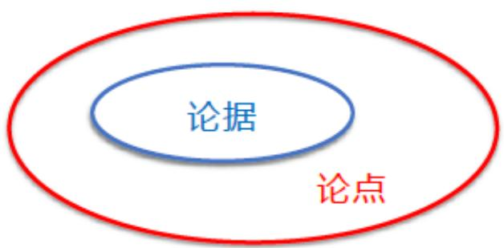
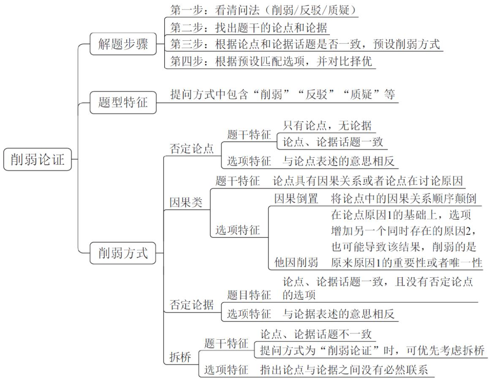
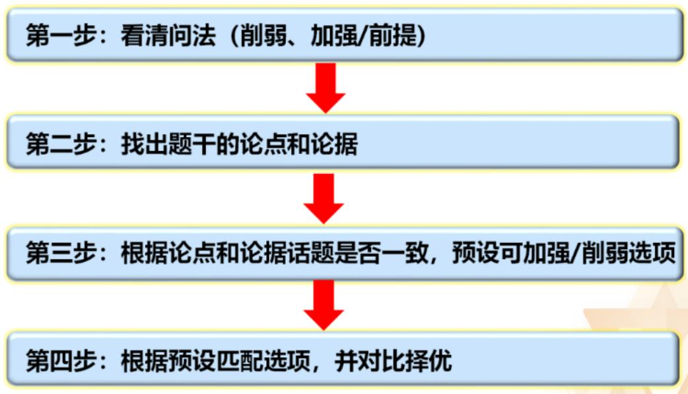

# 精讲精练-判断11

（笔记）

主讲教师：徐来

授课时间：2025.04.22

# 精讲精练-判断11（笔记）

# 判断推理 精讲精练11

# 学习任务：

1. 课程内容：逻辑判断（削弱之否定论据、拆桥，加强之搭桥）  
2. 对应讲义：第  $290 \sim 296$  页  
3. 重点内容:

(1)削弱之拆桥的几种常见题型  
(2) 加强之搭桥的题目特征

# 三、削弱之否定论据

# 论据

# 论证

# 论点

小明长得像吴彦祖

小明一定很帅

A. 小明不帅——否认点  
B. 小明长得不像吴彦祖——否认据

# 题型特征：

1. 题干中有“双方互怼”，经常采用否定论据来削弱  
2. 题干有论据且在找不到否论点和拆桥

选项特征：与论据表述的意思相反

【注意】否定论据：反着论据说。

1. 例：如论据为“小明长得像吴彦祖”，论点是“小明一定很帅”。

(1) A 项: “小明不帅” 是否论点。  
(2) B 项: “小明长得不像吴彦祖” 是否论据。

2. 注意否论据不常考，如果否论点和拆桥都没有，可以对比择优选到否论据，且否论据有特殊题型。

3. 题型特征：

(1) 特殊题型: 题干中有 “双方互怼”, 有两个观点, 一个说 “好”, 一个说 “不好”, 经常采用否定论据来削弱, 因为否论点没有什么意义, 这种情况下一般优先考虑否认据。  
(2) 题干有论据且再找不到否论点和拆桥。

4. 选项特征：与论据表述的意思相反。

【例】（2023 深圳）有人认为，人们购买电动汽车的目的是为了省钱，因为给车辆充电的成本低于加燃油的成本。然而，考虑到电动汽车使用多年后必须更换电池，以及为了安装家用充电桩而必须购买固定停车位，实际上的总支出成本要远高于传统燃油汽车，因此，人们购买电动汽车的目的并非是为了省钱。

如果下列陈述为真，最能削弱上述推论的是：

A. 如今多数电动汽车车主使用公共充电桩充电，并没有购买固定停车位  
B. 更换电池的价格比购置一辆新电动汽车要便宜很多  
C. 电动汽车更符合节能环保的现代生活理念  
D. 国际油价已经见顶，国内油价开始持续下降

【解析】例. 问“最能削弱上述推论的是”，削弱题。注意文段中有“然而”，转折词后面的更重要，说明转折后是论点。

“因此”引导论点：人们购买电动汽车的目的并非是为了省钱。

题干中第一句话“有人认为”引导的观点“人们购买电动汽车的目的是为了省钱”和“因此”后面的观点属于“双方互怼”，两个观点截然相反，削弱可以考虑否论据，因为否论点就是和第一句话意思相同，这样的作为选项就太过简单了，没有出题的意义，一般不会这样设置。

论据：考虑到电动汽车使用多年后必须更换电池，以及为了安装家用充电桩而必须购买固定停车位，实际上的总支出成本要远高于传统燃油汽车。

论据说“必须换电池”，否论据可以说“不需要换电池”；论据说“必须买停车位”，否论据可以说“不需要买停车位”；论据说“实际上的总支出成本要远高于传统燃油汽车”，否论据可以说“总支出成本不高于传统燃油汽车”。否论据否定其中一个即可，不然太长了选项放不下。

A 项：有否定，否定的是论据中的“必须买车位”，是否论据，保留。

B 项：题干中出现比较关系是论据的“实际上的总支出成本要远高于传统燃油汽车”，论据比较的是“电车”和“燃油车”的总支出成本，但选项比较的是“换电池的价格”和“买新电动车的价格”，无关比较，排除。  
C项：说的是电动汽车符合现代生活理念，和是否省钱无关，排除。  
D 项：只提到油价下降，不知道下降多少，不知道和电车比哪个高哪个低，不明确选项，排除。【选 A】

【注意】双方观点“互怼”，优先否论据。

【补充】（2016河南）小丽一大早到公司，发现自己桌子上有一束玫瑰花，同事小王经过仔细分析，认为是客户张总送的，小丽则认为不可能。但是小王说，其他的可能性都被排除了，剩下的可能性不管看起来多荒谬，都是真的。

以下哪项如果为真，最能削弱小王的说法？

D. 小王不可能穷尽所有的可能性

【补充】（2015吉林）一项民意调查结果显示，在1000多名参与投票的网友中，六成网友支持延长女性产假至三年，以便更好地照顾宝宝；四成网友表示反对，认为产假太长，会增加企业负担，进而增加女性就业难度，不可行。

以下哪项如果为真，最能质疑上述反对者的观点？

B. 女性产假延长的成本，由财政或社保基金来承担

【注意】双方观点“互怼”：

1. 2016 河南：小王认为是客户张总送的，小丽认为不可能，是否定小王的观点。小王的论据是“其他的可能性都被排除了，剩下的可能性不管看起来多荒谬，都是真的”，削弱论据可以说“小王不可能穷尽所有的可能性”，否定了论据“其他可能性都被排除了”。  
2. 2015 吉林：有双方观点，六成网友“支持延长女性产假至三年”，四成网友反对，认为“产假太长，会增加企业负担，进而增加女性就业难度，不可行”，要削弱反对者的观点，可以说“女性产假延长的成本，由财政或社保基金来承担”。  
3. 反对者的观点常考两种形式:

(1) 支持者: 好/买; 反对者: 不好/不买。

(2) 支持者: A 导致 B; 反对者: 不是 A, 是 C 导致 B。

# 四、削弱之拆桥

# 论据

# 论证

# 论点

什么是拆桥？

说论点与论据之间没有必然联系

小明身材好 小明特别帅

拆桥：身材好与帅之间没有关系

# 【注意】拆桥：

1. 什么是拆桥：说论点与论据之间没有必然联系。  
2. 例：如论据“小明像吴彦祖”和论点“小明长得帅”。拆桥可以说“长得像吴彦祖和帅不帅没关系”，也可以说“吴彦祖不帅”，则没法从“像吴彦祖”推出“长得帅”。  
3. 如论据“徐来身材好”，论点“徐来特别帅”，存在明显的逻辑漏洞，则拆桥可以说“身材好和帅不帅没有关系”“身材好推不出特别帅”。  
4. 拆桥的概念就是“论据和论点不是一回事”。  
5. 注意上面的例子，“身材好推不出特别帅”没有直接否定“徐来特别帅”，只是拆断论点和论据之间的关系，并不是是否论点，但也可以削弱，只是削弱的是论据与论点的关系。所以说削弱有三种方式，可以削弱论据、削弱论点、削弱论据与论点的关系。  
6. 本质：拆桥不能否定论点，是否定论证，本质是“理由支持不了结论，二者之间不能画等号，二者之间没有必然关系”。找否论点的时候需要明确表达出“论点不成立”，但是拆桥不需要，只要说论据与论点之间没有必然关联即可，只要“长得帅”和“身材好”没有必然关联，就没办法仅仅依靠“身材好”推出“特别帅”这个结果，不能把二者直接画等号。如给出结论“永乐学习好”，因为“永乐地理好”，地理不能代表整体的学习成绩，拆桥可以说“地理不是衡量学习好的唯一指标”，没有直接说明永乐学习不好，但既然地理不是衡量的唯一

指标，就不能根据地理得出学习好的结果，仅仅根据这个论据得出论点是不严谨的。

7. 举例子的时候说的是“身材好推不出特别帅”，而不是“徐来身材好推不出徐来特别帅”，因为拆桥其中一种方式就是“点破其中的漏洞”，对于论点和论据相同的部分可说可不说，因为相同的部分不存在逻辑漏洞，而拆桥只点破逻辑漏洞即可。现在一般的选项都不会提到相同信息，只需要对不同的部分拆断联系即可。

拆桥练习——论点与论据之间没有必然关系

论点：我很幸福

论据：我很有钱

A. 有没有钱和幸不幸福没有必然关系  
B.有钱的人也会不幸福  
C. 有钱不是衡量幸福的唯一指标

选项特征：包含论点和论据中的关键词，并否定论点和论据之间的必然联系

# 【注意】

1. 什么时候考虑拆桥：论点和论据不是一回事（话题不一致）的时候，优先考虑拆桥。  
2. 如论点为“我很幸福”，论据为“我很有钱”，一个是主观的，一个是客观的，论点和论据不是一回事。以下三个选项都是拆桥，力度都一样，只是不同的表现形式。

(1) A 项: 有没有钱和幸不幸福没有必然关系。  
(2) B 项: 有钱的人也会不幸福。  
(3) C项: 有钱不是衡量幸福的唯一指标。

3. 选项特征：包含论点和论据中的关键词，并否定论点和论据之间的必然联系。

什么时候考虑拆桥？

1. 没有否论点的选项

2. 论点与论据话题不一致  
3. 提问方式为“削弱论证”

【注意】什么时候考虑拆桥：

1. 没有否论点的选项。  
2. 论点与论据话题不一致。  
3. 提问方式为“削弱论证”，这种问法可记可不记，因为理论上优先考虑拆桥，但实际考试中也有可能考否论点。

什么时候论点与论据不一致？

a. 在过去的 12 个月中，某市新能源电动汽车的销售量明显上升。与之相伴随的是，电视、网络等媒体对新能源电动汽车的各种报道也越来越多。于是，有电动汽车销售商认为，新能源电动汽车销售量的提高主要得益于日益增多的媒体报道所起的宣传作用。  
b. 上半年全国十大城市的商品房成交量总体呈上涨趋势，因此，未来楼价调控的压力还是很大的。

【注意】什么时候论点与论据不一致：

1. 例 a: 论点和论据话题一致。  
2. 例 b: 论点说的是“楼价的调控压力”, 论据说的是“商品房成交量上涨”,论点和论据话题不一致, 优先考虑拆桥, 可以说 “成交量” 和 “楼价” 不是一回事。

【例 1】（2021 浙江）2020 年的冬天似乎比往年更早到来。还没进入 11 月份，我国部分地区就出现了第一场降雪和气温降至零度以下的情况。有专家据此表示，2020 年的冬天将成为我国 60 年来最冷的一个冬天。

以下哪项如果为真，最能削弱上述论述？

A. 我国其他一些地区的气温并未出现较往年明显下降的迹象  
B. 11 月前出现大雪天气的地区往年几乎没有出现过类似现象  
C. 在全球变暖的情况下，近年来我国冬季平均气温呈上升趋势  
D. 据统计，第一场降雪的时间与整个冬天的平均气温无明显相关

【解析】1. 问“最能削弱上述论述”，削弱题。

“有专家据此表示”引导论点：2020年的冬天将成为我国60年来最冷的一个冬天。

论据：还没进入11月份，我国部分地区就出现了第一场降雪和气温降至零度以下的情况。

论点和论据都在讨论 2020 年的冬天，不同在于，论点说的是“是不是最冷的冬天”，论据说的是“出现了第一场降雪和气温降至零度以下的情况”，论点和论据话题不一致，考虑拆桥，可以说“出现第一场降雪和气温降至零度以下的情况不等于最冷”。

A 项: 不知道 “其他一些地区” 是多大范围, 不知道能不能代表全国, 也不知道下降了多少, 不明确, 没有削弱力度, 排除。  
B 项: “没出现过”不能说明是不是最冷的, 出现大雪天气和气温没有直接关联, 下雪不一定冷 (化雪最冷), 不知道是不是最冷的, 排除。  
C项：说近年来平均气温上升，但近年来平均上升并不是不能下降，和是不是最冷的冬天无关，不能削弱，排除。  
D 项: 直接拆桥, 说 “第一场雪” 和 “冬天平均气温” 无关, “最冷” 说的就是平均气温, 拆桥项, 当选。【选 D】

【注意】论点与论据话题不一致，优先考虑拆桥。

【例2】（2024广东）有研究发现，即使经过多次清洗，塑料水壶瓶身的化学成分还是会释放到水中。而在用清洁剂清洗水壶后，不但没有解决问题，水壶内还增加了多种来自清洁剂的化学成分。有人因此认为，与金属材质水壶相比，塑料水壶更不利于人体健康。

下列选项如果为真，最能质疑上述观点的是：

A. 如果使用不当，金属材质水壶可能会生锈  
B. 在多数情况下, 人们不会用清洁剂清洗塑料水壶  
C. 由于剂量低, 这些化学成分无法对人体产生任何影响  
D. 不同种类的塑料水壶, 其瓶身的化学成分具有显著差异

【解析】2. 问“最能质疑上述观点的是”，削弱题。

“有人因此认为”引导论点：与金属材质水壶相比，塑料水壶更不利于人体健康。

论据：即使经过多次清洗，塑料水壶瓶身的化学成分还是会释放到水中。而在用清洁剂清洗水壶后，不但没有解决问题，水壶内还增加了多种来自清洁剂的化学成分。

论点讨论的是“健不健康”，论据说的是“有没有化学成分”，论点和论据话题不一致，有化学成分不一定影响健康，二者不能直接画等号，可以考虑拆桥，说“有没有化学成分和健不健康不是一回事”。

A 项: “生锈” 不知道对于健康有什么影响, 且题干说的是塑料水壶, A 项说的是金属水壶, 不知道塑料水壶和金属水壶谁更不利于健康, 不能削弱, 排除。  
B 项：就算不用清洁剂，本身也有化学成分，不能削弱，排除。  
C项：说化学成分无法对人体产生任何影响，则不会影响健康，拆桥项，当选。  
D 项：不知道不同种类的差异对健康有什么影响，不能削弱，排除。

可以优先考虑否论点，但论点涉及到比较关系，因此要想否论点，正确答案也得有比较关系，说金属水壶和塑料水壶相比金属水壶更影响健康，或者二者差不多，但选项只有A项提到金属水壶，也没有对二者进行比较，则选项没有否论点，考虑拆桥。【选C】

论点与论据话题不一致如何做题？

削弱：优先拆桥

论点为整体、论据为部分：

拆桥——部分≠整体/其他部分不一样

论据：今年上半年国产手机销量好

论点：今年国产手机会迎来销量高峰

拆桥：

上半年手机销量在全年销量中占比较小

下半年国产手机销量远低于人们的预期

【例1】还没进入11月份，我国部分地区就出现了第一场降雪和气温降至零度以下的情况。有专家据此表示，2020年的冬天将成为我国60年来最冷的一个冬天。

以下哪项如果为真，最能削弱上述论述？

A. 我国其他一些地区的气温并未出现较往年明显下降的迹象

【注意】特殊拆桥：考试中考查拆桥的时候，明显的论点与论据话题不一致的情况比较少，因为太简单了，所以常考查特殊的拆桥。

1. 题干特征：论点为整体、论据为部分。  
2. 拆桥形式：部分不等于整体；其他部分不一样。  
3. 如论据为“今年上半年国产手机销量好”，论点为“今年国产手机会迎来销量高峰”，拆桥可以说“上半年手机销量在全年销量中占比较小”，则不能仅仅根据上半年的情况推出全年的情况；也可以说“下半年国产手机销量远低于人们的预期”，也不能说上半年的情况就是全年的情况，也是拆桥。  
4. 如 “剂量低”, 其实也是部分和整体的关系。  
5. 如例 1, 论点是 “我国……”, 论据是 “我国部分地区……”, 是部分与整体, 如果要拆桥说其他部分, 应该是 “其他部分没有下降”, 但 A 项 “其他一些地区” 也不能代表整体, 因为 “一些” 不知道范围有多大, 这里是易错点。

【例 3】(2022 事业单位) 洋葱的杀菌能力, 主要归功于洋葱中含有的黄酮化合物——槲皮素。有这样一个实验: 对感染幽门螺杆菌后 60 天的豚鼠, 每天给其口服一定剂量的槲皮素, 持续 15 天进行观察。结果表明, 槟皮素对幽门螺杆菌感染的豚鼠有治疗作用, 可减少胃黏膜中的幽门螺杆菌, 并减少炎症反应和脂质过氧化。由此得出结论, 吃洋葱能治疗幽门螺杆菌感染。

下列选项如果为真，最能削弱上述结论的是：

A. 目前尚没有摄入槲皮素改善幽门螺杆菌感染或癌变风险的人群研究  
B. 实验中用的槲皮素与洋葱这种天然食物中的槲皮素浓度存在较大差异  
C. 红皮洋葱中槲皮素的含量为: 外皮含量  $>$  中皮含量  $>$  芯含量  
D. 槐皮素是植物界分布广泛, 具有多种生物活性的黄酮醇类化合物

【解析】3. 问“最能削弱上述结论的是”，削弱题。

“由此得出结论”引导论点：吃洋葱能治疗幽门螺杆菌感染。

题干做了一个实验, 实验是论据: 椭皮素对幽门螺杆菌感染的豚鼠有治疗作用, 可减少胃黏膜中的幽门螺杆菌, 并减少炎症反应和脂质过氧化。

论点说的是“吃洋葱能治疗幽门螺杆菌感染”，论据说的是“槲皮素能治疗幽门螺杆菌感染”，论点和论据说的不一样，且根据背景内容，洋葱中含有槲皮素，是部分与整体的关系，拆桥可以说“槲皮素不能代表洋葱”。

A项：“尚没有”属于“诉诸无知”，是不明确选项，没研究不代表没有用，不能削弱，排除。  
B 项：说的是实验中的槲皮素和洋葱不是一回事，是拆桥，属于“抛开剂量谈效果”，保留。  
C 项：说的是洋葱中不同部位槲皮素含量的比较，和能不能治疗幽门螺杆菌感染无关，排除。  
D 项: 说的是槲皮素的分布、有什么化合物, 和能不能治疗幽门螺杆菌感染无关, 排除。

答疑：论点的主体不一定是人，动物也有可能出现幽门螺杆菌感染，所以本题不会考查鼠和人的拆桥，因为论点包含了鼠的情况；如果论点说“吃洋葱是对于幽门螺杆菌感染患者的福音”，则拆桥可以说“鼠和人不一样”。【选B】

【注意】题目如果涉及到动物，例如论点“吃苦瓜能降血压”，选项中如果举出猴子的例子“吃苦瓜降了血压”是可以的，因为论点并没有明确说明是人类，

选项里的动物也能得病，可以作为例子存在。但如果论点是“吃苦瓜能降人类的血压”，再选择动物就不可以了，所以选项能不能选择和动物相关的，要看论点有没有限制人类。有一种特殊情况，比如论点为“能治疗人类的幽门螺杆菌”，选项如果针对豚鼠来削弱也可以选，因为可以认为是否论据（本题论据中是豚鼠的实验），但这种是比较极端的情况。

【例 4】（2022 青海）俗话说：吃饭不吃蒜，香味少一半；吃肉不吃蒜，营养减一半。然而，某养生专家却说：“大蒜炝锅致癌。”因为大蒜在炝锅时，其所含氨基酸和糖类在高温烹调过程中会发生“美拉德反应”，从而产生丙烯酰胺。如果大蒜切得越薄、受热温度越高、受热时间越长，烹调时的“美拉德反应”就会越剧烈，产生的丙烯酰胺也就越多。丙烯酰胺属于 2A 级致癌物。

以下各项如果为真，最能削弱上述结论的是：

A. 对健康饮食的重视使大部分人很少采用炝锅的方式烹饪  
B. 高温的煎炸和漂烫会对大蒜素产生破坏损失大蒜的营养  
C. 所谓的 2A 级致癌物是指对人类致癌性证据有限的物质  
D. 丙烯酰胺致癌临界点为短时间内使用炝锅蒜 32.7 公斤

【解析】4. 问“最能削弱上述结论的是”，削弱题。

“然而”转折之后的是论点：大蒜炝锅致癌。

“因为”引导论据：大蒜在炝锅时，其所含氨基酸和糖类在高温烹调过程中会发生“美拉德反应”……产生的丙烯酰胺也就越多。丙烯酰胺属于2A级致癌物。

论点说的是“吃大蒜是否致癌”，论据讨论的是“丙烯酰胺致癌”，丙烯酰胺是大蒜的成分，论据与论点是整体与部分的关系，削弱可以说“丙烯酰胺在大蒜中的占比很少”。

A 项：选项说的是“不炝锅”，而题干讨论的是“大蒜炝锅会不会致癌”，选项不在题干的讨论范围内，讨论的话题不一致，排除。  
B 项：选项说的是大蒜的营养，和是否致癌无关，排除。  
C 项：涉及到常识错误，“2A 级致癌物”也是会致癌的，即使证据有限，也不能说不致癌，不能削弱，排除。

D 项：丙烯酰胺要想致癌，需要短时间内炝锅用蒜 32.7 公斤，且还得吃下去，不吃不会致癌，人类短时间之内不会去吃 32.7 公斤的大蒜，选项是用夸张的手法说明丙烯酰胺致癌和大蒜炝锅致癌不是一回事，不至于致癌，是拆桥项，当选。【选 D】

# 丙烯酰胺

# 大蒜

国际癌症研究机构IARC新公布的致癌物分类  

<table><tr><td>类别</td><td>定义</td><td>分类标准</td></tr><tr><td>1类</td><td>对人具有致癌性</td><td>有足够的证据证明对人类具有致癌性；人类暴露有强有力的证据，同时在实验动物中显示出重要的致癌物特征和足够的致癌性证据。</td></tr><tr><td>2A类</td><td>对人很可能致癌</td><td>进行至少两次下列评价，包括至少一次涉及人体和人体细胞或组织的评价：1.人类致癌性证据有限2.实验动物有足够的致癌证据3.强有力的证据显示具有致癌物质的关键特征这类物质或混合物对人体致癌的可能性较高，在动物实验中发现充分的致癌性证据，对人体虽有理论上的致癌性，但实验性的证据有限。</td></tr><tr><td>2B类</td><td>对人可能致癌</td><td>该类别存在下列评价之一的情况：1.人类致癌性证据有限2.动物实验中有足够的致癌证据3.强有力的证据表明具有致癌物关键特征(无论是暴露于人类还是人体细胞)</td></tr><tr><td>3类</td><td>对人的致癌性尚无法分类</td><td>不属于以上任何类别的因素通常被放在这个类别中。当在动物实验和人类致癌性证据均不足时，通常放在此类别；当有强有力的证据表明在实验动物中有致癌性机制但不能在人类身上起作用，在人类身上的证据还不够时，也可放在此类别中。</td></tr></table>

【注意】2A 类致癌物已经是很可能致癌了，如果确定会对人具有致癌性，则是 1 类致癌物，选择到 C 项属于常识错误。且 C 项是对于 2A 类致癌物下定义，下定义的选项很难作为加强或者削弱选项。

“时髦”拆桥

论据：某物质中的一些元素有效论点：某物质有效

削弱: 某物质内该元素含量极少/ 要吃极多

【例 3】论据：槲皮素能治幽门螺杆菌论点：吃洋葱能治幽门螺杆菌

B. 实验中用的槲皮素与洋葱这种天然食物中的槲皮素浓度存在较大差异

【例4】论据：丙烯酰胺属于2A级致癌物论点：大蒜炝锅致癌

D. 丙烯酰胺致癌临界点为短时间内使用炝锅蒜 32.7 公斤

【补充】论据：茶皂素能抑制脂肪酶论点：喝茶能减肥

C. 实验中使用的茶皂素量太大, 按同样比例一般人一天至少需要饮用五公斤干茶叶

以夸张的说法，表达元素在物质中含量小，两者不是一回事

# 【注意】特殊拆桥：

1. 如拓展，论据为“茶皂素能抑制脂肪酶”，论点为“喝茶能减肥”，拆桥可以说“实验中使用的茶皂素量太大，按同样比例一般人一天至少需要饮用五公斤干茶叶”，人一天不可能饮用五公斤干茶叶，是夸张的说法表达元素在物质中含量小，两者不是一回事。  
2. 预设的作用就是不会掉入出题人的“坑”，可能不知道其他选项是怎么错的，但可以知道正确答案是怎么对的。论证题最难的就是设置干扰选项，错误选项一定有很强的干扰性，所以预设是非常重要的。

【例5】（2024国考）冰雪旅游是利用冰雪气候资源体验冰雪文化的旅游活动，包括冰雪观光演艺、运动竞技等内容。H地区冰雪旅游开展了五年，调查显示：在近万名受访者中，有  $90\%$  的人曾以不同形式体验过冰雪旅游，平均每年有 $65\%$  的人体验过  $1\sim 2$  次冰雪旅游，有  $25\%$  的人体验过  $3\sim 4$  次，且这一比例逐年升高。这说明H地区冰雪旅游的需求较高，常态化多次消费正成为H地区越来越多人的选择。

以下哪项如果为真，最能削弱上述结论？

A. 参与调查的受访者几乎都是了解或喜爱冰雪旅游的年轻人  
B. 近五年, H 地区冰雪旅游产业的年均投资额接近, 没有增加  
C.H地区位于北半球北部，冬季较长，许多游客会来此体验冰雪旅游  
D. 为扩大宣传, H 地区许多冰雪项目会推出优惠组合套餐, 吸引人们多次消费

【解析】5. 问“最能削弱上述结论”，削弱题。

“这说明”引导论点：H地区冰雪旅游的需求较高，常态化多次消费正成为H地区越来越多人的选择。

“调查显示”引导论据：在近万名受访者中，有  $90\%$  的人曾以不同形式体验过冰雪旅游，平均每年有  $65\%$  的人体验过  $1 \sim 2$  次冰雪旅游，有  $25\%$  的人体验过  $3 \sim 4$  次，且这一比例逐年升高。

本题在论据的调查中，也是H地区，也是有很多人体验过多次冰雪项目，正常看来应该是论点和论据话题一致的题目，可能会有点考虑否论点，但四个选项均没有否论点，没有对应的答案，则优先考虑拆桥。在拆桥的时候要记住一个特殊题型，是专门针对调查者的拆桥，论点是“H地区成为越来越多人的选择”，而论据是“采访了近万名受访者”，A项中明确提到的是“参与调查的受访者几乎都是了解或喜爱冰雪旅游的年轻人”，调查理论上应该调查所有的人，而如果只调查喜欢冰雪运动的人，则他们一定会多次消费，则本题的受访者不能代表所有的人，这种题型叫做“专门针对调查者是否具有代表性”的拆桥，削弱的是受访者和论点主体的关系。

A项：调查者都是喜欢冰雪旅游的人，则不能代表所有人，是比较特殊的拆桥形式，当选。  
B 项：投不投资和人们是否来消费无关，排除。  
C项：说的是“许多游客会来此体验冰雪旅游”，从大致意思上来看不能削弱。实际上选项也不能加强，只是说“体验冰雪旅游”，但不知道是体验了几次，不知道是一次还是多次，不明确，没有加强或者削弱力度，排除。  
D 项：推出优惠套餐吸引人多次消费不能否定论点的后半句，也不能否定前半句，即使有优惠活动，也可能是因为先有需求，再因为有优惠所以才来，不能削弱，排除。【选 A】

【例5】（2024国考）……调查显示：在近万名受访者中，……这说明……正成为H地区越来越多人的选择。

以下哪项如果为真，最能削弱上述结论？

A. 参与调查的受访者几乎都是了解或喜爱冰雪旅游的年轻人

【补充】（2023四川）……在被调查者中，有  $57\%$  的人在明年有奢侈品项目

消费的计划。该杂志由此推测：明年消费者的消费能力会很强。

A. 该刊物的读者要比一般消费者富有

实验/调查类题目常考拆桥方式——被试/被调查者不具代表性

# 【注意】

1. 拓展：论据说的是“被调查者中有……”，论点说的是“明年消费者的消费能力会很强”，A项说的是“该刊物的读者要比一般消费者富有”，则受访者（特别有钱的人）不能代表所有的消费者，被调查者没有代表性。

2. 实验/调查类题目常考拆桥方式——被试/被调查者不具代表性。

【补充】（2022 山东）泡茶时会泛起一层泡沫，产生这层泡沫的物质叫做茶皂素。研究发现，从摄入后第三个小时开始，摄入茶皂素的老鼠和不摄入的相比，前者血浆中的甘油三酯含量不到后者的一半。这是因为茶皂素起到了抑制脂肪酶活性的作用。研究者据此认为，人们可以通过喝茶来达到减肥的目的。

论点：人可以通过喝茶来达到减肥的目的

论据：茶皂素对老鼠起到了抑制脂肪酶活性的作用

拆桥1：茶皂素  $\neq$  喝茶

拆桥2：抑制脂肪酶活性  $\neq$  减肥

拆桥3：老鼠≠人

【注意】练习：论点为“人们可以通过喝茶来达到减肥的目的”，论据为“茶皂素起到了抑制脂肪酶活性的作用”。

1. 拆桥 1: 茶皂素  $\neq$  喝茶。  
2. 拆桥 2: 抑制脂肪酶活性≠减肥。  
3. 拆桥 3: 老鼠≠人。  
4. 拆桥没有力度强弱之分，只是现在常考的是第一种的整体与部分之分。

# 拆桥小结

什么时候考虑拆桥：

(1)没有否论点  
(2)论点、论据话题不一致

(3)设问方式为削弱“论证”

拆桥的不同形式：今天特别热，因为今天出太阳了

(1)出太阳推不出天气热  
②出不出太阳跟热不热没关系  
③有时候出太阳也不热  
(4)出太阳不是影响气温升高的唯一因素

# 【注意】拆桥小结：

# 1. 什么时候考虑拆桥：

(1) 没有否论点。  
(2) 论点、论据话题不一致。  
(3) 设问方式为削弱 “论证”。

# 2. 拆桥的不同形式：今天特别热，因为今天出太阳了。

(1) 出太阳推不出天气热。  
（2）出不出太阳跟热不热没关系。  
（3）有时候出太阳也不热。  
(4) 出太阳不是影响气温升高的唯一因素。

3. 如论据为“小明像吴彦祖”，论点为“小明很帅”，否论点的特点是只提到论点，即“小明不帅”；否论据的特点是只提到论据，即“小明不像吴彦祖”；拆桥的特点是同时涉及论点和论据的关键词，即“像吴彦祖和帅不帅没关系”“吴彦祖不帅”，“吴彦祖”是论据的词，“帅”是论点的词。

  
【注意】削弱论证总结：重点是上节课讲解的内容。

1. 否论点、因果类是最重要的，因果类尤其是他因削弱在国考和省考中出题概率都很高，出题概率高于因果倒置。  
2. 拆桥是次重点。  
3. 否论据考查不多。

加强类

常见提问方式：

如果以下各项为真，最能加强/支持/赞同/证明上述论断的是？

以下哪项为真，是上述论断成立的前提/假设/必要条件/加强论证？

如果以下各项为真，（最）不能加强上述论断的是？

# 【注意】加强类提问方式：

1. 问“加强/支持/赞同/证明上述论断”。  
2. 特殊问法：问“前提/假设/必要条件/加强论证”。其中最常考的是“前提”，想让“上述论断成立的前提”，还是要加强。

3. 问“最不能加强”，不能直接等于削弱，可以等于削弱+无关，排除加强的选项，选择削弱或无关，如果削弱和无关同时出现，选择削弱（出现的可能性小）。

# 论证题怎么做

# 【注意】

1. 看清提问方式，根据论点和论据的特征优先预设答案。  
2. 前面讲解拆桥，讲解加强时就顺着拆桥的过渡优先讲解搭桥。拆桥是论点和论据话题不一致，搭桥也是论点和论据话题不一致，所以论点和论据话题不一致，优先考虑搭桥。

# 五、加强之搭桥（力度最强）

什么是搭桥？

说论点与论据之间有联系

今天太热  $\rightarrow$  今天适合看电影

天热就要看电影

注意！！！搭桥方向——论据推出论点

①听课可以学到解题技巧，因此听课可以提升考试成绩。

学到技巧就可以提高成绩

(2)一中的教学质量特别高，因为今年文理科状元都在一中。

文理科状元就可以代表教学质量高

# 【注意】搭桥：

1. 什么是搭桥：说论点与论据之间有关系。  
2. 如论据为“今天太热”，论点为“今天适合看电影”，论点讨论适不适合看电影，论据讨论天气热不热，论点和论据话题不一致，拆桥要说“天热不热和看不看电影没有关系”，搭桥是发现逻辑漏洞后要赶紧堵上，可以说“天热就要看电影”，即搭桥。  
3. 搭桥和拆桥一样，只需要把论点和论据中不同的部分建立联系，相同部分不需要考虑，搭桥比拆桥简单，因为没有那么多别的形式，只要说二者相关即可。  
4. 例:

（1）如“听课可以学到解题技巧，因此听课可以提升考试成绩”，一个讨论解题技巧，一个讨论考试成绩，搭桥可以说“学到技巧就可以提高成绩/解题技巧就能提高成绩/解题技巧对提高成绩有帮助”。  
（2）如“一中的教学质量特别高，因为今年文理科状元都在一中”，给出两个选项，分别为①“教学质量高就出状元”和②“出状元就是教学质量高”，应该选择②，搭桥是论据证明论点的过程，所以证明的时候最好说论据能推出论点，“因为”后面是论据，前面是论点，论据推出论点的过程是“有状元就代表教学质量高”。如果有两个选项同时出现“质量高”和“状元”，一般都是由“论据  $\rightarrow$  论点”，但是拆桥中没有这个要求，因为拆桥只要说明二者没有关系即可，不用说二者没关系的顺序，不过拆桥的选项中也是以“论据得不到论点”的选项居多。  
5. 搭桥方向：如果只有一个选项在讨论论点和论据之间的差异关系是有关联的，不需要考虑搭桥方向，直接选择即可；如果有多个选项涉及，需要考虑搭桥方向是“论据  $\rightarrow$  论点”。  
6. 答疑：拆桥和搭桥都是为了把逻辑漏洞点破和补上，只需要找不同点作为逻辑漏洞即可，相同部分不存在差异就不用管。

# 五、加强之搭桥（力度最强）

# 题型特征：

1. 提问方式为前提、假设、必要条件、加强论证时，优先考虑搭桥  
2. 论点与论据话题不一致

# 选项特征：

同时包含论点和论据中的关键词，并肯定论点和论据之间的关系

# 解题思维：

找论点  $\rightarrow$  找论据  $\rightarrow$  去同存异  $\rightarrow$  对比选项

# 【注意】

1. 搭桥有特殊问法，如果不会区分论点和论据话题是否一致，加强题，遇到“前提（尤其）、假设、必要条件、加强论证”时，优先考虑搭桥。拆桥必须要判定话题是否一致，搭桥根据提问方式即可看出来，所以遇到问“前提、假设、必要条件、加强论证”，优先考虑搭桥。  
2. 选项特征：同时包含论点和论据中的关键词。  
3. 解题方法：去同存异，即论点和论据相同的词去掉，不同的词保留，不同的词是二者的区别，建立二者的关联，说二者是一回事即可。搭桥就是找论点和论据的不同，说明二者是同一回事即可，去同存异。

【例1】（2023湖北选调）研究人员研究了糖皮质激素在小鼠自身免疫性疾病中的作用。他们在正常小鼠和缺乏糖皮质激素受体的小鼠中诱导了脱发，两周后，研究人员看到了小鼠们之间的明显差异。正常小鼠的毛发重新长出，但没有糖皮质激素受体的小鼠几乎不能重新长出毛发。研究人员认为，小鼠的毛囊干细胞无法被激活，毛发因而不能重新长出。

以下哪项如果为真，最能支持研究人员的观点？

A. 正常的小鼠体内有糖皮质激素受体  
B. 糖皮质激素有助于激活毛囊干细胞  
C. 要长头发必须要有糖皮质激素  
D. 要长头发必须激活毛囊干细胞

【解析】1. 问“最能支持研究人员的观点”，论点：小鼠的毛囊干细胞无法被激活，毛发因而不能重新长出。论据：没有糖皮质激素受体的小鼠几乎不能重新长出毛发。

论点和论据都提到“毛发无法长出”，为相同部分，论点讨论“毛囊干细胞”，论据讨论“糖皮质激素”，二者不是一回事，论点和论据话题不一致，优先考虑搭桥，去同存异，正确答案应同时提到“毛囊干细胞”和“糖皮质激素”。

A 项：没提论点 “毛囊干细胞”, 排除。  
B 项：论点和论据建立关联，搭桥项，保留。  
C 项: 论据为 “没有糖皮质激素受体的小鼠几乎不能重新长出毛发”, 说明要想长头发就必须有糖皮质激素, 选项和论据意思一样, 重复论据, 排除。  
D 项：论点为 “毛囊干细胞无法被激活, 毛发因而不能重新长出”, 说明要想长毛发就必须激活毛囊干细胞, 重复论点, 排除。

加强中不考重复论点和重复论据，因为对题干没有任何解释作用，加强要解释论点成立或解释论点与论据的关系成立，重复论点和重复论据没有解释作用，所以直接重复不行，一般不选。【选B】

# 【注意】

1. 论点与论据话题不一致，优先考虑搭桥：去同存异。  
2. 例 2- 例 8 都出现 “前提”, 一共 8 道题, 7 道题都是 “前提”, 近几年的国考中, 考查搭桥的基本都是问 “前提”, 老师总结了 2023 年和 2024 年全国考到的所有搭桥题, 只有 3 道题问的是 “加强”, 还都是地方性小考试, 绝大部分考搭桥都是问 “前提”, 所以遇到 “前提” 时, 优先考虑搭桥。

【例2】（2024联考）某研究机构发布的两项关于史前女性的研究表明，史前女性完全有能力胜任狩猎这一艰巨的体力任务，该研究表明，从新陈代谢的角度看，女性的身体更适合耐力活动，消耗同样的能量可以跑更远，因此，同史前男性比，史前女性是更优秀的猎手。

以下陈述如果为真，哪项是上述观点的前提？

A. 我们关于史前女性采集的假设是错误的

B. 史前男性的耐力不足以胜任长时间的狩猎  
C. 在其他方面，史前女性比男性更有优势  
D. 耐力和效率是决定狩猎成败的关键要素

【解析】2. 问“前提”，优先考虑搭桥。“因此”后是论点，前是论据，然后找二者的相同点去掉，论点：同史前男性比，史前女性是更优秀的猎手。论据：从新陈代谢的角度看，女性的身体更适合耐力活动，消耗同样的能量可以跑更远。论点和论据都提到女性和比较，均排除，论点还剩下“猎手”，论据还剩下“耐力、消耗同样的能量可以跑更远”，本题要想搭桥一定是“猎手”和“耐力、同样的能量可以跑更远”搭桥。

A、C 项：没有提到要的内容。  
B 项：提到“耐力”，没有提到其他，且只提到男性，这个性别不重要。  
D 项：同时提到“耐力”和“狩猎”，且“效率”就是“同样的能量可以跑更远”，“耐力和效率”对应论据，“狩猎”对应论点，搭桥项，当选。

有同学认为正确答案应该有比较，讲解比较时主要针对否定论点和补充新论据，但在搭桥时，论点和论据都是女和男比，相同的部分去掉了，搭桥时如果论点和论据都是二者的比较，二者的比较不用提，因为是相同的部分。

A 项：说明采集的信息是错误的，肯定不好的，实验数据都是错的肯定不能加强，排除。  
B 项：论点是“与男性相比，女性更优秀”，选项没提女性，如果针对论点，提到男性就应该提女性，排除。  
C 项：论点就想看女性能不能是猎手，无关选项，排除。【选 D】

# 【注意】

1. 问“前提”，考虑搭桥。  
2. 论点和论据相同部分去掉，不同部分保留。  
3. 选项必须有论点和论据不同的词。

【例 3】(2022 联考) 某大学一项为期 7 年的调查研究发现, 经常喝无糖饮料的人反而更容易长胖。这是由于无糖饮料中的甜味剂降低了大脑对于甜味的反

应，从而促使人们在选择食物时倾向于摄入更多的糖。

要使上述论证成立，还需基于以下哪一前提？

A. 爱喝无糖饮料的人往往很少进行运动锻炼  
B. 摄入的糖分积聚在人体中会转化为脂肪，造成肥胖  
C. 对于儿童来说, 喝多了无糖饮料会影响身高并造成肥胖  
D. 甜味剂在肠道中的吸收速度很慢, 引起人体代谢变化并不明显

【解析】3. 问“前提”，优先考虑搭桥。论点：经常喝无糖饮料的人反而更容易长胖。论据：无糖饮料中的甜味剂降低了大脑对于甜味的反应，从而促使人们在选择食物时倾向于摄入更多的糖。

论点和论据都提到“无糖饮料”，去掉，正确答案一定会提到论点的“长胖”和论据“甜味的反应、摄入更多的糖”。

A 项：题干没有提到“锻炼”，排除。  
B 项: “摄入糖分”是论据的词, “肥胖”是论点的词, 保留。  
C 项：题干没有提到“儿童”，排除。  
D 项：题干没有提到“肠道”，排除。

找到论点和论据不同的词即可。

答疑：

（1）D项：“代谢”和“胖”没有必然关系，排除。  
(2) 为什么去同: 因为重复没有意义, 要把不同的地方建立联系, 搭桥就是要补 “窟窿”, 拆桥就是点破 “窟窿”, 所以把不同的点破或建立联系。【选 B】

【注意】问“前提”，优先考虑搭桥，去同存异。

【例4】（2023联考）随着网络文学的兴盛，近年来传统文学开始主动汲取网络文学叙事资源，出现了小说叙事上的文类融合现象。传统文学之所以进行自我革新，其原因在于传统文学寻求自身的突破。可见，直面全新的社会现实、表现新时代的精神是传统文学自我革新的根本原因。

上述论证的成立需要补充以下哪项作为前提？

A. 传统文学借鉴网络文学叙事资源，强调现实感和可读性，会获得更多的读者  
B. 一直以来, 传统文学都将直面社会现实、表现时代精神作为自身努力的方向  
C.传统文学的市场空间不断被网络文学所挤压，使得传统文学寻求自身的突破  
D. 直面全新的社会现实、表现新时代的精神使得传统文学不断寻求自身的突破

【解析】4. 问“前提”，考虑搭桥。“可见”后面是论点，前面是论据，论点：直面全新的社会现实、表现新时代的精神是传统文学自我革新的根本原因。论据：传统文学之所以进行自我革新，其原因在于传统文学寻求自身的突破。

论点和论据同时提到“自我革新”，不重要，论点还有“直面全新的社会现实、表现新时代的精神”，论据还提到“自身的突破”。

A 项：没提到“自身的突破”，排除。  
B 项: 只提到 “直面现实和精神”, 没提到 “自身的突破”, 排除。  
C项：提到“自身的突破”，但没提到“直面全新的社会现实、表现新时代的精神”，排除。  
D 项：提到“直面全新的社会现实、表现新时代的精神”和“自身突破”，当选。

答疑：

(1) C 项: 说明传统文学被网络文学挤压, 所以要寻求自身突破, 论据讨论传统文学自我革新的原因是寻求自身突破, “网络文学” 不在论点和论据中, C 项不能选, 而且即使把文段前面都当成论据, C 项也没有提到论点的 “社会现实、新时代精神”, 不能选择 C 项。  
(2) A 项: 没有提到什么是自我革新的根本原因, 排除。  
（3）拆桥经常变换形式，用这个方法不是特别稳妥，但搭桥没有形式。不需要考虑顺序，因为只有一个选项搭桥，选择即可。不管是国考、省考、公安联考，搭桥在考试中只考查1道题，这种题的典型特征就是“前提”的问法，遇到“前提”的问法，用这个方法做非常快。

(4) B 项: 没提到是否是自我革新的原因, “努力方向” 和原因不是一回事, 排除。  
(5) “随着……”是背景。【选 D】

【例5】（2022天津）英国第一次大规模人口迁移发生在6000年前，这些人的祖先大多来自一个被称为早期欧洲农民的群体。第二次迁徙发生在青铜时代早期，迁徙群体的祖先最终产生了英格兰和威尔士至少  $90\%$  的基因组成。为了确定第三次人口迁移，研究团队对考古遗骸的近800个基因组进行了测序，发现从青铜时代早期到晚期，英格兰和威尔士早期欧洲农民的血统平均比例从  $30\%$  左右增加到  $36\%$  左右。而在铁器时代，这一比例稳定在人口的近一半。研究人员据此表示，他们发现了法国人大规模移民至英国的证据。

要得到上述研究推论，还需基于以下哪一前提？

A. 迁徙的法国人中拥有一定比例的早期欧洲农民血统  
B. 青铜时代的中后期是英国与包括法国在内的西欧联系紧密的时期  
C. 基因测序利用的遗骸是在英国、西欧的考古遗址中发现的  
D. 今天生活在英格兰和威尔士的人比青铜时代早期的人拥有更多的早期欧洲农民血统

【解析】5. 问“前提”，考虑搭桥。“据此表示”引导论点：他们发现了法国大规模移民至英国的证据。“据此表示”前是论据，论点不难，只有一句话，难在论据。题干的论点短，论据长时，就看论点，论点强调“法国人移民到英国”，只需要去前面找提到谁、没提到谁，前面提到英国的人口迁移，通篇没有提到“法国人”，所以就能知道论点和论据中的不同，不知道论据中的差异词，但论点中的差异词一定是“法国人”，正确答案至少要提到“法国人”。

A项有“法国人”，B项有“法国”，均保留。C、D项没有提到“法国人”，一定和论点没有关联，均排除。

在文段前面找，提到“早期欧洲农民”就选择A项，提到“青铜时代的中后期与西欧联系紧密”就选择B项，题干前文没有提到“西欧”，但提到“早期欧洲农民”，A项当选。

梳理题干意思：论据对不同时期迁徙到英国的人进行研究，发现早期欧洲农

民血统比例提升，所以得出是法国人移民至英国。论点为“法国人移民至英国”，前文提到人口迁徙，就是移民，所以“移民至英国”出现过不重要，“法国人”在前文没有出现过，“法国人”是关键词，正确答案一定要有“法国人”，只有A、B项提到和法国相关，且题干前文提到A项“早期欧洲农民”，没有提到B项“与西欧联系紧密”，B项排除。论据说明对于英国人不同时间：研究发现，早期欧洲农民比例上升，所以是法国人来了，A项“法国人中拥有一定比例的早期欧洲农民血统”，建立二者的联系，A项当选。

# 答疑：

(1) 题干前文提到的是 “青铜时代早期到晚期”, 没有专门提到 “青铜时代的中后期”, 也没有提到与西欧的联系。  
(2) 题干前文意思差不多, 严格来说从 “研究团队对考古遗骸……” 开始才是论据, 因为从这里开始才有研究团队的研究, 前面当背景更好, 不过前面涉及一次迁徙、二次迁徙、三次迁徙, 是三次相同的迁徙, 放在一起也可以。【选 A】

# 【注意】

1. 论点和论据都短，找论点和论据的不同词，找选项。  
2. 如果论点和论据有一个长：论据长，就看论点；论点长，就找论据，主要是为了找二者的不同，谁短就先看谁。

【例6】（2022四川）一些对生态和气候感兴趣的古生物学研究者发现，中国东部与国外相比，虽然化石产出的具体时期有所差异，但埋藏于紫红色岩石地层的恐龙骨骼化石的埋藏相具有相似性，这是因为晚白垩世全球古生态及古气候是相似的。在中国，埋藏的恐龙骨骼化石种属以鸟脚类鸭嘴恐龙与兽脚类恐龙为主，埋藏环境主要为冲积扇与河流环境；美洲以鸭嘴龙科为主，埋藏环境主要为平原。

要得到上述古生物学研究者的结论，需要补充的前提是：

A. 晚白垩世的河流与平原具有不相同的埋藏环境  
B. 中国鸟脚类鸭嘴恐龙与美洲的鸭嘴龙科是不同种族

C. 骨骼化石在不同地层的埋藏学特征取决于生态及气候  
D. 晚白垩世全球各地的紫红色岩石地层具有相同的埋藏环境

【解析】6. 问“前提”，考虑搭桥，去同存异。“这是因为”引导论据，前面是论点，论点：中国东部与国外相比，虽然化石产出的具体时期有所差异，但（转折词后是重点）埋藏于紫红色岩石地层的恐龙骨骼化石的埋藏相具有相似性。论据：晚白垩世全球古生态及古气候是相似的。

论点提到“紫红色岩石地层、埋藏相具有相似性”，论据提到“晚白垩世、生态及气候”，搭桥可以在这些词中建立联系。

A 项: “河流” 和 “平原” 都是文段最后一句话的内容, 没有涉及论点的内容, 排除。  
B 项：在论据里面进行表述，没有提到论点的内容，不是搭桥，排除。  
C项：提到“生态及气候、埋藏学特征（埋藏相具有相似性）”，建立了二者的联系，保留。  
D项：干扰项，很多同学认为D项是搭桥，与C项比较，C项将“生态气候”和“埋藏学特征”建立联系，论点和论据还剩“晚白垩世”与“紫红色岩石地层”，D项要想搭“晚白垩世”与“紫红色岩石地层”的桥，建立联系应该说“紫红色岩石地层仅出现在晚白垩世时期”，但D项不是这样说的，“有相同的埋藏环境”不等同于“埋藏具有相似性”，环境相同不代表恐龙化石都一样，排除。

如果觉得两个选项都可以，考虑真正搭桥应该怎么说。

答疑：

(1) 有同学 “紫红色岩石地层仅出现在晚白垩世时期” 是 “论点  $\rightarrow$  论据”, 只要说二者有联系即可, 是将 “紫红色岩石地层” 和 “晚白垩世时期” 画等号。  
(2) D 项说的是 “埋藏环境”, C 项 “埋藏学特征” 是化石的埋藏具有相似性, 而 “埋藏环境” 不能对应相似性。【选 C】

【注意】论点、论据哪个较短，就在那里找关键词。

【补充】（2023国考）杂草稻是稻田里不种自生、伴随栽培稻生长的一种“杂草型稻”。研究者在杂草稻基因组中发现了与干旱胁迫下叶片干枯程度显著

相关的基因——PAPH1。消除该基因后的株系，其叶肉细胞膜内外钙离子和钾离子流速降低；而 PAPH1 基因过度表达的株系，其叶肉细胞膜内外钙离子和钾离子流速增加。因此研究者指出，PAPH1 基因在杂草稻抗旱性中发挥关键作用。

上述论证的成立须补充以下哪项作为前提？

A. 正常状态下的栽培稻长期生长在有水的环境中, 不含 PAPH1 基因  
B. 叶肉细胞膜内外钙离子和钾离子的流速也促进 PAPH1 基因的表达  
C. 叶肉细胞膜内外钙离子和钾离子流速越高, 杂草稻的抗旱性越强  
D. 杂草稻与栽培稻存在基因交流, 其演化与栽培稻选育品种密切相关

【解析】拓展 1. 论证题特别喜欢做某一项研究实验，而研究实验往往会涉及字母、数字，可以优先看字母、数字，因为识别度更高。问“前提”，优先考虑搭桥。论点短，论点讨论“PAPH1基因”和“抗旱性”。先看前面是否出现过字母，前面出现过“PAPH1基因”，所以“PAPH1基因”不重要，论点中不同的词是“抗旱性”，所以正确答案必有“抗旱性”，A、B、D项都没有，C项有，且C项和论据都提到“流速”，C项当选。【选C】

【补充】（2022联考）伤害感受神经能够对造血干细胞动员进行调控，增强造血干细胞的黏附或迁移能力，降钙素基因相关肽（CGRP）是伤害感受神经元主要分泌的神经递质分子。研究者发现，给予CGRP可以显著增强造血干细胞动员。CGRP可以直接影响造血干细胞，诱导细胞表面形成CALCRL和RAMP1蛋白形成的二聚体受体，并促进造血干细胞进入血管。研究专家认为，吃辣可以促进造血干细胞动员。

如果上述结论为真，需要补充的前提是：

A. 骨髓神经纤维中高达  $77\%$  都是伤害感受神经元  
B. 辛辣食物导致的 “辣味” 是一种痛觉, 会激活伤害感受神经  
C. 辣的食物能够促进消化液的分泌, 增加消化酶的活性, 加速胃肠道蠕动  
D. 造血干细胞会在神经的调控之下, 由骨髓释放进入循环, 对损失的血细胞进行补充

【解析】拓展 2. 本题论据长, 看论点, 论点: 吃辣可以促进造血干细胞动员。论据提到字母, 但选项没有提到字母, 论点讨论 “吃辣” 和 “造血干细胞”,

前面提到“造血干细胞”，“造血干细胞”不重要，所以正确答案一定有“吃辣”，A、D项没有“辣”，B、C项都有“辣”，答案一定在B、C项中。

B 项是 “伤害感受神经”, C 项是 “消化酶和肠道蠕动”, 去论据中找, 有 “伤害感受神经”选择 B 项,有“肠道蠕动”选择 C 项,论据没有“肠道蠕动”, B 项当选。【选 B】

【补充】（2025 国考）某项研究显示，与未接触空气污染的人相比，暴露于空气污染中的人死于乳腺癌的风险增加了  $80\%$  ，死于其他各类癌症的风险增加了  $22\%$  。该研究团队由此认为，这可能与空气污染物中的 PM2.5 有关，因为 PM2.5会导致脏器的炎症和氧化应激反应。

以下哪项如果为真，最可能是上述专家预设的前提？

A. 脏器的炎症和氧化应激反应是明确的致癌危险因素  
B. PM2.5在大气成分中含量较少，但对空气质量有重要影响  
C. 吸食香烟和电子烟等都可以将 PM2.5 直接输送到肺部  
D. 女性更易接触烹饪油烟，其中含有大量的 PM2.5

【解析】拓展 3. 问 “前提”, 考虑搭桥。“因为” 引导论据: PM2.5 会导致脏器的炎症和氧化应激反应。前文有 “PM2.5”, 则 “PM2.5” 不重要, 论点还剩下 “这”, 论据还剩下 “炎症和氧化应激反应”, 正确答案一定有 “炎症和氧化应激反应”, 对应 A 项, A 项还提到 “致癌”, 文段前面有 “癌症各种风险”, A 项当选。

解法二：论点和论据都有“PM2.5”，则“PM2.5”不重要，B、C、D项均排除，D项当选。【选A】

翻译类“搭桥”题

问：前提、假设、必要条件、加强论证

论据：甲  $\rightarrow$  乙+乙  $\rightarrow$  丙

论点：甲  $\rightarrow$  丙

箭头前一致，补——论据词  $\rightarrow$  论点词

论据：甲  $\rightarrow$  乙+丙  $\rightarrow$  甲

论点：丙→乙

箭头后一致，补——论点词  $\rightarrow$  论据词

论点、论据均有翻译词解题思路：

1. 翻译题干论点、论据  
2. 箭头前一致，论据词  $\rightarrow$  论点词；箭头后一致，论点词  $\rightarrow$  论据词

【注意】加强题，尤其是搭桥题，如果出现论点和论据都需要翻译的情况，往往为翻译类“搭桥”题。

1. 类型：

(1) 论点为 “甲  $\rightarrow$  丙”, 论据为 “甲  $\rightarrow$  乙”, 此时需要补充前提条件使得论点成立, 考查递推关系, 如果 “甲  $\rightarrow$  乙”, 要想得到论点 “甲  $\rightarrow$  丙”, 就补充 “乙  $\rightarrow$  丙”, 所以 “乙  $\rightarrow$  丙” 是选择的答案。  
(2) 论点为“丙  $\rightarrow$  乙”，论据为“甲  $\rightarrow$  乙”，此时如果给论据补“甲  $\rightarrow$  丙”，是不可以的，因为论据“甲  $\rightarrow$  乙”和“甲  $\rightarrow$  丙”无法串联，应该补充“丙  $\rightarrow$  甲”，这样与论据“甲  $\rightarrow$  乙”，可得“丙  $\rightarrow$  乙”，论点成立。

2. 典型特征：论点和论据需要翻译（考查最多的是论点和论据中有“所有”，在逻辑中为几个直言命题构成的推断关系，三段论）。  
3. 论点、论据均有翻译词解题思路：箭头前一致，需要补的答案是“论据词  $\rightarrow$  论点词”；箭头后一致，需要补的答案是“论点词  $\rightarrow$  论据词”。这是快速做题口诀，正确答案是“论点词  $\rightarrow$  论据词”，最终还是为了和论据串联得到论点，和“论据  $\rightarrow$  论点”不冲突，因为最终还是补充条件让论据能得到论点，只不过条件是“论点词  $\rightarrow$  论据词”。  
4. 第一，记忆口诀；第二，先把论点和论据都翻译下来，相同的词去掉，如论点为“甲→丙”，论据为“甲→乙”，剩下乙和丙，要么是“乙→丙”，要么是“丙→乙”，谁能和论据串联就选谁，因为最终要和论据穿串得到结论；如论点为“丙→乙”，论据为“甲→乙”，相同词去掉，剩下甲和丙，要么是“甲→丙”，要么是“丙→甲”，谁能和论据串联就选谁，“甲→丙”不能串联，所以选择“丙→甲”。

问：前提、假设、必要条件、加强论证

论据：如果考上公务员，你就要请我吃饭 考上  $\rightarrow$  请吃饭

论点：如果考上公务员，你就要破费了 考上  $\rightarrow$  破费

补：请吃饭→破费

论据：如果今天下雨，我们就不出去玩耍 下雨  $\rightarrow$  不出去

论点：如果起风了，我们就不出去玩耍 起风  $\rightarrow$  不出去

补：起风  $\rightarrow$  下雨

# 【注意】

1. 论点为“考上→破费”，论据为“考上→请吃饭”，箭头前一致，需要补“论据词→论点词”，即“请吃饭→破费”。  
2. 论点为“起风  $\rightarrow$  不出去”，论据为“下雨  $\rightarrow$  不出去”，箭头后一致，需要补“论点词  $\rightarrow$  论据词”，即“起风  $\rightarrow$  下雨”。

【例7】（2024辽宁）所有单纯依靠运气成分获胜的都不能成为电竞游戏，所有虚拟环境中的智力和体力的对抗都是电竞游戏。所以，所有虚拟环境中的智力和体力的对抗都不是无规则的竞技。

上述论证的成立需要补充以下哪项作为前提？

A. 所有电竞游戏都是无规则的竞技  
B. 有些虚拟环境中的智力和体力的对抗是单纯依靠运气成分获胜的  
C. 有些无规则的竞技是虚拟环境中的智力和体力的对抗  
D. 所有无规则的竞技都是单纯依靠运气成分获胜的

【解析】7. 问“前提”，考虑搭桥。论点和论据都出现“所有”，需要翻译，论点翻译为“对抗  $\rightarrow$  无规则”；论据翻译为①“运气  $\rightarrow$  电竞”②“对抗  $\rightarrow$  电竞”。

论据可以串联, ② “对抗  $\rightarrow$  电竞”, “电竞” 对 ① 否后推否前, 可以推出 “-运气”, 论据串联的首尾为 “对抗  $\rightarrow$  -运气”。论点和论据箭头前一致, 补 “论据词  $\rightarrow$  论点词”, 即 “-运气  $\rightarrow$  -无规则”, 带 “-” 看着麻烦, 进行变换, 变为 “无规则  $\rightarrow$  运气”, D 项当选。

梳理：问“前提”，考虑搭桥。论点有“所有……都……”，论据有两个“所有”，翻译论点和论据。论据翻译为①“运气→-电竞”②“对抗→电竞”，可以穿串，②箭头后的“电竞”对于①否后推否前，可以推出“-运气”，论据串

联可得“对抗  $\rightarrow$  运气”，论点翻译为“对抗  $\rightarrow$  无规则”，箭头前一致，需要补“论据词  $\rightarrow$  论点词”，即“-运气  $\rightarrow$  -无规则”。

A 项：没提“运气”，排除。  
B 项：没提“无规则”，排除。  
C 项：没提“运气”，排除。  
D 项：提到“无规则  $\rightarrow$  运气”，和“-运气  $\rightarrow$  -无规则”一样，否后推否前即可，二者是相等的，当选。

答疑：

(1) D 项翻译为 “无规则  $\rightarrow$  运气”, 将论据 “对抗  $\rightarrow$  -运气” 逆否可得 “运气  $\rightarrow$  -对抗”, 与 D 项串联可得 “无规则  $\rightarrow$  -对抗”, 逆否可得 “对抗  $\rightarrow$  -无规则”。  
（2）不用“消消乐、所有、有的”来排除，可能题干和论据出现“有的”，最好把方法学会，无论选项怎么变都会。  
(3) 论据给出两句话, 一般需要穿串。如果论据的两句话能穿串, 大概率需要穿串; 如果论据的两句话不能穿串, 如 “甲  $\rightarrow$  乙, 甲  $\rightarrow$  丙”, 大概率用其中某一句话和论点搭桥即可。【选 D】

【注意】箭头前一致，补——论据词  $\rightarrow$  论点词。

【补充】（2021 山东）在成功的道路上，所有捷径都是弯路，所有弯路都是必经之路。因此，依附强者并不是成功道路上的捷径。

补充以下哪项作为前提，可以使上述结论成立？

A. 所有捷径都是必经之路

B. 依附强者不是必经之路

C. 所有弯路都不是捷径

D. 依附强者都是弯路

【解析】拓展。问“前提”，考虑搭桥。出现“所有”，为翻译的词，“因此”后是论点，前是论据，论据翻译为①“捷径  $\rightarrow$  弯路”②“弯路  $\rightarrow$  必经之路”。论点翻译为“依附强者  $\rightarrow$  捷径”。

论据可以穿串, 大概率需要串在一起, 论据就变成 “捷径  $\rightarrow$  必经之路”, 最好让 “捷径” 同时在前/后, 将论据进行逆否, 转化为 “- 必经之路  $\rightarrow$  - 捷径”, 此时箭头后一致, 补 “依附强者 (论点词)  $\rightarrow$  - 必经之路 (论据词) ” , 正确答

案为“依附强者不是必经之路”，B项当选。

# 答疑：

（1）有同学认为论据出现两个“弯路”，不重要，论据出现“捷径、必经之路”，论点也有“捷径”，“捷径”不重要，正确答案一定有“必经之路”和“依附强者”，B项当选。这个做法本道题可以，但如果选项改变，出现“必经之路不是依附强者”“依附强者是必经之路”“必经之路是依附强者”，这样容易绕懵，做翻译题看选项容易看懵，所以做翻译题建议先翻译解题。  
(2) 删除 “弯路” 是因为论据需要穿串, 一般看串联后的首尾, 中间不重要。  
（3）将论点逆否为“捷径  $\rightarrow$  依附强者”，箭头前一致，需要补“论据词  $\rightarrow$  论点词”，即“必经之路  $\rightarrow$  依附强者”，还是选择B项，将B项逆否一下即可。【选B】

【注意】箭头后一致，补——论点词  $\rightarrow$  论据词。

【例8】（2023广东）为促进员工交流，营造积极参加体育锻炼的良好氛围，某单位组织了跑步、羽毛球、排球、篮球等多支运动队。已知：

（1）所有员工至少参加了跑步队或羽毛球队中的一个；  
（2）参加了跑步队的员工都没有加入篮球队；  
（3）财务部小丽加入了篮球队。

工会委员了解上述情况后推断，小丽也加入了排球队。

要使这一推断成立，可以补充的前提是：

A. 小丽没有参加跑步队  
B. 小丽没有加入羽毛球队  
C. 加入了排球队的人都参加了羽毛球队  
D. 未加入排球队的人都没有参加羽毛球队

【解析】8. 论点：小丽加入排球队。论据类似翻译推理题，本题也是结合翻译推理的做法，先翻译题干条件：

（1）跑步或羽毛球。

（2）跑步  $\rightarrow$  -篮球。  
(3) 小丽加入篮球队。

“小丽加入篮球队”是对条件 (2) 的否后, 否后必否前, 可以推出 “- 跑步”; “跑步或羽毛球” 说明羽毛球和跑步至少做一个, “- 跑步” 结合否一推一, 可得论据 “小丽加入羽毛球队”; 论点为 “小丽加入排球队”, 论点和论据都有 “小丽”, 不重要, 搭桥要有 “羽毛球” 和 “排球”, A、B 项没有提; C、D 项都有 “排球” 和 “羽毛球”, 考虑搭桥方向, 一定是 “论据  $\rightarrow$  论点”, 正确答案是 “羽毛球  $\rightarrow$  排球”。

C 项：翻译为 “排球  $\rightarrow$  羽毛球”, 方向反了, 排除。

D 项: “不 (未) ……不 (没有) ……” 后推前, 翻译为 “羽毛球  $\rightarrow$  排球”,和要的一样, 当选。

A 项：论据可得小丽没有参加跑步队，A 项是由此推出，但题干问不是由此推出，问的是补充前提，排除。

B 项：论据已经推出小丽加入羽毛球队，B 项是否论据，排除。

答疑：

（1）逻辑中搭桥指论据可以推出论点的过程，逻辑中论据是理由，一定是理由来解释结果。  
(2) 即使看箭头前和箭头后也是箭头前一致, 找 “论据词  $\rightarrow$  论点词”, 也是 D 项。【选 D】

【注意】问“前提”，优先考虑搭桥，去同存异。

搭桥小结（力度最强）

提问中出现前提、假设、论证时，优先考虑搭桥

(2024 广东) 要使上述推理成立, 需要补充的前提条件是:  
（2024广东）以下属于这一推论暗含前提的是：  
(2024 国考) 以下哪项可能是上述科学家论证的前提?  
(2023 联考)上述论证的成立需要补充以下哪项作为前提?  
(2023 国考) 上述论证的成立须补充以下哪项作为前提?

(2021 联考)要使上述论证成立, 需要补充下列哪项作为前提?  
(2022 联考) 如果上述结论为真, 需要补充的前提是:  
(2024 浙江) 以下哪项如果为真, 可以成为美术馆馆长判断的前提?

【注意】上述都是近几年考的题，都是问“前提”，搭桥最喜欢的问法是“前提”，因此遇到“前提”，优先考虑搭桥。

搭桥小结（力度最强）

选项特征：涉及论点与论据关键词

例 1. 论据: 相关部门拓宽了消费者的投诉渠道

论点：直播带货中违法现象将有所减少

A. 拓宽消费者投诉渠道有助于遏制直播带货中的违法现象

例 2. 论据: 小苏参加版画实践

论点: 小苏参加手工剪纸

C. 参加了手工剪纸活动的也参加了版画实践课 手工剪纸  $\rightarrow$  版画实践  
D. 不参加手工剪纸活动的都不参加版画实践课 版画实践→手工剪纸

搭桥结合翻译：注意搭桥方向！

# 【注意】搭桥：

1. 如例 1, 问 “前提”, 找到论点和论据, 论据讨论 “拓宽投诉渠道”, 论点讨论 “违法现象减少”, 答案一定要有 “投诉渠道” 和 “违法现象”。  
2. 如例 2, 论点讨论 “手工剪纸”, 论据讨论 “版画实践”, 如果有两个选项同时涉及 “版画” 和 “手工剪纸”, 考虑搭桥方向, 一定是 “论据  $\rightarrow$  论点”, 选择 D 项。

# 当堂检测

【测验题 1】对于要不要读《红楼梦》，许多学者认为：读《红楼梦》有助于了解中国传统文化，因此年轻人都应该读《红楼梦》。

以下属于这一推论暗含前提的是：

A. 《红楼梦》是中国古典文学著作  
B. 年轻人都应该了解中国传统文化

C. 大部分学者都读过《红楼梦》  
D. 《红楼梦》与中国文化相辅相成

【解析】1. 课堂正确率为  $86\%$  。问“前提”，论点：年轻人都应该读《红楼梦》。论据：读《红楼梦》有助于了解中国传统文化。“《红楼梦》”不重要，还剩下“传统文化”和“年轻人”，B项当选。

只有一个选项涉及“年轻人”和“传统文化”，不需要考虑方向。【选B】

【测验题 2】今年持续暴雨，各地花椒严重减产。由此可以预见，今年的花椒价格将会显著上涨。

要使上述推理成立，需要补充的前提条件是：

A. 花椒价格仅受到产量的影响  
B. 全国花椒需求量与往年持平  
C. 花椒的价格不会影响群众的购买意愿  
D. 历年花椒价格的波动都与其产量密切相关

【解析】2. 课堂正确率为  $43 \%$  。问“前提”，搭桥。论点：今年的花椒价格将会显著上涨。论据：今年持续暴雨，各地花椒严重减产。论点讨论“花椒价格”，论据讨论“减产”，答案一定有“价格”和“产量”。

A、B项：都提到“价格”和“产量”，均保留。  
B、C项：没有提到“价格”和“产量”的关系，均排除。

有同学选择 D 项是因为觉得 A 项太绝对，但论证题要的是绝对，所以才会有最能加强/削弱，A 项是“仅受到”，B 项是“密切相关”，A 项绝对，A 项当选。

力度比较：整体  $>$  部分；越接近论点越好；还有越绝对越好。

A 项: “仅受到产量的影响”说明每年都这样, 保留。  
D 项：只说了 “历年”, 不知道今年是不是这样, 排除。【选 A】

【测验题3】二氧化碳的排放量剧增导致全球气候变暖，使珠穆朗玛峰所在的喜马拉雅地区冰川面临急剧缩小的危险。研究显示，珠峰海拔在5000米到6000米的冰川集中区域出现快速融化的现象，这些地方将只在冬季而不是在温暖的季节时看到结冰。专家推论说，根据未来的气候变化趋势，喜马拉雅地区的冰川减

少的速度还有可能加快，如果本世纪内气温如预计的一样继续升高，该地区的冰川最终将消失殆尽。

如果以下各项为真，最能削弱上述论证的是：

A.喜马拉雅冰川每年缩小约  $0.1\%$  到  $0.6\%$  
B.喜马拉雅其他地区冰川对温度不敏感  
C. 过去 50 年珠峰周边冰川覆盖面积减少了  $33.3\%$  
D. 珠穆朗玛峰 7000 米以上区域未出现冰川快速融化现象

【解析】3. 课堂正确率为  $47 \%$  。问“最能削弱上述论证的是”，论点讨论“喜马拉雅山地区”，论据讨论“珠峰海拔在5000米到6000米的冰川”，为整体与部分的关系，削弱论证、整体与部分，优先考虑拆桥，要么说“这个冰川占比少”，要么说“其他地区不这样”。

A 项：不知道是多还是少，排除。

C 项：50 年减少  $33\%$  还是减少很多，排除。

纠结B、D项，B项是其他地区都不这样；D项是7000米以上不这样，7000米以上和5000米到6000米谁大谁小不知道，B项当选。

只看“喜马拉雅其他地区”和“珠穆朗玛峰7000米以上区域”，“喜马拉雅其他地区”的范围大，是喜马拉雅山上有珠穆朗玛峰，珠穆朗玛峰上有5000到6000米，这部分范围很小，整体>部分，B项当选。【选B】

# 【答案汇总】

削弱之否定论据：A

削弱之拆桥 1-5: DCBDA

加强之搭桥 1-5: BDBDA; 6-8: CDD

遇见不一样的自己

Be your better self