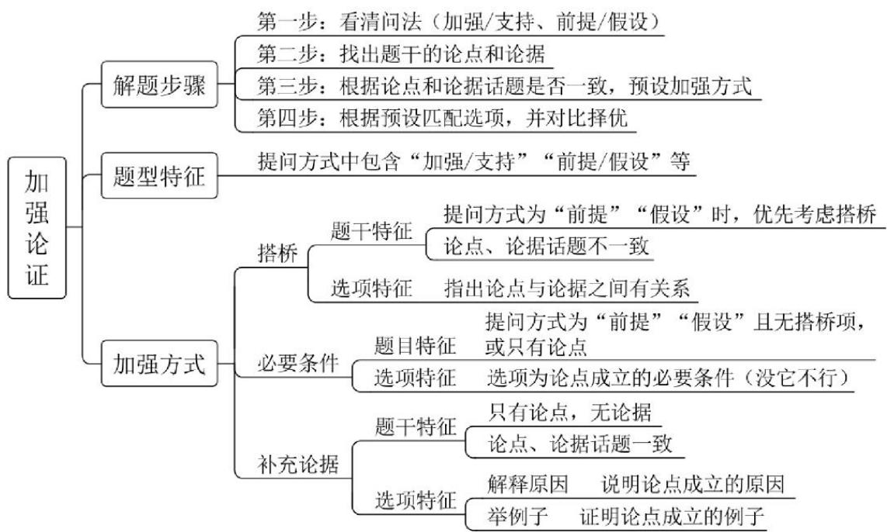
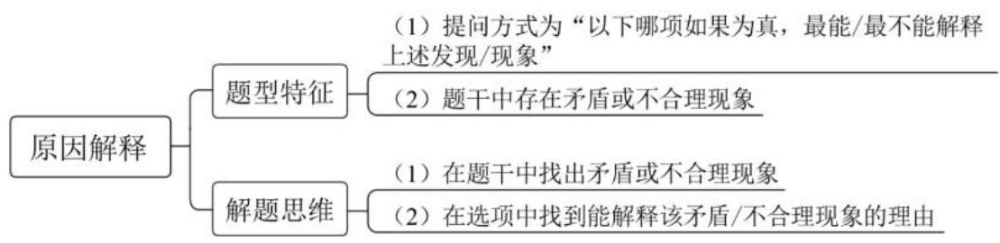

# 精讲精练-判断12

（笔记）

主讲教师：徐来

授课时间：2025.04.23

# 精讲精练-判断12（笔记）

【注意】判断最后一节课，本节课没有难点，上节课拆桥是难点，翻译类的搭桥也比较难。本节课先讲加强，再讲原因解释和日常结论。本节课讲的加强，是方法精讲的基础课，适用于考试的  $70 - 80\%$  ，考试中  $20\%$  的难题会超出讲解的范围，是后续遇到真题，题目讲解所要做的事情，先熟悉加强是什么。

# 六、加强之必要条件

题目特征：提问方式为“前提”“假设”且无搭桥项，或只有论点

选项特征：选项为论点成立的必要条件（没它不行）

梦圆老师是我的女神。

A. 梦圆老师是个女的  
B. 梦圆老师爱吃火锅

论点：多吃芹菜有助于高血压患者控制血压。

A. 芹菜中利于控制血压的营养物质能够被人体吸收  
B. 常吃芹菜虽有利于控制血压, 但也会对肠胃有刺激性  
C. 想要控制好血压，更多的人还是选择靠药物辅助

【注意】加强之必要条件：让论点成立的必要条件，没它不行。

1. 考情：必要条件考的题量很少。  
2. 题目特征：提问方式为“前提”“假设”“必要条件”“加强论证”且无搭桥项时优先考虑必要条件。并不影响遇到“前提”优先考虑搭桥，问“前提”的题  $90 - 95\%$  都是考搭桥，有少部分题考必要条件，没有搭桥项时可以考虑论点成立的必要条件。没有搭桥项，只有论点或者论点、论据话题一致时，优先考虑必要条件。  
3. 例 1: 论点为 “梦圆老师是我的女神”, 选结论的必要条件。

(1) A 项: “梦圆”不是女生, 肯定不能是“女神”, 没它不行, 是必要条件。  
(2) B 项: “不爱吃火锅” 不影响是 “女神”, 无关项。  
4. 真题：论点为“公司效益不好，裁效率较低的员工”。

(1) A 项: “有评判效率高低的方法” 是必要条件, 如果没有 “评判效率高低的方法” 就不能裁效率低的员工, 不知道谁高谁低。  
(2) B 项: “并不是每个员工的效率都相同”即使有员工效率相同, 并不影响裁掉效率低的员工, 效率都高就都留下, 效率都低就都裁掉, 不是必要条件, 是无关项。

5. 例 2: 论点为 “多吃芹菜有助于高血压患者控制血压”。

(1) A 项: 如果不能被人体吸收, 吃它就没有用, 只有吸收了才能有效,是必要条件。  
(2) B 项: 前半部分与题干意思一致, “但”后是重点, “对肠胃有刺激性”是副作用, 只想知道能否控制血压, 和副作用没有关系。不算削弱, 削弱应该是“不能控制血压”, 后半句副作用是无关项。

(3) C 项: “药物辅助” 不影响 “芹菜可以控制血压”, 是无关项。  
(4) 答疑: “控制血压”是结果, “对肠胃刺激”也是结果, 是他果, 不是他因。

【例1】（2023联考）很多人慢跑可以跑很长时间，可一旦提高速度，就会很快感到双腿像灌了铅一样沉，肌肉酸痛、疲劳不已，这就是因为身体内堆积了太多的乳酸。在低强度的运动比如慢跑的时候，身体主要以有氧代谢为主，当速度提高以后，肌肉运动强度增加，身体开始以无氧代谢为主，糖和脂肪剧烈燃烧之后就会产生大量乳酸，你的肌肉就会酸痛。

上述论证的假设是：

A. 进行以有氧代谢为主的运动时, 身体不会产生乳酸  
B. 长期不运动的人突然开始运动, 更容易产生肌肉酸痛  
C. 高强度运动时, 乳酸的产生速度超过身体的清除速度  
D. 一些肌肉酸痛可能是由运动中肌肉的微细损伤造成的

【解析】1. 提问方式为“假设”，正常优先考虑搭桥。虽然没有明显关联词，找首尾句。第一句和最后一句意思一样，都是在说“提速”和“堆积乳酸”，所以论点和论据话题一致，想搭桥去同存异，但是没有对应选项。论点、论据话题一致时，即使找反了，问题也不大，因为意思都一样。

一般情况下较短的是总结性的语言，较长的是展开说明。第一句更像结论性的表达，后面是展开的解释论述。论点、论据话题一致，考虑必要条件。论点说“疲劳”是因为有“乳酸”。

A 项：慢跑是“有氧运动”，慢跑的时候如果“会产生乳酸”，不影响快跑时“产生乳酸”，浑身酸痛，不影响论点成立，排除。  
B 项: 没有提到 “长期运动” 和 “不运动”, 论点说的是 “快速运动” 和 “慢速运动”, 排除。  
C 项：如果在 “高速运动” 时，乳酸产生的速度低于清除的速度，一边产一边清，此时不会产生 “堆积”，不会感到酸痛，没它不行，必要条件。

对比A项，慢跑时即使身体“会产生乳酸”，并不影响高强度运动时产生或者不产生乳酸，论点主要在强调快速跑以后酸痛或者不酸痛，A项在说慢速，话题不一致，排除。

D 项: “细微损伤”有削弱的意思, 排除。【选 C】

# 【注意】

1. 做题时就有意识想，如果没有这个选项影不影响结论成立，此时做题就会更轻松，这就是为什么让大家预设答案。  
2. 当题干问“前提、假设”，论点、论据话题一致时，且没有搭桥优先考虑必要条件。  
3. 必要条件是没有这个选项，结论能不能成立。

【例2】（2023联考）国外有纳米工程师已开发出抗肺炎微型机器人，其由藻类细胞制成，表面点缀着抗生素填充的纳米颗粒，由藻类提供运动能力，使微型机器人能够四处游动，并将抗生素直接输送到肺部的更多细菌中，通过提供的药物清除危及生命的细菌性肺炎感染。研究结果表明，靶向药物递送与微型机器人的主动运动相结合可提高治疗效果。

以下哪项如果为真，最能加强上述论证？

A. 在小鼠试验中, 微型机器人安全地消除了引起肺炎的细菌, 小鼠存活率达  $100\%$

B. 微型机器人会将药物运输到需要的地方, 而不是扩散到身体其他部位  
C. 微型机器人能够减少有害炎症，从而更有效地对抗肺部感染  
D. 使用微型机器人进行治疗比静脉注射抗生素更快产生药效

【解析】2. 问的是“加强论证”正常优先考虑搭桥。“研究结果”后是结论，论点“靶向药物递送与微型机器人的主动运动相结合可提高治疗效果”，前面研究是论据“国外有纳米工程师已开发出抗肺炎微型机器人，其由藻类细胞制成，表面点缀着抗生素填充的纳米颗粒，由藻类提供运动能力，使微型机器人能够四处游动，并将抗生素直接输送到肺部的更多细菌中，通过提供的药物清除危及生命的细菌性肺炎感染”。

论点和论据都在说“药结合机器人能治病”，话题一致，没有办法搭桥考虑必要条件。

A 项: “微型机器人” 如果不能安全消除小鼠的 “肺炎”, 在 “小鼠实验”里不行可以尝试其他实验, 在 “肺炎” 实验里不行还可以尝试其他的, 排除。  
B 项：如果“微型机器人”不能将“药物运到需要的地方”就没有用了，没它不行，是必要条件，当选。  
C项：如果不能减少“炎症”，不能对抗“肺部感染”不一定就没有治疗效果，“肺部感染”不行，其他病行不行不一定，排除。  
D 项：选项出现比较关系，而题干没有比较，不存在与“静脉注射”的比较，排除。

记住：加强时要贴合论点的关键词，论点关键词有“靶向药”“微型机器人”“治疗效果”。A、C项都在说“微型机器人”，只有B项提到“微型机器人”结合“药物运输需要的地方”，把药送到需要的地方，就是有效。即使没有看出来A、C项不是没它不行，也要记住A、C项与论点关键词没有那么接近。

根据整体大于部分：

A项：“小鼠”和“肺炎”；C项：“炎症”和“肺部感染”都只是病或者是实验被试的例子，因此B项“需要的地方”是涵盖所有，B项更好。

答疑：

(1) “存活率”算治疗效果。  
(2) B项中把药送到“需要的地方”也就是需要药，药来了就解决问题。

（3）C项主要强调“微型机器人”，但是“机器人”是主要还是辅助没有提及。C项也有“更有效”的比较。  
（4）题库里说A项是例子，例子是部分，没有必要条件强，必要条件针对整体，老师个人觉得A、C项不算是加强，A、C项都在说“微型机器人”，而题干说“微型机器人”要送药的，单靠“机器人”题里是没有说的，更倾向于B项是必要条件，A、C项都不全面。如果把A项当成例子，C项也是例子，都是在举“肺部”的例子。  
(5) 论点没有说人类, 选项举小鼠是可以的。  
(6) 有同学认为前面说的是 “肺部感染”, 答案一定有 “肺部感染”, 但是答案一定是以论点为核心。【选 B】

# 【注意】

# 1. 择优原则：

(1) 与论点越接近越好。  
(2) 整体  $>$  部分。  
（3）必然  $>$  可能。

2. 论点为方式+目的，如“把交通指示灯换成动感指示牌以提高反应速度”题中拓展，如果遇到方式+目的的题，无论加强还是削弱，正确答案往往针对方法可行，和目的有效，本题中B项用“微型机器人”运送到需要的地方，说明它有效，就是有效性。

【补充】（2021事业单位）公司决定裁员，董事会计划首先解雇效率较低的员工，而不是简单地按照年龄的大小来决定。

董事会作出这个计划的前提是：

A. 公司有能比较准确地判定员工效率的方法——可行性

【补充】（2020广东）对于城市街头小摊贩占道经营影响交通的问题，有学者认为应当在不影响城市交通的特定区域设置面向小摊贩的集中营业区，这样就能够缓解小摊贩随意占道经营产生的交通堵塞问题。

要使上述论证成立，必须补充的前提是：

C. 设置集中营业区后占道经营的小摊贩会前往该处摆设摊位——有效性

【注意】必要条件最喜欢考的是方式与目的题型：

1. 2021 事业单位：有判定方法，是可行性，没有判定方法做法就不可行。  
2. 2020 广东：“设立集中营业区”，做了有效。  
3. 论点为方式+目的——常考必要条件。  
4. 答疑：在论点的方式与目的之间建立关系，不是论点与论据之间建立关系，有点像搭桥。

# 七、加强之补充论据

# 题干特征：

（1）只有论点，无论据  
(2) 论点、论据话题一致

# 选项特征：

解释原因——说明论点成立的原因

举例子——证明论点成立的例子

论点：多吃芹菜有助于高血压患者控制血压。

A. 芹菜中利于控制血压的营养物质能够被人体吸收  
B. 老明特别爱吃芹菜，困扰多年的高血压终于得到了控制  
C. 芹菜中的丁基苯酞类物质能抑制血管平滑肌紧张, 减少肾上腺素的分泌,从而降低和平稳血压

# 【注意】加强之补充论据：

1. 削弱：学过否论点、否论据、拆桥。  
2. 加强: 搭桥, 没有直接加强论点和直接加强论据, 否论点和否论据可以反着说, 要是直接加强论点、直接加强论据只是重复一遍论点和论据, 比如 “今天这是个好天气”, 加强论点 “对对对” 没有意义, 所以在考试时不考直接加强论点, 同理不考直接加强论据, 往往会加一个新论据。  
3. 加强新论据, 新的论据选项与原有论据可以不一致, 加强题的核心是只要和论点相关即可, 加强方法时题干里给理由 1 , 选项再给理由 2 。比如论点是 “吃这个东西对身体好”, 论据是 “吃这个东西可以降血压”。A 项: “可以提高免

- 疫力”可以选，虽然跟论据“降血压”没有关系，但也能说明“对身体好”。所以补充新论据时只看论点即可。

4. 加强主要是搭桥和补充新论据。论点只有一个，可以补充新论据，不可以补充新论点。  
5. 补充新论据：

(1) 解释原因: 说明论点成立的原因, 有点类似于讲原理。  
(2) 举例支持: 通过举例的方式证明论点成立。

6. 例：论点为“多吃芹菜有助于高血压患者控制血压”。

(1) A 项: “芹菜中利于控制血压的营养物质能够被人体吸收”是必要条件。  
(2) B 项: “老明特别爱吃芹菜” 是举例子。  
(3) C 项: “芹菜中的丁基苯酞类物质能抑制血管平滑肌紧张, 减少肾上腺素的分泌, 从而降低和平稳血压”是解释。  
（4）力度：A项  $>C$  项  $>B$  项。

7. 力度：

(1) 解释  $>$  举例, 考场上很难快速区分原因解释和举例子, 建议大家记整体  $>$  部分即可, 原因解释是整体, 举例子是部分。  
(2) 加强中: 搭桥 = 必要条件 > 解释 > 举例子, 解释中这个理由不行还有可能存在其他原理, 必要条件是没它不行的选项, 所以必要条件 > 解释。

8. 考试很少遇见必要条件和原因解释比较力度的, 最喜欢考比较力度的就是原因解释和举例子之间, 尤其国考。  
9. 考虑补充论据：

（1）只有论点。  
(2) 普通问法 “加强结论” 论点、论据话题一致考虑补充论据。

10. 做题习惯：稍有风险，建议大家但凡问“前提、假设”优先搭桥，搭桥不行看必要条件，但凡“加强/支持/结论、观点”优先考虑补充论据。有特殊情况但非常少，根据提问方式优先预设答案。问“前提/假设”考虑搭桥，既要找论据和论点又要找不同，但是对于“加强/支持结论”补充论据只要找论点关键词即可，甚至可以不看论据，因为补充论据就是针对论点，而不是针对论据。无

论是原因解释还是举例子都要与论点关键词一致才行。

【例1】（2023联考）一项新研究正在给金星云层中存在生命的可能性泼冷水。科学家研究报告显示，这颗灼热行星的云层中没有足够的水蒸气来维持众所周知的生命形式。因此，国际天文学界认为金星不可能有生命。

以下哪项如果为真，最能支持上述观点？

A. 研究人员认定, 金星的云层中有足够的水, 其大气温度也适合维持生命  
B. 研究发现金星云层的水含量仅相当于维持类地生命所需水含量的百分之  
C. 在地球上, 磷化氢是一种与生命有关的气体, 而金星大气中含有大量的磷化氢  
D.最新的金星生态系统仿真模拟显示，金星的液态水可能维持大约30亿年，只是在7亿5千万年前金星才变得不适合居住

【解析】1. 选择“支持上述观点”的选项，优先考虑补充新论据。论点“国际天文学界认为金星不可能有生命”，论点关键词是“金星”和“没生命”，正确答案无论是原因解释还是举例子都要提到“金星”和“没生命”。

A 项：选项说 “金星维持生命”, 而论点说 “金星没生命”, 排除。  
B 项: “维持生命……百分之一”, “水” 达不到 “维持生命” 的要求, 说明 “金星没生命”, 保留。  
C项：“金星”有“磷化氢”，“地球”上“磷化氢”与生命有关，是“地球”和“金星”之间的类比，没有明确说“金星”有生命还是没有生命，“与生命有关”还是想说“金星有生命”，排除。  
D 项: “不适合居住”也在说金星不行, 保留。

对比B、D项：

B 项: “金星”不能维持生命, 跟论点更接近, 当选。

D 项: “金星” 不适合居住, 排除。

遇到“支持”的问法，找到论点和论据，论点、论据均有提到“金星”当中没有生命，话题一致，优先考虑补充新论据——原因解释或举例子。

B 项：解释了为什么没有生命，因为水含量不足，是原因解释，当选。

A、C、D项均没有提到“金星”不符合生命条件，均排除。

答疑：

(1) “维持生命需要的百分之一”说明要想维持生命得有 100 的水, 但只有 1 , 不能维持生命, 看整体。  
(2) “类地生命”, 起码在目前世界广泛公布认可的研究中, 没有外星生命。除了 B 项提到 “金星” 和 “生命” 不行之外没有答案了, 总要选一个, B 项当选。  
（3）适不适合居住和有没有生命是两个概念，如“北极”“南极”“沙漠”都不适合居住但是并不排除有生命，再如“海洋深处”不适合居住，但“海洋深处”照样有生命，有深海动物。【选B】

【注意】提问方式问“支持”/论点与论据话题一致——原因解释或举例子。

【例2】（2022四川下）近日，某研究小组开发出一种双光子成像显微镜的改进版本，它可以让科学家更快地获得大脑内血管和单个神经元等结构的高分辨率图像。有研究者认为，新技术或将促进神经科学的研究。

以下哪项如果为真，最能支持上述观点？

A. 改版后较传统双光子显微镜成像快 100 到 1000 倍, 所能达到的组织深度为原来的两倍  
B.新技术可以更好地了解大脑内血流的变化，还能通过添加电压敏感的荧光染料或荧光钙探针来测量神经元活动  
C.研究人员经常使用双光子显微镜制作大脑等组织的高分辨率3D图像，但这种成像技术不易扫描大脑等组织深处，且很耗时  
D. 研究证明, 使用改进的新技术可以在肌肉和肾脏组织切片中实现约 200 微米尺度的成像, 在老鼠大脑中实现约 300 微米的成像

【解析】2. 选择“支持上述观点”的选项，优先考虑补充论据，补充论据时以论点为核心。论点“新技术或将促进神经科学的研究”，论点关键词“新技术”“神经科学”，正确答案要有“新技术”对“神经科学”的好。

A 项: “改版后”是“新技术”, 没有提及“神经”, 排除。

B 项: “新技术……测量神经元活动”有“新技术”和“神经”, 保留。  
C项：不用纠结“双光子”是老版还是新版，没有提及“神经”，排除。  
D 项: 有 “新技术”, 没有提及 “神经”, 排除。

A项中的“组织深度”和D项的“大脑中”都没有B项更明确，越接近论点越好，B项当选。

分析：找到论点和论据，论点是“新技术”对“神经科学的研究”有帮助，论据“开发出一种双光子成像显微镜的改进版本，它可以让科学家更快地获得大脑内血管和单个神经元等结构的高分辨率图像”，论点、论据话题一致，优先考虑补充新论据——原因解释或举例子。

B 项: 解释 “新技术” 对于 “神经科学” 有何帮助, 是原因解释, 当选。

答疑：整体  $>$  部分和贴近论点，哪个能优先排除答案就用哪个。【选 B】

# 【注意】

1. 提问方式问“支持”/论点与论据话题一致——原因解释或举例子。  
2.择优对比——越接近论点越好。

【例3】（2024国考）研究团队对欧洲各地发现的古代遗骸进行DNA分析，这些遗骸的年代可追溯到12000年前欧洲出现农业之前和之后的一段时期。数据显示，从狩猎一采集生活方式转变为种植农作物方式，人们的平均身高降低了约3.8厘米。因此，研究团队认为：农业的兴起是欧洲人在那一历史时期身高改变的重要因素。

以下哪项如果为真，最能支持上述观点？

A. 早期农业社会的古代人类遗骸中存在海绵状及多孔性骨组织区域  
B. 早期狩猎一采集社会并未留下能做出规模性统计的遗址, 古代人的样本量十分有限  
C.欧洲工业革命后，劳动条件改善及营养的增强使欧洲人在近百年时间里平均身高迅速增加  
D.相比种植农作物的生活方式，狩猎一采集生活方式下人类肉食比例较高，虽然食物总体相对缺乏，但仍能达到较高的平均身高

【解析】3. 选择“最能支持上述观点”的选项。“研究人员认为”后是论点“农业的兴起是欧洲人在那一历史时期身高改变的重要因素”，论点关键词是“农业兴起”“欧洲人”“身高改变”。

A 项：没有提到论点关键词 “农业” “欧洲人” “身高”，排除。  
B 项：没有提及“农业”“欧洲人”“身高”，排除。  
C项：有“欧洲人”和“身高”，但选项提到的是“欧洲工业革命”，没有提及“欧洲农业兴起”，排除。  
D 项：选项提到“农作物种植”与“狩猎采集生活”的比较，当“农作物兴起”时由于“狩猎采集”“身高”更高，“农作物兴起”时“身高”下降，因为拿两种生活方式的比较说“农业兴起”改变了传统的生活方式，之前是高的现在是低的。

A 项：完全和“身高”没关系，排除。  
B 项: 并未提到 “农业兴起” 和 “身高”, 排除。  
C 项: “欧洲工业革命”后没有提及“农业”, 排除。

从排除法看，也是D项当选。

有比较: 只有 D 项 “农业” 和 “身高” 表述相关。论据 “从狩猎一采集生活方式转变为种植农作物方式, 人们的平均身高降低了约 3.8 厘米” 中有 “狩猎采集生活方式” 向 “农作物” 改变, 所以 “农业兴起” 隐含的意思是这种生活方式的转变。

D 项: 相比 “农作物”, “狩猎采集” 时 “身高” 更高, 也就是说 “农作物兴起” 后 “身高” 就较低, 选项有比较, 因为论据中也提到了, 当选。

主体：如果论点是“欧洲人”，最佳选项一定是“欧洲人”，和论点完全一致。如果“欧洲人”不行可以选择“人类”，因为如果“人类”都这样“欧洲人”一定也符合。如果是“法国人”也可以，因为论点是“欧洲人”，选项是“法国人”叫例子，“欧洲人”和“人类”都叫整体，“法国人”叫例子。

“欧洲人”比“人类”好是因为“欧洲人”与论点更接近，“俄罗斯”也可以，在传统意义上认为“俄罗斯”是“欧洲”国家，因为“俄罗斯”的政治、经济、文化，包括人口主要都集中在西部，如果是“非洲人”就是无关项，“乌克兰”也可以，还是认为是“欧洲”国家。

常识: “尼布楚”是当时主要的政治中心, “雅克萨”是军事前沿, 不是一个地方, 都属于西伯利亚地区。“尼布楚”签订条约的是“索额图”。

论点提到了“农业”“欧洲”“身高”，只有D项提到了“农业”和“身高”，“人类”比“欧洲人”的范围大，当选。

B 项: “早期狩猎和采集”是论据提及到的, “古代人的样本十分有限”,表达的意思是研究样本没有代表性并不科学, 对于题干原有实验有一定削弱力度,说明被试量太小, 代表不了真实情况, 削弱论据, 削弱实验的真实有效性, 属于论据的否定。【选 D】

【注意】提问方式问“支持”/论点与论据话题一致——原因解释或举例子。

【例4】（2023联考）肱骨是位于动物上臂的长骨。通过对比40块3D肱骨化石，研究人员发现，在从水生鱼类过渡到陆地四足动物的过程中，肱骨形状发生了改变。刚上岸的过渡四足动物具有“L”形的肱骨，能帮助动物在陆地上移动，而后，这块骨头逐渐变得更长更扭曲，这一变化使动物能够在陆地上采取更加有效的步态，从而完成了由鳍到肢的过渡过程。

以下哪项如果为真，最能支持上述结论？

A. 肱骨在鱼类和四足动物的化石中通常保存较好, 因此研究人员才可以用它来重建前者过渡到后者的运动进化过程  
B. 鱼类 “L” 形肱骨所在的部位有一块坚实的肌肉支撑鱼体的前半部, 让它迈出上岸的第一步  
C.鱼类肱骨形状从“L”形到更长更扭曲的这一改变是鱼类的鳍转变为四足动物的肢的关键  
D. 肱骨在四足运动中很关键, 其上的肌肉会吸收运动中产生的大部分压力

【解析】4. 选择“支持上述结论”的选项，以论点为核心。第一句是背景引入，第二句“研究人员发现”后是论点“在从水生鱼类过渡到陆地四足动物的过程中，肱骨形状发生了改变”，后面解释原因是论据“刚上岸的过渡四足动物具有‘L’形的肱骨，能帮助动物在陆地上移动，而后，这块骨头逐渐变得更长更扭曲，这一变化使动物能够在陆地上采取更加有效的步态，从而完成了由鳍到肢

的过渡过程”。后面论据可以不看，看论点关键词“鱼类”“陆地”“肱骨变化”，正确答案要提到“鱼类过渡”和“肱骨形状发生变化”。

A 项：没有提及 “肱骨” 是怎样发生变化的，排除。  
B 项：没有提及“变化”，排除。  
C项：提到“鱼类肱骨”“改变”和“四足动物”，同时提到论点关键词，当选。  
D 项：没有提及水到陆地的“变化”，排除。

找论点和论据方法：“在从水生鱼类过渡到陆地四足动物的过程中，肱骨形状发生了改变”说过渡过程中“肱骨”改变，论据说上岸动物“肱骨”怎么改变，意思一样，说谁是论点都有道理，论点、论据话题一致时，老师判定论点的方式是谁短谁当结论，一般更长的像是解释，实际上谁都可以，因为话题是一致的。

论点、论据话题一致，找关键词即可，如果只有一个选项符合关键词，直接选即可。C项并不是完全重复，C项补充关键，没它不行，进一步强调改变的重要性。

A项：是加强，说明研究实验是可靠的，在加强论据研究和实验，即使是必要条件也是论据的必要条件，如果没有C项可以选A项，肯定了原有的论据实验，由于C项和论点意思一致，则选C项，论点强于论据，一切以论点为核心。

# 答疑：

（1）例4的A项是在说样本好，例3的B项是在说样本不好，样本好以及样本不好都是对于原有研究的加强和削弱，样本越好研究越科学，样本越不好研究越不科学。  
(2) B、D 项说的是 “肌肉”, “肱骨” 形状有没有变化没有提及, 不是仅仅只看 “肌肉”。  
（3）不看后面，就找“鱼”“陆地”“肱骨形状改变”，直接C项当选，如果预设直接找答案就能找到。  
（4）举例子加强也要有关键词，今天讲的  $80\%$  以上加强题目都可以用，剩下  $20\%$  是没有一个选项有关键词，这种情况再挨个分析选项，在冲刺课阶段会补充难题怎么做，真题阶段遇到也会讲。只有选项中没有答案的情况，绝不会出现根据关键词找，结果选错的情况。【选C】

【注意】择优比较，越接近论点越好。

【例5】（2022四川下）书报亭曾经是所有城市的标配，承载着几代人的共同记忆，但当下已经快要成为一个历史名词了。近日，《中国青年报》在显著版面刊登了上海中学生的一封信，希望《中国青年报》替青少年呼吁恢复书报亭。一个初中生的来信受到媒体的关注有些让人意外，刊登出来在瞬间点燃了网民的热情也实属罕见。由此可见，恢复书报亭十分必要。

以下哪项如果为真，最能支持上述结论？

A. 城市书报亭的退出是时代变迁、城市规划、网络媒体发展的必然结果  
B. 书报亭具有很强的社区服务功能, 是社区居民获取信息和知识的重要渠道  
C. 青少年正处于大量吸收知识、进行探索和思考的阶段，报纸杂志是文化必需品  
D.纸质的报纸杂志有着无法替代的优势,它有助于培养青少年的阅读兴趣和能力

【解析】5. 选择“最能支持上述结论”的选项，优先考虑原因解释和举例子。论点“恢复书报亭十分必要”，正确答案有“恢复书报亭”和“十分必要”。

A项：没有提及“恢复书报亭”，排除。  
B 项: “书报亭”和“重要渠道”说明“书报亭”好, 保留。  
C 项: “报纸杂志”没有提及“书报亭”, 排除。  
D 项: “纸质的报纸杂志”没有提及“书报亭”, 排除。

A、C、D项均排除，B项当选。

答疑：

(1) 不是没有 “书报亭” 就没法买报纸, 论点没有提及 “青少年”, 因为是背景引入, 举例子一部分人群, 最后的结果是 “恢复书报亭”。  
(2) B 项 “重要渠道” 没有直接说 “必要”, 但至少只有 B 项提到了 “书报亭”。  
(3) 不是只有 “书报亭” 提供纸质报纸, 书店、网上、报箱都可以买到。  
(4) 题干通篇强调 “书报亭”, 论点、论据话题一致, 优先考虑原因解释

和举例子，以论点为核心。

(5) 当成逻辑题做, 不要当成言语题做, 把握住重点, 解释可以根据核心解释。  
(6) “支持” 且论点和论据话题一致优先考虑补充新论据, 基于考情来看, “支持”的基本都是论点和论据话题一致, 考虑原因解释和举例子, 如果考搭桥,一般会问“前提”。  
(7) B 项是原因解释。【选 B】

# 【注意】

1. 提问方式问“支持”/论点与论据话题一致——原因解释或举例子。  
2. 抓准论点，与论点越接近越好。

【补充】（2023四川）当前，智能客服广泛应用于各类场景，给人们带来了诸多便利的同时，也常出现读不懂关键词、回答呆板、答非所问等不够智能的现象，成为很多人消费维权要闯的“第一道关”。其痛点多影响消费体验，也在一定程度上成为阻碍消费需求释放的“拦路虎”。因此，人工客服不能缺位。

以下哪项如果为真，最能支持上述结论？

A. 智能客服的痛点问题除技术因素外，还在于一些企业过于重视智能化、低成本，忽视了便利化和消费者满意度  
B. 智能客服的发展受限于底层技术，智能客服的“语义解析”工作属于自然语言处理，是目前人工智能领域最具挑战性的问题  
C. 一项调查显示, 有  $52.9\%$  的消费者遇到过客服沟通障碍问题, 其中  $71.2\%$  是由于智能客服不够智能、“答非所问”引起的  
D. 智能客服与人工客服并非互相取代的关系, 智能客服需要通过学习人工客服逐步完善, 人机协同也能更好地回应消费者诉求

【解析】拓展. 课堂正确率为  $78\%$  。题库里搜，A、B、C、D项都能加强。选择“支持上述结论”的选项，优先考虑原因解释和举例子。论点“人工客服不能缺位”，论点在强调“人工客服”。

A、B、C 项：都在强调 “智能客服” 怎么不行，都是对原有论据进行的，均

排除。

D 项：提及“人工客服”，当选。【选 D】

【注意】提问方式问“支持”/论点与论据话题一致——原因解释或举例子。

【例6】（2024湖北选调）PBAT属于热塑性材料，是己二酸丁二醇酯和对苯二甲酸丁二醇酯的共聚物，具有良好的延展性、热稳定性和可塑性，被广泛应用于农用地膜、纺织业及食品包装等领域。但PBAT在大量使用中，也带来严重的白色污染。研究人员称，角质酶T可在两天内将PBAT分解成大碎片、小颗粒直至完全消失。

以下各项如果为真，最能支持研究人员说法的是：

A. 角质酶 T 可以快速地分解塑料薄膜和包装物, 防范和消除白色污染, 助力绿色发展  
B.角质酶T作用PBAT的过程会产生4种碎片或颗粒，它们都在48小时里降解消失  
C.角质酶T对PBAT的降解还将有助于PBAT塑料制成品水解后产物的回收循环利用  
D.角质酶T是国内研究团队通过长时间、大规模筛选，才找到的适合降解PBAT的酶

【解析】6. 选择“支持研究人员说法”的选项。“研究人员称”后是论点“角质酶T可在两天内将PBAT分解成大碎片、小颗粒直至完全消失”，关键词“角质酶T”“两天内”“将PBAT分解”。

A项：没有提及“PBAT”和“两天内”，排除。  
B 项: “角质酶 T 作用 PBAT” 和 “48 小时里降解消失” 均提及, 保留。  
C项：“水解后产物的回收循环利用”没有提及“两天内”时间限定词，题干中没有提及“回收循环利用”，排除。  
D 项：没有提及 “两天内” 时间限定词, 排除。

分析：前面是研究背景，严格来说只有论点，优先考虑原因解释和举例子。B项中“4种碎片或颗粒”论点没有提及，是在解释如何分解，“会产生4种碎

片或颗粒”，而这些“颗粒”会在“48小时里讲解消失”，B项当选。

# 答疑：

(1) 找论点关键词, 断句 “角质酶 T” “两天内” “将 PBAT 分解”。  
(2) C 项不算是举例子, 题里没有提及 “循环利用”, C 项没有说 “两天内”能不能分解。  
（3）论点有限定词，正确答案往往也会对应限定词。A项“分解塑料薄膜和包装物”题干中没有提及。C项“水解后产物的回收循环利用”题干没有提及，肯定是不能选的。  
（4）D项也说“角质酶T”可以降解“PBAT”，但是没有提到多长时间内，C、D项是一类，都没有提到时间，时间限定词很重要。  
（5）没有“大碎片”可以，只要最终能降解即可，不管是“大碎片”或“小颗粒”都可以。【选B】

【注意】提问方式问“支持”/只有论点——原因解释或举例子。

【例 7】（2023 国考）人们感受气味通过嗅觉受体实现。研究发现：随着人类的演化，编码人类嗅觉受体的基因不断突变，许多在过去能强烈感觉气味的嗅觉受体已经突变为对气味不敏感的受体，与此同时，人类嗅觉受体的总体数目也随时间推移逐渐变少。由此可以认为，人类的嗅觉经历着不断削弱、逐渐退化的过程。

以下哪项如果为真，最能支持上述结论？

A. 随着人类进化，嗅觉中枢在大脑皮层中所占面积逐渐减少  
B. 相对于视觉而言，嗅觉在人类感觉系统中的重要性较低  
C. 人类有大约 1000 个嗅觉受体相关基因, 其中只有 390 个可以编码嗅觉受体  
D. 不同人群之间嗅觉存在很大差异，老年人的嗅觉敏感性明显低于年轻人

【解析】7. 选择“最能支持上述结论”的选项。关键找论点“人类的嗅觉经历着不断削弱、逐渐退化的过程”，论点关键词圈“人类”“嗅觉”“不断退化”。

A项: 有 “人类”, “嗅觉中枢” 在 “大脑皮层” 的面积减少指变得越来越

差，保留。

B 项：题干没有进行比较，没有提及“视觉”，排除。  
C 项: “人类” 和 “嗅觉” 没问题, “100 个嗅觉基因只有 390 个可以编码”没有提及“不断退化”的过程, 只是在说能“编码嗅觉受体”的少, 排除。  
D 项: “老年人” 和 “年轻人” 之间的比较题干没有提到, 题干是 “人类”的发展, 而不是某一个人, 排除。

分析：找论点和论据，论点在说“人类”“嗅觉”“衰退”，论据是“人类”“嗅觉”“减少”，也是“嗅觉”在“衰退”，论点和论据话题一致，优先考虑原因解释和举例子，正确答案应该符合论点关键词。

答疑：

（1）“嗅觉中枢”一定和“嗅觉”有关系，“嗅觉中枢”的面积在减少，就意味着“衰退”。  
（2）“面积减少”其他方式补偿是非正常状态，正常状态下，“大脑皮层”的面积和灵敏度是呈正相关的，减少时灵敏度会下降。比如有一个人视觉慢慢不行了，他就有可能听觉会越来越好。  
（3）题干说的是“人类”的演化，“人类”和进化相关，D项“年龄”大不能体现“人类”变化，“年轻人”和“老人”在同一时间点上比，如比较2025年的“年轻人”和“老人”，2025年对于人类是固定的年份，是同一时期。  
（4）C项没有体现“不断变化”的过程，即使受到论据中“变少”的影响，C项中也并没有变少。  
（5）复习建议大家把例6的“两天内”和例7的“不断变化”圈在一起，对应论点中有限定词，对于做题时有很大影响。  
(6) 国考的答案非常严谨, 很难在国考试卷中找到争议题。  
（7）选项涉及“视觉”和“嗅觉”的比较，“老年人”和“年轻人”的比较，题里没有比较。  
(8) 后面刷题、冲刺、专项补充会补充更难的课。【选 A】

【注意】提问方式问“支持”/论点与论据话题一致——原因解释或举例子。

【例8】（2022联考）DNA甲基化严密控制着基因的表达，在肿瘤发生发展过程中发挥着重要作用。DNA出错且甲基化缺失是导致癌症的一个重要成因。几乎所有的人类肿瘤中都存在肿瘤相关基因的异常甲基化。因此，DNA甲基化异常是癌症发生的一种警示性标志。研究者据此认为，可以使用DNA甲基化作为一种全新的癌症检测筛查标志物，来有效识别结直肠癌、肺癌、乳腺癌和肝癌等肿瘤。

以下各项如果为真，最能支持上述研究者观点的是：

A. 肿瘤抑制基因启动子区往往发生 DNA 高甲基化, 而癌基因启动子区则呈现出低甲基化  
B. DNA 甲基化检测方法不断涌现，既说明该研究难度大，也说明这些方法都有其局限性  
C.DNA甲基化检测方法具有生物学的稳定性，且样本需求量少，检查过程更加简单快捷  
D. 基因启动子区异常甲基化在多种人类疾病发生发展机制的研究中受到越来越多的重视

【解析】8. 问“最能支持上述研究者观点的是”，“研究者据此认为”引导论点：可以使用 DNA 甲基化作为一种全新的癌症检测筛查标志物，来有效识别结直肠癌、肺癌、乳腺癌和肝癌等肿瘤。正确答案应该提及“DNA 甲基化”和“癌症筛查”。

A 项：提及“肿瘤抑制基因、癌基因”和“甲基化”，保留。  
B 项：提及“甲基化”，未提及“癌症”，排除。  
C 项：提及“甲基化”，未提及“癌症”，排除。  
D 项：提及“甲基化”，未提及“癌症”，排除。

论点、论据都在讨论 “DNA 甲基化” 和 “癌症”的关系, 话题一致, 加强考虑解释原因、举例子, B 项说这个方法不好, C 项说这个方法好, B、C 项都在针对这个检测方法进行加强或者削弱, 说明实验方法可靠是加强, 说明实验方法不可靠是削弱, 故 B 项 “局限性” 是削弱、C 项 “稳定性” 是加强; C 项是针对这个方法、这个研究进行加强, 即针对论据, 而 A 项更接近于论点, 故选择 A 项,如果没有 A 项则可以选择 C 项。【选 A】

【补充】研究者将120名患儿按照3：1的比例随机分成两组，中药辨证分型治疗组（心肝火旺型、肝肾阴虚型、心脾两虚型）及西药对照组。中药辨证分型治疗组：心肝火旺型以“泻心宁神汤”治疗，肝肾阴虚型以“补肾益脑汤”治疗，心脾两虚型以“养心益智汤”治疗，西药对照组采用利他林治疗。结果发现，中药辨证分型治疗组与西药对照组相比，在儿童多动症多动指数、注意缺陷与多动障碍方面的疗效无显著性差异。因此，通过对中药辨证分型治疗儿童多动症的临床疗效观察发现，中药治疗可以明显矫正患儿的注意缺陷与多动障碍。

以下哪项如果为真，最能削弱上述结论？

A. 另一项研究中, 采用中药辨证分型治疗和心理疗法结合的方式比单纯中药治疗效果更优  
B. 该研究中的患儿年龄范围跨度较大，为6-12岁，分组的时候未考虑患儿年龄差异  
C. 实验过程中，所有患儿均未接受认知行为训练、冥想以及社交培训等非药物干预  
D. 中药治疗多动症可能会使患儿胃肠道受到刺激，引起食欲下降、头痛、易怒等症状

【解析】拓展。问“最能削弱上述结论”，削弱题，论点：中药治疗可以明显矫正患儿的注意缺陷与多动障碍。削弱优选“中药不能矫正注意缺陷与多动障碍”。

D 项：论点的关键词是“中药治疗”和“注意缺陷与多动障碍”，选项讨论“中药治疗”和“使患儿胃肠道受到刺激，引起食欲下降、头痛、易怒等症状”，属于副作用，排除。

与“病”相关的题目，有两类干扰项，一个是副作用，在治病的同时还有其他额外的影响，属于无关项；一个是“预防”和“治疗”，“预防”是得不得病，“治疗”是能不能治好。

A项：“比单纯中药治疗效果更优”说明存在比较，而题干论点不存在比较关系，排除。  
B 项: “分组的时候未考虑患儿年龄差异”说明分组分得不好, 削弱选项,保留。

C项：“均未接受认知行为训练、冥想以及社交培训等非药物干预”说明实验做得好，加强选项，排除。

答疑：

（1）小孩子和大孩子的注意力是不一样的，如果不考虑年龄，让 12 岁的孩子和 6 岁的孩子进行比较是不公平的。  
(2) 对于实验做得好还是不好进行加强或削弱, 都是针对论据, 而本节课讲解的内容都涉及对于论点的加强或者削弱, 故没有选这些选项, 如果没有直接加强或者削弱论点的选项, 则可以针对论据进行削弱, 可以看作论据的他因, 或者实验不科学。【选 B】

(2024 联考)……简化论点: 水促使岩浆上升, 导致火山爆发

D. 水和岩浆的混合物储存在火山中, 当岩浆上升到地表附近后, 压力下降就会形成气泡, 气泡迅速膨胀导致岩浆喷射而出

(2021 山东)一种观点认为, 入夏以来, 高温天气的出现是由全球气候变暖造成的 C. 全球气候变暖通过改变大气环流特征来改变高温等极端天气事件的强度和发生频率  
(2023 联考)……喝红茶可能也与较低的死亡风险有关 D. 每天喝两杯或更多红茶的人死亡风险降低了  $9\% \sim 13\%$

只有论点/论点论据话题一致+“支持/加强”问法——原因解释/举例子

正确答案特征——有论点关键词或同义替换

【注意】只有论点/论点论据话题一致，或者“支持/加强”的问法，优先考虑原因解释/举例子，正确答案往往有论点关键词或同义替换。

补充论据小结（最常考）

解题步骤：

分析论点论据关系/看提问方式  $\rightarrow$  想出加强  $\rightarrow$  对比选项

1. 只有论点或论点论据话题一致：优先考虑解释原因、举例子  
2. 一定看清楚论点讨论的主体和话题是什么，避免被选项带跑  
3. 正确答案特征：与论点关键词一致或同义替换

# 4.择优比较：

整体  $>$  部分；必然  $>$  可能；越接近论点越好

【注意】择优比较：整体  $>$  部分；必然  $>$  可能；论点是核心，越接近论点越好。

特殊提问

不用预设，选项可能有多种加强/削弱方法，结合排除思维解题

不能加强——排除加强选项，削弱与无关均可

不能削弱——排除削弱选项，加强与无关均可

【注意】特殊提问：问“不能加强”，排除可以加强的选项，剩下削弱或者无关选项，如果二者同时出现（可能性很小），优选削弱选项。

【例】（2025 国考）我军军语惯于将数字 1、2、7、9、0 变读为幺、两、拐、勾、洞，这些数字有个共同特点，即其原本的发音部位与发音方法使得在读这些数字时无法发出较大声音，在噪声干扰较为强烈的战场上，通信兵使用通信设备进行情报交流时，话筒对这些数字的实际增音效果并不明显，可能会影响信息的准确性。因此，在军语中将这些数字变读，是为了符合实际需要。

以下哪项如果为真，不能支持上述结论？

A. 常规数字念法中 1、7 的韵尾相同，发音相似，在嘈杂的战场环境中容易混淆，造成信息传达错误  
B.士兵一般都来自不同的兵源地，不可避免地带有家乡口音，将数字变读可以避免口音问题  
C. 在国际无线电通话中, 也会对字母读音进行变读, 如将 A 读成 Alpha, 将 D 读成 Delta  
D. 将 0 读成 “洞” 时, 更容易提高声音, 同时也使声音更加干脆清晰, 确保信息的准确性

【解析】例.问“不能支持上述结论”。论点：在军语中将这些数字变读，是为了符合实际需要。前文说明如何数字变读，加强选项应该说明“军语中将这些数字变读，是为了实际需要”。

A 项：说明常规的数字念法不行，所以变读是为了实际需要，排除。  
B 项: “士兵”说明是军中的事情, “避免口音问题”是为了实际需要, 与论点相关, 可以加强, 排除。  
C 项: “在国际无线电通话中” 不是军语, 保留。  
D 项：说明变读是为了实际需要，排除。

A、B、D项都是举例说明为什么变读是为了实际需要；前两节课和本节课只遇到过1道直接重复论点/重复论据的题目（搭桥的例1），这种情况非常少，不要因为担心重复论点/重复论据而放弃用关键词的方法，D项明确解释了将0读成“洞”有哪些好处，而题干只是说明将0读成“洞”，故D项不是重复论据；D项讨论的是整体，如果在所有情况中将0读成“洞”都有影响，那么在军语中也有影响，而C项明确说明是“在国际无线电通话中”，与军语不是一回事，D项类似人类和欧洲人那道题，人类包含欧洲人。【选C】

【注意】加强论证：

1. 搭桥：问“前提”，论点和论据话题不一致，要找论点和论据不同的关键词。  
2. 补充论据：问“支持、加强”，优先找论点的关键词。  
3. 方法是没有错的，错的是不会用方法，PPT没有变化说明方法是正确的，

任何题都可以用这个方法解决，一定要用方法，方法非常重要。

# 第四节 原因解释

题目特点：

提问方式：最能解释/不能解释上述现象

题干中存在看似矛盾的现象

解题思维：

1. 找矛盾——转折词：但是、然而……  
2. 给理由——能够解释矛盾双方

例：我每天只吃一顿饭，但是体重不降反升

A. 我家庭条件不好，每天只能买得起一顿饭  
B. 体重上升的原因是脂肪变多了  
C. 节食不仅不能减肥, 反而会让人越来越胖

【注意】原因解释：原因解释和加强论证是有相似之处的，但有不同的地方。

1. 题型特征：

(1) 提问方式: 最能解释/不能解释上述现象。  
(2) 题干中存在看似矛盾的现象, 需要解释矛盾的合理性。

2. 比如“我每天只吃一顿饭，但是体重不降反升”，按理来说应该瘦，但是胖了，需要解释这个看似矛盾的现象。

(1) A 项 “我家庭条件不好, 每天只能买得起一顿饭” 没有解释为什么体重上升。  
(2) B项 “体重上升的原因是脂肪变多了” 只解释了体重上升、为什么胖,没有解释为什么只吃一顿饭还胖。  
(3) C项 “节食不仅不能减肥, 反而会让人越来越胖” 既提及节食, 又提及胖, 提到了矛盾双方, 解释了为什么只吃一顿饭体重还上升, 解释了矛盾双方。

【例1】（2023浙江选调）某城市为解决市中心乱停车的问题，出台了提高市中心公共车位停车费的政策，以此“赶”长期占用市中心公共车位的私家车，让真正有停车需求的市民能把车停进公共车位，不再乱停车。政策推出一个月后，

市中心乱停车的问题并未得到缓解，反而更加严重了。

以下哪项如果为真，最能解释上述现象？

A. 该市的机动车保有量和停车位数量和去年同期基本持平  
B. 该市近期利用市中心的闲置地块修建了多处临时停车场  
C. 停车费升幅较大，市民宁愿乱停车也不愿意停在公共车位  
D. 市中心公共车位数量过少, 无法满足全市市民的停车需求

【解析】1. 问“最能解释上述现象”，原因解释题。矛盾现象：政策推出一个月后，市中心乱停车的问题并未得到缓解，反而更加严重了。题干是“不降反增”，“反增”是关键。

A 项: “基本持平” 对于 “并未得到缓解” 有一定的解释力度, 但是无法解释 “反而更加严重”, 排除。  
B 项：按理来说修建多个临时停车场应该好停车、应该缓解，无法解释“反而更加严重”，排除。  
C项：说明不仅把原来的人清走了，原本想停的人也不敢去了，因为太贵了，解释了为什么反而更加严重，保留。  
D 项：只能解释为什么没有缓解, 无法解释为什么反而更多, 排除。【选 C】

【例2】（2023广东）某制片公司历经数年制作了一部电影，该电影上映后得到了业内专家一致好评，在各影评网站上也得到了很高的评分，然而该电影的放映厅内观众寥寥无几，其实际票房收益也很不理想。

以下各项如果为真，最不能解释这一现象的是：

A. 各电影院对该电影安排的放映场次普遍较少  
B. 该电影制作成本高，上映时设定了过高的票价  
C. 该电影上映期间有多部更加热门优质的电影同时上映  
D. 该电影题材过于小众，大部分普通观众对其缺乏兴趣

【解析】2. 问“最不能解释这一现象的是”。矛盾现象：该电影上映后得到了业内专家一致好评，在各影评网站上也得到了很高的评分，然而该电影的放映厅内观众寥寥无几，其实际票房收益也很不理想。

A 项: “放映场次普遍较少” 无法解释为什么寥寥无几, 即使只有 1 场, 观

众都愿意看，那么人应该很多，保留。

B 项：说明票价太高，可以解释为什么没人看，排除。  
C 项: “有多部更加热门优质的电影同时上映” 能够解释为什么没人看, 排除。  
D 项：说明专家认可、网站认可，但是观众不认可，能够解释为什么没人看，排除。

答疑：比如《哪吒》在国外的场次并不多，但是观看的人很多，播放场次和单场人数没有关系。【选A】

# 第五节 日常结论

题型特征：

提问方式为“可以推出”“无法推出”等

题干中无明显的逻辑关联词

解题思维

1. 不选：逻辑错误、无中生有、偷换概念  
2. 慎选：比较关系、绝对化表达、程度词  
3. 优选：从弱原则

注意事项

1. 警惕 “五大坑王”: 更、最、越、首、极  
2. 短题干，先读文段；长题干，选项代入

# 【注意】日常结论：

1. 题型特征：提问方式为“可以推出”“无法推出”等，日常结论和翻译推理最大的区别是题干和选项中有没有明显的逻辑关联词，如果题干中无明显的逻辑关联词，为日常结论；如果题干中有明显的逻辑关联词，为翻译推理。

# 2. 解题思维：

# （1）不选：

(1)逻辑错误。  
(2)无中生有（重点，很多错误选项就是无中生有）。  
③偷换概念：如果能看出选项偷换概念就不会选，错选就是因为没有看出来偷换概念，记住“天上不会掉馅饼”，如果一个选项与题干几乎一模一样，一定要谨慎，比如题干为“水上滑板的日益普及给我们带来了管理问题”，选项为“水上滑板的日益普及给我们带来了管理难题”，几乎一模一样，但是“问题”和“难题”不一样，不好解决或者解决不了的才是难题；比如题干为“32种”，选项为“32类”，种和类不一样，类的范围要比种大，比如人类、黄种人；比如题干为“博尔特是一百米内跑步速度最快的人”，不能说“博尔特是一百米内跑步速率最快的人”，因为博尔特一步可能10米，而普通人10米要好几步。

# (2) 慎选:

(1)比较关系：如果题干存在比较关系，一定要看选项比的对不对。  
(2)绝对化表述：论证中是越绝对越好，日常结论中是越绝对越不好、越委婉越好。  
(3)程度词。

(3) 优选: 从弱原则, 比如 “可能、或许”。

# 3.注意事项：

(1) 警惕 “五大坑王”: 更、最、越、首、极。“更”隐含比较, “最”隐含比较, “越”隐含比较的变化, “首”隐含比较 (如首要原则、首因), “极”是程度词。  
(2) 如果题干较短, 先读文段; 如果题干较长, 选项代入（题干太长，读完题干再看选项可能会忘了题干的内容）。

【例1】（2024吉林）遍布各地的塑料垃圾正在对人类和其他生物造成健康威胁，塑料颗粒越小，表面积越大，其发生化学反应的可能性就越大，其危害性就越大。在自然状态下，塑料颗粒从微米大小分解到纳米大小要百年时间。最新一项研究发现，海洋中的轮虫可以加速这一进程，轮虫吞入塑料，最终排出更小

的塑料颗粒。经调查发现，海洋中的轮虫极可能制造了大量的纳米颗粒。

由此可以推出：

A. 纳米塑料污染是一种不可能治理的污染  
B. 轮虫是纳米塑料污染的重要因素  
C. 轮虫是纳米塑料颗粒污染的罪魁祸首  
D. 纳米塑料污染程度已远超我们的认知

【解析】1. 问“由此可以推出”，题干较长，选项代入。

A 项：选项讨论“纳米塑料污染”和“治理”，题干提及“纳米塑料污染”，但是没有提及“治理”，无中生有，而且“不可能治理”表述绝对，排除。  
B 项：对应题干“轮虫极可能制造了大量的纳米颗粒”，保留。  
C项：对比B、C项，B项是“重要因素”，C项是“罪魁祸首”，题干只是“制造了大量的纳米颗粒”，排除。  
D 项：题干没有提到“认知”，排除。【选 B】

【例2】（2023重庆选调）白露是9月的第一个节气。通常在白露以后一段时间内，一方面，北方来的干冷气流增多，淮河、秦岭以北地带的湿热气流向南撤退，空气中湿度大减，云量变少。另一方面，地面上在夏季积存的热量尚未完全消失，白天尤其是正午时分，气温仍然比较高。

根据以上叙述，最有可能推出的结论是：

A. 白露以后一段时间内，全国部分地区通常天高云淡、昼夜温差较大  
B. 白露以后一段时间内，全国部分地区干冷气流增多，天气明显转凉  
C. 白露是反映自然界气温有显著变化的节气  
D. 白露代表着孟秋时节结束、仲秋时节开始

【解析】2. 问“最有可能推出的结论是”，题干不长，可以简单看一下。

A、B项类似，题干的“云量变少”对应A项的“天高云淡”，题干只说“白天尤其是正午时分，气温仍然比较高”，没有提及“昼夜温差较大”；B项的“干冷气流增多”题干有提及，但是没有提及“天气明显转凉”，比较A、B项，题干至少提及“正午时分，气温仍然比较高”，那么有可能昼夜温差大，但压根没有提及“天气明显转凉”，故A项比B项好。

C 项：题干没有提及“气温有显著变化”，与 B 项同构，排除。

D 项：题干没有提及 “仲秋、孟秋”, 无中生有, 排除。【选 A】

# 百度  $\Delta \mathbf{i} + >$

十二个月的别称如下：12

1.一月：孟春、柳月、寅月、戌月、太簇、初春、新春、端月、岁始、肇春、初阳。  
2.二月：仲春、卯月、如月、夹钟、花月、杏月、春半、花朝、殷春、春中。  
3.三月：季春、辰月、病月、姑洗、桃月、暮春、桐月、晚春、春秒、余春。  
4.四月：孟夏、巳月、余月、中吕、初夏、麦月、槐月、夏首、新夏、梅月。  
5.五月：仲夏、午月、皋月、蕤宾、蒲月、榴月、星月、盛夏、夏半、芒种。  
6.六月：季夏、未月、且月、林钟、荷月、晚夏、暮夏、荔月、晚夏、秒夏。  
7.七月：孟秋、申月、相月、夷则、瓜月、初秋、桐秋、兰秋、肇秋。  
8.八月：仲秋、酉月、壮月、南吕、桂秋、桂月、清秋。  
9.九月：季秋、戌月、玄月、无射、菊月、暮秋。  
10.十月：孟冬、亥月、阳月、应钟、露月。  
11.十一月：仲冬子月、辜月黄钟霜月寒月葭月正冬畅月。  
12.十二月：季冬丑月  $\text{品}$  涂月  $\text{品}$  大吕腊月  $\text{品}$  暖冬  $\text{品}$  梅月  $\text{品}$  梅岁  $\text{品}$  岁秒  $\text{品}$  。

【注意】类比推理时讲过并列关系看时间先后，月份中是分为“孟、仲、季”的，没有“叔”，所以不要认为这3个不挨着，“季”不是老四的意思，而是最小的那个，刘邦又叫刘季是因为父母觉得他是最后一个孩子了。

【例3】（2023国考）汞在环境中有三种存在形态：金属汞、无机汞、有机汞。这三种形态下的汞均有毒性，其毒性由小到大依次为：无机汞<金属汞<有机汞。其中，金属汞是常温下唯一的液态金属。烷基汞是已知毒性最大的汞化合物，甲基汞毒性比无机汞大  $50 \sim 100$  倍。

由此不能推出的是：

A. 烷基汞属于有机汞  
B. 甲基汞不是无机汞  
C. 有机汞和无机汞不能呈现出液态  
D. 常温下的金属, 除汞外均不呈液态

【解析】3. 问“不能推出的是”，可以阅读题干，也可以选项代入。

A 项：题干说明“烷基汞是已知毒性最大的汞化合物；无机汞<金属汞<有机汞”，所以烷基汞属于有机汞，排除。  
B 项: “甲基汞毒性比无机汞大  $50 \sim 100$  倍”说明甲基汞不是无机汞, 排除。  
C 项：题干说明 “金属汞是常温下唯一的液态金属”, 存在限定词 “常温”,保留。  
D 项：题干说明 “金属汞是常温下唯一的液态金属”, 排除。【选 C】

# 【注意】课程总结：

1. 削弱论证：重点看否论点。  
2. 加强论证：重点看搭桥、补充新论据。  
3. 组合排列:

(1) 代入法非常常用。  
(2) 推理时找确定信息、最大信息。  
(3) 喜欢考查排序题。

4. 翻译推理：目标做到  $100\%$  正确，记住方法一定能做出来。  
5. 原因解释、日常结论正常做问题不大。

【测验题1】今年入夏以来，全球持续出现高温天气。对于高温天气产生的原因，一种观点认为，入夏以来，高温天气的出现是由全球气候变暖造成的。在全球气候变暖的大背景下，高温这样的灾害性天气会有增多的趋势。反对者则认为高温天气的出现并不一定是由全球气候变暖造成的，而是与大气环流特征的变

化相关。大气环流特征的变化会导致多种极端天气频繁地发生，包括高温天气。

以下哪项如果为真，最能支持第一种观点？

A. 全球气候变暖是由大气环流特征变化导致的  
B.高温天气是暖气团控制下的温度较高的炎热天气  
C. 全球气候变暖通过改变大气环流特征来改变高温等极端天气事件的强度和发生频率  
D. 气象学家们认为, 造成持续高温天气的原因很复杂, 既有直接原因, 也有间接原因

【解析】测验题1.问“最能支持第一种观点”，考虑原因解释、举例子，论点：入夏以来，高温天气的出现是由全球气候变暖造成的。正确选项应该提及“高温天气”和“全球气候变暖”。

A 项：提及 “全球气候变暖”,没有提及 “高温天气”,排除。  
B 项：提及“高温天气”，没有提及“全球气候变暖”，排除。  
C项：提及“高温天气”和“全球气候变暖”，原因是气候变暖，结果是高温天气，与论点一致，当选。  
D 项: “气象学家们认为”是主观看法, 为诉诸权威, 不能选, 如果是 “气象学家们通过研究得出” 是客观的, 则可以选, 排除。【选 C】

【测验题2】随着无人机技术的成熟，它的应用领域也越来越广。比如检察机关充分借助无人机办案优势，强化运用无人机参与公益诉讼办案。特别是今年3月“燕赵山海·公益检察”专项监督开展以来，检察机关积极探索利用无人机航拍进行勘验取证，已为检察办案提质增效提供了坚强的技术支撑。

以下哪项为真，最能支持上述说法？

A. 饶阳县检察院运用无人机对辖区 800 余亩西瓜种植区进行航拍, 采集到散落田间农用薄膜图片 7 幅, 作为公益诉讼的证据  
B. 无人机具有高机动性、宽视野、动态跟踪、图像实时传输等优势，可以打破地形和空间限制，多角度在空中进行实地全局勘查  
C. 以基层检察院为单位，省检察院先后组织基础飞行、现场勘查、航拍取证为主要内容的培训 341 次

D.省检察院组织举办全省检察机关无人机勘验取证比赛，增强检察干警运用无人机精准发现线索、锁定目标、固定证据的能力

【解析】测验题 2. 问 “最能支持上述说法”, 关键是论点。“比如” 的后面是例子, 论点: 随着无人机技术的成熟, 它的应用领域也越来越广。论点的关键词是 “无人机” 和 “应用”。

B 项：提及“无人机”，“全局勘查”是应用，保留。

A项“饶阳县检察院”、C项“基层检察院”、D项“省检察院”都是针对论据的例子，只有B项是整体，整体  $>$  部分，排除A、C、D项。【选B】

【测验题3】世界近代三大数学猜想是费马猜想、四色猜想和哥德巴赫猜想。费马猜想的证明于1994年由英国数学家安德鲁·怀尔斯完成，且得到了数学界的认可；四色猜想的证明于1976年由美国数学家阿佩尔与哈肯借助计算机完成，但1981年数学家施密特发现了其中的错误；哥德巴赫猜想尚未解决，目前最好的成果——陈氏定理，乃1966年中国数学家陈景润取得。

由此可知：

A. 哥德巴赫猜想比费马猜想和四色猜想更难证明  
B. 中国数学家在世界近代三大数学猜想的证明工作中成就最高  
C. 哥德巴赫猜想和四色猜想尚待严格证明  
D. 世界近代三大数学猜想的证明一定都能完成, 只是时间问题

【解析】测验题 3. 问 “由此可知”, 日常结论题, 题干较长, 选项代入。

A 项：题干没有两者的比较，排除。  
B 项：题干为“哥德巴赫猜想尚未解决，目前最好的成果——陈氏定理，乃1966年由中国数学家陈景润取得”，没有提到三大猜想，排除。  
C 项: 哥德巴赫猜想尚未解决, 四色猜想虽然被证明了, 但是错的, 符合 “尚待严格证明”, 保留。  
D 项: “一定”表述绝对, “更、最、越、首、极”一定要注意, 排除。【选 C】

【测验题 4】当前，银行面临着这样一个问题，就是对于那些在贷款后不能

及时还贷的客户，银行除了不断通过各种形式催款别无他法。因此许多银行都向不能及时还贷的客户收取滞纳金。但有关调查表明，收取滞纳金后不能及时还贷的客户数量不但未减少，反而增加了。

以下哪项如果为真，最能解释上述调查结果？

A.收取滞纳金后，更多的客户认为即使不及时还贷也不必内疚，只要支付滞纳金就行  
B. 有个别客户对收取滞纳金的行为不满, 有时会故意不及时还贷来抗议  
C. 有些客户因为生活压力大，常常不能及时还贷  
D.收取滞纳金的金额太低，对原本经常不及时还贷的客户没有太大的压力

【解析】测验题4.问“最能解释上述调查结果”，矛盾现象：许多银行都向不能及时还贷的客户收取滞纳金；收取滞纳金后不能及时还贷的客户数量不但未减少，反而增加了。题干是“不降反增”题型。

A 项: “更多”能够解释“反而增加”, 保留。  
B 项：讨论“个别”，不知道有多大的影响，排除。  
C、D 项：说明之前不还的还是不还，只能解释为什么没有减少，无法解释“反而增加”，均排除。【选 A】

# 【答案汇总】

必要条件1-2：CB

补充论据 1-5: BBDCB; 6-8: BAA

不能加强: C

原因解释 1-2: CA

日常结论 1-3: BAC

遇见不一样的自己

Be your better self