# 精讲精练-判断2

（笔记）

主讲教师：程永乐

授课时间：2025.04.11

# 精讲精练-判断2（笔记）

# 判断推理 精讲精练2

# 学习任务：

1. 课程内容：图形推理（属性规律——曲直性、开闭性，数量规律）
2. 对应讲义：第  $217\sim 230$  页
3. 重点内容：

(1) 属性规律中曲直性、开闭性的特征图
(2) 数量规律中每类考点的特征图
(3) 数量规律的常规考法和复合考法

【注意】说在课前：本节课讲解精讲精练2，对应讲义第  $217\sim 230$  页。

# 第三节 属性规律

“属性规律”图形特征：元素组成不相同、不相似

# 考点

1. 对称性
   2.曲直性
   3.开闭性

【注意】属性规律：如果元素组成不相同、不相似，考虑属性规律，属性规律包括对称性、曲直性和开闭性。上节课已经讲解完属性规律的对称性，本节课讲解曲直性和开闭性。

# 考点二：曲直性

特征图：出现明显的圆、弧等全曲线图

# 1. 全直线

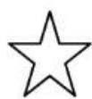
图一

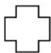

# 2. 全曲线

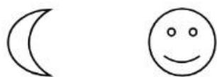
图二

# 3.曲+直

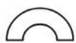
图三

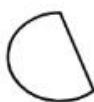

【注意】曲直性：比较简单，曲直性就是看图形是由直线、曲线还是曲+直组成。

1. 全直线：如图一，图形均由直线组成。
2. 全曲线：如图二，图形均由曲线组成。
3. 曲+直：如图三，图形既有曲线又有直线。
4. 特征图：出现圆、弧等全曲线图形，优先考虑曲直性。
5. 如果在曲直性部分做到分组分类题目, 最严谨的考法是六个图中只出现这三种（全直线、全曲线和曲+直）里面的两种, 如图①②③都是全直线图形, 图④⑤⑥是全曲线图形; 国考都是这么考, 但是在省考中, 可能会出题不严谨, 例如会把全直线分在一组, 把全曲线和有曲有直的放在一组, 即一组是全直线, 一组是有曲线, 这种分法在国考上基本上不会考, 但是省考出题不严谨, 就会这么考查。

【例】（2023江苏）从所给的四个选项中，选择最合适的一个填入问号处，使之呈现一定的规律性。

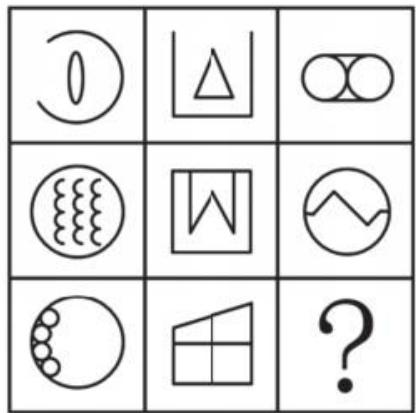

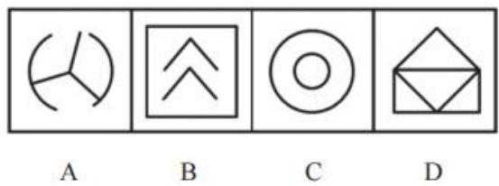

【解析】例. 观察图形特征, 元素组成不同, 优先考虑属性规律, 对称性考得多, 优先考虑对称; 第三行的图 2 是不对称图形, 只要有一个图不对称, 就不考虑对称性, 考虑曲直性。第一列图形均为全曲线图形, 第二列图形均为全直线图形, 第三列图形均为有曲有直图形, 则 “? ” 处图形应有曲有直。

A 项：为有曲有直图形，当选。
B 项：为全直线图形，排除。
C 项: 为全曲线图形, 排除。
D 项: 为全直线图形, 排除。【选 A】

# 【注意】

1. 图形特征：元素组成不同——优先属性规律。
2. 在考试中，如果发现题干图形大多为对称的，里面只有  $1 \sim 2$  个图形是不对称的，此时大概率考查曲直性。

# 考点三：开闭性

1. 全封闭

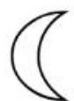

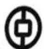

# 图一

# 2. 全开放

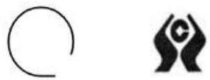
图二

# 3. 半开半闭

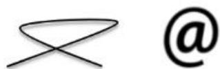
图三

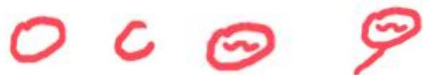
图四

特征图：出现生活化或粗线条图形，考虑开闭性

【注意】开闭性：即一个图形是封闭的还是开放的。

# 1. 考点：

(1) 全封闭: 如图一, 图形的外面围了一圈, 全封闭起来。(2) 全开放: 如图二, 图形均有镂空部分, 没有封闭空间。(3) 半开半闭: 如图三, 图形有封闭空间, 但是在封闭空间外侧, 有出头端点。（4）如图四：图1是一个圆，为全封闭图形；图2的这个圆没有封口，为全开放图形；图3的圆是封闭的，但是在里面有一些端点，这个图形仍然是全封闭图形；但是在圆的外面出现出头端点，如图4，为半开半闭图形。

2. 在分组分类题目中，如果一组为全封闭图形，另一组为全开放图形是很严谨的考法；但是在省考中会出现不严谨的考法，如一组是全开放图形，把全封闭和半开半闭分到另一组，即一组是全开放图形，一组是有封闭图形。虽然我们参加的是国考，但是在未来自己刷题的时候会刷到一些省考不严谨的题目，所以在此提醒。
3. 特征图：出现生活化或粗线条图形，考虑开闭性。

（1）生活化图形：例如，图一的图2、图二的图2均为“银行”的标志，图三的图2为“邮箱”的标志，即在生活中会遇到的图形，为生活化图形。
(2) 粗线条图形: 如图一, 图 1 由细线条围成, 但是图 2 的线条都很粗;如图二的图 2 , 不是线条, 而是一团团的黑色; 这样的图形就是粗线条图形。

【例】（2024 事业单位）从所给的四个选项中，选择最合适的一个填入问号处，使之呈现一定的规律性。

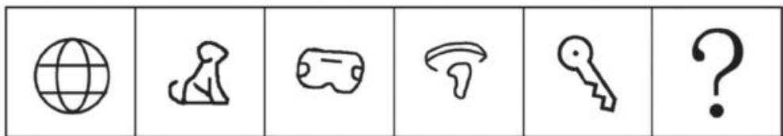

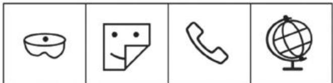
A
B
C
D

【解析】例. 观察图形特征，元素组成不同，优先考虑属性规律，图2为不对称图形，所以不考虑对称性；考虑曲直性，图1为有曲有直图形，图2为有曲有直图形，图3为有曲有直图形，图4为全曲线图形，所以曲直性无规律；考虑开闭性，图1为全封闭图形，图2有封闭地方和外部出头端点，为半开半闭图形，图3为全封闭图形，图4有封闭地方和外部出头端点，为半开半闭图形，图5是全封闭图形，即图1、3、5为全封闭图形，图2、4、6有封闭，也有开放的地方，为半开半闭图形。

A、B、C项：均为全封闭图形，排除。
D 项: 有封闭地方和出头端点, 为半开半闭图形, 当选。

另一种思考方法：当出现生活化或粗线条图形，考虑开闭性。图2像“小狗”趴着；图5像“钥匙”；C项像“电话”，D项为“地球仪”，这些均为生活化图形，可以优先考虑开闭性。

答疑：本题不能考虑曲直性，因为图1、2、3均为有曲有直图形，但是图4只有曲线，没有直线，所以曲直性没有规律。【选D】

# 【注意】

1. 图形特征：元素组成不同——优先属性。
2. 右边是一团一团的黑色，为粗线条的图形。

# 属性规律总结

# 一、属性类识别特征：元素组成不相同、不相似

# 二、对称性：

1. “等腰”元素：优先轴对称
2. 平行四边形、S、N、Z变形图、相同图形反着放：优先中心对称
   3.有相互垂直的两条对称轴：轴  $^+$  中心对称

识别题型  $\rightarrow$  画出对称轴  $\rightarrow$  考虑数量、方向  $\rightarrow$  对称轴与线、点、面的关系)

# 三、曲直性：全曲、全直、曲+直

四、开闭性：全开、全闭、半开半闭

不要忘记我！

# 【注意】属性规律总结：

1. 属性类识别特征：元素组成不相同、不相似。
2. 考点：对称性（上节课学习过）、曲直性、开闭性。其中对称性考点多，但是曲直性和开闭性很简单；虽然曲直性和开闭性很简单，但是在考试的时候不一定能做对，因为国考基本上每年都考查对称性，大家认为对称性很重要，所以当一道题对称性没有规律的时候就直接考虑数量规律，就忘记了曲直性和开闭性。做题的时候不要忘记曲直性和开闭性，元素组成不相同、不相似，考虑属性规律，属性规律有三个考点（对称性、曲直性和开闭性）。

# 第四节 数量规律

“数量规律”图形特征：

(1) 元素组成不同, 且属性没规律
(2) 数量特征图明显

考点

点、线、角、面、素

【注意】数量规律：

1. 图形特征：

(1) 元素组成不同, 优先考虑属性规律, 如果属性没规律, 考虑数量规律。(2) 数量特征明显, 可以跳过属性规律, 直接考虑数量规律。如果一道题数面特征明显, 看到这道题就想数面, 那么可以优先数面。

2. 考点：有五个考点，分别为点、线、角、面、素。其中角这个考点考得非常少，所以就不在精讲精练讲解，放在名师堂讲解，精讲精练主要讲解点、线、面、素这几个考点；面的考频最高且相对好数，优先讲解面数量。

考点一：面数量

1. 什么是面？白色的封闭区域

图一

面是白的，黑的不是面！

2. 什么时候数面？

(1) 图形被分割、封闭面明显

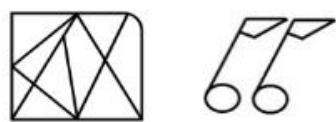
图二

(2) 生活化图形、粗线条图形

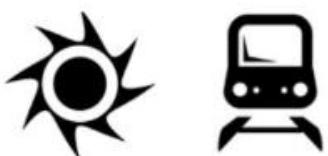
图三

# 【注意】面数量：

1. 什么是面：白色的封闭区域。如图一，图1外面有白色的封闭区域，有1个面；图2的线条没有封闭起来，有0个面；面是白色的封闭区域，只有中间的三角形封闭区域是一个面，黑色的部分不是面，所以图3有1个面。

# 2. 什么时候数面：

(1) 图形被分割、封闭面明显:

(1)图形被分割。如图二, 图 1 的外面有一个边框, 里面用线将其分割成不同面, 此时可以优先考虑数面。
(2)封闭面明显：如图二，图形里面都是窟窿，都是面，此时叫作封闭面明显，可以数面。

（2）生活化、粗线条图形：如图三，图1像“齿轮”，图2像“火车头”或“直升飞机”，为生活化图形，且图形里面出现一团团黑色，为粗线条图形；遇到这种生活化、粗线条图形可以优先数面。图1的白色部分是面，所以有1个面；图2有5个面。

3. 生活化图形可以考查开闭性和面数量。

【例1】（2023重庆选调）从所给的四个选项中，选择最合适的一个填入问号处，使之呈现一定的规律性。

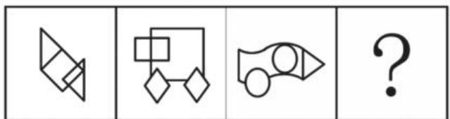

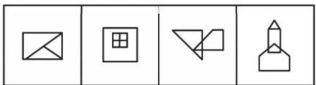
A
B
C
D

【解析】1. 观察图形特征，每个图不一样，元素组成不相同，优先考虑属性规律。图 1 不对称，不能考虑对称性；图 1、2 为全直线图形，图 3 为有曲有直图形，所以曲直性无规律；题干和选项均为全封闭图形，所以开闭性虽然有规律但是无答案，属性没有规律，考虑数量规律。出现窟窿和面，考虑面数量。

题干图形面数量均为 5 个, 则 “?” 处图形的面数量为 5 个。

A项：有3个面，排除。
B项：有5个面，当选。
C 项: 有 4 个面, 排除。
D 项: 有 4 个面, 排除。【选 B】

# 【注意】

1. 图形特征：元素组成不同——优先属性。
2. 图形特征：封闭面明显——优先数面。
3. 思考规律的先后: 当拿到一道题目发现图形的封闭面均特别明显、都是窟窿、都是面, 此时可以不优先考虑属性规律, 可以优先数面; 当遇到难题没有思路的时候, 可以优先考虑属性规律再考虑数量规律。

# 面的细化考法

1. 所有面的形状（三角形、四边形）
2. 相同面的数量（“双胞胎”“多胞胎”）
3. 最大/最小面的形状、属性（对称、曲直）、与外框的关系（相似、边相等）

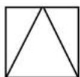

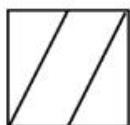

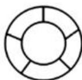

【注意】面的细化考法：直接数面的题目比较简单，考查较少，目前考试较流行的考法是以下三种。如果整体数面无答案，考虑面的细化，共有三个角度。

1. 所有面的形状（三角形、四边形）：观察图形里面是否有三角形/四边形面，如果有，观察有几个。如图，图1有3个面，均为三角形的面；图2有3个面，其中有2个三角形的面；图3中没有三角形的面（0个）。
2. 相同面的数量（“双胞胎”“多胞胎”）：相同面指的是面的形状和大小一模一样，即“双胞胎”“多胞胎”面。如图，如图1中有2个长得一模一样的面（直角三角形），图2有2个长得一模一样的面（三角形）；图3中有5个长得一模一样。
3. 最大/最小面的形状、属性（对称、曲直）、与外框的关系（相似、边相等）：找最大面/最小面的时候，最先找最大面，因为最大面比较直观且考查多；如果最大面有规律继续看，如果最大面无规律再看最小面。

(1) 形状: 最大面是几边形。如图, 图 1 中最大面是三角形, 图 2 最大面是四边形 (有 4 条边)。
(2) 属性: 主要看对称和曲直, 因为面是封闭的, 不用看开闭性。

(1)对称性。如图, 图 1 最大面是等腰三角形, 最大面为轴对称图形; 图 2 最大面是平行四边形, 最大面为中心对称图形, 图 3 最大面是圆 (有横轴、竖轴和垂直的对称轴), 最大面为轴对称+中心对称图形。
(2)曲直性。如图, 图 1 和图 2 最大面是由直线组成的, 图 3 最大面是由曲线围成的。

（3）与外框关系：主要看最大/最小面与外框是否相似、与外框边的数量是否相等。如图，图1最大面是三角形，外框是四边形，那么最大面和外框不相似，外框边数也不相等；图2最大面是平行四边形，外框是正方形，最大面与外框不相似，但是与外框边数量相等；图3最大面和外框均为圆，即最大面和外框相似。
4. 在国考和省考中简单题不多，大多数题目都比较难，如 2025 年国考考查最大面都是轴对称图形，所以以上的知识必须会。如果觉得学习的知识太多、记不住，就把这些知识抄下来，每天背一下，在考试的时候这些考点不是临时想到的，都是背下来的。如果把上述知识都背下来，也不一定全部题目都能做出来，在考试中  $90\%$  的题目会做出来，另外 10 题中有 1 题大约为创新题。目前是打基础的阶段，只要把基础考法学会了，就学会了  $90\%$  ，就够用了。

【例 2】（2021 浙江）从所给的四个选项中，去掉哪一个后，剩下的图形序列可以呈现一定的规律性？

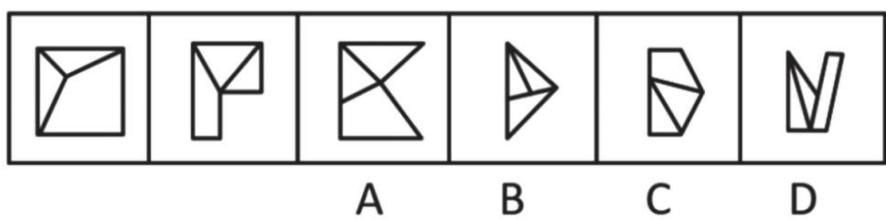

【解析】2. 问“从所给的四个选项中，去掉哪一个后，剩下的图形序列可以

呈现一定的规律性”, 注意问法。做题思维一样, 图 1 的外框是一个正方形, 里面用线分割成不同的面, 即图形被分割, 封闭面明显, 优先数面。题干和选项的面数量都是 3 个, 没有办法做题, 考虑面的细化, 第一个先看所有面 (里面是否有三角形面)、第二个看是否有长得一样的面, 第三个看最大/最小面。

图1有2个三角形面；图2有2个三角形面；A项中有2个三角形面；B项中有3个三角形面；C项中有2个三角形面；D项中有2个三角形面，根据三角形的面数量去掉B项（3个），其余的图形中三角形的数量均为2个，B项当选。

这种题目近几年考查得很多，国考也会考查。【选B】

# 【注意】

1. 图形被分割、封闭面明显——优先数面。
2. 面的细化——所有、相同、最大/最小。

所有面一重点关注三角形、四边形

(2019 北京)

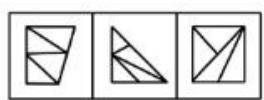

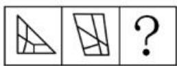

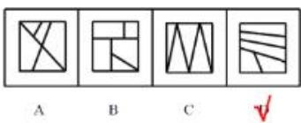

（2022国考）

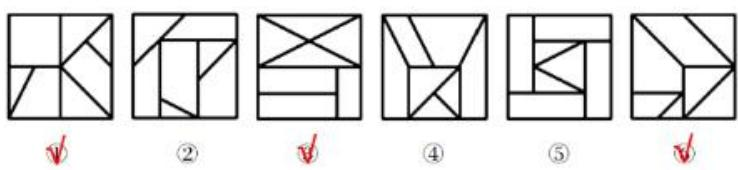

【注意】所有面——重点关注三角形、四边形：

1. 2019 北京：题干图形外边框被分成不同的面，可以考虑数面。第一组图均为 4 个面，第二组图均为 5 个，但是四个选项的图形均为 5 个面。虽然数面有规律，但是选不到答案，此时可以观察三角形/四边形的数量，第一组图中的 4 个面都是三角形的面，第二组图的 5 个面全部都是四边形的面；A、B、C 项中的

图形均有三角形，均排除；D项中5个面都是四边形，选择D项。

2. 2022 国考：题干图形外部为正方形，里面用线将其分割成面，封闭面特征明显，优先数面。题干图形均为 7 个面，没有办法分组，考虑三角形的面，图①③⑥为一组，均有 4 个三角形的面；图②④⑤为一组，均有 3 个三角形的面。
3. 一般关注三角形的面就可以，四边形的面考查少，如果一道题三角形的面没有规律，此时可以考虑四边形的面，另外如果一道题中没有三角形的面，一般也不会考查四边形的面，所以在做题的时候重点观察是否有三角形的面。
4. 答疑：按照以下顺序进行验证，先看三角形的面，再看相同面，再看最大/最小面。

【例3】（2024事业单位）从所给的四个选项中，选择最合适的一个填入问号处，使之呈现一定的规律性。

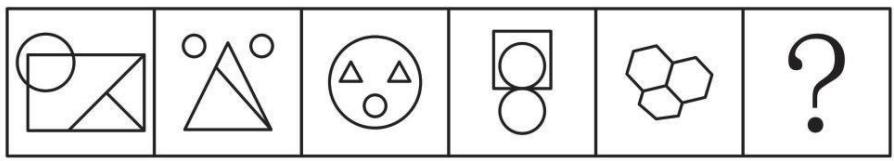

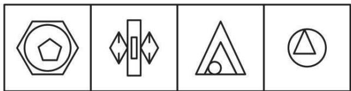

【解析】3. 观察图形特征，出现窟窿和面，考虑数面。题干图形面数量依次为5、4、4、3、3、？，面数量无规律，从三个角度思考。

第一个看所有面里是否有三角形的面，图1、2、3有三角形的面，但是图4、5没有三角形的面，所以三角形的面无规律。第二个看图形里面是否有长得一模一样的面，图1有2个直角三角形长得一模一样，图2有2个圆长得一模一样，图3有两个三角形长得一模一样，图4中有两个圆长得一模一样，图5中上面2个六边形的形状和大小长得一样，但是下面的图虽然也是六边形，但是和上面的图不一样，有些“瘪”，所以图5有2个面长得一模一样，则“？”处图形应该有2个相同面。

A 项：没有相同面，排除。
B 项: 左边和右边的面长得一样, 有 2 个相同面, 保留。

C项：没有相同面，排除。
D 项：没有相同面，排除。【选 B】

# 【注意】

1.封闭面明显——优先数面。
2. 面的细化——所有、相同、最大/最小。

相同面——关注形状大小都一样的面

（2020新疆）

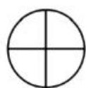

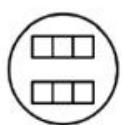
②

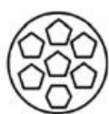
3

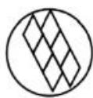
$④$

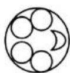

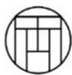

（2022北京）

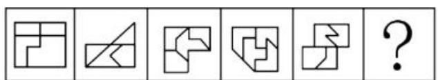

A
C
D

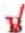

【注意】相同面——关注形状大小都一样的面。

1. 2020 新疆：本道题很看细节，图形里面都是面，优先考虑数面。图①有 4 个面，其余图形面数量均大于 4，所以数面没有规律；图①没有三角形的面，所以三角形的面没有规律；看相同面，图①中有 4 个相同面，图②有 6 个相同面，图③有 6 个面长得一样（最下面的面是六边形，其余的图形为五边形），图④有 6 个面长得一样，图⑤中有 4 个圆长得一样，图⑥中有 4 个长方形长得一样，即图①⑤⑥为一组，有 4 个相同面；图②③④为一组，有 6 个相同面。
2. 2022 北京：题干图形外面为一个边框，里面由线分割成不同个面，优先考虑数面。题干图形面数量均为 4 个，无答案，考虑面的细化。题干图形中没有三角形的面，考虑相同面，图 1 中有 2 个长方形长得一样，图 2 中有 2 个三角形长得一样，图 3 中有 2 个“鞋子”形状的图形长得一样，图 4 中有 2 个“L”形

状的图形长得一样，图5中有2个相同面，即题干图形均有2个相同面，则“？”处图形应该有2个相同面，B项当选。
3. 相同面指的是形状、大小、面积都一模一样。如例 3 中的 C 项中的 2 个三角形长得不一样，一定要是大小和面积都一样的才是相同面。

【例 4】（2024 联考）把下面的六个图形分为两类，使每一类图形都有各自的共同特征或规律，分类正确的一项是：

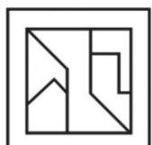
①

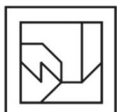
(2)

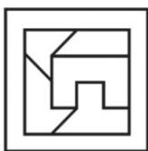
(3)

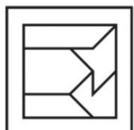
(4)

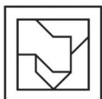
(5)

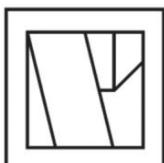
(6)

A. ①③④，②⑤⑥

B. ①③⑤, ②④⑥

C. ①⑤⑥, ②③④

D. ①④⑥, ②③⑤

【解析】4. 观察图形特征，题干图形外框为正方面，内部用线将正方形分成不同面，所以优先考虑数面。图①②③④均为5个面，当数到第4个面的时候就不用再数了，因为无法分成两组，整体数面无规律，可以考虑面的细化（三角形的面、相同面和最大/最小面）。

图①中没有三角形面、没有相同面、有最大面（“Z”字形），当遇到平行四边形、“S、N、Z”变形、相同图形反着放要考虑中心对称，所以图①的最大面为中心对称图形；图②最大面为轴对称图形；图③最大面为轴对称图形，图④最大面为轴对称图形；图⑤最大面（“Z”字形）为中心对称图形；图⑥最大面为平行四边形，为中心对称图形。

故图①⑤⑥为一组，最大面为中心对称图形；图②③④为一组，最大面为轴对称图形，C项当选。【选C】

# 【注意】

1. 图形被分割、封闭面明显——优先数面。
2. 面的细化——所有、相同、最大/最小（几边形、属性、与外框关系）。
3. 一个图形是否有三角形面、相同面、最大/最小面都很快能做好，只要把老师告诉的特征记熟练了做题就会快了，最怕做题的时候记不住老师所讲的图形特征和考点。

【2024 浙江】最大面边数

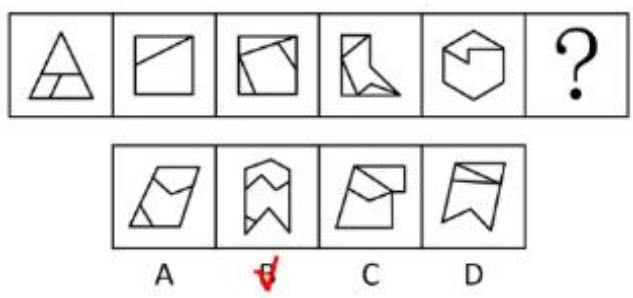

【2024联考】最大面轴对称/中心对称

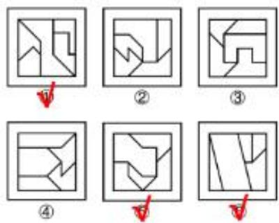

【2023 联考】最小面与外框相似

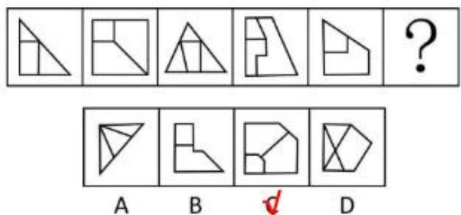

【2022 联考】最大面边数与外框相等

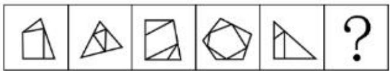

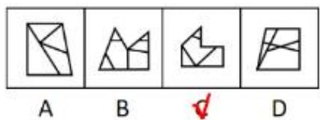

【注意】拓展：直观感受考法。

1. 2024 浙江：考查最大面边数。题干图形都有面，但是数面无规律，图5中没有三角形面，题干图形也没有一样的面，考虑最大/最小面，最大面依次为三边形、四边形、五边形、六边形、七边形，则“？”处图形最大面应为八变形，选择B项。
2. 2024 联考：题干图形均有 5 个面，选不出唯一答案，图 1 没有三角形面、相同面，但是有最大面，最大面为中心对称图形，故图①⑤⑥为一组，最大面为中心对称图形，图②③④为一组，最大面为轴对称图形。3.2023联考：最小面与外框相似。题干图形均有面，但是整体数面没有规律，图2中没有三角形面，图1没有相同面，所以关注最大面/最小面。图1有最大面，但是图2有两个一模一样的面，没有最大面，最大面指的是最大的、唯一的面，此时看最小面。题干图形最小面的形状依次为三角形、四边形、三角形、四边形、四边形，最小面形状无规律，另外图4和图5最小面为直角梯形，不对称，所以对称性无规律，此时考虑最小面与外框形状关系，题干图形的最小面均与外框相似，C项当选。
3. 2022 联考：题干图形数面特征明显，优先考虑数面，数面无规律；题干图形虽然有三角形的面，但是三角形的面数量依次为 2、4、3……，三角形面数量无规律，另外图 1 中无相同面，看最大/最小面。最大面的形状依次为四边形、三角形、四边形、五边形、三角形，故最大面的形状无规律，考虑最大面的对称性，图 1 的最大面不是对称的，对称性无规律，考虑最大面与外框关系。图 1 最大面和外框均为四边形，图 2 最大面和外框均为三角形，图 3 最大面和外框均为四边形，图 4 最大面和外框均为五边形，图 5 最大面和外框均为三角形，即题干图形最大面和外框边数相同，C 项当选。
4. 这些考点较难，只要把这四个考点背下来，考试的时候就能想到，图形最

难的就是没有见过，课下要多抄多背，有的同学笔记记得很详细，考高分的概率就大。

数面特征明显、整体数面无规律——考虑细化考法

1. 所有面的形状

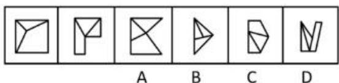

2. 相同面的数量

3. 最大/最小面的形状、属性（对称、曲直）、与外框的关系（相似、边相等）

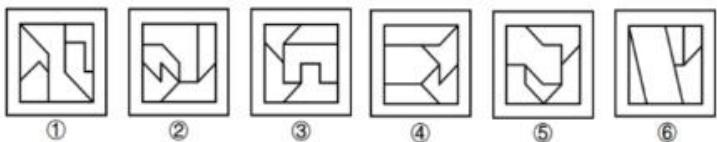

【注意】数面特征明显、整体数面无规律——考虑细化考法。

1. 所有面的形状。
2. 相同面的数量。
3. 最大/最小面的形状、属性（对称、曲直）、与外框的关系（相似、边相等）。

# 考点二：线数量

1. 什么是线？
   直线

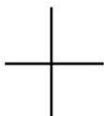

图 曲线

图二

图三

2. 什么时候数线？

直线特征图：多边形、单一直线

图四

曲线特征图：曲线图形（圆、弧、单一曲线）

图五

图六

【注意】线数量：分为直线、曲线，不要一起数，而是分开数，单独数直线、曲线数。

1. 什么是线:

（1）在一个水平上没有拐弯就是一条线。如图一，横着、竖着是2个方向，每个方向上有1条直线，共有2条直线。(2) 平滑的为一条曲线, 有明显的拐点为两条曲线。如图二, 有 1 条曲线;如图三, “m” 中间是 “尖”的, 不平滑, 共有 2 条曲线。

2. 什么时候数线：

(1) 直线特征图: 多边形、单一直线。如图四, 图 1 的正方形是独立的多边形; 图 2 和图 3 均有单一直线。(2) 曲线特征图: 圆、弧、单一曲线。如图五, 图 3 左右均是独立存在的圆, 均是单一曲线。(3) 如图六, 没有单一直线, 单一直线指独自存在、与别人没有挨着的。

3. 答疑：图五可以考虑对称性，对称没有答案的情况下，考虑数量规律。

【例1】（2022湖北选调）从所给的四个选项中，选择最合适的一个填入问号处，使之呈现一定的规律性。

A

B

C

D

【解析】1. 题干出现多边形，考虑数直线；题干的图2和图4均有独立存在的圆，有单一曲线，考虑数曲线，哪个有规律用哪个。直线数依次为8、12、7，无规律；曲线数依次为0、1、2、3，故“？”处有4条曲线。

A 项：没有曲线，排除。

B 项: 一个圆就是平滑的 1 条曲线, 排除。

C 项: 有 4 条曲线, 当选。

D项：两个圆有2条曲线，排除。

答疑：线指的是细的线条，A项中间没有细的线条，没有线。【选C】

# 【注意】

1. 图形特征：单一曲线——优先数曲线。
2. 一道题目既有数直线和数曲线的特征，优先考虑数曲线（考查较多），数直线的题目考查较少。

【例2】（2023事业单位）从所给的四个选项中，选择最合适的一个填入问号处，使之呈现一定的规律性。

A
B
C
D

【解析】2. 题干的图1出现单一直线、多边形，考虑数直线，题干图形的直线数均为5，故“？”处有5条直线。

A项：有5条直线，保留。
B 项：有 6 条直线，排除。
C、D 项：有 7 条直线，均排除。【选 A】

# 【注意】

1. 图形特征：单一直线、多边形——优先数直线。
2. 听课听得懂，但做题不会是因为解题思路没有跟上，最难的是需要背下来图形特征，这样就知道考虑什么考点。

（2024四川）

（2022联考）

直线热门考法：做运算

【注意】直线热门考法：做运算。

1. 两幅图分成内外、上下、左右，喜欢考查分开做运算。
2. 例:

(1) 2024 四川: 每幅图均分内外, 内外均出现独立的多边形, 考虑数直线,内外边数量依次为 6、4、3、7、5, 内外边数量相等, 四个选项的外部边数量均是六边形, 找内部是六边形的选项, D 项内部是六边形, 内外都是 6 条边, 当选。
(2) 2022 联考: 每幅图均由 2 个图形组成, 考虑内外分开看; 每幅图均有多边形, 考虑多边形有几条边。第一组图, 黑色边数依次为 6、4、3, 白色边数依次为 5、4、4, 相加无规律, 考虑相减, 黑色-白色边数依次为 1、0、-1, 规律为等差数列; 第二组图, 黑色-白色边数依次为 1、0, 故 “?” 处黑色-白色边数为 -1 , 即黑色比白色少 1 条边, A 项当选。

# 3. 答疑：

(1) 识别: 出现多边形且图形分内外, 考虑内外数直线数。
(2) 2024 年国考考查了 2022 年联考中类似的规律, 且考查了 2 道题。

【例 3】（2019 浙江）把下面的六个图形分为两类，使每一类图形都有各自的共同特征或规律，分类正确的一项是：

①

$②$

$③$

$④$

(5)

6

A. ①③④, ②⑤⑥

B. ①③⑥，②④⑤

C. ①②③, ④⑤⑥

D. ①④⑤, ②③⑥

【解析】3. 除了图②（只有直线）外，其余图形均有曲有直，考虑数曲线、

直线，单独数可以做出来，则直接做；单独数做不出来，则考虑做运算。图形有直有曲，优先数曲线（考查较多），曲线数依次为1、1、2、1、2、3，无规律；考虑数直线，直线数依次为2、0、3、2、1、2，无规律，考虑做运算。

因此，图①③④为一组，曲线比直线均少1；图②⑤⑥为一组，曲线比直线均多1，A项当选。

答疑：

(1) 数面很少有曲线图, 大多数都是直线。
(2) 图③没有外框, 无法区分内外。【选 A】

【注意】图形特征：大多数图都有曲有直——数曲线、直线，可能做运算。

# 线的特殊考点：笔画数

# 1. 什么是一笔画？在不能重复的情况下，能够一笔画成

下面这幅图由四个相互重叠的圆圈构成，如果每条边都只能经过一次，你能一笔把它画出来吗？快来动笔试试吧。

现在揭晓答案：这幅图可以用一笔画出来，下面这条路径就是其中一种方法。

图一

# 2.怎么判断一笔画？

（1）线条之间连通
（2）奇点数量为0或2

(奇点: 以一个点为中心, 发射出奇数条线)

图二

图三

图1

图2

图3

# 图四

端点也是奇点，不要忘记数！

图1

图2

图3

# 图五

图1

图2

图3

# 图六

【注意】笔画数：

1. 什么是一笔画：在不能重复的情况下，图形能够一笔画成。如图一，图形按照箭头方向能够一笔画成。不能靠想象判断，靠技巧判断是否能一笔画成。
   2.怎么判断一笔画：

(1) 线条之间连通。如图二, 2 个圆不能一笔画成, 因为不挨着; 如图三,用 1 条线将 2 个圆连起来, 为连通图。
(2) 奇点数为 0 或 2。奇点指以一个点为中心, 发射出奇数条线的点。

(1)如图四, 图 1 的蓝点引出 2 条线, 2 不是奇数, 该点不是奇点。图 1 有 2 个奇点, 为一笔画图形。(2)如图四, 图 2 的黄点引出 3 条线, 3 是奇数, 该点是奇点。图 2 有 4 个奇点, 不是一笔画图形。(3)如图四, 图 3 的绿点引出 3 条线, 3 是奇数, 该点是奇点。图 3 有 4 个奇点, 不是一笔画图形。

3. 端点也是奇点，不要忘记数。如图五，每幅图的红点均引出 1 条线，1 是奇数，红点都是奇点。

4.练习：如图六。

(1) 图 1: 最左边的点发射 4 条线, 4 是偶数, 不是奇点, 中间的点发射 4 条线, 4 是偶数, 不是奇点, 共有 0 个奇点, 为一笔画图形。
(2) 图 2: 右上角、右下角分别发射出 3 条线, 3 是奇数, 分别是奇点; 左上角、左下角分别发射 2 条线, 均不是奇点, 共有 2 个奇点, 为一笔画图形。
(3) 图 3: 最上边中间、最左边中间、最右边中间、最下边中间均发射 3 条线, 均是奇点, 共有 4 个奇点, 不是一笔画图形。

多笔画

笔画数=奇点数/2（奇点数一定是偶数个）

图一

图二

【注意】多笔画：

1. 笔画数  $=$  奇点数/2。

(1) 如图一, 红点都是端点, 都是奇点; 2 个蓝点分别发射 3 条线, 分别是奇点, 共有 4 个奇点, 超过 2 个奇点,  $4 \div 2 = 2$ , 为两笔画图形。(2) 奇点数只能是偶数个, 不可能是奇数个。如果数出 5 个奇点,  $5 \div 2 = 2.5$ ,不可能有这种情况。

2. 图形不连通，需要看成两个图，分开计算笔画数。如图二，内部有 4 个奇点，为两笔画；外部是一个圆，为一笔画，相加共三笔画。

# 【注意】练习：

# 1. 第一行图形:

(1) 图 1: 所有点引出的都是偶数条线, 没有奇点。
(2) 图 2: 有 4 个奇点, 有 1 个端点, 是奇点; 3 个点均引出 3 条线。
（3）图3：有2个奇点，右下角有2个点均引出3条线；右上角的点引出6条线，不是奇点。
(4) 图 4: 有 4 个奇点, 均引出 3 条线。

# 2. 第二行图形:

(1) 图 1: 最上面的点引出 3 条线, 最左边和最右边分别引出 3 条线, 最中间引出 5 条线, 共有 4 个奇点。
(2) 图 2: 共有 6 个奇点, 均引出 3 条线。
(3) 图 3: 共有 4 个奇点（出头端点）。
(4) 图 4: 共有 6 个奇点, 2 个端点, 4 个引出 3 条线的点。

# 笔画数常见特征图

(五角星、“日”、“田”、圆相切/相交及变形图、多端点)

【注意】笔画数常见特征图：

1. 五角星。
2. “日”“田”字及其变形图：

(1) “日”字变形: 外框可以变形为长方形、正方形、三角形、有直有曲的、弧线, 本质是内部 1 条线+1 个外框。如图一, 均是 “日” 字变形, 一笔画图形。(2) “田”字变形: 1个外框（可以是曲线、三角形）+内部1个“十”字。如图二, 为“田”字变形。

3. 圆相切/相交及其变形图：圆相切或套圈。只要是封闭图形套圈（如2个正方形）或用点连着即可。
4. 多端点：出头端点。笔画数中至少有  $50\%$  的题目都会出现多端点。

【例5】（2025国考）把下面的六个图形分为两类，使每一类图形都有各自的共同特征或规律，分类正确的一项是：

$①$

②

3

$④$

(5)

(6)

A. ①②④, ③⑤⑥
B. ①③④, ②⑤⑥
C. ①②⑤, ③④⑥
D. ①④⑤, ②③⑥

【解析】5. 图①出现相切，图②内部“十”字，外部是边框，“田”字变形，图③右上角是“日”字变形，优先考虑笔画数，数奇点。图①有0个奇点；图②有4个奇点；图③有2个奇点（左下角的点发射出5条线）；图④有0个奇点；图⑤有4个奇点（均发射出5条线）；图⑥有4个奇点（均发射出5条线）。

因此，图①③④为一组，均是一笔画图形；图②⑤⑥为一组，均是两笔画图形，B项当选。【选B】

$①$

2

3

$④$

5

6

图一

2
图二

$④$
图三

(5)
图四

# 【注意】

1. 图形特征：圆相切、“日”“田”变形——优先笔画数。
2. 去框法数笔画：

(1) 如图一, 内部 1 条线, 是一笔画, 加上 1 个外边框, 仍为一笔画。
(2) 如图二, 去掉外边框, 内部的 “  $\times$  ” 是两笔画, 整体为两笔画。
(3) 如图三, 去掉外框, 内部类似倒着的 “8”, 为一笔画, 整体为一笔画。
(4) 如图四, 去掉外框, 内部的 “  $\times$  ” 是两笔画, 整体为两笔画。

【例6】（2023国考）把下面的六个图形分为两类，使每一类图形都有各自的共同特征或规律，分类正确的一项是：

①

②

$③$

$④$

(5)

6

A. ①③⑤，②④⑥
C. ①③④, ②⑤⑥
B. ①④⑥, ②③⑤
D. ①②④，③⑤⑥

【解析】6. 图③⑥均有出头端点，图①②均为“日”字变形（外框+内部1条线），考虑笔画数。图①②均有2个奇点，一笔画；图③⑤有4个奇点，两笔画；图④有2个奇点，一笔画；图⑥有2个奇点，内外分别是一笔画，共两笔画。

因此，图①②④为一组，均是一笔画图形；图③⑤⑥为一组，均是两笔画图形，D项当选。【选D】

①

2

3

$④$

5

6

# 【注意】

1. 图形共考查 10 道题, 笔画数可能在倒数  $1 / 2 / 3$  道题中考查。
2. 图形特征：“日”字变形、多端点——优先笔画数。

【2023 国考 1】

$①$

(2)

(3)

(4)

(5)

(6)

【2023联考】
①

(2)

(3)

(4)

(5)

(6)

【2023 北京】

A

B

C

D

【2023国考2】
①

②

(3)

(4)

(5)
【2022国考】

(6)

【2022联考】

# 【注意】

1. 一道题有 2-3 幅图有端点，考虑笔画数。
2. “日”字和“田”字变形，考虑笔画数。如2022年国考，图①是“日”字变形，图⑥是“田”字变形。
3. 面与面之间用点连接，考虑笔画数。如 2022 年联考，图①用 1 个点连接 2 个三角形；如 2022 年国考，图④用 1 个点连接三角形；如 2023 年国考 2，图⑥右下角用 1 个点将三角形与别的图形连接。

【例4】（2022江苏）从所给的四个选项中，选择最合适的一个填入问号处，使之呈现一定的规律性。

【解析】4. 图形特征是笔画数，第一行，图1是“日”字变形；第二行，图1是“田”字变形，图3是五角星+外框；第三行，图1和图2均是“日”字变形（外框+内部1笔画成），考虑笔画数，第一行，笔画数依次为1、1、2；第二行，笔画数依次为2、2、1，笔画数无规律，考虑平行线。第一行，平行线组数依次为1、2、3；第二行，平行线组数依次为1、2、3；第三行，平行线组数依次为1、2，故“？”处有3组平行线。

A项：有4组平行线，排除。
B项：有2组平行线，排除。
C 项: 有 3 组平行线, 保留。
D 项：不止有 3 组平行线，排除。【选 C】

# 【注意】

1. 图形特征: “日”字、“田”字变形——优先笔画数。
2. 笔画数没规律——可以考虑平行线。

# 【2022江苏】

# 【2021 浙江】

# 【2024江苏】

有笔画数特征，但无规律——先看平行线、再数交点

# 【注意】平行线总结：

1.2021 浙江：第一组图，图 1 是 “日” 字变形，图 2 有多端点，图 3 的三角形与其他图形用点连接，考虑笔画数，笔画数依次为 1、3、1，无规律，考虑平行线。第一组图，均有 2 组平行线；第二组图，均有 3 组平行线。
2. 2024 江苏：每幅图均有出头端点，考虑笔画数，笔画数依次为 1、1、2、2，无规律，考虑平行线。

# 线数量小结

# 1. 线数量考点：

直线、曲线、笔画问题

# 2. 什么时候数线

(1) 直线数特征图: 多边形、单一直线
(2) 曲线数特征图: 曲线图形 (单一曲线、圆、弧)

# 3. 笔画问题

(1) 笔画数特征图: 多端点、圆相切/相交、日、田、五角星
（2）一笔画条件：连通图+奇点数为0或2
（3）多笔画公式：奇点数÷2

# 【注意】线数量小结：

1. 考点：直线、曲线、笔画数。
2. 什么时候数线：

(1) 多边形、单一直线，考虑数直线。
(2) 圆、弧、单一曲线，考虑数曲线。
(3) 直线、曲线分开数, 可以做运算。

# 3. 笔画数：

(1) 特征图: 多端点、“日” “田” 考查较多; 圆相交/相切、五角星偶尔考查。
(2) 一笔画条件: 连通图+奇点数为 0 或 2。
(3) 多笔画公式: 奇点数  $\div 2$  。

# 考点三：点数量

1. 什么是点？线与线的交点

注：切点也属于交点

2. 什么时候数点？

点数量特征图：

(1) 线条交叉明显（俗称“大树权”）
(2) 多边形或圆中叉出一些线条
（3）圆相切或圆相交较多

图1

图2

图3

图4

有笔画数特征，但无规律——先看平行线、再数交点

【注意】点数量：

1. 什么是点: 线与线相交产生的交点, 直线和直线、直线和曲线、曲线和曲线相交的地方都是交点; 相切的地方 (切点) 也是交点; 端点不是交点。
2. 点数量特征图：

（1）线条交叉明显：俗称“大树权，如图1。(2) 多边形或圆中叉出一些线条: 如图 2, 比如 1 个圆、1 个正方形、1 个三角形的中间叉出一些线条。（3）圆相切或圆相交较多：如图 3、图 4。

3. 点数量的特征图和笔画数的特征图很像，比如图 1、图 2 能够想到端点，图 3、图 4 能够想到多圆相交/相切，点数量的题目都比较难，正确率在  $50\%$  左右，如果存在笔画数的特征（五角星、“日”“田”变形、多圆相交/相切、多端点），考虑笔画数，但是笔画数无规律，先看平行线、再数交点。

【例1】（2020山东）从所给的四个选项中，选择最合适的一个填入问号处，使之呈现一定的规律性。

A
B
C
D

【解析】1. 第一组图2、图3以及第二组图1都有出头端点，A项是三角形用点与其他图形连着，B项是五角星，可能考查笔画数，第一组图都是一笔画，第二组图的笔画数依次为2、1，笔画数无规律（不可能下一幅图是0笔画）；第一组图1没有平行线，平行线也无规律，考虑交点数。

第一组图的交点数依次为3、5、7，等差数列；第二组图的交点数依次为3、5，则“？”处图形应有7个交点。

A 项：有 5 个交点，排除。

B 项：有 10 个交点，排除。

C 项: 有 7 个交点, 当选。

D 项: 有 6 个交点, 排除。【选 C】

【注意】多端点——笔画数、平行线、交点。

(2020山东)

（2020青海）

【注意】2020 青海：图 1、图 5 是圆相交，考虑笔画数，题干图形的笔画数依次为 1、1、2、2、1，笔画数没有规律；考虑平行线，图 1 没有直线，则没有平行线；考虑交点，题干图形的交点数量依次为 1、2、3、4、5、6，则“？”处图形应有 7 个交点，选择 C 项。

点的细化考法

$①$  切点：

图一

(2)框上/框内交点:

图二

(3)曲直交点:

图三

大部分图都有圆或椭圆或圆弧椭圆弧，可优先考虑点的细化。

【注意】点的细化考法：

1. 切点：只数有几个切点。
2. 框上/框内交点：如图二，每幅图都有圆，可以数圆的内部有几个交点、圆的上边有几个交点。
3. 曲直交点：只数曲线和直线产生的交点。
4. 切点一般要有直线和曲线相切，至少要有曲线；曲直交点也要有曲线；目前省考、国考考查框上/框内交点一般都是考查圆，正方形考得非常少，因此大部分图都有圆或椭圆或圆弧、椭圆弧时，优先考虑点的细化。做题时优先考虑切点，因为有没有切点一眼就能看出来；如果切点没有规律，则关注有没有框，要考查框上/框内交点，一定会有框，都有框时考虑框上/框内交点（如图二，都有圆框，圆内交点数依次为0、1、2、3、4，“？”处应有5个框内交点），只要有1幅图没有框就考虑曲直交点（如图三，图1、图3有圆框，但图2没有圆作为框）。

【例2】（2024联考）从所给的四个选项中，选择最合适的一个填入问号处，使之呈现一定的规律性。

A
B
C
D

【解析】2. 每幅图都有曲有直，但不是每幅图都有圆作为框，无法考查框上/框内交点，考虑切点、曲直交点。图1将上方的横线延长，将半圆画出来，发现左上角是弧和直线的切点；图2将半圆补充完整，发现右侧是切点；图3补充成完整的椭圆，发现存在切点；题干每幅图都有1个切点。

A 项：没有切点，排除。
B 项: 有 2 个切点, 排除。
C 项: 有 2 个切点, 排除。
D 项: 有 1 个切点, 当选。【选 D】

【注意】每个图都有曲有直——交点（切点、曲直交点）。

【例3】（2022天津）把下面的六个图形分为两类，使每一类图形都有各自的共同特征或规律，分类正确的一项是：

①

$②$

3

$④$

(5)

(6)

A. ①②③, ④⑤⑥
C. ①②⑥，③④⑤
B. ①④⑤，②③⑥
D. ①③⑥，②④⑤

【解析】3. 每幅图都有圆，优先考虑切点，其次考虑框上/框内交点，最后考虑曲直交点。图①没有切点，则考虑圆上/圆内交点，图①圆上有 3 个交点，图②圆上有 4 个交点，图③圆上有 4 个交点，图④圆上有 3 个交点，图⑤圆上有 3 个交点，图⑥圆上有 4 个交点。

因此，图①④⑤为一组，都有3个圆上交点；图②③⑥为一组，都有4个圆上交点，选择B项。【选B】

【注意】每个图都有圆——交点（切点、框上/框内交点、曲直交点）。

【2018广州】框上交点

【2022天津】框上交点

【2019 浙江】框内交点

A

B

V

D

【2018 国家】框内交点

A

B

D

【注意】2018 广州、2022 天津都是考查圆上交点，2019 浙江、2018 国家都是考查圆内交点，对比区别，发现考查框上交点时圆的外边没有线，而考查框内交点时圆的外边有很多出头线条，这是刷题之后总结出来的经验，出头时优先考虑内部，没有规律时再考虑框上；没有出头时优先考虑框上，没有规律时再考虑框内。

【例 4】（2023 湖北）把下面的六个图形分为两类，使每一类图形都有各自的共同特征或规律，分类正确的一项是：

①

$②$

$③$

$④$

5

6

A. ①②③, ④⑤⑥
B. ①②⑤, ③④⑥
C. ①③④, ②⑤⑥
D. ①④⑤, ②③⑥

【解析】4. 每幅图都有曲有直，但图①没有圆、椭圆作为框，无法考查框上/框内交点，考虑切点、曲直交点；图①没有切点，则考虑曲直交点。

图①有6个曲直交点；图②有9个曲直交点；图③有6个曲直交点；图④有6个曲直交点；图⑤有9个曲直交点；图⑥有9个曲直交点。

因此，图①③④一组，均有6个曲直交点；图②⑤⑥一组，均有9个曲直交点，选择C项。【选C】

1

(2)

(3)

(4)

(5)

(6)

【注意】每个图都有曲有直——交点（切点、曲直交点）。

点数量小结

1. 什么是点：线与线的交点
2. 点数量特征图：

线条交叉明显（一般有笔画特征）

3. 点数量细化考法：

切点、框上/框内交点、曲直交点

图一

图二

【注意】点数量小结：

1. 什么是点：线与线的交点。
2. 点数量特征图：线条交叉明显（一般有笔画特征，笔画数没有规律则考虑平行线，平行线没有规律则考虑数交点）。
3. 点数量细化考法：每幅图都有圆形，考虑切点、框上/框内交点、曲直交点。如图一，优先考虑切点，其次框上/框内交点，最后曲直交点；如图二，图1没有圆形作为框，则考虑切点、曲直交点。

考点四：素数量

1. 什么是素？独立小图形

图一

2. 出现小元素，做题思路？

(1) 优先考虑元素种类和个数
(2) 找相同元素

颜色不同，一般为两种

大小不同，一般为一种

(1)

图二

(2)

# 【注意】素数量：

1. 什么是素：独立小图形。
2. 出现小元素，做题思路：

（1）优先考虑元素种类和个数：个数就是有几个图形；长得一样的算 1 种，如图一，图 1 的 2 个星星是 1 种，图 2 的 2 个圆形是 1 种，总共有 2 种，图 3 的 2 个菱形是 1 种，总共有 3 种，元素种类和个数比较简单，考得很少。
(2) 元素种类和个数选不出唯一答案，考虑找相同。

① 内部找相同：比如图一中图1有2个长得一样的元素、图2有2个长得一样的元素、图3有2个长得一样的元素。(2)相邻找相同：看图 1 和图 2、图 2 和图 3 有没有相同的元素。

3. 颜色不同，一般为两种，如图二，图（1）的黑色和白色看作两种元素；大小不同，一般为一种，图（2）的大圆和小圆看作一种元素。

【例1】（2023事业单位）从所给的四个选项中，选择最合适的一个填入问号处，使之呈现一定的规律性。

A
B
C
D

【解析】1. 出现小元素，考虑元素的种类和个数，题干和选项都有6个图形，元素个数选不出答案；题干每幅图都有3种元素。

B 项: 有 4 种元素, 排除。

A、C、D项：有3种元素，均保留。

元素的细化考虑找相同的元素，可以在内部找相同，也可以相邻找相同。如先看内部，图1有3个三角形、2个椭圆、1个平行四边形，图2有3个“L”形、2个三角形、1个圆形，题干每幅图的相同元素均为“3、2、1”分布，但无法排除选项；再相邻找相同，图1中3个的三角形到图2中变成2个，图2中3个的

相同元素到图3中变成2个，图3中3个的相同元素到图4中变成2个，则图4中3个的相同元素（类似圆形）到“？”处应该变成2个，排除D项。

题干图形中3个的相同元素的位置是固定的，都是右上角、左下角、右下角，排除C项，选择A项。【选A】

# 【注意】

1. 出现独立小元素——元素的种类和个数。
2. 元素细化——找相同。

素的特殊考点：部分数

1. 什么是部分数？连在一起就是一部分

图一

2. 什么时候考虑部分数？生活化、粗线条图形

图二

【注意】素的特殊考点：部分数

1. 什么是部分数：连在一起就是一部分。如图一，图1是2部分，图2是1部分。
2. 什么时候考虑部分数：生活化、粗线条图形。
3. 如图二，图1线条很多，但连在一起，为1部分；图2上方的“翅膀”和下方断开了，为2部分。

【例2】（2021江苏）从所给的四个选项中，选择最合适的一个填入问号处，使之呈现一定的规律性。

A
B
C
D

【解析】2. 题干不好识别考点，选项更好识别，D项类似“螃蟹”，C项类似“闪电、充电的标志”，A项类似“信封”，图5的“M”是生活化图形，出现生活化图形、粗线条图形，考虑部分数。题干图形均为2部分，则“？”处图形应为2部分。

A项：有2个部分，保留。

B 项：有 1 个部分，排除。

C、D 项：有 3 个部分，均排除。【选 A】

【注意】生活化、粗线条——数部分数。

生活化、粗线条图形常见考法：

1. 属性（对称、开闭、曲直）

图一

2. 部分数

图二

3. 面

图三

【注意】生活化、粗线条图形常见考法：按照考频高低排序，可以按照顺序尝试。

1. 属性（对称、开闭、曲直）：如图一，“5”不对称，均为全开放图形。
2. 部分数：如图二，部分数依次为1、2、3、4、5。
3. 面数量：如图三，面数量依次为 3、4、5、6。
4. 图三可以考查曲直，但图一、图二无法考查曲直，因为黑色部分的里面不算是线条，线条指的是细的，黑色图形一般不会考查曲直性。
5. 答疑：以上可以考查对称，但对称性没有规律。

<table><tr><td colspan="3">数量规律特征图汇总</td></tr><tr><td colspan="2">考点</td><td>特征图</td></tr><tr><td colspan="2">面</td><td>图形被分割,封闭面明显;生活化、粗线条图形</td></tr><tr><td colspan="2">点</td><td>线条交叉明显(一般有笔画特征)</td></tr><tr><td rowspan="3">线</td><td>直线</td><td>多边形、单一直线</td></tr><tr><td>曲线</td><td>全曲线图、单一曲线、圆、弧</td></tr><tr><td>笔画数</td><td>五角星、圆相切/相交、“日”“田”及其变形、多端点</td></tr><tr><td rowspan="2">素</td><td>小元素</td><td>多个独立小图形</td></tr><tr><td>部分数</td><td>生活化、粗线条图形</td></tr></table>

【注意】数量规律特征汇总：

1. 面：图形被分割，封闭面明显；生活化、粗线条图形。
2. 点：线条交叉明显（一般有笔画特征）。
   3.线：

(1) 直线: 多边形、单一直线。
(2) 曲线: 全曲线图、单一曲线、圆、弧。直线和曲线有可能考查运算。

(3) 笔画数: 五角星、圆相切/相交、“日”“田”及其变形、多端点。笔画数没有规律则考虑平行线, 平行线没有规律则考虑数交点。

4. 素:

(1) 小元素：多个独立小图形。
(2) 部分数：生活化、粗线条图形。

考点五：数量规律的复合考法

【例1】（2021四川下）从所给的四个选项中，选择最合适的一个填入问号处，使之呈现一定的规律性。

【解析】1. 每幅图都出现“窟窿”，可能考虑数面，题干图形的面数量依次为3、4、3、6、5，没有规律，面的细化（三角形面、相同面、最大/最小面）也没有规律。数面没有规律，但是出现重复的数字，一般情况下会考查面数量和外框复合，外框的边数量依次为3、4、3、6、5，规律为面数量=外框边数量。

A 项：面数量为 3 , 外框边数量为 4 , 排除。
B 项：面数量为 4，外框边数量为 7，排除。
C 项: 面数量为 4 , 外框边数量为 4 , 当选。
D 项：面数量为 3 , 外框边数量太多了, 排除。

答疑：图3明显不对称，无法考查对称性。【选C】

# 【注意】

1. 图形被分割、封闭面明显——面数量。
2. 面数量有重复——面与外框复合。考试一般考查三角形到八边形，基本不会考到九边形， $3 \sim 8$  一共6个数字，题干一共6幅图，那么应该是三角形、四

边形、五边形、六边形、七边形、八边形，直接考查即可，不需要考查复合；一般都考不到八边形，基本考的都是三边形到六边形，一共4个数字，而题干一共6幅图，那么这4个数字一定会有重复，面数量有重复，就会结合外框考查。

【2021 江苏】面=外框

【2024 浙江】面=外框

面数量有重复——面与外框复合

【注意】面数量有重复——面与外框复合：

1.2021 江苏：题干图形的面数量依次为 3、4、4、5、3，面数量出现重复，考虑面与外框边数量复合，外框边数量依次为 3、4、4、5、3，面数量=外框边数量，选择 A 项。
2. 2024 浙江：题干图形的面数量依次为 3、5、4、5、6，面数量出现重复，考虑面与外框复合，外框边数量依次为 3、5、4、5、6，面数量=外框边数量，选择 A 项。
3. 2021 江苏的图 1 和 2024 浙江的图 1 存在特征, 考查面数量与外框复合时, 图 1 特别喜欢用三角形。

【例2】（2020国考）从所给的四个选项中，选择最合适的一个填入问号处，使之呈现一定的规律性。

A

B

C

D

【解析】2. 每幅图都有曲有直，考虑切点、曲直交点，图1没有切点，则考虑曲直交点；题干图形的曲直交点数依次为4、6、2……，没有规律。

每幅图都有曲有直，而且切点没有规律，考虑曲直交点、曲线、直线。曲直交点数依次为4、6、2、4、8；曲线数依次为2、3、1、2、4，规律为曲直交点数=2倍的曲线数，选项都是1条曲线，则找有2个曲直交点的选项。

A项：4个曲直交点，排除。
B 项：4 个曲直交点，排除。
C 项：1 个曲直交点，排除。
D 项: 2 个曲直交点, 当选。【选 D】

# 【注意】

1. 每个图都有曲有直——一切点、曲直交点。
2. 每个图都有曲有直且切点没规律——曲直交点、曲线、直线。

【2023 北京】直线-曲线=2、1、0。1、0、-1

B

C

D

【2020国考】曲直交点是曲线数的2倍

每个图都有曲有直且切点没规律——曲直交点、曲线、直线

注意运算

【注意】如 2023 北京和 2020 国考, 每个图都有曲有直且切点没规律, 则数曲直交点、曲线、直线, 互相做运算。

1. 2020国考：曲直交点是曲线数的2倍。
2. 2023 北京：直线和曲线做运算，第一组图中直线- 曲线  $= 2$ 、1、0，第二组图中直线- 曲线  $= 1$ 、0、-1，都是等差的。

元素组成相同——位置（平移、旋转、翻转）

元素组成相似——样式（加减同异、黑白运算）

元素组成不同——先属性（对称、曲直、开闭）

——后数量（点、线、角、面、素）

【注意】角数量考得较少，会在名师堂讲解，可以了解一下。

测验1.从所给的四个选项中，选择最合适的一个填入问号处，使之呈现一定的规律性。

【解析】测验 1. 每幅图都是长方形内部被分割, 考虑数面, 题干都是 4 个

面，则“？”处图形应有4个面。

B 项: 有 5 个面, 排除。

面的细化考虑三角形面、相同面、最大/最小面，题干全部都是三角形面，选择D项。【选D】

测验 2. 把下面的六个图形分为两类, 使每一类图形都有各自的共同特征或规律, 分类正确的一项是:

A. ①②③, ④⑤⑥

B. ①④⑥, ②③⑤

C. ①②⑤, ③④⑥

D. ①②⑥, ③④⑤

【解析】测验 2. 图①③⑥出现出头端点, 图②内部类似五角星, 考虑笔画数。

图①④⑥为一组，均为两笔画；图②③⑤为一组，均为一笔画，选择B项。【选B】

测验3.从所给的四个选项中，选择最合适的一个填入问号处，使之呈现一定的规律性。

【解析】测验3.每幅图都有圆形，优先考虑切点，其次圆上/圆内交点，最后曲直交点。题干每幅图都有1个切点，则“？”处图形应有1个切点，选择C项。

A、B 项：没有切点，均排除。
D 项: 有 2 个切点, 排除。【选 C】

# 图形学习的过程

1.听理论课——学习每个考点的特征图——懂套路
2. 刷大量题目——熟悉套路
3. 把易混淆的考点的题目放一起——辨析不同考点

# 【注意】图形学习的过程：

1.听理论课——学习每个考点的特征图——懂套路。
2. 刷大量题目——熟悉套路。
3. 把易混淆的考点的题目放一起——辨析不同考点，比如纠结 2 个考点，可以将不同考点的题目放在一起进行比较，总结规律，比如出头时考虑圆内交点，没有出头时考虑圆上交点。

# 【答案汇总】

曲直性：A

开闭性：D

面数量 1-4: BBC

线数量 1-5: CAACB; 6: D

点数量 1-4: CDBC

素数量1-2：AA

数量规律的复合考法 1-2: CD

遇见不一样的自己

Be your better self
