# 精讲精练-判断3

（笔记）

主讲教师：程永乐

授课时间：2025.04.12

# 精讲精练-判断3（笔记）

# 判断推理 精讲精练3

# 学习任务：

1. 课程内容：图形推理（六面体，截面图，三视图）
2. 对应讲义：第  $231\sim 239$  页
3. 重点内容：

(1) 六面体中的相对面和相邻面（公共边、公共点、画边法）
(2) 常见立体图形的截面图
（3）三视图的解题思维

# 【注意】

1. 本节课讲解方法精讲3，讲解六面体、截面图、三视图。
2. 对应讲义：第  $231 \sim 239$  页。

# 第五节 空间重构

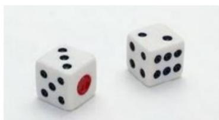

【注意】若觉得空间类难比较正常，学会方法技巧加上练习，本节课内容比之前的课程内容要容易。

# 考点一：六面体

1. 如果靠想象力：注意折叠方向

左边给定的是纸盒外表面的展开图，右边哪一项能由它折叠而成？

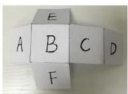

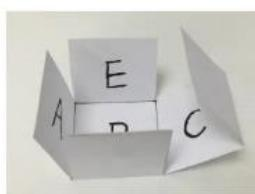

# 2. 如果靠技巧：所有的方法都是排除错误选项的

# 【注意】六面体:

1. 如果空间想象力很好，可以用想象力做题，要注意折纸的方向，题干会说折出纸盒的外表面，如上图，图1的方向是对的，图2不正确；若空间想象力很差，靠方法技巧做题即可。
2. 排除方法解题，如果选择 A 项，不需要知道为什么对，所有的方法和技巧都是排除错误选项，只需要知道 3 个选项错误，剩下的选项正确即可。

# 方法一：相对面

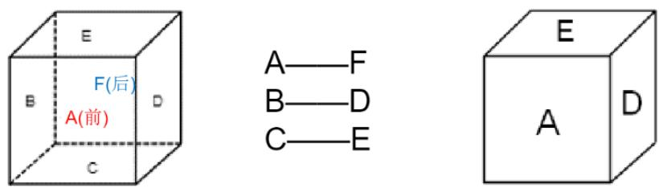

应用：一组相对面同时出现的选项——排除

# 【注意】相对面：

1. 如上下、左右、前后，如面 A（前）和面 F（后）是相对面，面 E（上）和面 C（下）是相对面，面 B（左）和面 D（右）是相对面。
2. 考试不会给出透视图，立体图只可以看到 3 个面，如上图，观察 3 个面，看到面 A 不能看到面 F，看到面 E 不能看到面 C，看到面 D 不能看到面 B，相对面不能同时出现，一组相对面同时出现的选项，排除。

# 展开图中如何判断相对面？

1.同行或同列相隔一个面

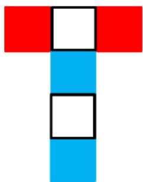图一

2. “Z”字形两端（紧邻“Z”字中线的面）

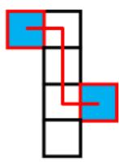

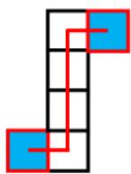
图二

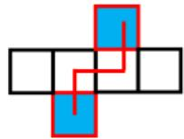

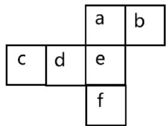
图三

【注意】展开图中判断相对面：

1. 同行或同列相隔一个面：如图一，两个红色中间间隔一个白色，两个红色是相对面。两个白色中间间隔一个蓝色，两个白色是相对面。两个蓝色中间间隔一个白色，两个蓝色是相对面。
2. “Z”字形两端（紧邻“Z”字中线的面）：

(1) 如图二, 蓝色面在 “Z” 字中线两端, 蓝色面是相对面。“Z” 字有 3 条线, 中间的线是中线, 中间紧邻着的两端是相对面。
(2) 如图三, 紧邻 “Z” 字中线的面, 面 b 和面 d 是相对面。面 a 和面 f 中间间隔一个面, 是相对面。面 c 和面 e 中间间隔一个面, 是相对面。

【例1】（2021事业单位）下图是给定的纸盒的外表面，选项中哪一个是由此外表面折叠而成的纸盒？

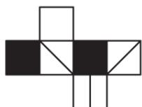

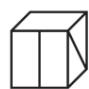
A

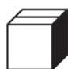
B

C

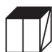
D

【解析】1. 先不找题干的相对面，可能不能用相对面做题，也可能会忘记谁和谁相对，做题首先看选项，先定位选项的面，然后看是否出现相对面。

A 项：正面是竖线面，白色面对应对号面，如下图，两者是“Z”字两端的相对面，相对面不能同时出现，排除。
B 项：该项的正面和顶面也是 “Z” 字两端的相对面, 如下图, 相对面不能

同时出现，排除。

C项：正面是黑色面，不知道是题干哪个面，上面和右面对应题干2个斜线面，两个面是相对面，不能同时出现，排除。

A、B、C项均排除，D项当选。【选D】

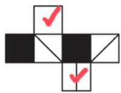

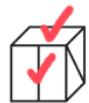
A

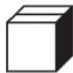
B

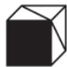
C

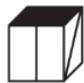
D

【例 2】(2022 天津) 左边给定的是纸盒的外表面, 右边哪项能由它折叠而成?

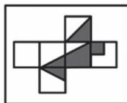
A

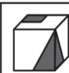
B

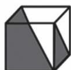
C

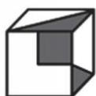
D

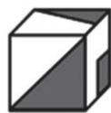

【解析】2. 标号 1-6，标号只是为了方便讲解，自己做题可以不标号。

A 项：正面和右侧面一个是面 2、一个是面 6，顶面是面 4，面 2 和面 4 是中间间隔一个面的相对面，相对面不能同时出现，排除。
B 项：正面是面 3，右侧是面 5，面 5 和面 6 是相对面，顶面不可能是 6，顶面是 2，没有涉及相对面，保留。
C项：正面是面4，顶面是面5，右侧不能是面2，因为面2和面4是相对面，也不能是面6，因为面5和面6是相对面，排除。
D 项：正面是 5，右侧是面 4，上面不能是面 2，因为面 2 和面 4 是相对面，也不能是面 6，因为面 5 和面 6 是相对面，排除。【选 B】

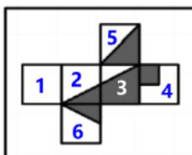
A

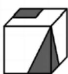
B

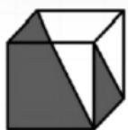
C

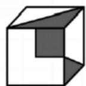
D

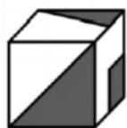

方法二：相邻面——公共边

如何确定公共边：

1. 平面图中构成直角的两条边是同一条边

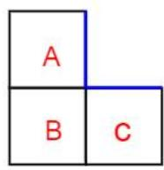

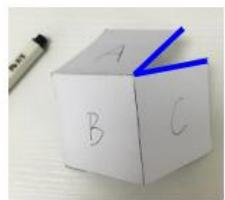
图一

图二

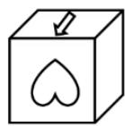

2. 一列/行连着4个面，两头的两条边是同一条边

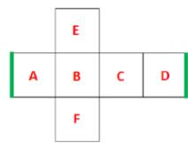
图三

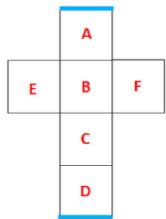

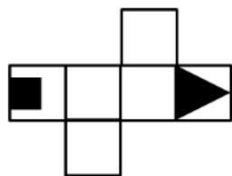
图四

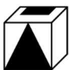

3. “ $3 + 1$  构成 L 形”，同方向的两条边是同一条边

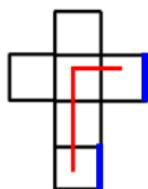
图五

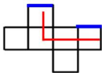

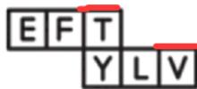
图六

【注意】相邻面——公共边：两个面挨着的边就是公共边。

1. 平面图中构成直角的两条边是同一条边。

(1) 如图一, 面 A 的右侧边、面 C 的上边构成直角边, 两条边是同一条边。（2）如图二，箭头和心形有公共边，在展开图中和立体图中找到公共边，立体图中心的“尖”对着公共边，展开图心的侧面对着公共边，而不是“尖”对着公共边，对应不一致。

2. 一列/行连着4个面，两头的两条边是同一条边。

（1）如图三，图1的A、B、C、D这4个面连在一起，面E是“盖”，面F是“底”，面A、B、C、D可以围成一圈，左右两头的两条边是同一条边。可以将面A移动到面D右边，原来A的左侧是公共边，移动过来之后没有任何变化，

A 的左侧是公共边, 4 个面连在一起, 左边的面可以移动到右边, 右边的面可以移动到左边。图 2 的 A、B、C、D 这 4 个面连在一列, 上下蓝色边是公共边, 一列 4 个面同理, 上面的面 A 可以移动到面 D 下面, 下面的面 D 可以移动到面 A 上面。

(2) 如图四, 展开图中 4 个面连在一起, 最左侧和最右侧是公共边, 展开图中公共边挨着黑方块, 立体图中公共边没有挨着黑方块, 对应不一致。

3. “ $3 + 1$  构成 L 形”，同方向的两条边是同一条边（比较难）。

（1）如图五，图2上面1个面和下面3个面构成L型，短边指着的边和另一侧上边是公共边。可以记忆为直角边是公共边，往左、往右延伸一次之后依然是公共边。“L”型像是一个人在坐着，头和脚就是公共边。
(2) 如图六, 涉及面 F、T、V 这 3 个面, 构成 “  $3 + 1$  ” “L” 型, 红边是公共边, 立体图 “V” 的尖对着公共边, 展开图中 “V” 的开口对着公共边, 对应错误。

【例3】（2023江苏）左边给定的是一个六面体的外表面展开图，右边哪一项能由它折叠而成？

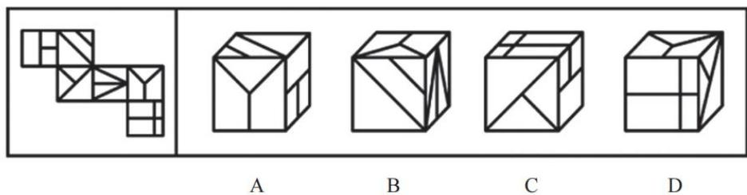

【解析】3. 标号 1-6，对应选项的面。

A项：正面是面5，顶面是面2，右侧是面1，面1和面2挨着有公共边，该项的“T”方向反了，该项是面1大长方形挨着公共边，展开图是面1中2个小正方形挨着公共边，排除。

B 项: 正面是面 2, 顶面是面 5, 右侧是面 4, 面 2 和面 4 的公共边没有问题, 面 5 和面 4 的公共边没有问题, 面 5 和面 2 是 “L” 型, 可以看公共边, 没有问题, 不建议直接选择该项, 考试时很紧张, 可能会犯错, 建议看完剩余选项, 保留。

C 项：正面是面 3，顶面是面 6，右侧是面 1，该项面 3 的长斜线和面 1 的小

竖线挨得很近，立体图中面 3 的长斜线和面 1 的小竖线并没有挨着很近；该项面 1 的 “T” 字左边是正面（面 3），展开图中面 1 的 “T” 字右边是面 3；还可以看面 1 和面 6 的公共边，该项面 1 的 2 个正方形挨着面 6 的长方形，展开图中面 1 的正方形挨着面 2，面 6 长方形挨着面 4，对应不一致，排除。

D项：正面是面6，顶面是面5，右侧是面3，面5和面3是相对面，相对面不能同时出现；面3和面6是“L”型，该项公共边挨着小三角形，展开图公共边挨着大三角形，排除。

答疑：六面体中两个面不是相对面就一定有公共边。【选B】

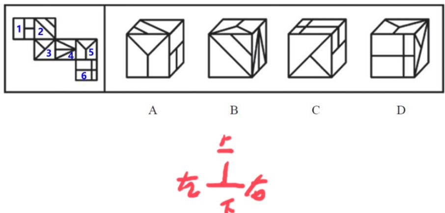

【例 4】(2024 江苏) 左边给定的是六面体的外表面展开图, 右边哪一项能由它折叠而成?

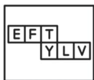

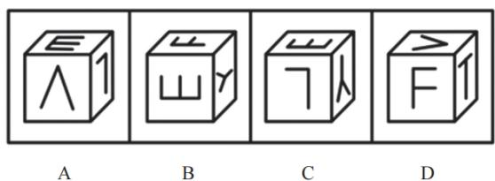

【解析】4.看选项定位面。

A 项：展开图中面“E”的开口对着“F”，该项“E”的开口对着“L”，对应不一致，排除。

B 项：展开图中 “Y” 的开口指着 “T”，该项 “Y” 的开口指着 “E”，排除。

C项：“Y”和“L”没有问题，“E”和“Y”是“L”型，展开图“Y”的尖指着“E”，该项也是“Y”的尖指着“E”，没问题，保留。

D 项: “L”型的头和脚是公共边, 展开图 “V” 的开口对着 “T”, 该项是

“V”的尖对着“T”，排除。【选C】

【例5】（2024国考）左图为8个白色正方体和4个灰色正方体粘接而成的长方体，右边哪一个可能是其外表面展开图？

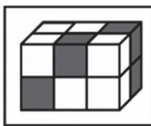

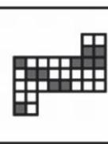
A

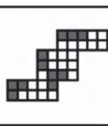
B

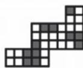
C

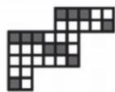
D

【解析】5. 本题比较难，正确率在  $30\% \sim 40\%$  。本题和前面的题不一样，是小正方体组成，类似魔方。题干说明8个白色正方体和4个灰色正方体，4个灰色正方体都可以看到，看不到的是白色块。

公共边等长且同色，如下图一，红色的公共边，两侧的颜色一定相同，因为小立方体是个整体，公共边一定等长且相同颜色，只需要找直角边的公共边，如下图二。

A 项：画出直角边的公共边，2 个白色挨着 1 白 1 灰，排除。
B 项：直角边没问题，保留。
C 项: 直角边没问题, 保留。
D 项：直角边没问题，保留。

接下来看每个面中的灰块数量不能出错，每个面中的灰色块是确定的，正面有2个灰色，顶面是2个灰色，右侧面是2个灰色，下面是2个灰色，左侧面是1个灰色，后面是2个灰色，1个面中不能出现3个灰色，分割选项中的面。

B 项：如下图三，红色直角边是公共边，公共边等长，则左下是个长方形，紧挨着右侧也是长方形，直角边是公共边，右上也是长方形，左上是正方形，蓝色对号面是 3 个灰块，排除。
C项：如下图三，直角边是公共边，分割面，左下是长方形，蓝色对号面是3个灰块，排除。

A、B、C项均排除，D项当选。
D 项：直角边是公共边，左下是正方形，中间都是长方形，右上是长方形，没有涉及 3 个灰块的面，考试时不需要看该项，排除 3 个选项就可以选择该项，

当选。【选D】

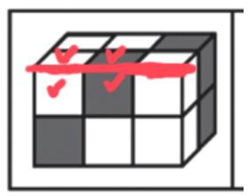
图一

图二

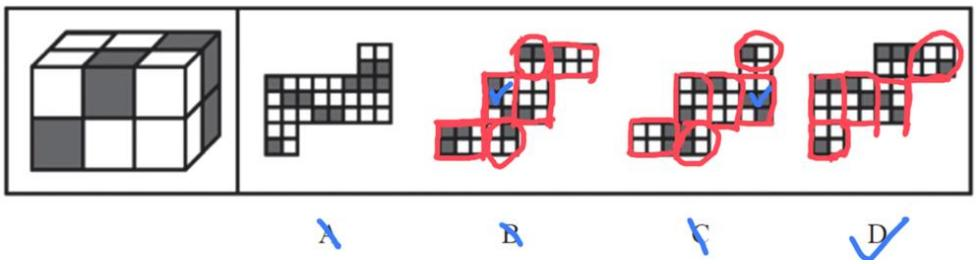
图三

# 【注意】

1. 公共边等长且同色。
2. 每个面中的灰块数量不能错。

练一练（2025国考）下图为4个黑色、8个白色正方体粘接成的长方体，问哪一项可能是其正确的外表面展开图？

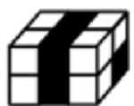

【解析】拓展.找公共边颜色相同，如下图。

A项：2个白色挨着1白1黑，排除。

B 项：红色直角边是白色和黑色挨着，排除。

C项：直角边是2个白色挨着1白1黑，排除。

A、B、C项均排除，D项当选。

答疑：关于面的分割问题。利用直角边，直角边是公共边，直角边是2个方块就是正方形，3个方块就是长方形。【选D】

方法二：相邻面——公共点

如何确定公共点：

相邻三个面的公共点是唯一的

图一

图二

【注意】相邻面——公共点：

1. 相邻的 3 个面有相同的点，看公共点周围是否有问题，引出几条线、是否挨着阴影，有问题就排除。
2. 练习：

(1) 如图一, 立体图的公共点是圈出的点, 在展开图中找到对应的面, 圈

出的点是公共点，展开图公共点挨着黑色三角形，立体图公共点没有挨着黑色三角形，对应不一致。

(2) 如图二, 蓝色点是公共点, 在展开图中找到对应的面, 借助直角边找公共点, 红色直角边是公共边, 红色边会重合, 画圈的 2 个点是同一个点, 蓝点是公共点, 展开图公共点引出 2 条线, 立体图中公共点引出 1 条线, 对应不一致。

三个面挨在一起——优先公共点
三个面没有挨在一起——优先公共边

图一

图二

【注意】用公共点还是公共边没有绝对的优先级，有时用公共边，有时用公共点，有时公共边或者公共点都可以。3个面挨着，公共点好找可以看公共点，若3个面没有挨在一起，优先公共边。

1. 如图一，3 个面挨在一起，公共点很好找，展开图中公共点没有引出线，立体图中公共点引出 1 条线，对应错误。
2. 如图二, 3 个面离得比较远, 不好找公共点, 看公共边, 4 个面连在一起,最左侧和最右侧是公共边, 立体图公共边挨着全白, 展开图中挨着一半白、一半阴影, 对应错误。

【例 6】(2024 浙江选调) 左边给定的是纸盒的外表面, 右边哪项能够由它折叠而成?

【解析】6. 标号 1-6, 面 1 和面 3 不一样, 面 1 在中点, 面 3 在三分之一处,三角面积更小一些, 看选项定位面。

A 项: 正面是面 2 或者面 6, 顶面是面 3, 右侧是面 1, 有面 1 不能有面 6, 属于 “Z” 字两端的相对面, 则正面是面 2, 3 个面挨着, 观察公共点, 该项公共点挨着面 1 和面 2 的黑色, 展开图公共点挨着 3 个面的黑色; 也可以看面 1 和面 3 的公共边, 直角边是公共边, 该项公共边挨着面 3 白色, 展开图中公共边挨着面 3 的黑色, 排除。
B 项: 正面是面 2 或者面 6 , 先看知道的面, 顶面是面 5 , 右侧是面 1 , 有面 1 不能有面 6 , “Z” 字两端的相对面, 则正面是面 2 , 面 1 和面 2 的公共边没有问题, 面 2 和面 5 是 4 个面连在一起, 两头是公共边, 也没有问题, 面 1 和面 5 不好观察, 保留。
C项：正面是面4，顶面是面3，右侧是面1，“L”型，如下图二，头和脚是公共边，该项是黑色和黑色挨着，展开图是面4的黑色挨着面1的白色；也可以看公共点，如下图三，直角边是公共边，画圈的点是公共点，展开图公共点只挨着面3和面4的黑色，没有挨着面1的黑色，该项公共点挨着3个面的黑色，排除。
D 项：原图中只有一个面 5，该项出现 2 次，其中一个是无中生有的面，排除。【选 B】

图一

图二

图三

【例 7】(2024 联考) 右边哪项不能由左侧展开图折叠而成?

【解析】7. 本题比较难。首先看问法，问“哪项不能由左侧展开图折叠而成”，找错误的选项。面3和面5长得一样，需要判断是哪个面。

A项：正面是面1，左侧是面4，展开图中面3的线垂直面4的公共边，面5的线平行公共边，该项顶面的线垂直面4的公共边，则该项顶面是面3，没看出问题，排除。
B 项：正面是面 6，左侧是面 2，该项面 2 和顶面的线连在一起，展开图面 2 和面 5 的线没有连在一起，则顶面是面 3，面 3 和面 6 的公共边看不出问题，面 2 和面 6 的公共边看不出问题，排除。
C项：正面是面4，上面是6，左侧面和面4公共边平行，展开图面3和面4公共边垂直，则左侧不能是面3；如果左侧是面5，3个面挨在一起有公共点，该项公共点引出面6的斜线，展开图中公共点没有引出面6的斜线，该项不可能，考试直接选择该项，当选。
D 项：顶面是面 1，左侧是面 2，正面不是面 5，因为展开图面 5 的线和面 1 垂直，而该项平行，考虑正面是面 3，面 1 和面 3 构成 “L” 型头和脚是公共边，面 3 的线和公共边平行，该项没有问题，排除。【选 C】

方法二：相邻面——画边法

(1)结合选项, 找一个特殊面的唯一点或唯一边

a

b
图一

C

(2)顺/逆时针方向描边标号（描同一个面）

图二

(3)题干与选项对应面不一致——排除

图三

【注意】画边法：必会的万能方法，如果前面的方法不懂，可以学画边法弥补，可以做出大多数题目，刚开始学习可能比较复杂，但应用比较简单。

1. 结合选项，找一个特殊面的唯一点或者唯一边。

(1) 唯一点: 如图一, 一个面有 4 个顶点, 如果有一个顶点和其他顶点长得不一样, 则是唯一点。
(2) 图一中, 图 a 的 4 个蓝色点长得都一样, 没法区分谁是谁, 没有唯一点; 图 b 中两个蓝色点没法区分, 两个绿色点没法区分, 都不是唯一点; 图 c 中两个蓝色点不好区分, 但红色点和其他点不一样, 红色点只引出一条小短线,

两个蓝色点引出长对角线，红色点是唯一点。除此之外橘色点也是唯一点，因为橘色点没有引出线条。

2. 顺时针方向描边标号（描同一个面）。如图二，立体图形中黑色方块挨着的点是唯一点，在展开图中也可以找到相同面上相同的黑色方块挨着的点，把面a看成一个“操场”，顺时针跑一遍，跑的第一条边是边1，顺时针下一条边是边2，依此类推，标记边  $1 \sim 4$ 。
3. 题干与选项对应面不一致——排除。如图二，立体图形边 1 对应白色面，展开图中边 1 对应“×”面，对应不一致，可以排除选项。
4. 唯一边：除了唯一点也可以找唯一边。如图三，面 f 中没有唯一点，但有唯一边，只有一条边是纯黑色的，标记为边 1，沿着顺时针标记边  $1 \sim$  边 4，在展开图和立体图形中都标记边  $1 \sim$  边 4。展开图和立体图形中边 1 都标记空白面，但展开图中边 4 标记面 b，立体图形中边 4 标记面 d，对应不一致。
5. 例 3 的 C 项：可以用画边法处理，C 项右面“T”指着的边是唯一边，顺时针标记为边  $1 \sim$  边 4，在展开图中按照同样的方式标记边  $1 \sim$  边 4，展开图中边 1 标记的面和选项中边 1 标记的面不同，直接排除 C 项即可。
6. 实际做题的时候，如果对画边法熟练，画边可以在心里进行，不需要实际画出来，一开始可能比较慢，真正学会之后实际上是很快的。

【例 8】(2024 四川) 左图是给定纸盒的外表面, 右边哪项能由它折叠而成?

【解析】8. 本题较难，难点在于展开图中面 a 和面 e 长得一样，面 b 和面 c 长得也是一样的。可以先尝试公共边、公共点的方法能不能解题。

A项：上面为面d，右面为面f，立体图形已经有面d则正面不能是面a，因为展开图中面a和面d是相对面，则正面只能是面e。根据公共边、公共点看不出问题，先放着。

B 项：上面为面 d，右面为面 e（面 a 和面 d 是相对面，则能是面 a），正面

为面 b（面 e 和面 c 是相对面），看不出问题，先放着。

C 项：上面一定是面 f，右面一定是面 d，则正面不能是面 a，只能是面 e，看不出问题，先保留。
D 项：正面、右面可能是面 b 或面 c，则上面只能是面 a（面 c 和面 e 是相对面），展开图中三个面紧密相连，直接看公共点，展开图中公共点挨着面 a 的大长方形，选项中公共点挨着面 a 的小正方形，对应不一致，排除。

看公共边和公共点选不出答案，考虑画边法，A、B、C项都出现了面e，根据面e画边就可以判断3个选项。面e没有唯一点，但有唯一边，有一条边没有挨着内部的“T”字，这个边是特殊边，把这个边标记为边1，在展开图中和A、B、C项中从同一条边1按照顺时针画边标记为  $1 \sim 4$  。

A项：展开图和选项的边1挨着“十”字面，没有问题；展开图中边2挨着面b，选项中边2挨着面f，对应不一致，排除。
B项：展开图中边4挨着面f，选项中边4挨着面b或者面c，对应不一致，排除。

A、B、D项均排除，C项当选。【选C】

A

B

C

D

A

B

C

【例9】（2022国考）下列纸盒的外表面展开图中，哪项折叠成的纸盒和其他三个不一样？

A

B

C

D

【解析】9. 问“哪项折叠成的纸盒和其他三个不一样”，遇到这种问法的题目，统一用画边法，有时候公共边或者公共点没法解题，但画边法一定可以解题。在展开图中找有唯一点或者唯一边的面，只有面3和面6没有，其他几个面都有唯一点或者唯一边。这种题目有出题的套路， $90\%$  的题目中都可以用A项最左侧的面画边来解题。在A项中最左侧的面中，黑球挨着的顶点是唯一点，按照顺时针标记为边  $1 \sim$  边4，在其他选项中也按同样的方式标记边。这里A项中边1挨着的面不知道是谁，边2挨着的面也不知道是谁，则只要知道边3和边4挨着的面是谁即可。

A 项: 边 3 有 “  $3 + 1$  ” 的 “L” 型的公共边, 则边 3 挨着黑色小球面。

B 项：边 3 挨着黑色方块面。

C 项: 边 3 挨着黑色方块面。

此时 B、C 项边 3 挨着的面是一样的，A 项和 B、C 项不一样，则直接选择 A 项即可。验证 D 项（考试的时候不需要验证），D 项的边 3 也是挨着黑色方块面，没有问题，A 项当选。【选 A】

A

A

B

C

D

【2022联考】

A

B

C

D

【2024联考】

A

B

C

D

画边：

【2022联考】

A

B

C

D

【2024联考】

A

B

C

D

# 【注意】拓展：

1. 2022 联考：如果 A 项最左边有两个面，就找左上方的面。以扇形的直角顶点为唯一点，在四个选项中按照顺时针标记为边  $1 \sim$  边 4, A 项的边 1 挨着“T”字，B 项的边 1 挨着 “T” 字，C 项的边 1 挨着 “T” 字，D 项的边 1 挨着三角形面，D 项和其他选项不一致。
2. 2024 联考: 在 A 项最左边的面画边, 以纯黑色的边为边 1 , 顺时针画边标号, 在四个选项中标记出边  $1 \sim$  边 4 , A 项的边 1 看不出挨着谁, 但边 2 挨着一白一黑, B 项的边 2 挨着一黑一灰, C 项的边 2 挨着一白一黑, D 项的边 2 挨着 1

白一黑，B项和其他选项不同。

3. 技巧：如果 A 项最左边只有一个面，就用这个面画边；如果 A 项最左边有 2 个面，就用左上方的面画边。

六面体小结【注意】六面体小结：

1. 先看相对面，同行或同列相隔一个面是相对面，“Z”字形两端（紧邻 Z 字中线的面）是相对面；一组相对面同时出现的选项要排除。
2. 公共边：平面图形构成直角的两条边是公共边；一行/列四个面，两头的两条边是公共边；“L”型的“头”和“脚”是公共边。
3. 公共点：相邻三个面的公共点是唯一的。
4. 画边法：同一个面、同一个起点、同方向（要么都顺时针，要么都逆时针）画边标号。
5. 画边法要么找唯一点、要么找唯一边；一个面不一定只有一个唯一点或者唯一边。

# 二、截面图

截面图——指的是被切部分的形状

截面图

【注意】截面图：给一个立体图形，拿刀切成两半，注意截面图是指被切的部分紧紧挨着刀面的部分，如图中只有阴影部分是截面。

常见立体图形截面（以最常见的六面体、圆柱、圆锥、圆台等基础图形为例）

# 1. 正方体/长方体

(1) 矩形 (拦腰切、上下切、斜切)

（2）梯形（斜切）

(3) 三角形（从棱上的某一点开始斜着切到面）

PS: 正方体/长方体只能切出锐角三角形

【注意】常见立体截面图：不会考查特别特殊的，考查的都是比较常规的，难题都是把常规的立体图拼在一起看，只要把常规的基础题型能够截出哪些图形记住，考试的时候就会比较容易把题目做出来。

# 1. 正方体/长方体:

(1) 矩形（横着拦腰切、上下切、斜切，垂直于一个面切即可切出）。(2) 梯形 (斜切)。(3) 三角形（从棱上的某一点开始斜着切到面）。

2. PS: 长方体/正方体只能切出锐角三角形, 切不出直角三角形和钝角三角形, 这里可以用余弦定理证明, 但做题不需要知道如何证明, 知道结论即可。
3. 梯形斜切, 切不出直角梯形, 能切出两边都是直的, 但切不出来一边是直的。

# 2. 圆柱

(1) 圆 (横切) (2) 椭圆 (斜切) (3) 矩形 (竖切)

注意：圆柱斜切，切不出梯形

# 3. 圆锥

（1）圆（横切）（2）椭圆（斜切）（3）三角形（竖切）

# 4. 圆台

(1) 圆 (横切) (2) 椭圆 (斜切) (3) 梯形 (竖切)

【注意】圆柱、圆锥、圆台：

1. 圆柱：

(1) 圆 (横切)。(2) 椭圆 (斜切)。(3) 矩形（竖切）。(4) 注意: 圆柱斜切, 切不出梯形。如果梯形斜切, 如图所示, 去掉上半部分和下半部分只留下中间部分, 切出的图形中两侧是弧线, 不能是直线, 则不能是梯形。

2. 圆锥：

(1) 圆 (横切)。(2) 椭圆 (斜切)。(3) 三角形（经过顶点竖切）。

3. 圆台

(1) 圆 (横切)。(2) 椭圆 (斜切)。(3) 梯形（竖切）。

4. 如果三种图形从侧面斜切到底面，切出的是“D”形（半圆弧+直线），这里的弧一定是椭圆的弧，一般不会在这里设坑，因为椭圆的弧会无限接近于半圆弧。

截面图中常挖的“坑”

(1) 正六面体, 不能切直角三角形、钝角三角形、直角梯形
(2) 圆柱, 不能切出梯形

【哪项不可能】

A

B

C

D

【注意】截面图中常挖的“坑”：

1. 正六面体，不能切直角三角形、钝角三角形、直角梯形。
2. 如图，题干可以拆分成两个六面体，六面体切不出直角三角形，可以直接选择C项；A项从原图的正面或者下面可以直接看到，能看到就可以切出；长方体也可以切出锐角三角形和梯形，排除B、D项。
3. 圆柱不能切出梯形。

【例1】（2021广东）下图所示立体图形沿OMN面斜切，由切面所见截面最可能是：

A

B

C

D

【解析】1. 图形上下是圆柱，斜切的时候两侧一定是弧线，只有D项符合，D项当选。【选D】

【例2】（2020国考）左图为给定的立体图形，将其从任一面剖开，右边哪项不可能是该立体图形的截面？

A
B
C
D

【解析】2. 上方和下方都是圆柱少了一部分，都相当于圆柱，问“不可能的截面”，选非题。

A 项：直接经过下方竖切可以切出，排除。
B 项：上方往下斜着切可以切出三角形，继续斜切，刀经过下方的圆柱，两侧一定是弧线，不能是直线，切不出来，当选。
C 项：从上到下竖切可以切出，排除。
D 项：竖切可以切出，上方的矩形调整角度就可以得到，排除。【选 B】

A
B
C
D

截面图中常挖的“坑”

(1) 正六面体, 不能切直角三角形、钝角三角形、直角梯形
(2) 圆柱, 不能切出梯形
(3) 当图形中挖空了一个小图形时, 注意 “空心” 没有实线

【哪项不可能】
A
B
C
D

(4) 复杂图形做拆分, 不同角度, 不能共存

【注意】截面图中常挖的坑：

1. 正六面体，不能切直角三角形、钝角三角形、直角梯形。
2. 圆柱，不能切出梯形。
3. 当图形中挖空了一个小图形时，注意“空心”没有实线。如图，刀面是涂黑的，胡萝卜切开的截面中，中间空着的地方没有挨着刀面，所以是空的。
4. 例：问哪项不可能切出。A 项有两个圆，横切即可；B 项要得到长方形需要竖着切，但立体图形中间是空的，竖着切不能有线，当选；C 项斜着切即可；D 项不经过空心的地方竖着切即可。
5. 注意用刀切的时候必须是“一刀切”，不能拐弯。
6. 复杂图形做拆分，不同角度，不能共存。如图，立体图形可以拆分为上下两个六面体，截面也可以拆分成上方三角形、下方矩形。上方要切出三角形需要斜着切，斜着切刀下面，切不出梯形，因为下方要切出梯形需要竖着切，但刀不能拐弯，切不出来。

【例3】(2019四川下)左图给定的是由4个相同正方体组合成的立体图形，将其从任一面剖开，右边哪一项不可能是该立体图形的截面？

【解析】3. 立体图形是 4 个正方体组成的，问“不可能的截面”，选非题。如果不知道怎么做，可以排除法解题。

B 项：从左边、右边、下面都能看到，能看到就一定可以切出，排除。

C 项：一定可以切出正方形，竖着切一刀即可，排除。

D 项：锐角三角形一定可以切出，排除。

综上，B、C、D项均排除，A项当选。

A 项: 上方斜着切可以切出三角形, 但下方的矩形必须直着切, 而刀不能拐弯, 切不出来, A 项当选。【选 A】

B

C

D

【例 4】(2025 国考) 左边为给定的多面体, 现用经 P、Q、R 三个顶点的平面对其进行切割, 则哪个选项是其切面?

A

B

C

D

【解析】4. 属于创新考法，经 P、Q、R 三个顶点的平面对其进行切割，问哪个选项是切面。根据高中知识，三个点一定能构成一个唯一的平面，要把这个面画出来，第一件事是连接两个点，让这条线在立体图形的表面，先连接 PQ。过点 R 做 PQ 这条直线的平行线，因为两条平行线可以确定唯一一个平面，这样就可以得到下刀和出刀的两条线，这样切出来的是一个长方形，B 项当选。【选 B】

【注意】解题步骤：

1. 连接两个点，让两个点的连线在立体图形的表面。

# 2. 过第三个点做连线的平行线。

练一练（2025国考）左边为给定的多面体，现用经P、Q、R三点的平面对其进行切割，问哪个选项是其切面？

A

B

C

D

【解析】拓展. 根据方法, 连接 PQ 两个点, 连线在图形的表面。过 R 做 PQ 的平行线, 斜着切, 可以切出两个矩形, A 项当选。【选 A】

【例 5】（2024 国考）左图为 13 个白色正方体和 5 个灰色正方体组合而成的多面体，现用经 A、B、C 三个顶点的平面对该多面体进行切割，正确的截面是：

A
B

D

【解析】5. 本题稍难，同样经过3个点切，连接AB，连线AB在立体图形表面，过C做AB的平行线，连接之后是斜切的。题干中5个灰色方块都在表面上，则看不到的地方一定是白色的。

切的时候是沿着对角线切的，如图，红色箭头指着的一行可以切到，蓝色箭头指着的一行可以切到，粉色箭头指着的一行可以切到。红色的箭头切到了 3

个白色，蓝色的箭头切到了空、灰色、白色，粉色的箭头切到了白色、灰色、白色，画出对应的图形，注意观察的方向可以旋转，B项当选。

也可以不画，红色的箭头会切到0个灰块，蓝色的箭头只能切到1个灰块，粉色的箭头只能切到1个灰块，A项有3个灰块，C项有3个灰块，排除A、C项。B、D项的区别在于中间，B项中间是灰色，D项中间是白色，立体图形中间是灰色，B项当选。

这种题目一定是按照对角线切的，因为选项是长方形方块，横着切、竖着切都是正方形，只有斜着切是长方形；斜着切的时候，如果不按照对角线切，竖着的三个方块的边长不是一样长的，只有按照对角线切的时候才是一样长。【选B】

【拓展】（2024联考）下图为15个白色和5个灰色正方体组合而成的多面体，将其经A、B、C三个顶点切开后，正确的截面是：

A

B

C

D

【解析】拓展. 连接 AB, 过 C 做 AB 的平行线, 沿对角线切, 用三个箭头表示, 红色箭头经过 0 个灰色, 蓝色箭头经过 0 个灰色, 粉色箭头经过 0 个灰色, 一个灰色块都没有切到, 排除 B、D 项。

比较 A、C 项，A 项有 2 个空，C 项有 3 个空，红色箭头会切到 2 个空，粉色箭头会切到 1 个空，一共会切到 3 个空，C 项当选。【选 C】

考点三：三视图

考查立体图形的多个观察角度：

主视图（从正面看）

左视图（从左侧看）

俯视图（从上向下看）

【注意】考点三：三视图。

1. 考查立体图形的多个观察角度：

(1) 主视图（从正面看）。(2) 左视图（从左侧看）。(3) 俯视图（从上向下看）。

2. 严格意义上三视图指的是主视图、左视图、俯视图，考试的时候后视图、仰视图、右视图也都有可能会考查，记住考试中三视图指的是不同观察角度看到的平面。

# 三视图

(1) 观察到的视图都是平面图

(2) 原图有线就有线, 原图没线就没线

1

2

(3) 当被遮挡住时, 看不见被遮挡部分

图一

2

3

(4) 某些角度下弧或斜线会被压平

【注意】三视图重点：

1. 观察到的视图都是平面图。
2. 原图有线就有线，原图没线就没线。如图一，1 和 2 的观察角度相同，区别是 2 上面有线，1 没有，原图没有线，则 2 错误。
3. 当被遮挡住时，看看不见被遮挡部分。如图二，立体图形一定是左前方观察的，立体图形后面确实有一根线，但被三角形和长方形挡住了，则 3 一定是错误的，2 一定是正确的；1 也是正确的，画成虚线也是对的，按照严格的工程制图来说，最完美的画法是看不见的地方画虚线，但考试不严谨，大多数的题目看不见的就不画线，画虚线和不画线二者都是对的。
4. 从某些角度看，弧线会被压平。如图三，圆柱从上往下看，看到的是一个圆；如果从左边看或者右边看，相当于把圆柱拍到墙上拍扁，得到的是一个长方形，看不到弧线。从上方平面水平的方向看的时候，弧线就会被压平，如果斜着看得到的是椭圆，但考试中斜着看的非常少，大多数都是前后左右上下这6个角度。

【例1】（2021国考）左图为给定的多面体，从任一角度观看，右边哪项可能是该多面体的视图？

A

B

C

D

【解析】1. 如果不看内部、只看外轮廓，立体图形从左或者从右边看的轮廓都是相同的，只是内部不同，所以观察选项的时候遇到轮廓相同的可以一起观察。如选项中A、C项的轮廓是相同的，只是相对着的角度，可以一起观察。

A、C 项：A 项是从下面看，但“刀把”的地方应该是斜着的，不是直角的，C 项同理，均排除。
B 项：从正面看可以得到，没有问题，当选。
D 项: 上方的长方形是从侧面看的, 原图中下方左右两边的直线应该是平行的, 但选项中下方是斜线, 选项错误, 排除。【选 B】

【例 2】（2024 江苏）左图是由 14 个黑白小正方体组成的立体图形，右面四个选项中有一项不是该立体图形的视图，请把它找出来。

A

B

C

D

【解析】2. 问“不是……的视图”，选非题。A、D 项的轮廓相同，只是相对的角度，二者一起观察。从正面可以看到“L”型，可以看到 2 个灰块，但不是 A 项也不是 D 项；从后面看，最下方的两个是灰色的，D 项有 2 个灰色，说明 D 项是从后面看的，则 A 项是不可能的，因为 A 项的轮廓要么是从正面、要么从后面看，但 A 项从正面和后面均不可能，则 A 项当选。

B 项: 从上往下俯视看, 可以看到 4 个灰块, 位置也没有问题, 排除。
C 项: 从右边看不行, 因为从右边看的话, 最下方凸出的白色块应该在左边,

则选项是从左边看的，可以看到4个灰色，位置也没有问题，排除。【选A】

测验1.左边给定的是正方体的外表面展开图，下面哪一项能由它折叠而成？

【解析】拓展1.对应面找关系。

A 项：正面和顶面在展开图中是相对面，相对面不能同时出现，排除。
B 项：正面和右面在展开图中有公共边（一行四个面两头的两条边），展开图中两个灰色方块没有挨着，选项中两个灰色方块挨在一起，对应不一致，排除。
C 项：相邻面看不出问题，先放着。
D 项：右面和顶面在展开图中是相对面，相对面不能同时出现，排除。

A、B、D项均排除，C项当选。【选C】

测验2.从一个圆柱体中挖去一个圆柱体和一个圆锥体，得到的立体图形如左图所示。则右边不可能是它的截面的是：

【解析】拓展2.课堂正确率为  $61\%$  ，易错C项。问“不可能”，圆柱斜切不切到空心就可以得到椭圆，A项排除。

圆柱从上到下竖着切，不切到空心就可以切出长方形，排除B项。

C项上面是倒三角形、下面是长方形，竖切可以切出，排除C项。

D 项外面是个椭圆，内部是圆，横切得到圆，斜切得到椭圆，不同的角度不能共存，不能拐弯，D 项当选。【选 D】

测验3.左边为给定的立体图形，从任一角度观看，下面哪项不是该多面体的视图？

【解析】拓展 3. 课堂正确率为  $82\%$  。问 “不是”, A、D 项轮廓一样, 正面是 A 项, 背面是 D 项, 都可以看到, 排除 A、D 项。

B 项：如下角度可以看到，排除。

C 项是从上往下观察, L 型和矩形没有对齐, 题干是对齐的, 小横线位置不对, C 项当选。【选 C】

# 粉笔程永乐

2022-5-31来自微博网页版已编辑

图形推理练习题：网页链接

类比推理练习题：网页链接

定义判断练习题：网页链接

逻辑判断练习题：网页链接

数奇点的小练习：网页链接

GCT一拖五练习：网页链接

判断推理小技巧：网页链接

三视图立体拼合：网页链接

截面图和多面体：网页链接

类比二级辨析练习：网页链接

真假推理练习题：网页链接

判断推理思维导图：网页链接

图形推理的前世今生：网页链接

类比推理的前世今生：网页链接

【注意】空间类在国考的10道图推中考查3道题，非常重要。图形推理精讲至少要听2次，图形推理的前世今生至少听两次，每天跟着老师刷题刷一年，判断至少可以到  $80\%$  正确率。课下复盘本节课内容，老师会将图形推理练习题放置在如上“图形推理练习题”链接中。

# 【答案汇总】

六面体 1-5: DBBCD; 6-9: BCCA

截面图1-5：DBABB

三视图1-2：BA

遇见不一样的自己

Be your better self
