# 精讲精练-判断4

（笔记）

主讲教师：程永乐

授课时间：2025.04.14

# 精讲精练-判断4（笔记）

# 判断推理 精讲精练4

# 学习任务：

1. 课程内容：类比推理（逻辑关系）
2. 对应讲义：第  $240\sim 244$  页
   3.重点内容：

(1) 并列关系中矛盾关系与反对关系的区分
(2) 包容关系中种属关系与组成关系的区分
(3) 交叉关系的辨析及其与并列关系的区分
（4）常考的对应关系及其二级辨析

备注：前10页PPT为答疑内容

【注意】本节课讲解精讲精练4类比推理中的逻辑关系，对应讲义240-244页，前10页PPT用于答疑，是上一节课课上的例题，从11页开始是本节课的新内容。

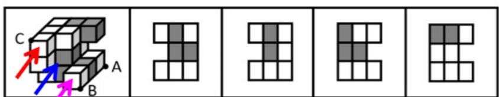
A
B
C
D

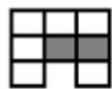

【注意】如上图，不同角度观察，开口方向则不同，图2在前方沿着  $\nearrow$  方向观察，图1在后方沿着  $\swarrow$  方向观察，不同角度观察到的截面都可以定位到B项。

# 第二章 类比推理

给出一组相关的词，要求通过观察分析，在备选答案中找出一组与之在逻辑关系上最为贴近或相似的词

重难点：

1. 不靠感觉，靠考点；建立出题人的思维体系
2. 学会对比择优，从不严谨到严谨

常见题型：

1. 两词型——A：B
2. 三词型——A：B：C
   3.填空型——A 对于（）相当于（）对于B

# 【注意】类比推理：

1. 大纲解读：题干给出一组词，要求选出在逻辑关系上与之最为贴近或相似的词。

(1) 逻辑关系: 类比有考点, 解题不能靠感觉造句, 而要靠考点, 识别出题干的考点后再选择答案。建立出题人的思维体系, 才能做得更好。(2) 最为贴近或相似: 对比择优。当排除 2 项、剩余 2 项纠结时, 通过对比择优选择最好的答案即可, 类比考查从不严谨到严谨的过程, 一定要对比选答案。

2. 以往国考类比考查 10 道题, 从 2025 年国考开始考查 5 道题, 题量有所减少。
3. 常见题型：

(1) 两词型——A : B。看 A、B 之间的关系即可。
(2) 三词型——A : B : C。可以看 A/B、A/C、B/C 之间的关系，任意两词的关系都有可能帮助选择答案。
(3) 填空型——A 对于 ( ) 相当于 ( ) 对于 B。代入选项后, 看前后关系是否一致。

逻辑关系

语义关系

语法关系

【注意】类比推理分为逻辑关系、语义关系、语法关系，其中逻辑关系考查最多，语义关系最多考查1道题，语法关系考查极少，一般考查0-1题，本节课先学习逻辑关系。

# 第一节 逻辑关系

考点一：全同关系

考点二：并列关系

考点三：包容关系

考点四：交叉关系

考点五：对应关系

【注意】逻辑关系：涉及全同、并列、包容、交叉、对应 5 个考点。

# 考点一：全同关系

$$
\mathbf {A} = \mathbf {B}
$$

老鼠：耗子

西红柿：番茄

上海：沪

# 【注意】

1. 全同关系：指两个词就是同一事物。比如“老鼠”就是“耗子”，“耗子”就是“老鼠”，二者可以画等号；“西红柿”就是“番茄”，“番茄”就是“西红柿”；“上海”就是“沪”，“沪”就是“上海”的简称。两词相等，即为全同关系。
2. 全同关系考查常识，涉及到不会的内容，利用排除思维解题。

# 【补充】生日：诞辰

A. 卡通：国画

B. 荷花：菡萏

C. 内角：外角

D. 奶奶：外祖母

【解析】拓展. 常说生辰, “生日” 和 “诞辰” 是一个意思, “生日” 就是 “诞辰”, “诞辰” 就是 “生日”, 二者可以画等号, 属于全同关系。

A 项: “卡通”一般指动画片, 与 “国画” 不同, 排除。

B 项：涉及常识，不知道“荷花”“菡萏”二者是不是全同关系，保留。

C 项: 图形 “内角” (内部的角) 和 “外角” (外部的角) 一定不一样, 排除。

D 项: “外祖母”是姥姥, 与“奶奶”不同, 排除。

据此A、C、D项排除，B项“荷花”=“菡萏”，属于全同关系，B项当选。【选B】

# 特殊考法

1.古今 纸鸢：风筝
2.中外 伊妹儿：电子邮件
3.别称 岳父：泰山

【注意】全同关系特殊考法：

1. 古今：“纸鸢”是古代的“风筝”，鸢是鹰科动物，“纸鸢”就是纸做的老鹰，“风筝”就是老鹰的形状，“纸鸢”和“风筝”是全同关系，分别是古代、现代的叫法。
2. 中外：一般是音译词，如“伊妹儿”是“电子邮件”英文Email的谐音，故“伊妹儿”与“电子邮件”是全同关系，属于中外音译词。
3. 别称: “岳父” 的别称是 “泰山”, 二者不是  $100 \%$  画等号的关系, 类似外号, 大致相同, 存在其他的称谓。与中国传统文化息息相关, 古时某人从芝麻官很快升职, 发现其 “岳父” 是大官, 故 “岳父” 是此人的靠山, 起到非常多的帮助, 用 “泰山” 指代 “岳父”。

【例】（2022联考）岳父：泰山

A.少女：娥眉

B. 儿子：孙子

C. 女婿：东床

D.兄弟：伯仲

【解析】例。“岳父”的别称是“泰山”，有原文“妻父亦曰岳父，或称曰泰山”，二者是全同关系。

A 项：古代女子眉毛比较细，“娥眉”指美丽的女子，而不是指“少女”，排除。
B 项: “儿子”与“孙子”不是一个意思, 排除。
C项：涉及常识，有一个大官给女儿找夫婿，大多数人很紧张，有一个人在东床上躺着很放松，就选择这位为“女婿”，此人是王羲之，“女婿”又称“东床”，

“东床”可以用来代指“女婿”，二者是全同关系，保留。

D 项：常说我们俩能力在“伯仲”之间，指能力差不多的意思，“伯仲”指“兄弟”之间的排序，而不是指“兄弟”，排除。【选 C】

东床 [dongchuáng] 插报 编辑 讨论 上传视频

汉语词汇 展开3个同名词条

东床就是女婿。对女婿称“东床”，源于晋代我国著名大书法家王羲之祖腹（也作坦腹）东床的传说。[1]

岳父, 意思是指妻子的父亲, 出自清顾张思《土风录》的的内容, 原文: 妻父亦日岳父, 或称日泰山。

【注意】“伯仲叔季”分别指老大、老二、老三、老四，也可称为“孟仲叔季”。其中“孟”和“伯”都是老大的意思，区别在于“孟”一般是庶出的长子，“伯”一般是嫡出的长子。

刘彻：汉武帝（2021重庆）

牵牛花：喇叭花（2020联考）

赵匡胤：宋太祖（2021重庆）

乞巧节：七夕节（2020联考）

合肥：庐州（2021重庆）

苦瓜：凉瓜（2016四川）

南京：建业（2021重庆）

矮瓜：茄子（2016四川）

桂：广西（2021山东）

纸鸢：风筝（2015吉林）

杜鹃花：映山红（2021山东）

芝麻：脂麻（2015吉林）

荷花：芙蕖（2019四川）

五行：木火土金水（2015陕西）

地瓜：甘薯（2019四川）

五味：酸苦甘辛咸（2015陕西）

# 【注意】全同关系积累：

1. 人名：皇帝谥号：如“刘彻：汉武帝”“赵匡胤：宋太祖”。
2. 城市古称：如“合肥：庐州”“南京：建业/金陵”。3.省份简称：如“桂：广西”。
3. 植物别称：如“杜鹃花：映山红”“荷花：芙蕖/菡萏”“地瓜：甘薯”“牵牛花：喇叭花”等。
4. 总结：以上均为考查过、常考、以后还会有可能重复考查的全同关系，后续刷题遇到不会的内容，注意补充积累。

<table><tr><td>名称</td><td>简称</td><td>行政中心</td></tr><tr><td>北京市</td><td>京</td><td>北京</td></tr><tr><td>天津市</td><td>津</td><td>天津</td></tr><tr><td>河北省</td><td>冀</td><td>石家庄</td></tr><tr><td>山西省</td><td>晋</td><td>太原</td></tr><tr><td>内蒙古自治区</td><td>蒙</td><td>呼和浩特</td></tr><tr><td>辽宁省</td><td>辽</td><td>沈阳</td></tr><tr><td>吉林省</td><td>吉</td><td>长春</td></tr><tr><td>黑龙江省</td><td>黑</td><td>哈尔滨</td></tr><tr><td>上海市</td><td>沪</td><td>上海</td></tr><tr><td>江苏省</td><td>苏</td><td>南京</td></tr><tr><td>浙江省</td><td>浙</td><td>杭州</td></tr><tr><td>安徽省</td><td>皖</td><td>合肥</td></tr><tr><td>福建省</td><td>闽</td><td>福州</td></tr><tr><td>江西省</td><td>赣</td><td>南昌</td></tr><tr><td>山东省</td><td>鲁</td><td>济南</td></tr><tr><td>河南省</td><td>豫</td><td>郑州</td></tr><tr><td>湖北省</td><td>鄂</td><td>武汉</td></tr></table>

<table><tr><td>名称</td><td>简称</td><td>行政中心</td></tr><tr><td>湖南省</td><td>湘</td><td>长沙</td></tr><tr><td>广东省</td><td>粤</td><td>广州</td></tr><tr><td>广西壮族自治区</td><td>桂</td><td>南宁</td></tr><tr><td>海南省</td><td>琼</td><td>海口</td></tr><tr><td>四川省</td><td>川或蜀</td><td>成都</td></tr><tr><td>贵州省</td><td>贵或黔</td><td>贵阳</td></tr><tr><td>云南省</td><td>云或滇</td><td>昆明</td></tr><tr><td>重庆市</td><td>渝</td><td>重庆</td></tr><tr><td>西藏自治区</td><td>藏</td><td>拉萨</td></tr><tr><td>陕西省</td><td>陕或秦</td><td>西安</td></tr><tr><td>甘肃省</td><td>甘或陇</td><td>兰州</td></tr><tr><td>青海省</td><td>青</td><td>西宁</td></tr><tr><td>宁夏回族自治区</td><td>宁</td><td>银川</td></tr><tr><td>新疆维吾尔自治区</td><td>新</td><td>乌鲁木齐</td></tr><tr><td>香港特别行政区</td><td>港</td><td>香港</td></tr><tr><td>澳门特别行政区</td><td>澳</td><td>澳门</td></tr><tr><td>台湾省</td><td>台</td><td>台北</td></tr></table>

【注意】积累省份对应的省份简称、行政中心。

# 考点二：并列关系

亲情：友情

电灯：蜡烛

T恤：冬装

牛油：植物油

1. 矛盾关系（没有第三种情况）

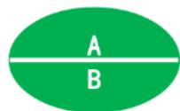

对称：非对称

2. 反对关系（有第三种情况）

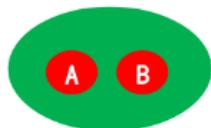

红色：白色

【注意】并列关系：

1. 两词无上下级，而是平级的。

(1) 亲情 : 友情: 感情包括 “亲情” “友情” 和爱情, “亲情” “友情” 同一

级别，二者是并列关系。

(2) T 恤：冬装：“冬装”应该与夏装同级别，二者是并列关系；“T 恤”在夏装下一级别。可以看为夏装是 “T 恤”的“爸爸”，“冬装”是“T 恤”的“叔叔”。“T 恤”和“冬装”不是同一级别，故二者不是并列关系。(3) 牛油 : 植物油: “植物油” 应该与动物油是并列关系, “牛油” 在动物油下一级别。可以看为动物油是 “牛油” 的 “爸爸”, “植物油” 是 “牛油” 的 “叔叔”。“牛油” 和 “植物油” 不是同一级别, 故二者不是并列关系。

2. 功能类似的两词，可以看为并列关系。

(1) 如 “电灯: 蜡烛”, 二者都可以用于照明, 属于功能类似的并列关系。
(2) 功能类似的并列关系, 二级辨析常考查事物出现的先后顺序。

(1)如“电灯：蜡烛”，古时使用“蜡烛”，即先有“蜡烛”，随着时代发展出现了电，即后有“电灯”。(2)如以往联系靠“写信”, 后续有了手机靠“短信”, 互联网发展后靠“微信”,随着时代发展进步, 存在时间先后顺序。

3. 并列关系细分为：

(1) 矛盾关系：非此即彼，只有二者，没有第三种情况。如“对称：非对称”，图形除了“对称”的，就是“非对称”的，没有第三种情况，属于矛盾关系。
(2) 反对关系: 有第三种情况。如 “红色 : 白色”, 除了二者还有其他颜色 (如紫色、蓝色等), 有第三种情况, 属于反对关系。

【例1】（2023事业单位）吸尘器：加湿器

A.土豆：香菜

B. 除螨仪：螨虫

C. 水晶 : 宝石

D. 牙签：牙齿

【解析】1. “吸尘器”“加湿器”是两种不同的工具，二者是并列关系。

A 项: “土豆” “香菜” 是两种不同的蔬菜, 二者是并列关系, 保留。
B 项: “除螨仪”是用来除“螨虫”, 二者是工具与作用对象的对应关系, 排除。
C项: “宝石”包含“水晶”, 可以说 “水晶” 是 “宝石” 的一种, 二者是包

容关系中的种属关系，排除。

D 项: 用 “牙签” 剔 “牙齿”, 二者为工具与作用对象的对应关系, 排除。【选 A】

【例2】（2023事业单位）真：伪

A.长：短

B.忙：闲

C. 凹：凸

D.雌：雄

【解析】2. 事物要么是“真”要么是“伪”，除了是“真”就是“伪”，没有第三种情况，属于矛盾关系。

A项：除了“长”“短”，也可以是不长不短、中不溜的，有第三种情况，二者是反对关系，排除。

B 项：除了“忙”“闲”，还可以有适中的状态，不是很忙也不是很闲，手里恰好有活干，有第三种情况，二者是反对关系，排除。

C 项：除了 “凹” “凸”, 还有平, 有第三种情况, 二者是反对关系, 排除。

D 项：考试只要遇到 “雌” “雄”, 就当作是矛盾关系, 当选。【选 D】

【注意】注意：可比较的一般为反对关系。

1. 如 “长: 短” 可比较, “长” 比 “短” 要长, 二者可比较, 属于反对关系。
2. 如“忙：闲”，“忙”指活多，“闲”指活少，二者可比较，属于反对关系。

常见矛盾关系：

生：死

男：女

白天：黑夜

A：非A

阴：阳

阴刻：阳刻

软实力：硬实力

软件：硬件

曲：直

动：静

静态博弈：动态博弈

主要矛盾：次要矛盾

实体经济：虚拟经济

精神文明：物质文明

固有属性：偶有属性

物理变化：化学变化

社会现象：自然现象

本能行为：学习行为

纯种繁育：杂交繁育

【注意】生活中反对关系多，如“苹果：香蕉”“红色：黑色”，大多数事物

都含有第三种情况，反对关系较多故无法做预测。矛盾关系相对来说不多、较为固定，故积累常见的矛盾关系（上面列出的词语每一组都重复考查过），记住了、遇到了直接当作矛盾关系，就可以又快又准解题。

1. 生：死：不要纠结，就算是植物人也有生命体征，是“生”的状态，人除了“生”就是“死”，没有其他情况，属于矛盾关系。
2. 男：女：公务员需要有正确的观念，考试报名性别只能选择“男”“女”，没有其他，二者属于矛盾关系。
3. 白天：黑夜：除了“白天”就是“黑夜”，没有其他情况，属于矛盾关系。
4. 出现“A：-A”：如“对称：非对称”“转基因：非转基因”“震动：非震动”，均为矛盾关系。
5. “阴：阳”是矛盾关系，带有阴阳的“阴刻：阳刻”也是矛盾关系，印章图案有凹进去的、也有凸出来的，凹凸分别对应“阴刻”“阳刻”。
6. “软实力：硬实力”“软件：硬件”是矛盾关系。
7. “曲：直”“动：静”必须要记住，公务员考试中至少考查过3次，2016吉林、2019浙江、2022省考都有考查，国考也有考过，同时记住“静态博弈：动态博弈”也是矛盾关系。

# 8. 其他：

（1）除了“主要矛盾”就是“次要矛盾”，没有其他情况，二者是矛盾关系。
(2) 除了“实体经济”就是“虚拟紧急”，没有其他情况，二者是矛盾关系。
（3）除了“精神文明”就是“物质文明”，二者是矛盾关系。
(4) “固有属性” 是一定有的, “偶有属性” 是不一定有的, 二者是矛盾关系。
(5)“物理变化：化学变化”“社会现象：自然现象”“纯种繁育：杂交繁育”均为矛盾关系。
(6) “本能行为”指生下来就会的, “学习行为”指后天学习的, 一个是先天的、一个是后天的, 二者是矛盾关系。

【例3】（2022联考）帛书：简牍

A.日晷：秒表

B. 熊猫：银杏

C.青铜：礼器

D. 牛车：轿子

【解析】3. “帛书”如圣旨，在布上面书写，“简牍”指在竹简上书写，二者都是书写的载体，属于功能类似的并列关系。

A 项: “日晷” 是古代的计时工具, 古代太阳照射在晷针上, 在晷面上投射出影子, 影子对应刻度就是当下的时间, “日晷” “秒表” 都是计时工具, 属于功能类似的并列关系, 保留。
B 项: “熊猫” 是动物, “银杏” 是植物, 二者不是并列关系, 排除。
C项: “青铜”是一种材料, 可以用于制造 “礼器”, 二者是原材料与成品的对应关系，排除。
D 项: “牛车” “轿子” 都可以运输, 属于功能类似的并列关系, 保留。

A、D 项均为功能类似的并列关系，二级辨析考虑事物出现的先后顺序。题干“帛书”和“简牍”不能明确区分出现的先后顺序，考虑从古今的角度思考，“帛书”和“简牍”二者都是古代的。

A 项: “日晷”是古代的, “秒表”是现代的, 排除。
D 项: “牛车” 和 “轿子” 都是古代的, 当选。【选 D】

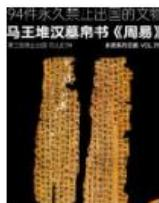
帛书

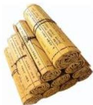
简牍

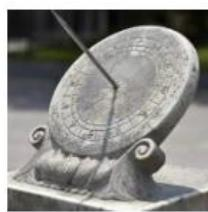
日晷

功能类似的并列，二级辨析：看出现的先后顺序

(2021 黑龙江) (2022 江苏)

马车 ：汽车 • • • • • • • • • • • • • • • • • • • • • • • • • • • • • • • • • • • • • • • • • • • • • • • • • • • • • • • • • • • • • • • • • • • • • • • • • • • • • • • • • • • • • • • • • • • • • • • • • • • •••••••••••••••••••••••••••••••••••••••••••••••••••••••••••••••••••••••••••••••••••••••••••••••
计算机器

A. 青铜：黄金

D.水泵 算盘

D. 刻漏：手表

【注意】功能类似的并列：二级辨析看出现的先后顺序。

1. 2021 黑龙江：题干“马车”先出现，“汽车”后出现，有先后顺序。A项“青铜”“黄金”出现的先后顺序不确定；D项“刻漏”（类似沙漏）和“手表”都用于计时，“刻漏”先出现，“手表”后出现，D项当选。
2. 2022 江苏：“水车”和“水泵”功能类似，“算盘”和“计算器”功能类似，“水车”和“算盘”先出现，“水泵”和“计算器”后出现。
3. 再如小时候夏天用“蒲扇”纳凉，后面开始用“风扇”，现如今开始用“空调”，随着时代发展，功能类似的3个事物存在先后顺序。

【例4】（2024联考）锁骨：肋骨：坐骨

A.头脑：头皮：头发

B. 腹腔：口腔：鼻腔

C. 盲肠：大肠：直肠

D.颈椎：胸椎：腰椎

【解析】4. “锁骨”在脖颈处，“肋骨”在上肢，“坐骨”在臀部附近，三者是不同的骨头，属于并列关系。

A 项: “头脑” 指头、脑, “头脑” 包含了 “头皮” “头发”, 不是并列关系,排除。
B 项: “腹腔” “口腔” “鼻腔” 三者是并列关系, 保留。
C 项: “大肠” 包括 “盲肠”、阑尾、结肠、“直肠”、肛管, 不是并列关系,排除。
D 项: “颈椎” “胸椎” “腰椎” 三者是并列关系, 保留。

剩余 B、D 项需要二级辨析，并列关系二级辨析常考顺序，题干“锁骨”“肋骨”“坐骨”是从上往下的顺序。

A 项: “腹腔” “口腔” “鼻腔” 是从下往上, 排除。
D 项: “颈椎” “胸椎” “腰椎” 是从上往下, 当选。【选 D】

【注意】大肠包括：盲肠、阑尾、结肠、直肠、肛管。

并列关系常考二级辨析：看顺序

（2021山东）

（2022青海）

诗：赋：词

酉时：戌时：亥时

A. 纸：丝绸：竹简

A.立春：立秋：立冬

D. 甲骨文：隶书：楷书

B. 颔联：颈联：尾联

(2021 联考) 戊: 己: 庚

A. 钠：镁：铝

B.寅：卯：巳

C. 牛：虎：龙

D.秦：汉：隋

【注意】并列关系二级辨析常考顺序：可以是时间顺序，也可以是词语之间本身就含有的排列顺序。

1. 2021 山东：题干“诗、赋、词”存在先后顺序，先有“诗”，再有“赋”，最后有“词”。A项先有“竹简”后有“纸”，顺序错误；D项先有“甲骨文”，再有“隶书”，最后有“楷书”，D项当选。即使D项不了解，只有A、D项是并列关系，明确A项错误，排除思维解题即可。
2. 2022 青海：题干“酉时”“戌时”“亥时”先后顺序是紧密相邻的，没有间隔。A项“立春”和“立秋”之间缺了立夏，即使补充立夏也不是紧挨着的。B项“颔联”“颈联”“尾联”先后顺序是紧密相邻的，4行8句的律诗，第1行是首联，第2行“颔联”，第3行是“颈联”，第4行是“尾联”。
   3.2021联考：题干“戊、己、庚”先后顺序是紧密相邻的，没有间隔。A项“钠、镁、铝”紧挨着；B项“卯”和“巳”之间缺少辰；C项“虎”和“龙”之间缺少兔；D项“汉”和“隋”之间至少缺少三国时期，A项当选。

三皇五帝始，尧舜禹相传

夏商与西周，东周分两段

春秋和战国，一统秦两汉

三分魏蜀吴，两晋前后延

南北朝并立，隋唐五代传

宋元明清后，皇朝至此完

氢氦锂铍硼，碳氮氧氟氖

钠镁铝硅磷，硫氯氩钾钙

八卦：乾、坤、震、巽、坎、离、艮、兑（顺序不唯一）

十天干：甲、乙、丙、丁、戊、己、庚、辛、壬、癸

十二地支：子、丑、寅、卯、辰、巳、午、未、申、酉、戌、亥

十二生肖：鼠、牛、虎、兔、龙、蛇、马、羊、猴、狗、猪

立春、雨水、惊蛰、春分、清明、谷雨

立夏、小满、芒种、夏至、小暑、大暑
立秋、处暑、白露、秋分、寒露、霜降
立冬、小雪、大雪、冬至、小寒、大寒

# 二十四节气歌

春雨惊春清谷天，
夏满芒夏暑相连。
秋处露秋寒霜降，
冬雪雪冬小大寒。

# 【注意】常识积累：

1. 背诵朝代歌、化学元素周期表前 20 个元素、天干、地支+生肖（地支和生肖一同背诵）、二十四节气、八卦（不需要背诵顺序，先天八卦、后天八卦顺序不同，了解即可，读作：乾 qián、坤 kūn、震 zhèn、巽 xùn、坎 kǎn、离 lí、艮 gěn、兑 dui）。

# 2. 其中二十四节气考查过:

(1) 题干为 “秋天: 霜降”, 考查 “霜降” 是 “秋天” 最后一个节气, 出现 “春天: 雨水” “夏天: 小暑” 则不能选, 出现 “冬天: 大寒” 则为正确答案,考查是季节中的第几个节气。
(2) 题干 “立春：惊蛰” 间隔 1 个节气, A 项 “立夏：夏至” 间隔 2 个节气不正确, B 项 “秋分：霜降” 间隔 1 个节气当选。
(3) 常考 “处暑”, 提及暑字容易联想到夏天, 其中 “小暑、大暑” 都是夏天的节气, 但需要注意 “处暑” 不是夏天的节气, 而是秋天的节气。

【补充】（2023国考）海棠红：南瓜橙

A. 苏丹红：景泰蓝

B. 孔雀蓝：柠檬黄

C. 日落黄：鱼肚白

D. 橄榄绿：梅子青

【解析】拓展。“海棠红”和“南瓜橙”是2个不同的颜色，属于并列关系，4个选项均为不同颜色，均为并列关系。此时二级辨析无法考虑顺序，而应该看

命名方式（词语用何种方式命名）。题干“海棠红”用海棠这一植物命名，“南瓜橙”用南瓜这一植物命名，均根据植物命名。

A 项: “苏丹红” 根据化学试剂命名, 排除。
B 项: “孔雀蓝” 根据动物命名, 排除。
C 项: “日落黄” 不是根据植物命名, 排除。
D 项: “橄榄绿” 和 “梅子青” 均根据植物命名, 当选。【选 D】

常见命名方式小结

原材料：高粱酒、葡萄酒、西瓜汁

功能：办公椅、舞蹈扇、热水器

形状：条形柜、圈椅

属性：方便面、臭豆腐

动力：风车、电动车、自行车

人物：东坡肉、五柳鱼

【注意】常见命名方式小结：

1. 原材料：高粱酒（用高粱酿造的）、葡萄酒、西瓜汁。
2. 功能：办公椅（用于办公）、舞蹈扇（用于跳舞）、热水器（用于加热水）。
3. 形状：条形柜（条形的柜子）、圈椅（椅背是圈形的椅子）。
4. 属性：方便面（特点是方便）、臭豆腐（特点是臭）。5.动力：风车（风力驱动）、电动车（电力驱动）、自行车（人力驱动）。
5. 人物：东坡肉（东坡先生苏轼）、五柳鱼（五柳先生陶渊明）。

# 考点三：包容关系

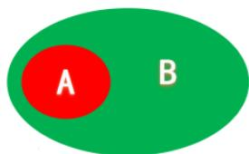

1.种属关系：A是一种B

苹果：水果

2. 组成关系：A是B的一个组成部分

轮胎：汽车

能单独用“是”造句子的是种属关系

北京：中国

月亮：星球

【注意】包容关系：

1. 两词范围一大一小，大词包含小词，即为包容关系。

(1) 苹果: 水果: “苹果”范围小, “水果”范围大, “水果”包含“苹果”。(2) 轮胎 : 汽车: “轮胎”范围小, “汽车”范围大, “汽车”包含“轮胎”。

2. 包容关系细分：

(1) 种属关系: A 是一种 B。如 “苹果” 是一种 “水果”。
(2) 组成关系: A 是 B 的一个组成部分。如 “轮胎” 是 “汽车” 的一个组成部分。
(3) 区分种属关系与组成关系: 单独用 “是” 字造句, 从范围小的词向范围大的词造句。

(1)苹果: 水果: 造句为 “苹果是水果” 通顺, 二者是种属关系。
(2)轮胎：汽车：造句为“轮胎是汽车”不通顺，不是种属关系，二者是组成关系。

3.练习：

(1) 北京：中国：“北京”范围小，“中国”范围大，造句为“北京是中国”不通顺，只能说“北京”是“中国”的组成部分，二者是组成关系。
(2) 月亮：星球：造句为“月亮是星球”通顺，二者是种属关系。
(3) 若改为 “北京人：中国人”, 造句为 “北京人是中国人” 通顺, 二者则为种属关系。

【例1】（2024联考）文字：汉字

A. 判断：概念

B. 宇宙：恒星

C. 中国：北京

D. 工人：矿工

【解析】1. “文字”范围大，“汉字”范围小，从范围小的词向范围大的词造句，造句为“汉字是文字”通顺，二者是种属关系。

A 项: “判断”是逻辑学中的“概念”, 指两个事物有某种关系, 进行肯否,比如 “我是老师” “我不是老师” 是判断, 其中我与老师都是 “概念”, “概念”是组成 “判断”的一部分, “判断”由 “概念” 组成, 二者是组成关系, 排除。
B 项：不能说 “恒星是宇宙”, “恒星” 是组成 “宇宙” 的一部分, 二者是组成关系, 排除。
C项：不能说“北京是中国”，“北京”是组成“中国”的一部分，二者是组成关系，排除。
D 项: 造句为 “矿工是工人” 通顺, 二者是种属关系, 当选。【选 D】

【注意】能够自发光的就是“恒星”，比如太阳；围绕“恒星”转动的是行星（如地球围着太阳转），围绕行星转的是卫星（如月亮围着地球转）。

【例2】（2024江苏）期刊：月刊：目录页

A.房屋：公寓：天花板

B.能源：电池：电子书

C. 银行：企业：理财室

D. 欧盟：法国：凯旋门

【解析】2. “期刊”可以是周刊、“月刊”、季刊、年刊等，可以造句为“月刊是期刊”，二者是种属关系；造句为“目录页是月刊”不通顺，“目录页”是“月刊”的一部分，二者是组成关系。

A 项：不能说 “天花板是公寓”, “天花板” 是组成 “公寓” 的一部分, 二者是组成关系; “公寓” 是 “房屋”, 二者是种属关系, 保留。
B 项: “电池” 是 “能源”, 二者是种属关系; 不能说 “电子书” 是组成 “电池”的一部分, 排除。
C 项: “企业是银行” 造句不通顺, 二者不是种属关系。二者存在交集, 可以说 “有的企业是银行, 有的企业不是银行; 有的银行是企业, 有的银行不是企业”, 二者是交叉关系, 排除。
D 项: “法国” 是组成 “欧盟” 的一部分, 二者是组成关系, 排除。【选 A】

常考组成关系：

(1)地点+地点

(2)前缀为数量

③朝代划分

北京：中国

眼睛：五官

东汉：朝代

【注意】常考组成关系：

1. 地点+地点：如“北京：中国”，造句为“北京是中国”不通顺，“北京”是“中国”的组成部分，属于组成关系。
2. 前缀为数量：如“眼睛：五官”，可能认为“眼睛是五官”造句通顺，但“五官”的“五”代表数量，指5个器官，不能说“眼睛是5个器官”，故二者不是种属关系，而是组成关系。
3. 朝代划分：如“东汉：朝代”，可能认为“东汉是朝代”造句通顺，但需要特殊记忆，“东汉”只是“朝代”中的一段，不属于所有，故二者是组成关系。

【例 3】(2023 联考) 十二时辰：丑时：午时

A. 国家元首：主席：总理
B. 网络课程：直播：录播
C. 河北特产：海鲜：菠萝
D. 五金工具：钳子：扳手

【解析】3. “丑时”“午时”都是“十二时辰”其中一个时辰，“十二”代表数量，不能说“丑时是十二时辰”，后两词是并列关系，与第一词构成组成关系。

A项：“国家元首”相当于老大，只有1人，“主席”是“国家元首”，“总理”不是“国家元首”，排除。
B 项: “直播”“录播”是“网络课程”的播出形式, 不能说 “直播是网络课程”, 排除。
C项：“菠萝”是南方产的，而不是“河北特产”，排除。
D项: “钳子”“扳手”是并列关系, 与 “五金工具” 是种属关系, 可以说 “钳子是五金工具、扳手是五金工具”, 注意 “五金工具” 的 “五” 代表的不是数量, “五金”是一种泛指, 而不是 5 种金属。A、B、C 项明确不正确, 题干是组成关系, D 项是种属关系, 二者都是包容关系, 当选。【选 D】

【注意】题干是组成，选项无组成可以选种属；题干是种属，选项无种属可以选组成；题干是反对，选项无反对可以选矛盾。注意类比选项对比择优。

【例 4】(2021 浙江选调) 心脏 : 器官 : 毛发

A.玫瑰：植物：生物

B. 内存：硬件：显示器

C. 水银：金属：钻石

D.猫：生肖：龙

【解析】4. 本题考查反向种属。人体有很多器官，如呼吸器官，“心脏”是“器官”的其中之一，造句“心脏是器官”，种属关系；“毛发（头发）”是组织，不是“器官”，不是种属关系。

A 项: “玫瑰”是“植物”, “植物”是“生物”的一种, 都是种属关系, 排除。
B 项: “内存” 和 “显示器” 都是 “硬件”, 都是种属关系, 排除。
C项: “水银”是“金属”, 种属关系; “钻石”是碳, 碳是非金属, 不是“金属”, 不是种属关系, 保留。
D项：“猫”不是“生肖”，排除。

答疑：“内存”是内存条，如买手机是“8G+256G”，“8G”是内存条、“256G”是内存卡；而软件指电脑/手机中安装的APP、操作程序/系统。【选C】

# 【注意】

1. 生肖：子鼠、丑牛、寅虎、卯兔、辰龙、巳蛇、午马、未羊、申猴、酉鸡、戌狗、亥猪。
2. 反向种属: “金属”与“非金属”并列, “碳”是“非金属”, 不是“金属”的一种, 为反向种属, 可理解为“侄子和叔叔的关系”。
3. 生物包括动物、植物、微生物; 微生物中包括细菌、真菌、病毒。

反向种属：侄子和叔叔的关系，不是并列关系

(2018 联考)高血压: 传染病

B. 黄梅戏：京剧

C. 鲫鱼：两栖动物

(2024 山东)鳄鱼：鱼

B. 蜗牛：昆虫

C. 小熊猫：浣熊

# 【注意】反向种属:

1. 2018 联考: “高血压” 不是 “传染病”, 是非传染病, 二者是种属关系, 非传染病与 “传染病” 是并列关系, 则 “高血压” 和 “传染病” 是侄子与叔叔的

关系，为反向种属；B项“黄梅戏”和“京剧”都是戏剧，并列关系；C项“鲫鱼”是鱼类，鱼类与“两栖动物”并列，“鲫鱼”管鱼类叫“爸爸”，与“两栖动物”是侄子与叔叔的关系，选择C项。

2. 2024 山东: “鳄鱼” 不是 “鱼”, 是爬行动物, 爬行动物与 “鱼” 并列, “鳄鱼” 管爬行动物叫 “爸爸”, 管 “鱼” 叫叔叔; B 项 “蜗牛” 是一类、“昆虫” 是一种, “蜗牛” 是非昆虫, 管 “昆虫” 叫叔叔, 二者不是一辈的; C 项 “小熊猫” 和 “浣熊” 是两种不同的动物, 并列关系, 选择 B 项。
3. 并列项是易错项。
4. 区分种属、组成就用“是”字造句，能单独用“是”字造句的是种属关系，反之是组成关系，不要用其他任何的方法。

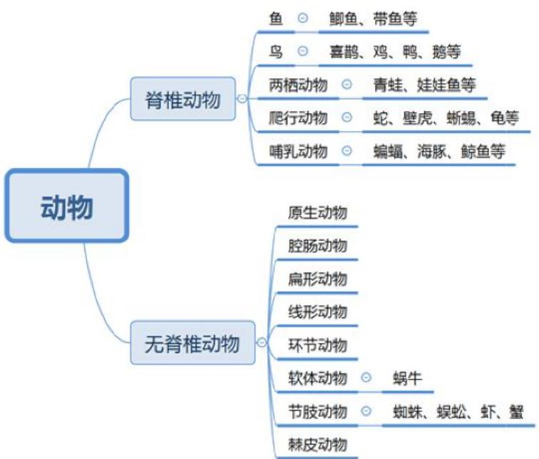

常见的不是鱼的类型:

(1)八爪鱼（章鱼）——软体动物；
(2)鳄鱼——爬行动物;
(3)鲸鱼、海豚——哺乳动物;
(4)娃娃鱼（大鲵）——两栖动物

# 【注意】

1. 动物分类（常考）：分为脊椎动物、无脊椎动物。

(1) 无脊椎动物: 包括原生动物、腔肠动物、扁形动物、线形动物、环节

动物、软体动物、节肢动物、棘皮动物，考得很少。

# (2) 脊椎动物:

(1)鱼：如鲫鱼（淡水鱼）、带鱼（咸水鱼）。(2)鸟：如喜鹊、鸡、鸭、鹅。(3)两栖动物: 指小时候生活在水里, 长大后既可以在水里也可以在陆地生活,且经过变态发育。(4)爬行动物：如蛇、龟。(5)哺乳动物: 如蝙蝠、海豚、鲸鱼。

2. 常见不是鱼: 八爪鱼 (章鱼)、鳄鱼, 鲸鱼、海豚是哺乳动物, 娃娃鱼 (大鲵) 是两栖动物。
3. 注意：鸭嘴兽是卵生的哺乳动物。

考点四：交叉关系

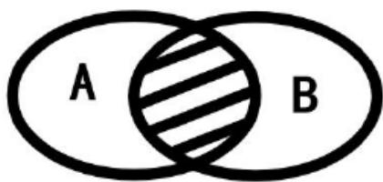

女士：公务员

题干特征：从不同角度描述同一类事物

判定技巧——造句子

有的A是B，有的A不是B

有的B是A，有的B不是A

女士：公务员

木床：婚床

石墙：土墙

【注意】交叉关系：两个词有交集，如上图，A、B 有交集。如“女士：公务员”，交集为“女公务员”，交叉关系。

1. 题干特征：从不同角度描述同一类事物，可能是交叉关系。如“女士：公务员”，“女士”从性别角度描述、“公务员”从职业角度描述，从不同角度描述

人，优先考虑交叉关系。

2. 判定技巧：用4个“有的”造句都通顺，即“有的A是B，有的A不是B；有的B是A，有的B不是A”。

（1）如“女士：公务员”，造句“有的女士是公务员，有的女士不是公务员，有的公务员是女士，有的公务员不是女士”，造句通顺，交叉关系。（2）如“木床：婚床”，“木床”根据原材料命名、“婚床”根据功能命名，不同角度描述床，造句为“有的木床是婚床，有的木床不是婚床；有的婚床是木床，有的婚床不是木床”，造句通顺，交叉关系。(3) 如 “石墙: 土墙”, 二者都是根据原材料描述, 不同原材料, 大概率不是交叉关系, 造句 “有的石墙是土墙” 说不通, 为并列中的反对关系。

3. 涉及人的身份、职业，优先考虑交叉关系。如甲是男人、老师、父亲，有多个身份、职业，交叉关系。

【例 1】(2022 天津) 报案人：嫌疑人

A. 获益人：买家

B. 卖家：买家

C. 主角：配角

D.僧侣：道士

【解析】1. “报案人”和“嫌疑人”都是人的身份，优先考虑交叉关系。一个人可以既是“报案人”也是“嫌疑人”，如贼喊抓贼，造句为“有的报案人是嫌疑人，有的报案人不是嫌疑人；有的嫌疑人是报案人，有的嫌疑人不是报案人”，4个“有的”造句通顺，交叉关系。

A项：“获益人”和“买家”可以是同一个人，造句为“有的获益人是买家，有的获益人不是买家；有的买家是获益人，有的买家不是获益人”，交叉关系，保留。

B 项：在一个交易中，一个人不能既是“买家”也是“卖家”，排除。
C 项: 一个人不能既是 “主角” 也是 “配角”, 二者是并列关系, 排除。
D 项: 一个人不能既是 “僧侣” 也是 “道士”, 二者是并列关系, 排除。【选 A】

【注意】身份或职业，能同时就是交叉。

【例2】（2022国考）二线城市：港口城市：商业城市

A. 海上战争：常规战争：空中战争
B. 科技期刊：电子期刊：纸本期刊
C. 自助旅游：国内旅游：探亲旅游
D. 街心公园：森林公园：湿地公园

【解析】2. 题干都是描述城市，“二线城市”看发达程度（如一线、二线、三线、四线），“港口城市”看城市是否有港口，“商业城市”看城市是否以商业为中心，不同角度描述城市，可能是交叉关系，造句为“有的二线城市是港口城市，有的二线城市不是港口城市；有的港口城市是二线城市，有的港口城市不是二线城市”，三个词互为交叉关系。

A 项: “海上” 和 “空中” 是两个不同地点, 并列关系, 排除。
B 项: “电子期刊” 和 “纸本期刊” 是并列关系, 排除。
C项: “自助旅游”指自己玩, 还可以抱团旅游; “国内旅游”看在国内还是在国外; “探亲旅游”如叔叔在国外, 探望叔叔顺便旅游, 没有亲戚自己去玩就是非探亲旅游, 三个不同角度描述旅游, 任意两词4个“有的”造句都通顺, 交叉关系, 保留。
D 项: “森林公园 (公园里有森林)” “湿地公园 (公园里有湿地)” 都是看公园里有什么, 如果一个公园既有森林又有湿地, 可以叫 “森林湿地公园/湿地森林公园”, 为并列关系, 如 “肉食动物 : 素食动物”, 二者是并列关系, 还有既吃肉又吃素的“杂食动物”, 三者均为并列关系; 如果纠结可以看名字, “森林公园” 不在是市中心, 都在郊区、外面, 不能说 “有的街心公园是森林公园”, 排除。

【选C】

【例 3】(2024 黑龙江) 国产灯：蘑菇灯：护眼灯

A. 社区公园：迷你公园：主题公园
B. 上皮细胞 : 扁平细胞 : 生殖细胞
C. 自制玩偶：人形玩偶：装饰玩偶
D. 水生植物：喜阴植物：防风植物

【解析】3. “国产灯”看在哪里生产，“蘑菇灯”看灯的形状，“护眼灯”看灯的功能，三个不同角度描述灯，4个“有的”造句通顺，三者互为交叉关系。

A项：“主题公园”如环球影城、迪士尼，是特别大的公园，而“社区公园”都比较小，不是“主题公园”，不能说“有的社区公园是主题公园”，二者不是交叉关系；“迷你公园”是小公园、“主题公园”是大公园，不是交叉关系，排除。
B 项: “上皮细胞”从名字上看是指在皮肤表面的细胞; “扁平细胞”看的是形状; 不能说“有的生殖细胞在皮肤表面（上皮细胞）”, 排除。
C项：“自制玩偶”看的是谁制作的，“人形玩偶”看的是形状，“装饰玩偶”看的是功能，三者互为交叉关系，保留。
D 项: “水生植物”看的是生长地点, “喜阴植物”看的是特点, “防风植物”看的是功能, 交叉关系, 保留。

交叉关系二级辨析考虑命名方式。“国产灯”“自制玩偶”都是看谁生产的，“水生植物”看的是生长地点；“蘑菇灯”“人形玩偶”看的是形状，“喜阴植物”看的不是形状，排除D项，选择C项。【选C】

# 【注意】

1. 交叉关系常见二级辨析：命名方式。
2. 理论上可以考别的二级辨析，但经验上没有考过，常见的二级辨析都是  $90\%$  以上会考的，优先考虑；如果不能解决问题，再考虑别的。如并列二级辨析考虑顺序、命名方式，哪个能用就用哪个。

团扇：羽毛扇：舞蹈扇（2018联考）

圈椅：实木椅：办公椅（2018联考）

推理漫画：连环漫画（2018吉林）

馆藏文物：史前文物（2018吉林）

川菜：素菜：热菜（2017天津）

壁画：山水画（2015吉林）

旱田作物：高产作物（2018江苏）

哺乳动物：陆生动物（2016山东）

内陆湖：淡水湖（2019国考）

教师：陕西人（2017陕西）

诗人：教授（2017江苏）

专家：官员（2015江苏）

# 【注意】交叉关系：

1. 不同角度描述同一事物。

（1）如“团扇：羽毛扇：舞蹈扇”，都在描述扇子，“团扇”看形状，“羽毛扇”看原材料，“舞蹈扇”看功能，三个不同角度描述。
（2）如“圈椅：实木椅：办公椅”，都在描述椅子，“圈椅”看形状，“实木椅”看原材料，“办公椅”看功能。
（3）如“推理漫画：连环漫画”，都在描述漫画，“推理漫画”看内容，“连环漫画”看形式（类似于电视连续剧）。
(4) 如 “馆藏文物: 史前文物”, 一个说有没有收藏、一个看时间。
(5) 如 “川菜: 素菜: 热菜”, 都在描述菜, “川菜” 看地点, “素菜” 看有没有肉, “热菜” 看是热炒的、凉拌的。
(6) 如“壁画：山水画”，“壁画”看地点、“山水画”看内容。
(7) 如 “旱田作物: 高产作物”, “旱田作物” 看水的多少, “高产作物” 看产量高低。
(8) 如“哺乳动物：陆生动物”，“陆生动物”看的是生活地点，“哺乳动物”看是胎生、哺乳。
(9) 如 “内陆湖：淡水湖”, “内陆湖” 看在内部、外部, “淡水湖” 看含盐多少。
2. 涉及人的身份、职业：身份、职业可以同时发生在一个人身上，优先考虑交叉关系。
3. 答疑：并列是同一角度描述，如“内陆湖：外流湖”，二者是并列关系；又如“咸水湖：淡水湖”，都是看盐的多少，并列关系；如“羽毛扇：塑料扇：蒲扇”，都是原材料命名。

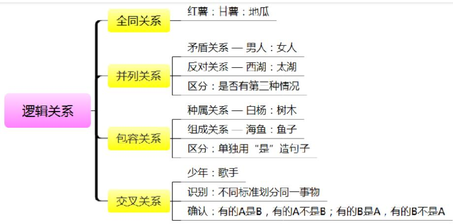

# 【注意】逻辑关系总结：

1. 全同关系：两词可以画等号。如“红薯：甘薯：地瓜”，三者是同一事物，全同关系。
2. 并列关系：区分矛盾、反对，只有两种情况是矛盾，有第三种情况是反对。如“男人：女人”，是矛盾关系；如“西湖：太湖”，还有别的湖，反对关系。
3. 包容关系：区分种属、组成，能单独用“是”字造句就是种属关系，反之就是组成关系，不要用任何其他方法，且从小往大造句。如“白杨是树木”，种属关系；如“海鱼：鱼子”，“鱼子”不是“海鱼”，而是“海鱼”肚子里的东西，组成关系。

# 4. 交叉关系：

(1) 不同角度描述同一事物。
(2) 判定: 4 个 “有的” 造句通顺。

教师：杰出青年（交叉） 1. 全同

恒星：星系（组成） 2.反对

山水画：人物画（反对） 3. 矛盾

商业电影：获奖电影（交叉） 4. 组成

蝙蝠：哺乳动物（种属） 5.种属

转基因：非转基因（矛盾） 6.交叉

话筒：麦克风（全同）

# 【注意】

1. 如 “教师：杰出青年”, “教师” 从职业角度描述人, “杰出青年” 从身份

角度描述人，不同角度描述人，涉及身份、职业，优先考虑交叉关系，4个“有的”造句通顺，交叉关系。

2. 如“恒星：星系”，“恒星”是组成“星系”的一部分，如不能说“太阳是太阳系”，组成关系。
3. 如“山水画：人物画”，“山水、人物”看的都是画的内容，相同角度描述，并列关系；除了山水、人物，还可以画别的，反对关系。
4. 如“商业电影：获奖电影”，“商业电影”为了挣钱、“获奖电影”为了获奖，不同角度描述电影，交叉关系。
5. 如 “蝙蝠：哺乳动物”，“蝙蝠/鲸鱼/鸭嘴兽”是“哺乳动物”，能用“是”字造句，种属关系。
6. 如 “转基因: 非转基因”, “转基因” 与非转基因是 “A 与-A”, 并列中的矛盾关系。
7. 如“话筒：麦克风”，“话筒”就是“麦克风”，全同关系。

# 考点五：对应关系

1. 原材料和工艺 葡萄：酿造：葡萄酒

工艺常考二级辨析：物理、化学

工艺二级辨析

涉及物理变化的工艺：印刷、捆扎、打磨、雕琢、剪裁、织造等

涉及化学变化的工艺：燃烧、氧化、发酵、酿造、冶炼等

区分标准: 有无新物质生成

# 【注意】

1. 对应关系：常说“对应是个筐，啥都往里装”，考得比较多，考点也比较多，课上只讲常考的，不常考的可以通过刷题了解，如成语与所描述人之间的关系、书与作者的关系。
2. 原材料和工艺：

(1) 一个东西通过某种方法成为另一种东西, 就是原材料和成品对应。如 “葡萄: 酿造 : 葡萄酒”, “葡萄” 通过 “酿造” 成为 “葡萄酒”, “葡萄” 是原材料、“酿造” 是工艺、“葡萄酒” 是成品。

(2) 常考二级辨析: 物理/化学变化, 根据是否有新物质生成区分, 有就是化学变化、没有就是物理变化。

(1)涉及物理变化的工艺：印刷、捆扎、打磨、雕琢、剪裁、织造等。
(2)涉及化学变化的工艺：燃烧、氧化、发酵、酿造、冶炼等，尤其是发酵、酿造考得多，要重点关注。

【例1】（2022重庆选调）眼镜镜片 对于（ ）相当于（ ）对于铝合金

A.视力 坚固
B.树脂 易拉罐
C. 凹透镜 重金属
D.眼镜镜架 不锈钢
【解析】1.A项：戴“眼镜镜片”可以矫正“视力”，对应关系；“铝合金”是“坚固”的，“坚固”是特点，特点对应，但不能说“眼镜镜片是视力的特点”，前后逻辑关系不一致，排除。
B 项: “眼镜镜片”有玻璃的、树脂的, “树脂” 可以用来制作 “眼镜镜片”; “铝合金” 可以用来制作 “易拉罐”, 前后均为原材料对应, 保留。
C 项: “眼镜镜片”有凸透镜、“凹透镜”, 造句“有的眼镜镜片是凸透镜,有的眼镜镜片是凹透镜; 有的凸透镜是眼镜镜片, 有的凸透镜不是眼镜镜片”,二者为交叉关系; “铝合金” 不是 “重金属”, 好多 “重金属” 都有毒, 而做门窗的 “铝合金” 没有毒, 排除。
D 项: “眼镜镜片”和“眼睛镜架”是配套使用关系, 二者缺一不可, 如 “插头: 插座” “钥匙: 锁” “笔: 笔套”, 也是配套使用关系; “不锈钢” 和 “铝合金”不是配套使用关系, 排除。【选 B】

【注意】凹透镜可以发散光源（近视眼）；凸透镜可以会聚光源（远视眼、老花镜），如用放大镜烤纸。

【例2】（2021新疆兵团）布：衣服

A.牛奶：酸奶

B. 粮食：酒

C. 木材：餐桌

D. 朱古力：巧克力

【解析】2. “布”可以用来制作“衣服”，原材料对应。

A 项: “牛奶” 可以用来制作 “酸奶”, 原材料对应, 保留。
B 项: “粮食” 可以用来制作 “酒”, 原材料对应, 保留。
C 项: “木材” 可以用来制作 “餐桌”, 原材料对应, 保留。
D项“朱古力”就是“巧克力”，全同关系，排除。

原材料二级辨析考虑物理/化学变化。用“布”制作“衣服”是物理变化。

A 项: “牛奶”通过一些菌发酵制作成“酸奶”, 化学变化, 排除。
B 项: “粮食” 通过酿造制作成 “酒”, 化学变化, 排除。
C 项: “木材” 制作成“餐桌”是物理变化, 当选。【选 C】

【注意】原材料常考二级辨析：物理/化学。

1. 原材料和工艺 葡萄：酿造：葡萄酒
   2.功能 灯：照明：装饰（一般为名词+动词）

常考二级辨析：主要、次要

3.属性 盐：咸 花：红（一般为名词+形容词）

常考二级辨析：必然、或然

# 【注意】

1. 功能对应：用来干什么，如灯用来照明，也可以用来装饰，“照明、装饰”就是功能。

(1) 一般为名词+动词（干什么）。(2) 常考二级辨析: 主要/次要。如灯的主要功能是照明、次要功能是装饰。想要判断主要/次要, 可以去掉 “功能”, 只看名词, 第一反应的是主要、不是第一反应的是次要, 如提到灯, 第一反应是照明; 又如盐的主要功能是调味, 还可以用来杀菌、消毒。

2. 属性对应：指事物的特点，如盐是咸的、花是红的。

(1) 一般为名词+形容词。如盐、花都是名词，咸、红都是形容词。
(2) 二级辨析: 必然 (一定) / 或然 (不一定、可能)。如盐一定是咸的,必然属性; 花不一定是红的, 或然属性。

【例3】（2024事业单位）教务处：学校：教育

A. 飞机：交通工具：运输

B. 糯米：糍粑：食品

C. 笔芯：签字笔：写字

D. 鲜花：红色：颜色

【解析】3. “教务处”是组成“学校”的一部分，不能说“教务处是学校”，组成关系；“学校”是名词、“教育”是动词，“学校”是用来“教育”的，功能对应。

A项：“飞机”是“交通工具”，种属关系；“运输”是“交通工具”的功能，不完美，排除。
B 项: “糯米” 是制作 “糍粑” 的原材料, 原材料对应; “糍粑” 是 “食品”,种属关系, 排除。
C 项: “笔芯” 是组成 “签字笔” 的一部分, 组成关系; “签字笔” 是用来 “写字”的, 功能对应, 保留。
D 项: “红色” 是形容词, 是 “鲜花”的属性, 排除。

如果本题没有 C 项，对比择优，也可以选 A 项。【选 C】

【例 4】(2025 国考) 直观性：即时性：网络直播

A.等边性：对称性：等腰梯形

B. 公开性：权威性：行政法律

C. 周期性：延展性：机械钟摆

D.挥发性：保温性：石棉纤维

【解析】4. 出现“性”，考虑属性，一般考查必然/或然。题干和选项都是属性对应，考虑必然/或然，“网络直播”一定有“直观性”“即时性”，必然属性。

A 项: “等腰梯形”一定有“对称性”, 而 “等边性” 指边都相等, 如三条边都相等的等边三角形, “等腰梯形” 不具有 “等边性”, 上底、下底不一样长, 排除。
B 项: “行政法律”一定有“公开性”“权威性”, 必然属性, 保留。
C项：“延展性”指抗形变的能力，如面团一压就扁了，就有“延展性”，“机械钟摆”不一定有“延展性”，不是必然属性，排除。
D 项: “石棉纤维” 是固体, 不一定有 “挥发性”, 一般是气体、液体 (如酒精) 有 “挥发性”, 排除。【选 B】

【注意】出现带“性”“式”“化”的词语，优先考虑属性。

出现带“性”“式”“化”的词语，优先考虑属性

(2020 国考) 物体: 惯性

A. 气体：稳定性

B. 观察：客观性

C. 贵金属 : 磁性

D. 液体：流动性

(2023 联考) 全真阅读: 沉浸式

A. 企业销售：盈利性

B. 乡村教育：均衡化

C. 人工智能：数字化

D. 线上课程：直播性

题干看不懂：结合选项猜考点

【注意】出现带“性”“式”“化”的词语，优先考虑属性。

1.2020国考：

（1）题干和选项都出现了“性”，考虑属性，都是属性对应，二级辨析考虑必然/或然属性。“物体”一定有“惯性”；“气体”不一定有稳定性，有的容易爆炸；“观察”不一定是“客观”的，带有主观性；“贵金属”不一定有“磁性”，如金子；“液体”是流体，一定有“流动性”，选择D项。（2）如果不知道物体有惯性，而A、B、C项都是或然属性，D项是必然属性，结合选项猜考点，还是选择D项。

2. 2023 联考：如果不知道“全真阅读、沉浸式”，但出现“性”“式”“化”，考虑属性对应中的必然/或然属性。A项“企业销售”不一定是“盈利”的，有的赔钱；B项“乡村教育”不一定是“均衡化”的，或然属性；C项“人工智能”一定是“数字化”的，必然属性；D项“线上课程”不一定是“直播性”的，也可以听录播，或然属性；A、B、D项都是或然属性，只有C项是必然属性，则题干“全真阅读”一定是“沉浸式”的，选择C项。
3. 时间顺序 恋爱：结婚：生子（一般为动词+动词）

常考二级辨析：主体能否一致 请假：批准

【注意】时间顺序：

1. 多个动词在一起。如 “恋爱：结婚：生子”，三个动词在一起，考虑是否

先后顺序；有的人认为可以先结婚、后恋爱，或者先生子、后结婚，公务员要注意公序良俗，有正确大局观、大众思维，三者一定有先后顺序。

2. 二级辨析：主体能否一致。如我俩恋爱、结婚、生子，主体可以一致；又如“请假：批准”，不能自己请假、批准，主体不一致。

【例5】（2021北京）征稿：审校：出版

A. 组装：维修：报废

B. 送审：开题：毕业

C.分离：发射：入轨

D.绘画：展出：装裱

【解析】5. 题干是 3 个动词，考虑先后顺序。先“征稿”，再“审校”，最后“出版”，有先后顺序。

A 项：如先“组装”电脑/汽车，坏了再“维修”，修不好就“报废”，存在先后顺序，保留。
B 项：如写论文要先 “开题”, 再做实验、写论文 “送审”, 排除。
C 项: 火箭发射时, 不会整体都发射上去, 要先 “发射”, 过程中用完的助推能量会 “分离”, 最后 “入轨”, 排除。
D 项：先 “绘画”，再 “装裱”，最后 “展出”，排除。
C项很专业，涉及航空航天知识，但A项大多数人都熟悉，可以优先看A项，A项正确就选A项，A项不正确再选C项。【选A】

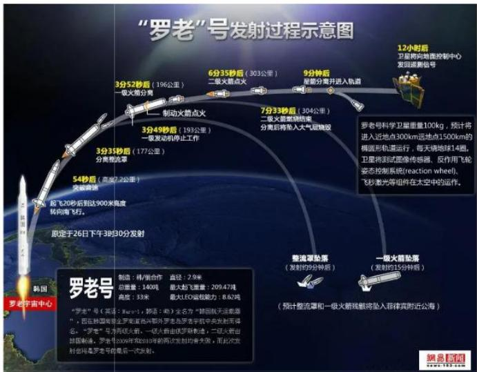

【例 6】(2022 国考) 提起公诉：宣告判决：收押罪犯

A. 撰写教案：课堂教学：解答疑问

B. 手机点餐：外卖送餐：五星好评
C. 违章行驶：交警处罚：行人受伤
D. 方案设计：建筑施工：竣工验收

【解析】6. 题干是三个动词，考虑先后顺序。先“提起公诉”，再“宣告判决”，最后“收押罪犯”。

A 项：先 “撰写教案”, 再 “课堂教学”, 最后 “解答疑问”, 保留。
B 项：先“手机点餐”，再“外卖送餐”，最后“五星好评”，保留。
C项：先“违章行驶”，再“行人受伤”，最后“交警处罚”，排除。
D 项：先 “方案设计”, 再 “建筑施工”, 最后 “竣工验收”, 保留。

先后顺序选不出唯一答案，二级辨析考虑主体是否一致。检察院“提起公诉”、法院“宣告判决”，监狱“收押罪犯”，主体不同。

A项: “撰写教案” “课堂教学” 可以是同一主体, 排除。
B 项: “手机点餐”“五星好评”可以是同一人, 如自己点外卖、好评, 排除。
C 项：设计师“方案设计”，施工单位“建筑施工”，监理“竣工验收”，三个不同的主体，不能认为自己在家盖房子，自己设计、施工、验收，要大众思维，当选。【选 D】

# 5.因果关系

炎热：中暑 升职：开心

常考二级辨析：原因自然/人工、结果积极/消极

# 【注意】因果关系：

1. 可以用造句“A导致B”，如“炎热”导致“中暑”、“升职”导致“开心”。
2. 二级辨析：原因人为/自然、结果积极/消极。如“炎热”是自然原因、“升职”是人为原因，“中暑”是消极结果、“开心”是积极结果。
3. 因果有先后顺序，因果一定在前、结果一定在后，能用“导致”造句就是因果关系，不能造句就是先后关系。如“恋爱：结婚”，二者是两个行为，不能说“恋爱导致结婚”，不能用“导致”造句，只是先后顺序关系。

【例 8】(2024 黑龙江公安) 病毒: 疾病

A.愉悦：满足

B. 锻炼：健康

C. 心高：气傲

D. 年龄：衰老

【解析】8. “病毒”导致“疾病”，因果关系。

A 项：因为 “满足”,所以 “愉悦”,顺序反了,排除。
B 项：因为 “锻炼”, 所以 “健康”, 保留。
C 项: “心高” 和 “气傲” 是并列关系, 指人很傲慢, 没有因果关系, 排除。
D 项: “年龄” 不是 “衰老” 的原因, 时间的流逝是客观的, “衰老” 是用细胞发展的过程描述的, 如一年有四季, 时间是人类设置的, 不是 “年龄” 导致的 “衰老”, 排除。

答疑：“一定/不一定”属于二级辨析，做题时优先考虑一级关系，一级关系选不出唯一答案，再考虑二级辨析。【选B】

【注意】出现消极词语，考因果的概率很大。如“病毒：疾病，堵车：迟到：受罚，雷击：停电：电梯停运，地震：山体滑坡：交通堵塞，连日降雪：道路结冰：出行困难”，疾病、受罚、电梯停运、交通堵塞、出行困难都是负面词语，优先考虑因果关系。

6.方式目的刻舟：求剑凿壁：偷光

常考二级辨析：方式对错、目的能否达到

【注意】方式目的：

1. 用 “为了” 造句。如 “刻舟是为了求剑”, 不能说 “刻舟导致求剑/因为刻舟, 所以求剑”; 又如 “凿壁是为了偷光”。
2. 二级辨析：方式对错、目的能否达到。如“刻舟：求剑”，方式达不到目的；又如“凿壁：偷光”，方式可以达到目的。

【例9】（2022重庆选调）灾害预警：减少损失

A. 寒风凛冽：树木凋零

B. 演出彩排：顺利演出

C. 调解纠纷：劳动仲裁

D. 次贷危机：股市震荡

【解析】9.“灾害预警”是为了“减少损失”，方式目的对应。

A 项: “寒风凛冽” 导致 “树木凋零”, 因果关系, 排除。
B 项: “演出彩排” 是为了 “顺利演出”, 方式目的对应, 保留。
C 项: “劳动仲裁” 是为了 “调解纠纷”, 方式目的对应, 但顺序反了, 排除。
D项: “次贷危机”导致“股市震荡”, 二者都是不好的词, 因果关系, 排除。【选 B】

# 【注意】

1. 出现国家、政府的做法，考方式目的概率大，因为国家做一些事情都是为了达到一些目的。如“严禁占用：耕地保护，节能减排：碳中和，提取指纹：收集罪证，党纪教育：正风肃纪”，都是国家的要求、做法，考虑方式目的对应。
2. 次贷危机：“次”指还款能力比较弱、信用不好的人，如银行特别喜欢借给一个月挣10万借100万的人；“贷”一般主要指房贷；指把钱贷给信用不好、还款能力弱的人，由于无法还款，从而引发的经济危机。

# 7.必要条件

上网：网购

【注意】必要条件：出现行为、生活中常见的词语。如“上网：网购”，“网购”必须要“上网”，不“上网”就不能“网购”，“上网”是“网购”的必要条件。

【例7】（2024黑龙江公安）张嘴：喝水

A.洗手：吃饭

B.睡觉：做梦

C. 开门：通风

D. 复习：考试

【解析】7. “张嘴”是生活中常见的，“喝水”必须要“张嘴”。

A 项: “吃饭” 不一定要 “洗手”, 排除。
B 项: “做梦”一定要 “睡觉”, 保留。
C 项: “通风” 不一定 “开门”, 可以开窗户, 排除。
D 项: “考试” 不一定 “复习”, 可以裸考, 排除。

题干和选项也可以是方式目的对应,如“张嘴是为了喝水,洗手是为了吃饭,

睡觉是为了做梦，开门是为了通风，复习是为了考试”，只是没有答案；有时题干词语有多个关系，哪个有答案就看哪个。【选B】

【注意】出现日常生活行为，可能考必要条件。

黑板擦：擦黑板（主要功能） 1. 原材料

苹果：红色（或然属性） 2.主要功能

酒驾：车祸（因果） 3.次要功能

花椒：麻（必然属性） 4.必然属性

挂号：诊疗（先后+不一致） 5.或然属性

汽油：去渍（次要功能） 6. 先后顺序+主体可以一致

草莓：果酱（原材料） 7. 先后顺序+主体不能一致

拍摄：剪辑（先后+一致） 8.因果关系

# 【注意】

1. 如“黑板擦：擦黑板”，“黑板擦”是名词、“擦黑板”是动词，“黑板擦”是用来“擦黑板”的，主要功能。
2. 如“苹果：红色”，“红色”是形容词，是属性；“苹果”不一定是“红色”的，或然属性。
3. 如“酒驾：车祸”，“酒驾”会导致“车祸”，“车祸”是不好的，因果关系。
4. 如 “花椒：麻”，“麻”是形容词，是属性；“花椒”一定是“麻”的，必然属性。
5. 如“挂号：诊疗”，先“挂号”，再“诊疗”，有先后顺序；病人“挂号”、医生“诊疗”，主体不一致。
6. 如 “汽油：去渍”，“去渍”是动词，“去渍”是“汽油”的功能；想到“汽油”就是加油提供能量，“去渍”是次要功能。
7. 如 “草莓: 果酱”, “草莓” 可以做 “果酱”, 原材料对应。
8. 如 “拍摄：剪辑”，先 “拍摄”、再 “剪辑”，主体可以都是“我”。

<table><tr><td>一级关系</td><td>二级辨析</td></tr><tr><td>并列关系</td><td>顺序、命名方式</td></tr><tr><td>交叉关系</td><td>命名方式</td></tr><tr><td>工艺</td><td>物理、化学</td></tr><tr><td>属性</td><td>必然、或然</td></tr><tr><td>功能</td><td>主要、次要</td></tr><tr><td>先后顺序</td><td>主体能否一致</td></tr><tr><td>因果</td><td>原因：人工/自然；结果：积极/消极</td></tr><tr><td>方式目的</td><td>方式对错、目的能否达到</td></tr></table>

【注意】二级辨析：先一级辨析，再二级辨析。

1. 并列：顺序、命名方式。
2. 交叉关系：命名方式。3.工艺：物理、化学。
3. 属性：必然、或然。5.功能：主要、次要。
4. 先后顺序：主体能否一致。
5. 因果：原因自然/人为、结果积极/消极。
6. 方式目的：方式对错、目的能否达到。

# 测验题1

鸳：鸯

A. 蚱蜢：蝗虫

B. 白猫：黑猫

C.雄鸡：雌鸡

D. 红男：绿女

【解析】测验 1. 课堂正确率为  $77\%$  ，易错 A 项。“鸳、鸯”指男、女，矛盾关系。

A 项: “蚱蜢” 和 “蝗虫” 不是矛盾关系, 排除。

B 项: “白猫” 和 “黑猫” 不是矛盾关系, 因为还有花猫, 排除。

C 项: “雄鸡” 和 “雌鸡” 是矛盾关系, 保留。

D 项: “红男”指穿红衣服的男的、“绿女”指穿绿衣服的女的, 也有穿红衣服的女的、穿绿衣服的男的, 不是矛盾关系, 排除。【选 A】

测验题 2. 识别敌舰：发射鱼雷：击毁目标

A. 线上挂号：远程问诊：开具处方
B. 环境评估：铁路铺设：桥梁建造
C. 立案审查：提起公诉：证据确凿
D. 交通事故：保险赔付：救治伤员

【解析】测验题2.课堂正确率为  $68\%$  ，易错B项。题干先“识别敌舰”，再“发射鱼雷”，最后“击毁目标”，存在先后顺序。

A项：先“线上挂号”，再“远程问诊”，最后“开具处方”，存在先后顺序，保留。
B 项: 可以先 “铁路铺设”、再 “桥梁建造”, 也可以先 “桥梁建造”、再 “铁路铺设”, 后两词不存在先后顺序, 排除。
C 项: “证据确凿” 后, 才能 “提起公诉”, 后两词顺序错误, 排除。
D 项: “交通事故”后应该先“救治伤员”, 再去“保险赔付”, 排除。

本题不需要二级辨析看主体，一级辨析无规律时才考虑二级辨析。【选A】

测验题3.贸易摩擦：出口下滑

A.醉酒驾驶：例行检查

B.行政处罚：违规生产

C. 商业垄断：市场失灵

D. 职务犯罪：谋取私利

【解析】测验题 3. 课堂正确率为  $98 \%$  。本题是近两年国考真题, 题干 “贸易摩擦”“出口下滑” 是不好的词语, 考虑因果关系, “贸易摩擦”导致“出口下滑”。

A 项：不是因为 “醉酒驾驶” 才 “例行检查”, 二者无因果关系, 排除。
B 项: “违规生产”导致“行政处罚”, 因果顺序反了, 排除。
C 项: “商业垄断” 导致 “市场失灵”, 属于因果关系, 保留。
D 项: “职务犯罪” 目的是为了 “谋取私利”, 属于方式目的对应, 排除。【选 C】

# 粉笔程永乐

2022-5-31来自微博网页版已编辑

图形推理练习题：网页链接

类比推理练习题：网页链接

定义判断练习题：网页链接

逻辑判断练习题：网页链接

数奇点的小练习：网页链接

GCT一拖五练习：网页链接

判断推理小技巧：网页链接

三视图立体拼合：网页链接

截面图和多面体：网页链接

类比二级辨析练习：网页链接

真假推理练习题：网页链接

判断推理思维导图：网页链接

图形推理的前世今生：网页链接

类比推理的前世今生：网页链接

【注意】课后练习老师微博置顶的类比练习题。

# 【答案汇总】

全同关系：C

并列关系 1-4: AIDD

包容关系 1-4: DADC

交叉关系1-3：ACC

对应关系1-5：BCCBA；6-9：DBBB

遇见不一样的自己

Be your better self
