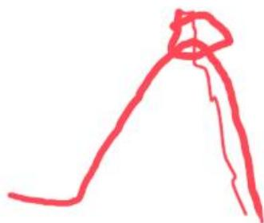
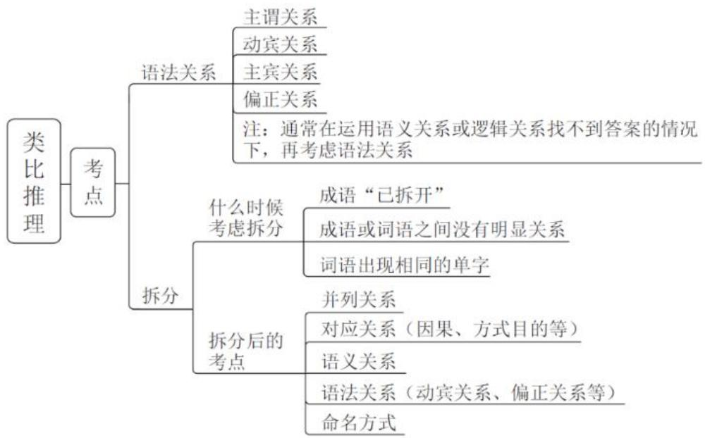
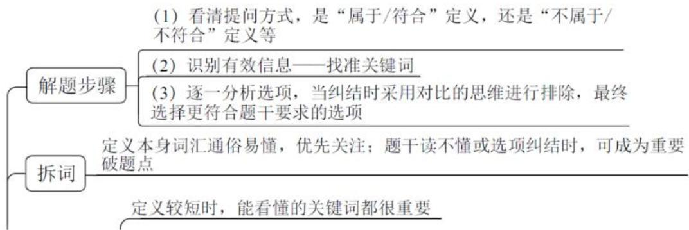

# 精讲精练-判断 5

（笔记）

主讲教师：程永乐

授课时间：2025.04.15

# 精讲精练-判断5（笔记）

# 判断推理 精讲精练5

# 学习任务：

1. 课程内容：类比推理（语义关系，语法关系，拆分）；定义判断（拆词，单定义一简单句）
2. 对应讲义：第  $245\sim 253$  页
3. 重点内容：

（1）类比推理中的语义关系
（2）类比推理中的语法关系
（3）类比推理中的拆分思维
（4）定义判断中的拆词
（5）定义判断中的单定义

【注意】本节课讲解类比和定义，对应讲义第  $245\sim 253$  页。

# 第二节 语义关系

考点一：近义关系、反义关系

考点二：比喻象征义

【注意】语义关系：

1. 考点一：近义关系、反义关系。
2. 考点二：比喻象征义。

考点一：近义关系、反义关系

近义关系：谦虚：虚心 走投无路：山穷水尽

反义关系：慎重：草率 高瞻远瞩：鼠目寸光

【注意】近义关系、反义关系：即近义词、反义词。

1. 近义关系：如“谦虚：虚心”，二者都是谦虚的意思，为近义词；考试时很少考查词语，更多喜欢考查成语，如“走投无路：山穷水尽”，均指没有路可

以走，二者为近义词。

2. 反义关系：如“慎重：草率”，“草率”说明不“慎重”，二者为反义词；如“高瞻远瞩：鼠目寸光”，“高瞻远瞩”指目光长远，“鼠目寸光”指目光短浅，二者为反义词。

考点一：近义关系、反义关系

1. 题型识别：四字词语或成语
2. 解题思路：看词语的近义或反义

(1) 常见易错成语要积累 不负众望 不孚众望
(2) 优先看简单、熟悉的

顿悟：醍醐灌顶 A.渴望：望梅止渴 D.孝顺：彩衣娱亲

(3) 不熟悉通过 “字面意思” 猜 轻车熟路：人生地疏

【注意】近义关系、反义关系：

1. 题型识别：出现四字词语或成语，优先考虑近反义关系。
2. 解题思路：看词语的近义或反义。

（1）常见易错成语要积累：如“不负众望：不孚众望”，“不负众望”指的是没有辜负大家的期望，即符合大家的期望；“不孚众望”指不符合大家的期望，二者为反义关系。
（2）优先看简单、熟悉的，利用排除思维解题：如题干为“顿悟：醍醐灌顶”，二者为近义关系；只有A、D项，A项为“渴望：望梅止渴”，D项为“孝顺：彩衣娱亲”，D项不熟悉，看A项，A项对直接选择，如果A项不对，选择D项。“渴望”指希望，“望梅止渴”的“渴”指口渴，二者不是近义关系，排除A项，选择D项。“彩衣娱亲”指一个人70多岁了还穿着彩色的衣服让亲人娱乐，指的是一个人非常孝顺。
(3) 不熟悉通过 “字面意思” 猜: 如 “轻车熟路: 人生地疏”, 根据 “熟”和 “疏” 可知二者是反义关系。

【例 1】(2024 安徽) 不胜枚举: 廖若晨星

A.指鹿为马：颠倒黑白

B. 众望所归：不负众望

C. 国泰民安：安居乐业

D. 杀鸡取卵：高瞻远瞩

【解析】1. 出现成语，优先考虑语义关系。“不胜枚举”指一个东西非常多，“寥若晨星”指的是稀疏得像早晨的星星，晚上星星多，早晨的星星很少，故“寥若晨星”指少，二者是反义关系。

A 项: “指鹿为马” 指的是指着鹿说是马, 指的就是 “颠倒黑白”, 二者为近义关系, 排除。
B 项: “众望所归” 指大家都对他有这样的期望, “不负众望” 指没有辜负大家的期望, 二者是近义关系, 排除。
C项：“国泰民安”指的是国家好、人民也好，“安居乐业”指居住好、工作生活也好，二者不是近义关系，也不是反义关系，排除。
D 项: “高瞻远瞩”指一个人的目光长远, “杀鸡取卵”指把鸡杀了取鸡蛋,以后就没有鸡下蛋了, 形容目光短浅, 二者为反义关系, 当选。

答疑：类比中的近义和反义与言语不同，比如两个词是近义词，言语中需要进行辨析，而在类比中两个词的意思差不多，则可以认为是近义，比言语中松一些、不严谨一些；老师在搜近义词还是反义词时会用字典，百度中搜的有时不严谨，“国泰”指的是国家，而“安居乐业”指的不是国家，故二者不是近义关系。

【选D】

【注意】成语积累：

1. 不胜枚举：形容数量很多。
2. 寒若晨星：形容数量稀少。
3. 指鹿为马：比喻故意颠倒黑白，混淆是非。4.颠倒黑白：比喻歪曲事实，混淆是非。
4. 众望所归：形容某人威望很高，受到大家敬仰和信赖，对他寄予某种期望。
5. 不负众望：不辜负大家的期望，不让大家失望。
6. 国泰民安：意思是国家太平，人民生活安定。
7. 安居乐业：形容安定地生活，愉快地工作。
8. 杀鸡取卵：比喻贪图眼前的好处而不顾长远利益。
9. 高瞻远瞩：比喻眼光远大。

考点一：近义关系、反义关系

1. 题型识别：四字词语或成语
2. 解题思路：看词语的近义或反义
3. 近反义关系二级辨析：

（1）感情色彩（褒义、贬义）

倾国倾城、锦上添花、火上浇油、贼眉鼠眼

【注意】如果根据近反义选不出唯一答案，考虑近反义关系的二级辨析：考得最多的是感情色彩（褒义、贬义、中性），主要考查褒义和贬义，中性考得很少。

1. 褒义词：用这个词形容你会很开心，则为褒义词，比如说你长得倾国倾城，你听了之后很开心，故为褒义词；锦上添花即好上加好的意思，你听了之后会很开心，故为褒义词。
2. 贬义词：用这个词形容你会很不开心，则为贬义词，比如你每次都火上浇油（坏上加坏），你听了之后肯定不开心，故为贬义词；比如说你长得贼眉鼠眼，听了之后会很生气，故为贬义词。
3. 考试中区分褒义词和贬义词时，一定要找最熟悉的词。

【例 2】(2022 青海) 化险为夷: 转危为安

A. 异曲同工：深入浅出

B. 承前启后：继往开来

C. 除旧布新：空前绝后

D.畏首畏尾：瞻前顾后

【解析】2. 出现成语，优先考虑语义关系。“化险为夷”“转危为安”均指把危险变成平安，二者为近义关系。

A项: “异曲同工”指曲调是不同的, 但是同样美妙, 形容用不同的方法达到了相同的效果; “深入浅出”一般形容一个人讲课, 指把晦涩难懂的东西讲解得非常浅显, 二者不是近义关系, 排除。
B项：“承前启后”指承接前面的、启示后面的；“继往开来”指从以前往后开拓，均指从前往后，二者是近义关系，保留。
C 项: “除旧布新” 指去除旧的、建立新的; “空前绝后” 指之前没有, 以后

也不会有，形容成就很厉害、独一无二，二者不是近义关系，排除。

D项: “畏首畏尾”说明思考的顾虑比较多, “瞻前顾后”说明一个人有顾虑,二者为近义关系，保留。
B、D项均为近义关系，二级辨析考虑感情色彩。题干“化险为夷”“转危为安”是褒义词。
B 项: “承前启后”“继往开来”均指承接前面、开拓未来, 都是褒义词, 保留。
D项：“畏”指怕、胆小，如果一个人说你是“胆小鬼”，你听了之后肯定不开心，故“畏首畏尾”是贬义词，排除。【选B】

# 【注意】

1. 出现成语，优先考虑语义关系，选不出唯一答案，二级辨析考虑感情色彩：优先关注明显的、明确的词。如“瞻前顾后”是中性词，可以形容做事谨慎，考虑周密，从该角度考虑则是褒义词，也形容顾虑太多，犹豫不决，从该角度考虑则是贬义词。

# 2. 成语积累：

(1) 化险为夷: 形容使危险的情况变成平安。
(2) 转危为安: 意思是由危险转为平安。
(3) 异曲同工: 比喻不同的说法或做法都收到同样的效果。
(4) 深入浅出: 指讲话或文章的内容深刻, 语言文字却浅显易懂。
（5）承前启后：指承接过去的，开创未来的，继承前人事业，为后人开辟道路。
(6) 继往开来: 指继承前人的事业, 并为将来开辟道路。
(7) 除旧布新: 指除去旧的, 建立新的。
(8) 空前绝后: 指从前没有过, 此后也不会有, 多用来形容某种成就或盛况。
(9) 畏首畏尾：比喻胆小、做事顾虑重重。
(10) 瞻前顾后: 形容做事谨慎, 考虑周密, 也形容顾虑太多, 犹豫不决。

(2022 重庆)

（2022江苏）

过河拆桥：饮水思源

水中捞月：白费功夫

A. 江心补漏：未雨绸缪

C. 棋逢对手：不相上下

C. 了如指掌：一窍不通

D. 虾蜉撼树：不自量力

# 【注意】

1. 2022 重庆: “过河拆桥”指过了河就把桥拆了, 形容不知道感恩, “饮水思源”指懂得感恩, 二者是反义关系; A 项 “江心补漏” 指船到了江的中心才补漏, 形容为时已晚, “未雨绸缪” 指提前做准备, 二者是反义关系; C 项 “了如指掌” 指很了解, “一窍不通” 指不了解, 二者是反义关系。A、C 项都是反义关系, 二级辨析考虑感情色彩, 找与题干对应的选项。题干“过河拆桥”是贬义词, “饮水思源” 是褒义词, 找前面是贬义、后面是褒义的选项。A 项 “江心补漏” 是贬义词, “未雨绸缪” 是褒义词, 选择 A 项。C 项 “了如指掌” 一定不是贬义词, 排除 C 项。
2. 2022 江苏：“水中捞月”形容“白费功夫”，二者是近义词，C、D项都是近义关系，二级辨析考虑感情色彩。题干“白费功夫”是贬义词，C项“不相上下”不是贬义词；D项“不自量力”是贬义词，选择D项。

# 考点一：近义关系、反义关系

1. 题型识别：四字词语或成语
2. 解题思路：看词语的近义或反义
3. 近反义关系二级辨析：

# （1）感情色彩（褒义、贬义）

倾国倾城、锦上添花、火上浇油、贼眉鼠眼

# （2）词语程度：

用否定词加深词语程度 一尘不染、一丝不苟、绝无仅有

借助其他事物侧面描述 沉鱼落雁、坚若磐石

【注意】词语程度：一般在近义关系中考查，一个成语可能比一个词语的程度深，比如“喜欢：爱”，“爱”比“喜欢”的程度深一些。

1. 用否定词加深词语程度：如“一尘不染”，出现否定词“不”，指一点尘土

都没有、特别干净；如“一丝不苟”指一个人特别认真，一点都不马虎；“绝无仅有”中“无”是否定词，指只有一个、独一无二。

2. 借助其他事物侧面描述：如果说你长得好看，可能没有那么开心，但用“沉鱼落雁、闭月羞花”形容你，你会非常开心，指你长得特别好看，直接描述力度较弱一些，但是用侧面描写程度会加深，鱼看到了你就沉下去了，大雁看到了你就落了下来，从侧面描写非常好看；如“坚若磐石”，“若”是比喻，指像磐石一样坚韧，形容特别坚韧。

【例3】（2021事业单位）认真：一丝不苟

A. 清楚：一清二楚

B. 正确：分毫不差

C. 温暖：风和日丽

D. 干净：一尘不染

【解析】3. 出现成语+词语，喜欢考查近义关系，二级辨析考虑程度。“一丝不苟”指一点都不马虎、特别“认真”，二者是近义关系。

A 项: “一清二楚”和“清楚”是近义关系, 保留。

B 项: “分毫不差”指准确、精确, 而不是 “正确”, 二者不是近义词, 排除。

C项: “风和日丽”指风和阳光如何, 说的是天气, 与 “温暖” 不是近义关系, 排除。

D 项: “一尘不染” 指特别 “干净”, 二者是近义关系, 保留。

二级辨析若考虑感情色彩，题干和A、D项都是褒义词，根据感情色彩无法解题，考虑程度。题干“一丝不苟”指特别“认真”，程度加深。

A项：“一清二楚”指“清楚”，没有程度加深，排除。
D 项: “一尘不染” 指特别 “干净”, 程度加深, 当选。【选 D】

考点一：近义关系、反义关系

1. 题型识别：四字词语或成语
2. 解题思路：看词语的近义或反义
3. 近反义关系二级辨析：

（1）感情色彩（褒义、贬义）
(2) 词语程度: 用否定词加深词语程度; 借助其他事物侧面描述

（3）词语结构
（4）描述对象

【2020国考】轻车熟路：人生地疏

B. 任重道远：无所事事

C. 前仆后继：贪生怕死

【2022 国考】国色天香 对于（）相当于（）对于玉树临风

A. 面如冠玉 蟋首蛾眉

B. 倾国倾城 明眸皓齿

【注意】近反义关系二级辨析：

1. 词语结构：如2020国考，“轻车熟路”和“人生地疏”是反义关系，B、C项都是反义词，根据感情色彩、程度无法解题，看结构。题干“轻车”和“熟路”、“人生”和“地疏”都是并列关系，“任重”和“道远”是并列关系，但是“无所”和“事事”不是并列关系；C项“前仆”和“后继”、“贪生”和“怕死”均为并列关系。
2. 描述对象：如 2022 国考，“国色天香”和“玉树临风”均指长得好看，A、B项均指长得好看，选不出答案，看描述的对象。代入 A 项：“国色天香”描述的是女性，A 项“面如冠玉”描述的是男性，“臻首蛾眉”描述的是女性，“蛾眉”指的是美丽的女子，“臻”在古代指蝉，蝉的头是方的，眉毛是细的，像蝉的头和眉，说的是女性好看，“玉树临风”描述的是男性，代入 A 项后，前面描述的是女性，后面描述的是男性，选择 A 项。代入 B 项：“国色天香”描述的是女性，“倾国倾城”描述的是女性，“明眸皓齿”描述的是女性，“玉树临风”描述的是男性，前面是两个女性，后面是一男一女，无法对应，排除 B 项。
3. 考得最多的是感情色彩，其次是程度，词语结构和描述对象考得不多。近反义的二级辨析按照该顺序试，哪个有答案就选择哪个，是根据考频高低进行排序的。

考点二：比喻象征义

月亮：玉盘

松鹤：长寿

1. 题型识别：文艺词+大白话
2. 解题技巧：积累+排除思维

【注意】比喻象征义：如圆圆的月亮像玉盘，弯弯的月亮像小船，用“像”造句为比喻义；象征义与中国传统文化息息相关，比如“松鹤”象征“长寿”，别人过寿时会送《松鹤延年图》，追求女生时会送玫瑰花，“玫瑰花”象征“爱情”。比喻义和象征义无需区分，如果题干是比喻义，可以选择象征义的选项，如果题干是象征义，可以选择比喻义的选项。

1. 题型识别：文艺词+大白话。很多词出现在古文中。
2. 解题技巧：积累+排除思维。比喻象征义主要考查常识，如果会就比较简单，如果不会就比较难，要多刷题、多积累，很多词会重复考查；利用排除思维，二选一时，如果不知道 A 项，则可以看 B 项，B 项对就选择 B 项，B 项不对就选择 A 项。

【例】（2023 吉林）旌旗 对于（ ）相当于（ ）对于船只

A.武器 船桨

B.锣鼓 船夫

C.军队 孤帆

D.旗帜 汽车

【解析】例.填空式类比，逐一代入选项。陈毅在《梅岭三章》中写到“此去泉台招旧部，旌旗十万斩阎罗”，“旧部”就是“军队”，所以用“旌旗”比喻“军队”，李白写过《送孟浩然之广陵》，孤帆远影碧空尽，唯见长江天际流，用

“孤帆”比喻“船只”，也可以看成是指代，“旌旗”指代“军队”，“孤帆”指代“船只”，选择C项。

A项：“旌旗”和“武器”没有关系，“船桨”是组成“船只”的一部分，二者为组成关系，排除。
B 项: “旌旗”和“锣鼓”没有关系, “船夫”和“船只”是人和工作地点的对应，排除。
D项：“旌旗”和“旗帜”是全同关系，“汽车”和“船只”都是运输的交通工具，二者是并列关系，排除。【选C】

【注意】积累: “广陵” 指的是扬州, 二者是全同关系。

南冠：囚犯（2018联考）

胃口：兴趣（2021浙江）

桑梓：家乡（2018联考）

桃李：学生（2018吉林、2021浙江）

青衿：读书人（2018联考）

手足：兄弟（2017山东）

浮屠：佛塔（2018联考）

白丁/布衣：百姓（2014四川）

丝竹：音乐（2018吉林）

鸿雁/笺札：书信（2017联考）

汗青：史册（2015 甘肃）

总角/垂髫：小孩（2014山西）

同窗：同学（2015甘肃）

干戈/烽烟：战争（2015甘肃）

红颜/娥眉：女性（2019四川）

花甲/耄耋/佝偻/黄发：老人（2018辽宁）

【注意】比喻象征义常考常识，都有历史典故，“南冠”比喻“囚犯”，“南”指南边的楚国人，“冠”指帽子，楚国人在南边，有一次打仗被打败了，后来用南冠代指/比喻囚犯；在之前经常在家门口种桑树和梓树，所以“桑梓”比喻家乡，有一首诗为“埋骨何须桑梓地”；巾帼不让须眉，“巾帼”比喻女性，“须眉”比喻男性。以后刷到比喻象征义的题目，要进行总结。

# 三字俗语类积累

孺子牛比喻心甘情愿为人民大众服务，无私奉献的人

烂摊子比喻秩序混乱，不易收拾整顿的局面或单位

白眼狼比喻忘恩负义、过河拆桥、恩将仇报的人

墙头草比喻没有主见、左右摇摆、见风使舵的人

纸老虎比喻貌似强大、实际虚弱的人或集团

及时雨比喻在关键时刻能解救危难的人或事

冷板凳比喻因不受重视而担任清闲的职务

捞稻草比喻在绝望中做徒劳无益的挣扎

跑龙套比喻在人手下做无关紧要的事

定心丸比喻能使人情绪安定的东西

耍花枪比喻卖弄小聪明的欺骗行为

拉清单比喻结算彼此的恩怨利害

破天荒比喻从来没有出现过的事

上台阶比喻取得新的更大的成就

笑面虎比喻外貌和善而内心严厉凶狠的人

地头蛇比喻凭借当地势力欺压人民的恶霸

老古董比喻思想陈腐或生活习惯陈旧的人

应声虫比喻象征胸无主张、随声附和的人

传声筒比喻没有主见只会鹦鹉学舌的人

井底蛙比喻目光短浅，见识狭隘之人

三脚猫比喻对各种技艺略知皮毛的人

侃大山比喻没有目的的聊天

触霉头比喻遭遇不顺心的事

替罪羊比喻代人受过的人

台柱子比喻集体的骨干

马大哈比喻粗心的人

千里马比喻人才

印把子比喻政权

考过的易错选项：

心腹：信任

（心腹比喻值得信任的人，而不是信任）

耳目：刺探

（耳目比喻刺探消息的人，而不是刺探）

# 【注意】

1. 上述的三字俗语要必会，三字俗语不会特别多，把常见的背下来即可。
2. “心腹”比喻值得信任的人，而不是信任；“耳目”比喻刺探消息的人，而不是刺探。如果为“心腹：信任”，二者不是比喻象征义。“笑面虎”比喻凶狠的人，而不是凶狠本身。

考点一：近义关系、反义关系

1. 题型识别：四字词语或成语
2. 解题思路：看词语的近义或反义
3. 近反义关系二级辨析：

（1）感情色彩（褒义、贬义）
(2) 词语程度: 用否定词加深词语程度; 借助其他事物侧面描述
（3）词语结构
（4）描述对象

考点二：比喻象征义

1. 题型识别：文艺词+大白话
2. 解题技巧：积累+排除思维

# 【注意】

1. 考点一：近义关系、反义关系。

(1) 题型识别: 四字词语或成语。
(2) 解题思路: 看词语的近义或反义。
(3) 近反义关系二级辨析:

(1)感情色彩。(2)词语程度。(3)词语结构。(4)描述对象。

2. 考点二：比喻象征义。

(1) 题型识别: 文艺词+大白话。

(2) 解题技巧：积累+排除思维。

# 第三节 语法关系

技巧：造句子

我喜欢你

1. 主谓关系 我：喜欢
2. 动宾关系 喜欢：你
3. 主宾关系 我：你

区分动词和动宾

唱歌

歌唱

4. 偏正关系 聪明：学生

偏正关系：由修饰语和中心语组成，修饰语主要起修饰、限制或说明中心语的作用

(1)形容词+名词：美丽：花朵
(2)副词+动词：慢慢：跑步
(3)名词+名词：物理：老师

造句子原则：尽量不加字，加字尽量加一样的

# 【注意】语法关系：

1. 技巧：造句子。
2. 例：我喜欢你。为主谓宾关系。

(1) 主谓关系：如“我：喜欢”。
(2) 动宾关系：如“喜欢：你”，“喜欢”是动词，是谓语，“喜欢你”可以叫谓宾关系，也可以叫动宾关系。
(3) 主宾关系：如“我：你”。
（4）区分动词和动宾：动宾是动词+一个对象，动词和动宾的区别看是否有对象，有对象的是动宾，没有对象的是动词。如“唱歌”，“唱”是动词，“唱”的是“歌”，为动宾；如“歌唱”，是动词，如“歌唱祖国”，则是动宾。
(5) 偏正关系: 一个词修饰另一个词, 由修饰语和中心语组成, 修饰语主要起修饰、限制或说明中心语的作用。如 “聪明 : 学生”, “学生” 是中心语, “聪

明”在修饰“学生”，一个词在修饰另外一个词，为偏正关系。

① 形容词+名词：如“美丽：花朵”，可以造句为“美丽的花朵”，可以加“的”造句，“美丽”在修饰“花朵”，为偏正关系。形容词+名词与属性是一个意思（了解即可）。(2)副词+动词（考得最多）：如“慢慢：跑步”，可以造句为“慢慢地跑步”，副词修饰动词，为偏正关系。(3)名词+名词：如“物理：老师”，“物理”和“老师”都是名词，“物理”对“老师”起到修饰、说明的作用，为偏正关系。

3. 造句子原则：尽量不加字，加字尽量加一样的。
4. 答疑：语法关系考得特别少，偶尔考查 1 道题，一般情况下，当逻辑关系、语义关系均不行时，考虑语法关系。

【例 1】(2024 黑龙江公安) 明月：松间：照

A. 青霭：入看：无

B. 野旷：天低：树

C. 绿树：村边：合

D. 春风：花草：香

【解析】1. 可以造句为“明月照松间”，“照”是动词，为主谓宾关系。

A 项: “青霭” 指云雾, 云雾进入到森林中就看不见了, “无”指看不见、没有, 不是动词, 故该项不是主谓宾, 排除。
B 项: “树” 是名词, 不是动词, 不是主谓宾, 排除。
C 项：如果不知道 “合” 的意思，保留。
D 项: “香” 是形容词, 不是动词, 故不是主谓宾, 排除。
C 项: “合” 指的是环绕, 绿树环绕着村庄, 为主谓宾, 当选。【选 C】

【注意】因为“野旷”（原野比较宽广、宽阔），所以“天低树”（看起来天比树还低），为因果关系；“江清月近人”也是因果关系。

【例 2】(2021 联考) 铭心刻骨：记忆

A. 冥思苦想：思想

B. 繁花似锦：繁华

C. 闭月羞花：容貌

D. 冷若冰霜：冷漠

【解析】2. “铭心刻骨”修饰“记忆”, “铭心刻骨”的“记忆”, 为偏正关系。

A 项: “思想”不能用“冥思苦想”来形容, 排除。
B 项: “繁花似锦”指许多色彩纷繁的鲜花, , 好像富丽多彩的锦缎, 一般说城市 “繁华”, “繁花似锦” 不能修饰 “繁华”, 排除。
C 项: “闭月羞花”的“容貌”, 为偏正关系, 保留。
D 项: “冷若冰霜”指一个人“冷漠”无情, 和“冷漠”是近义关系, 而不是修饰关系, 排除。【选 C】

# 【注意】

1. 繁花似锦：是指许多色彩纷繁的鲜花，好像富丽多彩的锦缎。
2. 冷若冰霜：比喻待人接物毫无感情，像冰霜一样冷。

# 第三节 拆分思维

何时拆开看？

1. 成语 “已拆开”

例：南征：北战

2. 词语之间没有明显关系

例：左顾右盼：上蹿下跳

3. 词语出现相同的单字

例：甘：甘甜：甘愿

# 【注意】拆分思维：

1. 拆分只是一种思维，考点都是前面讲过的，如逻辑关系、对应关系。
2. 何时拆开看：

（1）成语“已拆开”：如“南征：北战”，优先考虑“南征”和“北战”之间的关系，如果选不出唯一答案，再拆成单个字。“南”和“北”是反义词，“征”和“战”是近义词。
(2) 词语之间没有明显关系: 如 “左顾右盼 : 上蹿下跳”, “左顾右盼” 指左看右看, “上蹿下跳” 是动作, 二者没有关系, 考虑拆词。“左” 和 “右” 是反义词, “顾” 和 “盼” 是近义词, “上” 和 “下” 是反义词, “蹿” 和 “跳” 是近义词。
(3) 词语出现相同的单字, 看字在词语中的含义是否相同: 如 “甘 : 甘甜 :

甘愿”, 都出现 “甘”, 看 “甘” 的意思是否相同, “甘甜” 中的 “甘” 指甜, “甘愿” 中的 “甘” 指愿意, “甘” 字的含义不同。

拆词考法“一网打尽”

考法1：语义（近反义）

生死存亡 南征北战

考法2：对应（因果、方式目的）

春暖花开 唇亡齿寒 顺藤摸瓜 刻舟求剑

考法3：逻辑（并列、种属）

笔墨纸砚 飞禽走兽 黄河：江河湖海

考法4：语法（主谓宾、偏正）

愚公移山 忧国忧民 青山绿水 明眸皓齿

【注意】拆词考法“一网打尽”：

1. 考法 1: 语义 (近反义)。如 “生死存亡”, “生” 和 “死” 是反义, “存”和“亡”是反义,“生”和“存”是近义,“死”和“亡”是近义; 如 “南征北战”,“南”和“北”是反义词,“征”和“战”是近义词。
2. 考法 2: 对应 (因果、方式目的)。如 “春暖” 导致 “花开”, “唇亡” 导致 “齿寒”, 都是因果关系, 因果的二级辨析考虑原因是人为/自然、结果是好/坏, “花开” 是好的结果, “齿寒” 是不好的结果; “顺藤” 是为了 “摸瓜”, “刻舟” 是为了 “求剑”, 为方式目的对应, 二级辨析考虑方式是否正确、结果能否达到。“顺藤摸瓜”的方式正确, 可以达到目的, “刻舟求剑”的方式错误, 达不到目的。
3. 考法 3: 逻辑 (并列、种属考得多, 全同、交叉也有可能考)。如 “笔墨纸砚”, 为四字并列; 如 “飞禽走兽”, “飞禽” 和 “走兽” 是并列关系; 如 “黄河：江河湖海”, “黄河” 是 “河”, 前面的词与第二个字是种属关系。
4. 考法 4: 语法 (主谓宾、偏正)。如 “愚公移山”, “愚公” 是主语, “移”是动词, “山” 是作用对象, 为主谓宾; 如 “忧国忧民”, “忧国” 和 “忧民” 是并列关系, “忧国” (担忧国家) 和 “忧民” (担忧人民) 均为动宾结构; 如 “青山绿水”, “青山” 和 “绿水” 是并列关系, “青” 修饰 “山”, “绿” 修饰 “水”,均为偏正关系；如“明眸皓齿”,明亮的眼睛,洁白的牙齿,“明眸”和“皓齿”是并列关系,而且均为偏正关系。

【例1】（2022联考）水落：石出

A.理屈：词穷

B. 狼奔：豕突

C.枕戈：待旦

D.求全：责备

【解析】1. “水落石出”是一个成语，成语被拆开，考虑两个词之间的关系，因为“水落”，所以“石出”，为因果关系。

A项：因为“理屈”，所以“词穷”，为因果关系，当选。
B 项: “豕突”中“豕”是指猪, “狼奔豕突”指像狼和猪那样奔跑冲撞, 并不是因果关系, 而是并列关系, 排除。
C项：“枕戈”“待旦”指在打仗时期，睡觉时把武器放在枕头下面等待天亮，不是因果关系，排除。
D 项: “求全”指要求完美无缺, “责备”指要求完备, “求全责备”指对人对事要求完美无缺, “求全”和“责备”是并列关系, 而不是因果关系, 排除。

【选A】

# 【注意】

1. 狼奔豕突：像狼和猪那样奔跑冲撞。
2. 求全：要求完美无缺。责备：要求完备。“求全责备”指对人对事要求完美无缺。

【例 2】(2023 广东) 舍身: 取义

A. 摩拳：擦掌

B. 含苞：欲放

C. 得陇：望蜀

D. 格物：致知

【解析】2. 成语拆成了两个部分，考虑分开看。“舍身”是为了“取义”，为方式目的对应。

A 项: “摩拳” “擦掌” 是两个不同的动作, 为并列关系, 排除。
B 项: “含苞” 不是为了 “欲放”, 不是方式目的对应, 排除。
C 项: “陇”和“蜀”是两个地点, “得陇”“望蜀”指得到了陇地, 还想要得到蜀地, 吃着碗里的望着锅里的, 有先后顺序, 没有 “为了”的意思, 排除。
D 项: “格物” 指研究事物的道理, “致知” 指获得知识, “格物” 是为了 “致知”, 为方式目的对应, 当选。【选 D】

怎么想到因果关系？

“导致”造句、前后两词一般是主谓结构

水落：石出 水涨：船高 春暖：花开 风吹：草动 天寒：地冻

人去：楼空鸟尽：弓藏唇亡：齿寒理屈：词穷水滴：石穿

怎么想到方式目的？

“为了”造句，前后两词一般是动宾结构

刻舟：求剑 按图：索骥 削足：适履 杀鸡：取卵

杀鸡：儆猴 掩耳：盗铃 守株：待兔 齿壁：偷光

缘木：求鱼 画饼：充饥 饮鸠：止渴 望梅：止渴

【注意】区分因果关系和方式目的：

1. 两个词可以用“导致”造句，考虑因果关系；两个词可以用“为了”造句，考虑方式目的。
2. 成语做拆分时，前后的两个词是主谓关系，考查因果的概率比较大，比如“水落石出”，“水”是名词，“落”是动词，“水落”是主谓，“石出”是主谓，考因果的概率就比较大；如“理屈：词穷”，“理屈”“词穷”均为主谓结果，考虑因果关系。
3. 方式是人的行为，如果前后两词是动宾结构，大概率考方式目的，如“刻舟”，“刻”是动词，“舟”是对象；“刻舟”“杀鸡”“凿壁”“望梅”“饮鸠”都是动宾，优先考虑方式目的。
4. 上述常考的成语要背下来，有可能重复出现。

【例 3】(2024 黑龙江公安) 除暴：安良

A. 见贤：思齐

B. 水到：渠成

C. 激浊：扬清

D. 风平：浪静

【解析】3. “除暴”指把暴虐的人除掉，“安良”指安抚善良的人民，是两个不同的行为，为并列关系，不是方式目的、因果关系；根据并列关系选不出唯一答案，考虑拆分。“除”是动词，“暴”是名词，“除暴”是动宾，“安良”是动宾。

A项: “见贤”（看见贤人）是动宾, 但是 “思齐” (思与之齐) 不是动宾, “见贤思齐” 指看见贤能的人, 就想与他平齐, 排除。
B 项: “水到” 是主谓, “水到” 导致 “渠成”, 为因果关系, 排除。
C 项: “激浊” 是动宾, “扬清” 是动宾, 当选。
D 项: “风平” 不是动宾, 排除。【选 C】

【注意】要知道成语的意思才能知道关系，曾经出过“兽聚鸟散”，指的是像兽、像鸟一样聚散无常，“兽聚”和“鸟散”没有因果关系。

【例 4】(2024 国考) 明辨是非: 静待成败

A. 判若云泥：开释左右

B. 洞鉴古今：博观始终

C. 一争高低：弱肉强食

D. 惩恶劝善：天差地别

【解析】4. “明辨是非”和“静待成败”没有关系，考虑拆词。“是”和“非”是反义词，“成”和“败”是反义词。

A项：“云”和“泥”不是反义词，“判若云泥”指像天上的云和地下的泥一样差别那么大，“云”和“泥”代表的是相反的事物，“云”代表好的，“泥”代表不好的，若认为是反义词，可以保留，“左”和“右”是反义词，保留。
B 项: “古”和“今”是反义词, “始”和“终”是反义词, 保留。
C项：“高”和“低”是反义词，“强”和“食”不是反义词，排除。
D 项: “劝”和“善”不是反义词, “地”和“别”不是反义词, 排除。

“明辨”是动词，“是非”是对象，“静待”即等待，“明辨是非”和“静待成败”均为动宾结构。

A 项: “判若云泥” 不是动宾, 排除。
B 项: “洞鉴古今” “博观始终” 均是动宾结构, 当选。【选 B】

【例 5】(2025 国考) 逐客令：挡箭牌

A.急先锋：领航者

B. 避风港：马后炮

C.敲门砖：绊脚石

D.鸿门宴：攻心计

【解析】5. 下了“逐客令”就是让你走，“挡箭牌”是替人挡事情，题干两

个词没有关系，考虑拆词。“逐客令”是用“逐客”命名这个词语，“逐客令”用功能进行命名；“挡箭牌”是用来挡箭的，也是用功能命名，考查命名方式。

A 项: “急” 不是功能, 排除。
B 项: “避风” 是功能, “马后” 不是功能, 排除。
C 项: “敲门”“绊脚”都是功能, 保留。
D 项: “鸿门” 不是功能, 排除。【选 C】

【注意】题干两个词没有关系，喜欢考查命名方式。两个字、四个字都可以考查，但三个字的词考查特别多。

【2023 联考】洗脸盆：代步车

A.招待所：降压药

D. 计算器：液压机

【2019国考】马蹄莲：蟹爪兰

A. 牟牛花：美人蕉

C灯笼椒：金针菇

【2023 国考】铜镜：化妆镜

A. 门帘：纱帘

B. 木碗：汤碗

无关、并列、交叉都可以看命名方式

# 【注意】

1. 命名方式：有3种情况。

（1）如果两个词没有关系，尤其遇到三字词语，特别喜欢考查命名方式。如2023联考，“洗脸盆”和“代步车”没有关系，考虑拆词，三字词语，“洗脸”“代步”都是功能，题干都是用功能命名；A项“招待所”的功能是招待，“降压药”的功能是降压，均为功能命名；D项“计算器”的功能是计算，“液压”是工作原理，即用液体的压力切割一些东西或工作，如水压特别大可以切割金属（水刀），不是功能。
(2) 并列关系选不到唯一答案, 考虑命名方式。如 2019 国考, “马蹄” “蟹爪” 都是根据形状命名; A 项 “美人” 不是形状; C 项 “灯笼” “金针” 都是形状, C 项当选。
(3) 交叉关系选不到唯一答案, 考虑命名方式。如 2023 国考, “铜镜” 看

的是原材料, “化妆镜” 看的是功能, 两个不同的角度, 为交叉关系, 但 A、B 项都是交叉关系, 选不到唯一答案, 考虑命名方式。“铜镜” 用的是原材料, “化妆镜” 用的是功能; A 项 “门帘” 不是原材料; B 项 “木碗” 是原材料, “汤碗”指用来盛汤的碗, 根据功能命名, B 项当选。

2. 总结：两个词没有关系、两个词是并列但选不到唯一答案、两个词是交叉关系但选不到唯一答案都可以考虑拆词。
3. 成语拆开时不能直接看成语内部的关系，如“除暴：安良”，不能直接看“除暴”和“安良”是动宾，因为一个成语拆成两个词，先看两个词之间的关系，如果能选择答案就直接结束，如果选不到唯一答案再拆分看词语内部的关系。

【例 6】(2024 江苏) 海：海沟：海量

A.天：天眼：天堑
B.碑：碑座：碑林
C. 火：火焰：火气
D. 心：心房：心腹

【解析】6. 一个字重复出现，“海”出现3次，看“海”在词语中的意思是否一样，“海沟（海里的沟）”的“海”就是大海，是“海”本身的意思；“海量”指像大海一样的量，如说一个人能喝酒，会说“海量”，说明他喝得多，像大海一样能喝，“海”指像大海一样，两个“海”的意思不一样。

A 项: “天眼”指天神（天上的神）之眼或者国家的“天眼”（望远镜，用来看天空的），“天眼”有不同的意思，但“天”都指天空; “天堑”指天然的沟壑、鸿沟, 如 “天堑变坦途”, “天” 是天然的意思, 两个 “天” 的意思不一样, 保留。
B 项: “碑座”指石碑的座; “碑林”是石碑组成的林, 像树林一样, 把石碑放在一起, “碑”都是石碑的意思, 意思一样, 排除。
C项: “火焰”的“火”是“火”本来的意思; “火气”指像火一样生气, “火”指像火一样, 两个“火”的意思不一样, 保留。
D 项: “心房” 的 “心” 是心脏; “心腹” 指心和腹, “心” 是心脏, 意思一样, 排除。

题干和 C 项都是一个词字是本来的意思，一个字是“像……一样”的意思，C 项比 A 项好，如果没有 C 项，可以选择 A 项，优先考虑两个“海”的意思是否一样，A、C 项相同字的意思都不一样，对比择优，C 项一个字是本来的意思，一

个字是“像……一样”的意思，C项当选。

答疑：“心腹”比喻信任的人，是比喻义，“心腹”表面的意思是心和腹，“心”指心脏。就算认为D项两个“心”意思不一样，“心腹”的“心”也不是“像……一样”的意思。

考查字的本义和引申义。【选C】

【2023吉林】像……一样

火：火急：火警

B.蛇：蛇行：蛇胆

C. 牛：牛毛：牛饮

【2022 江苏】具体/抽象

峰：山峰：碳达峰

B.潮：海潮：移民潮

D.羊：山羊：领头羊

（2017天津）读音

青：青年：青草

A. 禅：参禅：禅让

B. 信：信念：书信

【注意】一个字重复出现，考虑两个词中这个字的意思是否一样，如果两个词中的字意思不一样，还有3个对比择优的思维：

1. 2023 吉林：“火急”指像火一样急，是引申义，“火警”的“火”是火本身的意思，二者意思不一样；B项“蛇行”指像蛇一样行，“蛇胆”是蛇本来的意思，保留；C项“牛毛”的“牛”是本来的意思，“牛饮”指像牛一样喝东西，为“像……一样”，B、C项中两个词的相同字意思都不一样，但是C项和题干结构反了，B项当选。C项后两个词换下位置就对了。
2. 2022 江苏：

(1) “山峰”的“峰”是实际的物质，“碳达峰”的“峰”指峰值，如上图，

最高点是峰值，两个“峰”意思不一样；B项两个“潮”意思不一样；D项两个“羊”意思不一样。继续对比，看具体/抽象，“山峰”的“峰”是具体的，“碳达峰”是抽象的、虚拟的；B项“海潮”是具体的，“移民潮”是抽象的；D项“山羊”的“羊”是具体的，“领头羊”的“羊”也是具体的，B项当选。

# (2) 常识积累:

①碳中和：现在产生二氧化碳，二氧化碳会造成温室效应，不希望有那么多二氧化碳，产生二氧化碳之后要让它变少，可以通过植树造林等方式消耗二氧化碳，产生的二氧化碳和消耗的二氧化碳相等时就是碳中和，即产生的二氧化碳都被吸收了。
②碳达峰: 二氧化碳一直在上升, 当吸收比排放多的时候就会下降, 最高的峰值是碳达峰。

# 3.2017天津：

(1) “青年”的“青”指年轻，“青草”的“青”指绿色两个“青”的意思不一样；A项“参禅”和“禅让”的意思不一样；B项“信念”指坚定不移想法，“书信”的“信”是信的本义，两个“信”意思不一样。考查读音，A项两个“禅”的读音不一样；题干两个“青”读音是一样；B项两个“信”的读音是一样的，B项当选。

# (2) 答疑:

(1)看字在哪一个位置是没有答案的，没有考过字在哪个位置。②禅让：以前是禅让制，甲有能力，乙不当老大了，乙让甲当老大。后来不是禅让制，传给儿子就是世袭制。

4. 总结：如果一个字重复出现，考虑这个字在词语的意思是否一样，如果题干相同字的意思不一样，只有一个选项相同字的意思不一样，就直接选择；如果有多个选项相同字的意思不一样，可以考虑字是本义/引申义、具体/抽象、读音。

【注意】类比推理：

1. 语法关系：主谓、动宾、主宾、偏正等。
2. 拆分：成语拆开、两个词没有关系、一个字重复出现考虑拆开，了解拆开后的考点。

<table><tr><td>一级关系</td><td>二级辨析</td></tr><tr><td>并列关系</td><td>顺序、命名方式</td></tr><tr><td>交叉关系</td><td>命名方式</td></tr><tr><td>工艺</td><td>物理、化学</td></tr><tr><td>属性</td><td>必然、或然</td></tr><tr><td>功能</td><td>主要、次要</td></tr><tr><td>先后顺序</td><td>主体能否一致</td></tr><tr><td>因果</td><td>原因：人工/自然；结果：积极/消极</td></tr><tr><td>方式目的</td><td>方式对错、目的能否达到</td></tr><tr><td>近反义关系</td><td>感情色彩、程度、结构、描述对象</td></tr></table>

# 【注意】

1. 并列关系：二级辨析考虑顺序、命名方式。
2. 交叉关系：二级辨析考虑命名方式。3.工艺：二级辨析考虑物理、化学。
3. 属性：二级辨析考虑必然、或然。
4. 功能：二级辨析考虑主要、次要。
5. 先后顺序：二级辨析考虑主体能否一致。
6. 因果：二级辨析考虑原因是人工/自然；结果是积极/消极。
7. 方式目的：二级辨析考虑方式对错、目的能否达到。
8. 近反义关系：二级辨析考虑感情色彩、程度、结构、描述对象。

# 【2021 国考】江河湖海：水体

A. 鲳寡孤独：身份

D. 绫罗绸缎：面料

【注意】讲解的二级辨析优先考虑，如果二级辨析解决不了问题，考虑纵向对比。

1. 2021 国考: “江河湖海”是四字并列, 都和“水体”是种属关系; A项“鳏寡孤独”是人的四种“身份”, 都和“身份”是种属关系; D项“绫罗绸缎”和“面料”都是种属关系, 即前面四个字并列, 和后面的词是种属关系。没有讲过种属关系的二级辨析考虑什么, 前面讲解的方法解决不了问题, 考虑纵向比较,圈出“水体”“身份”“面料”, 看哪个词和“水体”类似, 哪个词和“水体”不一样, 即比较谁和谁是一类的, “水体”和“面料”都是非人, “身份”是人的身份, D项当选。
2. 如果题干都是吃的，A项都不是吃的，B项都是吃的，选择B项。河北考过“榆钱饼”是吃的，题干也是吃的。

<table><tr><td>一级关系</td><td>二级辨析</td></tr><tr><td>并列关系</td><td>顺序、命名方式</td></tr><tr><td>交叉关系</td><td>命名方式</td></tr><tr><td>工艺</td><td>物理、化学</td></tr><tr><td>属性</td><td>必然、或然</td></tr><tr><td>功能</td><td>主要、次要</td></tr><tr><td>先后顺序</td><td>主体能否一致</td></tr><tr><td>因果</td><td>原因：人工/自然；结果：积极/消极</td></tr><tr><td>方式目的</td><td>方式对错、目的能否达到</td></tr><tr><td>近反义关系</td><td>感情色彩、程度、结构、描述对象</td></tr><tr><td colspan="2">最后一招，纵向对比</td></tr></table>

【注意】一级关系做不出来，考虑二级辨析，如果教的二级辨析解决不了问题，最后一招，考虑纵向对比，即圈出来竖着的几个词，看哪个词和题干是一类的，纵向对比的范围特别广，可以比较都是人或都不是人、都是吃的或都不是吃的、人加工或不是人加工（自然生长）。

# 第三章 定义判断

每道题先给出一个概念的定义，然后分别列出四种情况，要求报考者严格依据定义选出一个最符合或最不符合该定义的答案

# 【注意】

1. 考情：国考考查 10 道题，近几年定义判断比较难。
2. 定义判断：题干给出一个定义，然后严格根据定义选出一个最符合或最不符合该定义的答案。涉及了“最”，就涉及对比择优，看全4个选项，对比择优，选择比较完美的选项。

# 解题思维：

1. 看提问——看清“属于/符合”“不属于/不符合”
2. 看题干——识别有效信息：找准关键词、关键句
3. 看选项——纠结时选项对比择优

学会接受不完美！！！

# 【注意】解题思维：

1. 看提问：看清问的是“属于/符合”“不属于/不符合”，特别是看到“不属于/不符合”，一定要提醒自己，不要因为读错题而选错。
2. 看题干：识别有效信息，找准关键词、关键句。
3. 看选项：对比择优，如果题目出得特别完美，正确率会在  $90\%$  以上，有的题目难，不可避免会有些不完美，需要接受不完美，通过对比择优去选择答案。

# 对比择优，接受不完美

女汉子：自认或被大众认为性格言行与男性相似的女性

下列最可能是女汉子的是:

A. 个性豪爽的美女（一定对）
B. 温柔体贴的男神（一定错）
C. 不拘小节的龙龙（可能对）

考试题一定有唯一答案，选出来才能得到分！

# 【注意】

1. 如上例，问“最可能是女汉子的是”，关键信息：自认或被大众认为性格言行与男性相似的女性。

(1) 如果给出 A、B 项: A 项可以; B 项 “男神” 是男的, 肯定不行, B 项有问题, A 项没有问题, 选择 A 项。(2) 如果给出 B、C 项 (往难考查): B 项 “男神” 是男的, 不是女的, 肯定不对; C 项不知道 “龙龙” 是男的还是女的, 可能是男的, 也可能是女的, 选项没有说清楚, 但不违背题干的 “女性”, 是可能对的选项。B 项一定错, C 项有可能对, 对比择优, C 项当选。（3）总结：说错的一定是错的，没有说的就有可能是对的、有可能是错的，对比择优即可。考试中有A项，就选择A项，如果没有A项，C项也可以作为正确答案。

2. 考试题一定有唯一答案，只有选出来才能得分。

# 第一节 拆词

拆词（定义词汇本身就是关键词）

非职务发明是指发明人利用自己的时间、资金、设备等物质条件或技术条件完成的发明创造。非职务发明的专利申请权归发明人或设计人。

根据上述定义，以下属于非职务发明的是

A. 时装设计师海燕在读到“道由白云尽，春与青溪长”时受到启发，设计了清溪系列的春装，该春装成为公司的明星产品
B. 老张是一名植物学家, 农科院退休之后, 归隐田间, 摸索出大棚种植灵芝的先进技术
C.建筑师小王是一名考古发烧友，假日里相约好友考古时，竟无意间发现明代古城墙遗址

# 【注意】

1. 拆词：定义词本身就是关键词，有时候看定义词本身可以直接做题。
2. 如上例，定义为“非职务发明”，“发明”都知道什么意思，“非职务”指和工作没有关系。

(1) A 项: 设计师海燕工作的时候设计的东西, 是职务发明, 排除。
(2) B 项: 老张退休了, 就没有工作, “先进的技术” 就是发明, 即没有工作的发明, 属于 “非职务发明”, 没有问题, 保留。
(3) C 项: 假日里去的, 不是工作的时候, 但是发现了一个东西, 发现不是发明, 如发现 10 元钱, 不能说 10 元是发明的, 排除。
(4) 综上, B 项当选。

原理：定义词汇本身就是关键词，可以提前预判

运用：（1）定义本身词汇通俗易懂，可以拆分后，直接看选项

体验营销、异地就医、换城消费

# 【注意】

1. 原理：定义词汇本身就是关键词，可以通过读定义词提前预判，因为定义的名字一定是最重要的，如“永乐”，通过名字可知含义为“永远快乐”，通过名字可以得到两个最核心的关键词。一个题目里中最多找3个词就可以把题目做出来，因为有4个选项，只要排除3个选项就能得到正确答案，如果每个选项都用

1 个关键词排除, 最多找 3 个关键词就能解题, 有的关键词可以排除 1-3 个选项,所以只要找到 1-3 个关键词就一定可以做出题目。拆词大多数情况都可以预判 2个最重要的关键词, 大概率可以解题, 如果做不出来再看题干也可以。

2. 运用：如果定义词从字面看比较简单，可以用拆词解题。如“体验营销”，“营销”是就是做广告，要卖东西，通过体验来卖东西，如课程的试听课，觉得不错就购买了课程，是先体验，体验没有问题再购买；如“异地就医”，现在甲在北京，老家是河北，回河北看病；如“换城消费”，“消费”就是买东西，“换城”指觉得北京贵，去天津买东西。定义词可以读明白，可以拆分，直接看选项。

【练习1】（2021新疆兵团）

根据上述定义，下列不属于气候贫穷的是：

A. 西北地区夏季增温幅度大而降水增加量少，影响农业生产导致农民返贫
B. 突然发生的地震给人们的生命财产造成了极大的损失, 使他们一夜致贫
C. 气候变化增加了疾病的发生和传播的机会, 危害人类健康, 贫困地区劳动力不断减少, 贫者愈贫
D. 全球气温不断升高，冰川面积缩减进一步加剧了某地的水资源矛盾，给他们的生产生活造成极大影响，使贫困加剧

【解析】拓展。问“不属于气候贫穷的是”，“气候贫穷”指气候导致贫穷。

A 项：增温幅度导致返贫，是“气候”，排除。
B 项: “地震” 是地质灾害、自然灾害, 不是 “气候” 导致的, 不属于定义,保留。
C项：“气候”导致贫，排除。
D 项: “气温”是“气候”, 然后贫困加剧, 排除。

A、C、D项都是因为“气候”所以返贫，B项是自然灾害导致贫困，B项当选。【选B】

原理：定义词汇本身就是关键词，可以提前预判

运用：（1）定义本身词汇通俗易懂，可以拆分后，直接看选项

(2) 拆词后担心理解有偏差, 优先关注定义本身的同义替换

【注意】运用：如果胆子大，拆词解题即可，如果胆子小，可以做预判，优先关注题干的同义替换，即去题干中找对于拆词的解释，如“绿色消费”，“消费”指买东西，不知道什么是“绿色”，可以回到题干找对于“绿色”的解释，“绿色”在定义中一般指节能环保的意思，刷题多就能积累下来。

【例1】（2024国考）动态描写法是指记叙文中对人物、景物作运动状态的描写，创造具体而栩栩如生的形象的一种描写方法。动态描写法包括两类：一类是对运动着的景物的描写，一类是对静物所作的动态描写。动态描写法的目的在于赋予客观事物以运动感、活力感、变化感，克服形象的单调性，丰富形象的多样性，达到更好地表现事物、感染读者的艺术效果。

根据上述定义，下列没有体现动态描写法的是：

A. 有的松树望穿秋水, 不见你来, 独自上到高处, 斜着身子张望
B. 夜阑人静，家养的大黄狗趴在院子里安静地睡了
C. 七股大水, 从水库的桥孔跃出, 仿佛七幅闪光的黄锦, 直铺下去
D. 一轮杏黄色的满月, 悄悄从山嘴处爬出来, 把倒影投入湖水中

【解析】1. 题干很长，读完很浪费时间，问“没有体现动态描写法的”，“动态描写”说明要动起来。

A 项: “上到高处”的时候就动了, 排除。
B 项：夜深人静的时候安静地睡着了，没有动，是静，保留。
C项：“跃出”是动作，排除。
D 项: “爬出来”是动词, 排除。

只要知道什么是“动态”就直接做题，如果害怕自己的理解有误差，可以回到题干找“动态”的意思，定义提到“对人物、景物作运动状态的描写”，“动态”指要有运动状态，A项“独自上到高处”如从一楼上到五楼，是运动的状态；C项“跃出”是动作；D项“爬出来”是动作；B项“安静地睡着了”没有动态，B项当选。【选B】

【例2】（2022四川）食品安全风险评估指科学评估食品、食品添加剂及食品相关产品中的生物性、化学性和物理性危害对人体健康造成不良影响的可能性

及其程度，该评估包括危害识别、危害特征描述、暴露评估、风险特征描述等内容。

根据上述定义，下列不属于食品安全风险评估范围的是：

A. 某地消费者投诉超市售卖的酱油中防腐剂含量超标, 要求主管部门进行核查
B. 为了增加啤酒的口感和风味, 某啤酒生产厂家在其中添加了果胶
C. 食品包装企业创新性地使用了一种新型材料来生产食品外包装箱
D. 某地因为土壤原因, 所种植加工的大米中某重金属元素含量超标

【解析】2. 问“不属于食品安全风险评估范围的”，通过定义可知是对“食品”进行风险评估，看食品安全不安全。

A项：防腐剂涉及食品是否安全，可以评估，排除。
B 项：添加了东西要知道安全不安全，要评价果胶是否安全，排除。
C项：如果是包装袋，需要研究，因为包装袋挨着食品，但选项是包装箱，如一个箱子，箱子可能有不好的物质，但里面是一袋一袋的，不影响袋里面的食物，箱子不直接挨着食品，保留。
D 项：大米是食品，需要评估，排除。

如果没有读出来，可以回到题干看对“食品”的解释，定义提到“食品、食品添加剂及食品相关产品”，说明和食品直接相关，A项防腐剂加到食品里面，是直接相关；D项大米中的重金属，也是直接相关的；B项是直接加果胶，A、B、D项都是在食品内部的，C项是外边的，没有那么紧密的关系，C项当选。【选C】

【例3】（2024黑龙江公安）政府质量监管指政府主管的行政部门在市场机制框架内，为矫正市场失灵，依据质量、法律、法规及相关标准对市场主体的经济活动以及伴随其经济活动而产生的社会问题的微观层面上的干预和控制活动。

根据上述定义，下列没有涉及政府质量监管的是：

A. 从事产品生产加工的公民、法人或其他组织，必须具备保证产品质量安全的基本生产条件，按规定程序获得《工业产品生产许可证》
B.为保障人体的健康、人身安全，从事食品生产的企业要在政府的监管下，严格执行强制性的国家标准

C. 某省产品质量监督管理部门依据国家法律法规规定，对生产领域、流通领域的产品实施质量监督
D. 某市政府组织评选市政府质量奖，对获奖企业奖励人民币 100 万元，并颁发证书和奖牌

【解析】3. 问“没有涉及政府质量监管的”，“政府质量监管”指政府要对质量进行监督和管理。

A项：许可证是政府发的，只有保证质量的安全政府才会发许可证，体现了政府对于质量的监督和管理，合格才发，不合格就不发，虽然没有直接提到政府，但不错，排除。
B项：“在政府的监管下，严格执行强制性的国家标准”体现了政府的监管，“人身安全”涉及东西的质量，没有问题，排除。
C项：“某省产品质量监督管理部门依据国家法律法规规定”是对东西进行监管，可以体现，排除。
D项：“市政府”有“政府”，但没有体现对企业进行监督和管理，而是获奖了给企业发奖，不属于定义，当选。

有同学认为 A 项没有说 “政府”, 但选项没有说不代表选项是错的, 只有说了且和题干发生矛盾才是错的。如果选项没有提到题干的关键词不证明是错的,只有和题干违背的时候才是错的, 如果直接拆词解题最好, 如果不放心, 可以看题干, 定义说明是对经济类的活动进行控制, D 项没有体现对经济活动、社会问题进行干预和控制, D 项当选。【选 D】

【例 4】（2022 浙江）最小干预原则是指在保证文物安全的基本前提下，通过最小程度的介入来最大限度地维系文物的原本面貌，保留文物的历史、文化价值，以实现延续现状、降低保护性破坏的目标。

根据上述定义，下列选项不属于最小干预原则的是：

A. 某博物馆在修复古籍时不拆开原线绳, 只修补蛀洞严重的书页, 而不修补强度未受蛀洞影响的书页
B. 某博物馆的一幅雕塑作品中的人物手臂缺失，专家们查阅了原始资料，根据资料将其复原如初

C. 某古城墙修缮时, 保留其残损的现状, 在靠近边墙的一侧恢复了很窄的台阶供游人安全通过
D. 某古塔倾斜, 专家们在研究后最终决定只纠偏一度, 它看上去依旧是倾斜的

【解析】4. 问“不属于最小干预原则的”，“最小干预”如果能读懂就直接做题，“干预”指对它进行处理，“最小”指最小限度的对它进行控制，如果能理解直接看选项，如果不理解，可以看题干对于“最小干预”的解释，关键信息：最小程度的介入。

A项：“只修补蛀洞严重的书页”说明只修补一点点、一部分，“只”说明修补得少，最小限度，如“工资只有3200”，说明工资少，排除。
B 项: “恢复如初” 是最大程度, 而不是最小, 不属于定义, 保留。
C 项: “很窄的台阶” 是最小程度, 排除。
D 项: “只纠偏一度”的 “只” 说明是最小程序的介入, 排除。

答疑：“最大限度地维系文物的原本面貌”不是说所有都恢复，最大限度应该最大程度介入，但是A项也只修复了一点点，没有都修复，定义的意思是要恢复，但只做一点点让它恢复，A、C、D项都是最小程度的恢复了一点，B项是全恢复，肯定不行，B项当选。【选B】

【例5】（2023国考）数字农业是指用数字化技术，按人类需要的目标，对农业所涉及的对象和全过程进行数字化和可视化表达、设计、控制、管理等的农业。

根据上述定义，下列没有体现数字农业的是：

A. 在大数据平台，点击任一块田地，就可以看到这块田地的土壤酸碱度、肥水条件、环境温度湿度等指标，农民可以根据这些信息进行田地管理
B. 某柑橘生产大省建立“柑橘产业大数据中心”，以数据驱动柑橘产业结构性改革和高质量发展
C. 通过电子标签等技术, 对单个产品赋予身份编码及认证信息, 在生产管理、仓储、物流、销售等环节实现信息追溯
D. 遇到连绵阴雨天, 果蔬容易滋生病害, 需要及时喷药, 采用轻型直升机几

个小时就可以完成传统作业方式十多人几天才能完成的工作

【解析】5. 问“没有体现数字农业的”，“农业”知道，不知道“数字”，回到题干，“数字”指数字化技术。定义中出现“数字”，一般指互联网、大数据、电子设备、人工智能、电子产品等。

A 项: “大数据平台”是“数字化”, “田地管理”是“农业”, 没有问题, 排除。
B 项: 有 “大数据”, “柑橘” 是 “农业”, 没有问题, 排除。
C项：通过电子标签技术对单个产品进行编码，在过程中进行追溯，涉及电子、“数字化”，但没有体现“农业”，保留。
D 项: “喷农药” 可以体现 “农业”, 但是用直升机喷农药, 不是数字化的技术, 保留。
C项提到“数字”，D项提到“农业”，各提到1个定义词，关注“数字”和“农业”哪个重要，题干对谁进行解释，谁就是重要的，出题人知道考生知道“农业”，所以不解释，用的原词，但是解释了什么是“数字”，即“数字化技术……”，“农业”没有解释，“数字”进行了解释，解释的词一定是更重要的，C项是更好的，不好的是D项，D项没有体现“数字化”，D项当选。【选D】

# 第二节 单定义

题目特征：题干只有1个定义

解题思路：

# 一、定义较短时，能看懂的关键词都很重要

# 【注意】

1. 题目特征：题干只有 1 个定义。
2. 解题思路：定义较短时，看能看懂的关键词，关注定义说的是谁和谁干了什么事。

【例1】（2025国考）回应型预算要求政府基于与人民的民主协商作出预算决策，相关责任部门应当及时反应并积极回复人民的质疑和诉求。

根据上述定义，下列属于回应型预算的是：

A. 甲国突发大规模严重旱情, 财政部门从中央及各级政府应急预算中, 通过多种财政政策安排, 保障应急救援经费
B. 乙省是地质灾害高发地区，年初该省编制《乙省地质灾害应急中心  $\times \times$  年度部门预算公开说明》，并在官网上发布
C. 丙市在年初将上一年度的地方预算执行情况在官网进行公布, 诚邀广大市民和社会公众踊跃监督并提出意见
D. 丁区实行预算听证制度, 对与公共服务和社会民生相关的重大支出项目开展听证, 并就意见和建议进行书面答复

【解析】1. 问“属于回应型预算的是”，关键信息：（1）政府和人民做了决策；（2）政府要积极回应人民。

A项：定义要求政府和人民协商做出决策，选项只有政府，没有人民，排除。
B 项：只有政府，没有人民，排除。
C项：把上一年度的预算直接公布了，定义要求政府和人民要协商作出预算决策，C项是上一年度已经做完的决策，不知道上一年度的是政府做的还是人民做的决策，定义要求在决策过程中要及时回复，排除。
D 项：听证指在一个地方举办，人民来听，一起做这件事，人民提意见，政府及时回复，没有问题，当选。【选 D】

【例2】（2024黑龙江公安）再社会化是指个体从原有的价值标准和生活方式向另一种新的价值标准和生活方式的转变、适应和不断内化的过程。

根据上述定义，下列不属于再社会化的是：

A.散漫的小李在部队接受训练，努力成为合格的军人
B. 某少年因偷盗财物进入少管所后接受思想改造
C. 某同学大学毕业前进入当地企业进行岗前学习
D. 小敏随父母移居国外后，重新适应新的价值观念

【解析】2. 问“不属于再社会化的”，关键信息：个体从一个价值转变到另一个价值（价值标准是思想上的东西）。看哪项体现价值、思想的转变。

A项：一开始是“散漫的小李”，“合格的军人”不是散漫的，小李是从思想上做了转变，从散漫的变成规规矩矩的，有从原有价值到新价值的变化，排除。

B项：偷盗就是认为偷盗是正常的，进行改造是告诉他偷盗是错的，让他的思想发生变化，排除。
C 项：上学到工作没有体现思想上的变化，保留。
D 项：在国内是一个价值的观念，在国外是新的价值的观念，即另外一种新的，排除。

做定义题注意数量，“原来的和另外一种”说明有两种思想价值，一定是从一个到另一个的转变，A项从散漫到合格的军人有变化；B项偷盗和思想的改造，有两种思想价值；D项移居国外适应新的，有新旧，体现出原来的和另外一种，都有数量的对应。【选C】

【例3】（2024吉林）需求价格弹性是指某种商品的需求量对其价格变化所做出的反应程度，可以表示为需求量变动的百分比与其价格变动的百分比之比。

根据上述定义，下列体现了需求价格弹性的是：

A. 生产技术的进步使商品供给量大幅增加，引发价格下降
B. 猪肉价格大幅下降引发牛肉销量大幅下降
C. 原材料价格上涨引发某商品价格攀升，从而导致该商品滞销
D. 消费者收入水平的提升，引发了中高端商品销量大幅增加

【解析】3. 问“体现了需求价格弹性的是”，关键信息：某种商品的需求量对其（某种商品，说明只能有一种商品）价格变化所做出的反应程度（需要体需求和价格）。后面读不懂可以不读，关注能读懂的内容。

B 项：猪肉的价格影响牛肉的销量，是两种商品，题干只有一种商品，排除。

定义提到“需求”和“价格”，看哪个选项体现“需求”和“价格”。

A项：说的是“供给量”，“供给量”不能代表“需求”，如果“供给量”能代表“需求”，就生产就好了，生产几个就买几个，开公司就没有赔钱的了，排除。
C项：价格上涨导致产品滞销（卖不出去），能不能卖出去/销量可以体现“需求”，如每天卖10万个，说明需求高，卖出去了就证明有需求，如卖出去0个，证明没有需求，有需求就会买，没有需求就不会买，所以选项有“价格、商品的需求”，没有问题，保留。

D 项: “销量” 可以代表 “需求”, 但 “收入” 是钱, 不是 “价格”, 如一个月赚 3200 和商品卖多少钱没有关系, 没有提到 “价格”, 排除。

只有 C 项提到 “价格” 和 “需求量”, C 项当选。

答疑：仔细读题干，题干是“需求量对价格的反应”，“价格”是原因，先有“价格”的变化，然后对“价格”产生反应，“需求量”是结果，C项非常完美。

【选C】

# 【注意】

1. 看提问，找关键词，逐一分析选项对比择优。
2. 通俗易懂的定义词，可以优先关注定义词，读不懂或选项纠结的时候看定义词做题会快一点。
3. 如果定义词较短，看能看懂的词；定义如果出现数量词，很重要。

测验题1.是古：非今

A. 品头：论足

B. 挑肥：拣瘦

C. 拾遗：补缺

D. 抓大：放小

【解析】1. 课堂正确率为  $90\%$  。题干两个词没有关系，考虑拆词，“是”和“非”是反义词，“古”和“今”是反义词。

A 项: “品” 和 “论” 是近义词, 排除。
B 项: “挑”和“拣”是近义词, 排除。
C项：“拾（捡东西）”和“补”不是反义词，排除。
D项：“抓（抓起来）”和“放（放下）”是反义词，“大”和“小”是反义词，当选。【选D】

测验题2.杀鸡：儆猴

A.凿壁：偷光

B. 唇亡：齿寒

C.居安：思危

D. 得陇：望蜀

【解析】2. 课堂正确率为  $87\%$  。易错 D 项。“杀鸡”是动宾，优先考虑方式目的，“杀鸡”是为了“儆猴”，为方式目的。

A 项: “凿壁” 是为了 “偷光”, 为方式目的, 保留。
B 项: “唇亡”会导致“齿寒”, 是因果, 排除。
C 项: “居安” 和 “思危” 不是因果和方式目的, 排除。
D 项: “得陇”“望蜀”只有先后顺序, 指吃着碗里的, 看着锅里的, 没有方式和目的的对应, 排除。【选 A】

测验3.和谐管理是组织为了达到其目标，在变动的环境中，围绕社会、市场、政府和职工等和谐主题要素，以优化和不确定性消减为和谐手段提供问题解决方案的实践活动。

根据上述定义，下列属于和谐管理的是：

A. 甲公司为在竞标政府项目中获得优势, 专门成立公关部门与政府搞关系
B. 丙企业为了治理因生产所造成的环境污染, 成立专门基金进行长效维护
C. 乙公司为了让产品赢得市场, 孤注一掷花费巨资请明星代言
D. 丁公司为了强化公司的 “狼性” 文化, 经常让员工超时加班

【解析】3. 课堂正确率为  $79\%$  ，易错A项。问“属于和谐管理的是”，可以拆词解题，即“和谐”的“管理。

A项：“与政府搞关系”没有问题，但要看有什么目的，选项的目的是为了“在竞标政府项目中获得优势”，是不好的，不和谐，排除。
B项：生产企业没有办法避免污染，只要有生产就会有污染，谁污染谁治理，丙企业把这个地方污染了，然后成立基金治理污染是“和谐”的，保留。
C 项: “孤注一掷”是负面的词, 斥巨资找代言也是不行的, 排除。
D 项: “狼性文化、超时加班” 不和谐, 排除。【选 B】

测验4.同种数罪是指行为人实施数个行为，符合数个性质相同的基本犯罪构成，触犯数个罪名相同的数罪。

根据上述定义，下列情形属于同种数罪的是：

A. 甲为了自杀，在水中投入剧毒农药，其幼女误饮后身亡，甲见状也饮水身亡
B. 乙为阻止警察抓捕其子，采用暴力手段妨害警察的执法行为，挥刀将警察砍成重伤
C. 丙因缺钱, 先是对某单位实施了盗窃, 而后又使用暴力手段抢劫了素不相识的赵某
D. 丁故意杀死了与其分手的女友张某, 而后又杀死了在生意上与其竞争的李某

【解析】4. 课堂正确率为  $77\%$  ，易错 C 项。本题是国考真题。问“属于同种数罪的是”，关键信息：行为人实施数个行为，符合数个性质相同的基本犯罪构成，触犯数个罪名相同的数罪（犯了多个相同的罪）。

A 项：投毒被幼女喝了是一种罪，但自杀不是犯罪，没有多个罪，排除。
B 项: “妨害执法”是妨碍公务罪, “砍伤”是伤害罪, 两个不同的罪, 排除。
C项: “盗窃 (偷)” 和 “抢劫 (光明正大的抢)” 不一样, 是不同的罪, 排除。
D 项：两个都是杀人罪，是相同的，当选。【选 D】

# 粉笔程永乐

2022-5-31来自微博网页版已编辑

图形推理练习题：网页链接

类比推理练习题：网页链接

定义判断练习题：网页链接

逻辑判断练习题：网页链接

数奇点的小练习：网页链接

GCT一拖五练习：网页链接

判断推理小技巧：网页链接

三视图立体拼合：网页链接

截面图和多面体：网页链接

类比二级辨析练习：网页链接

真假推理练习题：网页链接

判断推理思维导图：网页链接

图形推理的前世今生：网页链接

类比推理的前世今生：网页链接

# 【注意】

1. 上图是老师的置顶微博：第一个微博图形、类比、定义、逻辑目前都是固定的，只要听过方法精讲都能做练习；第二个微博几乎每天都会更新 10 道题。
2. 类比的学习一定是刷题，刷1000道题和100道题完全不一样，有的同学遇到常识不会，之前老师的常识也很差，现在老师常识比较好是因为备课多，需要查询很多东西，通过刷题提高常识，只要大量刷题，常识就会越来越多；老师一看到类比中的词就知道是什么关系，这是因为经验，有些经验只可意味不可言传，只要大量刷题，刷多了之后，只要看到类比的两个词，就能判断是什么关系，课下类比一定要多刷题。

# 【答案汇总】

近义关系、反义关系 1-3: DBD

比喻义、象征义：C

语法关系 1-2: CC

拆分 1-5: ADCBC; 6: C

拆词1-5：BCDBD

单定义1-3：DCC

遇见不一样的自己

Be your better self
