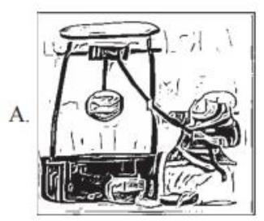
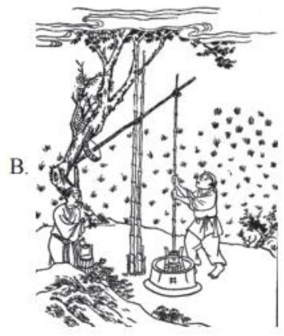
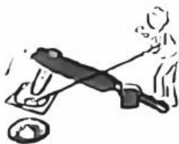
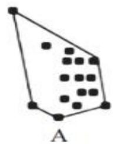
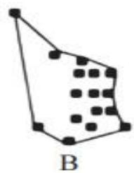
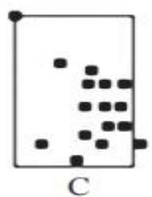
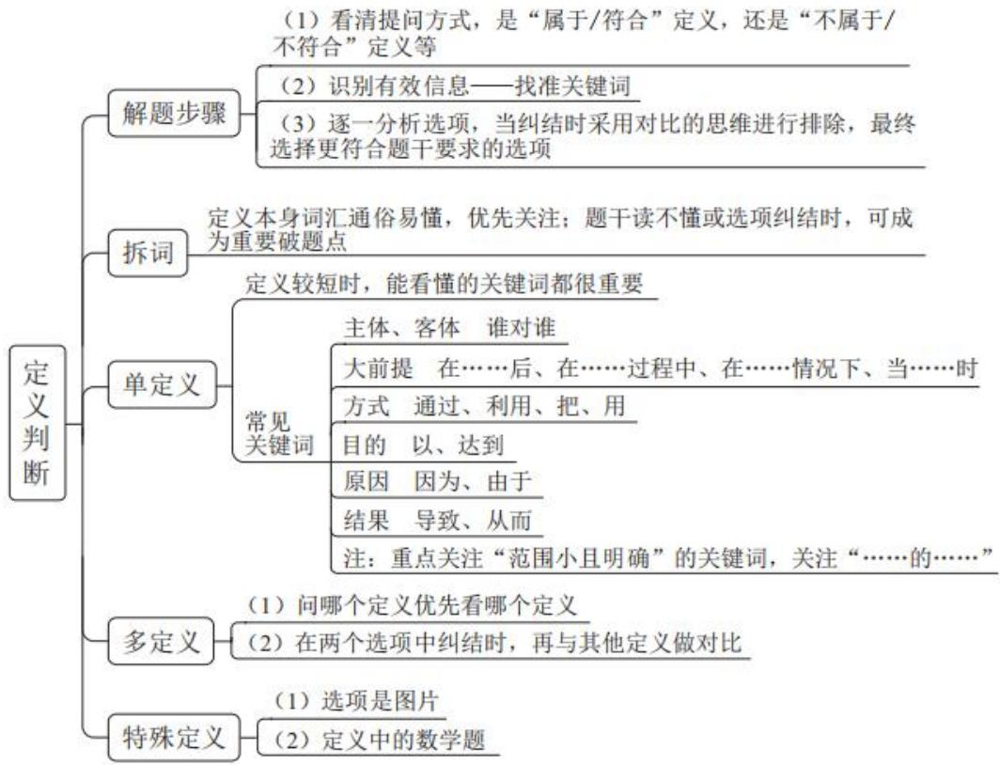

# 精讲精练-判断6

（笔记）

主讲教师：程永乐

授课时间：2025.04.16

# 精讲精练-判断6（笔记）

# 判断推理 精讲精练6

# 学习任务：

1. 课程内容：定义判断（单定义——句式，多定义，特殊定义）  
2. 对应讲义：第  $254\sim 264$  页  
3.重点内容：

（1）定义中的常见关键词  
(2) 多定义  
（3）特殊定义

备注：前14页PPT为答疑内容

# 解题思维：

1. 看提问——看清“属于/符合”、“不属于/不符合”  
2. 看题干——识别有效信息：找准关键词、关键句  
3. 看选项——纠结时选项对比择优

学会接受不完美！！！

# 【注意】定义解题思维：

1. 看提问——看清“属于/符合”、“不属于/不符合”，一定要留意是不是选非题。  
2. 看题干——识别有效信息：找准关键词、关键句。  
3. 看选项——纠结时选项对比择优，学会接受不完美，没说不代表错，只有说了且和题干说的冲突、矛盾才是错的。

# 第一节 拆词

原理：定义词汇本身就是关键词，可以提前预判

运用：（1）定义本身词汇通俗易懂，可以拆分后，直接看选项

(2) 拆词后担心理解有偏差, 优先关注定义本身的同义替换

# 【注意】拆词：

1. 原理：定义词汇本身就是关键词，可以提前预判。  
2. 运用：

(1) 定义本身词汇通俗易懂，可以拆分后，直接看选项。  
(2) 拆词后担心理解有偏差, 先拆, 然后在题干中关注定义本身的同义替换。

# 第二节 单定义

>题目特征：题干只有1个定义  
>解题思路：

一、定义较短时，能看懂的关键词都很重要  
二、关注句式结构之“主体、客体”

# 【注意】单定义：

1. 解题思路 1: 定义较短时, 能看懂的关键词都很重要, 比如 “谁和谁做了什么事情”。  
2. 解题思路 2: 关注句式结构。有时候句子里面会有结构性的内容, 结构性的内容会作为关键词。本节课先讲解主体和客体。

# $\spadesuit$  关注句式结构

方法一：主体、客体

我 喜欢 你

例：计划火烧是指林区管理人员利用可控的林火，对森林可燃物有计划、有目的、有步骤地进行烧除，以减少森林火灾的一项常用管理措施和经营行为。

A. 为阻断森林大火蔓延，消防人员果断采取行动，在火场外围人工烧出了一条50米宽的防火隔离带

# 注意:

1. 主客体不符合的选项一定不符合定义！  
2. 不是每题一定都有主体和客体，但是出现了要重点看！  
3. 出现范围越小越明确的主客体，尤其重要

闭月羞花的女生 英俊潇洒的男生

# 【注意】主体、客体：

1. 主体与客体：谁对谁做了什么事情。如“我喜欢你”，“我”是主体，“你”是客体，如果是“别人喜欢你”，则不符合定义，定义中这两个（主客体）是不能变的，如果主体错误的选项一定不符合定义。  
2. 例：如定义“计划火烧”，定义的主体是“林区管理人员”做什么事情。A项中，主体是“消防人员采取行动”，选项的主体不符合定义的主体，则选项一定不符合定义。

# 3. 注意：

（1）主客体不符合的选项一定不符合定义。  
(2) 不是每题一定都有主体和客体, 但是只要出现了要重点看。  
（3）出现范围越小越明确的主客体，尤其重要，作为考点的概率很大。如“闭月羞花的女生”，“女生”的范围很广，而“闭月羞花的女生”范围就相对比较小、比较明确，考查的概率更大；如要找一个“男生”，随便找即可，但“英俊潇洒的男生”可能就有人不符合，如果前面有“的”作为修饰，有修饰词修饰后面的主体，则作为考点的概率会比较大。

# 常考主客体：

1.行政机关：各级政府（国务院……街道办/乡镇政府、公安等）  
2. 权力机关：全国人大、地方人大  
3. 司法机关：法院、检察院  
4. 事业单位：学校、医院、科研所、广播新闻出版等  
5. 社会组织：商会（浙商会）、协会（消费者协会）

# 【注意】常考主客体：

1.行政机关：各级政府（国务院……街道办/乡镇政府、公安等、XX局等）。  
2. 权力机关：全国人大、地方人大。  
3. 司法机关：法院、检察院。注意公安是行政机关，只有法院和检察院是司法机关。  
4. 事业单位：学校、医院、科研所、广播新闻出版等。只要没有特殊说明，学校和医院都是事业单位，除非是私营的。

5. 社会组织：商会（浙商会）、协会（考查很多，容易出错，如消费者协会）。

【练一练】（2021新疆兵团）法的适用，通常是指国家司法机关根据法定职权和法定程序，具体应用法律处理案件的专门活动。

根据上述定义，下列属于法的适用的是：

A. 某科技公司根据法律相关规定和李某签订了劳动合同  
B.张某依法将子女送入学校进行义务教育  
C. 某海关工作人员认为刘某涉嫌走私手机，因而对其进行查办  
D. 某地检察机关对王某的渎职案依法进行侦查

本题思维：法律类题目，经常考查主客体

【解析】拓展. 问“下列属于法的适用的是”，定义的主体是“国家司法机关”。

A项：“某科技公司”不是国家司法机关，排除。  
B 项: “张某” 不是国家司法机关, 排除。  
C项：“海关”是行政机关，不是司法机关，排除。  
D 项: “检察机关”是司法机关, 符合定义的主体, 当选。【选 D】

# 【注意】

1. 本题是法律类题目，但后面的内容不需要读得特别明白，定义不可能考查每个词，一般找到  $1 \sim 3$  个关键词即可。定义会考查各个领域的知识（如法律、心理学、物理、化学、经济学），相对比较公平，出题人希望大家不用专业知识，而是用基础理解把题目做出来，在做定义的时候一般不会考查特别专业的知识，读不懂的地方大概率不会考，把能读懂的地方读出来即可。  
2. 本题思维：法律类题目，经常考查主客体。

【例1】（2022湖北选调）质量成本是指企业为了保证和提高产品或服务质量而支出的一切费用，以及因未达到产品质量标准，不能满足用户和消费者需要而产生的一切损失。

根据上述定义，下列情形不符合质量成本含义的是：

A.甲市行政服务中心为进一步提高窗口服务质量购置便民办公设备

B. 乙公司卖出的产品在保修期内出现质量问题, 公司免费维修  
C. 丙公司拨付专款让员工学习产品质量管理国际标准体系  
D. 丁工厂投入巨资研制出一条优化产品性能的生产线

【解析】1. 问“下列情形不符合质量成本含义的是”，选非题。定义关键信息：（1）主体；企业；（2）为了保证和提高产品或服务质量而支出的一切费用；（3）因未达到产品质量标准，不能满足用户和消费者需要而产生的一切损失。

定义中的“以及”表示并列，注意定义中如果有并列的信息，选项体现一个就符合定义，说两个是最好的，但说一个也是对的。

A项：“行政服务中心”不是企业，不符合定义的主体，当选。  
B 项: “乙公司”是“企业”, “在保修期内出现质量问题”说明产品质量不达标, “公司免费维修”说明产生一些损失, 符合定义, 排除。  
C项：“丙公司”是企业，“学习产品质量管理国际标准体系”是为了提高产品或服务质量，符合定义，排除。  
D 项: “丁工厂” 是企业, “研制出一条优化产品性能的生产线” 是为了提高产品质量, 符合定义, 排除。【选 A】

【注意】本题思维：挑错思维，不需要把选项和题干的每一点都对应，答题的思维是挑选项中的错误，问“符合”的，如果选项有错误就排除；如果问“不符合”，选项有错误的时候就是正确答案。挑错的时候明确的最重要，如本题定义的主体非常明确，挑出错误即可选出答案。

【例2】（2023国考）异业合作是指两个或两个以上不同行业的企业，通过分享市场营销中的资源，以达到降低成本、提高效率、增强市场竞争力等目的的一种营销策略。

根据上述定义，下列体现了异业合作的是：

A. 某集团下属的两家餐饮公司通过公众号互推产品信息，提升了各自的品牌影响力  
B.某互联网公司和商业银行共同发行联名信用卡，办卡成员将享受更大购物优惠

C. 某日用品企业将不同尺寸的收纳盒组成套装促销，销量剧增，其他企业也纷纷效仿  
D. 某运动品牌在奥运会期间推出绘有奥运标志的限量款球鞋, 搭配赠送新奥运吉祥物

【解析】2. 问“下列体现了异业合作的是”，选是题。定义关键信息：（1）主体：两个或两个以上不同行业的企业（必须是两个及以上，且是不同行业的，相同行业的不行）；（2）通过分享市场营销中的资源；（3）以达到降低成本、提高效率、增强市场竞争力等目的的一种营销策略（顿号表示并列的“且”关系，选项中体现一个即可）。

A项：“两家餐饮公式”是相同行业的企业，不是不同行业的，不符合定义，排除。  
B项：“互联网公司”和“商业银行”是两个不同行业的企业，“发行联名信用卡”符合关键信息（2），“办卡成员将享受更大购物优惠”符合关键信息（3），符合定义，先保留，需要对比择优。  
C项：其他企业效仿的是“将不同尺寸的收纳盒组成套装促销”，说明它们是同行业的企业，不符合定义的主体，排除。  
D项：“某运动品牌”只有一个企业，题干要求至少有2个，不符合定义，排除。【选B】

# 【注意】本题思维：

1. 关注主客体数量。  
2. 关注相同/不同。

【练习】（2018国考）人耳对一个声音的感受性会因另一个声音的存在而发生改变。一个声音能被人耳听到的最低值会因另一声音的出现而提高，这种现象就是听觉掩蔽。

根据上述定义，下列符合听觉掩蔽的是：

A. 吵闹的课间，老师得大声说话，同学们才能听到  
B. 长时间戴耳机听音乐，会觉得听到的音量逐渐变小

C. 人类无法听到蝙蝠等动物发出来的超声波  
D. 安静的房间内，我们能够听到闹钟 “滴答” 的声音

【解析】拓展. 课堂正确率为  $79\%$  。本题不需要读懂也可以做题，找关键词匹配即可。问“下列符合听觉掩蔽的是”，定义关键信息：（1）一个声音；（2）另一声音。定义要求有两个声音。

A 项: “吵闹的课间” (学生的声音) 和 “老师大声说话” 是 2 个声音, 保留。  
B 项：只有 “音乐” 一个声音，排除。  
C 项: 只有 “超声波” 一个声音, 排除。  
D 项：选项只有 “闹钟 ‘滴答’ 的声音”, 只有一个声音, 排除。【选 A】

【例3】（2024江苏）代际责任：指在不超出自身能力的前提下，相邻两代人的一方向另一方主动提供经济帮扶、生活照顾、健康保障、精神抚慰等各种支持的行为。

下列不属于代际责任的是：

A. 苏女士把父母接到身边后, 忙乎了一个多月, 带着父母熟悉小区健身器材,到社区老年活动中心打牌下棋, 在公园找人聊天, 终于帮他们重新找到了“组织”  
B. 邵先生和妻子一直在城里忙于打拼，女儿正在读小学。每到寒暑假，邵先生的父母都会专程赶到城里，把孙女接回农村老家痛痛快快地玩上整个假期  
C. 罗奶奶像无数为孩子婚事发愁的长辈一样, 每到周末就去附近公园的相亲角浏览展板上的照片、简历, 觉得合适的就记下基本情况、电话号码。虽然快三十岁的孙女根本不着急, 她却一直乐此不疲  
D. 毛先生喜欢第一时间把遇到的趣事分享到家族微信群, 却很少得到期待的回应, 一怒之下退了群。后来, 儿子又把他请回, 还邀约了几位有同样爱好的长辈, 群里逐渐热闹起来, 他也时不时点赞或评论几句

【解析】3. 问“下列不属于代际责任的是”，选非题。定义关键信息：（1）不超出自身能力；（2）主体：相邻两代人；（3）一方向另一方主动提供经济帮扶、生活照顾、健康保障、精神抚慰等各种支持的行为（可以理解为一个人对另一个好）。

A 项: “苏女士” 和 “父母” 是相邻两代人, 她对父母进行了帮助, 符合定

义，排除。

B 项：定义是“相邻两代人”，选项看起来是“爷爷奶奶带孙女”，看起来不是相邻的两代人，但定义需要对比择优，先保留。  
C项：只是“罗奶奶”和“孙女”，一定是不相邻的两代人，不符合定义的主体，对比B项，B项至少“邵先生和妻子”与“女儿”存在相邻两代人的关系，且“邵先生的父母”和“邵先生和妻子”也存在相邻两代人的关系，而C项一定不符合，对比择优，相对来说B项比C项更符合，则排除B项，保留C项。

实际上B项中“每到寒暑假，邵先生的父母都会专程赶到城里，把孙女接回农村老家痛痛快快地玩上整个假期”能够表达出“邵先生的父母”对于“邵先生和妻子”的帮助，帮助带孩子可以缓解工作上的压力，B项符合定义，排除B项。

D 项：是儿子对于父亲的帮助，符合定义，排除。【选 C】

# 【注意】

1. 不要看到选项直接选，要看完四个选项，对比择优选答案。  
2. 注意否定词“不”，虽然本题没有考查，但其他题经常会考查，如果定义出现了否定词，考查的概率很大，比如“没有”“非”“未”，很有可能在否定词上设坑。比如题干说“未超出自身能力”，可能会有选项说“在超出自身能力的情况下”，则这样是不符合定义的。

【例 4】（2021 四川下）选择性理解是指不同的受众对传播媒介所传播的同一信息做出不同的解释、结论和反应。造成这种现象的主要原因是受众在理解过程中加进了许多主观因素，如固有的观念、态度、立场，个人的感情、情绪、习惯，使用传播媒介的动机和目的，等等。

根据上述定义，下列情形属于选择性理解的是：

A. 小吴与小宋经常就新闻报道中的观点发生争执  
B. 小婷与小凤就新闻受众问题提出不同的学术观点  
C. 小陈认为看时政新闻有意思, 而小李认为文体新闻更刺激  
D. 小伍觉得晚上看新闻更有感觉, 小王认为早上看能早知道

【解析】4. 问“下列情形属于选择性理解的是”。定义关键信息：（1）不同

的受众 (“不同” 说明至少有 2 个受众); (2) 对传播媒介所传播的同一信息; (3)做出不同的解释、结论和反应。

A项：“小吴与小宋”是不同的受众，“新闻报道中的观点”是一个信息，且是传播媒介传播出来的，“发生争执”说明做出了不同的反应，符合定义，保留。  
B 项: “新闻受众问题” 不是传播媒介传播出来的信息, 而是一个具体的问题, 错在了限定上, 不符合定义, 排除。  
C项：“时政新闻”和“文体新闻”是两种不同的信息，不符合“同一信息”，排除。  
D 项: 说的是对于不同时间看新闻有不同见解, 并不是对同一信息有不同理解, 不符合定义, 排除。【选 A】

【练习】（2024联考）生物学重复是指对不同生物个体或者不同生物群体的样品采用相同的处理方式进行实验。技术重复则是指对同一样品进行的多次相同实验。

根据上述定义，下列属于生物学重复的是：

A. 采集小王的血样一次并采用三种不同方式分别进行一次检测  
B. 采用三种不同方式对分三次采集的小王血样各进行一次检测  
C. 采集小王、小李、小张三人的血样并用同样方式分别进行一次检测  
D. 采集小王、小李、小张三人的血样混合后用三种方式进行三次检测

【解析】拓展. 课堂正确率为  $93\%$  。问“下列属于生物学重复的是”，选是题。定义关键信息：（1）对不同生物个体或者不同生物群体的样品；（2）采用相同的处理方式。

A、B 项：是相同的个体，不符合定义，均排除。  
C 项：对于三个不同的个体采取同样的方式，符合定义，保留。  
D 项：对于三个不同个体采取三种不同的方式，不符合定义，排除。【选 C】

# 第二节 单定义

>题目特征：题干只有1个定义  
>解题思路：

一、定义较短时，能看懂的关键词都很重要  
二、关注句式结构之“主体、客体”  
三、关注句式结构之“大前提、方式目的、原因结果、句号、补充说明”

【注意】关注句式结构之“大前提、方式目的、原因结果、句号、补充说明”。

$\spadesuit$  关注句式结构

方法二：句式——引导的内容重点看

前提：当……时/在……之前/后

方式：通过/利用……

目的：以/以达到……

原因：因为/由于……

结果：导致/从而/使得……

例：微博营销是指以微博为营销平台，每个关注者都是潜在营销对象，企业利用更新微博向网友传播企业、产品信息，树立企业形象和产品形象。微博营销的特点是立体化、高速度、便捷性和广泛性。

A. 小王在某门户网站注册了免费邮箱, 注册时注明愿意接受该网站发布的关于娱乐、体育方面的资讯, 之后该邮箱经常收到该网站发送的邮件

【注意】句式——引导的内容重点看：

1. 引导词：引导词本身不重要，引导的内容要重点看。

（1）前提：当……时/在……之前/后。  
(2) 方式: 通过/利用……  
(3) 目的: 以/以达到……  
(4) 原因: 因为/由于……  
(5) 结果: 导致/从而/使得……

2. 例：定义“微博营销”的定义关键信息是“以微博为营销平台”，方式是“利用新浪微博向网友传播企业、产品信息”，A项是利用邮箱，并不是微博，不符合定义。

方法二：句号和补充说明（即、也就是说、具体表现……）

例 1: 教育是培养人的活动。狭义的教育是指教育者根据一定的社会要求,有目的、有计划、有组织地对受教育者的身心施加影响, 把他们培养成为社会所需要的人的活动。它可以分为学校教育、社会教育、家庭教育等类型。广义上讲,凡是增进人们的知识和技能、影响人们的思想品德的活动, 都是教育。但是,教育有好差之分, 培养人也有方向的区别。

根据上述定义，下列不属于教育范畴的是：

A. 家长教孩子礼貌用语  
B. 动物饲养员教大猩猩见到人们打招呼后要抬起手臂回礼

例2：产城融合是指产业园区与城市融合发展，以城市为基础，承载产业空间和发展产业经济，以产业为保障，驱动城市更新和完善服务配套，进一步提升土地价值，以达到产业、城市、人之间有活力、持续向上发展的模式。它一般由四个阶段组成，从“生产聚集”到“产业主导”，再到“产业完善”，最后完成“产城融合”。其核心就是促进居住和就业的融合，即居住人群和就业人群结构的匹配。

根据上述定义，下列选项属于产城融合的是：

A. 某市为避免污染影响居民生活，将药厂移至城郊新建的产业园  
B. 某市在成熟的产业园周边地区开发很多配套设施齐全的新楼盘

【注意】方法二：句号和补充说明（即、也就是说、具体表现……）。

1. 如果定义比较长，可以优先看到句号，能做题就直接做。如例 1, “教育”的定义是“教育是培养人的活动”，读到句号则定义已经结束了，只需要看到第一个句号的句子即可，为了节省时间，后面可以不看。问“不属于教育范畴的是”，选非题。A项“教孩子”是培养人的活动，符合定义；B项是“教大猩猩”，并不是培养人，不符合定义，B项当选。  
2. 如果定义所在句看不明白，可以看补充说明，如“即、也就是说、具体表现……”可以重点看。如例 2，“产城融合”的定义非常长，读到第一个句号发现可能读不懂在说什么。后面出现了“其核心就是促进居住和就业的融合”，后面怕大家看不懂，还进行了解释说明，“即居住人群和就业人群结构的匹配”就是解释什么是居住和就业结合。A项为“避免影响居民，把药厂迁走了”，是居住人群和就业人群分离，不是融合；B项是“在产业园周边开发新楼盘”，是把

居住人群和就业人群融合，符合定义，B项当选。

【例1】（2023重庆选调）反刍思维是指个体在经历了消极生活事件后不由自主地反复思考该事件的产生原因、经过和结果，表现为个体倾向于将负面信息与自我联系并过度解读、对事件细节和自身情绪状态过度加工、对事件思考的重复和持续等特点。

根据上述定义，下列属于反刍思维的是：

A. 老王最近感觉老忘事, 明明锁了门, 出门后却还是控制不住再回去看看  
B. 小林失恋了很痛苦, 他认为对方太自私太不懂得珍惜自己, 每每想起都愤愤不已  
C.儿子成绩下滑严重，让刘女士这段时间寝食难安，一直念叨儿子究竟是哪里出了问题  
D. 老孙把目前困顿的家庭经济状况归咎于自己五年前的那场失败投资, 每次不自觉想起都懊悔不已

【解析】1. 问“下列属于反刍思维的是”，选是题。定义的第一句话说的是“有消极生活事件，并探索原因、经过和结果”，后面的“表现为”是具体说明，说明了找什么样的原因，即“个体倾向于将负面信息与自我联系并过度解读”，简单理解为“自己导致了负面结果”。

A项：老王锁了门只是自己不知道，没有导致什么负面结果，不符合定义，排除。  
B 项: 小林找的不是自己的原因, 找的是对方的原因, 不符合定义, 排除。  
C项：儿子成绩下滑，刘女士没有找自己的原因，而是找儿子的原因，不符合定义，排除。  
D 项: 老孙把 “目前困顿的家庭经济状况” 的原因归咎于 “自己投资失败”,认为是自己导致负面结果, 符合定义, 当选。【选 D】

【例2】（2024江苏）温情执法：指执法人员在依法查处违法行为的过程中，综合考量各种特殊因素，对违法者进行灵活处置以体现法治温度的执法行为。

下列不属于温情执法的是：

A. 冬天，许多菜农在路边叫卖，给城市交通卫生带来了挑战。区城管部门调研后划出28个覆盖全区的固定销售点，与菜农签订“摊前三包”协议，菜农卖得更安心了，城市面貌大有改观  
B. 民警发现电信诈骗嫌疑人王某潜回家中后迅速抓捕。当时，王某刚把4岁女儿从幼儿园接回家，民警为避免小女孩受惊，迅速收起警察证和手铐，以吃饭为名把王某带了出去  
C. 交警小周在公路上进行安全巡逻时，发现一辆电动三轮车严重超员。处罚过程中得知因为老人突然生病，全家人带他到县城治疗，小周用警车把他们送到医院  
D. 某县卫生健康执法人员在查处无证行医过程中，发现郑某正在出租屋行医。得知小诊所是他家最主要的经济来源，郑某已考取职业资格证书，县卫生部门协助他办理了医生执业证书和执业许可证

【解析】2. 问“下列不属于温情执法的是”，选非题。定义关键信息：（1）执法人员在依法查处违法行为的过程中；（2）对违法者进行灵活处置以体现法治温度。

A项：“路边叫卖”是违法行为，但选项的内容没有体现在“查处违法行为”的过程中“送温暖”，定义必须是在执法的过程中才算（比如当时抓到了应该罚款，但没有罚款），选项违背了定义的前提，不符合定义，保留。  
B 项: “王某” 违法, 在查处 “王某” 的过程中体现了法治温度, 符合定义,选非题, 排除。  
C项：“进行安全巡逻”是查处违法行为的过程中，“三轮车严重超员”是违法行为，“小周用警车把他们送到医院”体现了法治温度，符合定义，选非题，排除。  
D 项: “某县卫生健康执法人员在查处无证行医过程中” 符合 “查处违法行为的过程中”, 后面的内容体现了 “法治温度”, 符合定义, 选非题, 排除。【选 A】

【例3】（2024事业单位）共享经济是指通过互联网等网络平台提供互利共赢的共享服务，以达到资源优化利用和社会价值最大化的经济模式。

根据上述定义，下列属于共享经济的是：

A. 某图书馆为居民提供免费的图书借阅服务，鼓励大家多读书、读好书  
B. 某教师在网络平台上传和分享自己的教学视频  
C. 几家网络视频平台联合推出了一项会员服务, 会员可以享受更多的折扣续费  
D. 通过手机 APP，数百万注册司机和乘客实现了连接，用户可轻松预约车辆出行，减少道路拥堵和空气污染

【解析】3. 问“下列属于共享经济的是”，选是题。定义关键信息：（1）方式：通过互联网等网络平台提供互利共赢的共享服务；（2）目的：以达到资源优化利用和社会价值最大化。

A 项：没有体现 “互联网”, 方式不对, 不符合定义, 排除。  
B 项：有体现 “互联网”,但没有体现 “互利共赢”,只是无偿分享,不符合定义,排除。  
C项：在网络上提供了服务，但不确定有没有体现“资源优化利用”和“社会价值最大化”，先保留。  
D 项：对司机和乘客都有好处，且“减少道路拥堵和空气污染”体现了社会价值，符合定义，对比 C 项，D 项明确体现出互利和社会价值，D 项当选。

实际上“共享”的含义就是为了资源优化利用去“租”，很多东西放着就是闲置，而拿出来租可以优化资源利用，提高了利用率。【选D】

【例4】（2025国考）形象史学是指把形与象作为主要材料，用以研究历史的一门学问。具体来说，是指把传世的包括出土（水）的具有研究价值的石刻、陶塑、壁画、雕砖、铜玉、织绣、漆器、木器、绘画等历史实物、文本图像以及文化史迹作为主要研究对象，并结合传统文献来综合考察历史的一种新的史学研究模式。

根据上述定义，下列属于形象史学研究范畴的是：

A. 结合《晋书》等史书，通过对吉林集安长川1号墓礼佛图主佛形象及莲花纹的考察，研究三燕文化对高句丽佛教产生的影响  
B. 通过对现存的汉画像石（汉代人雕刻在墓室、祠堂四壁的装饰石刻壁画）

的实地考察，分析汉画像石的雕刻风格和雕刻技法

C. 根据史诗《伊利亚特》的记载，找到特洛伊城的遗址，并在其中发掘出王冠、银瓶、短剑等大量器物  
D. 通过对二十世纪二三十年代齐白石、傅抱石等人具有代表性的国画作品进行研究，分析当时国画中所蕴含的思想意境

【解析】4. 问“下列属于形象史学研究范畴的是”，选是题。定义中的“形与象”可能看不懂是什么，看后面，“具体来说”是解释说明。定义关键信息：（1）把传世的包括出土（水）的具有研究价值的石刻、陶塑、壁画、雕砖、铜玉、织绣、漆器、木器、绘画等历史实物、文本图像以及文化史迹作为主要研究对象；（2）结合传统文献进行研究。

定义中要出现两个对象，即“历史上出现的物质”以及“传统文献”。

A项:《晋书》是传统文献, “吉林集安长川1号墓礼佛图主佛形象及莲花纹”是历史实物, 符合定义, 保留。  
B 项：选项中没有结合传统文献，不符合定义，排除。  
C项：虽然体现了传统文献和历史实物，但没有把二者结合在一起进行研究，而是通过文献找到了历史实物，不符合定义，排除。  
D 项：没有体现 “传统文献”,排除。【选 A】

【例5】（2020北京选调）前馈控制，是指通过观察情况、收集整理信息、掌握规律、预测趋势，正确预计未来可能出现的问题，提前采取措施，将可能发生的偏差消除在萌芽状态中，为避免在未来不同的发展阶段可能出现的问题而事先采取的措施。

根据上述定义，下列不属于前馈控制的是：

A. 猎人把瞄准点定在飞奔的野兔的前方  
B. 海尔公司根据现有产品销售不畅的情况，改变产品结构  
C. 根据禽流感疫情预报，医药公司做好医药物品的储备  
D. 司机在汽车上坡时, 为了保持一定的车速, 提前踩加速器

【解析】5. 问“下列不属于前馈控制的是”，选非题。定义中“通过”引导方式，但定义中出现了非常多的方式，定义中越明确、越具体的越容易是考点，

比较宽泛的一般不会作为考点。定义中重复的词非常重要，定义关键信息：（1）未来；（2）提前采取措施（事先采取措施）。

定义可以简单理解为为了防止未来出问题，提前采取措施。

A 项：是在预判兔子的走位，为了未来能打中，符合定义，排除。  
B 项：不是事前采取措施，是在事中（已经出现问题的时候）采取措施，不符合定义，保留。  
C项：“根据预报做好储备”说明是为了未来采取措施，符合定义，排除。  
D项：“为了保持一定的车速，提前踩加速器”是为了未来提前采取措施，符合定义，排除。【选B】

【注意】本题思维：关注重复词，关注修饰词。

【例6】（2022国考）地球物理勘探是通过研究和观测各种地球物理场的变化来探测地层岩性、地质构造等地质条件的过程。由于组成地壳的不同岩层介质往往在密度、弹性、导电性等方面存在差异，这些差异将引起相应的地球物理场的局部变化，通过测量这些物理场的分布和变化特征，结合已知地质资料进行分析研究，就可以达到推断地质性状的目的。

根据上述定义，下列不属于地球物理勘探的是：

A. 根据岩石和矿石导电性、电磁感应特性等来记录地层界面的深度和形态  
B.利用人工激发的地震波在弹性不同地层内的传播规律，了解水文地质的分布情况  
C.采集岩石样品，分析岩石内的微量元素，通过发现与矿化有关的原生异常来寻找矿床  
D. 通过观测不同岩石引起的重力差异, 判断地下地层的岩性及状态, 确定沉积盆地范围

【解析】6. 问“下列不属于地球物理勘探的是”，选非题。定义关键信息：（1）“通过”引导方式：研究和观测各种地球物理场的变化；（2）目的：来探测地层岩性、地质构造等地质条件。

本题能读懂方式或者目的就可以选答案，只要根据“物理”即可解题。

A 项: “导电性、电磁感应” 是物理, 符合定义, 排除。  
B 项: “地震波”是物理的, 符合定义, 排除。  
C 项: “微量元素” 是化学的内容, 不符合定义, 选非题, 当选。  
D 项: “重力” 是物理的, 符合定义, 排除。

如果没有读懂物理和化学，可以观察定义的目的，定义的目的是“探测地层岩性、地质构造等地质条件”。A项的“记录地层界面的深度和形态”，B项的“地震波在弹性不同地层内的传播规律”，D项的“判断地下地层的岩性及状态”都体现了“地层……”，只有C项没有体现定义的目的，据此也可以选到C项。【选C】

# 【注意】

1. 定义不会考查特别专业的知识，不管是法律、物理、数学等，都不需要专业知识。  
2. 常识积累：

(1) 物理主要研究力学、热学、声、光学、电、磁等。  
(2) 化学法主要研究化学反应（氧化反应）、元素化学结构（分子结构）。

【练习】（2023国考）化学动力学是研究化学反应速率和反应机理的化学分支学科，主要内容包括：（1）确定化学反应的速率以及温度、压力、催化剂、溶剂和光照等外界因素对反应速率的影响；（2）研究化学反应机理，揭示化学反应速率本质；（3）探求物质结构与反应能力之间的关系和规律。

根据上述定义，下列没有体现化学动力学研究的是：

A. 研究表面积不同的各类煤块在相同温度条件下燃烧速率的变化  
B. 研究不同光照和温湿度条件下植物叶片蒸腾作用的强度和效率  
C. 在馒头制作的过程中, 研究酵母菌对面粉发酵的催化反应模型  
D. 在铁制品表面喷涂不同种类油漆, 研究铁与水、氧气的反应情况, 判断防锈效果

【解析】拓展.课堂正确率为  $61\%$  。问“没有体现化学动力学研究的是”，选非题，属于化学的就对，属于物理的就不对。

A 项：燃烧属于化学变化，排除。  
C 项：发酵属于化学变化，排除。  
D 项：铁、水和氧气发生反应是化学变化，排除。  
B项：蒸腾作用是指植物叶子表面的水分蒸发出去，属于物理变化，排除。【选B】

【例7】（2023江苏）消费暗区：指由于商家未充分提供与商品或服务相关联的信息，导致不具备专门知识或辨别能力的消费者未能得到预期的商品或服务却为之买单的现象。

下列属于消费暗区的是：

A. 高先生刚买了一组特价衣柜，按照说明书在家里折腾了半天也没有组装好，只得电话求助客服表示愿意付费请师傅上门安装  
B. 林先生参与有奖竞答活动, 组织方宣传特等奖是名牌扫地机器人。林先生获奖后却收到一台名为 “名牌” 的扫地机器人  
C. 黎先生在导购的极力推荐下, 高价购买了一款支持 8K 高清显示的电视机,回家后发现几乎没有 8K 高清的电视节目资源, 只能当普通电视机使用  
D. 赵先生到银行存钱，在大堂经理推荐下填好合同办了信用卡。一年后收到欠费通知，才发现合同上有每年消费12次才能免年费的条款

【解析】7. 问“属于消费暗区的是”。关键信息：（1）“由于”引导原因：商家未充分提供与商品或服务相关联的信息；（2）结果：不具备专门知识或辨别能力的消费者未能得到预期的商品或服务却为之买单。

定义的意思是买东西的时候商家没有提供商品相关的信息，顾客没有专业知识，买完发现并不是自己想要的。

定义中出现“不”“未”，出现否定词比较重要，一般会设坑。

A项：“按照说明书”说明商家提供了信息，只是自己不会用，不符合定义，排除。  
B项：前面的“名牌”说明牌子厉害，后面的“名牌”是品牌，题干说明消费者要买单，该项是有奖竞答，不需要买，也不是消费者，不符合定义，排除。  
C 项：电视机有  $8 \mathrm{k}$  功能但是没有  $8 \mathrm{k}$  电视资源, 商家没有提供相关信息, 黎

先生又不专业，不清楚是否有 8k 节目，结果没有达到预期，符合定义，当选。

D 项：商家提供了相关信息，合同上已经写清楚了，只是没有按照合同办事情，是赵先生的问题，不是商家的问题，不符合定义，排除。

答疑：我们和银行的关系也类似于消费者和商家的关系，不需要过多纠结，有合同起码说明提供了信息。【选C】

【例8】（2023联考）新市民主要是指因本人创业就业、子女上学、投靠子女等原因来到城镇常住，未获得当地户籍或获得当地户籍不满三年的各类群体，包括但不限于进城务工人员、新就业大中专毕业生等，目前约有三亿人。

根据上述定义，下列画横线部分不属于新市民的是：

A. 小张 2017 年从乡下来到省会城市做快递员, 理想是在本市安家立业  
B. 老李夫妇在其女儿读书的大学附近租门面做生意, 不打算回农村老家了  
C. 小王 2015 年到市里工作, 户口随即解决, 今年想把乡下父母接来同住  
D. 黄婆婆体弱多病, 她女儿是大学副教授, 把黄婆婆从农村接到自己家里治病养老

【解析】8. 问“不属于新市民的是”。关键信息：（1）“因为”引导原因：本人创业就业、子女上学、投靠子女；（2）未获得当地户籍或获得当地户籍不满三年。出现否定词，要重点关注。

A项：不清楚小张是否有户口，不确定的选项也有可能对，先保留。  
B 项：不清楚老李夫妇是否有户口，不确定，保留。  
C项：说明小王2015年获得户口，本题是2023年考的，则“今年”就是2023年，2015-2023年超过3年，与题干冲突，不符合定义，当选。  
D 项：黄婆婆投靠子女，不清楚是否有户口，排除。

答疑：

(1) 出现时间计算时，通过当年考试的时间进行计算。  
(2) 出现或关系、且关系 (顿号), 只要满足其中一个即可。【选 C】

【例 9】（2024 事业单位）沉没成本，是指以往发生的，但与当前决策无关的费用。它表示已经发生不可收回的支出，存在形式有多种，比如时间、金钱、

精力。从决策的角度看，以往发生的费用只是造成当前状态的某个因素，当前决策所要考虑的是未来可能发生的费用及所带来的收益，而不考虑以往发生的费用。

根据上述定义，下列情形不涉及沉没成本的是：

A. 小静花 50 元买了张电影票, 看了几分钟觉得没意思, 纠结是否继续看下去  
B. 小明喜欢吃某饭店的招牌菜, 排队半小时后, 朋友推荐了另一家他也喜欢的饭店, 但他想如果再换饭店将花费更多时间与精力, 就继续等候  
C.小刚大学时主修机械专业，毕业时面临职业选择，考虑到做工程师能学以致用、专业对口，遂选择了工程师职位  
D. 某公司高薪聘请名牌大学毕业生小王，多年努力培养他，但他工作业绩总是不如人意，经理想辞退他，但又不舍得

【解析】9. 问“不涉及沉没成本的是”。关键信息：（1）以往发生的；（2）与当前决策无关的费用（不一定是钱，可以是时间、金钱、精力）；（3）已经发生不可收回的支出。

定义的意思是现在的决策和之前发生的没有关系。

A 项：是否看下去与钱、时间没有关系，不看了钱和时间也回不来，符合定义，排除。  
B 项：无论在哪吃，前面的时间都已经发生了，回收不回来，排除。  
C 项: “学以致用”说明前面的东西用上了, 决策和前面的东西有关系, 不符合定义，当选。  
D 项：无论是否辞退，前面的时间已经花费了，符合定义，排除。

答疑：定义出现否定词很重要，考查比较多，重点看。【选C】

【练习】（2021联考）虚假相关指的是两个没有因果关系的事件之间，基于一些其他未见的因素（潜在变量）而推断出因果关系，引致两个事件是“有所联系”的假象，但这种联系并不能通过客观的试验来证实。

根据上述定义，下列选项不属于虚假相关的是：

A. 童鞋的大小与孩子的语言能力  
B. 冷饮的销量与泳池溺水的人数

C. 惯性的大小与汽车的核载重量  
D. 网民的数量与房屋的折旧程度

【解析】拓展.课堂正确率为  $82\%$  。问“不属于虚假相关的是”，选非题。关键信息：两个没有因果关系的事件。

A、B、D 项：两个词之间均没有因果关系，符合定义，排除。  
C 项：物体一定有惯性,只与质量有关系,质量越大、惯性越大,有因果关系,当选。

答疑：惯性是保持运动状态的一种能力，如汽车的质量越大，刹车就难，质量越小，刹车就越容易。【选C】

【例10】（2022天津）独特价值效应是影响顾客对产品价格及其变化的接受程度，最终影响其购买决策的一个重要因素。具体表现为：当购买者对某种产品区别于可替代性竞争产品的特色评价越高，他对产品的价格将越不敏感。

根据上述定义，下列体现了独特价值效应的是：

A. 目前, 诺西那生钠是唯一能从根本上治疗脊髓性肌萎缩症的特效药, 虽然一年药费几十万, 但不少患病家庭仍选择贷款购买此款药物  
B. 在水果购买上，相对价格来说消费者更看重营养价值，因此某网购平台在年货节期间的水果消费上，车厘子与砂糖橘在销量上平分秋色  
C. 某家竹笋店尽管比市场均价高了一倍, 但由于他家的竹笋都是每天现挖的,味道鲜美, 因此一上架就被抢购一空  
D. 某地服装批发市场已经营多年，因所售服装款式时尚、性价比高，吸引了全国各地的商家来此交易

【解析】10. 问“体现了独特价值效应的是”。首句读不明白，后面进行了解释，“特色评价”和“价格不敏感”不理解也可以不看。关键信息：某种产品区别于可替代性竞争产品（2种产品的关系是可替代的）。

A 项：只有 1 种产品，没有提及其他产品，排除。  
B 项: “车厘子” 和 “砂糖橘” 确实是 2 个产品, 但不是可替代性的, 排除。  
C项：都是竹笋，是可替代的，只是现挖和不现挖的区别；虽然都是竹笋，但是现挖的味道鲜美，比其他家的有特色，所以多花钱也愿意买，即对价格不敏

感，符合定义，当选。

D 项：没有体现有 2 种替代性的产品，排除。

如果纠结就对比，定义说明某种产品区别于可替代性竞争产品，可替代性竞争肯定是一类商品有不同的地方，肯定不是两种完全不同的。

答疑：出现否定词、数量词比较重要。【选C】

【练习】（2022 四川）逆境胁迫记忆是指植株为适应复杂多变的自然环境而进化出的许多适应策略。即经过前期适度的非生物逆境干预处理后，对再次发生的逆境胁迫表现出较强的抗性或耐性。

根据上述定义，下列涉及逆境胁迫记忆的是：

A. 木豆受病原菌侵染部位的水杨酸含量显著升高, 从而提高植物抗病性  
B. 蘑菇被老鼠等啮齿类动物啃食过的部位, 其生长素的积累会更加明显  
C. 玉米营养生长周期历经多次渍水锻炼, 可缓解后期渍害造成的产量损失  
D. 农民在冬季用石 碳子碾压麦苗抑制小麦生长过旺, 最终可提高小麦产量

【解析】拓展. 课堂正确率为  $62\%$  。问“涉及逆境胁迫记忆的是”。出现“即”，看后面的内容。关键信息：（1）前期经过非生物的逆境；（2）再次发生逆境胁迫：说明至少有两次。

A 项：生物分为植物、动物、微生物（真菌、细菌、病毒），菌是生物，排除。  
B 项：老鼠是生物，排除。  
C、D项的“水”“石磚子”都是非生物，C项“多次”“后期”可以体现“再次”，D项没有说明以后再用石磚子，因此选择C项。【选C】

# 第三节 多定义

题目特征：题干只有 2 个及以上定义

解题思路：

一、问哪个定义优先看哪个定义  
二、读不懂目标定义或纠结选项，借助其他定义解题

【注意】多定义:

1. 题目特征：题干只有 2 个及以上定义。  
2. 解题思路：

（1）问哪个定义优先看哪个定义比较简单。  
(2) 读不懂目标定义或纠结选项，借助其他定义解题。

【例 1】（2023 联考）能够引起情绪反应及感受的词汇被称为情绪词，可以直接表达情绪状态的被称为情绪标签词；词汇本身不表达情绪状态，但能引发个体情绪反应的被称为情绪负载词。

根据上述定义，下列不含情绪标签词的是：

A. 白发三千丈，缘愁似个长  
B. 朱门酒肉臭，路有冻死骨  
C. 春风得意马蹄疾, 一日看尽长安花  
D. 却看妻子愁何在，漫卷诗书喜欲狂

【解析】1. 问“不含情绪标签词的是”，多定义，问谁看谁。“情绪标签词”关键信息：直接表达情绪状态。

A 项: “愁”是情绪, 排除。  
C 项: “得意” 是情绪, 排除。  
D 项: “愁、喜” 是情绪, 排除。【选 B】

【例2】（2025国考）主体间性是指人对他人意图的判断与推测。主体间性有不同的级别，一级主体间性即人对另一个人意图的判断与推测，二级主体间性即人对另一个人关于其他人意图的判断与推测的认知的认识。

根据上述定义，下列体现了二级主体间性的是：

A. 小明饿了, 去问妈妈饭做好没有, 妈妈说爸爸正在做  
B. 老师知道学生们不喜欢做作业, 周五就在班级群里通知本周末不留作业  
C. 小王知道老板爱挑毛病, 每次提交的总结都得仔细检查好几遍  
D. 小花看见妈妈冲爸爸使了个眼色后，爸爸尴尬地放下酒杯，小花偷偷地笑了

【解析】2. 问“体现了二级主体间性的是”，多定义，问谁看谁。“二级主体

间性”关键信息：（1）人对另一个人关于其他人（涉及到多个主体，一般要关注数量，即有3个主体）；（2）意图的判断与推测的认知的认识。

B 项：只有老师和学生 2 个主体，排除。  
C项：只有小王和老板2个主体，排除。

A 项: 有 3 个主体, 但都是客观事实, 没有意图的判断, 排除。  
D 项: 有 3 个主体, 小花笑是因为推测了爸爸放下酒杯的原因, 妈妈使眼色就是告诉爸爸不能喝酒, 爸爸看到后推测意思是不让喝酒, 于是放下酒杯, 小花看懂了妈妈的意思, 进行了意图的推测, 符合定义, 当选。【选 D】

【例3】（2025国考）元科学也称元理论，是一种以科学为研究对象的学科，它研究科学的性质、特征、形成和发展规律。科学概念是“科学内部”出现的概念，如“质量”“频率”等；而元科学概念是“谈论科学的”，表示科学的陈述或活动特征的概念。

根据上述定义，下列说法正确的是：

A. “黑洞”是科学概念，“量子”是元科学概念  
B. “物质波”“科学”都是科学概念  
C. “理论”“确证”都是元科学概念  
D. “经验”是科学概念，“宇宙”是元科学概念

【解析】3. 问“说法正确的是”，选项出现“元科学概念”和“科学概念”。

科学概念：科学内部出现的概念。

元科学概念：是谈论科学的，表示科学的陈述或活动特征的概念。

“科学概念”比较好懂，且进行了举例，即质量、频率，均是物理学的概念，如果出现类似学科里的概念就是科学概念。

A 项: “黑洞、量子”都是物理学的概念, 属于 “科学概念”, 排除。  
B 项: “物质波” 是物理学中的概念, 是 “科学概念”; “科学” 不属于 “科学概念”, 排除。  
C 项: “理论” “确证” 不是学科中的概念, 不属于 “科学概念”, 属于 “元科学概念”, 保留。  
D 项: “宇宙” 是学科内部的概念, 是 “科学概念”, 排除。

答疑：宇宙是指时间和空间，是物理中所学的概念，物理学家霍金研究的就是宇宙、黑洞。【选C】

【例 4】（2024 江苏）灯谜是独具特色的中华优秀传统文化，可以根据谜面和谜底的关系分为多种类型。其中，摘顶格指去掉谜底的共同部首就扣合谜面；秋千格指从后往前读谜底就扣合谜面；白头格指谜底的第一个字作谐音读就扣合谜面。

根据上述定义，对下列三个灯谜的类型判断正确的是：

(1) 谜面：黄昏（打一地名）。谜底：洛阳  
（2）谜面：郎貌（打一花名）。谜底：芙蓉  
(3) 谜面: 思量 (打一文具)。谜底: 算盘

A. (1) 秋千格, (2) 白头格, (3) 摘顶格  
B. (1) 白头格, (2) 摘顶格, (3) 秋千格  
C. (1) 白头格, (2) 秋千格, (3) 摘顶格  
D. (1) 秋千格, (2) 摘顶格, (3) 白头格

【解析】4. 问“判断正确的是”，多定义，一一对应。

摘顶格：指去掉谜底的共同部首就扣合谜面。

只有（2）的谜底有共同的部首，属于“摘顶格”，去掉偏旁部首是“夫容”，丈夫的容貌就是“郎貌”，排除A、C项。

秋千格：指从后往前读谜底就扣合谜面。

(1) “洛阳” 从后往前读是 “阳洛”, 没有这个词; (3) “算盘” 从后往前读是 “盘算”, 就是思考、“思量”的意思, 属于 “秋千格”, 选择 B 项。

白头格：指谜底的第一个字作谐音读就扣合谜面。

(1) “洛阳”的谐音是“落阳”，太阳落下去就是“黄昏”，属于“白头格”，B项没问题。【选B】

【练习】（2023 重庆）大气中水汽直接在地面或地物表面及低空的凝结物，称为隐匿性降水。由空中降落到地面上的水汽凝结物，称为直接性降水。

根据上述定义，下列属于隐匿性降水的是：

A. 夜深烟火灭，霰雪落纷纷——白居易《秦中吟》  
B. 广寒宫中珠径雨，狂风倾下九天来——邓肃《雹》  
C. 神农架景区温度大幅下降至零下 3 度, 迎来了入秋后的雾淞奇观  
D. 雨淞边降边冻，黏附在裸露物的外表而不流失，形成越来越厚的冰层

【解析】拓展.课堂正确率为  $67\%$  。问“属于隐匿性降水的是”，目标定义读不懂，可以看另外一个定义，“直接性降水”是指由空中降落到地面上的水汽凝结物。

A、B、D项：“雨”“雪”都是从天上掉下来的，属于“直接性降水”，排除。【选C】

# 第四节 特殊定义

图片类定义解题思路：看具体对图形描述的句子

数学类定义解题思路：找到答案即停，不需要对比择优

# 【注意】特殊定义：

1. 图片类定义解题思路：重点看具体对图形描述的句子。  
2. 数学类定义解题思路：找到答案即停，不需要对比择优，因为  $1 + 1$  就是等于 2，可以直接选答案。

【例1】（2023江苏）桔榨：指一种从井里往外打水的工具。其结构相当于普通的杠杆，横杆的中间由竖柱支撑或悬吊，横杆的一端用竖杆连接水桶，另一端悬绑重物。汲水时，压竖杆则水桶向下灌水，灌满后压另一头，水桶就提升到井外。

下列属于桔稗的是：

C.

D.

【解析】1. 问“属于桔榨”。关键信息：（1）横杆的中间由竖柱支撑或悬吊；（2）横杆的一端用竖杆连接水桶，另一端悬绑重物。

A 项：横杆的中间不像竖柱，类似绳子；有水桶，但是另一端没有重物，排除。  
D 项：看不出在干什么，没有水桶，排除。  
C 项：看不到水桶，排除。  
B 项：横杆中间有竖柱；有水桶，且横杆一端用竖杆连接水桶，另一端是重物，当选。【选 B】

【例2】（2023国考）分布区是指某生物的活动、生存范围。如下图所示，用黑色方块表示该生物已知、推断或预计出现的位点。分布区的划定是环绕所有已知、推断或预计出现的位点的最短连续边界所包含的面积，经常用最小凸边形来表示。该最小凸边形的每个内角不能超过180度，并要包含所有出现的位点。

根据上述定义，对于下列位点所划定的分布区正确的是：

【解析】2. 问“位点所划定的分布区正确的是”。关键信息：（1）环绕所有已知、推断或预计出现的位点的最短连续边界（两点之间直线最短）；（2）最小凸边形（凸出去的）；（3）每个内角不能超过180度（对凸边形进行解释，如果凹进去就会超过  $180^{\circ}$ ）；（4）包含所有出现的位点。

C项：有1个黑点在外面，没有环绕所有的，排除。  
B 项：右上角的连接不是最短的，而且存在凹进去的部分，排除。  
D 项：右侧的连接不是最短的，排除。【选 A】

【例3】（2024国考）总被引频次是指期刊自创刊以来登载的全部论文在统计当年被引用的总次数。扩散因子是一个用于评估期刊影响力的学术指标，显示总被引频次扩散的范围，具体意义为期刊当年每被引100次所涉及的期刊数，即扩散因子=总被引频次涉及的期刊数×（100/总被引频次）。

甲刊：创刊于1980年，2022年总被引频次为2000，涉及期刊800种。

乙刊：创刊于2000年，2022年总被引频次为1500，涉及期刊500种。

丙刊：创刊于2020年，2022年总被引频次为200，涉及期刊60种。

根据定义，在2022年，上述三种期刊按照扩散因子由大到小排序正确的是：

A. 丙、甲、乙  
B. 丙、乙、甲  
C. 乙、丙、甲  
D. 甲、乙、丙

【解析】3. 问“由大到小排序正确的是”，数学题选完答案直接走人。公式需要“ $\times 100$ ”，可以都不乘，直接用“总被引频次涉及的期刊数/总被引频次”。

甲为 800/2000, 乙为 500/1500, 丙为  $60 / 200 = 600 / 2000$ , 甲和丙的分母一样, 甲的分子比丙大, 所以甲比丙大, 选择 D 项。【选 D】

【例4】（2023联考）价值工程是指通过对设施、产品、服务或流程等进行功能和全寿命成本分析，谋求创新改进方案，以提高项目或产品价值为目的的方法。价值工程的公式为：价值=功能/成本。

根据上述定义，下列做法能够达到价值工程要求的有：

① 某建筑防水施工项目使用一种新型防水卷材，在成本、防水效果不变的情况下，既降低了施工难度，又具备了耐高温功能  
②某洗发水生产企业在产品物流环节加强管理, 使企业的经营成本有所下降  
③某日用塑料制品生产企业改进了生产工艺，虽然塑料制品的抗压能力有所下降，但成本大幅度降低  
④某款手机游戏将原来的固定场景改进为玩家可根据个性化需求自行设计，虽然游戏开发成本略有提高，但游戏的可玩性大幅增加

A. 1 项

B.2项

C. 3 项

D. 4 项

【解析】4. 问“能够达到价值工程要求的有”。关键信息：价值=功能/成本。功能变高、成本不变或者功能不变、成本变小都会使价值变高。

(1)成本不变，功能增加，所以价值变高，保留。  
(2)成本下降，未提及功能，默认不变，此时价值也会变高，保留。  
(3) “功能有所下降”说明功能下降一点, “成本大幅度降低”说明成本下降很多, 都在下降, 成本下降的多, 起决定性作用, 所以价值会变高, 保留。  
(4)成本提高的少, 功能提高的多, 多的起决定性作用, 所以整体价值提高,保留。

综上，①②③④均达到了价值工程要求，选择D项。【选D】

# 思维导图

# 【注意】定义判断解题步骤：

1. 看清提问方式是“属于/符合”还是“不属于/不符合”。  
2.找关键词：主体、客体、方式、目的、原因、结果等。  
3. 对比择优选答案。

测验1. 海洋地球物理调查是指利用各种物理学方法和仪器，测量海底地球物理的性质及其变化特征，从而得出海底地质构造或矿产分布的调查方法。

根据上述定义，下列属于海洋地球物理调查的是：

A. 将重力仪安放在船上进行观测, 以确定海底地壳各种岩层质量分布的不均匀性  
B. 用深海钻探法从海底采集富钴结壳矿样品, 分析其中锰、铁氧化物成分及氧化程度  
C. 用硝酸银滴定氯化物的方法检测海底沉积物的成分, 以确定海底矿产资源的情况

D. 用抛弃式探温仪测定海水温度，计算出海洋平均温度，分析近60年来海洋变暖速率

【解析】1. 课堂正确率为  $66\%$  。问“属于海洋地球物理调查的是”。关键信息：（1）物理方法；（2）海底地球物理的性质极其变化特征；（3）海底地质构造。

A 项: “重力” 是物理, 测的是海底地质, 符合定义, 保留。  
B 项: “氧化属”于化学, 排除。  
C 项: “硝酸盐滴定” 属于化学, 排除。  
D 项: “测温” 是物理, 但研究的是海洋温度, 和海底地质构造无关, 排除。【选 A】

测验2.联边是一种为了表达的需要，在特定的语言环境中，连用三个以上的联边字（即偏旁部首相同的字）的修辞方式。运用联边的修辞手法，通过形旁表义，往往具有一定的形象性，看到形旁，人们会对其所表意义产生形象上的联想。

根据上述定义，以下哪项不属于联边？

A.腾欢今日新天地，澎湃潮流沸海江  
B. 但见云暗江心，波涛滚滚，杳无踪影  
C. 他一个人叽哩咕噜地说些不满意的话  
D. 烟锁池塘柳，桃燃锦江堤，炮镇海城楼

【解析】2. 课堂正确率为  $88\%$  。问“不属于联边的是”。关键信息：连用三个以上的联边字（即偏旁部首相同的字）的修辞方式。

A 项: “澎湃潮流沸海江”都有相同的偏旁部首, 排除。  
B 项: “波涛滚滚”有相同的偏旁部首, 排除。  
C 项: “叽哩咕噜”有相同的偏旁部首, 排除。  
D 项：没有 3 个以上的字偏旁部首相同，当选。【选 D】

测验3.太师椅是我国古代唯一用官职来命名的椅子，它体态宽大，靠背与扶手连成一片，形成一个三扇、五扇或多扇的围屏。

根据上述定义，下列图片中是太师椅的是：

A.

B.

C.

D.

【解析】3. 课堂正确率为  $95\%$  。问 “是太师椅的是”。关键信息：体态宽大，靠背与扶手连成一片，形成一个三扇、五扇或多扇的围屏。

A、C项：没有扶手，排除。  
B、D 项的靠背均和扶手连着，但是 D 项比较小，排除 D 项，选择 B 项。【选 B】

# 备考建议

1. 精讲精练课至少听 2 遍，难点模块听 3 遍

数量细化、笔画数、空间类等

2. 其他课程尽量跟直播，必须要都听完

记住：这个阶段是寻找方法、修正方法的阶段，不怕难，不怕慢

# 【注意】

1. 精讲精练课程至少听 2 遍，难的模块要听 3 遍，如数量的细化比较难、笔画数比较难、空间类难度比较大，所以至少听 2-3 遍。  
2. 其他课程尽量跟直播，没有时间听直播要听回放，必须要都听完。  
3. 系统班可以提供一站式上岸服务，只要把系统班所有的课程都听完，大概率就可以上岸，很多同学只看精讲，不看后面内容，精讲只是一部分，后面会有真题、冲刺、名师堂的课程，每节课都听，上岸概率比较大。  
4. 现阶段就是找方法的阶段，听完课做题正确率低很正常，慢慢才会越来越好，除了听课还要刷题，刷题比听课还重要。  
5. 国考逻辑考查组合排列一拖五，即一个材料后面有 5 道题。

# 【答案汇总】

句式结构之“主体、客体”1-4：ABCA

句式结构之“大前提、方式目的、原因结果、句号与补充说明”1-5：DADAB；6-10：CCCCC

多定义1-4：BDCB

特殊定义1-4：BADD

遇见不一样的自己

Be your better self