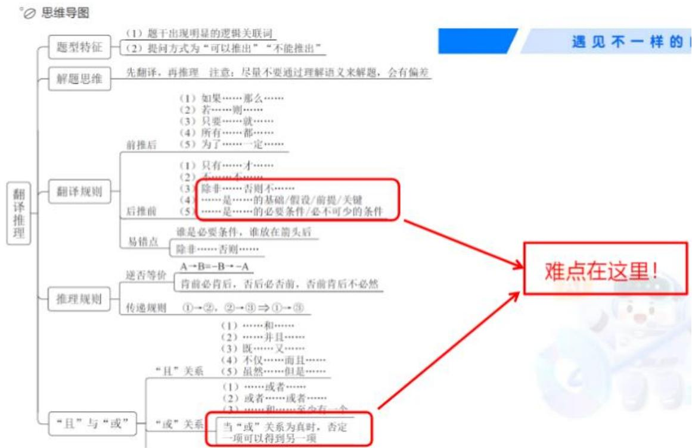

# 精讲精练-判断7

（笔记）

主讲教师：徐来

授课时间：2025.04.17

# 精讲精练-判断7（笔记）

【注意】从本节课开始，进入判断后6节课内容（判断共有12节课），该部分内容涉及的题量有10道题，虽然题量不大，但由于是逻辑判断，其知识点较多，故安排了6节课讲解，这节课讲解翻译推理。

# 目录

01 翻译推理  
02 组合排列  
03 日常结论  
04 逻辑论证  
05 原因解释  
06 真假推理

# 【注意】逻辑判断：

1. 翻译推理和组合排列非常重要，因为二者喜欢结合在一起考，其对应了国考的材料题，材料题就是5道题匹配一则材料（省考对于翻译推理和组合排列，是单独考的，即考的是单题，同理的还有副省级；地市类和行政执法类是结合考的）。此外，还有日常结论、逻辑论证（为一大重点，无论是行政执法类，还是地市类、副省类，均考查较多）、原因解释、真假推理。原因解释、真假推理相对而言，比较简单一些，真假推理在精讲课不讲解，因为其考频很低。地市级/行政执法类逻辑判断部分为  $5 + 5$  的结构，5道题是组合排列与翻译推理相结合的材料题，5道题是论证题（论证中喜欢出3道加强、2道削弱，但不确定）；副省级逻辑判断部分是  $6 + 4$  的结构，6道题是论证题，4道题是其他考点的题目；其余考试，如各省省考，基本上参照副省级的居多，因为只有国考卷的地市级和行政执法类会出材料题。具体考哪一类，要等职位表出来之后，再看。  
2. 本节课讲解翻译推理的大部分内容，有一点结尾的内容在下节课中讲解。

# 第一节 翻译推理

题目特征

1. 题干和选项中存在明显的逻辑关联词  
2. 提问方式为：可以推出/不能推出

解题思维

1. 先翻译  
2. 再推理

【注意】翻译推理：一般会给出很长的文段，里面有几句话需要翻译，所以要将涉及充分条件和必要条件的长句子，变成谁推谁的短式子，这就是翻译；推理就要结合四个选项，看哪个选项可以根据式子推出来。

1. 题目特征：

(1) 题干和选项中存在明显的逻辑关联词。“如果……那么……”“只有……才……”是最常见的逻辑关联词。  
(2) 提问方式为: 可以推出/不能推出。

2. 解题思维：

(1) 先翻译: 先将题干中比较长的句子翻译成短的式子。  
(2) 再推理: 根据一定的推理规则, 选出符合题干翻译式子推理的选项。

3.注意事项：

(1) 现在单独考翻译推理时, 题干文段会巨长, 但只有一句话有 “只有……才……”, 就会导致一个结果, 即看不出来是翻译推理题, 此时可以看选项, 如果选项多次出现“如果……那么……”“只有……才……”, 表明该题就需要翻译, 故提醒大家, 除了题干以外, 要看选项中是否有逻辑关联词。  
(2) 对于翻译推理题, 不要用言语做题, 而要用规则做题, 只要按照规则做题, 这种题就会很好做。

如果天下雨，那么地会湿。

【注意】考试时，遇到“如果天下雨，那么地会湿”，会发现其出现“如果……那么……”，而“如果……那么……”是非常典型的逻辑关联词，可以写成箭头连接的式子，即“下雨→地湿”，表达的意思是当有“下雨”这个条件发生时，一定有“地湿”这个结果。注意不能理解为“下雨导致地湿”，因为二者是一个条件关系（当一个条件发生时，结果必然存在），而不是因果关系。如“如果今

天起风，甲就跳楼”，翻译为“风→甲跳楼”，此时“风”和“跳楼”没有因果关系，但只要这句话说出来，二者就存在条件关系（由于是理论课，故老师要说明“如果……那么……”和“导致”是不一样的，实际上，不需要知道二者的区别，因为考试不考，遇到“如果……那么……”，直接记忆为用“→”连接，然后前半句推出后半句即可）。

# 一、翻译规则之“前推后”

典型关联词：如果……，那么……

例句:

如果你想上岸，那么请先刷够 5000 题

上岸  $\rightarrow 5000$

简写帮助你

做得快、看得清

【注意】翻译规则之“前推后”：

1. 但凡遇到“如果……那么……”，其翻译就是将“→”写出来，然后前半句推出后半句。  
2. 例：如果你想上岸，那么请先刷够5000题。出现“如果……那么……”，前推后，翻译为“上岸→5000题”。  
3. 翻译时，尽量简写；在简写的过程中，有同学喜欢写成  $\mathrm{P} \rightarrow \mathrm{Q}, \mathrm{A} \rightarrow \mathrm{B}$ ，即用字母形式表达，但不建议，因为公务员考试中考的翻译推理都比较简单，句子不至于复杂到需要用字母表示，且有时候会涉及多句话，故建议用汉字简写会更好一点，因为多句话用字母，还要分谁是 P、谁是 Q，就会比较麻烦。翻译简写时，建议用汉字或数字简写，而不建议用字母代替。  
4. 如“如果天气晴朗，就出去玩”，翻译为“晴朗  $\rightarrow$  去玩”；又如“如果今年你上岸了，就请我吃饭”，翻译为“上岸  $\rightarrow$  请吃饭”。  
5. 总结：但凡遇到“如果……那么……”，就用前半句推后半句。

等价关联词：（前  $\rightarrow$  后）

若…，则…；

只要……，就……；

所有……，都……；

为了……，一定（必须）……；

……是……的充分条件

# 【注意】“前→后”的等价关联词：

1. 若……则……。  
2. 只要……就……。  
3.所有……都……。  
4.为了……一定（必须）……。  
5. ……是……的充分条件。  
6. 以上逻辑关联词均表达前半句可以推出后半句，故考试遇到这些词语，统一都用前半句推后半句。

（1）简单记忆（为考试考的内容）：出现“如果、……就……、……都……、……一定……”（一个“大哥”带着三个“小弟”，注意“如果”是“大哥”，其余是“小弟”），均是前半句推出后半句。  
(2) “若”就是“如果”的意思、“则”就是“就”的意思。  
(3) “……是……的充分条件” 不用记忆, 因为在近些年的考试中, 其只在山东的一个选项中出现过 (这道题中, 该项不懂也不影响做题, 因为其余选项比较简单), 其余地方均未出现, 故对于基础课来说, 重点记忆前面的内容就行, 对于充分条件, 刷题遇到了, 见识一下就行, 其不重要。记忆关键的、考试喜欢考的内容即可。

你若安好，便是晴天

只要努力向前，就还有机会

为了能“上岸”，一定要每天听直播

凡是违法行为，都将受到法律的惩罚

# 【注意】练习：

1. 你若安好，便是晴天：“若”就是“如果”的意思，前推后，翻译“好→晴”（简写）。

2. 只要努力向前，就还有机会：出现“就”，前推后，翻译为“努力→机会”。强调一下，后续会学习“只有……才……”，对于“只要……就……”和“只有……才……”，不要看“只”，而是记忆“就”和“才”，遇到“就”，是前推后。  
3. 为了能“上岸”，一定要每天听直播：出现“一定”，前推后，翻译为“上岸→直播”（表达的意思是当有上岸这件事发生时，必然有每天听直播这件事）。强调一下，之前考试中有一道题，很多同学都翻译错误了，“为了美，一定要减肥”翻译为“美→减肥”，表达的意思是当有美这件事发生时，一定会有减肥这件事存在，不能字面理解为导致关系（即减肥导致美/听直播导致上岸），因为这里是条件关系，而不是谁导致谁的关系，故做题按照条件关系去翻译即可，而不能按照言语理解去做题。  
4. 凡是违法行为，都将受到法律的惩罚：出现“都”，前推后，翻译为“违法→罚”。

# 二、推理规则之“逆否等价”

符号表示：  $A\to B = -B\to -A$

文字表示：肯前必肯后、否后必否前

否前肯后无必然结论/不确定（可能、可能不）

【注意】推理规则之“逆否等价”：但凡考翻译推理，一定会遇到“逆否等价”规则。

1.符号表示：  $\mathrm{A}\to \mathrm{B} = -\mathrm{B}\to -\mathrm{A}$  
2. 文字表示：肯前必肯后、否后必否前，否前、肯后无必然结论。

如果某人是北京人，那么他一定中国人。

北京人→中国人

张三：北京人→中国人 肯前必肯后

李四：-中国人  $\rightarrow$  -北京人 否后必否前

王五：-北京人  $\rightarrow ?$  否前无必然结论

赵六：中国人  $\rightarrow ?$  肯后无必然结论

【注意】例：如果某人是北京人，那么他一定是中国人。“如果……那么……”前推后，翻译为“北京人→中国人”。

1. 已知张三是北京人，那么张三一定是中国人（北京人→中国人）。“北京人”与题干箭头前一样，即肯前，推出“中国人”，和箭头后一样，即肯后，所以肯前必肯后。  
2. 已知李四不是中国人，那么李四一定不是北京人（-中国人  $\rightarrow$  -北京人）。“-中国人”与题干箭头后相反（是对箭头后的否定），即否后，推出“-北京人”，是对箭头前的否定，即否前，所以否后必否前。  
3. 否前、背后无必然结论：

（1）已知王五不是北京人，那么不知道王五是不是中国人，因为不一定，其可能是中国人（如中国辽宁、河南、山东的），也可能不是中国人（如伦敦人、纽约人），得到的是“？”。“- 北京人”是对箭头前的否定，即否前，推出的是“？”，所以否前无必然结论。  
（2）已知赵六是中国人，不知道赵六是不是北京人，因为不一定，其可能是北京人，也可能不是北京人（因为中国很大）。“中国人”与题干箭头后一致，即肯后，得到的是“？”，所以肯后无必然结论。

4. 如果数理能力比较强，就记忆符号表示，如果记不住符号表示，就记忆文字表示。要记住“如果、就、都、一定”，然后分清肯前（与前面一样）、肯后（与后面一样）、否前（与前面相反）、否后（与后面相反），最后记住“肯前必肯后、否后必否前，否前、肯后无必然结论”，将这些内容记住，就可以解决  $60\%$  的翻译推理题。

思考一个问题：

哈根达斯的广告语说，“爱她就带她去吃哈根达斯”……

怎么翻译？ 爱她  $\rightarrow$  吃哈根达斯

吃过哈根达斯  $\rightarrow ?$

没吃哈根达斯  $\rightarrow$  不爱她

【注意】

1. 翻译: “爱她就带她去吃哈根达斯”中出现“就”, 前推后, 翻译为“爱她  $\rightarrow$  吃哈根达斯”。  
2.推理：

（1）已知“吃过哈根达斯”，“吃过哈根达斯”和箭头后一样，是肯后，肯后无必然结论，所以“爱不爱不一定”，要打“？”。  
（2）已知“没带她吃过哈根达斯”，“没带她吃过哈根达斯”为否后，否后必否前，推出“一定不爱她”。  
3. 对于翻译推理题，要做一个没有感情的做题机器，不考虑言语理解，就是翻译、推理，故记忆公式和规则即可。

思考一个问题：

某商场门口挂了个牌子：“抽烟者，不得入内”怎么翻译？

抽烟  $\rightarrow$  不入内

我不抽烟，能不能进去呢？

我进去了，又说明什么呢？

# 【注意】真题：

1. 某商场门口挂了个牌子：“抽烟者，不得入内”。虽然没有出现逻辑关联词，但“抽烟者，不得入内”的意思是“抽烟的人就不让进去”，“就”前推后，翻译为“抽烟  $\rightarrow$  不入内（不让进）”。  
(1) 如果 “不抽烟”, “不抽烟” 是对 “抽烟” 的否定, 是否前, 否前无必然结论, 所以 “能不能进不一定”, 打 “? ”。  
（2）如果“我进去了”，是对“不入内（不让进）”的否定，即否后，否后推否前，所以“我一定不抽烟”。  
2. 牢记“肯前必肯后、否后必否前，否前、肯后无必然结论”，其他的不要考虑太多，切忌不要用言语理解做题，应用规则去解题。

如果想要取得好成绩，就必须减少玩耍时间

好成绩  $\rightarrow$  少玩耍

取得好成绩 肯前

没取得好成绩 否前

减少玩耍时间 肯后

增加玩耍时间 否后

【注意】“如果想要取得好成绩，就必须减少玩耍时间”中出现“如果……就……”，前推后，翻译为“好成绩→少玩耍”。

1. 取得好成绩：“取得好成绩”与箭头前一样，是肯前，肯前必肯后，可以推出“少玩耍”。  
2. 没取得好成绩：“没取得好成绩”是否前，否前不确定，只能推出“？”。  
3. 减少玩耍时间：“减少玩耍时间”与题干箭头后一样，为肯后，肯后无必然结论，只能推出“？”。  
4. 增加玩耍时间：“增加玩耍时间”意味着一定没减少玩耍时间，是对题干箭头后的否定，即否后，否后必否前，可以推出“没有取得好成绩”。

【例1】（2020天津）研究表明，锻炼对人类大脑有积极作用，如果坚持锻炼，阿尔茨海默病等神经退行性疾病的发病风险就会降低。

由此可以推出：

A. 人类大脑如果不进行锻炼, 阿尔茨海默病等神经退行性疾病的发病风险就会进一步提高  
B. 如果没有降低阿尔茨海默病等神经退行性疾病的发病风险, 那一定是没有坚持锻炼  
C. 如果阿尔茨海默病等神经退行性疾病的发病风险降低了, 那么就一定是坚持锻炼的结果  
D. 是否坚持锻炼, 直接决定了阿尔茨海默病等神经退行性疾病的发病风险能否得到降低

【解析】1. 题干出现“如果……就……”, 根据翻译规则, “如果……就……”前推后, 翻译为 “坚持锻炼  $\rightarrow$  风险降低” (可以简写为 “炼  $\rightarrow$  降”, “降” 也可以用下降的箭头表示, 具体如何写, 根据大家自身情况决定)。

A项：“如果……就……”前推后，“不进行锻炼”是否前，否前无必然结论，排除。

B 项: “如果……就……”前推后, “没有降低发病风险”是否后, 否后必否前, 推出 “没有坚持锻炼”, 当选。  
可以选了B项就“走人”，因为翻译推理是唯一正确答案，不存在择优比较，即对就是对，不对就是不对，由于此处是授课，故要看看其余选项。  
C项: “如果……就……”前推后, “风险降低”与题干箭头后一样, 是肯后,肯后无必然结论, 排除。  
D 项：前面讲解翻译推理词时，没有讲过“是否……决定了……”，故该项不涉及翻译词，就不用翻译，对于翻译推理题，不能翻译的选项一般不选；“是否坚持锻炼”也不是很明确，“是坚持锻炼”是肯前，“否坚持锻炼”是否前，不知道到底是肯前还是否前；有同学错选该项的原因在于感觉选项表述是有道理的，但要记住，对于翻译推理题，不能用言语理解解题，而要用翻译推理的规则来解题，排除。【选 B】

【注意】警惕无法翻译的句子。

【例2】（2024事业单位）凡是书法家，都可以参加艺术交流讲座。

假设上述命题为真，则下列推理正确的是：

A. 能参加艺术交流讲座的都是书法家  
B. 不是书法家就不能参加艺术交流讲座  
C. 甲参加了艺术交流讲座, 所以他是书法家  
D. 乙是书法家, 所以可以参加艺术交流讲座

【解析】2. 该题题干很短，只有一句话，出现“……都……”，前推后，翻译为“书法家  $\rightarrow$  参加讲座”（此处如何简写都可，看个人喜欢）。

A 项: “都”前推后, 翻译为 “参加讲座  $\rightarrow$  书法家”, “参加讲座”与题干翻译箭头后一致, 是肯后, 肯后无必然, 排除。  
B 项: “就”前推后, 翻译为 “-书法家  $\rightarrow$  -参加讲座”, “-书法家” 是否前, 否前无必然, 排除。  
C 项: “甲参加讲座” 中 “参加讲座” 是对题干翻译的肯后, 肯后无必然, 排除。

D 项: “乙书法家” 中 “书法家” 是对题干翻译的肯前, 肯前必肯后, 可以推出 “参加讲座”, 当选。【选 D】

【注意】对于翻译推理题，要用规则做题，刚学习开始，就按照好的做题方法去解题，虽然可能慢一点，但放心，题到后续会越做越快。

【例3】（2024事业单位）某舞蹈工作室为了招生，准备在广场进行快闪表演，为了达到最好的宣传效果，工作室选择表演日期时需注意：如果天晴，会进行表演；如果领舞演员不在，就不进行表演；如果没通过广场审核批准，就不进行表演；如果是工作日，就不进行表演。

如果某天工作室进行了快闪表演，则对于表演当天的情况，不能判定正确的是：

A.天晴

B. 领舞演员在场

C. 通过广场的审核批准

D. 不是工作日

【解析】3. 这道题要难一点，难点在于字多。出现“如果”，前推后，题干翻译为：

(1)天晴  $\rightarrow$  表演。  
(2)一演员  $\rightarrow$  一表演。  
(3) - 批准  $\rightarrow$  - 表演。  
(4)工作日  $\rightarrow$  表演。

“某天工作室进行了快闪表演”即“表演”，问“不能判断正确的是”，“表演”是对条件①的背后，背后无必然，即不知道天晴不晴，故不能判定正确的是A项。

由于是授课，故会讲解得细致一些。

“表演”是对条件②的否后，否后必否前，可以推出“演员”，即B项正确。

“表演”是对条件③的否后，否后必否前，可以推出“审批”，即C项正确。

“表演”是对条件④的否后，否后必否前，可以推出“-工作日”，即D项正确。

B、C、D 项均可以推出，只有 A 项不能推出，故 A 项当选。【选 A】

# 【注意】

1. 做题时，用规则做题，会非常确定的知道哪些选项对、哪些选项不对。对于前三道题，做起来比较简单，后面的难题基本上都是根据这三道题变化而来的，故翻译推理没有那么复杂，是很好做的。  
2. 提示：对于翻译推理题，不要按照言语理解做题，而要按照规则做题。

只有年满22岁，才能娶老婆。

【注意】“只有年满22岁，才能娶老婆”中出现“只有……才……”，此时不能按前推后翻译，若按照前推后，其翻译为“22岁→娶老婆”，是不成立的（因为这句话要是成立，就表示到了22岁，一定有娶老婆这个结果），对于“只有……才……”，应该翻译为“娶老婆→22岁”。当有“娶老婆”这件事发生时，就有“年满22岁”这件事。“娶老婆”是句子的后半句，“年满22岁”是句子的前半句，故遇到“只有……才……”，统一后推前。

# 二、翻译规则之“后推前”

典型关联词：只有……才……

例句:

只有刷够 5000 题, 才能考到 80 分。

80分  $\rightarrow 5000$  题

【注意】翻译规则之“后推前”：

1. 典型关联词：只有……才……。记住“才”，遇到“只有……才……”“必须……才……”“除非……才……”等，只要出现“才”，就用句子的后半句推前半句。  
2. 例：只有刷够 5000 题，才能考到 80 分。出现“才”，后推前，翻译为“80分→5000 题”。

(1) 已知 “刷了 5000 题”, 其是对题干翻译的肯后 (与箭头后一致), 肯后无必然, 即什么也推不出。  
(2) 无论是前推后, 还是后推前, 但凡遇到 “ $\rightarrow$ ” 的形式, 都适用 “逆否”。

等价”规则，即“逆否等价”规则适用于所有的  $\rightarrow$  形式。

3. 总结：但凡遇到“就”，是前推后；但凡遇到“才”，是后推前（必须要记住）。但凡遇到“→”，都适用“肯前必肯后、否后必否前，否前、肯后无必然”。

【例1】（2024黑龙江公安）在知识经济时代，如果要推动社会可持续发展，就要提高人才培养质量，而要提高人才培养质量，就必须提升高校的办学水平。如果要提升高校的办学水平，就要提升大学教师的整体素养。

根据以上陈述，可以得出以下哪项？

A. 只有提升大学教师的整体素养，才能推动社会可持续发展  
B. 只有提高人才培养质量，才能提升大学教师的整体素养  
C. 如果提升高校的办学水平, 就能推动社会的可持续发展  
D. 如果不提升高校的办学水平, 就不能提升大学教师的整体素养

【解析】1. 题干三句话中均出现“如果……就……”, “就”前推后, 题干翻译为:

(1) 发展  $\rightarrow$  人才。  
(2)人才  $\rightarrow$  高校。  
(3)高校  $\rightarrow$  教师。

根据递推规则，条件①②③可以串为“发展  $\rightarrow$  人才  $\rightarrow$  高校  $\rightarrow$  教师”。

A项: “只有……才……”后推前, 翻译为 “社会发展  $\rightarrow$  教师整体素质” (出现逻辑关联词, 无论是在题干还是选项, 都要翻译), “社会发展”是对题干翻译的背前, 肖前必背后, 可以推出 “教师整体素质”, 当选。  
B 项: “才”后推前, 翻译为 “教师  $\rightarrow$  人才”, 题干是 “人才  $\rightarrow$  教师”, 此时 “教师”是对题干翻译的背后, 肯后无必然, 排除。  
C 项: “就”前推后, 翻译为 “高校  $\rightarrow$  发展”, 题干是 “发展  $\rightarrow$  高校”, 此时 “高校”是对题干翻译的背后, 肯后无必然, 排除。  
D 项: “就”前推后, 翻译为 “- 高校  $\rightarrow$  - 教师”, “- 高校”是对题干翻译的否前, 否前无必然结论, 排除。

老师在授课时，A、B项都写出了翻译等式，而C、D项是直接画箭头了，故对于选项，出现前推后，可以直接画箭头（可以省时），但对于后推前，不建议

画箭头，而是建议写翻译等式。题干条件可以串，也可以不串，不做强制要求。【选A】

# 【注意】

1. 在数学中，当有“A→B，B→C”时，可得到“A→C”，也可以串为“A→B→C”，这称为递推规则（可以形象化地称为穿串），其在翻译推理中有可能会用到。  
2. 题干和选项都要翻译。

# 递推关系小练习

A→B

A→B→C

A→B

—C→A→B

B→C

-A→C

A→B

A→B→—C

A→B

C→—B

A→C

X

# 【注意】递推关系小练习：

1. “ $\mathrm{A} \rightarrow \mathrm{B}$ ”和“ $\mathrm{B} \rightarrow \mathrm{C}$ ”可以串联得到“ $\mathrm{A} \rightarrow \mathrm{B} \rightarrow \mathrm{C}$ ”。  
2. “ $A \rightarrow B$ ”和“ $-A \rightarrow C$ ”可以串，将“ $-A \rightarrow C$ ”逆否为“ $-C \rightarrow A$ ”，再与“A→B”串为“ $-C \rightarrow A \rightarrow B$ ”。也可以将“A→B”逆否为“ $-B \rightarrow -A$ ”，再与“ $-A \rightarrow C$ ”串为“ $-B \rightarrow -A \rightarrow C$ ”（这个与前面穿串得到的等式是一样的）。  
3. “ $\mathrm{A} \rightarrow \mathrm{B}$ ”和“ $\mathrm{C} \rightarrow \mathrm{-B}$ ”可以串，将“ $\mathrm{C} \rightarrow \mathrm{-B}$ ”否后推否前，变为“ $\mathrm{B} \rightarrow \mathrm{-C}$ ”，再与“A→B”串为“A→B→-C”。也可以将“A→B”逆否为“-B→-A”，再与“ $\mathrm{C} \rightarrow \mathrm{-B}$ ”串为“ $\mathrm{C} \rightarrow \mathrm{-B} \rightarrow -\mathrm{A}$ ”。  
4. “ $\mathrm{A} \rightarrow \mathrm{B}$ ”和“ $\mathrm{A} \rightarrow \mathrm{C}$ ”无法串联。  
5. 总结：相同的词在同侧（都在前或者都在后），且符号相反，就可以穿串（变形/逆否后再串）。该部分应该是在冲刺课上讲解的，此处是提前讲解了（可以重点记忆第一点和第四点，因为属于必须会的内容，其余两点作为拔高、选学内容；课上老师会说明哪些是必学、哪些是选学）。

等价关联词：（后→前）

除非……，否则不……;

除非天地合，否则我不会与君绝

与君绝→天地合

【注意】“后→前”等价关联词：

1. 除非……否则不……：注意“否则不”要相连，出现“除非……否则不……”，为后推前。也可以这么理解，即“除非”等于“只有”，“否则不”等于“才”。  
2. 例：除非天地合，否则我不会与君绝。出现“除非……否则不……”，后推前，翻译为“与君绝→天地合”。

【例2】（2022青海）在面向我国科技强国和现代化强国建设目标的背景下，要满足经济社会发展科技的要求，就要不断强化科技创新对经济社会发展的战略支撑。只有大力促进科技治理体系和治理能力现代化，才能充分发挥科技创新对经济社会发展的促进作用。

由此可以推出：

A.只要不断强化科技创新对经济社会发展的战略支撑，就能满足经济社会发展科技的要求  
B. 如果不能满足经济社会发展科技的要求，就不能强化科技创新对经济社会发展的战略支撑  
C. 如果不大力促进科技治理体系与治理能力现代化, 就不能充分发挥科技创新对经济社会发展的促进作用  
D. 除非充分发挥科技创新对经济社会发展的促进作用, 否则不能大力促进科技治理体系与治理能力的现代化

【解析】2. 有同学从题干部分没有判断出是翻译推理题, 此时可以看选项,四个选项都有逻辑关联词, 故可以判断该题一定是翻译推理题。先翻译题干:

(1) “就”前推后，翻译为：满足发展要求  $\rightarrow$  强化战略支撑。  
(2) “只有……才……”后推前，翻译为：发挥科技作用→促进现代化。

A 项: “就”前推后, 可以直接画箭头 (比较方便和好观察), “强化战略支撑”是对题干条件①的背后, 肯后无必然结论, 排除。  
B 项: “就”前推后, 可以直接画箭头, “- 满足发展要求”是对题干条件①的否前, 否前无必然, 排除。  
C项: “就”前推后, 直接画箭头, “- 促进现代化”是对题干条件②否后, 否后必否前, 可以推出 “- 发挥科技作用”, 当选。  
D 项: “除非……否则不……”后推前（注意“不”一定要和“否则”连在一起), 建议写一下翻译等式, 翻译为 “促进现代化  $\rightarrow$  发挥科技作用”, “促进现代化”是对题干条件②的背后, 肯后无必然结论, 排除。【选 C】

# 【注意】

1. 题干和选项都要翻译。  
2. “除非……否则不……”是一个整体，遇到就是后推前。  
3. 老师讲解的方法不是为了做对某道题，而是为了做对一类题。  
4. 翻译推理题必须保证百分百对，考试中，只有资料分析和逻辑判断按照规则就一定能做出答案，所以对于二者要尽可能地提高其正确率。

“后推前” 关联词变形

除非A否则不B：  $\mathrm{B}\rightarrow \mathrm{A}$

除非A否则B：  $-\mathrm{B}\rightarrow \mathrm{A}$

例句：除非交房租，否则搬出去

-搬出去  $\rightarrow$  交房租

【注意】“后推前” 关联词变形:

1. “除非 A，否则 B”：添加 1 个“不”，构成“除非……否则不……”，此时句意发生改变，可以再加 1 个“不”，保证句意不变（因为双重否定表肯定），得到“除非 A，否则不不 B”，“除非……否则不……”后推前，翻译为“-B→A”。老师建议大家直接背下来（因为直接背诵比理解更容易），即“除非 A 否则不 B：B→A”“除非 A 否则 B：-B→A”。

2. 例：除非交房租，否则搬出去。“除非 A，否则 B” 翻译为 “-B→A”，翻译

为“-搬出去  $\rightarrow$  交房租”。

3. 如“除非你还钱，否则出去”，出现“除非……否则……”，翻译为“-B→A”，即“-出去→还钱”。  
4. 答疑：不建议将“否则”当成“不”，因为有时候会变形，如“搬出去，除非交房租”，此时隐含了“否则”，且属于倒装句（很多地方都会考查），故建议大家还是直接记忆“除非A否则不B：B→A”“除非A否则B：-B→A”。

【补充】（2015 江西法检）某大型电器公司领导对其员工说，除非你们到年底能实现销售五百万台空调的目标，否则将扣除部分年终奖。

由此可以推出：

A. 若员工实现了销售目标，那么不会被扣除部分年终奖  
B. 若员工没有实现销售目标, 则一定会被扣除部分年终奖  
C. 若员工被扣除了部分年终奖, 则一定是没有完成销售目标  
D. 只有员工不会被扣除部分年终奖，才会实现销售目标

【解析】拓展. 课堂正确率为  $69\%$  。出现“除非……否则……”，翻译为“-B→A”，即“-扣除→实现目标”。

A 项: “若”前推后, 直接画箭头, “实现目标”是对题干翻译的肯后, 肯后无必然结论, 排除。  
B 项: “若”前推后, 直接画箭头, “- 实现目标”是对题干翻译的否后, 否后必否前, 可以推出 “扣除”, 当选。

此时可以选了 B 项直接 “走人”, 不用看后续的选项, 不放心可以看一眼。

C项: “若”前推后, 直接画箭头, “扣除”是对题干翻译的否前, 否前无必然结论, 排除。  
D 项: “只有……才……”后推前, 建议写出翻译等式 (因为写下来会更清楚), 翻译为 “实现目标  $\rightarrow$  -扣除”, “实现目标” 是对题干翻译的肯后, 肯后无必然结论, 排除。【选 B】

【注意】翻译推理题是直接套公式的，故背着做，不需要理解。

【例3】（2022联考）要控制冰川的退缩，一劳永逸的方法只有节能减排、减少温室气体排放、遏制地球气温升高。只有这样，冰川的加速退缩才能从根本上得到控制。如果不减少温室气体的排放，欧洲阿尔卑斯山将有  $94\%$  的冰川会在100年内消失掉，也许人们只能在冷库中看到一点剩余的冰川冰。

由此可以推出：

A. 如果节能减排、减少温室气体排放、遏制地球气温升高，就能够控制冰川的退缩  
B. 如果欧洲阿尔卑斯山有  $94 \%$  的冰川在 100 年内消失掉, 那就说明温室气体排放没有减少  
C. 除非减少温室气体排放，否则欧洲阿尔卑斯山将有  $94\%$  的冰川在 100 年内消失掉  
D. 只要节能减排、减少温室气体排放、遏制地球气温升高, 就能控制冰川退缩

【解析】3. 第一句话中出现了“只有”，不是标准的逻辑关联词，继续往后看，出现“只有……才……”“如果”，翻译题干：

(1) “只有……才……”后推前，翻译为：得到控制  $\rightarrow$  节能减排。  
(2) “如果”前推后，翻译为：- 减少气体  $\rightarrow$  冰川消失。

第一句话不需要翻译，因为第一句话和第二句话是一句话；第一句话中只有“只有”，没有“才”，“才”出现在第二句中，第二句中用“这样”指代前面的内容（即“节能减排”）。

A 项: “如果”前推后, 直接画箭头, “减少气体”是对条件①的否前, 否前无必然, 排除。  
B 项: “如果”前推后, 直接画箭头, “消失”是对条件②的肯后, 肯后无必然, 排除。  
C 项: “除非……否则……” 翻译为 “-B→A”, 即翻译为 “-冰川消失→减少气体”, “-冰川消失” 是对条件②的否后, 否后必否前, 可以推出 “减少气体”,考试时可以直接选了 “走人”, 当选。  
D 项: “就”前推后, “节能减排”是对条件①的肯后, 肯后无必然, 排除。

这道题在题库正确率只有  $62\%$  ，其难度与一道数量题差不多，但二者相比而言，翻译推理题比数量题好做，故不能什么都放弃。【选 C】

等价关联词：（后  $\rightarrow$  前）

不……不……；

人无精神则不立，国无精神则不强。

立  $\rightarrow$  人精神 强  $\rightarrow$  国精神

根据以上陈述，可以得出以下哪项？

A. 人有精神则立，国有精神则强

【注意】“不……不……”也是逻辑关联词。

1. 例（江苏题）：人无精神则不立，国无精神则不强。

(1) “无”和“不”构成“不……不……”结构，遇到“不A不B”可以直接后推前，翻译为“ $\mathrm{B} \rightarrow \mathrm{A}$ ”。  
(1) “人无精神则不立”后推前，翻译为“立→人精神”。  
(2) “国无精神则不强”后推前，翻译为“强→国精神”。  
(3) A 项: “人有精神”是对①的肯后, “国有精神”是对条件②的肯后, 肯后无必然结论, 排除。  
(2) 题干翻译出现 “则” 字, 也可以前推后。  
(1) “人无精神则不立”前推后，翻译为“人无精神→不立”。  
(2) “国无精神则不强”前推后, 翻译为 “国无精神  $\rightarrow$  不强”。  
(3) A 项: “人有精神” 是对①的否前, 依然无必然结论, 排除。

# 2. “不A则不B”如何翻译：

(1) 根据 “则”, 前推后, 直接写为 “-A  $\rightarrow$  -B”。  
(2) 根据 “不……不……”, 后推前, 写为 “ $\mathrm{B} \rightarrow \mathrm{A}$ ”。  
(3) 两种翻译都可以, 严格来说 “ $-A \rightarrow -B$ ” 是原形, 因为带着负号不方便做题, 所以直接翻译为它的逆否形式, 后推前, 翻译为 “ $B \rightarrow A$ ”。

# 3. 例:

(1) 不到长城则非好汉:

(1)可以根据“则”，前推后，翻译为“-长城→-好汉”。

(2)可以根据“不……不……”后推前，翻译为“好汉→长城”。

(2) 如果不到长城, 就不是好汉:

(1)可以根据“如果……就……”前推后，翻译为“-长城→-好汉”。  
(2)可以根据“不……不……”后推前，翻译为“好汉→长城”。  
(3)其实“不……不……”的后推前，是对原有式子的否后推否前。

【例 4】（2022 广东）子曰：“名不正，则言不顺；言不顺，则事不成；事不成，则礼乐不兴；礼乐不兴，则刑罚不中；刑罚不中，则民无所措手足。”

根据以上论述，下列推断必然正确的是：

(1)名正则言顺  
(2)礼乐兴则事已成  
(3)名不正，则民无所措手足  
④只有名正言顺才事可成

A. ①②

B. ②③

C. ②③④

D. ①②③④

【解析】4. 问“下列推断必然正确的是”。“不……不……”后推前：

（1）言顺  $\rightarrow$  名正。  
（2）事成  $\rightarrow$  言顺。  
（3）礼乐兴  $\rightarrow$  事成。  
(4) 刑罚中  $\rightarrow$  礼乐兴。  
(5) 措手足→刑罚中。

“名不正，则言不顺”出现“则”，也可以翻译为“名不正→言不顺”，不过用“不……不……”直接后推前，翻译为“言顺→名正”，可以不用带负号，两种翻译是一样的，课上建议按照“不……不……”后推前，不带负号做题更方便。

题干条件可串联为（6）“措手足  $\rightarrow$  刑罚中  $\rightarrow$  礼乐兴  $\rightarrow$  事成  $\rightarrow$  言顺  $\rightarrow$  名正”。

(1)出现“则”，前推后，翻译为“名正  $\rightarrow$  言顺”，条件（1）是“言顺  $\rightarrow$  名正”，“名正”是对条件（1）的背后，背后无必然结论，排除A、D项。  
(2)出现 “则”, 前推后, 翻译为 “礼乐兴  $\rightarrow$  事成”, “礼乐兴” 是对条件 (3)的背前, 肖前必背后, 可得出 “事成”。

(3)出现“则”，前推后，翻译为“名不正→无所措手足”，是对条件（6）的否后，一直否后必否前，可以推出“-措手足”。“不……不……”后推前，也可以翻译为“措手足→名正”，是对条件（6）“措手足→刑罚中→礼乐兴→事成→言顺→名正”的肯前，肯前必肯后，可得出“名正”。  
④ “只有……才……”后推前，翻译为“事成→名正言顺”。“事成”是对条件（2）的背前，背前必背后，可得出“言顺”；“事成”是对条件（6）“事成→言顺→名正”的背前，背前必背后，也能推出“名正”。因此，“事成”可推出“名正言顺”，④的推断也正确。

综上，必然正确的是②③④，C项当选。

答疑：

a. 如果需要带着负号推理, 就把刚才对题干的翻译全部否后推否前即可。  
b. ③出现“不……不……”结构，后推前，翻译为“措手足→名正”，可以由条件（6）的串串推出。  
c. 如果题干第一句话按照 “则”, 前推后, 翻译为 “名不正  $\rightarrow$  言不顺”, 那么 ①的 “名正” 就是对题干第一句话的否前, 否前无必然结论。  
d. “名正言顺”和“言顺名正”是一样的。【选C】

【补充】（2019 青海）一个不尊重他人的人不会得到他人的尊重，一个不会反省的人不会真正地尊重他人。张三是一个会反省的人。

如果上述断定为真，那么以下哪项一定为真？

A. 张三会真正地尊重他人  
B. 张三会得到他人的尊重  
C. 张三不会真正地尊重他人  
D. 无法得出张三是否会尊重他人

【解析】拓展.课堂正确率为  $62 \%$  。问“以下哪项一定为真”。

(1) “不……不……”后推前，翻译为：他人尊重  $\rightarrow$  尊重他人。  
(2) “不……不……”后推前，翻译为：尊重他人  $\rightarrow$  会反省。

条件（1）（2）串联为：他人尊重  $\rightarrow$  尊重他人  $\rightarrow$  会反省。

已知“张三是一个会反省的人”，是对题干翻译的背后，背后无必然结论，

所以无法得出张三是否会尊重他人，D项当选。

如果觉得“不……不……”太绕，也可以直接前推后翻译，第一句翻译为“-尊重他人  $\rightarrow$  -他人尊重”，第二句翻译为“-会反省  $\rightarrow$  -尊重他人”，此时“张三是一个会反省的人”是对第二句“-会反省”的否定，否前无必然结论，依然选择D项。

即使不会翻译“不……不……”，问题也不大，考得不多。“不A不B”可翻译为“ $-A \rightarrow -B$ ”，也可以翻译为“ $B \rightarrow A$ ”。

答疑：“真正地尊重他人”和“尊重他人”是一样的，无需纠结。【选D】

【注意】A→B，B→C，A→B→C。否前、肯后无必然结论。

等价关联词：（后  $\rightarrow$  前）

……是……的基础/假设/前提/关键/必要/必不可少条件

通过笔试，是进入面试的前提

进入面试  $\rightarrow$  通过笔试

【注意】“基础/假设/前提/关键/必要/必不可少条件”意思一样, 遇到“……是……的基础/假设/前提/关键/必要/必不可少条件”, 翻译为后推前。如 “通过笔试, 是进入面试的前提”, “A 是 B 的前提”直接后推前, 翻译为 “进入面试→通过笔试”。虽然根据上课任务, 老师应该讲后推前, 但不建议如此记忆。

“后推前” 关联词变形

基础/假设/前提/关键/必要/必不可少条件

谁必不可少，谁在箭头后

例句1：食物是人类生存必不可少的。

人类生存，食物是必不可少的。

例句2：建大厦的基础是修好地基。

例句3：想成功，不懈的努力是前提。

# 【注意】

1. 例句 1: “食物是人类生存必不可少的”和“人类生存, 食物是必不可少

的”的意思是一样的，第一句的“食物”在前，第二句的“食物”在后，因为经常进行变形，所以不要记忆前推后、后推前，遇到“基础/假设/前提/关键/必要/必不可少条件”，翻译规则是“谁必不可少，谁在箭头后”。

(1) 食物是人类生存必不可少的: “食物” 必不可少, 放在箭头后, 翻译为 “生存  $\rightarrow$  食物”。  
(2) 人类生存, 食物是必不可少的: “食物” 必不可少, 放在箭头后, 翻译为 “生存  $\rightarrow$  食物”。

2. 例句 2: 建大厦的基础是修好地基。画出 “→”, “地基” 是基础 (必不可少), 放在箭头后, 翻译为 “大厦→地基”。  
3. 例句 3: 想成功, 不懈的努力是前提。画出 “→”, “努力” 是前提 (必不可少), 放在箭头后, 翻译为 “成功→努力”。

4.总结：

(1) 遇到“才”字，后推前。  
(2) “除非”的两种形式:

(1)除非 A 否则不 B:  $\mathrm{B} \rightarrow \mathrm{A}$  。  
(2) 除非 A 否则 B:  $-\mathrm{B} \rightarrow \mathrm{A}$  。

(3) 谁必不可少, 谁在箭头后。

5. 答疑：

(1) 人类要想生存, 充分的食物是假设条件。如果觉得 “假设” 不好理解,那么不记忆也行, 从逻辑角度来讲, “假设” 与 “必要条件” 意思一致, 从出题角度来讲, 这个词没有怎么考过, 主要考查 “基础/前提/必不可少”。  
(2) “不 A 不 B” 两种翻译都行, 可翻译为 “ $-A \rightarrow -B$ " “ $B \rightarrow A$ ”, 记忆或不记忆都可以, 这个考得少, 老师总结的三个考得多。

【例5】(2024山东)在超大特大城市积极稳步实施城中村改造是改善民生、扩大内需、推动城市高质量发展的一项重要举措。落实这一重要举措的一个必备的战略思路是要坚持稳中求进、积极稳妥，优先对群众需求迫切、城市安全和社会治理隐患多的城中村进行改造。

由此可以推出：

A. 如果不在超大特大城市积极稳步实施城中村改造，就不能改善民生、扩大内需、推动城市高质量发展  
B. 如果要改善民生、扩大内需、推动城市高质量发展，就要在超大特大城市积极稳步实施城中村改造  
C. 如果坚持稳中求进、积极稳妥，优先对群众需求迫切、城市安全和社会治理隐患多的城中村进行改造，就能够在超大特大城市积极稳步实施城中村改造  
D. 如果不坚持稳中求进、积极稳妥，优先对群众需求迫切、城市安全和社会治理隐患多的城中村进行改造，就不能在超大特大城市积极稳步实施城中村改造

【解析】5. 问“由此可以推出”。只看题干，可能很难看出本题是翻译推理题。越是近两年的新题，越有这种看不出来题型的趋势，山东、国考都如此，题干逻辑关联词不明显，可从选项里面看逻辑关联词。

本题只有两句话，在讲解前推后、后推前的时候，老师都没有提到过“重要举措”这个说法，充分条件、必要条件都重要，因此，不清楚“重要举措”到底是充分条件还是必要条件，本题的第一句话无需翻译。

本题只能翻译第二句话，谁必备，谁放箭头后，“稳中求进”是必备的战略思路，放在箭头后，“城中村改造（这一重要举措）”放在箭头前，翻译为“城中村改造  $\rightarrow$  稳中求进”。

本题难度最大的是看出第二句话需要翻译，难度第二大的是翻译规则（谁必要，谁放箭头后）。

A 项：出现“如果”，前推后，“-城中村改造”是对题干翻译的否前，否前无必然结论，排除。  
B项：出现“如果”，前推后，“改善民生、扩大内需、推动城市高质量发展”在第一句话里面，不在可翻译的句子当中，连“稳中求进”都没有提到，连肯后都不是，排除。  
A、B 项的翻译结果是一模一样的, 而且 A 项后半句、B 项前半句 “改善民生、扩大内需、推动城市高质量发展” 出现在不需要翻译的句子里面, 这类选项一般不对。虽然题干第一句出现 “重要举措”, 但不存在推出关系, 如 “你对我很重要” 这句话不存在 “我  $\rightarrow$  你” 或者 “你  $\rightarrow$  我” 的关系。  
C 项: 出现 “如果”, 前推后, “稳中求进” 是对题干翻译的背后, 肯后无必

然结论，排除。

D 项: 出现 “如果”, 前推后, 翻译为 “- 稳中求进  $\rightarrow$  - 城中村改造”, 是对题干翻译的否后必否前, 当选。

答疑：

(1) 不需要翻译的词有很多, 建议记忆常见的、需要翻译的逻辑关联词。  
(2) 单独看提问方式是判断不了题型的, 因为还有一类题是日常结论题, 题干、选项都没有逻辑关联词, 依然问 “由此可以推出”。因此, 单独看提问方式不保险, 关键在于看题干或选项有无逻辑关联词。  
(3) 日常结论题、翻译推理在试卷上不确定是否相邻。【选 D】

# 【注意】

1. 翻译推理题，如果选项与题干可翻译的句子无关，那么一般不选。  
2. “重要举措”不存在“谁  $\rightarrow$  谁”的推理关系，不需要翻译。

【补充】（2022江苏）在知识经济时代，社会持续发展的前提之一是培养大量高素质人才，只有高校教育质量的提升才能培养出大量高素质人才，而高校教育质量的提升一定要求高校教师整体素养的提升。

如果以上陈述为真，则可以推出以下哪项？

A.只要社会持续发展，就要求提升高校教师整体素养  
B. 如果没有大量高素质人才，那么高校教育质量不会有提升  
C. 如果培养了大量高素质人才，那么社会就能持续发展  
D. 如果处在知识经济时代，高校教育质量必定有所提升

【解析】拓展。问“可以推出以下哪项”。出现“人才、高校、社会发展”，与第5题很相似，区别在于逻辑关联词。

(1) 谁是前提, 谁放在箭头后, “前提之一是培养大量高素质人才” 说明 “人才” 是前提, 不用管 “之一、之二”, 只要是前提, 就放在箭头后, 翻译为: 发展  $\rightarrow$  人才。  
(2) “只有……才……”后推前，翻译为：人才→高校。  
(3) “……一定……”前推后，翻译为：高校→教师。

条件（1）（2）（3）串联为：发展  $\rightarrow$  人才  $\rightarrow$  高校  $\rightarrow$  教师。

A项：“只要……就……”前推后，翻译为“发展  $\rightarrow$  教师”，与题干翻译一致，当选。

答疑：

(1) “A 是 B 的前提” 可能会变形为 “B 的前提是 A”, 会出现变化, 为了方便理解, 就记忆为 “谁必不可少, 谁在箭头后”。  
(2) “一定”是“必须”的意思, 也可以理解为必不可少, 但没有必要, 按照前推后翻译即可。因为 “一定” 会出现在句子中间, 不存在变形, 所以按照前推后翻译即可。【选 A】

【注意】谁必不可少，谁在箭头后。

总结一下

翻译规则一：前→后 如果/就/都/一定

翻译规则二：后→前

只有……，才……

1. 除非 A 否则不 B:  $\mathrm{B} \rightarrow \mathrm{A}$ ; 除非 A 否则 B:  $-\mathrm{B} \rightarrow \mathrm{A}$  
2. 谁必不可少，谁在箭头后

推理规则一：逆否等价

背前必背后、否后必否前，否前、背后无必然结论

递推原则： $\mathrm{A} \rightarrow \mathrm{B}$ ， $\mathrm{B} \rightarrow \mathrm{C}$ ，可得  $\mathrm{A} \rightarrow \mathrm{B} \rightarrow \mathrm{C}$

【注意】总结一下：以下的前5个必须掌握。

1. 前推后：如果、就、都、一定。  
2. 后推前：遇到“才”字后推前。  
3. “除非”的两种形式:

（1）除非A否则不B：  $\mathrm{B}\rightarrow \mathrm{A}$  
（2）除非A否则B：  $-\mathrm{B}\rightarrow \mathrm{A}$

4. 谁必不可少，谁在箭头后。  
5. 逆否等价推理规则：肯前必肯后、否后必否前，否前、肯后无必然结论。

6. 递推原则（尽量记住）： $\mathrm{A} \rightarrow \mathrm{B}$ ， $\mathrm{B} \rightarrow \mathrm{C}$ ，可得  $\mathrm{A} \rightarrow \mathrm{B} \rightarrow \mathrm{C}$ 。

# 四、翻译规则之“且”与“或”

A 且 B: 二者同时成立

等价关键词：和、既……又……、不仅……而且……、……但是……

例句：我很丑，但是我很抢手

# 【注意】

1. 在逻辑上，认为两者同时成立即为“且”。

(1) “我和你”“既有我又有你”“不仅有我而且有你”均翻译为“且”。  
(2) “但是”在言语里面表示转折（是并列结构），在逻辑里面只要两者同时成立，就能简写为“且”关系，与言语的并列结构不是一回事。

2. 例:

(1) 我很丑但很抢手。“丑”和“抢手”同时存在，翻译为“丑且抢手”。  
（2）判断老师与言语老师的理解是不一样的，比如老师很喜欢一个女孩，女孩说“你很好，但是我们不合适”。言语老师会说强调的是“不合适”，判断老师会理解为“很好且不合适”同时存在，没有重要之分，虽然“我们不合适”，会让人不开心，但依然被夸了“很好”，两者同时成立。“且”关系表示两者都有，并不强调哪个更重要。

3. 记住“且”关系表示两者同时成立。

A 或 B: 二者至少一个成立

等价关键词：或者、或者……或者……、至少一个

例句：我想带你去北京或者上海

# 【注意】

1. A 或 B: 二者至少一个成立。  
2. 例句：我想带你去北京或者上海。存在三种可能性，第一种是“去北京”，第二种是“去上海”，第三种是“去北京+上海”。  
3. 等价关键词：在考试过程中，“或者”“或者……或者……”“至少一个”都表达一样的意思，可以选一个，可以选两个。比如选优秀干部，要求是选“甲

或乙”，那么可以选甲，可以选乙，也可以选甲且乙，表示至少一个的意思。

4. 例句：我想带你去北京或者上海。

（1）已知“去北京”，不确定是否去上海，至少一个，不清楚到底是一个还是两个。  
(2) 已知 “不去北京”, 因为北京、上海至少去一个, 北京不去了, 所以只能去上海, 只有 “去上海” 成立, 才能保证 “至少一个” 成立。

# 五、推理规则之“否一推一”

“或”的翻译：否1推1

“或”关系为真，否定一项可以得到另一项

北京或上海

不踢足球或不打篮球

不读书或看电视

# 【注意】

1. “或”关系为真，其中一个不成立，另一个必须成立，才能保证两者至少一个成立。在两人当中，其中一个人倒下了，另一个人必须站起来。  
2. 例:

(1) 北京或上海: 虽然不清楚到底去哪里, 但能知道 “- 北京  $\rightarrow$  上海 (不去北京就去上海)” “- 上海  $\rightarrow$  北京 (不去上海就去北京)”。  
(2) 不踢足球或不打篮球:

(1)已知“不踢足球”，满足“或”关系其中一项，不清楚另一项是否满足。  
(2)已知“踢足球”, 不满足“不踢足球”, 此时就要满足 “不打篮球”, 即 “足球  $\rightarrow$  - 篮球”。  
(3)已知“打篮球”, 否一推一, 可得出 “- 足球”, 即 “篮球  $\rightarrow$  - 足球”。“篮球  $\rightarrow$  - 足球”与“足球  $\rightarrow$  - 篮球”是一样的。

(3) 不读书或看电视: 一个打 “×”, 一个抄下, 得出 “读书  $\rightarrow$  电视”。  
(4) -判断或-数量: 一个打 “×”, 一个抄下, 得出 “判断→-数量”。  
(5) - 白酒或-啤酒: 一个打 “×”, 一个抄下, 得出 “白酒→-啤酒”。  
(6) -徐来或-永乐：一个打“×”，一个抄下，得出“徐来→永乐”。

3. 方法：先认出“或”字，“或”字有前面、后面，在一个上面打“×”，另外一个直接抄下（一定成立），这就是是否一推一。建议前面的打“×”，推出后面的一个不变，方便书写（后面打“×”推出前面，不方便书写）。

【例1】（2024事业单位）在白垩纪末期，只有肉食性恐龙或中等体型的植食性恐龙，才会避免衰落。考古发现，有一种恐龙在白垩纪末期能够适应自然环境，没有走向衰落。

关于这种恐龙的种类，下列断定最正确的是：

A. 既是植食性恐龙，也是中等体型的恐龙  
B. 一定是肉食性恐龙, 不会是植食性恐龙  
C. 如果不是肉食性恐龙, 就是中等体型的植食性恐龙  
D. 既不是肉食性恐龙, 也不是中等体型的植食性恐龙

【解析】1. 问“下列断定最正确的是”。“只有……才……”后推前，翻译为“避免衰落  $\rightarrow$  肉食性或中等植食性”。已知“没有走向衰落”，意味着“避免衰落”，肯前推肯后，得出“肉食性或中等植食性”。

A 项: “既……也……” 是 “且” 关系, 但题干推出的是 “或” 关系, 可能是 “肉食性”, 也可能是 “中等植食性”, 无法一定推出 “中等植食性”, 排除。  
B 项：题干推出的是“或”关系，是不确定的，无法得出“一定是肉食性恐龙”，排除。  
D 项：题干推出“肉食性或中等植食性”，二者至少一个成立，并不是两个都不成立，排除。  
C项: “如果……就……”前推后, 翻译为 “- 肉食性  $\rightarrow$  中等植食性”, “不是肉食性恐龙”是对“肉食性或中等植食性”其中一项的否定, “或”关系否一推一, 得出“中等体型的植食性恐龙”, 当选。

答疑：

(1) 这道题出得不是那么好，“肉食性”和“中等植食性”不能同时存在，不好交叉，但没关系，只要能解题即可。有一年联考的题，A、B 项都是背后，C、D 项都是否前，一个正确答案都没有，解析都不知道应该怎么写。  
(2) 题干推出的是 “或” 关系, 意思是二者至少一个成立, 不确定是 A 成立。

# 立，还是B成立。【选C】

(1)小孙：-游泳或-网球

A. 如果小孙不会打网球, 那么他一定会游泳  
B. 如果小孙会打网球, 那么他一定不会游泳  
C. 小孙既不会游泳，也不会打网球  
D. 小孙会游泳，但不会打网球

②小刚：- 英语或- 法语

A. 如果小刚不会英语，那么他一定会法语  
B. 如果小刚会法语, 那么他一定不会英语  
C. 小刚既不会英语, 也不会法语  
D. 小孙会英语, 但不会法语

【注意】以上是两道真题，推出的结论都是“或”关系。

1. 两道题的 C、D 项：C 项 “既……也……” 是 “且” 关系，D 项 “但” 也是 “且” 关系，题干的 “或” 关系是不确定的（如“北京或上海”，不清楚是北京，还是上海），而“且”关系是确定的，C、D 项均排除。  
2. 两道题的 A、B 项：读起来都差不多，都特别绕。  
3. 建议：遇到“或”关系，别看选项，先一个打“×”，另一个抄下。

(1) 第一题: “- 游泳或- 网球” 否一推一得出 “游泳  $\rightarrow$  - 网球”, 谁和它一样就选谁。

(1) A 项 “如果” 前推后, 翻译为 “-网球  $\rightarrow$  游泳”, “-网球” 是肯后, 肯后无必然结论, 排除。  
(2) B 项 “如果” 前推后, 翻译为 “网球  $\rightarrow$  游泳”, “网球” 是否后, 否后必否前, 没问题, 当选。  
③如果给“-游泳或-网球”的后面打“×”，前面不变，就写为“网球→-游泳”，与B项一样。

(2) 第二题: “- 英语或- 法语” 否一推一得出 “英语  $\rightarrow$  -法语”, 谁和它一样就选谁。

(1) A 项: “- 英语” 是否前, 否前无必然结论, 排除。

(2) B 项: “法语”是否后, 否后必否前, 与题干一样, 当选。

4. 答疑：

(1) 如 “-A 或 -B”, 前面打 “×”, 后面不变, 写为 “A→-B”; 后面打 “×”,前面不变, 写为 “B→-A”。“A→-B” 和 “B→-A” 是一样的, 之所以建议前面打 “×”、后面不变, 是因为习惯按照从前往后的顺序阅读。  
(2) 如果问 “为何一个打  $x$ , 一个抄下” 时, 就说明同学们没有理解原理。是否理解原理其实无所谓, 会方法就能解题, 记住即可。

【例 2】(2024 联考) 小赵、小李、小周、小孙、小钱五人一起参与 “谁是卧底”的游戏。已知五人中有两人是卧底, 且存在以下情况:

(1)小赵、小李两人中至少有一人是卧底;  
(2)如果小李是卧底，小周一定是卧底；  
(3)只有在小孙是卧底时, 小钱才是卧底;  
(4)如果小钱不是卧底，那么小赵也不是卧底；  
⑤小孙不是卧底。

则卧底是：

A. 小赵和小钱

C. 小李和小周

B. 小钱和小李

D. 小赵和小周

【解析】2. 问“卧底是”。

(1) “至少有一人” 翻译为“或”关系：赵或李。  
(2) “如果……一定……”前推后，翻译为：李→周。  
(3) “只有……才……”后推前，翻译为：钱→孙。  
(4) “如果……那么……”前推后, 翻译为: -钱→-赵。  
(5)确定信息: - 孙。

方法一：“-孙”是对条件③的否后，否后必否前，可得“-钱”；“-钱”是对条件④的肯前，肯前必肯后，可得“-赵”；“-赵”是对条件①中“或”关系其中一项的否定，否一推一，得出“李”；“李”是对条件②的肯前，肯前必肯后，可得“周”，综上，卧底是小李和小周，C项当选。

方法二：不翻译题干。本题只有条件⑤是已知信息，因为题干翻译写起来有

点慢, 所以建议先不翻译, 从已知信息入手排除。条件③提到小孙, 是 “钱→孙”, 已知 “- 孙”, 否后必否前, 得到 “- 钱”, 排除 A、B 项。“- 钱” 结合条件④, 肖前必肯后, 得出 “- 赵”, 排除 D 项, 只看两个条件就能选答案, 故 C 项当选。

如果写字快，可以翻译题干。其实本题翻不翻译都无所谓，先找确定信息，再结合排除思维解题，这样更快。如果题目无确定结论，就只能逐句翻译。【选C】

【注意】有确定信息，由此出发，排除做题。

【例 3】(2022 国考) 地理老师在五个柜子里放入了五种矿物, 每个柜子只放一种矿物: 赤铁矿、黑云母、绿泥石、黄铜矿、方铅矿。已知:

（1）如果一号柜放赤铁矿，那么二号柜不放黑云母；  
(2) 或者三号柜放赤铁矿, 或者一号柜放赤铁矿;  
(3) 如果二号柜不放黑云母, 那么四号柜不放绿泥石;  
（4）若五号柜放方铅矿，则四号柜放绿泥石。

以下哪项如果为真，可以得出“三号柜放赤铁矿”的结论？

A. 二号柜不放黑云母

B. 一号柜不放黄铜矿

C. 五号柜放的是方铅矿

D. 四号柜不放绿泥石

【解析】3. 问“哪项如果为真，可以得出‘三号柜放赤铁矿’的结论”，意思是“ $\mathrm{X} \rightarrow$  三号赤铁矿”。

常规思路：要想得到“三号柜放赤铁矿”，结合条件（2），“或”关系否定其中一项才能推出另一项，因此需要“一号柜不放赤铁矿”，没答案；结合条件（1），否后推否前，要想得到“一号柜不放赤铁矿”，就需要“二号柜放黑云母”，排除A项；结合条件（3），否后推否前，要想得到“二号柜放黑云母”，就需要“四号柜放绿泥石”，排除D项；结合条件（4），肯前必肯后，要想得到“四号柜放绿泥石”，就需要“五号柜放方铅矿”，C项当选。正常做题需要经过这个推理，即“五号柜放方铅矿（肯前推肯后）→四号柜放绿泥石（否后推否前）→二号柜放黑云母（否后推否前）→一号柜不放赤铁矿（否一推一）→三号柜放赤铁矿”。

快速解题：本题相当于“A→B，B→C，C→D，D→E”，最终要找的是“A→E”，

如果能快速找出 A、E，就能解题。在一串关系当中，A、E 一定只出现一次，中间出现两次的 B、C、D 一定不重要。“一号柜赤铁矿、二号柜黑云母、四号柜绿泥石”都出现两次（放不放都无所谓，对条件（4）进行否后，就会变为“四号柜不放绿泥石”），出现一次的是“三号柜赤铁矿”和“五号柜方铅矿”，一定是“五号柜方铅矿  $\rightarrow$  三号柜赤铁矿”，C 项当选。

特殊题型：问“什么能推出结论”，考查递推关系，快速解题技巧是找出现一次的词。

答疑：

(1)条件（3）箭头后是“不放绿泥石”，条件（4）箭头后是“放绿泥石”，如果这两个条件最后无需否定串联，那么这道题就没有答案，要想有答案，这两个内容必须能够串联在一起，即使表述相反，也要经过逆否让它们变得能够串联，否则无解。  
(2)题干表示 “在五个柜子里放入了五种矿物, 每个柜子只放一种矿物”, 意味着必须一一对应, 题目一定会有答案, 可以选错答案, 但不选一定不得分。【选 C】

【注意】快速解题技巧——找“首尾”。

【补充】（2021青海）吴老师、张老师、孙老师、苏老师都是某校教师，分别教授语文、生物、物理、化学四门课程。已知：

(1)如果吴老师教语文, 那么张老师不教生物:  
(2)或者孙老师教语文，或者吴老师教语文；  
(3)如果张老师不教生物, 那么苏老师不教物理;  
(4)或者吴老师不教化学, 或者苏老师教物理。

以下哪项如果为真，可以推出孙老师教语文？

A. 吴老师教语文

B. 张老师不教生物

C. 吴老师教化学

D.苏老师不教物理

【解析】拓展1.问“哪项如果为真，可以推出孙老师教语文”，“吴老师教语文、张老师教生物、苏老师教物理”都出现两次，均排除，剩下“孙老师教语文”

和“吴老师教化学”，答案一定在两者之中，故C项当选。

答疑：

(1) 如果题干是 “A→B, B→C, C→D, D→E”, 而且考的是 “A→D”, 而不是 “A→E”, 那么可以代入检验。C 项的 “吴老师教化学” 是对条件④ “或”关系其中一项的否定, 否一推一, 得出 “苏老师教物理”; “苏老师教物理” 是对条件③ 的否后, 否后必否前, 得到 “张老师教生物”; “张老师教生物” 是对条件①的否后, 否后必否前, 得出 “-吴老师教语文”; “-吴老师教语文” 是对条件② “或”关系其中一项的否定, 否一推一, 得出 “孙老师教语文”。  
(2) 如果 E 项是 “吴老师不教化学”, 那么就代入 C、E 项进行验证。“吴老师教化学”是对条件④“或”关系其中一项的否定, 否一推一, 能往下推理, C 项无误; “吴老师不教化学”是对条件④“或”关系其中一项的肯定, 肯一无必然结论, 无法往后推理, 排除 E 项。把答案锁定在  $1 \sim 2$  个选项当中, 总比逐个选项尝试更好。【选 C】

【补充】（2019 江西公检法司）有以下几个条件成立：

（1）如果小王是教师，那么小张不是医生。  
(2) 或者小李是教师, 或者小王是教师。  
（3）如果小张不是医生，那么小赵不是运动员。  
（4）或者小赵是运动员，或者小周是经理。

以下哪项如果为真，可得出“小李是教师”的结论？

A. 小周不是经理

B. 小王是教师

C. 小赵不是运动员

D. 小张不是医生

【解析】拓展 2. 问 “哪项如果为真, 可得出 ‘小李是教师’ 的结论”, “小王是教师、小张不是医生、小赵是运动员” 都出现两次, 均排除, 剩下 “小周是经理” 和 “小李是教师” 只出现一次, 二者一定存在互推的关系, 只有 A 项涉及 “小周”, A 项当选。【选 A】

【注意】快速解题技巧——找“首尾”。

【例 4】(2023 重庆选调)为支持社区抗疫, 赵、钱、孙、李、王、吴、郑 7 位志愿者, 每人每周轮流值班一天, 且每天仅安排一人值班, 同时还需满足以下条件:

(1)钱周一或周日值班；  
(2)如果赵周二值班，那么孙周三值班且王周六值班；  
(3)如果赵周二不值班，那么吴周二值班且郑周三值班；  
(4)如果钱周一不值班，那么吴周日值班。

若孙周五值班，则可以推出：

A.郑周四值班

B. 钱周一值班

C.李周五值班

D. 赵周二值班

【解析】4. 问“可以推出”。条件①是“或”关系，条件②③④都出现“如果”，“孙周五值班”是确定信息，从确定信息出发。前4个条件都没有明确提到“孙周五值班”，需要一一对应。

7人每周轮流值班，每人值班1天，7人对应7天，是一一对应的题，很常考。“孙周五值班”隐含两个条件，第一个是“孙不在其他时间值班”，第二个人是“周五不是其他人值班”。

看哪个条件提到“孙”或“周五”。“且”关系同时成立才能成立，已知孙不在周三值班，说明“孙周三值班且王周六值班”不成立，是对条件②的否后，否后必否前，得出“-赵周二值班”，排除D项。“-赵周二值班”是对条件③的肯前，肯前必肯后，得出“吴周二值班且郑周三值班”，因为郑在周三值班，所以郑不在周四值班，可排除A项。因为孙在周五，所以李不可能在周五，排除C项，故B项当选。

根据“孙周五值班”，只能知道孙不在周三值班，不清楚王是否在周六值班，此时条件②箭头后的“且”关系无法成立，否定的是“且”关系，否后必否前，可推出“-赵周二值班”。

因为郑周三值班、吴周二值班，所以吴不在周日值班，是对条件④的否后，否后必否前，得出“钱周一值班”，其实用排除法就能选出B项。一一对应的题，孙在周五，李就不在周五；同理，孙在周五，孙就不在周三。

答疑：吴周二值班，说明吴不在其他时间值班，为他人也不在周二；郑周三

值班，说明郑不在其他时间值班，其他人也不在周三。【选B】

# 【注意】

1. 从确定信息出发。  
2. “且”关系缺一不可，否定其中一项，整个“且”关系就不成立。

【例5】（2021事业单位）只有具有一定数学基础且具有金融学专业背景的人，才能读懂这篇投资文章。

如果上述命题为真，以下哪项不可能为真？

A. 周玲没有读懂这篇文章，但她的数学功底是大家所公认的  
B. 计算机专业的王猛没有读懂这篇文章  
C. 从未接触过金融学知识的严展读懂了这篇文章  
D. 张宁具有金融学专业背景，但他没有读懂这篇文章

【解析】5. 问“以下哪项不可能为真”。“只有……才……”后推前，翻译为“读懂  $\rightarrow$  数学且金融学”。

A 项: “没有读懂这篇文章”是对题干翻译的否前, 否前无必然结论, “数学且金融学”可能成立, 也可能不成立, 排除。  
B 项：不知道“计算机专业的王猛”是否有数学基础、金融学专业背景，不确定，不一定错，排除。  
C项: “从未接触过金融学知识”说明没有金融学背景, “且”关系一否全否, 否后必否前, 得出 “- 读懂”, 选项却得出 “读懂了”, 该项不可能为真, 当选。  
D 项: “具有金融学专业背景” 肯定了 “且” 关系其中一部分, 肯后无必然结论, 肯定箭头后的其中一部分更无必然结论, 不清楚他是否读懂, 排除。

A、C、D 项都提到了 “- 读懂”, 否前无必然结论。【选 C】

【注意】重点：

1. 后推前的变形。  
2. 否一推一：遇到“或”字，一个打“×”，另一个抄下不变。

当堂检测

【测验题1】只有在湿度高且光线昏暗的山林里才会有野生灵芝生长。紫金山林区没有野生灵芝生长。

若以上判断为真，可推出以下哪项结论？

I.紫金山林区湿度不高并且光线不昏暗。  
II. 如果紫金山林区光线昏暗，则肯定湿度不高。  
III. 如果紫金山林区湿度高，则肯定光线不昏暗。

A. 仅 I

B. 仅  $\Pi$

C. 仅 II 和 III

D. I、II 和III都推不出

【解析】1. 课堂正确率为  $48\%$  。问“可推出以下哪项结论”。“只有……才……”后推前，翻译为“野生灵芝  $\rightarrow$  湿度高且光线昏暗”，“紫金山林区没有野生灵芝生长”是对题干的否前，否前无必然结论，与紫金山林区相关的都推不出，D项当选。

答疑：本题的题干有已知信息，从已知信息推出 I、II 和 III，而不是由 I、II 和 III 推出题干。【选 D】

【测验题2】某高校外语教研室新招进五位外语老师，每位老师只教授一门外语。并且满足以下条件：

(1) 如果小钱教德语, 那么小孙不教俄语  
（2）或者小李教德语，或者小钱教德语  
(3) 如果小孙不教俄语, 那么小赵不教法语  
（4）或者小赵教法语，或者小周不教英语。

以下选项如果为真，可以得出“小李教德语”的结论：

A. 小孙不教俄语

B. 小钱教德语

C. 小周教英语

D. 小赵不教法语

【解析】2. 课堂正确率为  $93\%$ 。“小钱教德语、小赵教法语、小孙教俄语”都出现两次，只有“小周不教英语、小李教德语”出现一次，必然是出现一次的两个词互推，“李教德语”是结论，则“小周教英语”是答案，C项当选。【选C】

【测验题3】人生就是找寻真爱的过程。发现了最爱你的人，才能感受到被爱的感觉；学会了真正的爱，才会知道什么是你需要的，也才会找到愿意和你共度一生的人。

如果以上为真，最可能推出下列哪项？

A. 如果发现了最爱你的人，就会感受到被爱的感觉  
B. 只要学会了真正的爱, 就会知道什么是你需要的  
C. 一旦学会了真正的爱, 就能找到愿意和你共度一生的人  
D. 除非学会了真正的爱, 否则找不到愿意和你共度一生的人

【解析】3. 课堂正确率为  $77\%$  。问“如果以上为真，最可能推出下列哪项”。

先翻译题干:

(1)出现“才”，后推前，翻译为“被爱的感觉  $\rightarrow$  发现爱你的人”。

第二句话出现两个“才”并列。

(2)出现“才”，后推前，翻译为“知道你需要的→学会真爱”。

(3)出现“才”，后推前，翻译为“找到人→学会真爱”。

A 项: “如果……就……”前推后, 翻译为 “发现了最爱你的人  $\rightarrow$  感受到被爱的感觉”, “发现了最爱你的人” 是对条件①的肯定, 肯后无必然结论, 排除。  
B 项: “只要……就……”前推后, 翻译为“学会了真正的爱  $\rightarrow$  知道什么是你需要的”, “学会了真正的爱” 是对条件②的背后, 肯后无必然结论, 排除。  
C 项: 看到 “就”, 前推后, 翻译为 “学会了真正的爱  $\rightarrow$  能找到愿意和你共度一生的人”, “学会了真正的爱” 是对条件③的背后, 肯后无必然结论, 排除。  
D项: “除非……否则不……”后推前, 翻译为“愿意和你共度一生的人  $\rightarrow$  学会了真正的爱”, “愿意和你共度一生的人”是对条件③的肯前, 肯前必肯后, 可以得到“学会了真正的爱”, 当选。【选 D】

# 【注意】

1. 如果 A，就 B，就 C，两个“就”共用一个“如果”，翻译为：A→B，A→C。  
2. 只有 A，才 B，才 C，两个“才”共用一个“只有”，翻译为：B→A，C→A。

# 【答案汇总】

翻译规则之“前推后”1-3：BDA

翻译规则之“后推前”1-5：ACCCD

翻译规则之“且”与“或”1-5：CCCBC

遇见不一样的自己

Be your better self