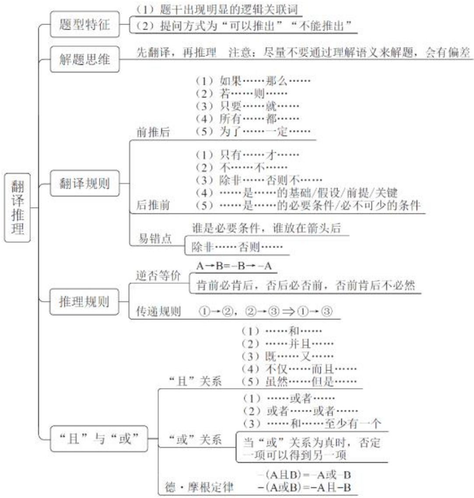
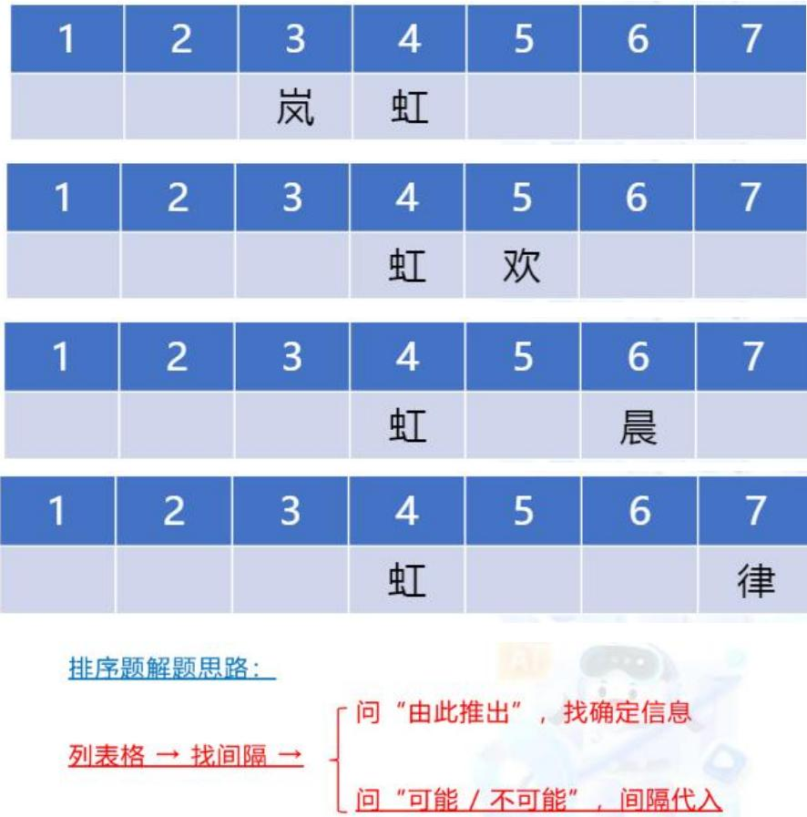
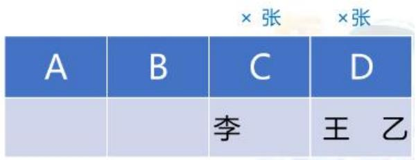
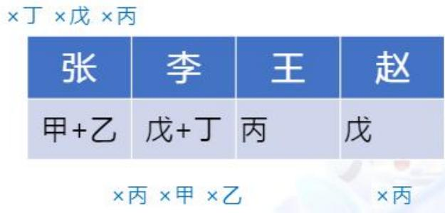
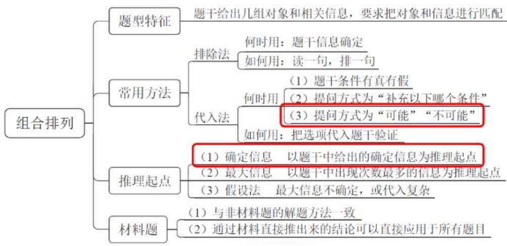
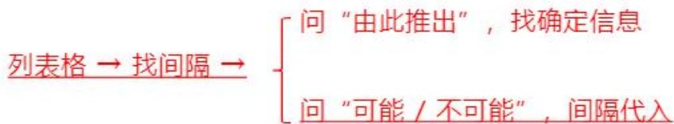

# 精讲精练-判断 8

（笔记）

主讲教师：徐来

授课时间：2025.04.18

# 精讲精练-判断8（笔记）

【注意】本节课主要讲解组合排列的单题，材料题下节课讲解。

# 01 翻译推理

# 六、推理规则之“德·摩根定律”

（1）-（A且B）  $= -\mathrm{A}$  或-B  
（2）-（A或B）  $= -\mathrm{A}$  且-B

“-”进去，“且”“或”互变

-（方便面且大盘鸡）=-方便面或-大盘鸡  
- (数量难或判断难) = -数量难且 -判断难

# 【注意】德·摩根定律：

1. 只在“且”“或”去括号时使用，如“-（A且B）=-A或-B”，即“-”进去，“且”“或”互换。  
2. 应用：如“-甲且-乙  $\rightarrow$  -丙”，已知“丙”，可得“-（-甲且-乙）”，“-”进去、“且”“或”互换，可得“甲或乙”。

# 3.练习：

(1) - (方便面且大盘鸡): “-” 进去, “且” 变 “或”, 可得 “- 方便面或 -大盘鸡”。  
(2) - (数量难或判断难): “-” 进去, “或” 变 “且”, 可得 “-数量难且-判断难”。

【例1】（2024江苏）一只鸟除非两翼健壮并以共同的力量来推动身体，否则它不能飞向天空。

根据以上陈述，可以推出以下哪些结论？

(1)一只鸟如果两翼健壮并以共同的力量来推动身体, 那么它能够飞向天空  
②一只鸟如果能够飞向天空，那么它两翼健壮并以共同的力量来推动身体  
(3)一只鸟若两翼不健壮或不能以共同的力量来推动身体, 那么它不能飞向天

空

(4)一只鸟如果不能飞向天空,那么它两翼不健壮或不能以共同的力量来推动身体

A. ①②

B. ②③

C. ③④

D. ②④

【解析】1. 题干出现“除非……否则不……”，后推前，“”翻译为“飞向天空  $\rightarrow$  两翼健壮且共同推动”。

(1) “如果……那么……”前推后，“两翼健壮且共同推动”是背后，背后无必然结论。  
(2) “如果”前推后，翻译为“飞向天空  $\rightarrow$  两翼健壮且共同推动”，肯前推背后。  
③ “若”前推后，翻译为“-两翼健壮或-共同推动  $\rightarrow$  -飞向天空”，提取“-”，可转换为“-（-两翼健壮且共同推动）  $\rightarrow$  -飞向天空”，否后必否前。  
(4) “如果”前推后，“-飞向天空”是否前，否前无必然结论。

综上，可以推出②③，选择B项。【选B】

【例 2】(2020 上海) 经过全力检测和排查, 省重大动物疫情监测中心的专家确定了如下事实:

（1）如果S村和Q乡出现了非洲猪瘟疫情，则X镇未出现；  
(2) X 镇出现了非洲猪瘟疫情, 而且有关 W 村的疫情监测报告是准确的;  
（3）只有W村的监测报告不准确，Q乡才未出现非洲猪瘟疫情。

根据以上陈述，可以得出下列哪项？

A. S 村没有出现非洲猪瘟疫情，Q 乡出现了  
B.S村和X镇都出现了非洲猪瘟疫情  
C. S 村出现了非洲猪瘟疫情，Q 乡未出现  
D.X镇和W村都出现了非洲猪瘟疫情

【解析】2. 翻译题干：

(1) “如果……则……”前推后，翻译为：S且  $\mathrm{Q} \rightarrow -\mathrm{X}$  。  
(2) “而且”表示“且”关系，翻译为：X且W准。

(3) “只有……才……”后推前，翻译为：-Q→-W准。

条件（1）“如果……则……”是假设，并不确定，包括条件（3）“只有……才……”也是假设；条件（2）的“且”关系是确定的，可作为确定事实，从条件（2）出发。

根据条件（2），“X”是对（1）中“-X”的否定，否后必否前，根据德摩根定律，可得“-S或-Q”；根据“W准”，对于条件（3）是否后，否后必否前，可得“Q”，排除C项。“Q”是对“-S或-Q”中一项的否定，否一推一，可得“-S”，选择A项。

注意 D 项中是 W 村有猪瘟, 题干是 W 村疫情监测报告准确。【选 A】

# 【注意】

1. “且”为确定结论，可从仅有“且”关系的条件入手。  
2. “ $\rightarrow$ ”“或/至少一个”为不确定结论。如“A或B”，不确定是否有A/B，故“或”关系是不确定的。

【例 3】(2023 联考) 某医院刘佳、郑毅、郭斌、丁晓、吴芳、施文 6 位医生拟报名参加 “一心向党, 健康为民” 进社区义诊活动, 已知下列情况为真:

（1）要么刘佳参加，要么郑毅参加；  
（2）只有吴芳参加，刘佳才参加；  
（3）如果郭斌和吴芳都参加，那么施文也会参加；  
（4）或者丁晓不参加，或者郭斌参加；  
（5）施文、丁晓至少有1人参加。

现施文确定无法参加，那么6位医生中最后参加义诊活动的是：

A. 刘佳、郭斌、丁晓

B. 郑毅、郭斌、丁晓

C. 郑毅、丁晓、吴芳

D. 刘佳、丁晓、吴芳

【解析】3. 翻译题干：

(1) “要么……要么……”二选一，翻译为：刘/郑。  
(2) “只有……才……”后推前，翻译为：刘→吴。  
(3) “如果……那么……”前推后，翻译为：郭且吴→施。

(4) “或者……或者……”是“或”关系，翻译为：- 丁或郭。  
(5) “至少有 1 人” 表示 “或” 关系, 翻译为: 施或丁。

已知“施文确定无法参加”，与“施文”相关的是条件（3）（5）；根据条件（3），否后必否前，可得“-（郭且吴）”，去括号可得“-郭或-吴”；根据条件（5），“或”关系否一推一，可得“丁”；“丁”是对条件（4）中“-丁”的否定，一项打×、另一项照抄，可得“郭”；“郭”是对“-郭或-吴”中一项的否定，另一项保留不变，可得“-吴”；“-吴”是对条件（2）的否后，否后必否前，可得“-刘”；结合条件（1），可得“郑”。

综上，参加义诊活动的有丁晓、郭斌、郑毅，选择B项。

答疑：“只能一个”也适用于否一推一，一个不存在、另一个必然存在。【选B】

【注意】“要么……要么……”与“或”关系不同，“要么A，要么B”是只有一个（只有1，没有同时成立的可能性），“或者A，或者B”的意思是至少一个（1或2）。

关于A、B的情况：

都有

A 且 B

都没有

-A且-B

至少一个

A或B

至多一个

-A或-B

只有一个

A/B

不都有

-(A且B)

-A或-B

不都没

-（-A且-B）

A或B

【注意】关于A、B的情况：

1.必学：

（1）A、B 都有：A 且 B。

（2）A、B都没有：-A且-B。  
（3）A、B至少一个：A或B。  
(4) A、B 至多一个: -A 或 -B。  
(5) A、B 只有一个（要么……要么……）：A/B。

2. 选学：

（1）A、B不都有：-（A且B）=-A或-B。  
（2）A、B不都没：-（-A且-B）=A或B。

【例4】（2023事业单位）某集团准备修建一个主题游乐园，满足以下关系：

（1）如果新主题游乐园要建在交通特别便捷的地方，那么它必须选址在靠近城市中心的位置；  
（2）如果这个主题游乐园想要发挥它出色的娱乐功能，那么它必须建成一个足以容纳绝大部分机动设备的庄园；  
（3）如果该主题游乐园既要选址在市中心，又要建成一个庄园，那么它的建造成本将会超过十亿元；  
(4) 但是根据集团财政预算, 这个主题游乐园的成本不能超过十亿元。

由此可以推出：

A. 新的主题游乐园不会建在交通特别便捷的地方并且也不会发挥它出色的娱乐功能  
B. 如果新的主题游乐园不建在交通特别便捷的地方, 那么就不能发挥它出色的娱乐功能  
C. 新的主题游乐园只有建在交通特别便捷的地方, 才能发挥它出色的娱乐功能  
D. 如果新的主题游乐园想要发挥它出色的娱乐功能, 就不能建在交通特别便捷的地方

【解析】4. 翻译题干：

(1) “如果……那么……”前推后，翻译为：交通便捷  $\rightarrow$  城市中心。  
(2) “如果……那么……”前推后，翻译为：娱乐功能  $\rightarrow$  庄园。  
(3) “如果……那么……”前推后，“既要……又要……”表示“且”关系，

翻译为：城市中心且庄园  $\rightarrow$  超十亿。

(4) - 超十亿。

从条件（4）开始推理，“- 超十亿”是对（3）的否后，否后必否前，可得“- (城市中心且庄园)”，去括号、“且”变“或”，可得“- 城市中心或- 庄园”，遇到“或”关系，大概率考否一推一，建议先不要看选项，先写出答案，即“城市中心  $\rightarrow$  - 庄园”，但没有答案，只能进一步推理。

“或”关系包含三种情况，第一种情况为“-城市中心”，第二种情况为“-庄园”，第三种情况为“-城市中心且-庄园”。第一种情况，结合条件（1），否后必否前，可得“-交通便捷”；第二种情况，结合条件（2），否后必否前，可得“-娱乐功能”；第三种情况，结合条件（1）（2），可得“-交通便捷且-娱乐功能”；三种情况对应“-交通便捷或-娱乐功能”的三种情况，因此“或”关系成立，大概率考否一推一，一项打×、另一项不变，可得“交通便捷→-娱乐功能”。

A 项：该项为“- 交通便捷且- 娱乐功能”，只是三种可能性之一，排除。  
B 项: “- 交通便捷” 对于题干结论是否前, 否前无必然结论, 排除。  
C项: “只有……才……”后推前, 翻译为 “娱乐功能  $\rightarrow$  交通便捷”, 题干应为 “娱乐功能  $\rightarrow$  - 交通便捷”, 排除。  
D 项: “如果……就……”前推后, 翻译为 “娱乐功能  $\rightarrow$  -交通便捷”, 逆否为 “交通便捷  $\rightarrow$  -娱乐功能”, 与题干结论一致, 当选。【选 D】

【补充】（2022广东）某高校调查本校学生的兴趣爱好后发现，喜欢打羽毛球的学生中，来自体育学院的学生一定喜欢登山。

体育学院  $\rightarrow$  登山？

根据以上条件，下列情况必定属实的是：

A. 甲喜欢打羽毛球和登山, 则甲是体育学院的学生  
B. 乙是体育学院的学生, 且喜欢登山, 则乙喜欢打羽毛球  
C. 丁不喜欢打羽毛球和登山, 则丁不是体育学院的学生  
D. 丙喜欢打羽毛球, 不喜欢登山, 则丙不是体育学院的学生

【解析】拓展.课堂正确率为  $65\%$  。题干不能翻译为“体育学院  $\rightarrow$  登山”，因为选项中还都提到了“羽毛球”，“喜欢打羽毛球的学生中，来自体育学院的学生”

表示“且”关系，翻译为“羽毛球且体育学院  $\rightarrow$  登山”；选项都是“则”，前推后。

A、B项：前面都有“登山”，是对题干的肯后，肯后无必然结论，均排除。  
D 项翻译为 “羽毛球且- 登山  $\rightarrow$  - 体育学院”; C 项中 “丁不喜欢打羽毛球和登山” 从字面上看, 如 “不喜欢程永乐和郭熙”, 指二人都不喜欢, 故 C 项翻译为 “- 羽毛球且- 登山  $\rightarrow$  - 体育”。  
C、D项都有“-登山”，“-登山”对于题干是否后，可得“-羽毛球或-体育学院”，“或”关系否一才能推一，对于题干，要有“-登山”和“羽毛球”才能得出“体育学院”，选择D项。【选D】

# 【注意】

1. “或”关系常考知识点——否  $1 \rightarrow 1$  ：一个打  $\times \rightarrow$  一个留下。  
2. 如“甲且乙  $\rightarrow$  丙”，否后必否前，可得“-丙  $\rightarrow$  -甲或-乙”，遇到“或”关系，一定考否一推一，此时根据“甲”可得“-乙”，即“-丙且甲  $\rightarrow$  -乙”，同理，可得“-丙且乙  $\rightarrow$  -甲”。

关于A、B的情况：

都有 A且B

都没有 -A且-B

至少一个 A或B

至多一个 -A或-B

只有一个 A/B

不都有 -（A且B）

-A或-B

不都没 -(-A且-B)

A或B

【注意】翻译推理总结：

1. 否一推一。  
2. 结合德摩根定律的否一推一。  
3. 关于 A、B 的情况：前 5 种必学，遇到概率大；后 2 种选学，遇到概率小。

# 02 组合排列

# 【注意】组合排列：

1. 考试过程中一定会遇到的题型, 如果考行政执法卷、地市级, 会有 5 道题;如果考副省级, 会以单题的形式考 1-2 题。  
2. 省考考 1 道题概率大, 江苏、浙江可能考得更多。

# 第二节 组合排列

例：甲、乙和丙，一位来自东京，一位来自巴黎，一位来自浪漫的土耳其。现在只知道：丙比东京人的年龄大，甲和巴黎人不同岁，巴黎人比乙年龄小。

你猜：甲、乙、丙分别来自哪里……

题型特征：

1. 两组及以上对象  
2. 对象之间的关系

# 【注意】组合排列：

1. 如例，是常见的组合排列题，像柯南的游戏，找凶手是谁。  
2. 题型特征：题干给出两组及以上对象，以及对象之间的关系，最终做信息的匹配。

# 一、排除法、代入法

1. 排除法：

读一句、排一句

例：甲、乙和丙，一位来自东京，一位来自巴黎，一位来自浪漫的土耳其。现在只知道：丙比东京人的年龄大，甲和巴黎人不同岁，巴黎人比乙年龄小。

由此可以推出：

A. 甲来自于巴黎，乙来自于东京，丙来自于土耳其

B. 甲来自于土耳其, 乙来自于巴黎, 丙来自于东京  
C. 甲来自于东京, 乙来自于土耳其, 丙来自于巴黎

（1）快速找到“谁是谁”  
(2) 快速确定 “谁不是谁”

# 【注意】

1. 排除法与代入法：答案是什么不重要，重要是知道为什么选择这个方法。  
2. 排除法：读一句，排一句。

（1）如例，根据“丙比东京人的年龄大”，不知道丙来自于哪，但可知“丙≠东京”，排除B项；根据“甲和巴黎人不同岁”，不知道甲来自于哪，但可知“甲≠巴黎”，排除A项，C项当选。  
(2) 解题思维: 题干信息不能确定 “谁是谁” 时, 要快速找到 “谁不是谁”。如甲在 1、2、3、4 中选择自己的位次, 已知甲选奇数, 只能知道是 1、3 中的一个, 但可以确定知道不是 2、4。

【例1】（2023重庆选调）三个小朋友坐成一排做游戏，坐在男生左边的两个人中至少有一个人是女生，坐在女生右边的两个人中恰好有一个也是女生，手持气球小朋友的右边两个人中至少有一个人手持鲜花，手持鲜花小朋友的左边两个人中也恰好有一个手持鲜花。

根据以上叙述，可以推出三个小朋友分别是：

A.手持气球的女生、手持气球的女生、手持鲜花的男生  
B.手持气球的女生、手持鲜花的男生、手持鲜花的男生  
C.手持气球的女生、手持鲜花的女生、手持鲜花的男生  
D.手持鲜花的女生、手持鲜花的女生、手持气球的男生

【解析】1. 根据“坐在男生左边的两个人中至少有一个人是女生”“坐在女生右边的两个人中恰好有一个也是女生”，可知男生在最右侧，左侧有2个女生，即“女、女、男”，排除B项。

根据“手持气球小朋友的右边两个人中至少有一个人手持鲜花”“手持鲜花小朋友的左边两个人中也恰好有一个手持鲜花”，可得“气、花、花”。

A项：气、气、花，排除。

D 项：花、花、气，排除。  
C 项: 气、花、花, 当选。【选 C】

# 【注意】

1. 题干确定+选项完整——优先排除法。  
2. 涉及大小比较（身高、体重、成绩、分数、名次）/性别——常考排除法。

【补充】（2019重庆选调）甲、乙、丙是大学同班同学。已知三人分别来自北京、上海、重庆，上海人年龄最大，丙的年龄比上海人小，重庆人比乙年龄大。

根据题干所述，可以推出以下哪项结论？

A. 甲是北京人，乙是重庆人，丙是上海人  
B. 甲是重庆人, 乙是北京人, 丙是上海人  
C. 甲是重庆人, 乙是上海人, 丙是北京人  
D. 甲是上海人, 乙是北京人, 丙是重庆人

【解析】拓展。题干涉及比较关系，喜欢用排除法。已知“上海人年龄最大”，出现“最大/最小”，常用排除法。根据“上海人年龄最大”，需要确定谁不是上海人；根据“丙的年龄比上海人小”，可知丙的年龄不是最大的；根据“重庆人比乙年龄大”，可知乙不是年龄最大的；所以丙、乙都不是上海人，排除A、B、C项，选择D项。

根据“丙的年龄比上海人小”，可得“丙  $<$  上海人，丙  $\neq$  上海人”，结合最值，可知“丙  $\neq$  最大的人，上海人  $\neq$  最小的人”。【选D】

# 【注意】

1. 题干确定+选项完整——优先排除法。  
2. 比大小的题目，最值（最大/最小）很重要，找“谁不最大/最小”，以此做排除。

【例 2】(2022 深圳)有蓝蓝、豆豆、毛毛三个男生, 他们各自有一个妹妹。已知: 三个妹妹分别是花花、贝贝、妞妞; 花花的哥哥是豆豆的好朋友, 并且在

三个男生中年纪最小；毛毛的年纪比妞妞的哥哥大。

由此可推知，三对兄妹分别是：

A. 蓝蓝和花花，豆豆和贝贝，毛毛和妞妞  
B. 蓝蓝和妞妞，豆豆和花花，毛毛和贝贝  
C. 蓝蓝和贝贝, 豆豆和妞妞, 毛毛和花花  
D. 蓝蓝和花花，豆豆和妞妞，毛毛和贝贝

【解析】2. 题干存在大小比较，已知“花花的哥哥是豆豆的好朋友，并且在三个男生中年纪最小”，可得“花哥=最小”，找“谁不最小”；根据“毛毛的年纪比妞妞的哥哥大”，可知“毛毛≠最小”，则毛毛一定不是花花的哥哥，排除C项。

根据“花花的哥哥是豆豆的好朋友”，可知花花的哥哥不是豆豆，排除B项；根据“毛毛的年纪比妞妞的哥哥大”，可知毛毛不是妞妞的哥哥，排除A项，选择D项。【选D】

【注意】比大小的题目，最值很重要。

2.代入法：

假设选项正确，代入题干验证是否符合题意

(1) 题干条件确定+选项完整优先排除; 题干条件不确定尝试代入

【注意】代入法:

1. 解题思维：假设选项正确，代入题干验证是否符合题意。  
2. 注意：不要所有题目都用代入法，有的题目代入甚至是错误答案。  
3. 题型特征：题干条件不确定尝试代入。

例1：甜品店有四种甜品：双皮奶、布丁、蛋糕和冰淇淋。B比A贵，C最便宜，双皮奶比布丁贵，蛋糕最贵，冰淇淋比D贵。

题干条件确定——优先排除

例 2：甲、乙、丙三人大学毕业后选择从事各不相同的职业：教师、律师、工程师。其他同学作了如下猜测：

小李：甲是工程师，乙是教师。

小王：甲是教师，丙是工程师。

小方：甲是律师，乙是工程师。

后来证实，小李、小王和小方都只猜对了一半。

题干条件不确定——优先代入

# 【注意】

1. 例 1: 题干没有说哪个条件是错的, 默认都是正确的, 就是题干条件确定。  
2. 例 2: “只猜对了一半”说明题干条件都是一对一错, 但不知道哪句对哪句错, 即题干条件有对有错, 就是题干条件不确定, 优先代入, 不能用排除。

【例3】（2024深圳）某地发生一起重大诈骗案，警方通过调查抓获五个犯罪嫌疑人。面对警方的讯问，五人的供述如下：

甲：“不是我，也不是丁。”

乙：“如果是我，那么丙就没参与诈骗。”

丙：“乙和丁中必有一人参与。”

丁：“只有甲参与了，戊才会参与诈骗。”

戊：“至少有三个人参与了此次诈骗。”

经证实，甲只说了一半真话，其他人说的都是真话，则罪犯是：

A. 甲、乙、戊

B.乙、丁、戊

C. 甲、丙、丁

D.甲、乙、丙、戊

【解析】3. 已知“甲只说了一半真话，其他人说的都是真话”，可知前面的话有对有错，但不知道谁对谁错，考虑代入法。梳理题干条件：

(1) 甲: -甲且-丁 (对一半)。  
(2) 乙: “如果……那么……”前推后, 翻译为“乙  $\rightarrow$  丙”。  
(3) 丙: 表述不清晰, 可写为 “乙或丁” 或 “乙/丁”。  
(4) 丁: “只有……才……”后推前, 翻译为 “戊→甲”。  
（5）戊：至少三人。

代入A项：如果有甲，条件（1）为一对一错；条件（2）（3）（4）（5）都满足，当选。

答疑：如果答案是 D 项，就代入 3 次，但即使设置在 D 项，A、B、C 项中都会有 1-2 个选项非常好代入，不会每个都很麻烦。【选 A】

【注意】题干信息有对有错：优先代入法。

【例4】（2023事业单位）樊、胡、凌三个人，一个在E区上班，一个在F区上班，一个在G区上班。赵、钱和孙并不知道他们每个人在哪个区上班，于是做了如下三种猜测：

赵：胡在G区上班，樊在E区上班；

钱：樊在F区上班，凌在G区上班；

孙：樊在G区上班，胡在F区上班。

后经证实，三个人都只猜对了一半。

由此可以推出：

A. 樊在 F 区上班，胡在 E 区上班，凌在 G 区上班  
B. 樊在 E 区上班，胡在 G 区上班，凌在 F 区上班  
C. 樊在 F 区上班, 胡在 G 区上班, 凌在 E 区上班  
D. 樊在 E 区上班, 胡在 F 区上班, 凌在 G 区上班

【解析】4. 赵、钱、孙每个人都说两句话，每个人都只猜对一半，意味着这些话中一对一错，但不知道哪句对哪句错，优先考虑代入法。

代入A项：赵说的“胡在G区上班，樊在E区上班”全错，不需要继续代入了，排除。

代入B项：赵说的“胡在G区上班，樊在E区上班”全对，不需要继续代入了，排除。

代入C项：赵说的“胡在G区上班”对了，“樊在E区上班”错误，符合一对一错；钱说的“樊在F区上班”对了，“凌在G区上班”错误，符合一对一错；孙说的“樊在G区上班”错误，“胡在F区上班”错误，两个全错，排除。

A、B、C项均排除，D项当选。

答案放在 D 项, 但 A、B 项只看第一句话即可排除, 即使答案在 D 项, 前面也不会太复杂。

通用性快速解法：每个人两句话，一对一错，解题技巧是在人或区域（樊、胡、凌或E、F、G）中找最小信息（只出现过一次的）假设。

“E区”只出现一次，假设“樊在E区上班”成立，则“胡在G区上班”错误，同理，既然樊在E区，则樊肯定不在F区、G区，即钱和孙前半句都错误，后半句都正确，正好每句话一对一错，且樊、胡、凌分别在不同区域，D项当选。

“凌”只出现一次，假设“凌在G区上班”正确，则“樊在F区上班”错误，既然凌在G，则胡和樊都不能在G区，即赵和钱的前半句都错误，后半句都正确，D项当选。

答疑：如果假设的“凌在 G 区上班”没有成立，则另一句话“樊在 F 区上班”成立。【选 D】

# 【注意】

1. 题干信息有对有错：优先代入法。  
2. 快速解题技巧：

（1）最小假设法：假设最小信息所在的话是对的，最小信息指出现一次的信息，如“凌”和“E区”都出现一次，假设谁都可以。  
(2) 题型特征: 每个人两句话, 且每句话一对一错, 找最小信息假设。

【例5】（2022上海）哥廷根大学的一位老师让五位留学生看校史上的五位大数学家的画像，让每位学生任意挑选两幅画像说出名字。

张说：“2号是高斯，3号是黎曼。”

倪说：“1号是希尔伯特，2号是闵可夫斯基。”

朱说：“3号是闵可夫斯基，5号是希尔伯特。”

韦说：“2号是高斯，4号是外尔。”

方说：“4号是外尔，1号是黎曼。”

老师发现每位学生都只说对了一半，那么1号画像是：

A. 黎曼

B. 闵可夫斯基

C. 希尔伯特

D. 高斯

【解析】5. 每个人说了两句话，且每句话一对一错，符合快速解题的题型特

征，在1-5或高斯、黎曼、希尔伯特、闵可夫斯基、外尔中找谁只出现一次（最小信息就是出现一次），人名不好找，“5号”只出现一次，假设“5号是希尔伯特”成立，根据朱的话，3号不是闵可夫斯基；根据倪的话，1号不是希尔伯特，2号是闵可夫斯基；根据张的话，2号不是高斯，则3号是黎曼；根据韦的话，2号不是高斯，则4号是外尔；根据方的话，4号是外尔，则1号不是黎曼，此时可得3号是黎曼、2号是闵可夫斯基、5号是希尔伯特、4号是外尔，则1号是高斯，选择D项。

快速做题方法局限定太强，只能是每个人两句话且一对一错的题可以用上述方法，代入法的通用性更强，快速方法只是速度快，但适用面比较小。

代入法：

代入A项：1号画像是黎曼，根据张的话，3号不是黎曼，2号是高斯；1号画像是黎曼，根据倪的话，1号不是希尔伯特，则2号是闵可夫斯基，此时2号既是高斯，又是闵可夫斯基，出现矛盾，排除。

代入B项：1号画像是闵可夫斯基，根据倪的话，2号不是闵可夫斯基，1号是希尔伯特，出现矛盾，排除。

5 个人对应 5 个画，是一一对应，2 号是闵可夫斯基时，3 号一定不是闵可夫斯基。

代入D项：1号画像是高斯，根据张的话，2号不是高斯，3号是黎曼；根据倪的话，1号不是希尔伯特，2号是闵可夫斯基；根据朱的话，3号不是闵可夫斯基，5号是希尔伯特；1号画像是高斯，根据韦的话，2号不是高斯，4号是外尔；根据方的话，4号是外尔，1号不是黎曼，完全符合题干，当选。

答疑：

(1) 不建议优先代入 D 项, 老师做题发现代入法的题选 A 项的概率更大。  
(2) 每个人都说两句话且一对一错, 这种特殊题型使用最小信息假设, 其他题干条件不确定、有对有错的题, 优先代入法。【选 D】

# 【注意】

1. 快速解题技巧——最小假设法。  
2. 题干信息有对有错：优先代入法。

【例 6】(2022 四川)甲、乙、丙、丁 4 位同学参加学校运动会。已知他们 4 人每人都至少获得 1 个奖项, 4 人获奖总数为 10 。关于具体获奖情况, 4 人还有如下说法:

甲：乙和丙获奖总数为5；

乙：丙和丁获奖总数为5；

丙：丁和甲获奖总数为5；

丁：甲和乙获奖总数为4。

后来得知，获得2个奖项的人说了假话，而其他人均说了真话。

根据以上信息，甲、乙、丙、丁4人具体的获奖数分别应是：

A. 2、3、2、3

B. 2、4、1、3

C. 2、2、2、4

D. 2、2、3、3

【解析】6. 已知“获得 2 个奖项的人说了假话，而其他人均说了真话”，题干有真有假，不符合每个人两句话且一对一错，考虑代入。

代入A项：甲、丙获得2个奖项，要求甲和丙是假话，所以甲说的“乙和丙获奖总数为5”是假话，但是选项乙和丙的总数确实是5，甲说的不是假话，排除。

代入B项：甲获得2个奖项，只需要让甲说假话，甲说“乙和丙获奖总数为5”，选项中乙和丙的获奖总数正好是5，甲说的不是假话，排除。

代入C项：甲、乙、丙都获得2个奖项，说明甲、乙、丙都说假话。甲说“乙和丙获奖总数为5”，选项乙和丙的获奖总数为4，甲说的是假话；乙说“丙和丁获奖总数为5”，选项丙和丁的获奖总数为6，乙说的是假话；丙说“丁和甲获奖总数为5”，选项甲和丁的获奖总数为6，丙说的是假话；丁说“甲和乙获奖总数为4”，选项甲和乙的获奖总数为4，丁说的是真话，完全符合要求，当选。

代入D项：保证甲、乙都说假话，但选项乙和丙的总数是5，甲说的不是假话，排除。

快速解题方法：结合选项。本题四个选项中甲永远是 2，所以甲的话一定不能成立，即乙和丙获奖总数等于 5 的选项都不对，A、B、D 项乙和丙的获奖总数都是 5，均排除，C 项当选。

丁从来没有得过2个奖，则丁一定说真话，所以甲和乙的获奖总数一定是4，A、B项一定不对，C、D项还需要再尝试。

答疑：有同学不理解“获得2个奖项的人说了假话”的意思，B项中甲获得2个奖，所以代入B项时要保证甲的话是假话。【选C】

# 【注意】

1. 可以结合选项做题。  
2. 有真有假，代入法。  
3. 代入法的例 3-例 6: 例 4 和例 5 是特殊题型, 即一对一错, 例 6 拓展了注意事项, 即结合选项, 例 3 是正常的做题方法。即使有快速做题方法, 即使结合选项快速做题, 但这样的题目可遇不可求, 结合选项也是注意事项, 会讲解, 但基础阶段不要总想着快, 要先学会, 足够熟练时, 一些选项的配合或特殊题型是顺其自然的, 这些是 “小零钱”, 最重要的是学会代入法这个 “大票”, 更多情况下用代入法才可以。

# 一、排除法、代入法

# 2.代入法：

假设选项正确，代入题干验证是否符合题意

(1) 题干条件确定优先排除; 题干条件不确定尝试代入  
（2）特殊问法考虑代入：

(1) “可能”“不可能”“符合”“不符合”  
(2) “补充/添加以下哪项可以推出”

# 【注意】

1. 题干条件不确定尝试代入。  
2. 所有的考试中，代入法更有可能考查：题干的问法为“可能（符合题干要求）/不可能（不符合题干要求）”，优先代入法。既然问“可能对”，意味着没有唯一答案，如果有唯一答案，一定会问“一定对的是或由此可知”，问“可能对”，意味着不是唯一正确的情况，即不一定能推出唯一情况；问“不可能”，即4个选项中有1个选项不可能，说明有3个选项可能，代入最多代入3次，推出必须

推出3个选项排除，所以代入更方便。

3. 问“需要补充以下哪项可以推出”，明确说明要补充下列的选项才能推理，直接代入。这种问法较少，上面的问法非常多。  
4. 题干条件不确定或者出现特殊问法才考虑代入法，其他题干不考虑代入法，所以代入法的使用有限制。

【例 7】(2021 新疆) 新学期某班级周一早上有四节课, 课程名称是语文、数学、英语、体育, 有甲、乙、丙、丁四名同学在讨论并猜测这四节课从第一节到第四节的排序:

(1) 甲: 语文、英语不相邻;  
（2）乙：数学与体育相邻；  
（3）丙：语文不在第一；  
（4）丁：英语在最后。

甲、乙、丙、丁四人中如果仅有一人的猜测不正确，由此不可能出现的排序是：

A. 数学、体育、语文、英语

B.数学、语文、体育、英语

C. 语文、英语、数学、体育

D.语文、数学、体育、英语

【解析】7. 已知“甲、乙、丙、丁四人中如果仅有一人的猜测不正确”，题干有对有错，不知道谁对谁错，为题干条件不确定，且问“不可能”，遇到这种问法，优先考虑代入法。

代入A项：顺序分别为数学、体育、语文、英语。语文和英语相邻，甲的猜测错误；数学与体育相邻，乙的猜测正确；语文不在第一，丙的猜测正确；英语在最后，丁的猜测正确，符合“只有一人的猜测不正确”，问“不可能”，排除。

代入B项：顺序分别为数学、语文、体育、英语。语文和英语不相邻，甲的猜测正确；数学和体育不相邻，乙的猜测错误；语文不在第一，丙的猜测正确；英语在最后，丁的猜测正确，符合题干，排除。

代入C项：顺序分别为语文、英语、数学、体育，语文和英语相邻，甲的猜测错误；数学和体育相邻，乙的猜测正确；语文在第一，丙的猜测错误，已经有2个错误，不用继续代入了，当选。

代入D项的情况依次是甲正确、乙正确、丙错误、丁正确。考场上选出答案直接结束，不需要代入D项。

代入法最大的好处不费脑子，逐一尝试即可，不用分析和推理，弊端是费时间，大家觉得慢是因为老师讲的慢，实际做题时比讲解快。遇到“不可能”的问法，考虑代入法。【选C】

【注意】题干信息有对有错+“不可能”: 优先代入法。

【例 8】(2024 事业单位) 某歌唱节目中, 虹、晨、欢、律、清、岚、栀七组选手按照抽签顺序进行演唱, 已知:

(1) 岚和清中间隔一组选手, 且岚在清前;  
（2）欢在晨前一个上场；  
（3）岚和欢中间隔了两组选手。

如果虹是第4个上场，那么下列说法可能正确的是：

A. 岐是第 3 个上场  
B.欢是第5个上场  
C.晨是第6个上场  
D. 律是第 7 个上场

【解析】8. 问“可能正确”，说明没有唯一情况，直接考虑代入法。本题是排序题，排序题在国考9年的材料题中有将近一半的年份考的是排序题，重点讲解排序题。本题是1-7的排序，先列简单的表格，写出1-7的数字即可，如果题干有信息，即“虹是第4个上场”，可以先填入。代入时，重点看题干的“间隔”，梳理题干：

（1）岚×清（用X或-表示间隔）。  
(2) 欢在晨前一个上场。  
(3) 有两种情况, 即岚  $\times \times$  欢/欢  $\times \times$  岚。

排序题间隔信息非常重要，因为占空多，且知道其中一个，另一个位置就知道了，建议优先代入与间隔的话相关的信息，条件（1）（3）提到“间隔”，且条件（1）（3）提到“岚、清、欢”，优先代入涉及“岚、清、欢”的选项。

代入A项：岚在3，根据条件（1)，清在5；根据条件（3），欢不能往前放，因为放不下，欢可以往后放在6；根据条件（2)，晨在7，3句话都满足，当选。

考场上选到 A 项即可结束。

代入B项：欢在5，根据条件（3），岚在欢后面放不下，岚只能往前放在2；根据条件（1），清和虹都在4，肯定不对，排除。

代入C项：晨在6，根据条件（2），欢在5；根据条件（3），岚在2；根据条件（1），清又放不下，排除。

代入D项比较费劲，需要代入很多种情况，因为题干没有提到律，而且最后怎么放都不行。【选A】

# 【注意】

1. 排序题的解题思路：列表格；间隔信息是重要的。

（1）问“由此推出”，先找确定信息开始推理，不能代入。  
(2) 问 “可能/不可能”, 优先找间隔代入。

2. 提问方式为“可能”：优先代入法。

【补充】（2019事业单位）小王邀请同学来家中做客，并准备了莲藕排骨汤、

干煸豆角、蓝莓山药、酸菜鱼、水煮牛肉、拔丝地瓜、啤酒鸭7道菜作为晚餐，现在小王需要根据同学们的喜好决定上菜顺序。已知：

（1）莲藕排骨汤和水煮牛肉中间需要间隔三个菜；  
(2) 干煸豆角和拔丝地瓜中间需要间隔三个菜, 且干煸豆角先上;  
(3) 蓝莓山药要么第一个上, 要么最后一个上;  
(4) 莲藕排骨汤在干煸豆角之后上。

根据上述信息，以下哪项可能为真？

A. 酸菜鱼第二个上

B. 干煸豆角第四个上

C. 莲藕排骨汤第四个上

D. 水煮牛肉第二个上

【解析】拓展. 本题是 1-7 的排序题, 要列表, 条件 (1) (2) 提到 “间隔”, 提问方式说明是代入, 从排骨、牛肉、豆角、地瓜开始代入, 不会从酸菜鱼开始代入, 从 A 项开始代入很麻烦。

代入B项：干煸豆角在4，根据条件（2），豆角和拔丝地瓜间隔3个菜，豆角先上，后面没有位置放拔丝地瓜，排除。

代入C项：莲藕排骨汤在4，根据条件（1），往前和往后都没有位置放水煮牛肉，排除。

代入D项：水煮牛肉在2，根据条件（1)，莲藕排骨汤在6；根据条件（2），让干煸豆角在1，则拔丝地瓜在5；根据条件（3)，蓝莓山药在7，此时排骨在豆角之后，没有问题，当选。

题干没有提到酸菜鱼，代入A项对解题没有任何帮助，所以代入与题干相关（最好与间隔相关）的选项更好做。

答疑：干煸豆角可以在3，如果干煸豆角在3，则蓝莓山药在1，放在哪里都行，只要符合题干要求就是可能成立的情况。【选D】

# 【注意】

1. 题干条件不确定，考虑代入。  
2. 注意：代入间隔信息。

# 二、推理起点

# 1. 确定信息：

题干中明确给出“谁=谁”的信息

【注意】排除和代入都不行，需要推理，首先在题干中找确定信息，即明确给出“谁=谁”的信息，从它出发做推理起点。如“A→B，B→C”，已知“-C”，“-C”就是确定信息，和上节课不冲突，做题思路一致，都是从确定信息开始推理。

【例1】（2021新疆兵团）小明根据明天的课程制定了预习计划，数学、语文、英语、政治、历史、地理、生物七科，每一科都要预习，但是预习的顺序必须符合如下要求：

(1) 预习地理之前要先预习英语, 预习这两科之间还要预习另外两科（生物除外）;  
（2）第一科或者最后一科预习政治；  
（3）第三科预习历史；  
（4）预习生物要在地理之前或者刚预习完地理之后。

如果小明首先预习英语，则可以确定他的预习顺序是：

A. 第二科预习语文

B. 第五科预习生物

C. 第五科预习地理

D. 第二科预习数学

【解析】1. 本题是 1-7 的排序题，条件（1）“英语 XX 地理（中间 2 科不能是生物）”是间隔信息。问“可能/不可能”，考虑代入；问“由此推出”，找确定信息推理。本题问“可以确定”，是“由此推出”，不能代入，要推理，确定信息是“第三科预习历史”“小明首先预习英语”，在表格中优先填上 1 是英语，3 是历史。

“英语”正好是间隔信息，根据条件（1），第4是地理；根据条件（2），第1是英语，则第7是政治。根据条件（4）“预习生物要在地理之前或者刚预习完地理之后”，地理之前只剩2，根据条件（1）可知英语和地理中间的2科不能是生物，所以生物不能在地理前，只能在刚刚预习完地理后，则生物在5，选择B

项。

2 和 6 是不确定的, 不确定谁是语文、谁是数学, 所以问 “可以确定” 时不能代入, 如果代入, A、D 项都对, 但实际上 A、D 项是不确定的, 因此问 “可能对”, 考虑代入; 问 “一定对”, 不能代入, 有可能是不确定的情况。

提问方式中添加的条件也是可以用的。【选B】

<table><tr><td>1</td><td>2</td><td>3</td><td>4</td><td>5</td><td>6</td><td>7</td></tr><tr><td>英语</td><td></td><td>历史</td><td>地理</td><td>生物</td><td></td><td>政治</td></tr></table>

排序题解题思路：

列表格  $\rightarrow$  找间隔  $\rightarrow$

问“由此推出”，找确定信息

问“可能/不可能”，间隔代入

【注意】排序题非常重要，问“可以推出/由此推出”，考虑推理；问“可能/不可能”，要代入。

【补充】（2017江苏）甲、乙、丙、丁、戊5人近期均到一座大型购物美食广场打工。她们打工的商家有家用电器店、服装店、药店、馄饨店、拉面馆，每人各去一家。每人开始打工的时间各不一样，分别是去年的3月、4月、5月、6月、7月。已知：

（1）甲是厨师，她在一家小吃店顺利找到工作；  
(2) 乙去了服装店,但她开始打工的时间比甲晚3个月;  
（3）丙与去家用电器店打工的人是同乡，5人中她开始打工的时间最晚；  
（4）丁比戊开始打工的时间早，她去的是药店。

根据以上信息，可以得出以下哪项？

A. 3月份甲开始到馄饨店打工  
B.5月份戊开始到家用电器店打工  
C. 6 月份丁开始到药店打工  
D. 7 月份丙开始到拉面馆打工

【解析】拓展.课堂正确率为  $34\%$  。本题是时间排序，先列3-7的时间排序，

建议先匹配时间先后顺序，而不是每个人在什么单位工作，因为排序题先把顺序排出来会更好做。问“可以得出”，肯定要从间隔信息和确定信息来推理。

确定信息为“甲是厨师（不知道去了馄饨店还是拉面店）、乙去了服装店、丙开始打工的时间最晚、丁去的是药房”，其中和时间先后顺序相关的是条件（3）“丙开始打工的时间最晚”，即丙在7；根据条件（2）“乙去了服装店，但她开始打工的时间比甲晚3个月”，“晚3个月”不是间隔3个月，间隔3个月是晚4个月，所以“晚3个月”是间隔2个月，即“甲XX乙”，所以甲在3、乙在6；根据条件（4）“丁比戊开始打工的时间早”，则丁在4、戊在5。

根据条件（2），乙在服装店；根据条件（4），丁去药店；根据条件（3）“丙与去家用电器店打工的人是同乡”，意味着丙不去家电，家电只能在甲和戊之中；根据条件（1）“甲去的是小吃店”，不知道甲去的是馄饨店还是拉面店，但知道甲一定不去家电，即“谁不是谁”的思维，因此家电只能是戊，所以戊5月份去家电，B项当选。

不知道甲和丙谁去馄饨店、谁去拉面店，选A、D项可能是代入法解题的，但本题问“可以得出”，不能代入。【选B】

<table><tr><td>3</td><td>4</td><td>5</td><td>6</td><td>7</td></tr><tr><td>甲</td><td>丁</td><td>戊</td><td>乙</td><td>丙</td></tr><tr><td></td><td>药店</td><td>电器</td><td>服装</td><td></td></tr></table>

# 【注意】

1. 排除思维很重要——谁≠谁。  
2. 建议复习 2017 江苏拓展题和 2019 事业单位拓展题(拔丝地瓜、水煮肉片)。

选项不完整——推理

选项完整——排除

A. 丙去了 A 社区

A. 小刚和小兰,小强和小红,小富和小美

B. 张去了 B 社区

B. 小刚和小美,小强和小兰,小富和小红

C. 甲去了 C 社区

C. 小刚和小美,小强和小红,小富和小兰

D. 王去了 D 社区

D. 小刚和小兰,小强和小美,小富和小红

# 【注意】

1. 关注选项，右侧选项称之为选项完整，因为每个选项都明确给出了所有的排列形式（所有情况），为选项完整；左侧选项中A项只提了丙，B项只提了张，C项只提了甲，D项只提了王，每个选项没有完整出现所有的情况，为选项不完整。

2. 题干条件是否确定：

(1) 题干条件不确定, 优先代入。

(2) 题干条件确定:

(1)选项完整，考虑排除。

(2)选项不完整，考虑推理。

3. 特殊问法比较常考，即问“可能/不可能”时，可以不考虑前面的情况，直接优先代入。

【例2】（2023广东）某街道计划将3名男性干部甲、乙、丙和3名女性干部张、李、王下沉至各个社区开展工作，可供选择的社区有A、B、C、D四个。已知：

(1)每人只能去一个社区。  
②凡是有男性去的社区就必须有女性去。  
(3)张去 A 社区或者 B 社区, 乙去 D 社区。

如果最终李去了 C 社区，则下列推论必然正确的是：

A. 丙去了 A 社区

B. 张去了 B 社区

C. 甲去了 C 社区

D. 王去了 D 社区

【解析】2. 选项不够完整，问“必然正确”，题干都是确定的，本题只能推理。题干明确给了两个信息，即“乙去D社区”“李去C社区”。简单列表，条件②“凡是……就……”涉及翻译推理，组合排列但凡涉及翻译推理的话，这句话

一定是关键, 条件②翻译为 “男  $\rightarrow$  女”, 李是女的, 乙是男的, 如果看 C 社区有女性, 是对条件②的背后, 肯后无必然结论, 不知道 C 社区是否有男性; D 社区有乙, 乙是男性, 肖前必背后, 可得 D 社区一定有女性。

因为“李去 C 社区”，不能是李去 D 社区；根据条件③“张去 A 社区或者 B社区”，则张不能去 C、D 社区，所以一定是王去 D 社区，选择 D 项。

如果条件②改为“所有有女性的社区都必须有男性”，此时就要从李出发，因为李是女性，C社区有女性，有女必须有男，所以C社区必须配上甲、乙、丙中的一个男的，而乙去不了，一定是甲和丙中的一个，需要看其他信息。

做题时，遇到题目有一句话需要翻译，画上重点，找肯前或否后，因为肯前必肯后，否后必否前，涉及翻译的句子一定是破题关键。

选项不完整，不能用排除法；问的是必然且信息确定，不能用代入法。结合有男就要有女的翻译推理的话所以从“乙去D社区”开始推理。【选D】

【注意】排除思维很重要——谁≠谁。

【例3】（2023事业单位）小张、小李、小王、小赵4名中学教师暑期各自携带家人旅游，每人前往甲、乙、丙、丁、戊中的2个城市旅行，小张与小李的旅行城市均不相同，但与小王和小赵均仅有1个城市相同，小李与小赵均去过戊市，只有小王去过丙市，小张没有去过丁市和戊市。

由此一定可以推出的是:

A. 小李去过乙市

B. 小李未去过乙市

C. 小王去过甲市

D. 小王未去过甲市

【解析】3. 问“一定可以推出”，题干都是对的，不能用代入法；选项不完整，没有出现所有的排列情况，只能推理。梳理确定信息，已知“小李与小赵均去过戊市”，填入表格，已知“只有小王去过丙市”，意味着除了小王之外的其他

人不能去丙，即张、李、赵都不能去丙，已知“小张没有去过丁市和戊市”，则小张没有去过丁、戊。

因为每个人要去2个地方，小张3个地方都去不了，总共5个地方，则张只能去甲、乙。选项没有涉及张，找和张相关的信息，根据“小张与小李的旅行城市均不相同”，则小李不能去甲、乙，根据上面可知小李甲、乙、丙都不能去，则小李只能去丁、戊，选项提到小李，选择B项。

因为“小王和小赵均仅有1个城市相同”，不知道戊相同，还是另外不知道的地方相同，不确定，没有必要管。

“只有小王去过”意味着别人去不了；做组合排列一定是顺藤摸瓜，推出张时，即使没有选项，也要顺着提到张的信息进一步往下推理。【选B】

# 【注意】解题思路：

1. 最特殊的：遇到“可能/不可能”，直接代入。  
2. 根据题干条件是否确定：

（1）题干条件确定：

(1)选项完整，考虑排除。

(2)选项不完整，考虑推理。

(2) 题干条件不确定，考虑代入。

3. 特殊：前 2 点考查的题量不大。

(1) 涉及大小比较，喜欢找最值排除。  
(2) 每个人两句话, 一对一错, 找最小信息假设。  
(3) 排序题: 列表+间隔信息。问 “由此推出”, 找确定结论开始推; 问 “可能/不可能”, 考虑代入, 结合间隔信息代入。

# 4. 注意：

(1) 如果题干涉及某个一句话是翻译的, 如翻译为 “甲  $\rightarrow$  乙”, 要么找甲,要么找 “-乙”, 即肯前或否后。  
(2) 做题时一定要注意做题的思路是顺藤摸瓜。

# 当堂检测

【测验题1】在某次国际会议上，每国有  $1 \sim 2$  名代表参会，参会代表没有多重国籍的人。其中，甲、乙、丙和丁四人分别来自英国、德国和美国3个国家。已知：

（1）甲、乙至少有 1 人来自英国；  
(2) 乙、丙至少有 1 人来自德国。

如果甲、丙、丁至少有 2 人来自英美两国，则下列哪项是不可能的？

A. 甲来自德国

B. 乙来自德国

C. 丙来自英国

D. 丁来自英国

【解析】1. 课堂正确率为  $58\%$  。问“不可能”，考虑代入法。设问中给出信息“甲、丙、丁至少有2人来自英美两国”，也要看。

代入A项：甲来自德国，根据条件（1)，乙一定来自英国；根据条件（2），乙是英国，则丙一定来自德国；甲和丙都来自德国，不符合“甲、丙、丁至少有2人来自英美两国”，为不可能的，当选。

看清提问方式，问“不可能”，直接代入，不要忽略设问中还有一个条件。【选A】

【测试题 2】甲、乙、丙、丁、戊、己、庚 7 人开会时坐成一排, 已知:

(1)乙在丙左边，间隔 2 人；  
②戊在丁右边，间隔3人；  
③庚在己左边，间隔1人；  
(4)甲在最左边;  
(5)戊不在最右边。

由此可知，己坐的位置是：

A. 左五

B. 左六

C. 左四

D. 左三

【解析】2. 课堂正确率为  $52\%$  。排序题，列出1-7；有3个“间隔”；问“由此可知”，肯定是推理。间隔的话比较多，梳理条件：

①乙XX丙。  
②丁 XXX 戊。  
(3)庚 X 己。  
(4)甲在最左边。  
(5)戊不在最右边。

条件②间隔的信息最多，占的空最大，以条件②为核心，根据条件⑤“戊不在最右边”，条件②占5个空，且1被占了，则丁在2、戊在6。再看间隔2人的条件，根据条件①，乙如果在3，丙和戊坐一起，所以乙一定在4、丙一定在7；根据条件③，庚在3、己在5，己在从左数第五个，选择A项。【选A】

排序题解题思路：

<table><tr><td>1</td><td>2</td><td>3</td><td>4</td><td>5</td><td>6</td><td>7</td></tr><tr><td></td><td></td><td></td><td></td><td></td><td></td><td></td></tr></table>

【注意】先找间隔人最多的条件更好填。

【测试题3】周末回家，女儿小楠向老妈提出建议：粉蒸肉和蒸排骨至多做一样；如果不做粉蒸肉，就做梅菜扣肉或清炖肉。梅菜扣肉和清蒸鳜鱼至少做一样。结果，老妈做了蒸排骨，没有做清炖肉。

据此，可以推出：

A. 老妈做了梅菜扣肉

B. 老妈没做梅菜扣肉

C. 老妈做了清蒸鳜鱼

D. 老妈没做清蒸鳜鱼

【解析】3. 课堂正确率为  $84\%$  。翻译题干：

(1) “至多一样” 翻译为 “-A或-B”, 翻译为: -粉蒸肉或-蒸排骨。  
(2) “如果……就……”前推后, 翻译为: -粉蒸肉  $\rightarrow$  梅菜扣肉或清炖肉。  
(3) “至少一个” 翻译为“或”关系，翻译为：梅菜扣肉或清蒸鳜鱼。

已知“老妈做了蒸排骨，没有做清炖肉”，从“蒸排骨”和“清炖肉”入手，已知“蒸排骨”，条件①“或”关系否定其中一项，另一项不变，可得“-粉蒸肉”，也可以从字面理解；“-粉蒸肉”根据条件②，可以推出“梅菜扣肉或清炖肉”，已知“-清炖肉”，可得“梅菜扣肉”，A项当选。

不知道“清蒸鳜鱼”做没做。本题不翻译按照语义解题没有问题，但建议练习一下翻译的题。【选A】

【注意】至多翻译为“-A或-B”，至少翻译为“A或B”。

【答案汇总】

德·摩根定律 1-4: BABD

排除法与代入法 1-5: CDADD; 6-8: CCA

推理起点之确定信息 1-3: BDB

遇见不一样的自己

Be your better self