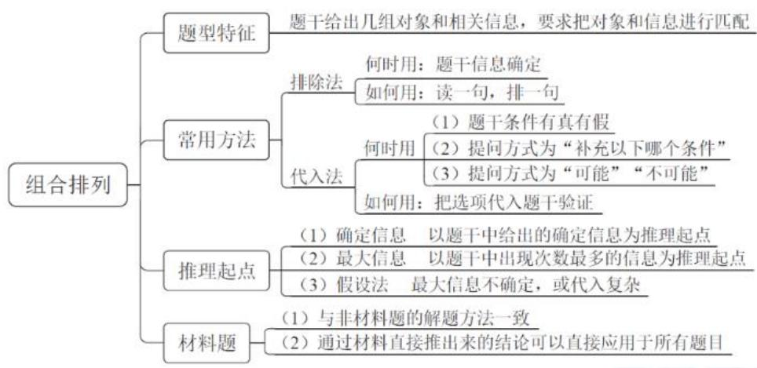

# 精讲精练-判断9

(讲义+笔记)

主讲教师：徐来

授课时间：2025.04.19

# 精讲精练-判断9（笔记）

# 二、推理起点

1. 确定信息：

题干中明确给出“谁=谁”的信息

2. 最大信息：

题干中出现次数最多的信息

【注意】推理起点：

1. 确定信息：题干中明确给出“谁=谁”的信息。
2. 最大信息（重点）：有的题目没有给出确定信息，选项不完整，无法排除，考虑找最大信息。

（1）用最大信息解决的题目的平均正确率不高，说明这个方法很多同学会忽略，建议将这个知识点设置为重点。
(2) 理论上: “最大信息”即题干中出现次数最多的信息。比如甲、乙、丙,山东、河南、天津, 数人和地点谁出现的次数最多即可, 找的是两组或三组需要匹配的信息中, 谁出现的次数较多, 找 “年龄” 是没用的。
（3）出现次数多的词语（6句话有3句都提到），与这个词关联的信息多，则由此推理可以得出更多的结论。

【例1】（2023辽宁）某公司正在开展招聘活动，拟招聘出纳、采购、网管、销售4种岗位，经过层层筛选，从应聘者中挑出甲、乙、丙、丁4人。已知，每人只选择一种岗位应聘，且每种岗位都有其中一人应聘。另外，还知道：

（1）如果丁应聘网管，那么甲应聘采购；
（2）如果乙不应聘出纳，那么甲应聘出纳且丙应聘销售；
（3）如果乙应聘出纳，那么丙应聘销售，丁也应聘出纳。根据以上陈述，可以得出以下哪项？

A. 甲应聘采购岗位

B. 乙应聘网管岗位

C. 丙应聘出纳岗位

D.丁应聘销售岗位

【解析】1. 题干条件确定，选项不完整（不是每个选项都出现甲乙丙丁），

需要进行推理；4个人对应4个岗位，没有谁就是干什么工作的确定信息，找最大信息。4个人都出现两次，“出纳”出现4次，是最大信息，据此入手推理。

条件涉及翻译，找肯前必肯后、否后必否前。

结合条件（3），乙是出纳，则丁也是出纳，已知“每人只选择一种岗位应聘，且每种岗位都有其中一人应聘”，出现矛盾，故“乙出纳”是不可能，得到必然结论“-乙出纳”。“-乙出纳”是对条件（2）的肯前，肯前必肯后，得到“甲出纳”，“丙销售”，得出结论，先尝试排除选项，排除A、C、D项，选择B项。

如果继续推理，“甲出纳”是对条件（1）的否后，否后必否前，得到“-丁网管”，甲、丙已经确定，则只能是“乙网管”，故得到“丁采购”。【选B】

【例 2】（2022 联考）甲、乙、丙、丁四位同学正在商量小组作业的分工，他们当中一个人负责宣传资料，一个人负责收集素材，一个人负责写发言稿，一个人负责录制短视频。已知：

(1)乙不负责宣传资料，也不负责写发言稿；
(2)甲不负责宣传资料，也不负责录制短视频；
(3)丁不负责写发言稿，也不负责录制短视频；
(4)丙不负责录制短视频，也不负责宣传资料；
(5)如果甲不负责写发言稿,那么丁不负责宣传资料。那么负责收集素材的是:

A. 甲

B. 乙

C. 丙

D. 丁

【解析】2. 题干是确定信息，选项不完整，只能考虑推理，没有确定信息，考虑找最大信息。“宣传”是最大信息（5句话有4句提到），据此入手推理。

结合条件①②④，乙、甲、丙都不是宣传，一共4个人，则只能丁是宣传。“丁宣传”是对条件④的否后，否后必否前，得到“甲写发言稿”，得到结论，先尝试排除选项，搜集素材的一定不是丁、甲，排除A、D项。

结合条件④，丙不是短视频、宣传资料，发言稿是甲，故丙只能是搜集素材，对应C项。

如果继续推理，可以得到乙是短视频。【选 C】

【例3】（2023事业单位）夏日炎炎，甲、乙、丙、丁各喝了一种饮品，分别是奶茶、果茶、气泡水、咖啡。已知：

①甲没喝奶茶，也没喝咖啡；
(2)乙没喝奶茶，也没喝气泡水；
(3)如果甲没喝气泡水, 那么丙没喝奶茶;
(4)丁既没喝奶茶，也没喝咖啡。

根据以上陈述，可以推出：

A. 甲喝果茶, 丁喝气泡水
B. 丙喝气泡水，丁喝果茶
C. 丁喝果茶, 甲喝气泡水
D. 乙喝气泡水，丙喝咖啡

【解析】3. 选项不完整（没有同时说甲乙丙丁），题干条件确定，需要进行推理。题干没有提到谁一定喝什么，没有确定信息，考虑找最大信息，“奶茶”出现4次，是最大信息，据此入手推理。

结合条件①②④，甲、乙、丁都没喝奶茶，故只能是丙喝奶茶，排除B、D项。“丙奶茶”是对条件③的否后，否后必否前，得到“甲气泡水”，排除A项，对应C项。

如果继续推理，奶茶和气泡水都确定了，甲、丙都确定了，结合条件④，丁不喝咖啡，则丁只能是果茶，乙只能是咖啡，对应C项。

答疑：有同学根据题干直接使用排除法做题，但本题的选项不完整，没有那么多要求，很难在题干中找到矛盾点。所以当选项不完整时，能排除出唯一答案的可能性非常小，因此，当选项完整时，才优先考虑排除法，当选项不完整时，优先考虑推理。【选C】

【例4】（2022江苏）甲、乙、丙是好朋友，一个住在城东，一个住在城南，一个住在城西。三人相约到城北的射箭场比拼射箭技术，结果住在城南的比丙得分低，甲比住在城东的得分高，乙和住在城南的得分不同。

根据以上陈述，可以推出以下哪项？

A. 甲住城西，乙住城东

B. 乙住城东，丙住城西

C. 乙住城南，丙住城西

D. 甲住城南，丙住城东

【解析】4. 甲乙丙匹配 3 个地方, 选项只给出 2 组, 需要补充另一组, 才能

进行排除，且无法排除出唯一答案；本题选项不完整，还是需要进行推理，不建议使用排除法。没有确定信息，考虑找最大信息，“城南”出现2次，是最大信息，据此入手推理。

已知“住在城南的比丙得分低”“乙和住在城南的得分不同”，说明城南不是乙、丙，故住在城南的一定是甲，排除A、C项。

结合“住在城南的比丙得分低”“甲比住在城东的得分高”，说明丙  $>$  甲（城南）  $>$  （城东），括号内还差城西，括号外还差乙，整理为“丙（城西）  $>$  甲（城南）  $>$  乙（城东）”，对应B项（不要根据“甲城南”直接选择D项）。【选B】

# 【注意】

1. 选项不完整要推理，没有确定信息，找最大信息。
2. 只要没有说明“信息有对有错”，都默认题干信息确定。

【例 5】(2024 事业单位)甲、乙、丙 3 名运动员, 其中 2 名男性, 1 名女性; 1 名是羽毛球运动员, 1 名是排球运动员, 1 名是长跑运动员。已知:

(1)甲不是女性, 他与长跑运动员年龄不同;
②羽毛球运动员的年龄比丙大；
(3)乙比长跑运动员年龄小。

由此可以推断：

A. 排球运动员年龄最小
B. 甲不是羽毛球运动员
C. 长跑运动员不是女性
D. 男性运动员的平均年龄比女性运动员大

【解析】5. 题干信息确定，选项不完整，需要进行推理，题干没有确定信息，考虑找最大信息，“长跑”出现2次，是最大信息，据此入手推理。

结合条件①③，甲、乙都不是长跑，故只能丙是长跑。结合条件②③，得到“羽毛球>长跑（丙）>(乙)”，括号内还差甲，括号外还差排球，整理为“羽毛球（甲）>长跑（丙）>排球（乙)”。

A项：排球最小，当选。

B 项：甲是羽毛球，排除。
C 项: 已知 “甲不是女性”, 则甲是男性, 但不知道乙、丙的性别, 无法推出, 排除。
D 项：乙、丙的性别无法确认，故无法推出，排除。【选 A】

【注意】建议4个人以上时再列表，或者材料题再列表（一个表可以用好几个题目，比较划得来）。

【例 6】（2023 重庆选调）小赵、小钱和小孙或是公务员，或是大学教师，或是医生。他们分别毕业于重庆大学、四川大学和西南政法大学。通过联谊活动，四川大学毕业者认识了小赵和小钱。公务员祝贺四川大学毕业者获评高级职称。教师邀请西南政法大学毕业者参加调研课题。四川大学毕业者找教师咨询招生事宜。小赵与重庆大学毕业者联名出版了一本专著。

根据以上叙述，可以推出：

A. 小钱毕业于西南政法大学
B. 小钱是大学教师, 小孙是医生
C. 小赵毕业于重庆大学, 是公务员
D. 小孙毕业于四川大学, 是大学教师

【解析】6. 题干条件确定，选项不完整，考虑推理。没有确定信息，找最大信息，“四川大学”出现次数最多，是最大信息，据此入手推理。但本题字数很多，且不是一行一行给出条件，所有条件都连在一起写，在真正的考场上，很难看得出谁是最大信息。

先按照顺序梳理题干，已知“四川大学毕业者认识了小赵和小钱”，则四川大学≠赵+钱，只有3个人，故四川大学=孙（不能直接选择D项，因为不知道是不是大学教师）；已知“公务员祝贺四川大学毕业者获评高级职称”，则四川大学≠公务员；已知“教师邀请西南政法大学毕业者参加调研课题”，则西南政法≠教师；已知“四川大学毕业者找教师咨询招生事宜”，则四川大学≠教师；已知“小赵与重庆大学毕业者联名出版了一本专著”，则重庆大学≠小赵。

此时自然可以看出来“四川大学”是最大信息，前面得出四川大学=孙，已

知四川大学不是公务员、教师，则四川大学=孙=医生，排除D项。不能根据“孙=医生”直接选择B项，因为不知道小钱是否为大学教师。

已知西南政法不是教师，则西南政法只能是公务员；重庆大学不是小赵，小孙是医生，则重庆大学只能是小钱；则西南大学是小赵；故重庆大学是教师。得到所有信息，四川大学=孙=医生，重庆大学=教师=钱，西南政法=公务员=赵，对应B项。【选B】

【注意】有同学根据“高级职称”做题，但医生和老师都有高级职称，无法得出答案。建议要么用方法做题，要么常识特别确定时再用常识做题。

根据提问方式看是否优先用代入法——“可能”“不可能”/“符合”“不符合”

【上节课例 7】由此不可能出现的排序是:

【上节课例8】那么下列说法可能正确的是：

【上节课补充】根据上述信息，以下哪项可能为真？

【上节课测验1】则下列哪项是不可能的？

根据选项特征看是否要推理——选项不完整，推理起点：确定信息/最大信息

【例1】

A. 甲应聘采购岗位

B.乙应聘网管岗位

C. 丙应聘出纳岗位

D. 丁应聘销售岗位

【例2】

A.甲

B. 乙

C. 丙

D. 丁

【例3】

A. 甲喝果茶，丁喝气泡水

B. 丙喝气泡水，丁喝果茶

C. 丁喝果茶, 甲喝气泡水

D. 乙喝气泡水, 丙喝咖啡

【例4】

A. 甲住城西，乙住城东

B. 乙住城东，丙住城西

C. 乙住城南，丙住城西

D. 甲住城南，丙住城东

【例5】

A. 排球运动员年龄最小

B. 甲不是羽毛球运动员

C. 长跑运动员不是女性

D. 男性的平均年龄比女性大

【例6】

A. 小钱毕业于西南政法大学

B. 小钱是大学教师，小孙是医生

C. 小赵毕业于重庆大学, 是公务员

【注意】提高做题速度：最好的方法就是大量练习。

1. 快速识别：问“可能”“不可能”/“符合”“不符合”，考虑代入法。
2. 选项不完整是，找推理起点：确定信息/最大信息。

# 二、推理起点

1. 确定信息：

题干中明确给出“谁=谁”的信息

2. 最大信息：

题干中出现次数最多的信息

3. 假设法：

根据确定信息、最大信息推不出更多结果

【注意】假设法：题目需要推理，但确定信息、最大信息无法推出更多结论，在没有办法时，考虑假设法。

【例 7】（2022 青海）某超市对甲和乙两种饮料进行特价促销，促销时间为周三到周六共 4 天。活动结束后发现，每天饮料销售数量均为整箱，甲饮料每天的销售量为 1 到 4 箱不等，乙饮料每天的销售量为 1 至 5 箱不等，且销售量还符合以下规律：

(1)甲饮料每天销售的量并不相同, 乙也如此;
(2)甲、乙销售数量总和随着日期推移每天增加 1 箱;
③星期三销售了 3 箱甲饮料, 星期四销售了 1 箱甲饮料, 星期六销售了 5 箱乙饮料。由此可以推出:

A. 星期三甲、乙共销售了 4 箱
B. 星期四甲、乙共销售了 6 箱
C. 星期五甲、乙共销售了 8 箱
D. 星期六甲、乙共销售了 10 箱

【解析】7. 题干信息确定，选项不完整，考虑推理。存在周三～周六的时间先后顺序，考虑列表整体信息。条件③给出确定信息，星期三销售了3箱甲饮料，星期四销售了1箱甲饮料，星期六销售了5箱乙饮料，填入表格。无法继续推理得出结论，考虑假设法。

已知“甲饮料每天的销售量为1到4箱不等”“甲饮料每天销售的量并不相同，乙也如此”，甲的周三、周四分别是1、4，则甲的周五、周六要么是2、要么是4，甲处于二选一的情况，考虑据此进行假设。

假设“甲周五2、周六4”。周六卖了9箱，已知“甲、乙销售数量总和随着日期推移每天增加1箱”，则周五甲乙一共卖8箱，甲卖2箱，则乙卖6箱，不符合“乙饮料每天的销售量为1至5箱不等”，假设不成立，故另一种情况必然成立。

一定是“甲周五 4、周六 2”，周六甲乙一共卖 7 箱，则周五～周三分别是 6、5、4，结合甲的情况得到乙周五～周三分别是 2、4、1，对应 A 项。【选 A】

<table><tr><td></td><td>三</td><td>四</td><td>五</td><td>六</td></tr><tr><td>甲</td><td>3</td><td>1</td><td>4</td><td>2</td></tr><tr><td>乙</td><td>1</td><td>4</td><td>2</td><td>5</td></tr></table>

【例8】（2024联考）某单位由于工作需要，本周六必须安排赵、钱、孙、李、周、吴、郑7名工作人员值班，每个人都要值半天班，上午安排4人一起值班，下午安排3人一起值班。值班人员的分配满足下列条件：

（1）赵和孙不在一起值班；
（2）周和孙不在一起值班；
（3）如果郑在下午值班，那么赵和李也在下午值班；
（4）或者钱在上午值班，或者郑在下午值班。

根据以上信息，必须在上午值班的工作人员是：

A.钱和郑

B. 赵和郑

C. 赵和周

D. 吴和孙

【解析】8. 题干信息确定，选项不完整，需要进行推理。没有确定信息，考虑找最大信息，孙、郑、赵都出现两次，最大信息太多，不好用；条件（3）涉及翻译推理，据此入手推理。

条件（3）“如果……那么……”前推后，翻译为：郑下午  $\rightarrow$  赵下午且李下午，找肯前、否后。否后是两个人，肯前是一个人，优先假设肯前。

假设郑下午，则下午是郑、赵、李，上午是钱、孙、周、吴，与条件（2）矛盾，故假设不成立，所以郑一定不在下午，故郑一定在上午。

得到“郑上午”，找与郑相关的信息（顺藤摸瓜），结合条件（4）“或者钱在上午值班，或者郑在下午值班”，已知郑在上午，不能在下午，否一推一，得到钱一定在上午，故在上午的是郑和钱，对应A项。【选A】

【注意】涉及翻译的句子很重要，找肯前/否后来破题。

题干中涉及翻译的句子很重要——找肯前/否后

1. 根据肯前推肯后/否后推否前

【例 2】如果甲不负责写发言稿, 那么丁不负责宣传资料

【例 3】如果甲没喝气泡水, 那么丙没喝奶茶

2. 根据肯前/否后进行假设，找矛盾

【例 1】如果乙应聘出纳，那么丙应聘销售，丁也应聘出纳。

【例 8】如果郑在下午值班，那么赵和李也在下午值班。

3. 根据肯前/否后，找关键信息

【上节课例 2】3 名男性干部甲、乙、丙和 3 名女性干部张、李、王

(2)凡是有男性去的社区就必须有女性去。男  $\rightarrow$  女

(3)张去 A 社区或者 B 社区, 乙去 D 社区。

【注意】题干中涉及翻译的句子很重要——找肯前/否后：

1. 根据肯前推肯后、否后推否前。如例 2、例 3 都是否后推否前。
2. 根据肯前/否后进行假设，找矛盾。如例 1, “出纳” 是最大信息，假设 “乙出纳”, 得到 “丁出纳”, 出现矛盾, 故 “-乙出纳”。例 1、例 8 可以放在一起复

习。

3. 根据肯前/否后，找关键信息。如上节课例 2，已知“男  $\rightarrow$  女”，结合“男”的肯前来破题。

【例 9】(2022 江苏)某单位准备从甲、乙、丙、丁、戊、己六人中择优录取数名技术人员, 录用情况符合如下条件:

（1）丙和丁恰有一人被录取；
(2) 甲和乙至少有一人被录取;
（3）甲和丁恰有一人被录取；
（4）录取乙当且仅当录用丙；
（5）甲、戊、己中恰有两人被录用；

根据上述信息，可以推出最终录用的人数为：

A. 2

B. 3

C. 4

D. 5

【解析】9. 选项不完整，只能考虑推理。没有确定信息，找最大信息，“甲”是最大信息，但无法继续推理出结论，考虑假设最大信息，假设有甲、没甲（只有这两种情况）。

假设有甲，结合条件（2），不知道有没有乙；结合条件（3），有甲、则没丁；结合条件（5），有甲、则有戊、己二选一；结合条件（1），没丁，则有丙；结合条件（4），有丙、则有乙，此时每句话的条件都满足，数人数，录取的有甲、戊/己、丙、乙，共4个人。胆子大可以直接选择C项（问最终录用的人数，下一种情况要么是4、要么是不成立；如果下一种情况是5，则本题没有答案，无法选择）。

假设没甲，结合条件（2），没甲、则有乙；结合条件（3），没甲、则有丁；结合条件（5），没甲、则有戊、己；结合条件（1），有丁、则没丙；结合条件（4），有乙、则有丙。同时得到“有丙”“没丙”，出现矛盾，故假设不成立。【选C】

# 【注意】

1. “当且仅当”代表充要条件（“当”是如果，“仅当”是只有，既可以前推

后、也可以后推前), (4) 代表丙  $\rightarrow$  乙, 同时乙  $\rightarrow$  丙, 不建议写为 “丙  $=$  乙”, 二者是互推关系, 不是划等号, 可以乙、丙都有, 也可以乙、丙都没有。比如现在要选择粉笔最帅的男老师, 已知 “徐来当且仅当永乐”, 代表 “徐来  $\rightarrow$  永乐” “永乐  $\rightarrow$  徐来”。

2. 假设有乙、没乙也能做出来，但本题讲解假设“有甲、没甲”，因为“最大信息假设”的适用面是最广的。如果本题假设“乙”，也可以假设“丙”、假设“丁”，可能性就太多了，不能每道题都随意挑一个来假设，这样做题没有普适性，所以建议从最大信息开始假设，因为涉及的信息最多，最好推出结果。
3. 答疑：有同学考虑根据“3个恰好”来做题，但这样做题不太好，因为还涉及其他人。比如条件（1）说恰好丙、丁一人，条件（3）说恰好甲、丁一人，可能是同一个人“丁”，再根据条件（5）甲、戊、己恰好两人，无法得出有4人录用。

# 4. 假设法:

（1）最大信息无法推理时，假设最大信息。
(2) 涉及翻译: 假设肯前/否后 (哪个简单假设哪个, 比如甲 1 或乙  $1 \rightarrow$  丙  $\neq 2$ , 假设否后比较简单)。
(3) 只有两种情况、二选一时，考虑假设法。

【补充】（2023 深圳）小鲍有 5 双鞋，分别是篮球鞋、滑板鞋、牛津鞋、凉鞋和拖鞋，他这周（周一至周日）每天早出晚归，出门时都会从中选择 1 双穿着，已知：

（1）小鲍本周穿了两次篮球鞋，穿着时间相隔3天；
(2) 本周穿了一次牛津鞋, 时间在第一次穿篮球鞋的前一天或后一天;
(3) 本周穿了一次滑板鞋, 时间在第二次穿篮球鞋之前;
（4）穿凉鞋的时间与本周第一次穿篮球鞋相隔4天；
（5）第一次穿篮球鞋之前穿过拖鞋。

根据以上陈述，可以推出的结论是：

A. 小鲍周一穿篮球鞋

B. 小鲍周三穿牛津鞋

C. 小鲍周四穿拖鞋

D. 小鲍周五穿滑板鞋

【解析】拓展。看到“周一至周日”，第一反应是列表。看提问方式，问“可以推出的结论是”，不能代入，考虑推理。条件中出现了“相隔”，间隔的信息很重要，题干中没有出现确定信息，但很明显给出了最大信息，即“第一次穿篮球鞋”（“穿了两次篮球鞋”也包含了“第一次穿篮球鞋”）。

条件（1）可以梳理为“篮 XXX 篮”；条件（4）不能整理为“凉 XXXX 篮”，因为要穿两次篮球鞋，表格放不下，所以条件（4）可以梳理为“篮 XXXX 凉”，条件（4）占了 6 格，且根据条件（5），“拖篮 XXX 篮凉”需要占 7 个格子，则只能是第二天和第六天篮球鞋，第七天凉鞋，第一天拖鞋。

结合条件（2），第一次篮球鞋前一天不行，则牛津鞋只能在第三天，根据条件（3），不确定滑板鞋在第四天还是第五天。综上，只能推出B项。【选B】

<table><tr><td>1</td><td>2</td><td>3</td><td>4</td><td>5</td><td>6</td><td>7</td></tr><tr><td>拖鞋</td><td>篮球鞋</td><td>牛津鞋</td><td></td><td></td><td>篮球鞋</td><td>凉鞋</td></tr></table>

# 三、材料题

1. 与非材料题解题方法一致——一则材料、多种技巧
2. 通过材料直接推出来的结论可以直接应用于所有题目

☆国考地市级近9年连续考查该题型

☆国考行政执法类近4年连续考查该题型

# 【注意】材料题：

1. 考频：国考地市级近9年连续考查该题型，国考行政执法类近4年连续考查该题型，基本上考查地市级和行政执法题都会遇到。
2. 与非材料题解题方法一致——一则材料、多种技巧。曾经出现过一年的5道题全是代入法的情况。目前只有国考地市和行政执法考查一拖五，有几个省份考查一拖二，现在黑龙江和吉林不太会考查一拖二，因为参加了联考，但江苏和浙江，尤其是江苏还是可能考查，可能考查一拖二或者一拖三。
3. 通过材料直接推出的结论可以应用于所有题目, 建议材料题先整理材料内容, 再去看每一道小题。

(2022 江苏) 根据所给材料, 回答下列问题。

甲、乙、丙、丁4人为室友，来自江苏、浙江、湖南、湖北，毕业时都考上了研究生，录取她们的有师范大学、医科大学、财经大学、农业大学，已知：甲考上的不是农业大学，考上农业大学的是江苏人，丙考上了师范大学，丁是湖北人。

【注意】整理材料：4个人来自4个地方、4个大学，要求人和大学一一对应，且是材料题，可以考虑列表，列一次表可以适用后面所有题目。如果是连线，建议把人写中间；列表的时候建议把人写在最左侧，省份和大学写在横行，如图所示，先把确定信息整理出来。

江苏  $=$  农业大学

<table><tr><td></td><td>省份</td><td>大学</td></tr><tr><td>甲</td><td></td><td>一农业</td></tr><tr><td>乙</td><td></td><td></td></tr><tr><td>丙</td><td></td><td>师范</td></tr><tr><td>丁</td><td>湖北</td><td></td></tr></table>

【例 1】根据上述信息，可以推出以下哪项？

A. 丙是湖南人

B. 甲是浙江人

C. 丁考上了财经大学

D. 乙考上了农业大学

【解析】1. 题干条件确定，选项信息不完整，考虑推理。没有给出确定信息，找最大信息，“农业大学”出现了两次，其他信息都只出现一次，先判定谁是“农业大学”，农业大学一定不是甲（甲不是农业大学）、丙（丙是师范大学）、丁（丁是湖北人，而农业大学是江苏人），则只能是乙来自农业大学，且乙来自江苏。推出结论看选项，D项当选。【选D】

江苏  $=$  农业大学

<table><tr><td></td><td>省份</td><td>大学</td></tr><tr><td>甲</td><td></td><td>一农业</td></tr><tr><td>乙</td><td>江苏</td><td>农业</td></tr><tr><td>丙</td><td></td><td>师范</td></tr><tr><td>丁</td><td>湖北</td><td></td></tr></table>

【注意】例 1 的表格和结论是基于题干推出的结论，适用于整篇材料。

【例 2】如果考上医科大学的是湖南人, 那么以下哪项为假?

A. 甲考上了医科大学

B. 丁考上了财经大学

C. 丙不是浙江人

D. 丙不是湖南人

【解析】2. “考上医科大学的是湖南人”是例2给出的新条件，这个条件一定有用，找谁是医科大学的湖南人，乙是农业大学的江苏人，丙是师范大学的，丁是湖北的，所以考上医科大学的湖南人只能是甲，注意问的是“哪项为假”，可以排除A项；大学一栏只剩下丁，剩下的丁只能是财经大学的；省份只剩下丙，丙只能是浙江人，C项当选。【选C】

<table><tr><td></td><td>省份</td><td>大学</td></tr><tr><td>甲</td><td>湖南</td><td>医科</td></tr><tr><td>乙</td><td>江苏</td><td>农业</td></tr><tr><td>丙</td><td></td><td>师范</td></tr><tr><td>丁</td><td>湖北</td><td></td></tr></table>

<table><tr><td></td><td>省份</td><td>大学</td></tr><tr><td>甲</td><td>湖南</td><td>医科</td></tr><tr><td>乙</td><td>江苏</td><td>农业</td></tr><tr><td>丙</td><td>浙江</td><td>师范</td></tr><tr><td>丁</td><td>湖北</td><td>财经</td></tr></table>

(2022 江苏) 根据所给材料, 回答下列问题。

甲、乙、丙、丁4人为室友，来自江苏、浙江、湖南、湖北，毕业时都考上了研究生，录取她们的有师范大学、医科大学、财经大学、农业大学，已知：甲考上的不是农业大学，考上农业大学的是江苏人，丙考上了师范大学，丁是湖北人。

【例 1】根据上述信息，可以推出以下哪项？

基于题干推出的结论，适用于整篇材料

【例 2】如果考上医科大学的是湖南人, 那么以下哪项为假?

添加小条件推出的结论，不能用于其他题目

【注意】基于题干推出的结论，适用于整篇材料；添加小条件推出的结论，不能用于其他题目。如果后面还有例 3，例 2 的结论不能应用到例 3，因为例 2 额外添加了条件；例 1 的结论可以用到例 3，因为例 1 是基于题干得到的结论。

(2022 国考) 根据所给材料, 回答下列问题。

某超市从前到后整齐排列着7排货架，放置着文具、零食、调料、日用品、酒、粮油和饮料7类商品，每类商品占据一排。已知：

（1）酒类排在调料类之前；
（2）文具类和调料类中间隔着3排；
(3) 粮油类在零食类之后，中间隔着 2 排；
（4）日用品类紧挨在文具类前一排或者后一排。

排序题解题思路：

【注意】国考的材料题基本就两类，第一类是排序，第二类是条件挑选（要求根据一定的条件挑选出几个人）。本题是排序题，先整理题干条件，出现了前后和间隔信息，先列表格（1～7），重点看间隔信息。条件（2）和（3）一个占格多，一个有明确先后，都很重要。

【例 3】按照从前到后，下列哪项排列是可能的？

A. 文具类、零食类、日用品类、酒类、调料类、粮油类、饮料类
B. 零食类、文具类、日用品类、粮油类、饮料类、调料类、酒类
C. 日用品类、文具类、零食类、酒类、粮油类、调料类、饮料类
D. 日用品类、文具类、酒类、零食类、饮料类、调料类、粮油类

【解析】3. 单看选项是完整的，且题干条件确定，可以用排除法；问“可能”，也可以用代入法。本题排除代入都可以，先用排除法，因为排除法比较快。

根据条件（1），B项的酒类不在调料之前，排除B项；根据条件（2），四个选项都符合，无法排除选项；根据条件（3），A项的零食和粮油间隔3排，排除

A项。C项零食和粮油间隔1排，排除C项。

A、B、C项均排除，D项当选。

答疑：排除法的选项必须完整，代入法只要问“可能”就可以代入。【选D】

【例 4】下列各项中, 哪一类商品不可能排在第一排?

A. 文具类

B. 粮油类

C. 酒类

D. 日用品类

【解析】4. 问“不可能”，正常是用代入法。本题可以快速选择B项，因为条件（3）说明粮油在零食之后，则粮油不可能在第一排，B项当选。这种解题方式属于“灵光乍现”，可遇不可求，重点学习方法。

问“不可能”，代入法解题，注意排序题一定要优先代入与间隔信息相关的，A项和B项涉及到条件（2）（3）相关的内容，则一定是优先从A、B项代入，而不是C、D项。

代入A项：文具在第1排，根据条件（2），调料在第5排。根据条件（4），如果把零食放在2，则粮油放不下，所以零食可以在第3排，粮油在第6排。根据条件（4），日用品可以在2，剩下酒和饮料随便放，是可能的情况，排除。

代入B项：粮油在第1排，根据条件（3），要求粮油在零食之后，则是不可能的情况，当选。

如果要代入C项，酒类在第一个，其他的随便放即可，是可能的情况；同理，D项中日用品在第一排，与之相关的2是文具，6是调料，4是零食，7是粮油，剩下的饮料和酒随便放，是可能的。【选B】

<table><tr><td>1</td><td>2</td><td>3</td><td>4</td><td>5</td><td>6</td><td>7</td></tr><tr><td>文具</td><td></td><td></td><td></td><td></td><td></td><td></td></tr><tr><td colspan="7"></td></tr><tr><td>1</td><td>2</td><td>3</td><td>4</td><td>5</td><td>6</td><td>7</td></tr><tr><td>文具</td><td>日用品</td><td>零食</td><td>酒类</td><td>调料</td><td>粮油</td><td>饮料</td></tr><tr><td colspan="7"></td></tr><tr><td>1</td><td>2</td><td>3</td><td>4</td><td>5</td><td>6</td><td>7</td></tr><tr><td>粮油</td><td></td><td></td><td></td><td></td><td></td><td></td></tr><tr><td>酒类</td><td></td><td></td><td></td><td></td><td></td><td></td></tr><tr><td colspan="7"></td></tr><tr><td>1</td><td>2</td><td>3</td><td>4</td><td>5</td><td>6</td><td>7</td></tr><tr><td>酒类</td><td>调料</td><td>饮料</td><td>零食</td><td>日用品</td><td>文具</td><td>粮油</td></tr></table>

<table><tr><td>1</td><td>2</td><td>3</td><td>4</td><td>5</td><td>6</td><td>7</td></tr><tr><td>日用品</td><td>文具</td><td>饮料</td><td>零食</td><td>酒类</td><td>调料</td><td>粮油</td></tr></table>

【注意】排序题，优先代入与间隔信息相关的选项。

【例5】零食类和文具类中间最多可能隔几排？

A.2排

B. 3 排

C. 4 排

D. 5 排

【解析】5. 问“零食类和文具类中间最多可能隔几排”，提及零食和文具，二者正好在涉及间隔的两句话中。零食一定在粮油之前，要想让零食和文具间隔最多，假设情况“调料 XXX 文具”更好，这样零食和文具可以一前一后，可以间隔最大。

本题不好代入，没有确定信息和最大信息，考虑假设，假设零食和文具一个在最前、一个在最后，此时根据条件（2），调料一定在3；根据条件（3），粮油在4。根据酒类在调料之前，则酒类在2；日用品紧挨着文具，则日用品在6，最后剩下饮料在5，正好能放下，是可能的情况，则最远间隔5排，D项当选。

【选D】

<table><tr><td>1</td><td>2</td><td>3</td><td>4</td><td>5</td><td>6</td><td>7</td></tr><tr><td>零食</td><td>酒类</td><td>调料</td><td>粮油</td><td>饮料</td><td>日用品</td><td>文具</td></tr></table>

# 【注意】

1. 无确定信息或最大信息推不出，假设法。
2. 注意条件（2）和条件（3）的区别，条件（2）有 2 种情况，条件（3）只有一种情况。为了让它们间隔最远，用条件（3）唯一的情况搭配条件（2）的第二种情况更合理。

【例6】如果零食类排在第1排，那么下列哪项中的两类商品不可能是相邻的两排？

A. 文具类和粮油类

B. 零食类和文具类

C. 日用品类和酒类

D. 零食类和日用品类

【解析】6. 如果零食在第 1 排, 根据条件 (3), 粮油是第 4 排。问 “不可能”,代入法解题, 题干明确添加了零食相关的条件, 且零食也在间隔信息中, 则优先代入和零食相关的选项, 优先代入 B、D 项。

代入B项：零食挨着文具，文具在2，根据条件（4），日用品在第3排。根据条件（2），调料在6，则酒类在第5排，饮料在第7排，是可能的情况，排除。

代入D项：零食在第1排，粮油在第4排，零食和日用品挨着，日用品在2，根据条件（4），文具在第3排，根据条件（2），调料在第7排，酒类和饮料在5、6，调换顺序不影响，符合题干要求，是可能的情况，排除。

此时还剩下 A 项和 C 项，已经不用代入了，D 项中就体现了 A 项的情况，文具和粮油可能在相邻两排，排除 A 项，C 项当选。【选 C】

<table><tr><td>1</td><td>2</td><td>3</td><td>4</td><td>5</td><td>6</td><td>7</td></tr><tr><td>零食</td><td>文具</td><td></td><td>粮油</td><td></td><td></td><td></td></tr></table>

<table><tr><td>1</td><td>2</td><td>3</td><td>4</td><td>5</td><td>6</td><td>7</td></tr><tr><td>零食</td><td>文具</td><td>日用品</td><td>粮油</td><td>酒类</td><td>调料</td><td>饮料</td></tr></table>

<table><tr><td>1</td><td>2</td><td>3</td><td>4</td><td>5</td><td>6</td><td>7</td></tr><tr><td>零食</td><td>日用品</td><td></td><td>粮油</td><td></td><td></td><td></td></tr></table>

<table><tr><td>1</td><td>2</td><td>3</td><td>4</td><td>5</td><td>6</td><td>7</td></tr><tr><td>零食</td><td>日用品</td><td>文具</td><td>粮油</td><td>饮料</td><td>酒类</td><td>调料</td></tr></table>

<table><tr><td>1</td><td>2</td><td>3</td><td>4</td><td>5</td><td>6</td><td>7</td></tr><tr><td>零食</td><td>(调料</td><td>饮料)</td><td>粮油</td><td>(文具</td><td>日用品</td><td>酒类)</td></tr></table>

# 【注意】

1. 代入优先级：如果有间隔信息，优先从间隔信息代入；如果题干给出了新条件，可以从新条件代入。
2. C 项不可能的原因：日用品如果和酒类挨在一起，题干中酒类和文具也要挨在一起，换句话说，文具、日用品、酒类三者必须挨在一起，这样三者只能放在 5、6、7，所以 2、3 只能放调料和饮料，一旦这样放就不能满足“酒类在调料之前”，所以 C 项不可能。但本题不需要考虑 C 项，因为代入发现 B、D 项都是可能的情况，不能选，且“买 D 送 A”，排除 A 项，直接可以选到 C 项。

【例 7】如果饮料类排在第 1 排, 则以下哪项是可能的?

A. 零食类排在文具类前一排

B. 粮油类排在调料类前一排

C. 日用品类排在文具类前一排

D. 酒类排在文具类前一排

【解析】7. 问“可能”，代入法解题。正常来说优先代入和饮料相关的选项，但题干和选项都完全没提到“饮料”，则代入与间隔信息相关的，A项有零食和文具，B项有粮油和调料，C、D项都只涉及间隔信息其中一个词，则A、B项涉及的词同时在间隔信息中，优先代入A、B项。

代入A项：饮料在1，零食在第2，文具在第3，根据条件（3），粮油在第5排。根据条件（2），调料在第7排。根据条件（1），酒类在哪都行；根据条件（4），日用品只能在4，则酒类在6，此时完全符合题干要求，是可能的，当选。【选A】

<table><tr><td>1</td><td>2</td><td>3</td><td>4</td><td>5</td><td>6</td><td>7</td></tr><tr><td>饮料</td><td>零食</td><td>文具</td><td>日用品</td><td>粮油</td><td>酒类</td><td>调料</td></tr></table>

材料题备考提示：

1. 解题方法和非材料题是一样的
2. 当某题没有附加条件时，得出的结论可以应用于其他题目
3. 题干信息较多的时候，可以尝试列表
4. 优先代入与给定信息相关的条件
5. 设问中给到的信息往往是突破口
6. 根据自身特点，考虑性价比！

# 【注意】材料题备考提示：

1. 解题方法和非材料题是一样的。选择方法的时候，先看设问，问“可能/不可能”，代入法解题；接下来看题干，题干条件不确定用代入法。题干条件确定（一般都是确定的），选项信息完整直接排除，选项信息不完整的时候用确定信息、最大信息。假设法在“走投无路”的时候用。假设法可以假设最大信息的有或无、与翻译句子相关假设肯前/否后、或者找二选一的情况假设。
2. 当某题没有附加条件时，得出的结论可以应用于其他题目。
3. 题干信息较多的时候，可以尝试列表。
4. 优先代入与给定信息相关的条件。
5. 设问中给到的信息往往是突破口。
6. 根据自身特点，考虑性价比。

【测验题1】某机关甲、乙、丙、丁4个处室准备深入基层调研。他们准备调研的地方是红星乡、朝阳乡、永丰街道、幸福街道。每个处室恰好选择其中一个地方，各不重复。已知：

（1）要么甲选幸福街道，要么乙选幸福街道，两者必居其一；

(2) 要么甲选红星乡, 要么丙选永丰街道, 两者必居其一;
（3）如果丙选永丰街道，则丁选幸福街道。

根据以上陈述，可以得出以下哪项？

A. 甲选朝阳乡
B. 乙选红星乡
C. 丙选幸福街道
D. 丁选永丰街道

【解析】拓展 1. 选项不完整，题干条件确定，问“可以得出”，需要推理。题干没有确定信息，找最大信息，“幸福街道”是最大信息，从最大信息入手推理。

根据条件（1），幸福街道在甲、乙中二者选其一，但幸福街道一定不是丙、丁，排除C项。

根据条件（3），“丁不选幸福街道”是否后，否后必否前，可以推出“丙不选永丰街道”。

根据条件（2），结合“丙不选永丰街道”，否一推一，可以推出“甲选红星”。

A项：甲选红星，不选朝阳，排除。

B 项：甲选红星，而不是乙，排除。

A、B、C项均排除，D项当选。【选D】

【测验题 2】根据所给材料, 回答下列问题。

某办公室有王莉、李明和丁勇3名工作人员，本周有分别涉及网络、财务、管理、人事和教育的5项工作需要他们完成。关于任务安排，需要满足下列条件：

①每人均需至少完成其中的一项工作，一项工作只能由一人完成；②人事和管理工作都不是由王莉完成的；
(3)如果人事工作由丁勇完成，那么财务工作由李明完成；④完成教育工作的人至少还需完成一项其他工作。

到了周末，3人顺利地完成了上述5项工作。以下哪项中的任务不可能均由丁勇完成？

A. 财务、管理

B.网络、人事

C.管理、人事

D.教育、管理

【解析】拓展 2. 材料题, 可以列表格, 先梳理题干条件:

(1)3 个人、5 项工作, 每人至少做一项, 不能什么都不做, 一项只能由一人完成。
(2)王≠人事，王≠管理。
(3)丁=人事  $\rightarrow$  李=财务。
(4)教育+其他。

问的是“丁勇”，唯一与丁勇相关的只有条件③，优先看条件③，涉及翻译，丁勇人事在箭头前，肯前才能肯后，一定优先代入肯前的选项，B、C项都有人事，优先代入B、C项。

代入B项：丁干网络和人事，其他人不能干网络和人事，肯前必肯后，李干财务，其他人不能再干财务，此时王不能干网络、人事、财务、管理，则王只能干教育，此时干教育的人没有干其他工作，违背题干条件④，代入之后与题干矛盾，是不可能的，当选。【选B】

<table><tr><td></td><td>网络</td><td>财务</td><td>管理</td><td>人事</td><td>教育</td></tr><tr><td>王</td><td></td><td></td><td>×</td><td>×</td><td></td></tr><tr><td>李</td><td></td><td></td><td></td><td></td><td></td></tr><tr><td>丁</td><td></td><td></td><td></td><td></td><td></td></tr></table>

<table><tr><td></td><td>网络</td><td>财务</td><td>管理</td><td>人事</td><td>教育</td></tr><tr><td>王</td><td></td><td></td><td>×</td><td>×</td><td></td></tr><tr><td>李</td><td></td><td></td><td></td><td></td><td></td></tr><tr><td>丁</td><td>√</td><td></td><td></td><td>√</td><td></td></tr></table>

<table><tr><td></td><td>网络</td><td>财务</td><td>管理</td><td>人事</td><td>教育</td></tr><tr><td>王</td><td></td><td></td><td>×</td><td>×</td><td></td></tr><tr><td>李</td><td></td><td></td><td></td><td>×.</td><td></td></tr><tr><td>丁</td><td></td><td></td><td></td><td></td><td></td></tr></table>

以下哪项中的任务不可能均由李明完成？

A. 教育、人事、财务

B.教育、人事、网络

C. 教育、管理、财务

D.教育、管理、网络

【解析】拓展 3. 问“不可能”，考虑代入。问的是“李明”，条件③提及李明，李明在箭头后，则一定是否后（李明不干财务）才能推出否前，则不优先代

入A、C项，优先代入B、D项。

代入B项：李明干教育、人事、网络，每个人至少干一项，则李明不能干其他工作，不然别人就没有工作了；其他人不能干教育、人事、网络，根据条件③，李明不干财务，否后推否前，丁勇不干人事。综上，王只能干财务，丁勇干管理，符合题干要求，是可能的，排除。

代入D项：李明干教育、管理、网络，其他人不能干这几个工作，在表格中画“√”“×”之后，此时只能是王干财务，只剩下丁干人事，但根据条件③，李明不干财务的时候丁勇不干人事（否后推否前），此时结论自相矛盾，是不可能的情况，当选。【选D】

<table><tr><td></td><td>网络</td><td>财务</td><td>管理</td><td>人事</td><td>教育</td></tr><tr><td>王</td><td></td><td></td><td></td><td></td><td></td></tr><tr><td>李</td><td></td><td></td><td></td><td></td><td></td></tr><tr><td>丁</td><td></td><td></td><td></td><td></td><td></td></tr></table>

<table><tr><td></td><td>网络</td><td>财务</td><td>管理</td><td>人事</td><td>教育</td></tr><tr><td>王</td><td></td><td></td><td>x</td><td>x</td><td></td></tr><tr><td>李</td><td></td><td></td><td></td><td></td><td></td></tr><tr><td>丁</td><td></td><td></td><td></td><td></td><td></td></tr></table>

# 【答案汇总】

最大信息：1-5：BCCBA；6-9：BAAC

材料题：1-5：DCDBD；6-7：CA

遇见不一样的自己

Be your better self
