# 精讲精练-常识1

(讲义+笔记)

主讲教师：刘鸿

授课时间：2025.03.19

# 精讲精练-常识1（讲义）

# 常识判断

# 第一章 科技常识

常识判断 精讲精练1

学习任务：

1. 课程内容：科技常识
2. 对应讲义：第  $41\sim 54$  页

3.重点内容：

(1) 重力和压力
(2) 光的传播
（3）常见的化学元素
(4) 能源的分类方式
(5) 六大营养物质

# 考点一 物理常识

# 第一节 重力

# 一、概念

由于地球的吸引而使物体受到的力叫作重力。重力的施力物体是地球，方向竖直向下。

# 二、公式

$\mathrm{G} = \mathrm{mg}$ , 其中  $\mathrm{m}$  是质量,  $\mathrm{g}$  是重力加速度, 一般取  $9.8 \mathrm{~m} / \mathrm{s}^{2}$  。

# 三、失重现象与超重现象

物体对支持物的压力（或对悬挂物的拉力）小于物体所受重力的现象，叫作失重现象。如电梯开始下降时，电梯里的物体处于失重状态。

物体对支持物的压力（或对悬挂物的拉力）大于物体所受重力的现象，叫作

超重现象。如电梯开始上升时，电梯里的物体处于超重状态。

# 四、杠杆

# 1. 省力杠杆

动力臂较阻力臂长，动力较小。如：撬棍、扳手、钳子等。

# 2. 费力杠杆

动力臂较阻力臂短，动力较大。如：镊子、汤勺、鱼竿、筷子等。同时，人的手臂、手指、腿以及咬合系统等都是费力杠杆。

# 3. 等臂杠杆

动力臂等于阻力臂。如：天平、跷跷板等。

# 第二节 压力

# 一、概念

压力是指发生在两个物体的接触表面的作用力，或者是气体对固体和液体表面的垂直作用力，或者是液体对固体表面的垂直作用力。

# 二、公式

$\mathrm{F = pS}$  ，其中  $\mathfrak{p}$  为压强，S为受力面积。

# 三、压强

压强是物体所受压力的大小与受力面积之比。压强用来比较压力产生的效果，压强越大，压力的作用效果越明显。

# 1. 大气压

大气压是地球表面上的空气柱因重力而产生的压力。证明大气压存在的著名实验是马德堡半球实验，测定大气压大小的著名实验是托里拆利实验。

影响大气压强主要因素：

（1）海拔：海拔越高，空气越稀薄，大气压强越小。
（2）流速：在流体系统中，流速越快，流体产生的压强越小；流速越慢，流体产生的压强越大。如飞机起飞时，飞机机翼顶部凸起，空气流动速度较快，

压强小；飞机机翼底部较为平整，空气流动速度较慢，压强较大。由于压强差，产生了托举力，从而使飞机能够飞上天空。

# 2. 液体压强

液体压强的公式是  $p = \rho gh$  。液体压强的大小只取决于液体的种类（即密度  $\rho$  ）和深度（h），而和液体的质量、体积没有直接关系。

# 第三节 浮力

# 一、概念

浸在流体内的物体受到的流体竖直向上的作用力叫作浮力，浮力与重力的方向相反。

# 二、公式

$\mathrm{F}$  浮  $= \mathrm{G}$  排  $= \rho$  液  $\mathrm{gV}$  排, 其中  $\rho$  液为液体的密度,  $\mathrm{g}$  为重力加速度,  $\mathrm{V}$  排为排开液体的体积。

# 三、浮沉条件

当物体漂浮或悬浮时，浮力等于重力，如潜水艇漂浮在水中时，其所受的重力和浮力相等。

当物体上浮时，浮力大于重力，如稳定在固定深度的潜水艇排水后，重力减小，浮力大于重力，潜水艇上浮。

当物体下沉时，浮力小于重力，如稳定在固定深度的潜水艇增加注水后，重力增加，浮力小于重力，潜水艇下沉。

# 第四节 声

# 一、产生

声音是物体振动产生的声波。最初发出振动的物体叫声源。可以被人耳识别的声音，其频率范围是  $20 \sim 20000 \mathrm{~Hz}$  。

# 二、特性

# 1. 响度

响度即声音的大小。响度由振幅和人离声源的距离决定：振幅越大，响度越大；人和声源的距离越小，响度越大。如通过扩音器将声音扩大就是通过增大振幅从而增大声音的响度。

# 2. 音调

音调即声音的高低。音调由振动频率决定：物体振动的频率越快，音调就越高；频率越慢，音调就越低。一般情况下，女性音调高于男性是因为男性的声带振动的频率比女性的慢。

# 3. 音色

音色即不同声音表现在波形方面的与众不同的特性。不同的发声体由于其材料、结构不同，发出声音的音色也不同。如人们可以“闻其声而知其人”就是因为不同的人音色不同。

# 三、传播

声音的传播需要介质，在真空中，声音不能传播。常温下，声音在不同的介质中传播的速度不同，通常情况下，固体  $>$  液体  $>$  气体。声音在1个标准大气压、 $15^{\circ} \mathrm{C}$  的空气中，其速度约为  $340 \mathrm{~m} / \mathrm{s}$ ，温度越高，声音在空气中的传播速度越快。

# 第五节 光的传播

光可以通过空气、水、玻璃等各种物质进行传播，也可以在真空中传播。光速与介质有关，光在不同介质中的传播速度不同，光在真空中的传播速度最快，真空中的光速约为  $3 \times 10^{8} \mathrm{~m} / \mathrm{s}$  。

# 一、直线传播

光在同种均匀介质中沿直线传播。影子、日食、月食都是由光的直线传播形成的。

# 二、反射

# 1. 镜面反射

# （1）平面镜

平面镜成的像是由来自物体的光经平面镜反射后，反射光线的反向延长线相交而形成的。潜望镜便是对平面镜的应用。

# （2）凸面镜

凸面镜用抛物面的外侧作反射面，对光线起发散作用。汽车后视镜便是对凸面镜的应用。

# （3）凹面镜

凹面镜用抛物面的内侧作反射面，对光线起会聚作用。太阳灶便是对凹面镜的应用。

# 2. 漫反射

若反射面比较粗糙，当平行入射的光线射到这个反射面时，光会向着各个方向反射出去。粗糙的电影银幕便是对漫反射的应用。

# 三、折射

光从一种透明介质斜射入另一种透明介质时，在两种介质的交界处传播方向发生改变的现象，叫作光的折射。

1. 凸透镜：对光线起会聚作用，应用于远视眼镜、显微镜等。
2. 凹透镜：对光线起发散作用，应用于近视眼镜等。

# 四、散射

光通过不均匀介质时一部分光偏离原方向传播的现象，叫作光的散射。如晴天时天空是蓝色的、雾天时光线变得朦胧、丁达尔现象等。

# 五、色散

光的色散是指复色光分解为单色光的现象。利用三棱镜可以观察到光的色散，三棱镜可以把白光分解为彩色光带。光的三原色：红、蓝、绿。

# 第六节 电

# 一、电压（U）

电压是指电路中两点之间的电位差。电压的单位是伏特（V）。

目前我国家庭常用的标准电压为  $220\mathrm{V}$  。人体的安全电压是不高于  $36\mathrm{V}$ ，安全电流为  $10\mathrm{mA}$ ，一般情况下，人体对低于  $36\mathrm{V}$  的电压无明显感觉。

# 二、电流（I）

电流是指处于电场内的电荷在电场力的作用下发生的定向移动。电流的单位是安培（A）。

# 三、电阻（R）

物质对电流的阻碍作用叫该物质的电阻。电阻的单位是欧姆（Ω）。

欧姆定律是指在同一电路中，通过某一导体的电流跟这段导体两端的电压成正比，跟这段导体的电阻成反比。

电阻是所有电子电路中使用最多的元件。电阻大小一般与温度有关，还与导体长度、粗细、材料有关。

# 四、电功率（P）

电流在单位时间内做的功叫作电功率，它是用来表示消耗电能快慢的物理量。功率的单位是瓦特（W）。家庭电路中，电压  $U = 220\mathrm{V}$  是一定的。因为  $P = UI$ ，所以用电器的总功率  $P$  越大，电路中的总电流  $I$  就越大。若电路中的总电流超过安全值，保险丝就容易烧坏。

# 第七节 物态变化

# 一、固液转化

1. 凝固——液态转化为固态，放热。如水变成冰。
2. 熔化——固态转化为液态，吸热。如冰变成水。

# 二、气液转化

1. 液化——气态转化为液态，放热。如将气态氧气通过高压打入氧气罐，压力增大，气态氧变为液态氧。
2. 汽化——液态转化为气态，吸热。如氧气罐中的液态氧，在打开罐体阀门后压力减小，液态氧变为气态氧。

# 三、固气转化

1. 凝华——气态直接转化为固态，放热。如空气中的水蒸气变为霜。
2. 升华——固态直接转化为气态，吸热。如干冰升华。

# 考点二 化学常识

# 第一节 常见的化学元素

# 一、金（Au）

金的化学性质稳定，不与土壤中的水及氧气等物质发生反应，在自然界中以单质的形式出现于岩石中的金块或金粒、地下矿脉及冲积层中（沙里淘金），化学性质不活泼（真金不怕火炼）。在现实中，24K金常被认为是纯金，但实际含金量为  $99.99\%$ ；18K金，金含量为  $75\%$ 。

# 二、银（Ag）

银的理化性质较为稳定，是导电性最好的金属。卤化银感光材料用于制作相纸、胶卷等。银针试毒是利用砒霜中的杂质硫与银反应生成硫化银。含硫的温泉中存在的硫化氢和氧气与银发生反应，也会生成黑色的硫化银，进而使银器变黑。

# 三、铜（Cu）

铜单质呈紫红色，常用作导电材料，导电性仅次于银。青铜是在纯铜（紫铜）中加入锡或铅制成的合金。黄铜是由铜和锌所形成的合金。铜绿的主要成分是碱式碳酸铜，是铜与空气中的氧气、二氧化碳和水蒸气等物质反应产生的物质，不溶于水。

# 四、铁（Fe）

我国春秋战国时期开始应用铁，纯铁呈银白色。钢是铁碳合金。磁铁矿的主要成分是四氧化三铁（ $\mathrm{Fe}_{3} \mathrm{O}_{4}$ ）；赤铁矿和铁锈的主要成分是氧化铁（ $\mathrm{Fe}_{2} \mathrm{O}_{3}$ ）。

防止铁制品生锈的方法：①保持铁制品表面清洁、干燥；②制成铁合金；③在铁制品表面覆盖保护膜。

# 五、稀土

稀土是元素周期表中的镧系元素和钪、钇共十七种金属元素的总称，被称为“工业维生素”“工业黄金”。中国的稀土储量位居世界第一，中国内蒙古的白云鄂博矿是世界最大的稀土矿山。

# 六、氢（H）

氢是元素周期表的第一个元素，也是宇宙中含量最多的元素。在自然界中，气、氘、氚都是氢的同位素。氢气是世界上已知的密度最小的气体，也是一种极易燃的气体，燃烧时会产生淡蓝色的火焰，产物是水。

# 七、氧（0）

氧是地壳中最丰富、分布最广的元素，也是构成生物界与非生物界最重要的元素。氧气是氧元素形成的一种单质，化学式为  $0_{2}$ ，其化学性质比较活泼，很多物质都能与氧气反应。液态氧为淡蓝色液体，固态氧为淡蓝色雪花状固体。

臭氧是氧气  $\left(0_{2}\right)$  的同素异形体，在常温下，它是一种有特殊臭味的淡蓝色气体。臭氧主要存在于臭氧层中，臭氧层能吸收大部分短波紫外线，使大气温度升高，并使地球上的生物免受过多紫外线伤害，因此被称为“地球上生物的保护伞”。

# 八、氮（N）

氮在自然界中分布十分广泛，在生物体内亦有极大作用，是组成氨基酸的基本元素之一，也是农作物所必需的三种营养元素（氮、磷、钾）之一。

氮气（ $\mathrm{N}_2$ ）是氮元素形成的一种单质，占空气体积的  $78\%$  ，常温常压下是一种无色无味的气体，很难与其他物质发生反应，化学性质很稳定。

二氧化氮（ $\mathrm{NO}_2$ ）是一种棕红色气体，人为产生的二氧化氮主要来自高温燃烧过程，比如机动车尾气、锅炉废气的排放等。二氧化氮是酸雨的成因之一。

# 九、碳（C）

# 1. 碳的几种常见单质

（1）金刚石：自然界中最硬的物质，可用于制作钻石、钻探机的钻头和裁玻璃等。
(2) 石墨: 最软的矿物之一, 有优良的导电性、润滑性, 可用于制作干电池的电极、铅笔芯等。
（3）无定形碳：由石墨的微小晶体和少量杂质构成，主要有焦炭、木炭、活性炭和炭黑等。活性炭、木炭具有吸附性，焦炭用于冶铁，炭黑加到橡胶里能够增加轮胎的耐磨性。

# 2. 一氧化碳（CO）

在标准状态下, 一氧化碳为无色、无味的气体, 在水中的溶解度很小, 难溶于水。一氧化碳极易与血红蛋白结合, 形成碳氧血红蛋白, 使血红蛋白丧失携氧的能力, 造成组织窒息, 严重时死亡。

# 3.二氧化碳（  $\mathrm{CO_2}$  ）

常温常压下，二氧化碳是一种无色无味、不助燃、不可燃的气体，密度比空气大，能溶于水，与水反应生成碳酸。

固态二氧化碳又叫干冰，-78.5℃时升华，可以吸收周围的热量，使周围水汽凝结，形成一种云雾缭绕的景象，同时可使周围温度迅速降低，因此干冰常用于低温保存物品。

# 十、氯（C1）

氯单质由氯分子构成, 每个氯分子由两个氯原子构成, 化学式为  $\mathrm{Cl}_{2}$  。常温常压下, 氯气为黄绿色气体, 有强烈的刺激性气味, 化学性质十分活泼, 具有毒性。自来水常用氯气消毒, 原理是其与水反应生成了次氯酸 (HC10), 次氯酸的强氧化性能杀死水里的病菌。

# 第二节 能源

# 一、常规能源和新能源

# 1. 常规能源

常规能源即传统能源，是指技术上比较成熟，已被人类广泛利用，并在生产和生活中起着重要作用的能源，如石油、天然气、煤炭和水电等。

# 2.新能源

新能源是指传统能源之外的各种能源形式，具有污染小、储量大的特点，如太阳能、地热能、风能、海洋能、生物质能和核能等。

# 二、一次能源和二次能源

1. 一次能源：自然界中以原有形式存在的、未经加工转换的能量资源，如化石能源、太阳能、风能、地热能、核能、潮汐能等。
2. 二次能源：由一次能源经过转化或加工制造而产生的能源，如焦炭、蒸汽、液化气、酒精、汽油、电能等。

# 三、非可再生能源和可再生能源

1. 非可再生能源：指在自然界中经过亿万年形成，短期内无法恢复，且随着大规模开发利用，储量越来越少，总有一天会枯竭的能源。化石燃料（煤、石油、天然气等）、核燃料均为非可再生能源。
2. 可再生能源：指在自然界中可以循环再生的能源。太阳能、水能、风能、生物质能和地热能等均为可再生能源。

# 考点三 生物常识——营养物质

碳水化合物（糖类）、脂肪、蛋白质、水、无机盐（矿物质）和维生素是人体所需的六大营养物质。

# 一、糖类

糖类主要由碳、氢、氧组成，是人体最重要的供能物质，也是构成细胞的成分。葡萄糖、蔗糖、淀粉和纤维素等都属于糖类化合物。

血液中的糖主要为葡萄糖。米饭中含有淀粉，在咀嚼时，淀粉在口腔内唾液淀粉酶的催化下发生反应，生成麦芽糖，因此会有甜味。

# 二、脂肪

脂肪是单位质量释放能量最多的物质，但一般情况下，脂肪作为备用能源物质贮存在体内。脂肪有保温的作用。

# 三、蛋白质

蛋白质是由氨基酸按一定顺序结合形成一条多肽链,再由一条或一条以上的多肽链按照其特定方式结合而成的高分子化合物。

蛋白质的功能: ①蛋白质是构成人体细胞的基本物质, 参与损伤细胞的修复和更新; ②为人体的生理活动提供能量; ③具有催化功能, 大多数酶的化学本质是蛋白质; ④运输氧气, 血红蛋白是红细胞内运输氧的特殊蛋白质, 使血液呈红色, 由珠蛋白和血红素组成。

# 四、水

水占体重的  $60\% \sim 70\%$ , 是细胞的主要组成成分, 人体的各种生理活动都离不开水。

# 五、无机盐（矿物质）

矿物质是人体内无机物的总称，包括常量元素和微量元素。

1. 常量元素是指在人体中含量超过  $0.01\%$  的元素，如钙、磷、钠、钾、镁等。

（1）钙：主要功能——构成骨骼和牙齿，促进血液凝固，保持机体运动，有助于神经刺激的传导。缺乏症——佝偻病（少儿）、骨质疏松症（中老年）、腿部肌肉痉挛。
（2）磷：主要功能——构成骨骼和牙齿的重要成分，是心脏有规律地跳动、维持肾脏正常机能和传导神经刺激的重要物质。缺乏症——骨质疏松、骨软化、容易骨折、肌无力、厌食。
(3) 钠: 主要功能——是正常生长发育中不可或缺的物质, 可使钙 (含钙食品) 和其他矿物质溶于血液中, 与新陈代谢息息相关。缺乏症——精神不佳、食欲不振, 严重时会出现心脏方面的疾病。

(4) 钾: 主要功能——维持酸碱平衡, 参与能量代谢, 维持神经、肌肉的正常功能。缺乏症——肌无力、心律失常。(5) 镁: 主要功能——促进骨骼的生长, 调节神经、肌肉的兴奋性。缺乏症——损伤神经系统, 引起肌肉震颤、手足搐搦等肌肉问题。

2. 微量元素是指在人体中含量在  $0.01\%$  以下的元素，如碘、铁、锌、硒、氟等。

(1) 碘: 主要功能——参与甲状腺素的合成。缺乏症——甲状腺肿（大脖子病）、克汀病（呆小病）。
(2) 铁: 主要功能——参与血红蛋白的形成。缺乏症——缺铁性贫血、免疫力下降。
(3) 锌: 主要功能——促进生长发育, 参与多种酶的合成, 增强组织再生能力, 增强记忆力。缺乏症——食欲不振、生长迟滞、发育不良。
(4) 硒: 主要功能——抗氧化, 保护红细胞, 被称为 “长寿元素” “抗癌之王” “心脏守护神”。缺乏症——可能引起表皮角质化和癌症。如摄入量过多, 会引起中毒。
（5）氟：主要功能——在骨骼与牙齿的形成中有重要作用。缺乏症——易引起龋齿。摄入过量会引起氟斑牙和氟骨症。

# 六、维生素

# （一）常见的脂溶性维生素

1. 维生素A：功能——维持视觉，促进生长发育，维持上皮结构完整与健全，增强免疫力，消除自由基。缺乏症——夜盲症。
2. 维生素D：唯一一种人体可以少量合成的维生素（多晒太阳可合成）。功能——帮助人体吸收磷和钙，是造骨的必需原料。缺乏症——骨质软化、儿童患软骨病（佝偻病）。
3. 维生素E：功能——延缓衰老，改善脂质代谢，预防癌症，促进激素分泌。缺乏症——溶血性贫血、更年期综合征、色素沉淀。

# （二）常见的水溶性维生素

1. 维生素 B1: 功能——维持人体正常的新陈代谢, 以及神经系统的正常生理功能。缺乏症——脚气病。
2. 维生素C：功能——帮助人体完成氧化还原反应，从而使脑力好转。缺乏症——坏血病，易感冒、咳嗽。

# 【实战演练】

1.（2025国考）下列情境中的两个物理量成正比的是：

(1) 通过某一电阻器的电流与其两端的电压
(2)物体所受浮力与其体积
(3)弹性限度内弹簧的伸长量与其所受拉力
(4)汽车行驶时的加速度与速度

A. ①② B. ②④
C. ③④ D. ①③

2.（2024福建）下列关于游乐项目所蕴含的物理原理说法错误的是：

A. 过山车快速下降时, 人感觉自己要飘起来了, 是因为人的重力减小了B. 沙滩车的轮子往往做得特别宽大，是为了减小轮子对沙地的压强，防止下陷C.蹦极运动中，腿部绑弹性绳，是为了增加绳对人的作用时间，减小绳对人的作用力D. 践跷板游戏中, 人越靠近支点越不容易压动跷跷板, 是人对板作用力的力臂减小的缘故

3. （2024 浙江）某地质博物馆举办矿物展览会，下列对其展出的各类矿物的介绍不正确的是：

A. 赤铁矿常用来提取硫，制造硫酸
B. 锡石是工业上用于炼锡的主要原料
C. 单一银矿较少见, 常与有色重金属铜、铅、锌等的硫化矿物共生
D. 石墨和金刚石是同一种元素因为外界条件不同而结晶成的不同矿物

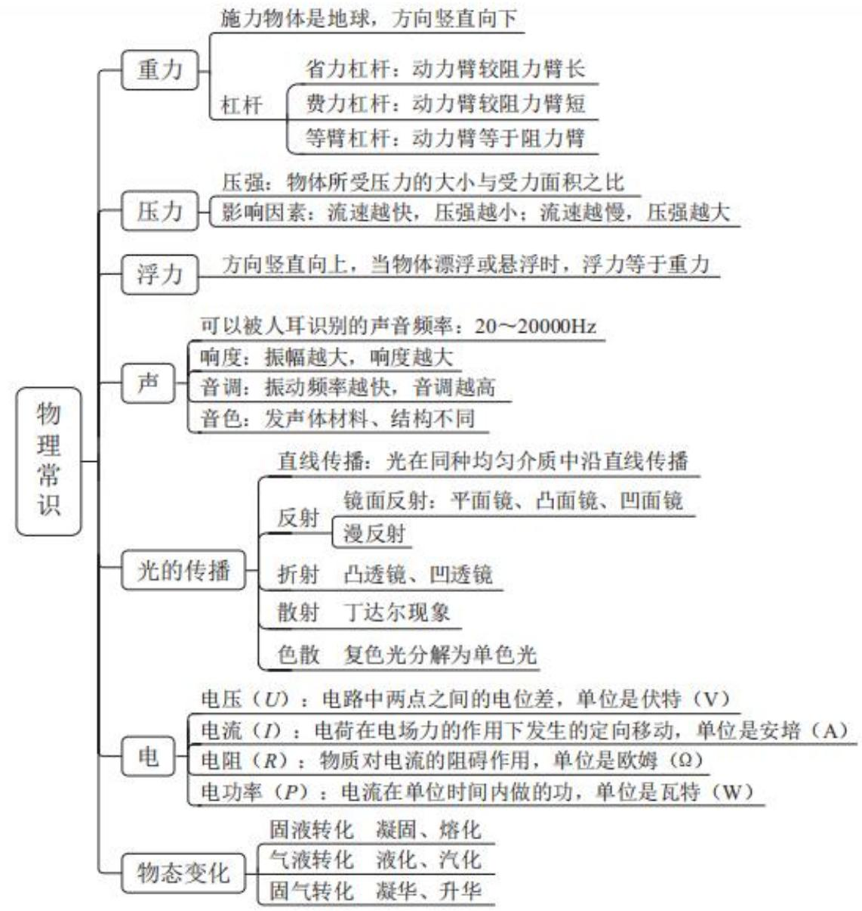
思维导图

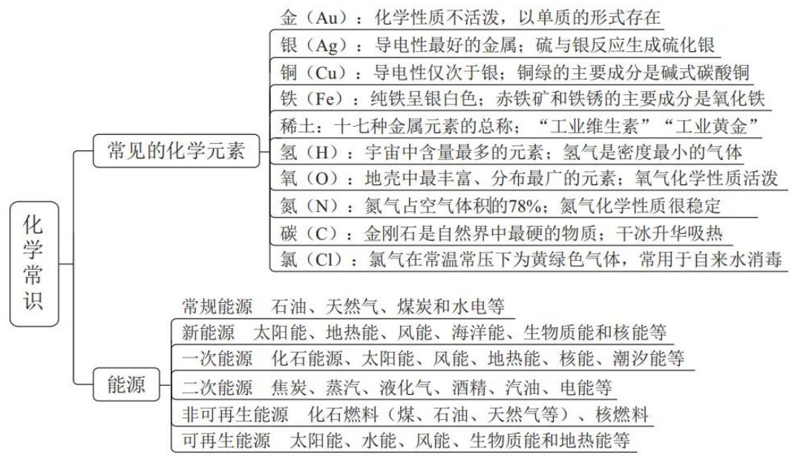

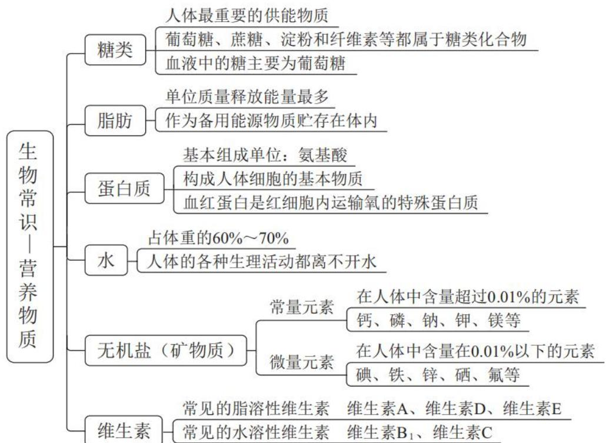

# 精讲精练-常识1（笔记）

# 常识判断

# 第一章 科技常识

# 常识判断 精讲精练1

# 学习任务：

1. 课程内容：科技常识
2. 对应讲义：第  $41\sim 54$  页

3.重点内容：

(1) 重力和压力
(2) 光的传播
（3）常见的化学元素
(4) 能源的分类方式
（5）六大营养物质

【注意】本节课讲解科技常识，涉及物理、化学、生物，属于高中的理科，但是不要担心，即使是文科的学生也能够驾驭此部分知识，因为考法不同，这部分考查的是和生活的结合，即生活中的物理、化学、生物，老师将会用生活化的例子讲解。

1. 课程内容：科技常识。
2. 对应讲义：第  $41\sim 54$  页。
3. 重点内容:

(1) 重力和压力。(2) 光的传播。(3) 常见的化学元素。（4）能源的分类方式：如新能源。(5) 六大营养物质。

4. 常识重在积累，重点听课上的例子。

# 考点一 物理常识

# 第一节 重力

# 一、概念

由于地球的吸引而使物体受到的力叫作重力。重力的施力物体是地球，方向竖直向下。

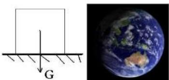

# 【解析】重力：

1. 由于地球的吸引而使物体受到的力叫作重力:

（1）只有在地球上才会有重力。(2) 万有引力强调的是任何两个物体之间, 因此在其他行星中则称为万有引力, 在地球任何的两个物质/人之间都存在万有引力。(3) 人之所以跳起来不会飞上天, 其实是重力的作用。

2. 重力的施力物体是地球，方向竖直向下。如图受力结构，G代表重力，竖直向下的箭头代指方向。

# 二、公式

$\mathrm{G} = \mathrm{mg}$ , 其中  $\mathrm{m}$  是质量,  $\mathrm{g}$  是重力加速度, 一般取  $9.8 \mathrm{~m} / \mathrm{s}^{2}$  。

【解析】公式（无需背诵）： $G = mg$ ，其中  $m$  是质量， $g$  是重力加速度，一般取  $9.8 \, \text{m/s}^2$ 。需记忆数字，是常识中为数不多需要记忆的常量化数字，再如圆周率  $= 3.141592653$ ，都是常量化的数字。

# 三、失重现象与超重现象

物体对支持物的压力（或对悬挂物的拉力）小于物体所受重力的现象，叫作失重现象。如电梯开始下降时，电梯里的物体处于失重状态。

物体对支持物的压力（或对悬挂物的拉力）大于物体所受重力的现象，叫作超重现象。如电梯开始上升时，电梯里的物体处于超重状态。

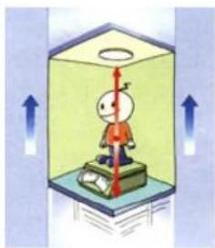

【解析】失重现象与超重现象：

1. 物体对支持物的压力（或对悬挂物的拉力）小于物体所受重力的现象，叫作失重现象。

（1）如电梯开始下降/上升时，电梯运行的过程中不算失重或超重，而是平稳上升或下降是匀速的状态，并不是失重或超重。(2) 如从 10 楼到 1 楼, 电梯瞬间启动的一瞬间, 身体会有浮起的感觉, 即失重。(3) 记忆“轻”: 能够让物质、人产生轻盈的感觉。电梯里的物体处于失重状态。

2. 物体对支持物的压力（或对悬挂物的拉力）大于物体所受重力的现象，叫作超重现象。如电梯开始上升时，电梯里的物体处于超重状态。当电梯1楼向上升，电梯开始启动，双腿有沉重的感觉，即“重”。

3.例子：

(1) 跳楼机、过山车、漂流等设施通过最高点向下坠时就是明显轻盈的感觉, 即失重。
(2) 在飞机起飞处于上升的阶段, 特别是极速攀升穿越云层时, 身子会感觉明显的笨重, 即超重。
（3）总结：同一个考点会有两种情况，二者是相反的，即两种并列的情况。如果两个都学很困难，建议记忆生活中最熟的，剩余的用排除法做题即可。

# 四、杠杆

1. 省力杠杆

动力臂较阻力臂长，动力较小。如：撬棍、扳手、钳子等。

2. 费力杠杆

动力臂较阻力臂短, 动力较大。如: 镧子、汤勺、鱼竿、筷子等。同时, 人

的手臂、手指、腿以及咬合系统等都是费力杠杆。

# 3. 等臂杠杆

动力臂等于阻力臂。如：天平、跷跷板等。

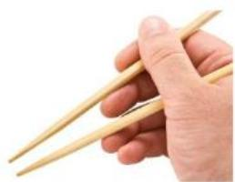

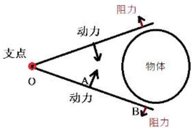

【解析】杠杆：阿基米德的名言“给我一个支点，我能撬动整个地球”。

1. 等臂杠杆（不常考）：动力臂等于阻力臂。如天平、跷跷板等。
2. 省力杠杆：动力臂较阻力臂长，动力较小。如撬棍、扳手、钳子等。

(1) 从概念入手: 如图从支撑地球的位置到支点的位置即阻力臂长度, 从施力点到支点的位置是动力臂, 因此会带来省劲的感觉, 动力臂较阻力臂长, 即省力杠杆。
(2) 从经验入手: 如撬动地球、撬棍、扳手、钳子等, 在使用这些工具时会带来省力的感觉。指甲刀是典型的省力杠杆, 剪指甲会很省力, 动力臂长于阻力臂。
(3) 注意: 剪刀分三种情况, 可以是省力、费力, 也可以是等臂。
(4) 啤酒瓶的开瓶器是动力臂长于阻力臂。

# 3. 费力杠杆：动力臂较阻力臂短，动力较大。

(1) 如镊子、汤勺、鱼竿、筷子等。同时, 人的手臂、手指、腿以及咬合系统等都是费力杠杆。
(2) 如图是类似镊子、筷子、馒头夹的结构, 尾部两端连接处是支点, 阻力臂是整个筷子的长度, 动力臂是支点到施力点的位置, 动力臂小于阻力臂。
（3）如人走路时，双臂和身体之间的关系是费力杠杆，因为走路时间久了也会很累。

# 第二节 压力

# 一、概念

压力是指发生在两个物体的接触表面的作用力，或者是气体对固体和液体表面的垂直作用力，或者是液体对固体表面的垂直作用力。

【解析】压力：人站在地上没有动，会给地板压力，同时也会受到来自地板的支持力。

# 二、公式

$\mathrm{F = pS}$  ，其中  $\mathfrak{p}$  为压强，S为受力面积。

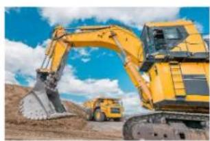

【解析】公式（考查正反比关系）：

1. $F = p S$ , 其中  $p$  为压强,  $S$  为受力面积。 $P 、 S$  二者成反比关系。
   2.例子：

(1) 如指压板会对人体的脚步产生痛感、菜刀越锋利越容易切食物等, 原理是通过减小受力面积, F 不变, S 变小, P 增大。
(2) 挖掘机、坦克的履带会做成比较宽、面积较大，即通过增大接触面积从而减小压强，减轻对路面的损害。

# 三、压强

压强是物体所受压力的大小与受力面积之比。压强用来比较压力产生的效果，压强越大，压力的作用效果越明显。

# 【解析】

1. 压强是物体所受压力的大小与受力面积之比。
2. 压强用来比较压力产生的效果，压强越大，压力的作用效果越明显。
3. 大气压

大气压是地球表面上的空气柱因重力而产生的压力。证明大气压存在的著名实验是马德堡半球实验，测定大气压大小的著名实验是托里拆利实验。

影响大气压强主要因素：

(1) 海拔: 海拔越高, 空气越稀薄, 大气压强越小。
（2）流速：在流体系统中，流速越快，流体产生的压强越小；流速越慢，流体产生的压强越大。如飞机起飞时，飞机机翼顶部凸起，空气流动速度较快，压强小；飞机机翼底部较为平整，空气流动速度较慢，压强较大。由于压强差，产生了托举力，从而使飞机能够飞上天空。

# 2. 液体压强

液体压强的公式是  $p = \rho gh$  。液体压强的大小只取决于液体的种类（即密度  $\rho$  ）和深度（h），而和液体的质量、体积没有直接关系。

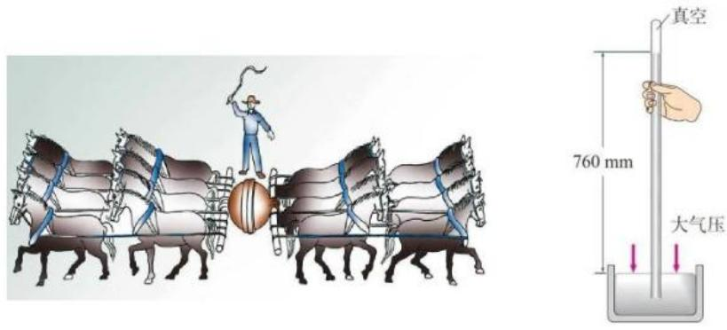

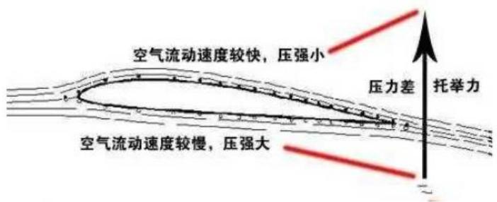

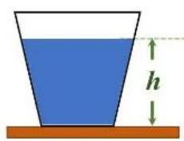

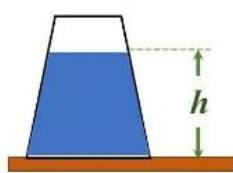

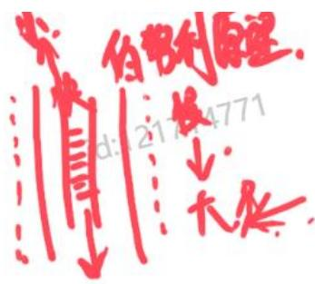

# 【解析】

1. 大气压：考查以下世界科技成就史说法正确/错误的是。

（1）证明大气压存在的著名实验是马德堡半球实验，测定大气压大小的著名实验是托里拆利实验。
(1)证明大气压存在的著名实验是马德堡半球实验: 左右两边分别八匹马, 很难将中间吸着的球分开。考查应用, 如家中用的吸盘、挂钩。
(2)测定大气压大小的著名实验是托里拆利实验:

a. 如喝奶茶时，用吸管喝一口，之后放着会发现吸管的液面高度高于被子里的奶茶液面高度。
b. 意大利科学家托里拆利测出了 1 个标准大气压的大小为约  $760 \mathrm{~mm}$  （记忆  $0.76 \mathrm{~m}$  ）汞柱或  $10.3 \mathrm{~m}$  水柱。

(3) DNA 双螺旋结构由沃森和克里克提出。

(2) 影响大气压强主要因素（重点）：

①海拔：海拔越高，空气越稀薄，大气压强越小。大气压强越小，带来的影响是水的沸点降低，如青藏高原的海拔高度很高，在青藏高原上水的沸点为80多度，但是80多度的热量和平原地区不同。如果做西红柿牛腩，在平原炖1个小时即可，但是在高原炖2小时可能都不烂，因此要用高压锅。
(2)流速: 伯努利原理, 即流速越快, 压强越小。

a. 如夏季遇到台风天气时，开着窗户窗帘会往外吸；在站台等候高铁，提示请旅客站在安全黄线以外候车（有的高铁过站不停车，铁轨上方空气流速快，人们所处上方的流速慢，流速慢压强大，流速快压强小，气压从压强大推向压强小，由于压强差带来的强大推力，人可能会被吸走）；乒乓球的上旋球、下旋球；足球的香蕉球、电梯球等均体现该原理。

b. 飞机如何起飞：飞机的上顶部比较尖，底部比较平，滑行时飞机的上表面

空气流速快，下底部流速慢，上方空气压强小，下方空气压强大，由下往上产生托举力、升力。民航客机起飞速度250-280公里/小时。

# 2. 液体压强：

（1）液体压强的公式是  $\mathrm{p} = \rho$  （溶液密度）gh（深度）。
(2) 液体压强的大小只取决于液体的种类（即密度  $\rho$  ）和深度 (h)，而和液体的质量、体积没有直接关系。
（3）如图容器不同，溶液相同，液面高度相同。若放置一个金属球，金属球受到的液体压强相同，因为溶液相同， $\rho$  相同， $g$  是常量，影响因素只能是  $h$ ，此处的  $h$  也相同。我国第一台载人潜水器是蛟龙号，目前最先进的是奋斗者号（我国万米级全海深的载人潜水器；全海深即海洋有多深，载人潜水器就能下潜多深），世界最深的地方是马里亚纳海沟（位于菲律宾东南部的太平洋底部，约水下11000米），奋斗者号实现了搭载科研人员数次往返。如超市中深海鱼价格高，而且形状特殊（很扁），和水下压强有密切的关系，因此深度越大，受到来自海洋的压强越大。

# 第三节 浮力

# 一、概念

浸在流体内的物体受到的流体竖直向上的作用力叫作浮力，浮力与重力的方向相反。

【解析】浮力：浸在流体内的物体受到的流体竖直向上的作用力叫作浮力，浮力与重力的方向相反。重力是竖直向下，浮力是竖直向上。

# 二、公式

F浮  $= G$  排  $= \rho$  液  $\mathrm{gV}$  排，其中  $\rho$  液为液体的密度，  $\mathrm{g}$  为重力加速度，V排为排开液体的体积。

# 【解析】

1. F 浮=G 排=ρ 液 gV 排, 其中 ρ 液为液体的密度, g 为重力加速度, V 排为排开液体的体积。
2. 如吃水量、排水量、满载 X 吨, 即排开液体的体积, 但是并不是潜水艇本

身的体积, 可能是潜水艇本身的体积, 也可能小于潜水艇的体积, 如图潜水艇没有完全浸在水中。

3. 我国最先进的航空母舰是福建舰航母，满载排水量（最大载重）为八万吨，包括战斗人员、舰载机、货仓等。
4. 我国目前正在科研攻关的是第四艘航母。

# 三、浮沉条件

当物体漂浮或悬浮时，浮力等于重力，如潜水艇漂浮在水中时，其所受的重力和浮力相等。

当物体上浮时，浮力大于重力，如稳定在固定深度的潜水艇排水后，重力减小，浮力大于重力，潜水艇上浮。

当物体下沉时，浮力小于重力，如稳定在固定深度的潜水艇增加注水后，重力增加，浮力小于重力，潜水艇下沉。

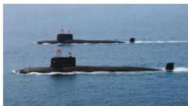

# 【解析】浮沉条件：

1. 当物体漂浮或悬浮时，浮力等于重力，如潜水艇漂浮在水中时，其所受的重力和浮力相等。
2. 当物体上浮时，浮力大于重力，如稳定在固定深度的潜水艇排水后，重力减小，浮力大于重力，潜水艇上浮。
3. 当物体下沉时，浮力小于重力，如稳定在固定深度的潜水艇增加注水后，重力增加，浮力小于重力，潜水艇下沉。
4. 潜水艇的结构为中间有巨大的空心水舱，注满水时重力很大，排空则重力下降。如图潜水艇漂浮在海面上，此时浮力  $=$  重力，将水舱注满水，潜水艇则实现下潜。

# 第四节 声

# 一、产生

声音是物体振动产生的声波。最初发出振动的物体叫声源。可以被人耳识别的声音，其频率范围是  $20 \sim 20000 \mathrm{~Hz}$  。

# 【解析】

1. 声音是物体振动产生的声波：如人说话时声带会不断颤动；敲锣打鼓的声音，在敲击之后声音会延续几秒，用手按住鼓面声音则会停止。
2. 可以被人耳识别的声音，其频率范围是  $20 \sim 20000\mathrm{Hz}$  。 $20\mathrm{Hz}$  以下，2万  $\mathrm{Hz}$  以上人则听不到。

(1) 超声波是频率高于  $20000 \mathrm{~Hz}$  的声波 (常考例子), 它方向性好, 穿透能力强, 在水中传播距离远。超声波可用于测距、测速、清洗 (超声波震荡洗衣机)、碎石 (用超声波碎石的方式免除开刀的痛苦)、杀菌消毒、B 超等。超声波仿生的是蝙蝠、海豚。
(2) 次声波是一种频率小于  $20 \mathrm{~Hz}$  的声波: 次声波的例子是负面的, 一般和地震、海啸、军事有关, 因此不常考次声波的例子。地震引发的是次声波 (小于  $20 \mathrm{~Hz}$ ), 人感受不到, 因此在地震发生的瞬间动物有感觉 (如鸡飞狗跳、鱼跃出水面、鸟瞬间不知道往哪飞)。

# 二、特性

# 1. 响度

响度即声音的大小。响度由振幅和人离声源的距离决定：振幅越大，响度越大；人和声源的距离越小，响度越大。如通过扩音器将声音扩大就是通过增大振幅从而增大声音的响度。

# 2.音调

音调即声音的高低。音调由振动频率决定：物体振动的频率越快，音调就越高；频率越慢，音调就越低。一般情况下，女性音调高于男性是因为男性的声带振动的频率比女性的慢。

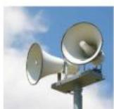

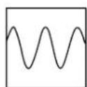
甲

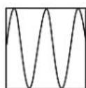
乙

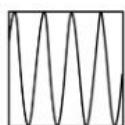
丙

# 【解析】

# 1. 常考响度和音调：

(1) 响度即声音的大小: 如说话大点声, 指响度。(2) 音调指声音的高低: 如音符、男高音、男低音等。

2. 声音的大小和振幅有关，振幅越大，响度越大。如图喇叭能够实现扩音，通过喇叭逐渐开口扩大的形状，上下摆动幅度越来越大。
3. 频率决定音调的高低，物体振动的频率越快，音调就越高；频率越慢，音调就越低。一般情况下，接起陌生电话说一句话就能知道男女，因为女性音调高于男性。
4. 如图是甲、乙、丙的声音在示波器展示的声波的波形，甲说话声音最小（看振幅），其中丙音调最高（看曲线密度、波峰波谷的数量、同一个方格内折返跑最多的）。

# 3.音色

音色即不同声音表现在波形方面的与众不同的特性。不同的发声体由于其材料、结构不同，发出声音的音色也不同。如人们可以“闻其声而知其人”就是因为不同的人音色不同。

# 【解析】

1. 音色即不同声音表现在波形方面的与众不同的特性。
2. 不同的发声体由于其材料、结构不同，发出声音的音色也不同。如人们可以“闻其声而知其人”（背后有人叫名字，不用回头就知道是谁，靠的是辨别音色）就是因为不同的人音色不同。
3. 如气泡音、烟嗓、夹子音都是在描述声音的音色；演奏同样的曲子不同乐器呈现的不同。

# 三、传播

声音的传播需要介质，在真空中，声音不能传播。常温下，声音在不同的介

质中传播的速度不同, 通常情况下, 固体  $>$  液体  $>$  气体。声音在 1 个标准大气压、 $15^{\circ} \mathrm{C}$  的空气中, 其速度约为  $340 \mathrm{~m} / \mathrm{s}$ , 温度越高, 声音在空气中的传播速度越快。

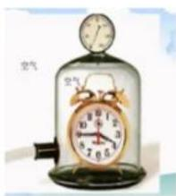

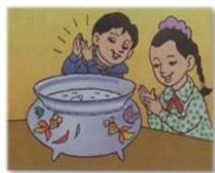

# 【解析】

1. 声音的传播需要介质，在真空中，声音不能传播。

(1) 太空、月球是真空, 因此不能传播声音。(2) 命题: 五星红旗在月球表面迎风飘扬 (错误)。(3) 命题: 我国航天员王亚平在空间站听到远处传来星体爆炸的声音 (错误), 原因: 空间站可以看到远处星体爆炸的光芒, 但是听不见声音。嫦娥六号在月球背面展示的国旗的材质是玄武岩纤维, 即是用石头做的, 之所以不用丝绸,因为月球是真空, 没有风, 飘不起来。

2. 常温下，声音在不同的介质中传播的速度不同，通常情况下，固体  $>$  液体  $>$  气体。声音在 1 个标准大气压、 $15^{\circ} \mathrm{C}$  的空气中，其速度约为  $340 \mathrm{~m} / \mathrm{s}$ （记忆），温度越高，声音在空气中的传播速度越快。

(1) 雷雨天气，先看到闪电。
(2) 百米赛跑赛场上, 发令员在终点处, 先看到发令枪的烟。
(3) 超音速战斗机/客机, 超的是  $340 \mathrm{~m} / \mathrm{s}$  。
(4) 声音在铁棒、钢轨中传播的速度是  $5200 \mathrm{~m} / \mathrm{s}$ , 即五公里、十里路。如抗日战争年代的铁道游击队, 当时的火车不是很快, 站岗的游击队员提前趴在铁轨上听到日本的火车到来, 但实际上还有五公里才能到达, 足够去叫自己的队员。

# 第五节 光的传播

光可以通过空气、水、玻璃等各种物质进行传播，也可以在真空中传播。光速与介质有关，光在不同介质中的传播速度不同，光在真空中的传播速度最快，真空中的光速约为  $3 \times 10^{8} \mathrm{~m} / \mathrm{s}$  。

# 【解析】

1. 光可以通过空气、水、玻璃等各种物质进行传播，也可以在真空中传播。
2. 光速与介质有关，光在不同介质中的传播速度不同，光在真空中的传播速度最快，真空中的光速约为  $3 \times 10^{8} \mathrm{~m} / \mathrm{s}$  。
   $3.3 \times 10^{8} \mathrm{~m} / \mathrm{s}$  相当于每秒绕地球7.5圈。光年是光一年走的距离，一般应用于天文学中描述黑洞等距离，光年是长度单位。

# 一、直线传播

光在同种均匀介质中沿直线传播。影子、日食、月食都是由光的直线传播形成的。

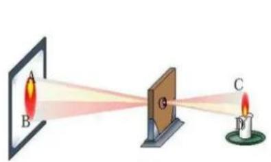

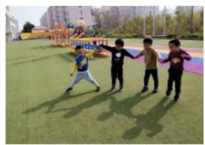

# 【解析】

1. 光在同种均匀介质中沿直线传播。
2. 影子、日食、月食都是由光的直线传播形成的。
3. 命题：光具备沿直线传播的属性（错误），原因：必须在同种均匀介质中。
4. 世界上最早的小孔成像的实验是墨子所作。

# 二、反射

# 1. 镜面反射

# （1）平面镜

平面镜成的像是由来自物体的光经平面镜反射后，反射光线的反向延长线相交而形成的。潜望镜便是对平面镜的应用。

# （2）凸面镜

凸面镜用抛物面的外侧作反射面，对光线起发散作用。汽车后视镜便是对凸面镜的应用。

# （3）凹面镜

凹面镜用抛物面的内侧作反射面，对光线起会聚作用。太阳灶便是对凹面镜

的应用。

# 2. 漫反射

若反射面比较粗糙，当平行入射的光线射到这个反射面时，光会向着各个方向反射出去。粗糙的电影银幕便是对漫反射的应用。

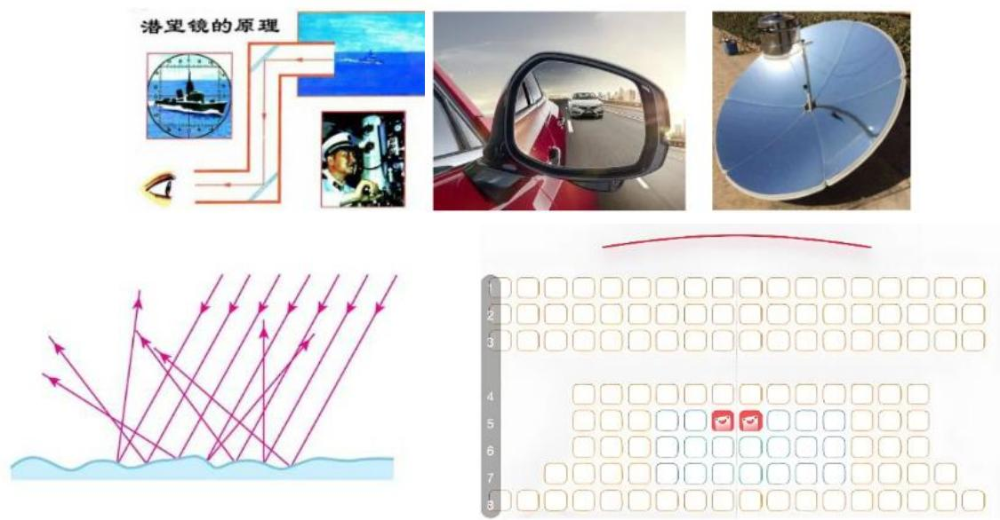

# 【解析】反射：

# 1. 镜面反射：

(1) 平面镜: 平面镜成的像是由来自物体的光经平面镜反射后, 反射光线的反向延长线相交而形成的。潜望镜便是对平面镜的应用 (官兵在潜艇中通过平面镜的两次反射观看到水上的情形)。
(2) 凸面镜: 凸面镜用抛物面的外侧作反射面, 对光线起发散作用。汽车后视镜便是对凸面镜的应用。

(1)坐在驾驶位的司机人员通过后视镜能够看到更加广阔的后方的范围, 做成凸面镜即为了减小盲区。
(2)如在转弯处, 放置类似哈哈镜的镜子是为了让两侧司机看到更加广阔的范围。

（3）凹面镜：凹面镜用抛物面的内侧作反射面，对光线起会聚作用。太阳灶便是对凹面镜的应用。
(1)如手电筒的灯罩内壁有凹面, 作用是会聚光线, 产生聚光的结果, 因此能够打出非常强的光线; 再如射灯的灯泡功率不大, 反射面做成凹面镜, 目的是为了聚光。

②太阳灶即利用太阳能聚光发热，必须满足当地天气条件，一年光照天数要达到230多天以上。
2. 漫反射：若反射面比较粗糙，当平行入射的光线射到这个反射面时，光会向着各个方向反射出去。

（1）粗糙的电影银幕便是对漫反射的应用：从电影院的放映厅打出的光线，经过电影屏幕的反射，由于不平整会反射到四面八方，是为了让所有位置呈现的效果一样。
(2) 再如黑板也是对漫反射的应用, 黑板表面是粗糙的, 为了让各个位置的同学看到黑板上的字。

# 三、折射

光从一种透明介质斜射入另一种透明介质时，在两种介质的交界处传播方向发生改变的现象，叫作光的折射。

1. 凸透镜：对光线起会聚作用，应用于远视眼镜、显微镜等。
2. 凹透镜：对光线起发散作用，应用于近视眼镜等。

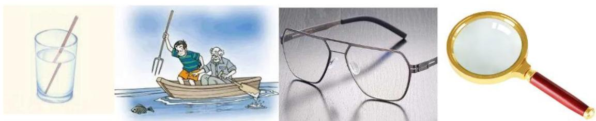

【解析】光从一种透明介质斜射入另一种透明介质时，在两种介质的交界处传播方向发生改变的现象，叫作光的折射。

1. 凸透镜：对光线起会聚作用，应用于远视眼镜（老花镜，两面凸起）、显微镜等。
2. 凹透镜：对光线起发散作用，应用于近视眼镜（只有一侧往外凸，另一次往内凹）等。
3. 岸上游客往水中看到的鱼所处的深度比实际鱼所处的深度浅, 因此渔夫叉鱼要比看到的地方偏下才能叉到鱼。

# 四、散射

光通过不均匀介质时一部分光偏离原方向传播的现象，叫作光的散射。如晴天时天空是蓝色的、雾天时光线变得朦胧、丁达尔现象等。

# 五、色散

光的色散是指复色光分解为单色光的现象。利用三棱镜可以观察到光的色散, 三棱镜可以把白光分解为彩色光带。光的三原色: 红、蓝、绿。

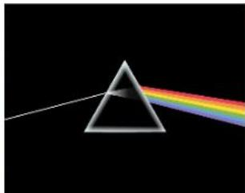

# 【解析】

1. 光通过不均匀介质时一部分光偏离原方向传播的现象，叫作光的散射。
2. 如晴天时天空是蓝色的、雾天时光线变得朦胧、丁达尔现象：如图一一般在清晨、夏季中午过后出现，仿佛太阳打向大地，有无数条通道，本质上是胶体现象，没有任何新物质生成，是物理反应。
3. 光的色散是指复色光分解为单色光（红橙黄绿青蓝紫）的现象。夏季出现对流雨之后，“东边日出西边雨，道是无晴却有晴”，出门是晴天，突然下雨，过后变晴，此时容易出现彩虹。利用三棱镜可以观察到光的色散，三棱镜可以把白光分解为彩色光带。
4. 光的三原色：红、蓝、绿。
   5.颜料的三原色：红、黄、蓝。

# 第六节 电

# 一、电压（U）

电压是指电路中两点之间的电位差。电压的单位是伏特（V）。

目前我国家庭常用的标准电压为  $220 \mathrm{~V}$  。人体的安全电压是不高于  $36 \mathrm{~V}$ , 安全电流为  $10 \mathrm{~mA}$ , 一般情况下, 人体对低于  $36 \mathrm{~V}$  的电压无明显感觉。

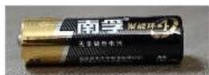

# 【解析】

1. 电压（U）是指电路中两点之间的电位差。电压的单位是伏特（V）。
2. 目前我国家庭常用的标准电压为  $220 \mathrm{~V}$  （生活中的家用电器都会显示额定输入电压  $220 \mathrm{~V}$ ）。工业电压是  $380 \mathrm{~V}$ ，工厂中若要用  $220 \mathrm{~V}$ ，很多电器则无法使用。
3. 人体的安全电压是不高于  $36 \mathrm{~V}$ , 安全电流为  $10 \mathrm{~mA}$ , 一般情况下, 人体对低于  $36 \mathrm{~V}$  的电压无明显感觉。

(1) 如家中的五号、七号电池核定电压为  $1.5 \mathrm{~V}$ ; 车里的纽扣电池是  $3 \mathrm{~V}$  。
(2) 电动车很方便, 但是隐患也很多, 如小区禁止电动车上楼, 因为市面上所卖的电动车电压没有低于  $36 \mathrm{~V}$  的, 最低以  $48 \mathrm{~V}$  为主。
（3）很多城市道路夏季由于排水问题会出现涉水路段，骑电瓶车经过涉水路段的危险远高于开机动车经过涉水路段。

# 二、电流（I）

电流是指处于电场内的电荷在电场力的作用下发生的定向移动。电流的单位是安培（A）。

【解析】电流是指处于电场内的电荷在电场力的作用下发生的定向移动。电流的单位是安培（A）。

# 三、电阻（R）

物质对电流的阻碍作用叫该物质的电阻。电阻的单位是欧姆（Ω）。

欧姆定律是指在同一电路中，通过某一导体的电流跟这段导体两端的电压成正比，跟这段导体的电阻成反比。

电阻是所有电子电路中使用最多的元件。电阻大小一般与温度有关，还与导体长度、粗细、材料有关。

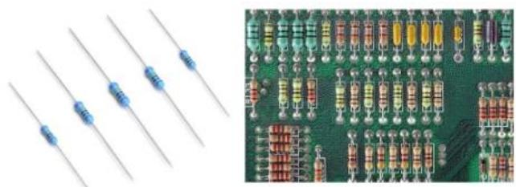

# 【解析】

1. 物质对电流的阻碍作用叫该物质的电阻。电阻的单位是欧姆（Ω）。
2. 欧姆定律是指在同一电路中, 通过某一导体的电流跟这段导体两端的电压成正比, 跟这段导体的电阻成反比。U=IR, U 和 I 成正比关系。
3. 电阻是所有电子电路中使用最多的元件。电阻大小一般与温度有关，还与导体长度、粗细、材料有关。
4. 如修理笔记本时打开外壳出现的主板，上面密密麻麻的小疙瘩就是电阻，电阻是所有电路中最多的元件，没有之一。

# 四、电功率（P）

电流在单位时间内做的功叫作电功率，它是用来表示消耗电能快慢的物理量。功率的单位是瓦特（W）。家庭电路中，电压  $U = 220\mathrm{V}$  是一定的。因为  $P = UI$ ，所以用电器的总功率  $P$  越大，电路中的总电流  $I$  就越大。若电路中的总电流超过安全值，保险丝就容易烧坏。

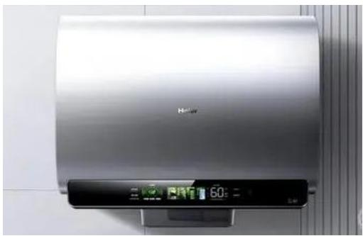

# 【解析】电功率：

1. 它是用来表示消耗电能快慢的物理量。生活中有大功率电器，上学的时候宿舍管理员阿姨禁用的电器属于大功率电器，因为如果每个宿舍都使用会导致整个宿舍楼跳闸。考试中出现的电器以加热为主要用途的，如吹风机（功率大、体积小但带来的辐射特别大，家中辐射比较高的两大电器是吹风机和微波炉）烧水壶、电热毯、电磁炉、空气炸锅等。
2. 功率的单位是瓦特（W），一般称为瓦。家庭电路中，电压  $U = 220 \mathrm{~V}$  是一定的。因为  $P = UI$  ，所以用电器的总功率  $P$  越大，电路中的总电流  $I$  就越大。全国各地小区、宿舍楼在夏季容易出现大面积的停电和跳闸，因为家家户户开空调。  $P = UI$  ，电压  $U = 220 \mathrm{~V}$  是恒定值，整栋楼用电器多，电路总功率上升，  $P$  变大，  $U$  不变带动整个电路的电流上升，超过安全值，出现跳闸的现象。
3. 在家中使用电器的时候，尽量不要多台大功率用电器同时使用。如用烤箱

烤蛋挞，电热水器和电热水壶同时在烧水，如果5件以上加热功能的电器同时工作，一般会出现跳闸，最好错峰使用。

4.1度电是生活化表达，规范表达是1千瓦时，买用电器会标额定功率，额定功率为1千瓦的用电器工作1小时消耗的电能即1度电，全国电价平均1度电是0.5、0.6元，如2千瓦的电器工作1小时，消耗2度电，如果一直插着一直不拔电费会非常高。如果宿舍的空调不是新空调，会比较费电，导致电费比较高。

# 第七节 物态变化

# 一、固液转化

1. 凝固——液态转化为固态，放热。如水变成冰。
2. 熔化——固态转化为液态，吸热。如冰变成水。

# 二、气液转化

1. 液化——气态转化为液态，放热。如将气态氧气通过高压打入氧气罐，压力增大，气态氧变为液态氧。
2. 汽化——液态转化为气态，吸热。如氧气罐中的液态氧，在打开罐体阀门后压力减小，液态氧变为气态氧。

# 三、固气转化

1. 凝华——气态直接转化为固态，放热。如空气中的水蒸气变为霜。
2. 升华——固态直接转化为气态，吸热。如干冰升华。

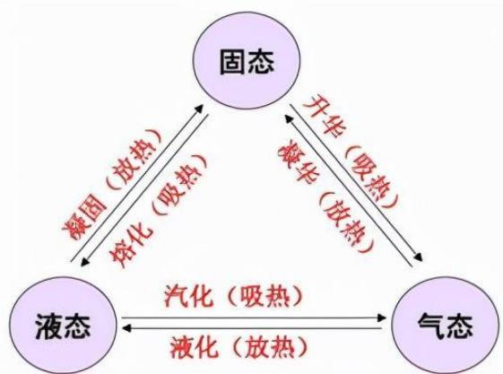

【解析】物态变化（中学物理中一直是重点）：

1. 固液转化：很简单，几乎不考。

(1) 凝固: 液态转化为固态, 放热。如水变成冰。
(2) 熔化: 固态转化为液态, 吸热。如冰变成水。

# 2. 气液转化：

(1) 液化 (重点): 气态转化为液态, 放热。如零摄氏度以下天气, 人在室外说话会冒白气; 夏天买冰淇淋打开冰箱会冒白气; 冬天从室外进入室内, 近视眼镜瞬间起雾; 春季和秋季的早上往往容易出现大雾天气, 以上现象均是因为气态转化为液态, 遇冷凝结为小水滴。
(2) 汽化: 液态转化为气态, 吸热。如水烧开了。

# 3. 固气转化:

(1) 凝华 (重点): 气态直接转化为固态, 放热。
(2) 升华 (重点): 固态直接转化为气态, 吸热。
(3) 例子: 如白炽灯用久了发黑, 白炽灯的灯丝是熔点最高的金属钨, 白炽灯工作久了钨温度高先升华, 从固态钨转化为气态, 钨蒸汽充斥在整个灯泡中,关灯断电后冷却从气态还原回固态, 灯丝会附着在灯泡内壁, 所以白炽灯发黑,因此白炽灯发黑是先升华再凝华。

# 考点二 化学常识

# 第一节 常见的化学元素

【解析】物理需要理解，原理很多，化学和生物更加有意思，很多知识点听一遍就会，其次结合生活度更高。本节课一方面为了考试拿分学习高频考点，另一方面极大提高生活技能。这里讲解五大金属元素和五大非金属元素，是最高频的十大元素。

# 一、金（Au）

金的化学性质稳定, 不与土壤中的水及氧气等物质发生反应, 在自然界中以单质的形式出现于岩石中的金块或金粒、地下矿脉及冲积层中 (沙里淘金), 化学性质不活泼 (真金不怕火炼)。在现实中, 24K 金常被认为是纯金, 但实际含金量为  $99.99\%$ ; 18K 金, 金含量为  $75\%$  。

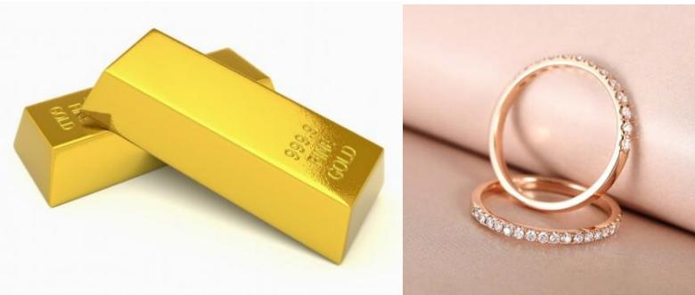

【解析】金（Au）：

1. 金的化学性质稳定，不会发生生锈的情况，如把金砖埋在院子里 10 年后拿出来依旧完好无损。不可能出现金子生锈的情况，如果买到的金子不纯才可能会出现生锈的情况，可能是外面仅镀了一层金。
2. 王水：浓盐酸和浓硝酸按照体积3：1的比例混合而成，属于管制商品，生活中接触不到，浓盐酸和浓硝酸属于强腐蚀性强酸（皮肤不能接触，堪称“化骨水”），王水能够溶解金子在内的绝大多数金属，如一些法律案例报道在首饰加工车间，工人带入王水溶解金子后偷出，然后再还原。
3. 在现实中，24K金（足金）常被认为是纯金，但实际含金量为  $99.99\%$  ，约定于纯金；18K金（彩金，颜色是玫瑰金），金含量为  $75\%$  （18K/24K）；14K金的含金量约为  $58.5\%$  （14K/24K）。铂金/白金的含金量是  $0\%$  ，铂金不是金而是铂(Pt)，游戏当中铂金比黄金段位高，在贵金属市场铂金比黄金贵。

# 二、银（Ag）

银的理化性质较为稳定，是导电性最好的金属。卤化银感光材料用于制作相纸、胶卷等。银针试毒是利用砒霜中的杂质硫与银反应生成硫化银。含硫的温泉中存在的硫化氢和氧气与银发生反应，也会生成黑色的硫化银，进而使银器变黑。

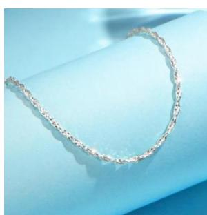

【解析】银（Ag）：

1. 银的理化性质较为稳定，是导电性最好的金属。仅考查理论，不会考查应

用，因为现实中不会用于导线材料，导线材料使用的是导电性第二好的铜，银的成本很高。

2. 卤化银是含银化合物, 是一种感光材料, 如现实中一些人戴的眼镜很神奇,在室内是普通眼镜, 在室外太阳光下面变成墨镜。
3. 银针试毒是利用砒霜中的杂质硫与银反应生成硫化银。含硫的温泉中存在的硫化氢和氧气与银发生反应，也会生成黑色的硫化银，进而使银器变黑。

（1）如长辈可能常年佩戴的银首饰，年限比较久会发黑，“戴银首饰戴久了发黑说明人体有病/有毒素”是谣言。银和硫反应生成硫化银，硫化银本身是深色金属，银首饰随时接触人的皮肤，人体只要排汗功能正常，一定会不断分泌硫元素，硫是人体蛋白质的重要组成元素。可以去银首饰店找免费的擦银布还原。
(2) 银针试毒: 银首饰是随身佩戴的, 银针是放在某个首饰中的, 不会接触汗液, 如果随时放在手心也会变黑。现在毒品五花八门, 古代毒以砒霜为主,其中杂质最多的是硫, 因此银针试毒是利用砒霜中的杂质硫与银反应生成硫化银。

# 三、铜（Cu）

铜单质呈紫红色，常用作导电材料，导电性仅次于银。青铜是在纯铜（紫铜）中加入锡或铅制成的合金。黄铜是由铜和锌所形成的合金。铜绿的主要成分是碱式碳酸铜，是铜与空气中的氧气、二氧化碳和水蒸气等物质反应产生的物质，不溶于水。

青铜：铜+锡 Sn 或铅 Pb

黄铜：铜+锌Zn

白铜：铜+镍Ni

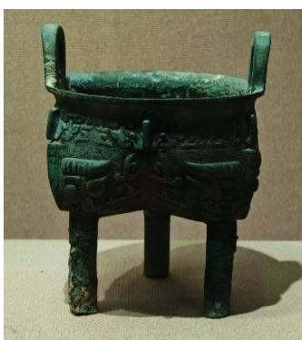

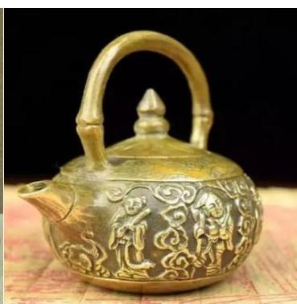

【解析】铜（Cu）：

1. 铜单质呈紫红色，因此又称紫铜。
2. 常用作导电材料，导电性仅次于银。铜没有银贵，如电缆，尤其是高压电路的电缆主要以铜为主。
3. 三种生活中最常见的铜合金（考试考过，需要记忆）：

(1) 青铜: 铜+锡 Sn 或铅 Pb。
(2) 黄铜: 铜+锌 Zn, 如图 2 家中的摆件、公共场所的水龙头、老北京铜锅以黄铜作为最主要的材质 (不同商家由于成本问题原料不同)。
(3) 白铜: 铜+镍 Ni, 如一元钱硬币。

# 四、铁（Fe）

我国春秋战国时期开始应用铁，纯铁呈银白色。钢是铁碳合金。磁铁矿的主要成分是四氧化三铁（ $\mathrm{Fe}_{3} \mathrm{O}_{4}$ ）；赤铁矿和铁锈的主要成分是氧化铁（ $\mathrm{Fe}_{2} \mathrm{O}_{3}$ ）。

防止铁制品生锈的方法：①保持铁制品表面清洁、干燥；②制成铁合金；③在铁制品表面覆盖保护膜。

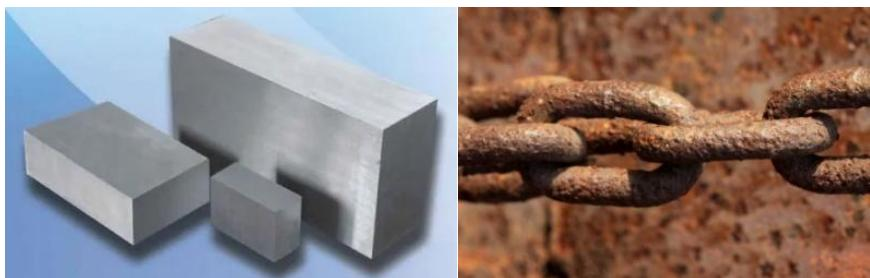

# 【解析】铁（Fe）：

1. 每年人类使用量最大的金属。春秋战国时期我国开始应用铁质农耕。全世界中应用钢（铁碳合金）比较多，纯铁呈银白色（左图），生活中有一些铁制品掉漆后会裸露出里面的铁皮，如机动车发生剐蹭、贴纸文具盒蹭掉漆露出来的是类似不锈钢的颜色。
2. 钢是铁碳合金。含碳量的高低影响的是硬度，而不是韧性。
3. 赤（红色）铁矿和铁锈的主要成分是氧化铁  $\left(\mathrm{Fe}_{2} \mathrm{O}_{3}\right)$ , 如右图。铁矿是从赤铁矿和磁铁矿当中提取出来的。
4. 防止铁制品生锈的方法：铁生锈的条件是潮湿空气。

(1) 保持铁制品表面清洁、干燥。
(2) 制成铁合金。

# （3）在铁制品表面覆盖保护膜。

5. 不锈钢的关键在于添加了铬元素，铬是最硬的金属。自然界硬度最高的物质是金刚石（钻石）。304 和 316 相比，316 是医用级（医疗器械标的是 316），304 是食品级，316 级别更高，如果购买水壶、保温壶，有 316 可以优先考虑 316 的产品，即便价格贵  $10\%$  左右，但没有坏处。

# 五、稀土

稀土是元素周期表中的镧系元素和钪、钇共十七种金属元素的总称，被称为“工业维生素”“工业黄金”。中国的稀土储量位居世界第一，中国内蒙古的白云鄂博矿是世界最大的稀土矿山。

【解析】稀土：作为17种元素的合称，2024年省考中有一个省份考查到。时政中稀土非常重要，前段时间我国在云南新发现了稀土矿，在发现该矿之前，我国的稀土储量早已位居世界第一。稀土是一种战略资源，用于高精尖领域，如芯片、“两弹一星”，和稀土相关的产业一般作为国家的保护产业和涉密产业，中国内蒙古的白云鄂博矿（我国稀土产量超过80%储量，遥遥领先、断层领先）是世界最大的稀土矿山。从化学中稀土本身不那么重要，从政治、时政、国际战略的角度很关键，我国对其出口的管控非常严格，2024新实施了《稀土管理条例》。

# 六、氢（H）

氢是元素周期表的第一个元素，也是宇宙中含量最多的元素。在自然界中，气、氘、氚都是氢的同位素。氢气是世界上已知的密度最小的气体，也是一种极易燃的气体，燃烧时会产生淡蓝色的火焰，产物是水。

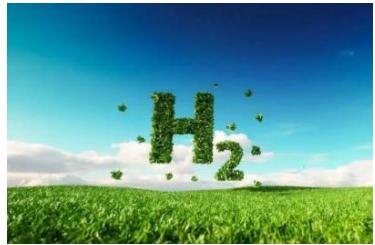

$$
2 \mathrm {H} _ {2} \mathrm {O} \xrightarrow {\text {通 电}} 2 \mathrm {H} _ {2} \uparrow + \mathrm {O} _ {2} \uparrow
$$

【解析】氢（H）：元素周期表“氢氦锂铍硼，碳氮氧氟氖，钠镁铝硅磷，硫氯氩钾钙”或者“氢氦氖氩氪氙氪（竖着背）”。

1. 氢气是世界上已知的密度最小的气体，如氢气球。
2. 氢是元素周期表的第一个元素，也是宇宙中含量最多的元素（超过  $80\%$ ，宇宙大爆炸学说，爆炸一定有氢）。
3. 制备氢气：电解水（把水进行通电）。不会考查反应前后的物质和配平。
4. 氢能是全球潜力巨大的绿色能源。

# 七、氧（0）

氧是地壳中最丰富、分布最广的元素, 也是构成生物界与非生物界最重要的元素。氧气是氧元素形成的一种单质, 化学式为  $0_{2}$ , 其化学性质比较活泼, 很多物质都能与氧气反应。液态氧为淡蓝色液体, 固态氧为淡蓝色雪花状固体。

臭氧是氧气  $\left(0_{2}\right)$  的同素异形体, 在常温下, 它是一种有特殊臭味的淡蓝色气体。臭氧主要存在于臭氧层中, 臭氧层能吸收大部分短波紫外线, 使大气温度升高, 并使地球上的生物免受过多紫外线伤害, 因此被称为 “地球上生物的保护伞”。

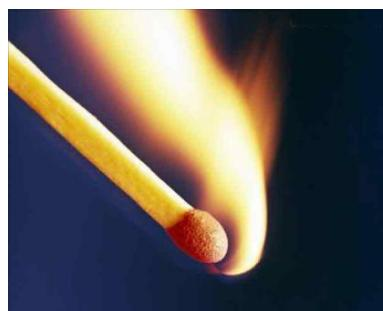

【解析】氧（O）：

1. 氧是地壳中最丰富、分布最广的元素。宇宙中最多的元素是氢。地壳中元素含量前四位是氧（O）、硅（Si）、铝（Al）、铁（Fe）。地壳中含量最多的金属元素是铝，而不是铁。
2. 氧气是化学性质比较活泼，很多物质都能与氧气反应。氧化还原反应，大多数燃烧反应都有氧气参与，但是氧气不可燃，是助燃气体。空气中  $78\%$  的成分是氮气， $21\%$  的成分是氧气，剩下的  $1\%$  是二氧化碳、二氧化硫、PM2.5、一氧化碳、PM10 各种尘埃等，氧气约占空气的  $1/5$ ，如果氧气可燃，按下打火机可能整个地球将会在宇宙中璀璨夺目，亮度可能比太阳还高，因此氧气不可燃（常识做题的时候可以尝试假定说法正确，想一想会发生什么）。
3. 臭氧  $\left(0_{3}\right)$  是氧气  $\left(0_{2}\right)$  的同素异形体（作为同种元素因为结构不同形成不同的物质）。臭氧层能吸收大部分短波紫外线，被称为“地球上生物的保护伞”。臭氧层空洞，地面生物会接收更多紫外线，马哲告诉我们要用辩证的观点看问题，无法说紫外线好不好，因为人们需要紫外线，尤其是老年人和新生婴儿要多晒太阳，人体中只有一种维生素能够靠自身合称，即维生素D可以促进钙的吸收，但不能太多，如果太多会导致皮肤病，要把握度。台风天气、阴雨天气有紫外线。

# 八、氮（N）

氮在自然界中分布十分广泛，在生物体内亦有极大作用，是组成氨基酸的基本元素之一，也是农作物所必需的三种营养元素（氮、磷、钾）之一。

氮气（ $\mathrm{N}_2$ ）是氮元素形成的一种单质，占空气体积的  $78\%$  ，常温常压下是一种无色无味的气体，很难与其他物质发生反应，化学性质很稳定。

二氧化氮（ $\mathrm{NO}_2$ ）是一种棕红色气体，人为产生的二氧化氮主要来自高温燃烧过程，比如机动车尾气、锅炉废气的排放等。二氧化氮是酸雨的成因之一。

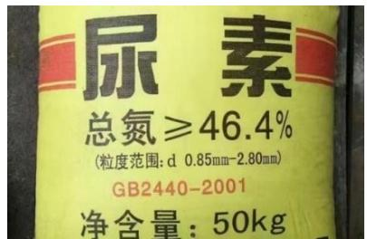

【解析】氮（N）：生活中比较常见。

1. 农作物所必需的三种营养元素，氮、磷、钾。氮肥关系生长发育、绿色（增强光合作用改善叶片）、幼苗的发育，如茎秆粗壮、抗倒伏。生活中不会单一施肥，因为有复合肥，既能达到促苗的作用，还能绿叶、增产、壮秆、抗倒伏。
2. 氮气  $\left(\mathrm{N}_{2}\right)$  占空气体积的  $78 \%$ , 化学性质很稳定, 通常用于保护气, 如薯

片中充填的气体；汽车的安全气囊遇到猛烈碰撞，快速充起来的气体也是氮气。

3.二氧化氮（ $\mathrm{NO}_2$ ）和二氧化硫是酸雨或土壤酸化的重要成因，因此工厂、汽车尾气要处理后排放。尿素主要是氮肥的作用。

# 九、碳（C）

# 1. 碳的几种常见单质

（1）金刚石：自然界中最硬的物质，可用于制作钻石、钻探机的钻头和裁玻璃等。
(2) 石墨: 最软的矿物之一, 有优良的导电性、润滑性, 可用于制作干电池的电极、铅笔芯等。
(3) 无定形碳: 由石墨的微小晶体和少量杂质构成, 主要有焦炭、木炭、活性炭和炭黑等。活性炭、木炭具有吸附性, 焦炭用于冶铁, 炭黑加到橡胶里能够增加轮胎的耐磨性。

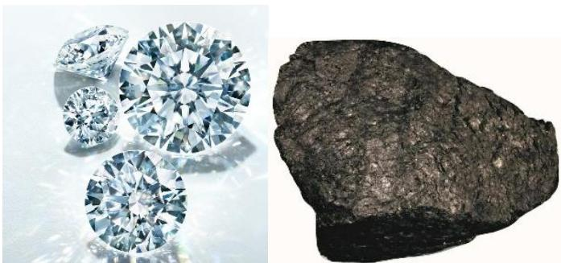

【解析】碳的几种常见单质：重点把握前两个。

1. 金刚石：自然界中最硬的物质。几乎不导电。
2. 石墨：最软的矿物之一，可用于制作干电池的电极（导电性比较好）、铅笔芯（比较软，能够留下痕迹）等。

(1) 铅笔芯中没有铅, 主要由石墨和黏土制成, 以前人们做铅笔写字留下来的痕迹和金属铅做的记号笔留下的痕迹一样, 以前叫做黑铅, 慢慢演化为铅笔,如果铅笔芯中含有铅, 那么小时候吃过铅笔可能会立即中毒, 所以铅笔芯不含铅。(2) 汽车尾气含有铅, 现在推广无铅汽油。生活中见到的 92、95、98 是辛烷值, 通俗地说是抗爆性, 汽油高易燃易爆, 但是在汽车燃烧不爆炸, 如《速度与激情》中油门踩到底尾气排气管喷火也没有爆炸, 辛烷值的关键在于加了铅,铅的重要用途是抗爆炸。

3. 无定形碳：活性炭、木炭具有吸附性。
   4.1克拉  $= 0.2$  克。1克  $= 5$  克拉。钻石（金刚石）的本质是碳。

# 2. 一氧化碳（CO）

在标准状态下，一氧化碳为无色、无味的气体，在水中的溶解度很小，难溶于水。一氧化碳极易与血红蛋白结合，形成碳氧血红蛋白，使血红蛋白丧失携氧的能力，造成组织窒息，严重时死亡。

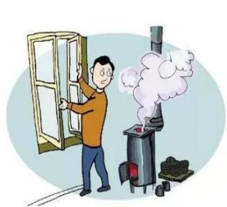

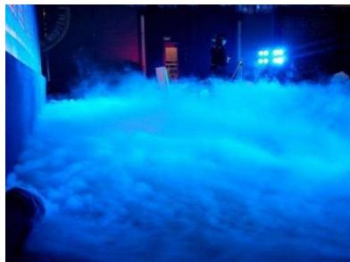

# 3. 二氧化碳  $\left(\mathrm{CO}_{2}\right)$

常温常压下，二氧化碳是一种无色无味、不助燃、不可燃的气体，密度比空气大，能溶于水，与水反应生成碳酸。

固态二氧化碳又叫干冰，-78.5℃时升华，可以吸收周围的热量，使周围水汽凝结，形成一种云雾缭绕的景象，同时可使周围温度迅速降低，因此干冰常用于低温保存物品。

# 【解析】

1. 一氧化碳（CO）：北方省份爱考，多个省份密切考查过，涉及北方省份集中供暖和自家采暖的问题。人体血细胞中最多的是红细胞，红细胞中的重要成分是血红蛋白，血红蛋白是红色的，导致血液是红色的，含氧气的鲜红的是动脉血，不含氧气的暗红的是静脉血。血红蛋白正常的作用是运输氧气，但是一氧化碳极易与血红蛋白结合（记忆），血红蛋白结合一氧化碳的能力是结合氧气能力的50-200倍左右，人一旦吸入一氧化碳，血红蛋白丧失携氧的能力，导致缺氧性中毒（考过若干次，重点）。

# 2.二氧化碳（  $\mathrm{CO}_{2}$  ）：

(1) 密度比空气大, 能溶于水, 与水反应生成碳酸。如可乐、雪碧等碳酸饮料, 证明二氧化碳能溶于水。

（2）固态二氧化碳又叫干冰，升华可以吸收大量的热量，让整个空气温度骤降，气态的水分子遇冷凝结成若干小水滴，变为液态水分子，该过程为液化。因此干冰常用于低温保存物品。干冰是固态二氧化碳，固态变成气态二氧化碳需要升华，和水烧开的过程是一样的需要带走大量的热量，想要造成舞台烟雾缭绕的效果让干冰升华即可，整个舞台空气温度骤降，温度降低，气态水分子遇冷凝结为液态小水滴，变成人肉眼可见的烟雾，因为气态水分子是人肉眼不可见的。

# 十、氯（C1）

氯单质由氯分子构成, 每个氯分子由两个氯原子构成, 化学式为  $\mathrm{Cl}_{2}$  。常温常压下, 氯气为黄绿色气体, 有强烈的刺激性气味, 化学性质十分活泼, 具有毒性。自来水常用氯气消毒, 原理是其与水反应生成了次氯酸 (HC10), 次氯酸的强氧化性能杀死水里的病菌。

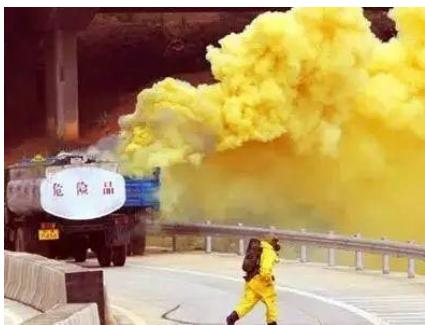

【解析】氯（C1）：考查比较单一，生活中比较常见。氯不会考查元素，会考查单质即氯气。常温常压下，氯气为黄绿色气体，有强烈的刺激性气味，如图是某次交通事故现场发生了氯气泄漏的情况。家中几乎不会直接接自来水喝，因为总觉得会有股怪味，尤其更不可能用自来水泡茶，用自来水洗漱能够闻到怪味即残留的次氯酸的味道（在安全范围内）。氯气有毒，会灼伤呼吸道，但是自来水常用氯气消毒，原理是其与水反应生成了次氯酸（HC10），次氯酸的强氧化性能杀死水里的病菌。家中的各种消毒剂、马桶清洁剂、八四消毒液一般会加氯的相关成分。

# 第二节 能源

【解析】能源：比较简单，把握三种能源判断的方式。

# 一、常规能源和新能源

# 1. 常规能源

常规能源即传统能源，是指技术上比较成熟，已被人类广泛利用，并在生产和生活中起着重要作用的能源，如石油、天然气、煤炭和水电等。

# 2.新能源

新能源是指传统能源之外的各种能源形式，具有污染小、储量大的特点，如太阳能、地热能、风能、海洋能、生物质能和核能等。

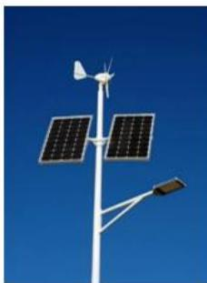

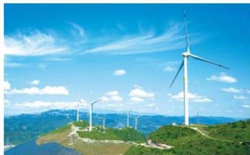

【解析】常规能源和新能源：

1. 常规能源：即传统能源，如石油、天然气、煤炭（三大传统化石能源），人类发现开采以来，技术上比较成熟，已被广泛利用，并在生产和生活中起着重要作用。除了这三种以外，一般默认为新能源。
   2.新能源。

# 二、一次能源和二次能源

1. 一次能源：自然界中以原有形式存在的、未经加工转换的能量资源，如化石能源、太阳能、风能、地热能、核能、潮汐能等。
2. 二次能源：由一次能源经过转化或加工制造而产生的能源，如焦炭、蒸汽、液化气、酒精、汽油、电能等。

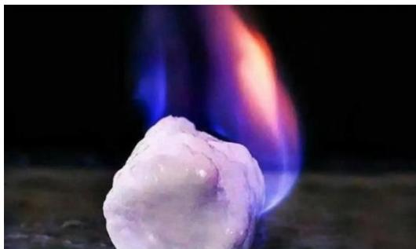

【解析】一次能源和二次能源：

1. 一次能源：自然界中以原有形式存在的、未经加工转换的能量资源，如化石能源（当中有石油，和街上的汽油、柴油、航空燃油不同，能直接开采的只有石油，汽油、柴油、航空燃油都需要加工，汽油分为92、95、98的，一定需要加工）、太阳能、风能、地热能、核能（核燃料、核反应堆、核聚变，现在比较广泛应用的核燃料是铀，如铀235、铀238，铀和铁、铜一样，自然界有铁矿、铜矿、铀矿）、潮汐能（利用水动力，推动轮机进一步机械能到电能的转换）等。
2. 二次能源：自然界中没有，需要人为进行转换。由一次能源经过转化或加工制造而产生的能源，如焦炭、蒸汽、液化气、酒精、汽油、电能（所有电能一定是人为的，包括一切电能，如风力发电、水力发电、火力发电以及核电）等。

# 三、非可再生能源和可再生能源

1. 非可再生能源：指在自然界中经过亿万年形成，短期内无法恢复，且随着大规模开发利用，储量越来越少，总有一天会枯竭的能源。化石燃料（煤、石油、天然气等）、核燃料均为非可再生能源。
2. 可再生能源：指在自然界中可以循环再生的能源。太阳能、水能、风能、生物质能和地热能等均为可再生能源。

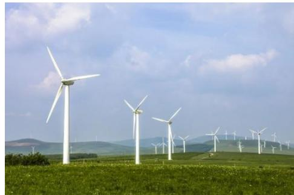

# 【解析】非可再生能源和可再生能源

1. 非可再生能源/不可再生能源：短期内无法再次生成。化石燃料（煤、石油、天然气等）、核燃料均为非可再生能源，不是几百年、几千年形成的。如“铁人王进喜”，1959年我国发现第一大油田大庆油田，后来经过地质勘探大庆油田形成于白垩纪，距今1.45亿年前。
2. 可再生能源：短期内能够再次生成。太阳能、水能、风能、生物质能和地热能等均为可再生能源。如今天是晴天能够用太阳能热水器，只要明天还是晴天，依然能够用太阳能热水器洗热水澡。
3. 注意：可燃冰也叫气冰/固体瓦斯，本质是天然气水合物，主要成分是甲烷，可燃冰、沼气、天然气的主要成分都是甲烷，燃烧会生成二氧化碳和水，我国是世界上第一个成功开采可燃冰的国家，我国2017年在南海神狐海域完成了世界中首次可燃冰开采，开采成本极高、难度极大，我国在这方面的实力世界第一。可燃冰分布于陆地永久冻土带，如青藏高原以及深海大陆架底部，短期内不能再生。

# 考点三 生物常识——营养物质

碳水化合物（糖类）、脂肪、蛋白质、水、无机盐（矿物质）和维生素是人体所需的六大营养物质。

# 一、糖类

糖类主要由碳、氢、氧组成，是人体最重要的供能物质，也是构成细胞的成分。葡萄糖、蔗糖、淀粉和纤维素等都属于糖类化合物。

血液中的糖主要为葡萄糖。米饭中含有淀粉，在咀嚼时，淀粉在口腔内唾液淀粉酶的催化下发生反应，生成麦芽糖，因此会有甜味。

单糖：葡萄糖、果糖、半乳糖、木糖

二糖：蔗糖、乳糖、麦芽糖

多糖: 淀粉、纤维素、糖原

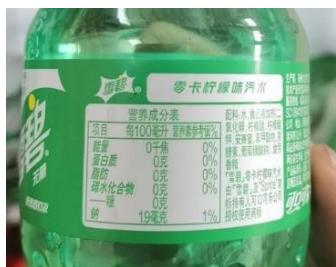

# 【解析】

1. 碳水化合物（糖类）、脂肪、蛋白质、水、无机盐（矿物质）和维生素是人体所需的六大营养物质。糖类、脂肪、蛋白质可以给人体提供能量，供能顺序为糖类、脂肪、蛋白质；水、无机盐（矿物质）和维生素不能给人提供能量，但是也不能缺。早饭来不及吃可以含一块糖；通过绝食的方式让体重大量骤降非常不安全，糖不占人的质量，不吃饭降低的体重来源于脂肪、蛋白质，此时人的生命体征非常危险。
2. 糖类是人体最重要的供能物质，也是构成细胞的成分。
3. 血液中的糖主要为葡萄糖（考试考查最多）。

(1) 单糖: 葡萄糖 (重点)、果糖 (重点)、半乳糖、木糖。小肠能够直接吸收单糖 (只有一个单糖分子), 二糖和多糖需要经过分解才能被人体所吸收,如张三吃坏了肚子, 急性肠胃炎, 生命体征微弱, 此时需要补能量注射葡萄糖溶液。

(2) 二糖: 蔗糖 (重点)、乳糖 (重点)、麦芽糖。
(3) 多糖: 淀粉 (重点)、纤维素、糖原。

# 二、脂肪

脂肪是单位质量释放能量最多的物质，但一般情况下，脂肪作为备用能源物质贮存在体内。脂肪有保温的作用。

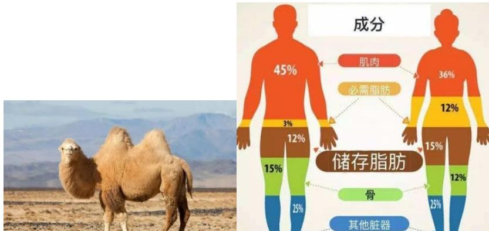

【解析】脂肪：一般情况下，脂肪作为备用能源物质贮存在体内。脂肪是单位质量释放能量最多的物质（如  $1\mathrm{g}$  脂肪、 $1\mathrm{g}$  蛋白质、 $1\mathrm{g}$  糖释放能量最多的是  $1\mathrm{g}$  脂肪），必要的时候人体内的脂肪能够提供生存能量。如发生自然灾害，有些被困人员被困好几天，没有进食任何糖类但能维持生命体征，主要是脂肪在维持能量。脂肪不仅作为能源物质，还有保温作用、缓冲作用，人体各个脏器和关节之间如果没有脂肪缓冲减震，很容易伤到自己。如右图，人体脂肪集中在臀部和大腿，这两个部位是相当难瘦的部位，全世界公认的最好的办法是跳绳。

# 三、蛋白质

蛋白质是由氨基酸按一定顺序结合形成一条多肽链,再由一条或一条以上的多肽链按照其特定方式结合而成的高分子化合物。

蛋白质的功能：

①蛋白质是构成人体细胞的基本物质，参与损伤细胞的修复和更新；
(2) 为人体的生理活动提供能量;
(3)具有催化功能, 大多数酶的化学本质是蛋白质;
(4)运输氧气, 血红蛋白是红细胞内运输氧的特殊蛋白质, 使血液呈红色, 由珠蛋白和血红素组成。

【解析】蛋白质：

1. 能够为人体提供能量, 每天要摄入一定的蛋白质。蛋白质的单位是氨基酸。
2. 蛋白质的功能：

(1) 蛋白质是构成人体细胞的基本物质, 参与损伤细胞的修复和更新。八块腹肌、马甲线主要说的是蛋白质, 如专业运动人员每天喝的是蛋白粉。（2）为人体的生理活动提供能量。(3) 酶具有催化作用, 大多数酶的化学本质是蛋白质, 所以蛋白质有催化功能。(4) 运输氧气, 血红蛋白是红细胞内运输氧的特殊蛋白质, 使血液呈红色,由珠蛋白和血红素组成。

3. 为了保持好身材选择拒绝吃肉类，红肉口感比较好，如牛肉、羊肉、猪肉，但弊端是蛋白质不优质，且容易让人长胖；白肉口感没有那么好，但属于优质蛋白，而且不容易长胖，如鸡、鸭、鱼、虾，如健身人士的减脂餐是鸡胸肉。辩证的观点，要想结果不长肉就要接受口感不好的事实，要想追求味蕾的刺激就要接受长胖的隐患，不存在一种肉有绝对的好或绝对的不好。

# 四、水

水占体重的  $60\% \sim 70\%$  ，是细胞的主要组成成分，人体的各种生理活动都离不开水。

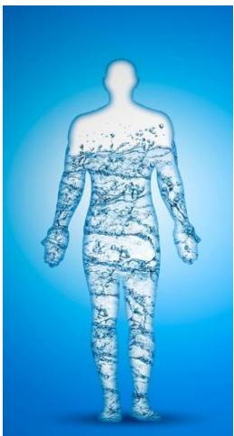

【解析】水：水占体重的  $60\% \sim 70\%$  （屈辱的历史，和日本731部队有关，是用我们做实验得出的，勿忘国耻），水是生命之源。

# 五、无机盐（矿物质）

矿物质是人体内无机物的总称，包括常量元素和微量元素。

1. 常量元素是指在人体中含量超过  $0.01\%$  的元素, 如钙、磷、钠、钾、镁等。

<table><tr><td>常量元素</td><td>主要功能</td><td>缺乏症</td></tr><tr><td>钙</td><td>构成骨骼和牙齿,促进血液凝固,保持机体运动,有  助于神经刺激的传导。</td><td>佝偻病(少儿)、骨质疏松症(中老 年)、腿部肌肉痉挛。</td></tr><tr><td>磷</td><td>构成骨骼和牙齿的重要成分,是心脏有规律地跳动、 维持肾脏正常机能和传导神经刺激的重要物质。</td><td>骨质疏松、骨软化、容易骨折、肌无 力、厌食。</td></tr><tr><td>钠</td><td>是正常生长发育中不可或缺的物质,可使钙(含钙食 品)和其他矿物质溶于血液中,与新陈代谢息息相关。</td><td>精神不佳、食欲不振,严重时会出现 心脏方面的疾病。</td></tr><tr><td>钾</td><td>维持酸碱平衡,参与能量代谢,维持神经、肌肉的正 常功能。</td><td>肌无力、心律失常。</td></tr><tr><td>镁</td><td>促进骨骼的生长,调节神经、肌肉的兴奋性。</td><td>损伤神经系统,引起肌肉震颤、手足 搅搦等肌肉问题。</td></tr></table>

# 【解析】

1. 矿物质是人体内无机物的总称，包括常量元素和微量元素。
2. 常量元素是指在人体中含量超过  $0.01\%$  的元素（记忆为万分之一以上），如钙、磷、钠、钾、镁等。

(1) 钙 (重点): 从小就疯狂补钙, 父母希望孩子长高。缺乏症: 佝偻病 (少儿)、骨质疏松症 (中老年)、腿部肌肉痉挛 (钙和骨骼有关, 如晚上睡觉会抽筋)。
(2) 钠 (重点): 影响心血管系统, 如高血压, 如果长辈血压高要购买低钠生抽、低钠调味品。
(3) 钾 (重点): 体检特别容易查出来窦性心律不齐, 不影响入职, 主要和

作息规律有关，不用特意服用药物，改善作息即可。

2. 微量元素是指在人体中含量在  $0.01\%$  以下的元素，如碘、铁、锌、硒、氟等。

<table><tr><td>常量元素</td><td>主要功能</td><td>缺乏症</td></tr><tr><td>碘</td><td>参与甲状腺素的合成。</td><td>甲状腺肿（大脖子病）、克汀病（呆小病）。</td></tr><tr><td>铁</td><td>参与血红蛋白的形成。</td><td>缺铁性贫血、免疫力下降。</td></tr><tr><td>锌</td><td>促进生长发育，参与多种酶的合成，增强组织再生能力，增强记忆力。</td><td>食欲不振、生长迟滞、发育不良。</td></tr><tr><td>硒</td><td>抗氧化，保护红细胞，被称为“长寿元素”“抗癌之王”“心脏守护神”。</td><td>可能引起表皮角质化和癌症。如摄入量过多，会引起中毒。</td></tr><tr><td>氟</td><td>在骨骼与牙齿的形成中有重要作用。</td><td>易引起龋齿。摄入过量会引起氟斑牙和氟骨症。</td></tr></table>

【解析】微量元素是指在人体中含量在  $0.01\%$  以下的元素（万分之一以下）：

1. 碘：缺乏症是甲状腺肿（大脖子病）。
2. 铁：缺乏症是缺铁性贫血、免疫力下降。生活中的谣言“缺铁可以用铁锅炒菜”，非常不推荐，铁锅的铁无法被人体直接吸收。
3. 锌：关系生产发育和智力，儿童保健品补的最多的是钙、铁、锌。

# 六、维生素

# （一）常见的脂溶性维生素

<table><tr><td>维生素</td><td>功能</td><td>缺乏症</td></tr><tr><td>维生素A</td><td>维持视觉,促进生长发育,维持上皮结构完整与健全,增强免疫力,消除自由基。</td><td>夜盲症。</td></tr><tr><td>维生素D</td><td>唯一一种人体可以少量合成的维生素(多晒太阳可合成)。帮助人体吸收磷和钙,是造骨的必需原料。</td><td>骨质软化、儿童患软骨病(佝偻病)。</td></tr><tr><td>维生素E</td><td>延缓衰老,改善脂质代谢,预防癌症,促进激素分泌。</td><td>溶血性贫血、更年期综合征、色素沉淀。</td></tr></table>

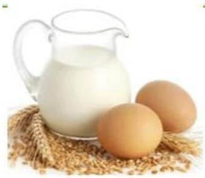

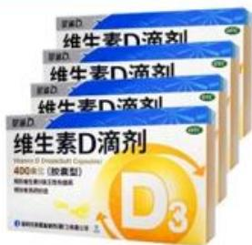

【解析】维生素目前发现接近30种，维生素B族讲义中只介绍了B1，但是B族有接近10种，不需要全部掌握，考试往往考查的比较集中。常见的脂溶性维生素：

1. 维生素A：与夜盲症相关。
2. 维生素D：与佝偻病相关。
3. 维生素E：如购买化妆品，不管多贵多便宜的牌子化妆品公司追求的成分是维生素E，功能是延缓衰老，改善脂质代谢，能够让肌肤更加Q弹。很多产品宣称淡斑、淡化法令纹、消除黑眼圈、美白等功能，不管什么产品一定会有维生素E，维生素E可以积极改善色素沉淀，可以把维生素E胶囊剪开当作面膜敷在脸上，效果会非常好。

# （二）常见的水溶性维生素

<table><tr><td>维生素</td><td>功能</td><td>缺乏症</td></tr><tr><td>维生素B1</td><td>维持人体正常的新陈代谢，以及神经系统的正常生理功能。</td><td>脚气病</td></tr><tr><td>维生素C</td><td>帮助人体完成氧化还原反应，从而使脑力好转。</td><td>坏血病，易感冒、咳嗽。</td></tr></table>

【解析】常见的水溶性维生素：

1. 维生素C（重点、常考）：

(1) 功能：帮助人体完成氧化还原反应，从而使脑力好转，提高免疫力。(2) 缺乏症: 坏血病, 易感冒、咳嗽。流感多发的季节除了喝中药如板蓝根预防, 还可以每天坚持吃维生素 C, 对提高免疫力的效果比较好。

2. 注意：未来出现了缺乏某种维生素的情况，不需要专门补充，绝大多数的缺乏是因为挑食，不挑食一般不会缺乏，除了先天性缺乏以外。

# 【实战演练】

1.（2025国考）下列情境中的两个物理量成正比的是：

(1) 通过某一电阻器的电流与其两端的电压
(2)物体所受浮力与其体积
(3)弹性限度内弹簧的伸长量与其所受拉力
(4)汽车行驶时的加速度与速度

A. ①② B. ②④
C. ③④ D. ①③

【解析】1. ①  $\mathrm{U} = \mathrm{IR}$ ,  $\mathrm{U}$  和  $\mathrm{I}$  成正比, 当选。②  $\mathrm{F}_{\text {浮}} = \rho_{\text {液}} \mathrm{gV}_{\text {排}}$ , 是排开水的体积,一个东西的体积不一定能排这些水, 如果全部浸没在水里才是全部体积, 如果浸没一半则只有  $1 / 2$  的体积, 排除。③ 胡克定律,  $\mathrm{F} = \mathrm{kx}$ ,  $\mathrm{x}$  是形变量,  $\mathrm{F}$  是弹力,  $\mathrm{k}$  是一个材质的弹性系数, 不同材料弹性系数不同, 一般形变量越大弹性越大, 如越用力拉弹弓弹力越大, 当选。④ 加速度和速度没有直接关系, 加速度是速度变化快慢的物理量,  $\mathrm{a} = \Delta \mathrm{v} / \Delta \mathrm{t}, \Delta \mathrm{v}$  是  $\mathrm{V}_{1} - \mathrm{V}_{2}, \Delta \mathrm{t}$  是  $\mathrm{t}_{1} - \mathrm{t}_{2}$ , 排除。【选 D】

2.（2024 福建）下列关于游乐项目所蕴含的物理原理说法错误的是：

A. 过山车快速下降时, 人感觉自己要飘起来了, 是因为人的重力减小了
B. 沙滩车的轮子往往做得特别宽大，是为了减小轮子对沙地的压强，防止下陷
C.蹦极运动中，腿部绑弹性绳，是为了增加绳对人的作用时间，减小绳对人的作用力
D. 践跷板游戏中, 人越靠近支点越不容易压动跷跷板, 是人对板作用力的力臂减小的缘故

【解析】2. 选非题。A项：超重和失重，只是一种感觉，人的重力只和质量有关，不可能坐过山车之后一个人变胖或变瘦，当选。

C 项：腿部绑弹性绳，是为了减小绳对人的作用力，对人的腿起到缓冲保护

作用，绳子类似于橡皮筋，不可能是拔河比赛的绳子，否则人会四分五裂，从蹦台蹦下来之后能够反弹回升，最后趋于平稳状态，排除。【选A】

3. （2024 浙江）某地质博物馆举办矿物展览会，下列对其展出的各类矿物的介绍不正确的是：

A. 赤铁矿常用来提取硫, 制造硫酸
B. 锡石是工业上用于炼锡的主要原料
C. 单一银矿较少见, 常与有色重金属铜、铅、锌等的硫化矿物共生
D. 石墨和金刚石是同一种元素因为外界条件不同而结晶成的不同矿物

【解析】3. 选非题。A 项: 赤铁矿是炼铁最主要的来源, 黄铁矿主要含有硫化亚铁, 其中含有硫, 能够提取硫制作硫酸, 当选。

B项：要想提取锡，锡石是主要原料，锡石的成分一般含锡量在  $80\%$  左右，如炼铁一定是从铁矿石中提取，排除。
C项：银比较活跃，单一的纯粹银矿比较少见，某地挖掘某个矿藏后，往往会同时发现其他矿藏，如发现油田的地方一般也会有天然气，合二为一称为油气田，排除。
D 项: 石墨和金矿石是晶体 (内部结构均匀), 本身是结晶形成的矿物。石墨和金矿石的本质是碳, 石墨和金刚石放在一起属于混合物, 石墨和金刚石性质不同, 石墨偏软, 金刚石偏硬, 石墨导电, 金刚石不导电, 二者不是同种物质,仅是碳的同素异形体, 因此放在一起是混合物; 再如氧气和臭氧放在一起 (表面是相同元素, 但氧气能呼吸, 臭氧不能呼吸, 二者不是相同物质)、红磷和白磷放在一起都是混合物, 排除。【选 A】

# 【答案汇总】

1-3: DAA

遇见不一样的自己

Be your better self
