# 精讲精练-常识2

（笔记）

主讲教师：李天然

授课时间：2025.03.20

# 精讲精练-常识2（笔记）

第二章 文史常识

<table><tr><td colspan="8">常识判断文史常识近五年考查数量</td></tr><tr><td>类型/年份</td><td>2020</td><td>2021</td><td>2022</td><td>2023</td><td>2024</td><td>2025</td><td>合计</td></tr><tr><td>副省级</td><td>4</td><td>3</td><td>5</td><td>4</td><td>2</td><td>2</td><td>20</td></tr><tr><td>地市级</td><td>1</td><td>1</td><td>4</td><td>3</td><td>1</td><td>2</td><td>12</td></tr><tr><td>行政执法</td><td>无</td><td>无</td><td>2</td><td>1</td><td>1</td><td>0</td><td>4</td></tr></table>

# 【注意】

1. 老师负责常识 2 和常识 3 的课程，对应 2026 国考讲义 55-91 页，本节课讲解文史部分。大家可以看纸质版讲义或下载电子版讲义，若没有讲义跟着老师课件即可。
2. 说明几点：

（1）常识文史信息量巨大，和其他的行测科目不一样，不能合并同类项，大家要调整心态，勇敢面对。(2) 文史的争议性比较大, 不仅有电视剧、小说等各种演绎, 学术界也众说纷纭, 所以课上以讲授内容为主, 与教科书保持一致, 不要随便开脑洞。（3）多听少记，课上以听懂理解为主，课后48小时会有助教笔记上传，对比复习。(4) 同学中有小白、大神, 小白课下多记、多背, 大神课上多点耐心, 相互体谅、和谐课堂。（5）课上以完成教学任务为主，回答不到的问题在下节课课前十分钟答疑。平时有疑问可以微博（@粉笔李天然）答疑。

3. 考情：上图是国考三类考试中文史的占比情况，涉及2020-2025年的考题状况，副省级一共20题，地市级一共12题，行政执法（2022年才开始考）一共4题。少的时候不考，大部分情况下1道题，多的时候4-5题。根据考情了解

花费多少精力学习文史，考不同试卷的同学可以进行选择性学习。

# 目录

01 中国古代史
02 党史重要事件及会议

【解析】主要是两个大部分，按照时间轴顺序进行。

1. 中国古代史：讨论重点事件（朝代更迭，如战争等）和重大成就（文学、书法等）。
2. 党史：重要会议、起义、长征。

# 考点一 中国古代史

中国古代朝代歌

夏商与西周，东周分两段

春秋和战国，一统秦两汉

三分魏蜀吴，二晋前后延

南北朝并立，隋唐五代传

宋元明清后，皇朝至此完

【解析】中国古代朝代歌：记忆不住的可以搜一下早教儿歌宝宝巴士。

1. 夏商与西周，东周分两段（“两段”指春秋和战国）。
2. 春秋和战国，一统秦两汉（西汉在前、东汉在后）。
3. 三分魏蜀吴（东汉末年分三国），二晋前后延（三国尽归司马氏，由此出现西晋和东晋）。
4. 南北朝并立（乱世），隋唐五代传（隋朝实现统一）。
5. 宋元明清后，皇朝至此完。辛亥革命之后，袁世凯想要窃取胜利果实，孙中山先生迫于无奈承诺只要袁世凯逼迫清帝退位就让出大总统，1912年2月12日袁世凯逼迫宣统帝溥仪下诏退位，清朝灭亡，皇朝自此结束。

# 第一节 夏商西周

# 一、重要事件

# （一）鸣条之战

商王汤出兵伐夏，最终在鸣条击败夏王桀，史称“鸣条之战”，之后夏朝灭亡。

# （二）牧野之战

周武王率军伐纣，两军决战于牧野，史称“牧野之战”（相关典故：临阵倒戈），周军占领商都，商朝灭亡。

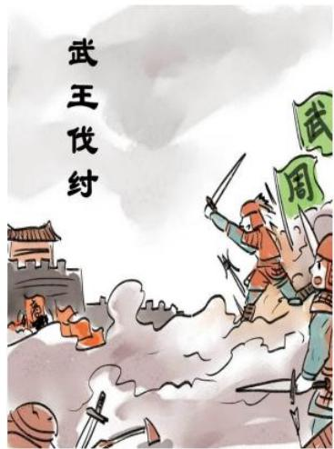

# 【解析】

1. 夏朝建立者：禹。大禹治水“三过家门而不入”，耗时13年治理好黄河的水患，大禹建立夏朝。夏朝最后一个王是夏桀，夏桀很暴虐，最终被黄河下游的商汤打败。
2. 鸣条之战：商王汤出兵伐夏，最终在鸣条击败夏王桀，史称“鸣条之战”，之后夏朝灭亡，商汤建立商朝。
   3.牧野之战：周武王率军伐纣。

（1）商朝最后一个王是纣王，商纣王派大军讨伐东夷，国内兵力空虚，附属国国王周武王姬发认为时机已到，集结军队开启了伐商的战争，即武王伐纣，对应“牧野之战”，是历史上非常著名的以少胜多的战役。
（2）典故：临阵倒戈。周武王联合其他部队大概5万兵马讨伐商纣王，纣王看到周武王打过来，自己的部队回不来，于是临时找了很多奴隶、俘虏凑了17万人，虽然人数很多，实际上都是乌合之众，奴隶不想给纣王卖命，还没开始打就临阵倒戈，调转枪头给周军开路，由此商朝灭亡。
4. 商朝灭亡，周武王建立西周，定都镐京（今陕西西安），因为地理偏西，

历史上把这段统治称为西周。

# 二、重大成就

# （一）分封制

周王室为加强统治，把一定的土地和人民授予王族、功臣和先代贵族等，让他们建立诸侯国，拱卫王室。

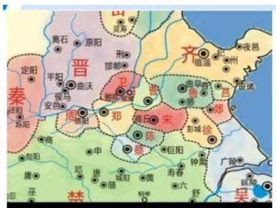

【解析】分封制：周天子打下天下之后分封皇族、功臣到各地建立诸侯国，帮助其开疆扩土、巩固王室，诸侯可以继续往下封，就是分封制。今天很多地方的称呼都与分封制有关，如山东省被称为齐鲁大地，因为当时山东地界分封了齐国和鲁国两个诸侯国；晋是山西的简称，因为当时分封在山西地区的是晋国。

# （二）甲骨文

甲骨文是中国商周时期刻在龟甲和牛、羊等兽骨上的文字，又称“甲骨卜辞”。

甲骨文是中国已发现的古代文字中年代最早、体系较为完整的文字。1899年，清朝人王懿荣首次发现甲骨文。2017年，我国申报的甲骨文成功入选《世界记忆名录》。

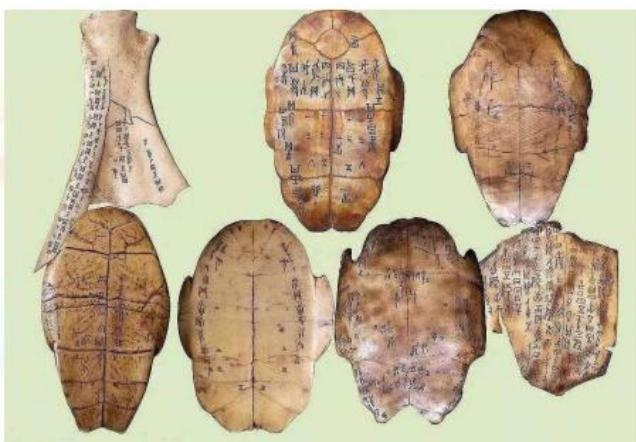

【解析】甲骨文（重点）：

1. 甲骨文是商周时期刻在龟甲、兽骨上的文字。我国最早有文字可考的历史从商朝开始。甲骨文是中国已发现的古代文字中年代最早、体系较为完整的文字。
2. 内容：甲骨文又称“甲骨卜辞”，内容主要和占卜有关，商朝人很迷信，认为万物皆有灵，无论军国大事、婚丧嫁娶都要先卜一卦，之后将结果刻在龟甲和兽骨上，形成甲骨文。
3. 发现者：清朝人王懿荣。

（1）王懿荣是晚清时期的金石学家，当时甲骨是一味中药，被称为龙骨。王懿荣有一次得病去拿药，发现龙骨上有字，于是甲骨文真正在学术意义上被发现。(2) 判断: 王懿荣发明了甲骨文 (错误), 原因: 甲骨文本来就存在, 王懿荣只是发现了甲骨文。

4. 2017年，我国申报的甲骨文成功入选《世界记忆名录》。《世界记忆名录》是世界文化遗产保护项目的延伸，侧重于文献记录，包括珍贵文件、手稿等，列入其中体现了甲骨文的重要文化价值和历史意义。

# （三）后母戊鼎

在河南省安阳市殷墟出土，为迄今世界上出土的最大、最重的青铜礼器。

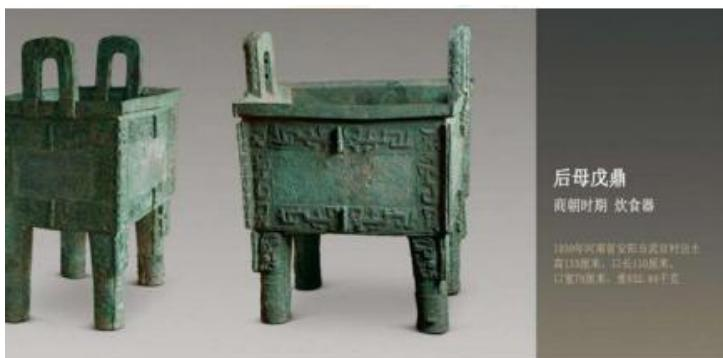

【解析】后母戊鼎：

1. 名称：一开始称为司母戊鼎，后来历史学家认为应该叫后母戊鼎，做题时后母戊鼎和司母戊鼎两种说法均正确。
2. 发掘地点：河南省安阳市殷墟出土，是商朝时期的青铜器。商朝最初定都于毫（今河南商丘），后来多次迁都，商王盘庚迁都到殷（今河南安阳），商朝

也称殷朝，在安阳发掘了商朝后期的都城遗址，发现了甲骨文。

3. 地位：迄今为止世界上出土的最大、最重的青铜器，高  $133 \mathrm{~cm}$  、重达  $832.84 \mathrm{~kg}$  （两个数字不用记忆，知道是最大、最重的即可）。
4. 后母戊鼎是青铜礼器，鼎原本是用来煮肉的，后因烹饪祭祀给神的肉上升为祭祀的礼器。后来鼎有了象征性意义，象征权力，如楚庄王“问鼎中原”，问的不是鼎的重量，而是问“我能不能一统天下”。

# 思维导图

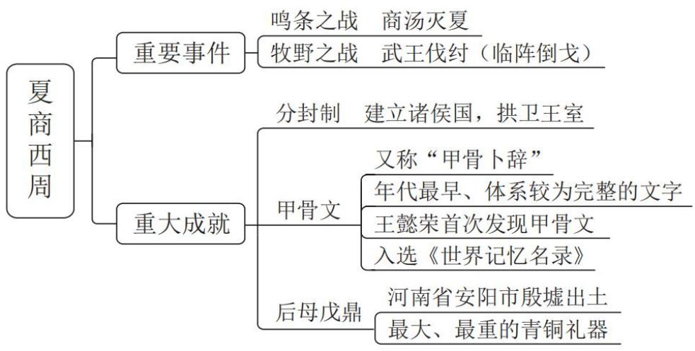

# 第二节 春秋战国

# 一、重要事件

# （一）桂陵之战

交战国家为魏、赵、齐。主要指挥官为齐国孙膑、魏国庞涓。相关典故：围魏救赵。

# （二）马陵之战

交战国家为魏、韩、齐。主要指挥官为齐国孙膑、魏国庞涓。相关典故：减灶诱敌（因势利导）。

# （三）长平之战

交战国家为秦、赵。主要指挥官为秦国白起，赵国廉颇、赵括。相关典故：纸上谈兵。

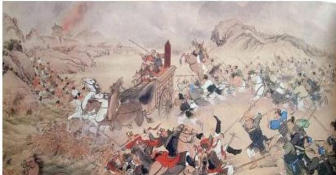

【解析】西周的亡国之君是周幽王，周幽王“烽火戏诸侯”，之后其儿子周平王迁都洛邑（今河南洛阳），因为洛阳位置偏东，历史上把这段统治称为东周。我们很少说东周，因为东周分为春秋和战国两段，主题是争霸打仗。

1. 桂陵之战和马陵之战既是两个国家之间的战争，也是两个人之间的较量，即齐国的孙膑和魏国的庞涓，二人都是鬼谷子的徒弟。庞涓先下山做了魏国的将军，后来孙膑投奔师哥庞涓，但是庞涓心眼特别小，认为孙膑很有本事，早晚有一天威胁到自己，于是挑拨离间和魏王说孙膑是间谍，孙膑因此受到髌刑（挖去膝盖骨），“髌”指膝盖骨。后来孙膑在齐国使者的帮助下到了齐国，受到了齐王的重用，由此开始了两人之间的第一场较量，即桂陵之战。

# 2. 桂陵之战：

(1) 魏国派庞涓攻打赵国, 赵国打不过向齐国求救。齐国派出孙膑, 孙膑并没有直接出兵帮助赵国, 而是带兵包围了魏国的都城大梁。庞涓一看自己的老家都快没了, 赶紧往回跑, 结果中途在桂陵中了孙膑的偷袭, 即围魏救赵。桂陵之战中庞涓被俘, 但孙膑认为有师兄弟情谊, 就放了庞涓, 若干年之后有了马陵之战。

(2) 相关典故: 围魏救赵。

# 3. 马陵之战：

(1) 魏国攻打韩国, 韩国打不过向齐国求救。孙膑采取减灶诱敌, 一边逃跑一边扔锅, 庞涓追的时候发现做饭用的锅灶一开始够 10 万人, 往后够 5 万人,再后来只够 3 万人吃饭, 庞涓就认为人都跑光了, 于是大意轻敌, 只带着少数精锐一直追到马陵。马陵两边是高山, 中间是峡谷, 庞涓进去后被一棵树挡住, 树上刻着 “庞涓死于此树之下”, 庞涓才意识到自己中计, 想跑已经来不及。此时埋伏好的齐军万箭齐发, 魏军大败, 庞涓羞愤不已, 最终自杀。

(2) 相关典故: 减灶诱敌; 因势利导 (马陵之战中孙膑猜到庞涓轻敌的心理, 因势利导采用减灶计让庞涓进入圈套, “因势利导” 对应孙膑)。(3) 桂陵之战、马陵之战以齐国孙膑的胜利而告终。

4. 长平之战：战国时期杀伤人数最多、持续时间最长的战役，自此之后六国再也无力与秦国抗衡。

(1) 交战双方为秦国和赵国, 赵国最开始派出的是老将廉颇 (《将相和》,负荆请罪), 廉颇非常有作战经验, 认为应该以逸待劳、坚守不出, 但是秦军远道而来要速战速决, 于是派间谍到赵国散播说秦军根本不怕廉颇, 怕的是赵括。
(2) 纸上谈兵: 赵括是战国名将赵奢之子, 熟读兵书但一场仗没打过 (纸上谈兵), 赵王用赵括换下廉颇, 而秦军派出战神白起。白起一战坑杀赵国 40 万人, 赵国再也没有能力和秦国抗衡。

# 二、重大成就

# （一）儒家思想

1. 孔子（至圣）

（1）名丘，字仲尼，春秋时期鲁国人，儒家学派创始人。
(2) 思想上主张 “仁” 和 “礼”; 政治上主张实行德政, 反对苛政。
(3) 教育上兴办私学, 主张 “有教无类” “因材施教”。
(4) 文化成果: 《论语》( “天何言哉? 四时行焉, 百物生焉, 天何言哉? ”)

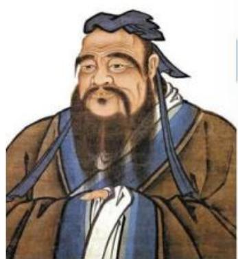

【解析】孔子：儒家创始人。

1. 孔子被称为“至圣”，即德行、才智都是最高的人，孔子生于春秋时期。
2. 思想上主张“仁”和“礼”：“克己复礼为仁”，意为克制自己，一切都按照礼的要求去做，主张“非礼勿视、非礼勿听、非礼勿言、非礼勿动”，提倡

人们要用克制和礼让的态度调和社会矛盾。

3. 政治上主张实行德政，以道德的原则治理国家，提倡以德治国。
4. 孔子生活在春秋时期，当时人们忙着争霸打仗，孔子提倡“仁”和“礼”没有人听，于是转而教书育人，对后世产生深远影响。孔子在教育上兴办私学，被誉为“万世师表”，主张“有教无类”（所有人都有资格接受教育）、“因材施教”（针对不同人的特点制定不同的教学方案）。
5. 文化成果：《论语》，不是孔子所写，而是孔子的弟子和再传弟子对孔子言行的整理。“天何言哉？四时行焉，百物生焉，天何言哉？”，意为“天何尝说过话呢，四季照常运行，百物照常生长”，一切规律和法则皆无言而自化，要依赖自己的观察发现这样的道理。

# 2.孟子（亚圣）

(1) 战国时期儒家代表人物之一, 中国古代思想家、哲学家、政治家、教育家。
(2) 政治上提出“仁政”“民贵君轻”的主张, 伦理观上主张 “性本善”。
(3) 文化成果: 《孟子》( “五谷者, 种之美者也; 苟为不熟, 不如黄稗。夫仁, 亦在乎孰之而已矣。”)

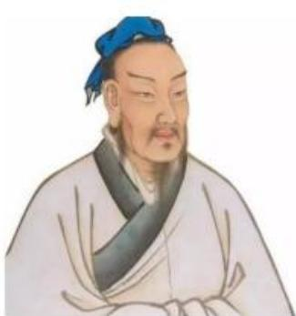

# 【解析】孟子：

1. 孟子被称为“亚圣”，是德行、才能仅次于孔子的人。典故有“孟母三迁”，是一个操心的老母亲寻找“学区房”的故事。孟子是战国时期儒家代表人物之一，原名叫孟轲，是中国古代的思想家、教育家。
2. 政治上提出“仁政”，发展了孔子“仁”的思想，提出“民为贵，社稷次之，君为轻”，即“民贵君轻”的思想，认为老百姓最重要。
3. 伦理观上主张“性本善”，认为人性有善的部分，天生有恻隐之心、恭敬之心、是非之心，要不断扩充、发展人的善心。
4. 文化成果有《孟子》，“五谷者，种之美者也；苟为不熟，不如荑稗。夫仁，亦在乎熟之而已矣”，“五谷”是粮食中的好品种，五谷若没成熟还不如草，借“五谷”的成长来评价“仁”的培养过程，仁的培养不是一蹴而就的，需要时间和经验的积累才能成熟。

# 3. 荀子

（1）战国晚期赵国人。
(2) 主张 “性恶论”, 提出 “礼法并用”。
(3) 代表作《荀子》。“君者舟也, 庶人者水也, 水则载舟, 水则覆舟”。

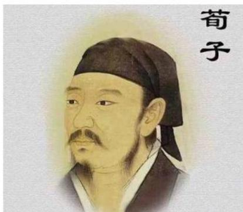

# 【解析】荀子：

1. 主张“性恶论”，认为人性中有恶的部分，提出“礼法并用”，好的部分要用礼弘扬，不好的地方用法惩罚。
2. 荀子作为儒家代表人物，教出了两个法家的弟子，一个是李斯（秦国的丞相），另一个是韩非子（法家集大成者）。
3. 代表作《荀子》: “君者舟也, 庶人者水也, 水则载舟, 水则覆舟”, 该观点最早出自《荀子》, 而不是出自魏征, 意为 “君主像船, 百姓像水, 水可以把船托起来, 也能把船掀翻”, 百姓是国家统治的根基。

# （二）道家思想

# 1. 老子

（1）姓李，名耳，字聃，道家学派创始人和主要代表人物。

(2) 思想核心是朴素的辩证法。
（3）政治上主张无为而治、不言之教。
(4) 代表作《道德经》。“道生之, 德畜之, 物形之, 势成之”

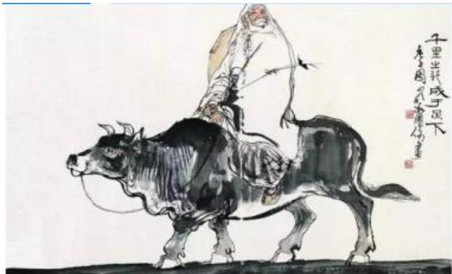

【解析】道家学说又称老庄之学。老子姓李，原名耳，是道家学派创始人。

1. 老子思想核心是朴素的辩证法，讨论“物极必反”，虽然不是原话，但其思想来自于此，原文是“反者道之动”，意思是任何事情某些性质发展到极端都会转变成它的反面，体现辩证思想。
2. 政治上主张无为而治、不言之教：“无为”不是什么都不做，而是不妄为、不瞎做，要顺应自然；“不言之教”是通过行动、环境等非语言的方式进行教育，而不是单纯通过语言表达信息。
3. 代表作：《道德经》。

(1) 典故: 紫气东来。老子过函谷关时, 人还没到, 守城的将士就看到了一股紫气自东方而来, 知道是圣人来了, 慢慢地老子骑着小青牛的身影出现, 将士让其留下点什么, 于是老子洋洋洒洒写了 5000 字的《道德经》, 就此出关去了。
(2) 其中 “道生之, 德畜之, 物形之, 势成之”, 意为通过道德养育万物。

# 2. 庄子

(1) 战国中期道家学派代表人物，与老子并称“老庄”。
(2) 崇尚自由, 提出了 “内圣外王” 的治国思想。
(3) 代表作《庄子》（“朝菌不知晦朔，蟋蛄不知春秋。”）

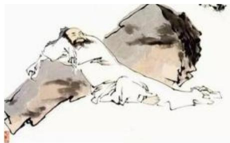

【解析】庄子：战国时期。

1. 庄子特别崇尚自由，思想更加洒脱，人生态度追求逍遥，逍遥到老婆死了他击鼓而歌，他认为人应该通达命运的安排，不要哀伤，于是开始唱歌。
2. 提出“内圣外王”的治国思想，指对内有圣人的才德，对外实施王道，是古代修身为政的最高理想。
3. 代表作《庄子》：汉代以后尊称庄子为南华真人，《庄子》也称《南华经》。其中“朝菌不知晦朔，蟋蛄不知春秋”，有一种菌类在早上萌发，到了傍晚就枯萎，就活这么一天，不知道一个月是什么样的。“晦”是每月的最后一天，“朔”是每月的第一天，“不知晦朔”意为不知道每月的第一天，也不知道每月的最后一天，说明生命的短暂和认知的局限性。

# （三）《诗经》

《诗经》是我国第一部诗歌总集，共收录了自西周初期至春秋中叶约500年间的诗歌，共311篇，其中6篇为笙诗。《诗经》分为风、雅、颂三部分，其中诗歌大量运用赋、比、兴三种表现手法，是中国诗歌现实主义风格的源头。

赋：“死生契阔，与子成说。执子之手，与子偕老”

比: “手如柔荑, 肤如凝脂”

兴: “关关雎鸠, 在河之洲。窈窕淑女, 君子好逑。”

【解析】《诗经》（重点）：

1. 《诗经》是我国第一部诗歌总集，一共收录了311篇，其中6篇为笙诗（只有名字、没有具体文词），有的教材说305篇也正确，但总之超过300首，所以《诗经》也称“诗三百”。
2. 内容：分为“风”“雅”“颂”三部分。

(1) “风”: 国风, 即各国的民歌, 是由劳动人民创作的, 流传很广, 大家耳熟能详。“风”是《诗经》中最精华的部分。

（2）“雅”：宫廷雅乐，分为大雅和小雅，大雅是正式场合唱的歌，比较庄严肃穆；小雅是吃饭宴请时唱的歌，比较轻松愉快。(3) “颂”: 可以组词为“歌颂”, 是歌颂周先祖闹革命、打江山的英雄事迹, 祭祀时使用的歌曲。

3. 表现手法：赋、比、兴，会给出句子判断用了哪种表现手法。

（1）赋：平铺直述，简单的叙述，如“执子之手，与子偕老”，意为就想握着你的手，两个人一起慢慢变老。(2) 比: 比喻、打比方, 如 “手如柔荑, 肤如凝脂”, 意为手像植物初生的嫩芽一样柔嫩。（3）兴：联想，中国人比较委婉，不直说，如想说“窈窕淑女，君子好逑”，要先说“关关雎鸠，在河之洲”。

4. 影响：《诗经》是中国诗歌现实主义的源头。《楚辞》是浪漫主义的。

# （四）都江堰

秦国李冰总结前人的治水经验修建了都江堰。

【解析】都江堰：位于四川成都，修建于战国时期的秦国，是秦国太守李冰父子主持修建的大型水利工程，两千多年来一直发挥着防洪灌溉的功能，到现在一直在使用，使得成都平原成为沃野千里的“天府之国”。

思维导图

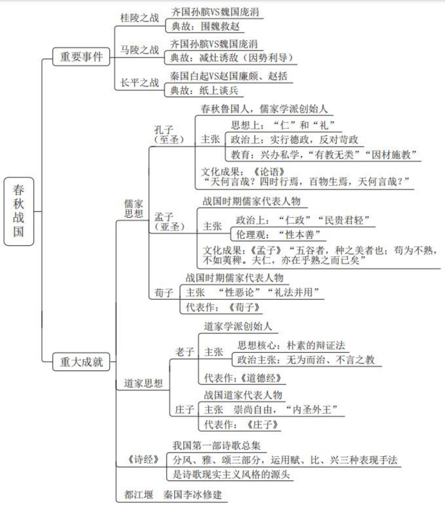
第三节 秦汉时期

# 一、重要事件

# （一）巨鹿之战

项羽在巨鹿之战（相关典故：破釜沉舟）中以少胜多，消灭了秦军主力，之后刘邦攻占咸阳（相关典故：约法三章），秦朝灭亡。

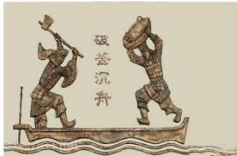

【解析】公元前230年到公元前221年，秦王嬴政陆续灭掉六国，统一中国，建立秦朝。

1. 巨鹿之战：项羽的成名之战，著名的以少胜多的战役。典故是“破釜沉舟”，项羽将吃饭的锅砸了，渡江的船凿沉了，不留后路，鼓舞士气，最终一鼓作气战胜秦军主力。
2. 约法三章：刘邦趁着秦军主力被项羽牵制，悄悄攻占咸阳，秦朝灭亡。刘邦进入咸阳后看到繁华的宫殿、漂亮的美女眼都绿了，谋臣张良亲自来劝，刘邦一听决定退军霸上，召集名士“约法三章”，“杀人者死，伤人及盗抵罪”，意为杀人的必须死，伤人及偷盗要入罪，其他秦朝的严苛律法一律废除，使他得到了民心支持。

# （二）汉武盛世

1. 政治上，颁布“推恩令”。
2. 思想上，接受董仲舒“罢黜百家，独尊儒术”的建议，把儒家学说立为正统思想。
3. 军事上，汉武帝派大将卫青、霍去病（相关典故：封狼居胥）北击匈奴，于漠北之战中大败匈奴。

【解析】秦朝灭亡后，刘邦建立西汉，一直传到汉武帝时期不断加强皇权，进行了一系列改革，实现汉武盛世。

1. 政治上：颁布“推恩令”，过去的诸侯王只能将封地、爵位传给嫡长子（大老婆的第一个儿子）。颁布“推恩令”之后，所有儿子都可以分割王国的土地、权力，导致土地和权力越分越小，削弱了诸侯国的势力，加强了中央集权，表面上是恩惠，实际加强了皇权。
2. 思想上：汉武帝采用董仲舒“罢黜百家，独尊儒术”的建议，儒家之外的各种学说遭受到不同程度的排斥，尊崇儒家学说，提倡大一统。汉武帝时期将儒家学说确立为正统思想、官学。
3. 军事上：漠北之战。汉武帝4年，霍去病远征匈奴，歼敌7万，封狼居胥，“封”指祭天，古时候用这种方法庆祝胜利，之后封狼居胥成为中华武将的最高荣誉之一。

# 二、重大成就

# （一）郡县制

设立郡、县两级行政机构，其主要官员由中央任免和考核。

# （二）统一文字

秦统一六国后，秦始皇命令丞相李斯等人制定笔画规整的小篆，作为通用文字颁行全国。

# 【解析】

# 1.郡县制：

（1）设立郡、县两级行政机构。（2）最早始于商鞅变法，公元前356年，秦孝公任用商鞅主持变法，变法的主要内容是推行县制，他认为之前的分封制严重削弱了中央集权力量，导致天子和诸侯脱节，于是在全国设立31个县，由国君委任县令，之后县上又设立郡，郡守和县令都由国家任命，根本上加强了中央集权。（3）等到秦始皇一统六国后，郡县制仍然在使用，郡县主要官员都由中央（皇帝）任免和考核。

2. 统一文字：秦统一六国后，秦始皇命令丞相李斯（荀子的徒弟）等人制定

笔画规整的小篆，作为通用文字颁行全国，李斯被称为“小篆之祖”。

# （三）史学成就

# 1. 《史记》

作者是西汉的司马迁。《史记》是我国第一部纪传体通史，记述了自传说中的黄帝时代到汉武帝太初年间约3000年的史事，被鲁迅誉为“史家之绝唱，无韵之《离骚》”。

十二本纪、三十世家、七十列传、十表、八书

【解析】《史记》：

1. 作者：西汉司马迁。
2. 《史记》是我国第一部纪传体通史，“纪传体”指以人物传记为纲，“通史”意为不是一朝一代的历史，《史记》记述了传说中的黄帝时代到汉武帝时期约三千年的史事。
3. 《史记》被鲁迅誉为“史家之绝唱，无韵之《离骚》”，不仅是史学专著，也具有很高的文学价值。
4. 全书包括十二本纪、三十世家、七十列传、十表、八书。

(1) 本纪：写的是帝王。
(2) 世家: 写的是诸侯。
(3) 列传: 写的是重要人物, 如一些人位极人臣, 比较重要, 就列入其中。
(4) 十表: 大事年表。
（5）八书：各种典章制度。

# 2. 《汉书》

又称《前汉书》，是中国第一部纪传体断代史，由东汉史学家班固编撰。

【解析】《汉书》：我国第一部纪传体断代史，“纪传体”是以人物传记为纲，“断代史”写的是一朝一代的历史，主要写西汉历史。作者是东汉史学家班固。

# （四）农业成就

# 1. 《太初历》

汉武帝时，天文学家制定了中国第一部较完整的历书《太初历》。

# 2. 《氾胜之书》

是我国现存最早的一部农学专著，记载了区种法等栽培技术。

# 3. 直辕犁

出现于汉代，有双辕和单辕之分，基本上是二牛抬扛式。

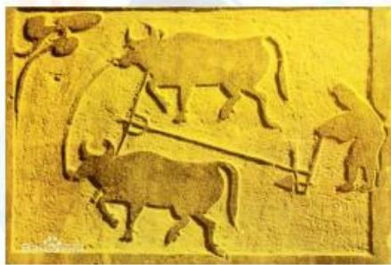

# 【解析】

1. 《太初历》：汉武帝时期，天文学家制定了中国第一部较完整的历书《太初历》。以前以十月份为新年的第一个月，《太初历》以正月为新年的第一个月，一直沿用到现在；并且将“二十四节气”纳入历法书中，用来指导农事。
2. 《氾胜之书》：作者是氾胜之，是我国现存最早的一部农学专著。其中记载了区种法的栽培技术，将田地划为小块进行精耕细作，是汉代精耕细作技术的重要组成部分。
3. 直辕犁：出现于汉代，如上图是直辕犁，一般是二牛抬杠式，比较适用于平原地区。

# （五）对外交流

汉武帝时，张骞两次出使西域，开辟了著名的“丝绸之路”，司马迁称之为“凿空”。此后，汉朝和西域各国的经济文化交流日益频繁。

1. 输出：冶铁术、井渠法、造纸术、丝织品和金属工具等。
2. 输入：佛教；葡萄、胡桃（即核桃）、苜蓿、石榴、良马等。

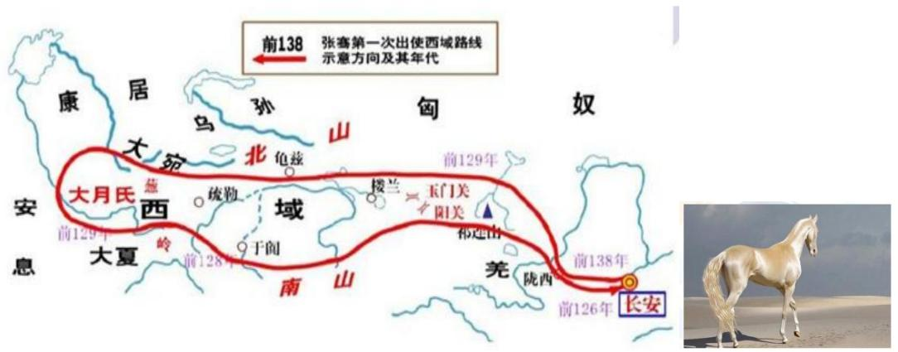【解析】对外交流（重点）：

1. 汉武帝时期，张骞两次出使西域，开辟了著名的“丝绸之路”。“丝绸之路”不是中国人命名的，德国的李希霍芬在其作品《中国》中首次提出“丝绸之路”概念。
2. 张骞两次出使西域的目的不同：

（1）第一次出使西域是军事目的。汉武帝为了反击匈奴派遣张骞出使西域，想要联合西域的国家大月氏共同抗击匈奴。但张骞刚出玉门关就被匈奴抓住，一关就是10年，好不容易逃出来，到了大月氏，大月氏已经安居乐业，不愿意打仗了。张骞第一次出使没有完成任务，只好返回，司马迁称张骞第一次出使西域为“凿空之旅”，“空”通“孔”。
(2) 第一次出使西域虽然没有达成军事上的目的, 但颇有收获, 张骞了解了西域的风土人情, 很多国家想与汉朝建立友好关系。于是汉武帝派张骞第二次出使西域。
（3）第二次出使西域以经济为目的，将汉朝的冶铁技术、造纸术、丝绸带到西域，同时也带回了很多东西。

①佛教沿着“丝绸之路”从古印度逐渐传入我国，西汉末年我国第一次接触到佛教。判断：刘邦为了打赢项羽去拜佛（错误），原因：佛教在西汉末年才传入我国。
(2)张骞还带回了葡萄、胡桃（核桃）、苜蓿（金花菜，可以入药）、石榴、良马（主要是汗血宝马，日行千里、夜行八百，可以流出血一样的汗水）等。判断：秦始皇喜欢喝葡萄酒（错误），原因：葡萄是西汉时期沿着“丝绸之路”传入我国的。

思维导图

# 第四节 三国两晋时期

# 一、重要事件

# （一）官渡之战

曹操偷袭袁绍军队的粮囤，迅速歼灭袁军主力，为以后统一北方奠定了基础。相关典故：火烧乌巢。

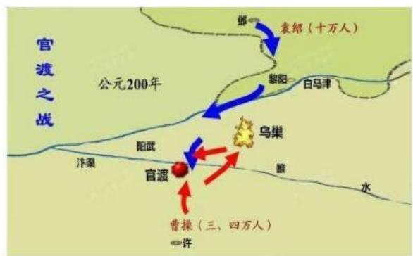

# （二）赤壁之战

孙权、刘备联军在长江赤壁一带大破曹操大军，为之后三国鼎立局面的形成

奠定基础。相关典故：火烧赤壁。

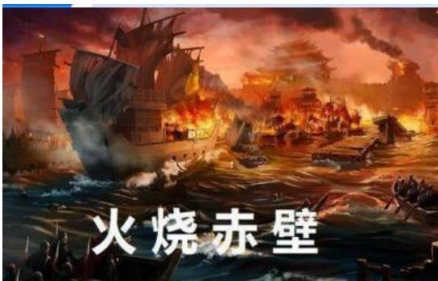

# （三）淝水之战

前秦皇帝苻坚讨伐东晋，双方于淝水交战，东晋以少胜多大败前秦。相关典故：投鞭断流、风声鹤唳、草木皆兵。

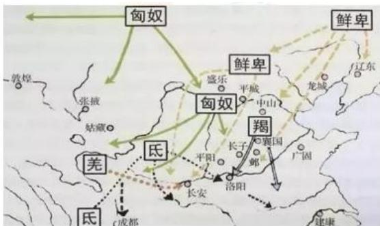

【解析】西汉后期政局混乱，外戚干政、宦官专权。公元9年，王莽自立为帝，改国号为“新”，建立了新莽政权。公元25年，刘秀打败王莽，在洛阳延续汉朝的统治，地理位置偏东，史称东汉，刘秀是汉光武帝。东汉末年分三国，进入三国两晋南北朝时期。

# 1. 官渡之战：曹操 VS 袁绍。

(1) 曹操和袁绍都是北方比较有实力的军阀, 一山不容二虎, 于是双方交战于官渡, 结果曹操胜利。
(2) 典故: 火烧乌巢。许攸原本是袁绍身边的谋士, 但是袁绍根本不听他的, 于是投奔了曹操, 并且献上了火烧乌巢的计策, 乌巢是袁绍囤积粮草的地方,一把火将粮草烧了, 曹操打败袁绍。

# 2. 赤壁之战：孙刘联军 VS 曹操。

(1) 曹操逐渐统一了北方, 但是不满足于此, 想要南下一统全国, 南方有依附于荆州的刘备和盘踞于江东的孙权, 孙刘联军联合抗曹, 爆发赤壁之战, 最终孙刘联军以少胜多, 曹操 20 万大军败给不足 5 万的孙刘联军。

(2) 火烧赤壁: 曹操的士兵不习惯坐船、不善水战, 于是曹操命人将船的首尾相连, 人和马在船上就如履平地, 结果给了周瑜、刘备好机会, 借着东南风选了 10 艘船, 装上干柴和枯草并同时点火, 船就像剑一样飞出去, 将曹操的战船全部烧光, 即 “火烧赤壁”。(3) 赤壁之战后曹操回到北方, 轻易不敢南下。赤壁之战为三国鼎立局面的形成奠定了基础, 三国鼎立的局面自赤壁之战初步形成。注意时间是官渡之战在前, 赤壁之战在后。

3. 三国先后立国，三国鼎立的局面正式形成，开始兼并的过程。三国中蜀国最弱，最先被灭，后来曹魏的政权旁落到司马家族手里，司马懿的孙子司马炎废了魏帝，自己当皇帝，建立西晋，西晋后来灭掉吴，统一了南北。公元280年三国尽归司马氏，三国鼎立局面结束。但是西晋皇帝无能，很快被匈奴灭掉。
4. 西晋灭亡之后，皇室贵族司马睿在建康（今江苏南京）建立东晋，南方是东晋政权。北方在西晋灭亡之后，许多少数民族卷入战争，如匈奴、鲜卑、羯、氏、羌，即“五胡乱华”。这些少数民族在黄河流域建立了大大小小16个政权，被称为“五胡十六国”。重点关注氏族，氏族建立前秦，首领为苻坚，在苻坚的带领下整个氏族逐渐强大，统一黄河流域。北方是前秦，南方是东晋，南北形成对立，必有一战，即淝水之战。

# 5.淝水之战：东晋VS前秦。

(1) 泾水之战的交战双方是前秦和东晋, 东晋以少胜多大败前秦。当时前秦派出 80 多万人, 荷坚认为自己的部队人多到将鞭子投入河里可以阻断河水的流动 (投鞭断流) 。东晋派出谢安和谢玄, 共 8 万多人, 对于东晋而言这是生死存亡之战, 输了就灭国, 所以绞尽脑汁要赢。开打之前东晋表示双方隔着河作战不方便, 让前秦军队先后撤, 等东晋军队过河之后再作战。苻坚很自大, 于是命令自己军队后撤, 结果在后撤过程中奸细大喊 “前秦已败”, 于是前秦军队乱作一团, 东晋兵马趁机快速过河, 大败前秦。前秦军队在逃跑的过程中但凡听到风吹草动, 都以为是东晋部队追上来了, 即 “风声鹤唳、草木皆兵”, 形容前秦军仓皇逃跑的样子。
(2) 相关典故: 投鞭断流、风声鹤唳、草木皆兵。

# 二、重大成就

# （一）文学成就

1. 曹操：代表作有《观沧海》（东临碣石，以观沧海）、《龟虽寿》（老骥伏枥，志在千里；烈士暮年，壮心不已）、《短歌行》（何以解忧？唯有杜康/周公吐哺，天下归心）等。
2. 曹植：代表作有《洛神赋》《白马篇》等。谢灵运赞其“才高八斗”。
3. 陶渊明：名潜，字元亮，号五柳先生，又称靖节先生，为田园诗派创始人。代表作有《饮酒》（采菊东篱下，悠然见南山）、《归园田居》（种豆南山下，草盛豆苗稀）、《桃花源记》（阡陌交通，鸡犬相闻）、《归去来兮辞》（悟已往之不谏，知来者之可追）、《咏荆轲》（图穷事自至，豪主正忙营）等。

# 【解析】

1. 曹操：一代枭雄。

(1) 《观沧海》: “东临碣石, 以观沧海”, “碣石”指河北的碣石山, “沧海”指的是渤海（河北靠近渤海湾）。(2) 《龟虽寿》: “老骥伏枥, 志在千里。烈士暮年, 壮心不已”, 体现曹操的雄心壮志。(3) 《短歌行》: “何以解忧? 唯有杜康”, “杜康”代指美酒, 桓雄郁闷的时候也喝酒; “周公吐哺, 天下归心”, 曹操说自己会像周公一样礼贤下士,希望天下的英杰都归顺自己。

2. 曹植：

（1）代表作《洛神赋》。传说曹植喜欢自己的嫂子甄宓，假借上古掌管洛河的地方水神洛神之名，以嫂子为原型，写下名篇《洛神赋》。(2) 曹植很有才, 谢灵运称赞曹植 “才高八斗”, “天下才共一石, 曹植独得八斗, 我得一斗, 天下人得一斗”。

3. 陶渊明：田园诗派的创始人，自己门前种了五棵柳树，所以自称“五柳先生”，代表作体现避世淡然的心态。

(1) 《饮酒》: “采菊东篱下, 悠然见南山”, “东篱”是陶渊明种菊花的地方, 后来代指菊花, 如李清照“东篱把酒黄昏后, 有暗香盈袖”。
(2)《归园田居》: “种豆南山下, 草盛豆苗稀”, 意为早出晚归种地,

结果草比豆苗还多。后来饿得不行去乞讨了，还写过《乞食》。

(3) 《桃花源记》: “阡陌交通, 鸡犬相闻”, 意为田间小路四通八达,村落间鸡鸣狗叫的声音此起彼伏, 是渔人进入桃花源后看到的景象, 构建了桃花源里恬静的生活美景, 是乌托邦一样的理想世界。
(4) 《归去来兮辞》: 陶渊明辞官时所写, “悟已往之不谏, 知来者之可追”, 用今天的意思表达就是 “昨天没有好好学习没关系, 明天再好好学习不就行了吗”。
(5) 《咏荆轲》: “图穷事自至, 豪主正忙营”, 荆轲刺秦王, “豪主”是秦王, 意为翻完地图, 突然出现匕首, 秦王一见此景胆战心惊。

# （二）书法

东晋书法家王羲之被誉为“书圣”，其代表作《兰亭集序》被誉为“天下第一行书”。相关典故：入木三分、东床快婿、书成换鹅、矫若游龙。

天下第一行书——晋·王羲之《兰亭序》

天下第二行书——唐·颜真卿《祭侄文稿》

天下第三行书——宋·苏轼《寒食帖》

# 【解析】书法：

1. 王羲之被誉为“书圣”，其代表作《兰亭集序》/《兰亭序》被誉为“天下第一行书”。“天下第二行书”是颜真卿的《祭侄文稿》；“天下第三行书”是苏轼的《寒食帖》。

# 2. 典故：

(1) 入木三分: 王羲之书法功力很深, 在木板上写字, 墨痕都可以透进三分。
(2) 东床快婿：王羲之年轻时，当时的太尉去王家选人当女婿，大家知道后都各种表现自己，只有王羲之露着肚子躺在东边的床上，偏偏被太尉看中，认为王羲之不矫情做作，于是选王羲之做了女婿，即“东床快婿”。
(3) 书成换鹅: 王羲之特别喜欢养鹅, 有一位道士想让王羲之给自己写一卷经, 打听到王羲之喜欢白鹅, 专门养了一批好品种的鹅, 王羲之知道后找到道士想买鹅, 道士说可以写经来换, 于是王羲之给道士抄了一卷经, 即“书成换鹅”。

(4) “矫若游龙”出自《晋书》, “论者称其笔势, 以为飘若浮云, 矫若游龙”, 称赞王羲之书法笔势刚健。

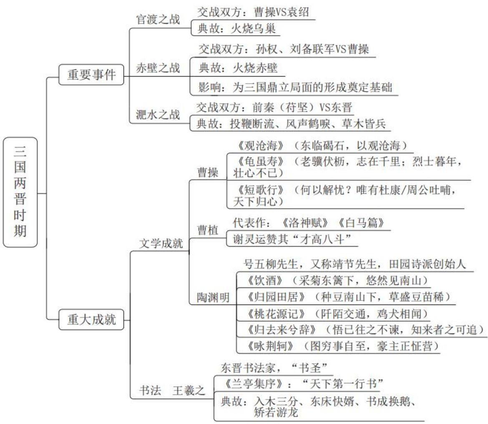
思维导图

# 第五节 隋唐时期

# 一、重要事件

1. 开皇之治——隋文帝杨坚。
2. 贞观之治——唐太宗李世民。
3. 开元盛世——唐玄宗李隆基。
4. 安史之乱——唐朝由盛而衰的转折点。

# 【解析】

1. 开皇之治：

(1) 隋文帝杨坚建立隋朝之后，进行了一系列的改革，国力不断强大，开创了开皇之治。(2) 隋文帝杨坚去世之后, 他的儿子杨广继位, 即隋炀帝。隋炀帝好大喜功、急功近利, 导致隋朝二世而亡, 进入唐朝。

2. 贞观之治：唐太宗李世民知人善任、虚怀纳谏，如魏征常常给他提意见，出现了唐朝第一个盛世局面——贞观之治。
3. 开元盛世：唐太宗去世后，他的儿子唐高宗继位，唐高宗性格软弱，权力旁落到了皇后武则天的手里。唐高宗去世后不久，武则天当上了皇帝，是我国历史上唯一一个女皇帝。到了晚年，武则天想要还政给李家，一会李显继位，一会李旦继位，一直到李旦的儿子唐玄宗李隆基继位后，才结束了混乱的局面。唐玄宗李隆基继位之后开创了开元盛世。
4. 安史之乱：李隆基的一生就是一条抛物线，开端即高潮，早期年轻有为，但到了晚年不理朝政，任用奸臣，天天跟杨贵妃饮酒作乐，“春宵苦短日高起，从此君王不早朝”。更严重的是，李隆基在军事上出现了失当，把兵力集中在边防，边防长官即节度使，如安禄山、史思明。节度使手握重兵，后来起兵叛唐，爆发了安史之乱。安史之乱是唐王朝由盛转衰的转折点（记忆）。公元905年朱温灭唐，唐朝灭亡。
5. 注意：开皇之治是隋朝，贞观之治、开元盛世、安史之乱是唐朝。

# 二、重大成就

# （一）科举制的确立与完善

隋炀帝时期，科举制度正式形成。唐武则天时期首创殿试、武举。唐玄宗时期，诗赋成为进士科主要的考试内容。

# 【解析】科举制：

1. 隋炀帝时期，科举制度正式形成。
2. 武则天时期首创武举、殿试，不只有文科状元，还有武状元；殿试是皇上作为考官亲自选拔人才。
3. 唐玄宗时期，诗词歌赋成为进士科的主要考试内容。唐诗繁荣，也是因为与政治挂钩。

# （二）隋唐大运河

隋炀帝在位时期，陆续开凿了一条贯通南北的大运河。大运河以洛阳为中心，北抵涿郡（今北京），南至余杭（今杭州），连接了海河、黄河、淮河、长江和钱塘江五大水系，全长2700多千米。

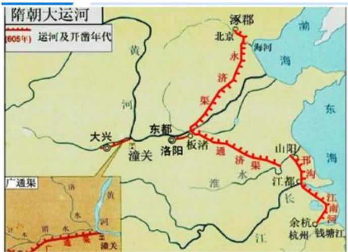

# 【解析】

1. 隋唐大运河：隋炀帝时期兴修大运河，即隋唐大运河。隋唐大运河以洛阳为中心，北抵涿郡（今北京），南至余杭（今杭州），连接了海河、黄河、淮河、长江和钱塘江五大水系，政治上可以巩固国家政权，经济上可以解决南粮北运的问题。
2. 注意：中国的大运河包含隋唐大运河、京杭大运河。

# （三）农业成就

曲辕犁，最早出现于唐代后期的江东地区，故又称“江东犁”，是中国古代耕作农具成熟的标志。

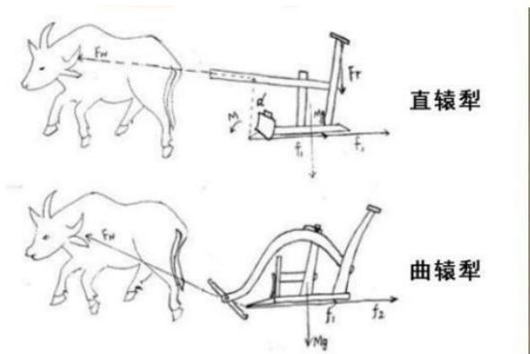

【解析】曲辕犁（重点）：曲辕犁是中国古代劳动人民的重大发明，如上图，上面是直辕犁，下面是曲辕犁。曲辕犁的好处是便于掉头、转弯，操作灵活，节省人力畜力，是中国古代耕作农具成熟的标志。

# （四）唐诗

【解析】唐诗：主要考查地点、典故，重点人物李白、杜甫可能考查时间排序。

1. 王勃，字子安，为“初唐四杰”之一，世人称其为“诗杰”。代表作有《送杜少府之任蜀州》（海内存知己，天涯若比邻）、《滕王阁序》（落霞与孤鹜齐飞，秋水共长天一色。渔舟唱晚，响穷彭蠡之滨；雁阵惊寒，声断衡阳之浦）、《滕王阁诗》（阁中帝子今何在？槛外长江空自流）等。

初唐四杰：王勃、杨炯、卢照邻、骆宾王

# 【解析】

1. 初唐四杰“王杨卢骆”，王勃、杨炯、卢照邻、骆宾王。
2. 王勃：王勃是“官二代”，家里有钱，但并不是纨绔子弟，从小就很有才华，6岁就能写文章，14岁写了《滕王阁序》。

(1) 《送杜少府之任蜀州》: “少府”是官名, 意为送一个姓杜的少府去蜀州, “蜀州”是四川。“海内存知己, 天涯若比邻”, 意为四海之内都有知己朋友, 虽然远在天边, 也像近邻一样亲近。(2) 《滕王阁序》: “落霞与孤鹜齐飞, 秋水共长天一色”, 写得实在太好了, 因此将《滕王阁序》称为 “天下第一骈文”, 骄文对仗工整、辞藻华丽,但没有什么具体内容, 之后古文运动反对的就是骈文。(3) 《滕王阁诗》: “阁中帝子今何在? 槛外长江空自流”, “帝子”指滕王李元婴, 他从山东滕州调任到江西, 非常思念滕州于是修建滕王阁。滕王阁位于江西南昌。

2. 李白，字太白，号青莲居士，又号“谪仙人”，唐代伟大的浪漫主义诗人，被后人誉为“诗仙”。

代表作有《上李邕》（大鹏一日同风起，扶摇直上九万里）、《黄鹤楼送孟浩然之广陵》（故人西辞黄鹤楼，烟花三月下扬州）、《行路难》（闲来垂钓碧溪上，忽复乘舟梦日边/长风破浪会有时，直挂云帆济沧海）、《庐山谣寄卢侍御虚舟》（五岳寻仙不辞远，一生好入名山游）等。

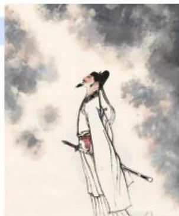

【解析】“诗仙”李白：伟大的浪漫主义诗人。

1. 《上李邕》：李白18、19岁时创作的。李邕是渝州刺史，李白想要结交李邕，希望能够得到他的举荐。李邕非常狂傲，李白年轻气盛，二人见面闹得不愉快，于是李白写下“大鹏一日同风起，扶摇直上九万里”，意为“你今天看不起我，明天我就让你高攀不起”。“大鹏”出自《庄子》，是《逍遥游》中的神鸟，大不知其几千里也，翅膀拍一下水就是三千里，扶摇直上可达九万里，大鹏在庄子的哲学体系中是自由的象征，李白深受其影响。
2. 《黄鹤楼送孟浩然之广陵》: “故人西辞黄鹤楼, 烟花三月下扬州”, “广陵”是扬州的古称。
3. 《行路难》: 李白当官后被赐金放还, 被迫离京, 在朋友给他践行的酒宴上满怀愤慨地写下了《行路难》。“闲来垂钓碧溪上”指姜太公姜子牙在河边垂钓, 遇到周文王被重用的典故。“忽复乘舟梦日边”指的是伊尹, 伊尹梦见自己乘船经过日月之旁, 不久就受到了商汤王重用的典故。李白引用这两个典故表明自己虽然现在受到排挤, 但终有一天会被朝廷启用, 给国家做出一番事业, 因此后面写了“长风破浪会有时, 直挂云帆济沧海”。
4. 《庐山谣寄卢侍御虚舟》：李白晚年时所写，“五岳寻仙不辞远，一生好入名山游”，意为攀登五岳寻找仙人一点也不怕路途遥远，这一生就喜欢到处游山玩水。
5. 杜甫, 字子美, 自号少陵野老, 唐代伟大的现实主义诗人, 被后人誉为 “诗圣”。杜甫的诗歌被后人评价为“诗史”。代表作有《望岳》（会当凌绝顶, 一览众山小）、《蜀相》（出师未捷身先死, 长使英雄泪满襟）、《茅屋为秋风所破歌》（安得广厦千万间, 大庇天下寒士俱欢颜! 风雨不动安如山）等。

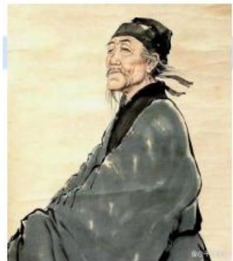

【解析】如果说李白是天上的神仙，杜甫就是地上的圣人，杜甫是现实主义诗人，被称为“诗圣”，因为杜甫写的诗歌更多描述底层人民的生活状态，其诗歌被称为“诗史”。

1. 《望岳》：杜甫年轻时游历所写，游历在河南、河北、山东等地，认为自己很有抱负，写下“会当凌绝顶，一览众山小”，是杜甫登泰山所写。
2. 《蜀相》：安史之乱之后，杜甫在朋友帮助下在成都度过了几年安稳时光时所写。“蜀相”指诸葛亮，“出师未捷身先死，长使英雄泪满襟”，写诸葛亮为了伐魏六出祁山的故事。
3. 《茅屋为秋风所破歌》: “安得广厦千万间, 大庇天下寒士俱欢颜”, 意为我希望有千万间高大宽敞的房子, 能够庇佑天底下的贫寒读书人, 让他们开颜欢笑。习近平总书记多次引用这句话, 认为现在的知识分子也应该有这样的胸襟和胸怀。
4. 白居易，字乐天，号香山居士，唐代伟大的现实主义诗人。代表作有《琵琶行》（大弦嘈嘈如急雨，小弦切切如私语）、《长恨歌》（回眸一笑百媚生，六宫粉黛无颜色）、《七夕》（烟霄微月澹长空，银汉秋期万古同）、《谢李六郎中寄新蜀茶》（汤添勺水煎鱼眼，末下刀圭搅鞠尘）等。

同是天涯沦落人，相逢何必曾相识

座中泣下谁最多？江州司马青衫湿

【解析】白居易：现实主义诗人。

1. 《琵琶行》: “大弦嘈嘈如急雨, 小弦切切如私语”, “大弦”是琵琶上最粗的弦, “小弦”是琵琶上最细的弦, 对应的是琵琶这一乐器。“同是天涯沦落人, 相逢何必曾相识”“座中泣下谁最多? 江州司马青衫湿”出自《琵琶行》。
2. 《长恨歌》：描写的是唐玄宗和杨贵妃之间的爱情故事，名句“回眸一笑百媚生，六宫粉黛无颜色”形容杨贵妃的美丽。
3. 《七夕》: “烟霄微月澹长空, 银汉秋期万古同”, “银汉”指银河, 对应七夕节, 抬头望月感慨漫漫长河当中七夕之夜其实都一样。
4. 《谢李六郎中寄新蜀茶》: “汤添勺水煎鱼眼, 末下刀圭搅爇尘”, 讨论煮水煎茶的过程, “勺水” 是少量的水, “鱼眼” 是水烧开后冒出的状如鱼眼大小的气泡, 意为 “取来工具煎水煮茶, 将茶碾成颗粒状, 用小汤匙搅动茶叶的细沫”。

# （五）书法

# 1.颜真卿

唐朝书法家，创“颜体”。代表作有《多宝塔碑》、《祭侄文稿》（“天下第二行书”）、《颜氏家庙碑》等。

# 2. 欧阳询

《九成宫醴泉铭》是唐贞观六年由魏征撰文、书法家欧阳询书丹而成的楷书书法作品。

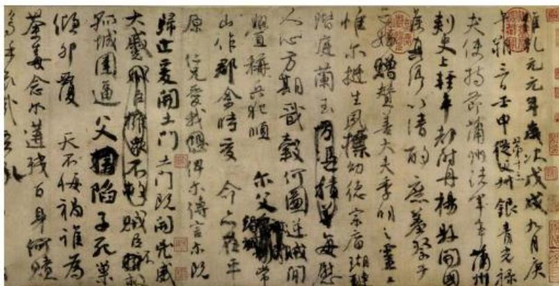

庭鶴冠子曰聖人之德上 及太清下及太寧中及萬 霆則醞泉出瑞應圖曰王 者純和飲食不貢獻則醞 泉出飲之令人壽東觀漢 記日光武中元元年 醛泉

# 【解析】

1. 颜真卿：代表作《祭侄文稿》，被誉为“天下第二行书”。当时安禄山起

兵作乱，颜真卿和他的兄长担心社稷安危起兵抵抗，但孤立无援，兄长一家30余口全部为国尽忠，颜真卿听到消息悲伤至极写下《祭侄文稿》，因为太过伤痛，所以字迹凌乱。“颜体”本身指楷书，《祭侄文稿》是行书，书法家擅长很多字体。

2. 欧阳询：代表作《九成宫醴泉铭》，是“天下第一楷书”。

# （六）绘画

# 1. 阎立本

唐朝时期宰相、画家。代表作有《历代帝王图》《步辇图》等。

# 2.吴道子

唐朝画家，被称为“画圣”，有“吴带当风”的美誉。代表作有《送子天王图》等。

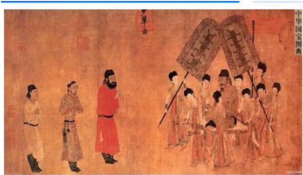

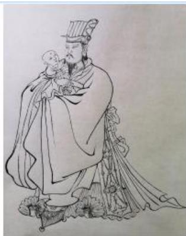

# 【解析】

1. 阎立本：官至宰相，画的很多人物故事和历史有关。《步辇图》画的是文成公主嫁给松赞干布的政治联姻。如上图 1，右边被宫女拥簇在其中的是皇帝唐太宗，他正在接见松赞干布派来的求亲使者禄东赞，位于左侧中间的人是求亲使者禄东赞。
2. 吴道子：被称为“画圣”，有“吴带当风”的美誉。代表作《送子天王图》（上图2），画的是释迦牟尼出生之后，他的父亲抱着他去拜见天神的佛教故事，用色非常淡，只有素笔白描，将线条之美发挥得淋漓尽致，好像有风在吹动飘带一样，因此评价为“吴带当风”。

思维导图

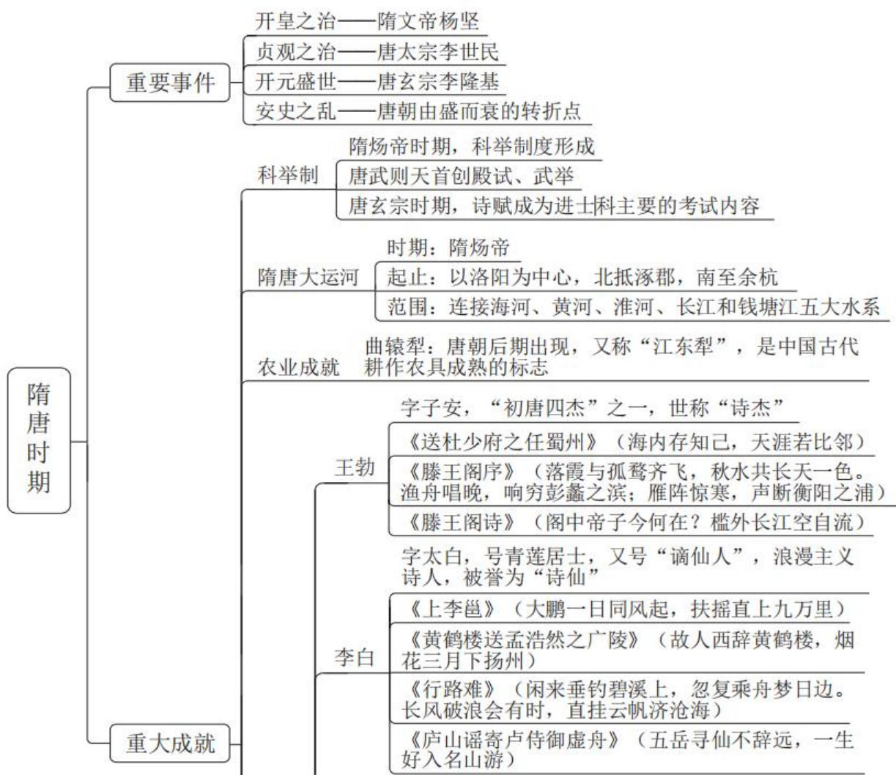

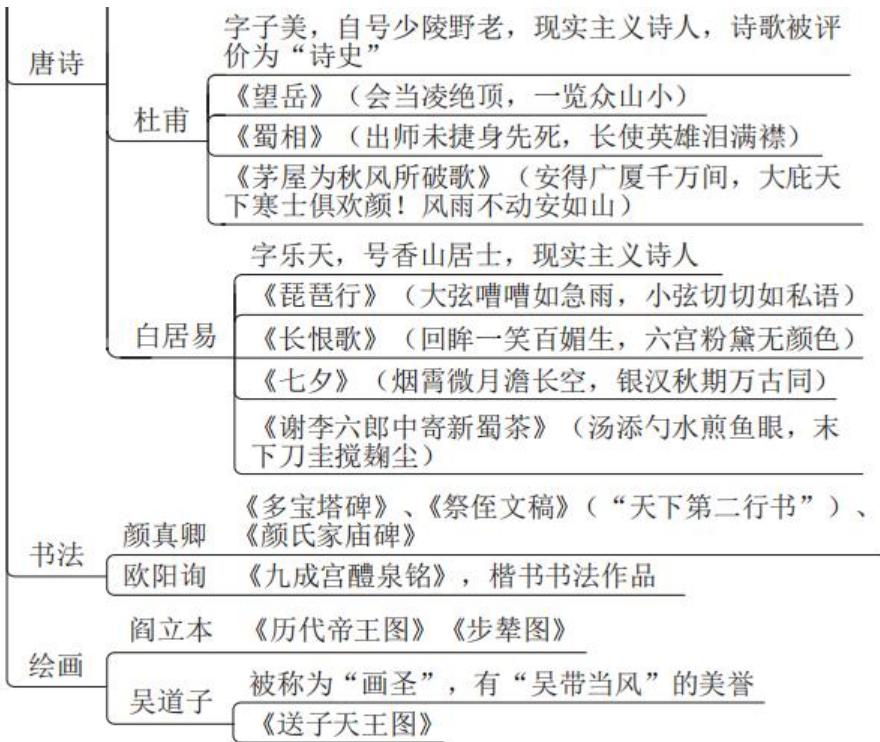

# 第六节 两宋时期

# 一、重要事件

# （一）陈桥兵变

后周大将赵匡胤在陈桥驿发动兵变，黄袍加身，取代后周，建立宋朝，定都汴梁，又称东京。

# （二）靖康之耻

北宋末年，金军攻破东京，俘虏了宋徽宗、宋钦宗父子等三千余人并押解北上，史称“靖康之变”，又称靖康之耻，北宋灭亡。

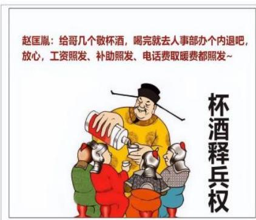

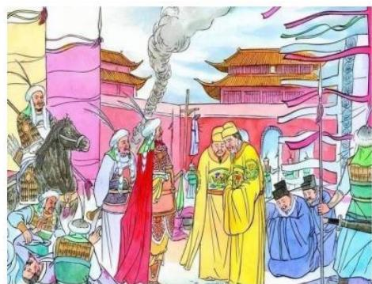

# 【解析】两宋时期重要事件：

# 1. 陈桥兵变：

（1）北宋的建立，后周的统军大将赵匡胤有一天领兵到了陈桥驿发动了陈桥兵变。赵匡胤和部下喝了顿酒，从醉酒中醒来时，手下的将士已经把黄袍披在了他的身上，黄袍加身。于是赵匡胤顺水推舟，自己当了皇帝，为北宋时期。（2）当了皇帝之后，赵匡胤特别不踏实，有一天组了一个饭局，说“会不会有一天别人也会给你们黄袍加身，就把我给反了呀”，这些人赶紧跪下说“我可一点也不想当皇帝”，第二天纷纷上交兵权，解甲归田。赵匡胤也没亏待他们，该交的钱，该交的社保、公积金都在给他们交着。(3) 需要了解: 陈桥兵变、黄袍加身、杯酒释兵权, 指的都是赵匡胤。

2. 靖康之耻：赵匡胤是武将出身，所以整个北宋制定的是重文轻武的方针，怕有武将再次叛乱，所以整个北宋开创的是一个文人政治的局面，发展到后期，出现了积贫积弱的局面，于是到了北宋末年，公元1127年，金军攻破东京，俘虏了宋徽宗、宋钦宗乃至整个赵氏皇族，北宋灭亡，即靖康之耻，也叫靖康之变。电影《射雕英雄传》，侠之大者郭靖的名字来自于靖康之耻/靖康之变。
3. 以上是北宋的建立以及衰亡情况。

# 二、重大成就

# （一）文学成就

1. 苏轼, 字子瞻, 号东坡居士, 豪放词派创始人, 与父苏洵、弟苏辙合称 “三苏”。代表作有《念奴娇·赤壁怀古》（羽扇纶巾，谈笑间，樯橹灰飞烟灭）、《水调歌头·明月几时有》（但愿人长久，千里共婵娟）、《阳关曲·中秋月》（此生此夜不长好，明月明年何处看）;

《题西林壁》（横看成岭侧成峰，远近高低各不同。不识庐山真面目，只缘身在此山中）、《赠刘景文》（一年好景君须记，最是橙黄橘绿时）、《汲江煎茶》（雪乳已翻煎处脚，松风忽作泻时声）、《新城道中二首》（西崦人家应最乐，煮芹烧笋饷春耕）；

《昆阳城赋》（昆阳之战，屠百万于斯须，旷千古而一快）等。

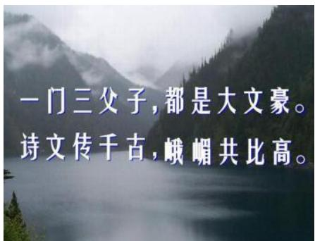

【解析】苏轼（考查非常多）：

1. 豪放词派创始人，词一开始写的都是男女之情、离愁别绪，后来苏轼把咏史、怀古、说理等都放入其中，开创了豪放词派。苏轼的父亲是著名的散文家苏洵，弟弟是苏辙，合称“三苏”，朱德总司令评论为“一门三父子，都是大文豪”。

# 2. 代表作：

(1) 《念奴娇·赤壁怀古》（羽扇纶巾，谈笑间，樯橹灰飞烟灭）：

(1) “羽扇纶巾”写的是周瑜（不是诸葛亮），前一句是“遥想公瑾当年，小乔初嫁了”，公瑾是周公瑾（周瑜），小乔嫁给了周瑜。羽扇纶巾的迷惑性很强，要知道对应的是周瑜。
(2) “樯橹灰飞烟灭”, 一场仗烧的啥也不剩了, 指的是赤壁之战。
(2)《水调歌头·明月几时有》（但愿人长久，千里共婵娟）：婵娟指的

是明月、月亮。

(3) 《阳关曲·中秋月》（此生此夜不长好，明月明年何处看）：苏轼写月亮写了不止一回，“明月明年何处看”对应中秋节。(4)《题西林壁》（横看成岭侧成峰，远近高低各不同。不识庐山真面目，只缘身在此山中）：横看成岭侧成峰，远近高低各不同，对应庐山（后半句有“不识庐山真面目”），2020年国考以及后期浙江都考查过。(5) 《赠刘景文》（一年好景君须记，最是橙黄橘绿时）：春夏秋冬，一年四季，秋天的景色特别多，所以更多讨论的是秋天的美景，秋末冬初的时节，“橙黄橘绿时”指的是秋天。(6)《汲江煎茶》（雪乳已翻煎处脚，松风忽作泻时声）：写的是从取水、煎茶到饮茶的全过程，2021年上海真题。(7)《新城道中二首》（西崦人家应最乐，煮芹烧笋饷春耕）：“饷春耕”，讨论的是春天，山村人家劳动的生活，其乐无穷。(8) 《昆阳城赋》（昆阳之战，屠百万于斯须，旷千古而一快）：讨论的是昆阳之战，是刘秀和王莽之间的战役，公元25元，刘秀以不足2万人打败了王莽的42万大军，由此定都洛阳，洛阳在东，出现了东汉。要知道昆阳之战是刘秀对王莽的战役。

2. 李清照, 号易安居士, 婉约词派代表人物, 有 “千古第一才女” 之称。代表作有《醉花阴·薄雾浓云愁永昼》（帘卷西风, 人比黄花瘦）、《鹧鸪天·桂花》（暗淡轻黄体性柔, 情疏迹远只香留）、《夏日绝句》（生当作人杰, 死亦为鬼雄）等。

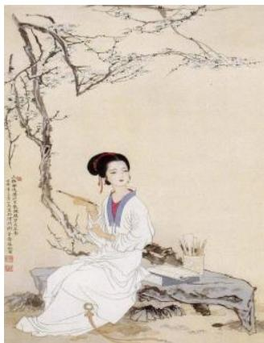

【解析】李清照：

1.婉约派词人，有“千古第一才女”之称。
2.名句：

(1) 《醉花阴·薄雾浓云愁永昼》（帘卷西风，人比黄花瘦）：“黄花”指的是菊花，还有一句“东篱把酒黄昏后，有暗香盈袖”。(2) 《鹧鸪天·桂花》（暗淡轻黄体性柔，情疏迹远只香留）：写的是桂花，桂花有浓香，味道是很香的。(3) 《夏日绝句》（生当作人杰，死亦为鬼雄）：李清照的晚年比较惨，国破家亡，自己的丈夫去世了，带着财产南渡，漂泊到了江南，再婚嫁给了觊觎她财产的渣男，所以她整个词风也为之一变，出现了《夏日绝句》，“生当作人杰，死亦为鬼雄”，活着就要当人中之豪俊，死了也要作鬼中之英雄，要知道这句诗也是李清照所作，她虽然是婉约派，但是同样也有表达强烈愤慨的诗句。

3. 辛弃疾，字幼安，号稼轩，南宋爱国词人。代表作有《西江月·夜行黄沙道中》（明月别枝惊鹊，清风半夜鸣蝉。稻花香里说丰年，听取蛙声一片）、《南乡子·登京口北固亭有怀》（年少万兜整，坐断东南战未休）、《水龙吟·登建康赏心亭》（求田问舍，怕应羞见，刘郎才气）、《太常引·建康中秋夜为吕叔潜赋》（一轮秋影转金波，飞镜又重磨）等。

【解析】辛弃疾：

1. 辛弃疾是南宋的爱国词人，继承和发展的是苏轼的豪放词风，所以苏轼、辛弃疾合称为“苏辛”。
2. 代表作:

(1) 《西江月·夜行黄沙道中》（明月别枝惊鹊，清风半夜鸣蝉。稻花香里说丰年，听取蛙声一片）：

(1) “明月别枝惊鹊”（考查最多）：考查体现了生物的什么反应-应激性反应（应激性反应指的是生物一种趋利避害的本能），这句话的意思是喜鹊被惊飞了，受到了外界的刺激所作出的反应，受到了惊吓就飞走了，所以讨论的是应激性反应。
(2) “稻花香里说丰年, 听取蛙声一片”: 蛙声一片的是夏天, 要知道这句话对应的是夏季。
(2) 《南乡子·登京口北固亭有怀》（年少万兜鍪，坐断东南战未休）：写的是三国的一位人物-孙权，青年时代统征千军万马、坐镇东南，连年征战，但是没有向敌人低过头。以往考查过真题，要知道对应的是孙权。
(3)《水龙吟·登建康赏心亭》（求田问舍，怕应羞见，刘郎才气）：“刘郎”指三国时期的刘备，泛指有大志之人。
(4)《太常引·建康中秋夜为吕叔潜赋》（一轮秋影转金波，飞镜又重磨）：2025年浙江刚刚考查过，对应月亮，是中秋夜所写。

# （二）史学著作

《资治通鉴》：由北宋史学家司马光主编，是中国第一部编年体通史。

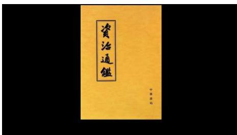

【解析】史学著作：《资治通鉴》。

1.北宋史学家司马光编写，是第一部编年体通史（特点）-以时间为轴一点点往下写，通史写的不是一朝一代的历史，是从战国三家分晋开始写，写到了五代时期。2. 宋神宗认为这本书“鉴于往事，有资于治道”，命名为《资治通鉴》。

3. 关于司马光的考点：

（1）砸缸。
(2) 《资治通鉴》。
(3) 反对王安石变法。

# 思维导图

# 【注意】

1. 苏轼（重点）：豪放派创始人，其诗句中每一个考点要搞清楚。
2. 李清照和辛弃疾：对于辛弃疾的考查较多，尤其是辛弃疾是豪放派，但是也有写生活恬静之美的诗，比如“明月别枝惊鹊”“听取蛙声一片”，都为归隐罢官时所写。
3. 《资治通鉴》是第一部编年体通史。

# 第七节 元朝时期

# 一、重大事件

# （一）统一蒙古

1206年，铁木真统一蒙古各部落，被推举为蒙古的大汗，尊称为“成吉思汗”。

# （二）建立元朝

1271年，忽必烈定国号为元，次年定都于大都（今北京）。

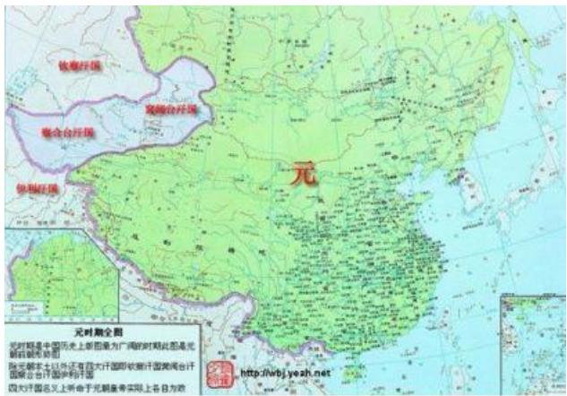

# 【解析】

# 1. 南宋灭亡：

(1) 靖康之耻指的是北宋灭亡了, 宋徽宗的儿子赵构在南方 (杭州) 建立了南宋。
(2) 崎山海战: 崖山在广东省, 战役中元军以少胜多, 南宋军队全军覆没,就此亡国。

# 2. 元朝的建立：

(1) 蒙古族的首领是铁木真，在他的带领下，整个蒙古族统一，建立了蒙古汗国，被尊称为“成吉思汗”。
(2) 铁木真的孙子忽必烈定国号为元, 次年定都于大都 (今北京)。

# 二、重大成就

# （一）行省制度

在地方设行中书省，简称“行省”，开启我国省级行政制度之先河。

# （二）农业成就

元朝农学家王祯编撰的《王祯农书》，集北方和南方的农业技术于一体，其中关于农业工具的记载尤为丰富。

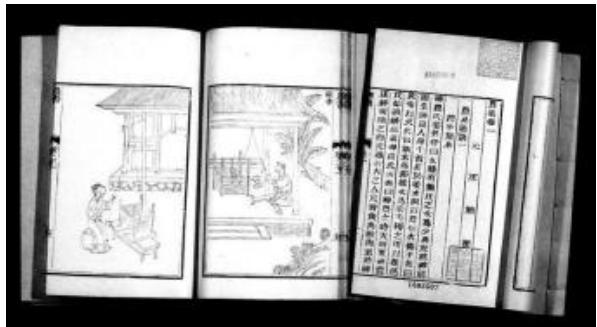

【解析】重大成就：

1. 行省制度：在地方设行中书省，即行省，自此开启我国省级行政制度的先河，到现在更多的也是划省而治。
2. 农业成就：王祯（zhēn）的《王祯农书》。

(1) 特点: 集北方和南方的农业技术于一体, 所以是第一次对于广义上的农业知识进行了比较全面、系统的论述。
（2）特点：五分之四写得都是农业工具，几乎包括了所有的传统农具和主要设施。

# （三）京杭大运河

京杭大运河是人工修建的，始建于春秋末期，经隋朝、元朝基本上形成了今日的规模，运河沿线地区是我国的主要农业经济区。在《马可·波罗游记》中对京杭大运河有所记载。

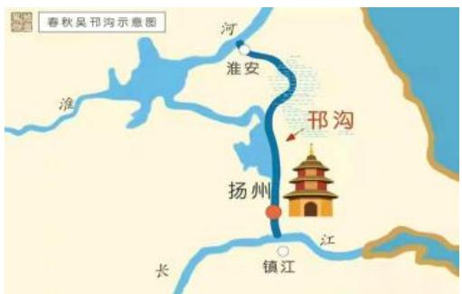

【解析】京杭大运河：

1. 京杭大运河的原形是元朝大运河，真正修建京杭大运河的是元世祖忽必烈修建。
2. 京杭大运河始建于春秋末期，因为整个京杭大运河容纳了淮安到扬州一段，

这一段是春秋的第一条运河- 邢（hán）沟，邗沟是春秋时期吴王夫差开凿的，疏通了长江和淮河的两大水系。京杭大运河把其纳了进来，所以京杭大运河始建于春秋时期。

3. 京杭大运河和隋朝大运河的区别是：整个元朝的首都就是在北京，和洛阳压根不挨边，不用绕到洛阳，于是破弯取直，从北京一路走到杭州，所以京杭大运河比隋唐大运河短了900多公里，沿线是我国主要的农业经济区。
4. 公元 13 世纪，意大利著名旅行家马可·波罗从元大都沿着京杭大运河，一路南下，成为第一走完京杭大运河全程的外国人，所以在《马可·波罗游记》中可以看到对于京杭大运河的记载。
5. 现在京杭大运河在2022年补水之后已经全线贯通了，所以很快我们也有可能像马可·波罗一样，去体验一下京杭大运河的千年神韵。

# （四）元曲

1. 关汉卿：代表作有《窦娥冤》（主角：窦娥）、《救风尘》（主角：赵盼儿）、《拜月亭》（主角：王瑞兰、蒋世隆）等。
2. 王实甫：代表作有《西厢记》（主角：张生、崔莺莺）。

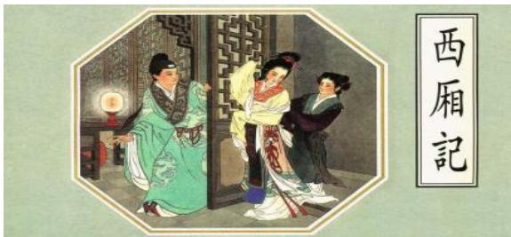

# 【解析】元曲：

# 1. 关汉卿：

(1) 关汉卿排在第一位，因为其被称为“曲圣”。
(2) 常见的代表作:

(1)《窦娥冤》：主角窦娥。
(2)《救风尘》: 主角赵盼儿, 全称《赵盼儿风月救风尘》, 电视剧《梦华录》中的赵盼儿和《救风尘》的赵盼儿是一个人。
(3)《拜月亭》: 大家闺秀王瑞兰和秀才蒋世隆之间悲欢离合的爱情故事。

# （3）关于关汉卿需要了解：

(1) “曲圣”。(2)相关著作, 有时间可以记忆一下著作的主角。

2. 王实甫：代表作《西厢记》，主人翁是张生和崔莺莺，二人在红娘的帮助下有情人终成眷属，现在做媒的也叫红娘，正是出自于此。

# 思维导图

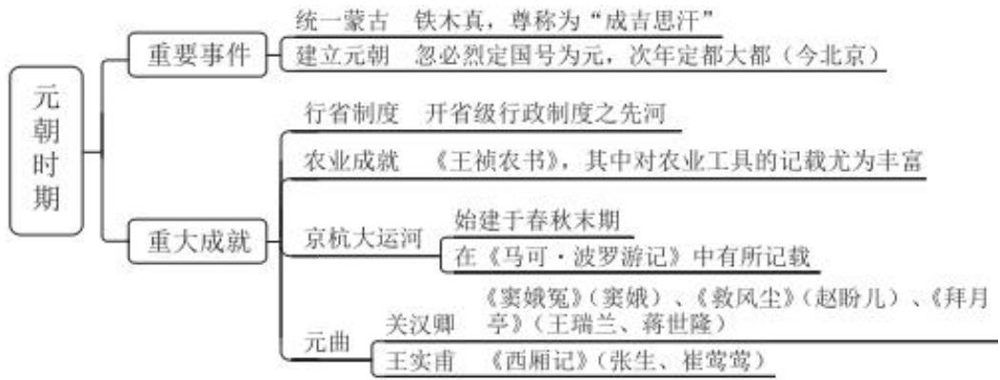

# 【注意】考点：

1. 京杭大运河。
2. 元曲。

# 第八节 明清时期

# 一、重要事件

1. 洪武之治——明太祖朱元璋。
2. 永乐盛世——明成祖朱棣。
3. 康乾盛世——清康熙、雍正、乾隆三代皇帝。

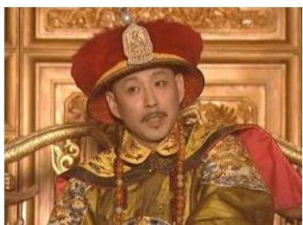

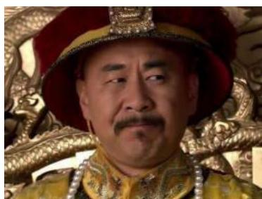

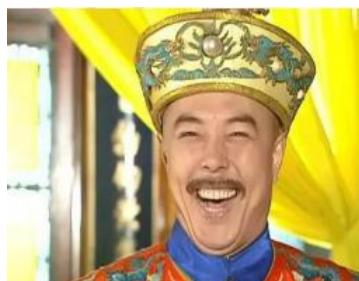

# 【解析】

1. 元朝建立起来后, 本质上是少数民族政权, 所以统治时实施的是歧视政策,这个政策激起了大家的不满, 由此出现了农民起义, 最终朱元璋独树一帜, 帅军

攻占了元大都，推翻了元朝统治，出现了大明王朝。

(1) 朱元璋继位之后，出现了洪武之治（要知道对应的是朱元璋）。(2) 朱元璋原本是想传位给自己的儿子朱标, 但是朱标早逝, 于是传给了朱标的儿子朱允炆, 朱允炆是建文帝, 上位之后第一件事是立志削藩, 所以引起了其四叔朱棣的不满, 朱棣起兵造反, 爆发了靖难之役。通过这场战役, 朱棣当上了皇帝, 出现永乐盛世（对应明成祖朱棣）。

2. 到了清朝，出现康乾盛世/康雍乾盛世：康熙、雍正、乾隆三代皇帝，疆域达到1300万平方公里，人口超过3亿。
3. 明清时期的重要事件：洪武之治、永乐盛世对应明朝；康乾盛世对应清朝。

# 二、重大成就

# （一）重要制度

# 1.军机处

清雍正时期设立军机处，军机处的设置标志着君主专制制度发展到顶峰。

# 2.科举制度的废除

清光绪三十一年（1905年）举行了最后一科进士考试，随后历经约1300年的科举制被正式废止。

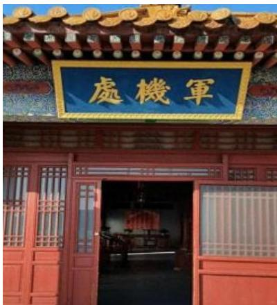

# 【解析】重要制度：

1. 军机处：标志着君主专制制度发展到了顶峰，军机大臣啥也干不了，就是跪受笔录，皇上说啥就是啥，皇上一人说了算。

# 2. 科举制度的废除：

(1) 科举制度是隋炀帝时期正式形成（头）。

(2) 清光绪 31 年（1905 年），清末新政时，科举制被正式废除（尾）。

# （二）文学成就

# 1. 《三国演义》

作者罗贯中，它是我国古代章回体小说的开山之作，也是第一部历史演义小说。

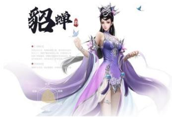

# 2. 《水浒传》

作者施耐庵，小说取材于北宋末年宋江起义的故事，是我国第一部以农民起义为题材的长篇小说。

# 【解析】文学成就：

1. 《三国演义》：作者罗贯中。

(1)《三国演义》是章回体小说的开山之作。章回体小说: 惊堂木一拍“啪”, “话说天下事, 合久必分, 分久必合, 今天来讲第一回, 就是桃园三结义”。

(2)《三国演义》是历史演义小说。《三国演义》写的不都是真实的小说,历史演义小说指七分实、三分虚, 虚实相结合。比如人物貂蝉, 《三国演义》第八回, 说的是 “王司徒巧使连环计、董卓大闹凤仪亭”, 王允利用貂蝉离间董卓和吕布的关系, 但是貂蝉在正史中并无记载, 大概率是一个虚构的人物, 王允也没有巧设连环计, 所以为历史演义小说。

2. 《水浒传》：作者施耐庵，是我国第一部以农民起义为题材的长篇小说，北宋末年的农民起义，以宋江为基础创作的一百零八条好汉，最后招安了，所以“世界的尽头是编制”，现在努力，虽然难了点，但是少走三十年弯路。

# 3. 《西游记》

作者吴承恩，它是中国古代第一部浪漫主义章回体长篇神魔小说。

# 4. 《红楼梦》

原名《石头记》，作者为曹雪芹和高鹗，代表了清代小说的最高成就，是中国古典小说的最高峰，被称为“中国封建社会的百科全书”。

【解析】文学成就：

1. 《西游记》：作者吴承恩，长篇神魔小说。

(1) 虽然写的是神魔, 但是孙悟空最后被封为斗战胜佛, 所以 “宇宙的尽头是编制”。
(2) 鲁迅先生对于《西游记》的评价 “神魔皆有人情, 精魅亦通世故”,有后台的妖怪都被带走了, 没后台的妖怪都被打死了。

# 2. 《红楼梦》：

（1）四大名著唯一成书于清朝的，《三国演义》《水浒传》《西游记》都是明朝时期的。
(2) 前八十回的作者是曹雪芹, 后四十回的作者是高鹗。曹雪芹早期是鲜衣怒马的公子哥, 家里三代江宁织造, 后来雍正时期被抄家, 生活惨淡, 化粥而食, 由此以自己家族的兴衰为框架写下《红楼梦》。
(3) 《红楼梦》写的非常好，被誉为“中国封建社会的百科全书”。

# （三）文化成就

# 1. 《永乐大典》

明朝永乐年间由明成祖朱棣先后命解缙、姚广孝等主持编纂的一部集中国古代典籍于大成的类书。《永乐大典》被称为“世界有史以来最大的百科全书”。

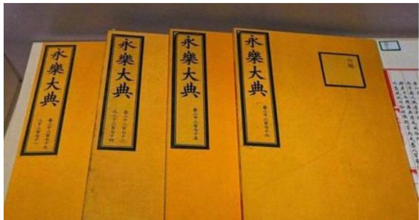

# 2. 《四库全书》

全称为《钦定四库全书》，是清代乾隆时期编修的中国历史上最大的一部丛书，分经、史、子、集四部，故名“四库”。

【解析】文化成就：《永乐大典》和《四库全书》经常放在一起对着考查。

# 1. 《永乐大典》：

（1）永乐大帝朱棣时期让人做的。
(2) 特点:

(1)是类书, 也就是今天的数据库, 想查什么可以去《永乐大典》中查。
(2)《永乐大典》保存了 14 世纪以前中国的历史、地理、文学、艺术等内容, 被称为 “世界有史以来最大的百科全书”。

# 2. 《四库全书》：

（1）清代乾隆时期所编修，是中国历史上最大的一部丛书（合订本，把以前单本发行的订在一起）。
(2) 称为四库是因为其中分经、史、子、集四部，要了解具体指什么。

(1) “经”: 封建时期一定是把儒家学说放在第一位, 所以第一个是经。
(2) “史”: 历史, 如《史记》《汉书》都在这个部分。
(3) “子”: 除了儒家之外的各种各样的诸子百家, 如《孙子兵法》《道德经》都在 “子” 这里面。
(4) “集”: 诗歌总集、诗词总集, 比如找陶渊明的诗要去 “集” 中找。
(5)所以《四库全书》指的是经、史、子、集, 要知道每一个关键词指的是什么。

# 3.戏曲

汤显祖，明代戏曲家、文学家，江西临川人。其戏剧作品《牡丹亭》（亦名《还魂记》）、《紫钗记》、《南柯记》和《邯郸记》合称“临川四梦”。

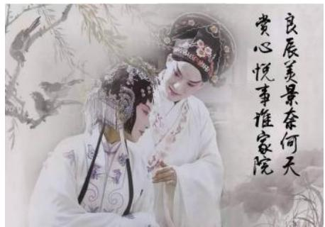

【解析】戏曲：汤显祖。

1. 被称为东方的莎士比亚，明代戏曲家，江西临川人。
2. 汤显祖所写的四部作品, 合称为 “临川四梦”, 分别是 “南邙牡紫”, 南 - 《南柯记》, 邱- 《邯郸记》, 牡- 《牡丹亭》, 紫- 《紫钗记》。

(1) 《牡丹亭》（考查最多）：主角是杜丽娘和柳梦梅，写的是杜丽娘因情而死，死后复生的故事。
(2) 《紫钗记》：主角是李益、霍小玉。
(3) 《南柯记》: 主角是淳于梦 (fěn), 写的是这个人酒醉之后, 梦入蚂蚁国被招为驸马, 权倾一时, 结果醒来, 这就是一梦, 南柯一梦。
(4) 《邯郸记》: 主角是卢生。

# 4. 建筑

# （1）北京故宫

中国明清两代的皇家宫殿，旧称“紫禁城”，位于北京中轴线的中心。北京故宫于明成祖永乐四年（1406年）开始建设，以南京故宫为蓝本营建，到永乐十八年（1420年）建成，历经明、清两代，共有24个皇帝在此居住。

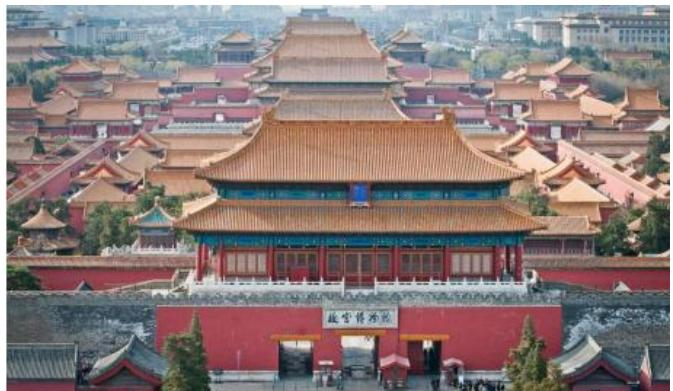

# (2) 承德避暑山庄

始建于清康熙四十二年（1703年），历时近90年建成，位于河北，又称“热河行宫”，是由众多宫殿以及其他处理政务、举行仪式的建筑构成的庞大建筑群，主要分为宫殿区和苑景区两部分。

# 【解析】

# 1.北京故宫：

（1）紫禁城，位于北京中轴线的中心，北京中轴线在2024年被列为世界遗产名录，中轴线的正中间就是北京故宫。
(2) 2025 年浙江考查了北京故宫的修建者: 明成祖朱棣 (永乐大帝), 明成祖把明朝的首都从南京迁到北平, 由此修建了北京故宫, 往后明清两代共 24 位皇帝都居住于此。

# 2. 承德避暑山庄：

(1) 2020年四川、2023年安徽都考查过。
(2) 承德避暑山庄是皇家园林，颐和园、圆明园等都属于皇家园林。
(3) 清康熙年间建造。判断: 康熙帝可以在承德避暑山庄欣赏歌舞 (正确),原因: 可行, 因为是康熙建造的。
(4) 具体位置：河北承德，不在北京。

# 3. 北京故宫和承德避暑山庄最重要的考点：建造者是谁。

思维导图

# 【注意】明清时期：

1. 重要事件：各种盛世、治世局面。
2. 重大的成就：主要是文学成就，需要关注四大名著。
3. 《永乐大典》《四库全书》：重点为两者区别，《永乐大典》是类书（数据库）；《四库全书》是丛书（合订本）。

# 【实战演练】

1. (2025 国考) 下列《三国演义》中的回目, 按照先后顺序排列正确的是:

(1) 宴长江曹操赋诗，锁战船北军用武
(2)战官渡本初败绩，劫乌巢孟德烧粮
(3)刘先主遗诏托孤儿, 诸葛亮安居平五路
(4)王司徒巧使连环计, 董太师大闹凤仪亭

A. ①③④②

B. ③②④①

C. ②①④③

D. ④②①③

【解析】1.D 项：④是刚开始第八回的事，司徒王允以貂蝉为计，离间董卓和吕布二人，排序一定排在前面。②官渡之战，排序靠前。①“锁战船”，锁了战船，给其一把火烧光了，是赤壁之战（官渡之战在赤壁之战之前）。③刘备托孤，排在最后，对应的是虢（xiāo）亭之战/夷陵之战，为刘备对东吴的一场战役，刘备全军覆没，白帝城托孤。排序为④②①③，当选。【选D】

2. （2022 北京）（多选）中国古代许多诗人喜欢写“山”，以下诗句与作者对应正确的有：

A. 不识庐山真面目，只缘身在此山中——苏轼
B. 五岳寻仙不辞远，一生好入名山游——谢灵运
C. 会当凌绝顶，一览众山小——杜甫
D. 采菊东篱下, 悠然见南山一一陶渊明

【解析】2.A项：庐山，对应苏轼，当选。

C 项：杜甫上了泰山，一览众山小，当选。
D 项：陶渊明采菊东篱下，当选。
B 项：对应李白，排除。【选 ACD】

# 考点二 党史重要事件及会议

【解析】党史主要梳理的是从中国共产党一大到1949年建国之前，因为时间有限，所以重点讲解主要的事件和相关的会议。

# 一、中共一大

1.时间：1921年7月23日至8月初。
2.地点：上海、嘉兴。
3. 主要内容：大会确定党的名称为“中国共产党”；通过中国共产党的第一个纲领；大会选举陈独秀为中央局书记。

# 【解析】中共一大（重点）：

1. 时间：1921年7月23日，记忆：共产党人为了革命事业“妻儿散”（7月23日）。建党日为7月1日是因为，有人问毛主席一大什么时候开的，毛主席

席忘了，就记得当时很热，所以选了7月1日。

2. 地点：上海、嘉兴。在上海开的时候有暗探闯入，所以后期紧急转移了会址，转移到浙江嘉兴南湖游船上。判断：中共一大全程都在上海召开（错误）。
3. 内容：

(1) 确定党的名称为 “中国共产党”, 以前叫 “社会党”, 一听就 “很社会”, 蔡和森提出应该叫共产党, 于是一大确定名称为 “中国共产党”。
（2）共产党有了之后，就有了坚定的领导力量、有了先进的指导思想。判断：自从有了中国共产党，我们就有了正确的革命道路（错误），原因：中国共产党并不是一开始领导的道路就是对的，走了非常多的弯路，付出了很多鲜血，后来才找到了正确的道路，是考试中错的最多的一句话，并不是自从有了共产党我们就有了正确的道路。
(3) 通过中国共产党的第一个纲领: 建立无产阶级政权和实现共产主义 (无需记忆), 设想的很好, 但是当时是 1921 年, 对于当时的中国, 共产主义确实是有点远, 有点不接地气, 所以中共一大确立了第一个纲领, 但这个纲领确实是有一点点高, 于是出现了中共二大, 解决了这个问题。

# 二、中共二大

1.时间：1922年7月16日至23日。
2.地点：上海。
3. 主要内容：会议首次区分并制定了党的最高纲领和最低纲领；制定了中国共产党第一部党章——《中国共产党章程》。

# 【解析】中共二大：

1. 制定了党的最高纲领和最低纲领。

(1) 最高纲领: 实现共产主义 (关键词: 共产主义)。(2) 最低纲领: 反帝反封。

2. 制定了共产党的第一部党章，《中国共产党章程》，要知道第一个党章是在二大时制定的。

# 三、中共三大

1.时间：1923年6月12日至20日。
2.地点：广州。
3. 主要内容：大会讨论并接受了共产国际关于国共合作以及共产党员以个人身份加入国民党，同时保持共产党在组织、政治上的独立性的决议案。

# 【解析】中共三大：

1. 在真正反帝反封的过程中，我们发现共产党的力量是非常弱小的，所以我们开始“找朋友”，把眼光投在了当时的第一大党国民党的身上，于是“三大国共要合作”。
2. 主要议题：共产党员以个人身份加入国民党，这种形式是典型的党内合作（不是党外合作，因为已经一个一个加入进去、融入进去了）。抗日战争时期的国共两党合作是党外合作，自己负责自己的，国民党负责正面战场，共产党负责敌后战场。
3. 国共合作虽然是共产党发起的（中共三大时发起），但是需要国民党同意，判断：三大召开后国共第一次合作正式形成（错误），原因：我们是提出了，但是需要国民党拍板同意才行。1924年国民党一大召开，标志着国共第一次合作形成。

# 四、中共五大

1.时间：1927年4月27日至5月9日。
2. 地点：武汉。
3. 主要内容：大会对以陈独秀为代表的右倾机会主义错误进行了批评，但对无产阶级如何争取领导权，特别是如何建立党的革命武装等迫在眉睫的重大问题，都未能作出切实可行的回答。

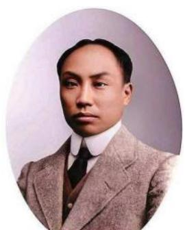

【解析】中共五大：

1. 三大之后，虽然我们和国民党合作了，但是国民党内部一点也不信任我们，于是四大的时候，我党意识到了这个情况，觉得国民党并不是我们可靠的朋友，但是合作还要继续，于是四大之后，国共一起进行的是北伐。北伐主要打的是军阀，国共一起北伐取得了胜利，但是很快出了问题，即四·一二和七·一五反革命政变。
2. 四·一二之后 15 天中共五大就此召开：

（1）1927年4月份召开，正常情况下，现在已经出现了反革命政变，我们面对国民党的砍杀，要聚起来想个招，赶紧想想对策。但是我们党当时比较弱，这种情况我们也不知道应该怎么办了，于是开五大，找了个“背锅侠”，即陈独秀。
（2）对以陈独秀为代表的右倾机会主义错误进行了相关的批判，但是对于很多重大问题，特别是怎么争领导权、怎么建立革命武装这些问题，都没有作出切实可行的回答。所以五大主要是对陈独秀进行了相关的批评。

# 五、南昌起义

1.时间：1927年8月1日。
2.地点：江西南昌。
3. 意义：南昌起义打响了武装反抗国民党反动派的第一枪，标志着中国共产党独立领导武装斗争和创建革命军队的开始。

【解析】南昌起义：

1. 1927年7月，汪精卫在武汉发动七·一五反革命政变，加上前面的四·一

二，标志着国共第一次合作以失败告终。面对屠杀，我们一开始可能蒙，但是我们后续很快就开始反抗，即南昌起义。

2.南昌起义：

(1) 时间: 1927 年 8 月 1 日, 建军节 8 月 1 日正是为了纪念南昌起义。
(2) 南昌起义打响了武装反抗国民党反动派的第一枪（记忆），南昌啤酒最早的产品名称就叫“第一枪”，标志着中国共产党独立领导武装斗争和创建革命军队的开始（南昌起义对应“第一枪”）。

# 六、八七会议

1.时间：1927年8月7日。
2. 地点：湖北汉口。
3. 主要内容：会上，毛泽东提出了“须知政权是由枪杆子中取得”的著名论断。

# 【解析】八七会议：

1. 南昌起义虽然意义重大，但是最终失败了，所以7天以后，在武汉紧急召开了八七会议，毛主席提出了一个非常霸气的论调“枪杆子里面夺政权”，八七对应霸气。
2. 会议准备派毛泽东同志在湖南以及江西的边界组织领导秋收起义。

# 七、秋收起义

1.时间：1927年9月9日。
2. 地点：湖南东部和江西西部边界地区。
3.主要内容：

（1）文家市决策：提出战略重心转移，由城市转向农村。
（2）三湾改编：确立了党对军队的绝对领导。
（3）井冈山革命根据地：第一个农村革命根据地。

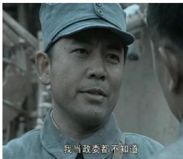

【解析】秋收起义：

1. 时间：1927年9月份，秋天的时候，是由毛泽东同志领导的。
2. 秋收起义没有成功：秋收起义打的是大城市长沙，当时我们党的力量比较弱，突然打大城市长沙肯定是打不下来的，由此秋收起义失败了，但是毛主席撤退的非常迅速，受到的损失是很小的，撤到了文家市。

# 3. 文家市决策：

（1）在文家市作出决策，提出战略重心转移，由大城市（长沙）转移到农村，所以关于文家市决策经常考查战略重心是如何转移的  $\rightarrow$  是由城市转向农村的。（2）但是出现了问题，很多士兵本来都是村里来的，现在又让回到村里，不想回去，出现了很多逃兵，军心涣散，于是路过江西三湾村时进行了三湾改编。

3. 三湾改编：确立了党对军队的绝对领导，即把支部建在连上，每个小连队都有一个党支部，如图所示，是《亮剑》的政委，政委是做思想工作的，当有一些逃兵时、当有一些人干不下去时，对其进行思想安抚，要接着跟党干、党一定是可以的。
4. 井冈山革命根据地：三湾改编之后大家听话了，于是有秩序的挺近了井冈山，井冈山是第一个农村革命根据地。
5. 秋收起义非常重要：文家市决策、三湾改编、井冈山革命根据地都是高频考点。

# 八、古田会议

1. 时间：1929年12月28日至29日。
2. 地点：福建省龙岩市上杭县古田村。

# 3.主要内容：

(1) 提出建设新型军队，提出“思想上建党、政治上建军”。

（2）会议首次以党的决议的形式，重申和发展了“三湾改编”确立的党对军队绝对领导原则。

# 【解析】古田会议：

# 1. 背景：

(1) 1928 年周围都是白色恐怖, 国民党在不断的围剿、屠杀共产党员, 有困难找 “大哥”, 于是去了莫斯科召开会议, 党史出现了唯一一次在国外召开的会议-中共六大。要知道六大是在国外召开的, 记忆: 六大 “溜达” 出去了。
(2) “大哥”的意见是革命要积蓄力量，积蓄力量要到农村去拉拢农民，经过轰轰烈烈的打土豪、分田地，农民被拉拢过来。人过来了，农民的非无产阶级思想也来了，很多人觉得打一打差不多得了，要回家，还有人不想要家，就想要当土匪，这样的背景下召开了古田会议。

# 2. 特点：

（1）提出建设新型军队，提出思想上建军、政治上建军，也就是筑军魂，去除掉非无产阶级的思想。
(2) 首次以党的决议的形式重申和发展了三湾改编, 确立了党对军队的绝对领导原则。决议是公文的一种, 以公文的形式将其确定下来。
(3) 习近平总书记说: “党对军队的绝对领导发端于南昌起义 (先有军队才能谈领导), 奠基于三湾改编, 定型于古田会议”, 多次考查, 要知道顺序。

# 九、长征

1.时间：1934年10月至1936年10月。
2. 主要路线：江西瑞金一强渡湘江一过乌江一遵义会议一四渡赤水一巧渡金沙江一强渡大渡河一飞夺泸定桥一翻越夹金山一过草地一陕北吴起镇会师一甘肃会宁会师一将台堡会师。

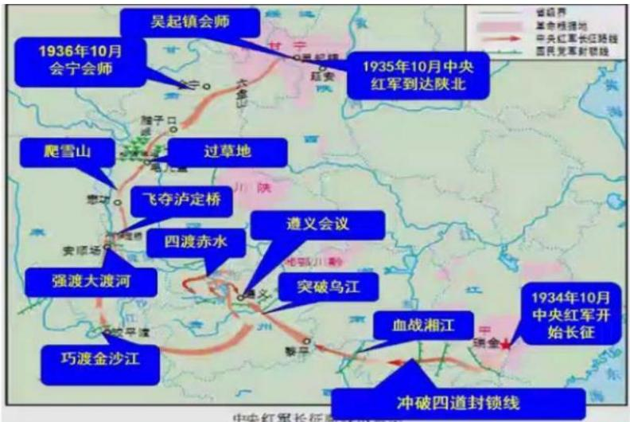
瑞湘乌遵，赤金渡桥，雪草会师

# 3. 遵义会议

1935年1月，在贵州遵义召开，标志着中国共产党从幼年走向成熟。会议确立了毛泽东在党和红军中的领导地位，挽救了党，挽救了红军，挽救了中国革命，在中国共产党和红军的历史上，是一个生死攸关的转折点。

【解析】经过古田会议后，军队在不断的壮大，此时蒋介石慌了，蒋介石本来以为我们不行才跑到农村去的，没想到弄的有声有色，所以蒋介石一慌就开始围剿共产党，前四次我们反围剿成功，但是第五次反围剿失败，之后踏上了两万五千里长征：

1.时间：1934年10月至1936年10月。
2. 路线（考查重点，今年有省份直接考查了地图）：

(1) 首先从江西瑞金出发, 蒋介石已经猜到了我们的计划, 所以调集 40 万大军在湘江两岸对我们围追堵截, 我们下的命令是强渡湘江, 所以为了突破蒋介石的四道封锁线, 浴血奋战, 血染湘江, 中央红军打完后, 从八万人锐减到三万人, 牺牲五万人。
（2）此时毛泽东站出来，说不能再按原计划进行了，否则就是重蹈覆辙，我们要去敌人力量薄弱的地方。我们要去占领重要的城市-遵义，于是红军开始突破乌江，乌江是黔江（贵州第一大江），占领了遵义。于是把敌人围追堵截的部队远远的甩在了后面，所以毛泽东的军事战略部署是非常正确的，1935年1月，由此我们在遵义召开了党非常重要的会议-遵义会议。
(3) 遵义会议之后, 由毛泽东、周恩来、王稼祥三人组成了军事指挥小组,

毛泽东亲自指挥，声东击西，四渡赤水（赤水在贵州、四川、云南三省的交界处），打乱了敌人整体的追剿计划。

(4) 之后从容的渡过了金沙江, 跳出了包围圈, 最终摆脱了数十万敌军的围追堵截。之所以称之为巧渡金沙江是因为, 我们用了调虎离山之计, 用计谋调出了当地的滇军 (云南的军队), 从而实现了从云南北渡金沙江进入四川的战略目标, 所以巧渡金沙江也是毛泽东亲自指挥的调虎离山之计。
(5) 然后继续北上, 强渡大渡河, 飞夺泸定桥, 翻越了雪山 (夹金山), 过草地。
(6) 之后就是会师:

(1) 1935 年陕北吴起镇会师, 红一（中央红军）和当地红军的会师。
(2)1936年，红一和红四方面军在甘肃会宁会师。
(3)1936年10月22日，红二方面军到达宁夏将台堡，和红一方面军会师，标志着两万五千里的长征到此结束了。
④整个会师是三个（吴起镇、会宁、宁夏将台堡），没有红三方面军（考试出现了红三方面军则为错误选项）。

(7) 重点: 红军长征事件的顺序, 口诀 “瑞湘乌遵, 赤金渡桥, 雪草会师”。瑞-瑞金出发, 湘-血染湘江, 乌-突破乌江, 遵-遵义会议, 赤-四渡赤水, 金-巧渡金沙江, 渡-强渡大渡河, 桥-飞夺泸定桥, 雪-翻越雪山, 草-过草地, 会师。

(8) 记忆:

(1)口诀。(2)三个会师。

3. 遵义会议（重点）：

(1) 确立了毛泽东在党和红军中的领导地位（毛泽东）。(2) 挽救了党、挽救了红军、挽救了中国革命（三个挽救）(3) 如果没有遵义会议, 中国革命会走向何方就不一定了。

4. 关于长征需要记忆：

(1) 口诀。
(2) 遵义会议。

# 十、瓦窑堡会议

1.时间：1935年12月17日至25日。
2. 地点：陕北瓦窑堡。
3. 主要内容：确定了建立抗日民族统一战线的方针。

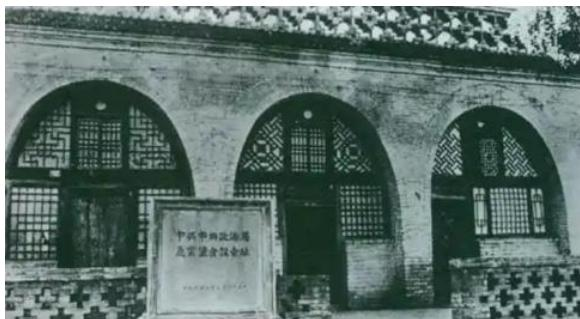

# 十一、洛川会议

1.时间：1937年8月22日至25日。
2. 地点：陕北洛川县。
3.主要内容：提出建立敌后抗日根据地。

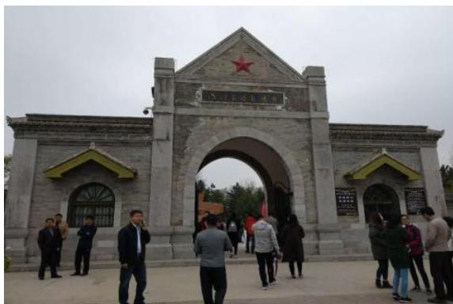

# 【解析】

1. 长征过程中开的另外一个会议：瓦窑堡（bǔ）会议。需要先了解抗日：

（1）我们现在说的抗日是14年抗战，从1931年九一八事变开始算，一共是14年抗战。(2) 8 年是全面抗战, 从 1937 年七七事变开始算。

2. 瓦窑堡会议：1935年，当时华北事变，小日本在不断的侵吞华北，共产党正在长征途中，但是我党反应非常迅速，召开了瓦窑堡会议，确立了抗日民族统一战线的方针（抗日）。
3. 蒋介石不这样想, 他认为攘外必先安内, 不想抗日, 于是出现了西安事变,即 “双十二事变”, 张学良、杨虎城 “兵谏” 逼蒋抗日, 最终蒋介石妥协。
4. 1937年7月7日，七七卢沟桥事变之后，小日本全面侵华，我们也要全面抗日，1937年8月召开洛川会议，通过了《抗日救国十大纲领》，调动一切可以调动的力量全面抗日，提出建立敌后抗日根据地。
5. 瓦窑堡会议和洛川会议经常放在一起考查，考查都干了啥，瓦窑堡会议确立了抗日民族统一战线的方针，洛川会议确立了敌后抗日根据地，口诀“瓦统洛后”。

# 十二、六届六中全会

1.时间：1938年9月29日至11月6日。
2.地点：延安。
3. 主要内容：毛泽东在会议上作了《论新阶段》的报告，第一次明确提出“马克思主义中国化”的命题。

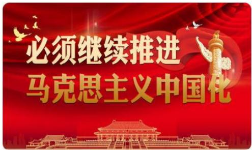

【解析】为了总结抗战以来整体的斗争经验，中国共产党扩大了六届六中全会：

1.时间：1938年。
2. 毛泽东在会议上作了《论新阶段》的报告，明确第一次提出了“马克思主义中国化”的命题。口诀“毛六六论马”（毛泽东在六届六中全会上论马克思主义中国化），第一次明确提出马克思主义中国化，马克思是外来的，到了中国要具体问题具体分析，体现的哲学原理是具体问题具体分析，也是“两个结合”的第一个结合。

# 十三、中共七大

1.时间：1945年4月23日至6月11日。
2.地点：延安。
3.主要内容：

(1) 毛泽东在会议上作了《论联合政府》的书面政治报告, 提出党的三大作风, 即理论联系实际、密切联系群众、批评与自我批评。
（2）毛泽东思想被确立为党的指导思想并被写入党章。

# 【解析】中共七大：

1. 六大（溜达到国外）是 1928 年，和七大中间隔了 17 年的时间，中间打仗（和日本打、和国民党打），一直到了抗日战争胜利的前夕，我们召开了七大。
2. 时间：1945年，开了五十多天。
3. 内容：

(1) 毛泽东在会议上作了《论联合政府》的报告, 提出了党的三大作风,理论联系实际、密切联系群众、批评与自我批评, 口诀 “批李密”。现在三大作风仍然在延续, 基层时不时开会进行批评与自我批评。
(2) 毛泽东思想被确立为党的指导思想, 并且被写入党章。遵义会议 1935年, 确立了毛泽东的领导地位。上位之后, 七大由此确立了毛泽东思想为党的指导思想并且写入党章, 人要先上来, 然后才会有思想。

(3) 七大是一次团结的大会、胜利的大会（出现这句话，要能够对应七大）：

(1) 团结的大会: 全党上下形成了空前的统一, 以毛泽东思想为指导。
(2)胜利的大会: 1945 年了, 马上要取得抗日战争的胜利了。

# 十四、七届二中全会

1.时间：1949年3月5日至13日。
2. 地点：河北西柏坡。
3. 主要内容：决定将党的工作重心由乡村转到城市；毛主席提出“两个务必”，即务必使同志们继续地保持谦虚、谨慎、不骄、不躁的作风，务必使同志们继续地保持艰苦奋斗的作风。

# 【解析】七届二中全会：

1. 七大之后，虽然打赢小日本了，但解放战争就此爆发，打完小日本，开始打国民党，我们也打赢了，于是出现了七届二中全会。
2. 七届二中全会是整个解放战争中唯一一次召开的中央全会，也是最后一个在农村召开的会议，因为我们打赢了，再往后需要到城里去了。

（1）七届二中全会是在河北的西柏坡召开的，提出了工作重心的转移，由乡村转移到城市。从城市转向农村是秋收起义失败之后，退到了文家市，文家市决策，决定由城市转向农村，那时候我们弱，现在我们强了，由乡村转到城市。
(2) 既然要转去城市 “进京赶考”, 毛主席提出 “两个务必”, 一个是谦虚、谨慎、不骄、不躁, 另一个是艰苦奋斗的作风。

(1)因为我们马上就要进城执政了，“进京赶考”的考是考验的考，成为执政党之后就会经历各种各样的糖衣炮弹，能不能经得住它的洗礼，靠的就是“两个务必”。现在的“三个务必”是二十大提出的，“务必不忘初心、牢记使命，务必谦虚谨慎、艰苦奋斗，务必敢于斗争、善于斗争”。(2) “两个务必”即务必使同志们继续地保持谦虚、谨慎、不骄、不躁的作风,务必使同志们继续地保持艰苦奋斗的作风（记忆）。

3. 党史部分讲解到 1949 年就此为止。

思维导图

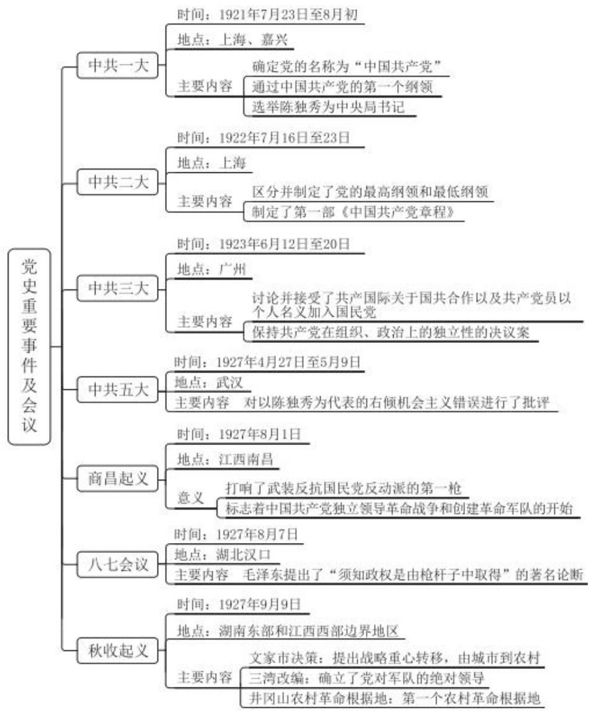

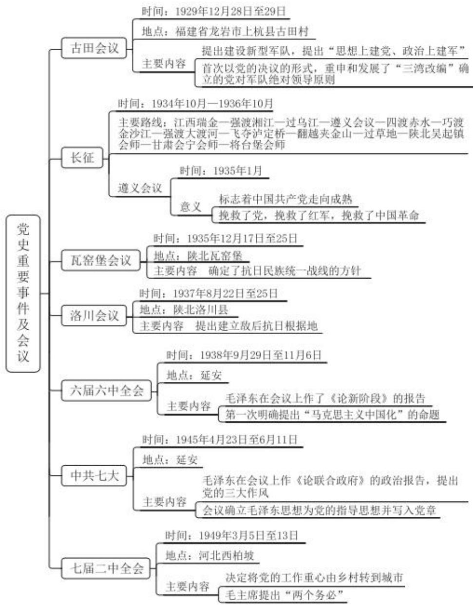

# 【注意】重点：

1. 中共一大，要知道本质上讨论的是什么。
2. 八七会议，提出霸气的决断“枪杆子里面出政权”。
3. 秋收起义。
4. 古田会议。
5. 长征，国考中多次考查，关注路线顺序、相关要点。
6. 遵义会议。
7. 七大，确立毛泽东思想作为党的指导思想并写入了党章。

一大立党二立纲，三大国共要合作，

五大批评陈独秀，六大苏联求帮忙，

南昌打响第一枪，八七枪杆出政权，

三湾军队要听党，古田军队建新军，

遵义军事与组织，瓦窑抗日统一线，

洛川全面建敌后，六届六中马中化，

七大确定毛指导，七届二中转城市。

# 【解析】党史口诀：

1. 一大立党二立纲：1921年召开一大，建立中国共产党；1922年提出最高纲领、最低纲领。
2. 三大国共要合作：想要合作，但是国民党一大的召开才标志着国共第一次合作的形成。
3. 五大批评陈独秀：五大主要批评了陈独秀。
4. 六大苏联求帮忙：六大溜达出去了，找到了苏联帮忙。5.南昌打响第一枪：南昌“第一枪”啤酒。
5. 八七枪杆出政权：八七提出了非常霸气的论断。
6. 三湾军队要听党：军队要听党的。
7. 古田军队建新军：古田会议，提出建立新型的人民军队。
8. 遵义军事与组织：遵义会议讨论军事和组织，确立了以毛泽东同志为核心的正确领导。
9. 瓦窑抗日统一线：“瓦统”。
10. 洛川全面建敌后：“洛后”。
11. 六届六中马中化：“毛六六论马”。
12. 七大确定毛指导：七大确立毛思想，是我们的指导思想。
13. 七届二中转城市：七届二中，“进京赶考”，由此来到了城市。

# 【实战演练】

(2023 国考) “亲人送水来解渴, 军民鱼水一家人。横断山, 路难行。……乌江天险重飞渡, 兵临贵阳逼昆明。敌人弃甲丢烟枪, 我军乘胜赶路程。调虎离山袭金沙……”这是歌曲《四渡赤水出奇兵》中的一段歌词, 下列与之相关的说

# 法正确的是：

A. “调虎离山袭金沙”是由毛泽东指挥的
B. 李白《蜀道难》描写的正是此地“路难行”的状况
C. “军民鱼水”之情表现了沿途人民群众对新四军的支持
D. “乌江天险”正是楚汉战争时项羽兵败自刎的地方

【解析】A项：“调虎离山袭金沙”是毛泽东领导的，因为遵义会议确定了毛泽东的领导地位，四渡赤水、巧渡金沙江都是毛泽东领导，当选。

B 项: 《蜀道难》, 蜀指四川, 行路难。题目中的 “路难行” 是横断山脉,在我国的西南部，覆盖的是藏东、云南西北地区。二者不是一个地方，排除。
C项: “军民鱼水”表现的是人民群众对于红军的支持; 新四军是国民革命军陆军新编第四军, 第二次国共合作时期, 因为第五次反围剿失败了, 大部分人都去长征了, 还有一部分人留在南方八省进行游击战争, 改编的军队是新四军,要知道长征对应的是红军 (记忆), 排除。
D 项：乌江天险对应的是黔江，贵州省。项羽乌江自刎的地方是安徽，是一条古代的河流，现在已经淤塞或改道。一个是安徽、一个是贵州，肯定合不到一起，排除。【选 A】

# 【答案汇总】

考点一 1-2: D/ACD

考点二：A

遇见不一样的自己

Be your better self
