# 精讲精练-常识3

（笔记）

主讲教师：李天然

授课时间：2025.03.21

# 精讲精练-常识3（笔记）

# 【注意】

1. 本节课对应2026国考版讲义77-91页。
2. 本节课讲解经济、地理，比较难，需要认真听、理解。
3. 上课以完成教学任务为主，课下有问题可以去老师微博答疑帖留言。

<table><tr><td colspan="8">常识判断经济常识近五年考查数量</td></tr><tr><td>类型/年份</td><td>2020</td><td>2021</td><td>2022</td><td>2023</td><td>2024</td><td>2025</td><td>合计</td></tr><tr><td>副省级</td><td>0</td><td>2</td><td>0</td><td>1</td><td>1</td><td>2</td><td>6</td></tr><tr><td>地市级</td><td>0</td><td>2</td><td>1</td><td>1</td><td>0</td><td>1</td><td>5</td></tr><tr><td>行政执法</td><td>无</td><td>无</td><td>1</td><td>1</td><td>0</td><td>2</td><td>4</td></tr></table>

# 【注意】

1. 2020-2025年，副省级6题、地市级5题、行政执法4题。为传统知识点的统计，如市场经济、宏观经济的传统知识点，没有囊括经济、时政相关内容，如中央经济工作会议、政府工作报告、经济就业相关的政策文件。若算入，题目考查数量不止这些。
2. 政治理论新增，包括马哲、马政经，国考、一部分省考考查了马政经。
3. 经济点不多，但需要花费一定时间讲解，没有接触过经济的基础知识，听起来会吃力，需要做好准备。

01 马克思主义政治经济学
02 社会主义市场经济
03 宏观经济

# 【解析】

1. 马克思主义政治经济学。
2. 社会主义市场经济：马政经中国化应用。
3. 宏观经济：历年重点，国考几乎每年都会考查。

# 第一节 马克思主义政治经济学

# 一、商品二因素

# （一）商品的含义

商品是指用来交换的能够满足人们某种需要的劳动产品。

【解析】商品的含义：商品是指用来交换的能够满足人们某种需要的劳动产品。经济考查例子。

1. 自然界中的空气不算商品，不是人类的劳动产品，呼吸时不用交钱，无需交换。
2. 空气罐头（如北京、上海空气污染严重的地方，将呼伦贝尔好的空气压缩成罐头，拿到超市去卖）为商品，压缩的过程是劳动的过程，购买是拿钱进行交换，两个条件同时符合，就是商品。
3. 救灾物资不算商品，是劳动产品，但很多都是政府免费提供的，没有经过交换。
4. 农民种的花不一定属于商品，用途不同，若种了花，剪下来自己看，自给自足则不是商品，为劳动产品；若将花剪下来拿到市场上售卖，用于交换的劳动产品是商品。

# （二）商品的二因素

# 1. 使用价值

商品的使用价值是指商品能够满足人们某种需要的属性，即商品的有用性，反映的是人与自然之间的物质关系，是商品的自然属性。

# 2. 价值

商品的价值是指凝结在商品中的无差别的人类劳动，即人类脑力和体力的消耗，反映的是商品生产者之间一定的社会关系，是商品所特有的社会属性。

不同的商品，它们的价值只有量有区别，质都是一样的（）

【解析】商品的二因素：是商品就具有商品的二因素。

1. 使用价值：商品的使用价值是指商品能够满足人们某种需要的属性，即商品的有用性，反映的是人与自然之间的物质关系，是商品的自然属性。

(1) 有用性: 如喝水解渴、吃饭充饥、穿衣服不冷、花用于观赏, 为有用性, 即使用价值。
(2) 不管是水还是粮食, 水天生可以解渴, 粮食天生可以充饥, 天生具有的功能是商品的自然属性。

# 2. 价值：

（1）商品的价值是指凝结在商品中的无差别的人类劳动，判断一个东西是否有价值，前提为是否是商品，如甲自己种了自己看的花，不是商品，则没有价值。一个东西有价值的前提就需要是商品。种了之后拿出去卖的花有价值，是商品，则是有价值的。
(2) 无差别的人类劳动: 任何人不管生产什么都会耗费脑力和体力。如讲课、种地、带货, 三个人的劳动形式不同, 但干活时每个人都有体能消耗。每个人的体能都是通过吃饭、喝水、睡觉等环节得来的, 故每个人的体能本质是没有

差别的，体能输出的人类劳动是无差别的。

(3) 命题: 不同的商品, 它们的价值只有量有区别, 质都是一样的 (正确),原因: 不同商品的价值可能你多我少, 但本质上都是一样的, 质指的就是无差别人类劳动。
(4) 商品所特有的社会属性: 一个东西有价值, 前提需要是商品。

(1)命题: 只有商品才有价值 (正确), 原因: 如种花拿出去卖, 才能有价值。
(2)命题: 有价值一定是商品 (正确), 原因: 如全世界只有一个带着乾坤圈、踩着风火轮的孩子, 一定指的是哪吒。
③商品是用于交换的，在交换的过程中形成了社会关系，价值指的是社会属性。

# 一、商品二因素

1.商品一定有价值？
2. 商品一定有使用价值？
3. 有价值一定是商品？
4. 有使用价值一定是商品？
5. 有使用价值一定有价值？
6. 有价值一定有使用价值？

# 【解析】命题：

1. 商品一定有价值（正确），原因：商品和价值是连体的，分不开。
2. 商品一定有使用价值（正确），原因：使用价值、价值是商品的二因素，但凡是商品就具有二因素，即使用价值、价值。
3. 有价值一定是商品（正确），原因：商品、价值是连体的。
4. 有使用价值一定是商品（错误），原因：如空气，空气有使用价值，可以呼吸、活着，但空气不是商品，不是劳动产品，没有经过交换。
5. 有使用价值一定有价值（错误），原因：有使用价值，不一定能推出是不是商品，则无法推出一定有价值。空气有使用价值，不是商品，故没有价值。
6. 有价值一定有使用价值（正确），原因：有价值可以推出就是商品，但凡是商品自然就有商品的二因素，即使用价值。

粉笔拓展：价值量

1. 商品的价值量是指商品价值的大小，由生产商品的社会必要劳动时间决定。
2. 社会必要劳动时间，即在社会现有的正常的生产条件下，在社会平均的劳动熟练程度和劳动强度下制造某种使用价值所需要的劳动时间。

社会必要劳动时间 VS 单位商品价值量：正比

【解析】价值量：

1. 商品的价值量是指商品价值的大小（价值包含的多还是少），指的是单位商品价值量，一个商品价值的大或小，由生产商品的社会必要劳动时间决定。如同样一个杯子，市场上有千千万万个厂家，生产时间快慢不同，可以用平均时间衡量，马克思将平均时间叫做社会必要劳动时间。
2. 社会必要劳动时间VS单位商品价值量：正比，社会必要劳动时间长，单位商品价值量多，同向增长。如生产1架飞机100天，生产1辆自行车10天，飞机价值量大。

# 二、劳动二重性

# （一）劳动二重性的含义

商品是劳动产品，生产商品的劳动可区分为具体劳动和抽象劳动。

1. 具体劳动：是指人们在一定的具体形式下进行的劳动。具体劳动体现了人和自然的关系，生产出各种各样的使用价值。
2. 抽象劳动：是指撇开一切具体形式的无差别的人类劳动，即人的脑力和体力的消耗。抽象劳动凝结形成商品的价值。

【解析】劳动二重性的含义：商品是劳动产品，生产商品的劳动可区分为具体劳动和抽象劳动。

1. 具体劳动: 是指人们在一定的具体形式下进行的劳动。即看得见的劳动 (外在形式), 如砍树、拉锯、浇花、推箱子。具体劳动体现了人和自然的关系, 生产出各种各样的使用价值。如每天努力种地, 产出的粮食可以吃, 为使用价值,具体劳动最后诞生了粮食的吃, 即具体劳动产生使用价值。
2. 抽象劳动：是指撇开一切具体形式的无差别的人类劳动。即看不见的无差

别人类劳动（内在消耗），不管是砍树还是浇花，干活时人都会在流汗，内部有体力和脑力的消耗。抽象劳动凝结形成商品的价值。价值原本就是凝结在商品中的无差别人类劳动，抽象劳动是撇开一切具体形式的无差别的人类劳动。指的是一个意思，都落脚在无差别人类劳动，故抽象劳动凝结成为价值。

3. 具体劳动产生使用价值，如揉面放进烤箱出来面包可以吃。抽象劳动最终凝结的是商品的价值。

# （二）具体劳动和抽象劳动的关系

具体劳动和抽象劳动是生产商品的同一劳动过程的两个方面，而不是两次劳动。

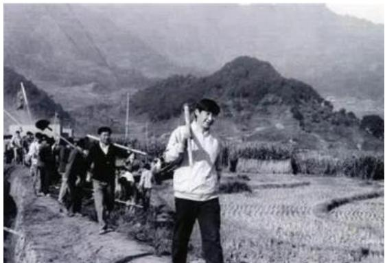

【解析】具体劳动和抽象劳动是生产商品的同一劳动过程的两个方面，而不是两次劳动。如图，习近平总书记年轻时下乡干活，每天锄地这个具体动作是看得见的具体劳动，劳动时消耗体力，即抽象劳动。

# 三、货币及其职能

# （一）含义

货币是指固定充当一般等价物的特殊商品。货币的本质是一般等价物。

【解析】货币是指固定充当一般等价物的特殊商品。货币是商品，有使用价值、价值。货币的本质是一般等价物。一般等价物指的是自身有价值，还能用自身价值衡量其他一切商品的价值。有这样的品性，所以拿着货币购买一切想要的东西。

# （二）职能

# 1. 价值尺度

价值尺度，是指以自身价值作为尺度来衡量其他商品的价值的职能。

【解析】价值尺度：首要职能，是指以自身价值作为尺度来衡量其他商品的价值的职能。常见是标价，不管什么标价都是货币在履行价值尺度，如杯子50元、车30万、电脑5000元，为标价，是货币在履行价值尺度职能。货币在履行价值尺度职能时，只需要标一串数字，是观念上的货币即可，每个人看到5000元、30万都知道是什么意思，无需通过实际物质交换来实现。

# 2. 流通手段

流通手段，是指货币充当商品交换媒介的职能。

【解析】流通手段，是指货币充当商品交换媒介的职能，一手交钱一手交货，二者几乎同时进行。如甲去楼下便利店买水，对方给水，甲给钱，为流通手段；对方给水，甲用支付宝付了2元，是流通手段，符合定义，一手交钱一手交货，二者几乎同时进行；对方给水，甲没带钱、手机，甲表示先给水，明天给钱，此时不属于流通手段。

# 3.支付手段

支付手段，是指在发生赊购赊销的情况下，货币用于清偿债务所执行的职能。货币作为支付手段，已被广泛应用于缴纳租金、税金和发放工资等方面。

【解析】支付手段：钱货分离，必然存在一定的时间差。

1. 支付手段，是指在发生赊购赊销的情况下（如上述案例甲的行为），货币用于清偿债务所执行的职能。
2. 货币作为支付手段，已被广泛应用于缴纳租金（如租房子押一付三）、税

金和发放工资（如老师先上课，下个月钱才会给老师）等方面。

# 4. 贮藏手段

贮藏手段，是指货币退出流通领域，被人们当作社会财富的一般代表加以贮藏的职能。

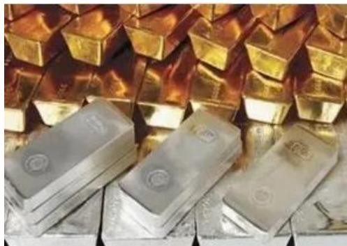

【解析】贮藏手段，即真金白银。但凡履行贮藏手段，必须是足值的金属条块，是指货币退出流通领域，被人们当作社会财富的一般代表加以贮藏的职能。

# 5. 世界货币

世界货币，是指货币在世界市场上作为一种购买手段、支付手段和社会财富的代表所发挥的作用。

价值尺度和流通手段是货币的两个最基本职能。

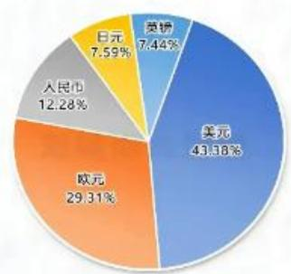
五大货币在SDR中的权重

【解析】世界货币：能够在世界市场上当作货币流通，不光是国家范围内实行，如图，认为加入SDR国际货币基金组织的特别提款权货币篮子中的五种货币是世界货币。包括美元、英镑、欧元、人民币、日元。中国的占比是  $12.28\%$  ，在第三位。

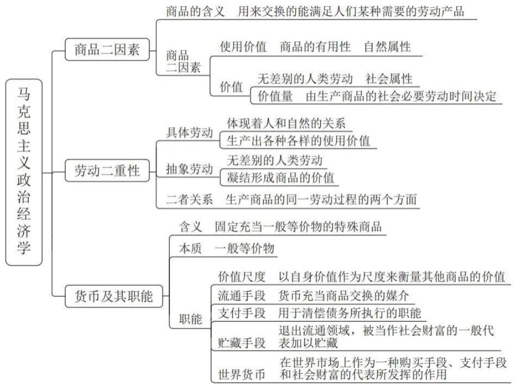

# 【解析】

1. 商品二因素：商品是用于交换的劳动产品，二者必须同时满足。是商品，具有商品二因素，即使用价值、价值，一个是自然属性、一个是社会属性。
2. 劳动二重性：具体劳动（看得见的劳动）、抽象劳动。
3. 货币的职能：货币本质指的是一般等价物，职能指的是五大职能，首要职能是价值尺度，还包括流通手段、支付手段、贮藏手段、世界货币。

# 【实战演练】

(2025 国考)关于马克思主义政治经济学, 下列说法正确的是:

A. 商品的价值量是由生产该商品所需的个别劳动时间决定的
B. 货币的价值尺度职能是通过实际的物质交换来实现的
C. 具体劳动和抽象劳动是不同商品生产过程中的不同劳动
D. 具体劳动创造商品的使用价值, 抽象劳动形成商品的价值

【解析】A项：社会必要劳动时间决定，是平均时间；个别劳动时间是你的或者我的劳动时间决定，不合理，排除。B项：需要一个观念上的货币，排除。C项：同一劳动的两个方面，排除。【选D】

# 第二节 社会主义市场经济

# 一、分配制度

坚持按劳分配为主体、多种分配方式并存。

完善按要素分配政策制度。健全劳动、资本、土地、知识、技术、管理、数据等生产要素由市场评价贡献、按贡献决定报酬的机制。

# 【解析】分配制度：

1. 坚持按劳分配为主体（前提是公有制范围内，如上岸后、国企员工的工资，粉笔是私营企业，工资不是按劳分配）、多种分配方式并存。如上岸后有工资、奖金、津贴属于按劳分配。津贴如高温津贴，夏天特别热，在外面干活，会给高温津贴；值夜班，有夜班津贴，是在公有制范围内，私企的不算。
2. 完善按要素分配政策制度。健全劳动、资本、土地、知识、技术、管理、数据等（十九届四中全会提出的）生产要素由市场评价贡献、按贡献决定报酬的机制。

（1）劳动更多倾向于劳动力的分配，匹配的是私企，如老师在粉笔取得的收入，是凭借出卖劳动能力获取的。
（2）资本即钱生钱，如甲将5万元存到银行，得了500元利息，是按资本要素分配。
(3) 土地如地租, 如农民拥有土地的经营权, 出去务工, 将土地流转, 收到租金是土地要素分配得到的钱。
(4) 知识即知识入股，凭借有的知识入股参与分红。
（5）技术即按照技术要素分配，典型如专利转让，如甲发明某个新的专利，出让专利获得专利转让费。
（6）管理要素：如粉笔的 CEO 是私企高管，为按照管理要素分配，凭借管理才能取得收入。
(7) 数据: 知道是生产要素即可, 大数据很值钱, 很多人喜欢收集, 如月收入多少、喜欢什么商品, 都是数据, 可以用在市场上赚钱。

# 二、三次分配

# 1. 初次分配

初次分配是国民收入首先在物质生产领域内进行的分配。

# 2. 再分配

再分配是国民收入在初次分配的基础上，在全社会范围内继续进行的分配。其工具是国家财政及各种经济杠杆，如税收、社会保障、转移支付。

# 3. 第三次分配

第三次分配是建立在自愿性的基础上，以募集、自愿捐赠和资助等慈善公益方式对社会资源和社会财富进行的分配。

【解析】三次分配：国民收入的分配制度。

1. 初次分配：初次分配是国民收入首先在物质生产领域内进行的分配。主体主要指的是企业，如在华为制作手机，在粉笔上课，工资都是在企业领的，属于物质生产领域。
2. 再分配：不同企业收入不同，如有的人月收入2万元，有的人月收入2000元，国家为了保障公平，出现了再分配的情况。如税收（一个月赚2万多交税，一个月赚2000元则不交税，通过税收可以让国民收入更加公平，可以缩小差距）、社会保障（如政府会向居民提供物质方面的保障，如社会保险、社会救助）、转移支付（政府无偿的福利性支出，如疫情时的疫苗没有给钱，政府给的钱，走的是转移支付）。
3. 第三次分配：第三次分配是建立在自愿性的基础上，以募集、自愿捐赠和资助等慈善公益方式对社会资源和社会财富进行的分配。

# 粉笔拓展：二十届三中全会

党的二十届三中全会通过的《中共中央关于进一步全面深化改革、推进中国式现代化的决定》提出，完善收入分配制度，规范收入分配秩序。具体内容如下：

完善收入分配制度。构建初次分配、再分配、第三次分配协调配套的制度体系，提高居民收入在国民收入分配中的比重，提高劳动报酬在初次分配中的比重。完善劳动者工资决定、合理增长、支付保障机制，健全按要素分配政策制度。完善税收、社会保障、转移支付等再分配调节机制。支持发展公益慈善事业。

规范收入分配秩序，规范财富积累机制，多渠道增加城乡居民财产性收入，形成有效增加低收入群体收入、稳步扩大中等收入群体规模、合理调节过高收入

的制度体系。深化国有企业工资决定机制改革，合理确定并严格规范国有企业各级负责人薪酬、津贴补贴等。

【解析】二十届三中全会：

1. 构建初次分配、再分配、第三次分配协调配套的制度体系，提高居民收入在国民收入分配中的比重，多劳多得，干得多多给钱。健全按要素分配政策制度，如劳动、资本、土地等。完善税收、社会保障、转移支付等再分配调节机制，为第二次分配/再分配。支持发展公益慈善事业，为第三次分配。
2. 多渠道增加城乡居民财产性收入，对着的是劳动性收入，即干活有收入，不干活没有收入，财产性收入指的是躺着也有收益，如出租房子、理财的收益。
3. 形成有效增加低收入群体收入、稳步扩大中等收入群体规模、合理调节过高收入的制度体系。口诀：增低、扩中、调高。

# 三、社会保障制度

社会保障主要由社会保险、社会救助、社会福利、社会优抚组成，还包括其他社会保障形式，它们共同构成我国的社会保障体系。

1. 社会保险是我国社会保障体系的核心。在我国，社会保险主要包括基本养老保险、基本医疗保险、工伤保险、失业保险、生育保险等。
2. 社会救助是最先形成的、历史最悠久的社会保障，是保障社会成员生活安全和生存权利的“最后一道防线”。
3. 社会福利是政府和社会向社会成员提供的社会化服务、实物供给或者福利津贴，是最高层次的社会保障。
4. 社会优抚是国家和社会依法对现役军人、复员退伍军人以及军烈属等优抚对象实行物质照顾、生活和工作安置、精神抚慰的褒扬性、补偿性、优待性、综合性的特殊社会保障。

【解析】社会保障制度：社会保障主要由社会保险、社会救助、社会福利、社会优抚组成，还包括其他社会保障形式，它们共同构成我国的社会保障体系。

1. 社会保险是我国社会保障体系的核心，为核心纲领，即五险（有的地方是五险或四险），通常去公司上班就需要缴纳。
2. 社会救助是最先形成的、历史最悠久的社会保障，是保障社会成员生活安

全和生存权利的“最后一道防线”。救助的多半是弱势群体，即孤寡残幼穷，能够保障吃饱饭，但不保障顿顿都吃好的，能保证有房住，但不能保证居住大别墅。

3. 社会福利是政府和社会向社会成员提供的社会化服务、实物供给或者福利津贴，是最高层次的社会保障。如养老院、儿童福利院。
4. 社会优抚是国家和社会依法对现役军人、复员退伍军人以及军烈属等优抚对象实行物质照顾、生活和工作安置、精神抚慰的褒扬性、补偿性、优待性、综合性的特殊社会保障（对象特殊）。如退伍军人的转业安置费、军烈属的抚恤金。

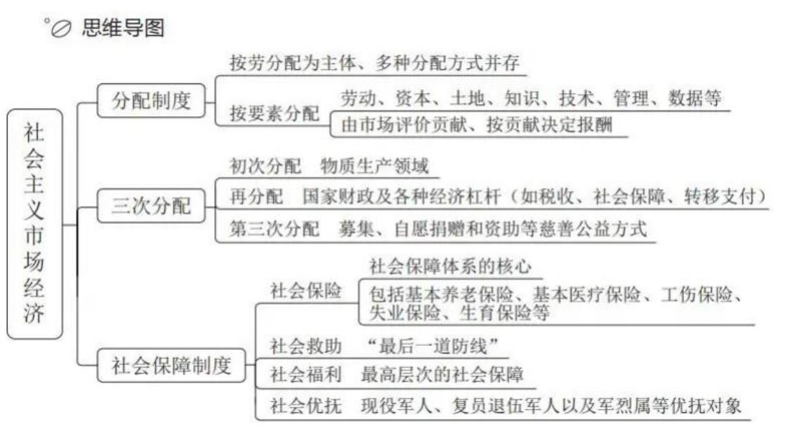

# 【注意】

1. 分配制度：按劳分配为主体，多种分配方式并存（按要素分配，包括劳动、资本、土地、技术管理、数据）。
2. 三次分配：初次分配如在华为做手机得到的收入；税收、社保、转移支付是再分配；第三次分配常见形式是慈善、公益。初次分配主体是企业，再分配主体是国家，第三次分配主体是社会成员之间。
3. 社会保障制度：社会保险（核心）、救助（最后一道防线，最低纲领）、福利（最高层次的社会保障）、优抚（对象特殊，为特殊纲领）。

# 【实战演练】

1. （2025国考）完善收入分配制度，构建初次分配、再分配、第三次分配

协调配套的制度体系，是进一步全面深化改革的重要任务。关于完善收入分配制度，下列表述不准确的是：

A. 提高劳动报酬在初次分配中的比重
B. 完善劳动者工资决定、合理增长、支付保障机制，健全按要素分配政策制度
C.规范财富积累机制，多渠道增加城乡居民财产性收入
D. 完善税收、社会保障、转移支付等第三次分配调节机制

【解析】1. 选非题。D项：再分配/第二次分配，当选。A项：如在华为做手机，多做了10个，要多给钱，排除。B项：对劳动者有利，排除。【选D】

2. （2023 上海）社会救助是我国社会保障制度的一项重要内容，是扶危济困、救急救难的兜底性制度安排。全社会要形成救助合力，切实做到弱有所扶、难有所帮、困有所助、应助尽助，把困难群众的民生底线兜住兜牢。以下属于社会救助措施的是：

A. 调整最低生活保障标准为每人每月 1420 元
B. 制定并发布《保障农民工工资支付条例》
C.制定实施《社会保险基金行政监督办法》
D. 将诺西那生钠注射液纳入进新医保目录

【解析】2. 社会救助是最低。B项：和救助无关，而是干活要给钱，排除。C、D项：社会保险有关，排除。【选A】

# 【答案汇总】

1-2:DA

# 第三节 宏观经济

# 一、通货膨胀与通货紧缩

# （一）通货膨胀

市场上流通的货币量超过实际需要的货币量，从而引起的货币贬值和物价水平全面而持续地上涨的经济现象叫作通货膨胀。其实质是社会总需求大于社会总

供给。

# （二）通货紧缩

市场上流通的货币量少于商品流通中所需要的货币量而引起的货币升值和物价普遍持续下跌的现象叫作通货紧缩。其实质是社会总需求小于社会总供给。

【解析】通货膨胀与通货紧缩：二者相反。

1. 通货膨胀：通是流通，货是货币，膨胀是多，即流通中的货币变多了。市场上流通的货币量超过实际需要的货币量，从而引起的货币贬值（钱不值钱了）和物价水平全面而持续地上涨的经济现象叫作通货膨胀。其实质是社会总需求大于社会总供给（所有的人都对商品有需求，拿钱才会给商品，越来越多的钱花在市场上，出现了通货膨胀）。
2. 通货紧缩：市场上流通的货币量少于商品流通中所需要的货币量而引起的货币升值和物价普遍持续下跌的现象叫作通货紧缩。其实质是社会总需求小于社会总供给。
3. 过度的通货膨胀和通货紧缩都不是好事，需要应对、调节。

# 二、财政政策

# （一）含义

财政政策是指政府运用国家预算和税收等财政手段，通过对国民收入的分配和再分配，来实现社会总供给和社会总需求平衡的一种经济政策。

# （二）财政收入

1.税收：具有强制性、无偿性和固定性三个特征。
2. 利润：国家凭借国有资产所有权获得的利润、租金、股息、红利、资金使用费等收入的总称。
3. 国债：中央政府对公众的债务，或公众对中央政府的债权。
4. 费用：国家政府机关或事业单位在提供公共服务、实施行政管理或提供特定公共设施的使用时，向受益人收取一定费用的收入形式。

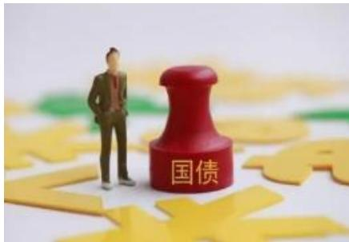

【解析】财政政策：

1. 含义：财政政策是指政府（主体）运用国家预算和税收等财政手段，通过对国民收入的分配和再分配，来实现社会总供给和社会总需求平衡的一种经济政策。
2. 财政收入：

（1）税收：财政收入最主要的来源，我国  $90\%$  的财政收入几乎都来自于税，一定有和其他收入不同的地方。具有强制性（不能不交税）、无偿性（白给的钱，交了也白交）和固定性（税种、税率一般情况下都是稳定的）三个特征。
(2) 利润：国家凭借国有资产所有权获得的利润（如国企的利润）、租金（土地租金）、股息、红利、资金使用费等收入的总称。
(3) 国债: 中央政府对公众的债务 (中央政府问老百姓借钱), 或公众对中央政府的债权。国债对应的是地方政府债券, 是地方政府问老百姓借钱。国债的信用度更高, 也叫做金边债券。
（4）费用：国家政府机关或事业单位在提供公共服务、实施行政管理或提供特定公共设施的使用时，向受益人收取一定费用的收入形式。如高速公路费、结婚证的费用。

# （三）财政支出

财政支出是指在市场经济条件下，政府为提供公共产品和服务，满足社会共同需要而进行的财政资金的支付。

1. 政府购买

政府购买是指政府对商品和劳务的购买。

2. 政府转移支付

政府转移支付是指政府在社会福利等方面的支出。

【解析】财政支出：

1. 政府购买：政府购买是指政府对商品和劳务（如各种工资）的购买。将钱花出去，商品拿回来，如购买办公用品，政府以消费者的身份在市场上购买桌椅板凳、装备。钱花出去，有商品、人干活，是有偿的，有来有回，即典型双向有偿。
2. 政府转移支付：政府转移支付是指政府在社会福利等方面的支出，为单向的、无偿的，如打疫苗、低保，都会算在政府转移性支付中。

# （四）工具运用

1.税收。
2. 国债。
3. 政府购买。
4. 政府转移支付。
5. 财政预算。

【解析】工具运用：通货膨胀时期，市场上钱变多了，希望能够变少，政府出面，需要少花、多收。

1.税收：通货膨胀时期，政府多收钱，让市场上的钱变少，抑制通货膨胀。
2. 国债：中央政府管老百姓借钱，按照目的分为两种国债，一种国债目的是为了回收资金，本质是为了收钱，通货膨胀时期多收；一种是为了基础设施建设，即花钱，通货膨胀时期，应该少花。
3. 政府购买、政府转移支付：支出，是花钱，通胀时期，要少花钱。
4. 财政预算：预算即未来准备花多少钱，如双十一的预算是花1万元，财政预算即国家准备花多少钱，故要少花钱。

# 三、货币政策

# （一）含义

货币政策是中央银行为实现其特定的经济目标而采用的各种控制和调节货币供应量和信用量的方针、政策和措施的总称。

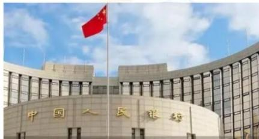

【解析】货币政策：主体是中央银行。

1. 中央银行是中国人民银行，其他的工行、农行、中国银行、建设银行均属于商业银行，只有中国人民银行才是中央银行。
   2.央行能干什么：

(1) 中央银行是国家的银行: 央行可以制定或者执行货币政策。
（2）中央银行是银行中的银行：日常我们办理存款、房贷不会去央行，商业银行、金融机构办理业务才会去找央行，央行是银行体系的老大，称为“央妈”。
（3）中央银行是发行的银行：央行发行的人民币算数，其他银行发行的货币不算数。

# （二）工具运用

# 1. 法定存款准备金率

法定存款准备金率是指金融机构为保证客户提取存款和资金清算需要而缴存在中央银行的存款，占其存款总额的比例。

# 2. 再贴现率

再贴现率是指商业银行将其贴现的未到期票据向中央银行申请再贴现时的预扣利率。

# 3.公开市场业务

公开市场业务是指中央银行通过买进或卖出有价证券，吞吐基础货币，调节货币供应量的活动。

# 4. 利率

利率也称利息率，是指一定时期内利息额与借贷资金即本金的比率。

# 【解析】工具运用：

# 1. 法定存款准备金率：

(1) 存款准备金讨论商业银行的问题, 商业银行是营利性的, 若商业银行

为了赚钱将所有吸收的存款全都拿出去放贷，储户上门取钱会无钱可取，央行为了防止此类事情发生，规定商业银行每吸收一部分存款就要拿其中一小部分的钱给央行。放在央行的钱是存款准备金。

（2）法定存款准备金率即按照多少比例将存款放在央行，比如法定存款准备金率为  $20\%$  ，商业银行吸收1000万元的存款，商业银行要给央行200万元。法定存款准备金就是商业银行给央行的钱。（3）通货膨胀时期提高法定存款准备金率，市场上的钱多，商业银行要多交给央行钱，可以很好地抑制通货膨胀。

2. 再贴现率：商业银行将其贴现的未到期票据向中央银行申请再贴现时的预扣利率。

（1）贴现：持票人拿着手中未到期票据去商业银行提前兑换出来的过程，比如甲给乙20万元，告诉乙到明年4月份才能将钱兑换出来，但是乙想花钱，乙拿着未到期票据去商业银行提前将钱兑换出来，商业银行说“没有到期要缴纳贴现费用”，有可能是  $10\%$  ，20万元  $\times 10\% = 2$  万元，乙交2万元就可以将钱提出来。（2）再贴现：即再来一次的意思，商业银行拿着未到期的票据找央行，将其提前兑换的过程即再贴现。（3）再贴现率指商业银行到底要按多少比例给央行钱，再贴现率仍然指的是商业银行给央行的钱。（4）通货膨胀时期市场上钱多了，要多给央行钱，再贴现率在通货膨胀时期仍然是提高的情况。

3. 公开市场业务：中央银行通过买进或卖出有价证券，调节货币供应量的过程。通货膨胀时期要将相关的证券进行卖出，老百姓用钱换，通货膨胀时期市场上的钱非常多，要卖出证券把钱收进来，由此可以很好地抑制通货膨胀。通货膨胀时期要卖出公开市场业务。
4. 利率：分为存款利率、贷款利率，二者的结论一样，在通货膨胀时期都要提高。

(1) 存款利率提高, 老百姓愿意存钱, 比如之前存 100 元给 5 元利息, 现在存 100 元给 10 元利息, 钱都在银行里面, 手中没有钱消费, 市场上的钱自然

而然变少，此时存款利率提高，导致市场上的钱变少，可以抑制通货膨胀。

（2）贷款利率提高不愿意贷款，此时没有钱投资、买房，市场上的钱变少。
（3）通货膨胀时期市场上的钱太多，要提高存款利率、贷款利率，此时市场上的钱会变少。

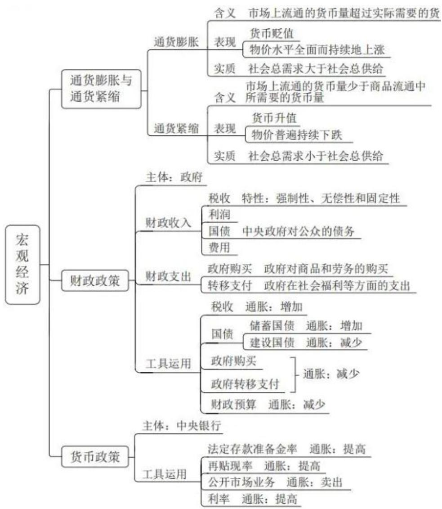【注意】宏观经济：

1. 通货膨胀：流通中的货币量变多了。
2. 在通货膨胀时期，财政政策要少花多收。
3. 货币政策提到“率”，货币政策指的是三率+一公开，即法定存款准备金率、再贴现率、公开市场业务、利率。法定存款准备金率、再贴现率、利率都提高，即带有“率”都提高，卖出公开市场业务，通货膨胀时期货币政策进行“三高一卖”。

# 【实战演练】

(2024 四川) 下列关于存款准备金率的说法, 正确的是:

A. 降低存款准备金率，商业银行的贷款能力也会随之降低
B. 一般对法定存款准备金率的调整应根据商品市场供求来确定
C.法定存款准备金率是一种宏观调控手段，属于一般性政策工具
D. 通缩环境下, 政府通常会采取提高存款准备金率来刺激经济发展

【解析】A项：降低存款准备金率，说明商业银行给央行的钱变少了，商业银行自己手里钱变多，能拿出去放贷的钱变多，贷款能力也会随之提高，排除。
B项：存款准备金率交多少是央行说的算，讨论钱、货币的问题，更多与货币的供求有关，与现在市场上钱的够不够有关，不能根据商品市场供求来确定，排除。
C项：财政政策、货币政策都属于宏观调控的手段，法定存款准备金率是宏观调控手段中经济手段，具体是货币政策，属于一般性政策工具，当选。
D项：通货紧缩的情况下市场的钱少，要降低存款准备金率，通货膨胀时期要三高一卖。通货紧缩时期反过来，降低存款准备金率意味少给央行钱，商业银行有更多的钱拿出去贷款，市场上的钱由此会越来越多，排除。【选C】

<table><tr><td colspan="8">常识判断地理常识近五年考查数量</td></tr><tr><td>类型/年份</td><td>2020</td><td>2021</td><td>2022</td><td>2023</td><td>2024</td><td>2025</td><td>合计</td></tr><tr><td>副省级</td><td>1</td><td>0</td><td>1</td><td>3</td><td>2</td><td>3</td><td>8</td></tr><tr><td>地市级</td><td>1</td><td>0</td><td>2</td><td>2</td><td>1</td><td>2</td><td>8</td></tr><tr><td>行政执法</td><td>无</td><td>无</td><td>1</td><td>1</td><td>0</td><td>3</td><td>5</td></tr></table>

【注意】地理考情：2020-2025年这6年，少的时候1道题不考，多的时候考查2-3题，与经济的考情差不多，但是地理的特点是没有延伸的题目，最多考查这些。

# 目录

# 01 自然地理

# 02 中国地理

【解析】本节课讲解自然地理和中国地理。文史、经济、地理都有补充课程，大家掌握精讲课程之后，再去听补充课程。

# 第一节 自然地理

# 一、太阳

# （一）化学组成

太阳的质量大约四分之三是氢，其余的几乎是氦。

# （二）构造

太阳的大气层，是人类能观测到的太阳的部分，从里到外分为光球、色球和日冕三个圈层。

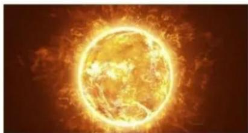

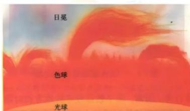

# 【解析】太阳：

1. 主要成分是氢和氦, 太阳的质量大约四分之三是氢, 相比而言氢更多。每四个氢原子核经过一系列核聚变的反应会变成一个氦原子核, 过程中每秒大概释放 400 万吨的能量, 通过电磁波的形式向四周释放, 由此给地球带来很大的影响,让地球上一直阳光普照, 万物生长, 因为太阳是恒星可以发光, 地球是行星不发光。
2. 构造：太阳的大气层，是人类能观测到的太阳的部分，从里到外分为光球、色球和日冕三个圈层。我们肉眼能看到的是最里面的光球层，非常亮，亮度甚至可以遮盖色球和日冕层；色球层在中间，我们是看不到的；日冕层是最外面的一层，其范围最大，用特制的日冕仪才可以看到，是乳白色的光辉环状物。

# 二、地球

# （一）地球的自转与公转

1. 自转：方向是自西向东，周期约24小时，产生昼夜更替现象。

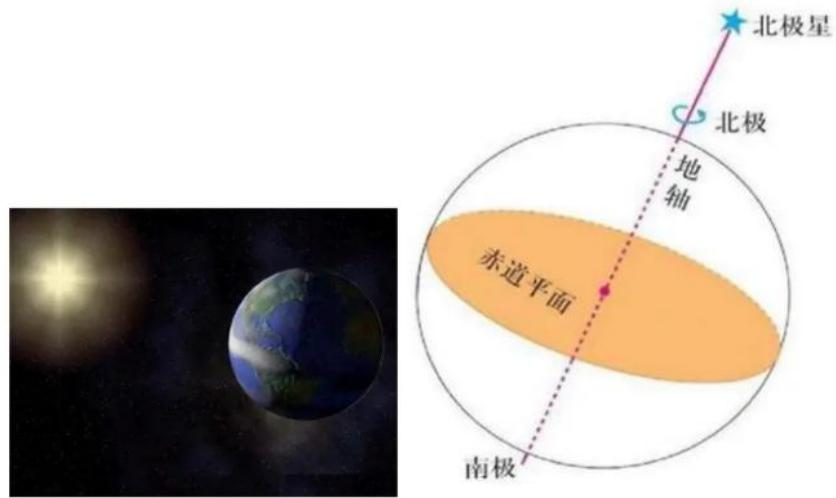

# 【解析】自转：

1. 地球自转的方向是自西向东，地球绕着地轴转，地轴是假想轴，是人类想象出来通过地球的中心连接南北两极的一根假想轴。地球绕着地轴转，地轴的北端是北极星，以北极星为参考，自转方向是上北下南自西向东，方向是自西向东。
2. 自转意义：昼夜更替。地球本身不发光、不透明，同一时间内太阳只能照射地球的一半，向着太阳的是白天，背着太阳的是黑夜，由此地球不停地自转，昼夜不断交替，白天、黑夜是地球自转带来的。
3. 公转：方向是自西向东，周期约365天，产生四季更替现象。

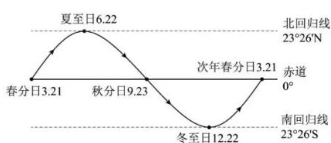

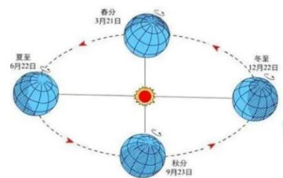

# 【解析】

1. 公转：方向是自西向东，产生太阳直射点的位置变化。
2. 太阳直射点在北回归线、赤道、南回归线之间移动。

（1）春分一般是3月20日或者3月21日左右，“分”即昼夜平分的意思，春分日太阳的直射点在赤道，此天昼夜平分。

(2) 夏季很热, 因为太阳直射点距离我们很近, 我们在北半球, 到了夏天的夏至日太阳的直射点在北回归线。夏至日 6 月 22 日左右。（3）太阳直射点到了北回归线就往回走，不会再往北直射，到了秋分的时候，秋分是昼夜平分，太阳的直射点在赤道。秋分日是9月22日或者9月23日左右。（4）过了秋分之后，太阳的直射点继续南移，到了冬至，我们感觉冷了，因为太阳的直射点距离我们远了，此时到了南回归线，又开始往北移，一直到了赤道，即次年春分的时候。冬至日是12月22日或者12月23日左右，直射南回归线。

3. 春夏秋冬即四季更替，地球公转产生了四季更替的现象。

3.二十四节气

（1）将地球绕着太阳公转的周期分成24等份，每一份为一个节气，一年就有了二十四节气。
(2)二十四节气的顺序

2月：立春、雨水。3月：惊蛰、春分。4月：清明、谷雨。
5月：立夏、小满。6月：芒种、夏至。7月：小暑、大暑。
8月：立秋、处暑。9月：白露、秋分。10月：寒露、霜降。
11月：立冬、小雪。12月：大雪、冬至。1月：小寒、大寒。

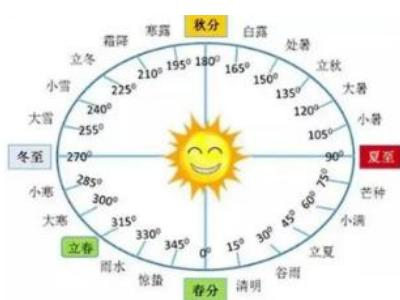

# 二十四节气歌

chún yu jing chun qing gutian 春雨惊春清谷天， xia mán máng xia shu xiàng lián 夏满芒夏暑相连。 qiu chu lukai hán shuāng jiāng 秋处露秋寒霜降， dong xué xué déng xià dā hán 冬雪冬小大寒

# 【解析】

1.二十四节气（重点）：将地球绕着太阳公转的周期分成24等份，每一份为一个节气，一年就有了二十四节气。

(1)二十四节气是由地球绕着太阳公转划分, 地球绕一圈是  $360^{\circ}$ , 从春

分开始每  $15^{\circ}$  一等份，出现 24 个等分点，即二十四节气。

(2) 主要是黄河流域的先祖总结出二十四节气, 用于指导农事, 告诉我们什么时候该去耕种、该去收获。
(3) 在西汉汉武帝的《太初历》中二十四节气被正式用于立历法。

# 2.二十四节气的顺序：

(1) 2 月: 立春 (春天的开始)、雨水 (开始降水, 雨量渐增)。3 月: 惊蛰 (蛰即藏的意思, 春雷乍动惊醒了蛰伏在土中冬眠的小动物)、春分 (昼夜平分, 太阳直射点在赤道)。4 月: 清明 (天气晴朗, 草木繁茂, 可以去踏青)、谷雨 (雨生百谷, 此时雨量充足, 谷类作物好好生长)。
(2) 5 月: 立夏 (夏季)、小满 (麦类作物开始饱满)。6 月: 芒种 (麦类的芒作物开始成熟, 可以收割)、夏至 (太阳直射点在北回归线, 夏至日的北半球各地的白昼时间达到全年最长, 而且越往北越长, 北极圈甚至出现极昼的现象)。7 月: 小暑、大暑 (相对比较热)。
(3) 8 月: 立秋、处暑 (虽然带有 “暑” 字, 但是秋天, 古人讲 “处” 即止的意思, 处暑指即夏天到此为止)。9 月: 白露 (天气转凉, 露凝而白)、秋分 (昼夜平分, 太阳直射点在赤道)。10 月: 寒露、霜降 (天气渐冷有霜)。
(4) 11 月: 立冬、小雪 (开始下雪)。12 月: 大雪 (雪量渐增, 有可能积雪)、冬至 (非常冷的时候, 太阳直射点离我们远, 太阳直射点在南回归线)。1月: 小寒、大寒 (一年中最冷的时候)。
(5) 平均一个月中有两个节气, 立春是第一个, 在 2 月。

3.二十四节气歌：春雨惊春清谷天，夏满芒夏暑相连，秋处露秋寒霜降，冬雪雪冬小大寒。掌握顺序，从立春开始，立春在2月，记忆顺序，小寒在最后，在1月；白露大概在9月。

# （二）地球圈层

1. 内部圈层：分为三个基本圈层，即地壳、地幔和地核。
   2.外部圈层：包括大气圈、水圈、生物圈等。

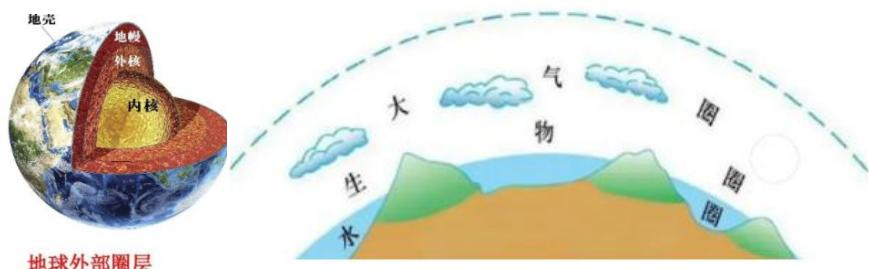

【解析】地球圈层：分为内部圈层和外部圈层。

1. 内部圈层: 从外到里分为三个基本圈层, 即地壳、地幔和地核 (分为内地核和外核)。将地球想象成鸡蛋, 鸡蛋壳指的是地壳; 蛋清是地幔; 蛋黄是地核, 分为内地核和外地核。

(1) 地壳是由一层薄薄的由岩石组成的坚硬外壳, 但是薄厚不一样, 通常陆地的地壳比较厚, 海洋地壳相对比较薄, 平均厚度大概在 17 千米左右。
(2) 地幔分为上地幔下地幔, 上地幔存在软流层, 通常认为岩浆发源于软流层。
(3) 地核分为内地核和外核。

(1)外核是一个熔融的状态，倾向于液态。(2)内核的特点是一个固态, 真正的内地核在最内部, 承担的压力大, 温度高、密度大, 通常是固态的状态。

2. 外部圈层：包括大气圈、水圈、生物圈等。

(1) 大气圈: 最外部的, 像大气、袍子一样包裹地球, 保护我们免受宇宙射线的伤害。
(2) 水圈: 包含地球上的所有的水体, 比如河流、海洋、湖泊, 这些水不断循环, 调节气候、净化空气。
(3) 生物圈: 地球上所有生物的家, 大概从地底下几千米到地表以上十几千米的高空都有生物存在, 但是大部分生物更喜欢在地表活动, 比如人类也是这样的, 因此食物多, 而且环境比较舒适。
(4) 大气圈、水圈、生物圈相互影响、相互渗透、相互作用, 才能构成地球这个美丽家园。

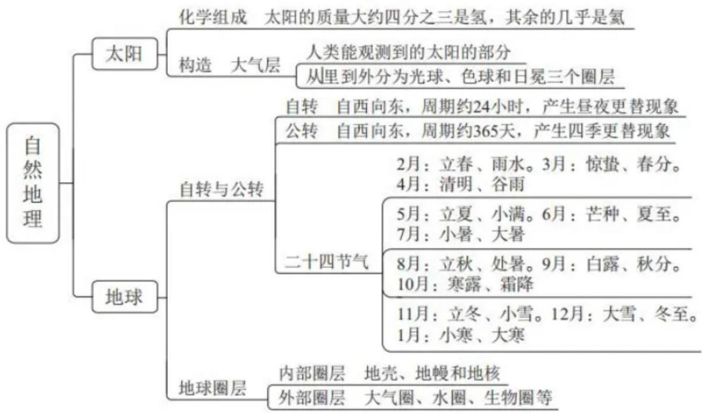
【注意】重点是二十四节气。

# 【实战演练】

(2023 福建)“二十四节气”鲜明地体现了中国人尊重自然、顺应自然规律和可持续发展的理念。下列关于“二十四节气”的说法正确的是:

A. 起源于长江流域，是我国农历的重要组成部分
B. 立夏时北半球的白昼时间最长，且越往北越长
C. 是通过观察地球周年运动形成的时间知识体系
D. 春分日太阳直射地球赤道, 南北半球昼夜平分

【解析】A项：起源于黄河流域，排除。

B 项：夏至是北半球的白昼时间最长，且越往北越长，直射的是北回归线，排除。
C项：严格来说没有地球周年的说法，所谓的“地球年”其实是年的意思，即365天。观察的是太阳周年，称为太阳周年的视运动，是人们早期对于地球公转的误解，早期的时候人们站在地球上，看着地球不动，太阳在动，认为是太阳在运动，但是随着地心说的崩溃，人们发现这只是一种看上去的运动，因此称为太阳周年的视运动。准确来说是当年观察太阳周年视运动得出的知识体系，排除。

【选D】

# 第二节 中国地理

# 一、疆域

中国疆域面积广大，陆地领土面积约960万平方千米，仅次于俄罗斯和加拿大，居世界第三位。

# （一）海陆位置

我国位于北半球，位于亚洲东部、太平洋西岸。

# （二）领土四至

1. 最北端——在黑龙江省漠河市北端黑龙江主航道中心线上。
2. 最南端——为海南省南沙群岛中的曾母暗沙。
3. 最东端——在黑龙江省黑龙江与乌苏里江主航道中心线的汇合处。
4. 最西端——在新疆维吾尔自治区的帕米尔高原上。

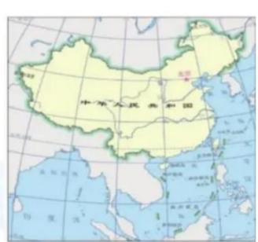

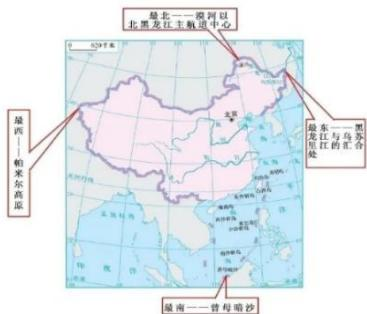

# 【解析】疆域：

1. 中国疆域面积广大，陆地领土面积约960万平方千米，居世界第三位。面积最大的是俄罗斯，第二的是加拿大。
2. 海陆位置：我国位于北半球，位于亚洲东部（世界上最大的大洲）、太平洋西岸（面对太平洋，太平洋是四大洋中最大的洋）。命题：中国位于世界上最大的大洲，面向世界上最大的大洋（正确）
3. 领土四至：我国东南西北到底都到哪个位置，掌握最北端和最南端。

(1) 最北端: 在黑龙江省漠河市北端黑龙江主航道中心线上。比如歌曲《漠河舞厅》, 冬天的漠河旅游业非常火, 还有最北消防站、最北邮局。
(2) 最南端: 为海南省南沙群岛中的曾母暗沙, 曾母暗沙是珊瑚礁岛, 名字是暗沙, 暗沙指没有露出海面的沙洲, 曾母暗沙在水平面以下。
(3) 最东端: 在黑龙江省黑龙江与乌苏里江主航道中心线的汇合处。注意:最北端和最东端都在黑龙江省。

(4) 最西端: 在新疆维吾尔自治区的帕米尔高原上。

# （三）陆海邻国

我国陆上国界线长达2.28万千米，共有14个陆上邻国和6个隔海相望的国家。

陆上邻国分别是：朝鲜、俄罗斯、蒙古、哈萨克斯坦、吉尔吉斯斯坦、塔吉克斯坦、阿富汗、巴基斯坦、印度、尼泊尔、不丹、缅甸、老挝和越南。

隔海相望的国家分别是：韩国、日本、文莱、马来西亚、印度尼西亚、菲律宾。

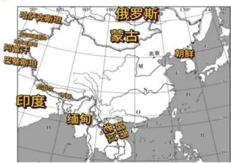

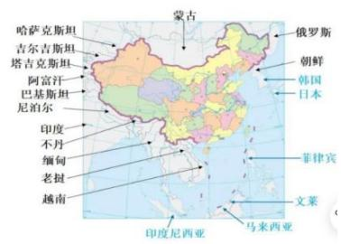

【解析】陆海邻国：我国共有14个陆上邻国和6个隔海相望的国家（记忆数量）。

# 1. 陆上邻国：

(1) 东北: 朝鲜, 当年雄赳赳气昂昂跨过鸭绿江到朝鲜, 朝鲜是陆上邻国。
(2) 俄罗斯：在我国的北边，与我国的关系很好。
(3) 蒙古: 往西走, 号称世界上最安全的国家, 左边是中国, 北边是俄罗斯。
（4）中亚地区：往左边是中亚地区，分别是哈萨克斯坦（世界上最大的内陆国）、吉尔吉斯斯坦、塔吉克斯坦、土库曼斯坦、乌兹别克斯坦，“斯坦”是国家的意思，目前我国和中亚国家的关系很好。哈萨克斯坦、吉尔吉斯斯坦、塔吉克斯坦与我国接壤，土库曼斯坦、乌兹别克斯坦与我国不接壤（重点），口诀“突兀”，考试中出现土库曼斯坦、乌兹别克斯坦是突兀的，该选项是错误的，与我国不接壤。
(5) 阿富汗：南边，阿富汗有狭长的走廊，与我国有一点点的边界线。
(6) 巴基斯坦：巴铁，与我国的关系很好。
（7）印度：与我国是邻居，但是考试中不愿意考查印度。

(8) 尼泊尔（重点）：珠穆朗玛峰位于我国和尼泊尔的边境线上，从中国和尼泊尔都可以爬上珠穆朗玛峰，我国爬的是珠穆朗玛峰的北坡，从尼泊尔爬上去是珠穆朗玛峰的南坡。
（9）不丹。
(10) 缅甸、老挝和越南: 东南亚国家。注意: 泰国、柬埔寨与我国不接壤 (重点)。口诀 “泰柬”, 考试中出现也不能选择。
2.6 个隔海相望的国家（如果有特别高倍的望远镜，在山东半岛可以远远地看到韩国），韩国、日本、文莱、马来西亚、印度尼西亚、菲律宾。

# 二、地形地势

我国总体地势西高东低，呈三级阶梯状分布。

# （一）三级阶梯分界线

1. 第一、二级阶梯分界线：昆仑山脉—祁连山脉—横断山脉。
   2.第二、三级阶梯分界线：大兴安岭—太行山脉—巫山—雪峰山。

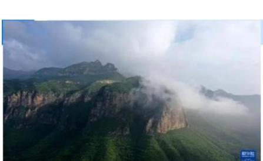

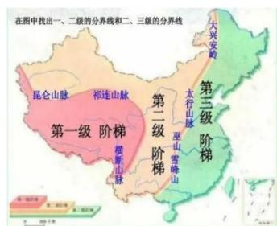

# 【解析】地形地势：

1. 我国总体地势西高东低，呈三级阶梯状分布，从西向东逐渐降低，第一阶梯主要以青藏高原为主，大约平均海拔4000米以上；第二阶梯平均海拔是2000米左右；第三阶梯相对海拔比较低，主要以平原和丘陵为主。

# 2. 三级阶梯分界线：

(1) 第一、二级阶梯分界线：昆仑山脉—祁连山脉—横断山脉。

(1)昆仑山脉：位于新疆的南部。昆仑山在我国古代的地位非常高，寻龙诀都去昆仑山，昆仑山被称为“万山之祖”。
②祁连山脉：位于甘肃，甘肃在我国西北内陆地区，通常降水很少很干旱，但是祁连山脉的存在会导致河西走廊的农业发展得很好，张掖、敦煌都是河西走廊上的城市，因为祁连山脉的冰雪融化，可以灌溉到河西走廊。

(3)横断山脉: 位于云南、西藏、四川的交界处, 主要位于我国西南地区, 比如四渡赤水出奇兵中横断山路难行。

（2）第二、三级阶梯分界线：大兴安岭（东北地区）—太行山脉（愚公移山的其中一个）—巫山（重庆附近）—雪峰山（湖南省的西部左右）。原本太行山是山西和山东名字的来源，太行山以西是山西，太行山以东是山东，根据现在的行政划分来说太行山在山西和河北之间。

# （二）三级阶梯及主要地形区

# 1. 第一级阶梯：

(1) 柴达木盆地: 中国地势最高的盆地, 有丰富的盐、石油、煤及多种金属矿藏, 被誉为 “聚宝盆”。
(2) 青藏高原: 世界上海拔最高的高原, 被称为 “世界屋脊” 和 “世界第三极”。

# 2.第二级阶梯：

（1）准噶尔盆地：中国面积第二大的盆地，降水较多，农牧业发达，呈不规则三角形。
(2) 塔里木盆地: 中国面积最大的盆地, 内有中国面积最大的沙漠——塔克拉玛干沙漠及最长的内流河——塔里木河。
(3) 四川盆地：中国地势最低的盆地，又称“紫色盆地”，其西部为成都平原。
（4）内蒙古高原：中国第二大高原，也是最平坦的高原，西部是典型的风蚀地貌。
(5) 黄土高原: 世界上黄土分布最广的 “黄土地”, 流水侵蚀作用强烈, 地表千沟万壑。
(6) 云贵高原: 喀斯特地貌显著, 地势崎岖不平, 有许多 “坝子”。

# 3.第三级阶梯：

（1）东北平原：我国面积最大的平原，由松嫩平原、辽河平原和三江平原三部分组成，被称为“黑土地”。
(2) 华北平原：又称黄淮海平原，由黄河、淮河、海河等河流冲积而成。

(3) 长江中下游平原: 位于四川盆地以东, 地势低平、湖泊密布, 素有 “鱼米之乡” “水乡泽国” 的美誉。

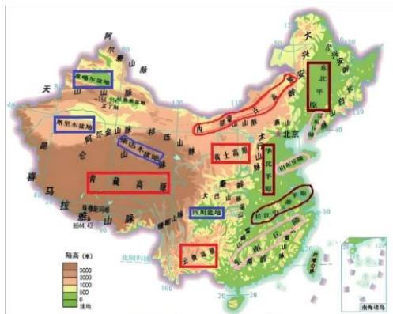

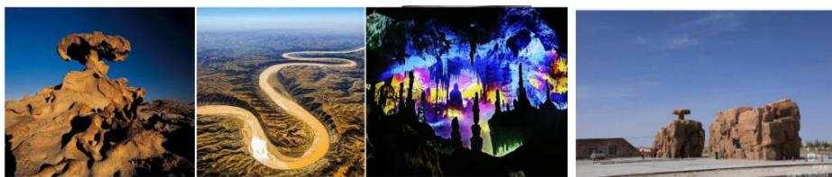

【解析】三级阶梯及主要地形区：

# 1. 第一级阶梯：

(1) 柴达木盆地: 中国地势最高的盆地, 在青藏高原上, 有丰富的盐、石油、煤及多种金属矿藏, 被誉为 “聚宝盆”。
(2) 青藏高原: 世界上海拔最高的高原, 平均海拔 4000 米以上, 被称为 “世界屋脊”, 因为海拔高所以气温低, 自然环境特点是高寒, 因此将青藏高原称为 “世界第三极”。远看是山, 近看成川对应青藏高原, 本身海拔很高, 远看是山,但是上到青藏高原发现, 里面几乎是一马平川, 内部的高度差很小。

# 2. 第二级阶梯：

（1）准噶尔盆地：中国面积第二大的盆地，位于新疆境内，在天山以南，降水较多，农牧业发达，呈不规则三角形。
(2) 塔里木盆地: 中国面积最大的盆地, 同时还拥有中国面积最大的沙漠——塔克拉玛干沙漠, 还是我国最大的流动沙漠, 即风吹哪沙子就跑到哪。还有最长的内流河 (最终没有到海里去, 干掉了) 塔里木河, 虽然在塔里木河的沿线分布很多绿洲, 借此新疆农业发展得很好, 但是河没有流出去, 因此塔里木河是最长的内流河。新疆有阿尔泰山、天山山脉、昆仑山脉, 中间夹着准噶尔盆地、塔里木盆地, 因此新疆是 “三山夹两盆”。

(3) 四川盆地: 如图颜色很绿, 说明此处的海拔比较低, 是中国地势最低的盆地。当地的土壤呈现紫色, 四川盆地原本有紫色的砂砾岩, 经过不断的风化沉积最终形成碎屑物, 变成紫色土壤, 因此将四川盆地又称 “紫色盆地”。
(4) 内蒙古高原: 中国第二大高原, 相对比较平坦, 蒙牛、伊利的牧场都在此处。西部有典型的风蚀地貌, 风吹导致对土壤表面包括一些岩石有塑形的作用, 由此形成风蚀地貌。
(5) 黄土高原: 世界上黄土分布最广的 “黄土地”, 流水侵蚀作用强烈, 刚好在黄河几字形相关的位置, 黄河的中下游流经黄土高原地区, 黄河的土质本来就松, 加上水流、下雨, 整个地表被冲的千沟万壑, 由此黄土高原的特点是千沟万壑。

# (6) 云贵高原:

(1)云南和贵州, 主要是石灰岩广布。由此流水侵蚀石灰岩, 形成喀斯特地貌,比如云南石林、贵州山水都是典型的喀斯特地貌。
(2) “地无三尺平, 天无三日晴”指的是贵州, “地无三尺平”指贵州几乎很少有平地, 当年贵州建机场找不到平地, 将山头炸了才造出来机场; “天无三日晴”指贵州一年 365 天中 200 天都是阴雨天, 贵州的夏天很凉快。
(3)云贵高原有许多 “坝子”: 在云南的山脉之间有小的平原、小的盆地, 称为坝子, 坝子是平的, 可以发展农业、种植业, 出现各种 “坝子农业”。

(7) 第二行从左开始, 图 1 是风蚀地貌; 图 2 是千沟万壑的黄土高原; 图 3 是喀斯特地貌, 被溶蚀的岩洞, 均属于旅游美图; 图 4 是图 1 现实中的样子。

# 3. 第三级阶梯：

(1) 东北平原：我国面积最大的平原，由松嫩平原、辽河平原和三江平原三部分组成。

(1)松嫩平原：黑龙江、嫩江冲积而成，哈尔滨位于松嫩平原之上。
②辽河平原：位于辽宁省境内，辽宁即保辽河安宁。
(3)三江平原: 位于黑龙江的最东边, 由黑龙江、乌苏里江、松花江合起来冲积而成。
(4)松嫩平原、辽河平原和三江平原共同构成东北平原, 东北地区的黑土地,因为土好, 粮食产量好。土是因为地表的植被经过长期的腐蚀演化形成, 有机质

含量相对比较高，由此产出的大米很好吃。东北平原指的是“黑土地”

(2) 华北平原：又称黄淮海平原，由黄河、淮河、海河共同冲击构成，华北平原是我国的第二大平原。
(3) 长江中下游平原：狭长的特别一条，因为沿着长江分布，长江由西往东流，明显位于南方，河多湖多，盛产稻米，渔业发达，素有“鱼米之乡”“水乡泽国”的美誉。

# 三、重要分界线

# （一）秦岭—淮河一线

秦岭—淮河一线是我国一条重要的地理分界线。

秦岭—淮河一线大致是1月  $0^{\circ} \mathrm{C}$  等温线、800毫米年等降水量线通过的地方，也是我国南方地区和北方地区的地理分界线，还是暖温带和亚热带的分界线、湿润区和半湿润区的分界线、温带季风气候和亚热带季风气候的分界线、温带落叶阔叶林和亚热带常绿阔叶林的分界线。

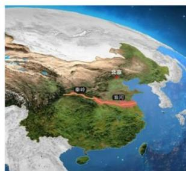

【解析】秦岭—淮河一线：我国非常重要的地理分界线。

1. 我国南方地区和北方地区的地理分界线：区分北方人、南方人在秦岭—淮河一线的北或者南，比如在山东是典型的北方人；在广东是典型的南方人。
2. 秦岭一淮河一线大致是 1 月  $0^{\circ} \mathrm{C}$  等温线: 1 月是全年最冷的时候, 北方感觉冷, 南方没有那么冷, 一般南方的 1 月份高于  $0^{\circ} \mathrm{C}$ , 北方 1 月的气温低于  $0^{\circ} \mathrm{C}$  。3.800毫米年等降水量线通过的地方：南方降水多，北方降水少，南方高于800毫米年等降水量，北方低于800毫米年等降水量。
3. 暖温带和亚热带的分界线：暖温带一般年平均温度大概在  $8^{\circ} \mathrm{C} - 13^{\circ} \mathrm{C}$  左右，以落叶阔叶林为主；亚热带是雨热同期，夏天的温度高，降水还多。
4. 湿润区和半湿润区的分界线：从 800 毫米年等降水量推出来的。
5. 温带季风气候和亚热带季风气候的分界线、温带落叶阔叶林和亚热带常绿

阔叶林的分界线：一方水土养一方人，气候类型不同长出的植物不一样，比如广东的空气很湿润，植物不一样，山东冬天北方的叶子都看不见了，但是广东的植物还是绿油油的。

# （二）人口分界线

“胡焕庸线”是1935年胡焕庸在《中国人口之分布》一文中提出的一条人口地理分界线，即“瑷珲一腾冲线”，因地名变迁也被称为“黑河一腾冲线”。

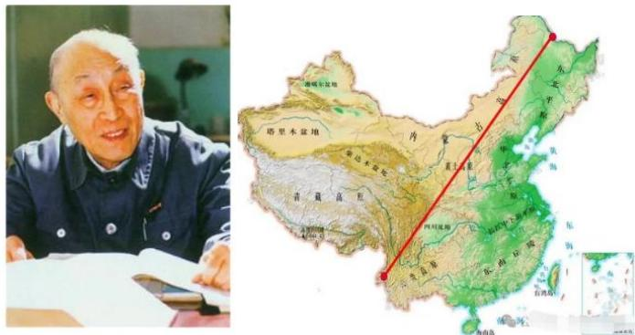

【解析】人口分界线：胡焕庸（如图）提出人口地理分界线。“胡焕庸线”是黑河（黑龙江）一腾冲线（云南），两边的人口分布不均匀，东南方人口稠密，比如山东、河南、广东；西北的人少，甚至存在无人区，“胡焕庸线”是人口地理分界线，主要从黑龙江的黑河一直到云南的腾冲。

# 四、主要河流

# （一）长江

# 1. 概况

长江发源于青藏高原上的唐古拉山脉，向东注入我国东海，是我国第一长河、世界第三长河。上中下游的分界点分别为：宜昌（鄂）、湖口（赣）。

# 2. 流经省份

长江干流流经青海、四川、西藏、云南、重庆、湖北、湖南、江西、安徽、江苏、上海共11个省、自治区、直辖市。

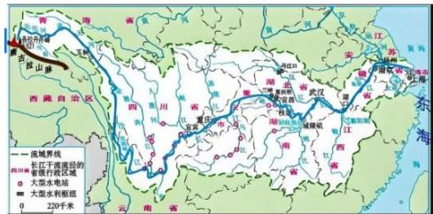

【解析】长江：

1. 长江发源于青藏高原上的唐古拉山脉，向东注入我国东海，是我国第一长河、世界第三长河。世界上第一长河是埃及人民的母亲河尼罗河；第二长河是南美洲的亚马逊河/亚马孙河。
2. 上中下游的分界点分别为：宜昌（鄂，湖北）、湖口（赣，江西）。宜昌往上是长江上游，水能资源很丰富；宜昌-湖口是长江中游；湖口往下是长江下游。
3. 流经省份：长江干流流经青海、四川、西藏、云南、重庆、湖北、湖南、江西、安徽、江苏、上海共11个省、自治区、直辖市。

# （二）黄河

# 1. 概况

黄河发源于青藏高原上的巴颜喀拉山脉，在山东注入渤海，上中下游的分界点分别为：河口（内蒙古）、桃花峪（豫）。

# 2. 流经省份

黄河干流流经青海、四川、甘肃、宁夏、内蒙古、山西、陕西、河南、山东共9个省、自治区。

# 3. 主要特点

黄河呈“几”字形，是世界上含沙量最大的河流，以“水少沙多、水沙异源”为突出特点。下游形成“地上河”，易决口改道。

# 4.重要支流

# （1）渭河

渭河，是黄河的第一大支流。而渭河的第一大支流是泾河，二者在西安市交汇时，会呈现出一清一浊互不相融的奇特自然景观——泾渭分明。

# (2）汾河

汾河，是黄河的第二大支流。

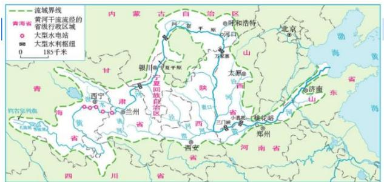

【解析】黄河：中华民族的“母亲河”。

# 1. 概况：

(1) 黄河发源于青藏高原上的巴颜喀拉山脉，在山东注入渤海，口诀“黄渤”。(2) 上中下游的分界点分别为: 河口 (内蒙古) 、桃花峪 (豫), 河南。河口往上是黄河上游; 河口——桃花峪是黄河中游; 桃花峪往下是黄河下游。

2. 流经省份：黄河干流流经青海、四川、甘肃、宁夏、内蒙古、山西、陕西、河南、山东共9个省、自治区。

# 3. 主要特点：

(1) 黄河呈 “几” 字形, 是世界上含沙量最大的河流, 因为中游经过黄土高坡, 携带大量的泥沙, 这些泥沙携带到下游慢慢沉积, 导致下游的河床特别高,形成下游的地上河, 河南开封的黄河河床高出市区 13 米, 是典型地上的悬河,一旦决堤非常可怕，因此我们想要治理好黄河，一定是上中下游协同保护。
(2) 2025 年 1 月《关于建设美丽中国先行区的实施意见》: 推动长江流域建设绿色低碳发展示范带, 长江像一个长的绿色飘带一样, 所以是绿色低碳发展示范带; 推动黄河流域上中下游协同保护和治理, 黄河想解决问题, 只靠一个上游、下游解决不了, 要上中下游协同保护和治理。

# 4.重要支流：

(1) 渭河：黄河的第一大支流，而渭河的第一大支流是泾河，二者交汇时，会呈现出一清一浊互不相融的奇特自然景观，渭河是黄河的支流，因此是浊的；泾河是清的，形成泾渭分明。
(2) 汾河：黄河的第二大支流，汾河是山西人民的母亲河，汾酒集团也在山西。

# 五、名胜古迹

# （一）五岳

东岳泰山（山东）、西岳华山（陕西）、北岳恒山（山西）、南岳衡山（湖南）、中岳嵩山（河南）。

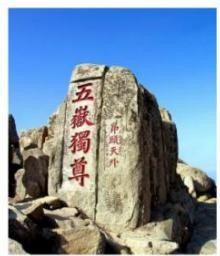

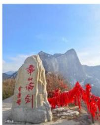

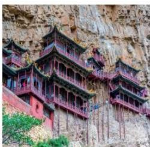

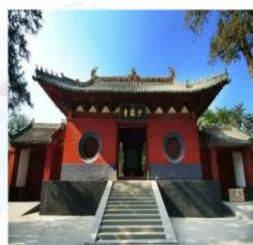

# 【解析】五岳：

1. 东岳泰山：位于山东泰安，泰山在五岳中地位最高，爬上去写着“五岳独尊”四个大字。“一览众山小”是杜甫的名句，形容泰山。
2. 西岳华山：位于陕西，自古华山一条道，特别危险，以前爬上去的都是武林高手，因此上面写着“华山论剑”。
3. 北岳恒山：位于山西。恒山十八景的第一胜景是悬空寺，打了木桩子建在悬崖峭壁上的寺庙。
4. 南岳衡山：位于湖南，相传是火神诞生的地方，因此主峰是祝融峰，祝融在神话中是火神，我们的火星车叫祝融号。
5. 中岳嵩山：位于河南，有少林寺。

# （二）四大石窟

莫高窟（甘肃敦煌）、云冈石窟（山西大同）、龙门石窟（河南洛阳）、麦积山石窟（甘肃天水）。

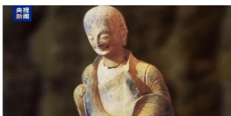

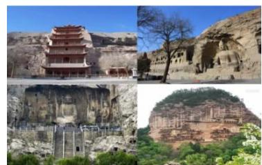

【解析】四大石窟：考查相关位置。

1.莫高窟：位于甘肃敦煌。2. 云冈石窟：位于山西大同。3. 龙门石窟：位于河南洛阳。

4. 麦积山石窟：位于甘肃天水。2024年9月习近平总书记考察了麦积山石窟，新年贺词中也提到麦积山石窟，麦积山石窟的东方微笑跨越千年，图中的小沙弥就是东方微笑，东方人比较含蓄，这种微笑会触动游客的心。

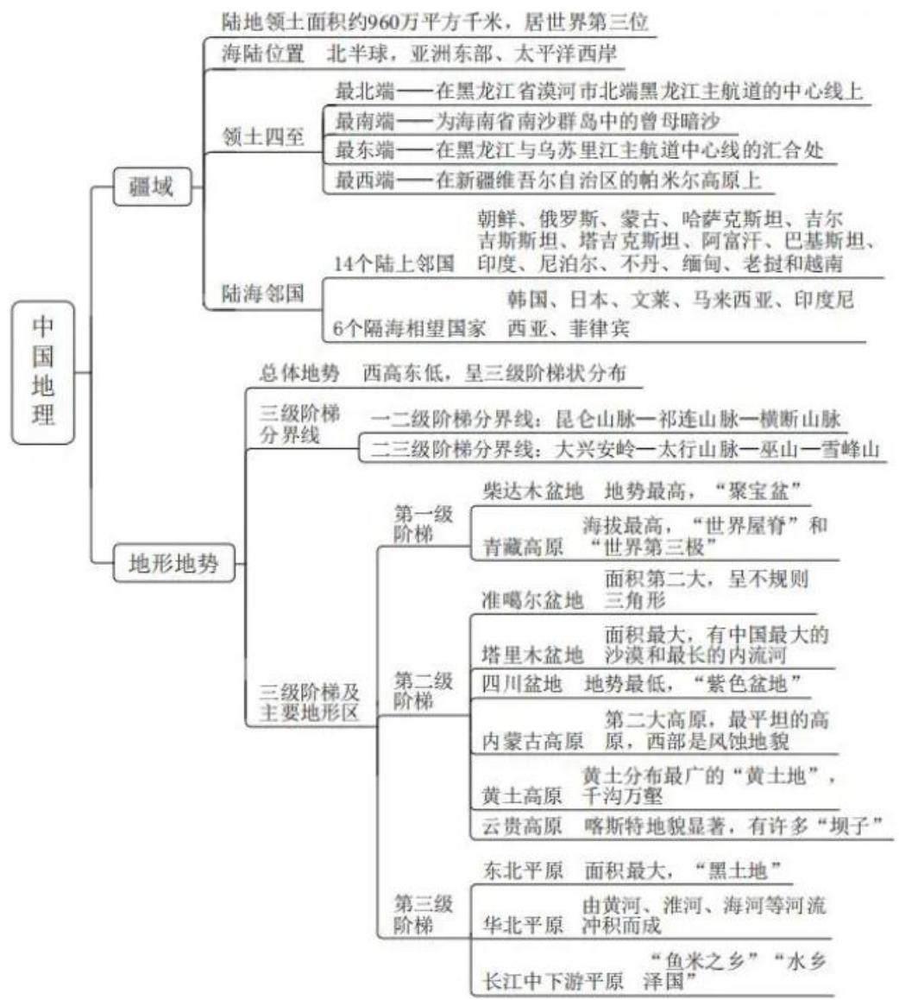

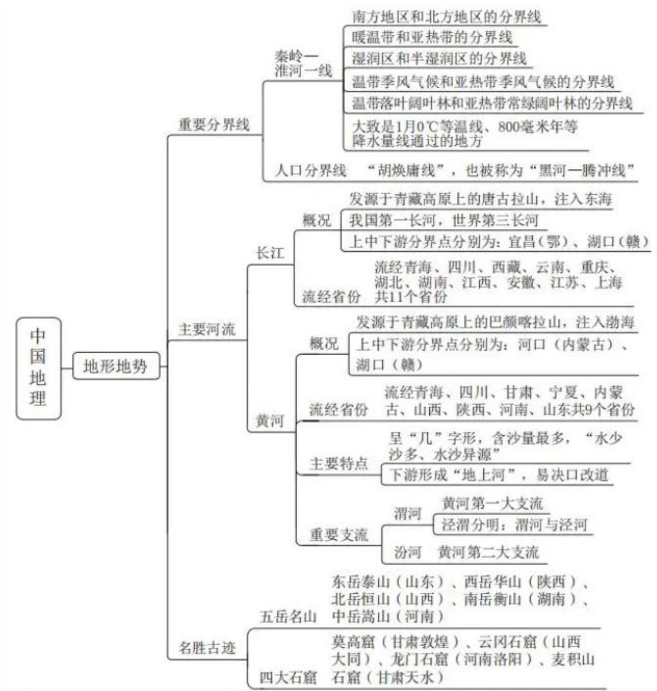

# 【注意】

# 1.疆域：

(1) 掌握领土四至的最南端和最北端。
(2) 陆上邻国考查较多。

# 2. 地形地势：

(1) 掌握每个阶梯中都有什么。

(1)第一阶梯：柴达木盆地、青藏高原。
(2)第二阶梯：准噶尔盆地、塔里木盆地、四川盆地、内蒙古高原、黄土高原、云贵高原。
(3)第三阶梯：东北平原、华北平原、长江中下游平原。

# 3.秦岭-淮河一线。

4.黄河考查得较多。
5. 名胜古迹：五岳和四大石窟掌握对应地点。

# 【实战演练】

(2025 国考) 某博物馆想办一期关于中国自然与人文的地理展览, 开设以下几个专题, 哪个专题所拟名称不恰当?

A.长江：稻作文明与鱼米之乡
B.都江堰：千年水道神韵再现
C. 胡焕庸线: 中国的 “东与西”
D. 五岳：高山神圣性的代表

【解析】选非题。A 项：长江种水稻，稻作文明，渔业发达，被称为鱼米之乡，排除。

B 项：都江堰是水利工程，自从建成一直在用，因此“神韵再现”的说法不对，而且都江堰不是水道。“千年水道神韵再现”指的是京杭大运河，2022年经过补水，实现百年以来京杭大运河的首次全线水流贯通，大运河这些水流过的称为水道，当选。
C项：胡焕庸线是人口分界线，主要指的是东南——西北，可以说中国的“东与西”，排除。
D 项: 五岳都是高山, 是高山神圣性的代表, 排除。【选 B】

【注意】经济、地理重在理解，若有问题可以到微博提问@粉笔李天然。

遇见不一样的自己

Be your better self
