# 精讲精练-常识4

(讲义+笔记)

主讲教师：刘振

授课时间：2025.03.22

# 精讲精练-常识4（讲义）

# 常识判断 精讲精练4

# 学习任务：

1.课程内容：民法常识
2.对应讲义：第  $92\sim 103$  页
3. 重点内容：

（1）自然人、民事法律行为
（2）物权变动、善意取得、居住权
（3）合同的订立、违约责任、准合同
（4）婚姻的效力、夫妻法定财产制度
（5）法定继承、遗嘱继承和遗赠、遗赠抚养协议
（6）特殊侵权责任

# 第五章 民法常识

# 第一节 总则

# 一、自然人

# （一）民事权利能力

自然人从出生时起到死亡时止，具有民事权利能力，依法享有民事权利，承担民事义务。

涉及遗产继承、接受赠与等胎儿利益保护的，胎儿视为具有民事权利能力。但是，胎儿娩出时为死体的，其民事权利能力自始不存在。

# （二）民事行为能力

自然人的民事行为能力，是指自然人能够以自己的行为行使民事权利和承担民事义务，并且能够对自己的违法行为承担民事责任的能力。自然人的民事行为能力类型包括以下三种：

# 1. 完全民事行为能力

（1）18周岁以上的自然人为完全民事行为能力人，可以独立实施民事法律行为。
（2）16周岁以上不满18周岁的未成年人，以自己的劳动收入为主要生活来源的，视为完全民事行为能力人。

# 2. 限制民事行为能力

（1）8 周岁以上的未成年人为限制民事行为能力人，实施民事法律行为由其法定代理人代理或者经其法定代理人同意、追认；但是，可以独立实施纯获利益的民事法律行为或者与其年龄、智力相适应的民事法律行为。
（2）不能完全辨认自己行为的成年人为限制民事行为能力人，实施民事法律行为由其法定代理人代理或者经其法定代理人同意、追认；但是，可以独立实施纯获利益的民事法律行为或者与其智力、精神健康状况相适应的民事法律行为。

# 3. 无民事行为能力

不满8周岁的未成年人和不能辨认自己行为的人为无民事行为能力人，由其法定代理人代理实施民事法律行为。

# 二、民事法律行为

# （一）有效的民事法律行为

具备下列条件的民事法律行为有效：

1. 行为人具有相应的民事行为能力。
2. 意思表示真实。
3. 不违反法律、行政法规的强制性规定，不违背公序良俗。

# （二）无效的民事法律行为

1. 无民事行为能力人实施的民事法律行为无效。
2. 行为人与相对人以虚假的意思表示实施的民事法律行为无效。
3. 行为人与相对人恶意串通，损害他人合法权益的民事法律行为无效。
4. 违背公序良俗的民事法律行为无效。
5. 违反法律、行政法规的强制性规定的民事法律行为无效。

# （三）可撤销的民事法律行为

1. 重大误解。
2. 欺诈。
3. 胁迫。
4. 显失公平。

# （四）效力待定的民事法律行为

1. 限制民事行为能力人实施的超越其民事行为能力范围的行为。
2. 欠缺代理权的代理行为。

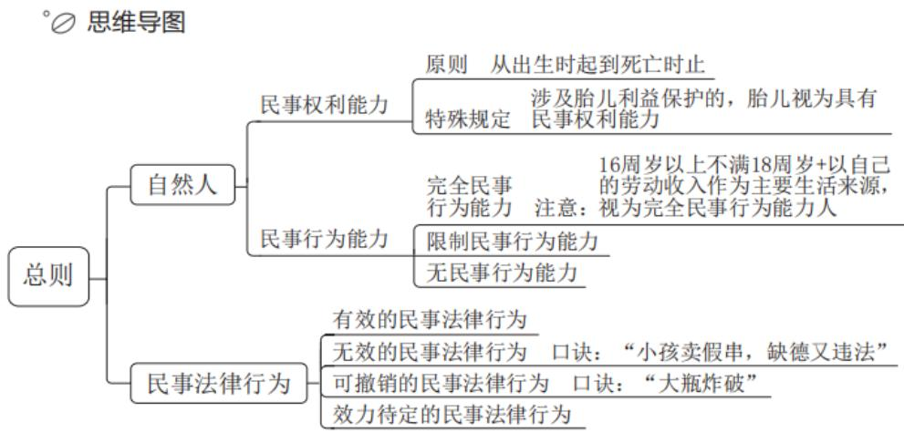

# 第二节 物权

# 一、物权变动

# （一）不动产

不动产物权的设立、变更、转让和消灭，经依法登记，发生效力；未经登记，不发生效力，但是法律另有规定的除外。

# （二）动产

动产物权的设立和转让，自交付时发生效力，但是法律另有规定的除外。

# 粉笔拓展：物权变动的“特殊规定”

1. 因人民法院、仲裁机构的法律文书或者人民政府的征收决定等，导致物权设立、变更、转让或者消灭的，自法律文书或者征收决定等生效时发生效力。
2. 因继承取得物权的，自继承开始时发生效力。

# 二、善意取得

# （一）概念

善意取得，亦称即时取得，是指无处分权人转让标的物给善意第三人时，善意第三人一般可取得标的物的所有权，所有权人不得请求善意第三人返还原物。

# （二）构成要件

1. 出让人无处分权。
2. 受让人受让该不动产或者动产时是善意。
3. 以合理的价格转让。
4. 转让的不动产或者动产依照法律规定应当登记的已经登记，不需要登记的已经交付给受让人。

# （三）法律效力

受让人依据善意取得的规定取得不动产或者动产的所有权的，原所有权人有权向无处分权人请求损害赔偿。

# 粉笔拓展：拾得遗失物的法律后果

1. 拾得遗失物，应当返还权利人。拾得人应当及时通知权利人领取，或者送交公安等有关部门。有关部门收到遗失物，知道权利人的，应当及时通知其领取；不知道的，应当及时发布招领公告。
2. 拾得人在遗失物送交有关部门前，有关部门在遗失物被领取前，应当妥善保管遗失物。因故意或者重大过失致使遗失物毁损、灭失的，应当承担民事责任。

# 三、居住权

# （一）概念

居住权人有权按照合同约定，对他人的住宅享有占有、使用的用益物权，以满足生活居住的需要。

# （二）设立、变更与消灭

设立居住权，当事人应当采用书面形式订立居住权合同。

居住权无偿设立，但是当事人另有约定的除外。设立居住权的，应当向登记机构申请居住权登记。居住权自登记时设立。以遗嘱方式设立居住权的，需参照有关法律规定。

居住权不得转让、继承。设立居住权的住宅不得出租，但是当事人另有约定的除外。

居住权期限届满或者居住权人死亡的，居住权消灭。居住权消灭的，应当及时办理注销登记。

# 【实战演练】

(2025 国考)关于所有权的取得, 下列说法正确的是:

A. 甲在公园捡到一条金项链, 经多方寻找失主未果, 此时甲获得项链的所有权
B. 乙以市价购买了一辆自行车, 后发现该车是卖家借来的, 乙仍可获得该车的所有权
C. 丙继承了一处房产, 但尚未办理变更登记, 丙此时还未获得该房产的所有权
D.丁从村集体处承包了一块田地用于农作物种植，丁同时取得这块田地的所有权

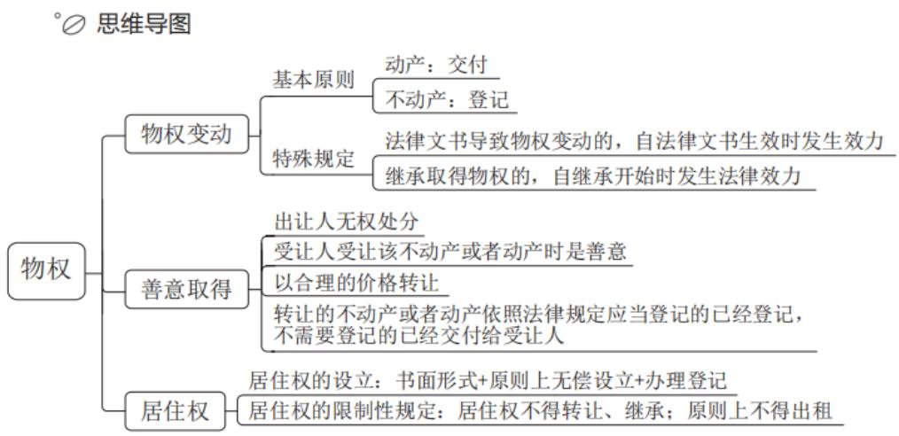

# 第三节 合同

# 一、合同的订立

# （一）要约

要约是希望与他人订立合同的意思表示，该意思表示应当符合下列条件：

1. 内容具体确定。
2. 表明经受要约人承诺，要约人即受该意思表示约束。

粉笔拓展：要约邀请

要约邀请是希望他人向自己发出要约的表示。拍卖公告、招标公告、招股说明书、债券募集办法、基金招募说明书、商业广告和宣传、寄送的价目表等为要约邀请。商业广告和宣传的内容符合要约条件的，构成要约。

# （二）承诺

承诺是受要约人同意要约的意思表示。

# 二、违约责任

当事人一方不履行合同义务或者履行合同义务不符合约定的，应当承担继续履行、采取补救措施或者赔偿损失等违约责任。

# （一）违约金

当事人可以约定一方违约时应当根据违约情况向对方支付一定数额的违约金，也可以约定因违约产生的损失赔偿额的计算方法。

# （二）定金

当事人可以约定一方向对方给付定金作为债权的担保。定金合同自实际交付定金时成立。

定金的数额由当事人约定；但是，不得超过主合同标的额的  $20\%$  ，超过部分不产生定金的效力。实际交付的定金数额多于或者少于约定数额的，视为变更约定的定金数额。

债务人履行债务的，定金应当抵作价款或者收回。给付定金的一方不履行债务或者履行债务不符合约定，致使不能实现合同目的的，无权请求返还定金；收受定金的一方不履行债务或者履行债务不符合约定，致使不能实现合同目的的，应当双倍返还定金。

当事人既约定违约金，又约定定金的，一方违约时，对方可以选择适用违约金或者定金条款。

# 三、准合同

# （一）无因管理

# 1. 概念

无因管理是指管理人没有法定的或约定的义务，为避免他人利益受损失而管理他人事务的行为。

# 2. 法律效力

管理人可以请求受益人偿还因管理事务而支出的必要费用；管理人因管理事务受到损失的，可以请求受益人给予适当补偿。

# （二）不当得利

# 1. 概念

不当得利是指得利人没有法律根据而受利益，致使他人受损失的事实。

# 2. 法律效力

不当得利成立后，受损失的人有权请求受益人返还不当得利，受益人负有返还不当得利的义务。

# 【实战演练】

（2023 安徽）甲的牛不慎走失，乙在路边发现，遂牵回家去饲养，并请邻居帮忙寻找失主。一周后，甲听说乙曾捡到一头牛，登门辨认后，确认是自家走失的牛并要求其归还。乙同意返还，但是要求甲支付报酬 2000 元和饲养牛所用的青草、杂粮等费用 200 元，共计 2200 元。甲拒绝支付，两人发生争议。下列说法正确的是：

A. 甲无需支付任何费用

B. 甲应当支付2200元

C. 甲应当支付 2000 元

D. 甲应当支付 200 元

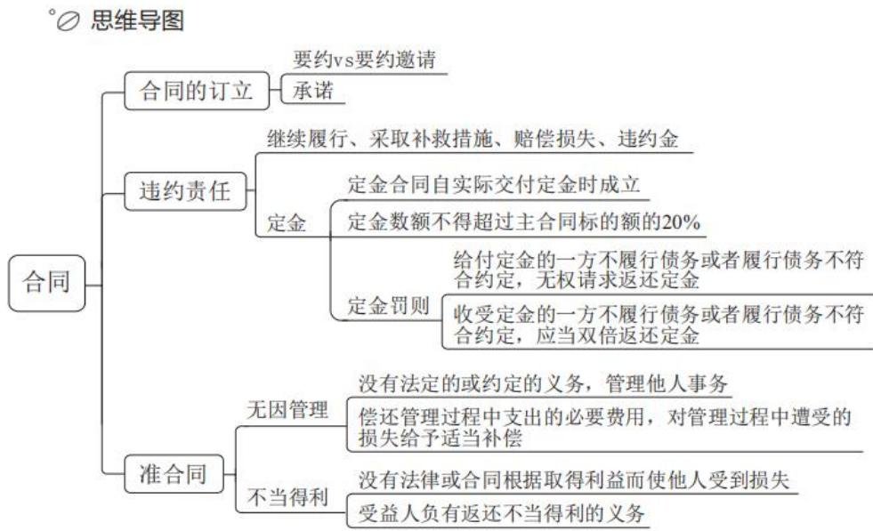
第四节 婚姻家庭

# 一、婚姻的效力

# （一）无效

1.重婚。
2. 有禁止结婚的亲属关系。
3. 未到法定婚龄。

# （二）可撤销

1.胁迫。
2. 重大疾病未告知。

# 二、夫妻法定财产制度

# （一）共同财产

夫妻在婚姻关系存续期间所得的下列财产，为夫妻的共同财产，归夫妻共同所有：

1. 工资、奖金、劳务报酬。
2. 生产、经营、投资的收益。
3. 知识产权的收益。
4. 继承或者受赠的财产，但遗嘱或者赠与合同中确定只归一方的财产除外。
5. 其他应当归共同所有的财产。

# （二）个人财产

1.一方的婚前财产。
2. 一方因受到人身损害获得的赔偿或者补偿。
3. 遗嘱或者赠与合同中确定只归一方的财产。
4. 一方专用的生活用品。
5. 其他应当归一方的财产。

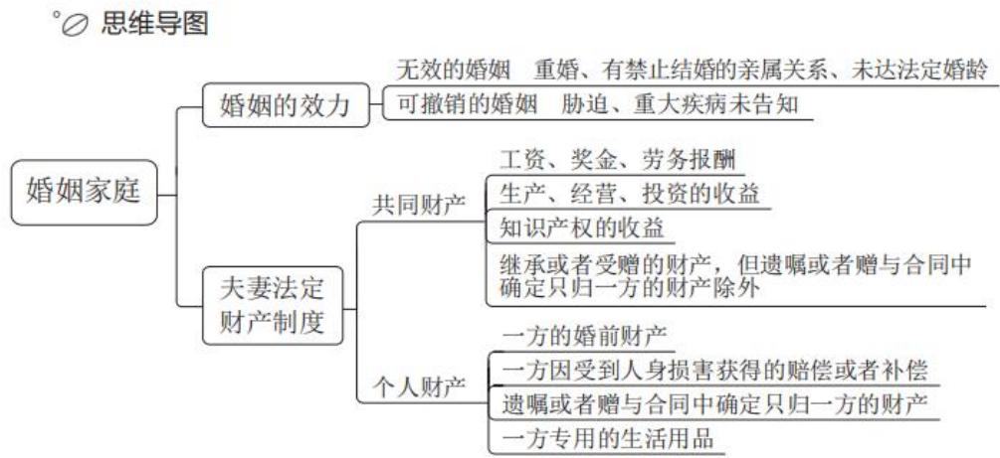

# 第五节 继承

# 一、法定继承

# （一）第一顺序

被继承人的配偶、子女、父母为第一顺序的法定继承人。

丧偶儿媳对公婆，丧偶女婿对岳父母，尽了主要赡养义务的，作为第一顺序继承人。

# （二）第二顺序

被继承人的兄弟姐妹、祖父母、外祖父母为第二顺序的法定继承人。

# 二、遗嘱继承和遗赠

# （一）概念

遗嘱继承，是指按照被继承人生前遗嘱，由其指定的继承人取得遗嘱确定的

遗产份额的继承方式。

遗赠是自然人以遗嘱的方式将其个人财产赠与国家、集体或法定继承人以外的组织、个人，并于其死亡后生效的单方民事法律行为。

# （二）遗嘱形式

1. 自书遗嘱。
2. 代书遗嘱。
3. 打印遗嘱。
4. 录音录像遗嘱。
5. 口头遗嘱。
6. 公证遗嘱。

# （三）数份遗嘱效力的认定

被继承人立有数份遗嘱，内容相抵触的，以最后的遗嘱为准。

# 三、遗赠抚养协议

自然人可以与继承人以外的组织或者个人签订遗赠扶养协议。按照协议，该组织或者个人承担该自然人生养死葬的义务，享有受遗赠的权利。

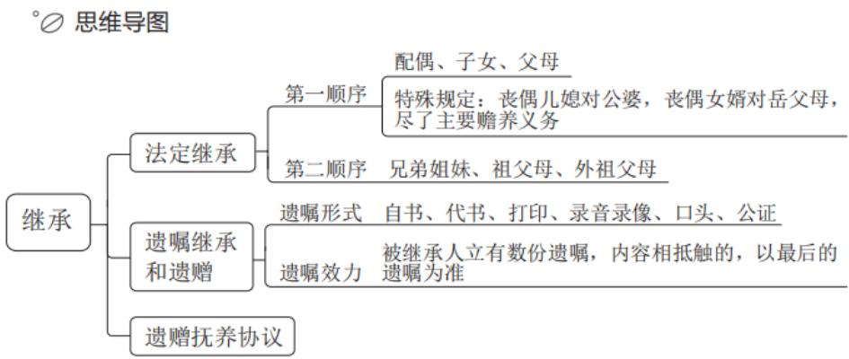

# 第六节 侵权责任

# 一、监护人责任

无民事行为能力人、限制民事行为能力人造成他人损害的，由监护人承担侵权责任。监护人减轻责任的情形：监护人尽到监护职责的，可以减轻其侵权责任。

如果被监护人有财产的，应当首先从被监护人的财产中支付赔偿费用，不足

的部分再由监护人承担赔偿责任。

无民事行为能力人、限制民事行为能力人造成他人损害，监护人将监护职责委托给他人的，监护人应当承担侵权责任；受托人有过错的，承担相应的责任。

# 二、产品责任

因产品存在缺陷造成他人损害的，被侵权人可以向产品的生产者请求赔偿，也可以向产品的销售者请求赔偿。

产品缺陷由生产者造成的，销售者赔偿后，有权向生产者追偿。因销售者的过错使产品存在缺陷的，生产者赔偿后，有权向销售者追偿。

# 三、安全保障责任

宾馆、商场、银行、车站、机场、体育场馆、娱乐场所等经营场所、公共场所的经营者、管理者或者群众性活动的组织者，未尽到安全保障义务，造成他人损害的，应当承担侵权责任。

# 四、动物饲养损害责任

饲养的动物造成他人损害的，动物饲养人或者管理人应当承担侵权责任；但是，能够证明损害是因被侵权人故意或者重大过失造成的，可以不承担或者减轻责任。动物园的动物造成他人损害的，动物园应当承担侵权责任；但是，能够证明尽到管理职责的，不承担侵权责任。

# 五、机动车交通事故责任

因租赁、借用等情形机动车所有人、管理人与使用人不是同一人时，发生交通事故造成损害，属于该机动车一方责任的，由机动车使用人承担赔偿责任；机动车所有人、管理人对损害的发生有过错的，承担相应的赔偿责任。

当事人之间已经以买卖或者其他方式转让并交付机动车但是未办理登记，发生交通事故造成损害，属于该机动车一方责任的，由受让人承担赔偿责任。

粉笔拓展：“好意同乘”事故责任

非营运机动车发生交通事故造成无偿搭乘人损害，属于该机动车一方责任的，应当减轻其赔偿责任，但是机动车使用人有故意或者重大过失的除外。

# 【实战演练】

(2024 浙江) 下列情形中小王不用承担民事责任的是:

A. 小王带朋友小张去洗浴中心洗澡, 小张更衣时因地滑摔成重伤, 并摔碎了玉观音挂坠
B. 小王将自己的汽车号牌出借给朋友小李，小李因疲劳驾驶导致汽车翻车，车上一名乘客当场死亡
C. 小王下班开车顺便将朋友小刘送回家，因为与小刘聊天分心闯了红灯，紧急刹车时和其他车辆相撞，小刘脑袋被磕破
D. 小王受朋友小邓委托在公园里临时看护小邓 4 岁的儿子小宝, 在小王转身抽烟的间隙, 小宝把同龄人小明的脸抓伤, 还把小明的手表扔进了河里

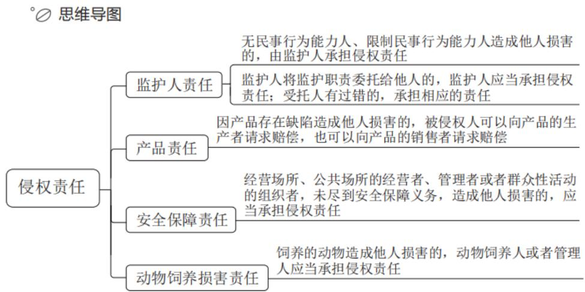

# 精讲精练-常识4（笔记）

# 目录

# Contents

01总则
02物权
03合同
04婚姻家庭
05继承
06侵权责任

# 【注意】

1. 本节课讲解民法，3月24日讲解刑法。法律部分国考行政执法卷考查8道题左右，副省级、地市级考查3道题左右，结合备考所选择的试卷针对性复习，民法、刑法比较重要。
2. 本节课框架结合《民法典》（共七部分；人格权在公务员考试中不常见）、考情，大家可以结合课前任务中的重要知识点复盘和学习；常识判断部分可以通过听回放巩固知识点。

（1）总则。
(2) 物权。
(3) 合同。
(4) 婚姻家庭。
（5）继承。
(6) 侵权责任。

# 第五章 民法常识

# 第一节 总则

【解析】总则：自然人、民事法律行为的效力。首先要了解民法管的是什么

人；由民法调整的行为，人所从事的民事法律行为不一定都有效，如8岁的小男孩和8岁的小女孩不能领证结婚。

# 一、自然人

# （一）民事权利能力

自然人从出生时起到死亡时止，具有民事权利能力，依法享有民事权利，承担民事义务。

涉及遗产继承、接受赠与等胎儿利益保护的，胎儿视为具有民事权利能力。但是，胎儿娩出时为死体的，其民事权利能力自始不存在。

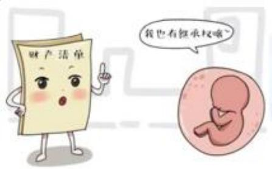

# 【解析】

1. 自然人：依自然规律出生以及死亡的人。自然人具有民事权利能力、民事行为能力。
2. 民事权利能力：研究什么样的人有权利，如继承权、生命权。

（1）自然人从出生时起到死亡时止，具有民事权利能力（去世的人没有相关的权利），依法享有民事权利，承担民事义务。
(2) 例外:

①涉及遗产继承（去世的人给的钱）、接受赠与（活着的人给的钱）等胎儿利益保护的，胎儿视为具有民事权利能力。理论上胎儿没有民事权利能力，如甲和乙有一个孩子小甲（胎儿），乙怀孕的过程中甲去世，如果小甲不能继承甲的遗产不利于对小甲的保护，因此甲的遗产需要给小甲保留一部分份额；不能给小甲留下债务，还债不是权利而是义务。
(2)但是, 胎儿娩出时为死体的, 其民事权利能力自始不存在 (甲的遗产全部归乙)。

# （二）民事行为能力

自然人的民事行为能力，是指自然人能够以自己的行为行使民事权利和承担民事义务，并且能够对自己的违法行为承担民事责任的能力。自然人的民事行为能力类型包括以下三种：

# 1. 完全民事行为能力

（1）18 周岁以上的自然人为完全民事行为能力人，可以独立实施民事法律行为。
（2）16周岁以上不满18周岁的未成年人，以自己的劳动收入为主要生活来源的，视为完全民事行为能力人。

# 【解析】民事行为能力：

1. 自然人的民事行为能力，是指自然人独立实施民事法律行为的资格。如小甲 1 岁时父亲甲去世，小甲有民事权利能力（对甲的遗产有继承权）但没有民事行为能力。
2. 自然人的民事行为能力类型包括以下三种：不满 8 周岁（ $\mathrm{X} < 8$ ）是无民事行为能力人，不能独立从事任何民事法律行为，无人单独实施的民事法律行为无效；年满 18 周岁（ $\mathrm{X} \geqslant 18$ ）是完全民事行为能力人，可以独立实施任何民事法律行为（有效）；已满 8 周岁不满 18 周岁（ $8 \leqslant \mathrm{X} < 18$ ）要分情况讨论（民事法律行为受限制），被称为限人。

# 3. 完全民事行为能力：

(1) 18 周岁以上（包含本数）的自然人为完全民事行为能力人，可以独立实施民事法律行为（独立担责）。
(2) 例外: 16 周岁以上不满 18 周岁的未成年人 (  $16 \leqslant X < 18$  理论上是限人), 以自己的劳动收入为主要生活来源的, 视为完全民事行为能力人。如 15 周岁的甲自己赚钱自己花, 不能视为完人; 17 周岁的王多鱼以继承祖父的 200 万元遗产作为主要生活来源, 不能视为完人。

# 2. 限制民事行为能力

（1）8周岁以上的未成年人为限制民事行为能力人，实施民事法律行为由其法定代理人代理或者经其法定代理人同意、追认；但是，可以独立实施纯获利益的民事法律行为或者与其年龄、智力相适应的民事法律行为。

（2）不能完全辨认自己行为的成年人为限制民事行为能力人，实施民事法律行为由其法定代理人代理或者经其法定代理人同意、追认；但是，可以独立实施纯获利益的民事法律行为或者与其智力、精神健康状况相适应的民事法律行为。

【解析】限制民事行为能力（重点）：

1.8 周岁以上的未成年人为限制民事行为能力人，实施民事法律行为由其法定代理人代理或者经其法定代理人同意、追认；但是，可以独立实施纯获利益（赠与、继承，如 10 岁的孩子可以收下爷爷给的 2000 元压岁钱）的民事法律行为或者与其年龄、智力相适应（如甲和乙都是 10 岁，甲送乙一支笔的赠与行为有效）的民事法律行为。如小甲用父亲甲的手机给主播打赏 10 万元（不是纯获利益、不与其年龄智力相适应），打赏行为效力待定（未成年人实施的既不是纯获利益也不是与其年龄智力相适应的民事法律行为不能直接界定为无效，暂时认定为效力待定，事后法定代理人追认就有效，拒绝追认就无效），小甲的监护人追认就有效，拒绝追认就无效。

2. 不能完全辨认自己行为的成年人为限制民事行为能力人（如精神病人，精神病人实施其认知范围内的民事法律行为有效；实施超越其认知范围的民事法律行为效力待定），实施民事法律行为由其法定代理人代理或者经其法定代理人同意、追认；但是，可以独立实施纯获利益的民事法律行为或者与其智力、精神健康状况相适应的民事法律行为。

# 3. 无民事行为能力

不满8周岁的未成年人和不能辨认自己行为的人为无民事行为能力人，由其法定代理人代理实施民事法律行为。

【解析】无民事行为能力：不满8周岁的未成年人和不能辨认自己行为的人为无民事行为能力人，由其法定代理人代理实施民事法律行为。如3岁的甲实施的民事法律行为一律无效。

# 二、民事法律行为

# （一）有效的民事法律行为

具备下列条件的民事法律行为有效：

1. 行为人具有相应的民事行为能力。
2. 意思表示真实。
3. 不违反法律、行政法规的强制性规定，不违背公序良俗。

# 【解析】

1. 民事法律行为：自然人之间从事受民法调整的事情，如签合同、登记结婚；民事法律行为包括有效、无效、效力待定、可撤销。
2. 具备下列条件的民事法律行为有效：

(1) 行为人具有相应的民事行为能力: 如限人没有完全民事行为能力, 限人实施的民事法律行为可能有效 (纯获利益、与其年龄智力相适应)。
(2) 意思表示真实: 心中所想和表达出来的一致。
(3) 不违反法律、行政法规的强制性规定，不违背公序良俗：如甲和乙都是 20 岁，甲找乙买毒品（违背法律）的民事法律行为无效；公序良俗指公共秩序、善良风俗（伦理道德、社会主义核心价值观），如包养行为违背公序良俗，不能认定为有效。

# （二）无效的民事法律行为

1. 无民事行为能力人实施的民事法律行为无效。
2. 行为人与相对人以虚假的意思表示实施的民事法律行为无效。
3. 行为人与相对人恶意串通，损害他人合法权益的民事法律行为无效。
4. 违背公序良俗的民事法律行为无效。
5. 违反法律、行政法规的强制性规定的民事法律行为无效。

【解析】无效的民事法律行为：口诀“小孩（1）卖假（2）串（3），缺德（4）又违法（5）”。

1. 无民事行为能力人实施的民事法律行为无效：如7岁的孩子接受压岁钱的行为有效（有民事权利能力，没有民事行为能力），需要其法定代理人代为实施。
2. 行为人与相对人以虚假的意思表示实施的民事法律行为无效：如甲（买家/行为人）与乙（卖家/相对人）签订房屋买卖合同，但甲不想买、乙不想卖（可能为了避税、洗钱），基于虚假意思表示签订的房屋买卖合同无效；明星甲与制片方乙签订演艺合同，乙打算给甲1000万元，但直接签订1000万元的演艺合同

要交很多税，于是双方表面上签订6000元的阳合同，背地里签订1000万元的阴合同，双方虚假的意思表示实施的民事法律行为无效。

3. 行为人与相对人恶意串通，损害他人合法权益的民事法律行为无效：如甲为了推销自己的商品找丙合伙忽悠乙，乙买了甲的商品，事后发现可以以甲和丙恶意串通损害自己利益为由向法院或仲裁机构申请该民事法律行为无效。
4. 违背公序良俗的民事法律行为无效。
5. 违反法律、行政法规的强制性规定的民事法律行为无效。

# （三）可撤销的民事法律行为

1. 重大误解。
2. 欺诈。3.胁迫。
3. 显失公平。

【解析】可撤销的民事法律行为（受害方才能行使撤销权）：

1. 重大误解（内因）：如甲想买擦脸油但买成了洗面奶，甲对产品的性质、功能产生错误的认知，此时可以基于重大误解退货；电影《心花路放》中黄渤与徐峥旅行路过天门山时遇到穿阿凡达服装的女孩在拍卖石头，黄渤和女孩打招呼的同时被视为参加竞拍，此时认定为重大误解。
2. 欺诈（外因）：如甲在二手车商处买了一辆二手车，二手车商故意隐瞒车辆的真实情况，二人签订汽车买卖合同，甲知情后可以行使撤销权。
3. 胁迫：如甲和乙是男女朋友关系，甲威胁乙说“你不和我结婚我就自杀”，乙被逼无奈和甲结婚，甲和乙的婚姻关系可撤销，本案中乙（被胁迫方）可以行使撤销权，甲不能行使撤销权；乙一旦行使撤销权，二人的婚姻关系自始无效（户口本婚姻状况一栏显示未婚），乙放弃行使撤销权二人的婚姻关系继续有效。
4. 显失公平：前提是趁人之危，利用他人处于危困状态与他人订立合同。如甲半夜12点肚子痛急需就医，出租车司机向甲索要高于平时10倍的车资，事后甲可以找出租车司机要回多支付的车资；甲也可以不行使撤销权。

# （四）效力待定的民事法律行为

1. 限制民事行为能力人实施的超越其民事行为能力范围的行为。
2. 欠缺代理权的代理行为。

# 【解析】效力待定的民事法律行为：

1. 限制民事行为能力人实施的超越其民事行为能力范围的行为。
2. 欠缺代理权的代理行为：如甲（被代理人）委托乙（代理人）找丙（第三人）买一辆汽车，乙应以甲的名义与丙签订汽车买卖合同。甲对乙说“我给你10万元，你给我买一辆奥拓”，乙按照甲的要求买了一辆奥拓，乙被称为有权代理人；乙给甲买了一辆奥迪，乙欠缺代理权。甲追认就有效，甲拒绝追认乙和丙的合同不再对甲产生法律效力，代理行为无效。
3. 胎儿在任何情况下，均视为具有民事权利能力。
4. 已满 16 周岁不满 18 周岁，以继承的遗产为主要生活来源的，视为完全民事行为能力人。
5. 不能完全辨认自己行为的成年人是无民事行为能力人。
6. 有效民事法律行为需要行为人具备相应的民事行为能力。
7. 欠缺代理权的民事法律行为是无效的民事法律行为。
8. 行为人和相对人恶意串通，损害他人利益的民事法律行为是无效的民事法律行为。

# 【解析】快问快答：

1. 胎儿在任何情况下，均视为具有民事权利能力（错误），原因：涉及遗产继承、接受赠与时视为有民事权利能力。
2. 已满 16 周岁不满 18 周岁，以继承的遗产为主要生活来源的，视为完全民事行为能力人（错误），原因：已满 16 周岁不满 18 周岁自己赚钱自己花，视为完人。
3. 不能完全辨认自己行为的成年人是无民事行为能力人（错误），原因：不能完全辨认自己行为的成年人是限制民事行为能力人；完全不能辨认自己行为的成年人是无民事行为能力人。
4. 有效民事法律行为需要行为人具备相应的民事行为能力（正确）。
5. 欠缺代理权的民事法律行为是无效的民事法律行为（错误），原因：欠缺

代理权的民事法律行为是效力待定的民事法律行为。

6. 行为人和相对人恶意串通，损害他人利益的民事法律行为是无效的民事法律行为（正确），原因：口诀“小孩卖假串，缺德又违法”。

# 第二节 物权

# 一、物权变动

# （一）不动产

不动产物权的设立、变更、转让和消灭，经依法登记，发生效力；未经登记，不发生效力，但是法律另有规定的除外。

# （二）动产

动产物权的设立和转让，自交付时发生效力，但是法律另有规定的除外。

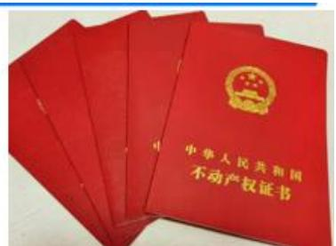

【解析】物权变动：通过能否移动、移动后是否损害其价值将物分为动产（如手机、笔记本电脑）、不动产（如房屋、土地）。

1. 不动产：不动产物权的设立、变更、转让和消灭，经依法登记，发生效力；未经登记，不发生效力，但是法律另有规定的除外。如甲想把房子送给乙，需要办理过户登记乙才能取得房子的所有权。
2. 动产：动产物权的设立和转让，自交付时发生效力，但是法律另有规定的除外。如甲想把手机送给乙，甲把手机交到乙的手中才会发生法律效力；甲和乙3月22日签订汽车买卖合同，3月24日甲把汽车交付给乙，3月27日去车管所办理登记（行政法规的强制性要求），乙于3月24日取得汽车的所有权。

【粉笔拓展】物权变动的“特殊规定”

因人民法院、仲裁机构的法律文书或者人民政府的征收决定等，导致物权设立、变更、转让或者消灭的，自法律文书或者征收决定等生效时发生效力。

因继承取得物权的，自继承开始时发生效力。

【解析】物权变动的“特殊规定”：

1. 因人民法院、仲裁机构的法律文书或者人民政府的征收决定等，导致物权设立、变更、转让或者消灭的，自法律文书或者征收决定等生效时发生效力。如甲和乙是夫妻，甲婚前有一套房子登记在自己名下，二人闹离婚，理论上不动产看登记（房子归甲），但甲是过错方且乙对家庭生活照顾居多，最终法院判决房子归乙所有，此时以有效的法律文书为准。
2. 因继承取得物权的，自继承开始时发生效力：如甲的房子登记在自己名下，甲去世了小甲可以取得房子的所有权，小甲不是必须办理过户登记才能取得房子的所有权，自继承开始取得房子的所有权。

# 二、善意取得

# （一）概念

善意取得，亦称即时取得，是指无处分权人转让标的物给善意第三人时，善意第三人一般可取得标的物的所有权，所有权人不得请求善意第三人返还原物。

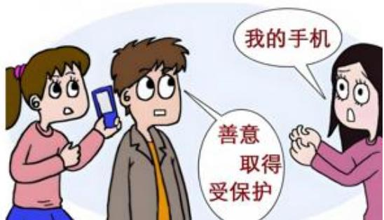

【解析】善意取得（重点）：

1. 善意取得，亦称即时取得，是指无处分权人转让标的物给善意第三人时，善意第三人一般可取得标的物的所有权，所有权人不得请求善意第三人返还原物。
2. 如甲将名画交给乙保管，丙到乙家做客时看上了这幅名画，乙以自己的名义将画卖给丙。本案中乙是无权处分人，丙是善意第三人（不知道名画的主人是甲），如果丙向乙支付了合理的价格，乙将名画交付给丙，丙基于善意取得制度取得该名画的所有权，成为这幅画的新主人；甲不能找丙要画，只能找无权处分人乙请求追偿。

# （二）构成要件

1. 出让人无处分权。
2. 受让人受让该不动产或者动产时是善意。
3. 以合理的价格转让。
4. 转让的不动产或者动产依照法律规定应当登记的已经登记，不需要登记的已经交付给受让人。

【解析】构成要件：丢的、偷的物品不适用善意取得制度。

1. 出让人无处分权：如甲把画借给乙，乙又将画卖给丙。
2. 受让人受让该不动产或者动产时是善意：受让人丙不知道画的所有权人是甲。
3. 以合理的价格（符合市场价值的价格）转让。
4. 转让的不动产或者动产依照法律规定应当登记的已经登记，不需要登记的已经交付给受让人。

# （三）法律效力

受让人依据善意取得的规定取得不动产或者动产的所有权的，原所有权人有权向无处分权人请求损害赔偿。

【解析】法律效力：受让人依据善意取得的规定取得不动产或者动产的所有权的，原所有权人有权向无处分权人请求损害赔偿。

# 【粉笔拓展】拾得遗失物的法律后果

拾得遗失物，应当返还权利人。拾得人应当及时通知权利人领取，或者送交公安等有关部门。有关部门收到遗失物，知道权利人的，应当及时通知其领取；不知道的，应当及时发布招领公告。

拾得人在遗失物送交有关部门前，有关部门在遗失物被领取前，应当妥善保管遗失物。因故意或者重大过失致使遗失物毁损、灭失的，应当承担民事责任

【解析】拾得遗失物的法律后果：拾得人的义务是返还，返还之前应妥善保管、交给有关机关。

1. 拾得遗失物，应当返还权利人。拾得人应当及时通知权利人领取，或者送交公安等有关部门。有关部门收到遗失物，知道权利人的，应当及时通知其领取；

不知道的，应当及时发布招领公告。

2. 拾得人在遗失物送交有关部门前，有关部门在遗失物被领取前，应当妥善保管遗失物。因故意或者重大过失致使遗失物毁损、灭失的，应当承担民事责任。

# 三、居住权

# （一）概念

居住权人有权按照合同约定，对他人的住宅享有占有、使用的用益物权，以满足生活居住的需要。

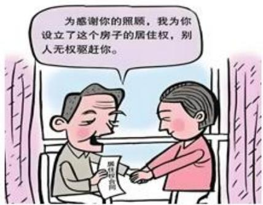

【解析】居住权：居住权人有权按照合同约定，对他人的住宅享有占有、使用的用益物权，以满足生活居住的需要。居住权不是一种所有权，如甲用自己的房子给乙设立居住权，乙只能在房子中居住，没有房子的所有权。

# （二）设立、变更与消灭

设立居住权，当事人应当采用书面形式订立居住权合同。

居住权无偿设立，但是当事人另有约定的除外。设立居住权的，应当向登记机构申请居住权登记。居住权自登记时设立。以遗嘱方式设立居住权的，需参照有关法律规定。

居住权不得转让、继承。设立居住权的住宅不得出租，但是当事人另有约定的除外。

居住权期限届满或者居住权人死亡的，居住权消灭。居住权消灭的，应当及时办理注销登记。

【解析】设立、变更与消灭：

1. 设立居住权，当事人应当采用书面形式订立居住权合同。
2. 居住权无偿设立，但是当事人另有约定的除外（如甲给好朋友乙设立居住权，乙支付水电费）。设立居住权的，应当向登记机构申请居住权登记。居住权自登记时设立。以遗嘱方式设立居住权的，需参照有关法律规定（如苏大强临终之前以遗嘱的形式规定让保姆在房子中居住）。
3. 居住权不得转让（如甲用自己的房子给乙设立居住权，乙不能将居住权转让给丙）、继承（所有权人会“名存实亡”）。设立居住权的住宅不得出租（如甲给乙设立三年的居住权，第二年甲后悔了又把房子租给丙），但是当事人另有约定的除外（如甲用自己的两室一厅给乙设立居住权，乙说“我只需要一间，你可以把另一间租出去”）。
4. 居住权期限届满或者居住权人死亡的，居住权消灭。居住权消灭的，应当及时办理注销登记。如甲给乙设立五年的居住权，乙在居住的第三年去世，此时甲可以把房子收回来。
5. 一般情况下，动产在登记时，不动产在交付时发生物权变动的法律效力。
6. 甲将笔记本电脑借于乙，乙擅自将该笔记本电脑赠与朋友丙，丙可基于善意取得制度取得该笔记本电脑的所有权。
7. 拾得遗失物的人应当妥善保管遗失物，因拾得人故意或重大过失造成财物毁损、灭失的，不需要承担民事责任。
8. 居住权是一种满足生产、生活需要的用益物权。
9. 设立居住权的房屋，一律不得出租。

# 【解析】快问快答：

1. 一般情况下，动产在登记时，不动产在交付时发生物权变动的法律效力（错误），原因：动产看交付，不动产看登记。
2. 甲将笔记本电脑借于乙，乙擅自将该笔记本电脑赠与朋友丙，丙可基于善意取得制度取得该笔记本电脑的所有权（错误），原因：善意取得需要同时满足四个条件，本案中乙是无权处分人，丙是善意第三人，丙应按照市场价格支付，动产要完成交付，因此丙不能基于善意取得制度取得该笔记本电脑的所有权。
3. 拾得遗失物的人应当妥善保管遗失物，因拾得人故意或重大过失造成财物毁损、灭失的，不需要承担民事责任（错误），原因：因拾得人故意或重大过失

造成财物毁损、灭失的需要承担民事责任。

4. 居住权是一种满足生产、生活需要的用益物权（错误），原因：居住权是满足生活需要的用益物权。
5. 设立居住权的房屋，一律不得出租（错误），原因：当事人另有约定的除外。

# 【实战演练】

(2025 国考)关于所有权的取得, 下列说法正确的是:

A. 甲在公园捡到一条金项链, 经多方寻找失主未果, 此时甲获得项链的所有权
B. 乙以市价购买了一辆自行车, 后发现该车是卖家借来的, 乙仍可获得该车的所有权
C.丙继承了一处房产，但尚未办理变更登记，丙此时还未获得该房产的所有权
D.丁从村集体处承包了一块田地用于农作物种植，丁同时取得这块田地的所有权

【解析】A项：拾得遗失物的人永远不可能成为该东西的所有权人，排除。

B 项：基于善意取得、取得了所有权，当选。

C 项：正常情况下，不动产看登记，但如果是已经生效的法律文书/基于继承，有可能破除“不动产看登记”这一规定，在继承的这一刻已经取得了所有权，排除。
D 项：我国是以社会主义公有制为基础的国家，所有权要么归国家、要么归集体，不可能归个人，排除。【选 B】

# 第三节 合同

# 一、合同的订立

# （一）要约

要约是希望与他人订立合同的意思表示，该意思表示应当符合下列条件：

1. 内容具体确定。
2. 表明经受要约人承诺，要约人即受该意思表示约束。

粉笔拓展：要约邀请

要约邀请是希望他人向自己发出要约的表示。拍卖公告、招标公告、招股说明书、债券募集办法、基金招募说明书、商业广告和宣传、寄送的价目表等为要约邀请。商业广告和宣传的内容符合要约条件的，构成要约。

# （二）承诺

承诺是受要约人同意要约的意思表示。

【解析】合同的订立：不是只要订立合同就要求是书面的，口头也可以成立合同（只要双方意思表示达成一致，也可能成立合同）；想要订立合同，需要走两步，第一步是要约，第二步是承诺，只要有这两步，就可以订立合同。

1. 要约和要约邀请的本质区别在于邀请的内容没有很明确具体，但是要约的内容很明确。

（1）甲是买方，乙是卖方，甲给乙发了邮件“打算找你订购一批服装”：内容不明确具体，因此是要约邀请。
(2) 甲是买方, 乙是卖方, 甲给乙发了邮件 “打算找你订购 10 件 A 型号的男装, 100 元一件”: 内容上比 (1) 更加明确具体, 因此是要约。
（3）站在乙的角度看，（1）中乙说“好”，代表乙承诺，但不意味着双方围绕一批服装达成了买卖合同，因为不知道是什么型号、什么款式、什么价格，即便说好，双方也不会受到合同约束，合同不会立刻马上生效，因此甲给乙发的不是要约；（2）中乙说“好”，双方合同会立刻马上生效，两个人都要受到该合同约束，甲如果后悔，说“要改成50元一件”，这是不可以的，因为合同已经生效，如果改，可能要承担违约责任。
2. 要约：希望与他人订立合同的意思表示，该意思表示应当符合下列条件。

(1) 内容具体确定。
(2) 表明经受要约人（乙）承诺，要约人（甲）即受该意思表示约束，不能随便反悔。

# 3. 要约邀请：

(1) 要约邀请是希望他人向自己发出要约的表示。
（2）拍卖公告、招标公告、招股说明书、债券募集办法、基金招募说明书、商业广告和宣传、寄送的价目表等为要约邀请。
(3) 商业广告和宣传的内容符合要约条件的, 构成要约。
（4）如甲在看电视购物广告，广告标语为“真的有这么丝滑吗”，该广告是要约邀请，因为甲作为看广告的一方，不是说“好”就能够成立合同的，因此是要约邀请；如甲政府在围绕重点工程、重点项目向房地产开发商招标，不是乙说“好”就中标了，因此招标也是要约邀请；但如果招标招到了乙，乙向甲政府投标，甲政府说“好”，此时合同成立，因此该投标是要约。

# 4. 承诺：承诺是受要约人同意要约的意思表示。

# 二、违约责任

当事人一方不履行合同义务或者履行合同义务不符合约定的，应当承担继续履行、采取补救措施或者赔偿损失等违约责任。

# （一）违约金

当事人可以约定一方违约时应当根据违约情况向对方支付一定数额的违约金，也可以约定因违约产生的损失赔偿额的计算方法。

【解析】违约责任（完成要约、承诺之后，合同生效，生效后双方不能反悔，如果反悔，要承担违约责任）：“约”即合同，如果违反合同规定的内容，就要承担违约责任。

1. 当事人一方不履行合同义务或者履行合同义务不符合约定的，应当承担继续履行、采取补救措施或者赔偿损失等违约责任。

# 2. 违约金：

（1）当事人可以约定一方违约时应当根据违约情况向对方支付一定数额的违约金，也可以约定因违约产生的损失赔偿额的计算方法。

(2) 注意: 违约金不需要预交 (提前交), 如甲是买家, 乙是卖家, 双方围绕一栋房子签订买卖合同, 在签订合同过程中, 甲乙双方不需要预先交付给对方违约金, 如果未来的某一天甲/乙不履行合同, 再把违约金交给对方。
（3）违约金可以作为合同中的条款，如在第四条中写“如果 XXX 违约，要承担违约金”。

# （二）定金

当事人可以约定一方向对方给付定金作为债权的担保。定金合同自实际交付定金时成立。

定金的数额由当事人约定；但是，不得超过主合同标的额的  $20\%$  ，超过部分不产生定金的效力。实际交付的定金数额多于或者少于约定数额的，视为变更约定的定金数额。

债务人履行债务的，定金应当抵作价款或者收回。给付定金的一方不履行债务或者履行债务不符合约定，致使不能实现合同目的的，无权请求返还定金；收受定金的一方不履行债务或者履行债务不符合约定，致使不能实现合同目的的，应当双倍返还定金。

当事人既约定违约金，又约定定金的，一方违约时，对方可以选择适用违约金或者定金条款。

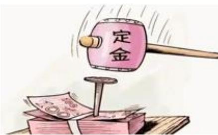

【解析】定金：重点掌握，不是“订金”，订金没有法律效力（防君子不防小人），即便先交了订金，不买也可以要回，如果购买，订金可以作为货款；定金指的是当事人可以约定一方向对方给付定金作为债权的担保，具有法律效力。

1. 定金≠违约金，定金需要提前交付，定金合同自实际交付定金时成立。如甲是买家，乙是卖家，双方约定好有2万元定金，甲需要给乙定金。
2. 定金的数额由当事人约定；但是，不得超过主合同标的额的  $20\%$  ，超过部分不产生定金的效力。实际交付的定金数额多于或者少于约定数额的，视为变更

约定的定金数额；假设小米 Su7 Ultra 卖 55 万，老百姓不可能交 55 万定金，定金具有法定上限，即不得超过主合同标的额（买卖的东西的市场价值，本案中是车，标的额是 55 万）的  $20\%$  ，定金不能超过 11 万，超过部分不产生定金的效力；但如果双方说好交 2 万定金，结果甲只给乙 1 万定金，最终承担的违约责任限额按照实际交付的来（按照 1 万来）。

3. 假设甲是买家，乙是卖家，甲给了乙2万元定金，如果甲不想买了，站在乙的角度，乙要追究甲的违约责任，可以选择扣下2万元定金不退，甲没有权利要求乙返还2万定金；如果甲交完定金，乙把车卖给别人了，此时乙要给甲4万元。注意：甲违约，乙扣下2万，乙违约，乙还给甲4万，这是公平的，因为4万中的2万原本就属于甲，乙自己掏的只有2万元，因此定金罚则的本质是无论谁违约，违约方仅仅只承担一份定金的责任。
4. 当事人既约定违约金，又约定定金的，一方违约时，对方可以选择适用违约金或者定金条款：只能二选一，不能全都要；如甲和乙签订了一个买卖合同，在本案中，甲和乙商量好，谁违约、谁出3万元违约金（这笔钱不需要预交，只需要体现在合同中），甲又将2万元的定金交给乙，现在乙违约，甲选择违约金更赚钱，因为如果选择定金，乙返还给甲4万元  $(2 \times 2)$ ，如果选择违约金，乙要给甲5万元（2万元退还+3万元）。

# 三、准合同

【解析】准合同：合同本身调整的就是财产问题，但凡与合同相关，都和钱有关，无因管理和不当得利一般情况下不会牵扯到财产纠纷，但有时候可能产生财产纠纷（与钱产生关系）。

# （一）无因管理

# 1. 概念

无因管理是指管理人没有法定的或约定的义务，为避免他人利益受损失而管理他人事务的行为。

# 2. 法律效力

管理人可以请求受益人偿还因管理事务而支出的必要费用；管理人因管理事

务受到损失的，可以请求受益人给予适当补偿。

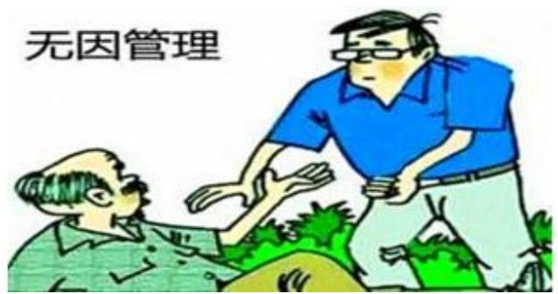

【解析】无因管理：

1. 概念：无因管理是指管理人没有法定的或约定的义务（无因），为避免他人利益受损失而管理他人事务的行为。常见的是老大爷摔了去扶老大爷；如甲的房子着火了，乙作为邻居帮甲灭火，此时乙构成无因管理。
2. 法律效力：管理人可以请求受益人偿还因管理事务而支出的必要费用；管理人因管理事务受到损失的，可以请求受益人给予适当补偿。

（1）如乙把甲从火场中救出来的时候，乙被烧伤了，乙可以找甲要钱，即补偿（不是赔偿，赔偿是以有错为前提，而补偿没有过错）。(2) 如乙把甲从火场中救出来的时候, 甲昏迷不醒, 乙把甲送往医院, 垫付了医药费, 这是必要费用, 甲醒来应该把这笔钱返还给乙。(3) 注意: 无因管理不能要报酬, 如乙把甲救了, 乙对甲说 “你觉得你生命值多少钱, 你给我 1 万元报酬”, 甲不需要支付报酬。

3. 总结：无因管理能要钱，但只能要管理过程中支付的必要费用和受到损失的补偿，不能要报酬。

# （二）不当得利

# 1. 概念

不当得利是指得利人没有法律根据而受利益，致使他人受损失的事实。

# 2. 法律效力

不当得利成立后，受损失的人有权请求受益人返还不当得利，受益人负有返还不当得利的义务。

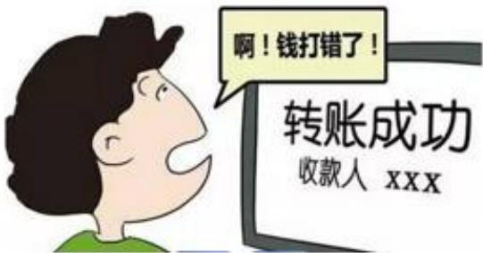

【解析】不当得利：一方的利益遭受损失，另一方的利益有增加，增加的原因在于没有任何法律问题；如甲给乙汇款，但是汇到了丙的账户，丙的利益增加，甲的利益损失，丙就是不当得利；充错话费、转错账、捡到钱都是不当得利。

1. 概念：不当得利是指得利人没有法律根据而受利益，致使他人受损失的事实。
2. 法律效力：返还；不当得利成立后，受损失的人有权请求受益人返还不当得利（要不要是权利，可以行使、可以放弃），受益人负有返还不当得利的义务。
3. 商业广告一般为要约邀请，若符合要约条件，也可视为要约。
4. 违约金需买方预交给卖方才能成立。
5. 定金不能超过主合同标的额的  $20\%$  ，超过部分不产生法律效力。
6. 交付定金的一方违约导致合同不能实现目的的，无权请求返还定金。
7. 无因管理中，管理人在管理过程中支付的必要费用可要求受益人赔偿。

# 【解析】

1. 商业广告一般为要约邀请，若符合要约条件，也可视为要约（正确），原因：如商业广告说“今年过节不收礼、收礼只收脑白金”，这是要约邀请，合同无法生效，因为内容不明确具体；但如果是电视购物广告，如“300元的九阳豆浆机，性能是XXX，参数是XXX，心动不如行动，扫描下方二维码赶紧购买吧”，这就是要约；如粉笔的系统班有链接，价格也明确，只要大家付款、合同就生效，因此是要约。
2. 违约金需买方预交给卖方才能成立（错误），原因：违约金不需要预交。
3. 定金不能超过主合同标的额的  $20\%$  ，超过部分不产生法律效力（正确）。
4. 交付定金的一方违约导致合同不能实现目的的，无权请求返还定金（正确）。
5. 无因管理中，管理人在管理过程中支付的必要费用可要求受益人赔偿（错

误)，原因：应该是补偿，赔偿的前提是有错。

# 【实战演练】

（2023 安徽）甲的牛不慎走失，乙在路边发现，遂牵回家去饲养，并请邻居帮忙寻找失主。一周后，甲听说乙曾捡到一头牛，登门辨认后，确认是自家走失的牛并要求其归还。乙同意返还，但是要求甲支付报酬 2000 元和饲养牛所用的青草、杂粮等费用 200 元，共计 2200 元。甲拒绝支付，两人发生争议。下列说法正确的是：

A. 甲无需支付任何费用

B. 甲应当支付2200元

C. 甲应当支付 2000 元

D. 甲应当支付200元

【解析】捡到了别人的牛，想要帮牛找失主，本身与自己无关，代为管理他人事务，构成无因管理；乙不可以要报酬，但乙可以要管理过程中支付的必要费用，甲最多给乙200元。【选D】

# 第四节 婚姻家庭

【解析】婚姻家庭：放的内容比较少，一个是婚姻效力、一个是财产问题。

# 一、婚姻的效力

# （一）无效

1.重婚。
2. 有禁止结婚的亲属关系。
3. 未到法定婚龄。

# （二）可撤销

1. 胁迫。
2. 重大疾病未告知。

# 【解析】婚姻的效力：

1. 无效：

(1) 重婚: 我国推崇一夫一妻制。
(2) 有禁止结婚的亲属关系: 不能是直系血亲或者三代以内旁系血亲 (如

表兄妹、堂兄妹）结婚。

（3）未到法定婚龄：我国法定婚龄是男22、女20。

2. 可撤销：

(1) 胁迫。
（2）重大疾病未告知：《民法典》没有明确列举，只要是不适宜结婚的疾病（如艾滋病），就属于重大疾病；需要是重大疾病未告知才可撤销，如甲和乙结婚之前，甲把自己患有重大疾病的事情告诉了乙，乙知道后还愿意和甲结婚，就属于有效的婚姻关系，但如果甲刻意隐瞒，乙婚后知道了，乙可以撤销、也可以不撤销，假设乙行使了撤销权，甲乙的婚姻关系自始无效（从来没有生效），假设乙不撤，甲乙的婚姻关系继续有效。

# 二、夫妻法定财产制度

【解析】夫妻法定财产制度：如果两个人离婚，到底哪些算一方财产、哪些算共同财产，要搞清楚。

# （一）共同财产

夫妻在婚姻关系存续期间所得的下列财产，为夫妻的共同财产，归夫妻共同所有：

1. 工资、奖金、劳务报酬。
2. 生产、经营、投资的收益。
3. 知识产权的收益。
4. 继承或者受赠的财产，但遗嘱或者赠与合同中确定只归一方的财产除外。
5. 其他应当归共同所有的财产。

【解析】共同财产：夫妻在婚姻关系存续期间（前提）所得的下列财产，为夫妻的共同财产，归夫妻共同所有：

1. 工资、奖金、劳务报酬：如甲和乙结婚之后，甲个人的工资、奖金、劳务报酬，都属于共同财产。
2. 生产、经营、投资的收益：如甲和乙结婚之前，甲有 20 万个人财产，婚后甲背着乙拿着 20 万炒股，后来这 20 万猛涨到了 100 万，此时这 100 万不都是

甲乙的共同财产，其中20万是甲个人的，产生的收益80万是共同财产，最终分割甲可以拿走60万，乙可以拿走40万。

3. 知识产权的收益：如赵本山和宋丹丹演的小品中，男方叫黑土，女方叫白云，白云写了一本书《月子》，完成了这本书之后，出版社找到了白云，要给白云100万的稿费，此时这100万是共同财产。
4. 继承或者受赠的财产，原则上属于夫妻双方，但遗嘱或者赠与合同中确定只归一方的财产除外：如甲和乙结婚后，甲父去世了，理论上来讲，甲父的遗产归甲，假设甲乙婚姻关系存续，这部分遗产就是甲乙的共同财产；但如果甲父在临终前立了一份遗嘱，遗嘱中明确规定“我去世之后，这份遗产完全由甲继承”，此时这份遗产就是甲的个人财产。
5. 其他应当归共同所有的财产。

# （二）个人财产

1.一方的婚前财产。
2. 一方因受到人身损害获得的赔偿或者补偿。
3. 遗嘱或者赠与合同中确定只归一方的财产。
4.一方专用的生活用品。
5. 其他应当归一方的财产。

# 【解析】个人财产：

1. 一方的婚前财产。
2. 一方因受到人身损害获得的赔偿或者补偿：如甲和乙结婚之后，甲人身受到了损害，国家给了甲200万的残疾生活补助费，这笔钱是专门给甲个人的，不能让甲乙共同分割，应当按照甲的个人财产处理。
3. 遗嘱或者赠与合同中确定只归一方的财产：继承或者受赠的财产，原则上属于夫妻双方，但遗嘱或者赠与合同中确定只归一方的财产除外。
4. 一方专用的生活用品：数额相对来讲比较小，如牙膏、牙刷、男方的剃须刀、女方的高跟鞋；但如果数额相对来讲比较大，可能进行分割，题目中提到“一方专用的生活用品”，就按照一方做题。
5. 其他应当归一方的财产。

# 第五节 继承

【解析】继承：法定继承、遗嘱继承、遗赠扶养协议。

# 一、法定继承

# （一）第一顺序

被继承人的配偶、子女、父母为第一顺序的法定继承人。

丧偶儿媳对公婆，丧偶女婿对岳父母，尽了主要赡养义务的，作为第一顺序继承人。

# （二）第二顺序

被继承人的兄弟姐妹、祖父母、外祖父母为第二顺序的法定继承人。

【解析】法定继承：没有第三顺位、第四顺位。

1. 第一顺序：以去世的人为中心。

（1）被继承人的配偶（平辈）、子女（往下数一代，这里的子女包括婚生子女、非婚生子女、养子女、继子女）、父母（往上数一代）为第一顺序的法定继承人，他们与去世的人关系最近。
(2) 丧偶儿媳对公婆, 丧偶女婿对岳父母, 尽了主要赡养义务的, 作为第一顺序继承人; 如甲有儿子小甲, 小甲和乙结了婚, 理论上乙不是甲的继承人,但如果小甲先去世了, 乙作为儿媳对公婆尽了主要赡养义务, 这种品质难能可贵,也会把乙作为第一顺位继承人; 如甲有儿子小甲, 小甲和乙结了婚, 假设小甲还健在, 小甲不去赡养父亲甲, 乙去赡养父亲甲, 此时乙不是第一顺位继承人。

# 2. 第二顺序：

(1) 被继承人的兄弟姐妹、祖父母、外祖父母（往上数两代）为第二顺序

的法定继承人。

(2) 注意: 孙子女、外孙子女不是第一顺序继承人、也不是第二顺序继承人, 即不是法定继承人, 因为没必要; 如朱元璋的儿子叫朱标, 朱标的儿子是朱允炆, 如果让朱允炆当第二顺位继承人, 没有意义, 因为如果朱标在, 朱元璋的遗产就由朱标继承 (第一顺位), 如果朱标先去世, 也没有意义, 因为白发人送黑发人的情况发生时, 就允许朱允炆 (孙子) 代朱标 (父亲) 的位继承朱元璋 (爷爷) 的遗产 (朱允炆代朱标继承)。
3. 在法定继承中，同一顺位平均分，有第一顺位轮不到第二顺位，即便第一顺位只剩一个人，最终分钱只能分给第一顺位。
4. 如 1、2 有一个孩子 3，3、4 是两口子，有孩子 5 和 6，假设 3 去世：

（1）3 留下了个人遗产 50 万，5 能够分到 10 万元：一共有 5 个第一顺位继承人，一人分 10 万。
（2）3和4的共同财产100万，5能够分到10万元（3的个人遗产依然只有50万）；4在本案中分到了60万，但不是都从3中继承的，因为4只继承了10万，剩下50万是自己的钱。

# 二、遗嘱继承和遗赠

【解析】法定继承 VS 遗嘱继承：如果去世的人立好了遗嘱，有遗嘱就按照遗嘱来，如果没有遗嘱，再考虑法定继承，因此遗嘱继承  $>$  法定继承。

# （一）概念

遗嘱继承，是指按照被继承人生前遗嘱，由其指定的继承人取得遗嘱确定的遗产份额的继承方式。

遗赠是自然人以遗嘱的方式将其个人财产赠与国家、集体或法定继承人以外的组织、个人，并于其死亡后生效的单方民事法律行为。

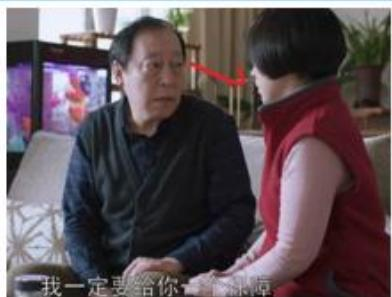

【解析】遗嘱继承和遗赠：

1. 概念：遗嘱继承，是指按照被继承人生前遗嘱，由其指定的继承人取得遗嘱确定的遗产份额的继承方式；遗嘱继承是把遗产给了自己人。
2. 遗赠是自然人以遗嘱的方式将其个人财产赠与国家、集体或法定继承人以外的组织、个人，并于其死亡后生效的单方民事法律行为；遗赠是把遗产给了外人。
3. 如果苏大强以遗嘱形式把房子给了保姆，就是遗赠；如果苏大强把房子给了二儿子苏明成，就是遗嘱继承；如果苏大强把房子给了孙子，就是遗赠。

# （二）遗嘱形式

1.自书遗嘱。
2. 代书遗嘱。
3.打印遗嘱。
4.录音录像遗嘱。
5. 口头遗嘱。
6. 公证遗嘱。

# （三）数份遗嘱效力的认定

被继承人立有数份遗嘱，内容相抵触的，以最后的遗嘱为准。

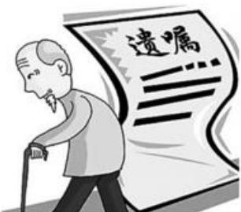

# 【解析】

1. 遗嘱形式：（1）和（6）不需要见证人，（2）到（5）需要两个以上的见证人见证。

(1) 自书遗嘱: 自己写。（2）代书遗嘱。（3）打印遗嘱。（4）录音录像遗嘱。（5）口头遗嘱：情况危急才能以口头遗嘱设立，如曹操犯了头痛病，第一时间喊了曹丕，在大臣的见证下立了口头遗嘱，这是可以的，对见证人有要求，即完人+没有利害关系。（6）公证遗嘱：找公证处公证。

2. 数份遗嘱效力的认定：被继承人立有数份遗嘱，内容相抵触的，以最后的遗嘱为准；如早上立了一份自书遗嘱，第二天写了一份代书遗嘱，第三天写了一份打印遗嘱，此时以最后的遗嘱为准（拿年月日对标）。

# 三、遗赠扶养协议

自然人可以与继承人以外的组织或者个人签订遗赠扶养协议。按照协议，该组织或者个人承担该自然人生养死葬的义务，享有受遗赠的权利。

# 【解析】遗赠扶养协议：

1. 遗赠是把遗产给外人，遗赠不需要付出任何行动；但遗赠扶养协议需要付出行动，如甲是老教授，孩子常年出国在外，保姆乙照顾甲照顾得很不错，甲很感动，与乙签订了协议，约定乙给甲养老送终、管甲的生养死葬，等到甲去世后，房子无偿给乙，这就是遗赠扶养协议。注意：遗赠是白拿，而遗赠扶养协议要求干活。
2. 遗赠扶养协议  $>$  遗嘱继承、遗赠：权利和义务相辅相成，干活的人的地位要比白拿的人的地位高。
3. 假设甲是一位 70 岁老人，因为小保姆乙把甲照顾得很好，甲就和乙签订了遗赠扶养协议，约定乙给甲养老送终、管甲的生养死葬，等到甲去世后，房子无偿给乙；结果甲在临终之际又后悔了，以自书遗嘱的形式把房子给了小甲，乙和小甲产生争议的过程中，房子给乙，因为遗赠扶养协议  $>$  遗嘱继承、遗赠。
4. 通过胁迫建立婚姻关系的是无效的婚姻。
5. 婚姻关系存续期间，个人的工资、奖金一般是一方的个人财产。
6. 婚姻关系存续期间，一方因人身损害获得的赔偿、补偿为共同财产。
7. 丧偶儿媳、丧偶女婿任何情况下均不能成为法定继承人。
8. 孙子女、外孙子女为第二顺位法定继承人。
9. 自书遗嘱、代书遗嘱均需 2 人以上的见证人在场。

# 【解析】

1. 通过胁迫建立婚姻关系的是无效的婚姻（错误），原因：是可撤销的婚姻。
2. 婚姻关系存续期间，个人的工资、奖金一般是一方的个人财产（错误），原因：一般是夫妻共同财产。
3. 婚姻关系存续期间，一方因人身损害获得的赔偿、补偿为共同财产（错误），原因：专属于个人，是个人财产。
4. 丧偶儿媳、丧偶女婿任何情况下均不能成为法定继承人（错误），原因：丧偶儿媳对公婆、丧偶女婿对岳父、岳母尽了主要赡养义务，能够成为法定继承人，而且直接视为第一顺位继承人。
5. 孙子女、外孙子女为第二顺位法定继承人（错误），原因：不属于继承范围内。
6. 自书遗嘱、代书遗嘱均需 2 人以上的见证人在场（错误），原因：自书遗嘱不需要见证人。

# 第六节 侵权责任

# 一、监护人责任

无民事行为能力人、限制民事行为能力人造成他人损害的，由监护人承担侵权责任。监护人减轻责任的情形：监护人尽到监护职责的，可以减轻其侵权责任。

如果被监护人有财产的，应当首先从被监护人的财产中支付赔偿费用，不足的部分再由监护人承担赔偿责任。

无民事行为能力人、限制民事行为能力人造成他人损害，监护人将监护职责委托给他人的，监护人应当承担侵权责任；受托人有过错的，承担相应的责任。

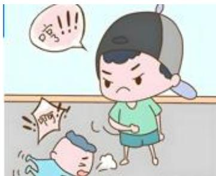

【解析】监护人责任：

1. 无民事行为能力人、限制民事行为能力人（小孩、成年的精神病）造成他人损害的，由监护人承担侵权责任（如3岁的哪吒在陈塘关闯祸，由李靖和殷夫人承担责任）。监护人尽到监护职责的，可以减轻其侵权责任（李靖虽然设立了结界兽，但不能不赔，即便尽到监护职责，最多是减轻，不能免除）。
2. 如果被监护人有财产的，应当首先从被监护人的财产中支付赔偿费用，不足的部分再由监护人承担赔偿责任：如10岁的孩子收到了爷爷1500元的压岁钱，不需要法定代理人代理；假设孩子打伤了一个小朋友，医药费为1500元，在本案中，理论上由监护人赔，但孩子的钱够赔，因此不用父母赔；如果医药费为2000元，孩子自己拿1500元赔，剩下的500元监护人赔。
3. 无民事行为能力人、限制民事行为能力人造成他人损害，监护人将监护职责委托给他人的，监护人应当承担侵权责任；受托人有过错的，承担相应的责任：如甲有一个孩子小甲，有一天甲被叫去加班，没有办法，找自己的邻居乙帮忙照顾小甲，在乙照顾期间，小甲闯祸了，此时由甲赔；如果乙没有尽到适当的监管责任，看到小甲闯祸但是没管，此时还是由甲赔，乙仅仅是在过错范围内承担相应责任（乙不一定会赔）。

# 二、产品责任

因产品存在缺陷造成他人损害的，被侵权人可以向产品的生产者请求赔偿，也可以向产品的销售者请求赔偿。

产品缺陷由生产者造成的，销售者赔偿后，有权向生产者追偿。因销售者的过错使产品存在缺陷的，生产者赔偿后，有权向销售者追偿。

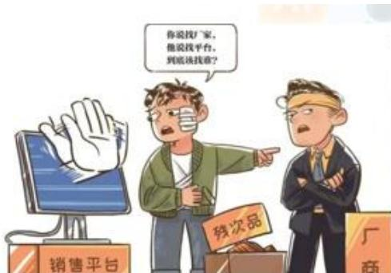

【解析】产品责任：日常生活中倒霉的是消费者，因为消费者是弱势群体，让消费者找究竟是生产者还是销售者的问题比较困难、而且容易被“踢皮球”，因此消费者不用去管到底是谁的错，随便找即可，可以直接找生产者，也可以直接找销售者。

1. 因产品存在缺陷造成他人损害的，被侵权人可以向产品的生产者请求赔偿，也可以向产品的销售者请求赔偿。
2. 产品缺陷由生产者造成的，销售者赔偿后，有权向生产者追偿。因销售者的过错使产品存在缺陷的，生产者赔偿后，有权向销售者追偿。
3. 总结：生产者、销售者要绑定在一起、一致对外，对消费者负责，之后内部追偿。

# 三、安全保障责任

宾馆、商场、银行、车站、机场、体育场馆、娱乐场所等经营场所、公共场所的经营者、管理者或者群众性活动的组织者，未尽到安全保障义务，造成他人损害的，应当承担侵权责任。

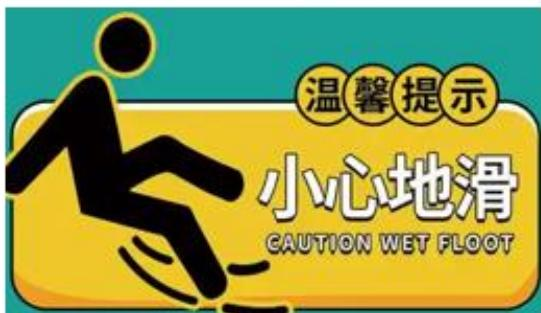

【解析】安全保障责任：场所要对百姓尽到安全保障责任。

1. 宾馆、商场、银行、车站、机场、体育场馆、娱乐场所等经营场所、公共

场所的经营者、管理者或者群众性活动的组织者，未尽到安全保障义务，造成他人损害的，应当承担侵权责任。

2. 注意：不是只要甲去商场逛街的过程中摔了，商场就一定赔，前提是商场没有尽到安全保障责任义务；如现在商场有一滩水，保洁阿姨要把地拖好，然后立个牌子“小心地滑”，结果乙以为是让自己小心地滑，摔倒了，此时乙不能让商场赔。

# 四、动物饲养损害责任

饲养的动物造成他人损害的，动物饲养人或者管理人应当承担侵权责任；但是，能够证明损害是因被侵权人故意或者重大过失造成的，可以不承担或者减轻责任。

动物园的动物造成他人损害的，动物园应当承担侵权责任；但是，能够证明尽到管理职责的，不承担侵权责任。

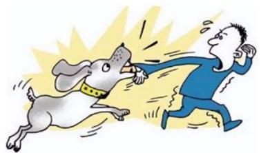

【解析】动物饲养损害责任：与监护人责任是一个逻辑（如果监护人有证据证明自己没过错，就减轻）。

1. 饲养的动物造成他人损害的，动物饲养人或者管理人应当承担侵权责任；但是，能够证明损害是因被侵权人故意或者重大过失造成的，可以不承担或者减轻责任（如甲遛着小狗出来玩，乙对小狗说“长得真丑，踢死你”，踢了小狗一脚，小狗很生气，把乙咬了，在本案中，理论上有可能免除甲的责任/减轻甲的责任，因为乙是自己作的）。
2. 动物园的动物造成他人损害的，动物园应当承担侵权责任；但是，能够证明尽到管理职责的，不承担侵权责任：如有一些动物园会提示“请勿拍打玻璃、翻越护栏”，但是有一些人就拍打玻璃、翻越护栏，如果造成损害，动物园可能不赔。

# 五、机动车交通事故责任

因租赁、借用等情形机动车所有人、管理人与使用人不是同一人时，发生交通事故造成损害，属于该机动车一方责任的，由机动车使用人承担赔偿责任；机动车所有人、管理人对损害的发生有过错的，承担相应的赔偿责任。

当事人之间已经以买卖或者其他方式转让并交付机动车但是未办理登记，发生交通事故造成损害，属于该机动车一方责任的，由受让人承担赔偿责任。

粉笔拓展：“好意同乘”事故责任

非营运机动车发生交通事故造成无偿搭乘人损害，属于该机动车一方责任的，应当减轻其赔偿责任，但是机动车使用人有故意或者重大过失的除外。

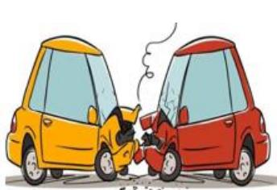

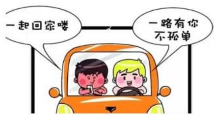

# 【解析】

1. 机动车交通事故责任：不是找车的所有权人赔，车是谁开的，就找谁赔。

（1）因租赁、借用等情形机动车所有人、管理人与使用人不是同一人时，发生交通事故造成损害，属于该机动车一方责任的，由机动车使用人承担赔偿责任；机动车所有人、管理人对损害的发生有过错的，承担相应的赔偿责任（如车主是甲，乙找甲借车，但是乙没驾驶证/证件被吊销，甲知道，还把车借给乙，此时甲要承担相应的赔偿责任）。（2）当事人之间已经以买卖或者其他方式转让并交付机动车但是未办理登记，发生交通事故造成损害，属于该机动车一方责任的，由受让人承担赔偿责任：交付没有办理登记，对方已经取得了汽车所有权（动产看交付），即便没办理登记也没关系，谁开车谁赔，即买到车、开车的受让人赔。2.“好意同乘”事故责任：非营运机动车发生交通事故造成无偿搭乘人损害，属于该机动车一方责任的，应当减轻其赔偿责任，但是机动车使用人有故意或者重大过失的除外：如甲和乙是同事，下班后，乙对甲说“可以捎我一段路吗”，如果甲在开车过程中，旁边发生了一起交通事故，甲分神，导致车撞到了电线杆，乙撞伤了，在本案中，虽然甲有问题导致乙造成了损害，但是要减轻甲的责任。

3. 侵权责任结论：结合日常生活中遇到的问题判断找谁赔。

# 【实战演练】

(2024 浙江) 下列情形中小王不用承担民事责任的是:

A. 小王带朋友小张去洗浴中心洗澡, 小张更衣时因地滑摔成重伤, 并摔碎了玉观音挂坠
B. 小王将自己的汽车号牌出借给朋友小李, 小李因疲劳驾驶导致汽车翻车,车上一名乘客当场死亡
C. 小王下班开车顺便将朋友小刘送回家，因为与小刘聊天分心闯了红灯，紧急刹车时和其他车辆相撞，小刘脑袋被磕破
D. 小王受朋友小邓委托在公园里临时看护小邓 4 岁的儿子小宝, 在小王转身抽烟的间隙, 小宝把同龄人小明的脸抓伤, 还把小明的手表扔进了河里

【解析】选非题。A项：在本案中，不能让小王赔，因为与小王无关，要让洗浴中心赔（没有尽到安全保障责任），当选。

B 项：借号牌是违法的，小主要承担民事责任，排除。
C项：好意同乘，小王要赔，最多只能是减轻，而不是免除，排除。
D项：小王是受委托人，小邓是监护人，小宝是小邓的儿子；小王转身的间隙，小宝闯祸了，在本案中，首先先让小邓承担责任（监护人），小王没有尽到监护职责，也要承担相应的责任，排除。【选A】

遇见不一样的自己

Be your better self
