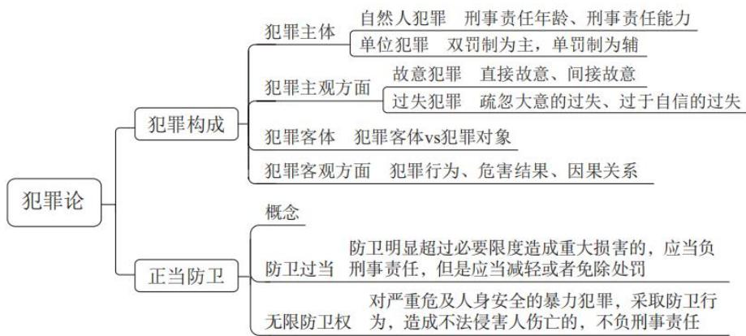
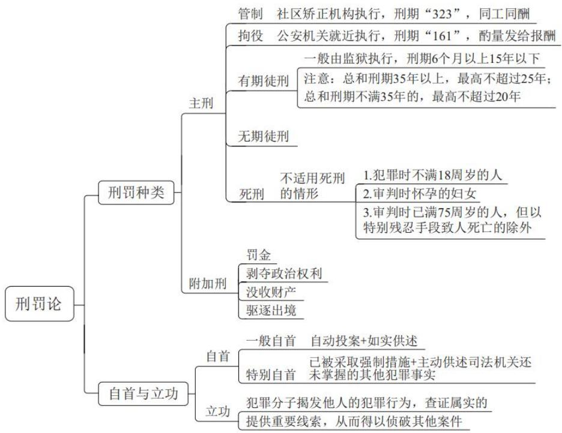
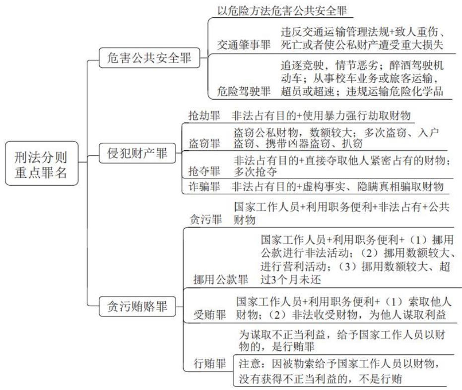

# 精讲精练-常识5

(讲义+笔记)

主讲教师：刘振

授课时间：2025.03.24

# 精讲精练-常识5（讲义）

# 常识判断 精讲精练5

# 学习任务：

1.课程内容：刑法常识
2.对应讲义：第  $104\sim 113$  页
3. 重点内容：

（1）犯罪构成、正当防卫
（2）刑罚种类、自首与立功
（3）刑法分则重点罪名（危害公共安全罪、侵犯财产罪、贪污贿赂罪）

# 第六章 刑法常识

# 第一节 犯罪论

# 一、犯罪构成

# （一）犯罪主体

# 1. 自然人犯罪

# （1）刑事责任年龄

①未满12周岁的人犯罪，不负刑事责任。
②已满12周岁不满14周岁的人，犯故意杀人、故意伤害罪，致人死亡或者以特别残忍手段致人重伤造成严重残疾，情节恶劣，经最高人民检察院核准追诉的，应当负刑事责任。

已满14周岁不满16周岁的人，犯故意杀人、故意伤害致人重伤或者死亡、强奸、抢劫、贩卖毒品、放火、爆炸、投放危险物质罪的，应当负刑事责任。

(3)已满 16 周岁的人犯罪，应当负刑事责任。

# （2）刑事责任能力

① 精神病人在不能辨认或者不能控制自己行为的时候造成危害结果，经法定程序鉴定确认的，不负刑事责任。
②间歇性的精神病人在精神正常的时候犯罪，应当负刑事责任。
③尚未完全丧失辨认或者控制自己行为能力的精神病人犯罪的，应当负刑事责任，但是可以从轻或者减轻处罚。

# 2. 单位犯罪

单位犯罪的处罚原则是以双罚制为主，以单罚制为辅。

# （1）双罚制

对单位判处罚金，并对其直接负责的主管人员和其他直接责任人员判处刑罚。

# （2）单罚制

只处罚直接责任人员。

# （二）犯罪主观方面

犯罪主观方面是指犯罪主体对自己危害社会的行为及危害社会的结果所抱的心理态度，包括犯罪故意和犯罪过失。

# 1. 犯罪故意

# (1) 直接故意

直接故意是指行为人明知自己的行为会发生危害社会的结果，并且希望这种结果发生的心理态度。

# (2) 间接故意

间接故意是指行为人明知自己的行为可能发生危害社会的结果，并且有意放任，以致发生这种结果的心理态度。

# 2. 犯罪过失

# （1）疏忽大意的过失

疏忽大意的过失是指应当预见自己的行为可能发生危害社会的结果，因为疏忽大意而没有预见，以致发生这种结果的心理态度。

# (2) 过于自信的过失

过于自信的过失是指已经预见自己的行为可能发生危害社会的结果，但轻信能够避免，以致发生这种结果的心理态度。

# （三）犯罪客体

犯罪客体是指我国刑法所保护而为犯罪行为所侵犯的社会关系。

# （四）犯罪客观方面

犯罪客观方面是指刑法规定的构成犯罪在客观活动方面所必须具备的条件。

# 1. 危害行为

危害行为专指犯罪构成的客观方面的行为，即由行为人的意识、意志支配的违反刑法规定的危害社会的行为。

# （1）作为

作为，即积极的行为，是指以积极的身体举动实施刑法所禁止的行为。

# （2）不作为

不作为，是指行为人在能够履行自己应尽义务的情况下不履行该义务。

# 2. 危害结果

危害结果是指危害行为作用于犯罪对象而对犯罪客体造成的法定的实际损害或现实的危险状态。

# 3.因果关系

因果关系是指危害行为同危害结果之间存在的引起与被引起的关系。

# 二、正当防卫

# （一）概念

为了使国家、公共利益、本人或者他人的人身、财产和其他权利免受正在进行的不法侵害，而采取的制止不法侵害的行为，对不法侵害人造成损害的，属于正当防卫，不负刑事责任。

粉笔拓展：正当防卫的构成要件

（1）起因条件：不法侵害现实存在。
（2）时间条件：不法侵害正在进行。
（3）主观条件：防卫人具有防卫认识和防卫意志。
（4）对象条件：只能针对侵害人本人防卫。
（5）限度条件：没有明显超过必要限度。

# （二）防卫过当

防卫过当是指正当防卫明显超过必要限度造成重大损害的行为。对于防卫过当的，应当减轻或者免除处罚。

# （三）无过当防卫

无过当防卫，又称特殊防卫或无限防卫权，是指对正在进行行凶、杀人、抢劫、强奸、绑架以及其他严重危及人身安全的暴力犯罪，采取防卫行为，造成不法侵害人伤亡的，不属于防卫过当，不负刑事责任。

# 【实战演练】

(2022 湖北选调) 有些犯罪行为的追诉需要履行特殊程序, 以下需要经最高人民检察院核准追诉的是:

A. 19 周岁的甲, 精神失常当街持刀砍人
B. 17 周岁的乙, 多次入室盗窃数额巨大
C. 15 周岁的丙, 实施投放危险物质行为
D. 13 周岁的丁, 实施杀人行为情节恶劣

# 思维导图

# 第二节 刑罚论

# 一、刑罚种类

# （一）主刑

主刑只能独立适用，不能附加适用。主刑包括：

# 1. 管制

(1) 对犯罪分子不予关押，但限制其一定自由的刑罚方法。
（2）由社区矫正机构依法实行社区矫正。
（3）期限为3个月以上2年以下。数罪并罚时，最高不超过3年。
（4）犯罪分子在劳动中享有同工同酬的权利。

# 2. 拘役

(1) 短期剥夺犯罪分子人身自由，实行劳动改造的刑罚方法。
（2）由公安机关就近执行。

（3）期限为1个月以上6个月以下。数罪并罚时，拘役刑期最高不能超过1年。
（4）在执行期间，犯罪分子每月可以回家1天至2天；参加劳动的，可以酌量发给报酬。

# 3. 有期徒刑

（1）在一定期限内剥夺犯罪分子的人身自由，实行强制劳动改造的刑罚方法。
（2）在监狱或者其他执行场所执行。
(3) 期限为 6 个月以上 15 年以下。数罪并罚时, 有期徒刑总和刑期不满 35 年的, 最高不能超过 20 年; 总和刑期在 35 年以上的, 最高不能超过 25 年。

# 4. 无期徒刑

# 5.死刑

粉笔拓展：死刑的规定

# 1. 不适用死刑的情形

犯罪的时候不满18周岁的人和审判的时候怀孕的妇女，不适用死刑；审判的时候已满75周岁的人，不适用死刑，但以特别残忍手段致人死亡的除外。

# 2. 死刑复核制度

死刑除依法由最高人民法院判决的以外，都应当报请最高人民法院核准。死刑缓期执行的，可以由高级人民法院判决或核准。

# （二）附加刑

附加刑是补充主刑适用的刑罚方法，附加刑既可以附加于主刑适用，又可以独立适用。在附加适用时，可以同时适用两个以上附加刑。在独立适用时，主要针对罪行较轻的犯罪。附加刑有4种：

1. 罚金。
2. 剥夺政治权利。

粉笔拓展：剥夺政治权利的内容

（1）选举权和被选举权。
(2) 言论、出版、集会、结社、游行、示威自由的权利。
（3）担任国家机关职务的权利。

（4）担任国有公司、企业、事业单位和人民团体领导职务的权利。

3. 没收财产。
   4.驱逐出境。

# 二、自首与立功

# （一）自首

自首，是指犯罪以后自动投案，如实供述自己罪行的行为，或者被采取强制措施的犯罪嫌疑人、被告人和正在服刑的罪犯，如实供述司法机关还未掌握的本人其他罪行的行为。

对于自首的犯罪分子，可以从轻或者减轻处罚。其中，犯罪较轻的，可以免除处罚。

# （二）立功

立功，是指犯罪分子揭发他人的犯罪行为，查证属实的，或者提供重要线索，从而得以侦破其他案件等的行为。

对于有立功表现的犯罪分子，可以从轻或者减轻处罚；有重大立功表现的，可以减轻或者免除处罚。

# 【实战演练】

(2024 联考) 下列关于自首的判断, 说法正确的是:

A. 甲和乙共同实施盗窃犯罪，后甲因为内心害怕，主动到公安机关交代，并独自承担了全部罪行，甲构成自首
B. 甲和乙共同实施诈骗犯罪, 后甲因酒驾被公安机关讯问时, 主动交代乙曾经实施的故意杀人行为, 甲构成自首
C. 王某交通肇事逃逸，其父知道后将其扭送至公安机关，王某主动交代了其肇事逃逸行为，王某构成自首
D. 甲公司非法集资且规模很大，该公司总经理李某因为害怕，瞒着其他高管偷偷到公安机关交代了相关情况，李某作为单位犯罪的直接责任人不能单独成立自首

思维导图

# 第三节 刑法分则重点罪名

# 一、危害公共安全罪

# （一）以危险方法危害公共安全罪

以危险方法危害公共安全罪，是指故意使用放火、决水、爆炸、投放危险物质以外的但与其具有相当危险的危险方法危害公共安全的行为。

# （二）交通肇事罪

交通肇事罪，是指违反交通运输管理法规，因而发生重大交通事故，致人重伤、死亡或者使公私财产遭受重大损失的行为。

# （三）危险驾驶罪

危险驾驶罪，是指在道路上驾驶机动车，有下列情形之一的行为：

1.追逐竞驶，情节恶劣的。
2. 醉酒驾驶机动车的。
3. 从事校车业务或者旅客运输，严重超过额定乘员载客，或者严重超过规定时速行驶的。
4. 违反危险化学品安全管理规定运输危险化学品，危及公共安全的。

# 二、侵犯财产罪

# （一）抢劫罪

抢劫罪，是指以非法占有为目的，以暴力、胁迫或者其他方法，强行劫取公私财物的行为。

# （二）盗窃罪

盗窃罪，是指盗窃公私财物，数额较大的，或者多次盗窃、入户盗窃、携带凶器盗窃、扒窃的行为。

# （三）抢夺罪

抢夺罪，是指以非法占有为目的，直接夺取他人紧密占有的数额较大的公私财物，或者多次夺取他人紧密占有的公私财物的行为。

# （四）诈骗罪

诈骗罪，是指以非法占有为目的，使用虚构事实或者隐瞒真相的方法，骗取数额较大的公私财物的行为。

# 三、贪污贿赂罪

# （一）贪污罪

贪污罪，是指国家工作人员利用职务上的便利，侵吞、窃取、骗取或者以其他手段非法占有公共财物，数额较大或者有其他较重情节的行为。

受国家机关、国有公司、企业、事业单位、人民团体委托管理、经营国有资产的人员，利用职务上的便利，侵吞、窃取、骗取或者以其他手段非法占有国有资产的，以贪污论。

# （二）挪用公款罪

挪用公款罪，是指国家工作人员利用职务上的便利，挪用公款归个人使用，进行非法活动的，或者挪用公款数额较大、进行营利活动的，或者挪用公款数额较大、超过3个月未还的行为。

# （三）受贿罪

受贿罪，是指国家工作人员利用职务上的便利，索取他人财物的，或者非法收受他人财物，为他人谋取利益，数额较大或者有其他较重情节的行为。

# （四）行贿罪

行贿罪，是指为谋取不正当利益，给予国家工作人员以财物的行为。

在经济往来中，违反国家规定，给予国家工作人员以财物，数额较大的，或者违反国家规定，给予国家工作人员以各种名义的回扣、手续费的，以行贿论处。

因被勒索给予国家工作人员以财物，没有获得不正当利益的，不是行贿。

粉笔拓展：“行贿罪”从重处罚的规定

（1）多次行贿或者向多人行贿的；
（2）国家工作人员行贿的；
(3) 在国家重点工程、重大项目中行贿的;
（4）为谋取职务、职级晋升、调整行贿的；
（5）对监察、行政执法、司法工作人员行贿的；
(6) 在生态环境、财政金融、安全生产、食品药品、防灾救灾、社会保障、教育、医疗等领域行贿，实施违法犯罪活动的；
（7）将违法所得用于行贿的。

# 【实战演练】

（2023 上海）甲系某地不动产登记中心工作人员，利用收取买房托管资金等职务便利，采取收取托管资金不入账等方式，非法获取人民币 6000 多万元，并用于个人奢侈消费，至案发时已挥霍殆尽。甲的行为构成：

A.贪污罪

B.挪用公款罪

C. 私分国有资产罪

D. 滥用职权罪

思维导图

# 精讲精练-常识5（笔记）

# 常识判断 精讲精练5

# 学习任务：

1.课程内容：刑法常识
2.对应讲义：第  $104\sim 113$  页
3. 重点内容：

（1）犯罪构成、正当防卫
（2）刑罚种类、自首与立功
（3）刑法分则重点罪名（危害公共安全罪、侵犯财产罪、贪污贿赂罪）

# 第六章 刑法常识

01 犯罪论
02刑罚论
03罪名

【注意】本节课进行刑法内容的讲解，对应讲义104页-113页；刑法比民法好学一些，逻辑框架比较清晰，共分为三部分。

1. 犯罪论：但凡牵扯到刑事案件，犯罪人一定有犯罪行为，针对该犯罪行为，到底什么时候构成犯罪、什么时候不构成犯罪，就是法院要考虑的第一个问题（定罪、如何定罪）。
2. 刑罚论：法院的第二个任务是在定罪后量刑，即刑罚论，与第一点对应法院的两项任务，定罪和量刑。
3. 罪名：考试中常考查，因此将常见的具体罪名拿出来分析。

# 第一节 犯罪论

# 一、犯罪构成

【解析】犯罪构成：研究一个人想要构成犯罪、追究其刑事责任，要满足哪几个条件。

# （一）犯罪主体

【解析】犯罪主体：对什么样的人犯罪要追究刑事责任；真正能够追究刑事

责任的只有人（考虑年龄问题、精神状况的问题）和单位。

# 1. 自然人犯罪

# （1）刑事责任年龄

(1)未满 12 周岁的人犯罪，不负刑事责任。

【解析】刑事责任年龄：如果这个人年龄不达标，就不用追究刑事责任，因为追根溯源牵扯到我国有“四大宽容定律”，“人都死了、来都来了、大过年的、孩子还小”。

1. 民法规定，8—18周岁：民事行为能力的年龄划分点，共分成3段，不满8周岁的为无民事行为能力人，实施的民事法律行为统统无效；8-18周岁的为限制民事行为能力人，实施的民事法律行为有可能有效、有可能效力待定；已满18周岁的为完全民事行为能力人，实施的民事法律行为都有效。

# 2. 刑法规定，12、16 周岁：

（1）不满 12 周岁：完全不负刑事责任年龄，是一刀切的，即如果一个孩子不到 12 岁，无论犯的是轻罪（如盗窃）还是重罪（如杀人放火），统统不承担刑事责任。
(2) 年满 16 周岁（ $\mathrm{X} \geqslant 16$  周岁）：完全负刑事责任年龄，无论是轻罪还是重罪，都要承担刑事责任。
(3) 12-16 周岁: 相对负刑事责任年龄, 不是一律担责, 也不是一律不担责, 承不承担需要分情况讨论, 12、16 周岁中还有 14 周岁的分界点。

(1) 12-14 周岁。(2)14-16 周岁。

3. 未满12周岁的人犯罪（X<12周岁），不负刑事责任。

②已满12周岁不满14周岁的人，犯故意杀人、故意伤害罪，致人死亡或者以特别残忍手段致人重伤造成严重残疾，情节恶劣，经最高人民检察院核准追诉的，应当负刑事责任。

已满14周岁不满16周岁的人，犯故意杀人、故意伤害致人重伤或者死亡、强奸、抢劫、贩卖毒品、放火、爆炸、投放危险物质罪的，应当负刑事责任。

③已满16周岁的人犯罪，应当负刑事责任。

【解析】12-16：相对负。

1. 已满 12 周岁不满 14 周岁的人（ $12 \leqslant X < 14$ ），犯故意杀人、故意伤害罪，致人死亡或者以特别残忍手段致人重伤造成严重残疾，情节恶劣，经最高人民检察院核准追诉的，应当负刑事责任。

（1）故意杀人/故意伤害：实施的行为；如两个 13 岁的小朋友课间打闹，在打闹过程中，其中一个小朋友推了另外一个小朋友，导致另外一个小朋友摔成重伤，此时不能追究推的小朋友的刑事责任。
(2) 致人死亡或者以特别残忍手段致人重伤造成严重残疾：结果。注意：行为和结果不是必须一一对应，即不是必须故意杀人对应致人死亡、故意伤害对应以特别残忍手段致人重伤造成严重残疾，如果是为了杀人，但是没杀死、导致了重伤残疾，此时也符合条件，如果是为了故意伤害，但是把人弄死了，此时也

符合条件，因此行为和结果可以任意排列组合。

(3) 情节恶劣: 题目描述的情形本身就会体现情节恶劣。（4）经最高人民检察院核准追诉：在我国，大部分的刑事案件都是公诉案件，由检察院代表国家去起诉，往往在庭审的过程中，检察官被称为公诉人，既然孩子有犯罪行为，应该由检察官起诉，但是孩子毕竟还小，因此不是从地方随随便便找检察院起诉，必须是最高人民检察院核准追诉，要看最高人民检察院。（5）复盘：2024年3月发生在河北邯郸的恶性案件，3个13岁的孩子通过校园霸凌的方式提前挖了一个坑，对被害小朋友实施了活埋，此时是故意杀人、致人死亡、情节恶劣，4月的时候最高人民检察院核准追诉了，该案件在2024年年底（12月31日）作出了判决，对性质最恶劣的孩子判处了无期徒刑+附加剥夺政治权利。

2. 已满 14 周岁不满 16 周岁的人（ $14 \leqslant X < 16$ ），犯故意杀人、故意伤害致人重伤或者死亡、强奸、抢劫、贩卖毒品、放火、爆炸、投放危险物质罪的（八大重罪，口诀为“烧杀奸抢、伤贩爆投”），应当负刑事责任。

（1）假设 15 岁孩子的目的是故意伤害，最终造成的结果仅仅是轻伤，此时不需要负刑事责任，因为要求故意伤害致人重伤或者死亡，轻伤不可以。（2）假设15岁的孩子绑架了一个人，不需要负刑事责任，因为八大重罪中没有绑架。

3. 已满 16 周岁的人犯罪，应当负刑事责任。
   4.总结：

（1）不满12周岁：完全不负刑事责任年龄。
(2) 12-16: 相对负刑事责任年龄。

(1)12-14 周岁。
(2)14-16 周岁。

(3) 年满 16 周岁: 完全负刑事责任年龄。
(2) 刑事责任能力

① 精神病人在不能辨认或者不能控制自己行为的时候造成危害结果，经法定程序鉴定确认的，不负刑事责任。

②间歇性的精神病人在精神正常的时候犯罪，应当负刑事责任。
③尚未完全丧失辨认或者控制自己行为能力的精神病人犯罪的，应当负刑事责任，但是可以从轻或者减轻处罚。

【解析】刑事责任能力：看精神状况到底正不正常。

1. 精神病人在不能辨认或者不能控制自己行为的时候造成危害结果，经法定程序鉴定确认的，不负刑事责任：不正常，不承担刑事责任；大部分的刑事案件都由公安机关负责侦查，公安机关在侦查过程中，会走司法程序进行界定，做题不需要考虑。
2. 间歇性的精神病人（世界“非黑即白”，精神正常时是正常人，精神不正常时是完全不能控制、辨认自己行为的精神病人，不是一定担责，也不是一定不担责）在精神正常的时候犯罪（看犯罪时的精神状态，不是审判时），应当负刑事责任；如精神病人甲在犯罪时精神不正常，捅了被害人一刀，拔刀的时候血溅到了脸上，精神恢复正常了，法官审理时，甲不需要承担刑事责任。
3. 尚未完全丧失辨认或者控制自己行为能力的精神病人犯罪的（是精神病人，但有一定的控制、辨认能力），应当负刑事责任，但是可以从轻或者减轻处罚。
4. 只有第 3 点可能担责。
5. 如甲有轻度精神分裂，这种轻度精神分裂属于精神病，但甲能够控制和辨认自己的行为，如果犯罪，就让其担责。
6. 疫情期间，我国一开始疫情防控经验不足，规定让老百姓居家自我隔离，由于自我隔离的时间长，导致甲精神出了点问题，甲看见家里有一只蚂蚁，想和蚂蚁说说话，然后意识到了自己的不正常，于是给精神病院打了电话，精神病院回复说“与蚂蚁对话，不需要打电话，但如果有一天蚂蚁回答了，请再打电话”。
7. 如《情深深雨濛濛》中的可云就是间歇性精神病人，只需要看其犯罪时是哪种精神状况。

# 2. 单位犯罪

单位犯罪的处罚原则是以双罚制为主，以单罚制为辅。

# （1）双罚制

对单位判处罚金，并对其直接负责的主管人员和其他直接责任人员判处刑罚。

# （2）单罚制

只处罚直接责任人员。

【解析】单位犯罪（单位以单位的名义集体实施犯罪，如单位行贿罪，假设甲是房地产开发商，想帮房地产公司谋取不正当利益，如果以单位的名义向高官行贿，就构成单位行贿罪）：单位犯罪的处罚原则是以双罚制为主，以单罚制为辅。

1. 双罚制：对单位判处罚金，但很难真正打击单位犯罪，因为不会让单位“蹲监狱”“判死刑”，因此除了罚单位，还要对其直接负责的主管人员和其他直接责任人员判处刑罚。
2. 单罚制：只处罚直接责任人员；从根上来看，如果要单罚，罚人能够更好地打击单位犯罪。
3. 法人 = 单位，法人 ≠ 个人：法人是单位或者组织的说法，如果某个人以法人的名义进行法律行为，该人是法定代表人（自然人）。

# （二）犯罪主观方面

犯罪主观方面是指犯罪主体对自己危害社会的行为及危害社会的结果所抱的心理态度，包括犯罪故意和犯罪过失。

# 【解析】犯罪主观方面：

1. 一个人对于所干的坏事所造成的危害结果的主观心理态度, 如两个小朋友 A、B 打闹, A 推了 B 一把, 推的行为是故意的, 但不是为了推死、推伤。
2. 犯罪主观方面是指犯罪主体对自己危害社会的行为及危害社会的结果所抱的心理态度，包括犯罪故意和犯罪过失。

# 3. 对于拖堂的心理态度：

(1) 希望拖堂: 可以把知识掌握得更清楚。
(2) 不希望拖堂。
（3）无所谓。
(4) 平移到犯罪中:

(1)希望把人杀死: 故意。
(2)不希望把人杀死、但由于一些行为导致了死亡：过失。

(3)无所谓: 在我国, 刑法是所有法律中最严厉的一部法律, 针对无所谓、墙头草的中间状态, 想要体现刑法的严厉性, 就把无所谓放入故意中。

a. 希望的故意：直接故意。
b. 无所谓、放任态度：间接故意。

# 1. 犯罪故意

# (1) 直接故意

直接故意是指行为人明知自己的行为会发生危害社会的结果，并且希望这种结果发生的心理态度。

# （2）间接故意

间接故意是指行为人明知自己的行为可能发生危害社会的结果，并且有意放任，以致发生这种结果的心理态度。

# 【解析】犯罪故意：

1. 直接故意（明知+希望）：行为人明知自己的行为会发生危害社会的结果，并且希望这种结果发生的心理态度。
2. 间接故意（明知+有意放任）：行为人明知自己的行为可能发生危害社会的结果，并且有意放任，以致发生这种结果的心理态度。
3. 如小帅是一位杀手, 他接受到了别人的委托, 准备开枪瞄准作案对象小美,瞄准的过程中, 小美发现了自己的好朋友小丑, 二人拥抱在一起, 小帅觉得如果开枪会打到小丑, 于是就选择等待, 但时间比较紧, 小帅只好开枪, 如果打到了小美, 对于小美的死亡, 小帅是直接故意 (明知+希望), 如果没有打到小美, 打到了小丑, 对于小丑的死亡, 小帅是间接故意 (明知+放任)。

# 2. 犯罪过失

# （1）疏忽大意的过失

疏忽大意的过失是指应当预见自己的行为可能发生危害社会的结果，因为疏忽大意而没有预见，以致发生这种结果的心理态度。

# (2) 过于自信的过失

过于自信的过失是指已经预见自己的行为可能发生危害社会的结果，但轻信

能够避免，以致发生这种结果的心理态度。

【解析】犯罪过失：过失对于造成的危害结果明确持排斥的态度。

1. 疏忽大意的过失（完全没想到）：行为人应当预见自己的行为可能发生危害社会的结果，因为疏忽大意而没有预见，以致发生这种结果的心理态度；如两个小朋友 A、B 打闹，A 推了 B 一把，A 应当预见上楼的时候不能打闹、不能推揉，但是因为疏忽大意没有预见。
2. 过于自信的过失（想到了，轻信能够避免）：行为人已经预见自己的行为可能发生危害社会的结果，但轻信能够避免，以致发生这种结果的心理态度；如果做题时看到“主观上经验非常丰富”“客观上技术非常醇熟”，就考虑过于自信；如甲开着五菱宏光正常行驶在马路上，横向过来了一个A186、超过了甲，甲是一名具有20年驾驶经验的老司机，被超车很生气，于是选择弯道超车，结果把A186撞下了山，此时甲对于事故的发生是过于自信（已经预见+轻信能够避免）。
3. 疏忽大意 VS 过于自信：可以看客观，即看客观上干坏事的人有没有采取一些避免危害结果发生的措施，如果有一些人采取了一些避免危害结果发生的措施（说明已经想到），就会考虑过于自信，如果什么都没做，就考虑疏忽大意。

# （三）犯罪客体

犯罪客体是指我国刑法所保护而为犯罪行为所侵犯的社会关系。

# 【解析】犯罪客体：

1. 我国刑法所保护而为犯罪行为所侵犯的社会关系，社会关系可以理解为是一种权利。
2. 假设甲去偷乙的钱包，在本案中，甲确实对乙有盗窃行为，在盗窃的过程中，犯罪客体强调的是盗窃行为侵犯的是乙的哪个权利，即财产权，因此本案中盗窃行为侵犯的客体是财产安全。
3. 假设甲拿刀杀乙，在本案中，杀人是犯罪行为，侵犯的客体是人身安全、生命健康。
4. 犯罪客体 VS 犯罪对象：

(1) 犯罪客体: 无形的、看不见摸不着的权利。
(2) 犯罪对象: 有形的、看得见摸得着的人、财、物。

（3）如甲偷乙的钱包，本案的犯罪客体是财产权、财产安全，犯罪对象是钱包。

# （四）犯罪客观方面

犯罪客观方面是指刑法规定的构成犯罪在客观活动方面所必须具备的条件。

# 1. 危害行为

危害行为专指犯罪构成的客观方面的行为，即由行为人的意识、意志支配的违反刑法规定的危害社会的行为。

# （1）作为

作为，即积极的行为，是指以积极的身体举动实施刑法所禁止的行为。

# (2) 不作为

不作为，是指行为人在能够履行自己应尽义务的情况下不履行该义务。

# 【解析】

1. 犯罪客观方面：刑法规定的构成犯罪在客观活动方面所必须具备的条件，包括行为、结果、因果关系，主要掌握行为。
2. 危害行为：危害行为专指犯罪构成的客观方面的行为，即由行为人的意识、意志支配的违反刑法规定的危害社会的行为。

（1）作为：积极的行为，是指以积极的身体举动实施刑法所禁止的行为，即不让干非要干，大部分刑事犯罪都是作为犯罪，如伸手偷钱包。
(2) 不作为: 让干反而不干, 行为人在能够履行自己应尽义务的情况下不履行该义务, 公式为应为、能为、不为, 最容易出考点的是应为, 即某个人有干某件事的义务 (①②满足一个即可)。

# (1)基于身份:

a. 如 A 馻着狗, 狗咬了 B, A 不能袖手旁观, 因为 A 作为狗主人有应为的义务。
b. 如 A 作为监护人，看着儿子 B 把小朋友 C 打了，A 不可以袖手旁观，因为 A 有特定身份。

②先行行为/先前行为造成的危险：如果一个人给另外一个人先创造了一个危险，就有消除危险的责任和义务，如 A、B 是好朋友，很久未见，约定一起喝

酒，B 说自己吃了头孢、不能喝酒，A 还是灌 B 酒，B 口吐白沫，A 转身就跑了，此时 A 有救助的责任和义务，因为 A 给 B 先创造了一个危险，就有消除危险的义务。

(3)假设路人甲掉入河中, 向唯一在场的乙求救, 乙却没有管, 此时乙不是不作为, 因为乙没有作为义务。
④注意：存在即便有义务，也不构成不作为的情况；如电影《唐山大地震》中，消防员对母亲说“要么把女儿埋在废墟下、要么把儿子埋在废墟下，请快作决定”，母亲对于儿子、女儿都有救助义务，但是选择了救儿子，此时母亲对女儿不是不作为犯罪。

# 2. 危害结果

危害结果是指危害行为作用于犯罪对象而对犯罪客体造成的法定的实际损害或现实的危险状态。

# 3.因果关系

因果关系是指危害行为同危害结果之间存在的引起与被引起的关系。

# 【解析】

1. 危害结果（不是界定行为构不构成犯罪的标准，而是看犯罪阶段、犯罪行为停留在什么状态，罪名不会受到结果影响，结果只会影响状态）：危害行为作用于犯罪对象而对犯罪客体造成的法定的实际损害或现实的危险状态；如甲伸手掏乙的口袋，结果没有达成所期待的结果，此时甲也构成盗窃罪（未遂）；如甲拿刀杀乙，结果乙是练过的，甲没有造成乙的死亡，此时甲也构成故意杀人罪（未遂）。
2. 因果关系（直接原因）：危害行为同危害结果之间存在的引起与被引起的关系；如甲开车正常行驶的过程中，遇到了老大爷乙横穿马路，甲立刻刹车，但是后面的丙因为躲闪不及撞上了前车，导致甲死亡，此时与甲死亡的结果有因果关系的是丙的行为（丙没有保持安全车距）。

# 二、正当防卫

# （一）概念

为了使国家、公共利益、本人或者他人的人身、财产和其他权利免受正在进行的不法侵害，而采取的制止不法侵害的行为，对不法侵害人造成损害的，属于正当防卫，不负刑事责任。

粉笔拓展：正当防卫的构成要件

（1）起因条件：不法侵害现实存在。
（2）时间条件：不法侵害正在进行。
（3）主观条件：防卫人具有防卫认识和防卫意志。
（4）对象条件：只能针对侵害人本人防卫。
（5）限度条件：没有明显超过必要限度。

【解析】正当防卫：电影《第二十条》讲的是正当防卫的问题。

1. 概念：为了使国家、公共利益、本人或者他人的人身、财产和其他权利免受正在进行的不法侵害，而采取的制止不法侵害的行为，对不法侵害人造成损害的，属于正当防卫，不负刑事责任。

(1) 正当防卫不是只能为了保护自己, 保护他人、社会、国家都可以。(2) 免受正在进行的不法侵害: 坏人在做坏事, 作为路人可以帮助被侵害人赶跑坏人。(3) 对不法侵害人造成损害的，属于正当防卫，不负刑事责任。

2. 正当防卫的构成要件：做到一一对应。

（1）起因条件：不法侵害现实存在；不法侵害不能是脑补的，即不能是假想防卫（“觉得自己是在防卫，但对方不是不法侵害人”），如有些人有“被迫害妄想症”，假设甲和乙只是路人打照面，甲认为乙不是好人，把乙打了，在本案中，甲不是正当防卫，因为乙只是路人、不是现实的不法侵害人。
(2) 时间条件: 不法侵害正在进行 (不能早、不能晚), 即 ing 状态。

①事前防卫、先下手为强不认定为正当防卫：如甲和乙是好朋友，甲从乙处得到了消息，说丙要来杀甲，甲决定在丙杀自己之前先杀死丙，此时不构成正当防卫。
②事后防卫不认定为正当防卫：如甲要偷乙的钱包，乙拿回了钱包，甲向乙认错，乙还是非常生气，把甲踹成了重伤，此时不法侵害已经结束，乙还对甲使用暴力，构成事后防卫。

（3）主观条件：防卫人具有防卫认识和防卫意志；防卫人的意图要单纯，必须是奔着防卫去的，保护的可以是自己、他人、社会、国家；刑法有一个理论性名词是“防卫挑拨”，如甲早就想打乙，但他知道如果直接上手会构成故意伤害，于是就通过挑拨让乙先动手，再以正当防卫的理由打乙，此时甲不构成正当防卫。
(4) 对象条件: 只能针对侵害人本人防卫; 如甲抢劫乙, 乙很生气, 但是打不过甲, 于是去抢劫丙, 此时乙不构成正当防卫。
（5）限度条件：正当防卫必须没有明显超过必要限度造成重大损害，如甲偷乙的手机，乙立刻马上发现，于是采取轻微暴力、一脚把甲踢倒在地、夺回手机，乙的行为合理；但如果乙情急之下把甲踢死了，此时乙的行为属于防卫行为，但是该防卫行为明显超过了必要限度，不能按照正当防卫处理，要按照防卫过当处理。

# （二）防卫过当

防卫过当是指正当防卫明显超过必要限度造成重大损害的行为。对于防卫过当的，应当减轻或者免除处罚。

# （三）无过当防卫

无过当防卫，又称特殊防卫或无限防卫权，是指对正在进行行凶、杀人、抢劫、强奸、绑架以及其他严重危及人身安全的暴力犯罪，采取防卫行为，造成不法侵害人伤亡的，不属于防卫过当，不负刑事责任。

【解析】正当防卫不负刑事责任，防卫过当要负刑事责任。

# 1. 防卫过当:

(1) 正当防卫明显超过必要限度造成重大损害的行为。
(2) 对于防卫过当的，应当减轻或者免除处罚：因为防卫过当是“好人”。

# 2. 无过当防卫：

（1）又称特殊防卫或无限防卫权，是指对正在进行行凶、杀人、抢劫、强奸、绑架以及其他严重危及人身安全的暴力犯罪（危及生命安全时，来不及考虑限度），采取防卫行为，造成不法侵害人伤亡的，不属于防卫过当，不负刑事责任。

(2) 针对的不是一般的财产类犯罪，而是对人身安全产生威胁的犯罪。
(3)2018年发生在江苏昆山的龙哥案: 我国认定无限防卫权的第一个案件; 龙哥是开宝马的男司机, 在开车的时候与骑电动车的白衣男子于某产生了争执, 龙哥拿出砍刀、对于某进行了追砍行为, 但是追砍途中刀掉了, 于某捡起刀、把龙哥砍死了。

(1)龙哥拿刀追砍于某: 现实的不法侵害。(2)于某为了保护自己、杀了龙哥：保护自己，意图符合。(3)龙哥是不法侵害人。④龙哥拿刀砍于某，刀掉了，于某把刀拿起来：符合不法侵害正在进行，因为客观上看，龙哥还有继续进行不法侵害的能力（有能力捡刀且有能力继续对于某进行不法侵害）。(5)于某把刀捡起来，砍死了龙哥：不构成防卫过当，因为龙哥的行为本身就是在危及于某的人身安全，因此启动无限防卫权。(6)结论: 本案按照正当防卫, 不负刑事责任处理。

1. 13岁的甲过失致人死亡，经最高人民检察院核准，应当追究刑事责任。2.15 岁的乙绑架后杀害他人，应当负刑事责任。
2. 间歇性精神病人在犯罪时精神正常的，不承担刑事责任。
3. 明知行为会发生危害结果，但有意放任危害结果发生的是直接故意。
4. 已经预见危害结果的发生，但是轻信可以避免的是疏忽大意的过失。
5. 正当防卫只能是为了保护自己而实施防卫行为。
6. 正当防卫明显超过必要限度造成他人重大损害的，以防卫过当罪定罪。

# 【解析】

1. 13 岁的甲过失致人死亡，经最高人民检察院核准，应当追究刑事责任（错误），原因：12-14 周岁要满足故意杀人/故意伤害+致人死亡或者以特别残忍手段致人重伤造成严重残疾+情节恶劣+最高人民检察院核准追诉。
2. 15 岁的乙绑架后杀害他人，应当负刑事责任（正确），原因：已满 14、不满 16 追究“烧杀奸抢，伤贩爆投”，虽然绑架罪不追究，但是故意杀人要追究。
3. 间歇性精神病人在犯罪时精神正常的，不承担刑事责任（错误），原因：

针对间歇性精神病人，看犯罪时，只要犯罪时精神正常，就担责，犯罪时精神不正常，才不担责。

4. 明知行为会发生危害结果，但有意放任危害结果发生的是直接故意（错误），原因：直接故意为明知+希望，间接故意为明知+放任。
5. 已经预见危害结果的发生，但是轻信可以避免的是疏忽大意的过失（错误），原因：过于自信的过失；疏忽大意的过失是纯纯没想到。
6. 正当防卫只能是为了保护自己而实施防卫行为（错误），原因：还可以保护他人、保护社会、保护国家。
7. 正当防卫明显超过必要限度造成他人重大损害的，以防卫过当罪定罪（错误），原因：我国没有防卫过当罪，如甲偷乙的手机，乙情急之下把甲踢死了，在本案中，乙把甲踢死是过失的（疏忽大意的过失，应当预见可能踢死、但是没有预见），而且把甲踢死了，因此给乙定过失致人死亡罪；防卫过当是减轻/免除刑罚的量刑情节，不是具体罪名。

# 【实战演练】

(2022 湖北选调) 有些犯罪行为的追诉需要履行特殊程序, 以下需要经最高人民检察院核准追诉的是:

A. 19 周岁的甲, 精神失常当街持刀砍人
B. 17 周岁的乙, 多次入室盗窃数额巨大
C. 15 周岁的丙, 实施投放危险物质行为
D. 13 周岁的丁, 实施杀人行为情节恶劣

【解析】【选D】

# 第二节 刑罚论

# 一、刑罚种类

【解析】刑罚种类：包括主刑、附加刑。

# （一）主刑

主刑只能独立适用，不能附加适用。主刑包括：

# 【解析】主刑：

1. 只能独立适用，不能附加适用，如给张三判3年有期徒刑，不能再附加2年有期徒刑。
2. 主刑包括：管制、拘役、有期徒刑、无期徒刑、死刑；从轻到重排列。

# 1. 管制

（1）对犯罪分子不予关押，但限制其一定自由的刑罚方法。
（2）由社区矫正机构依法实行社区矫正。
（3）期限为3个月以上2年以下。数罪并罚时，最高不超过3年。
（4）犯罪分子在劳动中享有同工同酬的权利。

【解析】管制：被判处管制的犯罪分子的犯罪行为较轻，可以在社会中流动，但需要在规定时间内去指定机构学习、报道，因此管制不关押。

1. 对犯罪分子不予关押，但限制其一定自由的刑罚方法。
2. 由社区矫正机构依法实行社区矫正：一般是司法所下面的社区矫正中心。
3. 期限为3个月以上2年以下。数罪并罚时，最高不超过3年：“323”，如果只干一件坏事，针对一个罪，管制判3个月以上2年以下，如果数罪并罚，管制的最长期限不超过3年。
4. 犯罪分子在劳动中享有同工同酬的权利：如甲轻微犯罪，不影响甲工作，因为没有剥夺人身自由，因此不需要把判处管制的犯罪分子和劳动者区别对待。

# 2. 拘役

（1）短期剥夺犯罪分子人身自由，实行劳动改造的刑罚方法。
（2）由公安机关就近执行。
（3）期限为1个月以上6个月以下。数罪并罚时，拘役刑期最高不能超过1年。
（4）在执行期间，犯罪分子每月可以回家1天至2天；参加劳动的，可以酌量发给报酬。

# 【解析】拘役：

1. 短期剥夺犯罪分子人身自由，实行劳动改造的刑罚方法，日常中由公安机关

关下属的看守所就近执行。

2. 拘役期限为“161”，即一个犯罪行为1个月以上6个月以下；数罪并罚时，拘役刑期最高不能超过1年。
3. 在执行期间，犯罪分子每月可以回家1天至2天，即“探亲假”，被判处管制的犯罪分子不剥夺人身自由，不涉及探亲假；参加劳动的，可以酌量发给报酬，需要区别对待。

# 3. 有期徒刑

（1）在一定期限内剥夺犯罪分子的人身自由，实行强制劳动改造的刑罚方法。
（2）在监狱或者其他执行场所执行。
(3) 期限为 6 个月以上 15 年以下。数罪并罚时, 有期徒刑总和刑期不满 35 年的, 最高不能超过 20 年; 总和刑期在 35 年以上的, 最高不能超过 25 年。

# 4. 无期徒刑

# 5.死刑

# 【解析】

# 1. 有期徒刑：

（1）在一定期限内剥夺犯罪分子的人身自由，实行强制劳动改造的刑罚方法。在监狱或者其他执行场所执行。
（2）期限（考点）：

①针对一个犯罪行为期限为6个月以上15年以下，拘役为针对一个犯罪行为最长6个月。数罪并罚时，如甲因为抢劫罪被判12年，绑架罪被判13年，杀人罪被判15年有期徒刑，法院想要追究刑事责任会牵扯刑期范围，下限为三个刑罚中最高的，即最少15年，上限理论上为数罪的总和刑期，即40年。
(2)但法院会将上限 40 和 35 比较, 如果总和刑期在 35 年以上的, 最高不能超过 25 年, 总和刑期不满 35 年的, 最高不能超过 20 年; 所以甲的刑期为 15-25 年。如果犯罪分子分别被判 8、9、10 年, 数罪并罚的刑期范围为 10 (最长的刑期) -20 年 (总和刑期为 27 , 不足 35 , 按照 20 )。
(3) 从轻 VS 减轻: 法院量刑幅度为 10-20 年, 一般会选择中间数判决, 即

15、16 年, 相对中立。如果法院判处 10、11 年为从轻, 即在量刑幅度范围内选择小的, 法院判处 8、9 年为减轻。

2. 无期徒刑：没有考点，掌握剥夺犯罪分子终身自由即可。
3. 死刑：重点掌握死刑的规定。

粉笔拓展：死刑的规定

# 1. 不适用死刑的情形

犯罪的时候不满18周岁的人和审判的时候怀孕的妇女，不适用死刑；审判的时候已满75周岁的人，不适用死刑，但以特别残忍手段致人死亡的除外。

# 2. 死刑复核制度

死刑除依法由最高人民法院判决的以外，都应当报请最高人民法院核准。死刑缓期执行的，可以由高级人民法院判决或核准。

【解析】死刑的规定：我国遵循能不杀就不杀、少杀、慎杀，只有罪行极其严重才会判处死刑，但有例外。

# 1. 不适用死刑的情形：

(1) 犯罪的时候不满 18 周岁的人和审判的时候怀孕的妇女, 一律不适用死刑, 即手段再恶劣、情节再残忍都不能适用死刑。(2) 审判的时候已满 75 周岁的人, 不适用死刑, 如激情杀人, 手段不恶劣可以不判处死刑; 但以特别残忍手段致人死亡的除外。(3) 我国死刑有两种形式, 即死立执和死缓, 不适用死刑既不适用死刑也不适用死缓。

2. 死刑复核制度：死立执除依法由最高人民法院判决的以外，都应当报请最高人民法院核准。死刑缓期（大概率不死）执行的，可以由高级人民法院判决或核准。如北京市高级人民法院可以核准死缓，但不能核准死立执，最终一个人能否死由最高法核准。12-14岁想要追究刑事责任由最高检核准。

# （二）附加刑

附加刑是补充主刑适用的刑罚方法，附加刑既可以附加于主刑适用，又可以独立适用。在附加适用时，可以同时适用两个以上附加刑。在独立适用时，主要

针对罪行较轻的犯罪。附加刑有4种：

1. 罚金。
2. 剥夺政治权利。
3. 没收财产。
   4.驱逐出境。

【解析】附加刑：既可以附加于主刑适用，又可以独立适用，法院可以判处1个主刑+1个附加刑或只判处1个主刑或只判处附加刑。附加刑有4种。

1. 两个和钱相关：罚金（有数额；罚款针对违法行为，如汽车违停违反《道路安全交通法》，犯法不犯罪，只有违反刑法为犯罪）、没收财产（一般没收犯罪分子个人+全部/部分财产，规模比罚金多）。
2. 两个和人相关：剥夺政治权利（针对中国人）、驱逐出境（针对外国人，如某男明星被做出13年有期徒刑和驱逐出境的判决）。

粉笔拓展：剥夺政治权利的内容

（1）选举权和被选举权。
(2) 言论、出版、集会、结社、游行、示威自由的权利。
（3）担任国家机关职务的权利。
（4）担任国有公司、企业、事业单位和人民团体领导职务的权利。

# 【解析】剥夺政治权利的内容

1. 选举权和被选举权：公民最基本的政治权利。
2. 言论、出版、集会、结社（组建社团）、游行（如甲买的房子背后房地产开发商暴雷导致房子变成烂尾楼，开发商跑路，甲为了维权找当地政府，在当地政府拉条幅、静坐是可以的，目的是让政府帮其解决。为变相的示威）、示威（政治自由）自由的权利。集会、游行、示威需要向有关机关报备。（1）言论  $\neq$  说话，言论指在公共场合发表对国家和社会的看法，不被允许；如人大代表有言论免责权，即人大代表在开会期间各种会议的发言和表决不受追究，但其不能在人民大会堂骂街。(2) 出版: 被剥夺政治权利的人可以写书, 能够进行文学艺术创造自娱自乐, 但不能出版发行。
3. 担任国家机关职务的权利。如甲是公务员，犯罪后被剥夺政治权利不能再担任国家机关职务，会被“双开”，即开除党籍和公职。
4. 担任国有公司、企业、事业单位和人民团体领导职务的权利，一个被剥夺政治权利的人不能在国家机关任职，但可以在国有公司、企业、事业单位当普通职员。私营企业不在剥夺政治权利的范围内讨论，可以自己创业当老板。

【注意】针对刑罚：掌握主刑和附加刑有哪些、管制和拘役的区别、死刑的特殊规定。

# 二、自首与立功

# （一）自首

自首，是指犯罪以后自动投案，如实供述自己罪行的行为，或者被采取强制措施的犯罪嫌疑人、被告人和正在服刑的罪犯，如实供述司法机关还未掌握的本人其他罪行的行为。

对于自首的犯罪分子，可以从轻或者减轻处罚。其中，犯罪较轻的，可以免除处罚。

# 【解析】自首：

1. 一般/普通自首：自动投案+如实供述。电影《周处除三害》中主人公陈桂林犯罪后到公安机关投案自首，公安机关让其排队填表，于是他选择离开公安机关，陈桂林的行为不属于一般自首，因为没有自动投案。
2. 特别自首（准自首）：如甲因为A罪被抓，公安机关问其时，甲对A罪如实供述，为坦白；但A供述A罪后交代了自己之前抢劫的行为（司法机关还未掌握的本人其他罪行），针对抢劫成立特别自首。
3. 量刑: 对于自首的犯罪分子, 可以从轻或者减轻处罚。其中, 犯罪较轻的,可以免除处罚 (不存在应当)。应当为必须从宽, 可以法院具体问题具体分析。

# （二）立功

立功，是指犯罪分子揭发他人的犯罪行为，查证属实的，或者提供重要线索，从而得以侦破其他案件等的行为。

对于有立功表现的犯罪分子，可以从轻或者减轻处罚；有重大立功表现的，可以减轻或者免除处罚。

【解析】立功：自首交代的是自己的事情，立功为交代别人的事情。

1. 犯罪分子揭发他人的犯罪行为，查证属实的，或者提供重要线索，从而得以侦破其他案件等的行为。
2. 对于有立功表现的犯罪分子，可以从轻或者减轻处罚；有重大立功表现的，可以减轻或者免除处罚。
3. 对比：自首分为一般自首（自动投案+如实坦白）和特殊自首（因为A罪被抓，交代公安机关未掌握的B罪）；立功为交代别人的事情，二者量刑都是“可以”。

# 【注意】

1. 管制是短期剥夺人身自由的一种刑罚种类（错误），原因：管制不剥夺人身自由，仅限制。
2. 被判处拘役的犯罪分子，拘役的刑期最长不超过 6 个月（错误），原因：多个犯罪行为最长不超过 1 年。
3. 被判处有期徒刑的犯罪分子，数罪并罚总和刑期  $\geqslant 35$  年的，实际执行不超过20年（错误），原因：实际刑期不超过25年。
4. 犯罪时不满 18 周岁和审判时怀孕的妇女，一律不适用死刑（正确），原因：审判时已满 75 周岁的人有特殊情况，即特别残忍手段致人死亡除外。
5. 剥夺政治权利的内容包括，担任国有公司、企业、事业单位领导职务的权利（正确），原因：一旦被剥夺政治权利，不能在国有公司、企业、事业单位当领导，不能在国家机关担任职务。
6. 犯罪分子若因盗窃罪被公安机关抓获，审讯中，如实交代盗窃罪行的成立自首（错误），原因：犯罪分子想要构成特别自首需要供述其他罪行。

# 【实战演练】

(2024 联考) 下列关于自首的判断, 说法正确的是:

A. 甲和乙共同实施盗窃犯罪，后甲因为内心害怕，主动到公安机关交代，并

独自承担了全部罪行，甲构成自首

B.甲和乙共同实施诈骗犯罪，后甲因酒驾被公安机关讯问时，主动交代乙曾经实施的故意杀人行为，甲构成自首
C. 王某交通肇事逃逸，其父知道后将其扭送至公安机关，王某主动交代了其肇事逃逸行为，王某构成自首
D. 甲公司非法集资且规模很大，该公司总经理李某因为害怕，瞒着其他高管偷偷到公安机关交代了相关情况，李某作为单位犯罪的直接责任人不能单独成立自首

【解析】A项：甲具备自动投案，但没有如实供述本案真实情况，不能认定为自首，排除。

B 项：甲构成立功，排除。

C项：司法解释对自动投案有扩大解释，即犯罪后没有自己去公安机关，而是告知亲友，在亲友规劝、陪同、扭送都属于自动投案，但捆绑不属于自动投案，王某如实供述，成立自首，当选。
D 项：单位犯罪中李某作为单位犯罪的直接责任人主动投案且如实供述，成立自首，排除。【选 C】

# 第三节 刑法分则重点罪名

# 一、危害公共安全罪

# （一）以危险方法危害公共安全罪

以危险方法危害公共安全罪，是指故意使用放火、决水、爆炸、投放危险物质以外的但与其具有相当危险的危险方法危害公共安全的行为。

# （二）交通肇事罪

交通肇事罪，是指违反交通运输管理法规，因而发生重大交通事故，致人重伤、死亡或者使公私财产遭受重大损失的行为。

# （三）危险驾驶罪

危险驾驶罪，是指在道路上驾驶机动车，有下列情形之一的行为：

1.追逐竞驶，情节恶劣的。2.醉酒驾驶机动车的。

3. 从事校车业务或者旅客运输，严重超过额定乘员载客，或者严重超过规定时速行驶的。
4. 违反危险化学品安全管理规定运输危险化学品，危及公共安全的。

# 【解析】危害公共安全罪：

# 1. 以危险方法危害公共安全罪：

(1) 故意使用放火、决水、爆炸、投放危险物质属于危害公共安全, 但有单独的罪名, 即放火罪、决水罪、爆炸罪、投放危险物质罪; 除此之外但与其具有相当危险的危险方法危害公共安全的行为构成以危险方法危害公共安全罪。
(2) 如 2012 年在山东巴西和德国有一场足球赛, 德国和巴西比分为  $7: 1$ ,烟台一叉车司机买球赌输花光了自己所有钱, 第二天开着叉车在马路上横冲直撞,见人撞人, 见车叉车, 构成以危险方法危害公共安全罪。
(3) 决水: 古代经常发生, 战国名将白起为了打魏国曾经水淹魏国大梁,关羽曾经水淹齐军, 即通过决开水堤的方式淹没小村庄危害公共安全。故意杀人为点对点的方式, 以危险方法危害公共安全没有具体对象, 为群体性伤害。

# 2. 交通肇事罪：

（1）如甲开车将人撞伤或撞死，不一定构成交通肇事罪，有前提，即先违反交通运输管理法规；如甲闯红灯、醉酒驾驶、无证驾驶等且发生重大交通事故，致人重伤、死亡或者使公私财产遭受重大损失的行为。
(2) 甲正常行驶, 乙碰瓷, 甲刹车不及时撞伤或撞死乙, 不构成交通肇事罪, 因为甲没有违法行为。交通肇事罪为过失犯罪, 如果瞄准人撞为故意杀人, 交通肇事不存在瞄准的问题。

# 3. 危险驾驶罪：有且只有四种。

（1）追逐竞驶，情节恶劣的，即飙车。如A正常行驶，邻车道B车没有打转向灯超车，A生气追上B车别B车，两个车斗气超车也构成追逐驾驶。
(2) 醉酒驾驶机动车的, 血液中酒精含量达到  $80 \mathrm{mg} / 100 \mathrm{ml}$  属于醉驾, 但不一定追究刑事责任;  $120 \mathrm{mg} / 100 \mathrm{ml}$  可能考虑追究刑事责任。酒驾一般为  $20 - 80 \mathrm{mg} / 100 \mathrm{ml}$ , 为违法行为, 可能暂扣驾照 6 个月、罚款 2000 元、行政拘留 15 天, 犯罪为拘役。
(3) 从事校车业务或者旅客运输 (拉人), 严重超过额定乘员载客 (超员),

或者严重超过规定时速行驶的（超速）。某视频网站上印度一个大巴车司机开车从来不踩刹车，解说的人称“这种方式很危险，看起来一点也不安全，乘客运气好可以很快到达目的地，运气不好也会很快到达‘目的地’”，在我国构成危险驾驶罪。

（4）违反危险化学品安全管理规定运输危险化学品，危及公共安全的。一些大车上会有有毒、易燃易爆、放射性标志，违规运输可能按照危险驾驶罪处理。一般货车超载不会按照危险驾驶罪处理。

# 二、侵犯财产罪

# （一）抢劫罪

抢劫罪，是指以非法占有为目的，以暴力、胁迫或者其他方法，强行劫取公私财物的行为。

# （二）盗窃罪

盗窃罪，是指盗窃公私财物，数额较大的，或者多次盗窃、入户盗窃、携带凶器盗窃、扒窃的行为。

# （三）抢夺罪

抢夺罪，是指以非法占有为目的，直接夺取他人紧密占有的数额较大的公私财物，或者多次夺取他人紧密占有的公私财物的行为。

# （四）诈骗罪

诈骗罪，是指以非法占有为目的，使用虚构事实或者隐瞒真相的方法，骗取数额较大的公私财物的行为。

【解析】财产类犯罪：盗窃、抢夺、诈骗仅针对财产。

# 1.抢劫罪（复杂客体）：

（1）以非法占有为目的，通过危及人身安全的方式（手段）达到取财的目的，针对人身，也针对财产。一个人被诈骗、抢夺、盗窃不可能启动无限防卫权，但被抢劫可以，因为危及人身安全。

# (2) 方式:

(1)暴力：如于和伟主演的《我是刑警》中还原了原型周克华的案件，犯罪分子打伤武警抢到枪后，等待取钱的人出银行一枪打死抢走钱。

(2)胁迫: 先使用言语威胁, 如程咬金抢劫会从草丛蹦出来说 “此树是我栽, 此路是我开, 要想从这过, 留下买路财”。(3)其他方法: 如昏醉抢劫, 通过下药将人迷昏、灌酒将人灌醉压制对方反抗,达到取财目的, 如《水浒传》中智取生辰纲, 即晁盖为首将蒙汗药下在酒里劫走了太师的礼物; 电影《惊天魔盗团》中魔术师通过催眠的方式开走运钞车也构成抢劫。

2. 盗窃罪：盗窃公私财物，数额较大的（需要考虑数额，如老师上线下课，桌子上的手机、平板没有人拿，但红笔、打火机可能会被拿走）；特殊情况下可能不考虑数额，如多次盗窃（一般为2年内3次以上）、入户盗窃、携带凶器盗窃、扒窃（偷他人随身物品）的行为。
3. 抢夺罪：抢劫危及人身和财产，但抢夺只针对财产，如飞车抢夺，即一个人在前面拎着包走，骑着摩托车的刘某趁机从后面抢走包或手机。
4. 诈骗罪：站在被害人的角度理解，被害人被骗心甘情愿将财物处分给他人构成诈骗罪。如世界杯期间，甲收到短信“你好，我是C罗，通过世界杯相信你已经见证到我们葡萄牙队的实力，但我们的比赛受到庄家操控，想要知道内情可以给我打款”，于是甲询问C罗全名，发短信的人称“我在中国使用我大姨父王富贵的名字”，甲信以为真汇款给对方，对方构成诈骗罪。电影《孤注一掷》中张艺兴主演的主人公被骗到缅北，王大陆饰演的角色也被一骗再骗，属于诈骗罪。

# 三、贪污贿赂罪

# （一）贪污罪

贪污罪，是指国家工作人员利用职务上的便利，侵吞、窃取、骗取或者以其他手段非法占有公共财物，数额较大或者有其他较重情节的行为。

受国家机关、国有公司、企业、事业单位、人民团体委托管理、经营国有资产的人员，利用职务上的便利，侵吞、窃取、骗取或者以其他手段非法占有国有资产的，以贪污论。

# 【解析】贪污罪：

1. 四个条件缺一不可。

(1) 主体: 国家工作人员, 一般老百姓不能构成贪污罪。

(2) 手段：利用职务上的便利。(3) 目的: 非法占有, 即不想还钱。(4) 国家或集体的公共财物。

2. 对比：如甲是国家工作人员，利用职务上的便利挪走国家财物暂时用于他途构成挪用公款罪，本质区别为是否想还；甲是国家工作人员，利用职务便利拿走他人的钱，不打算还构成受贿；国家工作人员甲下班后发现单位会计没有锁保险柜，拿走单位10万元，构成盗窃，缺少利用职务上的便利；某私营企业董事长刘某利用职务之便将本单位的10亿元占为己有，构成职务侵占罪。
3. 总结：贪污 VS 挪用公款的区别为是否想还，和受贿的区别为拿谁的钱，拿别人的钱为受贿，拿国家或集体的钱为贪污；和盗窃的区别为是否利用职务之便，和职务侵占的区别为主体不同，有国家工作人员身份构成贪污。
4. 扩大解释：国家工作人员范围非常广，手中有公权力就可能构成贪污受贿的主体，如参公管理的事业单位、国有公司管理人员、事业单位管理人员、村委会/居委会管理人员、街道办等。考试常考单位出纳、会计、仓库保管员，也会被纳入贪污受贿的群体，因为会受到委托管理国有资产。

# （二）挪用公款罪

挪用公款罪，是指国家工作人员利用职务上的便利，挪用公款归个人使用，进行非法活动的，或者挪用公款数额较大、进行营利活动的，或者挪用公款数额较大、超过3个月未还的行为。

# （三）受贿罪

受贿罪，是指国家工作人员利用职务上的便利，索取他人财物的，或者非法收受他人财物，为他人谋取利益，数额较大或者有其他较重情节的行为。

# 【解析】

1. 挪用公款罪：国家工作人员（主体）利用职务上的便利，挪用公款归个人使用，进行非法活动的，如国家工作人员甲拿了单位5万元买枪或毒品，构成挪用公款罪；挪用公款数额较大、进行营利活动的，如国家机关工作人员甲拿着单位10万元炒股、投资，第二天还钱也构成挪用公款；挪用公款数额较大、超过3个月未还的行为，如国家机关工作人员拿着单位20万元给父亲看病，第二个

月还了不构成挪用公款罪，不构成犯罪但会面临内部处分，如党籍、公职保不住了。

2. 受贿罪：国家工作人员利用职务上的便利，索取他人财物的（主动），即国家机关找人要钱，我国没有受贿罪，按照受贿罪处理；或者非法收受他人财物（被动），为他人谋取利益，数额较大或者有其他较重情节的行为。

# （四）行贿罪

行贿罪，是指为谋取不正当利益，给予国家工作人员以财物的行为。

在经济往来中，违反国家规定，给予国家工作人员以财物，数额较大的，或者违反国家规定，给予国家工作人员以各种名义的回扣、手续费的，以行贿论处。

因被勒索给予国家工作人员以财物，没有获得不正当利益的，不是行贿。

# 【解析】行贿罪：

1. 犯罪主体没有身份要求，不要求必须是国家工作人员，可以是国家工作人员或非国家工作人员，为谋取不正当利益，给予国家工作人员（对象有要求，即手中有公权力的人）以财物的行为。如老师刘某想要提升教师级别，给领导钱不构成行贿罪，因为领导不是国家工作人员，可能构成对非国家工作人员行贿罪。
2. 变相行贿：在经济往来中，违反国家规定，给予国家工作人员以财物，数额较大的，或者违反国家规定，给予国家工作人员以各种名义的回扣、手续费的，以行贿论处。
3. 因被勒索给予国家工作人员以财物，没有获得不正当利益的，即国家工作人员收钱不办事，收钱不办事的人构成受贿罪，但被勒索的人不构成行贿罪。如国家机关领导甲对工作人员小刘说“你干了10年还是三级科员，你不给我意思意思，我也没法给你意思意思”。于是小刘给了甲20万，甲收钱后没办事，甲构成受贿罪，乙不构成行贿罪；如果甲收钱后给小刘提拔为副处，小刘构成行贿罪，因为变相获得了不正当利益。

粉笔拓展：“行贿罪”从重处罚的规定

（1）多次行贿或者向多人行贿的；
（2）国家工作人员行贿的；

（3）在国家重点工程、重大项目中行贿的；
（4）为谋取职务、职级晋升、调整行贿的；
（5）对监察、行政执法、司法工作人员行贿的；
（6）在生态环境、财政金融、安全生产、食品药品、防灾救灾、社会保障、教育、医疗等领域行贿，实施违法犯罪活动的；
（7）将违法所得用于行贿的。

【解析】“行贿罪”从重处罚的规定：刑法修正案十二中进行了调整。

1. 多次行贿或者向多人行贿的，即干坏事的人抓住一个国家工作人员多次行贿或者给很多人行贿。
2. 国家工作人员行贿的，即知法犯法，罪加一等。
3. 在国家重点工程、重大项目中行贿的，羊毛出在羊身上，每个企业想要向政府投标手中会有预算，如企业预算300万，将预算的200万行贿，剩余100万即便得到项目最终生产的也是豆腐渣工程，因此需要从严处理。如《人民的名义》中易学习被提拔到公路管理局当领导称“如果你们向我行贿，我收了，你们就会在项目上偷工减料，会对人民造成巨大损失”。
4. 为谋取职务、职级晋升、调整行贿的，即国家机关工作人员花钱买官。我国职务和职级并行，如电视剧中育良书记称工作时候称职务，因为其是领导。
5. 对监察、行政执法、司法工作人员行贿的，我国权力运行的底层逻辑为权力制约，机关和机关之间相互制约，拉拢国家干部的行为破坏了我国行政秩序和司法秩序。
6. 在生态环境、财政金融、安全生产、食品药品、防灾救灾、社会保障、教育、医疗等领域（和老百姓生命健康、公共利益息息相关）行贿，实施违法犯罪活动的。
7. 将违法所得用于行贿的。

# 【注意】

1. 张三在闹市区引爆炸弹的行为构成以危险方法危害公共安全罪（错误），原因：构成爆炸罪。
2. 李四驾车正常行驶的过程中，遇到行人碰瓷，因刹车不及，将行人撞伤，

李四构成交通肇事罪（错误），原因：交通肇事罪前提为有违反交通管理法规的行为。

3. 驾驶机动车运输一般货物，超过额定载重的构成危险驾驶罪（错误），原因：运输的货物为危险品超载违反危险品运输管理规定，构成危险驾驶罪。
4. 甲约乙在酒吧喝酒，因乙醉酒不省人事，甲趁机拿走乙的手机，甲构成抢劫罪（错误），原因：昏醉抢劫为故意灌醉乙让乙不省人事从而将手机拿走，灌酒需要为取财服务；甲在乙不省人事后趁机拿走手机构成盗窃罪，不存在压制他人反抗的行为。
5. 贪污受贿的主体仅限国家机关工作人员（错误），原因：国家工作人员包含的范围比较广，包含受国家机关、国有公司、企业、事业单位、人民团体委托管理、经营国有资产的人员。
6. 因被勒索给予国家机关工作人员财物，但获得了不正当利益，依然按照行贿罪追究刑事责任（正确）。

# 【实战演练】

（2023 上海）甲系某地不动产登记中心工作人员，利用收取买房托管资金等职务便利，采取收取托管资金不入账等方式，非法获取人民币 6000 多万元，并用于个人奢侈消费，至案发时已挥霍殆尽。甲的行为构成：

A.贪污罪

B.挪用公款罪

C. 私分国有资产罪

D. 滥用职权罪

【解析】考试无需关注数额，分析行为即可。

A项：不动产登记中心工作人员为国家工作人员，为人民服务，利用职务便利不入账非法获取6000万元，说明不想还，为贪污罪，当选。
C项：强调国家国有企业领导一致决定将国有资产分给整个国有企业成员，一般不会出现，排除。
D 项：和玩忽职守对应，滥用职权指事情本不应该插手但非要插手，为作为的犯罪；玩忽职守可以联想苏联成，不贪污不受贿，但不干实事，排除。
B 项：挪用公款一般用作他途，会还，排除。【选 A】

遇见不一样的自己

Be your better self
