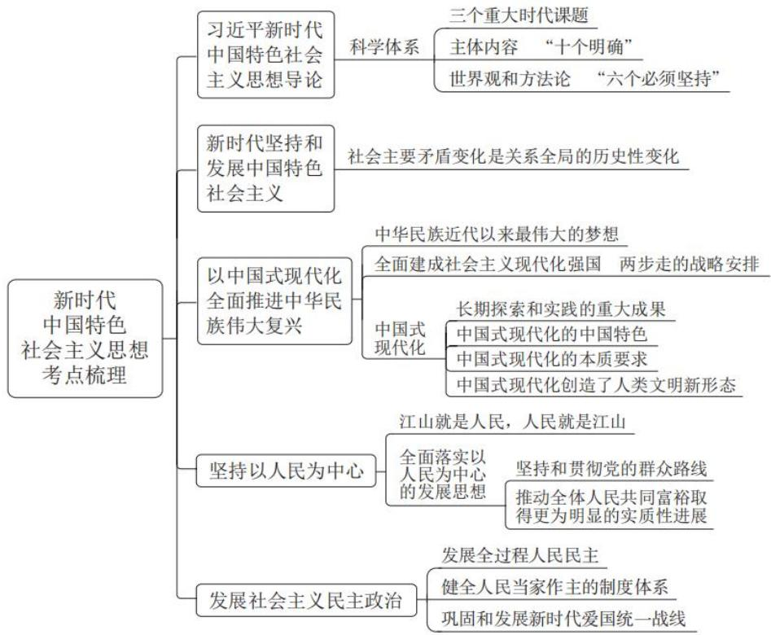
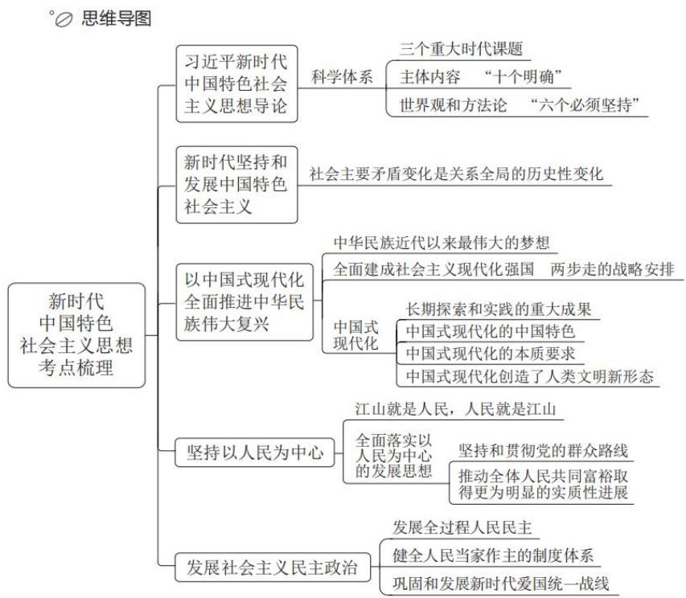

# 精讲精练-政治理论 1

(讲义+笔记)

主讲教师：刘鸿

授课时间：2025.03.15

# 精讲精练-政治理论1（讲义）

# 政治理论

# 第一章 新时代中国特色社会主义思想考点梳理

# 政治理论 精讲精练1

# 学习任务：

1.课程内容：新时代中国特色社会主义思想考点梳理（第一节～第五节）  
2.对应讲义：第  $4\sim 15$  页  
3.重点内容：

（1）习近平新时代中国特色社会主义思想的基本问题及科学体系  
（2）中国特色社会主义进入新时代及社会主要矛盾变化  
（3）全面建成社会主义现代化强国的战略安排，中国式现代化的历史背景、特征、本质要求及重大意义  
（4）全体人民共同富裕的内涵、思路及发展历程  
（5）全过程人民民主的含义及人民当家作主的制度体系

# 第一节 习近平新时代中国特色社会主义思想导论

# 一、习近平新时代中国特色社会主义思想是“两个结合”的重大成果

习近平新时代中国特色社会主义思想是马克思主义基本原理同中国具体实际相结合、同中华优秀传统文化相结合的重大成果，是坚持“两个结合”的光辉典范。

毛泽东第一次系统阐述了马克思主义基本原理同中国具体实际相结合的一系列重大问题，并提出要使马克思主义具有民族形式。习近平总结党百年来的理论创新经验，在强调坚持“第一个结合”的基础上，明确提出把马克思主义基本原理同中华优秀传统文化相结合的重大命题，这是又一次的思想解放。

# 二、习近平新时代中国特色社会主义思想是完整的科学体系

# （一）三个重大时代课题

1. 新时代坚持和发展什么样的中国特色社会主义、怎样坚持和发展中国特色社会主义。  
2. 建设什么样的社会主义现代化强国、怎样建设社会主义现代化强国。

3. 建设什么样的长期执政的马克思主义政党、怎样建设长期执政的马克思主义政党。

# （二）主要内容

# 1. “十个明确”

（1）明确中国特色社会主义最本质的特征是中国共产党领导，中国特色社会主义制度的最大优势是中国共产党领导，中国共产党是最高政治领导力量，全党必须增强“四个意识”、坚定“四个自信”、做到“两个维护”。

# 粉笔拓展：名词解释

四个意识：政治意识、大局意识、核心意识、看齐意识。

四个自信：中国特色社会主义道路自信、理论自信、制度自信、文化自信。

两个维护：坚决维护习近平总书记党中央的核心、全党的核心地位；坚决维护党中央权威和集中统一领导。

（2）明确坚持和发展中国特色社会主义，总任务是实现社会主义现代化和中华民族伟大复兴，在全面建成小康社会的基础上，分两步走在本世纪中叶建成富强民主文明和谐美丽的社会主义现代化强国，以中国式现代化推进中华民族伟大复兴。  
（3）明确新时代我国社会主要矛盾是人民日益增长的美好生活需要和不平衡不充分的发展之间的矛盾，必须坚持以人民为中心的发展思想，发展全过程人民民主，推动人的全面发展、全体人民共同富裕取得更为明显的实质性进展。  
（4）明确中国特色社会主义事业总体布局是经济建设、政治建设、文化建设、社会建设、生态文明建设五位一体，战略布局是全面建设社会主义现代化国家、全面深化改革、全面依法治国、全面从严治党四个全面。  
（5）明确全面深化改革总目标是完善和发展中国特色社会主义制度、推进国家治理体系和治理能力现代化。  
（6）明确全面推进依法治国总目标是建设中国特色社会主义法治体系、建设社会主义法治国家。  
（7）明确必须坚持和完善社会主义基本经济制度，使市场在资源配置中起决定性作用，更好发挥政府作用，把握新发展阶段，贯彻创新、协调、绿色、开

放、共享的新发展理念，加快构建以国内大循环为主体、国内国际双循环相互促进的新发展格局，推动高质量发展，统筹发展和安全。

（8）明确党在新时代的强军目标是建设一支听党指挥、能打胜仗、作风优良的人民军队，把人民军队建设成为世界一流军队。  
（9）明确中国特色大国外交要服务民族复兴、促进人类进步，推动建设新型国际关系，推动构建人类命运共同体。  
（10）明确全面从严治党的战略方针，提出新时代党的建设总要求，全面推进党的政治建设、思想建设、组织建设、作风建设、纪律建设，把制度建设贯穿其中，深入推进反腐败斗争，落实管党治党政治责任，以伟大自我革命引领伟大社会革命。

# 2. “十四个坚持”基本方略

（1）坚持党对一切工作的领导；  
(2) 坚持以人民为中心;  
（3）坚持全面深化改革；  
（4）坚持新发展理念；  
（5）坚持人民当家作主；  
(6) 坚持全面依法治国;  
（7）坚持社会主义核心价值体系；  
（8）坚持在发展中保障和改善民生；  
（9）坚持人与自然和谐共生；  
（10）坚持总体国家安全观；  
（11）坚持党对人民军队的绝对领导；  
(12) 坚持 “一国两制” 和推进祖国统一;  
（13）坚持推动构建人类命运共同体；  
（14）坚持全面从严治党。

# 3. “十三个方面成就”

（1）坚持党的全面领导；  
（2）全面从严治党；  
（3）经济建设；

（4）全面深化改革开放；

（5）政治建设；

(6) 全面依法治国;

（7）文化建设；

（8）社会建设；

（9）生态文明建设；

（10）国防和军队建设；

（11）维护国家安全；

(12) 坚持 “一国两制” 和推进祖国统一;

（13）外交工作。

# （三）“六个必须坚持”

1. 必须坚持人民至上。  
2. 必须坚持自信自立。  
3. 必须坚持守正创新。  
4. 必须坚持问题导向。  
5. 必须坚持系统观念。  
6. 必须坚持胸怀天下。

# （四）习近平新时代中国特色社会主义思想的历史地位

1. 习近平新时代中国特色社会主义思想是当代中国马克思主义、二十一世纪马克思主义，是中华文化和中国精神的时代精华，实现了马克思主义中国化时代化新的飞跃。  
2. 习近平新时代中国特色社会主义思想，把马克思主义基本原理同中国具体实际相结合、同中华优秀传统文化相结合，使马克思主义这个魂脉和中华优秀传统文化这个根脉内在贯通、相互成就，是中华民族的文化主体性最有力的体现，是中华文化和中国精神的时代精华。  
3. 习近平新时代中国特色社会主义思想，是全党全国各族人民为实现中华民族伟大复兴而奋斗的行动指南，是新时代党和国家事业发展的根本遵循。

# （五）深刻领悟“两个确立”的决定性意义

确立习近平同志党中央的核心、全党的核心地位，确立习近平新时代中国特

色社会主义思想的指导地位。

“两个确立”，是党在新时代取得的重大政治成果，对新时代党和国家事业发展、对推进中华民族伟大复兴历史进程具有决定性意义。新时代的伟大实践充分证明，“两个确立”是新时代党和国家事业取得历史性成就、发生历史性变革的决定性因素，是党和人民应对一切不确定性的最大确定性、最大底气、最大保证。

# 第二节 新时代坚持和发展中国特色社会主义

# 一、中国特色社会主义新时代是我国发展新的历史方位

党的十九大明确指出：“经过长期努力，中国特色社会主义进入了新时代，这是我国发展新的历史方位。”

# 二、我国社会主要矛盾变化是关系全局的历史性变化

1. 新时代我国社会主要矛盾是人民日益增长的美好生活需要和不平衡不充分的发展之间的矛盾。新时代我国社会主要矛盾的变化，反映了我国社会发展的客观实际，指明了解决当代中国发展主要问题的根本着力点。  
2. 新时代我国社会主要矛盾的变化，是在社会主义初级阶段中发生的变化，没有改变我们对我国社会主义所处历史阶段的判断。我们既要看到我国社会主要矛盾发生的变化，也要看到我国仍处于并将长期处于社会主义初级阶段的基本国情没有变，我国是世界最大发展中国家的国际地位没有变。

# 第三节 以中国式现代化全面推进中华民族伟大复兴

党的二十大报告指出，从现在起，中国共产党的中心任务就是团结带领全国各族人民全面建成社会主义现代化强国、实现第二个百年奋斗目标，以中国式现代化全面推进中华民族伟大复兴。

# 一、中华民族近代以来最伟大的梦想

1. 实现中华民族伟大复兴，是近代以来中国人民的共同梦想，是中国共产党矢志不渝的奋斗目标。一百年来，中国共产党团结带领中国人民进行的一切奋斗、

一切牺牲、一切创造，归结起来就是一个主题：实现中华民族伟大复兴。

2. 实现中华民族伟大复兴的中国梦，本质是国家富强、民族振兴、人民幸福。

# 二、全面建成社会主义现代化强国

两步走的战略安排：

从2020年到2035年基本实现社会主义现代化；从2035年到本世纪中叶把我国建成富强民主文明和谐美丽的社会主义现代化强国。

# 三、中国式现代化是强国建设、民族复兴的唯一正确道路

# （一）中国式现代化是中国共产党领导人民长期探索和实践的重大成果

粉笔拓展：第一份蓝图

孙中山的《建国方略》被称为近代中国谋求现代化的第一份蓝图。

新民主主义革命时期：我们党团结带领人民进行革命斗争，取得新民主主义革命的胜利，为实现现代化创造了根本社会条件。

社会主义革命和建设时期：我们党带领人民完成了社会主义革命，推进了社会主义建设，为现代化建设奠定了根本政治前提和制度基础，提供了宝贵经验、理论准备、物质基础。

粉笔拓展：四个现代化

1964年底到1965年初召开的三届人大一次会议，正式提出“四个现代化”的宏伟目标，并宣布把我国建设成为一个具有现代农业、现代工业、现代国防和现代科学技术的社会主义强国。

改革开放和社会主义现代化建设新时期：我们党作出把党和国家工作中心转移到经济建设上来、实行改革开放的历史性决策，开启了中国式现代化的新长征，为中国式现代化提供了充满新的活力的体制保证和快速发展的物质条件。

# 粉笔拓展：中国式的现代化

邓小平指出，“中国式的现代化，必须从中国的特点出发”“我们要实现的四个现代化，是中国式的四个现代化”。1979年12月，邓小平在会见日本首相大平正芳时，第一次提出了“中国式”四个现代化的重要概念，并首次用“小康”来描述中国式的现代化：“我们要实现的四个现代化，是中国式的四个现代化。我们的四个现代化的概念，不是像你们那样的现代化的概念，而是‘小康之家’。”

进入新时代：我们党围绕解决现代化建设中存在的突出矛盾和问题，不断实现理论和实践上的创新突破，成功推进和拓展了中国式现代化。

粉笔拓展：中国式现代化

党的二十大首次系统阐述了中国式现代化，提出“中国式现代化”。

# （二）中国式现代化的中国特色

中国式现代化，是中国共产党领导的社会主义现代化，既有各国现代化的共同特征，更有基于自己国情的中国特色。

1. 中国式现代化是人口规模巨大的现代化。  
2. 中国式现代化是全体人民共同富裕的现代化。（这是中国式现代化区别于西方现代化的显著标志）。  
3. 中国式现代化是物质文明和精神文明相协调的现代化。  
4. 中国式现代化是人与自然和谐共生的现代化。  
5. 中国式现代化是走和平发展道路的现代化。

# （三）中国式现代化的本质要求

1. 坚持中国共产党领导。  
2. 坚持中国特色社会主义。  
3. 实现高质量发展。  
4. 发展全过程人民民主。  
5. 丰富人民精神世界。  
6. 实现全体人民共同富裕。  
7. 促进人与自然和谐共生。

8. 推动构建人类命运共同体。  
9. 创造人类文明新形态。

# （四）中国式现代化创造了人类文明新形态

1. 中国式现代化，深深植根于中华优秀传统文化，体现科学社会主义的先进本质，借鉴吸收一切人类优秀文明成果，代表人类文明进步的发展方向，是一种全新的人类文明形态。  
2. 中国式现代化为全球提供了一种全新的现代化模式。  
3. 中国式现代化是对西方式现代化理论和实践的重大超越。  
4. 中国式现代化为广大发展中国家提供了全新选择。

# 四、推进中国式现代化行稳致远

# （一）推进中国式现代化需要牢牢把握的重大原则

1. 坚持和加强党的全面领导。  
2. 坚持中国特色社会主义道路。  
3. 坚持以人民为中心的发展思想。  
4. 坚持深化改革开放。  
5. 坚持发扬斗争精神。

# （二）推进中国式现代化需要正确处理的重大关系

1. 正确处理顶层设计与实践探索的关系。  
2. 正确处理战略与策略的关系。  
3. 正确处理守正与创新的关系。  
4. 正确处理效率与公平的关系。  
5. 正确处理活力与秩序的关系。  
6. 正确处理自立自强与对外开放的关系。

# 第四节 坚持以人民为中心

# 一、江山就是人民，人民就是江山

# （一）人民是历史的创造者，是真正的英雄

尊重人民历史地位，充分发挥人民主体作用，这是总结党的百年奋斗历史经

验得出的重要结论。

（二）打江山、守江山，守的是人民的心

民心是最大的政治，决定事业兴衰成败。

人民是党执政的最大底气，也是党执政最深厚的根基。

（三）人民立场是中国共产党的根本政治立场

人民立场是中国共产党的根本政治立场，是我们党区别于其他政党的显著标志。

我们党的最大政治优势是密切联系群众，党执政后的最大危险是脱离群众。

# 二、坚持人民至上

1.人民对美好生活的向往就是党的奋斗目标。  
2. 依靠人民创造历史伟业，必须尊重人民主体地位，必须尊重人民首创精神。  
3.人民是党的工作的最高裁决者和最终评判者。

# 三、全面落实以人民为中心的发展思想

# （一）坚持和贯彻党的群众路线

1. 习近平总书记指出：“群众路线是我们党的生命线和根本工作路线，是我们党永葆青春活力和战斗力的重要传家宝。”  
2. 群众路线是我们党始终坚持的根本工作方法。  
3. 调查研究是获得真知灼见的源头活水，是贯彻群众路线的有效途径。

# （二）推动全体人民共同富裕取得更为明显的实质性进展

共同富裕是中国特色社会主义的本质要求，是中国式现代化的重要特征。实现共同富裕不仅是经济问题，而且是关系党的执政基础的重大政治问题。

# 1.共同富裕的内涵

共同富裕是全体人民共同富裕，是人民群众物质生活和精神生活都富裕。实现全体人民共同富裕是一个长期的历史过程，不可能一蹴而就。

# 2. 推进共同富裕的思路

坚持以人民为中心的发展思想，在高质量发展中促进共同富裕，正确处理效率和公平的关系，构建初次分配、再分配、三次分配协调配套的基础性制度安排，

加大税收、社保、转移支付等调节力度并提高精准性，扩大中等收入群体比重，增加低收入群体收入，合理调节高收入，取缔非法收入，形成中间大、两头小的橄榄型分配结构，促进社会公平正义，促进人的全面发展，使全体人民朝着共同富裕目标扎实迈进。

# 3.共同富裕的发展历程

（1）1953年，由毛泽东主持起草的《中共中央关于发展农业生产合作社的决议》首倡“共同富裕”。  
（2）1992年，邓小平在南方谈话中把共同富裕作为社会主义的本质内容，提出“社会主义的本质，是解放生产力，发展生产力，消灭剥削，消除两极分化，最终达到共同富裕”。  
（3）党的十九届五中全会提出了到2035年“全体人民共同富裕取得更为明显的实质性进展”的远景目标。  
（4）2021年，习近平总书记强调，共同富裕是社会主义的本质要求，是中国式现代化的重要特征，要坚持以人民为中心的发展思想，在高质量发展中促进共同富裕。

# 第五节 发展社会主义民主政治

# 一、坚定不移走中国特色社会主义政治发展道路

走中国特色社会主义政治发展道路，必须坚持党的领导、人民当家作主、依法治国有机统一，三者统一于我国社会主义民主政治伟大实践。

# 二、发展全过程人民民主

1. 全过程人民民主是社会主义民主政治的本质属性。  
2. 全过程人民民主实现了过程民主和成果民主、程序民主和实质民主、直接民主和间接民主、人民民主和国家意志相统一，是全链条、全方位、全覆盖的民主，是最广泛、最真实、最管用的民主。

# 三、健全人民当家作主的制度体系

1. 人民代表大会制度是我国的根本政治制度，是符合我国国情和实际、体现

社会主义国家性质、保证人民当家作主、保障实现中华民族伟大复兴的好制度，是我们党领导人民在人类政治制度史上的伟大创造。

2. 中国共产党领导的多党合作和政治协商制度、民族区域自治制度、基层群众自治制度构成了我国的基本政治制度，反映了我国社会主义民主政治的独特优势，是保障各政党、各阶层、各民族和基层人民群众当家作主的重要基础。

粉笔拓展：中国共产党领导的多党合作和政治协商制度

（1）专门机构：中国人民政治协商会议。  
（2）主要职能：政治协商、民主监督、参政议政。

# 四、巩固和发展新时代爱国统一战线

# （一）新时代爱国统一战线的构成

新时代爱国统一战线是中国共产党领导的、以工农联盟为基础的，包括全体社会主义劳动者、社会主义事业的建设者、拥护社会主义的爱国者、拥护祖国统一和致力于中华民族伟大复兴的爱国者的广泛的爱国统一战线。

# （二）统战工作的本质要求

统战工作的本质要求是大团结大联合，解决的就是人心和力量问题。

# 【实战演练】

1.（2025 浙江）习近平新时代中国特色社会主义思想是当代中国马克思主义、二十一世纪马克思主义，是中华文化和中国精神的时代精华，实现了马克思主义中国化时代化新的飞跃。下列有关表述正确的有几项？

①习近平新时代中国特色社会主义思想，体现了以习近平同志为核心的党中央对共产党执政规律、社会主义建设规律、人类社会发展规律认识的深化、拓展、升华  
②党的二十大提出的六个必须坚持概括阐述了习近平新时代中国特色社会主义思想的世界观、方法论和贯穿其中的立场观点方法  
③“两个确立”是指“确立习近平同志党中央的核心、全党的核心地位，确立习近平新时代中国特色社会主义思想的指导地位”

(4)坚持和发展中国特色社会主义, 总任务是实现社会主义现代化和中华民族伟大复兴

A. 1

B. 2

C. 3

D. 4

2. （2023国考）党的二十大报告指出，从现在起，中国共产党的中心任务就是团结带领全国各族人民全面建成社会主义现代化强国、实现第二个百年奋斗目标，以中国式现代化全面推进中华民族伟大复兴。下列对中国式现代化的理解，正确的有几项？

(1)坚持把实现人民对美好生活的向往作为现代化建设的出发点和落脚点  
②共同富裕是社会主义的本质要求，是中国式现代化的重要特征  
③在物质文明方面超越西方发达国家，是中国式现代化的主要目标  
④遵循世界各国现代化的共同模式，是中国式现代化道路的基本经验  
⑤中国式现代化新道路，创造了人类文明新形态

A. 2

B. 3

C. 4

D. 5

3.（2022江苏）我国要坚持以人民为中心的发展思想，在高质量发展中促进共同富裕。下列对我国共同富裕的理解正确的是：

A. 全体人民共同富裕是一个总体概念  
B. 共同富裕是人民群众的物质生活富裕  
C. 共同富裕主要通过第三次分配来实现  
D. 共同富裕的目标将在 2035 年基本实现

  
$\mathcal{O}$  思维导图

# 精讲精练-政治理论1（笔记）

# 【注意】

1. 国考系统班的第一期进入完全全新的政治理论模块。去年国考考纲进行了改革，以往行测中没有政治理论，去年国考新增政治理论。根据去年12月1日国考的实际反馈，政治理论考查了20道题，占的比重比较大，而常识在国考中变成了15道题。对于省考来说，去年12月8日由7个省份进行了考试，目前联考刚考完，某些信息还未统计到位，等到统计到位再给大家分析。主要以国考作为风向标，因为各个省份以国考作为主要出题依据。以往对习近平新时代中国特色社会主义思想停留在国家政策方针或新闻联播中，学习课程之后会了解来源、提出背景、概念、简单解释，要跟紧老师的节奏。  
2. 政治理论第一节课和第二节课围绕习近平新时代中国特色社会主义思想，第三节课学习比较抽象的模块即马克思主义哲学，去年20道题中马哲考查了2道题，不是特别多，但是这2道题只要学习就能够拿到分，不学习就拿不到分，往往到最后会发现距离面试线差零点几分或一点点分。  
3. 怎么学：关于政治理论，记不等于背，中学学习政治、历史、地理、生物等科目必须要背，因为会有各种主观题（简答题、填空题、论述题等），但是国考中只有单选题，答案一定在选项中，所以上课听懂每个名词的逻辑，做到眼熟有印象即可。高考完之后不会大量背诵、大量学习新知识，除非像公职考试一样，所以没有必要完全采取背诵的方式，内容有很多。前两节课学习习近平新时代中国特色社会主义思想的内容。

# 政治理论

第一章 新时代中国特色社会主义思想考点梳理

# 政治理论 精讲精练1

# 学习任务：

1.课程内容：新时代中国特色社会主义思想考点梳理（第一节～第五节）  
2.对应讲义：第  $4\sim 15$  页  
3.重点内容：

（1）习近平新时代中国特色社会主义思想的基本问题及科学体系  
（2）中国特色社会主义进入新时代及社会主要矛盾变化  
（3）全面建成社会主义现代化强国的战略安排，中国式现代化的历史背景、特征、本质要求及重大意义  
（4）全体人民共同富裕的内涵、思路及发展历程  
（5）全过程人民民主的含义及人民当家作主的制度体系

# 【解析】

1. 课程内容：新时代中国特色社会主义思想考点梳理（第一节-第五节），第六节到最后一节的内容在后天晚上讲解。两节课学习完整的习近平新时代中国特色社会主义思想。  
2. 对应讲义：第 4-15 页。方便可以看纸质版讲义，不方便可以直接看老师上课时的课件。

# 3. 重点内容:

（1）习近平新时代中国特色社会主义思想的基本问题及科学体系。因为名字比较长，是党内最新的指导思想，为了方便表达课上简称为“习思想”。  
(2) 中国特色社会主义进入新时代及社会主要矛盾变化。  
(3) 全面建成社会主义现代化强国的战略安排，中国式现代化的历史背景、特征本质要求及重大意义。有一些词在学习之前，在街上的政策宣传栏、坐地铁、等公交都见到过，见到最多的是社会主义核心价值观，即便不学习也能够说出来大概内容，通过学习要掌握 12 个词之间的关系、为什么提出 12 个词。  
(4) 全体人民共同富裕的内涵、思路及发展历程。  
（5）全过程人民民主的含义及人民当家作主的制度体系。前几天召开了两会，尤其是全国人民代表大会，连续3年政治热词是全过程人民民主，以往只停留在对名词和语言表达的熟悉阶段，现在要学习内涵。

# 目录

1. 习近平新时代中国特色社会主义思想导论

2. 新时代坚持和发展中国特色社会主义  
3. 以中国式现代化全面推进中华民族伟大复兴  
4. 坚持以人民为中心  
5. 发展社会主义民主政治

# 【解析】目录：

1. 习近平新时代中国特色社会主义思想导论。从宏观把握习近平新时代中国特色社会主义思想的由来、看法、认定以及意义。  
2. 新时代坚持和发展中国特色社会主义。主要围绕新时代的策略和方略。  
3. 以中国式现代化全面推进中华民族伟大复兴。热词“中国式现代化”。  
4. 坚持以人民为中心。  
5. 发展社会主义民主政治。

# 第一节 习近平新时代中国特色社会主义思想导论

# 一、习近平新时代中国特色社会主义思想是“两个结合”的重大成果

习近平新时代中国特色社会主义思想是马克思主义基本原理同中国具体实际相结合、同中华优秀传统文化相结合的重大成果，是坚持“两个结合”的光辉典范。

毛泽东第一次系统阐述了马克思主义基本原理同中国具体实际相结合的一系列重大问题，并提出要使马克思主义具有民族形式。习近平总结党百年来的理论创新经验，在强调坚持“第一个结合”的基础上，明确提出把马克思主义基本原理同中华优秀传统文化相结合的重大命题，这是又一次的思想解放。

# 【解析】

1. 习近平新时代中国特色社会主义思想是“两个结合”的重大成果：高校教材中也是以这样的表达呈现的。习近平新时代中国特色社会主义思想是马克思主义基本原理同中国具体实际相结合、同中华优秀传统文化相结合的重大成果，是坚持“两个结合”的光辉典范。

（1）马克思主义基本原理在高校是一门公共课，当时60万岁，可能很多学校以开卷的形式考查，当时不够重视，但是现在不得不重视，将会在第三节课中讲解。

（2）考法：可能会问以下说法正确的是哪个，给出“两个结合”的说法，看是否正确即可。  
2. 马克思主义基本原理同中国具体实际相结合。苏联的模式和建国经验我们不能照搬照抄，因为中国有我国的国情，中国有中国的实际，要把马克思主义中国化，要具体问题具体分析。毛泽东同志在1938年六届六中全会上通过《论新阶段》的报告第一次提出马克思主义中国化，口诀“六六论马”。  
3. 习近平新时代中国特色社会主义思想是同中华优秀传统文化相结合的重大成果。习近平总结党百年来的理论创新经验，在强调坚持“第一个结合”的基础上，明确提出把马克思主义基本原理同中华优秀传统文化相结合的重大命题，这是又一次的思想解放。在今年非常关键，结合中华优秀传统文化，在2023年提出的，在过去的一年中，2024年8月和文化相关的《黑神话·悟空》、2025年春节电影《哪吒》（冲击全球影史票房榜单），两个大话题都围绕文化，以往申论考查过文化自信的话题，生活中但凡有关键的热点一定要随时积累，或多或少的会成为申论中的素材，再如今年的春晚涉及到的文化考点比比皆是。

# 二、习近平新时代中国特色社会主义思想是完整的科学体系

# （一）三个重大时代课题

1. 新时代坚持和发展什么样的中国特色社会主义、怎样坚持和发展中国特色社会主义。  
2. 建设什么样的社会主义现代化强国、怎样建设社会主义现代化强国。  
3. 建设什么样的长期执政的马克思主义政党、怎样建设长期执政的马克思主义政党。

【解析】三个重大时代课题：也就是回答的问题是什么。邓小平理论回答/解决的时代课题什么是社会主义、怎样建设社会主义，前半句是看法，后半句是做法。任何一个指导思想，前半句回答的是怎么看，而后半句回答的是怎么做。

1. 新时代坚持和发展什么样的中国特色社会主义、怎样坚持和发展中国特色社会主义（最重要，是习近平新时代中国特色社会主义思想解决的核心）。合二为一即“坚持和发展中特”，新时代中国特色社会主义思想并没有因为“新时代”三个字否认我们的道路，我们的道路仍然是中国特色社会主义道路，新闻联播中

会听到习近平总书记常说“坚持道路不动摇（中特道路）、坚持旗帜不动摇（中特伟大旗帜）”，不会因为进入新时代改变中国特色社会主义道路，对于中特不仅要坚持还要去发展。

2. 建设什么样的社会主义现代化强国、怎样建设社会主义现代化强国。关键词“强国”，本世纪中叶建成强国，中国式现代化强调中国特色，符合我国的国情和发展道路（认同即可）。  
3. 建设什么样的长期执政的马克思主义政党、怎样建设长期执政的马克思主义政党。关键词“长期执政”，长期执政要跳出历史周期率。夏、商、西周开始几乎都是政权达到鼎盛逐渐走向衰败，《三国演义》提到“天下大势，分久必合合久必分”，党研究历史周期率的目的就是为了跳出历史周期率，想要实现长期执政的成就。中国共产党是世界第一大政党，每年6月30日（建党节前一天）中央组织部会公布最新的党员人数，截止2024年最新公布的是九千九百多万，不出意外今年一定会超过1个亿，可以理解为目前约等于1个亿，全世界人口过亿的国家都不多，所以党是当之无愧的第一大政党。

# （二）主要内容

# 1. “十个明确”

（1）明确中国特色社会主义最本质的特征是中国共产党领导，中国特色社会主义制度的最大优势是中国共产党领导，中国共产党是最高政治领导力量，全党必须增强“四个意识”、坚定“四个自信”、做到“两个维护”。

# 粉笔拓展：名词解释

四个意识：政治意识、大局意识、核心意识、看齐意识。

四个自信：中国特色社会主义道路自信、理论自信、制度自信、文化自信。

两个维护：坚决维护习近平总书记党中央的核心、全党的核心地位；坚决维护党中央权威和集中统一领导。

（2）明确坚持和发展中国特色社会主义，总任务是实现社会主义现代化和中华民族伟大复兴，在全面建成小康社会的基础上，分两步走在本世纪中叶建成富强民主文明和谐美丽的社会主义现代化强国，以中国式现代化推进中华民族伟

大复兴。

（3）明确新时代我国社会主要矛盾是人民日益增长的美好生活需要和不平衡不充分的发展之间的矛盾，必须坚持以人民为中心的发展思想，发展全过程人民民主，推动人的全面发展、全体人民共同富裕取得更为明显的实质性进展。  
（4）明确中国特色社会主义事业总体布局是经济建设、政治建设、文化建设、社会建设、生态文明建设五位一体，战略布局是全面建设社会主义现代化国家、全面深化改革、全面依法治国、全面从严治党四个全面。  
（5）明确全面深化改革总目标是完善和发展中国特色社会主义制度、推进国家治理体系和治理能力现代化。  
（6）明确全面推进依法治国总目标是建设中国特色社会主义法治体系、建设社会主义法治国家。  
（7）明确必须坚持和完善社会主义基本经济制度，使市场在资源配置中起决定性作用，更好发挥政府作用，把握新发展阶段，贯彻创新、协调、绿色、开放、共享的新发展理念，加快构建以国内大循环为主体、国内国际双循环相互促进的新发展格局，推动高质量发展，统筹发展和安全。  
（8）明确党在新时代的强军目标是建设一支听党指挥、能打胜仗、作风优良的人民军队，把人民军队建设成为世界一流军队。  
（9）明确中国特色大国外交要服务民族复兴、促进人类进步，推动建设新型国际关系，推动构建人类命运共同体。  
（10）明确全面从严治党的战略方针，提出新时代党的建设总要求，全面推进党的政治建设、思想建设、组织建设、作风建设、纪律建设，把制度建设贯穿其中，深入推进反腐败斗争，落实管党治党政治责任，以伟大自我革命引领伟大社会革命。

【解析】习近平新时代中国特色社会主义思想主要内容（重点）：整个习近平新时代中国特色社会主义思想从内容上概括，概括程度最高的是“十个明确”。不需要背，没有简答题和论述题，只需要把重点了解清楚即可。“十个明确”中最重要的是1-4。

1. 明确中国特色社会主义最本质的特征是中国共产党领导，中国特色社会主义制度的最大优势是中国共产党领导，中国共产党是最高政治领导力量，全党必

须增强“四个意识”、坚定“四个自信”、做到“两个维护”。

（1）明确中国特色社会主义最本质的特征是中国共产党领导。我国修改宪法距今已经7年之久了，这句话在2018年修改宪法的时候写入第一条当中，简单记忆为“党领导”。党是领导一切的，坚持党对一切工作的领导。  
(2) 中国特色社会主义制度的最大优势是中国共产党领导, 中国共产党是最高政治领导力量 (出现类似的观点要知道是正确的)。  
(3) 全党必须增强 “四个意识”、坚定 “四个自信”、做到 “两个维护”。

①四个意识：政治意识（政治觉悟，从思想上、觉悟上向党看齐）、大局意识（大局观念、系统观念、全局观念，常说坚持全国一盘棋）、核心意识（确立维护习近平总书记的核心地位）、看齐意识。党的十八大以来就提出过，没有必要背，主要是认同，因为早年间的考试已经考查过什么是四个意识。  
②四个自信：中国特色社会主义道路自信、理论自信、制度自信、文化自信，换一种说法即中特道路、中特理论、中特制度以及中特文化。考试中提及比较多的是文化自信，四个自信中根本的是文化自信。平时有文化方面的新闻热点要不断积累素材。  
③两个维护（重点）：坚决维护习近平总书记党中央的核心、全党的核心地位（记忆为“习核心”）；坚决维护党中央权威和集中统一领导（记忆为“党领导”）。党政机关单位门口的政策宣传栏、二十大、全国人大会议等会出现两个维护。  
2. 明确坚持和发展中国特色社会主义，总任务是实现社会主义现代化和中华民族伟大复兴，在全面建成小康社会的基础上，分两步走在本世纪中叶建成富强民主文明和谐美丽的社会主义现代化强国，以中国式现代化推进中华民族伟大复兴。本世纪中叶要干一些大事，包括建成现代化强国以及实现中华民族伟大复兴（中国梦）。  
（1）总任务是实现社会主义现代化和中华民族伟大复兴（到本世纪中叶）。当前最大的任务是中华民族伟大复兴（中国梦）以及社会主义现代化。现代化的最终目标是建成社会主义现代化强国。  
(2) 在全面建成小康社会的基础上，分两步走在本世纪中叶建成富强民主文明和谐美丽：  
(1)目前全面建成小康社会的任务已经完成了, 脱贫攻坚战、精准脱贫、精准

扶贫的过程已经完成了。

②分两步走在本世纪中叶建成富强民主文明和谐美丽的社会主义现代化强国。邓小平理论只有富强民主文明，后来增加了美丽，和“五位一体”相关，富强民主文明和谐美丽，指的是经济富强、政治民主、文化文明、社会和谐以及生态美丽，对应总布局，一开始总布局只有前三个，后来增加了社会建设和生态文明建设（与第四点对应）。  
3. 明确新时代我国社会主要矛盾是人民日益增长的美好生活需要和不平衡不充分的发展之间的矛盾（重点，主要矛盾的变化发生在2017年党的十九大，不管此前记忆的是什么，关注最新的即可），必须坚持以人民为中心的发展思想，发展全过程人民民主，推动人的全面发展、全体人民共同富裕取得更为明显的实质性进展。  
（1）美好生活需要：考查过哪些属于美好生活需要，如老百姓想要解决看病难、买药难、挂号难等问题属于美好生活需要。全国人大会议上老百姓最关心的是民生活题，幼有所育、学有所教、劳有所得、弱有所扶、病有所医都属于民生问题，衣食住行方方面面属于美好生活需要。但是当前国际社会一些地区战火纷飞不断，如俄乌战争冲突不断到现在没有完全停火，人民期盼和平的心理和需求不属于美好生活需要，再如我国外交、进出口贸易方面的问题和美好生活需要关系不大。  
(2) 不平衡不充分: 区域发展不平衡和城乡发展不平衡是我国的两大不平衡问题, 现在新闻中常见的是京津冀协调发展、长江经济带发展、长三角一体化、粤港澳大湾区。城乡发展始终是我们绕不开的基层 “三农” 话题, 我国党中央国务院每年发布的一号红头文件, 连续很多年一直关注 “三农” 问题, 城乡发展中乡村振兴战略级别最高。要想共同富裕就要解决这些问题, 区域要协调发展, 不断缩小城乡差距。  
(3) 坚持以人民为中心的发展思想: 发展思想的中心是人民。现代化建设的中心是以经济建设为中心。党和军队的宗旨是全心全意为人民服务; 两会期间叫作人民当家作主、全过程人民民主; 党一切工作的出发点和落脚点是最广大人民的根本利益; 党的奋斗目标是人民对美好生活的向往。党一定是为了人民的,但凡看到涉及党的立场找 “人民”。

4. 明确中国特色社会主义事业总体布局是经济建设、政治建设、文化建设、社会建设、生态文明建设五位一体（2012年党的十八大提出），战略布局是全面建设社会主义现代化国家、全面深化改革、全面依法治国、全面从严治党四个全面。四个全面对应战略布局，战略布局是当前制定一切大政方针要遵循的战略。

（1）全面建设社会主义现代化国家是总目标，全面深化改革、全面依法治国、全面从严治党是为了实现总目标实施的三大战略举措。  
(2) 远期目标来看, 本世纪中叶建成强国, 当前要走的是四个全面, 所以是正在进行时。现在是全面建设国家，随着时间不断推移，等到 2027 年召开党的二十一大，可能 “建设” 会改为 “建成”、“国家” 会改为 “强国”, 如全面建成小康社会, 党内首先提出全面建设小康社会, 十年后改成了全面建成小康社会。  
5. 明确全面深化改革总目标是完善和发展中国特色社会主义制度、推进国家治理体系和治理能力现代化。  
6. 明确全面推进依法治国总目标是建设中国特色社会主义法治体系、建设社会主义法治国家。两个总目标分别是在 2013 年和 2014 年提出的, 时间特别久,只有这两个明确提出了相关的总目标, 基于以上原因这两点 (5 和 6) 内容不用关注。注意: 全面依法治国、法治国家、法治社会、法治政府用到的是 “治”,做到比较老的真题可能用到的是 “法制”, 不是题目错了, 而是以往强调的就是 “法制”, “制” 强调的是法律制度的简称, “治” 强调的是动态的实施过程, 现在社会在进步, 法治理念也在进步, 因此强调的是 “法治”。  
7. 明确必须坚持和完善社会主义基本经济制度，使市场在资源配置中起决定性作用，更好发挥政府作用，把握新发展阶段，贯彻创新、协调、绿色、开放、共享的新发展理念，加快构建以国内大循环为主体、国内国际双循环相互促进的新发展格局，推动高质量发展，统筹发展和安全。  
（1）社会主义基本经济制度包括三个：公有制为主体，多种所有制经济共同发展；按劳分配为主体，多种分配方式并存（以往称为分配制度，现在纳入社会主义基本经济制度）；经济类型是市场经济。  
（2）市场和政府的关系要处理好，这是当前经济体制改革的核心问题，哪个力量位置没有摆对都容易导致市场出问题。市场是无形的，政府是有形的（宏观调控），现在是市场经济，市场经济中市场起第一位的作用，政府为了弥补市

场失灵带来的隐患进行宏观调控，市场不是万能的，市场具有自发性、盲目性和滞后性，如唯利是图就是市场的自发性，今天是3月15日，在新闻公众号中看到了很多熟悉的品牌，出现了自发性，国家市场监管总局派出工作指导组发挥政府（有形的手）的作用。

（3）握新发展阶段，贯彻创新、协调、绿色、开放、共享的新发展理念，加快构建以国内大循环为主体、国内国际双循环相互促进的新发展格局。新发展理念很重要，“五位一体”中经济最重要，以经济建设为中心，在经济中最核心的是新发展理念。  
①创新：创新是引领发展的第一动力。距离习近平总书记第一次提出新质生产力已经有一年半的时间了（2023年9月习近平总书记出访考察黑龙江省的时候第一次提出），是这几年考试的必考名词，新质生产力的关键核心是科技创新，用科技驱动、创新驱动。总结：创新是引领发展的第一动力，科技是第一生产力，人才是第一资源（习近平总书记在党的二十大报告中提出）。  
(2)协调：区域协调。  
③绿色：绿色低碳发展，2030年碳达峰、2060年碳中和，过去一年我国在新能源汽车取得了超级高的突破，完成了我国历史上首次年产量突破1千万辆大关，最终定格在1300万辆，2024年4月底小米su7发行以来销量特别高，前段时期发布了豪华版小米su7 ultra，可以达到千万跑车级别性能的豪车，让大家的关注度集中在了新能源汽车的赛道上。  
8. 明确党在新时代的强军目标是建设一支听党指挥、能打胜仗、作风优良（考点）的人民军队，把人民军队建设成为世界一流军队。思想上认同即可，不需要掌握特别细的知识点。  
（1）考试考过三艘航空母舰的命名、五大战区等，往往是比较简单、比较宏观的，话题比较敏感，不可能考查特别细，除非是军队文职的考试可能会涉及武器的基本知识。  
（2）强军目标是听党指挥、能打胜仗、作风优良。如大学军训口号、阅兵式直播现场都能听到，再如路过驻军武警部队、民兵单位的楼顶都有这12个大字。因为党指挥枪、党对军队的领导，所以党和军队宗旨是为人民服务。强军目标的灵魂是听党指挥，核心是能打胜仗，保证是作风优良（着重把握前两个）。

(3) 把人民军队建设成为世界一流军队（本世纪中叶/2050年实现），是关于军队建设的最高级目标。  
9. 明确中国特色大国外交要服务民族复兴、促进人类进步，推动建设新型国际关系，推动构建人类命运共同体。在外交新闻（如习近平总书记携夫人彭丽媛到  $xx$  国参加外交访问，两国元首就  $xx$  问题交换意见）、习近平总书记参加的峰会讲话中高频出现“新型国际关系”和“人类命运共同体”。

（1）新型国际关系“新”在合作共赢（新闻联播主持人经常会有旁白“习近平总书记在  $xx$  峰会上指出中国致力于推动构建以合作共赢为核心的新型国际关系，坚定不移地走和平发展道路，奉行独立自主的开放战略”）。  
(2) 2024 年 6 月是 “和平共处五项原则 (1953 年底会见印度政府代表团的时候提出, 1954 年中印双方发表, 互相尊重主权和领土完整、互不侵犯、互不干涉内政、平等互利、和平共处)” 发表 70 周年, 关于周恩来同志, 和平共处是因为中国和印度因为领土问题提出的外交策略。

10. 明确全面从严治党的战略方针，提出新时代党的建设总要求，全面推进党的政治建设、思想建设、组织建设、作风建设、纪律建设，把制度建设贯穿其中，深入推进反腐败斗争，落实管党治党政治责任，以伟大自我革命引领伟大社会革命。

# 2. “十四个坚持”基本方略

（1）坚持党对一切工作的领导；  
(2) 坚持以人民为中心;  
（3）坚持全面深化改革；  
（4）坚持新发展理念；  
（5）坚持人民当家作主；  
(6) 坚持全面依法治国;  
（7）坚持社会主义核心价值体系；  
（8）坚持在发展中保障和改善民生；  
（9）坚持人与自然和谐共生；  
（10）坚持总体国家安全观；

（11）坚持党对人民军队的绝对领导；  
（12）坚持“一国两制”和推进祖国统一；  
（13）坚持推动构建人类命运共同体；  
（14）坚持全面从严治党。

【解析】“十四个坚持”基本方略：通俗地说是怎么做的问题，关于怎么做会在每一节中具体展开，这里的内容相当于总述。认同坚持党对一切工作的领导，剩下的看看即可。

1. 坚持党对一切工作的领导。  
2. 坚持以人民为中心。  
3. 坚持全面深化改革。  
4. 坚持新发展理念。创新、协调、绿色、开放、共享。  
5. 坚持人民当家作主。  
6. 坚持全面依法治国。  
7. 坚持社会主义核心价值体系。着重把握社会主义核心价值观“富强、民主、文明、和谐，自由、平等、公正、法治，爱国、敬业、诚信、友善”。  
8. 坚持在发展中保障和改善民生。民主生活题，最大的民生、最基本的民生是就业，就业解决工作和收入问题，民生说到底就是生活，生活需要钱，钱从就业来。  
9. 坚持人与自然和谐共生。  
10. 坚持总体国家安全观。看到国家安全观想到反诈，但国家安全远不止反诈，包括政治安全、人民安全、领土安全、生物安全、粮食安全等。国家安全局关于发现间谍行为或危害威胁国家安全的举报电话是“12339”。  
11. 坚持党对人民军队的绝对领导。无论是军队的宗旨还是党的宗旨都是全心全意为人民服务。  
12. 坚持“一国两制”和推进祖国统一。  
13. 坚持推动构建人类命运共同体。  
14. 坚持全面从严治党。

3. “十三个方面成就”

（1）坚持党的全面领导；  
(2) 全面从严治党；  
（3）经济建设；  
（4）全面深化改革开放；  
（5）政治建设；  
(6) 全面依法治国;  
（7）文化建设；  
（8）社会建设；  
（9）生态文明建设；  
（10）国防和军队建设；  
（11）维护国家安全；  
（12）坚持“一国两制”和推进祖国统一；  
（13）外交工作。

【解析】“十三个方面成就”：自从党的十八大以来到现在习近平新时代中国特色社会主义思想的成就总结为13个。习近平新时代中国特色社会主义思想的成就是全面的。第一位的成就是党建上的成就，认同坚持党的全面领导即可。脱贫攻坚是比较具体的工作，囊括在经济建设和社会建设中。简单浏览即可，不需要记忆。

# （三）“六个必须坚持”

1. 必须坚持人民至上。  
2. 必须坚持自信自立。  
3. 必须坚持守正创新。  
4. 必须坚持问题导向。  
5. 必须坚持系统观念。  
6. 必须坚持胸怀天下。

【解析】“六个必须坚持”：建议大家背，不是为了准备客观题，是为了申论拿分，增加申论的语言分数。可能考试的时候写完申论都不知道自己在写什么，感觉全篇都在凑字数，写到400字提示线可能瞬间断片，拿出题本再凑一段话，

打铃了于是交卷了。只要有一个人说自己跑题可能大家都认为自己跑题了，因为是七零八散的拼凑出来的文章，分数不可能高，如果从3月开始积累，等到12月国考政治20道题对16道题一点问题都没有。从客观题的角度来说不重要，但是从申论的角度，可能用在申论素材中。

1. 必须坚持人民至上。用在基层为人民服务的话题。  
2. 必须坚持自信自立。用在个人能力的提高以及立场方面。  
3. 必须坚持守正创新（重点）。处理好守正和创新的关系，守正≠不创新，守正≠默守陈规，要用辩证的观点的看问题，习近平总书记常说对待中华优秀传统文化，不能完全否定，也不能全面传承，而是本着扬弃（取其精华去其糟粕），守正不妨碍创新。  
4. 必须坚持问题导向。习近平总书记常常告诫党的领导干部，尤其是基层干部，我们的工作要避免做无用功（走马观花式的调研），要善于发现问题，本着解决问题去工作。  
5. 必须坚持系统观念。全国一盘棋，全面建成小康社会，不是某个地区、某个省份的小康，而是全国的全面小康，有大局观、宏观的观念。  
6. 必须坚持胸怀天下（易错）。很容易被误解，该话题往往用在个人品行修养和外交中。党不仅带领国家和人民过得好，还勇敢承担作为世界第二大经济体的责任，如我国牵头发起“一带一路”的倡议，目前全世界150多个国家和地区参与签署了合作协议，体现了大国担当。最近一个星期的新闻，中国空间站建成之后进去的一直是中国航天员，接下来将迎来首位外籍航天员（巴基斯坦）。

# （四）习近平新时代中国特色社会主义思想的历史地位

1. 习近平新时代中国特色社会主义思想是当代中国马克思主义、二十一世纪马克思主义，是中华文化和中国精神的时代精华，实现了马克思主义中国化时代化新的飞跃。  
2. 习近平新时代中国特色社会主义思想，把马克思主义基本原理同中国具体实际相结合、同中华优秀传统文化相结合，使马克思主义这个魂脉和中华优秀传统文化这个根脉内在贯通、相互成就，是中华民族的文化主体性最有力的体现，是中华文化和中国精神的时代精华。

3. 习近平新时代中国特色社会主义思想，是全党全国各族人民为实现中华民族伟大复兴而奋斗的行动指南，是新时代党和国家事业发展的根本遵循。

【解析】习近平新时代中国特色社会主义思想的历史地位：意义类题目，考试中多数情况下以序号题的形式（给出①～⑤的表述，选项为1个/2个/3个/4个/5个）出现，一般不会改成错误的表述，因此关于非常正确、严肃的题目（如习近平新时代中国特色社会主义思想），一般是全选。

1. 习近平新时代中国特色社会主义思想是当代中国马克思主义、二十一世纪马克思主义（对习近平新时代中国特色社会主义思想最高的评价；马克思主义是我们立党立国、兴党兴国的根本指导，正是有了马克思主义的指导，才有了毛泽东思想、邓小平理论、“三个代表”重要思想、科学发展观、习近平新时代中国特色社会主义思想；如果表述为“习近平新时代中国特色社会主义思想是对马克思主义的传承和发展”也正确，马克思主义依旧不过时），是中华文化和中国精神的时代精华，实现了马克思主义中国化时代化新的飞跃。  
2. 习近平新时代中国特色社会主义思想，把马克思主义基本原理同中国具体实际相结合、同中华优秀传统文化相结合，使马克思主义这个魂脉和中华优秀传统文化这个根脉内在贯通、相互成就（比喻义，如“青年一定要扣好人生的第一粒扣子”“共产党人精神上不能缺‘钙’，‘钙’即理想信念，要时刻牢记党的理想信念是什么”，很生动形象），是中华民族的文化主体性最有力的体现，是中华文化和中国精神的时代精华。

（1）魂：马克思主义是我们立党立国、兴党兴国的根本指导思想。  
(2) 根: 扎根、植根中华优秀传统文化; 如现在的社会主义先进文化的 “根”也是中华优秀传统文化。  
3. 习近平新时代中国特色社会主义思想，是全党全国各族人民为实现中华民族伟大复兴而奋斗的行动指南，是新时代党和国家事业发展的根本遵循：看一看即可。

# （五）深刻领悟“两个确立”的决定性意义

确立习近平同志党中央的核心、全党的核心地位，确立习近平新时代中国特色社会主义思想的指导地位。

“两个确立”，是党在新时代取得的重大政治成果，对新时代党和国家事业发展、对推进中华民族伟大复兴历史进程具有决定性意义。新时代的伟大实践充分证明，“两个确立”是新时代党和国家事业取得历史性成就、发生历史性变革的决定性因素，是党和人民应对一切不确定性的最大确定性、最大底气、最大保证。

【解析】“两个确立”：

1. 回顾——两个维护：习核心、党领导。  
2. 内容：与“两个维护”有共同点，第一句话完全一样，可以记忆为“习核心、习指导/习思想”。

(1) 确立习近平同志党中央的核心、全党的核心地位。  
（2）确立习近平新时代中国特色社会主义思想的指导地位。

3. 考试大纲中明确了“用党的创新理论、方针政策解决问题的能力”，党的创新理论即习近平新时代中国特色社会主义思想。  
4.意义：

（1）“两个确立”，是党在新时代取得的重大政治成果，对新时代党和国家事业发展、对推进中华民族伟大复兴历史进程具有决定性意义。  
（2）新时代的伟大实践充分证明，“两个确立”是新时代党和国家事业取得历史性成就、发生历史性变革的决定性因素，是党和人民应对一切不确定性的最大确定性、最大底气、最大保证。  
（3）注意：与习近平新时代中国特色社会主义思想相关的表述，考试中如果是意义、评价问题，往往不会设置陷阱，只要挑不出明显错误、没有逻辑上的表达错误、没有言语和用词上的不恰当，就可以选择。

# 第二节 新时代坚持和发展中国特色社会主义

【解析】新时代坚持和发展中国特色社会主义：学校的活动中常有“新时代、新青年、新时代、新担当、新时代、新作为”。

# 一、中国特色社会主义新时代是我国发展新的历史方位

党的十九大明确指出：“经过长期努力，中国特色社会主义进入了新时代，

这是我国发展新的历史方位。”

【解析】中国特色社会主义新时代是我国发展新的历史方位：

1. 党的十九大（2017年）明确指出，“经过长期努力，中国特色社会主义进入了新时代，这是我国发展新的历史方位”。  
2. 注意：我们不是 2017 年进入新时代的，而是 2012 年党的十八大进入了新时代，政治表述中常有“自党的十八大以来/2012 年以来”，习近平总书记是在十八大过后上任的；新时代的起点是 2012 年。  
3. 领导人的表述通常是“X月X日，中共中央总书记、国家主席、中央军委主席来到X地区考察”：党代会选举的是党内职务，来年的人大选举的是国家主席，一般是先上任总书记、再上任国家主席。

# 二、我国社会主要矛盾变化是关系全局的历史性变化

1. 新时代我国社会主要矛盾是人民日益增长的美好生活需要和不平衡不充分的发展之间的矛盾。新时代我国社会主要矛盾的变化，反映了我国社会发展的客观实际，指明了解决当代中国发展主要问题的根本着力点。  
2. 新时代我国社会主要矛盾的变化，是在社会主义初级阶段中发生的变化，没有改变我们对我国社会主义所处历史阶段的判断。我们既要看到我国社会主要矛盾发生的变化，也要看到我国仍处于并将长期处于社会主义初级阶段的基本国情没有变，我国是世界最大发展中国家的国际地位没有变。

# 【解析】我国社会主要矛盾变化是关系全局的历史性变化：

1. 一个变化：新时代我国社会主要矛盾是人民日益增长的美好生活需要（民生问题）和不平衡不充分（区域、城乡）的发展之间的矛盾。  
2. 两个不变：基本国情没有变、国际地位没有变。

(1) 我国仍处于并将长期处于社会主义初级阶段的基本国情没有变。基本国情:

(1)新中国成立之前（近代我国基本国情）：半殖民地半封建社会。  
②新中国成立之后至今：仍处于并将长期处于社会主义初级阶段；社会主义初级阶段是社会主义的初始阶段，我国一进入社会主义，就是处于初级阶段，因此社会主义初级阶段始于1956年（1956年底社会主义三大改造基本完成，我国

确立了社会主义制度，走上了社会主义发展道路）。

（2）我国是世界最大发展中国家的国际地位没有变：制定方针政策要围绕基本国情、国际地位进行。  
①到现在为止，我们的身份没有发生变化，即使GDP已经排名世界第二、是世界第二大经济体，但是由于人比较多，因此仍然是世界上最大的发展中国家。  
②习近平总书记常提到“全球南方群体性崛起”：“南方”代指发展中国家，因为南半球和北半球南半部分的大多数国家都是发展中国家；发达国家的位置主要在欧洲、北美洲，它们的位置位于北半球北半部分，因此“南方”代指发展中国家，“北方”代指发达国家。  
（3）命题：我国是世界最大的社会主义国家（正确），原因：截止到现在，纯正的社会主义国家只有5个，分别是中国、朝鲜、越南、老挝、古巴。

# 第三节 以中国式现代化全面推进中华民族伟大复兴

【解析】以中国式现代化全面推进中华民族伟大复兴：

1. 提到伟大复兴会想到高铁“复兴号”，它的名字响应了政策的号召、时代的号召。  
2. 中国式现代化：强调“中国式”，我国有我国的基本国情，即社会主义初级阶段，因此要走中国式现代化。

党的二十大报告指出，从现在起，中国共产党的中心任务就是团结带领全国各族人民全面建成社会主义现代化强国、实现第二个百年奋斗目标，以中国式现代化全面推进中华民族伟大复兴。

【解析】党的二十大报告（2022年10月）指出：从现在起（站在2022年），中国共产党的中心任务就是团结带领全国各族人民全面建成社会主义现代化强国、实现第二个百年奋斗目标，以中国式现代化全面推进中华民族伟大复兴。

1. 总任务和中心任务的问法比较大，总的来说就是目前最大的任务，即建成强国+伟大复兴。  
2. 有一个说法是“两个一百年”：

（1）建党一百年：1921年-2020年，我们已经完成了全面建成小康社会。

(2) 新中国成立一百年：本世纪中叶，要建成强国、实现伟大复兴。

# 一、中华民族近代以来最伟大的梦想

1. 实现中华民族伟大复兴，是近代以来中国人民的共同梦想，是中国共产党矢志不渝的奋斗目标。一百年来，中国共产党团结带领中国人民进行的一切奋斗、一切牺牲、一切创造，归结起来就是一个主题：实现中华民族伟大复兴。  
2. 实现中华民族伟大复兴的中国梦，本质是国家富强、民族振兴、人民幸福。

# 【解析】中华民族近代以来最伟大的梦想：

1. 实现中华民族伟大复兴，是近代以来中国人民的共同梦想，是中国共产党矢志不渝的奋斗目标。一百年来，中国共产党团结带领中国人民进行的一切奋斗、一切牺牲、一切创造，归结起来就是一个主题：实现中华民族伟大复兴。  
2. 实现中华民族伟大复兴的中国梦（中国梦是习近平总书记在 2012 年上任以后，针对治国理政问题提出来的第一个方针名词；是他在北京国家博物馆参加《复兴之路》展览的时候提出的，“现在人们都在谈论梦想，什么是最伟大的梦想，我以为实现中华民族伟大复兴就是中华民族近代以来最伟大的梦想，这个梦想凝聚了几代中国人的夙愿，当前，我国比以往历史上任何时期都更加无限接近于实现这一伟大梦想”；提到伟大复兴可能会想到孙中山先生，在 100 多年前，孙中山先生弥留之际留下了一句“革命尚未成功，同志仍需努力”)，本质/内涵是国家富强、民族振兴、人民幸福，其中核心内涵是人民幸福（国家富强、民族振兴是人民幸福的基础和保障，即国家富强和民族振兴都是为了人民幸福）。

# 二、全面建成社会主义现代化强国

两步走的战略安排：

从2020年到2035年基本实现社会主义现代化；从2035年到本世纪中叶把我国建成富强民主文明和谐美丽的社会主义现代化强国。

【解析】全面建成社会主义现代化强国：远期目标是建成强国，但是路要进一步一步走，因此有两步走的战略安排：

1. 从2020年到2035年基本实现社会主义现代化：2020年我们完成了第一个百年奋斗目标，即全面建成小康社会，目标完成后要升级、换一个新的目标，

2020年到2050年是30年，30年分成两步走，一步为15年。

2. 从 2035 年到本世纪中叶把我国建成富强民主文明和谐美丽的社会主义现代化强国。  
3. 一个是基本实现（以2035年作为目标完成时）、一个是建成（以本世纪中叶作为目标完成时）。  
4. 2021年到2025年是国家“十四五”规划，今年是“十四五”规划的收官之年、决胜之年。

# 三、中国式现代化是强国建设、民族复兴的唯一正确道路

# （一）中国式现代化是中国共产党领导人民长期探索和实践的重大成果

# 粉笔拓展：第一份蓝图

孙中山的《建国方略》被称为近代中国谋求现代化的第一份蓝图。

新民主主义革命时期：我们党团结带领人民进行革命斗争，取得新民主主义革命的胜利，为实现现代化创造了根本社会条件。

社会主义革命和建设时期：我们党带领人民完成了社会主义革命，推进了社会主义建设，为现代化建设奠定了根本政治前提和制度基础，提供了宝贵经验、理论准备、物质基础。

# 粉笔拓展：四个现代化

1964年底到1965年初召开的三届人大一次会议，正式提出“四个现代化”的宏伟目标，并宣布把我国建设成为一个具有现代农业、现代工业、现代国防和现代科学技术的社会主义强国。

改革开放和社会主义现代化建设新时期：我们党作出把党和国家工作中心转移到经济建设上来、实行改革开放的历史性决策，开启了中国式现代化的新长征，为中国式现代化提供了充满新的活力的体制保证和快速发展的物质条件。

# 粉笔拓展：中国式的现代化

邓小平指出，“中国式的现代化，必须从中国的特点出发”“我们要实现的四个现代化，是中国式的四个现代化”。1979年12月，邓小平在会见日本首相大平正芳时，第一次提出了“中国式”四个现代化的重要概念，并首次用“小康”来描述中国式的现代化：“我们要实现的四个现代化，是中国式的四个现代化。我们的四个现代化的概念，不是像你们那样的现代化的概念，而是‘小康之家’。”

进入新时代：我们党围绕解决现代化建设中存在的突出矛盾和问题，不断实现理论和实践上的创新突破，成功推进和拓展了中国式现代化。

# 粉笔拓展：中国式现代化

党的二十大首次系统阐述了中国式现代化，提出“中国式现代化”。

【解析】中国式现代化是中国共产党领导人民长期探索和实践的重大成果：

1. 孙中山的《建国方略》被称为近代中国谋求现代化的第一份蓝图: 《建国方略》共有三部, 分别是在 1917 年、1918 年先后完成的; 我国现在所取得的一切成就 (如高铁、长江三峡工程), 全都在孙中山先生的《建国方略》中提到过畅想。  
2. 新民主主义革命时期（1919年-1949年，从五四运动到新中国成立）：

（1）解放战争。  
(2) 抗日战争。  
(3) 我们党团结带领人民进行革命斗争, 取得新民主主义革命的胜利, 新中国成立了, 为实现现代化创造了根本社会条件 (有了独立的主权)。

3. 社会主义革命和建设时期（1949年-1966年）：

（1）社会主义革命时期：1949年-1956年。  
(2) 社会主义建设时期: 1956 年-1966 年; 1959 年发现了大庆油田, “铁人”王进喜功不可没。  
（3）我们党带领人民完成了社会主义革命，推进了社会主义建设，为现代化建设奠定了根本政治前提和制度基础（确立了社会主义制度），提供了宝贵经验、理论准备、物质基础。

4. 四个现代化（与现在的“四个现代化”不同）：1964年底到1965年初召开的三届人大一次会议，正式提出“四个现代化”的宏伟目标，并宣布把我国建设成为一个具有现代农业、现代工业、现代国防和现代科学技术的社会主义强国；现在已经不会这么提了，农业是第一产业、工业是第二产业，而现在是以服务业为主的第三产业（如金融、旅游消费、健康消费、银发经济等），此处浏览即可。  
5. 改革开放和社会主义现代化建设新时期（1978年-2012年，2012年有了“新时代”一词）：我们党作出把党和国家工作中心转移到经济建设上来、实行改革开放的历史性决策（改革开放始于1978年十一届三中全会），开启了中国式现代化的新长征，为中国式现代化提供了充满新的活力的体制保证和快速发展的物质条件。

# 6. 中国式的现代化：

(1) 邓小平指出, “中国式的现代化, 必须从中国的特点出发” “我们要实现的四个现代化, 是中国式的四个现代化”。  
(2) 1979 年 12 月, 邓小平在会见日本首相大平正芳时, 第一次提出了 “中国式” 四个现代化的重要概念, 并首次用 “小康” 来描述中国式的现代化。  
(3) 我们要实现的四个现代化, 是中国式的四个现代化。我们的四个现代化的概念, 不是像你们那样的现代化的概念, 而是 “小康之家”。  
7. 进入新时代：我们党围绕解决现代化建设中存在的突出矛盾和问题，不断实现理论和实践上的创新突破，成功推进和拓展了中国式现代化。  
8. 中国式现代化：党的二十大首次系统阐述了中国式现代化，提出“中国式现代化”。

# （二）中国式现代化的中国特色

中国式现代化，是中国共产党领导的社会主义现代化，既有各国现代化的共同特征，更有基于自己国情的中国特色。

1. 中国式现代化是人口规模巨大的现代化。  
2. 中国式现代化是全体人民共同富裕的现代化。（这是中国式现代化区别于西方现代化的显著标志）。  
3. 中国式现代化是物质文明和精神文明相协调的现代化。  
4. 中国式现代化是人与自然和谐共生的现代化。  
5. 中国式现代化是走和平发展道路的现代化。

【解析】中国式现代化的中国特色（重点掌握，国考先后考过2次直接的题目）：中国式现代化，是中国共产党领导的社会主义现代化（明确性质，即在这种现代化的路子上，最高领导力量依旧是党的领导），既有各国现代化的共同特征（不是说中国完全和其他国家没有任何相同的东西，对应哲学中的普遍性/共性），更有基于自己国情的中国特色（对应哲学中的特殊性/个性）。

1. “大”——中国式现代化是人口规模巨大的现代化：强调“规模”而不是“数量”，我们追求的是“巨大”而不是“最大”，不能偷换概念。  
2. “富”——中国式现代化是全体人民共同富裕的现代化：国家允许和鼓励

一部分地区、一部分人先富起来、先富带动后富、最终达到共同富裕（不能表述为同时富裕/同步富裕）；这是中国式现代化区别于西方现代化的显著标志（西方现代化的弊端是贫富差距，国外存在冲突的根本原因是社会阶层贫富差距过于明显、利益分配不公，西方现代化没有强调共同富裕，不会以缩小差距为目标，它们追求的是物质财富的极大发展）。

3. “明”——中国式现代化是物质文明和精神文明相协调的现代化：邓小平同志提到过“两手抓、两手都要硬，一手抓物质文明、一手抓精神文明”，我们不仅要追求物质财富的增长，还要追求精神财富的发展。  
4. “和”——中国式现代化是人与自然和谐共生的现代化。  
5. “平”——中国式现代化是走和平发展道路的现代化。  
6. 口诀：大富明和平。

# （三）中国式现代化的本质要求

1. 坚持中国共产党领导。  
2. 坚持中国特色社会主义。  
3. 实现高质量发展。  
4. 发展全过程人民民主。  
5. 丰富人民精神世界。  
6. 实现全体人民共同富裕。  
7. 促进人与自然和谐共生。  
8. 推动构建人类命运共同体。  
9. 创造人类文明新形态。

【解析】中国式现代化的本质要求：不需要详细学每一部分的内容。

1. 坚持中国共产党领导：党的领导放在第一位。  
2. 坚持中国特色社会主义。  
3. 实现高质量发展。  
4. 发展全过程人民民主。  
5. 丰富人民精神世界。  
6. 实现全体人民共同富裕。

7. 促进人与自然和谐共生。  
8. 推动构建人类命运共同体。  
9. 创造人类文明新形态。

# （四）中国式现代化创造了人类文明新形态

1. 中国式现代化，深深植根于中华优秀传统文化，体现科学社会主义的先进本质，借鉴吸收一切人类优秀文明成果，代表人类文明进步的发展方向，是一种全新的人类文明形态。  
2. 中国式现代化为全球提供了一种全新的现代化模式。  
3. 中国式现代化是对西方式现代化理论和实践的重大超越。  
4. 中国式现代化为广大发展中国家提供了全新选择。

【解析】中国式现代化创造了人类文明新形态：意义类题目，可能以序号题考查/放在选项中考查（A、B、C、D）。

1. 中国式现代化，深深植根于中华优秀传统文化（不能表述为“传统文化”，传统文化≠中华优秀传统文化，只要是民间习俗，就属于传统文化，但是要取其精华、去其糟粕），体现科学社会主义的先进本质，借鉴吸收一切人类优秀文明成果，代表人类文明进步的发展方向，是一种全新的人类文明形态。  
2. 中国式现代化为全球提供了一种全新的现代化模式。  
3. 中国式现代化是对西方式现代化理论和实践的重大超越：不能表述为“中国式现代化道路优于西方现代化道路/中华优秀传统文化优于西方文化”。  
4. 中国式现代化为广大发展中国家提供了全新选择。

# 四、推进中国式现代化行稳致远

# （一）推进中国式现代化需要牢牢把握的重大原则

1. 坚持和加强党的全面领导。  
2. 坚持中国特色社会主义道路。  
3. 坚持以人民为中心的发展思想。  
4. 坚持深化改革开放。  
5. 坚持发扬斗争精神。

【解析】推进中国式现代化需要牢牢把握的重大原则：任何工作都要坚持重大的原则。

1. 坚持和加强党的全面领导。  
2. 坚持中国特色社会主义道路。  
3. 坚持以人民为中心的发展思想。  
4. 坚持深化改革开放。  
5. 坚持发扬斗争精神。

# （二）推进中国式现代化需要正确处理的重大关系

1. 正确处理顶层设计与实践探索的关系。  
2. 正确处理战略与策略的关系。  
3. 正确处理守正与创新的关系。  
4. 正确处理效率与公平的关系。  
5. 正确处理活力与秩序的关系。  
6. 正确处理自立自强与对外开放的关系。

# 【解析】推进中国式现代化需要正确处理的重大关系：

1. 正确处理顶层设计（如战略规划、方针政策、文件；偏理论层面）与实践探索（摸着石头过河；偏实践层面）的关系。  
2. 正确处理战略与策略的关系：

(1) 战略: 比较宏观, 如乡村振兴战略, 这是目前我国在 “三农” 工作上提到的最宏观战略。  
（2）策略：为了实现宏观的目标所做的具体的针对性策略。

3. 正确处理守正与创新的关系：守正≠墨守成规，守正和创新互不耽误，取其精华、去其糟粕。  
4. 正确处理效率与公平的关系：经济要搞好，收入分配要公平，不能总体市场一片红火、但是利益分配不公，容易出现社会矛盾；如邓小平同志提出过“我们不但要把蛋糕做大，还要把蛋糕分好，因为蛋糕分得不好会影响人们把蛋糕做大的积极性”，蛋糕指的是市场经济。  
5. 正确处理活力与秩序的关系：政府要大力招商引资，但不能盲目拉投资，

配套措施、相应的财政和金融政策要跟上；每个政府都希望商人投资，因为财政收入最主要的来源是税收，商人投资，地方政府就会有财政收入；但不能盲目地去拉，不能引入烂摊子。

6. 正确处理自立自强与对外开放的关系：对内和对外问题，对外开放一定要搞，我们对外开放的大门永远不会关闭，而且只会越来越大，但这并不影响对内问题，我们不能依附于别人、我们要自立自强，如果没有核心自主的知识产权技术，无法发展新质生产力。

# 第四节 坚持以人民为中心

【解析】坚持以人民为中心：党和军队的宗旨是全心全意为人民服务，党一切工作的出发点和落脚点是最广大人民的根本利益，党的奋斗方向/目标是人民对美好生活的向往，党的初心和使命是为中国人民谋幸福、为中华民族谋复兴。

# 一、江山就是人民，人民就是江山

# （一）人民是历史的创造者，是真正的英雄

尊重人民历史地位，充分发挥人民主体作用，这是总结党的百年奋斗历史经验得出的重要结论。

# （二）打江山、守江山，守的是人民的心

民心是最大的政治，决定事业兴衰成败。

人民是党执政的最大底气，也是党执政最深厚的根基。

# （三）人民立场是中国共产党的根本政治立场

人民立场是中国共产党的根本政治立场，是我们党区别于其他政党的显著标志。

我们党的最大政治优势是密切联系群众，党执政后的最大危险是脱离群众。

【解析】江山就是人民，人民就是江山：习近平总书记在很多场合中都引入过这句话。

1. 人民是历史的创造者，是真正的英雄：尊重人民历史地位，充分发挥人民主体作用，这是总结党的百年奋斗历史经验得出的重要结论。  
2. 打江山、守江山，守的是人民的心：

（1）民心是最大的政治，决定事业兴衰成败。  
(2) 人民是党执政的最大底气，也是党执政最深厚的根基。

3. 人民立场是中国共产党的根本政治立场：立场即为谁说话、站在谁的角度。

（1）人民立场是中国共产党的根本政治立场，是我们党区别于其他政党的显著标志。  
（2）我们党的最大政治优势是密切联系群众（来自于人民，群众路线指的是这一切为了群众、一切依靠群众、从群众中来、到群众中去），党执政后的最大危险是脱离群众（党面临的最大的威胁是“腐败”，自党的十八届四中全会以来，我们全面开展从严治党，坚持党要管党、全面从严治党，坚持刮骨疗毒、敢于刀刃向内、壮士断腕，筑牢不敢腐、不能腐、不想腐的体制机制，把权力关进制度的笼子，让权力在阳光下运行；反腐不是一阵风，现在公众号中常有新闻，如“某机关/某国有企业原XX书记被双规”，反腐要呈现高压态势、始终不能松懈，要常态化、制度化，要形成一种长效机制）。

# 二、坚持人民至上

1.人民对美好生活的向往就是党的奋斗目标。  
2. 依靠人民创造历史伟业，必须尊重人民主体地位，必须尊重人民首创精神。  
3. 人民是党的工作的最高裁决者和最终评判者。

# 【解析】坚持人民至上：

1. 人民对美好生活的向往就是党的奋斗目标。  
2. 依靠人民创造历史伟业，必须尊重人民主体地位，必须尊重人民首创精神。  
3. 人民是党的工作的最高裁决者和最终评判者。

# 三、全面落实以人民为中心的发展思想

# （一）坚持和贯彻党的群众路线

1. 习近平总书记指出：“群众路线是我们党的生命线和根本工作路线，是我们党永葆青春活力和战斗力的重要传家宝。”  
2. 群众路线是我们党始终坚持的根本工作方法。  
3. 调查研究是获得真知灼见的源头活水，是贯彻群众路线的有效途径。

【解析】坚持和贯彻党的群众路线：一切为了群众、一切依靠群众，从群众中来、到群众中去。

1. 群众路线是我们党的生命线和根本工作路线（技巧为“线与线对应”），是我们党永葆青春活力和战斗力的重要传家宝。  
2. 群众路线是我们党始终坚持的根本工作方法。  
3. 调查研究是获得真知灼见的源头活水，是贯彻群众路线的有效途径：

（1）2023年，习近平总书记在党内特别强调了要大兴调查研究之风，之后的考题中常考查。  
(2) 毛泽东同志提出过 “没有调查就没有发言权”: 《反对本本主义》中提到的, 只有调查研究, 才可能获得对中国革命道路的发言权。

# （二）推动全体人民共同富裕取得更为明显的实质性进展

共同富裕是中国特色社会主义的本质要求，是中国式现代化的重要特征。实现共同富裕不仅是经济问题，而且是关系党的执政基础的重大政治问题。

# 1.共同富裕的内涵

共同富裕是全体人民共同富裕，是人民群众物质生活和精神生活都富裕。实现全体人民共同富裕是一个长期的历史过程，不可能一蹴而就。

# 【解析】推动全体人民共同富裕取得更为明显的实质性进展：

1. 共同富裕是中国特色社会主义的本质要求，是中国式现代化的重要特征。实现共同富裕不仅是经济问题，而且是关系党的执政基础的重大政治问题。  
2. 共同富裕是全体人民共同富裕，是人民群众物质生活和精神生活都富裕（不仅仅局限于物质生活）：如现在年轻人喜欢情绪价值，情绪价值就属于典型的精神生活，物质生活、精神生活两手都要抓。实现全体人民共同富裕是一个长期的历史过程，不可能一蹴而就。

# 2. 推进共同富裕的思路

坚持以人民为中心的发展思想，在高质量发展中促进共同富裕，正确处理效率和公平的关系，构建初次分配、再分配、三次分配协调配套的基础性制度安排，加大税收、社保、转移支付等调节力度并提高精准性，扩大中等收入群体比重，

增加低收入群体收入，合理调节高收入，取缔非法收入，形成中间大、两头小的橄榄型分配结构，促进社会公平正义，促进人的全面发展，使全体人民朝着共同富裕目标扎实迈进。

【解析】推进共同富裕的思路：坚持以人民为中心的发展思想，在高质量发展中促进共同富裕，正确处理效率和公平的关系，构建初次分配、再分配、三次分配协调配套的基础性制度安排，加大税收、社保、转移支付等调节力度并提高精准性，扩大中等收入群体比重（缩小收入差距），增加低收入群体收入（保障低收入），合理调节高收入（防止收入差距扩大），取缔非法收入（形成法治社会），形成中间大、两头小的橄榄型分配结构（不合理的分配结构是“金字塔型”），促进社会公平正义，促进人的全面发展，使全体人民朝着共同富裕目标扎实迈进。

# 3.共同富裕的发展历程

（1）1953年，由毛泽东主持起草的《中共中央关于发展农业生产合作社的决议》首倡“共同富裕”。  
（2）1992年，邓小平在南方谈话中把共同富裕作为社会主义的本质内容，提出“社会主义的本质，是解放生产力，发展生产力，消灭剥削，消除两极分化，最终达到共同富裕”。  
（3）党的十九届五中全会提出了到2035年“全体人民共同富裕取得更为明显的实质性进展”的远景目标。  
（4）2021年，习近平总书记强调，共同富裕是社会主义的本质要求，是中国式现代化的重要特征，要坚持以人民为中心的发展思想，在高质量发展中促进共同富裕。

【解析】共同富裕的发展历程：共同富裕从党史角度来看，一般只考查邓小平同志。

1. 1953年，由毛泽东主持起草的《中共中央关于发展农业生产合作社的决议》首倡“共同富裕”。  
2. 1992年，邓小平（以退休干部老党员的身份，已经没有领导职务在身）在南方谈话中把共同富裕作为社会主义的本质内容，提出“社会主义的本质，是解放生产力，发展生产力，消灭剥削，消除两极分化，最终达到共同富裕”。

(1) 解放生产力，发展生产力：社会主义的根本任务。  
(2) 消灭剥削，消除两极分化：防止收入差距过大。  
（3）共同富裕：社会主义的本质要求。

3. 党的十九届五中全会（2020年）提出了到2035年“全体人民共同富裕取得更为明显的实质性进展”的远景目标；到本世纪中叶基本实现共同富裕。  
4. 2021年，习近平总书记强调，共同富裕是社会主义的本质要求，是中国式现代化的重要特征，要坚持以人民为中心的发展思想，在高质量发展中促进共同富裕。

# 第五节 发展社会主义民主政治

【解析】发展社会主义民主政治：“民”即人民，“主”即人民当家作主。

# 一、坚定不移走中国特色社会主义政治发展道路

走中国特色社会主义政治发展道路，必须坚持党的领导、人民当家作主、依法治国有机统一，三者统一于我国社会主义民主政治伟大实践。

# 【解析】坚定不移走中国特色社会主义政治发展道路：

1. 我国政治发展道路的最高原则：坚持党的领导、人民当家作主、依法治国有机统一（“党人法”）；其中党的领导在第一位。  
2. 党领导人民依法治理国家。

# 二、发展全过程人民民主

1. 全过程人民民主是社会主义民主政治的本质属性。  
2. 全过程人民民主实现了过程民主和成果民主、程序民主和实质民主、直接民主和间接民主、人民民主和国家意志相统一，是全链条、全方位、全覆盖的民主，是最广泛、最真实、最管用的民主。

# 【解析】发展全过程人民民主：

1. 全过程人民民主是社会主义民主政治的本质属性：二十大报告原文；全过程强调在民主过程中所贯彻执行的方方面面，如民主选举、民主决策、民主管理、民主协商、民主监督，方方面面的政治生活一定要贯彻民主；民主集中制有四个

服从，指的是下级服从上级、地方服从中央、个人服从组织、少数服从多数。

2. 全过程人民民主实现了过程民主和成果民主、程序民主和实质民主、直接民主和间接民主、人民民主和国家意志相统一，是全链条、全方位、全覆盖的民主，是最广泛、最真实、最管用的民主。

# 三、健全人民当家作主的制度体系

1. 人民代表大会制度是我国的根本政治制度，是符合我国国情和实际、体现社会主义国家性质、保证人民当家作主、保障实现中华民族伟大复兴的好制度，是我们党领导人民在人类政治制度史上的伟大创造。  
2. 中国共产党领导的多党合作和政治协商制度、民族区域自治制度、基层群众自治制度构成了我国的基本政治制度，反映了我国社会主义民主政治的独特优势，是保障各政党、各阶层、各民族和基层人民群众当家作主的重要基础。

# 粉笔拓展：中国共产党领导的多党合作和政治协商制度

（1）专门机构：中国人民政治协商会议。  
(2）主要职能：政治协商、民主监督、参政议政。

【解析】健全人民当家作主的制度体系：我国的政治制度包括一个根本政治制度、三个基本政治制度（“1+3”）。

1. 一个根本：人民代表大会制度，它是我国的政体（政权组织形式，人大是我国的权力机关，国家最高权力机关是全国人大，它也是我国的立法机关）；我国的国体（国家性质）是人民民主专政（国家的主人是人民、国家一切权力属于人民），其中国体决定政体。

# 2.三个基本：

（1）中国共产党领导的多党合作和政治协商制度：

(1)专门机构：中国人民政治协商会议。  
(2)主要职能：政治协商、民主监督、参政议政。

(2) 民族区域自治制度：自治区、自治州、自治县。  
(3) 基层群众自治制度: 村委会、居委会。

# 四、巩固和发展新时代爱国统一战线

# （一）新时代爱国统一战线的构成

新时代爱国统一战线是中国共产党领导的、以工农联盟为基础的，包括全体社会主义劳动者、社会主义事业的建设者、拥护社会主义的爱国者、拥护祖国统一和致力于中华民族伟大复兴的爱国者的广泛的爱国统一战线。

# （二）统战工作的本质要求

统战工作的本质要求是大团结大联合，解决的就是人心和力量问题。

【解析】巩固和发展新时代爱国统一战线：

1. 新时代爱国统一战线的构成（五个方面）：新时代爱国统一战线是中国共产党领导的、以工农联盟为基础的，包括全体社会主义劳动者、社会主义事业的建设者、拥护社会主义的爱国者、拥护祖国统一和致力于中华民族伟大复兴的爱国者（“致力于中华民族伟大复兴的爱国者”在2018年写入了党章、宪法中，是新增的）的广泛的爱国统一战线。  
2. 统战工作的本质要求：统战工作的本质要求是大团结大联合，解决的就是人心和力量问题。

【注意】导图建议大家自己回顾梳理，按照顺序回顾几次，加深记忆。

# 【实战演练】

1.（2025 浙江）习近平新时代中国特色社会主义思想是当代中国马克思主义、二十一世纪马克思主义，是中华文化和中国精神的时代精华，实现了马克思主义中国化时代化新的飞跃。下列有关表述正确的有几项？

①习近平新时代中国特色社会主义思想，体现了以习近平同志为核心的党中央对共产党执政规律、社会主义建设规律、人类社会发展规律认识的深化、拓展、升华  
②党的二十大提出的六个必须坚持概括阐述了习近平新时代中国特色社会主义思想的世界观、方法论和贯穿其中的立场观点方法  
③“两个确立”是指“确立习近平同志党中央的核心、全党的核心地位，确立习近平新时代中国特色社会主义思想的指导地位”  
④坚持和发展中国特色社会主义，总任务是实现社会主义现代化和中华民族伟大复兴

A. 1

B. 2

C. 3

D. 4

【解析】1.2024年12月8日的题目，对于比较严谨的题目的意义，出题人一般不会去改。【选D】

2. （2023国考）党的二十大报告指出，从现在起，中国共产党的中心任务就是团结带领全国各族人民全面建成社会主义现代化强国、实现第二个百年奋斗目标，以中国式现代化全面推进中华民族伟大复兴。下列对中国式现代化的理解，正确的有几项？

(1)坚持把实现人民对美好生活的向往作为现代化建设的出发点和落脚点  
②共同富裕是社会主义的本质要求，是中国式现代化的重要特征  
③在物质文明方面超越西方发达国家，是中国式现代化的主要目标  
④遵循世界各国现代化的共同模式，是中国式现代化道路的基本经验  
⑤中国式现代化新道路，创造了人类文明新形态

A. 2

B. 3

C. 4

D. 5

【解析】2. ①正确，对应人民。③错误，没有该表述。④错误，我们不能照

搬，而是借鉴，我国既有各国现代化的共同特征，更有基于自己国情的中国特色。【选B】

3.（2022江苏）我国要坚持以人民为中心的发展思想，在高质量发展中促进共同富裕。下列对我国共同富裕的理解正确的是：

A. 全体人民共同富裕是一个总体概念  
B. 共同富裕是人民群众的物质生活富裕  
C. 共同富裕主要通过第三次分配来实现  
D. 共同富裕的目标将在 2035 年基本实现

【解析】3.B项：还包括精神，排除。C项：还包括初次分配、再分配，第三次分配指的是慈善、道德的作用，排除。D项：2035年共同富裕取得更为明显的实质性进展；基本实现是在本世纪中叶，排除。【选A】

# 【答案汇总】

1-3:DBA

遇见不一样的自己

Be your better self