# 精讲精练-政治理论2

（笔记）

主讲教师：刘鸿

授课时间：2025.03.17

# 精讲精练-政治理论2（笔记）

【注意】本节课是政治理论精讲精练的第二节，依然是习近平新时代中国特色社会主义思想，对应政治理论的第一节和第二节课，三节课学习了前五节，本节课从第六节开始。

课前释疑——政治理论精讲精练 1 课后题第 2 题

# 【实战演练】

2.（2023国考）党的二十大报告指出，从现在起，中国共产党的中心任务就是团结带领全国各族人民全面建成社会主义现代化强国、实现第二个百年奋斗目标，以中国式现代化全面推进中华民族伟大复兴。下列对中国式现代化的理解，正确的有几项？

①坚持把实现人民对美好生活的向往作为现代化建设的出发点和落脚点  
②共同富裕是社会主义的本质要求,是中国式现代化的重要特征  
(3)在物质文明方面超越西方发达国家,是中国式现代化的主要目标  
④遵循世界各国现代化的共同模式，是中国式现代化道路的基本经验  
⑤中国式现代化新道路，创造了人类文明新形态

A. 2

B.

C. 4

D. 5

# 【解析】

1. 遵循各国的共同模式：类似于照搬他国的建设模式、建设经验。有同学认为有的文章观点是遵循各国现代化的一般规律/普遍规律也正确，但不等同于共同模式。自党的十八大以来/2012年后，到现在为止没有任何一次国家会议、领导人讲话用到了遵循共同模式的表达，政治语言的规范性也不涉及遵循共同模式。遵循共同模式的语义与照搬没有区别，遵循各国现代化的一般/普遍规律，或遵循共性/共同特征的说法都是正确的，但遵循共同模式的说法严重错误。  
2. 表达说法不全面，应是既结合共性，同时又结合个性。中国式现代化既具有各国现代化的共同特征，同时也具备中国国情的中国特色。  
3. 判断：中国式现代化遵循世界各国现代化的共同模式（错误），原因：只说这一句话不正确，不是因为④不全面。  
4. 中国式现代化的重要特征是“大富明和平”，共同富裕是社会主义的本质要求。在邓小平理论中也学习过社会主义的本质是什么，最终达到共同富裕，习近平总书记在二十大报告提及社会主义的本质要求。

# 学习任务：

1.课程内容：新时代中国特色社会主义思想考点梳理（第六节～第十七节）  
2. 对应讲义：第  $16\sim 29$  页  
3.重点内容：

（1）新发展阶段、新发展理念、新发展格局的内涵，建设现代化产业体系的制度安排，建设教育强国、科技强国、人才强国的意义  
(2) 中华文明的突出特性  
(3) 不断提高人民生活品质的制度安排  
(4) 全面深化改革的历史背景及要坚持的正确方法论  
(5) 全面从严治党的制度安排  
(6) 总体国家安全观的内涵

【解析】本节课从第六节讲到第十七节，虽然内容比较多，但内容丰厚、知识点密度大的是前五节，从第六节开始难度不大，重点的频率不高。

# 目录

6推动经济高质量发展  
7 建设社会主义文化强国  
8 以保障和改善民生为重点加强社会建设  
9 建设社会主义生态文明  
10全面建设社会主义现代化国家  
11全面深化改革  
12 全面依法治国  
13 全面从严治党  
14 维护和塑造国家安全  
15 建设巩固国防和强大人民军队  
16 坚持 “一国两制” 和推进祖国完全统一  
17 中国特色大国外交和推动构建人类命运共同体

【解析】第六到九节和民主政治建设对应五位一体；第十到十四节是四个全

面战略布局；第十四到十七节是除了五位一体、四个全面之外，在其他个别领域提及的治国理政的方针策略，与前面相比考点密度低很多。

# 第六节 推动经济高质量发展

高质量发展是全面建设社会主义现代化国家的首要任务。

# 一、把握新发展阶段、贯彻新发展理念、构建新发展格局

# （一）把握新发展阶段

新发展阶段是中国共产党带领人民迎来从站起来、富起来到强起来历史性跨越的新阶段。新发展阶段是我国社会主义初级阶段历史进程中的一个重要阶段，是全面建设社会主义现代化国家、向第二个百年奋斗目标进军的重要阶段。

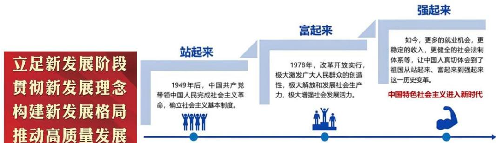

【解析】推动经济高质量发展：五位一体中最重要/最核心/最中心的领域是经济建设。以经济建设为中心，推进现代化建设，“一个中心两个基本点”是熟悉的内容。

# 1. 高质量发展：

（1）高质量发展是全面建设社会主义现代化国家的首要任务（地位），关键词“首要任务”。  
（2）标题使用了固定搭配，类似于言语理解的前后固定搭配、选词填空，都是固定模式，提及经济要想到高质量发展。  
(3) 易混项: 经济高速增长。当前, 我国经济由高速增长转向了高质量发展阶段, 过去是高速增长; 在课下自己刷题, 或在未来考试中看到表达的中心观点是经济围绕高速增长或以高速增长作为预期目标, 均是错误的观点。过去我国经济重在增长的速度, 表达为过去我国经济高速增长, 当前由高速增长转向了现今的高质量发展。以往注重的是量的增长, 现在侧重质的提高。  
2. 把握新发展阶段、立足新发展阶段、贯彻新发展理念、构建新发展格局、

推动高质量发展：固定搭配，言语理解题以大政方针的固定搭配挖空考查。

(1) 把握新发展阶段: 重点是 “新”, 类似于上节课学习的最大的说法, 即新时代。新时代要有新面貌、新政策、新名词。新发展阶段是中国共产党带领人民迎来从站起来、富起来到强起来历史性跨越的新阶段。从站起来、富起来到强起来分成三步走。

(1)站起来: 所谓的新中国的成立, 或实现了当家作主, 人民成为国家的主人。  
②富起来：最重要的是1978年党内召开的重要会议，即十一届三中全会，在会上提出改革开放。  
③强起来：中国特色社会主义进入新时代。2012年/党的十八大以来进入了新时代。毛泽东思想完成站起来；邓小平理论、“三个代表”重要思想、科学发展观是富起来的脉络，最关键的一步是邓小平理论；当前党内最新的指导思想是习近平新时代中国特色社会主义思想，对应强起来。  
(2) 新发展阶段是我国社会主义初级阶段历史进程中的一个重要阶段, 是全面建设社会主义现代化国家、向第二个百年奋斗目标进军的重要阶段: 第二个百年是新中国成立一百年, 一般没有建国一百年的说法, 而是新中国成立, 在修改党内党章、宪法时进行了说法的规范。

# （二）贯彻新发展理念

1. 新发展阶段必须坚定不移贯彻创新、协调、绿色、开放、共享的发展理念

（1）创新是引领发展的第一动力，创新发展注重的是解决发展动力问题。  
(2) 协调是持续健康发展的内在要求，协调发展注重的是解决发展不平衡问题。  
（3）绿色是永续发展的必要条件和人民对美好生活追求的重要体现，绿色发展注重的是解决人与自然和谐问题。  
(4) 开放是国家繁荣发展的必由之路, 开放发展注重的是解决发展内外联动问题。  
（5）共享是中国特色社会主义的本质要求，共享发展注重的是解决社会公平正义问题。

# 2. 以新发展理念引领高质量发展

高质量发展，是能够很好满足人民日益增长的美好生活需要的发展，是体现新发展理念的发展。更明确地说，高质量发展，就是从“有没有”转向“好不好”。

【解析】贯彻新发展理念（重点）：国考喜欢考查，并且考查过两道真题。在大街小巷、政策宣传栏中见过创新、协调、绿色、开放、共享，首要的是创新发展理念，不是位置在第一个就是首要，而是因为其内涵。

1. 新发展阶段必须坚定不移贯彻创新、协调、绿色、开放、共享的发展理念：

（1）创新是引领发展的第一动力，创新发展注重的是解决发展动力问题：提及动力可以想到创新，人才是第一资源，科技是第一生产力。新质生产力最核心的关键是科技创新，提及科技创新要想到所匹配的是现在新闻、领导人讲话中频繁听到的高频热门词汇，即新质生产力。要讲核心自主知识产权技术，我国知识产权非常重要，科技界顶流 DeepSeek 有很大概率在考试中出现，体现的是我国科技创新的能力，创新发展注重的是解决发展动力问题。  
（2）协调是持续健康发展的内在要求，协调发展注重的是解决发展不平衡问题：之所以会提出这样的发展理念，是因为不平衡、不协调。当前我国社会的主要矛盾转化为人民日益增长的美好生活需要和不平衡不充分的发展之间的矛盾，要解决不平衡的问题，尤其是城乡发展、区域发展不平衡。城乡和区域是两大典型的我国发展不平衡的问题，协调解决的是这样的问题。我国有粤港澳大湾区战略，粤港澳要形成大湾区，大湾区一体化发展，还有长三角、京津冀、长江经济带，主要是为了解决区域发展联动的问题。  
(3) 绿色是永续发展的必要条件和人民对美好生活追求的重要体现, 绿色发展注重的是解决人与自然和谐问题: 绿色对应生态文明建设的领域。环保、绿色低碳发展都围绕生态文明建设展开, 解决的是人与自然和谐的问题。  
(4) 开放是国家繁荣发展的必由之路, 开放发展注重的是解决发展内外联动问题:  
①有开放就有改革，改革开放是固定搭配，改革对内，开放对外，有改革就有开放，对应发展内外联动的问题。  
(2)改革与开放这两个名词中, 放在第一位的一定是自内向外, 内因和外因中

一定是内因作为事物发展的第一位动力,解决好自己发展的问题后在独立自主的立足点的基础上开展内外联动。如我国当前参与规模程度非常高的对外开放战略是“一带一路”, 我国作为“一带一路”战略的发起者和倡议者, 并不是所有国家都参与了合作计划, 但大多数国家参与, 不力求所有国家都认同此模式。

（5）共享是中国特色社会主义的本质要求，共享发展注重的是解决社会公平正义问题（易错、重点）：容易与第二点混淆。如我国打赢了脱贫攻坚战，解决了深度贫困地区的贫困问题，带领贫困山区人口脱贫致富，问体现的发展理念是什么。这句话表达的是农村贫困地区人口脱贫的问题，没有描述城市如何。如果以新型城镇化建设作为题干的中心表达论述，可以回答体现了协调发展的理念，但问的是贫困地区人口实现脱贫致富，结果是达成了共同富裕。

# 2. 例:

（1）我国近几年倡导发展新质生产力，国有企业、民营企业都要增强核心自主知识产权技术：体现的是创新的发展理念。  
（2）当前，我国常住人口城镇化率达到  $67\%$  ，城镇化进程步伐显著加快：体现的是协调的发展理念。  
(3) 我国积极推动绿色低碳发展，明确提出 2030 年碳排放达到峰值，在 2060 年前后碳排放达到中和：体现绿色的发展理念。  
（4）我国发起倡议的“一带一路”已有十多年之久，目前世界上已有150多个国家和地区签署了“一带一路”的合作框架协议，如中欧班列：体现开放的发展理念。  
（5）通过初次分配、再分配、第三次分配，不断缩小居民的收入差距水平，努力形成橄榄型（中间粗、两头细，中等收入者占大多数，高低收入者占少数，对立面是金字塔型收入分配结构）的收入分配格局：体现的是共享发展理念。  
(6) 长江流域作为我国第一大河的流域范围, 常见流域沿线省份有共同的长江经济带发展计划, 通过长江的辐射状, 多省联动发展经济, 体现协调发展理念, 重点是区域协调; 雄安新区在河北保定, 为京津冀联动, 西部大开发也是协调。  
3. 以新发展理念引领高质量发展：高质量发展，就是从“有没有”转向“好不好”。从没有到有实现的是量的突破，“好不好”实现的是质上的提高。

# （三）构建新发展格局

# 1. 新发展格局的内涵

构建以国内大循环为主体、国内国际双循环相互促进的新发展格局。

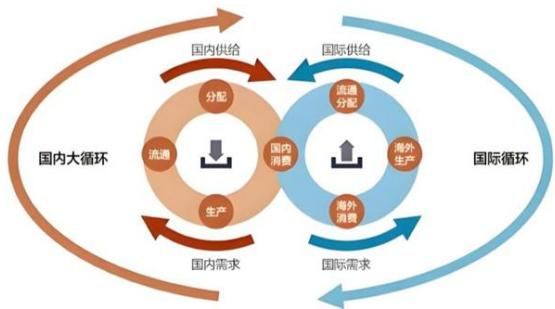

# 2. 大力推动构建新发展格局

需要着力推动实施扩大内需战略同深化供给侧结构性改革有机结合；着力发展实体经济，要坚持把发展经济的着力点放在实体经济上；着力加快科技自立自强，构建新发展格局最本质的特征是实现高水平的自立自强；着力推动产业链供应链优化升级。

# 【解析】

1. 新发展格局的内涵（重点）：构建以国内大循环为主体、国内国际双循环相互促进的新发展格局。

（1）在三年疫情结束后，从2013年到现在为止，听过《新闻联播》中的名词，如我国的超大规模市场优势；每个地方都看到过当地政府出台促进消费的政策，今年1月出现了3C数码产品的  $15\%$  国补，当地政府甚至还有补贴，为后疫情时代的总体感受。国内大循环、国际双循环一定是生产与消费的循环，有生产、消费才能循环，有生产、没消费是过剩产能，生产的东西没法卖，没有人买，就是过剩产能，不值钱。  
（2）第一位的是国内大循环，国内超大规模市场优势指的是人口政策带来的红利。消费能力强，2023年年初全世界都全部放开疫情后，全世界国家都重点关注中国游客到他国旅游的情况，很多国家甚至派出了国家官员、国家总理到当地的机场迎接我国游客的到来，尤其是东南亚的国家，因为来自于国内超大规模市场的优势。外商喜欢在中国投资办厂，中国市场占的份额多也是此原因。  
(3) 国内、国际循环一定是生产和消费，当前我国特别侧重的是刺激消费

需求，每个地方都提出了政策，如促进消费、提振消费，近些年政府积极发放消费券、购物券用于买房、买车、在商超购物。

（4）判断：以国际循环为主体（错误）。

# 2. 大力推动构建新发展格局：

# （1）内需：

(1)指的是消费和投资，有内需就有外需，外需是出口，内需+外需就是需求/需求侧。拉动我国经济增长的三驾马车中，占据经济增长的第一动力的是消费，相当于从第二个角度解释消费的重要性在哪。  
(2)判断：我国要实施扩大内需战略，比如积极推进对外贸易（错误），原因：积极推进对外贸易没有问题，但题目给的是扩大内需，出口对应外需，前后不搭配。  
③消费、投资、出口是需求侧，近些年常听到供给侧结构性改革，供给侧是需求的另外一端，需求和供给相对，供给实际是生产端，刺激消费需求是想解决一些过剩产能，从源头/生产端入手是从供给端解决问题，即供给侧结构性改革。

（2）着力发展实体经济，要坚持把发展经济的着力点放在实体经济上：与实体经济相对的是虚拟经济，不能表达为着力点放在虚拟经济上，因为如果虚拟经济成为着力点/经济的支柱会导致金融风险/泡沫，所以着重点不能是虚拟经济，一定是实体经济。实体经济基本上构成了一个国家重要的数据来源，即GDP/国内生产总值。

# 二、坚持和完善社会主义基本经济制度

社会主义基本经济制度：公有制为主体、多种所有制经济共同发展，按劳分配为主体、多种分配方式并存，社会主义市场经济体制等。

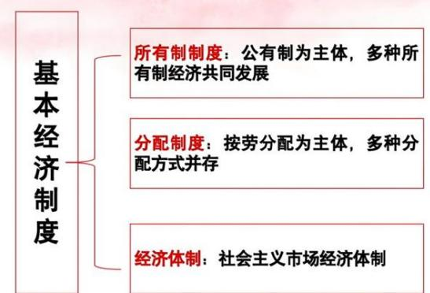

【解析】坚持和完善社会主义基本经济制度：前面提及“一个根本、三个基本”，对应政治制度的根本政治制度和基本政治制度，此处是经济领域的制度。由于教材年份、版本不同，可能只学过第一句，把后来的分配制度和经济体制纳入进来，并不陌生，都是学习过的内容。

# 1. 所有制制度：

（1）公有制为主体，多种所有制经济共同发展，属于马克思主义核心的观点立场，生产资料归谁所有是所有制制度。生产资料归资本家所有是资本主义社会，生产资料归人民所有，共同占有生产资料，解释的就是我国的公有制，即社会主义制度。所有制制度能区分资本主义和社会主义。  
（2）生产资料指的是劳动资料和劳动对象，二者共同构成的是生产资料，不可能有劳动者归谁所有的观点，劳动者是劳动力，即人，不会讨论工人归谁所有。如创业开服装加工厂，在服装加工厂中劳动资料指的是服装加工厂的厂房、设备、流水线、机器等，劳动对象是棉花、润滑油、机油、燃油、汽油等，劳动资料可以理解为生活中表达为固定资产的东西，劳动对象类似于生活中的原材料、耗材，二者加起来共同构成生产资料。  
2. 分配制度：按劳分配为主体，多种分配方式并存。公有制为主体决定按劳分配为主体。问按劳分配可能存在以下哪几种经济类型中，必须以公有制为前提。民营企业中不存在按劳分配的情况，为前提、内在关系。  
3. 社会主义市场经济体制：核心是市场经济。我国从1992年开始提出市场经济体制，年初邓小平同志来到南方几个省份视察工作（南方谈话），明确提出了社会主义市场经济。在同年下半年，党的十四大上明确提出要建设社会主义市场经济体制，也就是从这个时候真正实现了从计划经济到市场经济转变。

# 三、建设现代化经济体系

# （一）建设现代化产业体系

1. 加快建设以实体经济为支撑的现代化产业体系，关系我们在未来发展和国际竞争中赢得战略主动。  
2. 建设现代化产业体系需要：

(1) 巩固优势产业领先地位。保持优势产业的领先地位，是支撑我国国际

竞争力的基石。

（2）加快发展数字经济。数字化是新的时代特征，数字经济正在成为新一轮国际竞争的重点领域。  
（3）大力发展战略性新兴产业。战略性新兴产业具有先导性，代表新一轮科技革命和产业变革的方向，是引领国家未来产业发展的决定性力量。  
（4）构建优质高效的服务业新体系。现代服务业是现代化产业体系的重要支撑。

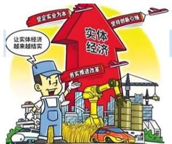

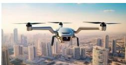

【解析】建设现代化产业体系：随着学习的知识点越来越多，见到的频率越来越高。市场经济现在不怎么会出现，现在不是说已经不是市场经济，而是现代化经济体系。现代化经济体系依然属于市场经济，只不过提及的现代化经济体系相当于市场经济的高级形态，依旧没有偏离范围，可以理解为升级版，但依然是市场经济，类似于我国正处于并长期处于社会主义初级阶段，没有脱离社会主义的范畴，只不过是高级形态、新的版本，类似于1.0、2.0、3.0。

1. 加快建设以实体经济为支撑的现代化产业体系，关系我们在未来发展和国际竞争中赢得战略主动：

（1）无论提及经济增长的着力点，还是现代化产业体系的支撑点，最终的落脚点都是实体经济，实体经济是一国经济的根本，也是构成一个国家国内生产总值，也就是GDP最主要的来源。  
（2）从经济学概念上来讲，实体经济指的是一个国家所生产的商品的价值总量，包括生产的实际商品和各种服务、劳务，如家政不生产实际的商品，但家政可以纳入到GDP的统计中，因为提供的是劳务、服务。听系统班课程是教育的服务、授课的方式，都是商品价值总量。  
2. 建设现代化产业体系需要：无需重点关注个别名词，但有几个名词在后续的时政文件会频繁出现。  
(1) 巩固优势产业领先地位：制造业范畴非常大，我国制造业规模位居世

界第一；今年政府工作报告提及6G通信技术，还有新能源汽车，为优势产业；数字经济的典型是人工智能，表面看上去很新，明确是哪个领域即可。

（2）加快发展数字经济。数字化是新的时代特征，数字经济正在成为新一轮国际竞争的重点领域。  
（3）大力发展战略性新兴产业：战略性新兴产业连续三年出现在了国务院工作报告中。现在我国已经有接近10个省份进行低空经济的试点，如利用无人运输机接送快递，未来非常期待低空经济可以获得更进一步的发展；有的地方开通短距离飞行的低空经济航线，如深圳到珠海。随着接下来的备考，会见到越来越多与新兴产业、低空经济相关的新闻。  
（4）构建优质高效的服务业新体系。现代服务业是现代化产业体系的重要支撑。

# （二）全面推进乡村振兴

1. 农业强国是社会主义现代化强国的根基。全面建设社会主义现代化国家，最艰巨最繁重的任务依然在农村，最广泛最深厚的基础依然在农村。  
2. 实施乡村振兴战略，农业农村现代化是总目标，坚持农业农村优先发展是总方针，产业兴旺、生态宜居、乡风文明、治理有效、生活富裕是总要求，建立健全城乡融合发展体制机制和政策体系是制度保障。要坚持乡村全面振兴，实现乡村产业振兴、人才振兴、文化振兴、生态振兴、组织振兴。

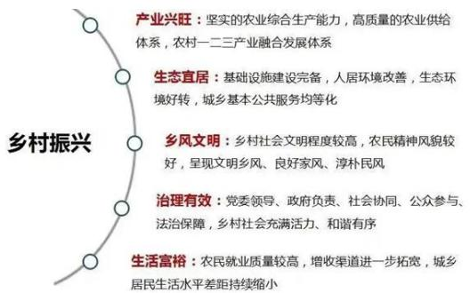

【解析】全面推进乡村振兴：乡村振兴已经不是新鲜的词汇，路过基层地区会看见大标语乡村振兴战略，不是策略、基本国策，而是战略。

1. 农业强国是社会主义现代化强国的根基：现在已经陆陆续续听到一系列的说法，尤其是农业强国、交通强国、航天强国、文化强国、体育强国等。农业是根基，因为农业属于第一产业，农业是国民经济的基础，工业是国民经济的支柱，

我国经济已经发展到现在还依然重视农业, 党中央国务院每年发布的一号文件依然围绕三农问题, 已经全面建成小康社会, 打赢脱贫攻坚战, 还要重视巩固脱贫成果, 防止返贫, 确保粮食安全等, 因为民以食为天。

2. 全面建设社会主义现代化国家，最艰巨最繁重的任务依然在农村，最广泛最深厚的基础依然在农村：从城乡范围上而言，类似于木桶法则，木桶的容积由最短的木板决定，农村发展不好严重制约我国现代化的进程，我国的现代化不能只是城镇地区的现代化。

# 3.实施乡村振兴战略：

（1）农业农村现代化是总目标：虽然常说三农是农民、农业、农村，但不会讲农民现代化，一定是农业农村现代化；国务院有重要的农业部，2018年后是农业农村部，可能报考农业农村部垂直管理的机关单位。  
(2) 坚持农业农村优先发展是总方针：不可能优先发展农民，没有此种搭配。  
（3）产业兴旺、生态宜居、乡风文明、治理有效、生活富裕是总要求（重点）：五个方面都占据总要求的地位，但没有必要全部掌握，掌握最根本的即可。生活富裕是农民生活富裕，生活富裕是总要求的根本，把握最重要的即可。  
（4）建立健全城乡融合发展体制机制和政策体系是制度保障。  
（5）要坚持乡村全面振兴，实现乡村产业振兴、人才振兴、文化振兴、生态振兴、组织振兴：

(1)不能笼统地讲乡村要振兴, 应是五大振兴, 记忆 “文人生产组”。  
②组织一定是基层党组织，村委会是基层自治组织，基层党组织为村党支部委员会，从广义上而言都是组织，但提及党组织要分清楚，党组织的一把手是书记。基层党建工作尤其重要，因为基层面对的是一线、人民、百姓，与一线接触最频繁。  
4. 乡村振兴已经听过多年，乡村振兴战略由习近平总书记在2017年的十九大报告上第一次提出。到现在为止，乡村振兴战略已经提出八年，过去已经完成了全面脱贫以及全面建成小康社会，过去几年常听巩固脱贫攻坚成果，防止已脱贫的地方发生规模性返贫，确保粮食安全，驻村第一书记等，遇到与三农相关的新闻可以重点关注。报名岗位是国考地市级及以下的岗位尤其要关注，乡村振兴

战略考查过，话题比较大，比较重要。

# （三）促进区域协调发展

1. 要深入实施区域协调发展战略、区域重大战略、主体功能区战略。

深入实施区域协调发展战略：推动西部大开发形成新格局，推动东北全面振兴取得新突破，促进中部地区加快崛起，鼓励东部地区加快推进现代化。

深入实施区域重大战略：推进京津冀协同发展、长江经济带发展、粤港澳大湾区建设、长三角一体化发展，推动黄河流域生态保护和高质量发展。高标准、高质量建设雄安新区，推动成渝地区双城经济圈建设。

深入实施主体功能区战略：逐步形成城市化地区、农产品主产区、生态功能区三大空间格局。

2. 推进以人为核心的新型城镇化，加快农业转移人口市民化。以城市群、都市圈为依托构建大中小城市协调发展格局，推进以县城为重要载体的城镇化建设。

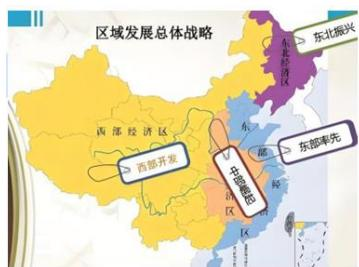

# 【解析】促进区域协调发展：

1. 要深入实施区域协调发展战略、区域重大战略、主体功能区战略。

（1）深入实施区域协调发展战略：没有具体考查过哪个省份是哪一个战略。西部属于经济欠发达地区，但西部富足的东西是东部最缺少的东西，如西电东送、西气东输；过去东北振兴工业，但现在是制造业，自新中国成立以后东北三省以工业为主要发展方向，现在更全面，为制造业；中部地区加快崛起，中部地区属于腹地的位置，不属于陆域的边疆，也不属于海疆所在的省份，尤其以长江中下游省份为主要加快崛起；东部地区加快推进现代化，我国GDP第一是广东，第二是江苏，第三是山东，第四是浙江，都来自于东部沿海经济较发达省份，这些省份的现代化进程已经走在了前列。

(2) 深入实施区域重大战略:

(1)推进京津冀协同发展：京津冀一体化，京津冀对应北京、天津、河北。北

京城市容量固定，但由于北京作为我国的政治经济文化中心，已经出现严重的大城市病，如交通难、上学难、看病难、买房难，所以进行京津冀协同发展，目的是疏解北京非首都功能。首都的功能一定在北京，不能转移，但可以转移科研力量，比如北京很多的科研院所、高校到河北保定的雄安新区开设新的校区、研究所，这样一来就疏解了北京的非首都功能。北京在南边新建大兴机场，有利于下一步的京津冀一体化，每个省份都受益，尤其是对河北是政策红利。雄安新区主要在河北保定，河北省文旅有旅游口号“这么近，那么美，周末到河北”。如京津冀协调发展，区域发展对各个省份各有各的利处。

②长江经济带发展：以长江中下游沿线各个省份为主。  
③粤港澳大湾区建设：

a. 分别对应广东、香港、澳门三个省级行政单位。粤港澳大湾区是当前我国经济最富活力的地方，广东有两个超一线城市广州和深圳，常说北上广深，广东占了两个；广东GDP常年全国第一；广东拥有全国建立时间最早（1980年），且到目前为止依然是全国数量最多的三个经济特区；深圳南边是香港，珠海南边是澳门，广东南边的雷州半岛往南隔着琼州海峡和我国的唯一自由贸易港，即海南岛隔海相望。  
b. 全世界一共有四大湾区，我国占据一个粤港澳大湾区，其余三个不需要背，美国有旧金山湾区和纽约湾区，日本有东京湾区。

(4)长三角一体化发展：长三角不同于地理意义的长三角，除了上海、江苏、浙江三个省份，即沪宁杭这三个省份，还有一个非沿海省份，即我国的内陆省份安徽，也受益。长三角一体化除了江浙沪，还包含安徽。

(5)推动黄河流域生态保护和高质量发展：黄河流域省份。  
(6) 高标准、高质量建设雄安新区（河北保定）。

（3）深入实施主体功能区战略：我国把主体功能区划分为三大空间格局，逐步形成城市化地区（城市）、农产品主产区（前两个记忆为城乡，城市化地区和农产品主产区作为城乡）、生态功能区（生态功能区中人类活动不能太频繁，否则会被破坏；还不能开垦农田，需要退耕还湖还林。生态功能区包含森林、湖泊、湿地。我国过去一年有非常大的成就，实施了关于生态环境治理、荒漠化治理的保护工程，我国面积第一大沙漠是塔克拉玛干沙漠，实施锁边工程，塔克拉

玛干沙漠是流动沙漠，曾经一年移动过100米，想通过锁边的方式，类似于把羊圈养起来，围一圈围栏，让羊跑不出来。塔克拉玛干锁边工程相当于让荒漠化的边缘固定，不再往东南方向移动。每年春季的三月到五月时，我国华北省份沙尘暴非常可怕，来自于流动沙漠的影响非常大）三大空间格局。

2. 推进以人为核心的新型城镇化，加快农业转移人口市民化。以城市群、都市圈为依托构建大中小城市协调发展格局，推进以县城为重要载体的城镇化建设。

（1）城镇化的核心一定是人，加快农业农村现代化不能发展人，但可以推进以人为核心的新型城镇化。判断：新型城镇化以农产品为核心（错误），原因：以人为本的核心城镇化，加快农业转移人口市民化，让农业户口的人员进城落户。以常住人口的城镇化率作为重要评判标准，截止到2024年底，当前我国常住人口城镇化率达到  $67\%$  ，非农户口和农业户口比例是2：1左右，  $67\%$  简单记忆为2/3。无论发展到何时，不可能让所有人口都变成城镇人口，否则没有人种粮食，无法保障粮食安全，属于什么户口都珍惜自己所属户口的性质，任何成分、职业都少不了。

（2）判断：推进以农村/乡镇为重要载体的城镇化建设（错误），原因：以县城为重要载体。

①城镇化要有城镇，县城有特殊身份，提及基层第一时间想到的是乡镇、农村。在未来的考试中，报名了县级某个单位，也算是基层工作经历，县就是基层，不是过高的级别。  
②推进以县城为重要载体的城镇化建设，直面城镇化最关键的一环。以县城为重要载体，县级市/不设区的市也算。如我国经济百强县的城镇化也重要，百强县强的是总量，不代表收入差距、城乡差距小。我国常年位于的百强县第一的是江苏昆山，特别有钱，虽然是县级单位，但经济好过全国很多地级市。

# 四、社会主义现代化建设的教育、科技、人才战略

（一）全面建设社会主义现代化国家的基础性、战略性支撑

教育、科技、人才是全面建设社会主义现代化国家的基础性、战略性支撑。

（二）加快建设教育强国

1. 建设教育强国是全面建成社会主义现代化强国的战略先导。  
2. 育人的根本在于立德。落实立德树人根本任务，必须着力解决好培养什么人、怎样培养人、为谁培养人的问题，这是教育的根本问题，也是建设教育强国的核心课题。  
3. 办好人民满意的教育。人民满意是发展教育的根本尺度。教育公平是社会公平的重要基础。

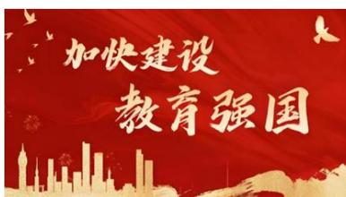

【解析】社会主义现代化建设的教育、科技、人才战略：经济的好离不开人才的培养。

1. 全面建设社会主义现代化国家的基础性、战略性支撑：有科教兴国、人才强国、创新驱动战略，但现在不怎么提及，依旧离不开教育、科技、人才这三个主体，被称为是国家的基础性、战略性支撑。  
2. 加快建设教育强国：

（1）建设教育强国是全面建成社会主义现代化强国的战略先导：随着时间不断进行会学习 XX 强国的搭配，如航天强国、体育强国、文化强国、教育强国、人才强国等。  
(2) 育人的根本在于立德。落实立德树人根本任务, 必须着力解决好培养什么人、怎样培养人、为谁培养人的问题, 这是教育的根本问题, 也是建设教育强国的核心课题: 记忆立德树人。每年 9 月 10 日教师节来临之际, 习近平总书记都会到学校看望师生进行讲话, 立德树人作为根本任务, 要培养德智体美劳全面发展的社会主义建设者和接班人。  
（3）办好人民满意的教育。人民满意是发展教育的根本尺度。教育公平是社会公平的重要基础：……工作的落脚点、出发点、根本目的是人民，或评判……的标准是人民。判断：党的执政水平评判标准在于人民（正确），原因：习近平总书记反复强调江山就是人民，人民就是江山。中国共产党领导人民打江山、守江山，守的是人民的心。

# （三）加快建设科技强国

1. 加快实现高水平科技自立自强，是推动高质量发展的必由之路。  
2. 打赢关键核心技术攻坚战。关键核心技术是国之重器，只有把最关键最核心的技术掌握在自己手中，才能从根本上保障国家经济安全、国防安全和其他安全。核心技术受制于人是我们最大的隐患。科技领域的改革最紧迫的是要破除体制机制障碍。发挥新型举国体制优势，开展科技攻关。  
3. 增强自主创新能力。基础研究是科技创新的源头。企业是科技创新的主体。

# （四）加快建设人才强国

1. 人才是实现民族振兴、赢得国际竞争主动的战略资源。  
2. 把各方面优秀人才集聚到党和国家事业中来。

坚持党对人才工作的全面领导是做好人才工作的根本保证。坚持党对人才工作的全面领导，是我国人才体系的鲜明政治优势，也是建设人才强国的“纲”和“本”。

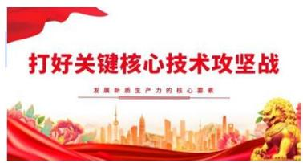

# 【解析】

1. 加快建设科技强国：有自信、能力、水平做评价。

（1）加快实现高水平科技自立自强，是推动高质量发展的必由之路：新质生产力的核心是科技创新，国与国竞争的综合国力的决定性因素是科技创新能力，经济地位的体现、军事力量的对比是综合国力的体现，但不是决定性因素，决定性因素是科技创新。科技是第一生产力，创新是第一动力，组成了新质生产力。经济是综合国力的表现，当前我国经济排名第二，是综合国力的表现/呈现。  
(2) 打赢关键核心技术攻坚战：不会考查理解，而是例子。

①当年华为被美国扣留相关高管人员，西方政客不见得我国在某些领域取得突破，我国的C919国产大飞机飞上蓝天，美国波音公司那么担心，都因为是关键核心技术，芯片非常关键。  
(2)举国体制是集中力量办大事，坚持全国一盘棋，如《哪吒》的镜头动画镜

头有 2000 个左右，不是由一家动画公司完成，而是分给了 140 多家动画公司；2018 年北京奥运会不是由一家演艺单位完成。举国体制是全国一盘棋，一方有难八方支援，2008 年汶川地震，无论来自哪里的优势资源都瞬间集结，其他国家都惊叹中国人怎么做到，往往评价为中国速度。

（3）增强自主创新能力。基础研究是科技创新的源头。企业是科技创新的主体：  
①涉及科技创新之源的问题，我国重点奖励基础研究，设置奖项，大到国家最高科技奖，小到国家奖学金，参与实习、实验室项目有国家补贴，原因是国家奖励扶持，很多企业也会奖励单位员工有重点创新，获得国家发明专利。  
②企业是科技创新的主体，提到科技创新想到的主语第一时间是国字号单位，如载人航天一定是国字号主导，但不是所有的科技创新都只有国字号主导，我国每年都进行不同程度的工业大摸底，发现很多企业的高精尖技术特别牛，如大疆、华为、顺丰无人机，很多科技创新来自于民营企业，不是民营科技、民营企业造不出伟大的发明。  
③企业不仅是科技创新的主体，更是最主要的市场主体，即市场单元。国有企业虽然厉害，但从数量上而言是私企/民营企业的数量远远多于国有企业。习近平总书记在民营企业座谈会也会做出重要总结，一个多月之前习近平总书记在北京召开民营企业座谈会，有很多熟悉的企业家受邀参加，如雷军、任正非，企业依旧可以进行关键核心技术创新。

# 2. 加快建设人才强国：

（1）人才是实现民族振兴、赢得国际竞争主动的战略资源：人才是第一资源，我国人才的现状在2022年党的二十大报告中，习近平总书记重要论述了我国研发人员总量位居世界第一，研发经费是第二（第一是美国）。  
(2) 坚持党对人才工作的全面领导是做好人才工作的根本保证: 党领导是各项工作坚持的第一位, 根本保证的原因是党领导一切。

# 第七节 建设社会主义文化强国

# 一、坚定文化自信

文化自信是更基础、更广泛、更深厚的自信，是一个国家、一个民族发展中

最基本、最深沉、最持久的力量。建设社会主义文化强国、推动社会主义文化繁荣兴盛，关键在于坚定中国特色社会主义文化自信。

中国特色社会主义文化发展道路是推动社会主义文化繁荣兴盛的唯一正确道路。

# 二、坚持马克思主义在意识形态领域指导地位的根本制度

马克思主义是我们立党立国、兴党兴国的根本指导思想。

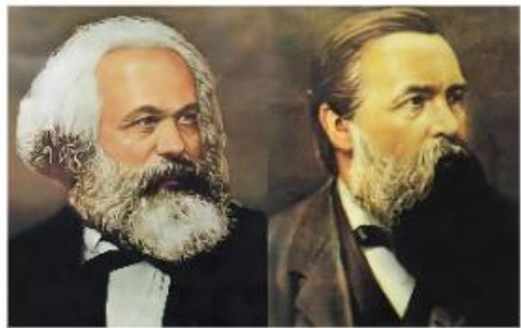

【解析】建设社会主义文化强国：五位一体中的第三个——文化方面。

# 1. 坚定文化自信：

(1) 四个自信中文化自信是最根本的自信, 四个自信说到底是文化中的自信, 来自中华文明连绵不断的持续性、统一性上, 文化自信彰显了民族的自信力。  
（2）文化自信是更基础、更广泛、更深厚的自信，是一个国家、一个民族发展中最基本、最深沉、最持久的力量：认可该说法即可，关键词“最”，属于精神上的力量、鼓舞，此处话曾经原封不动的考查过。

# 2. 坚持马克思主义在意识形态领域指导地位的根本制度：“意识形态领域”即在人们的思想、精神上作为根本指导的是马克思主义。

（1）习近平总书记进行高度的概括和评价“马克思主义是我们立党立国、兴党兴国的根本指导思想”。正因为在马克思主义的指导下，我国相继有了自己的指导思想，毛泽东思想、邓小平理论、“三个代表”重要思想、科学发展观、习近平新时代中国特色社会主义思想。中国共产党是马克思主义执政党，马克思主义一定是科学的，我们毫不动摇的。比如大家无论来自于哪个专业，大一大二都学习过公共课，学习马克思主义原理、思修、毛概、近代史纲要、习近平新时代中国特色社会主义思想概论等，若大家还有此教材可以再学习一下，可能会用到教材，我们讲解的内容都是来自于高校的教材。

（2）思想重点突出马克思。命题：马克思主义是由马克思创立的一门学说（错误），原因：整个马克思主义由马克思和恩格斯共同创立。  
（3）马克思主义在我国的开端：早期建党者、无产阶级革命家李大钊被称为“引来天火的第一人”。1921年建党之前，1915年之后我国开始新文化运动，当时有《青年杂志》，以陈独秀、李大钊为代表的无产阶级革命家，意识到马克思主义的先进性，对中国国难的拯救性，当时近代中国处于水深火热之中，陈独秀、李大钊的志向是要拯救中国人民于水深火热之中，李大钊的文章是《我的马克思主义观》。陈独秀、李大钊被称为“南陈北李”，是建党之初党内地位、威望最高的，最早在我国宣传介绍、系统传播马克思主义的是李大钊。课后可以关注党史电视剧《觉醒年代》。

# 三、以社会主义核心价值观引领文化建设

在当代中国，我们倡导“富强、民主、文明、和谐，自由、平等、公正、法治，爱国、敬业、诚信、友善”的社会主义核心价值观。

# 四、铸就社会主义文化新辉煌

在新的起点上继续推动文化繁荣、建设文化强国、建设中华民族现代文明，是新时代新的文化使命。

深刻把握中华文明的突出特性：连续性、创新性、统一性、包容性、和平性。

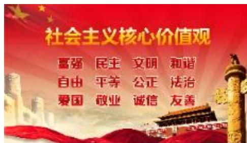

# 【解析】

1. 以社会主义核心价值观引领文化建设：在当代中国，我们倡导“富强、民主、文明、和谐，自由、平等、公正、法治、爱国、敬业、诚信、友善”的社会主义核心价值观。满大街小巷随处可见社会主义核心价值观，尤其是在公共场所、高铁站、机场、公交站牌。社会主义核心价值观是一种引领文化建设的意识形态，是一种思想，不是某一个人认同，而是需要全社会需要弘扬的事物，现实生活中，整天耳濡目染很容易一下子说出来。

(1) 国家层面：富强、民主、文明、和谐。  
(2) 社会达成价值观: 自由、平等、公正、法治。  
（3）公民从个人的角度：爱国、敬业、诚信、友善（易考查）。  
(4) 答疑: 公民和人民有区别, 凡是具备国籍的是公民, 公民包含人民在内。人民的对立面是敌人, 人民是好人, 敌人是坏人。比如正在狱中服刑的犯罪人员是公民, 不是人民, 属于敌人。公民是法律概念, 人民是政治概念。

2. 铸就社会主义文化新辉煌：深刻把握中华文明的突出特性，连续性、创新性、统一性、包容性、和平性（容易出现答非所问的表达）。

(1) 连续性: 我们的中华文化是全世界唯一绵延不断, 以国家作为形态出现的文化, 我国是历史上唯一一个从来没有断过, 绵延不断的文化, 属于官方说法, 出现该说法是正确的。  
(2) 创新性: 我们对于中华文化本着扬弃的原则, 传统文化不一定是对的,但中华优秀传统文化一定是正确的。我们对于中华文化、中华文明要取其精华去其糟粕, 在此基础上后续不断发展有很多创新性文化, 比如从共产党人精神谱系上来说, 长征精神、井冈山精神、西柏坡精神属于中国共产党人的创新性文化。  
（3）统一性：中华文化是基于中华民族的大融合，五十六个民族。秦朝是我国第一个大一统的封建社会的时期，是一种统一性。  
(4) 包容性: 兼收并蓄, 我们包括也吸纳西方的文化, 但不能直接照搬照抄, 保留传统的特色。  
（5）和平性：体现和平崛起的道路，对外和平信号的一种释放。和平性对立面是侵略性，有很多国家，从近代工业革命走对外扩张的道路，有些西方政客危言耸听、鼓吹“中国威胁论”，随着我国国际地位日益提高，目前是世界第二大经济体，有的国家对我国做文章，经常在新闻中听到比如“中国威胁论、中国下一步怎样”等。

# 第八节 以保障和改善民生为重点加强社会建设

一、让人民生活幸福是“国之大者”

要把增进民生福祉作为发展的根本目的。

二、不断提高人民生活品质

# （一）完善分配制度

收入分配是民生之源，分配制度是促进共同富裕的基础性制度。

# （二）实施就业优先战略

就业是最基本的民生。

# （三）健全社会保障体系

要全面深化社会保障制度改革，健全覆盖全民、统筹城乡、公平统一、安全规范、可持续的多层次社会保障体系。

完善基本养老保险全国统筹制度，加快发展多层次、多支柱养老保险体系，健全基本养老、基本医疗保险筹资和待遇调整机制，扩大年金制度覆盖范围，规范发展第三支柱养老保险，积极发展商业医疗保险，更好满足人民群众多样化需求。

# （四）推进健康中国建设

人民健康是社会文明进步的基础，是民族昌盛和国家富强的重要标志。

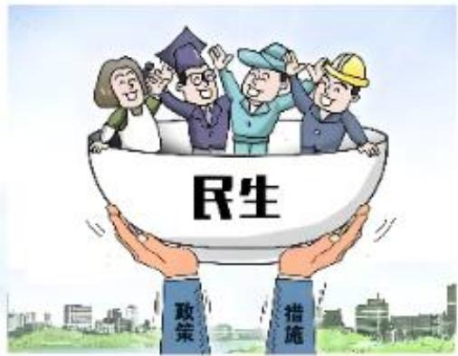

【解析】以保障和改善民生为重点加强社会建设：社会是宏观范畴，群体性的概念，社会的成员一定是人民，以民生为重点，即老百姓的衣食住行，包括每年两会期间，每次党代会时关注党和国家有哪些在民生方面的新的政策。

1. 让人民生活幸福是“国之大者”: 要把增进民生福祉作为发展的根本目的。发展是为了人民, 增进民生福祉。  
2. 不断提高人民生活品质：涉及民生。

（1）完善分配制度：收入分配是民生之源，分配制度是促进共同富裕的基础性制度。

(1)收入分配涉及老百姓的钱袋子的问题，收入分配是民生之源，老百姓的衣食住行样样需要钱，所以收入分配解决钱的问题。

②我国的分配制度是以按劳分配为主体，多种分配方式并存，分配制度是促进共同富裕的基础性制度。

（2）实施就业优先战略（重点）：

(1)二十大报告中, 习近平总书记提出 “就业是最基本的民生”。十九大报告中提出 “就业是最大的民生”, 两句话来自于两次重要会议, 不存在哪个过时、哪个不正确, 两种说法并行, 都正确。  
②就业形势严峻,很多人作为高校应届生,每年六月份各大媒体都有文章《史上最难就业季》,过去十多年高考的毕业生数量持续增加,因为第二年比第一年高,很多地方为了解决就业问题,比如进行人才引进,是比较宏观的话题;基层服务计划、西部计划、三支一扶等,国家通过不同的渠道疏解就业压力,每个地方的当地政府响应号召,提出针对本省、本市符合情况的人才引进。  
③目前就业仍然是每个地方亟待解决的问题，每年的6月，高校毕业生集中找工作季节，很多地方政府给出很多优惠措施，比如青年公寓，凡是本科生、研究生找工作，可以申请交通优惠卡，到某个地级市找工作可以免费住公寓、坐地铁；青年公寓、人才公寓等，可以免费住一个星期等，现在每个地方也意识到人才对于当地发展的必要性。说到发展，最吸引大家的是一个城市的政策红利、经济体量，大家关注一个地方发展的前景如何。

# （3）健全社会保障体系：

(1)要全面深化社会保障制度改革，健全覆盖全民、统筹城乡、公平统一、安全规范、可持续的多层次社会保障体系：自从2017年党的十九大提出后，到目前为止没有任何考试正面考查此句话。  
②补充：社会保障体系是固定搭配，社会保障体系的核心是什么要重点关注，也牵扯大家的就业工作。核心是社会保险，无论进入体制内工作、民营企业，强制缴纳社保，不包含公积金，仅限于社会保险，比如前一阵外卖公司官宣给自己的外卖员缴纳社会保险，以往没有缴纳保险，有的良心企业甚至缴纳公积金。核心是社会保险，生病、住院、养老、失业的保障，养老保险、失业保险、医疗保险比较典型的，社保不会让一个人特别的富，但是起到兜底保障性的作用。  
③社会福利：比如红十字会、福利院、养老院、社会救济；每年春节之前当地的领导班子去当地贫困居民中看望居民，送米面油给低保户家中；社会优抚，

比如军人依法优先，有军人专用检票口，有军人专用的座位，对于军警烈士的家属、烈士子女入学有优待。

（4）推进健康中国建设：党代会表达为人民健康是社会文明进步的基础，是民族昌盛和国家富强的重要标志。

(1)2025年两会国家卫健委相关发言人公布，截止到2024年中国人民的人均寿命提高到79岁，人均寿命每提高1岁，背后体现一个国家整体的健康状况，可以想到延迟退休、与养老金等问题，我国的人均寿命在逐渐延长，比如在春节假期期间会听到某某长辈高寿等。  
②重点提出银发经济，背后的原因是人口老龄化。截止到2024年底我国60岁以上的人口达到3.1亿，按照人口普查的数据是14亿人，60岁以上的人口超过  $20\%$  ，已经突破了全国总人口五分之一（重点），未来比例会持续更高，我们要重视银发经济。

# 三、推进社会治理现代化

必须坚持共建共治共享的社会治理理念。

坚持和发展新时代“枫桥经验”“浦江经验”，完善正确处理新形势下人民内部矛盾机制。

枫桥经验：20世纪60年代初，浙江省诸暨县（现诸暨市）枫桥镇干部群众创造的“发动和依靠群众，坚持矛盾不上交，就地解决，实现捕人少，治安好”的经验，为此，1963年毛泽东同志就曾亲笔批示“要各地仿效，经过试点，推广去做”。“小事不出村，大事不出镇，矛盾不上交，就地化解。”

浦江经验：2003年，时任浙江省委书记习近平到浦江下访接待群众，变“坐堂等访”为“主动下访”，开创了“省级领导下访接访”的先河，“浦江经验”由此形成。主要内容是“变群众上访为领导下访，深入基层，联系群众，真下真访民情，实心实意办事”

# 【解析】推进社会治理现代化：

1. 必须坚持共建共治共享的社会治理理念：

（1）共建（建设）共治（治理）共享（共同享有）可以用到申论的写作中，社会治理不是单一的、某个方面的，不是某个区域、局部的。

(2) 两个 “三共” 原则: 社会治理三共是共建共治共享; 外交工作的三共是共商共建共享。在社会治理中特色在于治, 对应社会治理; 外交工作的重点是 “商”, 与其他国家商洽, 对外开放领域秉持的原则是共商共建共享。  
2. 坚持和发展新时代“枫桥经验”“浦江经验”，完善正确处理新形势下人民内部矛盾机制：“枫桥经验”“浦江经验”均来自于习近平总书记曾任职省委书记的浙江省。

（1）枫桥经验：20世纪60年代初，浙江省诸暨县（现诸暨市）枫桥镇，“小事不出村，大事不出镇，矛盾不上交，就地化解”，比如电视剧中提到“信访工作”，有信访局、信访办的相关单位。枫桥经验有效地避免频繁上访，小事不出村，当地解决，当地党委、当地政府了解事情原委，是基层治理的先进经验，不会引发太大的社会恐慌，激发人民群众之间矛盾。是毛泽东同志亲自批示的经验。枫桥经验是上个世纪毛主席时期形成的。  
(2)浦江经验: 2003 年, 时任浙江省委书记的习近平到浦江下访接待群众,浦江经验主要内容是 “变群众上访为领导下访, 深入基层, 联系群众, 真下真访民情, 实心实意办事”, 若关注《人民日报》的公众号、学习强国比较多, 关于下基层, 党中央提出四下基层, 关于基层问题, 有基层减负等。基层是直面群众的位置, 真下真访民情, 实心实意办事, 比如走马观花式调研是典型的形式主义,虽然没有调查就没有发言权, 但个别地方的领导干部进行调研、宣传, 可能没有发现问题, 成果没有取得, 先宣传上路, 搞面子工程, 每个地方的当地市一级纪委部门通报过一些负面典型, 曾出现在申论材料中。  
(3) “枫桥经验”“浦江经验”是好的经验，可以进行积累，可以用在申论中。

# 第九节 建设社会主义生态文明

生态文明建设是关系中华民族永续发展的根本大计。

# 【解析】

1. 建设社会主义生态文明：五位一体中的最后一个。  
2. 生态文明建设是关系中华民族永续发展的根本大计/千年大计。提到永续发展很容易想到可持续发展战略。

# 一、坚持人与自然和谐共生

尊重自然、顺应自然、保护自然是全面建设社会主义现代化国家的内在要求。坚持绿水青山就是金山银山的理念。

2005年8月15日，时任浙江省委书记的习近平在浙江安吉县余村调研时，首次提出“绿水青山就是金山银山”的重要理念和科学论断。党的十八大以来，习近平总书记多次强调和阐述“绿水青山就是金山银山”的理念，指明了实现发展和保护协同共生的新路径。

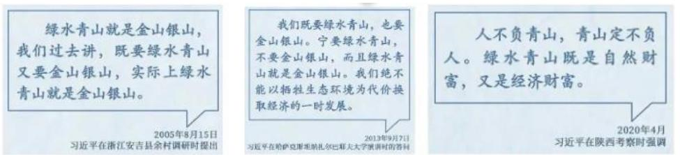

# 【解析】坚持人与自然和谐共生：

1. 尊重自然、顺应自然、保护自然是全面建设社会主义现代化国家的内在要求：尊重自然、顺应自然、保护自然是三个自然，是生态文明建设工作中需要做到的三个自然。  
2. 坚持绿水青山就是金山银山的理念：简称两山论，是习近平总书记所提出。

(1) 2005 年 8 月 15 日, 时任浙江省委书记的习近平同志在浙江安吉县余村调研时, 论述的原话是 “绿水青山就是金山银山, 我们过去讲, 既要绿水青山,又要金山银山, 实际上绿水青山就是金山银山”, 此后习近平总书记多次对于两山论的完善表达, 在生活中很容易见到, 尤其经过郊区、基层很多地方都印着 “绿水青山就是金山银山”。两山论提出的地点是余村, “绿水青山就是金山银山” 也称为余村经验。

(2) 8 月 15 日（公历）被定为全国生态日。

# 二、建设美丽中国

（一）加快形成绿色生产方式和生活方式

积极稳妥推进碳达峰碳中和。

（二）坚持山水林田湖草沙一体化保护和系统治理

推进自然保护地体系建设。构建以国家公园为主体、以自然保护区为基础、以各类自然公园为补充的自然保护地体系。

# 三、共谋全球生态文明建设之路

共建清洁美丽世界。坚持共同但有区别的责任原则。

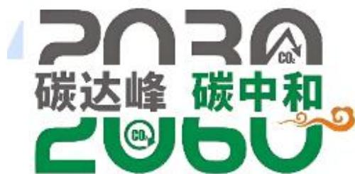

【解析】建设美丽中国：作为生态文明建设的最终目标，简单来说是“美丽”。

1. 加快形成绿色生产方式和生活方式：积极稳妥推进碳达峰碳中和，在当前我国低碳发展战略中是地位最高的提法。

(1) 碳达峰: 我们的人类活动, 呼出的气体、汽车尾气、工厂排放的废气,人类的活动每天一定会排出二氧化碳, 二氧化碳排出多了会加剧温室效应, 我国提出到 2030 年前后二氧化碳的排放量达到峰值, 即向外界排出二氧化碳达到最高。  
(2) 碳中和: 绿色植物的光合作用可以解决空气中的二氧化碳, 2060 年前后每天二氧化碳的排放量  $=$  二氧化碳的吸收量, 达到中和状态, 即净排放量为 0 ,即人类活动每天释放的二氧化碳都能被环境自我吸收, 不会多余存在, 在大气中落下。在所有党中央国务院制定的政策中, 唯一一个在本世纪中叶 (理解为 2050 年) 之后的目标, 说明此事非常难。  
2. 坚持山水林田湖草沙一体化保护和系统治理：重点关注国家公园，构建以国家公园为主体，其他的级别远不及国家公园级别高，比如5A级是我国最高级别的景区，在这些保护区中级别最高的一定是国家公园。我国目前设立第一批国家公园，数量有五个，三江源国家公园、大熊猫国家公园、东北虎豹国家公园、海南热带雨林国家公园、武夷山国家公园。

(1) 三江源国家公园: 位于青海, 被誉为中华水塔。  
(2) 大熊猫国家公园: 位于川、陕、甘。  
（3）东北虎豹国家公园：设置在黑龙江和吉林，比如东北发现的野生东北虎往往在黑龙江和吉林。

(4) 海南热带雨林国家公园: 位于海南。  
(5) 武夷山国家公园: 位于福建、江西。

# 第十节 全面建设社会主义现代化国家

# 一、从全面建成小康社会到全面建设社会主义现代化国家

党的十九届五中全会作出“全面建成小康社会胜利在望”的重要判断，将“全面建成小康社会”目标提升为“全面建设社会主义现代化国家”，确立全面建设社会主义现代化国家在“四个全面”战略布局中的引领地位。

# 二、在中华大地上全面建成小康社会

经过全党全国各族人民持续奋斗，我们实现了第一个百年奋斗目标，在中华大地上全面建成了小康社会，历史性地解决了绝对贫困问题，正在意气风发向着全面建成社会主义现代化强国的第二个百年奋斗目标迈进。

【解析】全面建设社会主义现代化国家：四个全面中第一个全面。全面建设社会主义现代化国家是当前眼下要走好的战略布局，并不是本世纪中叶建成强国，这是最终的目标。

1. 从全面建成小康社会到全面建设社会主义现代化国家：

（1）原来四个全面中第一个全面是“全面建成小康社会”，2012年党的十八报告中提出全面建成小康社会，在第一百年2020年完成之后将目标更新升级，将“全面建成小康社会”目标提升为“全面建设社会主义现代化国家”。  
(2) 四个全面战略布局中, 第一个全面是目标, 剩下的三个全面是三大战略举措, 为了实现目标的三大战略举措。

2. 在中华大地上全面建成小康社会：我们实现了第一个百年奋斗目标，在中华大地上全面建成小康社会，历史性地解决了绝对贫困问题。目前有相对贫困的说法，相对贫困会长期存在着，目前世界上没有任何一个国家能彻底解决相对贫困的问题，非常期待在未来可以有效缓解。

(1) 绝对贫困: 比如贫困线以下的生活, 2020 年打赢脱贫攻坚战, 9000 多万人口实现脱贫致富, 832 个贫困县全部脱贫摘帽。  
(2) 相对贫困会长期存在，一个国家存在贫富差距，大概率相对贫困会长期存在。

(3) 历史性地解决了绝对贫困问题, 比如我们已经没有在最低生活保障标准以下的情况。

# 第十一节 全面深化改革

# 一、改革开放是决定当代中国命运的关键一招

# （一）改革开放的重要性

习近平总书记强调：“改革开放是决定当代中国命运的关键一招，也是决定实现‘两个一百年’奋斗目标、实现中华民族伟大复兴的关键一招。”

# （二）全面深化改革的历史背景

1. 党的十一届三中全会是划时代的，开启了改革开放和社会主义现代化建设新时期。改革开放是党和人民大踏步赶上时代的重要法宝。  
2. 党的十八届三中全会也是划时代的，开启了新时代全面深化改革、系统整体设计推进改革新征程，开创了我国改革开放全新局面。此次会议通过了《中共中央关于全面深化改革若干重大问题的决定》，明确了全面深化改革的总目标是完善和发展中国特色社会主义制度，推进国家治理体系和治理能力现代化。

粉笔拓展：进一步全面深化改革的总目标

党的二十届三中全会审议通过了《中共中央关于进一步全面深化改革、推进中国式现代化的决定》，明确了进一步全面深化改革的总目标是：继续完善和发展中国特色社会主义制度，推进国家治理体系和治理能力现代化。到2035年，全面建成高水平社会主义市场经济体制，中国特色社会主义制度更加完善，基本实现国家治理体系和治理能力现代化，基本实现社会主义现代化，为到本世纪中叶全面建成社会主义现代化强国奠定坚实基础。

【解析】全面深化改革：改革是当前我国解决一切问题的关键。

1. 改革开放是决定当代中国命运的关键一招：

（1）改革开放的重要性：

①习近平总书记强调“改革开放是决定当代中国命运的关键一招，也是决定实现“两个一百年”奋斗目标、实现中华民族伟大复兴的关键一招”，关键词“关键一招”，改革开放是决定当代中国命运的关键一招，也是决定实现“两个一百年”奋斗目标、实现中华民族伟大复兴的关键一招，提到“关键一招”对应“改

革”。

②改革开放是决定当代中国命运的关键一招，也有说法“改革是关键一招”。目前两种说法同时存在，但此处最关键、最新的，更加符合习近平新时代中国特色社会主义思想的表达是“关键一招”。  
（2）全面深化改革的历史背景：1978年党的十一届三中全会是划时代的，开启了改革开放和社会主义现代化建设新时期。改革开放是党和人民大踏步赶上时代的重要法宝。  
(1)两大党史的重大会议, 第一大是遵义会议 (1935 年), 另一个是十一届三中全会, 都作为伟大的转折点。两次会议都确立了领导核心, 遵义会议确立毛泽东同志的领导核心地位; 十一届三中全会确立邓小平同志的领导核心地位。  
②2013 年党的十八届三中全会也是划时代的，提出让市场在资源配置中起到决定性作用，更好地发挥政府的作用，来自于党的十八届三中全会。  
2. 进一步全面深化改革的总目标：党的二十届三中全会（2024年召开，也是距今为止最近的一次党中央全会）：历次三中全会都聚焦改革的话题，往往也会形成惯例。党的二十届三中全会提出到2035年，全面建成高水平社会主义市场经济体制，用到的是完成时，时间是2035年。最大的目标、最宏观的目标、多数情况的目标，提到“2035年”匹配的是基本实现，少部分情况下“2035年，全面建成高水平社会主义市场经济体制”，特殊的地方往往容易在选项设置，需要重点关注。

# 二、全面深化改革开放要坚持正确方法论

加强顶层设计和摸着石头过河相结合。

统筹改革发展稳定。正确处理好改革发展稳定的关系，是我国改革开放的一条重要经验。改革是经济社会发展的强大动力，发展是解决一切经济社会问题的关键，稳定是改革发展的前提。要把改革的力度、发展的速度和社会可承受的程度统一起来，把改善人民生活作为正确处理改革发展稳定关系的结合点，在保持社会稳定中推进改革发展，通过改革发展促进社会稳定。

坚持重大改革于法有据。改革和法治如鸟之两翼、车之两轮，相辅相成、相伴而生。

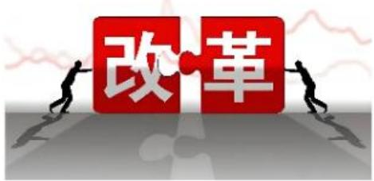

# 【解析】

1. 全面深化改革开放要坚持正确方法论：归根到底要处理三个名词、三个事物之间的关系。  
2. 改革是经济社会发展的强大动力，发展是解决一切经济社会问题的关键，稳定是改革发展的前提：改革、发展、稳定被称为我国现代化建设三个支点。

（1）三者内在关联：改革是动力；发展是关键、目的（没有过时的说法）；稳定是前提。  
(2) 两种说法: 改革是动力, 创新是动力。创新是引领发展的第一动力;改革是经济社会发展的强大动力, 两种说法都正确, 领导人都讲过, 只有这两种固定搭配。命题: 发展是当前解决所有问题的动力/发展是经济社会发展的强大动力 (错误), 原因: 属于搭配错误, 只能是改革、创新用于动力的表达。

# 三、将改革开放进行到底

继续扩大对外开放，构建更高水平开放型经济新体制。深化贸易投资领域体制机制改革，稳步扩大规则、规制、管理、标准等制度型开放。

推动货物贸易优化升级，创新服务贸易发展机制，发展数字贸易，加快建设贸易强国。推动共建“一带一路”高质量发展。

优化区域开放布局，实施自由贸易试验区提升战略，形成陆海内外联动、东西双向互济的开放格局。

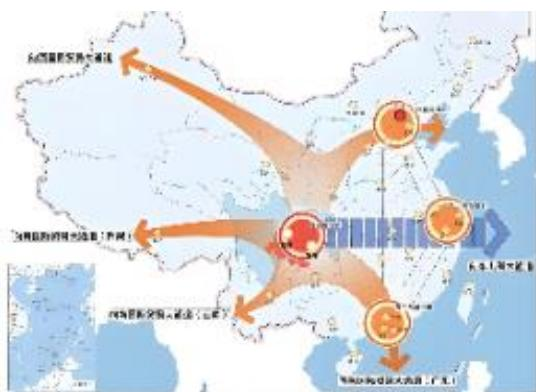

# 【解析】将改革开放进行到底：

1. 继续扩大对外开放，构建更高水平开放型经济新体制：习近平总书记经常在外交会议讲话中提出“中国对外开放的大门永远不会关上，只会越开越大”，疫情结束后这几年，我国以最快的速度恢复对外贸易、对外开放。构建更高水平开放型经济新体制。  
2. 推动共建“一带一路”高质量发展。  
3. 优化区域开放布局，实施自由贸易试验区提升战略，形成陆海内外联动、东西双向互济的开放格局（结合图片理解）：

（1）从国内来说是东西部结合，从整个国际来说是东西方。丝绸之路，从历史的角度来说，陆地上丝绸之路最远到达欧洲，从区域上来说是世界上东西双向互济。  
(2) 陆海内外联动, 我国先后设立的经济特区共七个, 深圳、珠海、厦门、汕头 (1980 年设立, 第一批); 海南 (1988 年设立, 第二批), 以上五个均位于沿海省份; 新疆喀什、霍尔果斯 (2013 年设立, 第三批), 不仅是东部沿海省份要对外开放, 西部内陆也要进行对外开放, 霍尔果斯已经到口岸、边疆, 这两个作为陆地上的经济特区, 是陆海内外联动, 打开我国的国门从陆上通往欧洲的必经之路, 从新疆过去。

# 第十二节 全面依法治国

# 一、统筹处理全面依法治国的重大关系

正确处理政治和法治的关系。

正确处理改革和法治的关系。

正确处理依法治国和以德治国的关系。

正确处理依法治国和依规治党的关系。

# 二、建设中国特色社会主义法治体系

中国特色社会主义法治体系是由法律规范体系、法治实施体系、法治监督体系、法治保障体系和党内法规体系构成的统一体。

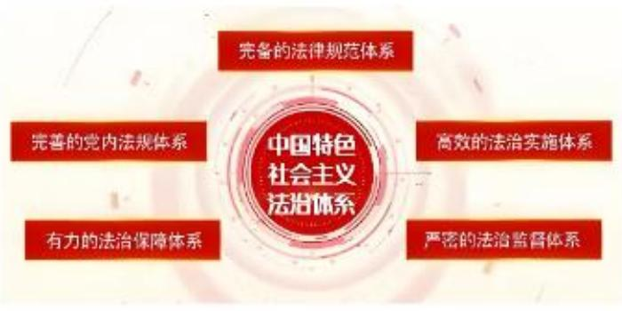

【解析】全面依法治国：三个全面中，此处是考查最少的，依法治国往往以法律常识的题目出现。全面依法治国把握原则问题，此处没有重点，关注PPT中黑色部分即可。

1. 统筹处理全面依法治国的重大关系：

（1）正确处理政治和法治的关系：法治是保障，政治是原则，比如坚持党的领导是我国最高的政治领导力量，最高的政治原则。  
（2）正确处理改革和法治的关系：为了全面建设社会主义国家，靠改革和法治，二者本身保障现代化进程。  
(3) 正确处理依法治国和以德治国的关系: 法治和道德, 法律是成文的道德; 道德是内心的法律, 靠法和道德进行。  
(4) 正确处理依法治国和依规治党的关系。

2. 建设中国特色社会主义法治体系：中国特色社会主义法治体系是由法律规范体系、法治实施体系、法治监督体系、法治保障体系和党内法规体系构成的统一体。中国特色社会主义法治体系包括完备的法律规范体系，高效的法治实施体系，严密的法治监督体系，有力的法治保障体系，完善的党内法规体系，之前只考查意义类的题目，以下属于中国特色社会主义法治体系说法正确的是，此处无需背诵，掌握固定搭配的问题，言语理解的选词填空选择政治性的固定搭配，本身是语文性的搭配。

# 三、加快建设法治中国

完善以宪法为核心的中国特色社会主义法律体系。坚持依法治国首先要坚持依宪治国，坚持依法执政首先要坚持依宪执政。坚持宪法确定的中国共产党领导地位不动摇，坚持宪法确定的人民民主专政的国体和人民代表大会制度的政体不

动摇。

全面推进科学立法、严格执法、公正司法、全民守法。

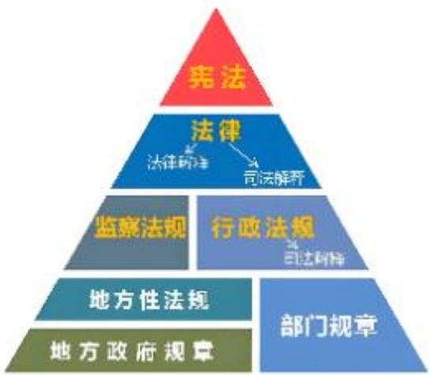

【解析】加快建设法治中国：

1. 完善以宪法为核心的中国特色社会主义法律体系：法律体系中最高地位的一定是宪法，宪法是国家的根本法，底下的所有法律均不能与宪法相抵触，若出现相抵触的法律条文，以宪法为准。比如弘扬宪法精神、关于宪法日的宣传，我国的宪法日是每年的12月4日。  
2. 全面推进科学立法、严格执法、公正司法、全民守法：

（1）全面依法治国的十六字方针，立法、执法、司法、守法均能体现动态、治理的过程，主体不同，我国的立法机关是全人大及其常委会，是我国的最高权力机关，同时作为立法机关；执法机关是各种公检法；司法机关是检察院、法院。  
（2）命题：全民守法是公民依法履行法律规律的公民基本义务（错误），原因：法的内容不仅有义务还有权利，全民守法是依法享有权利、依法履行义务，权利和义务是辩证统一的关系。

# 第十三节 全面从严治党

# 一、全面从严治党是新时代党的建设的鲜明主题

全面从严治党，核心是加强党的领导，基础在全面，关键在严，要害在治。

# 二、以政治建设为统领深入推进党的建设

1. 把党的政治建设摆在首位。党的政治建设是党的根本性建设。保证全党服从中央，维护党中央权威和集中统一领导，是党的政治建设的首要任务。

2. 思想建设是党的基础性建设。  
3. 贯彻新时代党的组织路线。党的基层组织是党在社会基层组织中的战斗堡垒，是党的全部工作和战斗力的基础，党支部是党的基础组织。  
4. 以严的基调强化正风肃纪。  
5. 把制度建设贯穿到党的各项建设之中。

# 三、坚定不移推进反腐败斗争

腐败是党长期执政面临的最大威胁。

# 【解析】全面从严治党：

1. 全面从严治党是新时代党的建设的鲜明主题：全面从严治党，核心是加强党的领导，基础在全面，关键在严，要害在治。  
2. 以政治建设为统领深入推进党的建设（重点）：提到党的建设，五大党建包括政治、思想、组织、作风、纪律，政治建设很重要。

（1）把党的政治建设摆在首位。党的政治建设是党的根本性建设：政治建设来自于2017年十九大正式第一次提出，在2017年十九大之前没有所谓的政治建设，只有思想、组织、作风、纪律，曾经首要的党建是思想建设。

(1)从毛泽东思想到 2017 年这个过程中, 首要党建一直是思想建设, 十九大习近平总书记作报告明确指出政治建设是首位的。  
②政治建设的首要任务是保证全党服从中央，维护党中央权威和集中统一领导，是党的政治建设的首要任务，党领导就是政治建设，坚持党对一切工作的绝对领导。

(2) 思想建设是党的基础性建设。  
(3) 贯彻新时代党的组织路线。党的基层组织是党在社会基层组织中的战斗堡垒，是党的全部工作和战斗力的基础，党支部是党的基础组织。3人以上成立党支部，包含3人。注意：没有特殊说明，以上、以下、以内均包含本数。  
3. 坚定不移推进反腐败斗争：腐败是党长期执政面临的最大威胁。最大的危险是脱离群众；最大的威胁是腐败。

# 四、建设长期执政的马克思主义政党

# （一）党的自我革命是跳出历史周期率的第二个答案

如何跳出历史周期率？毛泽东在延安的窑洞里给出了第一个答案，这就是“让人民来监督政府”。经过百年奋斗特别是党的十八大以来新的实践，党又给出了第二个答案，这就是自我革命。

勇于自我革命，是中国共产党区别于其他政党的显著标志，也是我们党最大的优势、最鲜明的品格。

# （二）时刻保持解决大党独有难题的清醒和坚定

全党同志务必不忘初心、牢记使命，务必谦虚谨慎、艰苦奋斗，务必敢于斗争、善于斗争。要始终不忘中国共产党是什么、要干什么这个根本问题，始终牢记“三个务必”，解决好大党独有难题，走好新的赶考之路。

粉笔拓展：“两个务必”

务必使同志们继续地保持谦虚、谨慎、不骄、不躁的作风，务必使同志们继续地保持艰苦奋斗的作风。

# （三）以伟大自我革命引领伟大社会革命

要以伟大自我革命引领伟大社会革命，以伟大社会革命促进伟大自我革命，确保党在新时代坚持和发展中国特色社会主义的历史进程中始终成为坚强领导核心。

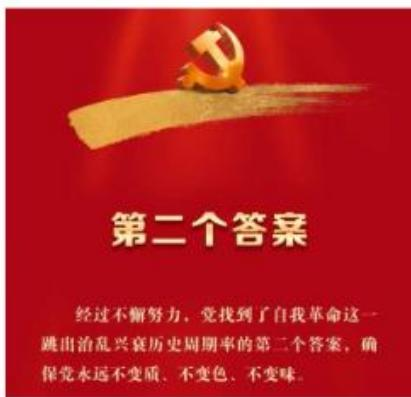

【解析】建设长期执政的马克思主义政党：

1. 党的自我革命是跳出历史周期率的第二个答案：自我革命。

(1) 如何跳出历史周期率: 所谓的历史周期率是一种政权兴替, 周而复始的周期律, 比如一个朝代、王权, 由低到高发展到顶峰, 必然走向衰败, 类似天下大事合久必分, 分久必合、  
（2）毛泽东在延安的窑洞里给出了第一个答案，这就是“让人民来监督政府”，也称为“民主”。

(3) 经过百年奋斗特别是党的十八大以来新的实践, 党又给出了第二个答案, 习近平总书记提出自我革命。

2. 时刻保持解决大党独有难题的清醒和坚定：

(1)2022年二十大报告提出三个务必：全党同志务必不忘初心、牢记使命，务必谦虚谨慎、艰苦奋斗（将“两个务必”合并在一起），务必敢于斗争、善于斗争。  
(2) 在 1949 年西柏坡会议/七届二中全会上提出 “两个务必”: 务必使同志们继续地保持谦虚、谨慎、不骄、不躁的作风, 务必使同志们继续地保持艰苦奋斗的作风。西柏坡位于河北省会石家庄。  
3. 以伟大自我革命引领伟大社会革命：要以伟大自我革命引领伟大社会革命，以伟大社会革命促进伟大自我革命（非重点，了解即可）。

# 第十四节 维护和塑造国家安全

# 一、坚持总体国家安全观

# （一）总体国家安全观的内涵

2014年4月15日，习近平总书记在中央国家安全委员会第一次会议上首次提出总体国家安全观，强调必须坚持总体国家安全观，走出一条中国特色国家安全道路。

总体国家安全观以人民安全为宗旨，以政治安全为根本，以经济安全为基础，以军事、文化、社会安全为保障，以促进国际安全为依托，必须坚持把政治安全放在首位。

# （二）总体国家安全观的关键是“总体”

总体国家安全观强调做好国家安全工作的系统思维和方法，加强科学统筹，做到统筹外部安全和内部安全、国土安全和国民安全、传统安全和非传统安全、自身安全和共同安全，统筹维护国家安全和塑造国家安全，着力解决国家安全工作不平衡不充分的问题。

【解析】维护和塑造国家安全：坚持总体国家安全观。

1.4月15日是国家安全教育日（简称为国安日）。2014年4月15日，习近平总书记在会议上首次提出总体国家安全观，后来设立4月15日为国家安全教

育日，首个国家安全教育日是2016年4月15日。2025年4月15日是第10个国家安全教育日。

2. 总体国家安全观以人民安全为宗旨（党的宗旨是为人民服务），以政治安全为根本（国家的主权完整、独立，中国的完整性不受威胁），以经济安全为基础（五位一体的中心建设是经济建设，因此是基础），以军事、文化、社会安全为保障，以促进国际安全为依托，必须坚持把政治安全放在首位。注意：若发现间谍行为，举报电话是12339。

# 二、开创新时代国家安全工作新局面

# （一）建设更高水平的平安中国

坚持安全第一、预防为主。建立大安全大应急框架，完善公共安全体系，推动公共安全治理模式由以事后处置为主向以事前预防为主转型。

# （二）提高防范化解重大风险能力

力争把风险化解在源头。既要高度警惕“黑天鹅”事件，也要防范“灰犀牛”事件。

黑天鹅事件，是指难以预测，但突然发生时会引起连锁反应、带来巨大负面影响的小概率事件。它存在于自然、经济、政治等各个领域，虽然属于偶然事件，但如果处理不好就会导致系统性风险，产生严重后果。

灰犀牛事件，是指明显的、高概率的却又被人忽视、最终有可能酿成大危机的事件。这类事件有发生变化或改变的可能，是可预测的。

# 【解析】开创新时代国家安全工作新局面：

1. 建设更高水平的平安中国：坚持安全第一、预防为主。建立大安全大应急框架，完善公共安全体系，推动公共安全治理模式由以事后处置为主向以事前预防为主转型。  
2. 提高防范化解重大风险能力：力争把风险化解在源头。既要高度警惕“黑天鹅”事件，也要防范“灰犀牛”事件。经济常识、政治理论中均考查过。

(1) 黑天鹅事件: 属于偶然的事件, 比如疫情、美国 911 事件是典型的黑天鹅事件, 极其偶然, 无法预测, 但凡发生就有严重的后果。  
(2) 灰犀牛事件: 属于常见的事件, 比如房地产泡沫属于灰犀牛事件。

# 第十五节 建设巩固国防和强大人民军队

# 一、实现党在新时代的强军目标

党在新时代的强军目标是建设一支听党指挥、能打胜仗、作风优良的人民军队，把人民军队建设成为世界一流军队。

# 二、全面推进国防和军队现代化的战略安排

国防和军队现代化新“三步走”战略安排：到2027年实现建军一百年奋斗目标，到2035年基本实现国防和军队现代化，到本世纪中叶全面建成世界一流军队。

# 三、加快推进国防和军队现代化

坚持党对人民军队的绝对领导。

军委主席负责制是坚持党对人民军队绝对领导的根本制度和根本实现形式。

按照军委管总、战区主战、军种主建的总原则改革领导指挥体制。

# 【解析】建设巩固国防和强大人民军队：

1. 实现党在新时代的强军目标：党在新时代的强军目标是建设一支听党指挥（灵魂）、能打胜仗（核心）、作风优良的人民军队，把人民军队建设成为世界一流军队。听党指挥是最重要的。  
2. 加快推进国防和军队现代化：坚持党对人民军队的绝对领导。  
3. 全面推进国防和军队现代化的战略安排：国防和军队现代化新“三步走”战略安排。

（1）到2027年实现建军一百年奋斗目标：建军一百周年，从1927年8月1日南昌起义。  
(2) 到 2035 年基本实现国防和军队现代化，到本世纪中叶全面建成世界一流军队（完成时对应中叶的说法）。

# 第十六节 坚持“一国两制”和推进祖国完全统一

# 一、全面准确理解和贯彻“一国两制”方针

维护国家主权、安全、发展利益是“一国两制”方针的最高原则，在这个前提下，香港、澳门保持原有的资本主义制度长期不变，享有高度自治权。

# 二、保持香港、澳门长期繁荣稳定

一如既往贯彻执行“一国两制”、“港人治港”、“澳人治澳”、高度自治的方针。落实“爱国者治港”“爱国者治澳”原则。

# 三、解决台湾问题、实现祖国完全统一

必须坚持一个中国原则和“九二共识”，坚决反对“台独”分裂行径，坚决反对外部势力干涉。“和平统一、一国两制”方针是实现两岸统一的最佳方式。

【解析】坚持“一国两制”和推进祖国完全统一：属于思想、立场的问题，过去这些年从来不考。从时政角度说比较关键的，2024年是澳门回归的25周年，3个月之前新一任的澳门特首上任，现任的澳门特首是岑浩辉。

1. 全面准确理解和贯彻“一国两制”方针：维护国家主权、安全、发展利益是“一国两制”方针的最高原则，在这个前提下，香港、澳门保持原有的资本主义制度长期不变，享有高度自治权。  
2. 保持香港、澳门长期繁荣稳定：一如既往贯彻执行“一国两制”“港人治港”“澳人治澳”、高度自治的方针。落实“爱国者治港”“爱国者治澳”原则（新增）。  
3. 解决台湾问题、实现祖国完全统一：必须坚持一个中国原则和“九二共识”（1992年大陆与台湾双方以非官方的形式达成一致，即只有一个中国原则），坚决反对“台独”分裂行径，坚决反对外部势力干涉。“和平统一、一国两制”方针是实现两岸统一的最佳方式。

# 第十七节 中国特色大国外交和推动构建人类命运共同体

# 一、全面推进中国特色大国外交

# （一）坚持走和平发展道路

坚持走和平发展道路，是我们党根据时代发展潮流和我国根本利益作出的战略抉择，是新时代中国外交的基本原则。

# （二）推动构建新型国际关系

构建新型国际关系，就是要秉持相互尊重、公平正义、合作共赢原则，走出一条对话而不对抗、结伴而不结盟的国与国交往新路；中国坚持在和平共处五项原则基础上同各国发展友好合作，深化拓展平等、开放、合作的全球伙伴关系。

# 二、推动构建人类命运共同体

# （一）构建人类命运共同体

核心就是“建设持久和平、普遍安全、共同繁荣、开放包容、清洁美丽的世界”。

# （二）积极参与全球治理体系改革和建设

秉持共商共建共享原则。

# （三）高质量共建“一带一路”

“一带一路”即“丝绸之路经济带”和“21世纪海上丝绸之路”。

【解析】中国特色大国外交和推动构建人类命运共同体：

1. 全面推进中国特色大国外交：

（1）坚持走和平发展道路：外交的基本原则是坚持走和平发展道路。  
（2）推动构建新型国际关系：构建新型国际关系，就是要秉持相互尊重、公平正义、合作共赢原则（核心），合作共赢是最终要达到的局面/目的。

2. 推动构建人类命运共同体：处于习近平外交思想的核心。

（1）构建人类命运共同体：核心就是“建设持久和平、普遍安全、共同繁荣、开放包容、清洁美丽的世界”。  
（2）积极参与全球治理体系改革和建设：秉持共商共建共享原则。关键词“共商”。社会治理的“三共”是共治共建共享。  
(3) 高质量共建 “一带一路”:

(1)2013 年习近平总书记出访中亚、东南亚国家分别提出建设 “丝绸之路经济带” 和 “21 世纪海上丝绸之路” (注意: 缺少 “21 世纪” 是错误的)。“一带一路” 是国际合作平台, 由我国发起的区域性经济合作倡议, 但是 “一带一路” 不是组织、峰会、会议等。  
②全世界 150 多个国家已经参与 “一带一路”, 我国的影响比较大。截止到现在与我国建交国家数量是 183 个, 全世界的主权国家有 197 个。上一个恢复建交的是太平洋的国家瑙鲁。

  
【注意】政治中的“五位一体”+四个全面+其他。

# 【实战演练】

1.（2022国考）进入新发展阶段，是中华民族伟大复兴历史进程的大跨越，以下关于新发展阶段的理解，正确的有几项？

①新发展阶段是中国共产党带领人民迎来从站起来、富起来到强起来历史性跨越的新阶段  
②新发展阶段是基本实现社会主义现代化、全面建成小康社会的发展阶段  
(3)新发展阶段是超越社会主义初级阶段、迈入社会主义更高阶段的发展阶段  
(4)新发展阶段是实现第一个百年奋斗目标,向着第二个百年奋斗目标迈进的发展阶段

A. 1

B. 2

C. 3

D. 4

【解析】1. ②新发展阶段是站在实现第一个百年奋斗目标的基础上，向第二个百年奋斗目标迈进的阶段，已经完成全面小康，2035年基本实现社会主义现代化，从时间上2021年-本世纪中叶是新发展阶段。新发展阶段是我们全面建设社会主义现代化国家，向第二个百年奋斗目标迈进的阶段，排除。

(3)不是超越社会主义初级阶段，我国正处于并且长期处于社会主义初级阶段，我国没有认为自己是发达国家，排除。  
(4)新发展阶段是实现第一个百年奋斗目标, 向着第二个百年奋斗目标迈进的发展阶段, 时间是 2021 年-本世纪中叶, 当选。【选 B】

2. （2023 湖北选调）如何跳出历史周期率？党始终在思索、一直在探索。毛泽东同志在延安的窑洞里给出了第一个答案，这就是“让人民来监督政府”；党的二十大报告指出，经过不懈努力，党找到了这一跳出治乱兴衰历史周期率的第二个答案。

A. 自我净化

B. 自我革新

C. 自我革命

D. 自我完善

【解析】2.【选C】

3.（2022山西）习近平总书记以统揽全局的战略思维和宽广的世界眼光深刻把握国家安全问题，提出了总体国家安全观。下列相关表述正确的有几项？

①总体国家安全观是我党历史上第一个被确立为国家安全工作指导思想的重大战略思想  
②《中华人民共和国国家安全法》规定，每年5月15日为全民国家安全教育日  
(3)总体国家安全观主要聚焦于如何解决好大国发展进程中面临的共性安全问题  
(4)国家安全机关举报受理电话为 12339

A. 1

B. 2

C. 3

D. 4

【解析】3. ①总体国家安全观是我党历史上第一个被确立为国家安全工作指

导思想的重大战略思想，该评价没有任何问题，之前没有对国家安全工作上升到这样高度，现在将国家安全工作提升到国家战略的层面。以往在新中国成立、改革开放的时候国家安全也很重要，但是没有提升到战略思想的层面。若考试中不知道是不是第一个，默认为是第一个，当选。

(2)《中华人民共和国国家安全法》规定，每年4月15日为全民国家安全教育日，排除。  
(3)属于片面表达, 马哲中提出辩证的观点, 即全面, 既然有共性的问题, 也有个性的问题, 正确的表达是 “总体国家安全观主要聚焦于如何解决好大国发展进程中面临的共性安全问题, 在实现中华民族伟大复兴的关键阶段面临的特殊安全问题”, 比如最近这些年有中美贸易战, 无论是欧洲国家、还是美国对我国进行芯片封锁、特殊产品对我国禁止出口, 均是影响我国在伟大复兴阶段的特殊安全问题, 有共性也会有个性, 排除。【选 B】

# 【答案汇总】

1-3:BCB

遇见不一样的自己

Be your better self