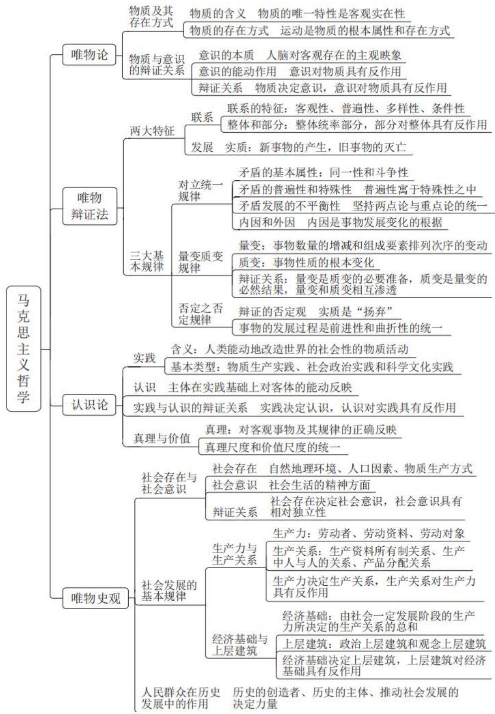

# 精讲精练-政治理论 3

(讲义+笔记)

主讲教师：刘鸿

授课时间：2025.03.18

# 精讲精练-政治理论3（讲义）

# 第二章 马克思主义哲学

# 政治理论 精讲精练3

# 学习任务：

1.课程内容：马克思主义哲学  
2.对应讲义：第  $30\sim 40$  页  
3.重点内容：

（1）物质和意识的辩证关系  
（2）唯物辩证法的两大特征  
（3）对立统一规律  
（4）实践与认识的辩证关系  
（5）社会发展的基本规律  
（6）人民群众在历史发展中的作用

# 考点一 唯物论

# 第一节 物质及其存在方式

# 一、物质的含义

列宁对物质的定义：“物质是标志客观实在的哲学范畴，这种客观实在是人通过感觉感知的，它不依赖于我们的感觉而存在，为我们的感觉所复写、摄影、反映。”

物质的唯一特性是客观实在性。

# 二、物质的存在方式

# 1. 运动的含义

运动是物质固有的根本属性和存在方式，包括宇宙间的一切变化和过程。

# 2. 物质与运动的关系

(1) 物质是运动的物质, 物质世界的运动是无条件的、永恒的、绝对的。  
(2) 运动是物质的运动, 物质是运动的承担者, 是运动的主体。

# 3. 绝对运动与相对静止

# （1）相对静止

相对静止是标志物质运动在一定条件下、一定范围内处于暂时稳定和平衡状态的哲学范畴。静止是运动的一种特殊状态，是一种不显著的运动。

静止是有条件的、暂时的、相对的。

(2) 绝对运动和相对静止的关系

世界上的事物都是绝对运动和相对静止的统一，是动中有静，静中有动。

# 第二节 物质与意识的辩证关系

# 一、意识的本质

意识的本质是人脑对客观存在的主观映象。

1. 从生理基础上说，意识是人脑的机能，人脑是意识活动的物质器官。  
2. 从内容和形式来说，意识是客观存在的主观映象。即意识在内容上是客观的，在形式上是主观的，是客观内容和主观形式的统一。

# 二、意识的能动作用

意识对物质具有反作用，这种反作用就是意识的能动作用。

# 三、物质与意识的辩证关系

# 1. 物质和意识的辩证关系原理

物质决定意识，意识是客观存在在人脑中的映象；同时，意识又具有能动作用，正确的意识对客观事物的发展具有促进作用，错误的意识对事物的发展起阻碍作用。

# 2. 方法论

（1）一切从实际出发。  
（2）重视发挥主观能动性。

实践是正确发挥人的主观能动性的根本途径；尊重客观规律是正确发挥意识能动作用的前提；正确发挥意识的能动作用，还需要依赖一定的物质条件和物质手段。

# 考点二 唯物辩证法

# 第一节 唯物辩证法的两大特征

# 一、事物的普遍联系

联系是指事物之间以及事物内部诸要素之间相互影响、相互制约和相互作用的关系。

# 1. 联系的特征

（1）客观性：事物的联系是事物本身所固有的，不是主观臆想的。客观世界的联系不以人的意志为转移，不可以被创造，也不可以被消灭。  
(2) 普遍性: 世界上一切事物都处在与其他事物的相互联系之中, 整个世界是相互联系的统一整体。  
（3）多样性：事物的联系形式是多样的。  
（4）条件性：联系的形成需要一定的条件。

# 2. 整体和部分的关系

（1）整体与部分相互依赖，整体居于主导地位，统率着部分。  
(2) 部分影响整体，对整体具有反作用。  
（3）关键部分对整体起决定作用。  
（4）整体具有部分没有的新功能。当各部分以合理、有序的结构形成整体时，整体功能就会大于各部分功能之和。

# 二、事物的变化发展

发展是揭示事物运动、变化的整体趋势和方向性的范畴，是具有前进性质的运动，是事物由低级向高级、由简单向复杂、由无序向有序的上升运动。

发展的实质是新事物的产生和旧事物的灭亡。

新事物是指合乎历史前进方向、具有远大前途的东西；旧事物是指丧失历史必然性、日趋灭亡的东西。区分新旧事物的标志是是否同事物发展的必然趋势相符合。

# 第二节 唯物辩证法的三大基本规律

唯物辩证法的基本规律包括：对立统一规律、量变质变规律、否定之否定规律。

# 一、对立统一规律（揭示了事物发展的源泉和动力）

对立统一规律是唯物辩证法的实质和核心，是唯物辩证法的根本规律。矛盾分析法是认识世界和改造世界的根本方法。

# 1. 矛盾的基本属性

矛盾具有两个基本属性，即矛盾的斗争性和矛盾的同一性。

(1) 矛盾的斗争性是指矛盾着的对立面之间相互排斥、相互分离的性质和趋势。  
(2) 矛盾的同一性是指矛盾双方相互吸引、相互贯通的性质和趋势。它有两个方面的含义:

(1) 矛盾着的对立面相互依存，互为存在的前提，并共处于一个统一体中。  
② 矛盾着的对立面之间相互贯通，矛盾双方相互渗透、相互包含，在一定条件下可以相互转化。

# 2. 矛盾的普遍性和特殊性

矛盾的普遍性与特殊性辩证关系的原理，是矛盾问题的精髓。

# （1）矛盾的普遍性

矛盾的普遍性是指矛盾存在于一切事物中，存在于一切事物发展过程的始终，即矛盾无处不在、无时不有。

矛盾的普遍性原理要求我们敢于承认矛盾，坚持用矛盾分析法全面地看待一切事物。

# （2）矛盾的特殊性

矛盾的特殊性是指具体事物所包含的矛盾以及每一矛盾的各个方面在发展的不同阶段都各有其特点。

矛盾的特殊性要求我们在分析事物时要做到具体问题具体分析，反对“一刀切”。

# (3) 矛盾的普遍性和特殊性的辩证关系

(1) 矛盾的普遍性即矛盾的共性, 矛盾的特殊性即矛盾的个性。  
②矛盾的共性是无条件的、绝对的，矛盾的个性是有条件的、相对的。  
(3) 矛盾的普遍性寓于特殊性之中, 并通过特殊性表现出来。

# 3. 矛盾发展的不平衡性

# (1) 主要矛盾和次要矛盾

(1)主要矛盾：处于支配地位、对事物发展起决定作用的矛盾。  
②次要矛盾：处于从属地位、对事物发展不起决定作用的矛盾。

# (2) 矛盾的主要方面和次要方面

(1) 矛盾的主要方面: 矛盾中居于支配地位、起着主导作用的一方。  
②矛盾的次要方面：矛盾中处于被支配地位的一方。

# （3）方法论

坚持两点论，反对一点论；坚持重点论，反对均衡论，即坚持两点论与重点论的统一。

# 4. 事物发展的内因和外因

内因就是事物的内部矛盾。内因是事物发展变化的根据，是第一位的原因。

外因是一事物与他事物的相互影响和相互作用，即外部矛盾。外因是事物发展变化的条件，是第二位的原因；外因通过内因起作用。

# 二、量变质变规律（揭示了事物发展的形式和状态）

# 1. 量变和质变

量变是事物数量的增减和组成要素排列次序的变动。

质变是事物性质的根本变化。

事物的变化是否超出度的范围是区分量变和质变的根本标志。

# 2. 量变与质变的辩证关系

（1）量变是质变的必要准备。  
(2) 质变是量变的必然结果, 量变达到一定程度必然引起质变。  
(3) 量变和质变相互渗透。一方面，在总的量变过程中包含部分质变；另一方面，在质变过程中也有旧质在量上的收缩和新质在量上的扩张。

# 三、否定之否定规律（揭示了事物发展的方向和道路）

# 1. 辩证的否定观

（1）辩证的否定是事物自我的否定。  
（2）辩证的否定是事物联系和发展的环节。

（3）辩证否定的实质是“扬弃”，“扬弃”就是既克服又保留。

2. 事物的发展过程是前进性和曲折性的统一

（1）否定之否定规律的基本内容：事物的发展经过两次辩证的否定，由肯定阶段到否定阶段，再到否定之否定阶段，从而使事物的发展表现为螺旋式上升和波浪式前进的过程。  
（2）否定之否定规律表明：事物发展的总方向、总趋势是前进的、上升的，事物发展的具体道路又是曲折的、迂回的，即事物的发展过程是前进性和曲折性的统一。

# 考点三 认识论

# 一、实践

1. 含义

实践是人类能动地改造世界的社会性的物质活动。

2.基本形式

实践的形式分为三种基本类型：物质生产实践、社会政治实践和科学文化实践。

二、认识

认识是主体在实践基础上对客体的能动反映。

# 三、实践与认识的辩证关系

1. 实践决定认识

（1）实践是认识的来源。  
（2）实践是认识发展的动力。  
（3）实践是认识的目的和归宿。  
（4）实践是检验认识是否具有真理性的唯一标准。

2. 认识对实践具有反作用

认识对实践的反作用具有双重性：正确的认识对实践起积极的促进作用；错误的认识则对实践起消极的阻碍作用，甚至导致实践的失败。

# 四、真理与价值

# 1. 真理的含义与属性

（1）含义：真理是标志主观与客观相符合的哲学范畴，是人们对客观事物及其规律的正确反映。  
（2）属性：客观性是真理的本质属性。

# 2. 真理和谬误

真理和谬误既对立又统一。

(1) 真理就是真理，谬误就是谬误，二者有本质区别，不能混淆。  
（2）真理与谬误互相依存，并在一定条件下可以相互转化。

# 3. 真理与价值

人们的实践活动总是受着真理尺度和价值尺度的制约，任何成功的实践都是真理尺度和价值尺度的统一。

真理尺度是指在实践中人们必须遵循正确反映客观事物本质和规律的真理。只有按照真理办事，才能在实践中取得成功。

价值尺度是指在实践中人们都是按照自己的尺度和需要去认识世界和改造世界。这一尺度体现了人的活动的目的性。价值尺度必须以真理为前提。

# 考点四 唯物史观

# 一、社会存在与社会意识

# （一）社会存在

社会存在也称社会物质生活条件，是指社会生活的物质方面，主要包括自然地理环境、人口因素和物质生产方式等。其中，物质生产方式是社会存在和发展的基础及决定力量。

# （二）社会意识

社会意识是社会生活的精神方面，是社会存在的反映。

根据社会意识与经济基础的关系，可将社会意识形态分为意识形态和非意识形态。

# （三）社会存在和社会意识的辩证关系

1. 社会存在决定社会意识  
2. 社会意识具有相对独立性

（1）社会意识与社会存在发展具有不完全同步性和不平衡性。  
（2）社会意识内部各种形式之间存在相互影响且各自具有历史继承性。  
（3）社会意识对社会存在具有能动的反作用，这是社会意识相对独立性的突出表现。

先进的社会意识对社会存在的发展起积极的促进作用；落后、反动的社会意识对社会存在的发展起消极的阻碍作用。

# 二、社会发展的基本规律

生产力与生产关系、经济基础与上层建筑之间的矛盾，是人类社会的基本矛盾。

# （一）生产力与生产关系

1. 生产力

（1）含义

生产力是人类在生产实践中形成的改造和影响自然以使其适合社会需要的物质力量。生产力表现的是人与自然的关系。生产力是人类社会的最终决定力量，衡量社会进步最高、最根本的标准是社会生产力发展水平。

(2) 基本要素

生产力的基本要素包括劳动者、劳动资料、劳动对象。

(1)劳动者: 劳动者是生产力中最活跃的要素。  
②劳动资料：也称劳动手段，其中最重要的是生产工具。生产工具是区分社会经济时代的客观依据（物质标志）。  
(3)劳动对象：劳动对象和劳动资料合称生产资料。

科学技术是生产力的重要因素。

2. 生产关系

生产关系是人们在物质生产过程中形成的不以人的意志为转移的社会关系。

生产关系包括生产资料所有制关系、生产中人与人的关系、产品分配关系。在生产关系中，生产资料所有制关系是最基本的、具有决定意义的方面，它是区

分不同生产方式、判定社会经济结构性质的客观依据。

3. 生产力和生产关系的辩证关系及其矛盾运动

（1）生产力决定生产关系。  
(2) 生产关系对生产力具有反作用。

# （二）经济基础与上层建筑

# 1.经济基础

经济基础是指由社会一定发展阶段的生产力所决定的生产关系的总和。

# 2. 上层建筑

上层建筑是指建立在一定经济基础之上的意识形态以及与之相适应的制度、组织和设施。

上层建筑系统可分为两个基本部分，即政治上层建筑和观念上层建筑。在整个上层建筑中，政治上层建筑居于主导地位，国家政权是政治上层建筑的核心。

（1）政治上层建筑包括政治法律制度，以及国家政权机构、政党、军队、警察、法庭、监狱等政治组织形态和设施。  
（2）观念上层建筑即社会意识形态，包括政治法律思想、道德、宗教、哲学、艺术等思想观点。

3. 经济基础与上层建筑的相互作用及其矛盾运动

（1）经济基础决定上层建筑。  
(2) 上层建筑对经济基础具有反作用。

# 三、人民群众在历史发展中的作用

人民群众是历史的创造者，是社会历史的主体，是推动社会发展的决定力量。

从质上来看，人民群众是指一切对社会历史发展起推动作用的人；从量上来看，人民群众是指社会人口中的绝大多数。

人民群众是社会物质财富和社会精神财富的创造者，是实现社会变革的决定力量。

# 【实战演练】

1. （2025 国考）习近平总书记指出，问题是事物矛盾的表现形式，我们强调的是（）。

调增强问题意识、坚持问题导向，就是承认矛盾的普遍性、客观性，就是要善于把认识和化解矛盾作为打开工作局面的突破口。关于矛盾的普遍性、客观性，下列说法正确的是：

A. 矛盾的普遍性是有条件的, 并根据条件的变化而变化  
B. 矛盾的客观性从属于主观性, 不能脱离人的认知、情感、意志而存在  
C. 矛盾的普遍性是矛盾的共性, 矛盾的特殊性是矛盾的个性  
D. 矛盾的普遍性、客观性决定了事物的不同性质，是认清事物本质和发展规律的基础

2.（2025四川）人类只有一个地球，人类也只有一个共同的未来。无论是应对眼下的危机，还是共创美好的未来，人类都需要同舟共济、团结合作。实践一再证明，任何以邻为壑的做法，任何单打独斗的思路，任何孤芳自赏的傲慢，最终都必然归于失败！让我们携起手来，让多边主义火炬照亮人类前行之路，向着构建人类命运共同体不断迈进！这段文字所蕴含的哲理是：

A. 量变达到一定程度必然引起质变  
B. 事物的发展是前进性与曲折性的统一  
C. 联系是普遍的, 任何事物都处在普遍联系之中  
D. 矛盾的普遍性和特殊性在一定条件下可以相互转化

3. （2023 上海）为了实现长远目标，中国共产党采取渐进策略，提出一个时期内的目标任务和实现路径，一步一步推进，积小胜为大胜。过去一百年，党向人民、向历史交出了一份优异的答卷。现在，党团结带领中国人民又踏上了实现第二个百年奋斗目标新的赶考之路。从马克思主义哲学角度看，这体现了：

A. 普遍性和特殊性的统一  
B. 内因与外因的辩证统一  
C. 量变与质变的辩证统一  
D. 前进性与曲折性的统一

4. （2025 国考）习近平总书记指出：“中国共产党人的理想信念，建立在马

马克思主义科学真理的基础之上，建立在马克思主义揭示的人类社会发展规律的基础之上，建立在为最广大人民谋利益的崇高价值的基础之上。我们坚定，是因为我们追求的是真理。我们坚定，是因为我们遵循的是规律。我们坚定，是因为我们代表的是最广大人民根本利益。”这一论述最直接体现了马克思主义的哪一基本观点？

A. 真理尺度与价值尺度的辩证统一  
B. 认识世界与改造世界的辩证统一  
C. 量变与质变的辩证统一  
D. 矛盾的特殊性与普遍性的辩证统一

  
$\text{念}$  思维导图

# 精讲精练-政治理论3（笔记）

# 学习任务

1.课程内容：马克思主义哲学  
2.对应讲义：第  $30\sim 40$  页

3. 重点内容：

(1) 物质和意识的辩证关系  
(2) 唯物辩证法的两大特征  
(3) 对立统一规律  
(4) 实践与认识的辩证关系  
(5) 社会发展的基本规律  
(6) 人民群众在历史发展中的作用

【注意】本节课讲解马原（以马克思主义哲学为主），前两次课讲解在新闻联播、学习强国中提到的习思想。国考大纲改革以来去年的国考中马哲考查2道题，改革之前若干省份会考查2-3题。考研政治有主观题，难度较高，公考中没有简答题、论述题，难度较低（考查宏观问题）。

1. 课程内容：马克思主义哲学。  
2. 对应讲义：第 30-40 页。  
3. 重点内容：马克思主义哲学考查理解，课上老师会举大量的例子（高频考查的经典例子），大家学习之后会对这部分有所把握。

(1) 物质和意识的辩证关系。  
（2）唯物辩证法的两大特征。  
(3) 对立统一规律。  
（4）实践与认识的辩证关系。  
(5) 社会发展的基本规律。  
(6) 人民群众在历史发展中的作用。

# 考点一 唯物论

# 第一节 物质及其存在方式

# 一、物质的含义

列宁对物质的定义：“物质是标志客观实在的哲学范畴，这种客观实在是人通过感觉感知的，它不依赖于我们的感觉而存在，为我们的感觉所复写、摄影、反映。”

物质的唯一特性是客观实在性。

# 二、物质的存在方式

# 1. 运动的含义

运动是物质固有的根本属性和存在方式，包括宇宙间的一切变化和过程。

# 2. 物质与运动的关系

(1) 物质是运动的物质, 物质世界的运动是无条件的、永恒的、绝对的。  
(2) 运动是物质的运动, 物质是运动的承担者, 是运动的主体。

【解析】唯物论：马哲（正确的思想立场）的中心观点是物质第一，认为世界先有物质才有人的各种精神、意识。

# 1. 物质的含义:

（1）列宁（社会主义五大人物之一，包括马克思、恩格斯、列宁、斯大林、毛泽东；列宁缔造了世界上第一个社会主义国家——苏联，我国从苏联引入马克思主义，我们学习的马哲并不是直接来自于马克思和恩格斯而是来自于列宁等人对它的改造）对物质的定义：“物质是标志客观实在的哲学范畴，这种客观实在是人通过感觉感知的，它不依赖于我们的感觉而存在，为我们的感觉所复写、摄影、反映”。  
（2）物质的唯一特性是客观（不以人的意志为转移）实在性：如选择题属于客观题，只能从四个选项中做选择，与之相对立的是主观，申论是主观题，只会给出命题。物质第一性、意识/人的精神第二性，“实在性”指物质不是靠人脑臆想、猜测、幻想出来的，而是实际存在的东西。物质具有客观实在性这意味着所有的物质都可以被人们所感知，人们都可以看得见、摸得着（错误），原因：如阳光、空气、电、磁场是人们看不见摸不着的。

# 2. 物质的存在方式：

(1) 运动的含义: 运动是物质固有的根本属性和存在方式 (宇宙中的万事万物都是运动的), 包括宇宙间的一切变化和过程。物质运动的存在方式是时 (时

间）空（空间，指长、宽、高的立体化感受），主要考查时间，时间具有一维性（时间只能向前源源不断地发展，既不能倒退也不能停留），如“光阴似箭，日月如梭；花有重开日，人无再少年”表达时间的一维性。

(2) 物质与运动的关系:

(1)物质是运动的物质（强调运动），物质世界的运动是无条件的、永恒的、绝对的。  
②运动是物质的运动（强调物质），物质是运动的承担者，是运动的主体。宇宙间的一切运动都要通过物质实现，“运动的主体是人的精神”的观点是唯心主义。

# 3. 绝对运动与相对静止

# （1）相对静止

相对静止是标志物质运动在一定条件下、一定范围内处于暂时稳定和平衡状态的哲学范畴。静止是运动的一种特殊状态，是一种不显著的运动。

静止是有条件的、暂时的、相对的。

# (2) 绝对运动和相对静止的关系

世界上的事物都是绝对运动和相对静止的统一，是动中有静，静中有动。

1. 静者静动，非不动也。静即含动，动不舍静。  
2.卧看满天云不动，不知云与我俱东。  
3.年年岁岁花相似，岁岁年年人不同。  
4.坐地日行八万里，巡天遥看一千河。

# 【解析】绝对运动与相对静止（重点）：考查例子。

1. 相对静止：在有参照系的条件下讨论物质的静止才有意义，没有位置变化两者之间处于相对静止的状态。

(1) 相对静止是标志物质运动在一定条件下、一定范围内处于暂时稳定和平衡状态的哲学范畴。静止是运动的一种特殊状态（静止本身也是运动），是一种不显著的运动。任何物质一定处于运动之中，如大家坐在教室中相对于教室是静止的，每个人随着地球的自转都是运动的。  
(2) 静止是有条件的、暂时的、相对的。

(3) 例子: 能够体现绝对运动与相对静止的统一。

(1)静者静动, 非不动也。静即含动, 动不舍静: 表达了运动和静止不可分割的关系。  
②卧看满天云不动，不知云与我俱东：“云不动”是相对静止，云与我都在往东运动，既有运动又有静止。  
(3)年年岁岁花相似（相对静止），岁岁年年人不同（绝对运动）。  
(4)坐地（相对静止）日行八万里（绝对运动），巡天遥看--千河。  
⑤改革开放以来变化/不变的是什么；每位基层工作者在工作中变化的是基层治理中所面临的新问题，不变的是为人民服务的初心。  
⑥歌词“我还是曾经那个少年，没有一丝丝改变”不符合马克思主义哲学的观点，只承认了静止，没有用发展的眼光看问题。

2. 绝对运动和相对静止的关系: 世界上的事物都是绝对运动和相对静止的统一, 是动中有静, 静中有动。

# 第二节 物质与意识的辩证关系

# 一、意识的本质

意识的本质是人脑对客观存在的主观映象。

1. 从生理基础上说，意识是人脑的机能，人脑是意识活动的物质器官。  
2. 从内容和形式来说，意识是客观存在的主观映象。即意识在内容上是客观的，在形式上是主观的，是客观内容和主观形式的统一。

# 二、意识的能动作用

意识对物质具有反作用，这种反作用就是意识的能动作用。

【解析】物质与意识的辩证关系：用全面、联系、发展的观点看待二者之间的关系。

1.意识的本质：意识的本质是人脑对客观存在的主观映象。

（1）从生理基础上说，意识是人脑（≠大脑）的机能（意识是人特有的，动物没有意识，如小狗/小猫好像能听懂人说话、马戏团的猛兽和驯兽师配合默契，动物只有本能以及在人类长期驯化的环境下形成的特有反射），人脑是意识活动的物质器官，“思维、意识、劳动、认识、实践”是人特有的。机器人/人工

智能有意识（错误），原因：机器人/人工智能没有意识，仅体现对人的意识的模仿，是人类设计的语言和程序。

（2）从内容和形式来说，意识是客观存在的主观映象。即意识在内容上是客观的，在形式上是主观的，是客观内容和主观形式的统一：如“一千个读者就有一千个哈姆雷特”，对同样的事物不同的人有不同的看法，我们的所思所想来自于物质世界，意识的内容不以人的意志为转移，每个人的立场、看待事物的角度不同，即意识在内容上是客观的，在形式上是主观的。  
2. 意识的能动作用：物质决定意识，意识对物质具有反作用（如力的作用是相互的），这种反作用就是意识的能动作用（发挥主观能动性、举一反三）。

# 三、物质与意识的辩证关系

# 1. 物质和意识的辩证关系原理

物质决定意识，意识是客观存在在人脑中的映象；同时，意识又具有能动作用，正确的意识对客观事物的发展具有促进作用，错误的意识对事物的发展起阻碍作用。

# 2. 方法论

（1）一切从实际出发。  
(2) 重视发挥主观能动性。

实践是正确发挥人的主观能动性的根本途径；尊重客观规律是正确发挥意识能动作用的前提；正确发挥意识的能动作用，还需要依赖一定的物质条件和物质手段。

【解析】物质与意识的辩证关系（重点）：用全面、联系、发展的眼光看待两者之间的关系。

1. 物质和意识的辩证关系原理：物质决定意识，意识是客观存在在人脑中的映象；同时，意识又具有能动作用（具备两面性），正确的意识对客观事物的发展具有促进作用，错误的意识对事物的发展起阻碍作用（前后一致）。意识能够促进客观事物的发展（错误）。

# 2. 方法论（如何去做）：

(1) 一切从实际出发: 物质 (不以人的意志为转移) 决定意识, 指从客观

物质实际出发、实事求是，如大家未来在机关单位中工作会面临许多复杂的情形，必须去做、去学、去沟通，要一切从实际出发。

（2）重视发挥主观能动性：发挥人的主观思维积极地反作用于实践、物质，如电影《哪吒》的台词“我命由我不由天；若前方无路，我便踏出一条路来；若天地不容我便扭转这乾坤”体现要积极地发挥主观能动性；“掩耳盗铃”主人公的错误是没有从实际出发，仅发挥了主观能动性（认为堵住自己的耳朵别人就听不到了）。  
3. 实践是正确发挥人的主观能动性的根本途径；尊重客观规律（一切从实际出发）是正确发挥意识能动作用的前提；正确发挥意识的能动作用，还需要依赖一定的物质条件和物质手段（意识离不开物质，如“巧妇难为无米之炊”，“无米”即不具备物质条件，巧妇想要做出美食必须有食材，充分体现了物质第一性）。

(2023 北京) 我国沿海地区有大片的盐碱滩涂, 过去由于无法种植粮食作物而长期抛荒。袁隆平院士等农业科学家艰苦科研攻关, 成功培育并种植出了耐盐碱的 “海水稻”。这说明:

(1)人定胜天, 人类一定能战胜大自然  
②物质决定意识, 意识反作用于物质  
(3)科学技术是第一生产力  
(4)科技的进步速度取决于人的决心大小

A. ①④

B. ②③

C. ①③

D. ②④

【解析】①：人与自然不是矛盾、你死我活的关系，“人定胜天、我思故我在、只要有信心黄土变成金、心比天高”的观点属于唯心主义，违背马克思主义的唯物性，排除。

③：科技是第一生产力、创新是第一动力、人才是第一资源，当选。  
(4) “科技取决于人”的观点强调人，属于唯心主义，排除。  
(2) 题干中体现了物质与意识, 当选。【选 B】

# 考点二 唯物辩证法

# 第一节 唯物辩证法的两大特征

# 一、事物的普遍联系

联系是指事物之间以及事物内部诸要素之间相互影响、相互制约和相互作用的关系。

# 1. 联系的特征

（1）客观性：事物的联系是事物本身所固有的，不是主观臆想的。客观世界的联系不以人的意志为转移，不可以被创造，也不可以被消灭。  
（2）普遍性：世界上一切事物都处在与其他事物的相互联系之中，整个世界是相互联系的统一整体。  
（3）多样性：事物的联系形式是多样的。  
（4）条件性：联系的形成需要一定的条件。

【解析】唯物辩证法是马哲中最核心的知识点，唯物辩证法的两大特征是联系和发展。

1. 事物的普遍联系：联系是指事物之间以及事物内部诸要素之间相互影响、相互制约和相互作用的关系。

# 2. 联系的特征：

（1）客观性（重点）：事物的联系是事物本身所固有的，不是主观臆想的。客观世界的联系不以人的意志为转移，不可以被创造，也不可以被消灭。如“种瓜得瓜、种豆得豆；龙生龙、凤生凤、老鼠的孩子会打洞”暗含自然界的规律，不以人的意识为转移。  
（2）普遍性：世界上一切事物都处在与其他事物的相互联系之中，整个世界是相互联系的统一整体。自然界/宇宙中没有任何独立存在的事物，“世界上有不与其他任何事物相联系的事物”犯了形而上学的错误。任何两个事物之间都有联系（错误），原因：如每个人一辈子认识的人有限，但我们至少有自己的亲人；我们和明星之间不可能有联系。经典例子如“城门失火殃及池鱼、蝴蝶效应、唇亡齿寒”。  
（3）多样性：事物的联系形式是多样的。如一个男人在社会中可能有多个不同的角色，是老师的同时也是学生、是领导者的同时也是被领导者，人与人之间的社会关系是联系（不可能只有一种），每个人都有亲人、朋友、同学、同事。

（4）条件性：联系的形成需要一定的条件。自然界万事万物之间的联系不是自发形成的，联系的条件发生改变结果也会发生改变，如嫁接、杂交水稻。“种瓜得瓜、种豆得豆”体现联系具备客观性；“种瓜得瓜、种豆得豆”，人们长期的科学研究以来已经陆续生成了很多新培育的物种，通过嫁接、杂交等方式提高粮食产量，体现联系的条件性。

# 2. 整体和部分的关系

（1）整体与部分相互依赖，整体居于主导地位，统率着部分。  
(2) 部分影响整体，对整体具有反作用。  
（3）关键部分对整体起决定作用。  
（4）整体具有部分没有的新功能。当各部分以合理、有序的结构形成整体时，整体功能就会大于各部分功能之和。

1. 单人不成阵，独木不成林。  
2.天下兴亡，匹夫有责。  
3.牵一发而动全身。  
4. 国兴则家昌，国破则家亡。

# 【解析】

# 1. 整体和部分/系统和要素的关系：

(1) 整体与部分相互依赖, 整体居于主导地位, 统率着部分: 整体决定部分。  
(2) 部分影响整体，对整体具有反作用。  
(3) 关键部分对整体起决定作用: 如木桶的容积由最短的一块木板决定。精讲阶段学习完之后每位同学都会发现自己擅长与不擅长的部分, 大家接下来的复习重点是相对薄弱的模块 (关键部分, 能够决定最终的总成绩)。  
（4）整体具有部分没有的新功能。当各部分以合理、有序的结构形成整体时，整体功能就会大于各部分功能之和。整体功能始终大于/等于各部分功能之和（错误），原因： $1 + 1$  可以大于（如“三个臭皮匠赛过诸葛亮”）/小于（如“三个和尚没水吃”）/等于2。

# 2.例子：

(1) 单人不成阵, 独木不成林: 强调整体。  
(2) 天下兴亡, 匹夫有责: 强调部分。  
(3) 牵一发而动全身: 强调关键部分 (如 “一着不慎, 满盘皆输”)。  
(4) 国兴则家昌, 国破则家亡: 强调整体。

# 二、事物的变化发展

发展是揭示事物运动、变化的整体趋势和方向性的范畴，是具有前进性质的运动，是事物由低级向高级、由简单向复杂、由无序向有序的上升运动。

发展的实质是新事物的产生和旧事物的灭亡。

新事物是指合乎历史前进方向、具有远大前途的东西；旧事物是指丧失历史必然性、日趋灭亡的东西。区分新旧事物的标志是是否同事物发展的必然趋势相符合。

1. 桐花万里丹山路，雏凤清于老凤声。  
2.沉舟侧畔千帆过，病树前头万木春。  
3.芳林新叶催陈叶，流水前波让后波。  
4. 冬霜茅枯无情去，春风草青百花开。

【解析】事物的变化发展：用发展的眼光看问题。

1. 发展是揭示事物运动、变化的整体趋势和方向性的范畴，是具有前进性质的运动，是事物由低级向高级、由简单向复杂、由无序向有序的上升运动。如“贯彻新发展理念（创新、协调、绿色、开放、共享）、高质量发展、科学发展观”是褒义的；事物的运动变化是发展（错误）。  
2. 发展的实质是新事物的产生和旧事物的灭亡：新事物战胜旧事物，如诺基亚是旧事物，智能手机是新事物。旧事物丧失了历史的必然性、日趋灭亡，但不能全面否定，任何旧事物一定有可取的地方，要取其精华去其糟粕。  
3. 新事物是指合乎历史前进方向、具有远大前途的东西；旧事物是指丧失历史必然性、日趋灭亡的东西。区分新旧事物的标志是是否同事物发展的必然趋势相符合，如人工智能、低空经济是新事物。  
4. 例子：体现新旧事物的更替。

(1) 长江后浪推前浪; 青出于蓝而胜于蓝。

(2) 桐花万里丹山路, 雉凤 (新事物) 清于老凤声。  
(3) 沉舟侧畔千帆过，病树前头万木春。  
(4) 芳林新叶催陈叶, 流水前波让后波 (习近平总书记引用过)。  
(5) 冬霜茅枯无情去，春风草青百花开。  
(6) 冬天来了, 春天还会远吗。

（2023北京）党的二十大报告明确提出“必须坚持系统观念”。下列选项中，哪一项没有体现“系统观念”所蕴含的哲理？

A. 不谋万世者, 不足谋一时; 不谋全局者, 不足谋一域  
B. 善弈者谋势，善治者谋全局  
C. 大河有水小河满，小河有水大河满  
D. 一夫当关, 万夫莫开

【解析】选非题。中心词是“系统观念”，即整体。D项：形容比较险要的地势易守难攻，只要有一个人把守着千军万马也别想通过，强调关键部分，当选。【选D】

# 第二节 唯物辩证法的三大基本规律

唯物辩证法的基本规律包括：对立统一规律、量变质变规律、否定之否定规律。

# 一、对立统一规律（揭示了事物发展的源泉和动力）

对立统一规律是唯物辩证法的实质和核心，是唯物辩证法的根本规律。矛盾分析法是认识世界和改造世界的根本方法。

# 1. 矛盾的基本属性

矛盾具有两个基本属性，即矛盾的斗争性和矛盾的同一性。

（1）矛盾的斗争性是指矛盾着的对立面之间相互排斥、相互分离的性质和趋势。  
(2) 矛盾的同一性是指矛盾双方相互吸引、相互贯通的性质和趋势。它有两个方面的含义:

(1) 矛盾着的对立面相互依存，互为存在的前提，并共处于一个统一体中。

② 矛盾着的对立面之间相互贯通，矛盾双方相互渗透、相互包含，在一定条件下可以相互转化。

【解析】唯物辩证法的基本规律包括：对立统一规律（核心）、量变质变规律、否定之否定规律。

1. 对立统一规律（揭示了事物发展的源泉和动力）：对立统一规律是唯物辩证法的实质和核心，是唯物辩证法的根本规律。矛盾分析法是认识世界和改造世界的根本方法。  
2. 矛盾的基本属性：矛盾具有两个基本属性，即矛盾的斗争性和矛盾的同一性（考查较多）。

(1) 矛盾的斗争性是指矛盾着的对立面之间相互排斥、相互分离的性质和趋势: 如黑与白、是与非的对立; “鱼和熊掌不可兼得、一山不容二虎、舍生取义、舍己为人”体现矛盾的斗争性。  
(2) 矛盾的同一性是指矛盾双方相互吸引、相互贯通的性质和趋势。它有两个方面的含义:

(1) 矛盾着的对立面相互依存, 互为存在的前提, 并共处于一个统一体中: 如甲和姚明比是矮的, 高与矮仅作为比较而存在。  
② 矛盾着的对立面之间相互贯通，矛盾双方相互渗透、相互包含，在一定条件下可以相互转化：如“塞翁失马焉知非福、否极泰来、物极必反、乐极生悲、苦尽甘来、满招损谦受益”，发生了结果上的转化，矛盾着的两个对立面之间相互转化。

# 判断：以下体现的哲理？（斗争性/相互依存/相互转化）

1. 为官发财应当两道。  
2.煮豆燃豆萁，豆在釜中泣。  
3.有无相生，难易相成，长短相较，高下相倾，音声相和，前后相随。  
4.江碧鸟愈白，山青花欲燃。  
5.蝉噪林逾静，鸟鸣山更幽。  
6.塞翁失马焉知非福。  
7.善游者溺，善骑者堕，各以其所好反自为祸。  
8.泾溪石险人兢慎，终岁不闻倾覆人。却是平流无石处，时时闻说有沉沦。

【注意】判断：以下体现的哲理（斗争性/相互依存/相互转化）。

1. 为官发财应当两道：意为要想做官就别想着发财，想要发财就不要进入仕途当中，体现斗争性。  
2. 煮豆燃豆萁，豆在釜中泣：体现斗争性。  
3. 有无相生，难易相成，长短相较，高下相倾，音声相和，前后相随：体现相互依存。  
4. 江碧鸟愈白，山青花欲燃；蝉噪林逾静，鸟鸣山更幽：用到衬托的手法形成鲜明的对比（两者互为存在的前提），体现相互依存。  
5. 塞翁失马焉知非福：体现相互转化。  
6. 善游者溺，善骑者堕，各以其所好反自为祸：体现相互转化。  
7. 泾溪石险人兢慎，终岁不闻倾覆人。却是平流无石处，时时闻说有沉沦：意为越险要的地方人越谨慎，常听不到有人出事，平坦没有波折的地方时常听到有人因此出事，体现相互转化。

# 2. 矛盾的普遍性和特殊性

矛盾的普遍性与特殊性辩证关系的原理，是矛盾问题的精髓。

# （1）矛盾的普遍性

矛盾的普遍性是指矛盾存在于一切事物中，存在于一切事物发展过程的始终，即矛盾无处不在、无时不有。

矛盾的普遍性原理要求我们敢于承认矛盾，坚持用矛盾分析法全面地看待一切事物。

# (2) 矛盾的特殊性

矛盾的特殊性是指具体事物所包含的矛盾以及每一矛盾的各个方面在发展的不同阶段都各有其特点。

矛盾的特殊性要求我们在分析事物时要做到具体问题具体分析，反对“一刀切”。

# （3）矛盾的普遍性和特殊性的辩证关系

(1) 矛盾的普遍性即矛盾的共性, 矛盾的特殊性即矛盾的个性。  
②矛盾的共性是无条件的、绝对的，矛盾的个性是有条件的、相对的。

(3) 矛盾的普遍性寓于特殊性之中, 并通过特殊性表现出来。

【解析】矛盾的普遍性和特殊性：矛盾的普遍性与特殊性辩证关系的原理，是矛盾问题的精髓。

# 1. 矛盾的普遍性：

(1) 矛盾的普遍性是指矛盾存在于一切事物中, 存在于一切事物发展过程的始终, 即矛盾无处不在、无时不有。任何事物都存在两个对立面, 如任何人都有优点也有缺点, 体现矛盾具有普遍性。  
(2) 矛盾的普遍性原理要求我们敢于承认矛盾, 坚持用矛盾分析法全面地看待一切事物。

# 2. 矛盾的特殊性：

（1）矛盾的特殊性是指具体事物所包含的矛盾以及每一矛盾的各个方面在发展的不同阶段都各有其特点。“世界上没有完全相同的两片树叶、世界上没有第二个我、每个人都是独一无二的”体现矛盾的特殊性；中国特色社会主义、独一无二体现矛盾的特殊性。  
(2) 矛盾的特殊性要求我们在分析事物时要做到具体问题具体分析, 反对 “一刀切”: 如因材施教、因地制宜、精准脱贫; 每个人的学习方法不同, 面对同样的问题作出的策略不同; 看病时对症下药体现矛盾具有特殊性。

# 3. 矛盾的普遍性和特殊性的辩证关系：

(1) 矛盾的普遍性即矛盾的共性, 矛盾的特殊性即矛盾的个性。  
(2) 矛盾的共性是无条件的、绝对的（如所有人都有优点和缺点），矛盾的个性是有条件的、相对的（如不同的人有不同的特长）。  
(3) 矛盾的普遍性/共性寓于特殊性/个性之中，并通过特殊性表现出来：如甲的优点是爱国善良、乙的优点是爱国诚实、丙的优点是爱国勤劳，爱国是普遍性，能表现在每个人身上。

# 判断：以下体现的哲理？（普遍性/特殊性）

1.人有悲欢离合，月有阴晴圆缺  
2.人非圣贤孰能无过  
3.科学是把双刃剑  
4. 深处种菱浅种稻，不深不浅种荷花  
5. 骏马能历险，犁田不如牛；坚车能载重，渡河不如舟  
6.梅须逊雪三分白，雪却输梅一段香  
7. 人生少年如溪，青年如河，中年如湖，老年如海  
8. 量体裁衣，因材施教，对症下药，因地制宜  
9.兵来将挡水来土掩，一把钥匙开一把锁  
10. 读史使人明智，读诗使人灵秀；数学使人周密；科学使人深刻。

【注意】判断：以下体现的哲理（普遍性/特殊性）。矛盾的主体可以是任何人、物质（两面性）、事件（如银发经济、改革开放）。

1. 人有悲欢离合，月有阴晴圆缺：体现普遍性。  
2. 人非圣贤孰能无过：体现普遍性。  
3. 科学是把双刃剑：科学用于造福人类可以提高生产力、丰富我们的物质生活，也可以用于违法犯罪（电信诈骗），体现普遍性。  
4. 深处种菱浅种稻，不深不浅种荷花：体现特殊性。  
5. 骏马能历险，犁田不如牛（各有所长）；坚车能载重，渡河不如舟：体现特殊性。  
6. 梅须逊雪三分白，雪却输梅一段香：体现特殊性。  
7. 人生少年如溪，青年如河，中年如湖，老年如海：人生不同的阶段有不同的任务，体现特殊性。  
8. 量体裁衣，因材施教，对症下药，因地制宜：体现特殊性。  
9. 兵来将挡水来土掩，一把钥匙开一把锁：体现特殊性。  
10. 读史使人明智，读诗使人灵秀；数学使人周密；科学使人深刻：体现特殊性。

3. 矛盾发展的不平衡性

(1) 主要矛盾和次要矛盾

(1)主要矛盾：处于支配地位、对事物发展起决定作用的矛盾。  
②次要矛盾：处于从属地位、对事物发展不起决定作用的矛盾。

# (2) 矛盾的主要方面和次要方面

(1) 矛盾的主要方面: 矛盾中居于支配地位、起着主导作用的一方。  
②矛盾的次要方面：矛盾中处于被支配地位的一方。

# （3）方法论

坚持两点论，反对一点论；坚持重点论，反对均衡论，即坚持两点论与重点论的统一。

# 【解析】矛盾发展的不平衡性：

1. 主要矛盾和次要矛盾：一个人、一个物、一件事都可以是矛盾，主次矛盾研究的是多个事物。主要矛盾是重点，即处于支配地位、对事物发展起决定作用的矛盾，教会给我们的道理是做工作一定要抓重点，即怎么做。  
2. 矛盾的主要方面和次要方面：任何一个人都有优缺点、任何一个事物都有利弊两方面，所以任何一个矛盾内部都有对立面，是一个事物的两面性质，如人的优点和缺点是一个事物的两面性质，要看张三的缺点和优点，即怎么看。

# 3. 例:

(1) 射人先射马, 擒人先擒王: 体现怎么做。  
(2) 牵牛要牵牛鼻子、打蛇要打七寸、好钢用在刀刃上: 体现怎么做。  
(3) 是药三分毒: 任何药都有副作用, 说明书肯定会写禁忌和注意事项,任何药都是七分疗效、三分毒性, 要辩证看待药物, 即怎么看。

4. 方法论：坚持两点论，反对一点论；坚持重点论，反对均衡论（雨露均沾），即坚持两点论与重点论的统一。

（1）两点论是指在抓住主要矛盾的同时要兼顾好次要矛盾，看到矛盾主要方面的同时也要看到矛盾次要方面，既要看到优点也要看到缺点，简单说就是全面。  
(2) 重点论就是抓重点。  
（3）例：

(1)如 “打虎拍蝇”, 即老虎苍蝇一起打, 重拳出击打老虎, 老虎苍蝇一起打,体现两点论, 重拳出击打老虎体现重点论。

(2)如考试, 大家还没有学习申论, 但是从分值上有了解, 行测和申论各 100 分, 常说得申论者得天下, 类似学好数理化、走遍天下都不怕, 行测和申论都要学就是两点论, 重点论就是把握分值比较高的模块。

# 4. 事物发展的内因和外因

内因就是事物的内部矛盾。内因是事物发展变化的根据，是第一位的原因。

外因是一事物与他事物的相互影响和相互作用，即外部矛盾。外因是事物发展变化的条件，是第二位的原因；外因通过内因起作用。

【解析】事物发展的内因和外因：平时会用到的方法论。

1. 内因就是事物的内部矛盾，是事物发展变化的根据，是第一位的原因。

2. 外因是一事物与他事物的相互影响和相互作用，即外部矛盾。外因是事物发展变化的条件，是第二位的原因；外因通过内因起作用。

# 3. 例:

(1) 出淤泥而不染: 自己的品质、品性比较高, 体现内因。  
(2) 打铁必须自身硬: 党的建设过程中, 习总书记对广大党员干部提的要求就是打铁必须自身硬, 再如师傅领进门、修行在个人, 都是体现内因。  
(3) 近朱者赤近墨者黑: 受环境影响, 自身受到一些改变, 环境作用对事物带来改变, 体现外因。  
(4) 物必先腐, 而后虫生之: 物质必先从内部腐烂, 才会招来腐虫的侵蚀,类似苍蝇不叮无缝蛋, 如果自身内部没有问题, 再严的纪律也抓不到这个人, 体现内因。  
（5）玉虽有美质，在于石间，不值良工琢磨，与瓦砾不别；若遇良工，即为万代之宝：前半句不是重点，后半句强调的才是重点，强调良工对玉的重要性，对于玉来讲，良工是外因。如千里马和伯乐，两者之间是外因的关系；再如常会鼓舞自己是金子总会发光，体现的是内因，因为前提是金子，首先得是金子，如果不是金子，伯乐、良工都没有用。  
(6) 孟母三迁: “孟”是指孟子, 孟子的母亲在孟子小时候为了成长环境搬家三次, 环境是外因。  
(7) 橘生淮南则为橘, 生于淮北则为枳: 不同的环境对事物发展造成影响,

# 体现外因。

(2023 湖北选调) 2023 年我国经济工作千头万绪, 需要从战略全局出发,抓主要矛盾, 从改善社会心理预期、提振发展信心入手, 抓住重大关键环节, 纲举目张做好工作。在辩证唯物主义方法论的意义上, 以上遵循的哲理是:

A. 在观察和处理复杂事物时，需重视矛盾的主要方面  
B. 抓住并解决好主要矛盾，可以促进其他矛盾的解决  
C. 在实际工作中, 要抓住事物基本矛盾, 把握事物本质  
D. 在实际工作中, 必须坚持 “重点论” 避免 “两点论”

【解析】拓展.A项：矛盾的主要方面是怎么看的问题，排除。

B 项：关键点是“抓主要矛盾”“关键环节”“纲举目张”，说明做任何事要抓住重点，分清主次，当选。  
C项：表述没有问题，但是没有提到把握事物本质，基本矛盾只能表达为一种基本矛盾，即社会发展的基本矛盾，是指生产力和生产关系、经济基础和上层建筑，该项答非所问，没有提及题干的观点，排除。  
D 项：本身表述错误，坚持两点论与重点论的统一，都是正确的观点，题干只说明做事情分清主次，并没有否认两点论、并没有否认全面看待问题，排除。

# 【选B】

# 二、量变质变规律（揭示了事物发展的形式和状态）

# 1. 量变和质变

量变是事物数量的增减和组成要素排列次序的变动。

质变是事物性质的根本变化。

事物的变化是否超出度的范围是区分量变和质变的根本标志。

# 2. 量变与质变的辩证关系

（1）量变是质变的必要准备。  
(2) 质变是量变的必然结果, 量变达到一定程度必然引起质变。  
(3) 量变和质变相互渗透。一方面，在总的量变过程中包含部分质变；另一方面，在质变过程中也有旧质在量上的收缩和新质在量上的扩张。

【解析】量变质变规律：听起来高大尚，从小就学习积少成多，就类似这个观点。

1. 量变和质变：考试不会考查基本概念，只是为了后面的关系好理解。如烧水的过程，水温不断上升，即量变过程；水烧开了，水从液态变为气态，即质变。如大家备考的道路上都是量变，因为没有编制，上岸后，有了编制，是国家机关工作人员，此时发生了质变。  
2. 量变与质变的辩证关系：

（1）量变是质变的必要准备：事物发生质变，必须经过量变的积累，如上岸肯定要备考，水烧开必须经过加热，需要一点一滴的积累。  
(2) 质变是量变的必然结果, 量变达到一定程度必然引起质变: 并不是有了量变一定会发生质变, 如不可能只要备考都能考上, 备考到一定程度 (没有明确界限) 才会必然引起质变。质变是量变最终的发展方向, 备考为了上岸, 不可能是为了备考而备考, 即不可能为了量变而量变, 一定是为了质变而量变。  
（3）量变和质变相互渗透。一方面，在总的量变过程中包含部分质变；另一方面，在质变过程中也有旧质在量上的收缩和新质在量上的扩张：公考中没有考查过，可以理解一下，如全面建成小康社会已经完成了，属于质变，2020年之前，没有全面实现小康社会时，过去都是量变，包含了部分质变，即有些地方率先脱贫，并不是都在2020年脱贫摘帽，即有先有后、有快有慢，类似在共同富裕的路上，先富带动后富，最终达到共同富裕，从局部小康最终变成全面小康；实现全面建设小康社会，待脱贫人口肯定会逐渐减少；有的地方人们实现全面小康，在小康的道路上又走在更前面。

# 3. 例:

(1) 故不积跬步, 无以至千里; 不积小流, 无以成江海。骐骥一跃, 不能十步; 驾马十驾, 功在不舍。锲而舍之, 朽木不折; 锉而不舍, 金石可镂。  
(2) 九层之台, 起于累土; 千里之行, 始于足下。  
(3) 星星之火可以燎原。  
(4) 勿以恶小而为之, 勿以善小而不为。

# 三、否定之否定规律（揭示了事物发展的方向和道路）

# 1. 辩证的否定观

（1）辩证的否定是事物自我的否定。  
(2) 辩证的否定是事物联系和发展的环节。  
（3）辩证否定的实质是“扬弃”，“扬弃”就是既克服又保留。

# 2. 事物的发展过程是前进性和曲折性的统一

（1）否定之否定规律的基本内容：事物的发展经过两次辩证的否定，由肯定阶段到否定阶段，再到否定之否定阶段，从而使事物的发展表现为螺旋式上升和波浪式前进的过程。  
(2) 否定之否定规律表明: 事物发展的总方向、总趋势是前进的、上升的,事物发展的具体道路又是曲折的、迂回的, 即事物的发展过程是前进性和曲折性的统一。

# 【解析】否定之否定规律：

# 1. 辩证的否定观：

(1) 辩证的否定是事物自我的否定。  
(2) 辩证的否定是事物联系和发展的环节。  
(3) 辩证否定的实质是 “扬弃”, “扬弃” 就是既克服又保留: 对于任何的事物都不能一杆子打死、以偏概全, 不能全面否定, 如对待我国传统文化, 不能全面抛弃, 要秉持扬弃的观点, 2 个字是 “扬弃”, 6 个字是 “既克服又保留”, 8 个字是 “取其精华去其糟粕”。

# 2. 事物的发展过程是前进性和曲折性的统一：任何事物发展的过程没有一个是例外的，类似于没有任何人的人生是一帆风顺的，如果两段话找最重点的一句，一定是第二句。

（1）否定之否定规律的基本内容：事物的发展经过两次辩证的否定，由肯定阶段到否定阶段，再到否定之否定阶段，从而使事物的发展表现为螺旋式上升和波浪式前进的过程。任何事物随着时间发展都永远不能回到曾经的某个状态。  
(2) 否定之否定规律表明: 事物发展的总方向、总趋势是前进的、上升的,事物发展的具体道路又是曲折的、迂回的, 即事物的发展过程是前进性和曲折性的统一。前进性是事物发展的方向和趋势, 曲折性是事物发展的道路, 道路是曲折迂回的。

# 3. 例:

(1) 风雨之后见彩虹：体现前进性和曲折性的统一。  
(2) 失败是成功之母。  
（3）阳光总在风雨后。  
(4) 山重水复疑无路、柳暗花明又一村。  
(5) 千淘万漉虽辛苦、吹尽狂沙始到金。  
(6) 宝剑锋从磨砺出, 梅花香自苦寒来。  
(7) 轻舟已过万重山。  
(8) 卧薪尝胆、苦尽甘来。

1.（2023 湖北选调）2023 年我国经济工作千头万绪，需要从战略全局出发，抓主要矛盾，从改善社会心理预期、提振发展信心入手，抓住重大关键环节，纲举目张做好工作。在辩证唯物主义方法论的意义上，以上遵循的哲理是：

A. 在观察和处理复杂事物时，需重视矛盾的主要方面  
B. 抓住并解决好主要矛盾，可以促进其他矛盾的解决  
C. 在实际工作中, 要抓住事物基本矛盾, 把握事物本质  
D. 在实际工作中, 必须坚持 “重点论” 避免 “两点论”

【解析】1. 【选B】

2. （2022 湖北选调）经济全球化是时代潮流。大江奔腾向海，总会遇到逆流，但任何逆流都阻挡不了大江东去。动力助其前行，阻力促其强大。尽管出现了很多逆流、险滩，但经济全球化方向从未改变、也不会改变。以上论述蕴含的哲理是：

①事物发展的总趋势是前进、上升的  
②事物的联系是普遍、客观和多样的  
③事物发展具体道路是曲折、迂回的  
④事物发展是前进性和曲折性的统一

A. ①④

B. ②③

C. ①③④

D. ①②③④

【解析】2. 关键词“逆流”“阻力”“险滩”对应③；关键词“奔腾向海”“大江东去”“全球化方向”对应①；①③总结起来就是④，选择C项。  
②表述正确，但是题干讨论经济全球化无论阻力多艰难，最终的方向一定是好的，如果②表述为“事物之间是普遍联系的”则是正确的，因为经济全球化本身就是国与国之间、整个世界联系在一起的全球化。【选C】

# 【注意】

1. 大部分题不是全选，只有意义类、影响类、评价类题目是全选的。  
2. 语文中双重否定表示肯定，在哲学中不行，如“和平  $\rightarrow$  战争  $\rightarrow$  和平”属于否定之否定，2个“和平”不一样，从语文角度来看好像是一样的，任何事物都不能回到曾经的某个状态，后者是经历过战争的，所以更加珍贵。

# 【答案汇总】

1-2:BC

# 考点三 认识论

【解析】认识论：实践和认识的关系。

# 一、实践

# 1. 含义

实践是人类能动地改造世界的社会性的物质活动。

# 2.基本形式

实践的形式分为三种基本类型：物质生产实践、社会政治实践和科学文化实践。

# 二、认识

认识是主体在实践基础上对客体的能动反映。

# 【解析】

# 1.实践：

(1) 含义: 实践是人类能动地改造世界的社会性的物质活动, 实践是人类

特有的，不可能是动物的实践，动物的所有行为都是生理本能，如蜜蜂采蜜、筑巢。

（2）基本形式：实践的形式分为三种基本类型，即物质生产实践、社会政治实践和科学文化实践。  
(1)物质生产实践：最基本的实践类型，解决人与自然、生产力，如农民种庄稼、植树造林。  
②社会政治实践：如生病去医院找医生做手术、打官司法官审理案件，即人与人的关系，因为社会的主体是人。  
③科学文化实践：如中学听过的各种物理、化学、生物实验，再如航空航天实验、地质勘测实验等。

2. 认识：是主体在实践基础上对客体的能动反映，即有了实践后产生的对物质世界的认知。

3. 关系：实践决定认识，如实践出真知。

# 三、实践与认识的辩证关系

# 1. 实践决定认识

（1）实践是认识的来源。  
（2）实践是认识发展的动力。  
（3）实践是认识的目的和归宿。  
（4）实践是检验认识是否具有真理性的唯一标准。

# 2. 认识对实践具有反作用

认识对实践的反作用具有双重性：正确的认识对实践起积极的促进作用；错误的认识则对实践起消极的阻碍作用，甚至导致实践的失败。

# 【解析】实践与认识的辩证关系：

1. 实践决定认识：类似实践出真知。

（1）实践是认识的来源：来源就是得来、产生的过程，没有实践之前就没有对事物的认识，有的实践后就产生了认识，如没有调查就没有发言权，是从无到有的过程。如不登高山，不知山之高也，即登山才知道山有多高，是从无到有的过程。

（2）实践是认识发展的动力：说明在这次实践之前已经有了对该事物的认识，只是通过后来的实践把原有的认识得到进一步发展，如自古以来人们对地球形状的认知从天圆地方到地心说、日心说，再到后来球体、椭球体、不规则椭球体，随着实践进行不断修正答案；再如对太阳系的认知从九大行星到八大行星，是从有到优的过程。如社会上一旦有技术的需要（如开挖隧道，在岩石结构的土层中施工），即实践的需要，这种需要就会比十所大学更能把科学推向前进，大学学习的是书本理论知识，所以这句话强调的是实践比理论书本知识更能把科学推向前进，即动力。

（3）实践是认识的目的和归宿：空谈误国、实干兴邦，是从想到做的过程，总书记曾说过“如果不把想法付诸实践，再好的规划蓝图也是镜中花、水中月”。  
（4）实践是检验认识是否具有真理性的唯一标准：考查最少，如路遥知马力日久见人心、是骡子是马拉出去遛遛，再如玉瓷之石，金刚试之，试玉要烧三日满，辨（检验）材须待七年期。

2. 认识对实践具有反作用：有决定作用的一定会有反作用，反作用具有两面性，正确的认识对实践起积极的促进作用，错误的认识则对实践起消极的阻碍作用，甚至导致实践的失败，要保证前后一致。

（2024 湖北选调）在一篇序言中，习近平总书记曾写道：“几年下来，我几乎跑遍了浙江的山山水水，也跑深了与浙江广大干部群众的真切感情，并在实践中逐渐跑透了浙江的省情市情县情。”上述字里行间蕴含的哲理是（）。

A. 实践是认识的来源  
B. 实践是认识的目的  
C. 实践具有直接现实性  
D. 实践是检验真理的唯一标准

【解析】拓展。题干这段话要理解表达的是什么意思，习近平总书记曾经在浙江任省委书记，习总书记本身不是浙江人，习总书记任职省委书记之前对省情不了解，在从来没有踏过的土地，“跑透”就是从不了解到了解，习总书记在浙江余村提出两山论，“跑透”意思就是过去对浙江省情不了解，习总书记特别注重调研，最后变成了解，选择A项。如果表述为“浙江过去坚持什么政策，事实

证明行不通，应该采取怎样的政策”，即经过实践证明，证实某东西原来不科学变成了科学的，此时对应D项。习总书记强调政策再好、不做也没用，B项强调的是从想到做。直接现实性的关键在于能够把观念中的存在变成现实中的存在，如设计师在设计好一栋楼的蓝图以后，施工单位把楼建好，强调的和B项一样，所以C项本身正确，但是与题干无关。【选A】

# 四、真理与价值

【注意】真理与价值：不是很重要，考频也不高，还有这部分内容是因为是马哲重要组成部分，而且几个月前的国考考查了。

# 1. 真理的含义与属性

（1）含义：真理是标志主观与客观相符合的哲学范畴，是人们对客观事物及其规律的正确反映。  
（2）属性：客观性是真理的本质属性。

# 【解析】真理的含义与属性：

1. 含义：是标志主观（主观认知）与客观（客观实际）相符合的哲学范畴，是人们对客观事物及其规律的正确反映，即正确认识，如人的生老病死、太阳东升西落、水往低处流。  
2. 属性：客观性是真理的本质属性。

# 2. 真理和谬误

真理和谬误既对立又统一。

(1) 真理就是真理，谬误就是谬误，二者有本质区别，不能混淆。  
（2）真理与谬误互相依存，并在一定条件下可以相互转化。

【解析】真理和谬误：真理和谬误既对立又统一。

1. 真理就是真理，谬误就是谬误，二者有本质区别，不能混淆。  
2. 真理与谬误互相依存，并在一定条件下可以相互转化：真理是经过检验的认识，是正确的认识，但是也有前提，即必须在适用范围之内，如果突破真理适用范围就不是真理，如太阳东升西落是真理，但不是太阳系所有行星都是太阳东

升西落，如在金星上，太阳每天从西边升起，所以真理和谬误可以相互转化。

# 3. 真理与价值

人们的实践活动总是受着真理尺度和价值尺度的制约，任何成功的实践都是真理尺度和价值尺度的统一。

真理尺度是指在实践中人们必须遵循正确反映客观事物本质和规律的真理。只有按照真理办事，才能在实践中取得成功。

价值尺度是指在实践中人们都是按照自己的尺度和需要去认识世界和改造世界。这一尺度体现了人的活动的目的性。价值尺度必须以真理为前提。

【解析】真理与价值：人们的实践活动总是受着真理尺度和价值尺度的制约，任何成功的实践都是真理尺度和价值尺度的统一。

1. 真理尺度是指在实践中人们必须遵循正确反映客观事物本质和规律的真理，即对的。  
2. 价值尺度是指在实践中人们都是按照自己的尺度和需要去认识世界和改造世界，即有用。  
3. 如人的实践只遵循真理尺度、不遵循价值尺度，或者只遵循价值尺度、不遵循真理尺度，如果只做对的，不做有用的，则会做大量无用功，如为人民服务是正确的，但是光说是没用的，不如做；只做有用的、不做对的可能误入歧途，如电信诈骗会有个别人员实现财富自由，但这件事是不对的。  
4. （2025国考）习近平总书记指出：“中国共产党人的理想信念，建立在马克思主义科学真理的基础之上，建立在马克思主义揭示的人类社会发展规律的基础之上，建立在为最广大人民谋利益的崇高价值的基础之上。我们坚定，是因为我们追求的是真理。我们坚定，是因为我们遵循的是规律。我们坚定，是因为我们代表的是最广大人民根本利益。”这一论述最直接体现了马克思主义的哪一基本观点？

A. 真理尺度与价值尺度的辩证统一  
B. 认识世界与改造世界的辩证统一  
C. 量变与质变的辩证统一

# D. 矛盾的特殊性与普遍性的辩证统一

【解析】4. “马克思主义揭示的人类社会发展规律的基础之上”说的就是真理尺度，“建立在为最广大人民谋利益的崇高价值的基础之上”说的就是价值尺度，每个选项互不干扰，只有A项沾边。【选A】

# 考点四 唯物史观

【注意】“史观”就是历史观，自然观坚持唯物主义，把唯物主义的历程运用到历史观中形成的就是唯物史观，唯物史观研究的是历史层面、人的社会层面。

# 一、社会存在与社会意识

# （一）社会存在

社会存在也称社会物质生活条件，是指社会生活的物质方面，主要包括自然地理环境、人口因素和物质生产方式等。其中，物质生产方式是社会存在和发展的基础及决定力量。

# （二）社会意识

社会意识是社会生活的精神方面，是社会存在的反映。

根据社会意识与经济基础的关系，可将社会意识形态分为意识形态和非意识形态。

【解析】社会存在与社会意识：社会存在是第一性，社会存在决定社会意识。

1. 社会存在：也称社会物质生活条件，是指社会生活的物质方面，主要包括自然地理环境、人口因素和物质生产方式（地位最高）等。其中，物质生产方式是社会存在和发展的基础及决定力量。物质生产方式是生产力和生产关系，是整个社会发展的决定力量，生产力决定生产关系，生产关系反作用生产力。  
2. 社会意识：是群体性概念，如社会主义核心价值观就是典型的先进的社会意识，不是你的意识、我的意识。可将社会意识形态通过有无阶级性分为意识形态和非意识形态，有无阶级性是指是否带有政治色彩、与一个国家的统治阶级是否有关系，有关系就是意识形态，没有关系就是非意识形态。

（1）意识形态：包括政治法律思想、道德、艺术、宗教、哲学等，具有鲜明的阶级性。

①政治法律思想就是政治思想和法律思想，西方一些国家采取三权分治，即立法、司法、行政地位一样，我国最高权力机关是全国人大，属于立法机关。  
②中学学习过文艺复兴，一些西方的画作和建筑风格和我国不一样，如哥特式建筑不是中国建筑风格，而是典型的西方建筑，这就是从艺术审美上来讲；如茅台叫做飞天茅台，上面的飞天仕女图来自于敦煌的设计原型，西方并没有。  
③马克思主义哲学不是所有国家都遵循的，在全世界来讲，是以社会主义国家阵营为主所坚持的，包括一些共和体制的国家所坚持，美国就不坚持，因为马克思主义揭示了资本家剥削的实质。

(2) 非意识形态：包括自然科学、语言学、形式逻辑等，不具有阶级性。

(1)自然科学如万有引力公式，在英国、美国什么样，在我国就是什么样。  
②语言学如英语，美国人可以说、英国人可以说，美国人也可以说，而且还要考，高考、考研都会考英语，只是一种工具，没有任何制度的属性。

# （三）社会存在和社会意识的辩证关系

1. 社会存在决定社会意识  
2. 社会意识具有相对独立性

（1）社会意识与社会存在发展具有不完全同步性和不平衡性。  
（2）社会意识内部各种形式之间存在相互影响且各自具有历史继承性。  
（3）社会意识对社会存在具有能动的反作用，这是社会意识相对独立性的突出表现。

先进的社会意识对社会存在的发展起积极的促进作用；落后、反动的社会意识对社会存在的发展起消极的阻碍作用。

# 【解析】社会存在和社会意识的辩证关系：

1. 社会存在决定社会意识。  
2. 社会意识具有相对独立性：

（1）社会意识与社会存在发展具有不完全同步性和不平衡性：恩格斯名言“经济上落后的国家在哲学上也能弹奏第一小提琴”，马克思和恩格斯是德国人，当时欧洲，德国在经济上不是领先国家，当时正是工业革命的年代，世界顶级国家只有英国，德国虽然经济落后英国，但是可以弹奏哲学上的第一小提琴，即伟

大思想马克思主义诞生，虽然经济不如人，但是思想远超人家。再如抗日战争年代，我党获得了最终胜利，就是因为我们有先进思想的指导，如毛泽东思想等。

(2) 社会意识内部各种形式之间存在相互影响且各自具有历史继承性。  
（3）社会意识对社会存在具有能动的反作用，这是社会意识相对独立性的突出表现。

3. 先进的社会意识对社会存在的发展起积极的促进作用；落后、反动的社会意识对社会存在的发展起消极的阻碍作用，前后保持一致。

# 二、社会发展的基本规律

生产力与生产关系、经济基础与上层建筑之间的矛盾，是人类社会的基本矛盾。

【解析】社会发展的基本规律：生产力与生产关系、经济基础与上层建筑之间的矛盾，是人类社会的基本矛盾。

# （一）生产力与生产关系

# 1. 生产力

# （1）含义

生产力是人类在生产实践中形成的改造和影响自然以使其适合社会需要的物质力量。生产力表现的是人与自然的关系。生产力是人类社会的最终决定力量，衡量社会进步最高、最根本的标准是社会生产力发展水平。

# (2) 基本要素

生产力的基本要素包括劳动者、劳动资料、劳动对象。

(1)劳动者: 劳动者是生产力中最活跃的要素。  
②劳动资料：也称劳动手段，其中最重要的是生产工具。生产工具是区分社会经济时代的客观依据（物质标志）。  
(3)劳动对象：劳动对象和劳动资料合称生产资料。

科学技术是生产力的重要因素。

# 2. 生产关系

生产关系是人们在物质生产过程中形成的不以人的意志为转移的社会关系。

生产关系包括生产资料所有制关系、生产中人与人的关系、产品分配关系。在生产关系中，生产资料所有制关系是最基本的、具有决定意义的方面，它是区分不同生产方式、判定社会经济结构性质的客观依据。

【解析】生产力与生产关系：

# 1. 生产力：

（1）含义：生产力是人类在生产实践中形成的改造和影响自然以使其适合社会需要的物质力量。生产力表现的是人与自然的关系。生产力是人类社会的最终决定力量，衡量社会进步最高（根据生产力是否先进衡量社会是否进步）、最根本的标准是社会生产力发展水平。  
(2) 基本要素: 包括劳动者、劳动资料、劳动对象。

(1)劳动者：人。  
(2) 劳动资料：如一间服装加工厂的厂房、设备、机器。  
(3)劳动对象：如棉花等耗材。劳动对象和劳动资料合称生产资料。

(3) 劳动者、劳动资料、劳动对象也叫做实体性要素, 最重要的是人, 即劳动者, 是剩余价值的来源; 非实体性要素第一位的是科技, 如新质生产力。

# 2. 生产关系：

（1）生产关系本质是人与人之间的物质利益关系。  
(2) 生产关系包括生产资料所有制关系、生产中人与人的关系、产品分配关系。在生产关系中, 生产资料所有制关系是最基本的、具有决定意义的方面,因为能够判定社会经济结构的性质、能够区分社会主义和资本主义, 生产资料所有制的意思是生产资料归谁所有, 如果归资本家所有就是资本主义, 如果归人民所有, 就是我国的公有制经济的制度。

# 3. 生产力和生产关系的辩证关系及其矛盾运动

（1）生产力决定生产关系。  
(2) 生产关系对生产力具有反作用。

【解析】生产力和生产关系的辩证关系及其矛盾运动：

1. 生产力决定生产关系。  
2. 生产关系对生产力具有反作用。

# （二）经济基础与上层建筑

# 1.经济基础

经济基础是指由社会一定发展阶段的生产力所决定的生产关系的总和。

# 2. 上层建筑

上层建筑是指建立在一定经济基础之上的意识形态以及与之相适应的制度、组织和设施。

上层建筑系统可分为两个基本部分，即政治上层建筑和观念上层建筑。在整个上层建筑中，政治上层建筑居于主导地位，国家政权是政治上层建筑的核心。

（1）政治上层建筑包括政治法律制度，以及国家政权机构、政党、军队、警察、法庭、监狱等政治组织形态和设施。  
（2）观念上层建筑即社会意识形态，包括政治法律思想、道德、宗教、哲学、艺术等思想观点。

# 3. 经济基础与上层建筑的相互作用及其矛盾运动

（1）经济基础决定上层建筑。  
(2) 上层建筑对经济基础具有反作用。

# 【解析】经济基础与上层建筑：

1. 经济基础：是指由社会一定发展阶段的生产力所决定的生产关系的总和。

# 2. 上层建筑：

（1）是指建立在一定经济基础之上的意识形态以及与之相适应的制度、组织和设施。  
（2）上层建筑系统可分为两个基本部分，即政治上层建筑和观念上层建筑。在整个上层建筑中，政治上层建筑居于主导地位，国家政权是政治上层建筑的核心。

(1)政治上层建筑（实体上层建筑）包括政治法律制度，以及国家政权机构、政党、军队、警察、法庭、监狱等政治组织形态和设施。  
②观念上层建筑即社会意识形态（非实体），包括政治法律思想、道德、宗教、哲学、艺术等思想观点。  
(3)考试中往往以国家大政方针为例子，如银发经济、首发经济、三孩政策，

都属于上层建筑。

3. 经济基础与上层建筑的相互作用及其矛盾运动：

(1) 经济基础决定上层建筑。  
(2) 上层建筑对经济基础具有反作用。

# 三、人民群众在历史发展中的作用

人民群众是历史的创造者，是社会历史的主体，是推动社会发展的决定力量。

从质上来看，人民群众是指一切对社会历史发展起推动作用的人；从量上来看，人民群众是指社会人口中的绝大多数。

人民群众是社会物质财富和社会精神财富的创造者，是实现社会变革的决定力量。

【解析】人民群众在历史发展中的作用：江山就是人民、人民就是江山，人民群众是历史的创造者，是社会历史的主体，是推动社会发展的决定力量，考查立场，即对社会历史发展起到推动作用的人（好人），人民群众是指绝大多数人，任何历史时期，人民总是占到量上的大多数人，只有这种前提，整个历史才能够推动前进，不要想极端反例，反例不可能出现在政治的表达当中。

（2022 上海）历史充分证明，江山就是人民，人民就是江山，人心向背关系党的生死存亡。赢得人民信任，得到人民支持，党能够克服任何困难，就能够无往而不胜。从哲学的角度来看，人民与江山的关系体现了：

A. 唯物主义认识论：实践是认识发展的动力  
B. 唯物辩证法：整体由部分组成、部分服从于整体  
C. 唯物史观：人民群众是历史的创造者  
D. 辩证唯物论: 矛盾的主次方面在一定条件下相互转化

【解析】拓展.【选C】

# 【实战演练】

1. （2025 国考）习近平总书记指出，问题是事物矛盾的表现形式，我们强调增强问题意识、坚持问题导向，就是承认矛盾的普遍性、客观性，就是要善于

把认识和化解矛盾作为打开工作局面的突破口。关于矛盾的普遍性、客观性，下列说法正确的是：

A. 矛盾的普遍性是有条件的, 并根据条件的变化而变化  
B. 矛盾的客观性从属于主观性，不能脱离人的认知、情感、意志而存在  
C. 矛盾的普遍性是矛盾的共性, 矛盾的特殊性是矛盾的个性  
D. 矛盾的普遍性、客观性决定了事物的不同性质，是认清事物本质和发展规律的基础

【解析】1.A项：普遍性就是共性，即无条件的，即没有谁是例外的，排除。B项：物质决定意识，人的意识是主观的，物质具备客观性，客观性从属于主观性，该项说明人的观点是第一位，犯了唯心主义的立场，强调的不是物质客观性，排除。D项：后半句没问题，普遍性不会和不同性质搭配，特殊性决定不同性质，普遍性是共性，排除。【选C】

2. （2025 四川）人类只有一个地球，人类也只有一个共同的未来。无论是应对眼下的危机，还是共创美好的未来，人类都需要同舟共济、团结合作。实践一再证明，任何以邻为壑的做法，任何单打独斗的思路，任何孤芳自赏的傲慢，最终都必然归于失败！让我们携起手来，让多边主义火炬照亮人类前行之路，向着构建人类命运共同体不断迈进！这段文字所蕴含的哲理是：

A. 量变达到一定程度必然引起质变  
B. 事物的发展是前进性与曲折性的统一  
C. 联系是普遍的, 任何事物都处在普遍联系之中  
D. 矛盾的普遍性和特殊性在一定条件下可以相互转化

【解析】2.C项：重点是人类命运共同体，体现的是联系的观点，当选。A项：没有量变、质变，排除。B项：没有说明过程如何，未体现曲折性，排除。D项：无关项，排除。【选C】

3. （2023 上海）为了实现长远目标，中国共产党采取渐进策略，提出一个时期内的目标任务和实现路径，一步一步推进，积小胜为大胜。过去一百年，党向人民、向历史交出了一份优异的答卷。现在，党团结带领中国人民又踏上了实

现第二个百年奋斗目标新的赶考之路。从马克思主义哲学角度看，这体现了：

A. 普遍性和特殊性的统一  
B. 内因与外因的辩证统一  
C.量变与质变的辩证统一  
D. 前进性与曲折性的统一

【解析】3.C项：从第一个百年到第二个百年实现了质变，第一个百年过程中一点一点积少成多，最终全面建成小康社会，当选。【选C】

4.（2025国考）习近平总书记指出：“中国共产党人的理想信念，建立在马克思主义科学真理的基础之上，建立在马克思主义揭示的人类社会发展规律的基础之上，建立在为最广大人民谋利益的崇高价值的基础之上。我们坚定，是因为我们追求的是真理。我们坚定，是因为我们遵循的是规律。我们坚定，是因为我们代表的是最广大人民根本利益。”这一论述最直接体现了马克思主义的哪一基本观点？

A. 真理尺度与价值尺度的辩证统一  
B. 认识世界与改造世界的辩证统一  
C. 量变与质变的辩证统一  
D. 矛盾的特殊性与普遍性的辩证统一

【解析】4. 【选A】

【答案汇总】

1-4:CCCA

遇见不一样的自己

Be your better self