# 精讲精练-数量1（笔记）

# 数量关系 精讲精练1

# 学习任务：

1.课程内容：和差倍比问题  
2.对应讲义：第  $380\sim 385$  页  
3.重点内容：

(1) 掌握倍数特性的基础知识, 以及余数型和比例型的解题思路  
（2）掌握设未知数的技巧，熟悉方程的解题思路  
（3）掌握赋值法的适用范围及使用方法

<table><tr><td></td><td>内容</td></tr><tr><td>第一节</td><td>和差倍比问题
(倍数特性法、方程法、赋值法)</td></tr><tr><td>第二节</td><td>工程问题、经济利润问题</td></tr><tr><td>第三节</td><td>几何问题、等差数列问题</td></tr><tr><td>第四节</td><td>排列组合问题、概率问题</td></tr></table>

<table><tr><td></td><td>2021</td><td>2022</td><td>2023</td><td>2024</td><td>2025</td><td></td></tr><tr><td>总题量</td><td>16</td><td>19</td><td>25</td><td>24</td><td>22</td><td>106</td></tr><tr><td>和差倍比</td><td>8</td><td>7</td><td>2</td><td>7</td><td>4</td><td></td></tr><tr><td>经济利润</td><td>1</td><td>3</td><td>2</td><td>0</td><td>2</td><td></td></tr><tr><td>工程问题</td><td>0</td><td>2</td><td>2</td><td>1</td><td>2</td><td></td></tr><tr><td>几何问题</td><td>2</td><td>2</td><td>5</td><td>4</td><td>3</td><td></td></tr><tr><td>等差数列</td><td>1</td><td>1</td><td>1</td><td>1</td><td>0</td><td></td></tr><tr><td>排列组合与概率</td><td>3</td><td>3</td><td>8</td><td>4</td><td>3</td><td></td></tr><tr><td>合计</td><td>15</td><td>18</td><td>20</td><td>17</td><td>14</td><td>84</td></tr><tr><td>占比</td><td>94%</td><td>95%</td><td>80%</td><td>71%</td><td>64%</td><td>79%</td></tr></table>

精讲精练：核心理论课，解决考试中的高频重点题型

其它知识点：刷题巩固、拔高突破、考前冲刺、补充课程等

# 【注意】

1. 国考分为地市级、行政执法类、副省级，参加地市级、行政执法类的同学最多（岗位最多），大概占  $90\%$  以上，地市级、行政执法类的数量关系考查10题；副省级的数量关系考查15题。数量关系的考点多，但考试时绝大多数同学考查10题，10题中还有重复的考点，故考场上出现的考点大概有  $7 \sim 8$  个，实际要学习的考点有30多个，如果一开始就都学是很浪费时间、容易混淆的，对于考试是没有性价比的，故数量关系的精讲精练部分只有四节课，围绕核心的几个知识点，解决考试中的高频重点题型，可以按照上表对应，精讲阶段四节课包含的知识点占真题出现的总题量的  $79\%$  。一些小的考点比如行程问题、牛吃草等会在刷题巩固、拔高突破、考前冲刺、补充课程等中给大家讲解，其他省份突然出现的新知识点也会加在补充课程中，只要跟住每个阶段，最终会包含考试  $100\%$  甚至 $120\%$  的知识点。

# 2. 课程分布：

(1) 第一节：和差倍比问题（倍数特性法、方程法、赋值法）。  
(2) 第二节：工程问题、经济利润问题。  
(3) 第三节: 几何问题、等差数列问题。  
(4) 第四节: 排列组合问题、概率问题。

对学习要有耐心，对自己要有信心

说在课前：

1. 课程时长  $2 \sim 2.5 \mathrm{~h}$ , 课间休息一次  
2. 听懂打 1 , 不懂及时打 0  
3. 某道题没跟上，记下时间节点，听回放  
4. 相信自己，相信鹏哥——粉笔暖男·鹏哥

【注意】说在课前：

1. 课程时长  $2 \sim 2.5 \mathrm{~h}$ , 课间休息一次。  
2. 听懂打 1 , 不懂及时打 0 。  
3. 某道题没跟上，记下时间节点，听回放，如果回放没有解决，下节课提前15分钟来教室，老师会进行答疑。

倍数特性法

什么时候用  $\rightarrow$  怎么用

【注意】倍数特性法：

1. 学习方法的核心都是“什么时候用”和“怎么用”，“什么时候用”即题型识别，很重要，需要记清楚。  
2. 倍数即去找答案是几的倍数，比如找到答案是 3 的倍数，排除不是 3 的倍数的选项，可能就能得到答案。

倍数特性法的学习要点

整除型  $\rightarrow$  余数型  $\rightarrow$  比例型

【注意】倍数特性法的学习要点：分为整除型、余数型、比例型。

题型1：整除型

原理：如果  $\mathrm{A} = \mathrm{B} * \mathrm{C}$  （B、C均为整数），那么，A能被B整除，且A能被C整除

识别：题干中，常存在平均分配类似表述

方法：优先利用倍数特性分析

例：一筐苹果，平均分配给10个人，刚好分完，……，这筐苹果有多少个？

A. 20

B. 21

C. 22

D. 23

【注意】题型1：整除型（比较简单，考查少）。

1. 原理：如果  $A = B * C$  （B、C均为整数），那么，A能被B整除，且A能被C整除，比如  $12 = 3 * 4$ ，则12既是3的倍数，又是4的倍数。  
2. 识别：题干中，常存在平均分配类似表述。  
3. 方法：优先利用倍数特性分析。  
4. 例：常规做法是设每个人分到  $x$  个苹果，则总数  $= 10x$ ，是  $A = B * C$  的形式，答案是10的倍数，排除B、C、D项，选择A项。

【例1】（2021北京）为响应国家“做好重点群体就业工作”的号召，某企业扩大招聘规模，计划在年内招聘高校毕业生240名，但实际招聘的高校毕业生数量多于计划招聘的数量。已知企业将招聘到的高校毕业生平均分配到7个部门培训，并在培训结束后将他们平均分配到9个分公司工作。问该企业实际招聘的高校毕业生至少比计划招聘数多多少人？

A. 6

B. 12

C. 14

D. 28

【解析】1. “已知企业将招聘到的高校毕业生平均分配到7个部门培训，并在培训结束后将他们平均分配到9个分公司工作”  $\rightarrow$  出现平均分配，实际招聘的人数既是7的倍数，又是9的倍数，则实际招聘的人数是7和9的最小公倍数63的倍数，设为  $63\mathrm{x}$  ；问该企业实际招聘的高校毕业生至少比计划招聘数多多少人，所求  $= 63\mathrm{x} - 240$  ，要求所求尽可能少，240是固定值，则只能是  $63\mathrm{x}$  尽可能少，前提是  $63\mathrm{x}$  要大于240，  $\mathrm{x = 1}$  、2、3、4对应的  $63\mathrm{x}$  分别为63、126、189、252，当  $\mathrm{x = 4}$  ，  $63\mathrm{x}$  刚好大于240且满足最小，所求  $= 252 - 240 = 12$  ，对应B项。【选B】

# 整除判定

技巧1：常用口诀

3 或 9 的倍数看各位数字之和, 5 看末一位, 4 看末两位

技巧2：因式分解

例如：判断  $X \div 45$ ，就只需判断  $X \div 5$  且  $X \div 9$

分解后的2个数必须互质

技巧3：拆分法

例如: 判断  $X \div 7$ , 就把 X 拆成 7 的倍数  $\pm$  零头, 只看零头能否被 7 整除

【注意】整除判定：

1. 技巧 1: 常用口诀。

（1）3或9的倍数看各位数字之和：

①比如12345是否是3的倍数：  $1 + 2 + 3 + 4 + 5 = 15$  ，15是3的倍数，则12345是3的倍数。  
(2)比如 12345 是否是 9 的倍数:  $1 + 2 + 3 + 4 + 5 = 15$ , 15 不是 9 的整数倍, 则 12345 不是 9 的倍数。

(2) 5 看末一位: 一五得五, 二五一十, 三五十五, 四五二十……, 5 的倍数的尾数要么是 5 要么是 0 , 故 5 的倍数看末一位。  
(3) 4 看末两位: 比如 123456 看是否是 4 的倍数, 看 56 即可, 56 能被 4 整除, 则 123456 是 4 的整数倍,  $123456 = 123400 + 56$ , 整百的倍数 (123400) 一定是 4 的倍数, 故只需要看 56 (末两位) 是否是 4 的倍数, 如果末两位是 4 的倍数, 加在一起整体就是 4 的倍数。

2. 技巧 2: 没有口诀的数字考虑因式分解。

（1）例如判断  $x \div 45$ ，就只需判断  $x \div 5$  且  $x \div 9$  。比如判断 12345 是否是 45 的倍数， $45 = 5 * 9$ ，12345 是 5 的倍数，12345 不是 9 的倍数，则 12345 不是 45 的倍数。  
（2）分解后的 2 个数必须互质：45 可以分解为  $5 * 9$ ，5 和 9 互质，互质即两个数字之间除了公因子 1 之外，提不出其他因子，45 不可以分解为  $3 * 15$ ，因为 3 和 15 还有 3 因子可以提出，比如 30 既是 3 的倍数又是 15 的倍数，但 30 不是 45 的倍数。

(3) 练习:

①验证24的倍数， $24 = 3*8$ ，3和8之间互质；不可以分解为  $2*12$ （还有2因子），也不可分解为  $4*6$ （还有2因子）。

(2)验证 18 的倍数, 18 只可以分解为  $2 * 9$ , 不可以分解为  $3 * 6$  。

3. 技巧 3：拆分法。

（1)例如判断  $x \div 7$ ，就把  $x$  拆成7的倍数土零头，只看零头能否被7整除，比如验证847是否是7的倍数，  $847 = 840 + 7 = 770 + 77$ ，前面的大数字一定是7的倍数，只需要验证零头的小数字，比如  $847 = 840 + 7$ ，840和7都是7的倍数，则847是7的倍数。  
（2）验证891是否是11的倍数，  $891 = 880 + 11$ ，11是11的倍数，则891是11的倍数。

题型2：余数型

识别：如果，答案  $\equiv$  ax±b，那么，答案  $\mp b$  能被a整除（a、x均为整数）

常见形式：平均分配、有余数

【补例】一堆苹果分给一些人，平均每人分10个，还剩3个……，问这堆苹果有多少个？

A. 117

B. 120

C. 123

D. 126

【注意】题型2：余数型。

1. 识别：如果，答案  $= \mathrm{ax} \pm \mathrm{b}$ ，那么，答案  $\mp \mathrm{b} = \mathrm{ax}$ ，ax 能被 a 整除（a、x 均为整数）。  
2. 常见形式：平均分配、有余数。  
3. 例：平均每人分10个，还剩3个，设有x个人，则（）=10x+3→（）-3=10x→10的倍数，验证选项，选项-3依次为114、117、120、123，只有C项-3是10的倍数，C项当选。

多退少补，转化整除倍数特性

例 1: 一堆苹果, 平均分给 8 个人, 还多 2 个, 苹果总数 2 后, 是 的倍数

例 2: 一堆苹果, 平均分给 5 个人, 还缺 1 个, 苹果总数____1 后, 是____的倍数

【注意】多退少补，转化整除倍数特性。

1. 例 1: 设人数为  $x$  人, 则总苹果数  $= 8x + 2 \rightarrow$  总苹果数  $-2 = 8x$ , 多退少补, 说明 “多 2 个”, 则退 2 个, 苹果总数 -2 后, 是 8 的倍数  
2. 例 2: 一堆苹果, 平均分给 5 个人, 还缺 1 个, 缺即少, 少就补, 苹果总数+1 后, 是 5 的倍数。

【例2】（2022广东事业单位）一支队伍不超过6000人，列队时，2人一排，3人一排，4人一排……直至10人一排，最后一排都缺一个人。改为11人一排，最后一排只有1个人。问这一队伍有多少人？

A. 4926 人

B.5312人

C. 5496 人

D. 5039 人

【解析】2.2人一排，3人一排，4人一排……直至10人一排，最后一排都缺一个人，出现“缺”，多退少补，补上1个人，即所求+1是2的倍数，选项+1依次为4927、5313、5467、5040，2的倍数即偶数，只有D项满足。【选D】

【注意】其他的条件也可以验证，选项+1后是2、3、4的倍数，比如验证3的倍数，选项+1依次为4927、5313、5467、5040，验证3的倍数看各位数字之和， $4 + 9 + 2 + 7 = 22$ ， $5 + 3 + 1 + 3 = 12$ ， $5 + 4 + 6 + 7 = 22$ ， $5 + 0 + 4 + 0 = 9$ ，排除A、C项，答案在B、D项中。

【例3】（2024广东）某社区计划组织志愿者为社区内的独居老人提供服务。按已有志愿者的数量，如果每位志愿者服务10位老人，则有5位老人无人提供服务；如果增加2位志愿者，则每位志愿者最多服务8位老人就能为所有老人提供服务。那么该社区最多有多少位独居老人？

A. 50

B. 55

C. 60

D. 65

【解析】3. 如果每位志愿者服务 10 位老人，则有 5 位老人无人提供服务，平均分配有余数，多退少补，“有 5 位老人无人提供服务”属于多出 5 位老人，多要退掉，即选项-5 是 10 的倍数，选项-5 依次为 45、50、55、60，排除 A、C

项。不理解就设未知数列方程，设志愿者数量为  $x$  ，则老人总数  $= 10x + 5 \rightarrow$  老人总数  $-5 = 10x$  ， $10x$  是 10 的倍数，验证过程一样。剩下 B、D 项，剩二代一，问最多，先代入 D 项， $65 - 5 = 10x \rightarrow x = 6$  ，有 6 位志愿者，增加 2 位志愿者即 8 位志愿者，每位志愿者最多服务 8 位老人，8 位志愿者最多服务 64 位老人，故该社区不能有 65 位老人，排除 D 项，选择 B 项。【选 B】

# 【注意】

1. 代入思维：剩二代一，代入B项，如果符合所有条件，就选择B项，如果B项不符合，说明A、B、C项都不符合，选D项。  
2. 最值问法：问“最多……”，从大往小代入，比如本题如果问最多，代入B项，即使符合，也不敢选。问“最少……”，从小往大代入，比如本题如果问最少，代入D项，即使符合也不敢选。

# 3. 比例型

已知某班男女生人数比例为  $5 / 3$  ，问：

（1）男生人数是_的倍数  
(2) 女生人数是____的倍数  
(3) 全班人数是_的倍数  
（4）男女生人数差是 的倍数

如果  $A / B = m / n$  （最简分数），那么，

A是_的倍数

B是_的倍数

A+B是_的倍数

A-B是_的倍数

# 【注意】比例型：

1. 已知某班男女生人数比例为  $5 / 3$ , 假设男生有  $5 \mathrm{~x}$  人, 女生有  $3 \mathrm{~x}$  人。

（1）男生人数是5的倍数。  
（2）女生人数是3的倍数。  
（3）全班人数是  $3x + 5x = 8x$  ，是8的倍数。

（4）男女生人数差是  $5x - 3x = 2x$  ，是2的倍数。

2. 如果  $\mathrm{A} / \mathrm{B} = \mathrm{m} / \mathrm{n}$  (最简分数), 分子对应分子, 分母对应分母。

（1）A是  $\mathfrak{m}$  的倍数。  
（2）B是  $\mathbf{n}$  的倍数。  
（3） $\mathrm{A} + \mathrm{B}$  是  $(\mathrm{m} + \mathrm{n})$  的倍数。  
（4）A-B是（m-n）的倍数。

3. 注意  $\mathrm{m} / \mathrm{n}$  必须是最简分数，比如 4/8 和 3/6 化为最简为 1/2，可以得到 4 和 3 是 1 的倍数，6 和 8 是 2 的倍数，如果不化为最简， $4/8 = 3/6$ ，4 不是 3 的倍数，8 也不是 6 的倍数，会出现错误，故需要化为最简。

重点来了

# 一、什么时候用比例：

条件中有比例，且所求与比例有关，优先考虑倍数特性

分数、百分数、比例、倍数

例：某班……，男生人数是女生人数的  $60\%$  （2/3、0.6 倍、3/5）

问：男生人数为多少？

A. 30人

B. 35人

C. 40人

D. 50 人

# 二、怎么用比例解题

将题干所给比例转化为  $A / B = m / n$  （最简分数）的形式，求谁找谁

【注意】重点来了：

# 1. 什么时候用比例：

(1) 条件中有比例（比如例子中的  $60\%$  、2/3、0.6 倍、3/5），且所求与比例有关，优先考虑倍数特性。  
(2) 比例：分数、百分数、比例、倍数。  
(3) 例: 某班……, 男生人数是女生人数的  $60\%$  (2/3、0.6 倍、3/5), 问: 男生人数为多少?

A. 30人

B. 35人

C. 40人

D. 50 人

答： $60\% = 3 / 5$ ，男生对应分子，男生人数是3的倍数，对应A项。

2.怎么用比例解题：将题干所给比例转化为  $\mathrm{A / B = m / n}$  （最简分数）的形式，求谁找谁。

【拓】（2022联考）某地组织大型公益演出，临时抽调一支一百多人的志愿服务队。其中，20至30岁（不含30岁）的人数占总人数的  $68\%$  ，30岁及以上的人数是不到20岁人数的7倍。已知30岁以下的人数比30岁及以上的人数多66人，问这支服务队共多少人？

A. 90

B. 120

C. 150

D. 180

【解析】拓展. 出现分数（68%）、倍数（7倍），都是比例，问总人数，看哪个比例和总数有关系，20至30岁（不含30岁）的人数占总人数的  $68\%$  ，所求与比例有关，将比例转化为  $20 \sim 30$  岁/总人数  $= 68\% = 68 / 100 = 17 / 25$  ，总人数对应25的倍数，只有C项满足。【选C】

【例 4】（2024 浙江选调）某单位组织 100 多名员工在周一、周三、周五晚上参加夜跑。每人至少参加 1 次，跑 1 次的人数是跑 2 次及以上的 2.5 倍，跑 2 次的人数是跑 3 次的 10 倍。那么该单位仅参加 1 次夜跑的有多少人？

A. 80

B. 105

C. 110

D. 154

【解析】4. 每人至少参加 1 次，至多参加 3 次（只有 3 个晚上），跑 2 次及以上即 2 次+3 次，出现 2 个比例，问仅参加 1 次夜跑的有多少人，条件有比例，所求包含在比例中，跑 1 次的人数是跑 2 次及以上的  $2.5$  倍  $\rightarrow 1$  次/（2 次+3 次） $= 2.5 / 1 = 5 / 2$  ，所求是 5 的倍数，排除 D 项。

跑2次的人数是跑3次的10倍，设3次的人数为  $\mathbf{X}$  ，则2次的人数为  $10\mathrm{x}$  故1次/（  $10\mathrm{x} + \mathrm{x}) = 5 / 2\rightarrow 1$  次  $11\mathrm{x} = 5 / 2\rightarrow 1$  次  $\mathrm{x} = 55 / 2$  ，1次的人数为55的倍数，对应C项。【选C】

【例 5】(2024 联考)运动会招募志愿者, 第一次招募了不到 100 人, 其中

男、女比例为 11:7; 补招若干女性志愿者后, 男、女比例变为  $4: 3$  。问最多可能补招了多少名女性志愿者?

A. 3

B. 5

C. 6

D. 10

【解析】5. 第一次招募：男/女  $= 11 / 7$ ；招募若干女性后：男/女  $= 4 / 3$ ，男生人数没有变，男生人数是11和4的倍数，故男生人数是44的倍数，且总人数不到100人，男生人数只能是44人，不能是88人，如果男生人数是88人，则女生人数是56人， $88 + 56 > 100$ ，不成立，男生人数只能是44人，对应的一次招募的女生人数是  $7*4 = 28$  人，招募若干女性后的女生人数是  $3*11 = 33$  人，招募了  $33 - 28 = 5$  人，对应B项。【选B】

比例转化训练

A占B的  $35\%$

A比B多  $75\%$

A比B少2/5

【注意】比例转化训练：

1.A占B的  $35\%$  ：  $\mathrm{A / B = 35\% = 35 / 100 = 7 / 20}$  ，A是7的倍数，B是20的倍数。

2. 涉及多、少+比例，建议将“比”后的主体看成1：

(1) A 比 B 多  $75\%$  : 将 B 看成 1,  $75\% = 3 / 4$ , 比 1 多  $3 / 4$  的是  $7 / 4, \mathrm{A} / \mathrm{B} = 7 / 4$  。  
(2) A 比 B 少 2/5: 将 B 看成 1, 比 1 少 2/5 的是  $3 / 5, \mathrm{A} / \mathrm{B} = 3 / 5$  。

【例6】（2024广东事业单位）某单位共有250名员工，其中全体党员人数比女性非党员人数多  $68\%$  ，男性非党员不超过100名，则该单位可能有多少名党员？

A. 67

B. 75

C. 116

D. 126

【解析】6. 出现  $68\%$  ，是百分数（比例），条件出现比例，答案和比例有关，考虑转化比例，将“比”后的主体看成1，比1多  $68\%$  的是1.68（ $168\%$ ），则全体党员/女性非党员  $= 168 / 100 = 42 / 25$  ，所求是42的倍数，结合选项，只有D项是42

的倍数，对应D项。

【例 7】(2024 江苏) 某居民楼居住人数介于 90 和 110 之间, 其中 50 岁及以上居民占  $1 / 12$ , 女性占  $7 / 16$  。若该居民楼 30 岁及以上居民比 30 岁以下居民多 20 人, 则 30 岁以下居民比 50 岁及以上居民多:

A. 30人

B.27人

C.23人

D. 20 人

【解析】7. 某居民楼居住人数介于 90 和 110 之间  $\rightarrow$  给出人数范围。比例和范围结合，先将比例化为最简后找倍数，通过倍数结合范围来确定具体值。50 岁及以上居民占  $1 / 12 \rightarrow 50^{+}$  的人数/总人数  $= 1 / 12$  ，女性占  $7 / 16 \rightarrow$  女性/总人数  $= 7 / 16$  ，故总人数是 12 和 16 的最小公倍数的倍数。

12 和 16 的最小公倍数用短除法求，12 和 16 提出 4 因子，落下 3 和 4，3 和 4 互质，则外围数字相乘，12 和 16 的最小公倍数为  $4 * 3 * 4 = 48$  ，总人数是 48 的倍数，介于 90 和 110 之间，则总人数只能是  $48 * 2 = 96$  人（1 倍和 3 倍都不在范围内）。

设30岁以下居民为  $\mathbf{x}$  人，30岁及以上居民为  $\mathrm{x} + 20$  人，则  $\mathrm{x} + \mathrm{x} + 20 = 96\rightarrow 2\mathrm{x} = 76$ $\rightarrow \mathrm{x} = 38$  人，30岁及以下居民人数  $= 38$  人，50岁及以上居民人数  $= 96*1 / 12 = 8$  人，所求  $= 38 - 8 = 30$  人，对应A项。【选A】

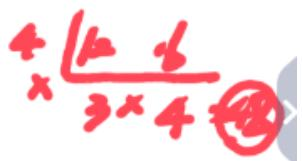

【注意】热门考点：比例（A/B=m/n，先找倍数）+范围（确定具体结果）。

【例8】（2025国考）某企业今年3月节电量是1月的1.2倍、2月的1.5倍，已知2月节电量比1月少4万度，问今年一季度企业节电量为多少万度？

A. 48

B. 52

C. 56

D. 60

【解析】8. 给出 1、2、3 月的关系，问一季度，一季度  $= 1$  月 +2 月 +3 月，很

难通过单独的倍数一下找到一季度的倍数, 考虑设未知数求解, 如果设 1 月为 x, 则 3 月是  $1.2 \mathrm{x}, 2$  月是  $1.2 \mathrm{x} / 1.5$ , 不好算, 结合比例设未知数, 3 月/1 月  $= 6 / 5$ , 结合倍数, 设 3 月为  $6 \mathrm{x}, 1$  月为  $5 \mathrm{x}, 2$  月  $= 6 \mathrm{x} / 1.5 = 4 \mathrm{x}$ , 一季度  $= 4 \mathrm{x} + 5 \mathrm{x} + 6 \mathrm{x} = 15 \mathrm{x}$ , 答案是 15 的倍数, 只有 D 项满足。【选 D】

【注意】解题思维：当比例无法确定答案倍数时，辅助设未知数也会变得更简单。

# 思维导图

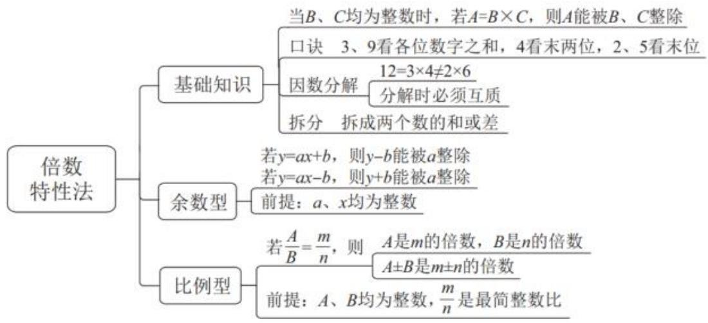

# 【注意】倍数特性法：

1. 基础知识：重点是三量关系  $A = B * C$  。需要记忆整除判定的口诀。  
2. 余数型：典型特征是  $y = ax \pm b$ ，平均分配有余数，记住多退少补。  
3. 比例型：条件中有比例、所求和比例有关系，考虑比例型，将比例化为  $A / B = m / n$ （最简），对应位置找倍数。

# 方程法

设未知数的技巧：

(1)条件中有比例关系  $\rightarrow$  根据比例关系设未知数  
(2)条件中有和差关系  $\rightarrow$  设 1 个, 和差推另 1 个未知数  
(3)条件中主体多、关系多  $\rightarrow$  找中间量设未知数  
(4)上述情况不存在  $\rightarrow$  求谁设谁（避免掉坑）

注：做题时会出现冲突，灵活应对，方便即可

【注意】方程法：同学们最熟悉的内容，设未知数、列方程、求解。

1. 如果单纯考查解方程组的题目，大家用时都差不多；做的都是同一道题，方程也都是一样的，但有些同学做了 1 分钟做对了，有些同学做了 5 分钟做错了，根本原因基本都在于设未知数，设好一个未知数能够帮助有效减少计算量。

2. 设未知数的技巧：

（1）条件中有比例关系：根据比例关系设未知数。比如1月是3月的1.2倍，1月/3月=1.2倍，可以设3月为x、1月为  $1.2\mathrm{x}$  ，出现小数做起来比较慢，根据1月/3月=1.2倍=5/6（最简整数比)，为了避免小数，按照比例，设1月为 $6\mathrm{x}$  、3月为  $5\mathrm{x}$  。  
（2）条件中有和差关系：设一个，和差推另外一个未知数。比如  $A + B = 100$ ，设  $A = x$ 、 $B = y$ ，找等量关系，再列一个  $x$  和  $y$  的方程，解方程快，一旦方程多、未知数多，解起来就慢了，为了解决未知数多的问题，题目中给出和差条件，把其中一个设成  $x$ ，另外一个可以用  $60 - x$  代替，此时不用解方程组，减少了未知数的个数，解方程就会变快。  
（3）条件中主体多、关系多：往往找中间量设未知数。比如第一个条件告诉 A 与 B 的关系，第二个条件告诉 A 与 C 的关系，第三个条件告诉 A 与 D 的关系，第四个条件告诉 ABCD 整体的关系，如果按照过去的思路，设四个未知数，也能列出四个等量关系，未知数太多就导致方程多，解方程会慢；多个条件中会出现相同的量，把这个相同的量设为 x，设  $A = x$ ，通过前三个条件 B、C、D 都能用 x 表示，再通过第四个条件列方程，可以解得 x。  
（4）上述情况不存在：最常用，主要针对的是条件中没有比例关系、没有和差关系，也不涉及多个主体，求谁设谁，好处就是求出来的结果是最后的答案，可以避免掉坑。  
3. 注意：前三种设未知数的技巧有时候会出现冲突，把握一个原则，即减少未知数的个数，保证未知数的系数尽可能是整数，灵活应对，方便即可。

【例 1】（2025 浙江）农学院学生采集了甲、乙两个品种的水稻样本各若干份，其中 36 份为有效样本。已知乙品种采集样本 30 份，那么甲品种的有效样本

比乙品种的无效样本：

A.多6份

B. 多 12 份

C.少6份

D.少12份

【解析】1. 对比前面的倍数，没有比例关系，找不到答案是几的倍数，必须设未知数解题，肯定离不开方程。题干中出现和差关系，即“其中36份为有效样本。已知乙品种采集样本30份”，可以设其中一个未知数为x，再把另外一个未知数推出来，好处是可以减少未知数的数量。

主体多、关系乱，有“甲、乙”，也有“有效、无效”，优先列表，竖列写“甲、乙”，横行写“有效、无效”，设甲的有效样本为  $x$ ，已知“其中 36 份为有效样本”，乙的有效样本为  $36 - x$ ；已知“乙品种采集样本 30 份”，乙的无效样本为  $30 - (36 - x) = x - 6$ ；问“甲品种的有效样本比乙品种的无效样本多/少多少份”，所求  $= x - (x - 6) = 6$ ，对应 A 项。【选 A】

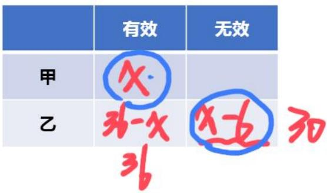

【注意】主体多、关系乱：列表分析更清晰。

【例 2】（2024 联考）某包装车间包装甲、乙两种规格的袋装杂粮，甲、乙两袋杂粮的重量之比为  $5: 2$  ，如果从甲袋中称出 2 公斤放入乙袋后，甲、乙两袋杂粮的重量之比变为  $4: 3$  。则甲袋杂粮原来的重量为：

A. 8 公斤

B. 10 公斤

C. 12 公斤

D. 15 公斤

【解析】2. 方法一：先抛开比例、倍数的思路，看到比例关系，要想列方程求解，直接按照比例设未知数即可。已知“甲、乙两袋杂粮的重量之比为  $5: 2$ ”，设甲为  $5x$ 、乙为  $2x$ ；已知“如果从甲袋中称出2公斤放入乙袋后，甲、乙两袋杂粮的重量之比变为  $4: 3$ ”，列式： $(5x - 2) / (2x + 2) = 4/3$ ，十字交叉相乘，得

到  $8 \mathrm{x} + 8 = 15 \mathrm{x} - 6 \rightarrow 7 \mathrm{x} = 14 \rightarrow \mathrm{x} = 2$ ; 问 “甲袋杂粮原来的重量”, 所求  $= 5 \mathrm{x} = 5 * 2 = 10$ , 对应 B 项。

方法二：题干出现比例，求的是“甲袋杂粮原来的重量”，与比例有关，已知“甲、乙两袋杂粮的重量之比为5：2”，甲/乙=5/2，甲原来的重量是5的倍数，排除A、C项；剩下B、D项，后面还有比例，已知“如果从甲袋中称出2公斤放入乙袋后，甲、乙两袋杂粮的重量之比变为4：3”，甲'/乙' = 4/3，甲现在的重量是4的倍数，B项→10-2=8，C项→15-2=13，只有8是4的倍数，B项当选。【选B】

【注意】条件中有比例关系  $\rightarrow$  根据比例关系设未知数。

【例3】（2022江苏）某餐饮公司甲、乙两种外卖每份的售价分别为30元和50元，若该公司某天售出这两种外卖共500份，销售收入为21400元，则售出的两种外卖数量相差：

A. 140 份

B. 160 份

C. 180 份

D. 200 份

【解析】3. 更多的同学会把甲设为 x、乙设为 y，根据“该公司某天售出这两种外卖共 500 份”列一个方程，根据“销售收入为 21400 元”列另一个方程，解方程组，分别解出 x 和 y。经过对比，未知数越少越容易，已知“该公司某天售出这两种外卖共 500 份”，甲、乙有和差关系，设甲为 x，则乙为  $500 - x$ ，列式： $30x + 50* (500 - x) = 21400 \rightarrow 30x + 25000 - 10x = 21400 \rightarrow 20x = 36000 \rightarrow x = 180$ ，不能直接选择 C 项；问的是“售出的两种外卖数量相差多少份”，甲卖了 180 份，则乙卖了  $500 - 180 = 320$  份，相差  $320 - 180 = 140$  份，对应 A 项。【选 A】

【注意】条件中有和差关系  $\rightarrow$  设 1 个，和差推另 1 个未知数。

【例 4】（2022 浙江）某单位四个党史宣讲小组各有若干组员，现增加 2 人并重新分配，使得四个小组人数相等。此时与原先相比，第一小组人数增加 10 人，第二小组人数减少 1 人，第三小组人数增加一倍，第四小组人数减半。则原

先人数最多的小组与人数最少的小组之间相差：

A.15人

B.21人

C. 24人

D. 32人

【解析】4. 本题是最难的。观察题目特征，虽然题干给出比例，即“第三小组人数增加一倍”，但问的是“原先人数最多的小组与人数最少的小组之间相差多少人”，肯定无法分析倍数，只能设未知数、列方程、求解。如果设四个小组的人数分别为 a、b、c、d，变成四个未知数列方程组，太浪费时间，主体多，而且等量关系也特别多，找中间量，题干直接给出中间量，中间量是多个条件中相等的量，即“分配后四个小组人数相等”，完全可以把分配后相等的人数设为 x，反推分配前的人数，分别为 x-10、x+1、0.5x、2x，根据题意，之前人数+2=现在人数，列式：  $4x = (x - 10) + (x + 1) + 0.5x + 2x + 2 \rightarrow 4x = 4.5x - 7 \rightarrow 0.5x = 7 \rightarrow x = 14$ ，原来人数最多的是  $2x = 28$ ，原来人数最少的是  $x - 10 = 14 - 10 = 4$ ，所求  $= 28 - 4 = 24$ ，对应C项。【选C】

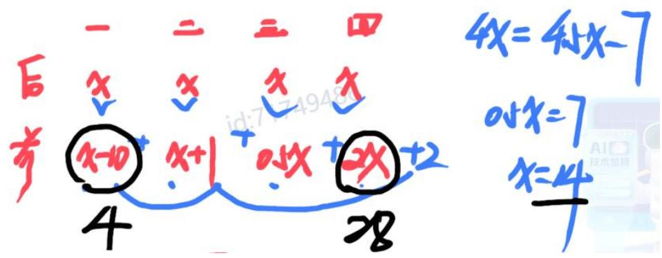

【注意】条件中主体多、关系多  $\rightarrow$  找中间量设未知数。

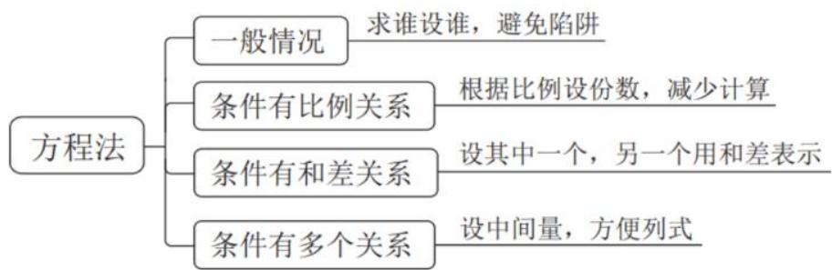

【注意】方程法：

1. 一般情况：求谁设谁，避免陷阱。

2. 条件有比例关系：根据比例设份数，减少计算，比如甲：乙=3：5，分别设甲为  $3 \mathrm{~x}$  、设乙为  $5 \mathrm{~x}$  。  
3. 条件有和差关系：设其中一个，另一个用和差表示，比如甲、乙加在一起是 100，设甲为 x，则乙为  $100 - x$ 。  
4. 条件中有多个关系：设中间量，方便列式。

赋值法

赋值法是什么？

不影响结果前提下，把一些未知量用具体数表示，实现快速解题

（切记：不能对答案赋值）

所有的题都可以赋值吗？

不，需要题目具备典型特征

# 【注意】赋值法：

1. 小学老师在讲工程问题的时候，特别喜欢赋值，而且喜欢赋值为 1，从小学的时候，大家就已经开始接触赋值了。  
2. 赋值法是什么：不影响答案的前提下，把一些未知量（如  $x$ 、 $y$ ）用具体数（如 10、100）表示，实现快速解题，记住不能对答案赋值，因为没有人在做题之前就知道答案是多少。  
3. 不是所有的题都可以赋值，需要题目具备典型特征（需要重点听）。

# 赋值法的两种使用逻辑

1. 从条件看

没有具体数，给比例求比例的题型

2. 从三量关系看

A=B*C, 三量关系, 只给一个量

(1)总价  $=$  单价  $*$  数量  
(2)总量=效率*时间  
(3)长方形面积  $= \text{长} *$  宽

···

如何赋值？赋值多少无所谓，好算即可

根据比例赋值或赋值相同的量（公倍数）

【注意】赋值法的两种使用逻辑：

1. 从条件看：没有具体数值，给比例、求比例的题型，可以赋值。如果设未知数  $x$ ，最后求的比例肯定是“A/B”的形式，A 和 B 都能用  $x$  表示，最后  $x$  会被约掉，换成 1、10、100 会更好算，可以考虑赋值。  
2. 从三量关系看：有点抽象，不太好理解，题目中出现三量关系（A=B*C），找不到答案是几的倍数，无法确定结果，只能设未知数、列方程、求解，如果三量关系只给出B，无法确定A和C，可以赋一个量、求一个量。

（1）工程问题：总量  $=$  效率  $*$  时间。往往只给出时间，没有效率和总量，往往考虑赋一个量、求一个量。  
（2）经济利润问题：总价  $=$  单价  $*$  数量。如果只给出数量，没有单价和总量，要想求另外一个量，就要赋值其中一个量。  
(3) 几何问题: 长方形面积  $= \text{长} *$  宽。如果只知道面积, 长和宽都不知道,可以考虑赋值一个量。

3. 如何赋值：赋值多少无所谓，前提需要是好算，认为赋值 1 好算就赋值为 1，认为赋值 10 好算就赋值为 10，认为赋值 100 好算就赋值为 100，因题而异、因人而异，对于给比例、求比例的题型，一般可以结合比例关系赋值，比如 A: B=5:3，可以赋值 A=5、B=3，可以让赋值的信息化最大；如果题干中出现相同的量，赋值相同的量，往往是公倍数。

【例 1】（2024 联考）在一次选举中，某候选人需得到全部选票的  $3 / 5$  才能当选。当统计到  $2 / 3$  的选票时，他已得到当选所需的  $5 / 6$  。则他若能当选还要得到剩下选票中的：

A.  $3 / 10$

B.  $3 / 8$

C.  $3 / 7$

D.  $3 / 5$

【解析】1. 给比例，求比例，没有具体量，可以赋值，根据比例关系赋值，如果比例关系不好用，还可以赋值相同的量，本题中既有比例关系，又是相同的量是总量，如果赋值总量，后续需要乘以  $3 / 5$ 、 $2 / 3$ ，甚至需要间接乘以  $5 / 6$ ，总

量是 5 的倍数、3 的倍数、6 的倍数，总量是 30 的倍数，赋值总量为 30 张，则得到  $30 * (3 / 5) = 18$  张选票才能当选，当统计到  $30 * (2 / 3) = 20$  张选票时，该候选人已经得到  $18 * (5 / 3) = 15$  张选票，现在选票还剩  $30 - 20 = 10$  张，他只需要再得到  $18 - 15 = 3$  张就能当选，所求  $= 3 / 10$  ，对应 A 项。【选 A】

# 【注意】

1. 特征：没有具体数，给比例求比例。  
2. 方法：根据比例赋值或赋值相同的量（公倍数）。

【例2】（2024黑龙江公安）某地一项大型工程由甲、乙、丙、丁四家公司共同参与完成，已知乙公司完成的工程量是甲公司的4倍，是丙公司的2倍，丁公司完成的工程量是丙公司的1.5倍，问甲、丁两家公司完成的工程量之间的关系？

A. 甲公司的工程量是丁公司的3倍  
B. 甲公司的工程量是丁公司的2倍  
C. 丁公司的工程量是甲公司的2倍  
D. 丁公司的工程量是甲公司的 3 倍

【解析】2. 本题与例1没有太大的区别，给比例，求比例，没有具体数值，只是换了个背景，换了层“外衣”，考虑赋值，按照比例关系赋值，已知“乙公司完成的工程量是甲公司的4倍，（乙）是丙公司的2倍，丁公司完成的工程量是丙公司的1.5倍”，赋值甲为1、乙为4，则丙为2、丁为  $2*1.5 = 3$  ，丁是甲的3倍，对应D项。【选D】

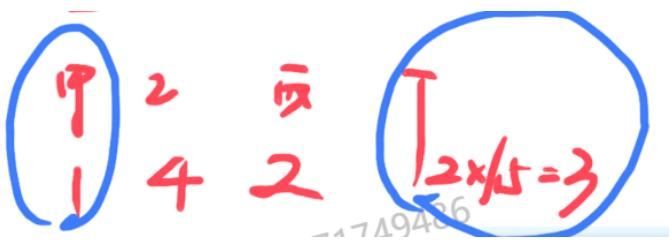

# 【注意】

1. 特征：没有具体数，给比例求比例。

# 2. 方法：根据比例赋值。

【例3】（2024江苏）小王去超市买办公用品，经费恰好可以买18个计算器或者买30个订书机或者买50个档案盒，若购买了6个计算器、8个订书机后，剩下的经费全部购买了档案盒，则他购买档案盒的个数是：

A. 10

B. 14

C. 20

D. 26

【解析】3. 本题比前两道题难一些。与钱有关的经济利润问题，“经费”是总钱数，给出数量，可以想到要求单价，总钱数=数量*单价（A=B*C），三量关系只知其一，还可以再赋一个量，前面按照比例赋值，但本题没有比例，就赋值相同的量，总钱数是相同的，赋值总钱数最好，需要用到18、30、50的公倍数，赋值总钱数为450。

如果看不出来 18、30、50 的公倍数，考虑短除法，18、30、50 的公因子为 2，分别除以 2 得到 9、15、25；三个数没有公因子，可以两两看，9 和 15 有公因子 3，分别除以 3 得到 3、5，25 照抄；5 和 25 有公因子 5，分别除以 5 得到 1、5,3 照抄，此时 3、1、5 两两互质，外围数字相乘，最小公倍数是  $2*3*5*3*1*5=450$ ，也可以赋值为 900，只要赋值总钱数为公倍数即可，但最小公倍数往往最好算。

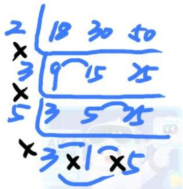

计算器的单价是  $450 / 18 = 25$  ，订书机的单价是  $450 / 30 = 15$  ，档案盒的单价是  $450 / 50 = 9$  ，小王买了6个计算器、8个订书机，花费  $6*25 + 8*15 = 150 + 120 = 270$  总钱数是450，剩余  $450 - 270 = 180$  ，档案盒的单价是9，还能买20个档案盒，对应C项。【选C】

# 【注意】

1. 特征：三量关系（总价=单价*数量），只给数量。  
2. 方法：赋值相同的量（公倍数）。

【例4】（2022联考）某商场为庆祝开业三周年，制作了一个长方形大蛋糕，并切成四块，如图所示。假设这个蛋糕可供350人享用，左下角那块蛋糕平均可供50人享用，右上角那块蛋糕平均可供70人享用，则中间最大块蛋糕平均可供多少人享用？

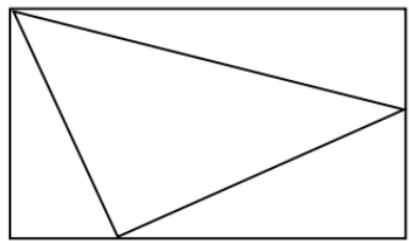

A. 150  
B. 155  
C. 175  
D. 180

【解析】4. 本题也不好想，但想明白后会发现本题就是送分题。根据题意，这个蛋糕可供 350 人享用，左下角那块蛋糕平均可供 50 人享用，右上角那块蛋糕平均可供 70 人享用，吃蛋糕的人数对于本题来说是面积，蛋糕肯定是一个长方体，因为厚度是一样的，所以只需要看面积，面积就代表吃蛋糕的人数，相当于左下角三角形的面积是 50，右上角三角形的面积是 70，只需要求出中间三角形的面积。 $\mathrm{S}_{\text {长方形}} = \text {长} * \text {宽}, \mathrm{S}_{\text {三角形}} = (1 / 2) * \text {底} * \text {高}$ ，都是三量关系，所有的量只有面积，没有长，也没有宽，可以赋值。

方法一：赋值长方形的宽是10、长是35，左下角三角形的面积是50，（1/2）*10*DE=50→DE=10，则CE=35-10=25；右上角三角形的面积是70，（1/2）*35*BF=70→BF=4，则CF=10-4=6，右下角三角形的面积是（1/2）*6*25=75，最中间三角形的面积=350-50-70-75=155，可以被155人享用，对应B项。

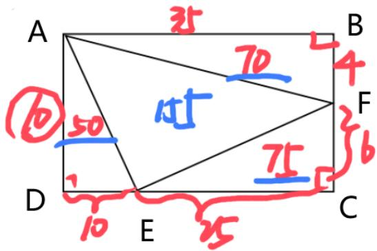

方法二：尝试赋值长方形的宽是14、长是25，左下角三角形的面积是50， $(1 / 2)*25*DE = 50\rightarrow DE = 4$  ，则  $CE = 14 - 4 = 10$  ；右上角三角形的面积是70，（1/2） $14*BF = 70\rightarrow BF = 10$  ，则  $CF = 25 - 10 = 15$  ，右下角三角形的面积是  $(1 / 2)*10*15 = 75$  最中间三角形的面积  $= 350 - 50 - 70 - 75 = 155$  ，可以被155人享用，对应B项。

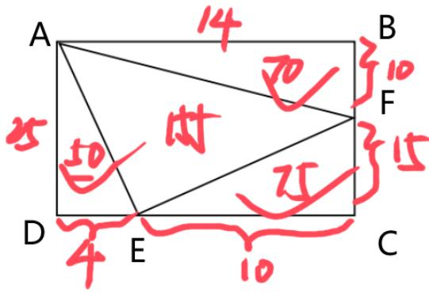

【注意】特征：三量关系（S=长*宽），只给面积。

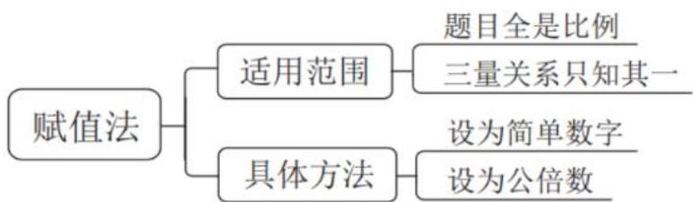

【注意】赋值法：

1. 适用范围：

（1）题目全是比例，没有具体量，直接赋值。  
(2) 三量关系只知其一, 出现 “  $A = B * C$ ” 的三量关系, 可能与钱数有关, 总钱数 = 单价 * 数量; 也有可能与面积有关,  $S_{\text {长方形}} =$  长 * 宽。  
2. 具体方法：赋值简单数字，如果有比例 3:5，可以分别赋值为 3 和 5；如

果没有比例，如例3，可以赋值公倍数。

课后回顾：

1. 在判定整除时, 3 和 9 是看__________，4 是看__________，2 和 5 是看__________。如果使用因数分解进行整除判定, 分解后的数之间必须__________。进行整除判定时, 还可以使用__________法。  
2. 已知  $a$ 、 $x$  均为整数，若  $y = ax + b$ ，则 ______ 能被  $a$  整除；若  $y = ax - b$ ，则 ______ 能被  $a$  整除。  
3. 比例型倍数特性的结论: 若  $A / B = m / n$ , 则  $A$  是____的倍数,  $B$  是____的倍数,  $A \pm B$  是____的倍数。该结论的使用前提: A、B 均为整数, 且  $m / n$  是____整数比。  
4. 在列方程设未知数时, 一般求谁设谁; 条件有比例关系, 可以设__________; 条件有和差关系, 设其中一个, 另一个用__________表示; 条件有多个关系: 设__________。  
5. 赋值法的适用范围：题目全是____、三量关系只知____。具体用法：设________、设________。

# 【注意】

1. 在判定整除时，3 和 9 是看各位数字加和，4 是看末两位，2 和 5 是看末一位。如果口诀不行，使用因数分解进行整除判定，分解后的数之间必须互质，比如 45 需要分解为  $5 * 9$  。进行整除判定时，还可以使用拆分法。  
2. 余数型：已知 a、x 均为整数，若  $y = ax + b$ ，则 y-b 能被 a 整除；若  $y = ax - b$ ，则  $y + b = ax$  能被 a 整除，记忆口诀“多退少补”。  
3. 比例型倍数特性的结论: 条件中有比例, 所求与比例有关, 若  $A / B = m / n$ , 则  $A$  是  $m$  的倍数,  $B$  是  $n$  的倍数,  $A \pm B$  是  $m \pm n$  的倍数。该结论的使用前提: A、B 均为整数, 且  $m / n$  是最简整数比, 如果不是最简分数, 就容易出错。  
4. 在列方程设未知数时，一般求谁设谁；条件有比例关系，可以按照比例关系设未知数；条件有和差关系，设其中一个，用和差关系表示另外一个；条件有多个关系：设中间量。  
5. 赋值法的适用范围：题目全是比例、三量关系（A=B*C）只知其一。具体用法：有比例就按照比例赋值，没有比例就赋值公倍数。

【课后练习1】（2023广东）某社区计划组建多支社工团队，为此招募了一批社工。如果每支团队由3名社工组成，则剩余2名社工；如果每支团队由4名社工组成，同样剩余2名社工，则该社区可能招募了（）名社工。

A. 32

B. 34

C. 36

D. 38

【解析】练习1.已知“如果每支团队由3名社工组成，则剩余2名社工”，平均分配有余数，多退少补，“剩余2名社工”需要“-2”，“选项-2”依次为30、32、34、36，只有30和36是3的倍数，排除B、C项；已知“如果每支团队由4名社工组成，同样剩余2名社工”，“剩余2名社工”仍需要“-2”，只有36是4的倍数，排除A项，D项当选。【选D】

【课后练习2】（2024联考）大学生创业主要集中在高科技、智力服务、连锁加盟和自媒体运营四个领域。某学院今年选择创业的大学毕业生不到50人，其中选择智力服务领域、连锁加盟领域和自媒体运营领域的分别占1/7、1/2和1/3。那么该学院今年选择高科技领域创业的大学毕业生有多少人？

A. 1

B. 3

C. 5

D. 7

【解析】练习2.“大学毕业生不到50人”是范围，不是具体值；已知“选择智力服务领域、连锁加盟领域和自媒体运营领域的分别占1/7、1/2和  $1 / 3$  ”给出比例，范围结合比例，先通过比例推出倍数，将比例化为“A/B=m/n”，智力服务/总人数  $= 1 / 7$  ，连锁加盟/总人数  $= 1 / 2$  ，自媒体运营/总人数  $= 1 / 3$  ，总人数是7的倍数、2的倍数、3的倍数，7、2、3是互质的，这三个数的公倍数是  $7*2*3 = 42$  总人数是42的倍数，结合“大学毕业生不到50人”，总人数只能是42人，选择智力服务领域的有  $42*(1 / 7) = 6$  人，选择连锁加盟领域的有  $42*(1 / 2) = 21$  人，选择自媒体运营领域的有  $42*(1 / 3) = 14$  人，则选择高科技领域创业的有  $42-$ $(6 + 21 + 14) = 42 - 41 = 1$  人，对应A项。【选A】

【课后练习3】（2021 新疆）甲、乙、丙、丁四人捐款，甲、乙、丙共捐款

240 元，甲、丙、丁共捐款 190 元，甲捐款额是丙的两倍，甲比乙少捐款 40 元。问丁捐款多少元？

A. 70

B. 80

C. 90

D. 120

【解析】练习3.方法一：已知“甲捐款额是丙的两倍”，可以根据2倍关系设未知数，设丙捐款额为  $x$  、甲捐款额为  $2x$  ；已知“甲比乙少捐款40元”，乙捐款额为  $2x + 40$  ；已知“甲、乙、丙共捐款240元”，列式：  $2x + x + 2x + 40 = 240 \rightarrow 5x = 200 \rightarrow x = 40$  ；已知“甲、丙、丁共捐款190元”，  $80 + 40 + \text{丁} = 190 \rightarrow \text{丁} = 70$ ，对应A项。

方法二：本题有倍数关系，即“甲捐款额是丙的两倍”，找不到丁是几的倍数，但知道甲、丙、丁的和，即“甲、丙、丁共捐款190元”，设丙捐款额为  $x$  、甲捐款额为  $2x$  ， $3x + \text{丁} = 190 \rightarrow 3x = 190 - \text{丁}$ ，涉及余数型，说明“190-选项”必须是3的倍数，“190-选项”依次为120、110、100、70，只有120是3的倍数，对应A项。【选A】

预习：

第二节 工程问题

第三节 经济利润问题

尽量自己认真思考做一遍，听课效果更佳

起码熟悉题目

# 【注意】

1. 预习：

(1) 第二节: 工程问题。  
(2) 第三节: 经济利润问题。

2. 尽量自己认真思考做一遍，听课效果更佳，起码熟悉题目。

# 【答案汇总】

倍数特性法 1-5: BDBCB; 6-8: DAD

方程法 1-4: ABAC

赋值法 1-4: ADCB

遇见不一样的自己

Be your better self