# 精讲精练-数量 2

（笔记）

主讲教师：田鹏

授课时间：2025.03.12

# 精讲精练-数量2（笔记）

# 数量关系 精讲精练2

# 学习任务：

1. 课程内容：工程问题、经济利润问题  
2. 对应讲义：第  $386 \sim 389$  页  
3. 重点内容：

(1) 掌握给完工时间型工程问题的题型特征与解题步骤  
(2) 掌握给效率比例型工程问题的题型特征与解题步骤  
(3) 掌握给具体单位型工程问题的题型特征与解题步骤  
(4) 掌握与售价、成本、利润、折扣、利润率等相关的公式  
(5) 掌握在经济利润问题中的分段计费问题

【注意】本节课讲解工程问题和经济利润问题，基本是考试必考的题型，考频很高。

# 第二节 工程问题

三量关系：总量  $=$  效率  $\ast$  时间

# 考查题型

1、给完工时间型  
2、给效率比例型  
3、给具体单位型

# 【注意】工程问题：

1. 识别：要识别题型不难，绝大部分题目一眼就能看出来，在考试中一般背景都是完成工程、修一条马路等，都是工程问题；工程问题的大逻辑不仅仅是完成工程，只要是完成一件事，就是工程问题，比如几个工人要完成刺绣，同样可以理解为“把马路修完”。如果再延伸一些，比如给手机充电，给出充电器效率，也是完成一件事，也是工程问题。题目有完成一件事，并且给出效率这样的表述，就是工程问题。  
2. 三量关系：总量  $=$  效率  $*$  时间。

# 3. 考查题型：

(1) 给完工时间型。  
(2) 给效率比例型。  
(3) 给具体单位型。

# 一、给完工时间型（多个完工时间）

例：搬同一堆砖，小田搬完需要3天，小鹏搬完需要6天，他俩一起搬需要多少天？

套路三步走：

第一步：赋总量（完工时间公倍数）

第二步：算效率，效率  $=$  总量/完工时间

第三步：根据题意完成工程

【注意】给完工时间型：

1. 特点是“给出多个完工时间”，有两个限制条件。

(1) “多个”: 完工时间的个数必须大于等于 2 个, 只给出一个完工时间不符合。  
(2) “完工时间”: 一个人或者几个人同时工作、谁也不休息, 从工程开始干到工程结束的时间。  
(3) 如下例, 小田从开始到结束的时间是 3 天, 小鹏从开始到结束的时间是 6 天, 这两个是完工时间; 如果说 “小田工作 3 天后, 小鹏接着工作 6 天, 把工作完成了”, 这个不是完工时间, 因为是交替干活的, 如果想到了  $3 + 6 = 9$  天, 这个时间也不是完工时间, 因为工作过程中主体发生了变化, 这个时间就不是完工时间。

2. 例：搬同一堆砖，小田搬完需要3天，小鹏搬完需要6天，他俩一起搬需要多少天？

答: 小学学习过 “赋 1 法”, 赋值总量为 1 , 又知道每个主体的完工时间,就可以算出每个人的效率, 小田的效率  $= 1 / 3$ , 小鹏的效率  $= 1 / 6$ , 一起搬需要的时间  $= 1 \div (1 / 3 + 1 / 6) = 6 / 3 = 2$  。这样的计算过程非常麻烦, 需要通分, 而公务员考试的时间比较紧迫, 为了解决这个问题, 还是参照这三个步骤, 只是在赋值总量

的时候, 可以赋值总量为完工时间 3 天和 6 天的公倍数 6 , 则小田的效率为  $6 / 3 = 2$ , 小鹏的效率  $= 6 / 6 = 1$ , 所求  $t = 6 / 3 = 2$  。

# 3. 套路三步走：

（1）第一步：赋总量（完工时间公倍数），最好是最小公倍数，找不到最小公倍数的话赋值公倍数也可以。  
(2) 第二步: 算效率, 效率 = 总量 / 完工时间。  
(3) 第三步: 根据题意完成工程。

如何找最小公倍数（短除法）

3、4  
18、24  
3、4、5  
12、15、18

不用太纠结，实际做题中给的数字都一眼看出来；即使看不出来也可以直接用乘积

【注意】如何找最小公倍数：

1.3、4：两个数字互质（只有公因子 1，没有其他公因子），直接相乘即可， $3*4 = 12$ 。  
2.18、24：如果看不出来，用短除法，18和24有公因子  $6, 18/6 = 3, 24/6 = 4$ ，最小公倍数  $= 6*3*4 = 72$ 。

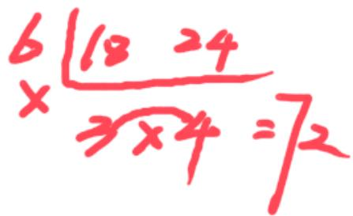

3.3、4、5：三个数字两两之间互质，最小公倍数直接相乘即可， $3*4*5=60$ 。  
4. 12、15、18：如果没法直接看出来，短除法， $12/3 = 4$ ， $15/3 = 5$ ， $18/3 = 6$ ，4和6还有公因子， $4/2 = 2$ ， $6/2 = 3$ ，5直接抄下来，把外边的数字相乘， $3*2*2*5*3 = 180$ 。

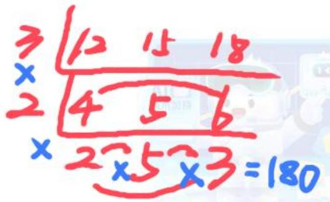

5. 不用太纠结，实际做题中给的数字的公倍数都能一眼看出来；即使看不出来也可以直接用乘积，本质上用公倍数就可以，用最小公倍数更好。

【例1】（2024联考）有一批零件，如果甲车间单独完成需要50小时，乙车间单独完成需要30小时。在甲车间单独完成若干小时后，由于要承担其他紧急任务，剩余的任务由乙车间继续完成，这样一共用了42小时。则乙车间完成的零件量占这批零件总量的：

A.  $3 / 4$

B.  $3 / 5$

C.  $2 / 5$

D.  $1 / 3$

【解析】1. “甲车间单独完成需要50小时，乙车间单独完成需要30小时”  $\rightarrow$  给出甲和乙单独完成工作的时间，给出多个完工时间，完工时间型工程问题，三步走。(1) 赋总量：赋值总量为30和50的公倍数150；(2) 算效率：甲  $= 150 / 50 = 3$  ，乙  $= 150 / 30 = 5$  ；(3) 列式求解：设甲单独工作t小时，乙的工作时间为42-t小时，列式  $\rightarrow 150 = 3t + 5*(42 - t)$ ， $150 = 210 - 2t$ ， $2t = 60$ ，解得  $t = 30$ 。求的是乙完成的量占总量的多少，乙完成的量  $= 5*(42 - 30) = 60$ ，所求  $= 60 / 150 = 2 / 5$ ，对应C项。【选C】

【例2】（2023北京）甲、乙两个工程队被安排实施某个工程。甲工程队先施工，用了15天完成了一半，剩下部分甲、乙合作，比前一半的用时短了9天。则乙工程队独立完成整个工程需要多少天？

A. 10

B. 15

C. 16

D. 20

【解析】2. “用了 15 天完成了一半，剩下部分甲、乙合作，比前一半的用

时短了 9 天”  $\rightarrow$  甲乙合作完成一半用了  $15 - 9 = 6$  天。注意直接给出的 15 天和 6 天不是完工时间, 但可以转化成完成全部工程的时间, 甲单独完成全部工作需要  $15 * 2 = 30$  天, 甲+乙合作完成全部工作需要  $6 * 2 = 12$  天, 得到两个完工时间, 三步走: (1) 赋总量: 赋值总量为 30 和 12 的公倍数 60; (2) 算效率: 甲  $= 60 / 30 = 2$ , 甲+乙  $= 60 / 12 = 5$ , 乙  $= 5 - 2 = 3$ ; (3) 列式求解: t  $= 60 / 3 = 20$ , 对应 D 项。【选 D】

<table><tr><td></td><td>一半工程</td><td>全部工程</td></tr><tr><td>甲</td><td>15天</td><td></td></tr><tr><td>甲+乙</td><td>6天</td><td></td></tr></table>

【注意】猜题（不保证正确，在冲刺阶段还会讲解）：站在出题人的角度设坑，前面的条件是按照“一半”来设置的，如果把一半当成了总量计算效率，实际上要的是“两个一半”，最终结果和错误思维应该是差2倍的关系，A项*2=D项，选择D项。

【例3】（2024湖北选调）一件工作，甲单独完成需要36天，乙单独完成需要54天，丙单独完成需要72天。现在甲、乙合作2天后，甲因有事离开，丙加入进来，乙、丙合作a天后，乙因有事离开，甲加入进来，最后丙、甲合作（a+4）天后正好完成该工作。请问完成该工作共花费了多少天？

A. 22

B. 24

C. 26

D. 28

【解析】3. 根据“一件工作，甲单独完成需要 36 天，乙单独完成需要 54 天，丙单独完成需要 72 天”，给出多个完工时间，完工时间型工程问题，三步走：（1）赋总量：短除法，三个完工时间有公因子 18， $36 / 18 = 2$ ， $54 / 18 = 3$ ， $72 / 18 = 4$ ，2 和 4 还有公因子 2， $18*2*1*3*2 = 216$ ，赋值总量为 216；（2）算效率，P 甲  $= 216 / 36 = 6$ ，P 乙  $= 216 / 54 = 4$ ，P 丙  $= 216 / 72 = 3$ ；（3）列式求解：工作分为三段， $2*(6 + 4) + a*(4 + 3) + (a + 4)*(6 + 3) = 216 \rightarrow 20 + 7a + 9a + 36 = 216$ ， $16a = 160$ ，解得  $a = 10$ 。问一共花费多少天，所求  $= 2 + 10 + 14 = 26$  天，对应 C 项。【选 C】

# 二、给效率比例型

例：搬同一堆砖，小田与小鹏效率比为3:2，小鹏一个人搬完需要6天，他俩一起搬需要多少天？

套路三步走：

第一步：赋效率（满足比例关系）

第二步：算总量，总量=效率*时间

第三步：根据题意完成工程

【注意】给效率比例型：题干给出了效率之间的比例关系。

1. 例：搬同一堆砖，小田与小鹏效率比为  $3:2$  ，小鹏一个人搬完需要 6 天，他俩一起搬需要多少天？

答：三量关系为“总量  $=$  效率  $*$  时间”，题目中只给出了时间6天，没有给总量和效率，三量关系只知其一，可以赋一个量，赋值效率更容易，有比例就赋比例，三步走。（1）赋效率：赋值小田效率为3，小鹏效率为2，满足比例关系即可；（2）算总量：总量  $= 2 * 6 = 12$  ；（3）列式求解： $t = 12 / (3 + 2) = 12 / 5$ 。

# 2. 套路三步走：

(1) 第一步：赋效率（满足比例关系）。  
(2) 第二步: 算总量, 总量  $=$  效率  $*$  时间。  
(3) 第三步: 根据题意完成工程。

【例 4】（2025 四川）甲、乙两条生产线生产同一种产品，且甲的效率是乙的 1.5 倍，现接到 A、B 两个订单。已知甲完成 A 订单和乙完成 B 订单均需要 8 小时，问甲完成 B 订单的用时比乙完成 A 订单的用时少多长时间？

A.6小时

B. 6 小时 40 分

C. 7 小时 20 分

D. 8 小时

【解析】4. “甲的效率是乙的 1.5 倍”  $\rightarrow$  给出效率比例，效率比例型工程问题，三步走。（1）赋效率：建议赋值整数，甲/乙  $= 3 / 2$  ，赋值乙的效率为 2，甲的效率为 3；（2）算总量： $A = 3 * 8 = 24$  ， $B = 2 * 8 = 16$ ；（3）列式求解：问“甲完成 B 订单的用时比乙完成 A 订单的用时少多长时间”，乙完成 A 的时间  $= 24 / 2$  ，甲完成 B 的时间  $= 16 / 3$  ，所求  $= 24 / 2 - 16 / 3 = 12 - 16 / 3 = (36 - 16) / 3 = 20 / 3h = 6h + 2 / 3h$  ， $2 / 3h = 40$

分钟，结果为6小时40分，对应B项。也可以结合选项分析，一定大于6小时但不到7小时，对应B项。【选B】

# 常见形式

1. 直接给：甲：乙=6：5 或 甲=1.5 乙  
2.间接给：

总量相同，时间不同：甲3天的工作量等于乙2天的工作量

【注意】效率比例型常见形式：

1. 直接给：条件中直接告诉效率的比例，这样赋效率、算总量都会比较容易，是最简单的形式。

2. 间接给:

(1) 不提到“效率”，但实际上含义是给效率，如“甲3天的工作量等于乙2天的工作量”，是总量之间的关系，但往细处想，3*甲的效率  $= 2 * \text{乙}$  的效率，甲/乙  $= 2 / 3$  ，接下来三步走即可。  
(2) 同一种工作给出几种完工的形式，总量相同，时间不同，根据总量相同去联立，最后能推出效率。

【例5】（2024联考）甲、乙两工厂共同完成某个生产订单需要12天。现两工厂共同生产8天后，再由乙单独生产7天，一共完成了订单总量的  $90\%$  。若整个订单由乙单独生产，那么需要多少天完成？

A. 20

B. 23

C. 26

D. 30

【解析】5. 方法一：“甲、乙两工厂共同完成某个生产订单需要12天”  $\rightarrow$  总量  $= 12 *$  （甲  $+ \text{乙}$ ）；“现两工厂共同生产8天后，再由乙单独生产7天，一共完成了订单总量的  $90 \%$  ”  $\rightarrow 90 \%$  总量  $= 8 *$  （甲  $+ \text{乙}$ ）  $+ 7 * \text{乙}$  。相同的总量给出两种完工形式，可以把两部分都替换为总量进行联立来推出效率比例， $90 \%$  总量  $= 90 \% * 12 *$  （甲  $+ \text{乙}$ ）  $= 8$  甲  $+ 15 \text{乙}$ ，10.8甲  $+ 10.8 \text{乙} = 8$  甲  $+ 15 \text{乙}$ ，2.8甲  $= 4.2 \text{乙}$ ，2甲  $= 3 \text{乙}$ ，甲/乙  $= 3 / 2$ 。有效率比例，三步走。（1）赋效率：赋值甲  $= 3$ ，乙  $= 2$ ；（2）算总量：总量  $= 12 * (3 + 2) = 60$ ；（3）列式求解： $60 / 2 = 30$ ，对应D项。

方法二（小学的运算思维，只针对本题，不具备代表性）：“甲、乙两工厂共同完成某个生产订单需要12天。现两工厂共同生产8天后”  $\rightarrow$  完成了总量的 $8 / 12 = 2 / 3$ 。“再由乙单独生产7天，一共完成了订单总量的  $90\%$  ”  $\rightarrow$  7乙 $= 90\% -2 / 3 = 9 / 10 - 2 / 3 = (27 - 20) / 30 = 7 / 30,7Z = 7 / 30,乙 = 1 / 30$  ，所求  $= 1\div 1 / 30 = 30$  对应D项。【选D】

常见形式

1. 直接给：  
2.间接给：  
3. 给具体人数或个数：100 名工人修路、36 台收割机割麦子

【注意】常见形式3：做题的过程中发现工程问题给出了工作的具体人数或机器数，默认前提（不管题干说没说都默认）是人与人之间、机器和机器之间效率相同，现实中可能确实不一样，但根据数学思维就是效率相同的，则人与人之间的效率为1：1：1……，先把每个人或者机器的效率赋值为1，三步走，赋效率、算总量、按工作过程列式求解。

【拓】（2022联考）有25人铺设某足球场草坪，计划20天完成。动工6天后抽出5人负责围栏围网的施工，留下的人继续铺设草坪。如果每人的工作效率不变，那么铺设完该足球场的草坪实际要用多少天？

A.23.5

B. 24.5

C. 25.5

D. 26.5

【解析】拓展. 给人数的工程问题，三步走，（1）赋效率：赋值每个人的效率为 1；(2) 算总量：总量  $= 25 * 20 = 500$ ；(3) 列式求解： $25 * 6 + 20 * t = 500, t = 35 / 2 = 17.5$  天，注意问的是“铺设完该足球场的草坪实际要用多少天”，所求  $= 17.5 + 6 = 23.5$  天，对应 A 项。【选 A】

# 三、给具体单位型（给出具体效率、具体总量）

很简单，直接根据问题设未知数列方程求解

例：老田有若干栋楼要收租, 11 月计划每天收 4 栋楼, 正好收完。但因为

任性，他想休息10天，那么11月剩下的时间平均每天需要收多少栋楼的房租？

【注意】给具体单位型（给出具体效率、具体总量）：

1. 识别：所有问题基本都会有时间，时间不作为具体量，如果题目中直接给出总量或者效率的具体值，就是给具体单位型。  
2. 解题思路：很简单，直接根据问题设未知数列方程求解。  
3. 例：老田有若干栋楼要收租，11月计划每天收4栋楼，正好收完。但因为任性，他想休息10天，那么11月剩下的时间平均每天需要收多少栋楼的房租？

答：“每天收4栋楼”属于给出了效率的具体值，给具体单位型工程问题。11月有30天，每天收4栋楼，总楼数  $= 30*4 = 120$  栋。一共30天，休息10天，则工作时间为20天，所求效率  $= 120 / 20 = 6$  栋/天。

【例 6】(2025 国考)甲、乙、丙 3 台收割机每小时均能收割 2 亩小麦, 三台机器上午先后开始收割工作, 12: 00 时甲收割的面积是乙的 1.5 倍, 且比丙多收割 6 亩, 16: 00 时 3 台收割机共收割了 50 亩。问乙是何时开始工作的?

A. 6: 00

B. 7:00

C. 8: 00

D. 9: 00

【解析】6. “甲、乙、丙3台收割机每小时均能收割2亩小麦”  $\rightarrow$  给出了效率的具体值，核心是找等量关系列方程。“12:00时甲收割的面积是乙的1.5倍，且比丙多收割6亩”，给出了比例关系，可以根据比例设未知数，设乙完成的面积是  $2\mathrm{x}$ ，甲完成的面积是  $3\mathrm{x}$ ，丙完成的面积  $= 3\mathrm{x} - 6$ ；到16：00，经过了4h，每小时每台机器的效率是2，则每台机器的收割面积加8，此时甲的收割面积  $= 3\mathrm{x} + 8$ ，乙  $= 2\mathrm{x} + 8$ ，丙  $= 3\mathrm{x} + 2$ ，列式： $3\mathrm{x} + 8 + 2\mathrm{x} + 8 + 3\mathrm{x} + 2 = 50$ ， $8\mathrm{x} + 18 = 32$ ，解得  $x = 4$ 。问“乙是何时开始工作的”，乙在12点的时间收割了  $2\mathrm{x} = 8$  亩，效率为2，乙工作时间  $= 8 / 2 = 4$ ，12：00往前推4小时是8：00，对应C项。【选C】

# 思维导图

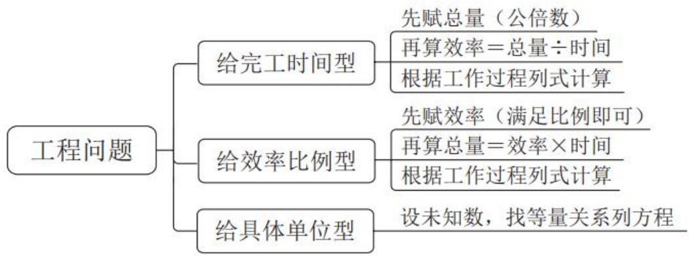

【注意】工程问题总结：90%的题目是前两种类型。

1. 给完工时间型：赋值总量为完工时间的公倍数，算效率，列式求解。  
2. 给效率比例型：先赋值效率，再算总量，列式求解。  
3. 给具体单位型。  
4. 前两种要么先赋值总量算效率，要么先赋值效率算总量，只有效率和总量都有了才能列式求解；第三种题型中有了总量或者效率，可以直接进入第三步找等量关系列方程。

# 第三节 经济利润问题

【注意】经济利润问题：很好识别，若题干围绕“钱”展开，就是经济利润问题，本质上与和差倍比问题是一类问题，核心解题思路为方程法和赋值法，但经济利润问题在和差倍比的基础上，引入了经济型的公式，只有知道公式才能解题，公式就是等量关系，故要单独讲解。

# 一、基础经济

常用公式：

(1)利润=售价-进价  
(2)利润率=利润/进价  
(3)折扣=折后价/折前价  
(4)总价  $=$  单价  $*$  数量

总利润=单件利润*数量

【注意】基础经济：常用公式。

1. 利润=售价-进价，如田老师卖袜子，进价为100元，售价为200元，则田老师赚的钱为利润，利润=200-100=100元。公式好理解，要对这三个量敏感，若给利润和进价，则售价-利润+进价，已知任意两个量都能求出第三个量，在数量关系中进价=成本，但有些题目的表述不同。  
2. 利润率=利润/进价，资料分析中，利润率=利润/收入；数量关系中，利润率=利润/成本（进价），都有利润率，但数量和资料的公式不同，区别在于分母不同，资料分析是全球数据，一般都是国家级别的数据，小的也有省级数据，宏观数据的成本不好衡量，包含很多成本，一般不会公布成本，但会给出收入，故宏观数据讨论收入利润率，但数量关系是一个个体、企业、家庭，微观个体的成本很好衡量，故数量讨论成本利润率。知道任意两个量都能推出第三个量，如给出利润率和利润，则进价=利润/利润率，若给出利润率和进价，则利润=进价*利润率。  
3. 折扣  $=$  折后价/折前价，如田老师卖袜子100元1双，打六折出售，则售价为  $100 * 60\% = 60$  元，几折本质上就是百分之几十，则六折  $= 60\%$  ，  $60\% = 60 / 100$  。  
4. 总价  $=$  单价  $*$  数量，如100元1双的袜子，卖了10双，则总价为  $100*10 = 1000$  元；总利润  $=$  单件利润  $*$  数量，卖1双袜子赚10元，则卖出10双，总利润 $= 10*100 = 1000$  元。  
5. 对比四个公式，只有数量是第四个公式中独有的，在数学题中，如果题目给出数量是多少，基本离不开第四个公式。

方法选择

一、给具体价格，求具体价格  $\rightarrow$  找等量关系，方程法求解  
二、无具体量赋值：给比例，求比例  
三量关系赋值：给一个量，赋1个量

【注意】方法选择：知道基本公式后，就能做题。

1. 给具体价格，求具体价格：结合公式，找等量关系，设  $x$ ，方程法求解。  
2. 无具体量赋值，给比例，求比例；三量关系赋值（总价  $=$  单价  $*$  数量），给一个量，赋1个量。

【例1】（2024黑龙江公安）某商店购入500件服装，第一个月按成本的1.5倍定价，售出300件；第二个月按成本的1.3倍定价，售出剩余服装的一半；第三个月按成本的0.7倍定价，售出剩余的所有服装，共获利1.5万元。问这批服装单件成本为多少元？

A. 100

B. 120

C. 150

D. 180

【解析】1. 方法一：一共500件服装，前面卖出300，则还剩余  $500 - 300 = 200$ ，200件的一半  $= 100$  件，即第二个月卖了100件，第三个月卖了剩余的100件，按照0.7倍定价售卖。题干除了数量还给出钱数，给了具体金额，求具体数值（成本），即给具体量求具体量，要设  $\mathbf{x}$  求解。本题出现1.5倍、1.3倍、0.7倍，可以根据比例设，且都与成本相关，可以设成本为  $\mathbf{x}$ ，但设为  $10\mathrm{x}$  后，乘以倍数为整数，更好计算，故设成本为  $10\mathrm{x}$ ，“第一个月按成本的1.5倍定价，售出300件”  $\rightarrow$  按照  $15\mathrm{x}$  定价，售卖300件；“第二个月按成本的1.3倍定价，售出剩余服装的一半”  $\rightarrow$  按照  $13\mathrm{x}$  定价，售卖100件；“第三个月按成本的0.7倍定价，售出剩余的所有服装”  $\rightarrow$  按照  $7\mathrm{x}$  定价，售卖100件，总利润为15000，将每个

部分的利润表示出来后加和，结果为15000即可，（  $15\mathrm{x} - 10\mathrm{x})$  \*300+（13x-10x）\*100+(7x-10x）\*100=15000→5x\*300+3x\*100+(-3x）\*100=15000→1500x=15000 $\rightarrow \mathrm{x} = 10$  ，问成本是多少，所求  $= 10\mathrm{x} = 100$  ，对应A项。

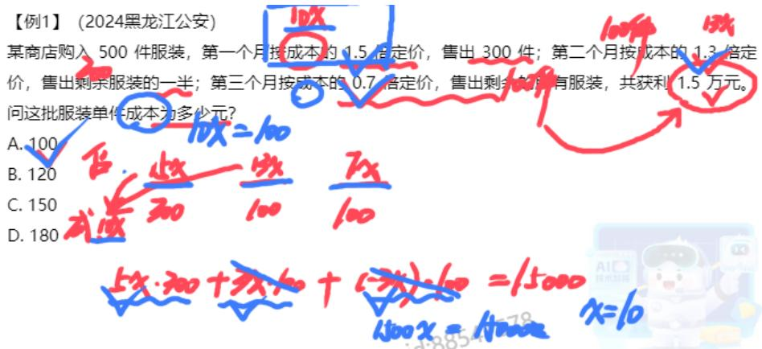

方法二：成本不变，“第一个月按成本的1.5倍定价，售出300件；第二个月按成本的1.3倍定价，售出剩余服装的一半；第三个月按成本的0.7倍定价”，第二个月相当于比成本多了0.3，第三个月相当于赔钱，比成本少了0.3，第二个月卖了100件，第三个月也卖了100件，说明第二个月和第三个月打平，赚的15000元是第一个月赚的钱，设成本为  $10\mathrm{x}$ ，售价为成本的1.5倍，则售价为  $15\mathrm{x}$ ，每件利润  $= 15\mathrm{x} - 10\mathrm{x} = 5\mathrm{x}$ ， $5\mathrm{x} * 300 = 15000 \rightarrow 1500\mathrm{x} = 15000 \rightarrow \mathrm{x} = 10$ ，所求  $= 10 * 10 = 100$ ，对应A项。【选A】

【例 2】（2024 江苏）元旦期间，某超市开展促销活动，甲、乙两种商品的单价之和为 25 元，购买甲商品 2 件及以上可享受八折优惠，购买乙商品 4 件及以上可享受六折优惠。小王下单购买了 2 件甲商品和 4 件乙商品，共优惠 16 元，则甲商品的单价是：

A. 5元

B. 10元

C. 15 元

D. 20 元

【解析】2. 与钱相关, 经济利润问题, 给具体量, 求具体量, 考虑设  $x$  求解,本题给出总的单价和为 25 , 明显给出和差关系, 设甲的单价为  $x$ , 则乙的单价为  $25 - x$ , 但现在进行了优惠, 甲打八折出售, 则甲的售价为  $80 \% * x = 0.8 x$ , 买 1 件甲优惠  $0.2 x$ , 一共有 2 件, 甲共优惠  $0.2 x * 2$ ; 乙打六折出售, 则乙每件的售价为  $0.6 * (25 - x)$ , 相当于便宜四折, 每件便宜的金额为  $0.4 * (25 - x)$ , 共有 4 件,则乙共优惠  $0.4 * (25 - x) * 4$ , 列式:  $0.2 x * 2 + 0.4 * (25 - x) * 4 = 16 \rightarrow x + 100 - 4 x = 40$

$\rightarrow 3x = 60 \rightarrow x = 20$  ，对应D项。【选D】

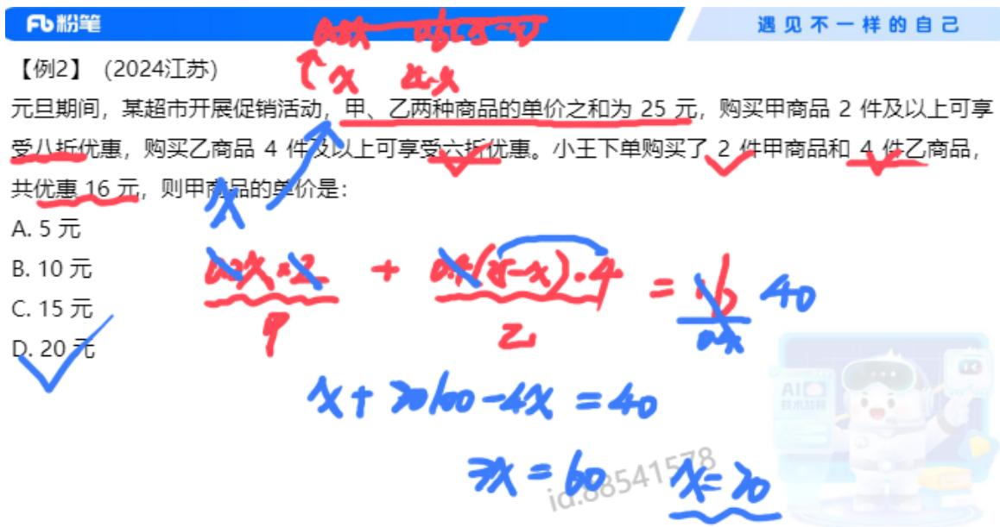

【例3】（2023浙江）某商品上月售价为进价的1.4倍，销售m件。本月该商品进价下降  $20\%$  ，售价不变，销售利润为上月的1.8倍。那么本月的销量为多少件？

A.  $1,3\mathrm{m}$

B.  $1.25 \mathrm{~m}$

C.  $1.2 \mathrm{~m}$

D.  $1.15 \mathrm{~m}$

【解析】3. 有上月、本月、售价、进价、销量、利润、总利润，有同学感觉每句话都能读懂，但整体很乱，不知道说什么。主体多、关系乱的题目（2个时间10个主体），要列表分析，如图所示，时间为上月、本月，主体为售价、进价、利润、数量、月销售利润（总利润）；没有具体量，求与m之间的倍数关系，本质上是求比例，无具体量，给的都是比例，考虑赋值法，有比例关系根据比例关系赋值，“某商品上月售价为进价的1.4倍”，赋值上月的进价为10，则售价为14，单件利润  $= 14 - 10 = 4$  ，销量为m，总利润为4m，本月进价下降  $20\%$  ，进价为  $10* (1 - 20\%) = 8$  ，售价不变为14，单价利润  $= 14 - 8 = 6$  ，销售利润为上月的1.8倍，则销售利润  $= 4m * 1.8 = 7.2m$  ，所求  $= 7.2m / 6 = 1.2m$  ，对应C项。【选C】

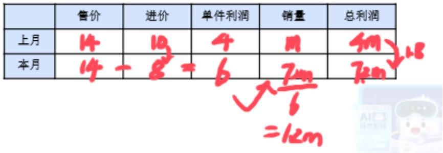

【例4】（2024吉林）某工厂去年销售一台机器的利润率为  $20\%$  ，由于生产效率提高，今年成本下降  $20\%$  ，售价不变，今年销售一台机器的利润率为：

A.  $30\%$

B.  $40\%$

C.  $50\%$

D.  $60\%$

【解析】4. 给比例，求比例，无具体量，考虑赋值；根据比例关系赋值，“利润率为  $20\%$ ”，利润率  $=$  利润/成本，与成本相关，经济利润问题往往对成本或定价赋值，赋值成本为 10，根据比例关系，则利润为 2，售价为  $10 + 2 = 12$ ，“今年成本下降  $20\%$ ”，今年成本为  $10 \times (1 - 20\%) = 8$ ，售价不变，售价为 12，所求  $= (12 - 8) / 8 = 4 / 8 = 1 / 2 = 50\%$ ，对应 C 项。【选 C】

# 二、分段计费

识别：水电费、出租车费、税费等，不同阶段计费标准不同

方法：①找到分段点

(2)分别计算  
③汇总加和

例：某地出租车收费标准为：3公里内起步价8元；超出3公里的部分，每公里2元。小明打车坐了12公里，共花费多少钱？

【注意】分段计费：考查较少，但只要考查  $90\%$  以上都是简单题。

1. 识别：水电费、出租车费、税费等，不同阶段计费标准不同。无法直接计算，分开计算，汇总加和。  
2. 方法：

（1）找到分段点（核心）。  
(2) 分别计算。

# (3) 汇总加和。

3. 例：某地出租车收费标准为：3 公里内起步价 8 元；超出 3 公里的部分，每公里 2 元。小明打车坐了 12 公里，共花费多少钱？

答：分段计费问题，若梳理不清楚，可以画线段分析， $0\sim 3$  公里收费8元， $3\sim 12$  公里，共走了9公里，每公里2元，收费  $9*2$  ，共收费  $8+9*2=8+18=26$  元。

【例5】（2023联考）某智慧公共停车场的收费标准如下：停车不超过15分钟，不收费；超过15分钟但不超过60分钟，按1小时计，收费5元；超过1小时后，超过的部分按每30分钟4元收费（不足30分钟，按30分钟计）。若李先生支付停车费17元，则他停车的时长可能为：

A. 2 小时

B. 2 小时 15 分钟

C. 2 小时 45 分钟

D. 3 小时

【解析】5. “停车不超过15分钟，不收费；超过15分钟但不超过60分钟，按1小时计，收费5元”，停车时长一定会超过15分钟，即第一个小时收费5元，给出不同的分段标准，给出总费用，求时长，分开段落凑，第一段为  $0 \sim 1$  小时，收费5元，花费17元，时间一定超过1小时，超过的部分按每30分钟4元收费， $5 + 4 + 4 + 4 = 17$  元，“不足30分钟，按30分钟计”，相当于最后4元不一定停了半小时，介于  $0 \sim 30$  分钟之间，故总时间为2小时～2.5小时之间，只有B项符合，对应B项。【选B】

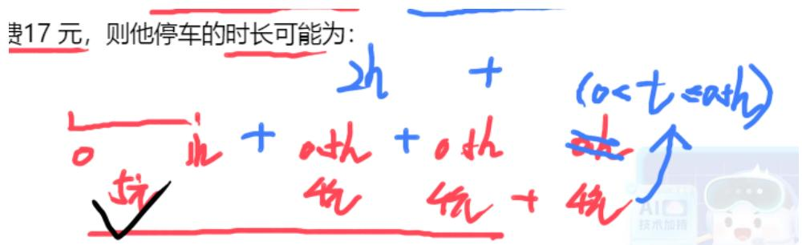

【例 6】(2025 国考) 化工商店出售 200 千克某种试剂, 前 60 千克打 2 折出售, 之后 60 千克打 5 折出售, 剩余部分原价出售。以下坐标图中, 最能准确反映该试剂销量和销售收入之间关系的是:

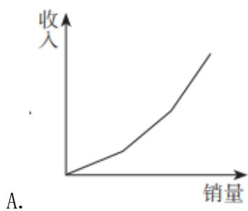

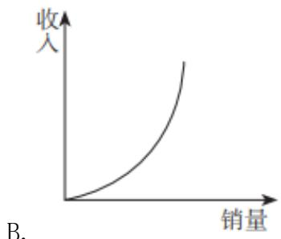

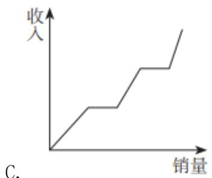

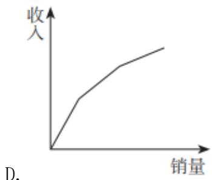

【解析】6. 分段计费问题，结合选项，B 项是一条曲线，不是三段，C 项不是三段，是 5 段收费，排除 B、C 项；“前 60 千克打 2 折出售，之后 60 千克打 5 折出售，剩余部分原价出售”，购买试剂是越来越贵的，说明上升越快（折线逐渐变斗），只有 A 项符合，符合题目要求，选择 A 项。【选 A】

【注意】猜题（不作为参照）：最大相似度，四个选项中一定有1个图是正确答案，数学答案是唯一的，其他的图一定是参考正确答案做干扰，一定与正确答案很相似，基于相似的原则，观察四个选项，一定先排除B项，因为其他选项都是直线，只有B项是曲线，可以排除D项，因为其他选项都是越来越快的，只有D项是越来越慢的，剩余A、C项比较，四个图形中有2个图是3段，只有C项是五段，猜测答案为A项。

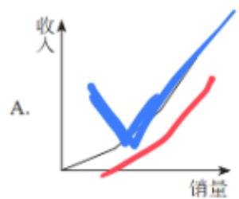

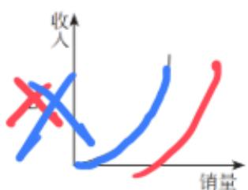

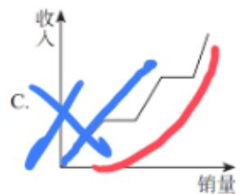

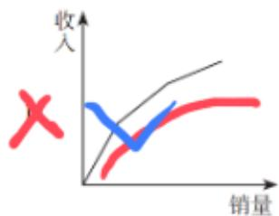

# $\mathring{\mathcal{O}}$  思维导图

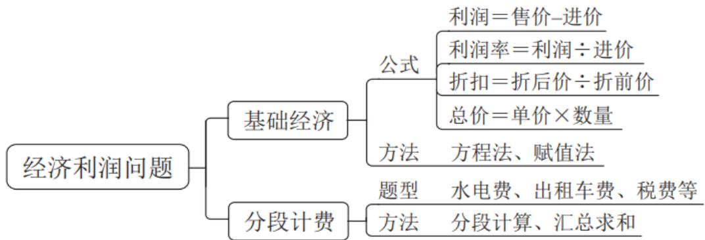

【注意】经济利润问题：绝大多数问题很好解决。

1. 基础经济：

（1）公式：4个公式一定要记牢。  
(2) 方法:

(1)给具体量, 求具体量, 用方程法。  
(2)给比例, 求比例, 三量关系只知其一, 用赋值法。

2. 分段计费：分开计算、汇总加和。

# 知识点梳理

1. 工程问题的基本等量关系：__________。  
2. 给完工时间型的工程问题的解题思路：

先赋值 ，赋值的技巧是

再算  $\_ = \_ /$  ；最后根据工作过程列式子或方程。

3. 给效率比例型的工程问题的解题思路：

先赋值________，赋值的技巧是________；

再算  $= \text{水} *$  ；最后根据工作过程列式子或方程。

4. 给 ______ 型工程问题的解题思路：设未知数，找等量关系列方程。

【注意】知识点梳理：工程问题。

1. 工程问题的基本等量关系：总量  $=$  效率  $*$  时间。  
2. 给完工时间型的工程问题的解题思路（给多个完工时间）：先赋值总量，赋值的技巧是赋值完工时间的公倍数；再算效率=总量/时间；最后根据工作过程列式子或方程（一般是一个工程分为几个阶段，将每个阶段的工作量加和）。

3. 给效率比例型的工程问题的解题思路（给出效率的比例关系）：先按照比例赋值效率，赋值的技巧是根据比例关系赋值；再算总量=效率*时间；最后根据工作过程列式子或方程。  
4. 给具体单位型工程问题的解题思路（给总量或效率的具体值）：设未知数，找等量关系列方程。

# 知识点梳理

1. 经济利润问题涉及的基本公式：

利润  $=$  -、利润率  $=$  /，售价  $=$  \*

折扣  $=$  /单价\*数量。

2.题目已知具体价格时，解题方法：________；

题目没有具体价格时，解题方法：________。

3. 典型的 _______ 问题有：水电费、出租车费、税费等，

其解题过程： ，

【注意】知识点梳理：经济利润问题。

1. 经济利润问题涉及的基本公式：利润=售价-进价、在数量关系中利润率=利润/进价，在资料分析中利润率=利润/收入，售价=进价*/（1+利润率），考查不多，根据前两个公式推导而来，售价=进价+进价*利润率=进价+利润；折扣=折后价/折前价，总价=单价*数量。  
2. 题目已知具体价格时，解题方法：设 x 列方程求解；题目没有具体价格时（最常见），解题方法：根据比例赋值求解。  
3. 典型的分段计费问题有：水电费、出租车费、税费等，其解题过程：找到分段点、分开计算、汇总求和。

【课后练习1】（2023浙江）甲、乙合作完成一项工程，甲的效率是乙的1.5倍。工程开始后，甲先单独工作5天，接着乙单独工作10天，剩余工作还需合作5天完成。如果这项工程全程由甲、乙合作完成，需要多少天？

A. 10

B. 12

C. 15

D. 18

【解析】拓展1.给效率比例型工程问题，三步走，（1）赋效率：“甲的效率是乙的1.5倍”，赋值  $\mathrm{P}_{\text{甲}} = 3$  、  $\mathrm{P}_{\text{乙}} = 2$  ；（2）算总量：“甲先单独工作5天，接着乙单独工作10天，剩余工作还需合作5天完成”，  $W = 3*5 + 2*10 + 5*(3 + 2) = 60$  ；（3）根据工作过程列式求解：所求  $= 60 / (3 + 2) = 60 / 5 = 12$  ，对应B项。【选B】

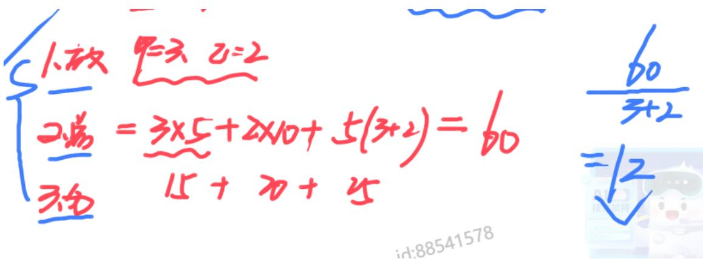

【注意】很多同学看到“1.5倍”会分析不清楚比例关系，但做题多会发现很多题目都会出现1.5倍。

【课后练习2】（2023联考）某商场柜台出售一款小家电，如果按定价打九折出售可获得利润70元，如果按定价打九五折出售可获得利润100元，这款小家电进货价格所在区间是：

A.  $400 \sim 450$  元

B.  $450 \sim 500$  元

C.  $500 \sim 550$  元

D.  $550 \sim 600$  元

【解析】拓展 2. 方法一：给具体量，求具体量，从大方向上思考，本题需要找等量关系设未知数，利润=售价-进价，“如果按定价打九折出售可获得利润70元，如果按定价打九五折出售可获得利润100元”，都与定价相关，设定价为x，进价未知设为y，得到两个方程， $0.9x - y = 70①$ ， $0.95x - y = 100②$ ， $② - ①$ 得： $0.05x = 30 \rightarrow x = 600$ ，有同学错选D项；求进价，代回原式， $0.9*600 - y = 70 \rightarrow 540 - y = 70 \rightarrow y = 470$ ，对应B项。

方法二：在进价不变时，九折的利润为70，九五折的利润为100，利润相差30元，成本不变，由于多了0.5折导致30元差距，设定价为x，多的0.5折为 $0.05\mathrm{x} = 30 \rightarrow \mathrm{x} = 600$ ，代入式子，“如果按定价打九折出售可获得利润70元”， $600*0.9 - 70 = 470$ ，对应B项。【选B】

道阻且长，行则将至

预习：

第四节：几何问题

第五节：等差数列

尽量自己认真思考做一遍，听课效果更佳

起码熟悉题目

# 【答案汇总】

工程问题1-5：CDCBD；6：C

经济利润问题 1-5: ADCCB; 6: A

遇见不一样的自己

Be your better self