# 精讲精练-数量3

(讲义+笔记)

主讲教师：田鹏

授课时间：2025.03.13

# 精讲精练-数量3（讲义）

# 学习任务：

1. 课程内容：几何问题、等差数列问题  
2. 对应讲义：第  $390 \sim 395$  页

# 3.重点内容：

（1）掌握几何问题基本公式及其运用  
(2) 掌握三角形三边关系、勾股定理、特殊三角形及面积相关知识  
（3）掌握相似三角形的判定和定理的计算方式等  
(4) 掌握等差数列的通项公式以及各种求和公式

# 第四节 几何问题

【例1】（2024广东事业单位）将边长为80厘米的正方形硬纸板裁剪成一个最大的圆形硬纸板，则被裁剪掉的硬纸板面积为多少平方厘米？

A.  $80 + 40\pi$

B.  $800 + 400\pi$

C.  $640 - 160\pi$

D.  $6400 - 1600\pi$

【例 2】(2023 国考)一个圆柱体零件 A 和一个圆锥体零件 B 分别用甲、乙两种合金铸造而成。A 的底面半径和高相同，B 的底面半径是高的 2 倍，两个零件的高相同，质量也相同。问甲合金的密度是乙合金的多少倍？

A.  $4 / 3$

B.  $3 / 4$

C.  $2 / 3$

D.  $3 / 2$

【例 3】(2024 广东)甲、乙、丙三艘船在海上航行。某一时刻, 甲观测到乙位于它的北偏西  $30^{\circ}$  方向, 甲、乙相距 6 千米; 甲观测到丙位于它的正西方

向，甲、丙相距6千米，则乙与丙之间的距离为多少千米？

A. 3

B. 4

C. 5

D. 6

【例 4】（2022 联考）兔子和乌龟举行一场跑步比赛，终点位于起点正北方 500 米处。兔子和乌龟同时出发，均保持匀速奔跑，且兔子的速度是乌龟的 5 倍。兔子先向正东方跑了一会儿后发现自己跑错了方向，马上直奔终点，速度不变，结果兔子和乌龟同时到达终点。那么兔子发现跑错方向时已经跑了多少米？

A. 600

B. 1200

C. 2400

D. 3000

【例 5】（2025 天津）某工业园区内一区域如下图所示，三角形 ABC 与 ACD 为两个面积相等的直角三角形，AB 长度是 BC 的 2 倍。现在区域内划出如图两个圆形区域摆放花坛，两个圆形均与图中两条边相切。已知 B 点到大圆、D 点到小圆上任一点的最短距离分别为 AD 长度的  $1 / 2, 1 / 5$  ，问大圆面积是小圆的多少倍？

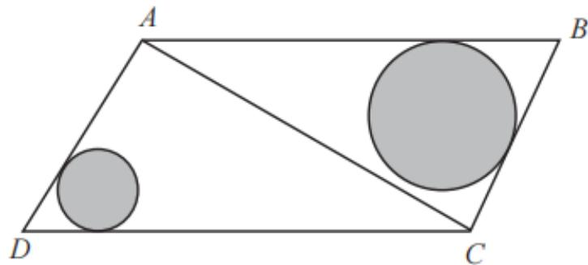

A. 3 倍以下

B.  $3 \sim 3.5$  倍之间

C.  $3.5 \sim 4$  倍之间

D. 4 倍以上

【例6】（2025国考）某厂区如图所示，其中ABCD为矩形，ABEF为直角梯形，AB与DE相交于G点，其中阴影区域ADGF为涉密区域。已知AD、AF、AB长度分别为240米、150米、100米，问涉密区域的面积为多少万平方米？

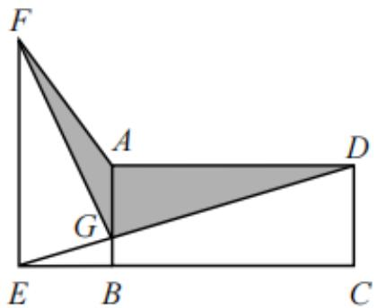

A. 1.2

B. 1.3

C. 1.4

D. 1.5

【例7】（2023国考）公园里有一片四边形草坪，沿对角线修建的小道相交于0点，0到四个顶点A、B、C、D的距离之比正好为1：2：3：4，一名工人花费1天正好完成AOB区域的修剪，问第二天至少需要额外增加多少名效率相同的工人一起工作，才能在当天内完成剩余草坪的修剪？

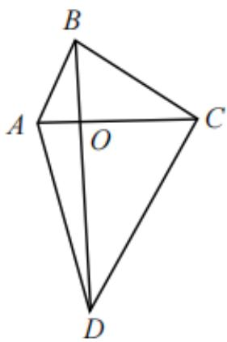

A. 8

B. 10

C. 11

D. 12

【例8】（2023国考）一个三角形公园ABC内的道路如下图中实线所示。已知AE=EF=FB，AD=DC，且黑色部分为人工湖。问公园总面积是人工湖面积的多少倍？

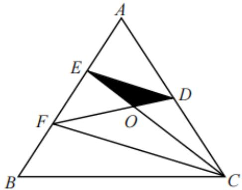

A. 9

B. 12

C. 16

D. 18

【例 9】（2024 联考）有一个高为  $\mathrm{h}$  的圆锥形容器，若容器内装有 10 升水，水面高度恰好为容器高度的一半。问该容器最多能装多少升水？

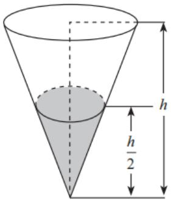

A. 80

B. 60

C. 40

D. 20

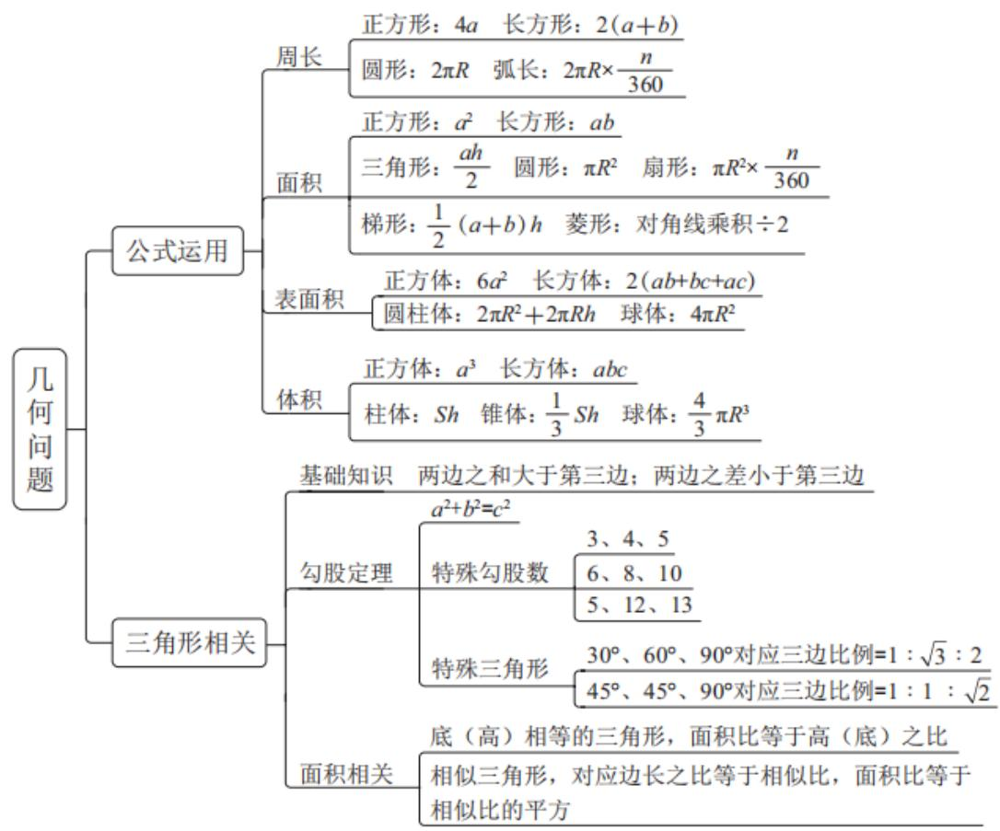  
$\text{念}$  思维导图

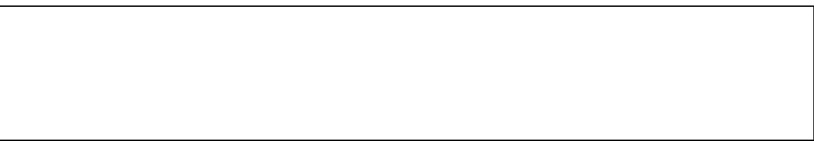  
第五节 等差数列问题

【例1】（2022联考）某市对下辖9个文艺表演团体去年新创节目的数量进行统计分析，发现9个团体新创节目的数量恰好成等差数列，其中前5个团体的新创节目总数是60，前7个团体的新创节目总数是70。那么这9个文艺表演团体去年新创节目的总数是：

A. 72

B. 76

C. 78

D. 80

【例2】（2024陕西事业单位）小明做值日的时候发现教室的挂历上显示的

是一周前的日期，于是小明将挂历的日期翻到今天，恰好所翻页的日期加起来是175。问今天是几号？

A. 24

B. 25

C. 28

D. 29

【例3】（2023国考）工厂从某周第一天开始生产某种零件，每周生产7天，从第二天开始每一天都比前一天多生产200件。已知工厂第三周的产量是第一周的2倍，问第几天其日产量第一次达到1万件？

A. 37

B. 38

C. 39

D. 40

【例4】（2024黑龙江公安）某工厂生产一批零件，已知第1天每名工人只能生产10个，往后每天都比前一天多生产1个。若安排100名工人生产，25天正好完成这项生产任务。问若要在15天内完成这项生产任务，至少需要安排多少名工人？

A. 256

B. 243

C. 225

D. 216

# $\mathcal{O}$  思维导图

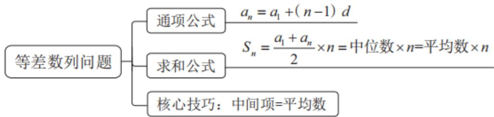

# 精讲精练-数量3（笔记）

# 学习任务：

1. 课程内容：几何问题、等差数列问题  
2. 对应讲义：第  $390 \sim 395$  页

# 3.重点内容：

（1）掌握几何问题基本公式及其运用  
(2) 掌握三角形三边关系、勾股定理、特殊三角形及面积相关知识  
（3）掌握相似三角形的判定和定理的计算方式等  
(4) 掌握等差数列的通项公式以及各种求和公式

# 目录

# 01 几何问题

# 02 等差数列

【注意】几何问题每年考好几个，一般至少  $2 \sim 3$  个，等差数列是这几年的热门小考点，国考、省考每年考一个等差数列。

# 第四节 几何问题

【注意】几何问题有些题有图，有些题需要自己画图，但都是和图有关的。两极分化比较严重，简单题最多，中等题较少，剩下的是难题，简单题+中等题占  $70\%$  ，难题占  $30\%$  。难题有时间做也不做，做一题难题的时间不如做三题言语。核心策略是把简单题和中等题抓住即可，接下来的问题是如何识别简单题。

# 几何问题的学习要点

# 公式类  $\rightarrow$  结论类

【注意】一看就知道用什么公式  $\rightarrow$  公式类, 一定要做。知道结论就可以做的  $\rightarrow$  结论类。

# 一、基础公式

1. 规则图形——直接用公式  
2. 不规则图形——割补转化成规则图形

# 【注意】基础公式：

1. 规则图形——直接用公式，比如长方形周长面积、正方形周长面积、圆周长面积。  
2. 不规则图形——割补转化成规则图形。直角三角形内接一个圆，求阴影部分的面积，阴影部分不是规则的， $S_{\text{阴影}} = S_{\text{三角形}} - S_{\text{圆}}$ 。

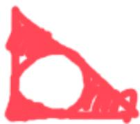

# 长度相关公式

正方形周长：  $C_$  正方形  $= 4a$

长方形周长：  $C_$  长方形  $= 2(a + b)$

圆形周长：  $C_{\text{圆}} = 2\pi r$

扇形弧长公式：  $2\pi r \times \frac{n^{\circ}}{360^{\circ}}$

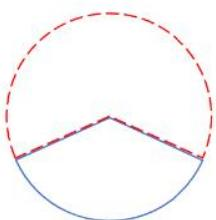

# 【注意】长度相关公式：

1. 正方形周长：  $C_{\text{正方形}} = 4a$  。  
2. 长方形周长：  $C_{\text{长方形}} = 2(a + b)$  。  
3. 圆形周长：  $C_{\text{圆}} = 2\pi r = \pi d$ 。  
4. 扇形弧长公式： $2\pi r * n^{\circ} / 360^{\circ}$ 。扇形是圆的一个部分， $C_{\text{圆}} = 2\pi r$ ，看扇形在圆中所占的比例  $\rightarrow n^{\circ} / 360^{\circ}$ 。

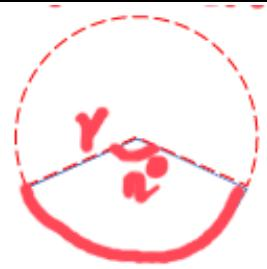

# 面积相关公式

$$
S _ {\text {正 方 形}} = a ^ {2}
$$

$S_{\text{菱形}} =$  对角线乘积  $\div 2$

$$
S _ {\text {长 方 形}} = a b
$$

$$
S _ {\text {平 行 四 边 形}} = a h
$$

$$
S _ {\text {三 角 形}} = \frac {1}{2} a h
$$

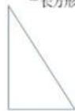

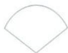

$$
S _ {\text {烟}} = \frac {n ^ {\circ}}{3 6 0 ^ {\circ}} \pi r ^ {2}
$$

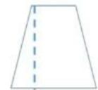

$$
S _ {\text {梯 形}} = \frac {1}{2} (a + b) h
$$

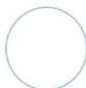

$$
S _ {\text {例}} = \pi r ^ {2}
$$

# 【注意】

1.  $S_{\text {正方形}} = a^{2}; S_{菱形} =$  对角线乘积 / 2, 菱形是特殊的平行四边形, 四边相等, 连接对角线是对称的, 对角线与对角线是垂直的。连接对角线分成 4 个全等的直角三角形, 两条对角线分别为 a、b,  $1 / 2 * (1 / 2) * a * (1 / 2) * b * 4 = ab / 2; S_{\text {长方形}} = ab$  。

${S}_{\text{菱形 }} =$  对角线乘积  $\div  2$

$$
S _ {\text {长 方 形}} = a b
$$

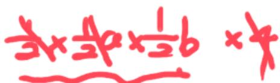

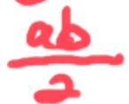

2.  $\mathrm{S}_{\text{平行四边形}} = \mathrm{ah}$ ； $\mathrm{S}_{\text{三角形}} = \mathrm{ah} / 2$ 。  
3.  $S_{\text{梯形}} = (a + b) / 2 * h$ ;  $S_{\text{圆形}} = \pi r^2$ ;  $S_{\text{扇形}} = n^\circ / 360^\circ * \pi r^2$ ,  $n^\circ / 360^\circ$  是占比,  $\pi r^2$  是圆面积。

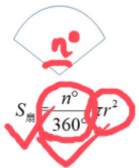

# 表面积相关公式

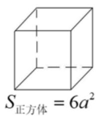

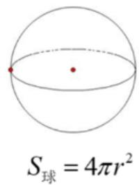

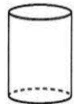

$$
S _ {\text {圆 柱}} = 2 \pi r ^ {2} + 2 \pi r h
$$

【注意】表面积相关公式： $\mathrm{S}_{\text {正方体}} = 6 \mathrm{a}^{2}$ ，6个面都是正方形； $\mathrm{S}_{\text {长方体}} = 2 \mathrm{ab} + 2 \mathrm{bc} + 2 \mathrm{ac}$ ，有三组相对面： $\mathrm{S}_{\text {球体}}: 4 \pi \mathrm{r}^{2}$ ； $\mathrm{S}_{\text {圆柱体}}: 2 \pi \mathrm{r}^{2} + 2 \pi \mathrm{r} * \mathrm{h}$ ，圆柱侧面展开是一个长方形，上下底面是圆  $\rightarrow \pi \mathrm{r}^{2} * 2$ ，长方形的长是圆的周长  $\rightarrow 2 \pi \mathrm{r}$ ，长方形面积为  $2 \pi \mathrm{r} * \mathrm{h}$ 。

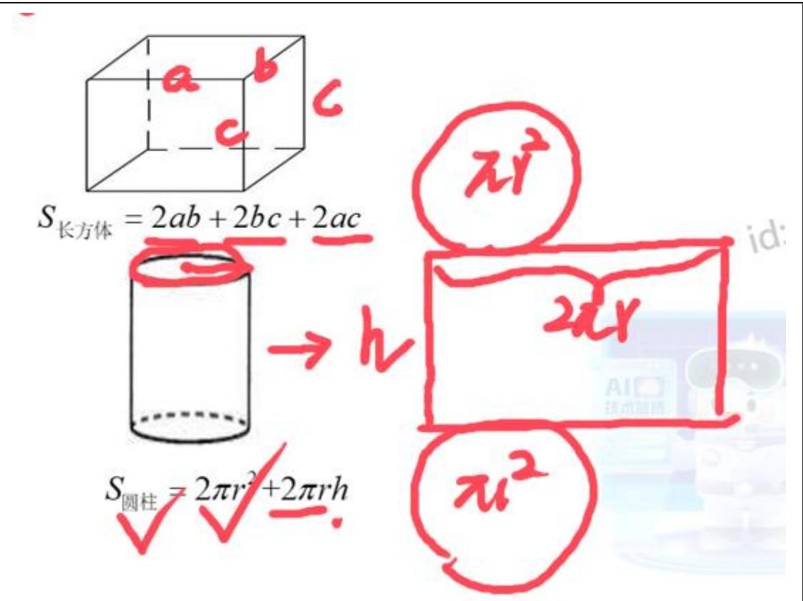

体积相关公式  
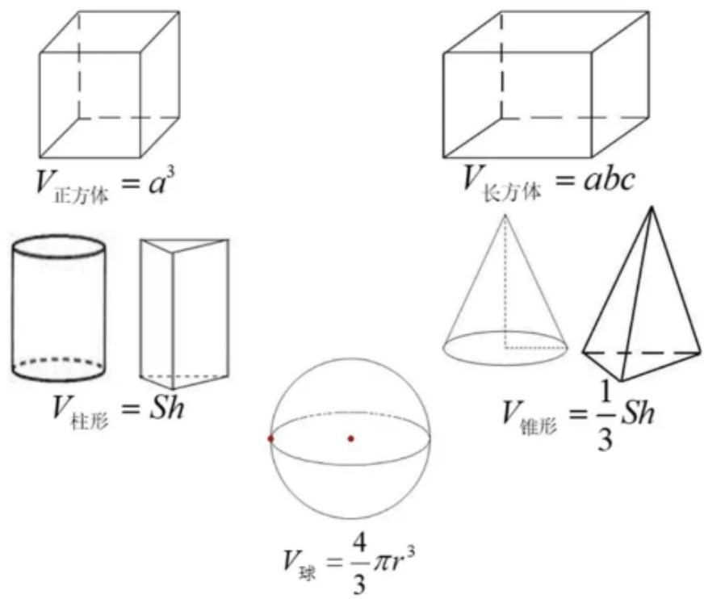  
【注意】体积相关公式： $V_{\text{正方体}} = a^3$ ； $V_{\text{长方体}} = abc$ ； $V_{\text{柱体}} = Sh$ ，圆柱的底面是  $\pi$

$\mathrm{r}^{2}$ , 所有的柱体都是底面积  $*$  高;  $\mathrm{V}_{\text {椎体}} = 1 / 3 * \mathrm{Sh}$ , 所有的椎体都是底面积  $*$  高  $(1 / 3)$ ;  $\mathrm{V}_{\text {球体}} = 4 / 3 * \pi \mathrm{r}^{3}$  。

# 【知识点】几何公式：

# 1.周长：

（1）正方形：4a；长方形：2（a+b）。  
(2) 圆形:  $2 \pi r$ ; 弧长:  $2 \pi r * n^{\circ} / 360^{\circ}$  。

# 2. 面积：

(1) 正方形:  $a^2$ ; 长方形: ab。  
(2) 三角形: ah/2; 圆形: πr²; 扇形: πr²*n° /360°。  
(3) 梯形:  $\left( {a + b}\right) /{2 * h}$  ; 菱形: 对角线乘积/2。

# 3. 表面积：

（1）正方体：  $6\mathrm{a}^2$  ；长方体：2（ab+bc+ac）。  
（2）圆柱体：  $2\pi r^2 + 2\pi r * h$ ；球体：  $4\pi r^2$ 。

# 4. 体积：

（1）正方体：  $a^3$  ；长方体：abc。  
(2) 柱体: Sh; 椎体:  $1 / 3 * \mathrm{Sh}$ ; 球体:  $4 / 3 * \pi \mathrm{r}^{3}$  。

【例1】（2024广东事业单位）将边长为80厘米的正方形硬纸板裁剪成一个最大的圆形硬纸板，则被裁剪掉的硬纸板面积为多少平方厘米？

A.  $80 + 40\pi$

B.  $800 + 400\pi$

C.  $640 - 160\pi$

D.  $6400 - 1600\pi$

【解析】1. 正方形边长为 80，则圆的直径为 80，半径为 40，所求  $= S_{\text{正}} - S_{\text{圆}} = 80^2 - \pi 40^2 = 6400 - 1600 \pi$ ，对应 D 项。【选 D】

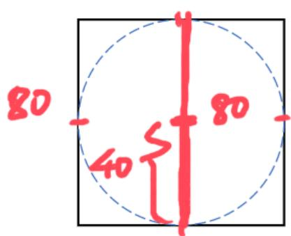

$$
= \frac {S _ {\pi} - S _ {0}}{a ^ {2}} = \frac {\pi r ^ {2}}{8 0}
$$

$$
\frac {1 4 0}{A} - 1 6 0 \pi
$$

# 【注意】

1. 前面是 6400，只有 D 项符合，选择 D 项。  
2. 所求  $= a^{2} -$  一个数，前面是平方数，排除 A、B 项，640 不是平方数，排除 C 项，选择 D 项。

【例 2】（2023 国考）一个圆柱体零件 A 和一个圆锥体零件 B 分别用甲、乙两种合金铸造而成。A 的底面半径和高相同，B 的底面半径是高的 2 倍，两个零件的高相同，质量也相同。问甲合金的密度是乙合金的多少倍？

A.  $4 / 3$

B.  $3 / 4$

C.  $2 / 3$

D.  $3 / 2$

【解析】2. 出现圆锥体、圆柱体，知道公式  $\rightarrow$  公式类。密度是初中物理中学的，密度  $=$  质量/体积， $(\mathrm{m_A} / \mathrm{V_A})$ ： $(\mathrm{m_A} / \mathrm{V_B})$ ，质量相同，则所求  $= \mathrm{V_B} / \mathrm{V_A}$ ，质量一定，密度和体积成反比。半径、高都没有给，给的是倍数，求的也是倍数，赋值。对于 A， $r = 1, h = 1$ ；对于 B， $r = 2, h = 1$ 。 $\mathrm{V_A} = \mathrm{S} * \mathrm{h} = \pi r^2 * \mathrm{h} = \pi * 1^2 * 1 = \pi$ ， $\mathrm{V_B} = 1 / 3 * \mathrm{S} * \mathrm{h} = 1 / 3 * \pi$ ； $\pi r * h = 1 / 3 * \pi * 4 * 1 = 4 \pi / 3$ ，所求  $= \mathrm{V_B} / \mathrm{V_A} = (4 \pi / 3) \div \pi = 4 / 3$ ，对应 A 项。【选 A】

【例 3】(2024 广东)甲、乙、丙三艘船在海上航行。某一时刻, 甲观测到乙位于它的北偏西  $30^{\circ}$  方向, 甲、乙相距 6 千米; 甲观测到丙位于它的正西方向, 甲、丙相距 6 千米, 则乙与丙之间的距离为多少千米?

A. 3

B. 4

C. 5

D. 6

【解析】3. 画坐标系，甲观测到  $\rightarrow$  甲在原点，乙在甲北偏西  $30^{\circ}$ ，甲乙相距为6，丙在甲正西方向，甲丙相距6，甲乙丙构成一个三角形，两条边都是6，有一个  $30^{\circ}$ ，有直角，则  $\angle$  乙甲丙  $= 60^{\circ}$ ，这个三角形为等边三角形，对应D项。【选D】

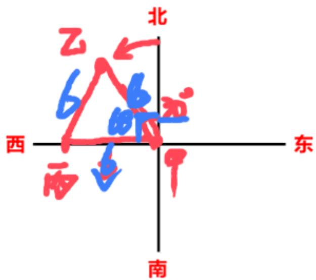

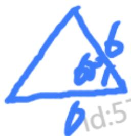

【注意】经验：一般题目涉及方向，需画坐标系作图，上北下南左西右东。

# 二、结论类——三角形相关：

1. 勾股定理： $a^2 + b^2 = c^2$

常考勾股数：（3、4、5）n、（6、8、10）、（5、12、13）n

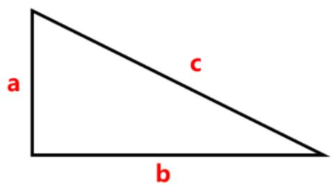

【注意】结论类——三角形相关：常考的是直角三角形  $\rightarrow$  RT $\triangle$ 。

1. 勾股定理： $a^2 + b^2 = c^2$ 。  
2. 常考勾股数：（3、4、5）n、（6、8、10）本质是（3、4、5）的倍数、（5、12、13）n。考试爱考勾股数，记住做题会快。

(1) 确定形状: 已知一个三角形的三边长度为 6、8、10, 满足勾股数, 可以证明这个三角形是直角三角形。  
(2) 已知两条边, 求第三条边: 已知有一个直角三角形,  $a = 1000$ ,  $b = 2400$ ,求 c, 套公式需要用  $\sqrt{1000^{2} + 2400^{2}}$ ,  $1000 = 5 * 200$ ,  $2400 = 12 * 200$ , 直角三角形中有两条边符合勾股数的比例, 第三边一定符合,  $c = 13 * 200 = 2600$  。

# 二、结论类——三角形相关：

1. 勾股定理  $\mathrm{a}^{2} + \mathrm{b}^{2} = \mathrm{c}^{2}$

常考勾股数：（3、4、5）n、(6、8、10)

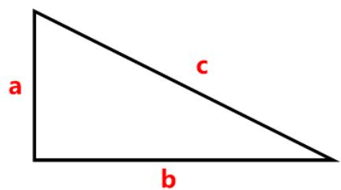

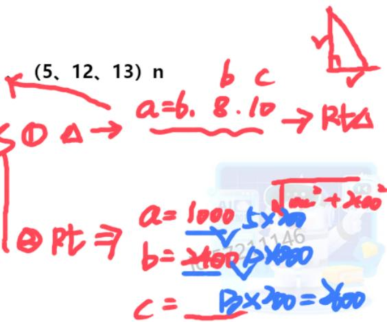

【例 4】（2022 联考）兔子和乌龟举行一场跑步比赛，终点位于起点正北方 500 米处。兔子和乌龟同时出发，均保持匀速奔跑，且兔子的速度是乌龟的 5 倍。兔子先向正东方跑了一会儿后发现自己跑错了方向，马上直奔终点，速度不变，结果兔子和乌龟同时到达终点。那么兔子发现跑错方向时已经跑了多少米？

A. 600

B. 1200

C. 2400

D. 3000

【解析】4. 画坐标系，起点为 A，终点为 B。兔子先向正东方跑了一会儿后发现自己跑错了方向，马上直奔终点，兔子从 A 点出发，假设到 C 点发现错了，再直奔到 B 点；没有说乌龟怎么跑，兔子是跑错了，乌龟是从 A 到 B。已知  $AB = 500m$ ，兔子跑的是  $AC + BC$ ，兔子和乌龟同时出发同时到达，时间相同，速度是 5 倍，路程也是 5 倍， $AC + BC = 2500m$ 。问的是兔子发现跑错方向时已经跑了多少米，即求  $AC$ ， $AC = 2500 - x$ ，勾股定理， $500^2 + x^2 = (2500 - x)^2$ ，解方程比较麻烦，选项就是  $x$ ，可以代入选项，这是一个直角三角形，优先代入勾股数，短直角边为 500，能想到的勾股数是 5、12、13， $x = 1200$ ， $2500 - x = 1300$ ，就是正确答案，对应 B 项。【选 B】

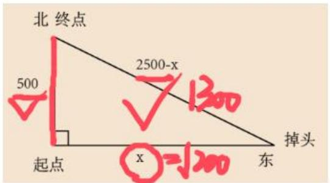

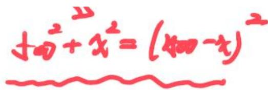

# 【注意】

1. 经验：一般题目涉及方向，需画坐标系作图。  
2. 当题目出现直角三角形且所给数据均为整数时，优先猜勾股数  $3 / 4 / 5$  或  $5 / 12 / 13$ 。

# 二、结论类——三角形相关：

2. 特殊三角形三边关系

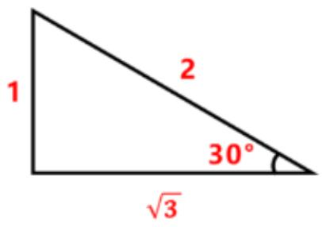

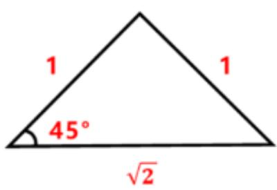

【注意】特殊三角形三边关系：

1.  $30^{\circ}$  角直角三角形: 三边之比为  $30^{\circ}$  所对直角边:  $60^{\circ}$  所对直角边: 斜边  $= 1: \sqrt{3}: 2$  。已知  $30^{\circ}$  角直角三角形的短直角边为 75 , 没记住就需要用斜边为 2 倍的短直角边  $\rightarrow 150$ , 长直角边为  $\sqrt{150^{2} - 75^{2}}$ , 记住比例, 则斜边为 150 , 长直角边为  $150 \sqrt{3}$  。已知直角边: 斜边  $= 1: 2$ , 前提是直角三角形, 1 对应的角为  $30^{\circ}$  。两条直角边之比为  $1: \sqrt{3}$ , 则两个角为  $30^{\circ} 、 60^{\circ}$  。

2.45°角直角三角形：三边之比为  $1:1:\sqrt{2}$  。直角边为45，则斜边为  $45\sqrt{2}$  。

【例 5】（2025 天津）某工业园区内一区域如下图所示，三角形 ABC 与 ACD 为两个面积相等的直角三角形，AB 长度是 BC 的 2 倍。现在区域内划出如图两个圆形区域摆放花坛，两个圆形均与图中两条边相切。已知 B 点到大圆、D 点到小圆上任一点的最短距离分别为 AD 长度的  $1 / 2, 1 / 5$  ，问大圆面积是多少倍？

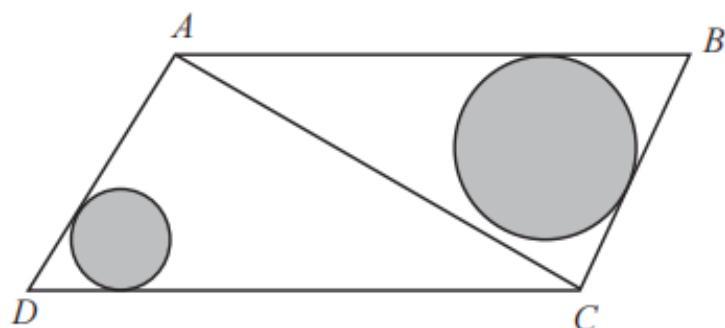

A. 3 倍以下

B.  $3 \sim 3.5$  倍之间

C.  $3.5 \sim 4$  倍之间

D. 4 倍以上

【解析】5. 三角形 ABC 与 ACD 为两个面积相等的直角三角形, 有一个公共的

直角边， $S = 1 / 2*a*b$ ， $S$ 、 $1 / 2$ 、 $a$  相同，则  $b$  相同，根据角边角，则这两个三角形全等。大的图形为平行四边形，两个直角为内错角，说明两条线平行；两个三角形全等，对应角相等  $\rightarrow$  内错角，说明两条线平行，因此ABCD为平行四边形。AB长度是BC的2倍，赋值BC=1，AB=2，已知是直角三角形，直角边：斜边=1：2,1对应的角∠BAC为 $30^{\circ}$ ， $\angle B = 60^{\circ}$ ，两个三角形全等， $\angle D = 60^{\circ}$ ， $\angle ACD = 30^{\circ}$ 。涉及相切的概念，说明直线和圆只有一个交点，切点连接圆心和切线是垂直的。红色的两个三角形全等（斜边相同，短直角边都是半径，有一个直角）， $\angle B$ 平分成两个角，研究一个三角形，一个角是 $30^{\circ}$ ，只需要分析一个 $30^{\circ}$ 的直角三角形， $30^{\circ}$ 角对应的是半径R，斜边为2R，黑色线为R，蓝色线为R，已知B点到大圆、D点到小圆上任一点的最短距离分别为AD长度的1/2、1/5，B点到大圆的最短距离就是R，D点到小圆的最短距离就是r，则 $R = 1 / 2*AD$ ， $r = 1 / 5*AD$ ，所求= $\pi R^2 / (\pi r^2) = (1 / 2)^2 \div (1 / 5)^2 = 25 / 4 = 6^+$ ，对应D项。【选D】

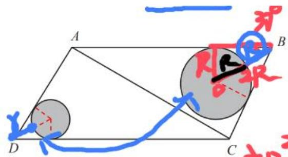

$$
R = \frac {1}{2} A D
$$

$$
r = a \frac {1}{5} A D
$$

$$
\frac {\mathrm {和} ^ {2}}{x r ^ {2}} = \frac {(\frac {1}{2}) ^ {2}}{(\frac {1}{2}) ^ {2}} = \frac {2 5}{4} = 6 ^ {+}
$$

# 二、结论类——三角形相关：

3. 拉窗帘模型（2025新热点）

已知  $1_{1} / / 1_{2}$ , 无论 A 点如何移动,  $\triangle ABC$  面积不变

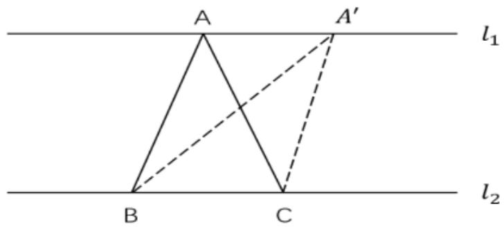

【注意】拉窗帘模型（2025 新热点）：已知  $1_{1} // 1_{2}$ ，三角形的顶点在一条线上，三角形顶点对应的边在另一条线上，无论 A 点如何移动， $\triangle ABC$  面积不变。 $l_{1} // l_{2}$ ， $h_{1} = h_{2}$ ，底一样，面积是一样的。

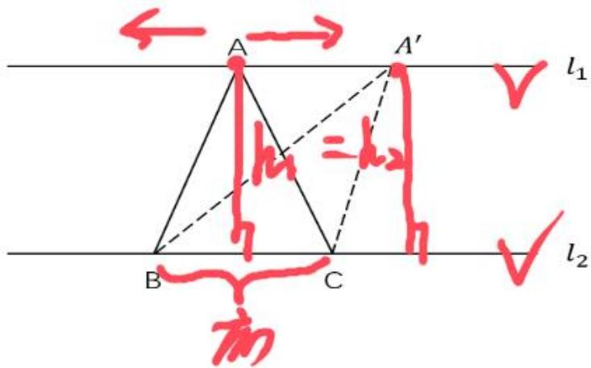

【例 6】(2025 国考) 某厂区如图所示, 其中 ABCD 为矩形, ABEF 为直角梯形, AB 与 DE 相交于 G 点, 其中阴影区域 ADGF 为涉密区域。已知 AD、AF、AB 长度分别为 240 米、150 米、100 米, 问涉密区域的面积为多少万平方米?

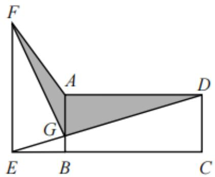

A. 1.2

B. 1.3

C. 1.4

D. 1.5

【解析】6. 已知  $AD = 240, AF = 150, AB = 100$  ，底边和高都没有，用函数表示会慢。△FAG 符合拉窗帘模型，F 点在一条平行线上，AG 在另一条平行线上，F 点可以在 FE 上拉动，移动到 E 点，阴影变成红色的部分，延长 AD 作高，高  $= AB = 100$  所求  $= 1 / 2 * 2400 * 100 = 12000$  ，对应 A 项。【选 A】

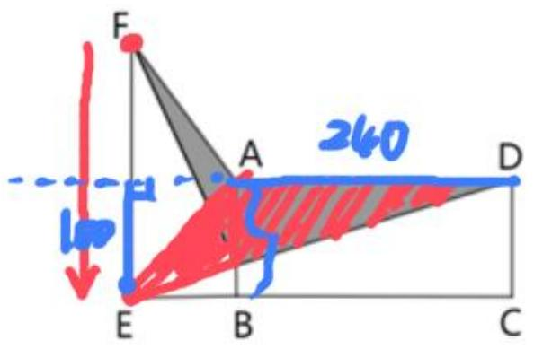

【拓展】（2025天津）某矩形农场ABCD如图所示，矩形区域ADEF为生产区，矩形区域BCEF为休闲区。现连接BD将两区域打通，与EF相交于O点。已知AF和FE的长度分别为600米和400米，问COD围成的三角形阴影区域面积为多少万平方米？

A. 12

B. 15

C. 16

D. 18

【解析】拓展. AF=600, EF=400, 则 AD=400, OE、EC 未知, 出现平行, 从左往右看, 一个点在平行线上, 一条底边在平行线上, D 点往 A 点拉,  $\triangle$  DOE、 $\triangle$ AOE 同底等高,  $\triangle$  DOE、 $\triangle$ AOE 面积是相同的, 不好算; 看右边, 一个点在平行线上, 一条底边在平行线上, C 点移到 B 点,  $\triangle$ OEC 和  $\triangle$ OEB 同底等高, 求阴影区域面积变成求  $\triangle$  DEB 的面积, 底边是 DE, 过 B 点作垂线, 高为 BC, 所求  $=1/2 * 600 * 400 = 120000$ , 对应 A 项。【选 A】

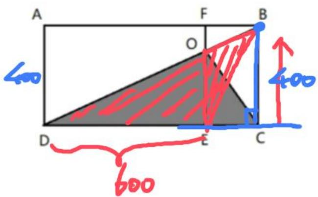

$= {12}$

# 二、结论类——三角形相关：

4. 面积性质（多个三角形，有公共边）

(1)两三角形底相同, 面积之比等于高之比;  
(2)两三角形高相同，面积之比等于底之比

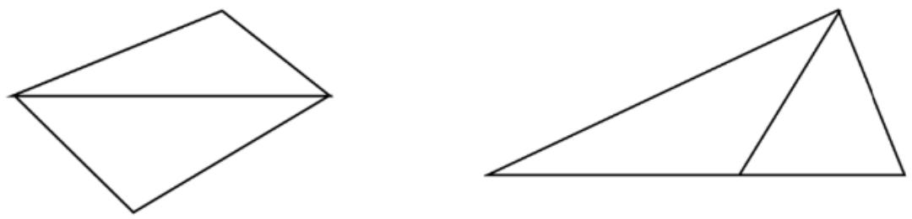

【注意】面积性质（多个三角形，有公共边）：

1. 两三角形底相同，面积之比等于高之比， $S_{1} = 1 / 2 * d * h_{1}$ ， $S_{2} = 1 / 2 * d * h_{2}$ ， $S_{1} / S_{2} = h_{1} / h_{2}$ 。出现典型图，就会考查。

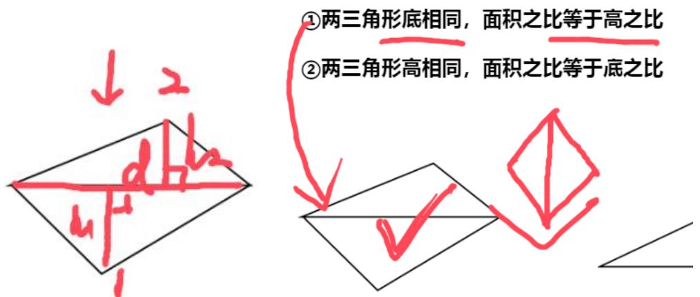

2. 两三角形高相同，面积之比等于底之比。过顶点作垂线，高相同， $S_{1} = 1 / 2 * d_{1} * h$ ， $S_{2} = 1 / 2 * d_{2} * h$ ， $S_{1} / S_{2} = d_{1} / d_{2}$ 。出现典型图（无论怎么转都要认识），就会考查。

# 4.面积性质 (多个三角形,有公共边)

(1)两三角形底相同, 面积之比等于高之比  
(2)两三角形高相同, 面积之比等于底之比

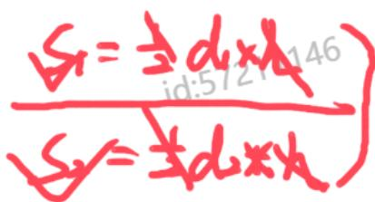

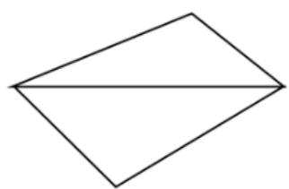

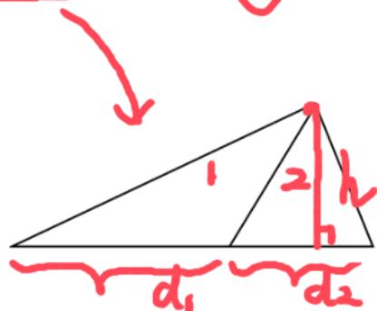

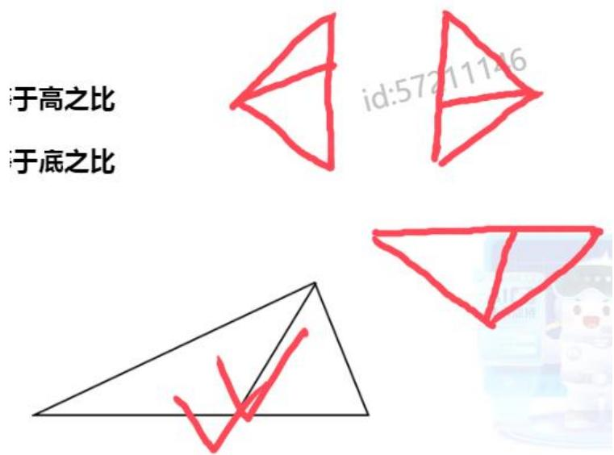

【例 7】（2023 国考）公园里有一片四边形草坪，沿对角线修建的小道相交于 0 点，0 到四个顶点 A、B、C、D 的距离之比正好为  $1: 2: 3: 4$  ，一名工人花费 1 天正好完成 AOB 区域的修剪，问第二天至少需要额外增加多少名效率相同的工人一起工作，才能在当天内完成剩余草坪的修剪？

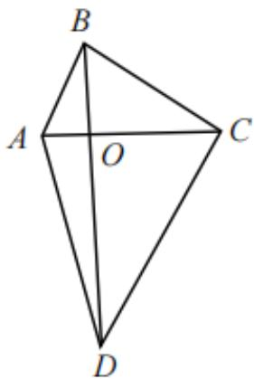

A. 8

B. 10

C. 11

D. 12

【解析】7. 方法一：高相同，面积比=底之比，可以横着看，也可以侧着看。0 到四个顶点 A、B、C、D 的距离之比正好为 1:2:3:4，则  $OA = 1$  ，  $OB = 2$  ，  $OC = 3$  ，  $OD = 4$  ，已知一名工人花费 1 天正好完成 AOB 区域的修剪，  $S_{\triangle AOB} = 1$  ，则  $\triangle AOB$  和  $\triangle BOC$  高相同，底之比为 1:3，面积比为 1:3，则  $S_{\triangle BOC} = 3$  ；同理，  $\triangle AOB$  和  $\triangle AOD$  底之比为 2:4=1:2，面积比为 1:2，  $S_{\triangle AOD} = 2$  ；  $\triangle AOD$  和  $\triangle COD$  底之比为 1:3，面积比为 1:3，  $S_{\triangle COD} = 6$  ，剩余总面积为  $2 + 3 + 6 = 11$  ，需要 11 个人，原来有 1 个人，

需要额外增加 10 人，对应 B 项。

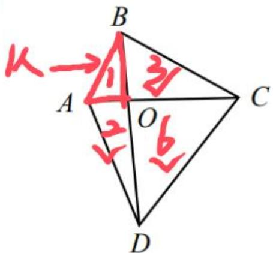

方法二：只要满足0到四个顶点A、B、C、D的距离之比正好为1：2：3：4，什么形状无所谓，图形形状不确定，就想最好算的形状，垂直， $\mathrm{S}_{\triangle \mathrm{AOB}} = 1 / 2*1*2 = 1$  则  $\mathrm{S}_{\triangle \mathrm{AOD}} = 1 / 2*2*4 = 2, \mathrm{S}_{\triangle \mathrm{BOC}} = 1 / 2*2*3 = 3, \mathrm{S}_{\triangle \mathrm{COD}} = 1 / 2*4*3 = 6$  ，剩余总面积为  $2 + 3 + 6 = 11$  需要11个人，额外增加10人，对应B项。【选B】

考场思维：图形形状不确定,就想最好算的形状

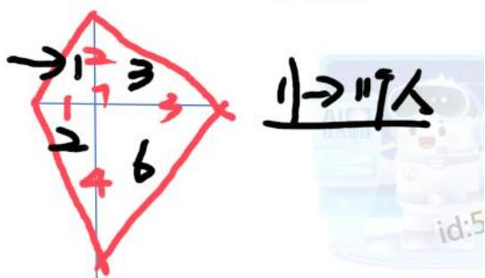

# 【注意】

1. 底（高）相同的三角形，面积比等于高（底）之比。  
2. 考场思维：图形形状不确定，就想最好算的形状。

结论类——三角形相关：

相似三角形（角、角）

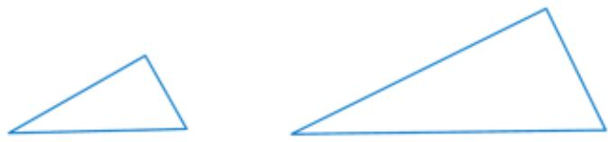

相似比=对应边之比=对应高之比=对应周长之比=对应线段之比

面积比  $=$  相似比

体积比  $=$  相似比

【注意】结论类——三角形相关：

1. 相似三角形（角、角）：证明：区分全等的证明，公务员考试中不需要证明，你觉得相似就相似，好像就是相似，公务员考试不考证明，长得像就是相似，如果真要证明，记住“角、角”（两个角相等）即可。

2. 结论：

(1) 相似比  $=$  对应边之比  $=$  对应高之比  $=$  对应周长之比  $=$  对应线段之比, 如下图, 高之比为 1: 2, 周长比也是 1: 2, 对应的线段 (蓝线) 之比也是 1: 2。

(2) 面积比  $=$  相似比; 中学的证明:  $S_{\triangle} = (1 / 2)*$  底  $*$  高, 两个三角形都有 “  $1 / 2$  ” , 高之比和底之比都是 “  $1: 2$  ” , 面积之比为  $(1: 2)^{2} = 1: 4$  。  
(3) 体积比  $=$  相似比; 如下图的圆锥, 上下两个大、小圆锥长得一模一样 (只是大小有区别)  $\rightarrow$  肯定相似, 如果半径比为 1: 3 , 下面两个圆的面积比为  $(1 / 3)^{2}$ , 整个的体积比为 “  $(1 / 3)^{3}$ ”  $\rightarrow$  因为体积公式  $=$  （1/3）*底面积\*高, 底面积之比为  $(1 / 3)^{2}$ , 再乘以高（的比）, 即  $(1 / 3)^{3}$  。

【拓】（2020联考）某演播大厅的地面形状是边长为100米的正三角形，现要用边长为2米的正三角形砖铺满（如图所示）。问：需要用多少块砖？

A. 2763

B. 2500

C. 2340

D. 2300

【解析】拓展. 课上正确率为  $94\%$ ；本题不用算三角形的面积，都是正三角形，不用证明相似，一定相似（形状一样、大小不同），求面积比，相似比为  $1 / 50$ ，面积比为  $1 / 2500$ ，对应 B 项。【选 B】

# 【注意】

1. 再看例 5: 如下图, 两个球长得一模一样  $\rightarrow$  相似, 距离两个顶点的距离分别为  $A D / 5 、 A D / 2$ , 相似比为  $5 / 2$ , 面积比为  $(5 / 2) ^{2} = 25 / 4 = 6^{+}$ , 对应 D 项。

2. 考场思维：相似不仅仅局限于三角形，只要形状相同（如正方形、圆形），就相似。

【例9】（2024联考）有一个高为  $\mathrm{h}$  的圆锥形容器，若容器内装有10升水，水面高度恰好为容器高度的一半。问该容器最多能装多少升水？

A. 80

B. 60

C. 40

D. 20

【解析】9. 结合图形，相似比为  $\mathrm{h} / 2 \div \mathrm{h} = 1 / 2$ ，体积比为  $(1 / 2)^3 = 1 / 8$ ，“1”表示“10”，“8份”表示“80”，对应A项。【选A】

梯形：蝴蝶定理

在一个梯形中，若上底：下底=a：b；

则四个三角形面积之比为上：下：左：右  $= a^{2}$  ：  $b^{2}$  ：ab：ab

【注意】梯形：蝴蝶定理——在一个梯形中（强调一下  $\rightarrow$  必须是梯形），若上底：下底=a：b，连接对角线，如下图，四个三角形面积之比为上：下：左：右  $= a^2$  ： $b^2$  ：ab：ab。

1. 如果已知上底和下底之比为  $1:2$ ，则四个三角形面积之比为  $1:2^{2}:2:2$ 。

2. 非等腰梯形也可以，所有梯形都可以适用。  
3. 原理:  $a^2$  (三角形) 和  $b^2$  (三角形) 相似 (对顶角、内错角都相等)  $\rightarrow$  边之比为  $a / b$ , 面积之比为  $(a / b)^2 \rightarrow a^2 / b^2$ ; 再看左右, (左边的)  $\triangle ABO$  和  $\triangle ACO$ , 高相同 (记为  $x$ ), 底之比为  $a: b$ , 满足:  $a^2 / x = a / b \rightarrow x = ab$ , 右边也是如此。

【例8】（2023国考）一个三角形公园ABC内的道路如下图中实线所示。已知AE=EF=FB，AD=DC，且黑色部分为人工湖。问公园总面积是人工湖面积的多少倍？

A. 9

B. 12

C. 16

D. 18

【解析】8.  $\triangle ACF$  中, E、D 均为中点, 两者的连线记作 “中位线”  $\rightarrow$  两个性质: 一定和底边平行、存在 1:2 的关系, DE 平行于 CF, ED=1/2*FC, 使用蝴蝶定理, 梯形 CDEF 中, 黑色小三角形面积记为 1 , 其他三角形为 2、2、4, 已知 AE=EF=FB, 三等分点, 底相等, 高相同, 中间紫色阴影 (面积) 为 6 , 则 (上下)两边的三角形也为 6 , 所求  $=$  (6+6+6):  $1 = 18: 1$ , 对应 D 项。【选 D】

一个三角形公园  $\mathrm{{ABC}}$  内的自路如下图中实线所示。已知问公园总面积是人工湖面积的多少倍？

# 【注意】

1. 考场思维：如果不会算，黑色面积如果为 1，红色部分面积应该为 2（高相同，底之比差不多为 2 倍）， $\triangle CDE$  为  $2 + 1 = 3$ ，蓝色面积（ $\triangle ADE$ ）也为 3，则  $\triangle ACE$  面积为  $3 + 2 + 1 = 6$ ，其余两个三角形（ $\triangle CEF$ 、 $\triangle BCF$ ）面积也为 6，所求  $= (6 + 6 + 6)$ ： $1 = 18:1$ 。

园总面积是人工湖面积的多少倍？

考场思维：我不会算，我还不会看？

2. 再看例 5: 直接看, 两个圆的半径差不多是  $2^{+}$  (也可以用身份证、直尺、准考证比一下), 面积是  $2^{+2} = 4^{+}$ , 对应 D 项。

考场思维：我不会算，我还不会看

$$
(\frac {2 ^ {+}}{1}) ^ {2} = 4 ^ {+}
$$

【拓展】（2024国考）设计师将一个正方形的大厅分给如下图所示的几个区域，已知所有的三角形都是等腰直角三角形，梯形都是等腰梯形，且所有三角形和梯形面积均相等。在三角形的区域铺设地砖，在中间的正方形区域铺设木地板。问地砖和木地板的面积比是多少？

A.2:3

B. 4: 3

C. 8: 9

D. 16: 9

【解析】拓展。根据题意，问“地砖和木地板的面积比”，肯定要知道边长，大概看一下，猜一下，在正方形的边上画“1”，地砖的边差不多是2，地砖  $\rightarrow$  (1/2) *2*2*4=8，木地板  $\rightarrow 3^{2} = 9$  ，对应C项。【选C】

铺设木地板。问地砖和木地板的面积比是多少？

考场思维：我不会算，我还不会看？

$$
\begin{array}{l} \frac {1}{2} \times 2 \times 2 \times 4 = 8 \\ 3 ^ {2} = 9 \\ \end{array}
$$

【注意】再看例6，看不出可以量一下， $\mathrm{AD} = 240$ ，老师屏幕上对应  $4\mathrm{cm}$ ，所以  $1\mathrm{cm}$  对应  $60$ ，AG 为  $1.2\mathrm{cm} \rightarrow 72$ ；过 F 点作高，量一下（到 AB 延长线的）距离  $\rightarrow$  大概  $1.5\mathrm{cm}$ ， $1.5*60 = 90$ ， $(1/2)*72*(240 + 90) \rightarrow (1/2)*72*330$ ，考虑百化分，330 看成“1/3”， $(1/2)*72*(1/3) \rightarrow$ （有效数字）12，猜 A 项。

什么是等差数列：任意相邻两项的差值相等

例：1、3、5、7、9……

公差：  $\mathrm{d} =$

第6项：  $\mathrm{a}_{6} =$

第  $\mathbf{n}$  项：  $a_{n} =$

【注意】什么是等差数列：任意相邻两项的差值相等；好识别，要么会告诉，要么是有条件暗指（递增、每周/天多……个）。

1. 例：1、3、5、7、9……。  
2. 公差（相邻两项的差值），如上的数列，公差为 2。  
3. 第6项  $\rightarrow \mathrm{a}_{6}$  、第10项  $\rightarrow \mathrm{a}_{10}$  、第20项  $\rightarrow \mathrm{a}_{20}$  。  
4. 第  $n$  项：第 6 项需要在 a1 的基础上加 5 个公差  $\rightarrow 1 + 5 * 2 = 11$ ； $a_n = a_1 + (n - 1) * d$ 。  
5. 公式：

（1）通项公式：  $a_{n} = a_{1} + (n - 1)*d$  
（2）求和公式：  $S_{n} = na_{1} + [n*(n - 1)] / 2*d = (a_{1} + a_{n}) / 2*n =$  平均数/中位数\*n。

(1)  $n a_{1} + [n * (n - 1)] / 2 * d$  : 适用于告诉第一项和项数。  
(2)  $\left(a_{1} + a_{n}\right) / 2 * n$ : 适用于告诉第一项和最后一项。  
(3) 平均数/中位数  $\ast \mathrm{n}$ :

a. 中位数（本质就是平均数）：等差数列中最中间的数字，如 1、3、5、7、9 的中位数为 “5”。  
b. 如果是偶数项, 此时最中间没有数, 为最中间两个数字的平均数, 即加和  $/2$  。

【例1】（2022联考）某市对下辖9个文艺表演团体去年新创节目的数量进行统计分析，发现9个团体新创节目的数量恰好成等差数列，其中前5个团体的新创节目总数是60，前7个团体的新创节目总数是70。那么这9个文艺表演团体去年新创节目的总数是：

A. 72

B. 76

C. 78

D. 80

【解析】1. 方法一：直接告诉了是等差数列，涉及等差数列的和， $a_1$  未知、 $a_n$  也未知，只能考虑公式“平均数/中位数\*n”，已知前五项的总数为60，中位数  $a_3 = 60 / 5 = 12$  ，已知前七项的总数为70，中位数  $a_4 = 70 / 7 = 10$  ，从  $a_3$  到  $a_4$  公差为-2；求  $S_9$  ，前9项的中位数为  $a_5$  ， $a_4 = 10 \rightarrow a_5 = 10 - 2 = 8$  ，所求  $= 8 * 9 = 72$  ，对应A项。

方法二： $S_{9}=a_{5}*9$ ，形如“A=B*C”，团体个数一定是整数，所求为9的倍数，观察选项，只有A项满足，对应A项。【选A】

【注意】等差数列同时给出总数和项数，往往都要用到中位数（总数/项数）。

【例2】（2024陕西事业单位）小明做值日的时候发现教室的挂历上显示的是一周前的日期，于是小明将挂历的日期翻到今天，恰好所翻页的日期加起来是175。问今天是几号？

A. 24

B. 25

C. 28

D. 29

【解析】2. 根据题意，显示一周前的日期，一共7天，连续的数字，相当于一共7项，总和  $S_{7} = 75$  ，考虑中位数，7项的第4项为中位数， $a_{4} = 175 / 7 = 25$  ，翻了7页，依次往后数，直到翻了28号  $\rightarrow$  显示29，对应D项。【选D】

【例3】（2023国考）工厂从某周第一天开始生产某种零件，每周生产7天，从第二天开始每一天都比前一天多生产200件。已知工厂第三周的产量是第一周的2倍，问第几天其日产量第一次达到1万件？

A. 37

B. 38

C. 39

D. 40

【解析】3. 根据题意，给出一个等差数列，公差  $= 200$  ，已知第三周的产量是第一周的2倍，本质是等差数列的求和，第一周依次表示  $\rightarrow a_{1}, a_{1} + d, \dots, a_{1} + 6d$ ，第二周依次表示  $\rightarrow a_{1} + 7d$ 、……，第三周依次表示  $\rightarrow a_{1} + 14d$ ；使用公式“平均数/中位数*n”，因为未知数少；第三周的产量  $\rightarrow a_{\text{四}3} * 7 = 2 * 7 * a_{\text{四}1}$ ，项数都是7，可以约掉，总产值是2倍关系，所以中位数是2倍关系，两个等差数列项数相同，总和的倍数关系即为中位数的倍数关系，假设第一天是  $a_{1}$ ，第四天是  $a_{1} + 3d$ ，后面每隔7天  $\rightarrow a_{1} + 3d$ 、 $a_{1} + 10d$ 、 $a_{1} + 17d$ ， $a_{1} + 17d = 2 * (a_{1} + 3d) \rightarrow a_{1} = 11d$ ，d为200， $a_{1} = 11 * 200 = 2200$ ，问“第几天的产量达到1万件”，求  $a_{n}$ ， $a_{n} = a_{1} + (n - 1)d = 10000 \rightarrow 2200 + (n - 1) * 200 = 10000 \rightarrow n - 1 = 78 / 2 = 39$ ， $n = 39 + 1 = 40$ ，对应D项。【选D】

【例3】(2023 国考)

工厂从某周第一天开始生产某种零件,每周生产7天,从第二天开始每一天都比前一天多生产 200 件。 已知工厂第三周的产量是第一周的 2 倍,问第几天其日产量第一次达到 1 万件？

A. 37  
B. 38  
C. 39  
D. 40

<table><tr><td></td><td>一</td><td>二</td><td>三</td><td>四</td><td>五</td><td>六</td><td>七</td></tr><tr><td>第一周</td><td></td><td></td><td></td><td></td><td></td><td></td><td></td></tr><tr><td>第二周</td><td></td><td></td><td></td><td></td><td></td><td></td><td></td></tr><tr><td>第三周</td><td></td><td></td><td></td><td></td><td></td><td></td><td></td></tr></table>

$n = {40}$

$$
\underline {{a _ {1} + 1 7 d}} = \overline {{2 \times (a _ {1} + 3 d)}}
$$

$$
a _ {1} = 1 / d = 2 0 0
$$

$$
a _ {n} = a _ {1} + (n - 1) d = 1 0 0 0 0
$$

$$
2 0 0 + (n - 1) 2 0 0 = x _ {0 0} 8 0 0
$$

☆思维点拨：两个等差数列项数相同,总和的倍数关系即为中位数的倍数关系

$$
\frac {h - 1}{\mathrm {倍 数 关 系}} = \frac {7 8}{2} = 3 9
$$

【注意】思维点拨：两个等差数列项数相同，总和的倍数关系即为中位数的倍数关系。

【例4】（2024黑龙江公安）某工厂生产一批零件，已知第1天每名工人只能生产10个，往后每天都比前一天多生产1个。若安排100名工人生产，25天正好完成这项生产任务。问若要在15天内完成这项生产任务，至少需要安排多少名工人？

A. 256

B. 243

C. 225

D. 216

【解析】4. 根据题意， $a_1 = 10$ ， $d = 1$ ，100个人25天正好完成，可以先算一个工人25天生产量，再乘以100； $S_n = na_1 + [n*(n - 1)] / 2*d$ ， $S_{25} = 25*10 + [(25*24) \div 2]*1 = 250 + 300 = 550$ ；总数为  $550*100 = 55000$ ，问“15天完成这项任务至少需要多少工人”，15项求和，首项还是10， $S_{15} = 10*15*[15*14] / 2]*1 = 150 + 105 = 255$ 个，每个工人在该周期可以生产255个， $55000 / 255 = 11000 / 51 \rightarrow$ （前两位有效数字） $21^+$ ，对应D项。【选D】

# 思维导图

# 【注意】重点梳理

1. 几个常考但不熟悉的公式：梯形面积公式： $(a + b) / 2 * h$ ；圆柱体积公式： $\pi r^2 * h$ ；圆锥体积公式： $(1/3) * \pi r^2 * h$ 。  
2. 勾股定理:  $a^2 + b^2 = c^2$ ; 常见的三组特殊勾股数: (3、4、5); (6、8、10); (5、12、13); 特殊三角形的比例关系:  $30^\circ, 60^\circ, 90^\circ$  三边比例  $= 1: \sqrt{3}$ ;  $2: 45^\circ, 45^\circ, 90^\circ$  三边比例  $= 1: 1: \sqrt{2}$ 。

3. 底（高）相同的三角形，面积比等于（底）高之比。  
4. 相似三角形，对应边之比等于相似比，面积之比等于相似比²，体积之比为相似比³。  
5. 等差数列通项公式： $a_{n} = a_{1} + (n - 1)*d$ ；等差数列求和公式： $S_{n} = na_{1} + [n*(n - 1)] / 2*d = (a_{1} + a_{n}) / 2*n = \text{平均数}/\text{中位数}*n$ 。

【课后练习 1】（2024 国考）某公园内的道路如下图所示，其中 AB、BC 分别为正南北向和正东西向道路，AB、AC 分别长 100 米和 200 米，且  $\triangle BCD$  为正三角形，如要用直线道路连接 AD，则该道路的长度为多少米？

A.  $150 \sqrt{3}$

B.  $50\left(\sqrt{3} + 1\right)$

C.  $100 \sqrt{7}$

D.  $200 \sqrt{2}$

【解析】练习 1.2024 年国考题, 很新; 根据题意,  $\angle ABC$  为直角,  $AC = 200$  、  $AB = 100$ , 所以  $\angle ACB = 30^{\circ}$ , 所以  $BC = 100\sqrt{3}$ , 因为  $\triangle BCD$  为正三角形, 所以  $\angle BCD = 60^{\circ}$ ,  $\angle ACD = 90^{\circ}$ , 勾股定理, 所求  $= \sqrt{\left[200^{2} + (100\sqrt{3})^{2}\right]} = \sqrt{(40000 + 30000)} = 100\sqrt{7}$ , 对应 C 项。【选 C】某公园内的道路如下图所示, 其中  $A B 、 B C$  分别为止南北问和止东西问道路,  $A B 、 A C$  分别长 100 200 米, 且  $\triangle B C D$  为正三角形. 如要用直线道路连接  $A D$ , 则该道路的长度为多少米?

A.  $150 \sqrt{3}$  
B.  $50(\sqrt{3} + 1)$  
C. 100~7  
D.  $200 \sqrt{2}$

【课后练习2】（2022江苏）某金融机构向9家“专精特新”企业共发放了4500万元贷款，若这9家企业获得的贷款额从少到多排列，恰好为一个等差数列，且排第3的企业获得420万元贷款，排第8的企业获得的贷款额为：

A. 620万元

B.660万元

C. 720 万元

D. 760 万元

【解析】练习2. 根据题意，9家发放4500万，可以得出中位数  $a_5$  为  $4500 / 9 = 500$ ； $a_3 = 420$ ， $2d = 500 - 420 = 80 \rightarrow d = 40$ ，所求  $= a_5 + 3d = 500 + 3 * 40 = 620$ ，对应A项。【选A】

# 【答案汇总】

几何问题 1-5: DABDB; 6-9: ABDA

等差数列1-4：ADDD

遇见不一样的自己

Be your better self