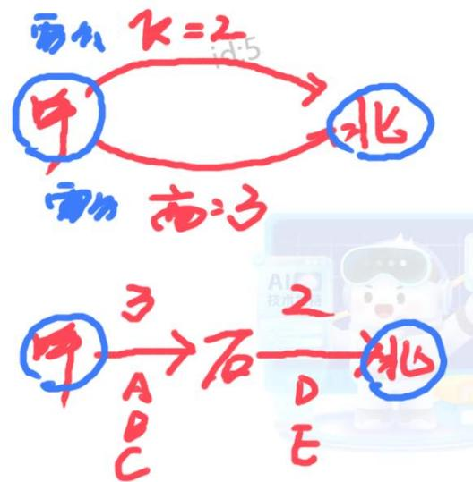
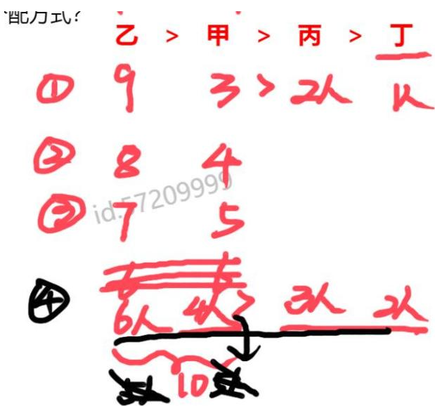
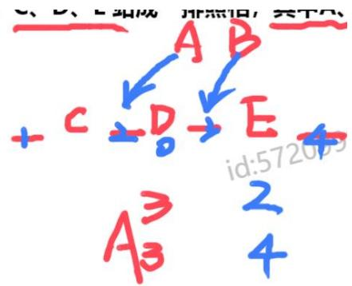
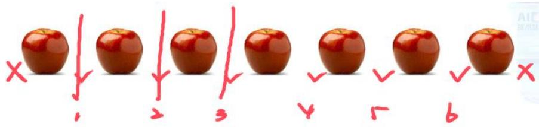
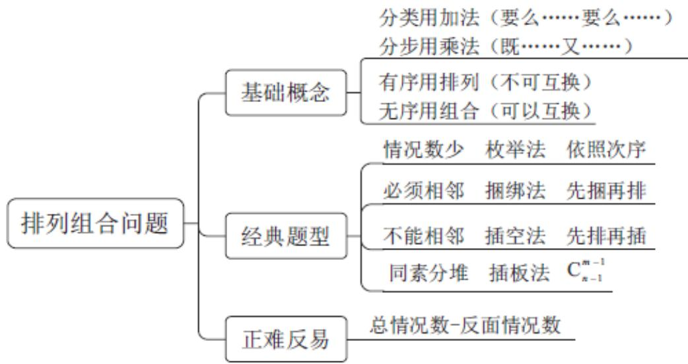
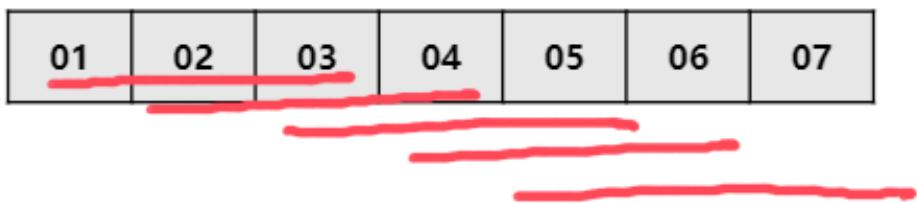
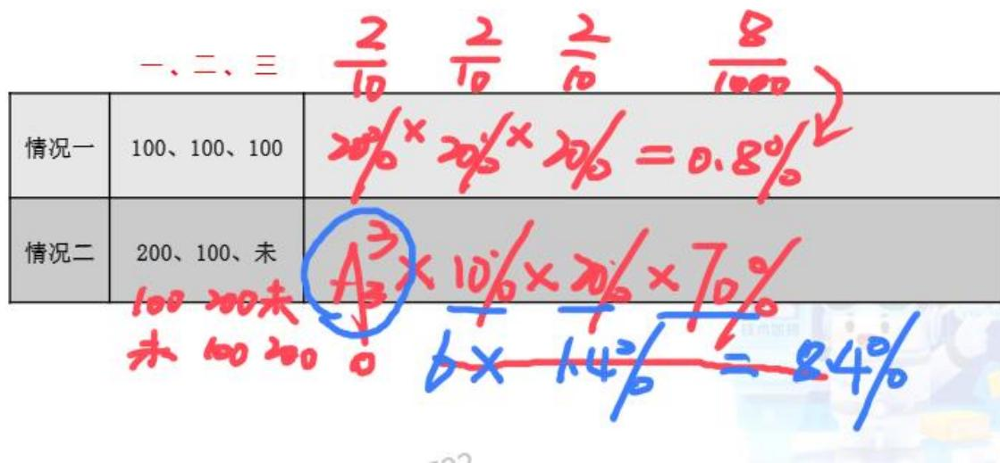
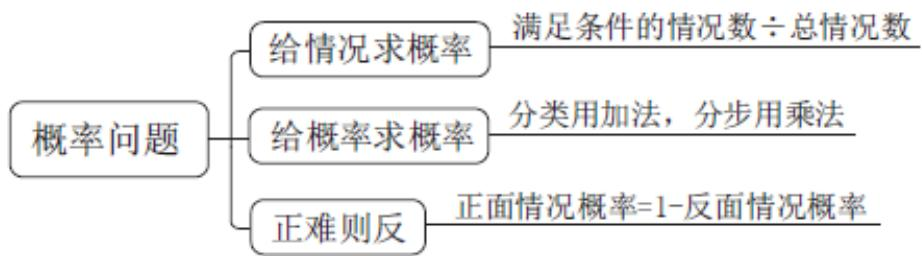

# 精讲精练一数量 4

（笔记）

主讲教师：田鹏

授课时间：2025.03.14

# 精讲精练一数量4（笔记）

# 数量关系 精讲精练4

# 学习任务：

1. 课程内容：排列组合问题、概率问题  
2.对应讲义：第  $396\sim 400$  页  
3. 重点内容：

(1) 掌握常用的排列组合公式, 理解分类讨论与分步计算的区别, 正难反易则从反面求解  
(2) 掌握枚举法、捆绑法、插空法和插板法的适用范围和操作步骤  
(3) 掌握概率问题的两种考法——给情况求概率、给概率求概率

# 第六节 排列组合问题

# 一、基础公式

分类与分步

分类相加：多者选其一，要么……要么……

分步相乘：同时满足，既……又……

【注意】排列组合与概率：分情况讨论，比如情况 1 有 a 种情况；情况 2 有 b 种情况，题目问总情况。

1. 分类与分步：如果是分类的关系，则总数  $= \mathrm{a} + \mathrm{b}$ ；如果是分步的关系，则总数  $= \mathrm{a} * \mathrm{b}$ 。  
2. 分类相加:

（1）多者选其一，有多种情况，从中选择 1 种就能实现目的。比如家在呼和浩特，要去开会，飞机有 2 个班次、火车有 3 个班次，要实现呼和浩特到北京，共有多少种出行班次可以选择？飞机 2 选 1 或者高铁 3 选 1，共 5 个班次选择 1 个即可到。  
(2) 要么……要么……, 从呼和浩特到北京, 要么坐飞机、要么坐高铁,多者选其一。比如妈妈给端来苹果和梨, 不能说要么吃苹果要么吃梨, 而是随便给一个就行, 分类用加法。

# 3. 分步相乘:

（1）同时满足，要实现一个目的，必须多种情况同时存在。比如从呼和浩特到北京，需要中转石家庄。呼和浩特  $\rightarrow$  石家庄有3个班次，从石家庄  $\rightarrow$  北京有2个班次，要实现呼和浩特  $\rightarrow$  北京，共有  $3*2 = 6$  种选择。也可以枚举数，比如呼和浩特  $\rightarrow$  石家庄有ABC三班；石家庄  $\rightarrow$  北京有DE两班。要组合呼和浩特  $\rightarrow$  北京，有AD、AE、BD、BE、CD、CE，共6种。

(2) 既……又……, 如要从呼和浩特  $\rightarrow$  北京, 既要有呼和浩特  $\rightarrow$  石家庄,又要有石家庄  $\rightarrow$  北京, 代入逻辑关系中, 是 “既……又……” 的逻辑, 就可以用乘法。如果反着代入, 要么呼和浩特  $\rightarrow$  石家庄, 要么石家庄  $\rightarrow$  北京, 发现题目的目的实现不了, 说明不能用加法。

【拓展】（2019河南司法）某市从儿童公园到科技馆有6种不同路线，从科技馆到少年宫有5种不同路线；从儿童公园直接到少年宫有4种不同路线。则从儿童公园到少年宫的路线共有：

A.24种

B.36种

C. 34 种

D. 38 种

【解析】拓展. 从儿童公园到科技馆有 6 条路线, 从科技馆到少年宫有 5 条路线; 从儿童公园到少年宫有 4 条路线。要儿童公园到少年宫, 可以直达 (直接从儿童公园到少年宫有 4 条路线)、可以中转 (先从儿童公园到科技馆有 6 条路线, 再从科技馆到少年宫有 5 条路线, 是 “既……又……” 的关系, 分步用乘法,有  $5 * 6 = 30$  种路线)。总的情况: 要么直达、要么中转, 都能实现儿童公园  $\rightarrow$  少年

宫，用加法。总情况  $= 4 + 30 = 34$  种。【选 C】

排列与组合

排列 (A): 从  $\mathrm{n}$  个元素中有顺序地选  $\mathrm{m}$  个

A  $(\mathrm{n},\mathrm{m}) =$  从  $\mathbf{n}$  开始往下乘  $\mathfrak{m}$  个数

组合 (C): 从  $n$  个元素中无顺序地选  $m$  个

C（n，m）=分子A（n，m）/分母A（m，m）=从n开始往下乘m个数/从m开始往下乘m个数

【注意】排列与组合：

1.排列（A）：有顺序。

(1) 从  $n$  个元素中有顺序地选  $m$  个: 如从 8 个元素中有顺序地选择 3 个,有顺序用 A 表示, 8 为总数、3 为部分数, 总数写下边, 要选择的数写上边, 表示为 A (8,3), 8 为底数, 第一个数写 8 , 往下依次递减 1 相乘, 上面的数 3 , 则乘以 3 个数, 即 A (8,3) =8*7*6。同理, A (9,4), 9 为第一个数, 往下依次递减 1 乘以 4 个数, A (9,4) =9*8*7*6。

（2）A  $(\mathrm{n},\mathrm{m}) =$  从  $\mathbf{n}$  开始依次减1往下乘  $\mathfrak{m}$  个数。

2. 组合（C）：无顺序。

（1）从  $\mathbf{n}$  个元素中无顺序地选  $\mathfrak{m}$  个。n总数写下面，要选择的  $\mathrm{m}$  写上面。如从8个元素中无顺序地选择3个，为C（8,3）。除法的形式，分子C换成A，其他不变，分母看上角标，上面是3，则除以A（3,3），C（8,3）=A（8,3）/A(3,3)=8*7*6/(3*2*1)。  
（2）C（n，m）=分子A（n，m）/分母A（m，m）=从n开始往下乘m个数/从m开始往下乘m个数。

【判定标准】从已选的主体中任意挑出两个，调换顺序有差别，与顺序有关（A）；无差别，与顺序无关（C）

例 1: 从七个葫芦娃中, 任选两个去救爷爷

例 2: 从七个葫芦娃中, 任选两个去救爷爷 (第一个去探路, 第二个去打架)

# 【注意】

1. 从已选的主体中任意挑出两个，调换顺序有差别，与顺序有关（A）；无差别，与顺序无关（C）。比如原本是 A、B、C，调换顺序为 B、A、C，出现两种情况，对调之后有区别用 A 计算，对调之后无区别用 C 计算。

# 2. 例:

（1）从七个葫芦娃中，任选两个去救爷爷：总数为7，选择数为2，在选择的主体中选择两个，比如选的是大娃、二娃，对调之后变成二娃和大娃，对于去救爷爷这件事没有区别，为C（7,2）。比如有一天妈妈下班晚了，孩子和爸爸去接妈妈，与爸爸和孩子接妈妈，没有区别，对调之后没有区别，说明没有顺序，用C。

(2)从七个葫芦娃中，任选两个去救爷爷（第一个去探路，第二个去打架）：

(1)比如选的是大娃和二娃，情况一为大娃探路、二娃打架，调换顺序，情况二为二娃探路、大娃打架，两种情况人做的事情不同，对调之后对结果有影响，每个人干的事情不同，有区别，说明有顺序，为 A（7,2）。  
②可能想要先从 7 个葫芦娃中选出来 2 个葫芦娃, 这两个葫芦娃先不安排工作, C (7,2); 之后再对两个葫芦娃安排顺序, A (2,2), 分步相乘, C (7,2) * A (2,2), 也是可以的, 本质 A (7,2) = C (7,2) * A (2,2)。  
3. 总结：如果做一道题，只是选人，选出来人之后，做同一件事，用 C。如果是选人之后，干不同的事，用 A。如果还是判定不了，可以调换顺序。

练习1：从8个人中选出3个人打扫卫生，共有（）种选取方式？

练习2：从8个人中选出3个人，分别打扫教室、走廊、卫生间，共有（）种安排方式？

练习3：8个人站成一排，共有（）种站队方式？

【注意】练习：

1. 练习 1: 从 8 个人中选出 3 个人打扫卫生, 共有 ( ) 种选取方式?

答：从 8 人中选择 3 个人，只是选出来，之后干同一件事，都是打扫卫生，没有顺序，为 C（8,3）。

2. 练习 2: 从 8 个人中选出 3 个人, 分别打扫教室、走廊、卫生间, 共有 ( )种安排方式?

答：从8人中选择3个人，选出来之后，干的活不同，用A（8,3）。或先选择3个人，C（8,3），之后再给这三个人安排活，A（3,3），用C（8,3）*A（3,3）也可以。

3. 练习 3: 8 个人站成一排, 共有 ( ) 种站队方式?

答: 8 个人问有多少种排序方式, 或 8 个主体排顺序, 有 A (8,8) 种。只要问全部的排列方式, 就是全排列, n 个主体全排列, 有 A (n, n) 种方式。

【例1】（2025四川）从5名男性和4名女性志愿者队伍中抽调6名志愿者去田径比赛、篮球比赛和跳水比赛做服务引导工作。田径比赛要求2名男性志愿者，篮球比赛要求男、女志愿者各1名，跳水比赛要求2名女性志愿者。问有多少种不同的抽调方式？

A. 300

B. 320

C. 360

D. 400

【解析】1. 男生人数和女生人数都给出，要选择人当志愿者。“田径比赛要求2名男性志愿者”，从5名男性中选2名男性，不区分做什么事，对于田径而言，没有顺序，用C（5,2）。“篮球比赛要求男、女志愿者各1名”，田径已经选了2名男性，还剩下3名男性、4名女性，则男性为C（3,1），选女性为C（4,1），既要有男性，又要有女性，分步相乘，C（3,1）*C（4,1）。“跳水比赛要求2名女性志愿者”，此时女性还剩3名，选2名女性跳水，为C（3,2）。如果用“要么……要么……”造句，与题意不符，是“既……又……”的关系，用乘法，C（5,2）*[C（3,1）*C（4,1）]*C（3,2）=10*3*4*3=360。【选C】

# 【注意】

1.C（5，2）  $= \mathrm{A}$  （5，2）/A（2，2）  $= 5*4 / (2*1) = 10$  
2.C（3，2）  $= \mathrm{C}$  （3，1）  $= 3$

# 排列组合速算技巧

①C（n，1）=n种情况  
$②$  C  $(\mathrm{n,m}) = (\mathrm{n},\mathrm{n - m})$  
③C (n, n) = 1  
$④ \mathrm { C } ( 4 , 2 ) = 6 ; \mathrm { ~ C ~ } ( 5 , 2 ) = \mathrm { C ~ } ( 5 , 3 ) = 1 0 ; \mathrm { ~ C ~ } ( 6 , 2 ) = \mathrm { C ~ } ( 6 , 4 ) = 1 5 ; \mathrm { ~ C ~ } ( 6 ,$ $3) = 20$  ：A（3，3）  $= 6$  ：A（4，4）  $= 24$  ：A（5，5）  $= 120$

# 【注意】排列组合速算技巧：

1. C (n, 1) = n 种情况。如共 2035 名同学，从中选择 1 名同学，每个人都有可能，有 2035 种可能。  
2.  $C(n, m) = (n, n - m)$  。注意 A 不存在此公式。 $C(3, 2) = C(3, 3 - 2) = C(3, 1)$  。比如要计算  $C(100, 99) = A(100, 99) / A(99, 99)$ ，非常难算，转换为  $C(100, 99) = C(100, 100 - 99) = C(100, 1) = 100$ 。  
3. C (n, n) = 1。如从 2000 人中选择 2000 人，是打包带走，只有 1 种情况。

4. C（4,2）=4*3/（2*1）=6；C（5,2）=C（5,3）=10；C（6,2）=C（6,4）=15；C（6,3）=20；A（3,3）=6；A（4,4）=24；A（5,5）=120，最多可以再记一个A（6,6）=720。记住这些常用数据， $70^+$  以上的排列组合数都不用算。

【例 2】(2024 广东) 某高校中文系计划从 3 名男生和 3 名女生中选派 4 名学生参加暑期支教活动。如果选派的女生不少于 2 名, 则选派方案共有多少种?

A. 4

B. 8

C. 12

D. 16

【解析】2. 方法一：没有明确说选几个，而是给范围，“选派的女生不少于 2 名”，即女生  $\geqslant 2$  名，如果不是明确告诉选多少，而是给范围，分类讨论是最明智的选择。分为两种情况，女生选择 2 名同时男生选择 2 名、女生选择 3 名同时男生选择 1 名。

（1）女生选择2名同时男生选择2名：从3名女生中选出2名，只是要选出来，没有分配具体工作，无顺序，C  $(3,2) = C(3,1) = 3$ ；从3名男生中选出2名，用C  $(3,2) = C(3,1) = 3$ 。一共选择4个人，既要选女生又要选男生，分步用乘法， $3*3 = 9$ 种。  
(2) 女生选择 3 名同时男生选择 1 名: 从 3 名女生中选出 3 名, 为 C (3, 3) = 1 , 从 3 名男生中选出 1 名, 为 C (3, 1) = 3 , 既要女生选 3 名、又要男生选 1 名, 分步相乘, C (3, 3) * C (3, 1) = 1 * 3 = 3 种。

要么情况 1、要么情况 2，分类相加， $9 + 3 = 12$  种，对应 C 项。

方法二：反面思考：总的情况是从 6 个人中选出来 4 个人就可以，C（6,4）。反面的情况是女生人数  $< 2$  ，女生要么有 1 人、要么有 0 人，女生不能有 0 人，目的是选择 4 个人，男生最多是 3 人，无法选 4 人，故本题反面情况只有一种，即女生 1 人，男生 3 人，男生选择 3 人为 C（3,3），女生选择 1 人为 C（3,1），分步相乘，反面情况 = C（3,3）*C（3,1）=1*3。正面情况 = 总情况 - 反面情况 = C（6,4）-C（3,3）*C（3,1）=15-1*3=12。【选 C】

【注意】注意：数量不确定时，一定要分类讨论。

【例3】（2024联考）为弘扬耕读文化，某校打造多样化“校外+校内”耕读文化教育基地，有种植、绘画、编织、美食四个主题基地供同学们选学。假设每位学生选择1个主题基地参与学习，那么甲、乙、丙、丁4名学生中至少有3名学生选择不同主题基地的方法有多少种？

A. 24

B. 60

C. 144

D. 168

【解析】3. 甲、乙、丙、丁4名学生选择4个基地，要求至少有3名学生选择不同主题基地，至少有3名，即大于等于3名。情况1为4个人选4个不同的基地；情况2为4个人选3个不同的基地。

(1)4个人选4个不同的基地：每个基地1个人（4个人选4个不同的地方），A  $(4,4) = 4*3*2*1 = 24$  
(2) 4 个人选 3 个不同的基地: 必然有 1 个基地有 2 个人, 按照 “2、1、1”

进行人员分配, 从 4 人中选择 2 个人去同一个基地, 只选人不需要排序, C(4, 2), 比如选的是甲和乙, 相当于把甲乙绑在一起, 剩下丙一组、丁一组, 把 4 个人分成 3 组。基地一共有 4 个, 从种选出 3 个基地, C(4, 3)。之后三组去三个基地, A (3, 3)。分步相乘, C (4, 2) *C (4, 3) *A (3, 3) =6*4*6=144。

两种情况可以用 “要么……要么……” 造句, 分类相加,  $24 + 144 = 168$  。【选 D】

# 【注意】

1.C（4，3）  $= C$  （4，1）  $= 4$  。

2. 例 1 只选一个具体的人; 例 2 要选择范围, 需要讨论情况; 例 3 不仅要选人, 还要去不同的基地, 不仅要选人, 还要排序。

# 二、经典题型

经典题型的解题方法

①枚举法  
(2)捆绑法  
(3)插空法  
④隔板法

【注意】经典题型：考查最多，有具体的解题套路和步骤。

枚举法

特征：小数凑大数、情况数少（10以内），按次枚举

【注意】枚举法：数数。通常是用 A、C 算不出来的题目，往往用小的数字，凑大的数，答案情况数很少，往往在 10 以内。按照题目提示的大小顺序，按照次序枚举，保证不重不漏。

【例1】（2025天津）企业将15个招聘名额分配到甲、乙、丙、丁四个分公司。要求每个分公司至少分1个名额，任意2个分公司分配名额数不同。甲分配的名额不能是最多，甲、乙分配的名额都不能是最少，丙比丁多分配1个名额。

问有多少种不同的分配方式？

A. 2

B. 4

C. 7

D. 9

【解析】1. “企业将 15 个招聘名额分配到甲、乙、丙、丁四个分公司”，要用四个数凑 15，即小数凑大数。选项最大为 9，不到 10，选项情况数少，可以枚举。“任意 2 个分公司分配名额数不同”如果用 A 或者 C 计算不好用，考虑枚举。要枚举出来，需要知道甲乙丙丁的大小关系，“甲分配的名额不能是最多，甲、乙分配的名额都不能是最少”，甲是第二名或第三名；乙是第一名或第二名或第三名。“丙比丁多分配 1 个名额”，丙不是最少的，甲、乙、丙都不是最少的，则只能是丁最少，丁为第四名，差值固定，丙比丁大，至少大 1，则丙为第三名，甲不能是第一名，则甲只能是第二名，乙是第一名，顺序为乙、甲、丙、丁。

“要求每个分公司至少分1个名额”，丁最少是1人，丙多1人为2人。丙和丁固定，甲和乙是  $15 - 1 - 2 = 12$  人，①甲最少是3人，则乙为9人；②甲如果是4人，则乙是8人；③甲如果是5人，则乙是7人；甲如果是6人，丙也是6人，不符合“任意2个分公司分配名额数不同”。还可能丁是2人，丙是3人，则甲乙是  $15 - 2 - 3 = 10$  人，④甲如果是4人，则乙是6人；甲如果是5人，乙也是5人，不符合“任意2个分公司分配名额数不同”。如果丁是3人，则丙是4人，甲乙还剩  $15*3 - 4 = 8$  人，甲如果是5人本，则乙只能是3人，与大小顺序不符，共4种。【选B】

相邻问题——捆绑法

特征：必须相邻（在一起）

引例 1: A、B、C、D、E五个人站成一排照相, 其中 A、B 是一对情侣, 要求照相时必须相邻, 一共有多少种排法?

解题思路：

(1)先捆绑：把要相邻的主体捆绑起来，考虑内部顺序；  
(2)再排：将捆绑后的看成一个主体，和剩下的主体一起排列。

引例 2: A、B、C、D、E, F 六个人站成一排照相, 其中 AB、CD 均为情侣,要求每对情侣照相时都必须相邻, 一共有多少种排法?

【注意】相邻问题——捆绑法：

1. 特征：必须相邻（在一起）。  
2. 引例 1: A、B、C、D、E 五个人站成一排照相, 其中 A、B 是一对情侣, 要求照相时必须相邻, 一共有多少种排法?

答：如果做题过程中，发现有两个主体必须挨着，则可以把两个主体捆绑在一起。AB 必须相邻，把 AB 捆绑在一起，这样无论 AB 在哪，都能保证 AB 相邻。AB 捆绑之后，AB 和 BA 拍出来的照片是有顺序区别的，照片效果不同，因此捆绑的时候要考虑两个元素的内部顺序，A（2,2）。捆绑之后的两个元素变成一个主体，与剩下的 C、D、E 排序，一共 4 个主体排序，为 A（4,4）。分步用乘法，所求=A（2,2）*A（4,4）。

3. 解题思路：

(1) 先捆绑：把要相邻的主体捆绑起来，考虑内部顺序。  
(2) 再排: 将捆绑后的看成一个主体, 和剩下的主体一起排列。

4. 引例 2: A、B、C、D、E, F 六个人站成一排照相, 其中 AB、CD 均为情侣,要求每对情侣照相时都必须相邻, 一共有多少种排法?

答：其中AB、CD均为情侣，需要捆2次，内部有顺序，AB捆绑为A（2,2），CD捆绑为A（2,2）。此时AB一组、CD一组，E一组、F一组，共四个主体排序，为A（4,4），六个人都要排序，既要捆AB，又要捆CD，用乘法；先捆绑，后插空，分步用乘法，所求=A（2,2） $*A$ （2,2） $*A$ （4,4）。

【例 2】（2024 联考）某公司开展“迎新春，三分球”投篮比赛，3个部门分别派出2、4、4个选手共计10人参加。规则要求同一个部门的选手顺序相连，全部投完再安排另一个部门的人员开始投篮，则这10人不同的投篮顺序种数的范围是：

A. 小于 1000

B.  $1000 \sim 5000$

C.  $5001 \sim 10000$

D. 10000 以上

【解析】2. “选手顺序相连”说明是相邻问题，用捆绑法。要求每个部分都要挨着，共3个部门，需要捆3次。2人的部门捆在一起，需要考虑顺序，为A（2,2）；4人的部门捆在一起，需要考虑顺序，为A（4,4）；4人的部门捆在一起，需要考虑顺序，为A（4,4）。三步都要进行，用乘法，A（2,2）*A（4,4）*A（4,4）。之后看成三个主体进行排序，A（3,3），先捆后排，用乘法，所求=A（2,2）*A（4,4）*A（4,4）*A（3,3）=2*24*24*6=12*24²=12*576，选项是范围， $10^{+}576 > 5000$  ，排除A、B项。结果比12*6000=72000小，选择C项。【选C】

【注意】如果捆的是不同的东西，内部要考虑顺序；如果捆的是相同的东西，比如三块相同的木头，则不需要考虑内部顺序。

不相邻问题——插空法

特征：不能相邻（不在一起）

【引例】A、B、C、D、E五个人站成一排照相，其中A、B闹矛盾，要求照相时都不能相邻，一共有多少种排法？

思路：

(1)先排: 先安排可以相邻的元素, 形成若干个空位;  
(2)再插: 将不相邻的元素插入到空位中。

【注意】不相邻问题——插空法：

1. 特征：不能相邻（不在一起）。

2. 引例：A、B、C、D、E五个人站成一排照相，其中A、B闹矛盾，要求照相时都不能相邻，一共有多少种排法？

答: 要求 A、B 不相邻, 不相邻问题, 先不管不相邻的主体。C、D、E 没有

要求，先排好 C、D、E，三个元素排序，为 A（3, 3）。三个元素的两边和中间，天然形成 4 个空，把 A 和 B 放到这 4 个空中，一定会保证 A 和 B 不相邻，4 个空中放两个不一样的人，比如 CADBE 和 ABDAE，照片是不一样的，有顺序，为 A(4, 2)，分步相乘，A（3, 3）*A（4, 2）。

# 3.思路：

(1) 先排: 先安排可以相邻的元素, 形成若干个空位。  
(2) 再插: 将不相邻的元素插入到空位中。

【例3】（2023广东事业单位）某村组织“村晚”活动，晚会节目包括开场舞、小品、相声、歌伴舞、民乐弹唱、大合唱共六个，若节目出场顺序有如下要求：小品和相声不能连续出场，开场舞第一个出演，大合唱最后一个出演，则此次晚会节目出场顺序共有多少种安排方式？

A. 10

B. 12

C. 24

D. 48

【解析】3. 要求不连续，即不相邻。其中“开场舞第一个出演，大合唱最后一个出演”已经确定了位置，排序的时候不需要考虑，只需要考虑小品、相声、歌伴舞、民乐弹唱的顺序。“小品和相声不能连续出场”，不相邻问题，先排可以相邻的元素，然后把不能相邻的元素插空。歌伴舞、民乐弹唱可以相邻，先排这两个，A（2,2）=2，2个主体的前后和中间共形成3个空，放小品、相声，小品、相声是不同的，有顺序，为A（3,2）=3*2=6。分步相乘，A（2,2）*A（3,2）=2*6=12。

【选B】

【例 4】(2023 四川事业单位)要将不同的五种商品 A、B、C、D、E 在货柜上放在一起, 并分别放在同一箱子中.

上排成一排，其中 A、B 必须排在一起，C、D 不能排在一起。则有多少种不同的排列方式？

A. 12

B. 20

C. 24

D. 48

【解析】4. “其中 A、B 必须排在一起，C、D 不能排在一起”，必须排在一起  $\rightarrow$  相邻；不能排在一起  $\rightarrow$  不相邻，为相邻和不相邻结合考查，要把 AB 捆在一起，不同的商品排序，有顺序，为 A（2,2）。之后 AB 看作一个主体，与 C、D、E 共构成 4 个主体。“C、D 不能排在一起”，先排可以相邻的 AB、E，两个主体排序，A（2,2）。两个主体形成 3 个空，把 C 和 D 插空，C 和 D 是不同的，要考虑顺序，A（3,2），所求=A（2,2）*A（2,2）*A（3,2）=2*2*6=24。【选 C】

同素分堆问题——隔板法

特征: ①N 个相同的元素②分给 M 个不同的主体③每个主体至少一个

公式：C（n-1，m-1）

例：7 个相同的苹果，分给 3 个小朋友，每人至少 1 个

【注意】同素分堆问题——隔板法。

1. 特征：同时满足这3个条件。

(1) n 个相同的元素。  
(2) 分给  $\mathrm{m}$  个不同的主体。  
(3) 每个主体至少一个。

2. 公式：C（n-1，m-1）。

3. 例：7 个相同的苹果，分给 3 个小朋友，每人至少 1 个。

答：n 个相同的苹果，分给 m 个不同的主体，每个主体至少一个，直接套公式，C（7-1,3-1）=C（6,2）。

4. 原理：如上例，要把苹果分成 3 堆，在苹果中间插板子（两边插板子不能分堆，则不在两边插），如果插 1 块板子，可以分成 2 堆；如果插 2 块板子，可以分成 3 堆；如果要分成 4 堆，需要插 3 块板子，综上，要分给 m 个小朋友，需

要插  $m - 1$  个板子；板子要往空隙里面插，7 个苹果中间有 6 个空隙（如果 8 个苹果就是 7 个空），则  $n$  个相同的苹果有  $n - 1$  个空。综上，题目就变成了把  $m - 1$  个板子插到  $n - 1$  个空里面  $\rightarrow C(n - 1, m - 1)$ 。

【例 5】(2024 河北事业单位) 张阿姨将一个蛋糕平均分成 7 块, 分给 4 个小朋友, 要求每个小朋友至少分得 1 块小蛋糕, 一共有多少种分配方法?

A. 14

B. 18

C. 20

D. 22

【解析】5.7 个相同的蛋糕平均分给 4 个小朋友，要求每人至少分 1 个，直接套公式，C（7-1,4-1）=C（6,3）=20，对应 C 项。【选 C】

# 隔板法（变形）

例 1: 10 个相同的苹果, 分给 3 个小朋友, 每人至少 2 个

例 2: 15 个相同的苹果, 分给 4 个小朋友, 每人至少 3 个

Tips: 需要 x 个, 先给 x-1 个, 变成还需要至少一个, 然后剩余再套公式

【注意】隔板法（变形）：至少多个转化为至少1个，然后套公式。

1. 例 1: 10 个相同的苹果, 分给 3 个小朋友, 每人至少 2 个

答：先给3个人各1个苹果，10个苹果剩下7个，余下7个分给3个人，每个人至少1个，就变成了至少1个的题型， $n = 7$ ， $m = 3$ ，套公式，C（7-1,3-1）=C（6,2）=15；这里“先给各1个”需要看有几种情况，但是不影响结果，因为每个人给1个只有1种情况，分步相乘，即  $1*C(7-1,3-1) = 1*C(6,2) = 15$ ，结果是一样的。

2. 例 2: 15 个相同的苹果, 分给 4 个小朋友, 每人至少 3 个

答：把“至少3个”转化为“至少1个”，先给每个人2个苹果，给出去8个，15个苹果余下7个，分给4个人，每个人再至少1个  $\rightarrow$  C(7-1,4-1)=C(6,3)=20。

3. Tips: 需要 x 个，先给 x-1 个，变成还需要至少一个，然后剩余再套公式 C (n-1, m-1)。

【拓】（2019 事业单位）有 25 颗苹果，打算全部分发给 A、B、C 三人，若每人至少拿到 6 颗苹果，则有多少种分发方式？

A. 15

B. 20

C. 35

D. 36

【解析】拓展. 把题目转化为至少一个，先每个人给  $6 - 1 = 5$  个，25个苹果给出15个苹果，还剩下10个苹果，分给3个人，每个人至少1个，所求  $= C(10 - 1, 3 - 1) = C(9, 2) = A(9, 2) / A(2, 2) = (9*8) / (2*1) = 36$  ，对应D项。【选D】

# $\mathcal{O}$  思维导图

# 【注意】排列组合梳理：

# 1. 基础概念：

(1) “要么……要么……”分类相加; “既……又……”分步相乘。  
（2）有序用排列（A），即选出来做不同的事情；无序用组合（C），即选出来即可。

# 2.经典题型：

（1）情况数少：枚举。  
(2) 必须相邻: 捆绑法, 先捆再排。

(3) 不能相邻: 插空法, 先排再插。  
(4) 同素分堆: 插板法, 套公式 C (n-1, m-1); 如果是变形题, 转化为 “至少一个”, 余下的再套公式。

3. 正难反易: 正面情况数多, 反面情况数少的时候用, 正面情况数 = 总情况数 - 反面情况数。

# 概率问题

1. 给情况求概率  
2. 给概率求概率

【注意】概率问题：

1. 给情况求概率。  
2. 给概率求概率。

# 给情况求概率

例: 3 个绿球、2 个黄球、5 个红球, 球都一样, 随便摸一个

问：摸到绿球的概率？

公式：概率  $=$  满足情况数/总情况数

注：正难则反，满足概率=1-不满足概率

# 【注意】给情况求概率：

1. 例：3个绿球、2个黄球、5个红球，球都一样，随便摸一个。问：摸到绿球的概率？  
答：给出个数，求概率，属于给情况求概率的问题。摸到绿球的概率  $= 3 / 10$  。3是满足条件的情况数，10是总的情况数。  
2. 公式：概率=满足情况数/总情况数。  
3. 注：正难则反，满足概率  $= 1-$  不满足概率。总概率就是正面和反面的概率，如上例，反面情况是黄球和红球的概率，黄球和红球共有7个，所求  $1 - 7 / 10 = 3 / 10$  。

【例 1】(2025 四川)教师从某班级学号为  $01 \sim 07$  的 7 名学生中随机抽出 3 名做值日, 则这 3 名学生学号恰好为三个相邻自然数的概率为:

A.  $1 / 7$

B.  $1/6$

C.  $1 / 5$

D.  $1 / 4$

【解析】1. 给情况求概率，P=满足要求的情况数/总的情况数，总的情况数就是不管是否相邻，把这3个人选出来即可  $\rightarrow \mathrm{C}(7,3)$ ；满足要求的情况数有5种，分别是010203、020304、030405、040506、050607，这里之所以不先捆再排，是因为已经排好了顺序，有固定顺序不需要排，只需要数挨在一起的情况有几个， $\mathrm{P} = 5 / \mathrm{C}(7,3) = 5 \div (7*6*5) / (3*2*1) = 1 / 7$ ，对应A项。【选A】

【例 2】（2024 江苏）小张所在单位共有 4 个科室，现以科室为单位组织文艺演出，每个科室出 2 个节目。演出结束后，因 8 个节目都非常精彩，决定从中随机选 3 个节目参加上级组织的汇演。则小张所在科室出的节目至少有一个被选送参加汇演的概率是：

A.  $9 / 20$

B.  $5/{14}$

C.  $11 / 20$

D.  $9 / 14$

【解析】2. 方法一：本题为给个数求概率的问题，P=满足要求的情况数/总的情况数，一共8个节目，选3个参加汇演，总情况数=C（8,3）。接下来求满足要求的情况数，小张所在的科室有2个节目，要求至少选择一个，则有两种情况，且一共要选3个节目，第一种情况：（1）小张科室1个，其他科室2个→满足要求的情况数=C（2,1）*C（6,2）=2*15=30；第二种情况：（2）小张科室2个，其他科室1个→满足要求的情况数=C（2,2）*C（6,1）=1*6=6。P=(30+6)/C（8,3)=36÷A（8,3）/A（3,3）=36÷（8*7*3）/（3*2*1）=36/56=9/14，对应D项。

方法二：正难则反。正面情况数  $= 1-$  反面情况数，反面情况就是小张科室出的节目一个都没有被选上，则从其他科室的 6 个节目中选出 3 个  $\rightarrow$  反面情况数  $= C(6,3)$ ，正面情况数  $= 1 - C(6,3) / C(8,3) = 1 - (6*5*4) / (8*7*6) = 1 - 5 / 14 = 9 / 14$ 。

【选D】

# 【注意】

1. Tips: 若条件中有“至少 1 个”类似表述，往往都可以从反面入手。因为“至少一个”的反面只有一种情况，即“一个都没有”。  
2. 答疑：有同学考虑先从小张科室的节目里 2 选  $1 \rightarrow \mathrm{C}$  (2,1)，再从剩下的 7 个节目里选 2 个  $\rightarrow \mathrm{C}$  (7,2)，按照 C（2,1）*C（7,2）计算，但这样计算的结果相比正常结果会更多，比如小张的两个节目是 a、b，其他的 6 个节目是 c、d、e、f、g、h，假设 C（2,1）从 a、b 中选出了 a，剩下的 7 个节目选出了 b 和 c，这是其中一种情况；还有一种情况是从 a、b 中选出了 b，剩下的 7 个节目中选出了 a 和 c，实际上以上两种情况选出来的都是 a、b、c，就会出现重复的情况；出现特殊的范围表述不要自己创造思路，先讨论有几种可能，然后再一个个计算。

# 给概率求概率

方法：分类加和、分步相乘

例：某抽奖活动：

一等奖（小汽车），中奖概率为  $5\%$

二等奖（摩托车），中奖概率为  $10\%$

三等奖（自行车），中奖概率为  $30\%$

田老师，中奖的概率为多少？

田老师和龙哥，同时中二等奖的概率为多少？

【注意】给概率求概率：题干给出小的概率，求总的概率。

1. 方法：分类加和、分步相乘  
2. 例：某抽奖活动：一等奖（小汽车），中奖概率为  $5\%$ ；二等奖（摩托车），中奖概率为  $10\%$ ；三等奖（自行车），中奖概率为  $30\%$ ，自抽一次，问：田老师中奖的概率为多少？田老师和龙哥同时中二等奖的概率为多少？

(1) 问田老师中奖的概率为多少:

答：给概率求概率，田老师要么中一等奖、要么中二等奖、要么中三等奖，分类相加，所求  $= 5\% + 10\% + 30\% = 45\%$ 。

(2) 问田老师和龙哥同时中二等奖的概率为多少?

答: 既要田老师中二等奖, 又要龙哥中二等奖, 分步相乘, 所求  $= 10 \% * 10 \% = 1 \%$  。

3. 步骤：读题看能分成几种情况，把每种情况的概率都计算出来，然后看分步还是分类，如果是“要么……要么……”，就把每种情况概率相加；如果是“既……又……”，就把每种情况的概率相乘。

【例3】（2025天津）某超市规定，消费达标可参加抽奖，分一等奖200元、二等奖100元和未中奖三种情形。已知小王消费共抽奖3次，若每次抽中一等奖和二等奖的概率分别为  $10\%$  和  $20\%$  ，问小王其中奖恰好300元的概率在以下哪个范围内？

A.  $5\%$  以下

B.  $5\% \sim 8\%$  之间

C.  $8\% \sim 11\%$  之间

D.  $11\%$  以上

【解析】3. 中奖的概率  $+$  没中奖的概率  $= 100\%$  ，没中奖的概率  $= 1 - 10\% - 20\% = 70\%$  。问“小王中共奖恰好300元的概率”，枚举出恰好300元的情况。（1）第一种情况：第一次、第二次、第三次都中100元；（2）第二种情况：一次中200，一次中100，一次未中奖。计算概率，（1）第一种情况：每一次中100元的概率都是 $20\%$ ，“既要第一次中奖，又要第二次中奖，又要第三次中奖”，分步相乘，情况数  $= 20\% * 20\% * 20\% = 0.8\%$  ；（2）第二种情况：三个元素排序，涉及到顺序  $\rightarrow A(3,3)$  ，三种情况也是“既…又…”的关系，情况数  $= A$  （3,3） $*10\% * 20\% * 70\% = 6 * 1.4\% = 8.4\%$  。

要么是情况一，要么是情况二，分类相加，所求  $= 0.8\% + 8.4\% = 9.2\%$  ，对应C项。【选C】

【例 4】（2024 上海）某市向广大市民随机发放消费券，规则是先公布消费券发放额，再根据商家的参与量决定中签率。第一批消费券商家参与度较高，中签率为  $60\%$ ；第二批和第三批消费券的中签率均为  $20\%$ 。三批消费券依次发放，市民张先生连续三次申请，则他恰好成功两次的概率约为：

A.  $20\%$

B.  $40\%$

C.  $60\%$

D.  $80\%$

【解析】4. 第一批中签率  $= 60\%$  ，第一批没中签率  $= 40\%$  ；第二批、第三批的中签率  $= 20\%$  ，第二批、第三批的没中签率  $= 80\%$  。一共要申请3次，恰好成功2次，剩下的一次必须要失败，则有三种情况：（1）情况一：第一次和第二次成功了，第三次没成功；（2）情况二：第一次和第三次成功了，第二次没成功；（3）情况三：第二次和第三次成功了，第一次没成功。

计算概率，每种情况中间都是“既……又……”分步相乘的关系，（1） $60\% * 20\% * 80\% = 9.6\%$ ；（2） $60\% * 80\% * 20\% = 9.6\%$ ；（3） $40\% * 20\% * 20\% = 1.6\%$ 。要么第一种情况、要么第二种情况、要么第三种情况，概率相加， $9.6\% + 9.6\% + 1.6\% = 20.8\%$ ，问“约为”，最接近的是A项。【选A】

$$
\begin{array}{l l} {\mathrm {①}} & {\frac {-}{v} = \frac {3}{x}} \\ {\mathrm {②}} & {\frac {v}{x} = \frac {v}{v}} \\ {\mathrm {③}} & {\frac {x}{v} = \frac {v}{v}} \end{array} \quad \begin{array}{l l} {\mathrm {6 0 / x 2 0 / x 8 0 / = 9 . 6 /}} \\ {\mathrm {6 0 / x 8 0 / x 2 0 / = 9 . 6 /}} \\ {\mathrm {4 0 / x 2 0 / x 2 0 / = 1 0 /}} \end{array}
$$

# $\mathcal{O}$  思维导图

# 【注意】概率问题：

1. 给情况求概率：满足条件的情况数/总情况数。  
2. 给概率求概率：分类用加法，分步用乘法。  
3. 正难则反：出现“至少一个”的情况，反面为“一个都没有”，此时往往考虑反面。

# 重点梳理

1.排列组合中，分类用 法、分步用 法。

调换顺序不影响结果：用________；调换顺序影响结果：用________。

2.如果题干中出现 ，考虑 法，做题时先 再

如果题干中出现错误，考虑错误方法，做题时先看看再做。

什么时候用隔板法：

公式：

3. 当正面计算排列组合比较困难时，可以用________求解；

当正面计算概率比较困难时，可以用1- 求解。

4. 给情况求概率：概率  $=$

给概率求概率：分类用 法，分步用 法。

# 【注意】重点梳理：

1. 排列组合中，分类用加法、分步用乘法。调换顺序不影响结果：用 C；调换顺序影响结果：用 A。  
2. 如果题干中出现相邻，考虑捆绑法，做题时先捆绑相邻元素、计算内部顺序再和其他元素排列；如果题干中出现不相邻，考虑插空法，做题时先排再插。

什么时候用隔板法：n 个相同元素，分给 m 个不同的主体，要求每个主体至少分 1 个。公式：C（n-1, m-1）。

3. 当正面计算排列组合比较困难时，可以用总情况数- 反面情况数求解；当正面计算概率比较困难时，可以用  $1 - \mathrm{P}_{\text {反}}$  求解。  
4. 给情况求概率：概率=满足要求的情况数/总的情况数；给概率求概率：分类用加法，分步用乘法。

【课后练习1】（2023广东）某公司向餐馆订购盒饭，要求每份盒饭包含2种荤菜、2种素菜。如果餐馆共准备了4种荤菜和3种素菜，则最多有（）种盒饭。

A. 6

B. 12

C. 18

D. 24

【解析】拓展1.盒饭要求两荤两素，荤菜4种选2种  $\rightarrow$  C（4,2）；3种素菜选2种  $\rightarrow$  C（3,2），选出来即可，不涉及顺序，没要求荤素摆什么位置。既要有荤菜、又要有素菜，分步相乘，所求  $= \mathrm{C}(4,2)*\mathrm{C}(3,2) = 6*3 = 18$  ，对应C项。

【选C】

【课后练习 2】（2024 四川事业单位）课桌上有课本 12 本，其中语文书 6 本，数学书 4 本，英语书 2 本，从中随机抽取 3 本，其中恰好有语文、数学、英语书各一本的概率是（）。

A.  $12 / 55$

B. 24/55

C.  $36 / 55$

D.  ${48}/{55}$

【解析】拓展2. 给情况求概率，三种课本都要有，是“既……又……”的关系，P=满足要求的情况数/总的情况数=C（6,1）*C（4,1）*C（2,1）/C（12,3）=（6*4*2）/（12*11*10）/（3*2）=（6*4*2）/（2*11*10）=12/55，对应A项。

【选A】

精讲阶段——数量关系学习策略

推荐一：跟着课程和安排走，轻易不落课

推荐二：二刷理论课

推荐三：刷题——各个击破（只针对有备考经验，基础好的同学）

更建议刷题巩固阶段结束后再刷新题

(必修 1) 重要且容易: 和差倍比、工程、经济、几何

（必修2）比较重要但偏难：排列组合与概率、行程

(选修) 不太重要但容易: 溶液、最值、牛吃草、容斥等

难度低的题型多练难题，难度高的题型多练容易题

【注意】学习建议：数学是一个思维框架建立的过程，一定要反复循环练，不适合做新的东西，要反复听经典的东西，所以要反复听精讲课。

1. 推荐一：跟着课程和安排走，轻易不落课。  
2. 推荐二：二刷理论课。  
3. 推荐三：刷题——各个击破（只针对有备考经验，基础好的同学），更建议刷题巩固阶段结束后再刷新题。

(1) 必修 1 (重要且容易): 和差倍比、工程、经济、几何。  
(2) 必修 2 (比较重要但偏难): 排列组合与概率、行程。  
(3) 选修 (不太重要但容易): 溶液、最值、牛吃草、容斥等。

4. 原则：难度低的题型（必修1）多练难题，因为必须要拿分；难度高的题型多练容易题，再难的题目不会有时间做。

# 【答案汇总】

排列组合基础公式 1-3: CCD

排列组合经典题型 1-5: BCBCC

概率问题1-4：ADCA

遇见不一样的自己

Be your better self