# 精讲精练-言语1

# (全部讲义+本节课笔记)

主讲教师：郭熙

授课时间：2025.02.19

# 第二篇 言语理解与表达

# 言语理解与表达课程设置

言语理解与表达共分为片段阅读、语句表达和逻辑填空三个部分。精讲精练阶段共9次课。本阶段主要针对公务员考试中的必考题型和高频考点进行讲解，也是后续阶段学习的基础，请大家认真学完本阶段课程后再进行后续阶段的学习。

精讲精练阶段授课安排如下。

<table><tr><td>课程名称</td><td>课程内容</td></tr><tr><td>精讲精练——言语1</td><td>中心理解题（转折关系、主题词）</td></tr><tr><td>精讲精练——言语2</td><td>中心理解题（因果关系，必要条件关系—典型格式、正面提对策）</td></tr><tr><td>精讲精练——言语3</td><td>中心理解题（必要条件关系—反面提对策、文段无对策，并列关系）</td></tr><tr><td>精讲精练——言语4</td><td>中心理解题（分述句特征）、细节判断题</td></tr><tr><td>精讲精练——言语5</td><td>语句表达（接语选择题、语句填空题）</td></tr><tr><td>精讲精练——言语6</td><td>语句表达（语句排序题）</td></tr><tr><td>精讲精练——言语7</td><td>逻辑填空（词的辨析）</td></tr><tr><td>精讲精练——言语8</td><td>逻辑填空（关联关系、有标志对应—解释说明）</td></tr><tr><td>精讲精练——言语9</td><td>逻辑填空（有标志对应—形象表达、无标志对应）</td></tr></table>

注：实际授课进度会根据老师的授课节奏和多数学员的接受情况适度微调，请各位学员根据课程的进度提前做好预习，以保证听课效果。

# 言语理解与表达 精讲精练1

# 学习任务：

1. 课程内容：中心理解题（转折关系、主题词）  
2. 对应讲义: 第  $118 \sim 126$  页  
3. 重点内容:

(1) 转折关联词及重点位置  
(2) 主题词的应用  
(3) 错误选项的特征

# 第一章 | 片段阅读

解题顺序：

提问一文段一选项

# 第一节 中心理解题

# 【提问方式】

这段文字主要 / 旨在 / 重在 / 意在 / 想要说明 (论述、强调) 的是……

这段文字的主旨 / 主题 / 观点是……

对这段文字概括最恰当的一项是……

这段文字表达了作者……

从这段文字中我们可以看出作者的意图 / 态度是……

···

# 解题思路：

1. 直接确定重点  
2. 间接确定重点

# 一、直接确定重点

# 逻辑层面之关联词

# （一）转折关系

典型标志词：

虽然……但是……

尽管……可是……

……不过……

然而……

却

其实/事实上/实际上

···

# 理论要点：

# 转折之后是重点

【例1】（2022福建）传统戏曲具有悠久的发展历史，并以其独特的表演风格和大众审美取向，在很长一段时期都有着深厚的群众基础。随着社会的快速发展，人们的娱乐方式发生了较大变化，在多元文化形态的冲击下，传统戏曲自身存在的不足也被放大，致使观众群不断减少，剧目创作逐渐萎缩，优秀演员也逐渐流失，传统戏曲受到极大冲击，一度生存艰难，尽管近些年来在政府和社会各界的帮助与扶持下，传统戏曲艺术的生存状况有所好转，但仍旧比较弱势。

这段文字意在说明：

A. 传统戏曲面临的生存困境

B. 传统戏曲发展的制约因素

C. 传承传统戏曲的现实意义

D. 传统戏曲生存状况的好转

【例2】（2021山西）观照历史上多次出现过的媒介融合的进程结果，媒介材料的变更，绝不等于思想生活变现，正如汉字生产的主线，也绝不会因为纸张代替了简牍而出现颠覆性变化一样。事实上，简牍的汉字同纸张的汉字，并无太大差别，顶多只是字体有些不同而已。不可否认媒介变化肯定会带来表达的不同，如新近出现的网言网语，肯定是互联网语境下的表达产物。但无论媒介技术怎样发展变化，任何文明主干、任何文化血脉，都是一以贯之的。

这段文字意在强调：

A. 正确认识媒介革命的特殊性与普遍性，重视传统文化的传承  
B. 媒介革命不仅涉及媒介技术, 还关乎人们的思想观念等问题  
C. 借鉴历史上简牍与纸张之媒介融合的经验，推动新媒介融合  
D. 媒介革命必定改变人们观念，助力社会进步和提升文明层次

【例3】（2024 江西）如今无论什么季节，任何水果都能随时买回家尝鲜，很多人对此并不赞同，理由是反季水果的种植过程中总会有不利于健康的因素，因此他们在选购水果的时候，会侧重购买当季、当地产的水果。但是，果蔬中是否存在不利于健康的因素，与自然栽种还是大棚栽种没有必然联系。随着现代化农业技术的推广应用，大棚栽种水果技术越来越成熟，所有的保鲜剂、食品添加剂、植物生长调节剂，只要是国家相关标准允许使用的，且在规定的用量下，对人体健康是没有危害的。

这段文字旨在说明：

A. 人们倾向于购买当季当地产的水果  
B. 反季水果在种植过程中会产生不利于健康的因素  
C. 水果是否存在不利于健康的因素与栽种方式的选择无关  
D. 应加强现代农业技术的推广应用，减少添加剂对健康的危害

【例4】（2023吉林）蝴蝶大都有觅食花卉的习性，一般来说，大型蝶种喜欢花朵大的花卉，而小型蝶种则喜欢低矮草质茎植物的花卉。翠凤蝶、蓝凤蝶喜欢觅食百合科植物的花卉。菜粉蝶、红襟粉蝶喜欢觅食十字花科植物的花卉。小豹蛱蝶则喜欢在菊花科植物的花卉觅食，它们也会偶尔换个口味，吸食发酵性食物。其实，取食花蜜、汲食树汁、嗜食发酵水果、吮吸动物尸体……蝴蝶的口味，因蝶种不同，取食也大相径庭，或是单一口味，或是五味俱全。有的还会从水中觅食，吸收自己所需“营养”，如在小溪两侧的沙滩处，人们总会看到一堆堆蝴蝶在吸水、喷水。

最适合做这段文字标题的是:

A. 花为蝶开，蝶为花来

B. 蝴蝶对花卉也有选择

C. 蝴蝶的生活习性

D. 众口难调——蝴蝶不只为花来

【例5】（2024重庆）新农人，不同于传统农民，也异于新型职业农民，他们多是从城市回流农村的新群体。如果说过去大部分年轻人以跳出农门为奋斗目标之一的话，近年来，跳回农门正在成为新时尚。新农人带来了新技术、新商业模式和运营理念，创造了新的就业机会和空间，丰富并拓展了农村经济业态。但在现实中，新农人融入农村社会网络，激活产业网络并没有那么容易。不少人虽然在物理意义上返乡回乡了，但在社会关系上仍是“异乡人”。正如不少调研所显示的，新农人不了解农村，不知道如何与农民打交道，难以有效嵌入当地产业网络开展分工合作。

这段文字主要说明了：

A. 新农人，回得去并不等于融得进

B. 新农人需补短板，否则创业难成

C. 新农人具备新理念，掌握新技术

D. 时代呼唤更多新农人回农村创业

【例6】（2023 福建）喝酒有害健康早已成为共识，酒精对大脑的影响也逐渐受到更多关注。《自然·通讯》的一项研究发现，每周喝几瓶啤酒，就会造成大脑灰质和白质体积减小；发表于《英国医学杂志》的一项研究指出，每周饮酒会导致海马体萎缩风险急剧上升。由此造成的后果是，长期饮酒的人更易患上痴呆症。不过，这些研究往往关注长期饮酒的影响，如果只是偶尔喝一次酒，也会对大脑造成危害吗？发表于《美国科学院院刊》的最新研究给出了肯定答案：你人生中的第一次醉酒，不仅会改变大脑神经元的形态，这种影响甚至会伴随终生。

这段文字意在:

A. 强调长期饮酒对健康的严重危害  
B. 纠正人们对饮酒危害的错误认识  
C. 探讨痴呆症与饮食习惯之间的关联  
D. 介绍关于饮酒危害健康的研究结论

【例7】（2022天津）慈善是一个历史变动中的概念，所含内容在不同历史时期并不完全一致。譬如古代慈善事业多系直接性物质救济，呈现出重养轻教的特征。但近代以来，愈发重视慈善教育的功能，强调教养并重。当代中国慈善事业更是朝着社会公益服务的多元化方向发展。但是，不管如何变化，慈善的根本内涵没有改变，即民间社会各界秉持人道善心，救助、关怀社会弱势群体与困难群众，这也是慈善本义内容所在。至于慈善的外延表现，则会随着时代的变化而变化，譬如慈善动机、慈善

形式、慈善流程等。我们在讨论慈善概念的时候，应该对其内涵与外延予以区分，在此基础上考察慈善发展的历史。

这段文字意在说明：

A. 公益服务慈善的核心要义  
B. 教养并重是当代慈善的主要特点  
C.慈善的社会教育功能越来越受到重视  
D. 慈善的内涵并不随外延的变化而变化

【例8】（2023吉林）在关于灵活就业的讨论中，还有一种论调认为，灵活就业门槛过低、技能要求不高，年轻人投身其中是短视行为，不利于个人以及社会整体人力资本的积累。这种忧虑的初衷可以理解，但事实上，灵活就业进入的门槛确实不高，但要留存的门槛却并不低，也需要一定的技能支撑，灵活就业并不一定意味着“低能”。

这段文字意在强调：

A. 并非所有灵活就业都是低门槛

B. 应摒弃对灵活就业形式的偏见

C. 灵活就业在职越久越要技能傍身

D. 年轻人对灵活就业无须过度忧虑

# 粉笔提示:

错误选项特征：

1. 转折前的内容  
2. 围绕解释说明的表述  
3. 无中生有

# ° 念 思维导图

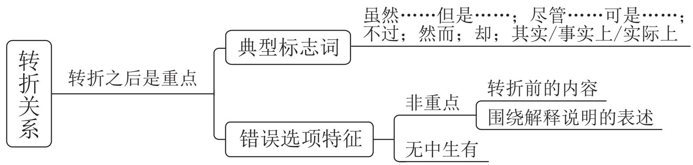

# 内容层面之主题词

1. 定义：文段围绕的核心话题，文段要围绕其展开  
2. 判断方法:

(1) 中心句围绕的核心话题, 一般前有引入或后有解释说明  
(2) 每句话都围绕的相同话题

【例1】（2024山东）云锦、蜀锦和蜡染、扎染等古代织造印染技术，作为非物质文化遗产传承至今，并在科技助力下焕发新貌；今天的新材料、新技术、新理念更是直接让国潮服饰有了新的可能。科技带来的新工艺不仅最大程度地优化传统工艺，还能创造出前所未有的产品。比如，电脑印花技术能在不同的面料上呈现逼真彩色图像，还能创造出立体效果，极大超越了传统丝网印花技术。又比如，将柔性电子屏技术和传统面料结合，让人们把电子艺术图案穿在身上，还有的设计注重运用环保技术，以推动国潮服饰可持续发展。

这段文字主要介绍了国潮服饰：

A. 创新发展离不开科技的支撑

B. 体现出蓬勃盎然的时代气息

C. 以彰显民族文化为设计理念

D. 融汇了传统要素和当代元素

【例2】（2023辽宁）晋侯鸟尊是中国历史文化的经典名片，它的尾巴为什么是个象鼻？是做什么用的？主人是谁？在今天还有什么价值？现在，我们开展一场跨越时空的展览。此次展览分为四个单元：第一单元“一梦三千年”讲述了在地下沉睡3000年的晋侯鸟尊被发现、发掘到修复完整的故事；第二单元“故国梦重归”用类似破案的方式，展示考古学家根据出土文物和痕迹，结合文献资料一步步推理出晋侯鸟尊的主人是第一代晋侯燮父；第三单元“百鸟共朝凤”主要探讨鸟尊的功能、造型以及鸟型文物的文化内涵；第四单元“引吭歌新曲”讲述文博部门围绕晋侯鸟尊所开展的教育、文创、研究等工作。

这段文字出自一个展览的前言，这个展览的主题最可能是：

A. 且听凤鸣——鸟尊的前世今生

B. 追根溯源——跨越时空的对话

C. 守护经典——文化基因的传承

D. 革故鼎新——鸟尊的文创开发

【例3】（2024 贵州）开发前沿技术应用场景的实践价值在于，通过将前沿技术落地转化为生产力。高技能人才的可贵之处不在于突破核心技术，而在于为产业痛点、难点问题找到核心技术的最佳实践运用场景。例如，将智能技术引入水、电、煤等公用事业

领域，但不同行业在应用场景选择上存在差异，电力企业重点推进智能电网建设，燃气行业的建设重点是智能表具系统……这些前沿技术的应用场景不是原始创新，而是技术的跨界融合，需要一线技术人员基于行业特点寻找适合的前沿技术实现赋能和融合。

最适合做这段文字标题的是:

A. 智能技术的开发与利用具有行业选择性  
B. 技术落地的基础——突破创新，跨界融合  
C. 找准问题——开发前沿技术应用场景的核心  
D. 高技能人才——前沿技术应用落地的“嫁接者”

【例4】（2023四川）黄色与红色一样，是中华民族偏爱的颜色。在与“五行说”相对应的“五色论”里，黄色代表土，居于四方的中央。东汉的儒家为了抬高君权，突出了“五行”和“五方”中“土居中央”的观点，把土说成是一切元素的根本，因此中央是至高无上的，这也极大地提高了黄色的地位。三国时期的魏文帝曹丕也接受了这一说法，把黄色定为正色之首，随后的隋、唐王朝都加以效仿。从唐代起，正黄色成为皇室的专用色，滥用即会获罪。时隔千年，虽然黄色早已进入寻常百姓家，但金黄色那高贵庄严的气质依然存在。

对这段文字概括最恰当的一项是:

A. 分析中华民族偏爱黄色的原因

B. 追溯土居中央观念的形成历史

C. 探讨颜色与五行观念的内在渊源

D. 强调皇权观念对色彩文化的影响

【例5】（2023国考）目前，我国“三农”工作重心已历史性转向全面推进乡村振兴。其中，保障粮食和重要农副产品有效供给是重中之重。大力发展农业保险，有助于应对农业领域的重大风险挑战，提升粮食和重要农产品供给保障能力，为乡村全面振兴保驾护航。通过发展农业保险对农业进行支持保护是国际惯例，也是许多国家农业支持保护政策的支柱。大力发展和运用农业保险工具，既是促进我国农业支持政策向国际看齐、更好适应世界贸易组织规则的现实选择，也是保障我国农业产业稳定发展、维护粮食安全、保护农民利益的长远需要。

这段文字意在说明：

A. 乡村振兴需要健全的农业支持保护政策  
B. 农业保险有助于 “三农” 工作顺利推进  
C. 农业政策既要立足国内也要有国际视野  
D. 发展农业保险是保障粮食安全的必选项

【例 6】(2024 江苏) 当古籍遇上高科技, 人们可以从一个特别的角度触摸到中华优秀传统文化。请你设计一个与之相关的活动, 小朋友们可以参与!

秀传统文化细腻的肌理。文明与技艺相生相伴，中国古代的印刷术对书籍制作和知识传播产生了深远的影响，深刻改变了世界文明发展的进程。当我们通过 VR 技术沉浸式体验古人制作书籍的过程时，当我们借助数字博物馆点开一本古籍时，源远流长的传统文化不仅是可知的，更是可感的。随着科技的发展，传统文化传播的方式也获得了新拓展。

这段文字意在说明：

A. 技术推动了文明的发展与知识传播  
B. 高科技正在改变人们对古籍的认识  
C. 借助科技手段能更好传播传统文化  
D. 应以高科技守护中华优秀传统文化

【例7】（2023广东）烈士纪念设施是讲好英雄烈士故事的重要平台，要在建设好、管理好烈士纪念设施的基础上，将其教育作用发挥好，创新手段发挥其红色教育主阵地功能。比如，在烈士纪念设施的展板和展柜上设置二维码，参观者可以扫码收听烈士事迹及相关介绍；开设烈士纪念设施VR虚拟现实展厅，让网络祭扫者全方位参观烈士纪念设施；等等。

本段文字主要讲的是:

A. 如何讲好英雄烈士的红色故事  
B. 如何保护和管理好烈士纪念设施  
C. 如何强化烈士纪念设施的教育作用  
D. 如何利用科技手段加强烈士纪念设施建设

【例8】（2023北京）放射状胶质是一种细长柱状的细胞，有两个从细胞核上下延伸的突起，具有顶端和基底的细胞极性。多个放射状神经胶质附着在每个细胞顶端，形成类似上皮细胞的片状结构。这种片状结构是大脑发育的基本结构。在大脑发育时，放射状胶质通过对称分裂的自我复制来增加数量，然后通过非对称分裂形成放射状神经胶质和分化细胞。非对称分裂中，首先会产生各种各样的神经细胞，之后会产生辅佐神经细胞工作的胶质细胞，最终形成复杂的大脑。

这段文字主要讲的是:

A. 动物大脑发育形成的基本阶段  
B. 动物大脑中不同神经细胞的分工  
C. 放射状胶质的基本结构和进化特点  
D. 放射状胶质在大脑形成过程中的作用

【例 9】(2022 山西) 制造与服务融合是智能制造的重要内容之一, 服务要素渗

透到制造各个环节中形成了生产性服务与制造服务化。本文从工业互联网的商业视角、使用视角、功能视角、实现视角建立了制造与服务融合中虚拟逻辑与实体活动交互的技术体系，有针对性地提出了生态位驱动、供应链驱动、大数据驱动、物联网驱动的制造与服务融合方法。本文构建的制造与服务融合技术体系，深化了工业互联网在制造业与服务业中的应用，为数字经济中制造服务产业的技术创新奠定了基础。

如果这是一篇论文的摘要，那么这篇论文的标题最有可能是：

A. 数字经济中制造与服务融合的协同机制  
B. 四轮驱动下的制造与服务融合技术体系  
C. 工业互联网在智能制造中的体系化应用  
D. 基于工业互联网的制造与服务融合技术

【例10】（2024国考）大模型赋能，生成式人工智能正在引发新一轮智能化浪潮。得益于拥有庞大的数据、参数以及较好的学习能力，大模型增强了人工智能的通用性。从与人顺畅聊天到写合同、剧本，从检测程序安全漏洞到辅助创作游戏甚至电影，生成式人工智能本领加速进化。随着技术迭代，更高效、更“聪明”的大模型将渗透到越来越多的领域，有望成为人工智能技术及应用的新基座，变成人们生产生活的基础性工具，进而带来经济社会发展和产业的深刻变革。人工智能大模型强大的创新潜能，使其成为全球竞争的焦点之一。

这段文字意在说明：

A. 人工智能在大模型赋能下正在快速发展  
B. 加快发展新一代人工智能势在必行  
C. 生成式人工智能的创新潜能亟待挖掘  
D. 生成式人工智能已成为全球研究的焦点

# ° 念 思维导图

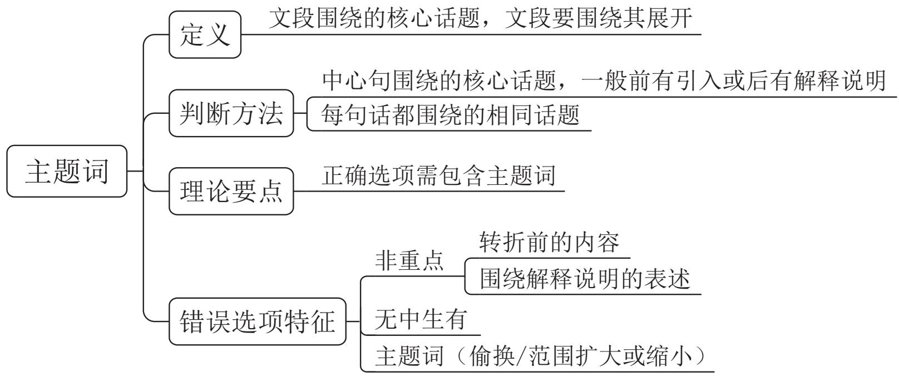

# 言语理解与表达 精讲精练 2

# 学习任务：

1. 课程内容：中心理解题（因果关系，必要条件关系—典型格式、正面提对策）  
2. 对应讲义: 第  $127 \sim 135$  页  
3. 重点内容:

(1) 因果关联词及重点位置  
(2) 必要条件关联词及重点位置  
(3) 正面提对策标志词及文段特征

# (二) 因果关系

典型格式:

因为……所以……

由于……因此……

# 理论要点：结论是重点

# 引导结论的标志词：

(1) 所以、因此、因而、故而、故  
(2) 于是、可见、看来

# 变形考法:

在这种情况下、可以说、换言之等

【例1】（2023北京）构建和完善了中国特色社会主义法律体系之后，执行实施和适用法律规范的人员就是决定因素。如何将“死”的法律制度规定变成“活”的法治社会治理效果，努力让人民群众在每一项执法决定中感受到公平正义，这就对法治队伍建设和执法人员的复合型治理能力提出了很高的要求，因而也就要系统性、渐进性地抓好法治工作人员的现代化治理能力培养。

这段文字意在强调：

A. 中国特色社会主义法治理论取得的创新  
B. 加强社会主义法治队伍能力建设的意义

C. 实现法律效果与社会效果走向统一的目标  
D. 以人民为中心是中国式法治现代化的根本

【例2】（2024辽宁）随着近些年来我国无障碍环境建设的绵绵用力和持续推进，无障碍环境建设取得了可喜的成就，极大地优化了相关群体的出行体验和尊严感。但毋庸讳言，关于无障碍设施，不少人还停留在铺设盲道并确保不被占用、公共场所指示牌标注盲文、地铁站出入口安装升降机等日常的物理设施层面，在管理的精细化方面还有进一步提升的空间。因此，有关主体不妨拓宽并畅通相关渠道，让最主要的使用者参与到相关的建设和管理中来，这些“首席体验官”带来的第一视角和经验，有助于减少过往建设盲区和误区，更有效提升无障碍设施的友好度。

对这段文字主旨概括最准确的一项是:

A. 无障碍设施的软环境建设有待进一步加强  
B. 无障碍环境设计应以契合使用需求为导向  
C. 优化无障碍环境要倾听设施使用者的声音  
D. 试用体验是无障碍设施效果检验必要环节

【例3】（2024四川）对文字信息被对方立即回复的期待，移植于面对面交谈里彼此及时回应的规则。但将现实规则转换到线上双方并不容易。交流不仅需要信息，还需要双方的面部表情、肢体语言、用词停顿、语音语调等等，这些现实里的“语境”是文字信息难以传达的。这时候，作为为数不多的语境——每条信息的间隔——就显得意味深长，特别是当我们认为对方有能力支配回复时机时。

这段文字意在说明：

A. 面对面交流中的“语境”难以移植到文字交流中  
B. 文字交流中每条信息的间隔对信息交流影响较大  
C. 交流时的肢体语言表达比文字的信息更重要  
D. 文字信息交流的 “语境” 是每条信息的间隔

【例4】（2025国考）习近平新时代中国特色社会主义思想植根于新时代中国特色社会主义伟大事业的创造性实践，每一个理论成分背后都有着鲜活的实践支撑，比如蕴含“创新、协调、绿色、开放、共享”新发展理念的经济高质量发展案例、体现“党的领导、人民当家作主和依法治国有机统一”政治理念的现代治理案例、体现“绿水青山就是金山银山”的生态文明思想案例等。通过讲述这些蕴含中国观点、体现中国立场、彰显中国智慧、弘扬中国价值的生动故事，让国际社会更加深切地感知和理

解习近平新时代中国特色社会主义思想的理论内涵和实践逻辑。

这段文字意在强调：

A. 党的创新理论要在实践中检验和发展  
B. 讲好中国故事有助于提高国际话语权  
C. 要积极利用案例传播党的创新理论  
D. 理论宣传应该综合运用国内外资源

# 知识链接：

结论句出现在文段开头/中间，之后仍有其他语句：

(1) 之后的语句是进一步解释说明, 此时中心句仍为结论句  
(2) 之后又出现并列、因果、转折、对策等, 需结合多种关联关系共同分析

【例5】（2025国考）相比高校和科研机构，企业处于市场最前沿，对有市场潜力的技术感知更灵敏，对产业发展趋势的把握也更敏锐。因此，在颠覆性技术的研发、转移转化过程中，需要强化企业科技创新主体地位。在课题立项中，要加快提升企业技术创新决策的主体地位，建立企业常态化参与国家科技创新决策的机制；在创新过程中，要着力强化企业科研组织的主体地位，支持领军企业聚焦国家重大需求，牵头组建创新联合体，加快形成企业主导的产学研深度融合。同时，人才、经费等创新要素也要加快向企业特别是科技领军企业集聚。

这段文字意在说明：

A. 应着力完善国家科技创新决策的体制机制  
B. 颠覆性技术创新需重视并发挥企业的作用  
C. 要大力推进颠覆性技术的研发及转移转化  
D. 创新要素的大量集聚有助于企业技术创新

【例6】（2023国考）生态修复请求分为生态修复的行为请求和费用请求，前者是为了防止生态环境权益损害的发生或扩大，请求责任人停止污染破坏行为；当被破坏的生态环境无法恢复时，请求责任人进行人工修复。如果责任人不具有修复能力或意愿，可请求责任人承担修复费用。因此，修复行为请求应作为首要诉求，在责任人不能或不愿进行修复时，才能提出修复费用请求。在司法实践中，很多公益诉讼人却往往将修复费用请求作为首要诉求，但由于诉求和判决的修复费用数额不易确定，责

任主体短期内难以承担修复费用，生态修复工作很难有效开展。

这段文字意在说明：

A. 应该制定生态修复费用的分级标准  
B. 修复费用请求往往很难得到有效落实  
C. 应根据责任人的能力确定生态修复诉求  
D. 生态修复诉讼应当首先提出修复行为请求

【例7】（2024国考）我国经济已由高速增长阶段转向高质量发展阶段，这是一个重要转变。一个时期以来，传统投资驱动的经济增长模式已经难以为继，同时经济全球化遭遇逆流，大进大出的环境条件已经变化，不可能单纯依靠出口实现经济发展质的提升。因此，必须根据我国经济发展实际情况，建立起扩大内需的有效制度，特别是要更好更充分释放消费潜力。消费作用的不断强化，能有效降低我们对出口和投资的依赖，有利于经济长远发展，促进经济内外平衡发展，实现提质增效。

这段文字意在说明：

A. 高质量的经济发展需重点平衡好质与量的关系  
B. 单纯依靠出口实现经济发展的模式亟待改变  
C. 释放消费潜力有利于推动经济高质量发展  
D. 优化扩大内需制度是经济长远发展的关键

【例8】（2023四川）司法实践中，类型化审判是一种防止自由裁量权恣意行使的机制。这种审判方式是一种对先前案例或者判决的参考，这不是一种个案之间个别化、点到点之类的参考，而是对此前相类似的一组或者一批案件的参考，是和已经总结出来的相应特征的对照、参考和调试。因此，类型化审判的裁判结论是以较多的案件结论为基础，以概括性更强、视野更广的先例特征为参考作出的，更为准确，也更易被社会认同。同时，这种审判方式对法官自由裁量权具有更强的约束力，没有充分的理由和依据，办案法官很难抛开类型化先例特征和结论的限制而给出截然不同的结论。

这段文字意在说明类型化审判：

A. 有利于社会认同与司法公平  
B. 应广泛应用于司法实践领域  
C. 是对法官自由裁量权的有力监督机制  
D. 对判决的理论和依据提出了更高要求

# $\circ \varnothing$  思维导图

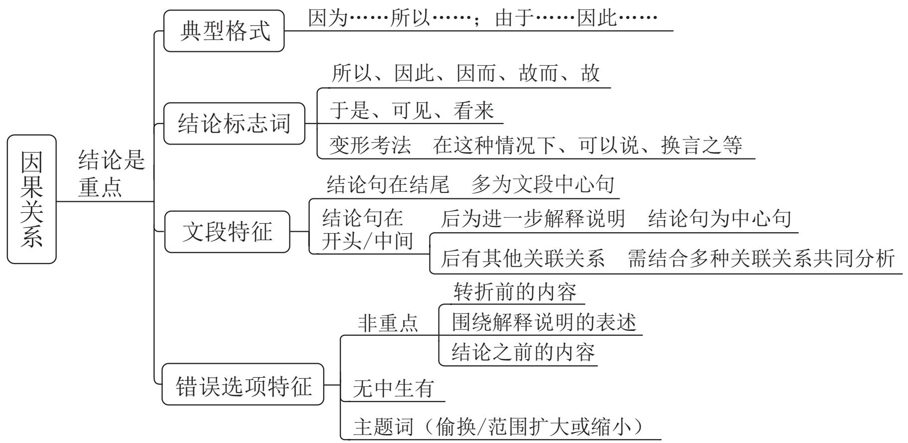

# (三) 必要条件关系

典型格式:

只有……才……

# 理论要点：

1. 必要条件是重点  
2. 必要条件即“只有”和“才”之间的部分

【例1】（2023 浙江）舰船类部队装备型号多，使得不同岗位的船员都有不同的学习训练需求，客观上加大了军事院校集中组织培训的难度。与此同时，船用装备结构复杂、构件精密，操作维修的技术含量高，人才培养周期较长。以机电岗位为例，从刚接触设备到能够单独操作设备、处理机械故障，一般要  $3 \sim 5$  年的培养期。如仅仅依靠军队系统培养人才，既会造成资源浪费，也会影响发展质量。因此只有把舰船类人才培养的眼光投向社会，充分借助地方平台载体，拓宽培养渠道，才能不断提升人才培养质量。

这段文字意在强调舰船类部队人才培养要:

A. 提高培训质量

B. 缩短培养周期

C. 创新培养模式

D. 加大培训力度

知识链接：对策常考，很重要

# 对策标志词：

1. 应该、应当、应、需要、要、必须 + 做法  
2. 通过 / 采取……手段 / 途径 / 措施 / 方式 / 方法 / 渠道，才能……  
3. 前提、基础、保障  
4. 负有……的义务 /……的必由之路 /……的法门之一 / 势在必行 / 要领在于……

# 行文脉络:

1. 提出问题 + 分析问题 + 解决问题  
2. 提出问题 + 解决问题 + 解释说明（意义效果）  
3. 对策 + 解释说明

【例2】（2024江苏）生产性服务业包括研发设计、信息数据、人力资源、现代物流等领域，涉及农业、工业等产业的多个环节，具有专业性强、创新活跃、产业融合度高、带动作用显著等特点。国际经验表明，制造业发展到一定阶段后，其附加值和市场竞争力的提升更多的是靠现代生产性服务业的支撑。相较而言，我国生产性服务业发展相对滞后，总量不足、结构不合理等问题仍较突出。推动中国制造由大到强，需要我们推动生产性服务业向专业化和价值链高端延伸，更好服务制造业高质量发展。

这段文字意在强调：

A. 应进一步推动生产性服务业高质量发展  
B. 生产性服务业包括涉及多领域众多产业  
C. 生产性服务业与制造业的发展息息相关  
D. 更好服务制造业是生产性服务业的目标

【例3】（2023广东）对各级领导干部来说，摸清吃透基层情况，了解“第一手”民意，才能扎实开展好各项工作。网络中的群众诉求和建议是社情民意的直观表达，群众反映的问题清单就是党员干部办实事的履职清单。各级干部特别是领导干部要深刻认识互联网在国家管理和社会治理中的作用，不断创新互联网时代群众工作机制，用信息化手段更好地了解社会态势、畅通沟通渠道、辅助决策施政。

这段文字意在强调：

A. 各级领导干部要善于运用网络了解民意，做好工作  
B. 互联网在国家管理和社会治理中发挥着重要作用

C. 了解民情民意是各级领导干部开展好各项工作的基础  
D. 听取和接受群众意见建议是新时代社会治理的内在要求

【例4】（2024宁夏）随着大数据、物联网、云计算等现代智能技术的发展，人类社会进入了智慧治理时代。智慧治理对于推进国家治理体系和治理能力现代化具有重要现实意义。当前正在推进的智慧治理面临治理效率低下、数据信息安全存隐患等困境和风险。对智慧治理面临新任务新期待的理论认识不足、主动适应不够，以及过度依赖智能技术对智慧治理的定位不准是导致困境和风险的重要原因。解决智慧治理中存在的问题，需要实现从智能技术赋能到技术融合的转变，理念融合、过程融合及目标融合是实现这一转变的重要路径。

假如这是一篇文章的摘要，那么这篇文章的标题可能是：

A. 迈向技术融合的智慧治理  
B. 理论认识不足制约智慧治理  
C. 智能技术赋能的智慧治理路径  
D. 智慧治理存在的问题及成因分析

【例5】（2024山东）目前，我国生态环境保护法律体系已基本形成，但同党和国家发展要求、人民群众的期待、推进生态文明治理体系和治理能力现代化目标相比，相关法治建设仍有待加强。例如，新时期草原保护管理工作已由围绕畜牧业生产服务为主转向生态保护为主，现行法律法规已难以满足工作需要，应加快完善以草原法为核心的草原相关法律法规制度体系。建议立法机构和相关部委积极开展生态环境领域修法立法的调研和梳理工作，按照轻重缓急将相关法律法规纳入立改废释纂规划，通过科学立法增强生态环境法治的系统性、整体性、协同性、时效性，为美丽中国建设提供更严密的法治保障。

这段文字意在说明：

A. 党和国家生态文明建设事业有了新的发展要求  
B. 新时期草原保护工作亟须完善相关法律法规制度体系  
C. 要统筹推进生态环境保护领域法律法规立改废释纂工作  
D. 我国生态文明领域迫切需要环境法律体系的保障

【例6】（2025国考）足够的执法权限是基层治理高效运行的必要条件。权限不足，可能导致基层执法需求与实际权力配置之间存在较大张力，让基层治理陷入“看得见的管不着”的低效治理困境；但权限如果过度下放，又可能出现“接不住、管不

好”的现象。因此，一方面需要进一步完善执法目录动态调整机制和制度，确保执法职能精准划转、行政职权科学配置；另一方面需要加快完善基层执法事项基准库，建立基层执法事项指导目录，确保执法事项在基层供需精准对接、有效贯通执行、全面落实落细。

这段文字意在强调，基层治理应：

A. 重视 “基层执法”, 提升基层执法服务效果  
B. 围绕 “精准赋权”, 科学动态调整执法权属  
C. 加快 “权限下放”, 精准对接基层执法需求  
D. 调整 “执法目录”, 落实落细基层执法事项

【例7】（2024国考）任何领域人才的成长进阶之路都离不开激励。以往提起技能人员，人们往往会想到“社会认可度低”“上升空间有限”“工资待遇不高”等标签。一些年轻人不愿意进工厂，企业也时常出现技工荒，这都不利于制造业的高质量发展。经过多年的努力，我国通过出台各类支持技能人才发展的政策措施，引导用人单位对高技能人才实行岗位分红、专项特殊奖励、技术创新成果入股等激励办法，为构建完善的高技能人才培养体系提供了保障和依据。如今，技能人才的上升空间更加广阔，上升渠道更加通畅，评价机制更加完善，待遇水平也更有吸引力。

这段文字意在说明：

A. 政策激励使技能人才培养体系更完善  
B. 企业应为技能人才成长提供上升空间  
C. 应不断创新企业吸纳人才的激励办法  
D. 技能人才是制造业高质量发展的保障

【例8】（2025 浙江）传统旅游有追求“冬暖夏凉”的季节性特征，现在游客则追求极致体验性。冬季到北方体验冰雪旅游，夏季到南方体验水上和高空项目，南北方全时段都有旺盛的体验需求。这就要求传统旅游城市从自然景观向娱乐文旅融合等消费场景过渡，加大“非热点时段”的旅游硬件设施和软性服务的整体供给能力。许多传统旅游城市因旅游需求旺盛而提升了“以游客为导向”的服务能级，服务更加主动、热情、精细、有活力，城市服务治理整体提升。

这段文字意在说明：

A. 旅游市场及游客需求日益多样化  
B. 传统旅游的价值仍有待进一步挖掘  
C. 传统旅游城市需开发旅游消费新业态

D. 新的旅游需求推动城市服务升级优化

【例9】（2023广东）城乡历史文化保护传承，要在精准上下功夫。城乡历史文化范围广、类型多、数量大，情况尤为复杂。不同的传统建筑、旧城街巷等物质遗存，相异的地域风情、民俗习惯等非物质传承，构成了各城市与众不同的文化气质。这也决定了历史文化保护传承方法不能完全相同，必须坚持分类科学。在历史文化名城建设中，历史古都型如何保护、传承，传统风貌型如何延续、更新，地域特色型如何保持、创新；在文化特质赓续中，江南水乡如何留住恬静雅致，北方大院如何维持古朴雄浑，湘西古城如何散发神秘通幽……不同地域、不同类型的历史文化，只有精准施策，才能保护好、传承好。

这段文字意在强调：

A. 城乡历史文化保护传承要因地制宜  
B. 城乡历史文化保护传承面临着复杂局面  
C. 城乡历史文化保护传承应保留城市的物质遗存  
D. 城乡历史文化保护传承需要关注城市的文化气质

【例10】（2024湖北选调）朝九晚五完成工作任务，最后光荣退休颐养天年，是时下一些人盼望的活法。可这样的你，是作为社会的人过了机械麻木的一生，还是作为个体的自己度过有意义的一生呢？哪怕单站在社会的角度看，鲁迅若安心当医生，中国现代文坛就少了位开山巨匠。他们个体不彰且不谈，这难道不是社会的损失和退步吗？没有目标的船，注定在大海中失去自己的定位。人既来世上走一遭，何不看清自己是艘怎样的船，然后为自己点亮一座远方的大灯塔，让它长明不灭呢？如果嫌大灯塔太远，我们可以在途中点亮一座座小灯塔，依次顺着航行，不知不觉就到达了当初设置的目的地。就算半路上大灯塔被海风吹灭，我们也沿着小灯塔走了很远很远，可以骄傲地告诉自己：不虚此行，不虚此生。

最适合作为上述语段标题的是:

A. 莫虚此行，莫负此生  
B. 人生苦短, 有志竟成  
C. 点亮灯塔，追光而行  
D. 有可为矣, 笃志笃行

# 言语理解与表达 精讲精练3

# 学习任务：

1. 课程内容：中心理解题（必要条件关系一反面提对策、文段无对策，并列关系）  
2. 对应讲义: 第  $136 \sim 144$  页  
3. 重点内容:

(1) 反面提对策的判定方法  
(2) 文段无对策的解题思路  
(3) 并列关系的文段特征

# 反面提对策

典型格式：如果 / 倘若 / 一旦……+ 不好的结果

具体应用：把前面的做法反过来，即为对策

【例1】（2024 浙江）对于珊瑚礁来说，海水温度的上升会导致与之共生并提供食物的藻类的大量丧失，从而导致珊瑚礁“白化”甚至死亡。更糟糕的是，由于海洋吸收了大量的二氧化碳，海水酸化严重，珊瑚礁的生长进一步减缓。健康的珊瑚礁是  $25\%$  以上的海洋生物的家园，并且可以保护海岸线免受风暴和侵蚀，还可以为当地社区提供经济收入和就业机会（比如旅游业）。虽然珊瑚礁在不受干扰的环境下具有较快的恢复能力，但在全球变暖的大进程下，珊瑚礁的总体数量呈现出逐年下降的趋势。据联合国环境规划署估计，世界上  $25\%$  至  $50\%$  的珊瑚礁已经遭到破坏，如果不大幅减少温室气体排放，到2100年，所有海域内的珊瑚礁都将死亡。

这段文字意在强调：

A. 导致海洋热浪发生的直接原因是温室气体排放  
B. 海水温度上升将严重威胁所有海洋生物的生存  
C. 减少温室气体排放以保护珊瑚礁已经刻不容缓  
D. 珊瑚礁对海洋环境和人类社会都具有重大影响

【例2】（2025国考）如果一味沉湎于琐碎的日常事务，缺乏大局观念和政治远

见，不分轻重缓急，不从原则高度想问题，就会陷入事务主义。习近平总书记指出：“如果忙忙碌碌，只是机械做事，陷入事务主义，是很难提高认识和工作水平的。”这就意味着，要提高认识水平，必须走出事务主义的泥潭。毛泽东曾经指出：“庸俗的事务主义家不是这样，他们尊重经验而看轻理论，因而不能通观客观过程的全体，缺乏明确的方针，没有远大的前途，沾沾自喜于一得之功和一孔之见。”这为如何走出事务主义提供了指南针和路线图。

这段文字认为，为避免陷入事务主义，应该：

A. 具有清晰明确的工作方案  
B. 坚持从理论高度看待问题  
C. 不断从实践中总结经验教训  
D. 通过学习补齐能力素质短板

# 文段无对策，只阐述问题

# 选项特征：

1. 有针对性、能够解决问题的对策  
2. 概括问题

【例3】（2024 深圳）经常听到国内许多专门家痛心疾首地抱怨各种走俏的传媒作品严重缺乏学术上的准确性和严肃性；但是专家学者们却往往又把自己的研究成果表述得过分艰涩干瘪而少趣味，使少数同行之外再不会有什么别的人愿意皱着眉头去读完它们。学术探索的过程本来应该是充满奇光异彩的。趣味从我们的学术著作中脱逸的现象，很可能表明一部分徒有其表的“学术著作”本身其实并不真正地具备“学术”一词所必须含有的基本品格。但确实也存在另一种情形，即作者缺乏下述这种充分意识：他应当尽可能地让读者与他共享的，乃是科学探索中的乐趣与喜悦，而不只是其中的艰辛与酸楚。

这段文字意在:

A. 分析传媒作品与学术著作受众规模差异的原因  
B. 鼓励学术著作向走俏的传媒作品借鉴表达  
C. 批判趣味已经从大多数学术著作中脱逸的现状  
D. 提倡撰写学术著作应将趣味性与学术性并重

【例4】（2024四川）文学翻译是个复杂的工程，不能单纯追求信达雅，有时候需要译者主动求变，需要译者根据不同的文化语境，根据具体的语汇与词义及其背后的文化背景，对原文做出必要的调整。而这种必要的调整，对于译者来说，既是其主体性的体现，也是翻译的责任所在，在某种程度上，它是与原作者所进行的一种精神对话。遗憾的是，目前的情况是，一旦有翻译家被发现在其翻译作品中出现了“错误”，就会被批得一塌糊涂。这样的批评生态，实在不利于翻译家的工作以及新的翻译家的出现。

作者通过这段文字意在强调：

A. 译者和译著需要读者们和评论家的宽容  
B. 文学翻译有不同于一般著作的评价标准  
C. 不同的文化背景给文学翻译带来障碍  
D. 文学翻译需根据文化语境做必要调整

【例5】（2023国考）我国在改革开放后逐渐认识到保护民间文学艺术作品的重要性，并在1990年著作权法规定保护办法另行规定。但时隔三十余年，保护办法仍未出台。尽管如此，在著作权法颁布后，学界就民间文学艺术作品法律保护展开研究讨论，提出多种保护方案，涉及权利客体、权利主体、权利内容、保护期限、权利限制等方面的问题。当然，也有个别学者反对用著作权法保护民间文学艺术作品，主张通过公法加以保护。与此同时，国家版权局也加快推进相关立法，但因质疑声音过大而夭折。

作者可能赞同下列哪一观点？

A. 通过公法保护民间文学艺术作品是最可行的路径  
B. 围绕民间文学艺术作品法律保护的争议流于表面  
C. 国家版权局应就民间文学保护倾听多方面意见  
D. 民间文学艺术作品法律保护缺位状态亟须改变

【例6】（2024 黑龙江公安）知识产权侵权假冒行为具有形式上跨区域、实质上链条化的特点。而随着物流体系的发达，网上销售已遍及城乡甚至跨越国界。因此，虽然侵权假冒商品的生产制造者、网络销售者、电商平台、消费者往往不在同一行政区域，但知识产权侵权假冒者往往是生产、流通、销售链条化、一体化运作。然而，在执法管辖上，由于行政执法的管辖区域限制，行政执法机关只能就本区域内的侵权假冒行为进行查处；在执法调查取证上，往往需要执法行政机关跨区域调查取证，这就影响了知识产权行政执法的效率和效果。

针对这段文字中出现的问题，下列应对方法最有效的是：

A. 运用信息化、智能化手段为执法办案赋能，强化行政执法技术支撑  
B. 健全网络知识产权保护的相关法律，建立线上线下一体化立法机制  
C. 建立多元化沟通机制，加强执法部门与权利人以及平台的沟通合作  
D. 树立全链条办案理念，建立上下联动、区域协作的全链条执法机制

【例7】（2023 福建）截至2021年，化石燃料的燃烧正式改变了北半球空气中碳同位素的组成，甚至足以抵消核武器试验发出的信号。而这可能会给有价值的碳年代测定技术带来问题。专家发现，从放射性碳年代测定法来看，现代物品看起来就像是20世纪早期的物品。专家表示，这种趋势“可能很快就会让人很难分辨一件东西是1000年前的还是现代的”。

最适合做这段文字标题的是:

A. 化石燃料燃烧带来的影响

B. 放射性碳年代测定的原理

C. 如何分辨物品的年代属性

D. 碳年代测定技术可能不再准确

【例8】（2023 浙江）市场交易是市场机制有效配置资源的主要形式，而价格信号则是市场交易的指挥棒。国际资源配置最有效率的方式无疑是自由贸易。贸易保护主义旨在通过提高关税、设置贸易壁垒、采用反倾销反补贴等手段提高进口商品价格，阻止国外生产效率高且物美价廉的商品或服务进入本国市场。从表面上看，贸易保护主义保护了国内产业与就业安全，但实际上保护的是低效率生产，会造成商品或服务价格信号失真，使资源配置到没有比较优势的产业，而真正具有比较优势的产业却因得不到足够资源而难以持续发展。贸易保护主义还会对被保护产业的上下游关联产业产生影响，引起系统性的价格信号失真与资源配置扭曲。

这段文字主要介绍：

A. 实施贸易保护主义的消极影响  
B. 贸易保护主义得以实现的基本手段  
C. 自由贸易与贸易保护主义的主要区别  
D. 国际市场中资源有效配置的最佳方式

# $\circ \varnothing$  思维导图

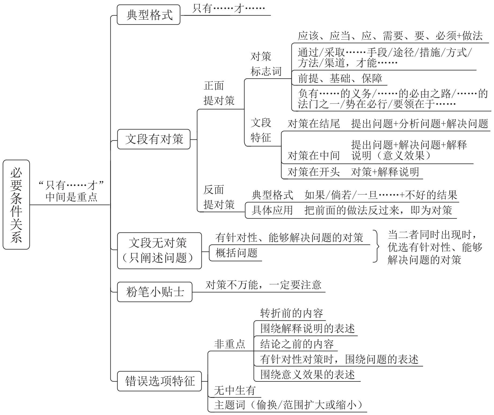

# （四）并列关系

理论要点：全面概括

# 文段特征：

1. 包含并列关联词及标点，如此外、另外、同时、以及、“；”  
2. 句式相同或相近  
3. 按照时间顺序展开

错误选项特征：表述片面

【例1】（2023国考）我国在经济快速发展的同时，培育和形成了全球少有的超大规模内需市场。与小规模经济体相比，超大规模经济体在全球经济运行中通常发挥

着“锚”的作用。改革开放以来，我国之所以能够成功应对亚洲金融危机、国际金融危机等的冲击，一定程度上就得益于此。另外，超大规模市场的多样性意味着更强的内部稳定性。产业发展、区域发展的差异性可以减少冲击的影响，局部的内部冲击不易在全国形成共振效应；部分行业、部分区域发展面临困境，并不会对宏观经济总体稳定产生巨大冲击。

这段文字意在说明：

A. 我国既是经济全球化的受益者也是贡献者  
B. 多措并举对保障内需市场稳定有重大意义  
C. 超大规模市场有助于我国经济保持稳定  
D. 超大规模经济体助力全球经济平稳运行

【例2】（2023辽宁）南极洲是陆地，北极是海洋——北冰洋。由于陆地比热小，升温和降温都快，因此冬季的南极比冬季的北极更冷。南极在冬季时地球处于离太阳最远的地方，而北极在冬季时地球处于离太阳最近的地方。南极洲中心为极地高气压区，气流由中心流向四周，阻挡来自低纬度的暖空气进入南极大陆。南极洲外围还有南极环流，该环流属于寒流，给南极大陆带来的是冷空气。此外，北极近三分之二的面积都是海洋，平均海拔与海平面相当，而南极洲是高原大陆，平均海拔为2350米，是世界上平均海拔最高的大洲，正所谓“高处不胜寒”。

这段文字意在说明：

A. 南极洲独特的地理环境

B. 影响南极洲温度的因素

C. 南极比北极更冷的原因

D. 南极和北极的地理差别

【例3】（2022 贵州）在传统的文化消费中，无论是阅读书籍、聆听音乐还是欣赏影视作品，都是单向度的，创作与消费是两个独立的环节。在体验式文化消费中，消费者不仅参与创作，也是作品的组成部分，这让消费者的主观能动性得到更加充分的发挥。独一无二的作品背后，是独一无二的经历与体验。体验式文化消费因而具有唯一性、当下性与不可复制性。另外，体验式文化消费中的互动过程，综合利用包括 VR、AR 在内的多媒体数码技术，提供跨媒介的多感官体验——如温度、质感、震动等在传统文化产品中很难体验到的综合感官效果，为叙事与审美提供了更多维度。

这段文字意在说明：

A. 体验式文化消费会更受消费者青睐  
B. 现代技术对体验式文化消费的促进作用  
C. 体验式文化消费中消费者主动参与的重要性

D. 体验式文化消费带给消费者与众不同的体验感

【例4】（2023山东）影视作品凝结的不只是创作者们的灵感和创意，还有时代文化形成的集体无意识的投射和缩影。就影视作品而言，一方面，对社会文化的传承来说，经典作品承载着丰厚的文化价值，对经典的重复呈现既是一种文化延续，也是一种文化确认，与我国传统文化联系密切的经典影视作品尤为如此。另一方面，对影视文化的发展来说，经典作品原有版本的魅力会逐渐褪色，用新的视听技术、新的时代美学和新的演员演绎将经典重新阐释一遍，则是赋予这些作品与时俱进的新生命力，其本身是重塑经典甚至创造新经典的过程。

这段文字主要说明：

A. 经典影视作品生命力的来源

B. 对待经典影视作品的正确态度

C. 经典影视作品与传统文化的关系

D. 新时代翻拍经典影视作品的意义

【例5】（2024广东）大力倡导绿色消费方式是实现经济高质量发展和生态环境高水平保护共赢的重要推动力。要进一步引导全社会认同绿色消费，使绿色消费方式成为公众自觉选择；引导促进绿色产品消费，为促进经济社会发展全面绿色转型创造条件；全面推动各领域消费绿色转型升级，形成节约适度、绿色低碳、文明健康的生活方式和消费模式。

本段文字主要讲了：

A. 如何倡导绿色消费方式

B. 如何实现经济高质量发展

C. 为什么要倡导绿色消费方式

D. 为什么要实现经济高质量发展

【例 6】(2024 贵州)人类特别喜欢读到和关注有关他人和社会的负面信息, 媒体从业者则是顺应这种喜好, 这使人们接触到更多的负面信息而非正面信息。这种 “有偏见的暴露效应” 解释了为什么人们认为当前的道德水平相对较低。而当人们回忆过去时, 负面事件更可能被遗忘, 这是由于大脑的内在机制要求不良事件引起的负面反应情绪必须被平复, 因此时过境迁, 再大的悲剧也可以慢慢放下。这种 “有偏见的记忆效应” 又解释了为什么人们认为过去的道德水平相对较高。

这段文字意在说明：

A. “世风日下”可能是一种群体心理错觉

B. 心理层面人们更愿记住过去美好的事件

C. 道德水平的高低取决于负面事件的影响

D. 媒体传播强化了人们对负面信息的接收

【例7】（2023事业单位）从17世纪到20世纪中叶，怀旧心理一直被学界认为是由思乡病带来的痛苦甚至病理性的体验。直到20世纪末，西方学者才将怀旧和思乡病区分开来，他们开始注意到怀旧的积极作用，并将怀旧定义为一种正面情绪。而现代心理学对怀旧的普遍理解是：对过去的渴望和喜爱。心理学家维尔德舒特认为，怀旧是正面情绪的“储藏室”，它储藏了快乐、幸福、宁静等正面情绪。而心理学家威尔曼则认为怀旧是一种喜忧参半的情绪，它既包含回忆往昔带来的快乐，又包含“再也回不去”的失落与忧伤。

这段文字主要说明：

A. 学界对“怀旧心理”认知的变迁  
B. 以前排斥 “怀旧”, 如今追求 “怀旧”  
C. 怀旧不只有消极情绪，还有正面情绪  
D. 思乡病折射出现代人的怀旧心理与真实生活

# 知识链接：

1. 句与句之间无明显其他类型关联词（转折、因果、对策等）时，可考虑并列  
2. 选项特征：两方面并列（和、及、与、同等）、多方面并列（许多、多种、不同、一系列等）

【例8】（2024国考）目录链主要依托区块链技术进行搭建，可将政府部门、职能机构的数据共享关系和流程上链锁定，建构起数据共享的新规则。所有的政务数据共享、业务协同行为在链上共建共管，无数据的职责会被调整，未上链的系统将被关停，从而建立起部门业务、数据、履职的全新“闭环”，解决应用与数据脱节、技术与管理失控等问题。在具体技术应用上，目录链通过数据协调机制实现数据信息高效交互，通过多点共识确保数据存储不可篡改，通过交互验证对数据计算和结果的可信度审计追溯，从而实现对数据资源目录进行全面管理和监控。

这段文字主要介绍了目录链的：

A. 产生背景及共享规则

B. 数据存储及监管流程

C. 适用场景及流程体系

D. 技术依托及应用价值

【例9】（2022国考）从学理的角度来说，知识产权诉前行为保全是指为及时制止正在实施或即将实施的侵害权利人知识产权或有侵害之虞的行为，而在当事人起诉前根据其申请，由法院签发的一种禁止行为人为或不为一定行为的强制性命令。它属于知识

产权侵权救济的一种暂时性措施，有着维权“及时雨”的功能。有别于传统财产权侵权，知识产权客体的易复制性与极易扩散性，使得知识产权人改变了过去倚重事后救济来保护权利的习惯。在当前国家加大知识产权保护力度、建立知识产权侵权惩罚性赔偿制度的背景下，及时有效地制止侵权比等到切实的损害结果发生后的救济更加有效。

这段文字主要介绍了知识产权诉前行为保全的：

A. 救济原则与法律依据

B. 研究背景与实施过程

C. 法律效力与赔偿策略

D. 法理概念与司法功能

【例10】（2024吉林）春季星空有划过天空的“春季大弧线”和众多的深空天体。秋季星空有“秋季四边形”，还可以看到北半球唯一一个可以肉眼看到的河外星系——仙女星座。仙女星座非常明亮，即使远在距地球254万光年之外，在地球上的我们依然能仅凭肉眼就看到它灿烂的光辉。冬季星空亮星较多，有显著的“地标”——“冬季大三角”，以及辨识度很高的猎户座，因此冬季也是观赏星空的好时机。夏季星空的最大亮点，便是璀璨的银河高挂天空，银河系的“银心”正位于人马座方向，人马座在夏夜空中逗留的时间最长——此时的星空，正是“群星闪耀时”。

对这段文字的主旨概括准确的是:

A. 四季星空，各美其美

B. 我约星辰，星约四季

C. 夏夜长空，星系闪耀

D. 星汉灿烂，扮美四季

# ° 念 思维导图

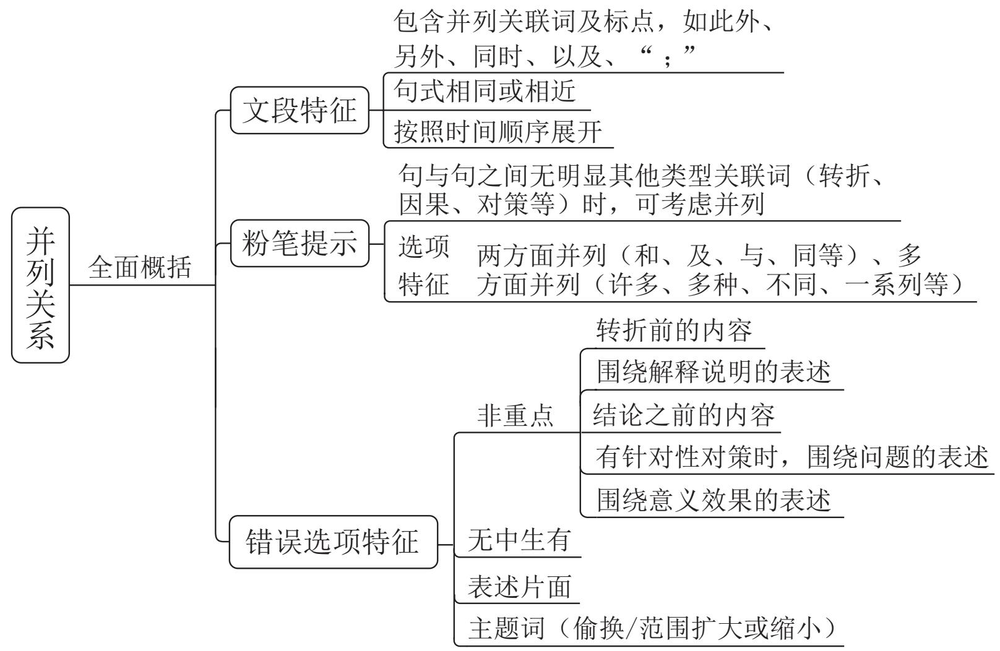

# 言语理解与表达 精讲精练 4

# 学习任务：

1. 课程内容：中心理解题（分述句特征）、细节判断题  
2. 对应讲义: 第  $145 \sim 154$  页  
3. 重点内容:

(1) 分述句特征  
(2) 细节判断题的解题思维及错误选项特征

# 二、间接确定重点

# 分述句特征：

1. “比如”“例如”“……就是例证”等例子表述  
2. 数据资料  
3. 多角度论述  
4. 引入铺垫

···

【例1】（2025国考）如今，文艺工作者深入挖掘传统绘画与传统舞蹈之间的内在联系，将诗、书、画、乐、舞融于一体，形成新的审美表达。比如，杭州亚运会开幕式文艺表演环节，第一个节目《水墨入诗画》便以中国画为基本元素，身着青绿色长裙的舞者在山水画卷中翩翩起舞，营造出“人在画中游”的优美意境。舞蹈诗剧《只此青绿》同样以经典山水画为灵感，通过舞蹈再现画家王希孟创作《千里江山图》的过程，并以刚柔相济的肢体语言、精心设计的舞蹈动作呈现山水神韵。在这些作品中，传统绘画与舞蹈的创意融合产生叠加效应，使传统文化与现代审美相谐适，产生了广泛的社会影响。

最适合做这段文字标题的是:

A. 青绿热: 传统与现代的双向奔赴  
B. 传统与现代：审美表达的异与同  
C. 人在画中游: 穿越千年的艺术盛宴

D. 画与舞: 跨界融合激发艺术新活力

【例2】（2023辽宁）科技是实现文化创意、放大文化效用的重要手段。特别是在文博行业，新技术不仅帮助文物从“抢救性保护”迈向“预防性保护”，还提供文创手段和思路。比如数字技术，相较于过去的胶片拍摄，敦煌数字壁画不会褪色，而且清晰度大幅提高。这些逐渐积累起来的数字素材，成为敦煌发展文创的资源库，不仅可以用来设计实物文创产品，还可以制作视频，让壁画中的人物动起来，更具观赏性。再比如利用数字化解析技术，在异地展览中再现代表性洞窟，人们徜徉其中，仿佛在真实的莫高窟中游览。

最适合做这段文字标题的是:

A. 数字技术, 令敦煌再次高光闪耀  
B. 科技赋能，让文物焕发时代光彩  
C. 敦煌文化，借技术加持破壁出圈  
D. 传统艺术，以别样方式创新讲述

【例3】（2024江苏）汉代农业生产水平逐渐提高，生活物资较为丰富，上层社会在饮食上更加考究，饮食文化随之蓬勃发展。这一时期，烹饪技艺也大幅提升，尤其是中原地区与周边民族的饮食文化交流频繁，一些新的烹饪方法如“豕炙”即被引入。“豕炙”即煮或涮羊肉、鹿肉；而“豕炙”则类似于烤全羊，较之中原烤法，所烤之物更大。《释名》中说：“豕炙，全体炙之，各自以刀割，出于胡豕之为也。”“豕炙豕炙”做出的肉食，鲜嫩味美，此类烹饪方法在黄河流域逐渐流传开来，受到人们的青睐。

这段文字重在说明：

A. 社会发展是汉代饮食文化蓬勃发展的重要因素  
B. “羌煮貊炙”一词是胡汉饮食文化交流的表征  
C. 汉代中原地区吸收了不少其他民族的烹饪方法  
D. 汉代烹饪技艺的提升与民族文化交融密切相关

【例4】（2024辽宁）中国共产党人精神谱系的生成从来不是盲目冲动的，也不是主观臆想的，而是基于对社会现实的把握、对社会历史的总结，从客观现实和人民群众的伟大实践中阐发出来的。延安精神坚持实事求是的思想路线，“实事”就是客观存在的事物及其内部联系，“求是”就是去研究、探索真理。改革开放精神是中国共产党人在改革开放和建设中国特色社会主义这一特定的历史时期中所形成的解放思

想、实事求是，开拓创新、勇于担当，开放包容、兼容并蓄的精神品格。至于新时代北斗精神，在尊重科学的基础上，“自主创新”“追求卓越”无疑都是制胜密码。

这段文字所反映的中国共产党人精神谱系的特征是：

A. 坚持党性与人民性的统一  
B. 坚持理想性与现实性的统一  
C. 坚持民族性与世界性的统一  
D. 坚持客观规律性与主观能动性的统一

【例5】（2023国考）农业是个生态产业，农村是生态系统的重要一环。要健全草原森林河流湖泊休养生息制度，巩固退牧还草、退耕还林成果，开展大规模国土绿化行动，加强生物多样性保护。这方面要有个科学规划，荒山、沙漠、滩涂、森林、草原等治理要因地制宜、符合实际，不能都是一种套路。长江、黄河流域是生态文明建设的主战场，农业农村任务十分艰巨。长江流域要抓好十年禁渔，加强执法监督和市场监管，妥善解决好渔民转产转业和社会保障问题。黄河流域要抓好农业深度节水控水，因水施种，发展节水农业、旱作农业，把农业用水效率提上去、总量省出来。

这段文字意在说明：

A. 农业与农村生态文明建设任重道远  
B. 农业发展与生态治理需做好统筹  
C. 农业生态建设要做好科学规划  
D. 生态文明建设要找准着力点

【例 6】(2024 天津) 社会心理学先驱所罗门·阿希通过一系列著名的阿希从众实验证明, 即使是判断 “三段线段谁最长” 这样的简单任务, 人们的回答也会受到他人的强烈影响, 进而在并无胁迫的情况下服从某种群体规范。人们为什么会服从规范?这可能源于群体中的个人害怕被其他成员视为 “一匹离群之马 (越轨者)” 而遭到孤立。人的这种顺从行为在动物身上也有所体现。比较心理学家本内特·加利夫的研究发现, 挪威大鼠会忽视自己的偏好转而选择同伴偏爱的食物味道, 尽管有时这种味道并不怎么好。

这段话所要表达的中心思想是:

A. 人的行为活动容易受到他人的影响  
B. 离群之马都会遭到社会群体的孤立  
C. 人们在无胁迫下往往会服从群体规范  
D. 挪威大鼠会忽视自己偏好而选择顺从

【例7】（2023上海）记忆的重要性不仅适用于人类历史，个人的历史也是一样。一个人倘若没什么值得记忆的事，人生就会变得贫乏。20世纪初的教育改革家就完全忽略了这回事。他们研究证明，“机械性的背诵”不是储存与搜集资讯的有效方法。在他们的努力争取下，背诵式学习被排除在学校之外。如果记忆只是为了了解决实际问题，这一派教育改革家的论证或许很正确。但如果我们把控制意识看得跟完成工作同样重要，那么把复杂的资讯模式牢记在心中，绝不能说是一种浪费。稳定的内涵能使心灵更丰富，所谓创造力与背诵式学习不兼容，其实是一项错误的假设。多位最具创意的科学家，都以能记忆大量音乐、诗歌及历史资讯而著称。

对以上语段概括最恰当的一项是:

A. 20 世纪初的教育改革家认为记忆对个人学习而言并不重要  
B. 背诵式学习无法有效储存和搜集资讯，不利于发展创造力  
C. 多位科学家证明: 记忆能丰富人的心灵, 提升人的创造力  
D. 记忆不应被排除在学校之外，它对个人发展有重要意义

【例 8】(2023 深圳)山歌与号子不同, 它不受劳动动作和劳动节奏的限制, 所以节拍不规整、节奏自由而悠长。一方面, 在陈述唱词的部分, 音乐节奏接近自然语言的节奏, 语言自然化; 另一方面, 在唱词词组或句读之后, 即句间或句尾多出现自由延长音, 自由延长音与曲首、曲尾的呼唤性衬词结合形成前腔或后腔, 是山歌区别于其他民歌的独特之处。山歌的自由延长音使得节奏较密集的朗诵性曲调与抒咏性自由延长音相结合, 这种悠长自由的节奏, 使山歌的节奏节拍类型丰富多变, 增强了山歌的抒情性。

上文主要介绍的是:

A. 山歌与号子的区别

B. 山歌与自然语言的区别

C. 山歌的节奏特征

D. 山歌抒情性的由来

【例9】（2024吉林）天气冷，人的基础代谢就会提高，这是基本常识。因为温度低又穿得单薄，皮肤散热后体温就会降低，为了维持体温，身体就会额外燃烧能量产热，所以这个过程基础代谢就升高了。有研究证实，同样是把室温从  $22^{\circ} \mathrm{C}$  降到  $15^{\circ} \mathrm{C}$ ，然后让被测试者在  $15^{\circ} \mathrm{C}$  下持续暴露3小时，夏天做这个实验，基础代谢只升高了  $7 \%$ ；而这批被测试者在冬天做这个实验，基础代谢却升高了  $15 \%$ ，增幅显著高于夏天。并且，夏季实验结束后，代谢就趋于稳定了；冬季实验结束后，代谢还在增加。由此可见，冬天挨冻真的能升高基础代谢。然而，谁会为了升高一点基础代谢，故意让自己挨冻呢！何况冻得太厉害，想吃东西来暖和身体，一不小心吃多就白挨冻了。

这段文字意在强调：

A. 春季秋季的代谢比较稳定  
B. 挨冻后多吃会降低代谢  
C. 为提高代谢而挨冻不可取  
D. 冬天的代谢要比夏天高

【例10】（2024江苏）传统的职业技术认证，特别是高端职业的认证通常与学历背景密切相关。随着互联网技术的进步，知识获取变得更为便利，也使得从业人员知识面更加开阔广泛，从而在一定程度上减弱了职业技术认证与学历背景之间的联系。新型职业的技能认证需要考虑专业知识，又因其服务的个性化特征，必须纳入消费者评价的考量。在这种情况下，新型职业的认证标准需兼顾专业技术技能评价和保障消费者权益。

这段文字讨论的重点是:

A.新型职业技术的发展异于传统职业  
B.新型职业技术认证需要考虑的因素  
C.新型职业技术认证需要消费者认可  
D. 新型职业均具有鲜明的个性化特征

# ° 念 思维导图

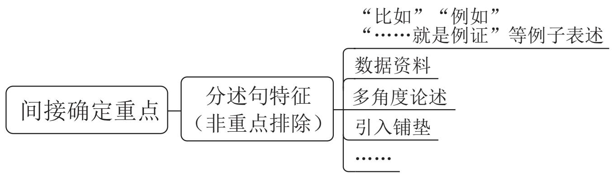

# 第二节 细节判断题

# 【提问方式】

以下对文段理解正确 / 不正确的是……

符合 / 不符合这段话意思的是……

(关于……, )上文提到了/没有提及……

这段文字可以推出 / 无法推出……

···

# 错误选项类型：

1. 无中生有  
2. 偷换概念  
3. 偷换逻辑（强加因果 / 因果倒置、并列偷换）  
4. 与文意相悖

【例1】（2025国考）同位素定年方法利用放射性同位素衰变原理来计算地表水进入封闭地下环境的时间，可以反映水在地下的补给径流排泄规律；稳定同位素有同位素分馏和季节效应，在不同体系中分布比例存在差异，因此可以用来示踪地下水的混合过程。目前，地下水循环研究中常用的同位素包括碳、氢、氧、硫等。随着技术发展，金属同位素等非传统同位素的应用，扩大了地下水定年范围。其中，镁元素是主要造岩元素，易在风化过程中以离子形式进入水体，且镁元素迁移行为简单、参与地球化学行为广，可以在地下水科学研究中发挥重要作用。

这段文字没有提及：

A. 稳定同位素用于示踪地下水混合过程的原理  
B. 镁元素在地下水研究中发挥重要作用的原因  
C. 推动非传统同位素用于地下水研究的关键技术  
D. 计算地表水进入封闭地下环境所用时间的意义

【例2】（2024国考）非洲企鹅成年后身高只有60至70厘米，不过嗓门可不小，时常发出浑厚而响亮的叫声，被戏称为“公驴企鹅”。非洲企鹅主要栖息于南非好望角附近的西蒙镇，这里属于地中海气候，全年温和舒适，同时本格拉寒流带来了南极的冰冷海水，上升补偿流还将海底营养物质带至海面，让这里形成了有利于渔业的自然环境，沙丁鱼、凤尾鱼等浅水鱼类为非洲企鹅提供了充足的营养。另外，非洲企鹅好像涂了粉红色的“眼影”，那是用来调节体温的腺体。当体温上升时，有更多血液流经眼睛上方的腺体，利用空气流动帮助身体降温，“眼影”的颜色也会更加鲜艳。

根据这段文字可知，非洲企鹅：

A. 以深水鱼类等为食物来源

B. 眼部颜色浅说明其体温较低

C. 用 “驴叫声” 来警示敌人

D. 适宜在地中海地区生存繁衍

【例3】（2025 浙江）图书作为文化产品，如非珍本、藏本，其价格发展是有一定规律的。长期以来，我国图书市场一直在薄利状态下运转，然而，最近读者却大呼“买不起”，图书市场的高定价成为人们诟病的因素，进而网络书店的低折扣满足了读者的期待。但是，网络书店的低折扣是否真给读者带来了实惠，是值得商榷的。这一场奇特的博弈，说到底，是图书市场的价格调控失灵所导致的。

下列说法与这段文字不相符的是:

A. 我国图书市场长期处于薄利状态  
B. 珍贵图书的价格发展具有一定特殊性  
C. 图书市场中出现的低折扣不一定给读者带来实惠  
D. 读者对低折扣的期待是图书市场价格调控失灵的主因

【例4】（2024四川）人类造成的污染导致了全球塑料形成类似碳循环一样的自然循环过程。其中微塑料无处不在，其污染水平继续快速上升，人类甚至已经在呼吸着微塑料，这可能会刺激肺组织，导致疾病。研究显示，空气中的微塑料并非直接来自城市的废弃塑料，而是环境中已经存在的塑料颗粒被道路交通和穿过海洋、农田的风吹起来的结果。全球范围的建模研究表明，在欧洲、南美和澳大利亚，道路交通也可能是空气中微塑料的主要驱动因素；而在非洲和亚洲，田间的风是导致空气中微塑料的主要原因。较小的微塑料可以在大气中停留一周，这导致其被风吹遍整个大陆，甚至影响到了南极洲。

根据这段文字，下列说法错误的是：

A. 塑料在全球范围的移动将导致地球 “塑料化”  
B. 大气中的塑料堆积已引发人们对健康的忧虑  
C. 通过空气传播的微塑料现在已经“遍布全球”  
D. 在空气中发现的微塑料主要与道路交通有关

# 快速解题技巧:

1. 相对绝对项

绝对表述：一定、必定、都……

相对表述：可能、也许、往往……

# 2. 对比项

标志词：A高于/优于B；利大于弊；A比B更……

# 3. 表述与实际不符项

【例5】（2024 黑龙江公安）液体表面张力是分子间作用力的一种表现，主要发生在液体和气体接触的表面。这种力使得液体表面层的水分子受到液体内部分子向里拉的力，导致液体表面有自动缩小的趋势，就像一个紧绷的橡皮膜一样。液体内部的水分子受到周围分子对它的作用力，由于内部分子处于周围分子的包围之中，周围分子对它的作用力大小相等，方向相反，因而相互抵消，合力为零，所以内部分子受力平衡。表面层的水分子，由于空气一侧气体分子稀疏，对水分子的作用力要比液体内部分子的作用力小很多，合力的结果就是表面层水分子受到液体内部分子向里拉的力，使得液体表面犹如张紧的橡皮膜，尽可能缩小表面积。因此，由于表面张力的作用，液滴总是力图保持球形。

关于表面张力，下列说法与原文相符的是：

A. 对液体内部不产生分子作用力  
B. 只发生在水滴和气体接触的表面  
C. 由于表面水分子受力较小所产生  
D. 促使树叶上的水滴往往呈球形

【例6】（2024 江西）冰冻圈主要分布在地球两极和中低纬度的高山地区，在气候系统和气候变化中扮演着重要角色。极地温度对于全球的影响力也许比我们想象中要大得多。可以说，极地温度就像一个遥控器，控制着地球上其他地方的“恒定”温度。卫星数据显示，北极的浮冰正在加速消融、减少。冰越来越少，意味着地球能够反射到太空的阳光变少了，也意味着更多深海海水被暴露出来去吸收阳光而变暖，地球会变得更暖，冰会融化得更快，而且很难恢复，如此往复，会放大全球的温度变化情况。

与这段文字的意思相符的一项是:

A. 极地和高山地区地表上存在多年冰体  
B. 极地温度决定着地球上其他地方的温度  
C. 北极冰冻圈的加速融化会导致全球变暖  
D. 极地冰冻圈的融化速度慢于中低纬度高山冰冻圈

【例7】（2023辽宁）三叶虫生活在远古的海洋中，主要出现在寒武纪，到寒武纪晚期时发展到顶点。三叶虫生活的年代距今虽然遥远，但是科学家对它的形态、构造等特征的了解是相当充分的。三叶虫身体表面披有坚固的甲壳，在个体发育过程中经历多次脱壳生长，所以相比其他留下很少化石的生物，科学家更容易在地层中找到三叶虫的化石。寒武纪海洋中比三叶虫更大更凶暴的动物并不多，因此三叶虫能够在各地迅速繁衍。三叶虫化石大多保存在质地细致的石灰岩或页岩中，因此，不仅外壳的特征能够被观察得很清楚，而且有时其内部构造也能被看得很清晰。

科学家能够充分了解三叶虫的原因不包括:

A. 三叶虫化石数量较多  
B. 三叶虫化石保存完好  
C. 三叶虫地域分布广泛  
D. 三叶虫没有竞争对手

# 细节判断题一创新考法：

提问方式：这段文字能够解释/无法解释下列哪一问题……

题干特征:

为何（为什么）

如何（怎么做）

有何、何种、从哪里来（是什么）

【例8】（2025国考）相较于地球，月球上氦-3储量极为丰富。氦-3来源于太阳内部核聚变，以高能粒子形式通过太阳风向宇宙扩散。月球没有大气层，其磁场不足地球的千分之一，使得太阳风能够直射月球表面并将氦-3注入月壤层。同时，月表温度在月夜最低可达  $-180^{\circ}\mathrm{C}$ ，极地永久阴影区甚至可达  $-250^{\circ}\mathrm{C}$ 。极低温环境有效促进了氦-3被月壤层吸附，阻止其向太空逃逸，并在月表不断富集。据估算，全月氦-3换算储量高达110万吨，可作为清洁核原料供地球使用约1万年。

这段文字能够解释下列哪一问题？

A. 月球上的氦 -3 储量是如何换算的  
B. 低温如何促进氦 -3 被月壤层吸附  
C. 为何太阳风能将氦 -3 注入月壤层  
D. 如何开采月球上丰富的氦 -3 资源

【例9】（2025国考）熔盐堆是第四代核能系统中唯一的液态燃料堆，我国研发的熔盐堆是“钍基熔盐堆”，即用钍元素作为核燃料、用熔融态的盐作为热介质进行发电。和常规铀反应堆不同，钍基熔盐堆内部循环的是液态盐。这些液态盐既可被当作核燃料的承载体，又能被当作核裂变反应的冷却剂，因此在使用时要将钍元素溶解在氟盐冷却剂里生成氟化盐，进而不断输出巨大的能量。由于钍基熔盐反应堆是用氟化盐作冷却剂，依赖的水资源较少，在缺水的干旱地区甚至沙漠地区也能建造和运行。

这段文字解释了下列哪一问题？

A. 液态盐作为反应堆核燃料承载体有何缺陷  
B. 钍元素通过何种方式溶解在氟盐冷却剂中  
C. 第四代核能系统为何仅有一种液态燃料堆  
D. 钍基熔盐反应堆为何可以在干旱地区建造

# $\circ \varnothing$  思维导图

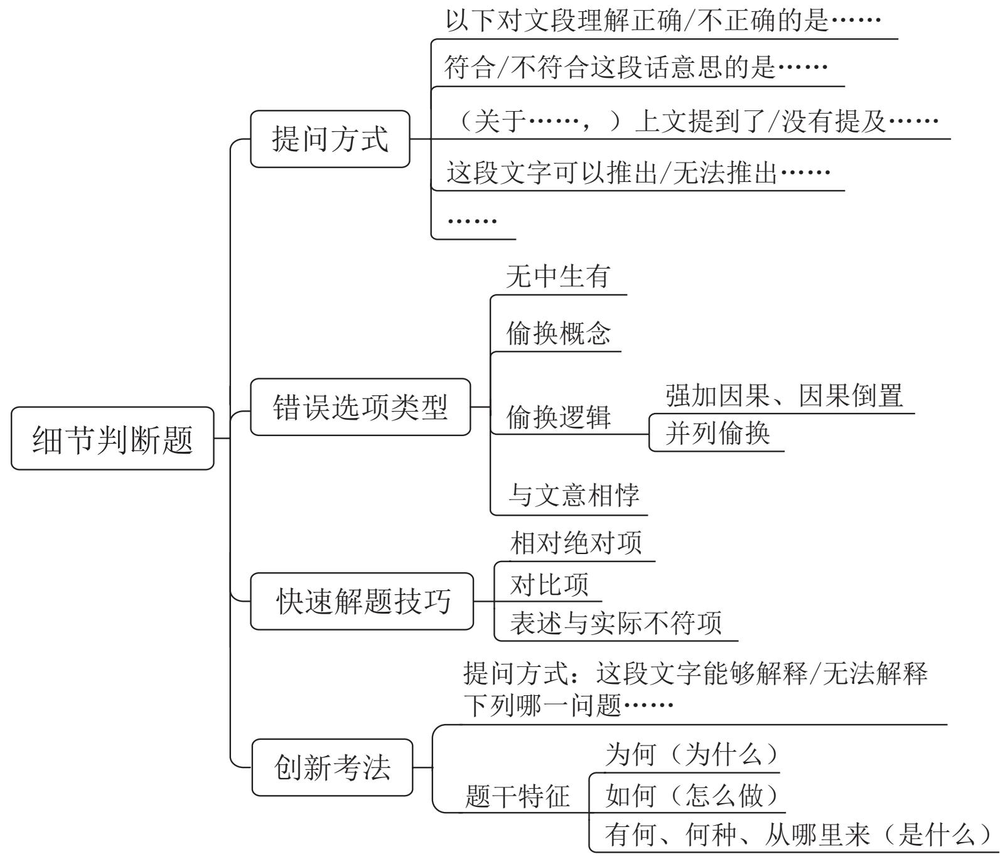

# 言语理解与表达 精讲精练5

# 学习任务：

1. 课程内容：语句表达（接语选择题、语句填空题）  
2. 对应讲义: 第  $155 \sim 164$  页  
3. 重点内容:

(1) 接语选择题的解题思维和技巧  
(2) 语句填空题的解题思维和技巧

# 第二章 | 语句表达

# 第一节 接语选择题

# 【提问方式】

作者接下来最有可能讲述的是……

# 理论要点：

1. 通读全文，重点关注文段最后谈论的核心话题  
2. 话题保持一致与连贯，对比选项确定答案

# 干扰项特征：

1. 文段中已经具体论述过的内容  
2. 与文段最后谈论的核心话题不一致、不连贯

【例1】（2024国考）获得“低损伤、高分辨、动态实时”的功能图像是医学影像技术研究的核心目标之一。医学电阻抗成像技术因无创、无损、无辐射等优势备受关注，并在对急性呼吸窘迫综合征的治疗中发挥了积极作用。由于人体不同组织和器

官的电特性不同，从中获得的电特性图像也会存在差异，这些图像包含丰富的解剖学信息，也能反映组织和器官的生理、病理状态和功能变化，对疾病诊断具有重要的临床价值。然而实现高质量的图像重建是电阻抗成像技术领域的巨大挑战，获取功能医学影像大数据在临床上也极其困难。

这段文字接下来最可能讲的是:

A. 对医学图像重建方法的探索

B. 共享功能影像大数据的意义

C. 电阻抗成像技术的实际应用

D. 图像对疾病诊疗的重要作用

【例2】（2025国考）电动垂直起降航空器是航空飞行器的一种，是低空飞行器的一种，无人驾驶，无需传统机场和跑道，像直升机一样垂直起飞，使用纯电动力。这一技术设想目的是实现城市内和都市圈城际间点对点出行，或将在未来成为空中出行的重要方式，并形成新的广阔市场。2023年中央经济工作会议指出，打造生物制造、商业航天、低空经济等若干战略性新兴产业。低空经济产业链条长、应用场景丰富，对构建现代产业体系具有重要作用，发展空间极为广阔。有白皮书预测，到2025年，低空经济对中国国民经济的综合贡献值将达3万亿至5万亿元。

这段文字接下来最可能讲的是:

A. 低空飞行器的动力模式分类  
B. 电动垂直起降航空器的推广难点  
C. 低空飞行器相对于传统交通工具的优势  
D. 政府对发展低空经济提供的支持和保障

【例3】（2023 湖北选调）就业是最大的民生。维护好新就业形态劳动者劳动保障权益，事关更充分更高质量就业，事关公平正义，事关社会的和谐稳定。全国目前有236家网约车平台企业，取得许可的网约车驾驶员超过351万人，外卖送餐员规模达到770万人……新就业形态已成为吸纳就业的重要“蓄水池”。新就业形态的劳动者通过辛勤劳动，为满足群众多样化需求作出了积极贡献，也是推动数字经济蓬勃发展的重要力量。千方百计维护好新就业形态劳动者劳动保障权益，为他们创造更好的职业环境、发展环境，解决好他们的后顾之忧，才能不断增强新就业形态劳动者的获得感、幸福感、安全感，增强职业吸引力。

根据上述文字推测，接下来作者最有可能讨论的是：

A. 新就业形态的兴起使得劳动者劳动权益保障问题凸显  
B. 维护新就业形态劳动者劳动保障权益是一个系统工程  
C. 保障新就业形态劳动者权益才能使平台经济行稳致远

D. 新就业形态的发展受制于思想认识和监管政策的滞后

【例4】（2023深圳）任何系统要想得以发展，都离不开正确的决策。影响决策的因素有很多，其中最重要的就是决策赖以做出的信息。无论对国家治理，还是对组织管理，信息质量往往决定决策质量的高低。问题是，如何才能获得正确决策所需的信息？最容易令人想到的是影响信息获取的外部原因，比如科技发展水平、事物的复杂性、突发事件的随机性等。而实际上，影响有效信息获取的，除了技术原因，还有内部的组织原因。

这段文字接下来最有可能谈论的内容是:

A. 技术原因和组织原因的区别

B. 组织原因的内涵和对决策的影响

C. 获取正确决策所需信息的途径

D. 作出正确决策所必需的内部条件

【例5】（2025国考）在青藏高原高寒草甸的多年冻土区，地下水或土壤水分迁移冻结导致地下冰聚集，使地表隆起形成的丘状地带便是冻胀丘。冻胀丘中土壤结构和植物根系的破坏，改变了地表径流，导致部分缓坡和低地积水严重，继而引起草地破碎化和地表裸露区增加等草地荒漠化问题。随着冻土内冰的消融和水分流出，地下有时会形成较大的空洞区，地表发生沉降和塌陷，往往会造成地区植被和土壤的显著退化。冻土区随着表层冻土的解冻融化，坡体中的饱水松散土层和风化层间的摩擦力减小，在重力作用下，沿斜坡缓慢流动或蠕动形成融冻泥流，这也会使植被和土壤遭到强烈破坏。

这段文字接下来最可能介绍青藏高原：

A. 冻胀丘对高原生态系统的危害

B. 地表植被的恶劣生存状况

C. 多年冻土区的形成原因

D. 冻土所致荒漠化的防治措施

【例6】（2024深圳）以往探讨快递过度包装的时候，不少人习惯归咎于卖家，认为他们是过度包装的罪魁祸首，实际上并不完全如此。对于卖家来说，层层叠叠、最终沦为垃圾的包装材料，都是他们用真金白银买回来的，过度包装不仅无法带来实质性收益，还会增添额外的成本。表面上看，快递过度包装是一个环保观念的问题，更深一层探究，其中折射出的是快递行业的内部管理问题：“野蛮快递”屡见不鲜，由于对快递运输环节不放心，商家希望以过度包装来取信消费者，消费者希望通过过度包装带来安慰，双方一拍即合，快递包装也因此越来越厚重。

这段文字接下来最可能续写的内容是:

A. 缓解快递过度包装的关键在于快递企业

B. 对于过度包装，有必要从执法层面予以规范

C. 过度包装导致的资源浪费和环境污染日趋严重  
D. 追求浮夸的消费理念助长了商家过度包装的行为

【例7】（2024国考）隋唐盛世的形成主要得益于制度创新。东晋南朝以来，世家大族把持朝政，皇权极不稳定。隋文帝取代北周后，为防止关陇集团等势力过分强大，威胁大一统的中央集权，废除了察举制这一士族赖以维系的选举工具，打破了以门第和军功为主的选拔标准，通过考核治理国家的专门知识，选拔人才参与新政权的管理，实现了贵族官僚政治向文官政治的转变，为成就隋唐盛世打下了坚实基础，奠定了后世王朝选官的基本格局，在中国选举制史上具有重大意义。

这是一篇文章的引言，文章标题应该是：

A. 科举制度在唐代政治中的利与弊

B. 贵族官僚政治瓦解的制度原因探析

C. 中国古代选官制度的变迁及启示

D. 科举制度创建对选官制度变革的影响

【例8】（2024四川）作为新型生产要素，数据已成为数字化、网络化、智能化的基础性资源，并快速融入生产、分配、流通、消费和社会服务管理等各环节。通过数据，可以更好地理解自然和社会的运行规律，推动生产力发展，优化生产关系，促进国家和社会治理。但数据并非自在之物，而是人类协作与互动的结果。数据不仅承载着个人、市场主体与国家的大量信息，关系到公民个体人格权益、市场主体财产权益以及国家安全和社会公共利益，还呈现出不同于传统知识产权的全新特点。如何既鼓励数据的充分流通利用，又通过制度设计进行科学合理的权益配置和风险防控，就成为信息时代制度创新的重大课题。

关于数据，接下来最不可能谈的是：

A. 与传统生产要素的区别

B. 流通中涉及的权益主体

C. 流通中风险产生的原因

D. 对相关制度创新的要求

# ° 念 思维导图

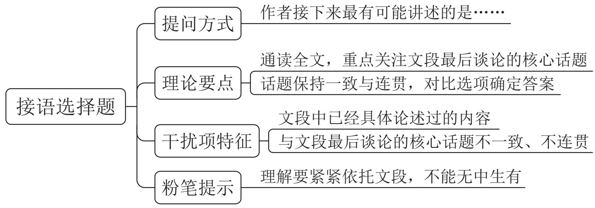

# 第二节 语句填空题

# 【提问方式】

填入画横线部分最恰当的一句/项是……

# 理论要点：

注重衔接得当:

(1) 横线为分句, 优先注重句内衔接  
(2) 横线为完整语句, 注重句子之间的关联

# 横线在结尾：

1. 总结前文  
2. 提出对策

【例 1】(2024 江苏)博物馆研学, 要 “研之有物” “学而广博”。博物馆研学不是 “打卡” 拍照的旅游, 也不仅是提供托管服务, 而是要让年轻一代明白, 生而为中国人, 最根本的是有中国人独特的精神世界, 有百姓日用而不觉的价值观。近年来,中华文明探源工程等重大工程的研究成果, 进一步证实了我国悠久的人类史和璀璨的文化史, 其中也包含着中华优秀传统文化、革命文化和社会主义先进文化。这些都被缩影于文物当中。因此, 博物馆研学, 就是要

填入画横线部分最恰当的一项是:

A. 从文物中学习这些文化

B. 深入了解中华文明的独特性

C. 不断提高自身文化素养

D. 有的放矢地学习历史和文化

【例2】（2025国考）与传统业态相比，新业态顺应多元化、多样化、个性化的产品或服务需求，实现产业与互联网、大数据、云计算、人工智能等新技术深度融合，通过采用新技术和新模式，为市场引入新元素、丰富新场景，促进新岗位、新就业形态不断涌现，创造更多就业机会。新业态既提供新的高技能岗位，扩大对高水平劳动力的需求，又通过带动传统产业转型升级，实现对传统职业和岗位的再造，释放新的

就业需求。当前，我国有超2亿灵活就业人员，新就业形态

填入画横线部分最恰当的一项是:

A. 已经成为吸纳就业的重要 “蓄水池”  
B. 有助于促进区域间劳动资源的互补与共享  
C. 为高技能劳动力流动提供充足机会  
D. 是有效缓解重点群体就业压力的 “缓冲器”

【例 3】(2024 山东)社火原本是属于农民的自演自娱活动, 来源于古人对土地和火的崇拜。社, 即土地神; 火, 即火祖, 也即火神。农业中国, 是土地给了人们立足之本。《礼记·祭法》载: “共工氏之霸九州也, 其子曰后土, 能平九州, 故祀以为社。”火可以熟食、取暖, 是人类创立文明的显著标志。崇拜土地与火 , 这逐渐演化成了规模盛大、内容繁复的传统民间娱乐活动。

填入画横线部分最恰当的一项是:

A. 表达了古人对社与火的朴素情感

B. 奠定了农业文明发展的民俗基础

C. 产生了祭祀社与火的风俗

D. 体现了古人土地为本的理念

【例 4】（2024 贵州）在确定是否认识一个人时，我们的大脑会做出三个反应。首先，我们会确认这个人的面部特征，例如他是双眼皮还是单眼皮，高鼻梁还是薄嘴唇；之后，大脑根据这些特征进行人脸识别，判定我们是否认得这张脸；最后再回忆他的名字。简而言之，我们在看到一张脸后，大脑只需简单地识别是否见过；而人的名字藏在记忆的某个角落，我们需要通过检索、回忆等过程，才能最终确定答案，比识别更加复杂。所以

填入画横线部分最合适的一项是:

A. 大脑确定是否认识一个人的过程非常地复杂  
B. 记住一个人的名字比记住他的长相要难得多  
C. 大脑根据一个人的面部特征来回忆他的名字  
D. 记忆名字需要与对词语、句子的记忆相联系

【例 5】(2024 江西) 经济活动的可持续性和相关金融资产的价值依赖于生物多样性和环境提供的生态系统服务。与气候变化类似, 生物多样性丧失也是本世纪面临的最大危机之一。导致环境恶化和气候变化的罪魁祸首是大量不考虑环境影响、破坏生物多样性、只顾赚钱的投资活动。因此,

填入画横线部分最恰当的一句是:

A. 在保护生物多样性方面金融业有着不可推卸的责任  
B. 人类将面临气候变化和生物多样性丧失的巨大危机  
C. 应逐步建立对金融机构管理的监管框架和稳定机制  
D. 导致环境恶化的根本原因是大量经济活动的可持续性

# 横线在开头:

1. 概括后文  
2. 话题引入

【例1】（2023广东）农村生态文明建设，__________。一是必须加速由高耗能、高污染的粗放型农业生产方式向清洁循环的集约型农业发展方式转变，加强农业科技研发与推广应用，建立全产业链绿色化农业发展模式。二是促进农业资源循环利用，积极推进农业清洁生产，提高禽畜养殖废弃物资源化利用。

以下句子填入横线处，最恰当的是：

A. 必须与美丽乡村建设紧密结合  
B. 必须大力推进绿色循环农业发展  
C. 必须充分利用科技研发促进农业生产  
D. 必须树立 “绿水青山就是金山银山” 的价值导向

【例2】（2024 黑龙江公安）在现阶段的中国，__________：从技术上，人形机器人的发展高度依赖于机器人、人工智能等技术，而我国在这些领域的积累都十分深厚。我国是世界第一的工业机器人应用大国，工业机器人的装机量超过全球的  $50\%$  ，在机器人的研发、制造和应用上已经有了大量的技术和经验储备。而在人工智能领域，我国的技术实力居于世界领先水平。这些技术条件足以为我国的人形机器人发展提供有力的支持。在供给上，我国制造业的产业门类齐全、产业体系完整，这使得中国在人形机器人的制造上具有强大的潜力。而在需求上，我国大规模、多层次、多需求的市场为人形机器人的应用提供了广阔的部署环境和测试空间，并有望催生巨大的市场需求。所有的这些因素都将有助于人形机器人产业在我国的高速发展。

填入横线处最恰当的一项是:

A. 人形机器人产业有望迎来高速发展  
B. 发展人形机器人产业具有很多的先天优势

C. 支持人形机器人发展需完善相关产业链和供应链的建设  
D. 人形机器人迅速发展对经济和社会发展起到积极作用

【例3】（2024四川）信息化深入发展，使社会交往范围扩大，________。传统的社会交往主要局限于相对狭小的熟人范围，人们之所以遵守伦理道德很大程度上是因为相对狭小的熟人圈子中无所不在的外在监督。现代社会交往基于强大信息技术的互联网，进一步打破传统交往的时空限制，成为了普遍性的社会交往。这就要求人们具备更高程度的道德自律、更高程度的宽容与尊重，从而促进形成以普遍的诚实、守信为价值基础的现代社会公德。

填入画横线部分最恰当的一项是:

A. 与传统社会交往相对单一的熟人社会有较大区别  
B. 只有守信的人才能在社会交往中赢得他人的尊重  
C. 这对社会交往中的人提出了更高的伦理道德要求  
D. 形成了以普遍的诚实守信为价值基础的社会公德

【例4】（2024广东）“__________”。各地各部门要牢固树立人才是第一资源的发展理念，把教师队伍建设作为基础工作，健全中国特色教师教育体系，提升教师教书育人能力，提高教师政治地位、社会地位、职业地位，不断优化教师管理和资源配置，营造全社会尊师重教的浓厚氛围，让教师成为全社会最受尊重和令人羡慕的职业之一。

以下句子填入画横线处，最恰当的是：

A. 经师易求，人师难得

B. 国将兴，必贵师而重傅

C. 桃李不言, 下自成蹊

D. 师也者, 教之以事而喻诸德者也

# 横线在中间：承上启下

【例1】（2025国考）相对于狭义的农业即种植业而言，大农业是指广义的农业，不仅包括种植业、林草业、畜牧业和渔业，还包括产前的技术研发、品种繁育与推广、水利建设、农机生产与销售、农资储备与供应等，产后的烘干、储藏、运输、加工、营销与进出口贸易等，由此形成一个与农业发展有关、为农业发展服务的庞大产业体系。可以说，__________。发展现代化大农业就是要构建一个现代化的大农业产业体系，这也是当前我国构建现代乡村产业体系的核心所在。

填入画横线部分最恰当的一项是:

A. 大农业是对农业及其紧密联系的相关产业的高度概括  
B. 农村产业融合化发展是当今乡村产业发展的必然趋势  
C. 大农业是在当前技术条件下实现的对小农经济的超越  
D. 发展现代化大农业应该因地制宜推进农业规模化经营

【例2】（2024山东）近年来，从新能源汽车下乡到绿色智能家电下乡，一系列高品质工业品从“稀罕物”变成“必需品”，有效提升了农民生活水平。多年经验告诉我们：工业品下乡绝不意味着“积压品下乡”，更不能拿质次价廉的商品糊弄消费者，________。比如，有的家电企业看到，一些地区的农民喜欢把洗衣机放在露天小院使用，于是重新设计洗衣机产品外壳，解决了下雨导致的生锈问题；有的企业专门推出能在较大电压波动范围内正常启动的冰箱，适应了部分农村地区的环境和条件。惠民生、增福祉是工业品下乡的政策初衷。牢牢把握这个基点，才能让“下乡”的动能更足、活力更强，真正提振消费、拉动内需。

填入画横线部分最恰当的一项是:

A. 要深入调研农村消费群体，了解其实际需求  
B. 高品质满足农村地区消费者实际需求才是硬道理  
C. 要统筹兼顾，破解难题，切实激发家电企业的积极性  
D. 充分发挥乡村消费市场的重要作用，用好工业品下乡政策

【例3】（2024 贵州）众多民间手艺、戏曲等非物质文化遗产的遗失，与文化传承人缺乏丰厚的收入有关。即便以外部力量进行保护性抢救，往往也只是将其“标本化”，难以恢复其原生活力。__________。比如，《中国通史》等纪录片在视频平台上收费观看，使传统文化释放出可观的商业价值，纪录片创作方、版权方、播出方实现商业共赢；有花丝镶嵌技艺非遗传承人入驻电商平台，一年多来售出超20万件工艺产品。

填入画横线部分最恰当的一项是:

A. 文化产业在新的发展能量集聚下将释放出更多精彩  
B. 正是对传统文化的创新演绎成就了文化产业的发展  
C. 只有新媒体技术的加持，才能推动传统文化的传播  
D. 只有文化消费市场活跃，传统文化创作才能有动力

【例 4】(2024 江苏)菟丝草只能攀附寄生在其他植物上。他们的生长永远成不

了规模，也不能长久，一般是第一年生机勃勃，第二、第三年就会枯萎而死。原因何在？主要是它们将寄生植物体上的营养成分吸走了太多，导致被寄生的植物生命力和抵抗力迅速下降，进而抵御不了虫害和自然灾害的攻击，最后枯死。________？所寄生的植物死了，菟丝草也就活不长了，枯死也就在所难免。

填入画横线部分最恰当的一项是:

A. 皮之不存，毛将焉附  
B. 覆巢之下，安有完卵  
C. 茂树之下, 岂有丰草  
D. 城门失火，殃及池鱼

# ° 念 思维导图

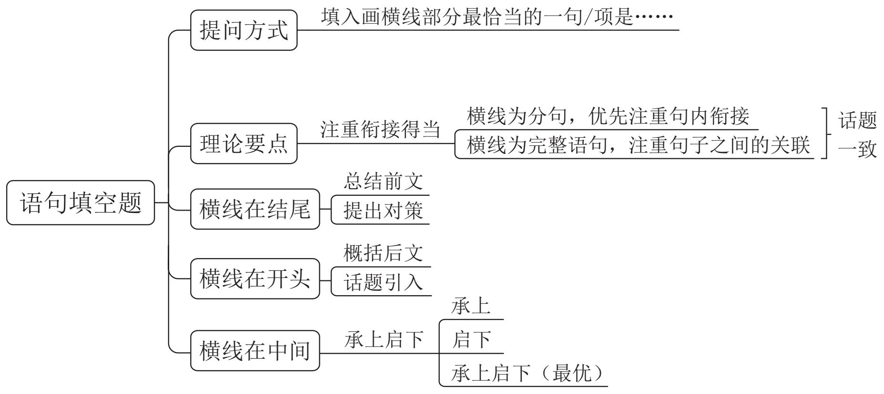

# 言语理解与表达 精讲精练 6

# 学习任务：

1. 课程内容：语句表达（语句排序题）  
2. 对应讲义: 第  $165 \sim 173$  页  
3. 重点内容:

(1) 语句排序题的解题思维  
(2) 确定首尾句、捆绑、顺序的方法与应用

# 第三节 语句排序题

# 【提问方式】

将以上 / 以下几个句子重新排列, 语序正确的是……

# 理论要点：

1. 根据选项提示，对比后确定首尾句  
2. 确定捆绑 / 确定顺序  
3. 验证（只验证你基本锁定的答案，而非全部选项）

# 一、确定首尾句

# (一) 首句特征一下定义 (……就是 / 是指)

【例 1】(2024 贵州)①而一些飞鸟会凭借着敏锐的感知能力发现这一变化

(2)为了逃生，这些动物就会表现出异常的举动  
③地震发生之前发出的次声波，能够被许多动物提前感知到  
④地震出现之前，地球的磁场也会发生变化  
(5)地震的出现, 是板块随着时间的推移, 进行不断的挤压和碰撞下形成的自然现象  
(6)所以在地震来临之前, 鸟类就会因为磁场的变化, 而率先感知到了危险, 并做

出异于平常的行为

将以上 6 个句子重新排列, 语序正确的一项是:

A. ⑤③②④①⑥

B. ⑤④①⑥③②

C. ③②④①⑥⑤

D. ③⑤⑥①④②

# (二) 非首句特征 (指代不清的指代词、关联词的后半部分、举例子)

【例 2】(2024 四川)①最近一项研究发现，在相似的容貌背后，这些人也共享着相似的基因特征

②多年以来，加拿大艺术家布吕内勒致力于寻找世界各地长相酷似的人，并为他们拍摄照片  
③世间存在一些毫不相关却长得很像的人，他们没有血缘关系，看起来却像失散多年的双胞胎  
④研究者通过艺术家联系到其中 32 对容貌酷似的受试者, 利用面部识别算法对其相似度进行量化, 并对唾液样本进行基因分析  
(5)这有助于理解基因如何造就人的容貌, 或许也能让从 DNA 重建面部特征的技术变得更加准确  
⑥结果显示，容貌相似度最高的受试者基因中的共同点也最多，其中最相似的9对受试者共享了19277处单核苷酸多态性特征，涉及3730个基因

将以上 6 个句子重新排列, 语序正确的是:

A. ①⑥②④⑤③

B. ②③①⑥⑤④

C. ③①②④⑥⑤

D. ④⑥①⑤③②

【例3】（2024 山东）①德国生物化学家康拉德·布洛赫在 1994 年首次预测了这类分子的存在

②但他的结论是，这些介于中间的原始分子永远不会被发现，因为它们无法在地质记录中存活下来  
③某权威杂志公开的一项研究报道了在古岩石中发现的一类新类固醇，并确认了复杂真核生物久远的史前史  
④新研究表明事实并非如此，原生类固醇的痕迹能在岩石中保留超过10亿年  
⑤他提出，在从羊毛固醇到胆固醇的漫长生物合成途径中，每个短暂存在的中间体在几亿年前都曾是完全适应的最终产物，而且这些产物的每一个都是在其前体基础上的演化进步

(6)这片“失落的世界”的发现，也证实了诺贝尔奖得主康拉德·布洛赫关于存在原生类固醇分子的预测

将以上 6 个句子重新排列, 语序正确的一项是:

A. ③⑥①⑤②④

B. ⑥⑤④③①②

C. ③①⑤④⑥②

D. ④③⑥①②⑤

【例4】（2024国考）①据有关机构估算，每年损失浪费的食物超过  $22.7\%$  ，约9200亿斤，若能挽回一半的损失，就够1.9亿人吃一年

②食物节约减损既可有效减轻供给压力，也可减少资源使用，善莫大焉  
(3)我国居民食用油和“红肉”人均消费量，分别超过膳食指南推荐标准约1倍和2倍  
④当前，食物采收、储运、加工、销售、消费每个环节都有“跑冒滴漏”，情况还相当严重  
⑤要树立节约减损就是增产的理念，推进全链条节约减损，健全常态化、长效化工作机制，每个环节都要有具体抓手，越是损失浪费严重的环节越要抓得实  
⑥消费环节大有文章可做，不仅要制止“舌尖上的浪费”，深入开展“光盘行动”，还要提倡健康饮食

将以上 6 个句子重新排列, 语序正确的一项是:

A. ①⑥③②④⑤

B. ①③④⑤②⑥

C. ④①⑥③②⑤

D. ④②⑤③①⑥

# (三) 尾句特征 (总结性尾句、对策类尾句)

【例 5】(2024 国考)①当前, 我国荒漠化、沙化土地治理呈现出 “整体好转、改善加速” 的良好态势, 但沙化土地面积大、分布广、程度重、治理难的基本面尚未根本改变

②现实表明, 我国荒漠化防治和防沙治沙工作形势依然严峻  
③我国是世界上荒漠化最严重的国家之一，荒漠化土地主要分布在三北地区，而且荒漠化地区与经济欠发达区、少数民族聚居区等高度耦合  
④荒漠化、风沙危害和水土流失导致的生态灾害，制约着三北地区经济社会发展，对中华民族的生存、发展构成挑战  
⑤我们要充分认识防沙治沙工作的长期性、艰巨性、反复性和不确定性，进一步提高站位，增强使命感和紧迫感

(6)这两年, 受气候变化异常影响, 我国北方沙尘天气次数有所增加

将以上 6 个句子重新排列, 语序正确的一项是:

A. ①③⑥⑤②④

B. ②⑤⑥①④③

C. ④①③②⑥⑤

D. ③④①⑥②⑤

【例6】（2024山东）①所以，未来乡村旅游精品线路的升级，一方面需要加强对乡村地区的文化资源整合和挖掘，将其有机融入乡村旅游产品和活动中，打造具有浓厚文化氛围的旅游体验

②文旅融合下的乡村旅游对于传承中华文明具有重要意义，在增进文化交流与理解的同时，也使人们更能意识到中华文明的独特性和卓越贡献，增强对中华文明的自豪感和认同感  
③此外，乡村旅游在发展过程中存在一定的同质化现象，没有深入挖掘自身的差异化优势，形成品牌效应  
④通过对文化属性的强调，乡村旅游可以更好地传承和展示中华文明的丰富内涵，吸引更多游客参与和体验，同时促进乡村的经济发展和文化传承  
⑤不过，从整体来看，目前乡村旅游发展并不均衡，一、二线城市近郊发展比较好，但仍有相当多乡村的文化资源禀赋和场景价值还没有得到充分释放  
⑥另一方面，还要有意识地借助文化品牌来凸显文化属性，打造独特的乡村旅游品牌形象，提高其在市场上的知名度和吸引力

将以上 6 个句子重新排列, 语序正确的一项是:

A. ②①⑥④⑤③

B. ②⑤③①⑥④

C. ④⑤③②①⑥

D. ④②⑤③①⑥

# 二、确定捆绑

# (一) 指代词捆绑

【例 1】(2025 天津)①在药物研究中, 要根据病理过程发生的机制, 找到在临床上对疾病有治疗作用, 且不会对生命其他活动产生副作用或者副作用可控的药物

②现代生物学和医学的发展使人们在生命科学的基础研究领域，发现了很多关系到正常生理和病理过程的蛋白、酶和信号通路  
(3)例如, 某一蛋白或酶能够影响重要的生命活动, 如果有疾病是这一生命活动的异常导致, 那么理论上, 我们调控这一蛋白或酶就可以治疗这种疾病

(4)之所以称它们为“潜在靶点”，是因为这些靶点的作用只在基础研究的试验中得到了证明，但在疾病模型，特别是在临床治疗中并没有获得证明  
(5)这样的药物针对的靶点才是真正药物靶点  
(6)我们称这样的靶点为药物的“潜在靶点”，药物化学家就是要通过确证这些靶点来筛选药物

将以上 6 个句子重新排列, 语序正确的一项是:

A. ①④⑤⑥②③

B. ①②③⑤⑥④

C. ②③⑥④①⑤

D. ②①③④⑤⑥

【例2】（2024广西）①它们不仅记录了长江历年的水文资料，而且具有很高的文学艺术价值  
(2)为配合三峡水库的建设，我国水下考古工作者已分别对白鹤梁、龙脊石进行了水下调查  
(3)因长江水位变迁，“丰年碑”已完全没于水下不得见  
(4)位于重庆朝天门码头的“丰年碑”、涪陵白鹤梁历代题刻、云阳龙脊石题刻被称为长江中游的三大石刻碑群  
⑤白鹤梁题刻保存完好，被誉为世界“第一古代水文站”和世界罕见的“水下碑林”，是长江三峡水库淹没区内最早被定为“全国重点文物保护单位”的遗址  
(6)在水下考古调查研究基础上设计建造的白鹤梁水下博物馆, 独具中国特色, 成为联合国教科文组织面向全球推广的经典案例

将以上 6 句重新排列, 语序正确的一项是:

A. ④③⑤②⑥①

B. ④①③②⑤⑥

C. ⑤③②⑥④①

D. ⑤④③①②⑥

# (二) 关联词捆绑

【例3】（2024 江西）①已经投入应用的主要是针对健康人群开发的、精准性稍差一些的非植入式设备

②到目前为止，科学家们已经发明了多种获取脑电波的设备  
③近些年来, 科学家们则在开发用于特殊病人的植入式设备上花费了大量精力  
④但基于安全性、伦理性等方面的考虑，一直没有在人类的临床上取得突破  
(5)这类设备被称为脑机芯片或干脆简称为脑机接口, 它能获得更加精准的脑电信息, 也能将外界电信号更加精准地输入大脑

⑥然而随着人工智能相关技术和工程技术、材料技术的飞速发展，不少科学家又开始了这类尝试

将以上 6 个句子重新排列, 语序正确的一项是:

A. ③②①⑥⑤④  
B. ③⑥④①②⑤  
C. ②①③⑤④⑥  
D. ②④①③⑤⑥

【例 4】(2023 山东)①流亡到江南的侨姓士族, 也不可避免面临私家藏书的散失

(2)永嘉之乱导致的文献典籍流失非常严重  
(3)西晋荀勖《中经新簿》著录秘阁藏书有 29945 卷, 东晋之初 “渐更鸠聚”, 仅存 3014 卷, 这是朝廷藏书流失的情况  
④如藏书丰富的张疑、傅颖根两家，永嘉之乱中“避难南行”，最初携带不少书籍，由于逃难不便，只好“料简世所稀有者，各各保录”。这种情况在当时南渡士族中是很普遍的  
(5)因此, 东晋初期实际的文献状况, 不像朝廷藏书的亡散那么严重。  
(6)至于江南旧族的藏书, 受到战乱影响相对较小, 如钱塘范氏 “家世好学, 有书七千余卷, 远近来读者恒有百余人”

将以上 6 个句子重新排列, 语序正确的一项是:

A. ②④①③⑥⑤

B. ②③①④⑥⑤

C. ③②①④⑥⑤

D. ①④②③⑥⑤

# 三、确定顺序

# (一) 行文逻辑

【例1】（2024辽宁）①关于贺、杨二先生尤其贺先生，学界知之较多

(2) “黑学” 能传入并扎根中国, 实赖三位川人: 张颐 (1887-1969, 四川叙永人)、贺麟 (1902-1992, 四川金堂人) 和杨一之 (1912-1989, 重庆潼南人)

(3)此处的“黑学”，是指黑格尔哲学

④贺先生以翻译《小逻辑》著称，杨先生则以翻译《逻辑学》著称

(5)历史上, 宋人云 “易学在蜀”; 现当代, 则可曰, “黑学赖川”

⑥照直说，若无“三先生”早期的研究、译介与推广，中国的“黑学”研究恐怕要另当别论了

将以上 6 个句子重新排列, 语序正确的一项是:

A. ①④②③⑥⑤

B. ②⑥①④⑤③

C. ④②⑤⑥③①

D. ⑤③②⑥①④

【例2】（2024 江西）①设施农业大有可为，要发展日光温室、植物工厂和集约化畜禽养殖，推进陆基和深远海养殖渔场建设，拓宽农业生产空间领域

②要构建多元化食物供给体系，在保护好生态环境前提下，从耕地资源向整个国土资源拓展，从传统农作物和畜禽资源向更丰富的生物资源拓展  
(3) “吃饭” 不仅仅是消费粮食, 肉蛋奶、果菜鱼、菌菇笋等样样都是美食  
④向森林、草原、江河湖海要食物，向植物动物微生物要热量、要蛋白，多途径开发食物来源  
⑤耕地以外，我国还有40多亿亩林地、近40亿亩草地和大量的江河湖海等资源  
(6)解决吃饭问题, 不能光盯着有限的耕地, 要把思路打开, 树立大食物观

将以上 6 个句子重新排列, 语序正确的一项是:

A. ①⑥⑤③②④

B. ⑥①②④③⑤

C. ⑥③⑤②④①

D. ①⑥②④③⑤

【例3】（2024 浙江）①摊贩有生存需求，且能便利百姓生活，但城市运行需要合理的秩序，经营占道、噪声扰民、环境污染等问题也亟待破解

②事实上，许多城市对街头摊贩的管理，都经历了从绝对禁止到逐步开放、分类管理的过程  
(3)如何求取最大公约数  
(4)结合城市发展和百姓需求实际, 引导小商小贩依法依规经营, 是城市治理精细化的题中应有之义  
⑤实践告诉我们，倾听百姓心声，做到统筹兼顾很关键  
(6)摊贩是城市商业的组成部分，对摊贩的服务与监管，是一道需要同时破解“几难”的必答题

将以上 6 个句子重新排列, 语序正确的一项是:

A. ⑤④③①⑥②

B. ⑤③④⑥①②

C. ⑥⑤③④②①

D. ⑥①③⑤②④

# (二) 日常逻辑

【例 4】(2024 辽宁)① 1979 年, 波斯波利斯被列入联合国教科文组织世界文化遗产名录

②波斯波利斯始建于公元前约518年，主要建筑包括万国门、觐见厅、百柱宫、阿帕达纳宫、薛西斯宫殿、书房、金库等，整个宫殿建筑群历经3个朝代才得以完成  
(3)去伊朗一定要看看波斯波利斯古城遗址  
④联合国教科文组织评价说，波斯波利斯古城遗址提供了许多关于古代波斯文明的珍贵资料，具有重要考古价值  
(5)这座显赫一时、规模宏大的王城后来在马其顿王亚历山大东征时被烧毁  
⑥虽遭焚毁，又历经千年风雨侵蚀，但如今依然高柱林立、巨石横卧

将以上 6 个句子重新排列, 语序正确的一项是:

A. ②③⑤①④⑥

B. ③②⑤⑥①④

C. ③①②④⑤⑥

D. ②①④⑤⑥③

【例 5】(2024 国考)①与以往依靠自身装甲抵御弹药不同, 战车主动防护系统实施贴身或近距离防御且强调先敌主动出击、御 “敌拳” 于车体之外

②从第二次世界大战至今，装甲车辆尤其是坦克的性能和数量一直是影响陆战胜负的重要因素  
(3)如果面对的是轻型反坦克武器的近距离突袭，主动防护系统甚至能使装甲车辆的生存概率提高  $3 \sim 4$  倍  
④随着反坦克武器弹药的发展，装甲车辆仅靠自身装甲抗衡来袭弹药的时代已渐渐远去  
(5)有关测试资料显示, 加装主动防护系统后, 装甲车辆的生存概率可以提高 1 倍以上  
(6)主动防护系统是通过雷达和光电等探测装置, 感知并获取来袭弹药的运动轨迹和特征, 然后由计算机控制对抗装置, 有针对性地进行自卫

将以上 6 个句子重新排列, 语序正确的一项是:

A. ②④①⑥⑤③

B. ②④⑥①③⑤

C. ④⑥①②⑤③

D. ④①②③⑥⑤

# $\circ \varnothing$  思维导图

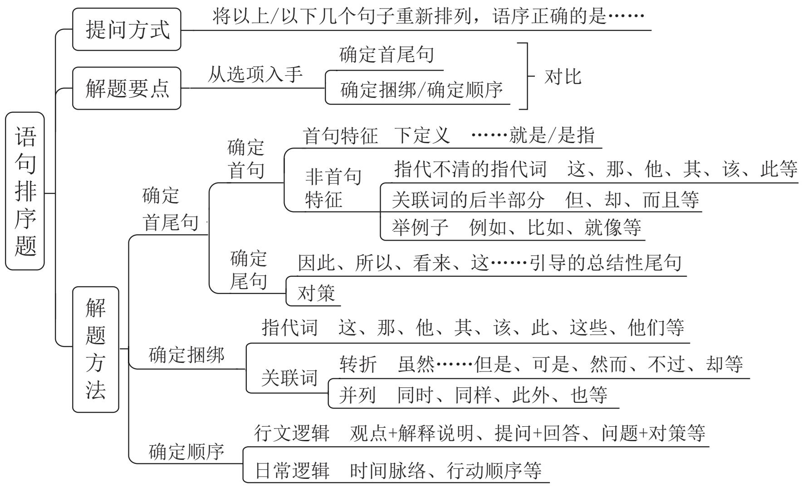

# 言语理解与表达 精讲精练 7

# 学习任务：

1. 课程内容：逻辑填空（词的辨析）  
2. 对应讲义: 第  $174 \sim 182$  页  
3. 重点内容:

词语辨析的方法与应用

# 第三章 | 逻辑填空

# 第一节 词的辨析

# 一、词义侧重

辨析方法:

用不一样的字组词

【例1】（2024 江西）腾冲地震台主要采取的是监测火山地震、地表变形、火山气体这三类手段。这也是世界范围内在火山监测中应用最多的传统“地基”监测手段。不过，如果仅依赖“地基”手段，由于监测点位 ______ 、范围小、成本高、效率低等问题，无法实现整个火山区的大范围场式监测，难以为火山活动 ______ 及危险性评估提供全面、准确的信息保障。

依次填入画横线部分最恰当的一项是:

A. 稀少 形态

C. 稀奇 状况

B. 稀疏 状态

D. 稀零 形状

【例 2】（2022 山西）文化自信是更基础、更广泛、更深厚的自信，是一个国家、一个民族发展中最基本、最深沉、最持久的力量。人类社会与文明的每一次________，无不伴随着文化的历史性进步。纵览历史长河，无论是传统还是现代社会治理结构和治理体系中，文化发展无不________、推动着社会的发展和完善。

依次填入画横线部分最恰当的一项是:

A. 跨越 滋补

B. 跃进 滋养

C. 变迁 滋润

D. 突破 滋生

【例3】（2024 深圳）将下列选项中的词语依次填入句子横线处，最恰当的一项是：

“与君远相知，不道云海深”，从王昌龄的笔端缓缓流出，带着明显的盛唐气象和气概，承载着厚重隽永的博爱，承载着古往今来人们对和平美好的期望，流播在 的时空里。

A. 豪放 开阔

B.豪爽 广阔

C. 豪迈 广袤

D. 豪情 宽广

# 二、搭配对象

# 理论要点：

1. 瞻前顾后（动词 + 名词、形容词 + 名词……）  
2. 热词搭配

【例1】（2025天津）长期以来，我国区域间、城乡间的金融资源 ________ 存在异质性差异，金融资源的不平衡分布会加速经济发展的“马太效应”。数字金融能够 ________ 区域间、群体间的“数字鸿沟”，促进资金的公平分配和经济的包容性增长。

依次填入画横线部分最恰当的一项是:

A. 规划 填平

B. 共享 跨越

C. 储备 淡化

D. 配置 弥合

【例2】（2024重庆）据介绍，光学产品的装配和调试，直接影响成像效果。高精密复杂光学系统对性能有严苛的要求，不仅要实现狭小空间内超精密光学镜片的精密装调，还需____光学系统的稳定性。高精密复杂光学系统的装配和调试，往往

靠经验丰富的匠人 精密仪器完成，存在装调难度大、周期长、制造加工一致性差等问题。

依次填入画横线部分最恰当的一项是:

A. 维持 制作

B. 确保 配合

C. 保持 组合

D. 确认 搭配

【例3】（2025四川）一切器具都需要经历一个从原材料到终端器件的加工过程，期间材料会根据需要在不同物态间________。传统上，这些过程可能需要高温条件，并且依赖于________的物理化学反应，操作起来十分繁琐。这样就引申出一个极为重要的技术概念——常温制造。

依次填入画横线部分最恰当的一项是:

A. 转换 纷繁复杂

B. 切换 不计其数

C. 变化 眼花缭乱

D. 转变 难以捉摸

【例 4】(2025 四川)通常在含水率高、粒度细、黏度大的地层上留下的恐龙足迹要深, 反之则浅; 但又不能太湿、太细或太黏。太湿、太细可能保存不住, 马上会被踩塌的物质 ; 太黏则会使留下的足迹变形而难以 。但也不能太干, 太干则根本留不下足迹。总而言之, 恐龙足迹的保存条件比较 , 需要不多不少刚刚好。

依次填入画横线部分最恰当的一项是:

A. 遮盖

甄别 严格

B. 淹没

保留

苛刻

C. 掩盖

采集 刃钻

D. 掩埋

识别

严苛

【例 5】(2024 江西) 20 世纪下半叶兴起的信息通信技术等高新科技, 有两个明显特征: 一是与每个人的日常生活 , 无人能须臾脱离高新科技的影响; 二是高新科技发展速度 , 科技风险随之增加且难以预测。科技创新活动一旦脱靶,将造成不可逆的负面影响甚至巨大灾难。为此, 需努力控制科技伦理问题的出现, 避免被动治理局面。

依次填入画横线部分最恰当的一项是:

A. 休戚与共 惊人

B. 如影随形 迅速

C. 息息相关 迅猛

D. 一脉相连 飞快

【例 6】(2024 吉林) 过程决定结果, 结果检验过程。对于调查研究来说, 如果过程是 的粗糙, 或者是 的肤浅, 那结果一定是不伦不类, 要么脱离实

际、空中楼阁，要么适得其反、危害无穷。

依次填入画横线部分最恰当的一项是:

A. 粗枝大叶 浅尝辄止

B. 走马观花 蜻蜓点水

C. 马马虎虎 目睫之论

D. 不求甚解 略知皮毛

【例 7】(2024 贵州)电影黄金档期票房以及年度总票房在整个经济总量中占比不高, 但电影产业的经济影响 , 因为人们会通过这一数字, 来 经济、社会的运转状况, 尝试从中寻找规律、得到启发。

依次填入画横线部分最恰当的一项是:

A.毋庸置喙 分析

B. 不容小觑 管窥

C. 举足轻重 估量

D. 兹事体大 洞察

【例 8】(2023 江苏)新一轮科技和产业革命风起云涌, 席卷全球。各大科技强国的中心城市_____, 力图摘取全球 “科创策源地” 这一_____, 这是一个能够激起世界级城市管理者内心澎湃的宏伟目标。作为策源地, 不仅意味着科学上的领先,还意味着最先进的高科技产业和最具创新能力的企业家的集聚, 能够在城市中水乳交融, _____, 向外源源不断地释放出能量。

依次填入画横线部分最恰当的一项是:

A. 争先恐后 盛誉 交相辉映  
B. 各显神通 美称 互通有无  
C. 各尽所能 桂冠 相得益彰  
D. 尽心尽力 殊荣 取长补短

【例 9】(2022 山西) 大力弘扬北京冬奥精神, 要胸怀大局, 牢记 “国之大者”,勇于承担使命责任; 要自信开放, 增强做中国人的志气、骨气和底气, 热情____世界; 要迎难而上, 保持知重负重、直面挑战的昂扬斗志, 坚韧不拔, 百折不挠; 要追求卓越, 执着专注、一丝不苟, 在自我突破和奋斗中创造精彩人生; 要共创未来,____世界大势, 顺应时代潮流, 在推动文明交流互鉴、构建人类命运共同体中积极贡献力量。

依次填入画横线部分最恰当的一项是:

A. 展望 迎合  
B. 融入 紧跟  
C. 拥抱 把握  
D. 面向 预测

【例 10】(2024 江西)从遏制“舌尖上的浪费”, 到刹住 “车轮上的腐败”, 再到

______“会所里的歪风”；从多措并举遏制“天价月饼”“天价烟酒”，到厉行节约、反对浪费成为社会新风尚，再到婚事新办、丧事简办被越来越多人接受……党风政风社风民风，人民群众成为了作风建设的参与者和受益者。

依次填入画横线部分最恰当的一项是:

A. 取缔 指引

B.遏止 引导

C. 整治 引领

D. 整顿 指点

【例 11】（2024 广西）中华民族追求疆域领土统一、推崇中央政府权威、注重文化共识____，反对国家四分五裂、地方各自为政、价值观虚无混乱。尽管一些历史时期也曾出现过分裂局面，但统一始终是____。不论分裂的时间有多长、分裂的局面有多严重，最终都会重新走向统一。

依次填入画横线部分最恰当的一项是:

A. 凝结 核心

B. 汇合 重心

C. 凝聚 主流

D. 汇聚 主题

【例12】（2024陕西）碳达峰和碳中和“双碳”目标的提出是________生态环境发展趋势、推动经济方式升级的迫切需要。________碳达峰和碳中和的“双碳”目标，需要将长期绿色低碳发展战略纳入美丽中国建设总体框架，制定灵活的低碳发展战略目标和实施战略，强化国家战略科技力量和低碳前沿技术，深化生态环境领域的国际合作等。

依次填入画横线部分最恰当的一项是:

A. 顺乎 确定

B. 符合 实现

C. 顺应 锚定

D. 适应 明确

【例 13】(2024 广东) 实现博物馆业高质量发展, 需要做好藏品推介。_____自身资源, 讲好文化故事, 才能让博物馆里_____的典籍珍宝绽放风采, 受到更多观众的喜爱。

依次填入画横线部分最恰当的一项是:

A. 改造 凤毛麟角

B. 盘活 浩如烟海

C. 发掘 车载斗量

D. 优化 寒若晨星

【例 14】(2024 广西) 20 世纪 80 年代, 伴随乡村民俗及观念的日益_____, 写实风格绘画也在快速地构建新的民间审美意趣, 反映社会生活、农村新貌的作品取代原来的民俗题材成为年画主体, 年画艺术与 “年” 的关系_____, 木版年画的雕版

套印技术，以及由此形成的传统审美趣味至此走到了 ______ 的边缘。

依次填入画横线部分最恰当的一项是:

A. 弱化

形同陌路

式微

B. 淡化

渐行渐远

没落

C. 淡出

今非昔比

衰亡

D. 遗失

每况愈下

消弭

【例 15】(2023 浙江) 探索浩瀚宇宙, 是中华民族数千年来 的追求。中国航天承载了一个大国的斑斓梦想, 也 了新时代中国人的骄傲与情怀。

依次填入画横线部分最恰当的一项是:

A. 矢志不渝

寄寓

B. 志在必得

铭刻

C. 曰古不变

映射

D. 孜孜不倦

彰显

# 三、程度轻重

从语义程度方面对词语进行区分

理论要点：所填词语的程度轻重与文段的程度轻重保持一致

【例 1】(2024 辽宁)博物馆讲解, 不是不能有 “戏说” 的成分, 而是要在 “戏说”的时候 “事先告知”, 在讲解正史之后可以告诉大家 “还有一个民间的传说”, 把民间传说讲解一下也未尝不可。但是绝不能 “把戏说当正史”, 故意____历史和传说, 甚至添油加醋自己____。

依次填入画横线部分最恰当的一项是:

A. 歪曲 伪造

B. 模糊 发挥

C. 颠倒 篡改

D. 混淆 杜撰

【例 2】(2024 浙江) 先秦儒学传世文献与出土文献中, 存在着大量的引诗叙事。这些引诗叙事或因其义理方式不够 “纯粹”, 或因其文献形态不够 “经典”, 往往被 , 甚至被忽视乃至遗忘其思想价值。然而这些引诗叙事, 并不是先秦儒学诸子的。研究先秦儒学的引诗叙事, 是还原先秦儒学的原始生命、_先秦儒学的诗性智慧、彰显先秦儒学的中国哲学特质的重要路径。

依次填入画横线部分最恰当的一项是:

A. 轻描淡写

率性而为

突出

B. 一带而过

随意而为

昭示

C. 弃如敝屣 随心所欲 揭示  
D. 熟视无睹 随其所宜 凸显

【例3】（2021国考）上世纪80年代初，SCI作为一种____的、相对公平的量化指标被引进中国，这是建立科学、公平、公正的高校科研评价体系的初步尝试，在当时是一种进步。但如果启用先进的考核举措而长期____，甚至演变成“至上”的法宝和单一的指挥棒，最终都会____，弊大于利。

依次填入画横线部分最恰当的一项是:

A. 详细

奉为圭臬

画地为牢

B. 稳定

唯命是从

作茧自缚

C. 客观

一成不变

物极必反

D. 中立

墨守成规

贻笑大方

【例 4】（2023 辽宁）少数民族传统技艺是中华民族文化重要的组成部分之一，是各族人民劳动与智慧创造的结晶，更是铸牢中华民族共同体意识的重要________。然而，随着经济社会的不断发展，尤其是现代生产生活方式，给少数民族文化传承保护和发展工作带来了不少的________，许多民间技艺面临着核心内容流失严重、技艺失传，民族特色减弱，传承人才断层等________。

依次填入画横线部分最恰当的一项是:

A. 标识

遗憾

风险

B. 载体

冲击

挑战

C. 路径

牵绊

缺失

D. 媒介

疑惑

困扰

【例5】（2023国考）在气候变暖背景下，冰川是变化最快速、最显著和最具____的地理要素之一。过去50年来，由于气候变暖，全球冰川加速消融，造成海平面上升、水循环变化、冰川灾害增加，引发人们高度关注。应用科学方法，____冰川消融、保持水资源的可持续利用，在当前区域迅速增温、冰川快速退缩的情境下，显得尤为重要。

依次填入画横线部分最恰当的一项是:

A. 指示性 缓解

B. 直观性 避免

C. 动态性 干预

D. 通用性 防止

【例 6】(2024 江苏)北极和南极是地球的极巅, 它们遥相呼应, 各据一方。冰天雪地是极地的特色, 寒冷干燥是那里的常态, 那里_____, 生态环境却别有洞天,企鹅在南极雪地疾走, 白熊在北极冰水游泳, 苍鹰在高峰之巅盘旋……神奇的世界、迷人的景象, 令人____。

依次填入画横线部分最恰当的一项是:

A. 与世隔绝 心旷神怡

B. 寸草不生 恨然心动

C. 人迹罕至 心驰神往

D. 冰冻三尺 赏心悦目

# 四、感情色彩

从感情色彩方面对词语进行区分

# 理论要点：

1. 褒义、中性、贬义  
2. 所填词语的感情色彩与文段的感情色彩保持一致

【例 1】(2024 黑龙江公安) 儿童影视作品是家校之外培根铸魂的重要园地, 是孩子们的灵魂天空和精神运动场。通过文艺的力量 , 帮助未成年人锻炼出强健的人格, 为民族、为未来培育全面发展的时代新人, 这是所有文艺工作者的使命担当。期待当代少儿影视焕发生机，在银幕荧屏上 出有时代特色的少儿形象，为历史留下当代少年儿童的身影。

依次填入画横线部分最正确的一项是:

A. 春风化雨 塑造

B. 潜移默化 渲染

C. 推波助澜 树立

D. 润物无声 凸显

【例 2】(2024 江西)金秋时节, 五彩斑斓的丰收画卷在广袤大地徐徐展开。14 亿人的饭碗, 依赖有限耕地上的产出, 良种的重要性不言而喻。“种地不选种, 累死落个空” “好种多打粮” “千算万算, 不如良种合算”……一句句 ______ 而直白的农谚,道出一粒小小的种子如何承载粮食安全这“国之大者”。当良种与土地相遇, 丰收的希望便开始 ______ 。

依次填入画横线部分最恰当的一项是:

A. 质朴 发酵

B. 朴实 滋生

C.俭朴 点燃

D. 朴素 孕育

【例3】（2022 福建）处于农耕时代、以农为本的古人，农业生产活动和日常生活易受气候变化、时令更替的制约，对季节、月令变换的细微不同的感受远较今人________。在传统的“天人合一”“天人感应”等观念的影响下，他们将日常生活细节和天地时令结合起来，在四时流转中过着一种审美诗意的生活，节日成为平常生活里

________的重要节点。

依次填入画横线部分最恰当的一项是:

A. 细腻 寒寥可数

B. 直接 念念不忘

C. 强烈 孜孜以求

D. 敏感 熄熠生辉

【例 4】(2024 广西)一些品牌随意挑选某个古代物件图样印在服饰上, 再染上年画风格的配色, 就为自己打出国潮的 。其实, 这根本算不上真正意义的国潮,国潮不是简单的文化包装, 而是传统文化与现代审美的深度

依次填入画横线部分最恰当的一项是:

A. 名头 交汇

B. 标签 结合

C. 标记 融汇

D. 嚼头 融合

【例5】（2024 贵州）一款零食以前能靠独特口味畅销十几年，这在今天几乎是天方夜谭。新爆款横空出世，模仿者很快 ，消费者的新鲜感被迅速透支。当朝生暮死成为网红食品的常态，相比于 的零食巨头，轻资产的中小品牌反而更容易在时代变幻莫测的风向中 。

依次填入画横线部分最恰当的一项是:

A. 蜂拥而至 尾大不掉 闪转腾挪  
B. 后来居上 作茧自缚 捷足先登  
C. 青出于蓝 因循守旧 稳操胜券  
D. 龙争虎斗 老气横秋 脱颖而出

# $\circ \varnothing$  思维导图

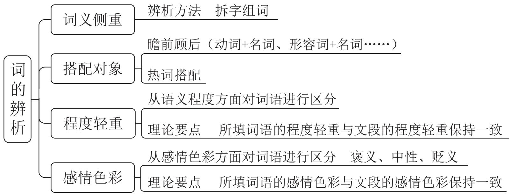

# 言语理解与表达 精讲精练 8

# 学习任务：

1. 课程内容：逻辑填空（关联关系、有标志对应—解释说明）  
2. 对应讲义: 第  $183 \sim 190$  页  
3. 重点内容:

(1) 关联关系在逻辑填空题中的应用  
(2) 有标志对应一解释说明的标志与应用

# 第二节 语境分析

# 一、关联关系

# (一) 转折关系

标志词：但是、然而、却等

理论要点：前后语义相反，感情色彩相反

【例1】（2024 浙江）图画书以图为主，文字很少，看似简单，实则____，内涵很深，需要创作者有细腻的生活经验、丰厚的审美素养，并能洞悉儿童的认知特点。当前市场上图画书品质____，一个重要原因就是有些创作者脱离生活，且缺乏必要的相关素养。

依次填入画横线部分最恰当的一项是:

A. 自成一体 粗制滥造

B. 别有洞天 滥竽充数

C. 各有千秋 鱼龙混杂

D. 包罗万象 参差不齐

【例2】（2021国考）现代社会获取盐分轻而易举，以至于人们认为吃盐是的事情。而事实上，由于盐在地理上的分布不均以及交通不畅等原因，其在古代一直都属于之物。在人类历史上的绝大部分时间里，人们都在寻找盐，

甚至令盐业成为了历史上第一个由国家垄断的产业。可以说,盐贯穿着整个人类历史,并在人类文明的发展中起到了______的作用。

依次填入画横线部分最恰当的一项是:

A. 稀松平常

必需 举足轻重

B. 理所当然

稀缺 至关重要

C. 天经地义

关键 承上启下

D. 手到擒来

珍贵 一以贯之

【例3】（2022江苏）现如今，各行各业因品牌效应而带来持续的经济收益十分可观，然而农村电商在建立农业品牌的道路上可谓____。由于受到长久以来分散生产经营的影响，农村电商未能切实体会到农产品品牌效应所能带来的巨大收益，以至于对建立品牌的____不足，缺乏动力。所以，____农村电商主体强化品牌意识至关重要。

依次填入画横线部分最恰当的一项是:

A. 举步维艰

兴趣 引导

B. 孤军奋战

认识 扶持

C. 一筹莫展

经验 协助

D. 凤毛麟角

信心 敦促

# (二) 因果关系

标志词：因为……所以……、由于……因此……、导致、使得等

理论要点：横线前后构成因果关系

【例 1】(2025 四川)面对农业现代化的现实需求, 数字化能覆盖和作用的范围还相对有限。由于我国幅员辽阔, 各地间情况差异较大, 很难完全依靠一套技术就包打天下。倘若在技术上 , 就很容易引发 “橘生淮南则为橘、生于淮北则为枳”的问题。因此, 在农业数字化进程中, 技术引用也必须 , 方能持续跑出加速度, 为现代农业提供源源不断的数字化供给。

依次填入画横线部分最恰当的一项是:

A. 固步自封

循序渐进

B. 纸上谈兵

实事求是

C. 削足适履

因地制宜

D. 好高骛远

脚踏实地

【例 2】(2025 国考)无论采取哪种储存方式, 液氢对储存系统________的要求都比传统燃油系统更高、更复杂。这是因为氢分子远小于航空煤油, 更容易从管路缝隙中________; 对于液氢储存, 还必须考虑________条件的实现问题, 否则升温气化后体积膨胀的氢气有可能导致燃料箱因压强骤增而直接爆炸。

依次填入画横线部分最恰当的一项是:

A. 密封性 逃逸 恒温

B. 稳定性 泄漏 压力

C. 完整性 溢出 热量

D. 安全性 弥散 季节

【例3】（2025国考）当前，改革发展任务繁重，需要各级各部门和广大干部高质高效地完成各项任务，才能在日趋激烈的发展竞争中赢得________。而处理日常纷繁复杂的工作，就如同“十个指头弹钢琴”，需要合理分配力量和节奏。一味强求自加压力，势必使某个或多个指头的力量受到影响，导致工作________，工作效能不理想也就在意料之中了。

依次填入画横线部分最恰当的一项是:

A. 主动 左支右绌

B. 优势 进退维谷

C. 认可 手忙脚乱

D. 先机 拖泥带水

【例4】（2024山东）民营企业在发展“四新经济”方面有自身的独特优势，敏锐的市场嗅觉、灵活的市场行为、强烈的开拓意识以及持续的创新精神使得民营企业在“四新经济”发展进程中

填入画横线部分最恰当的一项是:

A. 游刃有余

B. 举足轻重

C. 大有可为

D. 事半功倍

# (三) 并列关系

# 理论要点：

1. 近义并列：顿号（、）、逗号（,）

理论要点：近义并列前后语义、感情色彩相近

2. 反义并列：不是……而是……、是……不是……、相反、反之、多一些……少一些……、要……不能……等

理论要点：反义并列前后语义、感情色彩相反相对

3. 相同句式也可表示并列，要结合前后语境分析语义是相近还是相反

#

【例 1】(2025 国考)当前, 各地纷纷布局, 加快形成和发展新质生产力。然而, 发展新质生产力是一项系统工程, 不能盲目跟风、_, 也不能脱离实际、急于求成, 更不能简单复制一种模式, 必须坚持从实际出发, 从新质生产力的形成条件入手, 考虑周全、_____。

依次填入画横线部分最恰当的一项是:

A. 照猫画虎 厚积薄发

B. 一哄而上 谋定后动

C. 拾人牙慧 有备无患

D. 随波逐流 集思广益

【例2】（2025国考）推进中国式现代化是一个探索性事业，还有许多未知领域，需要我们在实践中去大胆探索，通过改革创新来推动事业发展，决不能____、守株待兔。各地区各部门要结合各自具体实际开拓创新，特别是在前沿实践、未知领域，鼓励大胆探索、____，寻求有效解决新矛盾新问题的思路和办法，努力创造可复制、可推广的新鲜经验。

依次填入画横线部分最恰当的一项是:

A. 刻舟求剑 敢为人先

B. 坐井观天 跌厉奋发

C. 望梅止渴 推陈出新

D. 画地为牢 大展拳脚

【例3】（2023 深圳）将下列选项中的成语填入横线处，最恰当的一项是：

十年来，面对严峻复杂的国际形势和接踵而至的巨大风险和挑战，党中央运筹帷幄，______，作出一系列重大科学判断，提出一系列重大战略策略，推动一系列重大工作，始终掌握新时代新征程党和国家事业发展的历史主动。

A. 处之泰然

B. 指挥若定

C. 稳操胜券

D. 应付裕如

【例4】（2025国考）人才培养是循序渐进的过程，需认识、____、尊重人才成长规律，坚持“严管”和“厚爱”相结合。人才干事创业中难免有失误，如果培养者因为害怕犯错而顾虑重重、____，则违背了人才培育的初衷。所以，要为人才“松绑”，建立健全正向激励和容错纠错机制，为人才成长创造宽容的环境。

依次填入画横线部分最恰当的一项是:

A. 把握 因噎废食

B. 顺应 矫枉过正

C. 运用 半途而废

D. 归纳 瞻前顾后

【例5】（2024四川）从历史上看，世界文化交流互鉴的本质是在尊重差异、________的基础上，寻求不同文明之间的共同价值，一方面是________自我，不失去原有的文化根基与血脉；另一方面则是平等相待，吐故纳新。

依次填入画横线部分最恰当的一项是:

A. 求同存异 保有

B. 兼容并蓄 提高

C. 和衷共济 坚持

D. 一视同仁 突破

【例 6】(2024 国考)生命科学界普遍认同“科学数据共享”,研究人员在使用数据库的同时,将自己研究发现的基因序列或蛋白质结构数据存入数据库,同时成为数

据库的使用者和____。如今，数据库已经成为生命史书最____的纪录载体和强大的数据分析平台，为整个生命科学研究所____。

依次填入画横线部分最恰当的一项是:

A. 维护者 完备 期待

B. 推广者 稳定 认可

C. 贡献者 可靠 依赖

D. 建设者 坚定 欢迎

【例 7】(2025 天津)领导干部特别是高级干部担负着推进改革的重要职责。要增强政治责任感、历史使命感, 以攻坚克难、迎难而上的政治勇气, 直面矛盾问题不_____, 铲除顽瘴痼疾不_____, 应对风险挑战不_____, 奋力打开改革发展新天地。

依次填入画横线部分最恰当的一项是:

A. 回避 含糊 退缩

B. 放弃 姑息 气馁

C. 推诿 迟疑 妥协

D.畏惧 宽纵 懒怠

【例 8】(2025 国考) 改进文风就要多写 “短实新” 的好文章。“实” 就是讲符合实际的话不讲脱离实际的话, 讲管用的话不讲空话, 讲反映自己思考的话不讲 _______ 的话, 讲有感而发的话不讲 _______ 的话, 讲通俗明白的话不讲故作高深的话, _______ , 用朴实的语言阐述深刻的理论。

依次填入画横线部分最恰当的一项是:

A. 故弄玄虚 装腔作势 由表及里

B. 照本宣科 无病呻吟 深入浅出

C. 人云亦云 言不由衷 举一反三

D. 陈词滥调 冠冕堂皇 言简意赅

【例9】（2023山东）打造一个品牌，带活一个产业，富裕一方农民，不可能 ________，必须尊重农业发展规律和市场规律，扎扎实实、______。顺应消费需求升级，持续擦亮农业品牌，做大做强乡村特色产业，为全面推进乡村振兴、加快建设农业强国提供更加有力支撑。

依次填入画横线部分最恰当的一项是:

A. 迎刃而解 驰而不息

B. 一挥而就 坚持不懈

C. 一步登天 持之以恒

D. 一蹴而就 久久为功

【例 10】(2021 国考) 亲近百姓、接近生活是曲艺这门艺术的生命力所在。当然,任何人都不可能 生活的全部, 所以创作者才有了 “采风” 一说。采风从来不是去 生活, 而是深入其中, 体会其中的乐与悲。然而, 现在许多曲艺工作者没有耐心去深入百姓生活, 于是只能写自己熟悉的生活, 创作能力无疑也受到了

依次填入画横线部分最恰当的一项是:

A. 描摹 评判 质疑

B.洞察 记录 束缚

C. 掌握 体验 削弱

D.了解 审视 限制

【例 11】(2025 国考) 我们想问题、作决策、办事情, 首先要考虑人口基数问题,考虑我国城乡区域发展水平差异大等实际, 既不能 , 也不能因循守旧, 要保持历史耐心, 坚持稳中求进、循序渐进、持续推进。

填入画横线部分最恰当的一项是:

A. 朝令夕改

B. 寅吃卵粮

C. 好高骛远

D. 一厢情愿

【例 12】(2024 国考)战场上未解之惑、未识之物、未通之理皆可疑。战场中的善疑并非一味多疑或疑而无度,而是要从全局出发,围绕作战目的、作战对手、作战体系而“疑”,观察战场态势,分析关联要点,力求对敌方的军事行动 ,对敌方的结构体系心知肚明,从而把握重心,掌握大局。

填入画横线部分最恰当的一项是:

A. 洞若观火

B. 防患未然

C. 胸有成竹

D. 未卜先知

【例 13】(2023 上海)京剧与中医、武术、国画并称中国的“四大国粹”, 半个世纪前, 那些名角、“头牌”演出时, 往往_____, 一票难求。而在当今, 年轻一代往往对本土传统文化弃之如敝屣, 对带洋字的文化则_____。

依次填入横线处的成语最恰当的一项是:

A. 万人空巷 趋之若鹜

B. 洛阳纸贵 炙手可热

C. 门庭若市 众星拱月

D. 万头攒动 敬而远之

# 二、对应关系

# (一) 有标志对应

1. 解释说明

标志词：即、就是、可谓、无异于、无疑是等

标点: 冒号 ( : )、破折号 ( —— )

理论要点：注意解释说明部分对横线处的提示性作用

【例 1】(2024 江西) 历史上的关羽之所以经历由人到神的____跃升, 从根本上讲, 是因为他的道德品行和人格气质满足了不同时代价值信仰重构的精神需求, 即在关公身上蕴含着中华优秀文化____的核心价值。那么这种核心价值是什么? 主张刚、毅、直、俭者有之, 认为孝、悌、忠、信者有之, 可谓众说多歧, _____。

依次填入画横线部分最恰当的一项是:

A. 提高 一脉相承 鞭辟入里

B. 攀拔 一以贯之 莫衷一是

C. 提携 一如既往 各执一词

D. 攀用 自始至终 众口难调

【例 2】(2023 湖北选调)对流层厚度不超过 20 千米, 相比整个日地空间乃至宇宙空间的尺度, 可谓 。而对流层外也会发生各种天气现象。人们很早就发现太阳并非 , 而是源源不断地往外喷发物质和能量, 时而平缓、时而猛烈。黑子、耀斑、日冕物质抛射等太阳活动 , 所引发的太阳风暴不断搅动着日地、太阳系空间和行星周围的环境, 空间天气变化深刻影响人类的地面和太空活动。

依次填入画横线部分的词语最恰当的一项是:

A. 九牛一毛

纹丝不动

不绝如缕

B. 绝无仅有

亘古不变

转瞬即逝

C. 难能可贵

浑然一体

丰富多彩

D. 薄如蝉翼

一成不变

此起彼伏

【例3】（2024 黑龙江公安）产品走红是一个口碑自然传播的过程，放松对品质的追求，专注走营销的捷径，无异于________。就此而言，抓好质量、修炼内功，才是赢得消费者的长久之计。

填入画横线部分正确的一项是:

A. 舍本逐末

B. 因小失大

C. 缘木求鱼

D. 南辕北辙

【例4】（2024 黑龙江公安）汽车货运作为物流行业的一个分支，其自身运行充分遵循市场调节这只“看不见的手”。然而，货车司机只是市场链条上的一环，当整个市场链条出现问题时，如果单就链条上的某一环节着力无异于

填入画横线部分最恰当的一项是:

A. 抱薪救火

B. 扬汤止沸

C. 饮娉止渴

D. 刻舟求剑

【例5】（2022四川）过去几十年中国发展总体上很成功，但也存在一些____的短视行为，比如优先上马“短平快”赢利项目而忽视更需长期投入和经营的基础科学，有些重要项目采取简单外购的“拿来主义”而没下大力气自己攻关。结果，我们

在一些关键技术上存在被人“卡脖子”的____。

依次填入画横线部分最恰当的一项是:

A.急功近利 隐患

B. 好大喜功 短板

C. 顾此失彼 困境

D. 心浮气躁 威胁

【例6】（2022河南）儿童多动症的注意力缺陷症状延续到成人期，表现为做事拖延，时间管理能力差，组织性差，效率低等；而儿童期的多动或冲动症状，也常常以“____”的形式表现出来，比如计划多却难以坚持，频繁辞职更换工作，情绪控制能力差等。

填入画横线部分最恰当的一项是:

A. 顾此失彼

B. 似是而非

C. 莫名其妙

D. 改头换面

【例 7】(2024 吉林)大运河是一本很厚的书, 厚到可以用上一个词——“____”。成千上万的人是这本书的作者, 他们用智慧和汗水写了两千五百年。

填入横线处最恰当的一项是:

A. 汗牛充栋

B. 浩如烟海

C. 卷帙浩繁

D. 博大精深

【例8】（2022江苏）以都市圈视角来看，超大城市的城区和郊区应该互相 ______、互相补充并 ______：城区是超大集聚，郊区则应该是中型或小型集聚；城区是尽显 ______的超级都市，郊区则是各有特色的市镇体系和生态田园；城区是高容积率和高密度的，郊区则是相对低容积率和低密度的。

依次填入画横线部分最恰当的一项是:

A. 提携 美美与共 气势

B. 呼应 融为一体 实力

C. 错位 相得益彰 魅力

D. 借鉴 珠联璧合 优势

# 言语理解与表达 精讲精练9

# 学习任务：

1. 课程内容：逻辑填空（有标志对应一形象表达、无标志对应）  
2. 对应讲义: 第  $191 \sim 199$  页  
3. 重点内容:

(1) 有标志对应一形象表达的标志与应用  
(2) 无标志对应的分类与应用

# 2. 形象表达

标志：如同、就像、类似、双引号等

理论要点：与形象表达对应的选项优选

【例 1】(2024 江西) 蝌虫具有恐怖的吸血能力, 它会找到皮肤上隐蔽的角落地吸血好几天, 人却无法察觉。这是因为蜱虫的唾液就像鸡尾酒一样, 由各种蛋白质 “_” 而成, 其中一些让人不痛不痒, 一些让血液不会凝固, 还有一些保证不会人的免疫系统。多种病原体便会趁机入侵人体。

依次填入画横线部分最恰当的一项是:

A. 不声不响

搅拌

启动

B. 堂而皇之

调配

惊扰

C. 明目张胆

凝结

触发

D. 有恃无恐

混合

唤醒

【例 2】(2023 吉林)红色, 是强军文化最鲜亮的底色。展开历史画卷, 红色基因犹如一条红线 历史, 孕育了我党我军特有的忠诚品质、胜战精神、优良作风。善于传承才能更好创新, 因此应站在红色江山永不变色、党的事业 的高度, 与优良传统对接, 汲取信仰力量, 深入实施 “红色基因代代传” 工程, 让强军文化在红色 上生发新枝叶, 使这些超越时空限制、富有永恒魅力的宝贵精神财富, 通过更加生动鲜活的表达方式弘扬起来。

依次填入画横线部分最恰当的一项是:

A. 标记

继往开来

基因

B. 穿越

承上启下

底蕴

C. 纵贯

薪火相传

根脉

D. 联通

大展宏图

土壤

【例3】（2023吉林）盗蛛是一种捕鱼蛛，多生活在溪水面上，有的盗蛛经常将两只长脚伸进水里探测小鱼的动向，就好像“姜太公”钓鱼静待它们“____”，当小鱼游进捕猎范围，盗蛛就会突然扑过去，并用两只长脚将小鱼紧紧抱住，将其拖入自己的洞穴。有的盗蛛还会用后面一对步足紧抓水面漂浮物，将其余几对伸出去，____，一旦遇见合适的目标时，便会迅速扑上去，先用口器咬住猎物，然后再将毒液注入其体内，使猎物中毒昏迷。

依次填入画横线部分最恰当的一项是:

A. 束手就擒 一探究竟

B.坐以待毙 见机行事

C. 自投罗网 随波逐流

D. 自取灭亡 静观其变

【例4】（2022天津）仅靠未成年人发挥自律性，主动去抵御网络诱惑并不现实。通过学校和家长的共同努力，可以实现一定程度的控制，但这需要一直盯着孩子，也很困难，还容易____。此前，为彻底落实游戏防沉迷措施，监管部门发布了一系列严规，给游戏平台戴上了“____”，获得非常好的成效。

依次填入画横线部分最恰当的一项是:

A. 回落 保护套

B. 反弹 紧箍咒

C. 失效 防盗网

D. 逆反 连环扣

【例 5】(2021 国考) 随着各种侦察手段的不断演进, 可视侦察、红外侦察、雷达侦察等 “____”, 现代坦克在战场上越来越难以藏身。对此, 现代坦克当然不会 “____”。在讲求 “发现即摧毁” 的现代战场上, 坦克必须实现对侦察手段的 “免疫”, 见招拆招, , 让对手对自己庞大的身躯 “视若无睹”。

依次填入画横线部分最恰当的一项是:

A. 齐头并进 束手就擒 对症下药  
B. 大显身手 自暴自弃 见机行事  
C. 虎视眈眈 坐以待毙 有的放矢  
D. 明察秋毫 知难而退 多管齐下

【例 6】(2024 黑龙江公安) 战略管理体系, 既是军队组织形态现代化的重要支撑, 也是军队组织形态现代化的关键任务。紧紧扭住健全完善战略管理体系, 就牢牢抓住了推进军队组织形态现代化的 “牛鼻子”, 可以起到______的作用。

填入画横线部分最恰当的一项是:

A. 标本兼治

B. 立竿见影

C. 高屋建瓴

D. 纲举目张

【例 7】(2021 国考) 发展扶贫产业不能眉毛胡子一把抓, 必须立足当地自然禀赋, 挖掘地方特色资源, 按照 “宜种则种、宜养则养” 的原则, 注重发展山地农业、生态农业、观光农业等特色产业, 学会 “靠山吃山唱山歌, 靠海吃海念海经”, 谨防产业 “_____”。应该看到, 适合的才是最好的。

填入画横线部分最恰当的一项是:

A. 急功近利

B. 水土不服

C. 削足适履

D. 千篇一律

【例 8】(2024 四川)秦国的强大在一定程度上得益于都江堰水利工程。秦国蜀守李冰为解决岷江的泛滥问题, 考其地势, 采用中流作堰的方法, 因势利导, 成功制服______的岷江, 将其分为内江和外江。如此______的工程布局, 堪称人类水利史上的奇迹。

依次填入画横线部分最恰当的一项是:

A. 波澜壮阔

出神入化

B. 势不可当

鬼斧神工

C. 一泻千里

匠心独具

D. 架臀不驯

巧夺天工

【例9】（2024山东）药品安全事关广大人民群众身体健康和生命安全。不筑牢药品的安全底线，安全根基不稳，再多的创新也是________。持续强化药品全生命周期质量监管，落实药品安全“四个最严”要求，才能有效________药品安全形势的总体稳定。药品安全是设计出来的，也是生产出来的，更是监管出来的。

依次填入画横线部分最恰当的一项是:

A. 纸上谈兵 保障

B. 徒劳无功 提升

C. 空中楼阁 维护

D. 本末倒置 控制

# (二) 无标志对应

1. 主题词

文段讨论的核心话题

理论要点：与主题词对应的选项优选

【例 1】(2021 国考)代入感是作品引发受众认同的机制, 故事人物的某些方面

召唤读者将自己替换为主人公，从而____，与角色同呼吸共命运。代入感是长篇网络小说____的属性，由于网络小说连载时间长，读者容易中途放弃。因此，作品绑定读者，将单纯浏览转变为情感认同便十分重要。

依次填入画横线部分最恰当的一项是:

A. 感同身受 不可或缺

B.惺惺相惜 独一无二

C. 身临其境 与生俱来

D. 触景生情 与众不同

【例2】（2022 福建）快门是相机中一个相当重要的装置，它以________的态度面对分分秒秒不停变化的现实，以及无法________的时间，最后，对着时间拉出一条线，决定我们所见的事物。这个动作，把现实中模糊存在的实像，转化为具有________方向性和意义的虚像，定影在底片上。

依次填入画横线部分最恰当的一项是:

A. 果断 捕捉 明确

B. 忠实 回忆 清晰

C. 冷静 复制 唯一

D. 严谨 定格 准确

【例3】（2024国考）年轻干部要提高抓落实能力。干事业不能做样子，必须脚踏实地，抓工作落实要以上率下、________。特别是主要领导干部，既要带领大家一起定好盘子、理清路子、开对方子，又要做到重要任务亲自部署、关键环节亲自把关、落实情况亲自督查，不能高高在上、________，不能只挂帅不出征。干事业就要有钉钉子精神，抓铁有痕、踏石留印，________向前走，过了一山再登一峰，跨过一沟再越一壑，不断通过化解难题开创工作新局面。

依次填入画横线部分最恰当的一项是:

A. 一马当先 刚愎自用 披荆斩棘  
B. 真抓实干 凌空蹈虚 稳扎稳打  
C. 掷地有声 好高鹫远 久久为功  
D. 责无旁贷 坐而论道 虔兢业业

【例4】（2023国考）指尖上的形式主义是“以痕迹论政绩”的错误政绩观，关注点在于形式美观，而________了根本政绩——人民群众的满意度。指尖上减负就是要把基层干部从________的“虚功”中解救出来，务求实效、扎根基层，用实践检验政绩，把工作落实与否、群众满意与否作为衡量政绩的客观标准。

依次填入画横线部分最恰当的一项是:

A. 偏离 阳奉阴违

B. 遗忘 哔众取宠

C. 淡化 花拳绣腿

D. 忽视 华而不实

【例 5】(2023 吉林)在深化不同文明之间的交流互鉴中, 要构建一套中华思想文化术语对外翻译的标准本, 把中国真正的文化精髓____世人。为此, 需要加强国际传播能力建设, 形成同我国综合国力和国际地位相匹配的国际话语权, 以中国思想观念的本来思想意蕴对外传播, 而不能靠他者误读了的内容去____。

依次填入画横线部分最恰当的一项是:

A. 昭示 以讹传讹

B. 告知 妄下雌黄

C. 灌输 道听途说

D.启迪 评头论足

【例 6】(2024 山东) 铁路是国民经济大动脉。一条铁路线的_____, 往往折射出一个地区发展变迁和现代化的崛起步伐。在山东发展史上, 百廿胶济, 就是这样一条担纲主动脉的铁路线。可以说, 一部百廿胶济发展史, 是一部铁路交通变迁史, 更是一部______的沿线经济文化发展史。

依次填入画横线部分最恰当的一项是:

A. 贯通 气势磅礴

B. 延展 活力四射

C. 演变 流光溢彩

D. 僧变 波澜壮阔

【例 7】(2022 福建) 大脑由数十亿个神经细胞组成, 这些____的细胞需要在一个受保护的环境中才能正常工作, 这个____的环境被 400 英里长的特殊血管系统保护着, 这些血管能____与大脑接触的物质, 这就是血脑屏障, 它对于保护脑组织免受毒素和病原体的侵害至关重要。

依次填入画横线部分最恰当的一项是:

A. 脆弱 微妙 限制

B. 高效 复杂 阻挡

C.散乱 神奇 过滤

D. 微小 灵敏 抑制

2. 前后呼应

句子内部注重联系句子之间整体把握

【例 1】(2023 重庆)由中国歌剧舞剧院推出的舞蹈剧《英雄儿女》以宏伟壮阔的叙事风格、史诗般的影像____、沉浸式的体验，带领观众走进抗美援朝那段激

情燃烧的岁月。该剧汇集多种舞蹈形态，舞美运用高科技手段，为观众营造身临其境之感，并以油画的美术风格力图 _______ 那个时代的真实色彩。

依次填入画横线部分最恰当的一项是:

A. 艺术 描摹

B. 质感 还原

C. 效果 表现

D. 元素 展示

【例2】（2024吉林）近年来随着小卫星市场的蓬勃发展，带来了小卫星发射需求的快速上升。在这种形势下，火箭拼单开始____，一箭多星的规模也越来越大。在多星分配器上，卫星根据各自特性的不同，有的是端坐在顶上，有的是侧挂在壁上，还有的包装在释放装置内，保证大家____，都能够经受住火箭发射时的飞行环境，安全地进入到太空。

依次填入画横线部分最恰当的一项是:

A. 蒸蒸日上 一举多得

B. 生机勃勃 箭无虚发

C. 大行其道 各得其所

D. 生意盎然 一箭双雕

【例3】（2024辽宁）中国式现代化以 ______ 的观念统筹推进经济、政治、文化、社会和生态文明各领域工作，而构建新发展格局与推进中国式现代化是逻辑一致的，从生产力、经济体系、奋斗方向和实践路径等 ______ 为推进中国式现代化提供了重要基础。

依次填入画横线部分最恰当的一项是:

A. 整体 立场

B. 辩证 层面

C. 系统 维度

D. 历史 视域

【例 4】(2024 江西)中国汉字经历岁月洗礼, , 如今已发展出成熟而多样的字体系统。随着科学技术的 , 激光照排技术替代活字印刷, 让汉字的传播方式发生了革命性变化, 而数字媒体的 使汉字字体的设计迎来了质的飞跃。当我们以全新的视角重新审视汉字时, 会发现其创新的设计方法如万花筒般千姿百态、绚丽多彩。

依次填入画横线部分最恰当的一项是:

A. 久久为功

提升

创新

B. 历久弥新

增长

融合

C. 薪火相传

更迭

介入

D. 厚积薄发

普及

应用

【例 5】(2024 贵州)正所谓沧海桑田, 6000 年前的撒哈拉可能并非大沙漠, 而是一片大草原, 19 世纪中叶, 德国探险家海因里希·巴特在 的撒哈拉沙漠中

意外发现史前岩画，数10万幅精美的图像描绘着种族繁盛的大象、长颈鹿、河马和羚羊被猎人追捕的____场景，可以推想，史前人类____了撒哈拉由草原变成沙漠的过程。

依次填入画横线部分最恰当的一项是:

A. 沉寂

神秘

见证

B. 干燥

震撼

记录

C. 荒凉

生动

经历

D. 广袤

壮观

目睹

【例 6】(2025 天津)百年大党长期执政, 思维惯性、行为惰性客观存在, 一些老观念、老套路、老办法容易 , 队伍不断发展壮大也带来干部良莠并存、参差不齐。我们必须 提高科学执政、民主执政、依法执政水平, 克服干部队伍中存在的能力不足、本领恐慌, 确保适应新时代要求、具备领导现代化建设能力, 做到政治过硬、本领高强, 堪当民族复兴重任。

依次填入画横线部分最恰当的一项是:

A. 积重难返

一如既往

B. 相沿成习

与时俱进

C. 画地为牢

坚定不移

D. 因循守旧

持之以恒

【例 7】(2023 安徽) 沙珠玉, 曾是黄河上游风沙危害最严重的地区之一。20 世纪 50 年代, 沙珠玉九成草场已沙漠化。最严重的半年, 沙丘向居民点推进了 47 米。 , 沙珠玉人开始 。对他们来说, 造林治沙, 是一场用性命与风沙所做的生死搏斗。60 多年来, 沙珠玉人营造起 18 道防风林, 层层叠叠的树木, 硬生生将狂风顶住、逼沙丘后退。

依次填入画横线部分最恰当的一项是:

A. 山穷水尽

孤注一掷

B. 不进则退

迎难而上

C. 退无可退

绝地反击

D. 寸步难行

背水一战

【例8】（2023 黑龙江）参照国际经验，生活垃圾收费主要有从量征收和定额征收两种模式。当前，我国大多数城市的居民生活垃圾处理费为定额征收。但早在2018年，国家已明确提出垃圾计量收费，一些城市也制定了居民生活垃圾处理费收费标准。无论是参照国际先进经验，还是促进生态环境质量改善，生活垃圾按量收费都是

填入画横线部分最恰当的一项是:

A. 必由之路

B. 势在必行

C. 大势所趋

D. 名正言顺

【例 9】(2024 黑龙江)“读万卷书, 行万里路” 虽是明代董其昌提出的观点, 但却是中国历代许多文人所 ______ 的。在没有现代交通工具的古代, 文人在著书立说之外, 用简易的交通工具和双脚丈量大地, 给我们留下了丰厚的文化遗存。

填入画横线部分最恰当的一项是:

A. 推崇备至

B. 身体力行

C. 全力以赴

D. 孜孜以求

【例 10】（2023 广东）政府部门要制定政策、营造环境，发挥宣传发动、组织协调、引导扶持作用，但绝不能________。要坚持有为政府和有效市场相促进，充分发挥市场机制作用，调动市场主体积极性，以重点产业项目为________，促进资源要素更多向乡村流动，以产业“活水”变输血为造血。

依次填入画横线部分最恰当的一项是:

A. 置身事外 核心

B. 越俎代庖 根本

C. 大包大揽 载体

D. 袖手旁观 导向

【例11】（2022四川下）算法推荐凭借对用户浏览数据的精准分析，降低了人们获取信息的成本，同时也将人们推向了 ______ 的舒适圈。人们看似浏览了很多信息，实际只是在不断重复中强化固有的喜好和对事物的看法。一旦 ______ 其中，探索世界多样性的动力和欲望难免降低，加剧“信息茧房”效应。

依次填入画横线部分最恰当的一项是:

A. 悠然自得 陷溺

B. 画地为牢 束缚

C. 固步自封 沉浸

D. 按部就班 迷失

【例12】（2025国考）面对企业，干部洁身自好只是最低要求，担当作为才是责任所系。民营企业所遇到的困难和问题仍不少，干部不仅要守住廉洁底线，更应主动为企业________。干部同企业家打交道要把握分寸，并不意味着可以对企业家的正当要求________，对企业的合法权益不予保护，而是要积极主动为企业服务。

依次填入画横线部分最恰当的一项是:

A. 雪中送炭 充耳不闻

B. 保驾护航 退避三舍

C. 嘶寒问暖 熟视无睹

D. 排忧解难 置若罔闻

【例 13】(2023 国考)“双减”政策带给作业改革的最大变化, 是理念的改变, 让我们回到了作业的原点: 为什么要布置作业? 归根到底, 是为了育人。这彻底扭转了之前作业管理中的 “_” 现象, 改变了传统作业管理中 “眼中有作业、有分数,

但唯独没有人”的痼疾，厘清了“好作业”的标准或者尺度。

填入画横线部分最恰当的一项是:

A. 揭苗助长  
B. 本末倒置  
C. 缘木求鱼  
D. 徒有其表

# $\circ \varnothing$  思维导图

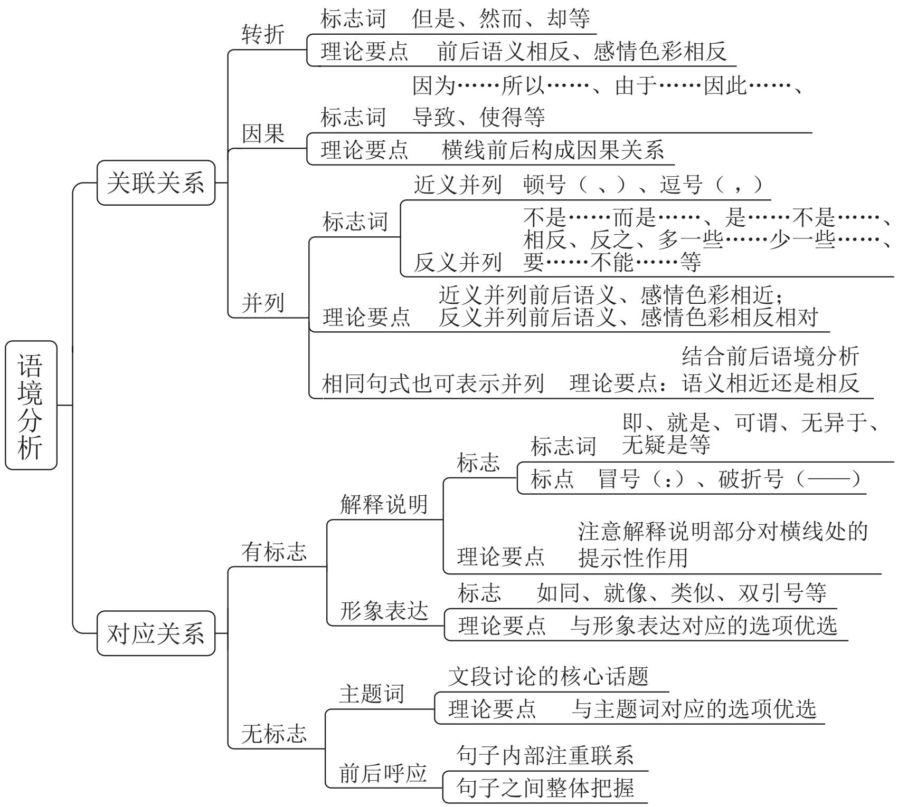

# 精讲精练-言语1（笔记）

# 说在课前

# 备考三点提示:

1. 阅读理解是根本，不要过分迷恋技巧  
2. 听课刷题重质量，不要单纯追求数量  
3. 速度正确率兼顾，不要过分追求难题

# 听课三点提醒:

1. 提前预习，听课更有针对性  
2. 明确重点，掌握思维和方法  
3. 文明互动，营造和谐的课堂

注：本课程可无限次回放

# 【注意】说在课前：

# 1. 备考三点提示:

(1) 科目是言语理解与表达，针对言语而言，阅读理解是根本，不要过分迷恋技巧。  
(2) 听课刷题重质量, 刷题量和正确率没有必然关系, 如果方向是错的, 只会在错误方向上越走越远, 不要单纯追求数量, 更多追求的是质量与效率。  
(3) 速度正确率兼顾, 不能只追求速度, 完全没正确率, 也不能为了追求正确率而放弃速度, 二者要兼顾。不要过分追求难题, 如果正确率在  $35\%$  以下,说明难度很高, 或者出的题有瑕疵, 这种题就不需要纠结, 可以适度放弃。关于速度, 正常情况下言语 1 道题 1 分钟左右。关于正确率, 如果言语是优势模块,可以把目标定在  $80\%$  及以上, 如果言语是中等模块, 正确率至少在  $70\%$  以上。

# 2. 听课三点提醒:

(1) 提前预习，听课会更有针对性，效率会更高。  
(2) 明确重点, 听课不是关注答案本身, 而是要掌握思维和方法, 学习如何理解文段。  
(3) 文明互动, 不探讨和学习无关的话题, 营造和谐的课堂。

# 3. 注：本课程可无限次回放。

言语理解与表达

必考题型:

# 一、片段阅读

中心理解题（基础&重要）、细节判断题

# 二、语句表达

语句排序题、语句填空题、接语选择题

# 三、逻辑填空（难度高&题量大）

实词填空、成语填空、混搭填空

特殊题型:

标题填入题、词句理解题、篇章阅读-补充课程包·专项课

# 【注意】

1. 国考言语题量在 2025 年之前考 40 道题, 2025 年考 30 道题, 总体题量还是很大的。  
2. 必考题型:

(1) 片段阅读: 中心理解题 (就是要找中心, 是言语的基础题型, 非常重要, 通过中心理解题会重点讲解拿到一个文段如何分析、如何快速阅读、如何迅速找到中心, 后面再学其他题型就能更好举一反三)、细节判断题。  
(2) 语句表达: 语句排序题、语句填空题、接语选择题。  
(3) 逻辑填空（是言语难度最高的题型，题量非常大，国考中会考查一半或将近一半）：实词填空、成语填空、混搭填空。  
(4) 有的同学不喜欢言语, 或者看到长段文字就晕, 如果抱着这种心态听课做题, 正确率就不会高, 希望大家从此时此刻调整状态、转变观念, 只有爱上言语才会在言语上有很好的提升, 要树立 “言语虐我千百遍, 我待言语如初恋”的信念。

3. 特殊题型（选考题型）：标题填入题、词句理解题、篇章阅读（只有国考副省级会考），这些题型在补充课程包里的专项课讲解。

<table><tr><td>课程名称</td><td>课 程 内 容</td><td>授课时长</td></tr><tr><td>精讲精练1</td><td>中心理解题（转折关系、主题词）</td><td>2.5小时</td></tr><tr><td>精讲精练2</td><td>中心理解题（因果关系、必要条件关系-典型格式、正面提对策）</td><td>2.5小时</td></tr><tr><td>精讲精练3</td><td>中心理解题（必要条件关系-反面提对策、文段无对策、并列关系）</td><td>2.5小时</td></tr><tr><td>精讲精练4</td><td>中心理解题（分述句特征）、细节判断题</td><td>2.5小时</td></tr><tr><td>精讲精练5</td><td>语句表达（接语选择题、语句填空题）</td><td>2.5小时</td></tr><tr><td>精讲精练6</td><td>语句表达（语句排序题）</td><td>2小时</td></tr><tr><td>精讲精练7</td><td>逻辑填空（词的辨析）</td><td>2.5小时</td></tr><tr><td>精讲精练8</td><td>逻辑填空（关联关系、有标志对应-解释对应）</td><td>2.5小时</td></tr><tr><td>精讲精练9</td><td>逻辑填空（有标志对应-形象表达、无标志对应）</td><td>2.5小时</td></tr></table>

【注意】2026 国考系统班有课程的升级，以前方法精讲阶段打基础，选题相对简单，等几个科目方法精讲学完后会有强化练习，有的同学反映到了强化阶段，前面学的都忘了，为了规避这个问题，今年把这两个阶段做了融合，就是精讲精练阶段，言语是 9 节课。难度上也有升级，如果课前预习正确率不高要保护好自己的小心脏。每节课讲解 1-2 个重要知识点，课间有休息。

# 第一章 片段阅读

# 【解题顺序】

文段——提问——选项

OR

提问——文段——选项

【粉笔提示】忠于文段，对比择优

# 【注意】片段阅读:

1. 解题顺序：言语一般先给出一段文字，然后给出提问，接着给出选项。做题顺序是先看提问，带着问题读文段，然后对应选项。  
2. 同学们做言语题有时会遇到四个选项都不想选的情况, 或者排除两个选项,在剩下两个选项中特别纠结, 痛下决心然后选错了, 之所以出现这种情况是因为出题人的选项设置不是特别完美, 不像数学  $1 + 1$  一定等于 2 , 言语的选项设置可能会出现 1.5 或 1.8 的情况, 所以要忠于文段, 对比择优, 好的答案是比较出来的, 要接受不完美。

# 第一节 中心理解题

提问方式:

这段文字主要/旨在/重在/意在/想要说明（论述/强调）的是……

这段文字的主旨/主题/观点是……

对这段文字概括最恰当的是……

这段文字表达了作者……

从这段文字中我们可以看出作者的意图/态度是……

# 【注意】中心理解题:

1. 国考中题量较大, 多的能考 10 道题。是言语的基础题型, 要重点掌握。  
2. 提问方式：以下问法都一样，都属于中心理解题。

(1) 这段文字主要/旨在/重在/意在/想要说明（论述/强调）的是……。  
(2) 这段文字的主旨/主题/观点是……。  
(3) 对这段文字概括最恰当的是……。  
(4) 这段文字表达了作者……。  
(5) 从这段文字中我们可以看出作者的意图/态度是……。

# 解题思路：找重点（中心）

1. 直接确定重点-逻辑层面之关联词-内容层面之主题词  
2. 间接确定重点-排除非重点

例 1: 近年来, 考公务员的人数越来越多, 难度越来越高。因此, 听课刷题很重要。  
例 2: 近年来, 考公务员的人数越来越多, 难度越来越高。听课刷题很重要。比如, 张二狗同学就是通过认真听课加上刷题总结成功上岸的。

# 【注意】解题思路：找重点（中心）。

# 1. 直接确定重点:

(1) 逻辑层面: 把握关联词, 如转折、因果、必要条件、并列关系。  
(2) 内容层面: 抓主题词, 即文段核心话题。上述例 1, “近年来”交代背景, “因此” 是关联词, 引导结论, 重点在后面, 抓核心话题 “听课刷题”。

2. 间接确定重点：如果直接找重点不好判断，可以排除非重点，剩下的内容就是中心。上述例 2, “近年来” 是背景引入, 只读 “听课刷题很重要” 不确定是不是中心, 结合后文 “比如”, 是举例子, 不重要, 前后的非重点内容排除, 中间这句话就是中心。

第一次课学习重点内容:

(1)转折关联词及重点位置  
(2)主题词的应用  
(3)错误选项的特征

【注意】第一次课学习重点内容:

1. 转折关联词及重点位置。  
2. 主题词的应用。  
3. 错误选项（即出题人挖的坑）的特征。

# 一、逻辑层面之关联词

1. 转折关系：虽然……但是……；尽管……可是……；

……不过……；……然而……；

却…

其实/事实上/实际上

中

理论要点：转折之后是重点

【注意】转折关系：

1. 标志词（要增强对关联词的敏感度）：

(1) 虽然……但是……; 尽管……可是……; ……不过……; ……然而……; ……却……。联想到英语中的 but。  
(2) 其实/事实上/实际上（也可以表转折，但容易被忽略）。如很多人都认为甲是女老师，其实/事实上他是男老师，重点在转折后。

2. 理论要点：转折之后是重点。如虽然我个头矮小，但是我内心强大；虽然我外表丑陋，但是我心地善良。

【例 1】（2022 福建）传统戏曲具有悠久的发展历史，并以其独特的表演风格和大众审美取向，在很长一段时期都有着深厚的群众基础。随着社会的快速发展，人们的娱乐方式发生了较大变化，在多元文化形态的冲击下，传统戏曲自身存在的不足也被放大，致使观众群不断减少，剧目创作逐渐萎缩，优秀演员也逐渐流失，传统戏曲受到极大冲击，一度生存艰难，尽管近些年来在政府和社会各界的帮助与扶持下，传统戏曲艺术的生存状况有所好转，但仍旧比较弱势。

这段文字意在说明：

A. 传统戏曲面临的生存困境  
B. 传统戏曲发展的制约因素  
C. 传承传统戏曲的现实意义  
D. 传统戏曲生存状况的好转

【解析】1. 问“意在”为中心理解题。“传统戏曲……群众基础”引出传统戏曲。“随着……一度生存艰难”指出问题，论述不好的方面。看到“尽管”，后面会出现转折，最后出现“但”，重点在转折之后。把握转折之后的内容，锁定A项。

C、D 项：都在论述好的方面，对应转折前，均排除。  
B 项: “制约因素”对应转折前, 非重点, 且纠结时可以对比选项找不同, A 项论述生存困境, B 项论述发展的制约因素, 文段强调生存, 排除。【选 A】

【注意】结构梳理：引入+好+转折指出问题（但……）。

【例 2】（2021 山西）观照历史上多次出现过的媒介融合的进程结果，媒介材料的变更，绝不等于思想生活变现，正如汉字生产的主线，也绝不会因为纸张代替了简牍而出现颠覆性变化一样。事实上，简牍的汉字同纸张的汉字，并无太大差别，顶多只是字体有些不同而已。不可否认媒介变化肯定会带来表达的不同，如新近出现的网言网语，肯定是互联网语境下的表达产物。但无论媒介技术怎样发展变化，任何文明主干、任何文化血脉，都是一以贯之的。

这段文字意在强调:

A. 正确认识媒介革命的特殊性与普遍性，重视传统文化的传承  
B. 媒介革命不仅涉及媒介技术, 还关乎人们的思想观念等问题  
C. 借鉴历史上简牍与纸张之媒介融合的经验，推动新媒介融合  
D. 媒介革命必定改变人们观念，助力社会进步和提升文明层次

【解析】2. 问“意在”为中心理解题。“观照……思想生活变现”进行背景引入。“正如……变化一样”是举例子，纸张、简牍都是例子。“事实上”是转折词，但后面依然论述简牍、纸张，还是在举例子，故这个“事实上”不重要。“如……表达产物”还是举例子，不重要。

尾句出现“但”，重点在最后。没有选项和尾句一模一样，就需要对比选项。尾句落脚点强调文明、文化是一以贯之的，“一以贯之”即自始至终、贯穿始终，强调不变、传承，对“一以贯之”同义替换，锁定A项。

B、D 项: “观念”对应转折前引入部分, 且文段论述不等于, D 项论述必定改变, 与文意相悖, 均排除。  
C 项: “简牍与纸张”对应例子, 且 C 项落脚点在推动新媒介融合, 而尾句转折后强调传统文化一以贯之, 会传承下去, 而不是强调媒介自身的融合, 排除。

【选 A】

# 【注意】

1. 结构梳理：引入+举例子+转折提出观点（但……）。  
2. 文段前面出现“事实上”，后面出现“但”，不能只看转折，还要结合内容，尾句的“但”才引导最终观点。举例中的转折不重要。  
3. 文段转折后论述不同时代的媒介技术是不一样的，这是 A 项“特殊性”的体现；任何文明、文化都是一以贯之的是“普遍性”的体现。  
4. 观照：认真观察，仔细审视。  
5. 一以贯之：学说、理论贯穿始终。

【例 3】（2024 江西）如今无论什么季节，任何水果都能随时买回家尝鲜，很多人对此并不赞同，理由是反季水果的种植过程中总会有不利于健康的因素，因此他们在选购水果的时候，会侧重购买当季、当地产的水果。但是，果蔬中是

否存在不利于健康的因素，与自然栽种还是大棚栽种没有必然联系。随着现代化农业技术的推广应用，大棚栽种水果技术越来越成熟，所有的保鲜剂、食品添加剂、植物生长调节剂，只要是国家相关标准允许使用的，且在规定的用量下，对人体健康是没有危害的。

这段文字旨在说明:

A. 人们倾向于购买当季当地产的水果  
B. 反季水果在种植过程中会产生不利于健康的因素  
C. 水果是否存在不利于健康的因素与栽种方式的选择无关  
D. 应加强现代农业技术的推广应用，减少添加剂对健康的危害

【解析】3. 问“旨在”为中心理解题。首句论述如今无论什么季节，任何水果都能随时买回家尝鲜，很多人对此并不赞同。“理由是……当地产的水果”进行解释。“但是”表转折，说明前文不重要，只是引入，“但是……必然联系”论述水果是不是健康的和栽种的方式没有关系。“随着……没有危害的”进行解释说明。文段重点在转折后，锁定C项。

A、B 项：对应转折前，非重点，均排除。

D 项：（1）对应后面的解释说明；（2）文段没有提到减少，文段说只要符合规定就是没有危害的；（3）文段是围绕水果展开论述的，D 项未提及“水果”，跑题了，排除。【选 C】

【注意】结构梳理：引入+转折提出观点（但是……）+解释说明。

【例 4】（2023 吉林）蝴蝶大都有觅食花卉的习性，一般来说，大型蝶种喜欢花朵大的花卉，而小型蝶种则喜欢低矮草质茎植物的花卉。翠凤蝶、蓝凤蝶喜欢觅食百合科植物的花卉。菜粉蝶、红襟粉蝶喜欢觅食十字花科植物的花卉。小豹蛱蝶则喜欢在菊花科植物的花卉觅食，它们也会偶尔换个口味，吸食发酵性食物。其实，取食花蜜、汲食树汁、嗜食发酵水果、吮吸动物尸体……蝴蝶的口味，因蝶种不同，取食也大相径庭，或是单一口味，或是五味俱全。有的还会从水中觅食，吸收自己所需“营养”，如在小溪两侧的沙滩处，人们总会看到一堆堆蝴蝶在吸水、喷水。

最适合做这段文字标题的是:

A. 花为蝶开，蝶为花来  
B. 蝴蝶对花卉也有选择  
C. 蝴蝶的生活习性  
D. 众口难调——蝴蝶不只为花来

【解析】4. 给文段起标题, 其实就是要概括文段中心, 即变形的中心理解题。开头引出蝴蝶大都有觅食花卉的习性。“一般来说……发酵性食物”都是举例, 非重点。“其实”相当于“然而”, 表转折, “其实……五味俱全”强调蝴蝶口味不一样。“有的还会……喷水”依然是举例子。文段重点在中间的转折之后, 强调蝴蝶的口味不一样, 锁定 D 项。

A、B项：未提及“口味”，且B项对应转折前，均排除。

C 项: “生活习性” 如饮食习惯、作息时间、社交方式等, 范围太大, 不能和 “口味” 画等号, 排除。【选 D】

【注意】结构梳理：引入+举例子+转折提出观点+解释说明。

【例5】（2024重庆）新农人，不同于传统农民，也异于新型职业农民，他们多是从城市回流农村的新群体。如果说过去大部分年轻人以跳出农门为奋斗目标之一的话，近年来，跳回农门正在成为新时尚。新农人带来了新技术、新商业模式和运营理念，创造了新的就业机会和空间，丰富并拓展了农村经济业态。但在现实中，新农人融入农村社会网络，激活产业网络并没有那么容易。不少人虽然在物理意义上返乡回乡了，但在社会关系上仍是“异乡人”。正如不少调研所显示的，新农人不了解农村，不知道如何与农民打交道，难以有效嵌入当地产业网络开展分工合作。

这段文字主要说明了:

A. 新农人，回得去并不等于融得进  
B. 新农人需补短板，否则创业难成  
C. 新农人具备新理念，掌握新技术  
D. 时代呼唤更多新农人回农村创业

【解析】5. 问“主要说明”为中心理解题。开头引出新农人, 看到“不同于” “也异于”可知首句不重要, 到底是什么要往后看。“如果说……新时尚” 引出跳回农门的新时尚。“新农人……经济业态”论述新农人带来的好处。

“但”表转折，“但在现实中……没有那么容易”强调新农人融入农村不容易，比较难。后面出现“不少人”，相当于“比如、例如、有的人”，是举例子。“正如……分工合作”依然是举例子，不重要。文段重点在中间的转折后，强调新农人融入农村不容易，锁定A项。

B、D 项：文段不是单纯强调创业，所有新农人回农村不一定都是创业，“创业”范围太窄，均排除。

C 项：对应转折前，非重点，排除。【选 A】

【注意】结构梳理：引入+转折提出观点（但……）+解释说明。

【例 6】（2023 福建）喝酒有害健康早已成为共识，酒精对大脑的影响也逐渐受到更多关注。《自然·通讯》的一项研究发现，每周喝几瓶啤酒，就会造成大脑灰质和白质体积减小；发表于《英国医学杂志》的一项研究指出，每周饮酒会导致海马体萎缩风险急剧上升。由此造成的后果是，长期饮酒的人更易患上痴呆症。不过，这些研究往往关注长期饮酒的影响，如果只是偶尔喝一次酒，也会对大脑造成危害吗？发表于《美国科学院院刊》的最新研究给出了肯定答案：你人生中的第一次醉酒，不仅会改变大脑神经元的形态，这种影响甚至会伴随终生。

这段文字意在:

A. 强调长期饮酒对健康的严重危害  
B. 纠正人们对饮酒危害的错误认识  
C. 探讨痴呆症与饮食习惯之间的关联  
D. 介绍关于饮酒危害健康的研究结论

【解析】6. 问“意在”为中心理解题。“喝酒有害……更多关注”引出喝酒有害健康成为共识。“《自然·通讯》……痴呆症”为举例子，论述长期饮酒容易痴呆。“不过”表转折，说明前文不重要，重点往后看，“不过……造成危害吗”提出问题，前文论述长期饮酒有危险，转折后的问题问偶尔喝一次酒会不会

造成危害，话题发生变化。

“发表于……伴随终生”出现“最新研究”，给出最新的结论，给出回答，即会对大脑产生影响。文段重点在后面，强调饮酒会危害大脑健康这个最新结论，锁定D项。

A、C 项：对应转折前，非重点，均排除。

B 项: 文段最后的结论是指出最新研究结论, 不是纠正错误认识, B 项若当选, 文段应论述很多人认为饮酒没有危害, 可以随便喝, 如果后面反驳说饮酒有危害, 这才是纠正错误认识, 排除。【选 D】

【注意】结构梳理：引入+举例说明+转折提出观点（不过……）。

# 【转折常考结构】

1. 引入+转折提出观点  
2. 引入+转折提出观点+解释说明  
3. 引入+转折提出问题+问答问题/解决问题  
4. 引入+转折……+同时/也……

【阅读策略】引入、解释说明部分可略读

背景：近年来、随着、在……背景下、历史上等

例子：比如、例如、诸如、譬如、某些地区、不少人等

原因：因为、由于、：、——等

【注意】考过的题目不会再考，要掌握题目的考点和共性的结构特征。

1. 转折常考结构:

(1) 引入+转折提出观点。  
(2) 引入+转折提出观点+解释说明。重点在中间。  
(3) 引入+转折提出问题+问答问题/解决问题。不能只看转折词，只看紧随其后的句子就秒选，要关注后面的回答/解决问题的表述。  
(4) 引入+转折……+同时/也……。“同时/也”表并列, 这样的文段就不能只看转折词, 后面是并列的两方面, 要全面概括。

2. 阅读策略：言语分详读和略读。引入、解释说明部分可略读。

(1) 背景：近年来、随着、在……背景下、历史上等。  
(2) 例子：比如、例如、诸如、譬如、某些地区、不少人等。  
(3) 原因: 因为、由于、理由是、、一一等。

【难度提升】多个转折同时出现，如何判断重点？

例 1: 虽然你很好, 但是我们不合适。可是我还是想和你结婚。

例 2: 你是一个好人, 但是咱俩不合适。因为我性格奔放, 热烈张扬, 而你温柔内敛, 似水柔肠, 我是一匹野马, 可你的家里没有草原。

【解题要点】多个转折同时出现，根据结构判断重点

引入/解释说明（举例、原因等）中的转折不重要

【注意】多个转折同时出现，如何判断重点：文段出现多个转折，不能只看位置，不能只看第一个或只看最后一个转折。

# 1. 例:

(1) 例 1: 出现两个转折, 后面的 “可是” 对前文转折, 所以前文不重要,重点在想和你结婚。  
(2) 例 2: 出现两个转折, “因为”后是原因解释, 不重要, 文段重点在第一个“但是”后，强调我们不合适。

# 2. 解题要点:

(1) 多个转折同时出现，根据结构判断重点。  
(2) 引入/解释说明（举例、原因等）中的转折不重要。

【例 7】（2022 天津）慈善是一个历史变动中的概念，所含内容在不同历史时期并不完全一致。譬如古代慈善事业多系直接性物质救济，呈现出重养轻教的特征。但近代以来，愈发重视慈善教育的功能，强调教养并重。当代中国慈善事业更是朝着社会公益服务的多元化方向发展。但是，不管如何变化，慈善的根本内涵没有改变，即民间社会各界秉持人道善心，救助、关怀社会弱势群体与困难群众，这也是慈善本义内容所在。至于慈善的外延表现，则会随着时代的变化而变化，譬如慈善动机、慈善形式、慈善流程等。我们在讨论慈善概念的时候，应该对其内涵与外延予以区分，在此基础上考察慈善发展的历史。

这段文字意在说明:

A. 公益服务慈善的核心要义  
B. 教养并重是当代慈善的主要特点  
C.慈善的社会教育功能越来越受到重视  
D.慈善的内涵并不随外延的变化而变化

【解析】7. 问“意在说明”为中心理解题。“慈善……不完全一致”引出慈善的话题，论述慈善的概念在变化，不同时期意思不一样。“譬如”是举例子，“譬如……多元化方向发展”提到古代、近代以来、当代，是时间顺序展开，对首句论述的不同历史时期含义不同进行举例说明，例子中的“但”不重要。

“但是”对前文进行转折，“但是……没有改变”强调慈善的内涵没变。“即……所在”进行解释。“至于慈善的……流程等”论述外延是变的，“譬如”还是举例子。尾句强调应该对内涵和外延予以区分，即两者不一样，前面论述外延是变的，那内涵就是不变的，和转折后强调的内容一样，都强调慈善的内容没有变化，锁定D项。

A 项: “核心要义”即含义, 转折后不是强调含义本身, 而是强调内涵不变这件事, 排除。

A项“公益服务”、B项“教养并重”、C项“社会教育功能”对应“但是”前举例中的一方面，非重点且片面，均排除。【选D】

【注意】结构梳理：引入+举例说明（但……）+转折提出观点（但……）。

【例 8】（2023 吉林）在关于灵活就业的讨论中，还有一种论调认为，灵活就业门槛过低、技能要求不高，年轻人投身其中是短视行为，不利于个人以及社会整体人力资本的积累。这种忧虑的初衷可以理解，但事实上，灵活就业进入的门槛确实不高，但要留存的门槛却并不低，也需要一定的技能支撑，灵活就业并不一定意味着“低能”。

这段文字意在强调：

A. 并非所有灵活就业都是低门槛  
B. 应摒弃对灵活就业形式的偏见

C. 灵活就业在职越久越要技能傍身  
D. 年轻人对灵活就业无须过度忧虑

【解析】8. 问“意在强调”为中心理解题。“在关于……不高”中“、”表并列，前后是两方面，一是认为灵活就业门槛过低，二是认为技能要求不高。“年轻人……积累”论述不好的地方。“但事实上”表转折，对前面的论调反驳。“但”再次转折，“但要留存……技能支撑”中“也”表并列，前后依然是两方面，论述灵活就业的留存门槛并不低，也需要一定的技能支撑。

A 项：仅对应门槛过低、门槛却并不低这一方面、表述片面，排除。  
C 项: 仅对应技能要求不高、也需要一定的技能支撑, 表述片面, 且文段论述需要一定的技能支撑, 未论述在职越久越要技能, 排除。  
D 项：选项论述的是年轻人的态度，而文段的忧虑不仅是年轻人的忧虑，作者、社会大众都不单纯是年轻人，选项主体有偏差，应表述为社会大众对年轻人灵活就业无需过度忧虑，排除。  
B 项：文段中的论调就代表偏见，偏见有两方面，一是认为门槛过低，二是认为技能要求不高，摒弃这种偏见恰恰表达的就是灵活就业门槛并不低，也需要技能，当选。【选 B】

# 【注意】

1. 结构梳理：话题引入+转折提出观点（但事实上……但……也需要……）。  
2. B 项也不是完美无暇的，就需要对比选项。文段重点为并列两方面，选项仅出现一方面，就要排除片面选项，A、C 项分别对应并列的一方面，同时排除。对比 B、D 项，D 项仅论述年轻人的态度，文段应是社会大众无需过多忧虑，D项主体范围缩小，锁定 B 项。

# 【粉笔提示】

正确答案特征:

中心句的同义替换

错误选项特征:

1. 转折前的内容

# 2. 围绕解释说明的表述

# 3. 无中生有

# 4. 与文意相悖

# 【注意】

1. 正确答案特征：中心句的同义替换。如果题目简单，就直接选正确的；如果题目有难度，直接选择很困难，可以通过间接的方式，把典型错误选项排除掉，剩下的就是答案。

# 2. 错误选项特征：

(1) 转折前的内容。  
(2) 围绕解释说明的表述。例子、原因再正确都不能选, 都不是重点, 要排除。  
(3) 无中生有。文段未提及到的要排除  
(4) 与文意相悖。如文段强调生存有困境, 选项论述生存特别好, 就要排除。  
(5) 并列中的片面选项。

# 思维导图

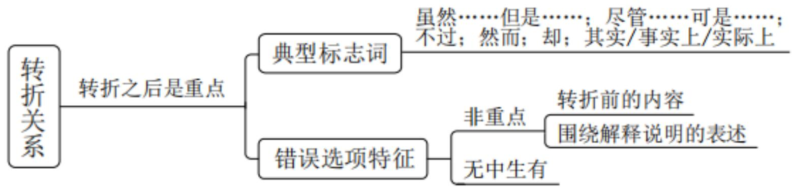

【注意】转折关系：转折之后是重点。

1. 典型标志词：虽然……但是……；尽管……可是……；不过；然而；却；其实/事实上/实际上。  
2. 做题不能只看一个转折词秒选，还要把握常考的结构。

(1) 引入+转折提出观点。  
(2) 引入+转折+解释说明。重点在中间的转折后。

(3) 引入+转折提出问题+给出回答/解决问题。不能只看问题本身，要把回答和解决问题综合把握。  
(4) 引入+转折+同时/也（并列）。并列需要全面概括。

# 3. 错误选项特征:

(1) 非重点: 转折前的内容; 围绕解释说明的表述。  
(2) 无中生有。

# 内容层面之主题词

定义：文段围绕的核心话题，文段要围绕其展开

判断方法:

(1) 中心句围绕的核心话题, 一般前有引入或后有解释说明

例1：（2022国考）客观而言，在脱贫攻坚战中，虽然一些地方探索出了农民入股合作社当股东分红的经营模式，但由于农民是个体分散入股，在合作社中也只是小股东，各类决策经营权都由合作社说了算，农民的主体地位和作用发挥不明显，积极性也不是很高。改变这种状况，需要集体经济组织出面，整合各类资源要素，比如各类“三农”资金、土地资源以及其他闲置资源等，以集体经济组织的名义加入到专业的合作社，从而增加农民的话语权和经营决策权，更有效地维护农民的利益。

例 2：（2024 国考）公共法律服务是全面依法治国的基础性、服务性和保障性工作，承担着为全民提供法律知识普及以及教育和法治文化活动等职能。随着经济社会发展，人们法律意识增强，服务需求增长，但公共法律服务体系建设中发展不平衡、设施不完善的短板日益凸显，一些地区尚存在法律服务资源紧张、人才经费保障不足、公众知晓率低等问题。因此，建设法治社会，亟待加快建设覆盖城乡、便捷高效、均等普惠的现代公共法律服务体系，提升法律服务的社会公信力，让人民群众共享公共法律服务成果。

# (2) 每句话都围绕的相同话题

例：小时候，乡愁是一枚小小的邮票，我在这头，母亲在那头。

长大后，乡愁是一张窄窄的船票，我在这头，新娘在那头。

后来啊，乡愁是一方矮矮的坟墓，我在外头，母亲在里头。

而现在，乡愁是一湾浅浅的海峡，我在这头，大陆在那头。

理论要点: 正确答案需包含文段主题词

【注意】内容层面之主题词:

1. 定义: 文段围绕的核心话题, 文段要围绕其展开, 相当于文段的 “C 位”,是核心、中心。  
2. 判断方法:

(1) 如果文段有中心句, 中心句围绕的核心话题就是主题词, 一般前有引入或后有解释说明。

(1)2022 国考: 先找中心句, 再抓主题词, 首句为背景引入, 出现 “虽然”, “但” 表转折, “不明显” “不是很高” 提出问题, “这种状况” 指代前文, “需要” 引导做法, “比如” 引导例子, 依旧强调以集体经济组织的名义发挥作用, 文段中心句为 “需要……资源要素”, 主题词为 “集体经济组织”。  
(2)2024 国考: “但”表转折, 论述问题, “因此” 表总结, 解决问题, 给出措施, 强调建立现代公共法律服务体系, “提升法律服务的社会公信力, 让人民群众共享公共法律服务成果” 为作用、好处, 中心句是尾句, 抓主题词, 尾句的措施强调现代公共法律服务体系, 过去也有体系, 只是过去的体系有问题, “现代公共法律服务体系” 比较专业, 很规范, 正确选项应包含 “现代公共法律服务体系”, 缺少 “现代公共法律服务体系”的选项就跑题了。  
(2) 有的文段没有中心句, 如并列文段, 或文段结构不好判断, 找每句话都围绕的相同话题 (往往要有实质性含义)。如上述示例, 出自余光中《乡愁》,每句话都围绕 “乡愁” 进行论述, 高频出现, 有同学找的高频词是 “的” “头”,没有实际含义。  
3. 有的题目会用代词指代, 如 “有一个姑娘, 她有一些任性, 她还有一些嚣张”, 用 “她” 指代 “姑娘”。  
4. 理论要点: 正确答案需包含文段主题词。如果选项没有主题词, 就跑题了,果断排除。

【例 1】（2024 山东）云锦、蜀锦和蜡染、扎染等古代织造印染技术，作为非物质文化遗产传承至今，并在科技助力下焕发新貌；今天的新材料、新技术、

新理念更是直接让国潮服饰有了新的可能。科技带来的新工艺不仅最大程度地优化传统工艺，还能创造出前所未有的产品。比如，电脑印花技术能在不同的面料上呈现逼真彩色图像，还能创造出立体效果，极大超越了传统丝网印花技术。又比如，将柔性电子屏技术和传统面料结合，让人们把电子艺术图案穿在身上，还有的设计注重运用环保技术，以推动国潮服饰可持续发展。

这段文字主要介绍了国潮服饰：

A. 创新发展离不开科技的支撑  
B. 体现出蓬勃盎然的时代气息  
C. 以彰显民族文化为设计理念  
D. 融汇了传统要素和当代元素

【解析】1. 问“主要介绍”，为中心理解题，给出话题“国潮服饰”。首句强调科技的作用，“科技带来的……产品”依旧强调科技的作用，接着出现“比如”，其后为例子，后文出现“又比如”，依旧是例子，例子非重点，略读。文段中心在前文，把握核心话题，强调科技的作用，锁定A项。

B、C、D 项：未提及 “科技”, 跑题了, 均排除。【选 A】

【注意】主题词：科技。

【粉笔拓展】中心理解题的变形问法

这段文字出自一个展览的前言，这个展览的主题最可能是：

如果这是一篇论文的摘要，那么这篇论文的标题最有可能是：

【注意】中心理解题的变形问法：以下两种问法当作中心理解题做即可。

1. 如例 2, 问“这段文字出自一个展览的前言, 这个展览的主题最可能是”,展览的前言的作用通常是概括展览的内容, 主题一致, 为中心理解题的变形。  
2. 如果这是一篇论文的摘要，那么这篇论文的标题最有可能是。摘要的作用是概括论文的内容，起简要概括的作用，摘要的话题要与论文的标题要保持一致。

【例 2】（2023 辽宁）晋侯鸟尊是中国历史文化的经典名片，它的尾巴为什么是个象鼻？是做什么用的？主人是谁？在今天还有什么价值？现在，我们开展

一场跨越时空的展览。此次展览分为四个单元：第一单元“一梦三千年”讲述了在地下沉睡3000年的晋侯鸟尊被发现、发掘到修复完整的故事；第二单元“故国梦重归”用类似破案的方式，展示考古学家根据出土文物和痕迹，结合文献资料一步步推理出晋侯鸟尊的主人是第一代晋侯燮父；第三单元“百鸟共朝凤”主要探讨鸟尊的功能、造型以及鸟型文物的文化内涵；第四单元“引吭歌新曲”讲述文博部门围绕晋侯鸟尊所开展的教育、文创、研究等工作。

这段文字出自一个展览的前言，这个展览的主题最可能是：

A. 且听凤鸣——鸟尊的前世今生  
B. 追根溯源——跨越时空的对话  
C. 守护经典——文化基因的传承  
D. 革故鼎新——鸟尊的文创开发

【解析】2. 问“这段文字出自一个展览的前言, 这个展览的主题最可能是”。前文提出几个问题, 后文出现 “: ” , 具体展开, 概括展览的内容, 抓话题, 正确答案应提到 “鸟尊”。

B、C 项：未提及主题词“鸟尊”，跑题了，均排除。

对比 A、D 项：A 项 “前世今生” 说明既有前世，又有今生，既有过去，又有现在，可起概括的作用，“一梦三千年” “故国梦重归” 是过去的情况，“百鸟共朝凤” “引吭歌新曲” 是现在的情况；D 项只提及 “文创”，仅对应第四单元中的一个方面，还有教育、研究等工作，是片面中的片面，锁定 A 项。【选 A】

【注意】主题词：鸟尊。文段开篇引出“晋侯鸟尊”，后文把“跨越时空的展览”分成四个单元，都围绕“鸟尊”进行论述。B项表述过于宽泛，不知道展览的对象是什么。

【例3】（2024贵州）开发前沿技术应用场景的实践价值在于，通过将前沿技术落地转化为生产力。高技能人才的可贵之处不在于突破核心技术，而在于为产业痛点、难点问题找到核心技术的最佳实践运用场景。例如，将智能技术引入水、电、煤等公用事业领域，但不同行业在应用场景选择上存在差异，电力企业重点推进智能电网建设，燃气行业的建设重点是智能表具系统……这些前沿技术

的应用场景不是原始创新，而是技术的跨界融合，需要一线技术人员基于行业特点寻找适合的前沿技术实现赋能和融合。

最适合做这段文字标题的是:

A. 智能技术的开发与利用具有行业选择性  
B. 技术落地的基础——突破创新，跨界融合  
C. 找准问题——开发前沿技术应用场景的核心  
D. 高技能人才——前沿技术应用落地的“嫁接者”

【解析】3. 问“标题”，为中心理解题的变形，读文段，找重点。首句论述开发前沿技术要把技术进行落地转化，接着论述谁能把技术进行落地转化、实践运用，突出高技能人才的作用，后文“例如”为举例子，尾句通过指代词进行概括，出现“需要”，如成功上岸需要认真听课、刷题总结，重点在“需要”之后，强调一线技术人员的作用，一线技术人员就是高技能人才。

文段强调的核心话题是“高技能人才”，把握主题词，锁定D项，“嫁接者”带有双引号，表述形象，正是高技能人才把前沿技术应用落地。

A 项：对应“例如”之后，例子非重点，排除。  
B 项：落脚点是“突破创新，跨界融合”，“需要”之前是要实现的目标，之后为对策、做法，强调一线技术人员/高技能人才的重要性，“跨界融合”本身不重要，靠高技能人才实现跨界融合，排除。  
C 项：未提及“高技能人才”，排除。【选 D】

# 【注意】

1. 主题词：高技能人才。中心理解题可抓核心话题快速解题，主题词是“高技能人才”，A、B、C项均未提及“高技能人才”，跑题了，锁定D项。  
2. 在考场上纠结前两句话谁更重要时，“比如”为举例子，可以借助例子判断，例子的作用是论证观点/解释说明，强调高技能人才的作用，尾句出现“需要”，“一线技术人员”对应“高技能人才”，首句不是重点，D项提到了技术落地的话题，B、D项的区别在于D项更突出高技能人才的价值，“例如”之后强调高技能人才，锁定D项。

# 【粉笔提示】

中心句纠结时，可借助解释说明判断。解释说明论证谁，谁就是重点。

例：（2020 四川）或许是深受农业文明影响的缘故，中国古典艺术始终缠绕着一种对花草植物的敏感。林徽因说：“惜花、解花太东方，亲昵自然，含着人性的细致是东方传统的情绪。”我们都会背：“蒹葭苍苍，白露为霜。所谓伊人，在水一方。”但未必所有人都知道，所谓“蒹葭”，就是我们熟悉的芦苇。《诗经》里的世界，其实并不遥远。“参差荇菜”“南有乔木”“桃之夭夭”“彼黍离离”，这先秦时代的民歌，几乎首首离不开植物，一风一雨、一椽一稽，遍布着草木的声息，以至于《诗经》里的植物花卉，也成为一门学问，吸引一代代的学人研究考证。

A. 中国古典艺术深受农业文明的影响  
B. 花草植物是中国古典艺术的重要元素

# 【注意】粉笔提示:

1. 中心句纠结时，可借助解释说明判断。解释说明论证谁，谁就是重点，很适合考场解题。  
2. 例：后文为例子，中心在首句，有同学根据“深受农业文明影响”想选A项，根据“中国古典艺术始终缠绕着一种对花草植物的敏感”想选B项，如果单纯看中心句纠结，可以借助解释说明判断，后文的例子强调“花草植物”很重要，锁定B项。

【例 4】（2023 四川）黄色与红色一样，是中华民族偏爱的颜色。在与“五行说”相对应的“五色论”里，黄色代表土，居于四方的中央。东汉的儒家为了抬高君权，突出了“五行”和“五方”中“土居中央”的观点，把土说成是一切元素的根本，因此中央是至高无上的，这也极大地提高了黄色的地位。三国时期的魏文帝曹丕也接受了这一说法，把黄色定为正色之首，随后的隋、唐王朝都加以效仿。从唐代起，正黄色成为皇室的专用色，滥用即会获罪。时隔千年，虽然黄色早已进入寻常百姓家，但金黄色那高贵庄严的气质依然存在。

对这段文字概括最恰当的一项是:

A. 分析中华民族偏爱黄色的原因

B. 追溯土居中央观念的形成历史  
C. 探讨颜色与五行观念的内在渊源  
D. 强调皇权观念对色彩文化的影响

【解析】4. 中心句不好把握，在考场上可以抓主题词快速解题。首句引出黄色被中华民族偏爱，后文依旧论述黄色。文段从头到尾都围绕“黄色”进行论述，锁定A项。

B 项 “土居中央观念” 对应 “突出了……的观点”; C 项 “五行观念” 对应 “在与 ‘五行说’……里”, 只能对应一个分句, 不能概括从三国到现在的内容, 缺少核心话题 “黄色”, 均排除。  
D 项: “色彩” 包括赤、橙、黄、绿、青、蓝、紫, 范围扩大, 且文段只是强调 “黄色”, 未提及 “色彩文化”, 排除。【选 A】

# 【注意】

1. 主题词：黄色。  
2. 首句论述中华民族偏爱黄色，后文按照时间顺序展开论述、解释说明，论述为什么中华民族偏爱黄色。

【例5】（2023国考）目前，我国“三农”工作重心已历史性转向全面推进乡村振兴。其中，保障粮食和重要农副产品有效供给是重中之重。大力发展农业保险，有助于应对农业领域的重大风险挑战，提升粮食和重要农产品供给保障能力，为乡村全面振兴保驾护航。通过发展农业保险对农业进行支持保护是国际惯例，也是许多国家农业支持保护政策的支柱。大力发展和运用农业保险工具，既是促进我国农业支持政策向国际看齐、更好适应世界贸易组织规则的现实选择，也是保障我国农业产业稳定发展、维护粮食安全、保护农民利益的长远需要。

这段文字意在说明:

A. 乡村振兴需要健全的农业支持保护政策  
B. 农业保险有助于 “三农” 工作顺利推进  
C. 农业政策既要立足国内也要有国际视野  
D. 发展农业保险是保障粮食安全的必选项

【解析】5. 课堂正确率为  $65\%$  。中心句不好找，抓话题。首句出现“目前”，为背景引入，后文围绕“农业保险”进行论述。

A、C项：未提及“农业保险”，跑题了，均排除。

对比B、D项：均提及“农业保险”，对比选项找不同，“三农”包括农业、农村、农民，D项只提及“保障粮食安全”，后文“保障我国农业产业稳定发展、维护粮食安全、保护农民利益”还提到了农业、农民，D项表述片面，格局小了，且文段也未提及“必选项”，只是强调发展农业保险可以有助于三农工作的开展，锁定B项。【选B】

# 【注意】

1. 主题词：农业保险。  
2. 解题技巧：对比选项找不同。  
3. 首句论述“我国‘三农’工作重心已历史性转向全面推进乡村振兴”，“全面推进乡村振兴”也属于“三农”工作，是“三农”工作的任务之一，后文都围绕“三农”工作展开论述。

【例 6】（2024 江苏）当古籍遇上高科技，人们可以从一个特别的角度触摸到中华优秀传统文化细腻的肌理。文明与技艺相生相伴，中国古代的印刷术对书籍制作和知识传播产生了深远的影响，深刻改变了世界文明发展的进程。当我们通过 VR 技术沉浸式体验古人制作书籍的过程时，当我们借助数字博物馆点开一本古籍时，源远流长的传统文化不仅是可知的，更是可感的。随着科技的发展，传统文化传播的方式也获得了新拓展。

这段文字意在说明:

A. 技术推动了文明的发展与知识传播  
B. 高科技正在改变人们对古籍的认识  
C. 借助科技手段能更好传播传统文化  
D. 应以高科技守护中华优秀传统文化

【解析】6. 问“意在说明”。首句强调科技的作用，换一个角度可以感受、触摸到传统文化。后文“印刷术”是科技的例子，相当于省略了“比如/例如”，

“VR 技术” “数字博物馆” 依旧为例子, 非重点, 尾句依旧强调科技对传统文化传播的作用。中间为例子, 非重点, 把握主题词 “科技” “传统文化”, 锁定 C 项。

A 项：对应第二句话，“印刷术”为例子，非重点，首句强调高科技对传统文化的作用，尾句强调科技对传统文化传播的作用，选项偏离重点，排除。  
B 项: “古籍”和“传统文化”相比范围缩小、片面, 且以前没有科技手段,传播效果有限, 现在有了科技手段, 让传播效果更好, 选项 “改变……认识” 与文段不匹配，排除。  
D 项：论述 “守护”, 但文段强调 “传播”, 排除。【选 C】

【注意】主题词：科技+传统文化。

【例7】（2023广东）烈士纪念设施是讲好英雄烈士故事的重要平台，要在建设好、管理好烈士纪念设施的基础上，将其教育作用发挥好，创新手段发挥其红色教育主阵地功能。比如，在烈士纪念设施的展板和展柜上设置二维码，参观者可以扫码收听烈士事迹及相关介绍；开设烈士纪念设施VR虚拟现实展厅，让网络祭扫者全方位参观烈士纪念设施；等等。

本段文字主要讲的是:

A. 如何讲好英雄烈士的红色故事  
B. 如何保护和管理好烈士纪念设施  
C. 如何强化烈士纪念设施的教育作用  
D. 如何利用科技手段加强烈士纪念设施建设

【解析】7. 问“主要讲的是”，读文段，找重点。首句引出“烈士纪念设施”的话题，强调发挥其教育功能，后文出现“比如”“；”，为例子，非重点。文段重点是首句，抓主题词快速解题，文段强调两个话题，即“烈士纪念设施”“教育作用/功能”，锁定C项。

A 项: 未提及 “烈士纪念设施”, 跑题了, 排除。  
B 项: 首句的重点是发挥烈士纪念设施的教育作用, 不是单纯 “保护和管理”,排除。

D 项: “比如”之后为例子, 且缺少核心话题 “教育”, 跑题了, 文段强调发挥烈士纪念设施的教育作用, 排除。【选 C】

# 【注意】

1. 主题词：烈士纪念设施+教育。  
2. 如果中心句明确（话题、内容），后文的例子、解释说明不重要；如果单纯看中心句不好判断，或纠结，觉得两个选项都行，借助解释说明判断，解释说明论证谁，谁就是重点。

【例 8】（2023 北京）放射状胶质是一种细长柱状的细胞，有两个从细胞核上下延伸的突起，具有顶端和基底的细胞极性。多个放射状神经胶质附着在每个细胞顶端，形成类似上皮细胞的片状结构。这种片状结构是大脑发育的基本结构。在大脑发育时，放射状胶质通过对称分裂的自我复制来增加数量，然后通过非对称分裂形成放射状神经胶质和分化细胞。非对称分裂中，首先会产生各种各样的神经细胞，之后会产生辅佐神经细胞工作的胶质细胞，最终形成复杂的大脑。

这段文字主要讲的是:

A. 动物大脑发育形成的基本阶段  
B. 动物大脑中不同神经细胞的分工  
C. 放射状胶质的基本结构和进化特点  
D. 放射状胶质在大脑形成过程中的作用

【解析】8. 问“主要讲的是”。文段专业、晦涩，抓主题词快速解题。首句引出“放射状胶质”的话题，建构其与大脑的关系，后文依然强调“放射状胶质”与“大脑”的关系。文段的核心话题有两个，即“放射状胶质”“大脑”，锁定D项。

A、B 项：只提及 “大脑”, 表述片面, 且文段没有论述 “动物”, 均排除。  
C 项: 只提及 “放射状胶质”, 未提及 “大脑”, 且文段论述 “这种片状结构是大脑发育的基本结构”, 选项偷换话题, 排除。【选 D】

【注意】主题词：放射状胶质+大脑。

【例9】（2022山西）制造与服务融合是智能制造的重要内容之一，服务要素渗透到制造各个环节中形成了生产性服务与制造服务化。本文从工业互联网的商业视角、使用视角、功能视角、实现视角建立了制造与服务融合中虚拟逻辑与实体活动交互的技术体系，有针对性地提出了生态位驱动、供应链驱动、大数据驱动、物联网驱动的制造与服务融合方法。本文构建的制造与服务融合技术体系，深化了工业互联网在制造业与服务业中的应用，为数字经济中制造服务产业的技术创新奠定了基础。

如果这是一篇论文的摘要，那么这篇论文的标题最有可能是：

A. 数字经济中制造与服务融合的协同机制  
B. 四轮驱动下的制造与服务融合技术体系  
C. 工业互联网在智能制造中的体系化应用  
D. 基于工业互联网的制造与服务融合技术

【解析】9. 课堂正确率为  $68\%$  。问 “如果这是一篇论文的摘要, 那么这篇论文的标题最有可能是”, 提问方式比较特殊, 为中心理解题的变形。首句引出 “制造与服务融合” 的话题, 论述其是重要内容, 贯穿各个环节, 接着出现 “本文”,即这篇论文, 重点往后看, 后文要体现特别之处, 这篇论文的特别之处是从工业互联网的视角建立技术体系。尾句 “深化了……奠定了基础” 论述这个技术体系带来的作用、价值。

文段共三句话，重点是第二句话，体现了这篇论文的特别之处，抓话题，从工业互联网的视角构建制造与服务融合的技术体系,锁定D项,包含两个主题词。

A项：对应尾句“为数字经济……基础”，论述带来的作用、价值，缺少核心话题“工业互联网”，排除。  
C 项：只提及“工业互联网”，缺少“制造与服务融合技术”，表述片面，排除。  
B 项: “四轮驱动”对应“有针对性……制造与服务融合方法”, 文段论述从工业互联网的多视角建立制造与服务融合的技术体系, 针对性地提出四轮驱动的融合方法, 选项主体错误, 排除。【选 D】

# 【注意】

1. 主题词：工业互联网+制造与服务融合技术。  
2. 写论文通常会站在特别的视角, 如果和别人的视角一样, 就没有必要写了。本文段第二句话论述 “本文”, “工业互联网” 是特别的视角, D 项提及 “基于工业互联网”, 构建制造与服务融合的技术, 锁定 D 项。

【粉笔拓展】文段选项结合看，选项设计有提示

(2023 北京)

A. 动物大脑发育形成的基本阶段  
B. 动物大脑中不同神经细胞的分工  
C. 放射状胶质的基本结构和进化特点  
D. 放射状胶质在大脑形成过程中的作用

(2023 浙江)

A. PAM 识别序列的特点和作用  
B.Cas9 基因编辑方法的特殊性  
C.Cas9对水稻基因组编辑的重要性  
D.PAM识别序列对Cas9基因组编辑时的影响

(2022 山西)

A. 数字经济中制造与服务融合的协同机制  
B. 四轮驱动下的制造与服务融合技术体系  
C. 工业互联网在智能制造中的体系化应用  
D.基于工业互联网的制造与服务融合技术

【注意】粉笔拓展：文段选项结合看，选项设计有提示。不是完全不看文段，选项设置可以给出提示，再看文段会更有指向性。

1. 2023 北京：A、B 项只提及“大脑”，C 项只提及“放射状胶质”，D 项提及“大脑”“放射状胶质”，在话题上更全面，不是秒杀 D 项，秒杀不靠谱，通过选项设置给出提示，文段的话题很可能是两个，进行验证，如果文段恰好围绕二者的关系进行论述，选择 D 项。

2. 2022 山西：A、B 项只提及“制造与服务融合”，C 项只提及“工业互联”

网”，D项提及“制造与服务融合技术”“工业互联网”，D项话题更全面，给出提示，文段很有可能围绕这两个话题进行论述，带着这个倾向阅读，很容易注意到第二句从工业互联网的视角进行论述，后文又提到深化工业互联网的应用，锁定D项。  
3. 2023 浙江：A 项只提及 “PAM”, B、C 项只提及 “Cas9”, D 项提及 “Cas9” “PAM”, D 项话题更全面, 如果文段围绕二者的关系进行论述, 选择 D 项。

【例 10】（2024 国考）大模型赋能，生成式人工智能正在引发新一轮智能化浪潮。得益于拥有庞大的数据、参数以及较好的学习能力，大模型增强了人工智能的通用性。从与人顺畅聊天到写合同、剧本，从检测程序安全漏洞到辅助创作游戏甚至电影，生成式人工智能本领加速进化。随着技术迭代，更高效、更“聪明”的大模型将渗透到越来越多的领域，有望成为人工智能技术及应用的新基座，变成人们生产生活的基础性工具，进而带来经济社会发展和产业的深刻变革。人工智能大模型强大的创新潜能，使其成为全球竞争的焦点之一。

这段文字意在说明：

A. 人工智能在大模型赋能下正在快速发展  
B. 加快发展新一代人工智能势在必行  
C. 生成式人工智能的创新潜能亟待挖掘  
D. 生成式人工智能已成为全球研究的焦点

【解析】10. 问“意在说明”。国考文段会选择非常热门的话题，现在人工智能的话题特别热门。选项均提及“人工智能”，无需纠结，看除了“人工智能”之外，文段还强调了哪个话题。

首句引出“大模型赋能”，提及“大模型赋能”的作用，接着强调“大模型”对人工智能的作用，后文出现“从……到……，从……到……”，相当于举例子，举了不同领域，通过举例子论述大模型让人工智能的通用性变强了，适用于多个领域。“随着……深刻变革”依旧强调“大模型”的作用，尾句还在论述“大模型”的作用。文段从头到尾都在强调“大模型”的作用，锁定A项。

B 项：表述不明确，没有提及“大模型”，跑题了，排除。  
C、D 项：均论述 “生成式人工智能”, “大模型增强了人工智能的通用性”

说明“生成式人工智能”与“大模型”不能直接画等号，选项未提及大模型赋能的作用，且C项“创新潜能”、D项“全球研究的焦点”均对应尾句，尾句“其”指人工智能大模型，落脚点是“大模型”，选项偷换话题，排除。【选A】

【注意】主题词：人工智能+大模型。

【难度提升】主题词变形——内容同义替换

例 1: (2023 事业单位联考)一个多世纪以来,伴随着考古发掘和文物出土,出土文献成为学术研究的基本史料, 渐有与传世文献分庭抗礼之势, 成为另一重要研究方向, 然而, 面对数量巨大, 不断增长的石刻资料, 全面准确地掌握相关信息, 查阅历代著录及相关研究成果, 成为学界推进研究, 公众提高认知的一大阻碍。因此, 内容完整、使用便利、实时更新的石刻目录, 成为文史领域研究者和爱好者的迫切需要, 石刻资料数字化, 使得这些需求的满足成为可能。

B. 石刻数据库是适应时代需求的成果  
D. 历代存留下来的石刻资源亟需整理

【粉笔提示】石刻资源数字化——石刻数据库

【注意】主题词变形：如果难度提升，可能会在内容上对主题词进行同义替换。如 2023 事业单位联考，找重点，首句“一个多世纪以来”为背景引入，接着“然而”表转折，“阻碍”为问题，尾句提供解决的措施，强调通过石刻资料数字化解决“阻碍”问题，B、D 项均没有明确提到“石刻资料数字化”，正确答案在内容上进行了同义替换，B 项“数据库”即“数字化”，为同义替换，而 D 项“整理”与文段不匹配，锁定 B 项。

【难度提升】主题词变形——形象表达加工

例 2：（2024 联考）伴随着城市化快速发展的步伐，今天的少年儿童与乡土田园渐行渐远。如何开展既符合时代特色又“接地气”的耕读教育？这道“考题”，考验的是学校与教师勇于创新的意识、因地制宜的本领。很多学校意识到：“耕”离不开土地和自然，“读”重在学习广博有趣的各类知识、涵养自强不息的人格品德、树立报效国家的崇高志气。于是，越来越多的学生被老师们带到原野田间，

越来越多的课堂开设在了大自然里。学生们饶有兴致地学习农耕知识、活泼健朗地舒展心胸情怀，耕读教育的真正意义由此得以实现。

A. 耕读为本，计之久远  
D. 在 “土味” 课堂实现耕读教育的价值

【粉笔提示】乡土/大自然——“土味”课堂

【注意】主题词变形：形象表达加工（用比喻、拟人的手法让选项看起来很形象）。如2024联考，首句为背景引入，接着提出问题，“于是”表总结，后文给出回答，最后的总结围绕“耕读教育”进行论述，A项未提及“教育”“‘土味’课堂（大自然）”，文段强调去乡土、大自然中实现耕读教育的价值，D项没有明确提到“大自然”，“‘土味’课堂”形象指代“大自然”，选择D项。

# 【主题词思维导图】

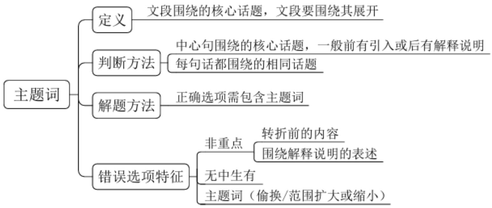

【粉笔提示】一个主题词找准，两个主题词找全。

# 【注意】主题词:

1. 定义：文段围绕的核心话题，是解题的“金钥匙”。  
2. 判断方法:

(1) 文段有中心句, 把握中心句围绕的核心话题。  
(2) 文段没有中心句, 把握高频出现的相同话题。

3. 一个主题词找准，两个主题词找全。如果难度提升，可能会在内容上进行同义替换，或在形式上进行形象表达的加工，要能识别。  
4. 解题方法: 正确选项需包含主题词。  
5. 错误选项特征：主题词（偷换/范围扩大或缩小）。

【随堂练习】（2023国考）在市场经济时期，劳动密集型制造工厂普遍采用流水线技术，工人被高度“去技能化”，几乎不需要技能便可完成装配操作，企业没有需求也没有动力去培养中高级技术工人。但是，当一个国家的产业结构向中高端迈进时，高水平职业教育的支撑作用就会显现出来。技术进步与人力资本相互影响、相互促进：企业引进的高端生产线，需要技术工人去操作和维护，否则技术改造和升级就无法实现；如果没有配套的职业技能培训体系，企业的转型升级就难以达到预期效果。

这段文字意在说明:

A. 产业结构转型升级需要职业教育的支撑  
B. 技术进步对人力资本提出了更高要求  
C. “技工荒”会随产业结构升级更趋严重  
D. 职业技能培训需求与经济增长有相关性

【解析】拓展。课堂正确率为  $73 \%$  。问“意在说明”，读文段，找重点。首句“在……时期”为背景引入，接着“但是”表转折，前文不重要，往后看，转折之后强调高水平职业教育对产业结构带来的作用，后文“：”表解释说明，出现“；”，从反面的角度进行论述，依旧强调产业结构的转型升级需要职业教育，后文为解释说明。文段重点在中间，即转折之后，抓主题词“职业教育”“产业结构”快速解题，锁定A项。

B 项: “相互影响、相互促进”是双向的, 而选项只是单向的, 表述片面,且未提及职业教育的作用, 跑题了, 不明确, 排除。  
C 项: “技工荒”对应转折之前的问题, 非重点, 排除。  
D 项：做题要忠于文段，中心句强调对产业结构的优化升级（改造升级、转型升级），选项“经济增长”无中生有，排除。【选 A】

【注意】结构梳理：引入+转折提出观点（但……）+解释说明。

【答案汇总】

转折关系 1-5: AACDA; 6-8: DDB

主题词 1-5: AADAB; 6-10: CCDDA

遇见不一样的自己

Be your better self