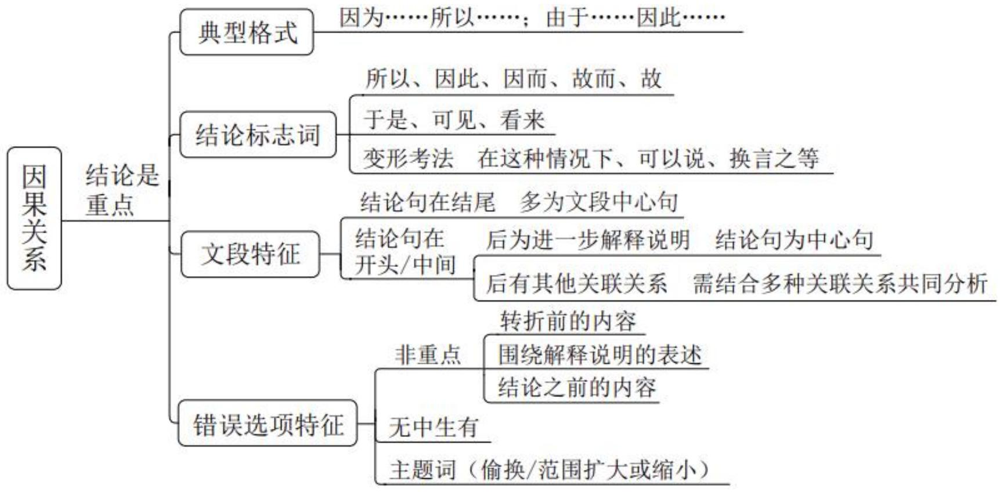
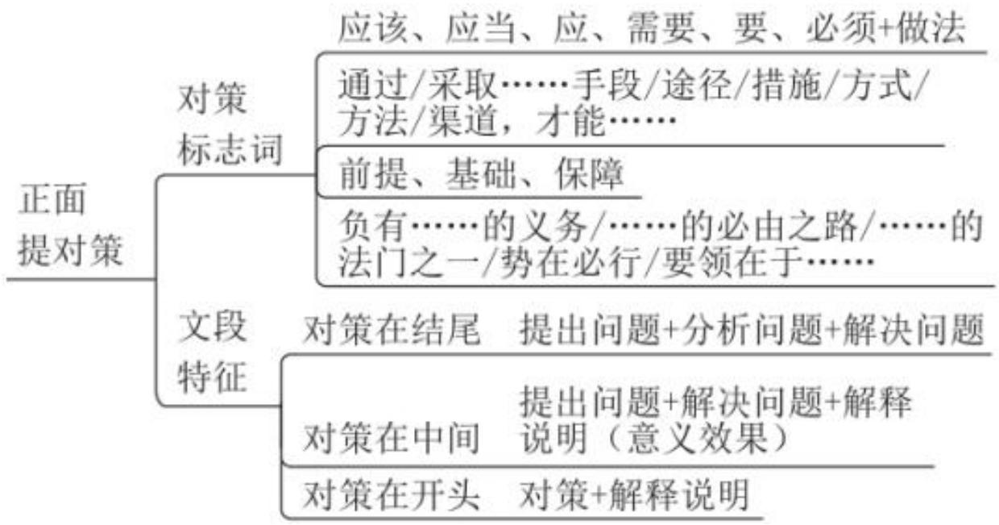

# 精讲精练一言语2（笔记）

【中心理解题】解题思路：找重点（中心）

1. 直接确定重点-逻辑层面之关联词

- 内容层面之主题词

2. 间接确定重点-排除非重点

【注意】回顾中心理解题的解题思路：找重点（中心）。

1. 直接确定重点：逻辑层面之关联词（转折）；内容层面之主题词（文段围绕的核心话题）。  
2. 间接确定重点: 不好直接确定重点, 排除非重点。如文段开篇为背景引入,接着是举例子/原因解释，均不重要，排除掉，剩下的句子就是中心句。

第二次课学习重点内容:

(1)因果关联词及重点位置  
(2)必要条件关联词及重点位置  
(3)正面提对策标志词及文段特征

2. 因果关系:

典型格式: 因为……所以……

由于……因此……

理论要点：结论是重点

【注意】因果关系：

1. 典型格式：因为……所以……、由于……因此……  
2. 理论要点：结论是重点，相当于作者提出的观点。

引导结论的标志词：

1. 所以、因此、因而、故而、故  
2. 于是、可见、看来

变形考法:

在这种情况下、对此、有鉴于此

总之、可以说、简而言之、换言之、换句话说等

【注意】引导结论的标志词:

1. 所以、因此、因而、故而、故。  
2. 于是、可见、看来。  
3. 变形考法：出现在文段的最后，表示总结前文。

(1) 在这种情况下、对此、有鉴于此。  
(2) 总之、总而言之、言而总之、综上所述、可以说、简而言之、换言之、换句话说等。

# 【粉笔提示】：

若尾句出现结论词，大部分情况下是对前文的总结，尾句通常为文段的中心句。

【注意】若尾句出现结论词（如因此、可以说），大部分情况下是对前文的总结，尾句通常为文段的中心句。

【例 1】（2023 北京）构建和完善了中国特色社会主义法律体系之后，执行实施和适用法律规范的人员就是决定因素。如何将“死”的法律制度规定变成“活”的法治社会治理效果，努力让人民群众在每一项执法决定中感受到公平正义，这就对法治队伍建设和执法人员的复合型治理能力提出了很高的要求，因而也就要系统性、渐进性地抓好法治工作人员的现代化治理能力培养。

这段文字意在强调:

A. 中国特色社会主义法治理论取得的创新  
B. 加强社会主义法治队伍能力建设的意义  
C. 实现法律效果与社会效果走向统一的目标  
D. 以人民为中心是中国式法治现代化的根本

【解析】1. 问“意在强调”，为中心理解题。首句论述人很重要。“如何”提出问题，“因而”出现在尾句，进行总结，“要”给出措施，强调法治工作人员。

A、C 项：未提及 “法治工作人员”, 偏离文段重点, 均排除。  
B 项: “法治队伍”即法治工作人员, 符合文意, 当选。  
D 项: “人民” 是受众, 是服务的对象, 文段的 “人” 强调工作人员、执法人员, 选项话题错误, 排除。【选 B】

【注意】结构梳理：话题引入+展开分析+尾句得出结论（因而……）。

【例2】（2024辽宁）随着近些年来我国无障碍环境建设的绵绵用力和持续推进，无障碍环境建设取得了可喜的成就，极大地优化了相关群体的出行体验和尊严感。但毋庸讳言，关于无障碍设施，不少人还停留在铺设盲道并确保不被占用、公共场所指示牌标注盲文、地铁站出入口安装升降机等日常的物理设施层面，在管理的精细化方面还有进一步提升的空间。因此，有关主体不妨拓宽并畅通相关渠道，让最主要的使用者参与到相关的建设和管理中来，这些“首席体验官”带来的第一视角和经验，有助于减少过往建设盲区和误区，更有效提升无障碍设施的友好度。

对这段文字主旨概括最准确的一项是:

A. 无障碍设施的软环境建设有待进一步加强  
B. 无障碍环境设计应以契合使用需求为导向  
C. 优化无障碍环境要倾听设施使用者的声音  
D. 试用体验是无障碍设施效果检验必要环节

【解析】2. 问“主旨概括”，为中心理解题。首句“随着近些年”为背景，引出话题“无障碍环境建设”，论述好的方面。“但”表转折，转折后论述问题。“因此”进行总结，重点看，“这些‘首席体验官’”指的是使用者，最后论述作用。尾句得出的结论是重点，强调要让使用者参与进来，对应C项。

A 项：未提及“使用者”，排除。  
B 项: “契合使用需求” 不等于让使用者主动参与进来, 且表述不明确, 文段强调优化无障碍环境, 排除。  
D 项: “检验必要环节”无法对应文段, 排除。【选 C】

# 【注意】

1. 结构梳理：背景引入+提出问题+尾句得出结论（因此……）。  
2. 本题涉及无障碍环境/措施，有脱口秀演员（盲人）曾吐槽过，地铁楼梯扶手上有盲文，但是要摸到需要有很好的视力，针对性不够强，地铁里也有盲道，平行于屏蔽门从头铺到位，盲人沿着盲道走无法进地铁门，故要倾听设施使用者的声音。本题很有现实意义。

【例 3】（2024 四川）对文字信息被对方立即回复的期待，移植于面对面交谈里彼此及时回应的规则。但将现实规则转换到线上双方并不容易。交流不仅需要信息，还需要双方的面部表情、肢体语言、用词停顿、语音语调等等，这些现实里的“语境”是文字信息难以传达的。这时候，作为为数不多的语境——每条信息的间隔——就显得意味深长，特别是当我们认为对方有能力支配回复时机时。

这段文字意在说明:

A. 面对面交流中的“语境”难以移植到文字交流中  
B. 文字交流中每条信息的间隔对信息交流影响较大  
C. 交流时的肢体语言表达比文字的信息更重要  
D. 文字信息交流的 “语境” 是每条信息的间隔

【解析】3. 问“意在说明”，为中心理解题。首句进行引入。“但”表转折，提出问题。尾句“这时候”总结前文，给出对策，强调“每条信息的间隔”。故文段重点为尾句，正确答案应包含“每条信息的间隔”。

A 项：为问题表述，非重点，且未提及“每条信息的间隔”，排除。  
C 项: “肢体语言”对应尾句之前的非重点, 且未提及 “每条信息的间隔”,排除。  
B 项: 强调 “每条信息的间隔” 很重要, 当选。  
D 项: “是”为下定义, 文段强调的是很重要, 选项偏离文段重点, 且文段论述 “为数不多的语境”, 不能说就是, 如榴莲作为为数不多的难闻的水果, 不能说难闻的水果就是榴莲, 选项表述有误, 排除。【选 B】

# 【注意】

1. 结构梳理：引入+提出问题+尾句得出结论（这时候……）。  
2. 结合现实, 你给心仪的人发一条信息, 对方立即回复、隔一分钟回复、隔五分钟回复、隔三天回复、隔五天回复传达的含义一定是不一样的。

感冒是一种常见的疾病。

但是快速治疗感冒并不容易。

这时候，作为治疗的前提——确定感冒类型——就显得尤为重要，特别是当这种感冒我们有能力治疗时。

对文字信息被对方立即回复的期待，移植于面对面交谈里彼此及时回应的规则。

但将现实规则转换到线上双方并不容易。交流不仅需要信息，还需要双方的面部表情、肢体语言、用词停顿、语音语调等等，这些现实里的“语境”是文字信息难以传达的。

这时候，作为为数不多的语境——每条信息的间隔——就显得意味深长，特别是当我们认为对方有能力支配回复时机时。

# 【注意】

1. 例 1, 首句引出话题 “感冒”。“但是” 表转折, 引出问题。指代词 “这”出现在尾句, 起到指代前文进行总结的作用, 给出解决问题的对策, 故 “确定感冒类型” 为重点。  
2. 例 2, 首句进行引入。“但”表转折, 提出问题。尾句 “这时候” 总结前文, 给出对策, 强调 “每条信息的间隔”。故文段重点为尾句。

【例 4】（2025 国考）习近平新时代中国特色社会主义思想植根于新时代中国特色社会主义伟大事业的创造性实践，每一个理论成分背后都有着鲜活的实践支撑，比如蕴含“创新、协调、绿色、开放、共享”新发展理念的经济高质量发展案例、体现“党的领导、人民当家作主和依法治国有机统一”政治理念的现代治理案例、体现“绿水青山就是金山银山”的生态文明思想案例等。通过讲述这些蕴含中国观点、体现中国立场、彰显中国智慧、弘扬中国价值的生动故事，让国际社会更加深切地感知和理解习近平新时代中国特色社会主义思想的理论内

涵和实践逻辑。

这段文字意在强调:

A. 党的创新理论要在实践中检验和发展  
B. 讲好中国故事有助于提高国际话语权  
C. 要积极利用案例传播党的创新理论  
D. 理论宣传应该综合运用国内外资源

【解析】4. 问“意在说明”，为中心理解题。首句出现习中特的思想，我们要与总书记同频共振，论述习中特思想的理论背后有实践的支撑，“比如……案例等”为举例子，解释首句的观点。尾句“通过”引导做法、措施，强调要讲述这些生动的故事，“生动故事”即前文的案例事件，故尾句论述把党的理论通过讲故事的方式传播出去，话题发生变化，文段的重点在最后。选项将习中特思想同义替换为“党的创新理论”。  
B、D项：未提及“党的创新理论”，且D项“综合运用国内外资源”无中生有，均排除。

A 项: 未体现传播党的创新理论, 排除。  
C项：为中心句的同义替换，“案例传播”是一种传播方式，即讲述生动故事，当选。【选C】

【注意】结构梳理：引入+举例说明+尾句得出结论（通过讲述这些……）。

树立案例传播理念。所谓案例传播，就是讲故事。做好习近平新时代中国特色社会主义思想的对外传播工作，不能仅仅局限于纯粹理论输出。这一思想植根于新时代中国特色社会主义伟大事业的创造性实践，习近平总书记运用融通中外的新概念新范畴新表述对中国实践经验的理论概括和创新。习近平新时代中国特色社会主义思想的每一个理论成分背后都有着鲜活的实践支撑，都能找到生动的实践案例。在对外传播工作中一定要充分挖掘这些实践案例，比如蕴含“创新、协调、绿色、开放、共享”新发展理念的经济高质量发展案例、体现“党的领导、人民当家作主和依法治国有机统一”政治理念的现代治理案例、为全人类减贫事业作出重大贡献的摆脱贫困案例、体现“绿水青山就是金山银山”的生态文明思

想案例等，通过讲述这些蕴含中国观点体现中国立场、彰显中国智慧弘扬中国价值的生动故事让国际社会更加深切地感知和理解习近平新时代中国特色社会主义思想的理论内涵和实践逻辑。

——人民论坛网《做好党的创新理论对外传播》

【注意】为例 4 的原文。建议阅读真题的题源文章培养规范的语感。粉笔 APP 中文字解析的最后有文段出处。文段出现总书记，非常值得阅读。如果知道“所谓案例传播，就是讲故事”，例 4 就不会纠结 C 项。出题人将“在对外传播工作中一定要充分挖掘这些实践案例”删除，做题难度加大。故当尾句引导做法，话题发生转变，重点通常是在后边。

# 【知识链接】:

结论句出现在文段开头/中间，之后仍有其他语句

1. 之后的语句是进一步解释说明，此时中心句仍为结论句  
Eg. 公司福利待遇很好，所以我胖了。比如去年的衣服今年穿不上了。  
2. 之后又出现并列、因果、转折，需结合多种关联词共同分析  
Eg. 因为考试前一天晚上没有休息好，所以考试没有发挥好。但是，我上岸了~

【注意】结论句出现在文段开头/中间，之后仍有其他语句：结合整体的结构把握。

1. 之后的语句是进一步解释说明，此时中心句仍为结论句。例：公司福利待遇很好，所以我胖了。比如去年的衣服今年穿不上了。“所以”引导结论，“比如”为举例子，非重点，故重点为“我胖了”。  
2. 之后又出现并列、因果、转折，需结合多种关联词共同分析。例：因为考试前一天晚上没有休息好，所以考试没有发挥好。但是，我上岸了。“所以”给出结论，“但是”对前文进行转折，故文段强调“我上岸了”。

【例 5】（2025 国考）相比高校和科研机构，企业处于市场最前沿，对有市场潜力的技术感知更灵敏，对产业发展趋势的把握也更敏锐。因此，在颠覆性技术的研发、转移转化过程中，需要强化企业科技创新主体地位。在课题立项中，

要加快提升企业技术创新决策的主体地位，建立企业常态化参与国家科技创新决策的机制；在创新过程中，要着力强化企业科研组织的主体地位，支持领军企业聚焦国家重大需求，牵头组建创新联合体，加快形成企业主导的产学研深度融合。同时，人才、经费等创新要素也要加快向企业特别是科技领军企业集聚。

这段文字意在说明:

A. 应着力完善国家科技创新决策的体制机制  
B. 颠覆性技术创新需重视并发挥企业的作用  
C. 要大力推进颠覆性技术的研发及转移转化  
D. 创新要素的大量集聚有助于企业技术创新

【解析】5. 问“意在说明”，为中心理解题。首句引出话题“企业”。“因此”进行总结，“需要”引导做法，强调要强化企业科技创新主体地位。后文“；”“同时”表并列，通过并列结构进行解释。文段重点为“因此”之后，强调要强化企业科技创新主体地位，对应B项，“创新”可概括“研发、转移转化”，表述不片面，且没有比该项更好的选项。

A 项：未提及“企业”，排除。  
C项：未提及“企业”，且“需要”之后是重点，选项非重点，排除。  
D 项: “集聚”对应“同时”之后, 为并列结构的一方面, 表述片面且非重点, 排除。【选 B】

# 【注意】

1. 结构梳理：引入+得出结论（因此……）+解释说明（并列分述）。  
2. 同时引导并列关系，如我会上课，同时我还会喊麦，要全面概括。

【例 6】（2023 国考）生态修复请求分为生态修复的行为请求和费用请求，前者是为了防止生态环境权益损害的发生或扩大，请求责任人停止污染破坏行为；当被破坏的生态环境无法恢复时，请求责任人进行人工修复。如果责任人不具有修复能力或意愿，可请求责任人承担修复费用。因此，修复行为请求应作为首要诉求，在责任人不能或不愿进行修复时，才能提出修复费用请求。在司法实践中，很多公益诉讼人却往往将修复费用请求作为首要诉求，但由于诉求和判决的修复

费用数额不易确定，责任主体短期内难以承担修复费用，生态修复工作很难有效开展。

这段文字意在说明:

A. 应该制定生态修复费用的分级标准  
B. 修复费用请求往往很难得到有效落实  
C. 应根据责任人的能力确定生态修复诉求  
D. 生态修复诉讼应当首先提出修复行为请求

【解析】6. 问“意在说明”，为中心理解题。文段比较专业，“生态修复请求……承担修复费用”进行引入。“因此”进行总结，前文非重点，给出做法，即修复行为请求应作为首要诉求。尾句“很多公益诉讼人”为举例子，从反面举例子，论证应该把修复行为请求作为首要诉求。故中心句在“因此”之后的句子，强调修复行为请求应作为首要诉求，对应D项，提出修复行为请求是在生态修复诉讼中提出来的。

A、B 项：例子中的转折不重要，且非重点中的高频词不是主题词，另外未提及文段的主题词“行为请求”，均排除。  
C 项: “生态修复诉求”范围扩大/表述不明确, 排除。【选 D】

# 【注意】

1. 结构梳理：话题引入+得出结论（因此……）+解释说明。  
2. 误区点拨:

(1) 非重点中的关联词不重要。  
(2) 非重点中的高频词不是主题词。

3. 比较专业的文段，其实就是换了马甲，要把握结构。速度的提升是循序渐进的过程，把握重点词阅读文段，即看到“因此”说明前面不重要，“应”提出对策，后文“很多公益诉讼人”为举例子，不重要。

减肥方法分为节食和运动。节食是减少热量摄入；运动是增加热量消耗。

因此，运动应作为减肥的首要方法，运动无效时才能开始节食。

现实生活中很多人却将节食作为首要方法, 但是由于节食减肥容易反弹, 让

人很难减肥成功。

生态修复请求分为生态修复的行为请求和费用请求，前者是为了防止生态环境权益损害的发生或扩大，请求责任人停止污染破坏行为；当被破坏的生态环境无法恢复时，请求责任人进行人工修复。如果责任人不具有修复能力或意愿，可请求责任人承担修复费用。

因此，修复行为请求应作为首要诉求，在责任人不能或不愿进行修复时，才能提出修复费用请求。

在司法实践中，很多公益诉讼人却往往将修复费用请求作为首要诉求，但由于诉求和判决的修复费用数额不易确定，责任主体短期内难以承担修复费用，生态修复工作很难有效开展。

# 【注意】

1. 例 1, “因此”说明首句为引入, 结论给出做法, 尾句 “很多人” 为举例子, 举反例, 强调应把运动作为减肥的首要方法。  
2. 例 2, “生态修复请求……承担修复费用”进行引入。“因此”进行总结,前文非重点, 给出做法, 即修复行为请求应作为首要诉求。尾句“很多公益诉讼人”为举例子, 从反面举例子, 论证应该把修复行为请求作为首要诉求。

【例7】（2024国考）我国经济已由高速增长阶段转向高质量发展阶段，这是一个重要转变。一个时期以来，传统投资驱动的经济增长模式已经难以为继，同时经济全球化遭遇逆流，大进大出的环境条件已经变化，不可能单纯依靠出口实现经济发展质的提升。因此，必须根据我国经济发展实际情况，建立起扩大内需的有效制度，特别是要更好更充分释放消费潜力。消费作用的不断强化，能有效降低我们对出口和投资的依赖，有利于经济长远发展，促进经济内外平衡发展，实现提质增效。

这段文字意在说明:

A. 高质量的经济发展需重点平衡好质与量的关系  
B. 单纯依靠出口实现经济发展的模式亟待改变  
C. 释放消费潜力有利于推动经济高质量发展  
D. 优化扩大内需制度是经济长远发展的关键

【解析】7. 问“意在说明”，为中心理解题。文段开篇介绍背景，“难以为继”“逆流”“不可能”说明提出问题。“因此”进行总结，“必须”引导对策，“特别是”起强调作用，强调要更好更充分释放消费潜力。

A、B 项：无法对应文段的对策，均排除。  
C 项: 为对策的同义替换, 且能对应解释说明的内容, 当选。  
D 项: 若纠结中心句, 可以借助解释说明的内容判断, 后文解释说明强调的是消费的作用, 选项 “扩大内需” 偏离文段重点, 且文段 “提质增效” 说明最后要实现的是经济高质量发展, 选项与文意不符, 排除。【选 C】

# 【注意】

1. 结构梳理：背景引入+得出结论（因此……特别是……）+解释说明。  
2. 粉笔提示：解释说明论证谁，谁就是重点。  
3. 搭配积累：传统模式难以为继、经济全球化遭遇逆流、释放消费潜力、经济高质量发展（申论、面试的热点话题）。

【例 8】（2023 四川）司法实践中，类型化审判是一种防止自由裁量权恣意行使的机制。这种审判方式是一种对先前案例或者判决的参考，这不是一种个案之间个别化、点到点之类的参考，而是对此前相类似的一组或者一批案件的参考，是和已经总结出来的相应特征的对照、参考和调试。因此，类型化审判的裁判结论是以较多的案件结论为基础，以概括性更强、视野更广的先例特征为参考作出的，更为准确，也更易被社会认同。同时，这种审判方式对法官自由裁量权具有更强的约束力，没有充分的理由和依据，办案法官很难抛开类型化先例特征和结论的限制而给出截然不同的结论。

这段文字意在说明类型化审判：

A. 有利于社会认同与司法公平  
B. 应广泛应用于司法实践领域  
C. 是对法官自由裁量权的有力监督机制  
D. 对判决的理论和依据提出了更高要求

【解析】8. 问“意在说明”，为中心理解题。首句通过“是”下定义，引出

话题“类型化审判”。接着围绕类型化审判的含义进行论述。“因此”进行总结，论述更容易被社会认同，“同时”表并列，论述约束法官，为了保证司法的公平公正，全面概括，对应A项。

B 项: “应”为对策表述, 若当选, 文段应论述类型化审判没有被广泛应用,但文段首句论述类型化审判已经应用到司法实践领域, 且文段的结论强调两方面的作用好处, 选项与文意不符, 排除。

C、D 项：对应 “同时” 之后的内容，表述片面，均排除。【选 A】

# 【注意】

1. 结构梳理：话题引入+解释说明+得出结论（因此……同时……）。  
2. 并列结构的干扰项：表述片面的选项。

【选项特征】因果文段

文段结构：结论+原因解释、原因+结论

正确选项设置：直接选结论

解释结论的原因/缘由

举个小例：考试难度越来越高，原因在于考试的人数越来越多。因此应该认真听课刷题。

答案设置方式一：应该认真听课刷题

答案设置方式二：应该认真听课刷题的原因

【注意】因果文段选项特征：

1. 文段结构：结论+原因解释、原因+结论。  
2. 正确选项设置：直接选结论、解释结论的原因/缘由。  
3. 举个小例：考试难度越来越高，原因在于考试的人数越来越多。因此应该认真听课刷题。

(1) 答案设置方式一: 应该认真听课刷题。  
(2) 答案设置方式二: 应该认真听课刷题的原因。包含结论, “的原因”概括原因，更全面。

4. 因果文段，正确答案一定会出现结论，“为什么+结论/结论+的原因”的

选项将原因进行概括，更加全面。若两个选项同时出现，选择更全面的表述。

例 1: (2021 四川) 原产于美洲西部的鲁冰花, 英文名为 “Lupin”, 在希腊文里是悲苦的意思, 通常生长在贫瘠的田野、乡间的小路, 生命力强。……鲁冰花这种坚忍不拔、大公无私、“化作春泥更护花”的精神, 正如同世间最真挚的母爱。//所以, 它可以用来象征母爱, 作为母亲节儿女献给母亲最好的礼物。

A. 鲁冰花成为母爱之花的缘由  
例 2：（2021 国考）登陆火星并不是一件容易的事。地球和火星最近时，也有 5600 万千米的距离，是地球和月亮距离的 140 倍，想要靠火箭的动力突破这一距离，目前是不可能的。因此，需借助地球的公转把探测器“甩”到火星，不过，需要合适的时机，这就是“发射窗口”。当火星探测器到达远日点，与火星轨道相切时，……。  
D. 解释要抓住窗口期发射火星探测器的原因

# 【注意】

1. 例 1: (2021 四川) 首句引出鲁冰花。尾句 “所以” 进行总结, 强调鲁冰花象征母爱, 正确答案 “鲁冰花成为母爱之花的缘由 (即原因)” 既包括结论,也包括原因, 更全面。  
2. 例 2: (2021 国考) 首句论述登陆火星不容易。接着列数字, 为举例子,不重要。“因此”进行总结, “不过”表转折, 强调要把探测器“甩”到火星,需要找合适的时机, 即 “发射窗口”, 后文进行原因解释。正确答案 “解释要抓住窗口期发射火星探测器的原因”既包括结论, 也包括原因 “的原因”, 更全面。

【随堂练习】（2024国考）现实生活中的案件事实总是相当复杂，很多时候国家机关一时难以查明案件真相。即使案件事实清楚，如果其性质处于一般违法行为与犯罪行为的临界线上，在法律适用层面仍是刑法理论与司法实践的难点。行政执法人员与刑事追诉人员对相关法律的理解可能也会存在一定差异。在这些因素的影响下，“行刑衔接”不再是单纯的由行政执法到刑事司法的衔接，也可能是由行到刑再到行、由刑到行再到刑的衔接。正因为如此，有的法律明文规定了多环节的移送。

这段文字意在:

A. 解释 “行刑衔接” 中出现多环节衔接的原因  
B. 剖析目前“行刑衔接”导致的多重复杂状况  
C. 强调区分一般违法行为与犯罪行为的必要性  
D. 探讨实践中影响行政执法与刑事司法的因素

【解析】拓展。问“意在”，为中心理解题。首句论述问题。“即使……一定差异”依旧论述问题。“在这些……衔接”引出“行刑衔接”的做法。尾句“正因为如此”总结前文，“多环节的移送”即作者给出的做法、措施，可以解决前文的问题。正确答案应包含“行刑衔接”“多环节的移送”，对应A项。

B 项：为问题表述，且未提及“多环节的移送”，排除。  
C、D 项：均未提及 “行刑衔接”, 排除。【选 A】

【注意】结构梳理：提出问题+引出核心话题+得出结论解决问题（正因为如此……）。

# 【因果常考结构】

1. 引入+尾句得出结论  
2. 引入+结论+解释说明  
3. 引入+结论+转折+（解释说明）  
4. 引入+结论+同时

# 【粉笔提示】

1. 引入、解释说明（例子、原因）部分可略读。  
2. 引入/解释说明中的关联词不重要。

# 【注意】因果常考结构：

1. 引入+尾句得出结论。  
2. 引入+结论+解释说明。解释说明中的关联词都不重要。  
3. 引入+结论+转折+（解释说明）。重点在转折。  
4. 引入+结论+同时。正确答案应概括“同时”前后的内容，若选项仅提及一个方面，则片面。

# 5. 粉笔提示:

(1) 引入、解释说明（例子、原因）部分可略读。  
(2) 引入/解释说明中的关联词不重要。

  
思维导图

# 【注意】

1. 重点把握结论标志词，文段中出现要足够敏感，能快速识别。  
2. 因果结构错误选项特征：结论之前的内容，非重点。

# 3. 必要条件关系

典型格式：只有……才……

理论要点：必要条件是重点

必要条件即“只有”和“才”之间的部分

举个小例：只有在努力的过程中不留遗憾，才能做到在结果时坦然无悔。经历风雨，方能见到彩虹。

【注意】必要条件关系：与充分条件（标志词为“只要A，就B”，言语中考查非常少）相对。

1. 典型格式：只有……才……  
2. 理论要点：必要条件是重点，必要条件即“只有”和“才”之间的部分。  
3. 举个小例：只有在努力的过程中不留遗憾，才能做到在结果时坦然无悔，强调“在努力的过程中不留遗憾”；经历风雨，方能见到彩虹，“方”即“才”，

前面省略了“只有”，强调要经历风雨。

【例1】（2023浙江）舰船类部队装备型号多，使得不同岗位的船员都有不同的学习训练需求，客观上加大了军事院校集中组织培训的难度。与此同时，船用装备结构复杂、构件精密，操作维修的技术含量高，人才培养周期较长。以机电岗位为例，从刚接触设备到能够单独操作设备、处理机械故障，一般要  $3\sim 5$  年的培养期。如仅仅依靠军队系统培养人才，既会造成资源浪费，也会影响发展质量。因此只有把舰船类人才培养的眼光投向社会，充分借助地方平台载体，拓宽培养渠道，才能不断提升人才培养质量。

这段文字意在强调舰船类部队人才培养要:

A. 提高培训质量  
B. 缩短培养周期  
C. 创新培养模式  
D. 加大培训力度

【解析】1. 问“意在强调”，为中心理解题，“要”提示找做法。“与此同时”表并列，“舰船类部队……周期较长”论述问题。“以机电岗位为例”为举例子，出现数字也为举例子，非重点。“如……质量”论述之前的做法，无法解决问题。尾句“因此”进行总结，出现“只有……才”，重点在中间，强调把舰船类人才培养的眼光投向社会，充分借助地方平台载体，拓宽培养渠道，为培养方式的创新，对应C项。

A、D项：仅提及“培训”表述片面，且A项对应“才”之后，非重点，均排除。  
B 项：仅提及 “周期”, 表述片面, 排除。【选 C】

【注意】结构梳理：提出问题+举例分析+尾句总结提出对策（因此只有……才……）。

知识链接：对策常考很重要

只有认真听课刷题总结才能上岸

要想上岸就必须认真听课刷题总结

【注意】知识链接：对策常考很重要，考查解决问题的能力，这种能力对于未来的工作非常重要。

1. 只有认真听课刷题总结才能上岸。“认真听课刷题总结”是对策、做法。  
2. 要想上岸就必须认真听课刷题总结。

对策标志词:

1. 应该、应当、必须、需要、应、须、要+做法  
2. 通过/采取……手段/途径/措施/方式/方法/渠道，才能……  
3. 前提、基础、保障  
4. 负有……的义务/……的必由之路/……的法门之一/势在必行/要领在于……

【注意】对策标志词：不要机械把握，平时见得多、用得多，自然就掌握了，将言语和申论的备考联系起来，申论写作会要求大家提对策，借鉴这些标志词，让我们的语言更加丰富、多元化。

1. 应该、应当、必须、需要、应、须、要+做法。类似英语的情态动词“can、should、need、could、must”，后面加做法。如大家应该多读书多看报，少吃零食多睡觉。  
2. 通过/采取……手段/途径/措施/方式/方法/渠道，才能……。“手段/途径/措施/方式/方法/渠道”为名词的形式，如通过买花的手段，赢得女神的芳心，强调买花。  
3. 前提、基础、保障。如努力是成功的前提，即要想成功，必须努力。  
4. 对策的变形：负有……的义务，如子女负有赡养父母的义务，即子女必须/应该赡养父母；……的必由之路，即必须要走的路；……的法门之一，如成功上岸的法门之一就是听课刷题；势在必行，强调必须去做；要领在于……，国考曾考查“村改居要领在于因地制宜”，强调必须做到因地制宜。

文段特征:

1. 提出问题+分析问题+解决问题

2. 提出问题+解决问题+解释说明（意义效果）  
3. 对策+解释说明

问题标志词：挑战、瓶颈、软肋、难题、滞后、不足、缺陷、风险等

【注意】文段特征：

1. 提出问题+分析问题+解决问题。解决问题是重点，提出问题、分析问题非重点。  
2. 提出问题+解决问题+解释说明（意义效果）。如现在公务员考试难度越来越高了，大家必须要听课、刷题、总结，才能上岸，等大家成功上岸之后，首先可以获得稳定体面的工作，其次可以实现个人价值，并且有的单位可以帮助解决找对象的问题，后文论述上岸的好处是为了强调大家必须要听课、刷题、总结，重点依旧在解决问题。意义效果非重点。  
3. 对策+解释说明。对策是重点。  
4. 问题标志词：为消极、负面、不好的现象，如挑战、瓶颈、软肋、难题、滞后、不足（不合理、不高）、缺陷、风险等。

【例2】（2024江苏）生产性服务业包括研发设计、信息数据、人力资源、现代物流等领域，涉及农业、工业等产业的多个环节，具有专业性强、创新活跃、产业融合度高、带动作用显著等特点。国际经验表明，制造业发展到一定阶段后，其附加值和市场竞争力的提升更多的是靠现代生产性服务业的支撑。相较而言，我国生产性服务业发展相对滞后，总量不足、结构不合理等问题仍较突出。推动中国制造由大到强，需要我们推动生产性服务业向专业化和价值链高端延伸，更好服务制造业高质量发展。

这段文字意在强调:

A. 应进一步推动生产性服务业高质量发展  
B. 生产性服务业包括涉及多领域众多产业  
C. 生产性服务业与制造业的发展息息相关  
D. 更好服务制造业是生产性服务业的目标

【解析】2. 问“意在强调”，为中心理解题。首句引出话题“生产性服务业”，论述它包含的领域很多。“国际经验表明……支撑”论述国际经验，制造业发展

和现代生产性服务业关系密切。“相较而言”进行对比，指出我国的问题。尾句“需要”引导对策，强调要推动生产性服务业向专业化和价值链高端延伸，让其发展更好，质量更高，对应A项。

B 项：对应首句话题引入部分，非重点，排除。  
C 项：对应 “国际经验”, 为对策前的部分, 非重点, 且选项只是阐述二者的关系, 不是对策表述, 排除。  
D 项：尾句对策其实是只有推动生产性服务业高质量发展，才能更好地服务制造业高质量发展，选项“目标”非重点，对策才是重点，排除。【选 A】

# 【注意】

1. 结构梳理：话题引入+提出问题+解决问题（需要……）。  
2. “需要”解决的问题围绕“生产性服务业”论述，故“生产性服务业”是重点。如只有听课刷题总结，才能更好地提升成绩，“更好地提升成绩”不是重点。

【例3】（2023广东）对各级领导干部来说，摸清吃透基层情况，了解“第一手”民意，才能扎实开展好各项工作。网络中的群众诉求和建议是社情民意的直观表达，群众反映的问题清单就是党员干部办实事的履职清单。各级干部特别是领导干部要深刻认识互联网在国家管理和社会治理中的作用，不断创新互联网时代群众工作机制，用信息化手段更好地了解社会态势、畅通沟通渠道、辅助决策施政。

这段文字意在强调:

A. 各级领导干部要善于运用网络了解民意，做好工作  
B. 互联网在国家管理和社会治理中发挥着重要作用  
C.了解民情民意是各级领导干部开展好各项工作的基础  
D. 听取和接受群众意见建议是新时代社会治理的内在要求

【解析】3. 问“意在强调”，为中心理解题。首句论述了解民意很重要。“网络中……清单”论述通过网络可以收集民意。“要”引导对策，围绕互联网论述，强调通过互联网了解民意，对应A项，各级领导干部的职能就是进行国家治理。

B 项：未提及 “民意”, 且选项是客观事实的表述, 不是对策表述, 排除。  
C、D 项：未提及“互联网”，均排除。【选 A】

# 【注意】

1. 结构梳理：话题引入+提出对策（要……）。  
2. 解题技巧-主题词：网络+民意。B、C、D项主题词均片面，排除。

【例4】（2024宁夏）随着大数据、物联网、云计算等现代智能技术的发展，人类社会进入了智慧治理时代。智慧治理对于推进国家治理体系和治理能力现代化具有重要现实意义。当前正在推进的智慧治理面临治理效率低下、数据信息安全存隐患等困境和风险。对智慧治理面临新任务新期待的理论认识不足、主动适应不够，以及过度依赖智能技术对智慧治理的定位不准是导致困境和风险的重要原因。解决智慧治理中存在的问题，需要实现从智能技术赋能到技术融合的转变，理念融合、过程融合及目标融合是实现这一转变的重要路径。

假如这是一篇文章的摘要，那么这篇文章的标题可能是：

A. 迈向技术融合的智慧治理  
B. 理论认识不足制约智慧治理  
C. 智能技术赋能的智慧治理路径  
D. 智慧治理存在的问题及成因分析

【解析】4. 问“标题”，为变形的中心理解题，“摘要”围绕的话题和“标题”一致。首句“随着”交代背景。“智慧治理……现实意义”论述好的方面。后文出现“困境和风险”，为提出问题，“重要原因”分析原因。尾句“需要”引导对策，重点在对策，“从……到……”如要从盲目刷题到科学高效刷题转变，重点在“到”之后，故对策强调技术融合，且“理念融合、过程融合及目标融合”均围绕融合论述，主题词为“技术融合”，对应A项。

B、D 项：为问题表述，对应对策之前，非重点，且 D 项未提及主题词“技术融合”，均排除。

C 项: “技术赋能”偏离文段重点, 排除。【选 A】

# 【注意】

1. 结构梳理：背景引入+提出问题+解决问题（需要……）。  
2. 解题技巧-主题词：技术融合。

【粉笔提示】实现从……到……的转变、把……转化为……、促进……向……转变，重点在后面，前面不重要

例 1: (2024 宁夏) 解决智慧治理中存在的问题, 需要实现从智能技术赋能到技术融合的转变, 理念融合、过程融合及目标融合是实现这一转变的重要路径。

A. 迈向技术融合的智慧治理  
C. 智能技术赋能的智慧治理路径

例 2：（2020 国考）为了在新的劳动力供给条件下实现经济可持续发展，需要实施职工素质建设工程，推动建设宏大的知识型、技术型、创新型劳动者大军，促进人口红利向人才红利的转变。

A. 当前形势对提高人口素质提出了新要求  
C. 当前的经济发展需要释放人口红利

【注意】粉笔提示: 实现从……到……的转变、把……转化为……、促进……向……转变, 重点在后面, 前面不重要, 对应前面的表述为干扰项。

1. 例 1: (2024 宁夏) 中心句强调技术融合, A 项符合文意, 当选。B 项 “技术赋能” 偏离文段重点, 排除。  
2. 例 2: (2020 国考) 呈现的是中心句, “需要” 引导对策, 重点在人才红利, C 项 “释放人口红利” 偏离文段重点, 排除。A 项 “提出了新要求” 概括文段对策, 当选。“人才红利” 指看中人才的高素质、质量, 对经济产生效益; “人口红利” 指通过人多发挥优势、价值、作用。

【例5】（2024山东）目前，我国生态环境保护法律体系已基本形成，但同党和国家发展要求、人民群众的期待、推进生态文明治理体系和治理能力现代化目标相比，相关法治建设仍有待加强。例如，新时期草原保护管理工作已由围绕畜牧业生产服务为主转向生态保护为主，现行法律法规已难以满足工作需要，应加快完善以草原法为核心的草原相关法律法规制度体系。建议立法机构和相关部

委积极开展生态环境领域修法立法的调研和梳理工作,按照轻重缓急将相关法律法规纳入立改废释纂规划，通过科学立法增强生态环境法治的系统性、整体性、协同性、时效性，为美丽中国建设提供更严密的法治保障。

这段文字意在说明:

A. 党和国家生态文明建设事业有了新的发展要求  
B. 新时期草原保护工作亟须完善相关法律法规制度体系  
C. 要统筹推进生态环境保护领域法律法规立改废释纂工作  
D. 我国生态文明领域迫切需要环境法律体系的保障

【解析】5. 问“意在说明”，为中心理解题。首句“目前”为背景引入，“但”表转折，转折后提出问题。“例如”为举例子，举了草原保护管理工作的例子。后文出现“建议”，引导对策，对策比较长，没有选项直接对应，需要概括对策。

A 项：表述不明确，未提及“法律”，排除。  
B 项: “草原保护工作”对应例子部分, 非重点, 排除。  
C 项: 有同学看到 “立改废释纂” 认为表述片面, 但 “统筹推进” 即统一规划, 全盘考虑, 将对策全面概括, 符合文意, 当选。  
D 项: 若当选, 文段应论述现在没有/缺乏环境法律体系的保障, 文段首句 “基本形成”说明已经形成了, 选项与文意不符, 排除。【选 C】

# 【注意】

1. 结构梳理：引入提出问题+举例说明+解决问题。  
2. 粉笔积累-立改废释纂：制定、修改、废止、解释、编纂。

【例6】（2025国考）足够的执法权限是基层治理高效运行的必要条件。权限不足，可能导致基层执法需求与实际权力配置之间存在较大张力，让基层治理陷入“看得见的管不着”的低效治理困境；但权限如果过度下放，又可能出现“接不住、管不好”的现象。因此，一方面需要进一步完善执法目录动态调整机制和制度，确保执法职能精准划转、行政职权科学配置；另一方面需要加快完善基层执法事项基准库，建立基层执法事项指导目录，确保执法事项在基层供需精准对接、有效贯通执行、全面落实落细。

这段文字意在强调，基层治理应：

A. 重视 “基层执法”, 提升基层执法服务效果  
B. 围绕 “精准赋权”, 科学动态调整执法权属  
C. 加快 “权限下放”, 精准对接基层执法需求  
D. 调整 “执法目录”, 落实落细基层执法事项

【解析】6. 问“意在强调”，为中心理解题，“应”提示找对策，话题为“基层治理”。“足够……现象”提出问题，权限不足不行，权限过度下放也不行。“因此”总结前文，“一方面……另一方面……”提出两方面的对策，“一方面”强调要让目录动态、科学，“另一方面”强调让执法权限更加科学、完善。全面概括对策，对应B项，“精准赋权”强调不多不少刚刚好，对应问题，且“科学动态调整”概括两方面对策，“执法权属”对应“执法权限”。

A 项：未提及主题词“执法权限”，排除。  
C 项：表述片面，排除。  
D 项: 未体现如何调整, 未提及主题词 “执法权限”, 对策没有针对性, 排除。【选 B】

# 【注意】

1. 结构梳理：话题引入+提出问题+解决问题（因此一方面需要……另一方面需要……）。  
2. 文段开篇提出问题，接着给出对策，对策是为了解决前文的问题，如果对策概括起来比较困难，关注问题围绕的核心话题，权限不足不行，权限过度下放也不行，说明要精准赋权，D项无法体现“精准赋权”，C项“加快‘权限下放’”表述片面。

【例 7】（2024 国考）任何领域人才的成长进阶之路都离不开激励。以往提起技能人员，人们往往会想到“社会认可度低”“上升空间有限”“工资待遇不高”等标签。一些年轻人不愿意进工厂，企业也时常出现技工荒，这都不利于制造业的高质量发展。经过多年的努力，我国通过出台各类支持技能人才发展的政策措施，引导用人单位对高技能人才实行岗位分红、专项特殊奖励、技术创新成

果入股等激励办法,为构建完善的高技能人才培养体系提供了保障和依据。如今,技能人才的上升空间更加广阔,上升渠道更加通畅,评价机制更加完善,待遇水平也更有吸引力。

这段文字意在说明:

A. 政策激励使技能人才培养体系更完善  
B. 企业应为技能人才成长提供上升空间  
C. 应不断创新企业吸纳人才的激励办法  
D.技能人才是制造业高质量发展的保障

【解析】7. 问“意在说明”，为中心理解题。首句论述激励对人才很重要。“以往……标签”论述以往的情况。“不利于”为问题表述。后文“通过”引导对策，强调通过政策激励，让人才培养得更好。尾句为政策激励带来的效果、好处，不重要。把握对策，对应A项。

B、C项: “企业” 非重点, “政策” 是国家政府制定的, 均排除。  
D 项: 未提及 “政策激励”, 排除。【选 A】

【注意】结构梳理：话题引入+提出问题+解决问题+意义效果。

【例 8】（2025 浙江）传统旅游有追求“冬暖夏凉”的季节性特征，现在游客则追求极致体验性。冬季到北方体验冰雪旅游，夏季到南方体验水上和高空项目，南北方全时段都有旺盛的体验需求。这就要求传统旅游城市从自然景观向娱乐文旅融合等消费场景过渡，加大“非热点时段”的旅游硬件设施和软性服务的整体供给能力。许多传统旅游城市因旅游需求旺盛而提升了“以游客为导向”的服务能力级，服务更加主动、热情、精细、有活力，城市服务治理整体提升。

这段文字意在说明：

A. 旅游市场及游客需求日益多样化  
B. 传统旅游的价值仍有待进一步挖掘  
C.传统旅游城市需开发旅游消费新业态  
D. 新的旅游需求推动城市服务升级优化

【解析】8. 问“意在说明”，为中心理解题。首句将传统和现在的情况作对

比, 体现现在游客的追求变了, 追求极致体验。接着从冬季和夏季展开原因解释。“这就要求”提出对策, 强调旅游城市要提升服务的整体供给能力。尾句“许多传统旅游城市”为举例子, 论证前文观点。把握对策, 对应 D 项, 概括前后文。

A 项：对应文段开篇，未提及“城市”，非重点，排除。  
B 项: “传统旅游”对应文段开篇引入部分, 非重点, 排除。  
C 项：虽为对策表述，但文段未体现出现新行业、新形态，选项“新业态”无中生有，且后文例子强调城市服务升级，选项与文意不符，排除。【选 D】

# 【注意】

1. 结构梳理：引入+提出对策+举例说明。  
2. 粉笔提示：新业态是指通过创新技术和商业模式，满足市场需求和消费期待的新型经济形态，具有创新性、信息化、共享性等特点，如在线授课、共享办公。  
3. 不要看到对策表述就秒选，要对比内容。

【例 9】（2023 广东）城乡历史文化保护传承，要在精准上下功夫。城乡历史文化范围广、类型多、数量大，情况尤为复杂。不同的传统建筑、旧城街巷等物质遗存，相异的地域风情、民俗习惯等非物质传承，构成了各城市与众不同的文化气质。这也决定了历史文化保护传承方法不能完全相同，必须坚持分类科学。在历史文化名城建设中，历史古都型如何保护、传承，传统风貌型如何延续、更新，地域特色型如何保持、创新；在文化特质赓续中，江南水乡如何留住恬静雅致，北方大院如何维持古朴雄浑，湘西古城如何散发神秘通幽……不同地域、不同类型的历史文化，只有精准施策，才能保护好、传承好。

这段文字意在强调:

A. 城乡历史文化保护传承要因地制宜  
B. 城乡历史文化保护传承面临着复杂局面  
C. 城乡历史文化保护传承应保留城市的物质遗存  
D. 城乡历史文化保护传承需要关注城市的文化气质

【解析】9. 问“意在强调”，为中心理解题。首句“要”提对策，强调精准。

“城乡历史文化范围……科学”强调每个城市情况不一样，要分类科学。“在历史……；神秘通幽”为举例子，非重点。尾句“不同地域、不同类型”进行概括，“只有……才”依旧强调要精准施策，同义替换，对应A项。

B 项: “面临着复杂局面”为问题表述, 非重点, 排除。  
C 项: “应保留城市的物质遗存”表述片面, 未提及“非物质”, 排除。  
D 项: “文化气质”仅对应“也”之前, 表述片面, 若对应到例子部分, 表述也片面, 且文段强调精准施策因地制宜的行动, 而非 “关注”, 排除。【选 A】

【注意】结构梳理：提出对策+分析举例+重申对策。

【例 10】（2024 湖北选调）朝九晚五完成工作任务，最后光荣退休颐养天年，是时下一些人盼望的活法。可这样的你，是作为社会的人过了机械麻木的一生，还是作为个体的自己度过有意义的一生呢？哪怕单站在社会的角度看，鲁迅若安心当医生，中国现代文坛就少了位开山巨匠。他们个体不彰且不谈，这难道不是社会的损失和退步吗？没有目标的船，注定在大海中失去自己的定位。人既来世上走一遭，何不看清自己是艘怎样的船，然后为自己点亮一座远方的大灯塔，让它长明不灭呢？如果嫌大灯塔太远，我们可以在途中点亮一座座小灯塔，依次顺着航行，不知不觉就到达了当初设置的目的地。就算半路上大灯塔被海风吹灭，我们也沿着小灯塔走了很远很远，可以骄傲地告诉自己：不虚此行，不虚此生。

最适合作为上述语段标题的是:

A. 莫虚此行，莫负此生  
B. 人生苦短, 有志竟成  
C. 点亮灯塔，追光而行  
D. 有可为矣, 笃志笃行

【解析】10. 问“标题”，文段比较文艺。“可”表转折，说明首句不重要，转折之后是重点，“可这样……定位”提出问题，强调我们没有目标。“人既来……目的地”提出对策，强调要点亮灯塔，灯塔为形象化表述，即强调要确立目标。尾句论述对策带来的意义效果，非重点。把握对策，对应C项。

A 项：对应意义效果的内容，非重点，且选项和点亮灯塔、没有目标无关，

排除。

B 项：强调要有志向，文段强调做法，不是单纯强调有志向，排除。  
D 项: 强调我们有可以做的事情, 要去做我们应该做的事情, 志向坚定, 用行动去践行, 不如 C 项对应更准确, 若当选, 文段语境应为少年中国说、领导给大家提出期待, 排除。【选 C】

【注意】结构梳理：引入+转折提出问题+解决问题+意义效果。

【随堂练习】（2022国考）法律和道德都是具有一定约束性的社会规范，都能发挥规范人们行为的功能。法律更注重以国家的外在强制力保障规则实施，主要是一种他律。道德虽然也通过社会评价等方式产生外部约束作用，但更强调自律，通过人们内心的价值认同来感染人心、凝聚共识，实现个体对于道德规范的自愿遵从。现代法治强调良法善治，实现这一目标离不开道德作用的发挥。道德为法律创制提供伦理基础，为法律的正当性提供评判标准，也为法律实施提供道义支持，对于法治体系的建立和运行具有重要支撑作用。

这段文字意在说明:

A. 良法善治的实现需要道德 “保驾护航”  
B. 道德规范是现代法治精神的重要来源  
C. 法律和道德发挥作用的机制不同  
D. 法治和德治互为表里、不可偏废

【解析】拓展。问“意在说明”，为中心理解题。“法律和道德……自愿遵从”论述法律和道德的侧重点不一样，一个是他律，一个是自律。“现代法治……发挥”中“离不开”相当于需要，如实现成功上岸的目标离不开大家的努力，故强调道德的作用。尾句只强调道德。把握对策，对应A项。

B 项: “重要来源” 文段未提及, 无中生有, 且文段强调道德对于实现良法善治的目标, 而非 “现代法治精神”, 排除。  
C、D 项：强调两个话题, 法律和道德同等重要, 而文段强调道德, 选项偏离文段重点, 均排除。【选 A】

【注意】结构梳理：话题引入+提出对策+解释说明。

# 【正面提对策思维导图】

# 【注意】正面提对策:

1. 必要条件也可以当作对策的表现形式，典型格式为“只有A才B”，重点为“只有”和“才”中间的部分。

# 2. 对策标志词:

(1) 应该、应当、应、需要、要、必须+做法。  
(2) 通过/采取……手段/途径/措施/方式/方法/渠道，才能……  
(3) 前提、基础、保障。  
(4) 负有……的义务/……的必由之路/……的法门之一/势在必行/要领在于……

3. 文段特征: 判断文段时, 不是单纯靠位置判断, 而是把握常考的结构特征。

(1) 对策在结尾: 提出问题+分析问题+解决问题。  
(2) 对策在中间：提出问题+解决问题+解释说明（意义效果）。  
(3) 对策在开头: 对策+解释说明。

# 【答案汇总】

因果关系 1-5: BCBCB; 6-8: DCA

必要条件关系 1-5: CAAAC; 6-10: BADAC

遇见不一样的自己

Be your better self