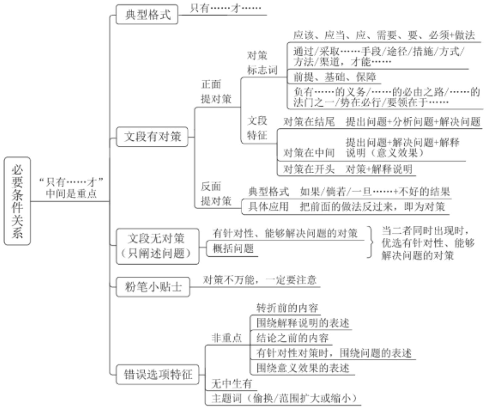
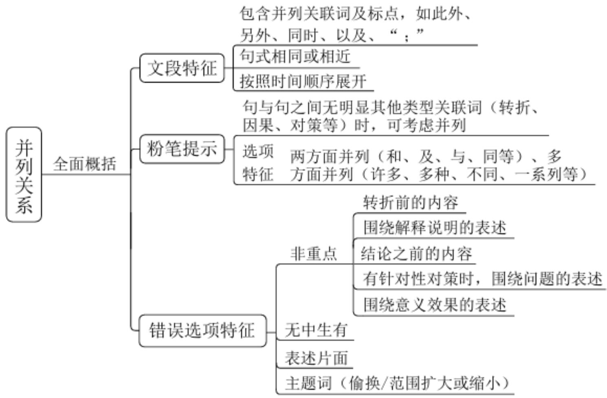

# 精讲精练-言语3

(笔记)

主讲教师：郭熙

授课时间：2025.02.21

# 精讲精练-言语3（笔记）

第三次课学习重点内容:

(1)反面提对策的判定方法  
(2)文段无对策的解题思路  
(3)并列关系文段特征

【注意】第三次课学习重点内容：本节课继续学习中心理解题，言语申论不分家，言语的中心理解题是概括文段的中心，申论的题目也会考查，只是不给选项，只给出一段文字，自己概括文段的重点，考查的能力比言语更高，通过言语的学习为申论打下坚实的基础。

1. 反面提对策的判定方法。  
2. 文段无对策的解题思路。  
3. 并列关系文段特征：真题常考的结构类型。

【知识链接】反面提对策

【典型格式】如果/倘若/一旦……+不好的结果

【具体应用】把前面的做法反过来，即为对策

举个小例：现在题目难度越来越高。如果你不提升阅读理解能力，那么就会做错。

【注意】反面提对策：上节课讲解了必要条件关系（对策），文段从正面提对策的典型标志词和常见结构。有的文段还可能从反面的方式提对策，如妈妈说“你必须在9点之前回家”，这是正面提对策，爸爸说“如果你9点之前不回家我就整死你”，通过反面吓唬我的方式强调应该在9点之前回家。

1. 典型格式：如果/倘若/一旦……+不好的结果。  
2. 具体应用：把前面的做法反过来，即为对策。上述例题，前文是问题，后文从反面角度提对策，把做法反过来，强调应该提升阅读理解能力。

【例 1】(2024 浙江) 对于珊瑚礁来说, 海水温度的上升会导致与之共生并提供食物的藻类的大量丧失, 从而导致珊瑚礁 “白化” 甚至死亡。更糟糕的是,

由于海洋吸收了大量的二氧化碳，海水酸化严重，珊瑚礁的生长进一步减缓。健康的珊瑚礁是  $25\%$  以上的海洋生物的家园，并且可以保护海岸线免受风暴和侵蚀，还可以为当地社区提供经济收入和就业机会（比如旅游业）。虽然珊瑚礁在不受干扰的环境下具有较快的恢复能力，但在全球变暖的大进程下，珊瑚礁的总体数量呈现出逐年下降的趋势。据联合国环境规划署估计，世界上  $25\%$  至  $50\%$  的珊瑚礁已经遭到破坏，如果不大幅减少温室气体排放，到 2100 年，所有海域内的珊瑚礁都将死亡。

这段文字意在强调：

A. 导致海洋热浪发生的直接原因是温室气体排放  
B. 海水温度上升将严重威胁所有海洋生物的生存  
C. 减少温室气体排放以保护珊瑚礁已经刻不容缓  
D. 珊瑚礁对海洋环境和人类社会都具有重大影响

【解析】1. 问“意在强调”为中心理解题。首句引出珊瑚礁。“导致死亡”提出问题，“更糟糕的是”依旧引导问题，“对于珊瑚礁……遭到破坏”都在论述问题。“如果不……死亡”为“如果+不好的结果”，从反面提对策，把握正面的做法，强调要减少温室气体的排放，更好地保护珊瑚礁，锁定C项，“刻不容缓”同义词是“迫在眉睫”，引导对策，强调赶紧去做。

A 项：为问题表述，且未提及珊瑚礁，偏离文段重点，排除。  
B 项: “严重威胁”为问题表述, 非重点, 排除。  
D 项: 文段强调减少温室气体排放的做法、行动, 非单纯强调珊瑚礁的影响,排除。【选 C】

【注意】结构梳理：提出问题+反面提对策（如果+不好的结果）。

【例 2】（2025 国考）如果一味沉湎于琐碎的日常事务，缺乏大局观念和政治远见，不分轻重缓急，不从原则高度想问题，就会陷入事务主义。习近平总书记指出：“如果忙忙碌碌，只是机械做事，陷入事务主义，是很难提高认识和工作水平的。”这就意味着，要提高认识水平，必须走出事务主义的泥潭。毛泽东曾经指出：“庸俗的事务主义家不是这样，他们尊重经验而看轻理论，因而不能

通观客观过程的全体, 缺乏明确的方针, 没有远大的前途, 沾沾自喜于一得之功和一孔之见。”这为如何走出事务主义提供了指南针和路线图。

这段文字认为，为避免陷入事务主义，应该：

A. 具有清晰明确的工作方案  
B. 坚持从理论高度看待问题  
C. 不断从实践中总结经验教训  
D. 通过学习补齐能力素质短板

【解析】2. 国考题的出题质量和水平很高，本题稍有难度。问“应该”，选择做法。首句反着论述，强调应该有大局观念和政治远见，跳出日常琐碎的事物，站在更高的高度看待问题。“习近平总书记指出……路线图”出现两个领导人，与首句的观点一致，只看习近平总书记的话可能不好理解，可以看毛主席的话，毛主席的观点反着说，强调要站在理论的高度通观全局。文段首句从反面提对策，接着用习近平总书记和毛主席的话举例说明，重点是站在理论高度看待问题，“理论高度”是概括性表述，强调视野、格局更高，锁定B项。

A 项：文段强调看待问题的角度站在更高的理论高度，而不是制定清晰、明确、具体的工作方案，排除。  
C 项: 文段未提及 “总结经验教训”, 无中生有, 排除。  
D 项：文段未提及“补齐能力素质短板”，无中生有，排除。【选 B】

【注意】结构梳理：反面提对策（如果+不好的结果）+举例说明。

二、善于从理论的高度看问题。既要读书学习，同时更不能离开工作实践，如果一味沉湎于琐碎的日常事务，缺乏大局观念和政治远见，不分轻重缓急，不从原则高度想问题，就会陷入事务主义，甚至由此滋生形式主义和官僚主义。习近平总书记指出：“如果忙忙碌碌，只是机械做事，陷入事务主义，是很难提高认识和工作水平的。”这就意味着，要提高认识水平，必须走出事务主义的泥潭。对此，毛泽东曾一针见血地指出，“庸俗的事务主义家不是这样，他们尊重经验而看轻理论，因而不能通观客观过程的全体，缺乏明确的方针，没有远大的前途，沾沾自喜于一得之功和一孔之见。这种人如果指导革命，就会引导革命走上碰壁

的地步”。这不仅是对“庸俗的事务主义家”的精准画像，更为如何走出事务主义提供了指南针和路线图。“学所以益才也，砺所以致刃也。”只有在干中学、学中干，真正上心用心，善于从理论的高度想问题看问题，才能提高认识水平、应变能力、工作境界。

——学习时报《为什么说只有理解了的东西才更深刻地感觉它？》

【注意】本题难度大是因为出题人对文段进行了加工，把最核心的内容进行了删减。开头的小标题为“善于从理论的高低看问题”，题干问“概括后文的内容”就是要概括出小标题，“从理论的高度”本身是概括性表述。“大局观念和政治远见”“分轻重缓急”“从原则高度想问题”都是从理论高低看问题，概括性更强。后文总书记、毛主席的话依然强调从理论的高度看问题。如果题目没有删掉“只有在……工作境界”，大家都不会纠结，依然强调从理论的高低看问题、想问题。若题目是申论材料，没有选项，要能够概括出材料强调从理论高度看待问题。

文段无对策，只阐述问题

例：大量吃蒜不好……

A. 吃蒜要适度

B. 大量吃蒜不好

C. 应该多吃生姜

D. 吃大蒜要配烧烤

选项特征:

1. 有针对性、能够解决问题的对策

2. 概括问题

【注意】文段有对策，到选项同义替换即可，文段无对策，只阐述问题，对策可能出现在选项中。

1. 上述例题, 文段强调 “大量吃蒜不好” 的问题, A 项可以解决问题, 为针对性对策, 当选。B 项是问题本身, 选项有针对性对策优选, 排除。C 项未提及 “大蒜”, 主题词错误; D 项对策带来越吃越多的结果, 无法解决文段的问题,均排除。若没有 A 项, 对比择优, 选择 B 项。

2. 选项特征:

(1) 优选有针对性 (话题/主题词正确)、能够解决问题的对策。

(2) 没有针对性对策，选择对问题概括的表述。

3. 无效对策：主题词错误/对策解决不了问题（如例题 D 项）。

【例3】（2024深圳）经常听到国内许多专门家痛心疾首地抱怨各种走俏的传媒作品严重缺乏学术上的准确性和严肃性；但是专家学者们却往往又把自己的研究成果表述得过分艰涩干瘪而少趣味，使少数同行之外再不会有什么别的人愿意皱着眉头去读完它们。学术探索的过程本来应该是充满奇光异彩的。趣味从我们的学术著作中脱逸的现象，很可能表明一部分徒有其表的“学术著作”本身其实并不真正地具备“学术”一词所必须含有的基本品格。但确实也存在另一种情形，即作者缺乏下述这种充分意识：他应当尽可能地让读者与他共享的，乃是科学探索中的乐趣与喜悦，而不只是其中的艰辛与酸楚。

这段文字意在:

A. 分析传媒作品与学术著作受众规模差异的原因  
B. 鼓励学术著作向走俏的传媒作品借鉴表达  
C. 批判趣味已经从大多数学术著作中脱逸的现状  
D. 提倡撰写学术著作应将趣味性与学术性并重

【解析】3. 问“意在”为中心理解题。“经常听到……读完它们”论述所谓的专家很双标。“学术探索的……基本品格”论述趣味性是学术著作应该具备的品质。“但”表转折，转折之后“缺乏”为问题，从作者写学术著作的角度论述，选择针对性对策，锁定D项，从作者的角度出发，体现有趣味性，且学术著作也需要有学术性。

A 项: “与”表并列, 选项“传媒作品”对应引入部分, 非重点, 文段围绕学术著作展开, 排除。  
B 项：不能一味地鼓励，如有些传媒作品使用网络用语，把 PUA 用为 CPU、KTV，排除。  
C 项：选项 “批判” 强调不应该, D 项 “提倡” 强调应该, 表述更明确, 且问题是作者缺乏意识, D 项站在作者的角度提对策, 排除。【选 D】

【注意】结构梳理：引入+转折提出问题。

【例4】（2024四川）文学翻译是个复杂的工程，不能单纯追求信达雅，有时候需要译者主动求变，需要译者根据不同的文化语境，根据具体的语汇与词义及其背后的文化背景，对原文做出必要的调整。而这种必要的调整，对于译者来说，既是其主体性的体现，也是翻译的责任所在，在某种程度上，它是与原作者所进行的一种精神对话。遗憾的是，目前的情况是，一旦有翻译家被发现在其翻译作品中出现了“错误”，就会被批得一塌糊涂。这样的批评生态，实在不利于翻译家的工作以及新的翻译家的出现。

作者通过这段文字意在强调:

A. 译者和译著需要读者们和评论家的宽容  
B. 文学翻译有不同于一般著作的评价标准  
C. 不同的文化背景给文学翻译带来障碍  
D. 文学翻译需根据文化语境做必要调整

【解析】4. 问“意在强调”为中心理解题，读文段找重点。首句引出文学翻译很复杂，“需要”提对策，若文段到“对原文做出必要的调整”结束，应选择D项。“而这种……精神对话”对“必要的调整”进行解释。“遗憾的是”表转折，前文非重点，后文是重点，“错误”加了双引号，指翻译作品做了一定的调整，转折之后提出翻译作品做了调整就会被批判、讨伐的问题，选择针对性对策，即宽容、少一些批评，锁定A项。

B 项：文段没有把文学翻译和一般著作的评价标准进行对比，排除。  
C 项: “不同的文化背景”对应转折之前, 非重点, 且 “障碍” 为问题表述,非重点, 排除。  
D 项：对应转折之前，非重点，排除。【选 A】

# 【注意】

1. 结构梳理：引入+“遗憾的是”提出问题。  
2. “遗憾的是”表转折，如你人品很好、性格很好、工作很好，遗憾的是我们不合适，重点是后面。

【例 5】（2023 国考）我国在改革开放后逐渐认识到保护民间文学艺术作品的重要性，并在 1990 年著作权法规定保护办法另行规定。但时隔三十余年，保护办法仍未出台。尽管如此，在著作权法颁布后，学界就民间文学艺术作品法律保护展开研究讨论，提出多种保护方案，涉及权利客体、权利主体、权利内容、保护期限、权利限制等方面的问题。当然，也有个别学者反对用著作权法保护民间文学艺术作品，主张通过公法加以保护。与此同时，国家版权局也加快推进相关立法，但因质疑声音过大而夭折。

作者可能赞同下列哪一观点？

A. 通过公法保护民间文学艺术作品是最可行的路径  
B. 围绕民间文学艺术作品法律保护的争议流于表面  
C. 国家版权局应就民间文学保护倾听多方面意见  
D. 民间文学艺术作品法律保护缺位状态亟须改变

【解析】5. 问“作者赞同的观点”为中心理解题，读文段，找重点。“我国在……另行规定”出现“另行规定”，说明现在没有出台保护办法，如今天不放假，至于什么时候放假另行通知。“但”表转折，转折之后依旧论述没有出台保护的办法。“尽管如此……的问题”论述学界的做法。“也”表并列，论述个别学者主张用公法保护。“与此同时”“也”表并列，后文是三方面的并列，论述学界、个别学者、国家版权局如何做，只针对其中一个方面的选项不能选。

A 项：仅对应第二方面，表述片面，且“最可行”无中生有，排除。  
C 项: 仅对应第三方面, 表述片面, 且文段并非论述不听意见, 而是恰恰听了质疑所以没有出台, 排除。  
B 项：文段未提及争议只停留在表面，“涉及权利客体、权利主体、权利内容、保护期限、权利限制等方面的问题”说明学界的探讨比较深入，只是没有给出具体的保护办法，排除。  
D 项: “缺位”即没有、未出台, 选项“亟需改变”强调要出台, 当选。【选 D】

【注意】结构梳理：话题引入+转折提出问题。

【例6】（2024黑龙江公安）知识产权侵权假冒行为具有形式上跨区域、实质上链条化的特点。而随着物流体系的发达，网上销售已遍及城乡甚至跨越国界。因此，虽然侵权假冒商品的生产制造者、网络销售者、电商平台、消费者往往不在同一行政区域，但知识产权侵权假冒者往往是生产、流通、销售链条化、一体化运作。然而，在执法管辖上，由于行政执法的管辖区域限制，行政执法机关只能就本区域内的侵权假冒行为进行查处；在执法调查取证上，往往需要执法行政机关跨区域调查取证，这就影响了知识产权行政执法的效率和效果。

针对这段文字中出现的问题，下列应对方法最有效的是：

A. 运用信息化、智能化手段为执法办案赋能，强化行政执法技术支撑  
B. 健全网络知识产权保护的相关法律，建立线上线下一体化立法机制  
C. 建立多元化沟通机制，加强执法部门与权利人以及平台的沟通合作  
D. 树立全链条办案理念，建立上下联动、区域协作的全链条执法机制

【解析】6. 本题文段和选项都很长，不要逐字逐句阅读，找准文段强调的核心内容，定位选项的关键词。问“应对问题最有效的是”，文段提出问题，选项针对性解决。“因此”引导结论，论述知识产权侵权假冒的流程、特点。“然而”表转折，前文非重点，“；”表并列，并列前后分别论述执法管辖和调查取证，通过两方面的并列论述受到区域的限制，选择针对性对策，锁定D项。

A 项：选项 “技术” 表述片面, 缺少上下联动、区域协作, 无法解决文段的问题, 排除。  
B 项：文段“然而”之后强调执法，选项“立法”非重点，排除。  
C项：选项“沟通”表述片面，且文段还提及“生产制造者”“网络销售者”“消费者”，排除。【选D】

# 【注意】

1. 结构梳理：话题引入+转折提出问题。  
2. 积累四个选项的表述，申论材料、热点话题会涉及知识产权的侵权假冒行为、如何保护知识产权，现在强调自主创新，要保护知识产权。四个选项都可以保护知识产权，用于申论写作的对策，且表述规范、格式规整。A项“赋能”很高级，即赋予能量、助力；B项从立法上解决，“线上线下一体化”表述规范；

C项“多元化沟通机制”是概括性表述；D项“全链条”为热词。

【例 7】（2023 福建）截至 2021 年，化石燃料的燃烧正式改变了北半球空气中碳同位素的组成，甚至足以抵消核武器试验发出的信号。而这可能会给有价值的碳年代测定技术带来问题。专家发现，从放射性碳年代测定法来看，现代物品看起来就像是 20 世纪早期的物品。专家表示，这种趋势“可能很快就会让人很难分辨一件东西是 1000 年前的还是现代的”。

最适合做这段文字标题的是:

A. 化石燃料燃烧带来的影响  
B. 放射性碳年代测定的原理  
C. 如何分辨物品的年代属性  
D. 碳年代测定技术可能不再准确

【解析】7. 问“标题”为变形的中心理解题，读文段找重点。首句引出化石燃料的燃烧。“这”指化石燃料的燃烧，若纠结A、D项，结合后文判断。“专家发现……专家表示”为例子，解释说明强调碳年代测定技术不准确，锁定D项。

A 项: “影响”可能是方方面面的, 如全球变暖, 选项范围扩大, 没有 D 项明确, 排除。  
B 项：选项 “原理” 对应解释说明部分, 非重点, 排除。  
C 项: 选项 “如何分辨” 对应解释说明部分, 非重点, 排除。【选 D】

【注意】结构梳理：话题引入+提出问题+解释说明。

# 【粉笔提示】

中心句纠结时，可借助解释说明判断。解释说明论证谁，谁就是重点。

例 1: (2020 四川) 或许是深受农业文明影响的缘故, 中国古典艺术始终缠绕着一种对花草植物的敏感。林徽因说: “惜花、解花太东方, 亲昵自然, 含着人性的细致是东方传统的情绪。”我们都会背: “蒹葭苍苍, 白露为霜。所谓伊人, 在水一方。”但未必所有人都知道, 所谓 “蒹葭”, 就是我们熟悉的芦苇。

《诗经》里的世界，其实并不遥远。“参差荇菜”“南有乔木”“桃之夭夭”“彼黍离离”，这先秦时代的民歌，几乎首首离不开植物，一风一雨、一稼一穑，遍布着草木的声息，以至于《诗经》里的植物花卉，也成为一门学问，吸引一代代的学人研究考证。

A. 中国古典艺术深受农业文明的影响  
B. 花草植物是中国古典艺术的重要元素

【注意】如果文段中心句明确，解释说明、举例子略读，若只看中心句不好判断或纠结，借助解释说明判断，解释说明论证谁，谁就是重点。

【例8】（2023浙江）市场交易是市场机制有效配置资源的主要形式，而价格信号则是市场交易的指挥棒。国际资源配置最有效率的方式无疑是自由贸易。贸易保护主义旨在通过提高关税、设置贸易壁垒、采用反倾销反补贴等手段提高进口商品价格，阻止国外生产效率高且物美价廉的商品或服务进入本本市场。从表面上看，贸易保护主义保护了国内产业与就业安全，但实际上保护的是低效率生产，会造成商品或服务价格信号失真，使资源配置到没有比较优势的产业，而真正具有比较优势的产业却因得不到足够资源而难以持续发展。贸易保护主义还会对被保护产业的上下游关联产业产生影响，引起系统性的价格信号失真与资源配置扭曲。

这段文字主要介绍:

A. 实施贸易保护主义的消极影响  
B. 贸易保护主义得以实现的基本手段  
C. 自由贸易与贸易保护主义的主要区别  
D. 国际市场中资源有效配置的最佳方式

【解析】8. 问“主要介绍”为中心理解题，读文段找重点。首句引出市场交易，“贸易保护主义……本国市场”引出贸易保护主义，指出贸易保护主义的手段做法。“但实际上”表转折，转折之后强调贸易保护主义带来的不好影响、问题。尾句“还”表并列，论述贸易保护主义的消极影响。

A 项：转折之后强调贸易保护主义的消极影响，选项可以概括文段的问题，当选。

B 项：出现在转折之前，非重点，排除。  
C 项：选项 “与” 表并列，文段 “自由贸易” 只是引入，非重点，排除。  
D 项: 出现在引入部分, 非重点, 后文的核心话题是 “贸易保护主义”, 要解决贸易保护主义的问题, 选项缺少主题词, 排除。【选 A】

【注意】结构梳理：引入+“但实际上’之后提出问题。

  
【必要条件关系思维导图】

【粉笔提示】对策何时不能选？

1. 提问方式找问题  
2. 对策主题词与文段不符  
3. 反推对策与文段不符

【注意】必要条件关系：

1. 典型格式: 只有 A 才 B, 重点在 “只有” 和 “才” 中间, 若省略 “只有”, 看“才”之前。

2. 文段有对策：对策是重点。

(1) 正面提对策: 快速识别对策标志词 (刻不容缓/迫在眉睫, 强调赶紧做、很紧迫)。  
(2) 反面提对策。

3. 文段没有对策：优选有针对性、能解决问题的对策，若没有则选择问题的概括。

4. 对策何时不能选：忠于文段解题。

(1) 提问方式找问题: 如问 “文段强调的主要问题是”。  
(2) 对策主题词与文段不符: 如例 8, 文段的话题是 “贸易保护主义”,缺少主题词的对策表述不能选。  
(3) 反推对策与文段不符: 反推对策与文段不符的表述应排除, 如选项为 “要加强监管”, 文段应论述缺乏监管、没有监管、监管不力或明确提出要加强监管的对策, 若文段与监管无关, 则不能选。

【随堂练习】（2020国考）不论是以巴尔扎克为代表的19世纪欧洲文学，还是以鲁迅为先导的中国现代文学，多半高擎现实主义大旗开垦生活，塑造典型。新时期以来的文学创作，基本也都坚守现实主义立场，比较善于揭露、针砭生活中的负面客观真实，这是完全必要且非常宝贵的。然而，部分小说缺乏对生活中积极因素和正面形象的塑造，缺少对正面价值和情感的呼吁。其实，现实主义创作以人道主义思想为武器，不仅注重剖析社会的阴暗面，也应注重展示生活的亮点；不仅看重批判社会阴暗面的准确性和深刻性，也更看重作家对人物命运的关怀和同情。

这段文字主要批评了新时期以来文学创作中哪个方面的问题？

A. 典型人物的塑造过于刻板单一  
B. 作家缺乏对现实生活的关注  
C. 缺乏对优秀文学传统的继承  
D. 部分小说存在消极负面的倾向

【解析】拓展。问“问题”，读文段时关注点放在问题。“不论是……塑造典型……宝贵的”论述好的方面。“然而”表转折，转折之后提出问题，同义替换。

换，锁定D项，“缺乏积极”即消极，“缺乏正面”即负面。

A 项：文段未提及“过于刻板单一”，无中生有，排除。  
B 项：文段论述“坚守现实主义立场”，选项与文意相悖，排除。  
C 项: “然而”之后的问题是小说存在负面消极的倾向, 并非不继承文学传统, 排除。【选 D】

【注意】“其实……关怀和同情”是对策，提问方式问问题，无需看对策。

4. 并列关系

文段特征:

1. 包含并列关联词，如此外、另外、同时、以及、也、“；”  
2. 句式相同或相近

【金句积累】

为官要善为，“法”字当头做功课；

为官要敢为，“干”字为要抓效率；

为官要有为，“好”字为纲惠民生。

在思想感情上，要体现一个“爱”字；

在自身形象上，要树立一个“正”字；

在工作方法上，要突出一个“细”字；

在工作作风上，要坚持一个“实”字；

在领导力量上，要形成一个“合”字。

对待目标，要有“咬定青山不放松”的韧劲；

对待任务，要有“不破楼兰终不还”的决心；

对待群众，要有“俯首甘为孺子牛”的情怀；

对待自己，要有“静我凡心立功名”的淡定。

3. 按照时间顺序展开

理论要点：全面概括

错误选项特征：表述片面

【注意】并列关系：转折之后为重点，因果关系结论是重点，必要条件关系

对策是重点，并列关系没有重点，或都是重点。

# 1. 文段特征:

(1) 包含并列关联词, 如此外、另外、同时、以及、也、还、“; ”。要对标志词、标点符号足够敏感。  
(2) 句式相同或相近:

(1)在领导人讲话、规范文章中经常出现, 领导人很喜欢用排比句式, 平时阅读可以积累比较好的排比句, 对申论写作也能打下基础, 阅读规范文章时可以积累好的金句。  
(2)金句积累: “如何为官”可以用“为官要善为, ……‘好’字为纲惠民生”, “如何当好公务员”可以从五个方面展开, 即“在思想感情上……要形成一个‘合’字”, “未来如何确定目标/怎么对待任务、群众、自己”可以展开表述为“对待目标, 要有 ‘咬定青山不放松’ 的韧劲 (体现坚持) ; 对待任务, 要有 ‘不破楼兰终不还’ 的决心 (体现决心坚定) ; 对待群众, 要有 ‘俯首甘为孺子牛’的情怀 (体现很贴心, 姿态很低) ; 对待自己, 要有 ‘静我凡心立功名’的淡定”。

(3) 按照时间顺序展开: 朝代、一系列时间, 如唐、宋、元、明、清。

2. 理论要点：全面概括，提取分句共性特征，主题词/核心话题要正确，也要概括内容上的共性。  
3. 错误选项特征：表述片面。如文段是三方面并列，选项只针对其中一个方面，要排除。

【例1】（2023国考）我国在经济快速发展的同时，培育和形成了全球少有的超大规模内需市场。与小规模经济体相比，超大规模经济体在全球经济运行中通常发挥着“锚”的作用。改革开放以来，我国之所以能够成功应对亚洲金融危机、国际金融危机等的冲击，一定程度上就得益于此。另外，超大规模市场的多样性意味着更强的内部稳定性。产业发展、区域发展的差异性可以减少冲击的影响，局部的内部冲击不易在全国形成共振效应；部分行业、部分区域发展面临困境，并不会对宏观经济总体稳定产生巨大冲击。

这段文字意在说明:

A. 我国既是经济全球化的受益者也是贡献者

B. 多措并举对保障内需市场稳定有重大意义  
C. 超大规模市场有助于我国经济保持稳定  
D. 超大规模经济体助力全球经济平稳运行

【解析】1. 问“意在说明”。首句引出“超大规模内需市场”的话题，接着出现“超大规模经济体”，即“超大规模内需市场”，体现规模很大，“此”指“超大规模市场”“超大规模经济体”的作用，后文“另外”表并列，论述对我国内部稳定性的作用。文段先引出“超大规模市场”“超大规模经济体”，后文是通过“另外”引导的并列结构，先抓话题。

A、B 项：文段的核心话题是“超大规模市场”“超大规模经济体”，选项均未提及，跑题了，排除。

对比 C、D 项：并列前后均强调对我国的作用，D 项 “全球” 范围扩大，锁定 C 项。【选 C】

【注意】结构梳理：并列结构（……另外……）。

【例 2】（2023 辽宁）南极洲是陆地，北极是海洋——北冰洋。由于陆地比热小，升温和降温都快，因此冬季的南极比冬季的北极更冷。南极在冬季时地球处于离太阳最远的地方，而北极在冬季时地球处于离太阳最近的地方。南极洲中心为极地高气压区，气流由中心流向四周，阻挡来自低纬度的暖空气进入南极大陆。南极洲外围还有南极环流，该环流属于寒流，给南极大陆带来的是冷空气。此外，北极近三分之二的面积都是海洋，平均海拔与海平面相当，而南极洲是高原大陆，平均海拔为 2350 米，是世界上平均海拔最高的大洲，正所谓“高处不胜寒”。

这段文字意在说明:

A. 南极洲独特的地理环境  
B. 影响南极洲温度的因素  
C. 南极比北极更冷的原因  
D. 南极和北极的地理差别

【解析】2. 问“意在说明”，读文段，把握内容。“因此”表总结，给出结论。

论, 即冬季的南极更冷, 后文出现 “此外”, 表并列, “此外” 之前通过论述南极的位置、气流、环流体现南极更冷, “此外” 之后 “高处不胜寒” 强调寒冷,侧重南极洲更冷。文段开篇通过 “因此” 给出结论, 即南极比北极更冷, 中间依旧论述南极更冷, “此外” 之后论述南极 “高处不胜寒”, 体现南极更冷, 提取共性 (并列), 文段几个方面共同强调南极更冷。

A 项: 落脚点是 “地理环境”, 排除。  
B 项: “温度” 不明确, 文段的核心结论是南极更冷, 排除。  
D 项：文段共性的结论强调南极更冷，排除。  
C 项：选项均未提及 “冬季”, 无需纠结, 对比择优, 文段通过并列共同强调的核心内容是南极更冷, 只有该项可匹配文段结论, 当选。【选 C】

【注意】结构梳理：并列结构（……此外……）。

【例 3】（2022 贵州）在传统的文化消费中，无论是阅读书籍、聆听音乐还是欣赏影视作品，都是单向度的，创作与消费是两个独立的环节。在体验式文化消费中，消费者不仅参与创作，也是作品的组成部分，这让消费者的主观能动性得到更加充分的发挥。独一无二的作品背后，是独一无二的经历与体验。体验式文化消费因而具有唯一性、当下性与不可复制性。另外，体验式文化消费中的互动过程，综合利用包括 VR、AR 在内的多媒体数码技术，提供跨媒介的多感官体验——如温度、质感、震动等在传统文化产品中很难体验到的综合感官效果，为叙事与审美提供了更多维度。

这段文字意在说明:

A. 体验式文化消费会更受消费者青睐  
B. 现代技术对体验式文化消费的促进作用  
C. 体验式文化消费中消费者主动参与的重要性  
D. 体验式文化消费带给消费者与众不同的体验感

【解析】3. 问“意在说明”。首句论述传统文化消费的情况，接着引出“体验式文化消费”，选项均围绕“体验式文化消费”进行论述，说明首句不重要，“传统的文化消费”只是引入，重点往后看，后文强调体验式文化消费消费者可

以积极主动参与，发挥主观能动性，带来独一无二的体验。

“另外……更多维度”中“另外”说明前后是两方面并列，“如”为举例子，从另一个维度进行论述。前文论述消费者积极主动参与让体验独一无二，后文论述综合利用多媒体技术让体验非常独特，文段为由“另外”连接的两方面并列，共同强调体验式文化消费给消费者带来了与众不同的体验，提取共性，锁定D项。

A 项: 在 D 项的基础上进行了引申、推断, 文段只是论述体验式消费可以给消费者带来与众不同的体验感, 做题要忠于文段, 排除。  
B 项只提及 “现代技术”, 对应 “另外” 之后; C 项只提及 “消费者主动参与”, 对应 “另外” 之前, 表述片面, 均排除。【选 D】

【注意】结构梳理：并列结构（……另外……）。

【例 4】（2023 山东）影视作品凝结的不只是创作者们的灵感和创意，还有时代文化形成的集体无意识的投射和缩影。就影视作品而言，一方面，对社会文化的传承来说，经典作品承载着丰厚的文化价值，对经典的重复呈现既是一种文化延续，也是一种文化确认，与我国传统文化联系密切的经典影视作品尤为如此。另一方面，对影视文化的发展来说，经典作品原有版本的魅力会逐渐褪色，用新的视听技术、新的时代美学和新的演员演绎将经典重新阐释一遍，则是赋予这些作品与时俱进的新生命力，其本身是重塑经典甚至创造新经典的过程。

这段文字主要说明:

A.经典影视作品生命力的来源  
B.对待经典影视作品的正确态度  
C.经典影视作品与传统文化的关系  
D. 新时代翻拍经典影视作品的意义

【解析】4. 课堂正确率为  $55 \%$  。问 “主要说明”。首句论述影视作品凝结的内涵, 后文 “一方面……另一方面……” 为并列结构, 话题发生变化, “一方面”之后强调对经典的重复呈现很有意义, 如一百年前出现某部作品, 一百年后又重复呈现这部作品, “另一方面”之后提及 “原有版本”, “对经典的重复呈现”

“将经典重新阐释一遍”即翻拍经典。首句只是引入，重点是后文的并列结构，强调“对经典的重复呈现”“将经典重新阐释一遍”。

A 项: “重新阐释一遍” 即重新拍一遍, 不是强调原来经典作品的生命力,无法概括后文，排除。  
B 项：后文的并列不是强调对待作品的态度，而是强调重复呈现经典、重新演绎经典的作用、意义、价值，排除。  
C项：文段开篇论述“时代文化”，尾句论述“与时俱进的新生命力”，体现与时俱进，要反映时代的特点，选项“传统文化”范围过小，有局限，且无法体现重复呈现、重新演绎，排除。  
D 项: 落脚点是意义, 做题时要把文段和选项结合起来看, 选项均未提及 “重播”, “翻拍”是对经典的重复呈现, “用新的视听技术……重新阐释一遍”也是翻拍经典, 文段并列结构共同围绕的话题就是 “翻拍经典”, 强调在新时代的意义、好处, 该项最恰当, 当选。【选 D】

# 【注意】

1. 结构梳理：并列结构（一方面……另一方面……）。  
2. 粉笔提示：主题词同义替换。

(1) 文段: 对经典的重复呈现、重新演绎经典。  
(2) 选项: 翻拍经典。

3. 如果选 B 项, 文段应论述有些人完全不重视经典, 只是看花边新闻、网络新闻, 要重视经典, 认真对待影视作品。

【例 5】（2024 广东）大力倡导绿色消费方式是实现经济高质量发展和生态环境高水平保护共赢的重要推动力。要进一步引导全社会认同绿色消费，使绿色消费方式成为公众自觉选择；引导促进绿色产品消费，为促进经济社会发展全面绿色转型创造条件；全面推动各领域消费绿色转型升级，形成节约适度、绿色低碳、文明健康的生活方式和消费模式。

本段文字主要讲了：

A. 如何倡导绿色消费方式

B. 如何实现经济高质量发展  
C. 为什么要倡导绿色消费方式  
D. 为什么要实现经济高质量发展

【解析】5. 问“本段文字主要讲了”。选项从话题上可分组，A、C 项论述“倡导绿色消费方式”，B、D 项论述“实现经济高质量发展”。首句“重要推动力”强调大力倡导绿色消费方式，“实现经济高质量发展”只是它的目标之一，后文都围绕“倡导绿色消费方式”进行论述，排除 B、D 项。

对比A、C项：A项“如何”强调怎么做，C项“为什么”在解释原因，后文出现“要”“；”，强调怎么做，锁定A项。【选A】

# 【注意】

1. 结构梳理：并列结构（……；……）。  
2. 如果选“为什么”,后文应进行原因解释(因为/由于/原因是/理由是……) ; “如何”如大家要想成功上岸, 第一要听课, 第二要刷题, 第三要总结, 最后还要听一听过来人的意见, 概括为 “如何上岸”, “如何” 可概括做法。

【考场思维】巧用反向排除法

并列文段，直接概括不好判断时，可先排除干扰项

常见干扰项:

主题词错误/表述片面

举个小例：当今时代，公务员考试的人数越来越多。同时，难度越来越高。

A. 公务员考试的人数越来越多  
B. 公务员考试的难度越来越高  
C. 高考的人数和难度不断增高  
D. 当今公务员考试的时代特征

【注意】考查思维：巧用反向排除法。

1. 如果文段是并列结构，或结构不好判断，不好直接概括，从选项入手，采用反向排除法解题，排除干扰项，剩下的选项就是答案。  
2. 常见干扰项：主题词错误/表述片面。

3. 举个小例: A 项论述 “人数”, B 项论述 “难度”, 均片面, 文段 “同时”表并列, 排除。C 项论述 “高考”, 文段论述 “公务员考试”, 这是出题人可能会挖的 “坑”, 主题词错误, 择优选 D 项。

【随堂练习】（2020四川）如果说《清明上河图》集中反映了宋朝生活“俗”的一面，“西园雅集”则是“雅”的象征。在北宋被传为佳话的“西园雅集”，表现了当年众多文人雅士的宴游场景，苏轼、李公麟、米芾等聚集一堂，或吟诗赋词，或抚琴唱和，或打坐问禅，形成了以苏轼为中心的文人圈。身在其中的画家李公麟以写实手法将雅集描绘下来，米芾作序，“水石潺湲，风竹相吞，炉烟方袅，草木自馨。人间清旷之乐，不过如此”。“西园雅集”是古代绘画史中的一个经典母题、后代画家多有摹本或仿作，这也是宋人精神的一种延续。

这段文字主要意在:

A. 比较 “西园雅集” 和《清明上河图》的不同风格  
B. 介绍 “西园雅集” 的创作者和所描摹的文化名人  
C. 阐释 “西园雅集” 所呈现的文人趣味和精神价值  
D. 评价 “西园雅集” 对中国古代绘画史的独特贡献

【注意】拓展. 课堂正确率为  $80 \%$  。问 “主要意在”, 为中心理解题。A 项比较 “西园雅集” 和《清明上河图》的不同风格, B、C、D 项均论述 “西园雅集”。首句 “则是” 表强调, 文段只是围绕 “西园雅集” 进行论述, 《清明上河图》只是引入, 非重点。

A 项：主题词错误，排除。

后文出现人名，为例子，尾句“也”表并列，前后为两个方面，如果觉得不好直接概括，观察选项。

B项“文化名人”对应第一个分句；D项“古代绘画史”对应尾句，均表述片面，排除。  
C 项: “文人趣味”对应第一个方面, “精神价值”对应第二个方面, 当选。

【选 C】

【注意】结构梳理：并列结构（……。也……）。

【例 6】(2024 贵州)人类特别喜欢读到和关注有关他人和社会的负面信息, 媒体从业者则是顺应这种喜好, 这使人们接触到更多的负面信息而非正面信息。这种 “有偏见的暴露效应” 解释了为什么人们认为当前的道德水平相对较低。而当人们回忆过去时, 负面事件更可能被遗忘, 这是由于大脑的内在机制要求不良事件引起的负面反应情绪必须被平复, 因此时过境迁, 再大的悲剧也可以慢慢放下。这种 “有偏见的记忆效应” 又解释了为什么人们认为过去的道德水平相对较高。

这段文字意在说明:

A. “世风日下”可能是一种群体心理错觉  
B. 心理层面人们更愿记住过去美好的事件  
C. 道德水平的高低取决于负面事件的影响  
D. 媒体传播强化了人们对负面信息的接收

【解析】6. 课堂正确率为  $74 \%$  。问 “意在说明”。首句指出现象, 如大家喜欢看明星的负面信息, 媒体上就给我们推一些负面信息, 如某明星出轨了、离婚了、吸毒了, 接着 “这种 ‘有偏见的暴露效应’ ” 进行总结, 这种暴露效应是有偏见的, “解释了为什么人们认为当前的道德水平相对较低” 说明现在比过去的道德水平低, 因为每天接触的都是负面信息。

后文论述“过去”，指出第二个现象，回忆过去的时候会把负面的都忘掉，留下的都是相对正面的，如回忆初恋，不好的净化了，留下的都是美好的回忆，“这种‘有偏见的记忆效应’”总结前文的现象，最后的结论强调记忆效应有偏见，我们认为过去的人道德水平比现在高。“这种‘有偏见的暴露效应’……相对较低”“这种‘有偏见的记忆效应’……相对较高”句式一致，且出现“又”，为并列的两个方面。

B 项只能对应“过去”；D 项只能对应“媒体从业者……正面信息”，为当前，均片面，排除。  
C 项: 文段并列的两个句式均出现“有偏见”, 说明这种效应有可能是错觉,有可能是错的, 文段不是强调 “道德水平的高低取决于负面事件的影响”, 没有给出这一确定结论, 排除。

A项: “世风日下”在逻辑填空题中是高频成语, 如果不认识, 要积累, 指社会风气一天天衰落下去, 道德水平一天天变坏, 暗含过去道德水平相对较高,现在道德水平相对较低/差, 带有双引号, 为形象的概括, “当前的道德水平相对较低” “过去的道德水平相对较高” 为对比, “有偏见” 对应 “错觉”, 表述严谨, C、D项均无法体现这种偏见是一种错觉, 当选。【选 A】

# 【注意】

1. 结构梳理：现象 1+结论 1+现象 2+结论 2（句式一致引导的并列）。  
2. “当前的道德水平相对较低”“过去的道德水平相对较高”只是一种心理错觉，与真实情况并不一致，C项直接论述“取决于”，无法体现出这种偏见、错觉。

【选项特征】正确答案形象化表达

对正确答案进行加工，选项可能会出现比喻、拟人、网络词汇等

(2024 联考) 高技能人才——前沿技术应用落地的 “嫁接者”

(2022 国考) 文艺是时代前进的号角

(2022 国考) 良法善治的实现需要道德 “保驾护航”

(2022 国考) 抗压, 从鱼漂的 “断舍离” 开始

(2022 联考) 科技赋能让文物重新 “活起来”

(2022 山东)雨声是最佳“催眠曲”

(2021 联考) 蜜蜂为何 “单恋一枝花”

(2020 国考) 但它却也是我们最熟悉的陌生人

(2019 北京) “废墟”何以是美的

(2018 国考) 科学之光点亮思维

【注意】正确答案形象化表达：若出题人把文段内容一字不差地放在选项中，大家不会纠结，现在出题人为了增加难度会对正确答案进行加工，可能会首先排除正确答案，在剩下的干扰选项中纠结。有些难题可能会对正确答案进行形象化加工，出现比喻、拟人、网络词汇，让表述看起来更形象。做中心理解题，不要看到双引号、形象化表达就秒杀，首先要保证内容能匹配中心，若在形式上很形

象, 作为正确答案的概率相对更高, 如果选项出现形象化表达, 不要上来就排除。

1. 2024 联考: “嫁接者”为形象表述。  
2. 2022 国考: “文艺是时代前进的号角”为形象的比喻。  
3. 2022 国考: “保驾护航”和例 6 的 A 项 “世风日下” 带有双引号, 有异曲同工之妙。  
4. 2022 国考：抗压，从鱼漂的“断舍离”开始。  
5. 2022 联考：科技赋能让文物重新“活起来”。  
6.2022山东：雨声是最佳“催眠曲”。  
7.2021联考：蜜蜂为何“单恋一枝花”。  
8. 2020 国考: “它”指动物, 为拟人。  
9. 2019 北京: “废墟”带有双引号, 指残破的古建筑、遗址等。  
10. 2018 国考: “点亮”很形象。

【例 7】（2023 事业单位）从 17 世纪到 20 世纪中叶，怀旧心理一直被学界认为是由思乡病带来的痛苦、甚至病理性的体验。直到 20 世纪末，西方学者才将怀旧和思乡病区分开来，他们开始注意到怀旧的积极作用，并将怀旧定义为一种正面情绪。而现代心理学对怀旧的普遍理解是：对过去的渴望和喜爱。心理学家维尔德舒特认为，怀旧是正面情绪的“储藏室”，它储藏了快乐、幸福、宁静等正面情绪。而心理学家威尔曼则认为怀旧是一种喜忧参半的情绪，它既包含回忆往昔带来的快乐，又包含“再也回不去”的失落与忧伤。

这段文字主要说明:

A. 学界对“怀旧心理”认知的变迁  
B. 以前排斥 “怀旧”, 如今追求 “怀旧”  
C. 怀旧不只有消极情绪，还有正面情绪  
D. 思乡病折射出现代人的怀旧心理与真实生活

【解析】7. 问“主要说明”。“从17世纪到20世纪中叶”“直到20世纪末”“现代”为三个时间，按照时间顺序展开。首句论述怀旧心理，阐述学界的看法，认为是思想病带来的，接着依旧围绕怀旧心理阐述学界的看法，后文出现人名，都是现在心理学家的普遍理解、个别看法，代表学界的看法，不是普通人。

文段是按照时间顺序展开的并列结构，提取共性。三个时间段围绕的核心话题是“怀旧心理”，强调学界对怀旧心理的认识出现变化，锁定A项，“变迁”可对这一变化过程进行概括。

C 项: 不能体现是学界、学者的看法, 文段只是论述不同人、不同时代对怀旧的理解不同, 喜忧参半只能对应尾句中心理学家威尔曼的看法, 前面心理学家维尔德舒特认为怀旧只有正面情绪, 选项不匹配文段, 且表述片面, 排除。

B 项: “追求 ‘怀旧’ ”无中生有, 排除。  
D 项: “思乡病” 只能对应第一个时间段, 表述片面, 排除。【选 A】

# 【注意】

1. 结构梳理：时间顺序展开的并列。  
2. 而：真题出现“而”，建议忽略，重点看前后的内容判断。

(1) 转折: 学而不思则罔 (学习但不思考就会迷惘)。  
(2) 并列：敏而好学（一方面很聪明，一方面又爱好学习）。  
(3) 顺承/递进: 择其善者而从之 (先选择善的、好的, 然后跟从)。

3. 若文段提到三个时间段，按照时间顺序展开，为并列结构，通常会用“变迁、历程、发展”概括这几个时间段的变化。

# 【知识链接】

1. 句与句之间无明显其他类型关联词（转折、因果、对策等）时，可考虑并列  
2. 选项特征：两方面并列（和、及、与、同等）、多方面并列（许多、多种、不同、一系列等）

例：（2023 联考）火山喷发出的岩浆冷却后收缩，产生了裂缝，裂缝趋于六边形，最后形成了紧密排列的六棱柱形岩石，这是岩浆内部作用力达成的最稳定的结果。//海龟的背甲是由骨骼的不同部分长成的，它们衔接时互相挤压，中间部位的背甲块形成了六边形的稳定结构。//冬天，气态水分子受低温影响而重新排列成固态，同样是以最稳定的结构互相连接，形成了六边形的雪花冰晶。

【注意】知识链接:

1. 句与句之间无明显其他类型关联词（转折、因果、对策等）时，围绕相同话题展开论述，可考虑并列。  
2. 选项特征：两方面并列（和、及、与、同等，如“文人趣味和精神价值”）、多方面并列（许多、多种、不同、一系列等）  
3. 例：文段没有典型标志词，有三个方面，共同强调六边形很稳定。

【例8】（2024国考）目录链主要依托区块链技术进行搭建，可将政府部门、职能机构的数据共享关系和流程上链锁定，建构起数据共享的新规则。所有的政务数据共享、业务协同行为在链上共建共管，无数据的职责会被调整，未上链的系统将被关停，从而建立起部门业务、数据、履职的全新“闭环”，解决应用与数据脱节、技术与管理失控等问题。在具体技术应用上，目录链通过数据协调机制实现数据信息高效交互，通过多点共识确保数据存储不可篡改，通过交互验证对数据计算和结果的可信度审计追溯，从而实现对数据资源目录进行全面管理和监控。

这段文字主要介绍了目录链的:

A. 产生背景及共享规则  
B. 数据存储及监管流程  
C. 适用场景及流程体系  
D. 技术依托及应用价值

【解析】8. 问“主要介绍”，给出话题“目录链”。关注选项特征，选项都是两方面并列（A 及 B），出现“及”，说明文段应是两方面并列，对比选项内容，有针对性地读文段，前半部分是第一方面，后半部分是第二方面，先对比第一方面。首句论述技术的依托是区块链技术，“上链”即上区块链，前文均围绕区块链技术论述，锁定 D 项。

A 项：前半部分不是重点论述 “产生背景”，排除。  
B 项：文段除了“存储”，还提到“共享”“协同”，选项表述片面，排除。  
C 项：文段重点强调技术依托是区块链，排除。【选 D】

【注意】

1. 粉笔提示：选项设计有提示，文段选项结合看。如果文段很专业，选项设计有特点，是两方面并列，从选项入手进行定位，对比前半部分，首句引出区块链技术依托，“上链锁定”“在链上”“未上链”中“链”指区块链，故前半部分重点强调技术依托，即区块链，“背景”“存储”“场景”不是在论述技术，后半部分论述应用价值、作用，用D项概括这两个方面很准确。  
2. 通过后文验证, 后文论述在应用上的价值, 不是单纯论述 “共享规则” “监管流程” “流程体系”, 排除 A、B、C 项, D 项可准确概括文段前后两个方面。

【例 9】（2022 国考）从学理的角度来说，知识产权诉前行为保全是指为及时制止正在实施或即将实施的侵害权利人知识产权或有侵害之虞的行为，而在当事人起诉前根据其申请，由法院签发的一种禁止行为人为或不为一定行为的强制性命令。它属于知识产权侵权救济的一种暂时性措施，有着维权“及时雨”的功能。有别于传统财产权侵权，知识产权客体的易复制性与极易扩散性，使得知识产权人改变了过去倚重事后救济来保护权利的习惯。在当前国家加大知识产权保护力度、建立知识产权侵权惩罚性赔偿制度的背景下，及时有效地制止侵权比等到切实的损害结果发生后的救济更加有效。

这段文字主要介绍了知识产权诉前行为保全的：

A. 救济原则与法律依据  
B. 研究背景与实施过程  
C. 法律效力与赔偿策略  
D. 法理概念与司法功能

【解析】9. 课堂正确率为  $76 \%$  。同样的文段不会再考了, 但命题特征、规律会有延续性。提问方式给出专业话题 “知识产权诉前行为保全”, 文段很专业,可以从选项进行定位。选项都是 “A 与 B” 的形式, 说明文段是两方面并列, 先定位第一个方面。首句 “是指” 为下定义, 介绍概念, 不是在论述 “原则” “背景” “效力”, 锁定 D 项, 验证后文, “维权”与“司法”相关, “功能”对应 “功能”, “及时有效地制止” 对应 “‘及时雨’的功能”。【选 D】

【考场思维】选项相似，先看选项找不同，带着针对性读文段。

(2024 国考)

A. 产生背景及共享规则  
B. 数据存储及监管流程  
C. 适用场景及流程体系  
D. 技术依托及应用价值

(2022 国考)

A. 救济原则与法律依据  
B. 研究背景与实施过程  
C. 法律效力与赔偿策略  
D. 法理概念与司法功能

【注意】考场思维：选项相似，先看选项找不同，带着不同点有针对性地读文段。

【例 10】（2024 吉林）春季星空有划过天空的“春季大弧线”和众多的深空天体。秋季星空有“秋季四边形”，还可以看到北半球唯一一个可以肉眼看到的河外星系——仙女星座。仙女星座非常明亮，即使远在距地球 254 万光年之外，在地球上的我们依然能仅凭肉眼就看到它灿烂的光辉。冬季星空亮星较多，有显著的“地标”——“冬季大三角”，以及辨识度很高的猎户座，因此冬季也是观赏星空的好时机。夏季星空的最大亮点，便是璀璨的银河高挂天空，银河系的“银心”正位于人马座方向，人马座在夏夜空中逗留的时间最长——此时的星空，正是“群星闪耀时”。

对这段文字的主旨概括准确的是:

A. 四季星空，各美其美  
B. 我约星辰，星约四季  
C. 夏夜长空，星系闪耀  
D. 星汉灿烂，扮美四季

【解析】10. 问“主旨概括”，为中心理解题。文段没有典型标志词，论述了四个季节，提及“春季星空”“秋季星空”“冬季星空”“夏季星空”，阐述四个季节星空的特点。文段没有其他标志词，阐述四个季节不同的美，锁定 A

项，“各美其美”即各有各的美，他们的美不同，可概括。

B、D 项：不能体现四季的美不同，不如 A 项概括得合适，均排除。

C 项：只提及夏季，表述片面，排除。【选 A】

# 【并列关系思维导图】

# 【注意】并列关系：

# 1. 文段特征:

(1) 包含并列关联词及标点, 如此外、另外、同时、以及、也、还、“; ”。  
(2) 句式相同或相近。如果句式一致，要知道是并列。  
(3) 按照时间顺序展开。

# 2. 粉笔提示:

(1) 句与句之间无明显其他类型关联词（转折、因果、对策等）时，可考虑并列。  
(2) 选项特征: 两方面并列（和、及、与、同等）、多方面并列（许多、多种、不同、一系列等）。

3. 错误选项特征：主题词错误、表述片面。

4. 反向排除：如果直接概括不好判断，可以从选项入手，若 A、B 项主题词错误、跑题了，排除，C 项只对应并列的一个方面，表述片面，选 D 项。  
5. 如果选项都是“……与/及……”，为两方面并列，说明文段是并列结构，

定位选项找不同，带着不同点有针对性地读文段，有助于提速。

6. 如咱们班小张同学上岸了, 小李同学上岸了, 小王同学上岸了, 小赵同学也上岸了, 可概括为 “很多/许多同学都上岸了”。

【随堂练习】（2022国考）回溯法律史，从法的完善来看，“由习惯到习惯法再到成文法”是法演进的一般规律；从整个法体系看，民商事立法最早进行了习惯考量。我国民事立法也有考量习惯的传统，《大清民律草案》等均开宗明义地阐明了习惯要素的地位；新中国成立后，民事立法中的制度和政策要素不断增强，习惯要素逐渐式微；当下，伴随依法治国的深入推进，在《民法典》编纂过程中，直接源于生活并反映生活的社会习惯要素得以强调，如在规定处理民事纠纷的依据时，就直接说明“法律没有规定的，可以适用习惯”，并将习惯的内涵从《合同法》中的“交易习惯”拓展到“民事习惯”范畴。

这段文字主要介绍:

A. 我国民事立法中对习惯要素的重视与考量  
B. 习惯要素在我国《民法典》中的具体体现  
C. 我国民事立法发展与演进的一般规律  
D. 习惯要素作为中西方立法来源的传统

【解析】拓展。课堂正确率为  $64 \%$  。首句“回溯法律史”即回顾过去、回顾历史，往往为背景引入，引出“习惯”的话题，接着强调我国民事立法考量习惯的传统，后文论述“大清”，是清朝的情况，“；”表并列，“如”为举例子，依旧围绕“习惯”进行论述。后文出现“；”，按照时间顺序展开，为并列结构，提取共性，强调我国民事立法对习惯的考量，围绕习惯要素进行论述，锁定A项。

C 项: 并列文段要抓准主题词, “规律” 范围过大、过于宽泛, 未提 “及习惯”, 排除。  
B 项：只能对应“当下”，表述片面，排除。  
D 项: 文段未提及立法的来源, 且后文强调我国的情况, 不是在论述 “西方”,排除。【选 A】

# 【注意】

1. 结构梳理：并列结构（分号连接+时间顺序）。  
2. 并列结构大家最容易掉的“坑”是“主题词”，C项缺少主题词，跑题了，这样的选项要果断排除，片面的表述要排除。

# 【答案汇总】

必要条件关系 1-5: CBDAD; 6-8: DDA

并列 1-5: CCDDA; 6-10: AADDIA

遇见不一样的自己

Be your better self