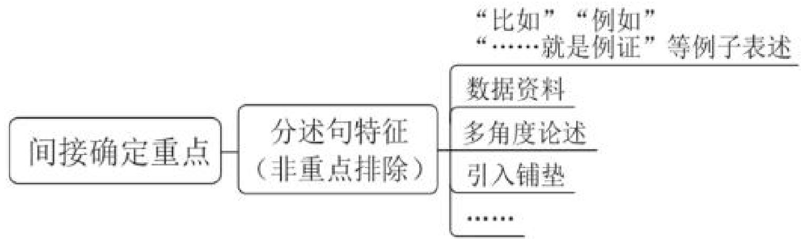
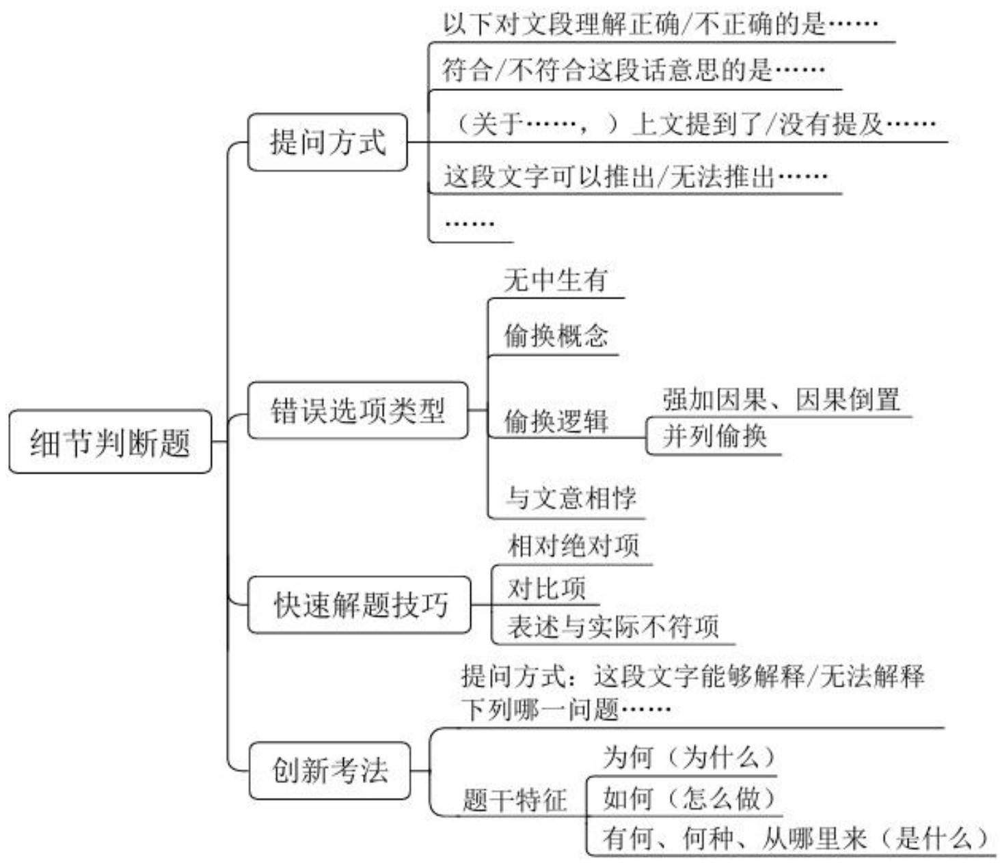

# 精讲精练-言语4

(笔记)

主讲教师：郭熙

授课时间：2025.02.22

  
粉笔公考·官方微信

# 精讲精练-言语4（笔记）

第四次课学习重点内容:

(1)分述句的特征  
(2) 细节判断题的解题思维及错误选项特征

【注意】第四次课学习重点内容:

1. 中心理解题分述句的特征。  
2. 细节判断题的解题思维及错误选项特征。

【中心理解题】解题思路：找重点（中心）

1. 直接确定重点

逻辑层面之关联词

内容层面之主题词

2. 间接确定重点-排除非重点

【注意】之前的课程学习了关联词、主题词，中心理解题拿到文段找重点、中心。

1. 直接确定重点：逻辑层面之关联词（转折、因果、必要条件通常以对策呈现）；内容层面之主题词（出题人常在主题词挖坑，很多题目抓准主题词可以很好锁定答案）。  
2. 间接确定重点：排除文段的非重点部分，剩下的就是中心。

# 二、间接确定重点

分述句特征:

1. “比如”“例如”“……就是例证”等例子表述  
2. 数据资料  
3. 多角度论述  
4. 引入铺垫

【注意】分述句特征：分述句与中心句相对，中心句代表作者的核心观点，分述句就是非重点内容。

1. “比如”“例如”“……就是例证”“诸如”“譬如”、人名、作品、杂志、某些地区、“有的人”等例子表述。  
2. 数据资料：与举例子的作用一致，可以看成例子，如文段中间出现数字，非重点。  
3. 多角度论述：在观点之后起到论证作用，非重点。

(1) 原因解释, 前文提出观点, 后文出现 “因为、由于、理由是”, 如大家一定要珍惜眼前人, 因为佛说前世五百次的回眸换来今生的擦肩而过, 错过就再也遇不到了, 强调大家要珍惜眼前人。  
(2) 正反论述: 前文有观点, 后文正说说, 反说说, 换种说法再说说。如读书很好, 接着论述多读书有什么好处作用, 不读书会有什么危害后果。类似于写论文的凑字大法。  
(3) 并列分述: 前文提出观点, 接着 “一方面……另一方面……”; 前文引出内容, 接着从个人、企业、国家不同的角度展开论述。

4. 引入铺垫：出现在文段开头或观点之前，如背景引入、现状的铺垫，非重点。

例 1. 喻下扶贫的“硬骨头”，需要打好科技牌。因为……比如……。

例 2. 近年来，……。我们应该采取……。因为……。

# 【注意】

1. “需要”引导对策，只看前文不知道是否为重点，需结合后文。后文“因为”为原因解释，非重点，“比如”举例子，非重点，排除后文非重点部分，中心在首句。  
2. “近年来”为背景引入，非重点。“采取”引导做法，后文出现“因为”，为原因解释，非重点，故文段重点是中间部分，为“分-总-分”结构。

# 【粉笔提示】

(1)从读题的角度:

分述句部分可快速阅读（分述句里的关联词不重要）

(2)从选项排除的角度:

围绕分述句的选项是干扰项，要排除

# 【注意】

1. 从读题的角度: 分述句部分可快速阅读 (分述句里的关联词不重要, 如 “比如” 中出现 “然而”, 非重点)。  
2. 从选项排除的角度：围绕分述句（举例子/原因）的选项是干扰项，要排除。

【例 1】（2025 国考）如今，文艺工作者深入挖掘传统绘画与传统舞蹈之间的内在联系，将诗、书、画、乐、舞融于一体，形成新的审美表达。比如，杭州亚运会开幕式文艺表演环节，第一个节目《水墨入诗画》便以中国画为基本元素，身着青绿色长裙的舞者在山水画卷中翩翩起舞，营造出“人在画中游”的优美意境。舞蹈诗剧《只此青绿》同样以经典山水画为灵感，通过舞蹈再现画家王希孟创作《千里江山图》的过程，并以刚柔相济的肢体语言、精心设计的舞蹈动作呈现山水神韵。在这些作品中，传统绘画与舞蹈的创意融合产生叠加效应，使传统文化与现代审美相谐适，产生了广泛的社会影响。

最适合做这段文字标题的是:

A. 青绿热: 传统与现代的双向奔赴  
B. 传统与现代：审美表达的异与同  
C. 人在画中游: 穿越千年的艺术盛宴  
D. 画与舞: 跨界融合激发艺术新活力

【解析】1. 问“标题”为变形的中心理解题，读文段找重点。“如今……审美表达”论述文艺工作者挖掘绘画和舞蹈的关系。“比如”举例子，《水墨入诗画》非重点。“《只此青绿》”“《千里江山图》”依旧是例子，“这些作品”概括例子，强调绘画与舞蹈要融合，文段中心是首句，提出观点，后文为举例说明，把握观点，抓话题“绘画”“舞蹈”，锁定D项。

C 项：未提及 “舞蹈”, 主题词片面, 排除。

A 项：对应例子部分，非重点，排除。  
B 项：未提及“绘画”“舞蹈”，排除。【选 D】

【注意】结构梳理：提出观点+解释说明（举例子）。

【例2】（2023辽宁）科技是实现文化创意、放大文化效用的重要手段。特别是在文博行业，新技术不仅帮助文物从“抢救性保护”迈向“预防性保护”，还提供文创手段和思路。比如数字技术，相较于过去的胶片拍摄，敦煌数字壁画不会褪色，而且清晰度大幅提高。这些逐渐积累起来的数字素材，成为敦煌发展文创的资源库，不仅可以用来设计实物文创产品，还可以制作视频，让壁画中的人物动起来，更具观赏性。再比如利用数字化解析技术，在异地展览中再现代代表性洞窟，人们徜徉其中，仿佛在真实的莫高窟中游览。

最适合做这段文字标题的是:

A. 数字技术，令敦煌再次高光闪耀  
B. 科技赋能，让文物焕发时代光彩  
C. 敦煌文化，借技术加持破壁出圈  
D. 传统艺术，以别样方式创新讲述

【解析】2. 问“标题”为中心理解题，读文段找重点。“科技……思路”论述科技对文物的保护很重要。“比如”举例子，“敦煌数字壁画”是例子。“再比如”依旧举例子，“莫高窟”也是例子。文段先提出观点，接着通过“比如……再比如”举例说明，首句强调科技对文物的作用，锁定B项，“赋能”十分形象，即科技赋予能量，给出助力。

A、C 项: “敦煌” 围绕例子部分, 非重点, 均排除。  
D 项: “别样的方式” 表述不明确, 未提及 “科技”, 排除。【选 B】

【注意】结构梳理：提出观点+解释说明（举例子）。

【例3】（2024江苏）汉代农业生产水平逐渐提高，生活物资较为丰富，上层社会在饮食上更加考究，饮食文化随之蓬勃发展。这一时期，烹饪技艺也大幅提升，尤其是中原地区与周边民族的饮食文化交流频繁，一些新的烹饪方法如“羨煮貊炙”即被引入。“羨煮”即煮或涮羊肉、鹿肉；而“貊炙”则类似于烤全羊，较之中原烤法，所烤之物更大。《释名》中说：“貊炙，全体炙之，各自

以刀割，出于胡貊之为也。”“羌煮貊炙”做出的肉食，鲜嫩味美，此类烹饪方法在黄河流域逐渐流传开来，受到人们的青睐。

这段文字重在说明:

A. 社会发展是汉代饮食文化蓬勃发展的重要因素  
B. “羌煮貊炙”一词是胡汉饮食文化交流的表征  
C. 汉代中原地区吸收了不少其他民族的烹饪方法  
D. 汉代烹饪技艺的提升与民族文化交融密切相关

【解析】3. 问“重在说明”为中心理解题。“汉代农业……发展”论述农业的生产水平变高了, 生活物资变丰富, 饮食文化蓬勃发展。“这一时期……频繁”论述烹饪技艺, 若文段的开头是观点, 后文应论述农业水平如何提升、物资如何丰富, 后文话题发生变化, 说明首句非重点, 只是引入。后文 “如” 举了 “羌煮貊炙”的例子, 非重点。文段的重点是中间部分, 话题为 “烹饪技艺”。

A 项: 未提及主题词 “烹饪技艺”, 排除。  
B 项：对应例子部分，非重点，排除。  
C 项: 仅提及 “烹饪方法”, “尤其是” 表强调, 强调烹饪技艺与饮食文化交流频繁息息相关，未提及文化交融，偏离文段重点，排除。  
D 项: 中心句的话题是 “烹饪技艺” “文化交融”, 当选。【选 D】

【注意】结构梳理：背景引入+提出观点+解释说明（举例子）。

【例4】（2024辽宁）中国共产党人精神谱系的生成从来不是盲目冲动的，也不是主观臆想的，而是基于对社会现实的把握、对社会历史的总结，从客观现实和人民群众的伟大实践中阐发出来的。延安精神坚持实事求是的思想路线，“实事”就是客观存在的事物及其内部联系，“求是”就是去研究、探索真理。改革开放精神是中国共产党人在改革开放和建设中国特色社会主义这一特定的历史时期中所形成的解放思想、实事求是，开拓创新、勇于担当，开放包容、兼容并蓄的精神品格。至于新时代北斗精神，在尊重科学的基础上，“自主创新”“追求卓越”无疑都是制胜密码。

这段文字所反映的中国共产党人精神谱系的特征是:

A. 坚持党性与人民性的统一  
B. 坚持理想性与现实性的统一  
C. 坚持民族性与世界性的统一  
D. 坚持客观规律性与主观能动性的统一

【解析】4. 首句提及共产党人的精神谱系, 不知道是否为重点, 继续读后文。后文出现延安精神、改革开放精神、新时代北斗精神, 为举例子, 故文段的中心句是开头。

A 项: “党性”无中生有, 排除。  
C 项: “世界性”无中生有, 排除。  
B 项：文段并非强调理想性，选项意为理想要立足现实，不能过高、难以实现，排除。  
D 项: 后文例子部分强调发挥主观能动性, 主动研究探索、积极主动做, 当选。【选 D】

【注意】结构梳理：提出观点+解释说明（举例子）。

【例 5】（2023 国考）农业是个生态产业，农村是生态系统的重要一环。要健全草原森林河流湖泊休养生息制度，巩固退牧还草、退耕还林成果，开展大规模国土绿化行动，加强生物多样性保护。这方面要有个科学规划，荒山、沙漠、滩涂、森林、草原等治理要因地制宜、符合实际，不能都是一种套路。长江、黄河流域是生态文明建设的主战场，农业农村任务十分艰巨。长江流域要抓好十年禁渔，加强执法监督和市场监管，妥善解决好渔民转产转业和社会保障问题。黄河流域要抓好农业深度节水控水，因水施种，发展节水农业、旱作农业，把农业用水效率提上去、总量省出来。

这段文字意在说明:

A. 农业与农村生态文明建设任重道远  
B. 农业发展与生态治理需做好统筹  
C. 农业生态建设要做好科学规划  
D. 生态文明建设要找准着力点

【解析】5. 问“意在说明”为中心理解题，读文段找重点。“农业……多样性保护”指出一系列做法。“这方面”指代前文的内容，进行总结，引出核心对策，前文非重点，强调科学规划的重要性。后半部分围绕科学规划展开论述，“长江……总量省出来”为例子，非重点。文段中心句在中间，强调农业生态建设要有科学规划，锁定C项。

A 项: “任重道远”即任务重、道路远, 往往要经历长期的过程, 不等于“做好科学规划”, 与文段强调的对策不匹配, 排除。  
D 项：未提及 “农业”, 且“找准着力点”表述不明确, 过于宽泛, 排除。  
B 项：选项为两个话题，纠结时可以反推，若当选，文段应论述不能一味发展农业而忽视生态的治理，不能一味搞生态治理而忽略农业的发展，排除。【选 C】

【注意】结构梳理：引入+提出对策+解释说明（举例子）。

【例 6】（2024 天津）社会心理学先驱所罗门·阿希通过一系列著名的阿希从众实验证明，即使是判断“三段线段谁最长”这样的简单任务，人们的回答也会受到他人的强烈影响，进而在并无胁迫的情况下服从某种群体规范。人们为什么会服从规范？这可能源于群体中的个人害怕被其他成员视为“一匹离群之马（越轨者）”而遭到孤立。人的这种顺从行为在动物身上也有所体现。比较心理学家本内特·加利夫的研究发现，挪威大鼠会忽视自己的偏好转而选择同伴偏爱的食物味道，尽管有时这种味道并不怎么好。

这段话所要表达的中心思想是:

A. 人的行为活动容易受到他人的影响  
B. 离群之马都会遭到社会群体的孤立  
C. 人们在无胁迫下往往会服从群体规范  
D. 挪威大鼠会忽视自己偏好而选择顺从

【解析】6. 问“中心思想”为中心理解题。“社会心理学……证明”说明后文是证明的观点、结论。“人们为什么……孤立”分析原因，“挪威大鼠”是例子，非重点。文段的重点是首句，“进而”表递进，重点在递进之后，强调在并

无胁迫的情况下服从某种群体规范，若纠结 A、C 项，可以借助后文解释说明，解释说明围绕的核心话题是服从群体规范，锁定 C 项，“往往”表述温和。

B项“离群之马”、D项“挪威大鼠”围绕原因解释、举例子部分，非重点，均排除。

A 项: “受到他人的影响”对应首句非重点部分, 非重点, 排除。【选 C】

【注意】结构梳理：提出结论+解释说明（原因解释+举例子）。

【例 7】（2023 上海）记忆的重要性不仅适用于人类历史，个人的历史也是一样。一个人倘若没什么值得记忆的事，人生就会变得贫乏。20 世纪初的教育改革家就完全忽略了这回事。他们研究证明，“机械性的背诵”不是储存与搜集资讯的有效方法。在他们的努力争取下，背诵式学习被排除在学校之外。如果记忆只是为了解决实际问题，这一派教育改革家的论证或许很正确。但如果我们把控制意识看得跟完成工作同样重要，那么把复杂的资讯模式牢记在心中，绝不能说是一种浪费。稳定的内涵能使心灵更丰富，所谓创造力与背诵式学习不兼容，其实是一项错误的假设。多位最具创意的科学家，都以能记忆大量音乐、诗歌及历史资讯而著称。

对以上语段概括最恰当的一项是:

A. 20 世纪初的教育改革家认为记忆对个人学习而言并不重要  
B. 背诵式学习无法有效储存和搜集资讯，不利于发展创造力  
C. 多位科学家证明: 记忆能丰富人的心灵, 提升人的创造力  
D. 记忆不应被排除在学校之外，它对个人发展有重要意义

【解析】7. 问“概括”为中心理解题。首句论述记忆对个人很重要。“一个人倘若……贫乏”从反面论述记忆对个人很重要。“20世纪初的……这回事”出现特定时期的改革家，“但”表转折，说明作者不认同前文的观点，认为“背诵式学习”有价值。“那么……一种浪费”依旧论述记忆很重要。“稳定的……假设”论述二者可以兼容。“多位最具创意……著称”举例子，非重点。文段强调记忆对个人发展很重要，锁定D项。

A、B 项：与作者的观点相悖，均排除。

C项：对应尾句举例子部分，非重点，且未提及记忆能提升创造力，排除。【选D】

# 【注意】

1. 结构梳理：提出观点+解释说明（正反举例）。  
2. 文段的核心观点是记忆对个人发展很重要，锁定D项。

【例 8】（2023 深圳）山歌与号子不同，它不受劳动动作和劳动节奏的限制，所以节拍不规整、节奏自由而悠长。一方面，在陈述唱词的部分，音乐节奏接近自然语言的节奏，语言自然化；另一方面，在唱词词组或句读之后，即句间或句尾多出现自由延长音，自由延长音与曲首、曲尾的呼唤性衬词结合形成前腔或后腔，是山歌区别于其他民歌的独特之处。山歌的自由延长音使得节奏较密集的朗诵性曲调与抒咏性自由延长音相结合，这种悠长自由的节奏，使山歌的节奏节拍类型丰富多变，增强了山歌的抒情性。

上文主要介绍的是:

A. 山歌与号子的区别  
B. 山歌与自然语言的区别  
C. 山歌的节奏特征  
D. 山歌抒情性的由来

【解析】8. 问“主要介绍”为中心理解题，选项较短，A、B项为并列结构，C、D项话题只有山歌。首句“它”指山歌，“所以”引导结论，强调山歌在节拍和节奏上的特点。“一方面……另一方面”为并列分述，依旧围绕山歌的节奏展开。后文依旧围绕山歌的节奏展开，为解释说明，文段的话题只有“山歌”，强调节奏特征，锁定C项。

A、B 项: “号子” “自然语言” 非重点, 均排除。  
D 项: 对应 “另一方面”, 是山歌自由延长音带来的效果, 非重点, 排除。【选 C】

【注意】结构梳理：提出观点+解释说明（并列分述）。

【例 9】（2024 吉林）天气冷，人的基础代谢就会提高，这是基本常识。因为温度低又穿得单薄，皮肤散热后体温就会降低，为了维持体温，身体就会额外燃烧能量产热，所以这个过程基础代谢就升高了。有研究证实，同样是把室温从  $22^{\circ} \mathrm{C}$  降到  $15^{\circ} \mathrm{C}$ ，然后让被测试者在  $15^{\circ} \mathrm{C}$  下持续暴露 3 小时，夏天做这个实验，基础代谢只升高了  $7 \%$ ；而这批被测试者在冬天做这个实验，基础代谢却升高了  $15 \%$ ，增幅显著高于夏天。并且，夏季实验结束后，代谢就趋于稳定了；冬季实验结束后，代谢还在增加。由此可见，冬天挨冻真的能升高基础代谢。然而，谁会为了升高一点基础代谢，故意让自己挨冻呢！何况冻得太厉害，想吃东西来暖和身体，一不小心吃多就白挨冻了。

这段文字意在强调:

A. 春季秋季的代谢比较稳定  
B. 挨冻后多吃会降低代谢  
C. 为提高代谢而挨冻不可取  
D. 冬天的代谢要比夏天高

【解析】9. 问“意在强调”为中心理解题，读文段找重点，文段很长，但十分生活化。首句论述天气冷基础代谢会提高。“因为”解释原因，“有研究证实……增加”为举例说明。“由此可见”为结论词，“然而”表转折，转折之后的两句话共同强调为了提高代谢挨冻的做法不可取，锁定C项。

A 项: “春季秋季”无中生有, 排除。  
B 项：文段强调挨冻的做法不可取，排除。  
D 项：出现在 “然而” 之前，非重点，排除。【选 C】

【注意】结构梳理：引入铺垫+数据资料+结论+转折提出观点。

【例 10】（2024 江苏）传统的职业技术认证，特别是高端职业的认证通常与学历背景密切相关。随着互联网技术的进步，知识获取变得更为便利，也使得从业人员知识面更加开阔广泛，从而在一定程度上减弱了职业技术认证与学历背景之间的联系。新型职业的技能认证需要考虑专业知识，又因其服务的个性化特

征，必须纳入消费者评价的考量。在这种情况下，新型职业的认证标准需兼顾专业技术技能评价和保障消费者权益。

这段文字讨论的重点是:

A.新型职业技术的发展异于传统职业  
B.新型职业技术认证需要考虑的因素  
C.新型职业技术认证需要消费者认可  
D.新型职业均具有鲜明的个性化特征

【解析】10. 问“重点”为中心理解题。四个选项结构字数一致，话题是“新型职业”。“传统的……的联系”论述传统职业技术认证的特征。“新型职业……的考量”出现新型职业技能认证，前文非重点，“需要”“必须”引导对策，强调既有专业知识，又有消费者评价的考量。尾句“在这种情况下”总结前文，概括前文两方面对策，文段重点是后半部分，强调新型职业技术认证需要考虑的因素，锁定B项。

A 项：对应对策之前，非重点，排除。  
C 项：仅对应消费者评价一个方面，表述片面，排除。  
D 项：文段重点是对策，选项“特征”非重点，排除。【选 B】

【注意】结构梳理：对比引入+提出对策+指代总结。

【分述句特征】总结

类型一：举例说明/数据资料/原因解释/正反论证/并列分述——论证

举例说明：比如、例如、有的、某些地区、实践中……

原因解释：因为、由于、理由是……

数据资料：数字、资料、百分数……

正反论证：对前文观点进行正反两方面的解释

并列分述：观点后出现并列论述

【粉笔提示】中心句明确时，解释说明部分略读。

中心句纠结时，借助解释说明判断，解释说明论证谁，谁就是重点。

【注意】分述句特征总结:

1. 类型一: 举例说明/数据资料/原因解释/正反论证/并列分述, 在观点之后起到论证作用。若文段较简单, 可能只出现一个, 若文段复杂, 可能出现多个类型的排列组合。

(1) 举例说明: 比如、例如、有的、某些地区、实践中一些人的做法。  
(2) 原因解释: 因为、由于、理由是。  
(3) 数据资料：数字、资料、百分数。  
（4）正反论证：对前文观点进行正反两方面的解释，正说说、反说说，如开头论述记忆对个人很重要，接着从正面论述对个人怎么重要，然后反面论述如果不记忆会带来什么不好的结果。  
(5) 并列分述: 观点后出现并列论述。若前文有观点, 后文出现并列, 则是并列分述; 若文段整体是并列, 需要把前后两方面内容进行概括。

2. 粉笔提示：中心句明确时，解释说明部分略读。中心句纠结时，借助解释说明判断，解释说明论证谁，谁就是重点。

类型二：背景铺垫/定义介绍/现状描述/问题引入等——引入

背景铺垫：近年来、随着、历史上、在……的进程中……

定义介绍：是、就是、——、内涵……

现状描述：当下、目前、现如今、取得……成就/成绩

问题引入：负面表述、消极现象等不好的内容

【粉笔提示】引入内容不重要，关注引出的话题即可。

中心句可能省略核心话题，纠结时结合前文判断。

举个小例：近年来，公务员考试……。因此，听课刷题很重要。

A. 公务员考试需要听课刷题。

B. 研究生考试需要听课刷题

# 【注意】

1. 类型二：背景铺垫/定义介绍/现状描述/问题引入等，观点之前作引入。

(1) 背景铺垫：近年来、随着、历史上（关照历史上的情况）、在……的进程中。  
(2) 定义介绍（开头下定义）：如分享经济是/就是/是指/内涵是……；——。

(3) 现状描述: 当下、目前、现如今、取得……成就/成绩。  
(4) 问题引入: 负面表述、消极现象等不好的内容。如风险/缺陷/不足/挑战。

2. 粉笔提示：引入内容不重要，关注引出的话题即可，后文可能围绕话题论述。若题目增加难度，中心句可能省略前文的核心话题，纠结时结合前文判断，上述例题，“因此”进行总结，结合前文的内容，引出的话题是“公务员考试”，锁定A项。  
3. 若文段开头“随着”内容只有前半句，接着“然而/因此”给出结论，不建议只看一个词，做题时要理解，非重点的分述句略读，重点关注文段核心内容。  
4. 分述句类型可以借助到申论写作中，可以开头引入（交代背景/下定义/阐述现状/问题），观点之后举例说明、列举数据资料、原因解释、正说说/反说说、不同角度并列分述。

# 【行文脉络思维导图】

【注意】中心理解题做题时要明确整体思路，先看问题确定提问方式，读文段找重点、中心，文段可能有重点，同义替换中心，可能没有重点（并列结构），需自己概括。

1. 直接找重点：把握常考关联词，如转折、因果、必要条件、并列。内容上抓核心话题/主题词。  
2. 间接找重点：更加适合在考场上做题，一般不能单纯读首句就直接确定是中心，考场上很多题目适合间接确定重点，排除分述部分，如开头“近年来”交代背景，中间为对策，接着出现例子，对策是重点。

# 第二节 细节判断题

# 【提问方式】

“以下对文段理解正确/不正确的是”

“符合/不符合这段话意思的是”

“从文段中可以得知/推出的是”等

【粉笔提示】审题很重要，一定要仔细

【注意】细节判断题：在国考中是必考题，一般考2-4题，细节判断题最大的特点是浪费时间，可能花费了很长时间，但一不小心就做错了，且错得不值得。在心理上不要抵触，要像热爱中心理解题一样热爱细节判断题，才能高效解题。

1. 提问方式：中心理解题问“主旨、意在、概括文段内容”，问的是作者的观点，但细节判断题的提问方式为“以下对文段理解正确/不正确的是”“符合/不符合这段话意思的是”“从文段中可以得知/推出的是”等。  
2. 有的题要选正确的，有的题要选错误的，审题很关键，一定要仔细。如果问“不正确、不符合、无法推出、不能得知”，圈出否定词，提醒自己选错的。

# 做题顺序建议：

# 1. 从文段特征看:

文段晦涩难懂：建议先看选项，再回到文段做比对

文段通俗易懂：可以先读文段，再看选项

# 2. 从选项特征看:

选项特征明显，可以先从选项入手

易定位特征:

“三字一号”: 数字、名字、字母、标点符号

核心名词: 孤雌生殖或依赖雌性特有化学信号

使用超材料能够反弹雷达波

【注意】做题顺序建议：有同学习惯于先读一遍文段，再对比选项；有同学习惯于先看选项，再逐一定位，若有自己熟悉的习惯，按照自己的习惯做题即可。

# 1. 从文段特征看:

(1) 文段晦涩难懂（考频最高）：涉及前沿的物理学、生物学、天文学研究，不考查专业知识的深度理解，对比细节即可，建议先看选项，再回到文段做

比对。

(2) 文段通俗易懂: 涉及热点话题、大家比较感兴趣的话题, 可以先读文段, 再看选项进行对比。  
2. 从选项特征看：选项特征明显，如四个选项都非常短，只有四个字（真题出现过），可以先定位选项，带着选项的关键词读文段。  
3. 易定位特征：有同学定位选项找得慢，定位 A 项要读一遍文段，定位 B 项又读一遍文段，看完四个选项后文段读了四五遍，可能还没有找到。

(1) “三字一号”: 数字、名字 (人名、地名, 如选项出现 “郭熙” “布拉德·皮特”)、字母 (英文字母、希腊文文字母)、标点符号 (双引号、破折号)。不是所有题都要严格按照 “A 项  $\rightarrow$  B 项  $\rightarrow$  C 项  $\rightarrow$  D 项” 的顺序定位, 如果 B、C 项相对好定位, 可以先定位, 若选对的, 有对的, 就搞定了, 有助于提速。  
(2) 核心名词: 往往是比较专业、相对生僻的术语, 如 “孤雌生殖或依赖雌性特有化学信号”, 可以定位 “孤雌生殖”; 又如 “使用超材料能够反弹雷达波”, “超材料” “雷达波” 这种专业名词可以帮助我们定位。若 A、B、C 项都出现 “地下水”, 定位 “地下水” 不好把握, 建议选选项中相对低频的、比较专业的核心名词。

# 【错误选项类型】

1. 无中生有  
2. 偷换概念（替换、混搭）  
3. 偷换逻辑（强加因果/因果倒置、并列偷换）

文段：A 同时 B

选项: 因为 A 所以 B

文段：A 导致 B

选项: B 导致 A

文段：A与B同样重要

选项：A 是主体/B 是核心

4. 与文意相悖

# 【注意】错误选项类型：

1. 无中生有（文段没有体现）。  
2. 偷换概念：替换、混搭（张冠李戴，如文段论述小张考上了公务员，小李考上了研究生，选项论述小李考上了公务员，小张考上了研究生）。

3. 偷换逻辑（真题中经常出现）：强加因果/因果倒置、并列偷换。

(1) 文段为 “A 同时 B”, 二者是并列关系, 选项为 “因为 A 所以 B”, 属于强加因果。  
(2) 文段为 “A 导致 B”, 选项为 “B 导致 A”, 属于因果倒置。  
(3) 文段为 “A 与 B 同样重要”, 如备考过程中行测与申论同样重要, 选项为 “备考中行测是主体/申论是备考的核心”, 不能选, 属于并列偷换, 文段是并列关系, 选项有了主次之分。

4. 与文意相悖（与文意相反）。  
5. 若选错的, 有同学觉得有多个选项都不对, 需对比择优, 选错得最离谱的、错误程度更高的, 如 B 项单纯看文段拿不定, 文段没有直接体现, 不确定对不对, C 项与文意不一致, 一定错, 优选明确错的、错得更离谱的选项。

【例 1】（2025 国考）同位素定年方法利用放射性同位素衰变原理来计算地表水进入封闭地下环境的时间，可以反映水在地下的补给径流排泄规律；稳定同位素有同位素分馏和季节效应，在不同体系中分布比例存在差异，因此可以用来示踪地下水的混合过程。目前，地下水循环研究中常用的同位素包括碳、氢、氧、硫等。随着技术发展，金属同位素等非传统同位素的应用，扩大了地下水定年范围。其中，镁元素是主要造岩元素，易在风化过程中以离子形式进入水体，且镁元素迁移行为简单、参与地球化学行为广，可以在地下水科学研究中发挥重要作用。

这段文字没有提及:

A. 稳定同位素用于示踪地下水混合过程的原理  
B. 镁元素在地下水研究中发挥重要作用的原因  
C. 推动非传统同位素用于地下水研究的关键技术  
D. 计算地表水进入封闭地下环境所用时间的意义

【解析】1. 问“没有提及”，选错的，有三个选项在文段中提到了，没提到的就是答案。文段很专业，从选项入手进行定位。根据前三个选项，文段与地下水有关，把握“地下水”很难定位，老师定位时会把握前面的核心名词，选项的区别在于最后的词“原理”“原因”“技术”“意义”。

D 项: 对应 “计算地表水……规律”, 排除。

A 项: 对应 “稳定同位素……混合过程”, “因此” 之前在介绍原理, 排除。  
B 项：对应“镁元素……重要作用”，排除。  
C项: “非传统同位素”定位文段“金属同位素等非传统同位素的应用”,文段强调同位素/元素重要, 未提及采用的是哪个关键技术, 当选。【选 C】

【注意】与中心理解题相比，细节判断题的技巧性不是很强，踏踏实实做对比，做题时间可以比中心理解题稍微长一些，中心理解题一道题建议用一分钟，细节判断题一道题可以用一分半（前期训练）。

【例 2】（2024 国考）非洲企鹅成年后身高只有 60 至 70 厘米，不过嗓门可不小，时常发出浑厚而响亮的叫声，被戏称为“公驴企鹅”。非洲企鹅主要栖息于南非好望角附近的西蒙镇，这里属于地中海气候，全年温和舒适，同时本格拉寒流带来了南极的冰冷海水，上升补偿流还将海底营养物质带至海面，让这里形成了有利于渔业的自然环境，沙丁鱼、凤尾鱼等浅水鱼类为非洲企鹅提供了充足的营养。另外，非洲企鹅好像涂了粉红色的“眼影”，那是用来调节体温的腺体。当体温上升时，有更多血液流经眼睛上方的腺体，利用空气流动帮助身体降温，“眼影”的颜色也会更加鲜艳。

根据这段文字可知，非洲企鹅：

A. 以深水鱼类等为食物来源  
B. 眼部颜色浅说明其体温较低  
C. 用 “驴叫声” 来警示敌人  
D. 适宜在地中海地区生存繁衍

【解析】2. 问“根据这段文字可知，非洲企鹅”，给出话题“非洲企鹅”，选正确的。如果觉得文段专业，可以从选项入手定位。

D 项：文段论述 “非洲企鹅主要栖息于南非好望角附近的西蒙镇, 这里属于地中海气候”, “地中海地区”偷换概念, 排除。

A 项：文段 “沙丁鱼、凤尾鱼等浅水鱼类为非洲企鹅提供了充足的营养” 论述的是 “浅”，而选项论述 “深”，排除。

B 项：对应“当体温上升时……更加鲜艳”，“鲜艳”说明颜色很深，体温高，眼部颜色鲜艳、深，若眼部颜色浅，说明体温相对较低，当选。  
C项：文段未提及“驴叫声”的作用、“警示敌人”，错得更离谱，择优选B项，排除。【选B】

【注意】对比择优，选正确的，把其他明确错的先排除，问题相对比较小的就是正确答案。

【例 3】（2025 浙江）图书作为文化产品，如非珍本、藏本，其价格发展是有一定规律的。长期以来，我国图书市场一直在薄利状态下运转，然而，最近读者却大呼“买不起”，图书市场的高定价成为人们诟病的因素，进而网络书店的低折扣满足了读者的期待。但是，网络书店的低折扣是否真给读者带来了实惠，是值得商榷的。这一场奇特的博弈，说到底，是图书市场的价格调控失灵所导致的。

下列说法与这段文字不相符的是:

A. 我国图书市场长期处于薄利状态  
B. 珍贵图书的价格发展具有一定特殊性  
C. 图书市场中出现的低折扣不一定给读者带来实惠  
D. 读者对低折扣的期待是图书市场价格调控失灵的主因

【解析】3. 问“不相符”，选错的，对比择优，选错得最离谱的。“然而”“但是”表转折。

A项：对应“长期以来，我国图书市场一直在薄利状态下运转”，排除。  
C 项：对应“网络书店……是值得商榷的”，“不一定”表述温和，“值得商榷”说明不一定、不确定，排除。  
D 项：尾句中“图书市场的价格调控失灵”是原因，结果是“这一场奇特的博弈”，即书店和读者的博弈，但选项中“图书市场价格调控失灵”为结论，因果倒置，且“读者对低折扣的期待”定位文段“最近……的期待”，“网络书店的低折扣满足了读者的期待”为“进而”之后的结果，但在该项中变成了主因，文段未提及，偷换逻辑，与文段不一致，当选。

B 项：首句“非珍本、藏本”即普通图书，如果一本书能卖十万册，可以把价格定得很低，此为薄利多销，选项“珍贵图书”即珍本、藏本，如只有一本非常珍贵的图书，则不能走薄利多销的模式，排除。【选 D】

【例 4】（2024 四川）人类造成的污染导致了全球塑料形成类似碳循环一样的自然循环过程。其中微塑料无处不在，其污染水平继续快速上升，人类甚至已经在呼吸着微塑料，这可能会刺激肺组织，导致疾病。研究显示，空气中的微塑料并非直接来自城市的废弃塑料，而是环境中已经存在的塑料颗粒被道路交通和穿过海洋、农田的风吹起来的结果。全球范围的建模研究表明，在欧洲、南美和澳大利亚，道路交通也可能是空气中微塑料的主要驱动因素；而在非洲和亚洲，田间的风是导致空气中微塑料的主要原因。较小的微塑料可以在大气中停留一周，这导致其被风吹遍整个大陆，甚至影响到了南极洲。

根据这段文字，下列说法错误的是：

A. 塑料在全球范围的移动将导致地球 “塑料化”  
B. 大气中的塑料堆积已引发人们对健康的忧虑  
C. 通过空气传播的微塑料现在已经“遍布全球”  
D. 在空气中发现的微塑料主要与道路交通有关

【解析】4. 问“错误”。对比择优，看哪个错得更离谱。

A、C 项：对应“人类造成的污染……无处不在”，均排除。  
B 项：对应 “人类甚至……导致疾病”, 说明塑料会影响身体健康, 排除。  
D 项: 圈出 “主要”, 文段论述 “空气中的微塑料……主要原因”, “和”表并列, 原因有多个方面, “道路交通” 只是 “在欧洲、南美和澳大利亚”, 且可能是主因, 不确定, 而在非洲和亚洲, 风才是主因, 与 B 项相比, 该项错得更离谱, 当选。【选 D】

# 【快速解题技巧】

# 1. 相对绝对项

绝对表述：一定、必定、都、最、唯一、决定、永远等

相对表述：可能、也许、往往、大概、……之一等

# 2. 对比项

标志词：A高于/优于B；利大于弊；A比B更……

# 3. 表述与实际不符项

举个小例：小张自认为腿长，老郭腿特长。

小张比老郭的腿更长。

# 【注意】快速解题技巧：

# 1. 相对绝对项:

(1) 绝对表述: 一定、必定、都、最、唯一、决定、永远等。公务员说话很严谨、温和, 如果选项出现绝对表述, 作为错误表述的概率更高。  
(2) 相对表述: 可能、也许、往往、大概、……之一等。如行测是大家备考需要关注的模块之一, 表述温和, 作为正确表述的概率相对更高。

2. 对比项: A 高于/优于 B、利大于弊、A 比 B 更……。如文段论述 “小张自认为腿长, 老郭腿特长”, 选项为 “小张比老郭的腿更长”, 无关对比。  
3. 表述与实际不符项：如选项为“我国西部教育资源非常丰富”，若为选非题，该项一定不对，若为选是题，这样的选项可以排除。  
4. 选错的，优先验证绝对项（决定、一定、都，若与文意不一致，这样的选项就是答案）、对比项、与实际不符项；选正确的，优先验证相对温和的表述，如 D 项出现“可能、往往”，可优先验证，若与文段一致，则选之。如选项为“我永远拥护中国共产党”，是正确的，三观正，不是出现绝对标志就一定错，只是给大家提供优先验证的顺序。

【例 5】（2024 黑龙江公安）液体表面张力是分子间作用力的一种表现，主要发生在液体和气体接触的表面。这种力使得液体表面层的水分子受到液体内部分子向里拉的力，导致液体表面有自动缩小的趋势，就像一个紧绷的橡皮膜一样。液体内部的水分子受到周围分子对它的作用力，由于内部分子处于周围分子的包围之中，周围分子对它的作用力大小相等，方向相反，因而相互抵消，合力为零，所以内部分子受力平衡。表面层的水分子，由于空气一侧气体分子稀疏，对水分子的作用力要比液体内部分子的作用力小很多，合力的结果就是表面层水分子受到液体内部分子向里拉的力，使得液体表面犹如张紧的橡皮膜，尽可能缩小表面

积。因此，由于表面张力的作用，液滴总是力图保持球形。

关于表面张力，下列说法与原文相符的是：

A. 对液体内部不产生分子作用力  
B. 只发生在水滴和气体接触的表面  
C. 由于表面水分子受力较小所产生  
D. 促使树叶上的水滴往往呈球形

【解析】5. 课堂正确率为  $75 \%$  。问 “相符”, 选正确的。A、B 项比较绝对; C 项为 “由于表面水分子受力较小所产生”; D 项 “往往” 表述相对温和, 优先验证 C、D 项。

C 项: “使得”之后都是结果、效果, “由于……力图保持球形”依旧论述表面张力作用带来的结果, 整个文段未提及表面张力是如何/由于什么形成的,排除。  
D 项: “树叶上的水滴”即“液滴”, 对应尾句 “由于表面张力的作用, 液滴总是力图保持球形”, 可匹配文段结论, 当选。

A 项: 文段论述 “液体内部的水分子受到周围分子对它的作用力”, 排除。  
B 项: “只发生” 在文段中没有体现, 文段论述 “主要发生”, 排除。【选 D】

我们可以做一个小实验，取一只普通的杯子，往杯里注水，当水满了以后，不要停止，继续缓慢往里注水，你会发现杯子充满后水不会立刻溢出，之后水平面会一点一点地鼓起，呈一个凸液面，在水将落未落的时候，水面像一个大气泡一样颤动，像有一层水膜拉着水不让它流下去似的。如果继续加水，水才好像承受不住似的哗啦一下流出来，这就是液体的表面张力造成的。

表面张力是分子间作用力的一种表现，它发生在液体和气体接触的表面，因此称为表面张力。液体内部的水分子受到周围分子对它的作用力，由于内部分子处于周围分子的包围之中，周围分子对它的作用力大小相等，方向相反，因而相互抵消，合力为零，所以内部分子受力平衡。表面层的水分子，由于它位于表面，空气一侧气体分子稀疏，对水分子的作用力要比液体内部分子对它的作用力小很多，合力的结果就是表面层水分子受到液体内部分子向里拉的力，使得液体表面犹如张紧的橡皮膜，收缩使液体尽可能地缩小它的表面积。

大家都知道,球形是相同体积下具有最小表面积的几何形体。因此,由于表面张力的作用,液滴总是力图保持球形。如树叶上的水滴往往呈球形,是水收缩表面积造成的。

——人民网·科普中国《露珠为什么是球形的？这是表面张力的作用》

【注意】例 5 出自人民网 “科普中国” 的文章, 如果平时想阅读积累细节判断题的科技说明类文段, 首推人民网中 “科普中国” 的板块, 很多文段都会作为真题出处, 会介绍前沿研究、辟谣文章, 或解释生活中的现象和原理。原文段最

后有例子“如树叶……造成的”，“树叶上的水滴”是“液滴”的代表。

【例 6】（2024 江西）冰冻圈主要分布在地球两极和中低纬度的高山地区，在气候系统和气候变化中扮演着重要角色。极地温度对于全球的影响力也许比我们想象中要大得多。可以说，极地温度就像一个遥控器，控制着地球上其他地方的“恒定”温度。卫星数据显示，北极的浮冰正在加速消融、减少。冰越来越少，意味着地球能够反射到太空的阳光变少了，也意味着更多深海海水被暴露出来去吸收阳光而变暖，地球会变得更暖，冰会融化得更快，而且很难恢复，如此往复，会放大全球的温度变化情况。

与这段文字的意思相符的一项是:

A. 极地和高山地区地表上存在多年冰体  
B. 极地温度决定着地球上其他地方的温度  
C.北极冰冻圈的加速融化会导致全球变暖  
D. 极地冰冻圈的融化速度慢于中低纬度高山冰冻圈

【解析】6. 问“相符”，选正确的。B项“决定”为绝对表述；D项出现“慢于”，为对比项，优先验证A、C项。

B 项：文段论述“极地温度就像一个遥控器，控制着地球上其他地方的‘恒定’温度”，用的是“控制”，如父母决定了你的人生，你不会同意，前面有形象化比喻，把极地温度比喻为遥控器，空调遥控器只是工具，真正决定温度高低的不是遥控器，“决定”与“遥控器”的作用不匹配，且文段论述“‘恒定’温度”，选项“温度”缺少限定，与文段不匹配，排除。

D 项：文段没有对比，排除。

A 项：文段未体现“多年冰体”，排除。

C项：首句引出“冰冻圈”，论述其扮演重要角色，冰冻圈包括冰川、冻土、积雪、浮冰，顺承冰冻圈的作用进行论述，“北极的浮冰正在加速消融……地球会变得更暖”为带来的结果，当选。【选C】

【注意】冰冻圈的构成：冰川、冻土、积雪、浮冰。

【例 7】（2023 辽宁）三叶虫生活在远古的海洋中，主要出现在寒武纪，到寒武纪晚期时发展到顶点。三叶虫生活的年代距今虽然遥远，但是科学家对它的形态、构造等特征的了解是相当充分的。三叶虫身体表面披有坚固的甲壳，在个体发育过程中经历多次脱壳生长，所以相比其他留下很少化石的生物，科学家更容易在地层中找到三叶虫的化石。寒武纪海洋中比三叶虫更大更凶暴的动物并不多，因此三叶虫能够在各地迅速繁衍。三叶虫化石大多保存在质地细致的石灰岩或页岩中，因此，不仅外壳的特征能够被观察得很清楚，而且有时其内部构造也能被看得很清晰。

科学家能够充分了解三叶虫的原因不包括:

A. 三叶虫化石数量较多  
B. 三叶虫化石保存完好  
C. 三叶虫地域分布广泛  
D. 三叶虫没有竞争对手

【解析】7. 问“不包括”，选错的。

D 项: 自然界中有生物链, 大鱼吃小鱼, 小鱼吃虾米, 竞争才能达到平衡,选项与实际不符, 当选。

A 项: 对应 “所以相比……的化石”, 排除。  
C 项: 对应 “三叶虫能够在各地迅速繁衍”, 排除。  
B 项：对应“三叶虫化石大多……被看得很清晰”，排除。【选 D】

细节判断-创新考法:

提问方式：这段文字能够解释/无法解释下列哪一问题……

题干特征:

为何（为什么）：由于/因为……因此/所以/于是/可见/看来

导致、致使、使得、造成

如何（怎么做）：通过、采取……手段/方式/方法/措施/渠道

有何、何种、从哪里来（是什么）

【注意】细节判断创新考法（以 2025 年国考真题为例，因果关系标志词、对策标志词除了中心理解题会考，在 2025 年国考的细节判断题中也会出现，关

联词对做题来说很重要）：

1. 提问方式：这段文字能够解释/无法解释下列哪一问题……。  
2. 题干特征：如果选项出现“为何”“如何”“有何/何种”，“为何”的标志性最强，可以优先验证，接下来验证“如何”，最后验证“有何/何种”。

(1) 为何（为什么）：文段应出现因果关系标志词。

(1)由于/因为……因此/所以/于是/可见/看来。  
(2)导致、致使、使得、造成。

(2) 如何（怎么做）：通过、采取……手段/方式/方法/措施/渠道。  
(3) 有何、何种、从哪里来（是什么）：标志词没那么明显。

【例 8】（2025 国考）相较于地球，月球上氦-3 储量极为丰富。氦-3 来源于太阳内部核聚变，以高能粒子形式通过太阳风向宇宙扩散。月球没有大气层，其磁场不足地球的千分之一，使得太阳风能够直射月球表面并将氦-3 注入月壤层。同时，月表温度在月夜最低可达  $-180^{\circ} \mathrm{C}$ ，极地永久阴影区甚至可达  $-250^{\circ} \mathrm{C}$ 。极低温环境有效促进了氦-3 被月壤层吸附，阻止其向太空逃逸，并在月表不断富集。据估算，全月氦-3 换算储量高达 110 万吨，可作为清洁核原料供地球使用约 1 万年。

这段文字能够解释下列哪一问题?

A. 月球上的氦-3 储量是如何换算的  
B. 低温如何促进氦-3 被月壤层吸附  
C. 为何太阳风能将氦-3注入月壤层  
D. 如何开采月球上丰富的氦-3资源

【解析】8. 问“这段文字能够解释下列哪一问题”，选正确的。A、B、D项出现“如何”，C项出现“为何”，优先验证C项，找因果关系标志词。“使得”引导结论，前面是原因，即“为何”，锁定C项。

A 项：文段未提及具体换算的方式，排除。  
B 项：文段未提及到底是怎么促进的，排除。  
D 项：文段未提及如何开采，排除。【选 C】

【例 9】（2025 国考）熔盐堆是第四代核能系统中唯一的液态燃料堆，我国研发的熔盐堆是“钍基熔盐堆”，即用钍元素作为核燃料、用熔融态的盐作为热介质进行发电。和常规铀反应堆不同，钍基熔盐堆内部循环的是液态盐。这些液态盐既可被当作核燃料的承载体，又能被当作核裂变反应的冷却剂，因此在使用时要将钍元素溶解在氟盐冷却剂里生成氟化盐，进而不断输出巨大的能量。由于钍基熔盐反应堆是用氟化盐作冷却剂，依赖的水资源较少，在缺水的干旱地区甚至沙漠地区也能建造和运行。

这段文字解释了下列哪一问题？

A. 液态盐作为反应堆核燃料承载体有何缺陷  
B. 钍元素通过何种方式溶解在氟盐冷却剂中  
C. 第四代核能系统为何仅有一种液态燃料堆  
D. 钚基熔盐反应堆为何可以在干旱地区建造

【解析】9. 问“这段文字解释了下列哪一问题”。A项论述“有何缺陷”，B项论述“通过何种方式”，C、D项论述“为何”，优先验证C、D项（标志词往往最明显）。尾句“由于”引导原因解释，锁定D项。

A 项: 文段未提及液态盐到底有什么缺陷, 排除。  
B 项：文段未提及钍元素通过何种方式溶解，排除。  
C 项: 文段不是解释为什么只有一种, 最后的落脚点是在干旱地区也能建造,排除。【选 D】

【随堂练习】（2025国考）织纹螺主要分布于中国东南沿海，一般生活在近海礁石附近和泥沙底，自身并不产毒，其毒素来源于摄入的带毒海藻。织纹螺使人中毒的毒素主要是麻痹性贝类毒素，其中的石房蛤毒素是已知毒性最强的海洋生物毒素之一，它通过阻断神经细胞膜中的钠通道而引起麻痹，毒性是眼镜蛇毒的80倍；另外还有河豚毒素，这是自然界发现的毒性最强的神经毒素之一，其毒性比氰化钠还强1000多倍，0.5毫克即可致人死亡。这两种毒素的化学性质非常稳定，煮沸、盐腌、日晒等均不能将其破坏，所以吃上一颗织纹螺就可能致人死亡。

这段文字没有解释下列哪一问题？

A. 河豚毒素的毒性为何比氰化钠更强  
B. 织纹螺携带的毒素是从哪里来的  
C. 石房蛤毒素是如何使人体麻痹的  
D. 为何加工过的织纹螺仍然含有毒素

【解析】拓展.课堂正确率为  $73 \%$  。问“这段文字没有解释下列哪一问题”。A、D项论述“为何”，B项论述“从哪里来”，C项论述“如何”，优先验证A、D项。“另外还有河豚毒素……其毒性比氰化钠还强1000多倍”只是给出结论，未提及为什么比氰化钠更强，锁定A项。

D 项: 尾句 “所以” 为结论词, 该项对应 “所以吃上一颗织纹螺就可能致人死亡”, 前面在解释原因 (为什么加工过的织纹螺仍然含有毒素, 会让人死亡),排除。

B 项: “从哪里来”对应“来源于”, 排除。

C 项: “如何”对应“通过”, 排除。【选 A】

【细节判断题思维导图】  
  
【注意】细节判断题:

1. 提问方式：看清是选对的还是选错的。  
2. 做题顺序建议：如果文段非常晦涩、专业，可以先看选项，回到文段进行定位；如果文段通俗易懂，可以先浏览文段，再看选项；如果选项特征明显，很短，也可以先定位选项。  
3. 易定位特征：三字一号（数字、名字、字母、标点符号）、核心名词（低频出现，往往是专业名词、专业术语）。  
4. 常考错误选项：无中生有、偷换概念、偷换逻辑、与文意相悖。  
5. 对比择优：如果要选正确的，一个选项拿不定，另一个选项明确是错的，若纠结，选拿不定的选项，明确错的选项要排除；如果要选错的，A项不确定，B项明确错，选B项。  
6. 快速解题技巧：选错的，优先验证绝对项、对比项、与实际不符项；选正确的，可以优先验证相对温和的表述。  
7. 国考创新考法:

(1) 问 “这段文字能够解释/无法解释哪个问题”。  
(2) 题干特征: 如果同时出现, 优先验证标志词明显的, “为何”的标志最明显, 其次是 “如何”, 最后是 “有何、何种、从哪里来”。

(1)为何: 表示因果关系, 要到文段中定位因果标志词 “因为、由于、因此、所以、可见、看来、导致、致使、使得、造成”。  
(2)如何（怎么做）：找对策标志，即“通过/采取……手段/途径/措施”。  
(3)有何、何种、从哪里来：标志词不明显。

# 【答案汇总】

间接确定重点 1-5: DBDDC; 6-10: CDCCB

细节判断题 1-5: CBDDD; 6-9: CDCD

遇见不一样的自己

Be your better self