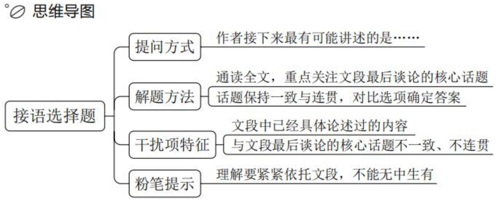
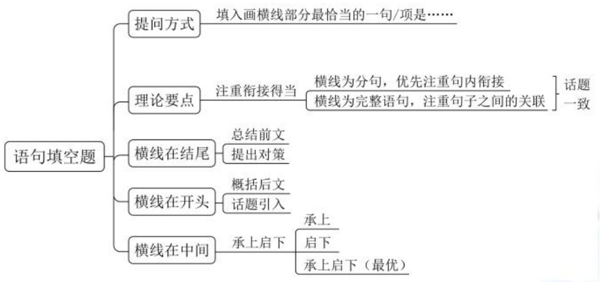

# 精讲精练-言语5

(笔记)

主讲教师：郭熙

授课时间：2025.02.24

# 精讲精练-言语5（笔记）

【注意】前四节课讲解片段阅读中的两种必考题型，一个是中心理解题，是基础且重要的题型；另一个是细节判断题。

# 第二章 语句表达

一、语句排序题  
二、语句填空题  
三、接语选择题

【注意】语句表达：题量不大，但从近几年真题来看，难度越来越高。

1. 语句排序题。2-3 道题。  
2. 语句填空题。2-3 道题。  
3. 接语选择题。少的话 1 道题，多的话 3-4 道题。

第五次课学习重点内容:

(1)接语选择题的解题思维和技巧  
(2)语句填空题的解题思维和技巧

【注意】第五次课学习重点内容:

1. 接语选择题的解题思维和技巧。  
2. 语句填空题的解题思维和技巧。

# 第一节 接语选择题

# 【提问方式】

作者接下来最有可能讲述的是……

这是一篇文章的开头/引言，这篇文章最可能介绍的是：

# 【注意】接语选择题:

1. 作者接下来最有可能讲述的是……。问下文的内容,不是让大家任意猜测,而是要根据给定文段的内容来把握。

2. 这是一篇文章的开头/引言，这篇文章最可能介绍的是。开头和引言的作用是引出下文。

# 【理论要点】

1. 通读全文，重点关注文段谈论的核心话题  
2. 核心话题保持一致与连贯，对比选项确定答案

# 【干扰项特征】

1. 文段中已经具体论述过的内容  
2. 与文段谈论的话题不一致，不连贯

例 1: 小张的学习态度很好。然而, 小张的学习方法有问题。

例 2: 小张面临找对象难的问题。原因在于一方面小张年纪大了……; 另一方面小张多次受过伤……。

# 【注意】

# 1. 理论要点:

(1) 不能只看最后一句话, 对于有难度的题目来说, 很有可能掉坑, 做题时要通读全文, 重点关注文段谈论的核心话题。拿到接语选择题的文段, 可以按照中心理解题理解和分析文段的方式, 找重点, 把握核心话题。  
(2) 核心话题保持一致与连贯, 对比选项确定答案, 好的答案是比较出来的。

# 2. 干扰项特征:

(1) 文段中已经具体论述过的内容。  
(2) 与文段谈论的话题不一致, 不连贯。如文段论述我特别喜欢周杰伦,一直论述周杰伦的内容, 接下来不会说我给大家唱一首孙燕姿的歌。  
(3) 上述例 1, 重点在 “然而” 后, 强调学习方法有问题, 间接下来可能谈论的内容, 下文要围绕学习方法展开论述。  
(4) 上述例 2, 问接下来最可能讲的内容, 前面提出问题, 接下来分析原因, 按照正常逻辑, 下文应论述如何解决小张找对象的问题。

【例1】（2024国考）获得“低损伤、高分辨、动态实时”的功能图像是医学影像技术研究的核心目标之一。医学电阻抗成像技术因无创、无损、无辐射等优势备受关注，并在对急性呼吸窘迫综合征的治疗中发挥了积极作用。由于人体不同组织和器官的电特性不同，从中获得的电特性图像也会存在差异，这些图像包含丰富的解剖学信息，也能反映组织和器官的生理、病理状态和功能变化，对疾病诊断具有重要的临床价值。然而实现高质量的图像重建是电阻抗成像技术领域的巨大挑战，获取功能医学影像大数据在临床上也极其困难。

这段文字接下来最可能讲的是:

A. 对医学图像重建方法的探索  
B. 共享功能影像大数据的意义  
C. 电阻抗成像技术的实际应用  
D. 图像对疾病诊疗的重要作用

【解析】1. 问“接下来”，接语选择题。文段比较专业，它的结构往往会比较清晰，不要恐惧。“获得……目标之一”给出技术研究的目标。“医学……积极作用”论述技术发挥了积极作用。“由于……临床价值”都在论述图像有作用、有价值。尾句“然而”表转折，重点在转折后，通过“挑战”“困难”提出问题，正常情况下，下文要解决问题，论述到底怎么重建图像，锁定A项。

B 项: 共享的前提是获得、重建医学图像, 应在 A 项的后面, 排除。  
C 项：尾句“然而”后强调实现高质量的图像重建是挑战，并非单纯围绕技术展开，选项与尾句话题不一致，排除。  
D 项：是转折前已经论述过的内容，非重点，排除。【选 A】

【例2】（2025国考）电动垂直起降航空器是航空飞行器的一种，是低空飞行器的一种，无人驾驶，无需传统机场和跑道，像直升机一样垂直起飞，使用纯电动力。这一技术设想目的是实现城市内和都市圈城际间点对点出行，或将在未来成为空中出行的重要方式，并形成新的广阔市场。2023年中央经济工作会议指出，打造生物制造、商业航天、低空经济等若干战略性新兴产业。低空经济产业链条长、应用场景丰富，对构建现代产业体系具有重要作用，发展空间极为广

阔。有白皮书预测，到2025年，低空经济对中国国民经济的综合贡献值将达3万亿至5万亿元。

这段文字接下来最可能讲的是:

A. 低空飞行器的动力模式分类  
B. 电动垂直起降航空器的推广难点  
C. 低空飞行器相对于传统交通工具的优势  
D. 政府对发展低空经济提供的支持和保障

【解析】2. 问“接下来最可能讲的是”。“电动垂直起降航空器……广阔市场”引出航空器，指出它的作用。“2023年中央经济工作会议”是官方会议，需要领会会议精神，“2023年……新兴产业”强调要重点打造新兴产业。“低空经济……5万亿次”都围绕低空经济这个新兴产业论述，下文要围绕“低空经济”展开，锁定D项。

A、B、C项：均缺少“低空经济”，排除。【选D】

【例3】（2023湖北选调）就业是最大的民生。维护好新就业形态劳动者劳动保障权益，事关更充分更高质量就业，事关公平正义，事关社会的和谐稳定。全国目前有236家网约车平台企业，取得许可的网约车驾驶员超过351万人，外卖送餐员规模达到770万人……新就业形态已成为吸纳就业的重要“蓄水池”。新就业形态的劳动者通过辛勤劳动，为满足群众多样化需求作出了积极贡献，也是推动数字经济蓬勃发展的重要力量。千方百计维护好新就业形态劳动者劳动保障权益，为他们创造更好的职业环境、发展环境，解决好他们的后顾之忧，才能不断增强新就业形态劳动者的获得感、幸福感、安全感，增强职业吸引力。

根据上述文字推测，接下来作者最有可能讨论的是：

A. 新就业形态的兴起使得劳动者劳动权益保障问题凸显  
B. 维护新就业形态劳动者劳动保障权益是一个系统工程  
C. 保障新就业形态劳动者权益才能使平台经济行稳致远  
D. 新就业形态的发展受制于思想认识和监管政策的滞后

【解析】3. 问“接下来”为接语选择题。“就业是……和谐稳定”论述维护新就业形态，劳动者劳动保障权益很重要。“全国目前……770万人”都在列数

字, 是举例子。“新就业形态……重要力量”论述新就业形态很重要。“千方百计维护好……后顾之忧”出现“千方百计维护好”, 是提出对策。“才能……吸引力”是对策带来的效果、作用、好处。文段对策是重点, 下文要围绕对策展开。

B 项: “系统工程” 即涉及到方方面面的工作, 是围绕对策论述的, 当选。

A、D 项：尾句已经提对策了，下文不会再论述问题，均排除。  
C 项: 选项 “才” 之后只提到了平台经济的作用, 而文段不是单纯强调平台经济, 是事关方方面面的, 对劳动者本身、国家也有好处, 选项单纯论述平台经济, 表述片面, 排除。【选 B】

【例 4】（2023 深圳）任何系统要想得以发展，都离不开正确的决策。影响决策的因素有很多，其中最重要的就是决策赖以做出的信息。无论对国家治理，还是对组织管理，信息质量往往决定决策质量的高低。问题是，如何才能获得正确决策所需的信息？最容易令人想到的是影响信息获取的外部原因，比如科技发展水平、事物的复杂性、突发事件的随机性等。而实际上，影响有效信息获取的，除了技术原因，还有内部的组织原因。

这段文字接下来最有可能谈论的内容是:

A. 技术原因和组织原因的区别  
B. 组织原因的内涵和对决策的影响  
C. 获取正确决策所需信息的途径  
D. 作出正确决策所必需的内部条件

【解析】4. 问“接下来”为接语选择题。首句论述决策很重要。“影响决策的……高低”论述信息对决策来说很关键。“问题是……信息”提出问题。“最容易令人……原因”给出回答。“比如”举例子。尾句“而实际上”表转折，说明前文的外部原因不重要，尾句落脚点转到了内部的组织原因上。下文应围绕内部的组织原因论述。

A 项: “技术原因” 非重点, 排除。

C 项: 未论述清楚所需信息的途径是从外部还是从内部获得, 表述不明确,排除。

对比B、D项：尾句核心话题在组织原因，内部原因有很多，组织原因只是

内部原因的一个方面，因此下文应围绕组织原因展开论述，D项单纯论述内部条件，范围太大，故锁定B项。【选B】

【例5】（2025国考）在青藏高原高寒草甸的多年冻土区，地下水或土壤水分迁移冻结导致地下冰聚集，使地表隆起形成的丘状地带便是冻胀丘。冻胀丘中土壤结构和植物根系的破坏，改变了地表径流，导致部分缓坡和低地积水严重，继而引起草地破碎化和地表裸露区增加等草地荒漠化问题。随着冻土内冰的消融和水分流出，地下有时会形成较大的空洞区，地表发生沉降和塌陷，往往会造成地区植被和土壤的显著退化。冻土区随着表层冻土的解冻融化，坡体中的饱水松散土层和风化层间的摩擦力减小，在重力作用下，沿斜坡缓慢流动或蠕动形成融冻泥流，这也会使植被和土壤遭到强烈破坏。

这段文字接下来最可能介绍青藏高原：

A. 冻胀丘对高原生态系统的危害  
B. 地表植被的恶劣生存状况  
C. 多年冻土区的形成原因  
D. 冻土所致荒漠化的防治措施

【解析】5. 问“接下来”为接语选择题。“在青藏高原……冻胀丘”论述冻胀丘由冻土形成。“冻胀丘中……荒漠化问题”论述冻土让缓坡低地积水严重，最终引发草地荒漠化问题。“随着……显著退化”中植被和土壤的显著退化就是围绕荒漠化论述的，地下形成空洞区、地表发生塌陷就是前文的低地积水严重。“冻土区……强烈破坏”中“也”表并列，斜坡对应前文缓坡积水严重。后文对前文两方面问题展开分析，共同造成的问题是草地荒漠化严重，下文就要解决问题，锁定D项。

A、B、C项：A、B项均是问题，C项是原因分析，都不是对策，排除。【选D】

【注意】如果看不出后面四行是对前面问题进行分析，可以把握文段从头到尾都在论述问题，问题是冻土带来的，有草地荒漠化的问题，冻土造成地区植被和土壤的显著退化，也会让植被和土壤遭到破坏，整个文段就是论述冻土造成荒

漠化，下文要针对性解决问题，锁定D项。A、B项内容前文已经论述过，下文不会再论述，均排除。C项，文段论述冻土带来荒漠化的问题，不是在论述冻土区本身怎么形成，未提及“荒漠化”这个核心话题，排除。

【例6】（2024深圳）以往探讨快递过度包装的时候，不少人习惯归咎于卖家，认为他们是过度包装的罪魁祸首，实际上并不完全如此。对于卖家来说，层层叠叠、最终沦为垃圾的包装材料，都是他们用真金白银买回来的，过度包装不仅无法带来实质性收益，还会增添额外的成本。表面上看，快递过度包装是一个环保观念的问题，更深一层探究，其中折射出的是快递行业的内部管理问题：“野蛮快递”屡见不鲜，由于对快递运输环节不放心，商家希望以过度包装来取信消费者，消费者希望通过过度包装带来安慰，双方一拍即合，快递包装也因此越来越厚重。

这段文字接下来最可能续写的内容是:

A. 缓解快递过度包装的关键在于快递企业  
B. 对于过度包装，有必要从执法层面予以规范  
C. 过度包装导致的资源浪费和环境污染日趋严重  
D. 追求浮夸的消费理念助长了商家过度包装的行为

【解析】6. 看到首句出现“以往”“不少人”，要知道后面要转折、反驳，后文论述“实际上并不完全如此”。“对于卖家来说……成本”都不重要。后文出现“表面上看”，后面就会给出本质，所以前半部分不重要。“更深一层……管理问题”论述折射出快递行业内部的管理问题。“：”后都围绕快递行业的内部管理论述。下文也要围绕快递行业、快递企业展开论述，锁定A项，可以解决上文问题。

B 项：前文不是在论述执法不到位，而是强调快递企业的内部管理，排除。  
C、D 项：均是问题表述，且未提及“快递企业”这个核心话题，D 项的“商家”不重要，排除。【选 A】

【例 7】（2024 国考）隋唐盛世的形成主要得益于制度创新。东晋南朝以来，世家大族把持朝政，皇权极不稳定。隋文帝取代北周后，为防止关陇集团等势力

过分强大,威胁大一统的中央集权,废除了察举制这一士族赖以维系的选举工具,打破了以门第和军功为主的选拔标准,通过考核治理国家的专门知识,选拔人才参与新政权的管理,实现了贵族官僚政治向文官政治的转变,为成就隋唐盛世打下了坚实基础,奠定了后世王朝选官的基本格局,在中国选举制史上具有重大意义。

这是一篇文章的引言，文章标题应该是：

A. 科举制度在唐代政治中的利与弊  
B. 贵族官僚政治瓦解的制度原因探析  
C. 中国古代选官制度的变迁及启示  
D. 科举制度创建对选官制度变革的影响

【解析】7. 问“这是一篇文章的引言，文章标题应该是”，引言的作用是引出后文，文章标题和引言引出的核心话题要保持一致。首句引出的核心是制度创新。“东晋南朝……新政权的管理”论述隋以前是察举制，隋文帝废除察举制，通过考核选拔人才，即科举制。“实现了……重大意义”论述通过考核专门知识选拔人才，也就是科举制度创新带来的意义效果。整个文段引出的核心话题是“科举制度”，下文要围绕“科举制度”展开论述。

B 项: 仅是科举制度带来作用的一方面, 非重点且片面, 排除。

C项: 有的同学看到 “东晋南朝” “隋文帝”, 就觉得是单纯时间顺序展开,这就忽视了首句引出的核心话题, 首句已经论述了隋唐盛世的形成主要得益于制度创新, 后面的东晋南朝只是引入, 重点要看隋文帝的做法, 即废除察举制, 通过考核知识选拔人才, 所以制度创新就是 “科举制度”, C项的 “选官制度” 范围扩大, 排除。

A 项: 仅论述唐代, 文段论述的是隋唐盛世, 选项范围缩小, 且选项论述利与弊, 文段不是侧重分析利在哪、弊在哪, 后面都是在论述影响, 排除。【选 D】

【注意】制度创新、通过考核治理国家的专门知识选拔人才——科举制度。

【特殊问法】接下来不可能谈论的是

1. 看清问题，避免掉坑

# 2. 理论要点:

(1)排除下文可能论述的选项  
(2)若选项有前文论述过的内容, 即为答案

例：由于公务员考试报考的人数越来越多，考试难度越来越高。因此，需要认真听课，高效刷题，做好总结。

关于公务员考试，接下来最不可能讲的：

A. 如何认真听课 
B. 如何高效刷题 
C. 如何做好总结 
D. 难度越来越高的原因

【注意】特殊问法：接下来不可能谈论的是，是要选错的。

1. 看清问题，避免掉坑。  
2.理论要点：

(1) 排除下文可能论述的选项。有的选项是下文有可能论述的，和文段核心话题一致，就要排除掉，剩下的就是答案。  
(2) 若选项有前文论述过的内容, 说明下文它就不可能再论述, 这样的表述就是答案。

3. 例：问“接下来最不可能讲的”，重点在“因此”后的结论上，A、B、C项接下来都可能论述，锁定D项。D项在开头论述过，接下来不可能论述，当选。

【例 8】（2024 四川）作为新型生产要素，数据已成为数字化、网络化、智能化的基础性资源，并快速融入生产、分配、流通、消费和社会服务管理等各环节。通过数据，可以更好地理解自然和社会的运行规律，推动生产力发展，优化生产关系，促进国家和社会治理。但数据并非自在之物，而是人类协作与互动的结果。数据不仅承载着个人、市场主体与国家的大量信息，关系到公民个体人格权益、市场主体财产权益以及国家安全和社会公共利益，还呈现出不同于传统知识产权的全新特点。如何既鼓励数据的充分流通利用，又通过制度设计进行科学合理的权益配置和风险防控，就成为信息时代制度创新的重大课题。

关于数据，接下来最不可能谈的是：

A. 与传统生产要素的区别  
B. 流通中涉及的权益主体

C. 流通中风险产生的原因  
D. 对相关制度创新的要求

【解析】8. 问“接下来最不可能谈的是”，要选错的，把下文可能论述的排除掉，剩下的就是答案。“作为……全新特点”引出数据这个话题，指出它非常有价值、非常重要。“如何……重大课题”在提出问题，指出重大课题，下文应围绕尾句展开论述。尾句围绕制度创新展开论述，D项就有可能论述，前面是并列的两个方面，论述流通利用要做好权益配置，对应B项，后面又有风险防控，对应C项，B、C、D项和尾句内容都可以对应，下文可能论述，要同时排除。此时就可以锁定A项。【选A】

【注意】尾句提出新时代的重大课题，话题发生变化，若要论述A项，应出现在前文，从这个角度，A项在接下来最不可能论述。

【注意】接语选择题:

1. 提问方式：作者接下来最有可能讲述的/最不可能讲述的是。要看清楚提问方式。  
2. 通读全文，按照中心理解题分析文段的方法，把握文段最后谈论的核心话题，找到文段的重点内容。从做题角度，话题要保持一致与连贯，对比选项确定答案。  
3. 如果文段引出新的话题，下文要围绕这个新话题展开论述；如果文段最后提出问题，下文可能分析问题，也可能解决问题，要结合选项判断，如果选项没有针对性对策，选围绕问题的分析展开，如果选项没有分析表述，就选针对性对策；如果文段提出问题+分析原因，下文要给出对策。

4. 干扰项：文段已经论述过的内容；与文段最后谈论的核心话题不一致。如果要选错的，排除下文有可能讲的，或者选择上文已经具体论述过的。  
5. 粉笔提示：理解要紧紧依托文段，不能无中生有。

# 第二节 语句填空题

# 【提问方式】

填入画横线部分最恰当的一句/项是……

# 【注意】语句填空题:

1. 难度在提升。  
2. 提问方式：填入画横线部分最恰当的一句/项是……。

理论要点：注重衔接得当

1. 横线为分句，优先注重句内的衔接。  
2. 横线为完整语句，注重句子之间的关联。

注意：话题一致

例：（2022 国考）__________，最能代表一个时代的风貌，最能引领一个时代的风气。……在欧洲文艺复兴运动中，……在我国发展史上，……。

A. 文艺是铸造灵魂的工程  
B. 文艺是时代前进的号角

【注意】理论要点：不能看哪个读起来顺就选哪个，可能觉得四个选项都很顺，也可能一上来就排除了正确答案，觉得正确选项不符合语感，然后在剩下的选项中纠结。做题原则是要注重内容上的衔接得当。

1. 横线为分句，优先注重句内的衔接。  
2. 横线为完整语句，注重句子之间的关联。  
3. 注意：话题一致。  
4. 例：横线在开头，且是首句的一部分，优先考虑和后面分句的衔接，横线要体现和时代的关系，锁定 B 项。后文是在围绕文艺论述。

理论要点：

# (一) 横线在结尾

1. 总结前文  
2. 提出对策

例：（2022 联考）星系远离银河系的速度和星系与银河系的距离之间的比率大致恒定，这一比率被称为哈勃常数，该数值与宇宙的年龄直接相关——哈勃常数数值越大，宇宙的年龄就越小。哈勃常数比之前测得的要高出  $9\%$  ，那么由它测出的将是

A. 一个年轻约 10 亿年的宇宙  
B. 一个年老约 10 亿年的宇宙

【注意】横线在结尾:

1. 总结前文。  
2. 前面提出问题，尾句给出解决的对策。  
3. 例: 横线处应填入一个结论, 前文引出哈勃常数这个话题, “哈勃常数……越小”给出关系。哈勃常数变高，年龄就变小，锁定A项。

【例 1】（2024 江苏）博物馆研学，要“研之有物”“学而广博”。博物馆研学不是“打卡”拍照的旅游，也不仅是提供托管服务，而是要让年轻一代明白，生而为中国人，最根本的是有中国人独特的精神世界，有百姓日用而不觉的价值观。近年来，中华文明探源工程等重大工程的研究成果，进一步证实了我国悠久的人类史和璀璨的文化史，其中也包含着中华优秀传统文化、革命文化和社会主义先进文化。这些都被缩影于文物当中。因此，博物馆研学，就是要__________。

填入画横线部分最恰当的一项是:

A. 从文物中学习这些文化  
B. 深入了解中华文明的独特性  
C. 不断提高自身文化素养  
D. 有的放矢地学习历史和文化

【解析】1. 横线在最后，前面出现“因此”，是对前文的总结，且“要”后引导对策、做法。首句论述研究要有东西支撑。“博物馆研学……价值观”出现，“不是……而是……”，“不是”引导的内容不重要，有的同学看到“独特的精

神世界”直接选择B项，不要冲动，要接着往下看。“近年来……文物当中”通过“这些”指代前文，独特的精神世界、价值观这些历史文化的东西最终浓缩在文物中，这就是“研之有物”，前文强调的核心话题是“文物”，锁定A项。

B、C、D项：均未提及“文物”，排除。【选A】

【例 2】（2025 国考）与传统业态相比，新业态顺应多元化、多样化、个性化的产品或服务需求，实现产业与互联网、大数据、云计算、人工智能等新技术深度融合，通过采用新技术和新模式，为市场引入新元素、丰富新场景，促进新岗位、新就业形态不断涌现，创造更多就业机会。新业态既提供新的高技能岗位，扩大对高水平劳动力的需求，又通过带动传统产业转型升级，实现对传统职业和岗位的再造，释放新的就业需求。当前，我国有超 2 亿灵活就业人员，新就业形态__________。

填入画横线部分最恰当的一项是:

A. 已经成为吸纳就业的重要“蓄水池”  
B. 有助于促进区域间劳动资源的互补与共享  
C. 为高技能劳动力流动提供充足机会  
D. 是有效缓解重点群体就业压力的 “缓冲器”

【解析】2. 尾句在文段末尾，对前文总结。“与传统业态……就业机会”论述新业态创造了更多就业机会。“新业态既能……就业需求”都在论述新业态对就业的吸纳作用。横线要总结前文，体现要通过灵活就业人员、新就业形态吸纳更多人就业，锁定A项，包含“吸纳就业”的话题，“蓄水池”进行形象化比喻，把新就业形态吸纳就业的功能比喻成蓄水池。

D项：（1）文段未提及“重点群体”，若当选，前文应论述现在就业的重点群体有年轻人、农民工，针对这样的重点群体应采取什么方式来缓解他们的就业压力；（2）A项“蓄水池”和D项“缓冲器”的作用不一样，“蓄水池”是吸纳就业、解决就业问题，“缓冲器”只是单纯做缓冲，而文段不是单纯做缓冲；（3）“超2亿”只是强调数量多，未强调重点群体是谁，排除。

B 项：未提及话题“就业”，且“区域间”文段未论述，排除。

C 项：仅对应一方面，表述片面，排除。【选 A】

【粉笔拓展】高频话题：新业态、新模式——就业的“蓄水池”

(2025 国考) 当前, 我国有超 2 亿灵活就业人员, 新就业形态已经成为吸纳就业的重要 “蓄水池”。  
（2024湖北）电子商务从业人员规模超过6000万，新业态、新模式创造了大量新职业、新岗位，成为就业“蓄水池”。  
（2023 湖北选调）全国目前有 236 家网约车平台企业，取得许可的网约车驾驶员超过 351 万人，外卖送餐员规模达到 770 万人。……新就业形态已成为吸纳就业的重要“蓄水池”。

【注意】涉及到新业态、新模式对就业的作用，往往形容成就业的“蓄水池”，体现出对吸纳就业很重要。

例 3（2024 山东）社火原本是属于农民的自演自娱活动，来源于古人对土地和火的崇拜。社，即土地神；火，即火祖，也即火神。农业中国，是土地给了人们立足之本。《礼记·祭法》载：“共工氏之霸九州也，其子曰后土，能平九州，故祀以为社。”火可以熟食、取暖，是人类创立文明的显著标志。崇拜土地与火__________，这逐渐演化成了规模盛大、内容繁复的传统民间娱乐活动。

填入画横线部分最恰当的一项是:

A. 表达了古人对社与火的朴素情感  
B. 奠定了农业文明发展的民俗基础  
C. 产生了祭祀社与火的风俗  
D. 体现了古人土地为本的理念

【解析】3. 横线在结尾，看纯看尾句不好把握，看前文内容。首句引出社火的话题，接着引出《礼记·祭法》载，看到“故祀以为社”可知，中间部分引出祭祀，本身是一种活动。横线处对前文做总结，与前文祭祀做承接，后文论述演化成了民间娱乐活动，锁定C项，“风俗”是风俗活动。

A、B、D项：均体现不出祭祀的风俗活动，排除。【选C】

【注意】分总结构。

例 4（2024 贵州）在确定是否认识一个人时，我们的大脑会做出三个反应。首先，我们会确认这个人的面部特征，例如他是双眼皮还是单眼皮，高鼻梁还是薄嘴唇；之后，大脑根据这些特征进行人脸识别，判定我们是否认得这张脸；最后再回忆他的名字。简而言之，我们在看到一张脸后，大脑只需简单地识别是否见过；而人的名字藏在记忆的某个角落，我们需要通过检索、回忆等过程，才能最终确定答案，比识别更加复杂。所以__________。

填入画横线部分最合适的一项是:

A. 大脑确定是否认识一个人的过程非常的复杂  
B. 记住一个人的名字比记住他的长相要难得多  
C. 大脑根据一个人的面部特征来回忆他的名字  
D. 记忆名字需要与对词语、句子的记忆相联系

【解析】4. 横线在结尾，“所以”为结论词，对前文做总结，把握前文重点。“在确定……他的名字”围绕大脑的反应展开论述。“简而言之”本身为结论词，前文不重要，重点看后文，“我们在看到……复杂”前后进行对比，“；”之前论述单纯看长相识别起来很简单，“；”之后论述记住人的名字更加复杂，文段“简而言之”之后强调记名字比记长相更复杂、更难，锁定B项。

A 项：对应开头的引入，非重点，排除。  
C项：对应“简而言之”之前，非重点，且未体现不出记住人的名字这件事更加复杂、更难，排除。  
D 项: “词语、句子” 文段未提及, 排除。【选 B】

例 5（2024 江西）经济活动的可持续性和相关金融资产的价值依赖于生物多样性和环境提供的生态系统服务。与气候变化类似，生物多样性丧失也是本世纪面临的最大危机之一。导致环境恶化和气候变化的罪魁祸首是大量不考虑环境影响、破坏生物多样性、只顾赚钱的投资活动。因此，__________。

填入划横线部分最恰当的一句是:

A. 在保护生物多样性方面金融业有着不可推卸的责任  
B. 人类将面临气候变化和生物多样性丧失的巨大危机

C.应逐步建立对金融机构管理的监管框架和稳定机制  
D. 导致环境恶化的根本原因是大量经济活动的可持续性

【解析】5. 横线在结尾，“因此”对前文做总结。“经济活动……服务”论述经济活动和金融相关资产的价值依赖生物多样性。“与气候变化……之一”通过“最大危机之一”强调生物多样性丧失这件事，生物多样性丧失会影响经济活动、金融资产。“导致……投资活动”中“罪魁祸首”指不考虑环境影响、破坏生物多样性、只顾赚钱的投资活动。

前文有三句话，都出现了话题“生物多样性”，说明这个话题相当于文段主题词，“因此”对前文做总结，所以横线处也要提到“生物多样性”。

C 项：选项对策针对的对象是“金融机构”本身，属于跑题、表述不明确、范围过于宽泛，文段强调的话题是“生物多样性”，排除。

A 项：与前文内容可以匹配，对比择优，当选。  
B 项：为问题表述，且只提到了“气候变化和生物多样性”，未提及“经济活动/金融活动”，排除。  
D 项: “经济活动的可持续性” 这件事不一定是坏的, 如要实现可持续发展,选项本身表述不正确, 且非对策表述, 排除。【选 A】

【注意】粉笔提示：纠结时，关注文段核心话题。话题一致性原则对做语句填空题非常重要。

大量经济活动和金融资产依赖于生物多样性和环境提供的生态系统服务。如果这些生态服务体系受到严重破坏，金融就有可能面临巨大的风险。……与气候变化类似，生物多样性丧失也是人类本世纪面临的最大危机之一。过去50年，因土地利用、毁林、野生动物利用与贸易在内的人类活动加剧了地球生态的脆弱性。……导致环境恶化和气候变化的罪魁祸首是大量不考虑环境影响、只顾赚钱的投资活动。现在我们发现，破坏生物多样性的大量经济活动的背后，也是一大批不顾生物多样性破坏的投资项目。因此，在保护生物多样性方面，金融业有着不可推卸的责任，监管部门必须建立要求金融机构重视生物多样性保护的激励和约束机制。

——新浪财经《专访马骏：生物多样性风险应被纳入金融监管框架》

【注意】例 5 原文。

理论要点:

# (二) 横线在开头

(1) 需对后文进行概括  
(2) 话题引入、前期铺垫

举个小例：__________。首先，你的长相不符合我的审美；其次，你的身高不符合我的要求。

A. 你是个好人  
B. 我们不能在一起

举个小例：__________。但是，我们不合适。首先，他的长相不符合我的审美；其次，他的身高不符合我的要求。

A. 小郭是个好人  
B. 我和小郭不能在一起

【注意】横线在开头：保证横线处话题要和后文一致。

1. 有可能是文段总括句，总领全文，需要概括后文来把握。  
2. 话题引入，后文具体展开。  
3.示例：

(1) 后文的并列结构为具体展开，横线处进行概括，强调我们不能在一起，对应 B 项。A 项填入文段相当于没有说完，后文要接转折。  
(2) 横线后出现 “但是”, 位于转折之前, 只是引入, 对应 A 项。

例 1（2023 广东）农村生态文明建设，__________。一是必须加速由高耗能、高污染的粗放型农业生产方式向清洁循环的集约型农业发展方式转变，加强农业科技研发与推广应用，建立全产业链绿色化农业发展模式。二是促进农业资源循环利用，积极推进农业清洁生产，提高禽畜养殖废弃物资源化利用。

以下句子填入画横线处，最恰当的是：

A. 必须与美丽乡村建设紧密结合  
B. 必须大力推进绿色循环农业发展  
C. 必须充分利用科技研发促进农业生产

D. 必须树立 “绿水青山就是金山银山” 的价值导向

【解析】1. 横线在开头，“一是……二是……”通过并列结构对首句进行并列分述，横线处要概括后文。后文的两个对策均围绕“农业”论述，均强调实现绿色循环农业的发展，锁定B项。

A 项: “美丽乡村建设”话题扩大, 排除。  
D 项：强调绿水青山的经济价值，要保护环境，与“农业”无关，排除。  
C 项：未提及 “绿色循环”, 排除。【选 B】

例2（2024黑龙江人民警察）在现阶段的中国，________：从技术上，人形机器人的发展高度依赖于机器人、人工智能等技术，而我国在这些领域的积累都十分深厚。我国是世界第一的工业机器人应用大国，工业机器人的装机量超过全球的  $50\%$  ，在机器人的研发、制造和应用上已经有了大量的技术和经验储备。而在人工智能领域，我国的技术实力居于世界领先水平。这些技术条件足以为我国的人形机器人发展提供有力的支持。在供给上，我国制造业的产业门类齐全、产业体系完整，这使得中国在人形机器人的制造上具有强大的潜力。而在需求上，我国大规模、多层次、多需求的市场为人形机器人的应用提供了广阔的部署环境和测试空间，并有望催生巨大的市场需求。所有的这些因素都将有助于人形机器人产业在我国的高速发展。

填入横线处最恰当的一项是:

A. 人形机器人产业有望迎来高速发展  
B. 发展人形机器人产业具有很多的先天优势  
C. 支持人形机器人发展需完善相关产业链和供应链的建设  
D. 人形机器人迅速发展对经济和社会发展起到积极作用

【解析】2. 横线在开头，“：”表解释说明，所以要重点关注“：”之后的内容，和横线处话题、内容要保持一致。“从技术上……有力的支持”均在论述我国在技术上发展人形机器人产业的优势。“在供给上……潜力”论述在供给上的优势。“而在需求上……高速发展”论述在需求上的优势。“：”之后的内容从技术上、供给上、需求上论述我国发展人形机器人产业具备的优势，全面概括，锁定B项，“先天优势”即自己本身就具备的优势。

A 项: “有望”代表没有发生, 是对未来的预测, 而文段 “: ”之后的内容都是已经具备的, 选项与后文衔接不当, 排除。  
C 项: “需”引导对策, 文段后文论述已经具备的优势, 排除。  
D 项：未提及产业的发展，排除。【选 B】

例 3（2024 四川）信息化深入发展，使社会交往范围扩大，__________。传统的社会交往主要局限于相对狭小的熟人范围，人们之所以遵守伦理道德很大程度上是因为相对狭小的熟人圈子中无所不在的外在监督。现代社会交往基于强大信息技术的互联网，进一步打破传统交往的时空限制，成为了普遍性的社会交往。这就要求人们具备更高程度的道德自律、更高程度的宽容与尊重，从而促进形成以普遍的诚实、守信为价值基础的现代社会公德。

填入画横线部分最恰当的一项是:

A. 与传统社会交往相对单一的熟人社会有较大区别  
B. 只有守信的人才能在社会交往中赢得他人的尊重  
C. 这对社会交往中的人提出了更高的伦理道德要求  
D. 形成了以普遍的诚实守信为价值基础的社会公德

【解析】3. 横线在开头，横线后是句号。“传统的社会交往……外在监督”论述传统的社会交往情况。“现代社会交往……社会交往”把传统和现代进行对比。“这就要求”提出要求，对伦理道德提出更高的要求。横线后把传统和现代社会交往进行对比，横线前论述“信息化深入发展”，是现代的社会交往，说明传统的部分不重要，且“使社会交往范围扩大”对应“现代社会交往……交往”，故横线处要对应尾句“这就要求……公德”，锁定C项。

A 项：体现不出对伦理道德要求提出了更高期待，排除。  
B 项: “守信”表述片面, 排除。  
D 项: “形成了”说明已经形成了、已经有了, 文段 “这就要求” 说明没有形成, 比如你每天晚上熬夜打游戏, 打到凌晨两三点, 你的父母要求你必须 12 点之前睡觉, 说明没有发生, 选项与文段时态矛盾, 排除。【选 C】

例 4（2024 广东）“__________”。各地各部门要牢固树立人才是第一资

源的发展理念，把教师队伍建设作为基础工作，健全中国特色教师教育体系，提升教师教书育人能力，提高教师政治地位、社会地位、职业地位，不断优化教师管理和资源配置，营造全社会尊师重教的浓厚氛围，让教师成为全社会最受尊重和令人羡慕的职业之一。

以下句子填入画横线处，最恰当的是：

A. 经师易求，人师难得  
B. 国将兴，必贵师而重傅  
C. 桃李不言，下自成蹊  
D. 师也者, 教之以事而喻诸德者也

【解析】4. 四个选项是名言警句，不仅考查对文段的理解，还要求对名言警句有准确地理解，平时阅读可以积累。横线在开头，后文通过做法营造的是全社会尊师重教的氛围，故横线处要体现社会尊重教师，教师的地位非常高，对应B项，指国家将要兴盛，一定要尊敬老师并看重有技能的人。

A项：指教读经书的老师容易找，而教做人道理的老师很难得，强调老师自身要有高尚的品德，体现不出全社会尊师重教，排除。  
C 项: 意为桃树和李树不用说话, 会结很多精美的果实, 自然而然吸引人来到树下, 形成一条小路, 比喻为人真诚笃实, 自然能感召人心, 体现不出尊重教师, 排除。  
D 项: 指老师的职责, 是教导学生应做些什么, 并阐明其中所体现的各种德行, 强调老师的责任所在, 不强调尊师重教, 排除。【选 B】

# 理论要点:

# (三) 横线在中间

1. 注意与上下文的联系  
2. 把握好主题词，保证文段话题一致

举个小例：（2021 国考）戴口罩等遮挡条件下的人脸识别其实是一项“老”技术，此前研究人员在解决军事刑侦和视频监控问题时就曾长期研究过该技术，并发展出诸多成熟应用。因此，__________。但是以往的技术基础并没有完全打消人们对戴口罩人脸识别“先天不足”的顾虑。

B. 该技术的稳定性和准确率是有一定基础的  
D. 人脸识别并不需要对全脸进行整体识别

【注意】横线在中间：承上启下。

1. 注意与上下文的联系。  
2. 把握好主题词，保证文段话题一致。  
3. 示例：横线前有“因此”，横线后有“但是”，横线处对前文做总结，前后话题要衔接，要体现技术是有基础的，对应B项。D项“人脸识别”范围扩大，文段为“戴口罩等遮挡条件下的人脸识别”，且未提及话题“技术基础”，与后文衔接不当，排除。

例 1（2025 国考）相对于狭义的农业即种植业而言，大农业是指广义的农业，不仅包括种植业、林草业、畜牧业和渔业，还包括产前的技术研发、品种繁育与推广、水利建设、农机生产与销售、农资储备与供应等，产后的烘干、储藏、运输、加工、营销与进出口贸易等，由此形成一个与农业发展有关、为农业发展服务的庞大产业体系。可以说，__________。发展现代化大农业就是要构建一个现代化的大农业产业体系，这也是当前我国构建现代乡村产业体系的核心所在。

填入画横线部分最恰当的一项是:

A. 大农业是对农业及其紧密联系的相关产业的高度概括  
B. 农村产业融合化发展是当今乡村产业发展的必然趋势  
C. 大农业是在当前技术条件下实现的对小农经济的超越  
D. 发展现代化大农业应该因地制宜推进农业规模化经营

【解析】1. 横线在中间，“可以说”为结论词，相当于“因此、所以”，对前文做总结，前文给大农业下定义，后文论述怎么做。横线处的总结更多对大农业的定义做概括，锁定A项。

B 项：未提及 “大农业”, 排除。

C 项: “小农经济” 文段未提及, 排除。

D 项: 不适合放在横线处, 如果问 “接下来有可能讲”, 可以选择 D 项, 是对策, 排除。【选 A】

例2（2024山东）近年来，从新能源汽车下乡到绿色智能家电下乡，一系列高品质工业品从“稀罕物”变成“必需品”，有效提升了农民生活水平。多年经验告诉我们：工业品下乡绝不意味着“积压品下乡”，更不能拿质次价廉的商品糊弄消费者，________。比如，有的家电企业看到，一些地区的农民喜欢把洗衣机放在露天小院使用，于是重新设计洗衣机产品外壳，解决了下雨导致的生锈问题；有的企业专门推出能在较大电压波动范围内正常启动的冰箱，适应了部分农村地区的环境和条件。惠民生、增福祉是工业品下乡的政策初衷。牢牢把握这个基点，才能让“下乡”的动能更足、活力更强，真正提振消费、拉动内需。

填入画横线部分最恰当的一项是:

A. 要深入调研农村消费群体，了解其实际需求  
B. 高品质满足农村地区消费者实际需求才是硬道理  
C. 要统筹兼顾，破解难题，切实激发家电企业的积极性  
D. 充分发挥乡村消费市场的重要作用，用好工业品下乡政策

【解析】2. 横线在中间，开头引出高品质工业品，“积压品下乡”、质次价廉的商品指的是低品质的商品，故横线处要体现应该怎么做，低品质的不行，所以要体现出高品质。“比如”为举例子，后文论述这些企业通过这些做法满足了农民的需求，解决了农民的问题，承上启下，对应B项。

A 项：体现不出高品质，且 A 项是了解需求，B 项是满足需求，文段后文论述解决了、适应了，不是单纯了解，排除。  
C 项: “统筹兼顾”范围太广, 体现不出高品质, 也体现不出满足消费者需求, 排除。  
D 项：后文举例子未体现用好政策，排除。【选 B】

例 3（2024 贵州）众多民间手艺、戏曲等非物质文化遗产的遗失，与文化传承人缺乏丰厚的收入有关。即便以外部力量进行保护性抢救，往往也只是将其“标本化”，难以恢复其原生活力。__________。比如，《中国通史》等纪录片在视频平台上收费观看，使传统文化释放出可观的商业价值，纪录片创作方、版权方、播出方实现商业共赢；有花丝镶嵌技艺非遗传承人入驻电商平台，一年多来售出超 20 万件工艺产品。填入画横线部分最恰当的一项是：

A. 文化产业在新的发展能量集聚下将释放出更多精彩  
B. 正是对传统文化的创新演绎成就了文化产业的发展  
C. 只有新媒体技术的加持，才能推动传统文化的传播  
D. 只有文化消费市场活跃，传统文化创作才能有动力

【解析】3. 横线在中间，关注前后文内容。首句提出问题，“即便……原生活力”论述通过外部力量解决不了问题。横线处正常情况下要给出正确的解决问题的对策，“比如”之后给出做法。

A、B 项：分别论述未来的情况、已经发生的情况，均不是对策，没有论述怎么解决问题，均排除。  
C 项: “新媒体技术的加持” 就是外部力量, 文段已经论述外部力量不行,选项与前文矛盾, 排除。  
D 项: “文化消费市场活跃”说明文化传承人才能赚到钱, 能够解决前文问题, 正确, 当选。【选 D】

【注意】粉笔提示：提出问题+解决问题+举例说明。纠结时关注问题的核心话题。

例 4（2024 江苏）菟丝草只能攀附寄生在其他植物上。他们的生长永远成不了规模，也不能长久，一般是第一年生机勃勃，第二、第三年就会枯萎而死。原因何在？主要是它们将寄生植物体上的营养成分吸走了太多，导致被寄生的植物生命力和抵抗力迅速下降，进而抵御不了虫害和自然灾害的攻击，最后枯死。__________？所寄生的植物死了，菟丝草也就活不长了，枯死也就在所难免。

填入画横线处最恰当的一项是:

A. 皮之不存，毛将焉附  
B. 覆巢之下，安有完卵  
C. 茂树之下，岂有丰草  
D. 城门失火，殃及池鱼

【解析】4. 四个选项类似于名言警句、俗语。横线在中间，横线前后论述所

寄生、所依存的事物没有了，它就死了，体现寄生、依附，锁定 A 项，比喻事物失去了借以生存的基础，就不能存在。

B 项：强调全家遭殃，意思是整体遭殃，部分也不能保全，是整体和部分的关系，“攀附、寄生”不是整体和部分的关系，排除。  
C 项：比喻在强大的势力下，弱者会受到压制和侵害，与文段不匹配，并非强大的东西也死了，排除。  
D 项：比喻因牵连而受祸害或损失，体现不出二者之间依附、共生的关系，排除。【选 A】

【随堂练习】（2023山东）新征程上看“贯彻”，要铺开“全面覆盖”的广度。__________。党的二十大所作出的决策部署涵盖改革发展稳定、内政外交国防、治党治国治军各方面，谋划和推动地区部门工作要以贯彻党中央决策部署为前提，始终坚持系统观念，牢固树立全国一盘棋思想，创造性开展工作，做到既为一域增光，又为全局添彩。

填入画横线部分最恰当的一项是:

A. 空谈误国，实干兴邦  
B. 不谋全局者, 不足谋一域  
C. 世异则事异，事异则备变  
D. 路虽远, 行则将至

【解析】拓展。横线在中间，横线前后均强调站在全局的立场上考虑问题，锁定B项，意为如果要做成一件事情，就得全局考虑，否则很难成功。

A 项: 意为只泛泛而谈地讨论国家大事、不联系实际解决问题, 会耽误国家的发展, 只有脚踏实地、真抓实干, 才能使国家兴旺发达, 不是强调站在全局的角度考虑, 排除。  
C 项: 意为社会变化了, 一切事情也要随着变化; 情况变化了, 与之相适应的措施也要改变, 强调与时俱进的思维, 排除。  
D 项: 意为前进的路程虽然遥远, 但是只要坚持走下去, 就会有抵达目的地的时候, 排除。【选 B】

# 【注意】

1. 可以作为答题素材的积累。  
2. 给大家推荐学习强国 APP，除了言语需要阅读积累文段之外，申论也需要做素材的积累，学习强国里面有板块叫“思想”，可以重点关注，里面有领导人的重要讲话，平时可以多阅读，领会领导精神，和领导人同频共振，里面还有两个专栏，一个是“学习金句”，还有一个是“引经据典”，真题中考的名言警句往往考查领导人引用过的金句。

  
【语句填空题思维导图】

# 【答案汇总】

接语选择题 1-5: ADBBD; 6-8: ADA

横线在结尾 1-5: AACBA

横线在开头 1-4: BBCB

横线在中间 1-4: ABDA

遇见不一样的自己

Be your better self