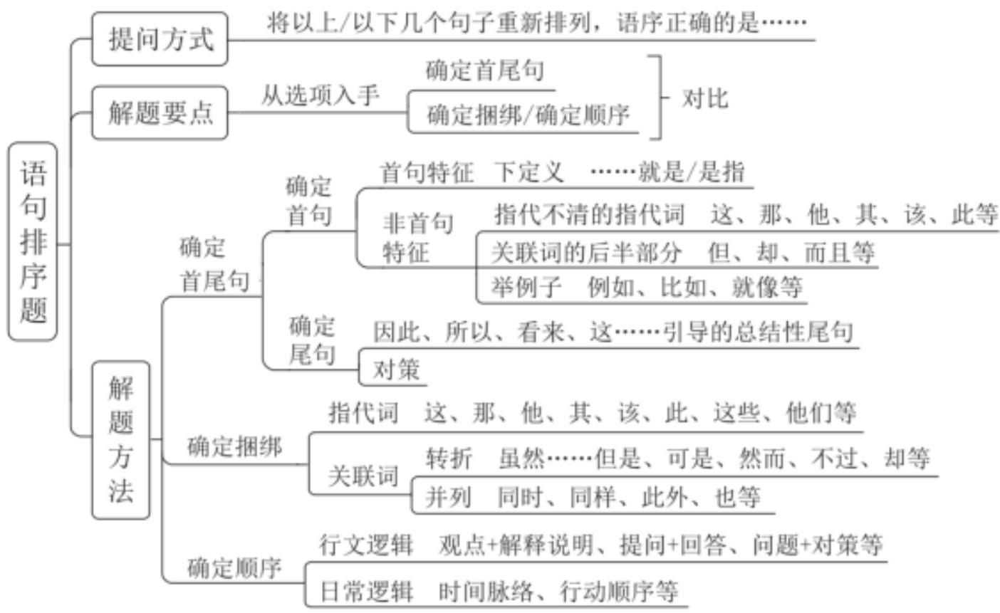

# 精讲精练-言语6

(笔记)

主讲教师：郭熙

授课时间：2025.02.25

  
粉笔公考·官方微信

# 精讲演练-言语6（笔记）

【注意】上节课讲解到了语句表达的题型，重点讲解了接语选择题和语句填空题，本节课讲解语句排序题。

第六次课学习重点内容:

(1)语句排序题的解题思维  
(2)确定首尾句、捆绑集团、顺序的方法与应用

【注意】第六次课学习重点内容:

1. 语句排序题的解题思维。  
2. 确定首尾句、捆绑集团、顺序的方法与应用。  
3. 语句排序题在国考中是必考题型，且近几年的真题难度比较高。

第一节 语句排序题

【提问方式】

“将以下几个句子重新排列组合最连贯的是？”

(1)  
(2)  
(3)  
(4)  
(5)  
(6)

将以下几个句子重新排列组合最连贯的是:

A. ①④②③⑤⑥  
B. ②④③①⑥⑤  
C. ②③①④⑤⑥

D. ①②③④⑥⑤

【注意】语句排序题:

1. 题量：考查 2-3 题，如果做对了就可以拉开与对手的差距，对于取得高分有意义。  
2. 如果一道题给出标序号的句子并且打乱了顺序，需要排序，就是语句排序题。  
3. 如果自己排序, 可能花费时间排出的顺序在选项中没有, 故要借助选项的顺序, 排除错误的顺序, 找出正确的可能。不能根据读得是否通顺去选择答案,如果根据语感做题, 可能觉得正确答案不顺畅, 可能不符合语感, 现在的出题人为了增加难度, 可能给出的 6 个句子不是紧挨着的 6 句话, 可能①来自第 1 段,②③来自第 2 段, ④⑤来自第 3 段, ⑥来自 5 段。如果根据语感选择, 可能读起来不顺畅, 语句排序题重点关注句与句之间的内在逻辑。

# 【理论要点】

1. 根据选项提示对比后确定首尾句  
2. 确定捆绑集团/确定顺序

关于验证：用 1 个点找到答案建议验证，且只验证你基本确定的答案；

用 2-4 个点找到答案，建议不验证。

# 【注意】理论要点：

1. 根据选项提示对比后确定首尾句。  
2. 确定捆绑集团/确定顺序。如果发现③⑤的话题紧密衔接, 应该挨在一起,可能就要确定捆绑去做题。还可以确定顺序, 如④论述我下午分手了, ⑥论述我上午脱单了, 根据逻辑, 先脱单, 再分手, 故⑥在④前, 中间可能有其他句子,如中午吵架了。  
3. 对比择优的思维贯穿言语的始终。  
4. 关于验证: 用 1 个点找到答案建议验证, 且只验证你基本确定的答案, 如只通过首句或者只通过捆绑就确定了答案, 验证前后逻辑是否顺畅, 如果前后逻辑矛盾, 说明选项错误; 用 2-4 个点找到答案, 如根据首句排除 A 项, 根据捆绑排除 B 项, 根据顺序排除 C 项, 考场上为了节约时间, 建议不验证。

5. 考场上, 建议用 1-1.5 分钟做一道语句排序题。

# 一、确定首尾句

# （一）下定义

……就是/……是指/所谓……, 指的是

举个小例:

③科举是一个影响重大且利弊都十分显著的考试制度  
⑤科举制度在使人们重视读书应举的同时,也造成了过分重视考试结果的功利主义价值观

【注意】确定首尾句:

1. 确定首句：下定义适合作首句，如文段开头论述分享经济就是……/是指……，下定义起到引出话题的作用，再如所谓盲盒指的是……，也是下定义。不是出现下定义就一定作首句，做题要对比内容来判断。  
2. 示例：③通过下定义“是”引出科举的话题，⑤论述科举制度的影响，根据逻辑，先引出话题，再论述影响，故先③后⑤，这是通过对比思维来做题。  
3. 以上没有将背景引入作为专门的类型列出来，主要是因为这种表述大家比较熟悉，结合近几年的真题，往往形式上出现“近年来”，后面出现“也、然而”，如果只看“近年来”可能掉坑。

【例 1】(2024 贵州)①而一些飞鸟会凭借着敏锐的感知能力发现这一变化

(2)为了逃生，这些动物就会表现出异常的举动  
③地震发生之前发出的次声波，能够被许多动物提前感知到  
④地震出现之前，地球的磁场也会发生变化  
⑤地震的出现，是板块随着时间的推移，进行不断的挤压和碰撞下形成的自然现象  
(6)所以在地震来临之前, 鸟类就会因为磁场的变化, 而率先感知到了危险,并做出异于平常的行为

将以上 6 个句子重新排列, 语序正确的一项是:

A. ⑤③②④①⑥

B. ⑤④①⑥③②  
C. ③②④①⑥⑤  
D. ③⑤⑥①④②

【解析】1. 对比首句③⑤。⑤“是”为下定义，引出地震的话题；③围绕地震的发生情况论述，引出次声波的话题，根据逻辑，先引出地震，再围绕地震展开论述，故⑤在③前，排除C、D项。

结合选项，判断⑤③还是⑤④，④“也”表并列，根据逻辑，④前应论述地震发生之前先出现变化，⑤只是单纯为地震下定义，没有强调变化，故⑤④衔接不当，排除B项。

(3)论述次声波会被许多动物提前感知到, ②“异常的举动”说明与平常不一样, 体现变化, ④论述变化, 故③②④的衔接没有问题。

对比尾句②⑥，②没有论述完，⑥“所以”得出结论，⑥更适合作尾句，锁定A项。【选A】

# 【注意】方法梳理:

1. 判断首句：⑤-下定义，先⑤后③，排除CD。  
2. 寻找捆绑：也-②④捆绑，排除 B。  
3. 对比尾句②⑥，⑥“所以”表总结，适合作尾句。

# 一、确定首尾句

# (二) 非首句特征

指代不清的指代词：他/她/它/他们、这/那/此等

关联词后半部分：然而、所以、同时、也等

举例子：比如、例如、就像等

举个小例:

(1) “诗教” 也因此逐渐成为社会伦理道德和文化建设的重要部分  
②“诗教”在周代被广泛应用于现实生活  
(3)比如祭祀、宴饮、举行射礼等场合都要歌《诗》

【注意】非首句特征:

1. 指代不清的指代词：他/她/它/他们、这/那/此等。  
2. 关联词后半部分：然而、所以、同时、也、则等，这些词前面应该有内容。  
3. 举例子：比如、例如、就像等。  
4. 示例：①“也因此”是关联词的后半部分，③“比如”为举例子，均不适合作首句，故②适合作首句。

【例 2】(2024 四川)①最近一项研究发现，在相似的容貌背后，这些人也共享着相似的基因特征

②多年以来，加拿大艺术家布吕内勒致力于寻找世界各地长相酷似的人，并为他们拍摄照片  
(3)世间存在一些毫不相关却长得很像的人, 他们没有血缘关系, 看起来却像失散多年的双胞胎  
④研究者通过艺术家联系到其中 32 对容貌酷似的受试者, 利用面部识别算法对其相似度进行量化, 并对唾液样本进行基因分析  
(5)这有助于理解基因如何造就人的容貌, 或许也能让从 DNA 重建面部特征的技术变得更加准确  
⑥结果显示, 容貌相似度最高的受试者基因中的共同点也最多, 其中最相似的 9 对受试者共享了 19277 处单核苷酸多态性特征, 涉及 3730 个基因

将以上 6 个句子重新排列, 语序正确的是:

A. ①⑥②④⑤③  
B. ②③①⑥⑤④  
C. ③①②④⑥⑤  
D. ④⑥①⑤③②

【解析】2. 对比首句①②③④，各不相同，①“这些人”前面应有指代对象，不适合作首句，排除A项。④“其中”是指代词，前面应有指代内容，不适合作首句，排除D项。

④ “其中”是指代词，结合选项，判断⑤④还是②④，④提及艺术家，故④前应论述艺术家，②提及艺术家，④指代②艺术家找到的长相酷似并拍照片的人，故②④捆绑，锁定C项。⑤未提及艺术家，⑤④捆绑不当，排除B项。

根据⑥“结果显示”和④“进行分析”，判断④在前，⑥在后，锁定C项。【选C】

# 【注意】方法梳理:

1. 判断首句：①- 这些人，④- 其中，排除 AD。  
2. 寻找捆绑：艺术家、其中-②④捆绑，排除 B。  
3. 验证：分析-结果显示-有助于，先④后⑥⑤。

【例 3】(2024 山东)①德国生物化学家康拉德·布洛赫在 1994 年首次预测了这类分子的存在

②但他的结论是，这些介于中间的原始分子永远不会被发现，因为它们无法在地质记录中存活下来  
(3)某权威杂志公开的一项研究报道了在古岩石中发现的一类新类固醇, 并确认了复杂真核生物久远的史前史  
(4)新研究表明事实并非如此, 原生类固醇的痕迹能在岩石中保留超过 10 亿年  
(5)他提出, 在从羊毛固醇到胆固醇的漫长生物合成途径中, 每个短暂存在的中间体在几亿年前都曾是完全适应的最终产物, 而且这些产物的每一个都是在其前体基础上的演化进步  
(6)这片“失落的世界”的发现,也证实了诺贝尔奖得主康拉德·布洛赫关于存在原生类固醇分子的预测

将以上 6 个句子重新排列, 语序正确的一项是:

A. ③⑥①⑤②④  
B. ⑥⑤④③①②  
C. ③①⑤④⑥②  
D. ④③⑥①②⑤

【解析】3. 对比首句③④⑥。④“如此”是指代词，前面应有内容，不适合作首句，排除D项。⑥“这片”是指代词，前面应有指代对象，不适合作首句，排除B项。

(6) “失落的世界”出现双引号, 是形象化表达, 不能根据这个词说前文没有出现, 就直接排除了, 如果③之前接什么不清楚, 可以对比尾句②④, ②论述这些分子永远不会被发现, 因为无法保存, ④论述新研究表明事实并非如此, 是对于②结论的反驳, 故②在前, ④在后, 锁定 A 项。【选 A】

# 【注意】

# 1. 方法梳理:

(1) 判断首句: ④- 如此, ⑥- 这片, 排除 BD。  
(2) 对比尾句: 先②后④, 排除 C。

2. 有的同学根据①⑥均出现相同的人名“康拉德·布洛赫”，根据①论述预测，⑥论述证实，就判断①在⑥前，这就是本题的坑。

# 【文段梳理】

《自然》杂志7日公开的一项研究报道了在古岩石中发现的一类新类固醇，并确认了复杂真核生物久远的史前史。这片“失落的世界”的发现，也证实了诺贝尔奖得主康拉德·布洛赫关于存在原生类固醇分子的预测。

真核生物被认为已存在了 20 亿年之久。这类生物的化石很罕见, 所以研究人员只能寻找分子化石——比如真核生物留在岩石上的类固醇代谢物。不过, 寻找这类化石的难度很大。

澳大利亚国立大学科学家团队研究认为, 这些生物标志物一直在那里, 只不过存在形式与之前预想的不同。他们此次报道了在中元古代沉积岩中发现的被称为原生类固醇的分子, 证实了至少在 16 亿至 8 亿年前, 早期真核生物就在水生环境中占据了生态优势。

德国生物化学家康拉德·布洛赫在 1994 年首次预测了这类分子的存在。他提出在从羊毛固醇到胆固醇的漫长生物合成途径中, 每个短暂存在的中间体在几亿年前都曾是完全适应的最终产物, 而且这些产物的每一个都是在其前体基础上的演化进步。但他的结论是, 这些介于中间的原始分子永远不会被发现, 因为它们无法在地质记录中存活下来。新研究表明事实并非如此原生类固醇的痕迹能在岩石中保留超过 10 亿年。

--科技日报《十亿年前岩石中发现“失落的世界”》

【注意】原文中关于康拉德·布洛赫这个人的表述出现在第一段和最后一段，中间还有其他内容，出题人将中间的内容删掉了，原文第一段给出结论，通过证实预测说明存在原生类固醇分子的预测是正确的，后面展开分析，证实是新研究结论，后面预测是展开分析，最后通过“新研究表明事实并非如此”进行反驳。

【例4】（2024国考）①据有关机构估算，每年损失浪费的食物超过  $22.7\%$  约9200亿斤，若能挽回一半的损失，就够1.9亿人吃一年

②食物节约减损既可有效减轻供给压力，也可减少资源使用，善莫大焉  
③我国居民食用油和“红肉”人均消费量，分别超过膳食指南推荐标准约1倍和2倍  
(4)当前, 食物采收、储运、加工、销售、消费每个环节都有 “跑冒滴漏”, 情况还相当严重  
⑤要树立节约减损就是增产的理念，推进全链条节约减损，健全常态化、长效化工作机制，每个环节都要有具体抓手，越是损失浪费严重的环节越要抓得实  
⑥消费环节大有文章可做，不仅要制止“舌尖上的浪费”，深入开展“光盘行动”，还要提倡健康饮食

将以上 6 个句子重新排列, 语序正确的一项是:

A. ①⑥③②④⑤  
B. ①③④⑤②⑥  
C. ④①⑥③②⑤  
D. ④②⑤③①⑥

【解析】4. 对比首句①④，形式上均适合作首句，对比内容，④提及每个环节，包含前面的各个环节，④“跑冒滴漏”是浪费，①列数字的作用相当于举例子，围绕“跑冒滴漏”的严重情况进行分析，故④在①前，排除A、B项。

结合选项，判断④①还是④②，④①衔接得当，②“节约减损”是对策、做法，②强调做法带来的作用、效果，对策应该放在后面，故④②衔接不当，排除D项，锁定C项。【选C】

# 【注意】

# 1. 方法梳理:

(1) 判断首句: ④- 提出问题, 1- 举例说明, ④再①前, 排除 AB。  
(2) 对比选项: ④①还是④②, 观点+举例, ④①相连, 排除 D。

# 2. 粉笔提示：注意首句对比。

# 【文段梳理】

当前，食物采收、储运、加工、销售、消费每个环节都有“跑冒滴漏”，情况还相当严重。据有关机构估算，每年损失浪费的食物超过  $22.7\%$  ，约9200亿斤，若能挽回一半的损失，就够1.9亿人吃一年。消费环节大有文章可做，不仅要制止“舌尖上的浪费”，深入开展“光盘行动”，还要提倡健康饮食。我国居民食用油和“红肉”人均消费量，分别超过膳食指南推荐标准约1倍和2倍。食物节约减损既可有效减轻供给压力，也可减少资源使用，善莫大焉。要树立节约减损就是增产的理念，推进全链条节约减损，健全常态化、长效化工作机制，每个环节都要有具体抓手，越是损失浪费严重的环节越要抓得实。

--求是《加快建设农业强国推进农业农村现代化》

# 【注意】

1. 大家梳理语句排序题的时候可以梳理正确的文段，把握正确的逻辑。  
2. 原文, 开头论述跑冒滴漏的情况严重, 后面通过列数据、举例子进行解释说明, “我国……2 倍” 围绕健康饮食论述, ⑥③衔接得当。

# 一、确定首尾句

# (三) 尾句特征

总结性尾句/对策性尾句

因此、所以、看来、于是、这、应该、需要……

举个小例:

(1)摊贩有生存需求，且能便利百姓生活，但城市运行需要合理的秩序，经营占道、噪声扰民、环境污染等问题也亟待破解  
④结合城市发展和百姓需求实际，引导小商小贩依法依规经营，是城市治理

精细化的题中应有之义

【注意】尾句特征:

1. 总结性尾句，得出结论，如因此、所以、看来、于是、这。  
2. 对策性尾句，如应该、需要。  
3. 不是看到“因此、需要”就一定作尾句，重点还是要对比内容进行判断。确定首尾句的时候，排除不适合的选项，剩下的才是答案。  
4. 示例：①引出问题，④“应有之义”如听课、刷题是上岸的应有之义，强调应该做的事情，是对策，故对策更适合作尾句。

【例 5】（2024 国考）①当前，我国荒漠化、沙化土地治理呈现出“整体好转、改善加速”的良好态势，但沙化土地面积大、分布广、程度重、治理难的基本面尚未根本改变

②现实表明，我国荒漠化防治和防沙治沙工作形势依然严峻  
③我国是世界上荒漠化最严重的国家之一, 荒漠化土地主要分布在三北地区,而且荒漠化地区与经济欠发达区、少数民族聚居区等高度耦合  
④荒漠化、风沙危害和水土流失导致的生态灾害，制约着三北地区经济社会发展，对中华民族的生存、发展构成挑战  
⑤我们要充分认识防沙治沙工作的长期性、艰巨性、反复性和不确定性，进一步提高站位，增强使命感和紧迫感  
(6)这两年, 受气候变化异常影响, 我国北方沙尘天气次数有所增加将以上 6 个句子重新排列, 语序正确的一项是:

A. ①③⑥⑤②④  
B. ②⑤⑥①④③  
C. ④①③②⑥⑤  
D. ③④①⑥②⑤

【解析】5. 方法一：对比首句①②③④，①围绕荒漠化治理论述，②论述荒漠化的防治，③论述荒漠化的事情，根据逻辑，应先论述荒漠化严重，再论述防治荒漠化，故③在①②之前，锁定D项。

方法二：对比尾句③④⑤，③④论述问题，⑤“要”引导对策，故⑤更适合

作尾句，排除A、B项。

根据逻辑，先引出荒漠化严重，论述其分布在三北地区，再论述荒漠化制约三北地区的发展，故③在前，④在后，锁定D项。【选D】

# 【注意】方法梳理:

1. 对比首句：荒漠化-荒漠化防治，③在①②前。  
2. 对比尾句: ③④-问题, ⑤-对策, ⑤更适合做尾句。  
3. 逻辑顺序：先③后④。

【例 6】(2024 山东)①所以, 未来乡村旅游精品线路的升级, 一方面需要加强对乡村地区的文化资源整合和挖掘, 将其有机融入乡村旅游产品和活动中,打造具有浓厚文化氛围的旅游体验

②文旅融合下的乡村旅游对于传承中华文明具有重要意义，在增进文化交流与理解的同时，也使人们更能意识到中华文明的独特性和卓越贡献，增强对中华文明的自豪感和认同感  
(3)此外, 乡村旅游在发展过程中存在一定的同质化现象, 没有深入挖掘自身的差异化优势，形成品牌效应  
④通过对文化属性的强调, 乡村旅游可以更好地传承和展示中华文明的丰富内涵, 吸引更多游客参与和体验, 同时促进乡村的经济发展和文化传承  
⑤不过，从整体来看，目前乡村旅游发展并不均衡，一、二线城市近郊发展比较好，但仍有相当多乡村的文化资源禀赋和场景价值还没有得到充分释放  
⑥另一方面，还要有意识地借助文化品牌来凸显文化属性，打造独特的乡村旅游品牌形象，提高其在市场上的知名度和吸引力

将以上 6 个句子重新排列, 语序正确的一项是:

A. ②①⑥④⑤③  
B. ②⑤③①⑥④  
C. ④⑤③②①⑥  
D. ④②⑤③①⑥

【解析】6. 本题文字量较多。方法一：对比选项，确定首句②④。②论述乡

乡村旅游可以传承中华文明；④给出具体做法，“更好”为递进关系，强调乡村旅游可以更好地传承和展示中华文明，②在④前，排除C、D项。

对比选项，判断①⑤的顺序。⑤提出问题；①“需要”引导对策，先问题后对策，⑤在①前，锁定B项。

方法二：若首句不好确定，结合选项判断。①出现“一方面”，⑥出现“另一方面”，“需要”引导对策。③出现“此外”，论述“同质化现象”，⑤论述“发展不均衡”，⑤③是问题，问题在前，对策在后，排除A项。

对比尾句④⑥，⑥提出对策，④为对策带来的意义效果，⑥在④前，⑥不适合作尾句，锁定B项。【选B】

【注意】方法梳理:

1. 对比首句:

(1) ④- 更好, ②在④前, 排除 C、D 项。  
(2) 对比选项: ②①还是②⑤, ⑤在①前。

2. 结合选项:

(1) ⑤③-问题, ①⑥-对策, 排除 A 项。  
(2) 对比尾句: 对策-意义, ⑥在前④在后。

# 二、确定捆绑集团

# (一) 指代词捆绑

这、那、他、该、其/这些、它们

举个小例:

(1)甲午中日战争前后共举办 15 年, 有七期毕业生  
②最早兴办的新式军教育机构是 1885 年李鸿章于天津设立的武备学堂  
③该学堂的设立本是中法战争的结果之一，目的是培养下级军士和军官

A. ①③

B. ②③

举个小例:

②它们会激活我们大脑中的恐惧回路，有时候我们会反击，有时候则逃跑  
④新的研究发现了一种神经回路，它使大脑具有“删除”不良记忆的能力，

这项发现可能为焦虑症找到新的治疗方法

⑥嘈杂的声音、有毒的气味、正在靠近的捕食者, 这些因素都会对我们的感觉神经元发出电刺激

A. ④②

B. ⑥②

【注意】指代词捆绑：

1. 这、那、他、该（即这个人，如该生，指这个学生）、其（如其中，指在这当中）；这些、它们（多个、复数指代）。

2. 例:

(1) 结合选项的提示判断指代对象, 不需要每个句子都读一遍。选项只有①③/②③, 无需关注④⑤⑥。①论述毕业生; ②提及武备学堂, ②③捆绑, 锁定 B 项。  
(2) ② “它们”指代多个对象, ④ “一种”“它”“这项”指代一个对象, ④无法捆绑。⑥ “嘈杂的声音、有毒的气味、正在靠近的捕食者”为三个方面, ⑥②捆绑, 锁定 B 项。“这些”指代“嘈杂的声音、有毒的气味、正在靠近的捕食者”, 指代词有指代对象, 可以作首句,

【例 1】(2025 天津)①在药物研究中, 要根据病理过程发生的机制, 找到在临床上对疾病有治疗作用, 且不会对生命其他活动产生副作用或者副作用可控的药物

②现代生物学和医学的发展使人们在生命科学的基础研究领域, 发现了很多关系到正常生理和病理过程的蛋白、酶和信号通路  
(3)例如, 某一蛋白或酶能够影响重要的生命活动, 如果有疾病是这一生命活动的异常导致, 那么理论上, 我们调控这一蛋白或酶就可以治疗这种疾病  
(4)之所以称它们为“潜在靶点”，是因为这些靶点的作用只在基础研究的试验中得到了证明，但在疾病模型，特别是在临床治疗中并没有获得证明  
(5)这样的药物针对的靶点才是真正药物靶点  
(6)我们称这样的靶点为药物的“潜在靶点”，药物化学家就是要通过确证这些靶点来筛选药物

将以上 6 个句子重新排列, 语序正确的一项是:

A. ①④⑤⑥②③  
B. ①②③⑤⑥④  
C. ②③⑥④①⑤  
D. ②①③④⑤⑥

【解析】1. 首句不好判断，找其他线索。④⑥均出现“潜在靶点”，话题一致，判断先后顺序，⑥下定义，④“因为”为原因解释，⑥在④前，排除A、D项。

(3)出现“例如”，选项均是②③，无法解题。⑤出现指代词“这样的药物”，结合选项，判断③⑤/①⑤。①论述要找药物，①⑤捆绑；③未提及药物，③⑤无法捆绑，锁定C项。【选C】

# 【注意】

1. 方法梳理:

(1) 逻辑顺序: 先⑥后④, 排除 A、D 项。  
(2) 指代词捆绑: ⑤-这样的药物, ①⑤捆绑。

2. 很多题目解题线索不唯一, 建议先对比首尾句, 如果无法解题, 再找捆绑、顺序。

【例 2】(2024 广西)①它们不仅记录了长江历年的水文资料, 而且具有很高的文学艺术价值

(2)为配合三峡水库的建设, 我国水下考古工作者已分别对白鹤梁、龙脊石进行了水下调查  
(3)因长江水位变迁，“丰年碑”已完全没于水下不得见  
④位于重庆朝天门码头的“丰年碑”、涪陵白鹤梁历代题刻、云阳龙脊石题刻被称为长江中游的三大石刻碑群  
(5)白鹤梁题刻保存完好, 被誉为世界 “第一古代水文站” 和世界罕见的 “水下碑林”, 是长江三峡水库淹没区内最早被定为 “全国重点文物保护单位” 的遗址  
(6)在水下考古调查研究基础上设计建造的白鹤梁水下博物馆,独具中国特色,成为联合国教科文组织面向全球推广的经典案例

将以上 6 句重新排列, 语序正确的一项是:

A. ④③⑤②⑥①  
B. ④①③②⑤⑥  
C. ⑤③②⑥④①  
D. ⑤④③①②⑥

【解析】2. 对比选项，确定首句④⑤。④“被称为”类似下定义，可以作为引入；⑤无非首句特征，首句不好判断，找其他线索。

①出现指代词“它们”，指代多个对象。结合选项，判断⑥①/④①/③①。④“‘丰年碑’、涪陵白鹤梁历代题刻、云阳龙脊石题刻”为多个对象；③⑥均只有一个对象，排除A、D项。

对比B、C项，区别是④①在开头还是结尾。④下定义引出“丰年碑”、涪陵白鹤梁历代题刻、云阳龙脊石题刻，指出了它们的位置，②③分别对三个方面展开论述，④应放在②③前面，先引出“丰年碑”、涪陵白鹤梁历代题刻、云阳龙脊石题刻，指出它们的位置，再分别论述“丰年碑”、白鹤梁历代题刻、龙脊石题刻，锁定B项。【选B】

# 【注意】

# 1. 方法梳理:

(1) 指代词捆绑: ①- 它们, ④①捆绑, 排除 A、D 项。  
(2) 逻辑顺序: ④①在前, ③②在后。

2. ④“称为”为下定义，引出三个方面，⑤“白鹤梁题刻”只是围绕其中一个方面展开论述，先④后⑤，排除C、D项。

# (二) 关联词捆绑

(1)配套出现（虽然……但是……）  
(2)单独一个（但、甚至、同时 分析句子意思）

举个小例:

(1)然而，监管执法的覆盖面毕竟有限，执法成本也相对较高  
④要从根本上保障小投资者的利益，固然要有强有力的外部保护，而增强其

自我保护能力也同样重要

⑤随着监管力度加强，很多损害中小投资者利益的违法行为受到严厉处罚

A. ④①

B. ⑤①

【注意】关联词捆绑：

1. 配套出现：虽然……但是……；一方面……另一方面……。不一定捆绑，要对比选项判断。如②出现“虽然”，④出现“但是”，选项有②④捆绑、②⑤捆绑，确定②⑤捆绑不当，锁定②④捆绑。  
2. 单独一个：但、然而（转折）；甚至（递进）；同时、也（并列），分析前后句子意思，根据逻辑关系解题。  
3. 例：①出现“然而”，论述监管执法不好，转折前应论述监管执法好。⑤论述监管执法的好处，⑤①捆绑，锁定B项。

【例 3】(2024 江西)①已经投入应用的主要是针对健康人群开发的、精准性稍差一些的非植入式设备

②到目前为止，科学家们已经发明了多种获取脑电波的设备  
③近些年来, 科学家们则在开发用于特殊病人的植入式设备上花费了大量精力  
④但基于安全性、伦理性等方面的考虑，一直没有在人类的临床上取得突破  
(5)这类设备被称为脑机芯片或干脆简称为脑机接口, 它能获得更加精准的脑电信息, 也能将外界电信号更加精准地输入大脑  
⑥然而随着人工智能相关技术和工程技术、材料技术的飞速发展，不少科学家又开始了这类尝试

将以上 6 个句子重新排列, 语序正确的一项是:

A. ③②①⑥⑤④  
B. ③⑥④①②⑤  
C. ②①③⑤④⑥  
D. ②④①③⑤⑥

【解析】3. 对比选项，确定首句②③。③“则”相当于转折，前文应有内容，不适合作首句。②无非首句特征，排除A、B项。

②后接①④不好判断，找其他线索。⑥“然而”表转折，论述又开始了尝试，转折前应论述之前尝试过没有成功。结合选项，判断④⑥/⑤⑥。④“一直没有在人类的临床上取得突破”即尝试没成功，④⑥捆绑；⑤论述设备的作用、好处，与是否取得突破无关，⑤⑥无法捆绑，锁定C项。【选C】

# 【注意】

# 1. 方法梳理:

(1) 判断首句: ③-则, 不适合作首句, 排除 A、B 项。  
(2) 对比选项: ⑥- 然而, ④⑥捆绑。

2. 老郭提示：注意首句陷阱，“则”“也”不适合作首句。

【例 4】(2023 山东)①流亡到江南的侨姓士族, 也不可避免面临私家藏书的散失

(2)永嘉之乱导致的文献典籍流失非常严重  
(3)西晋荀勖《中经新簿》著录秘阁藏书有 29945 卷, 东晋之初 “渐更鸠聚”,仅存 3014 卷, 这是朝廷藏书流失的情况  
④如藏书丰富的张嶷、傅颖根两家，永嘉之乱中“避难南行”，最初携带不少书籍，由于逃难不便，只好“料简世所稀有者，各各保录”。这种情况在当时南渡士族中是很普遍的  
⑤因此，东晋初期实际的文献状况，不像朝廷藏书的亡散那么严重  
⑥至于江南旧族的藏书，受到战乱影响相对较小，如钱塘范氏“家世好学，有书七千余卷，远近来读者恒有百余人”

将以上 6 个句子重新排序, 语序正确的是:

A. ②④①③⑥⑤  
B. ②③①④⑥⑤  
C. ③②①④⑥⑤  
D. ①④②③⑥⑤

【解析】4. 对比选项，确定首句①②③。①“也”表并列，前文要有内容，不适合作首句，排除D项。②引出典籍流失的问题；③列数字，为举例子，③不

适合作首句，排除C项。

(1)出现 “也”, 论述私家藏书散失, 结合选项, 判断④①/③①。③论述朝廷藏书流失, ③①捆绑, ④“如”举例子, ④应放在①的后面, 锁定 B 项。【选 B】

# 【注意】

# 1. 方法梳理:

(1) 对比首句: ②- 提出问题, ③- 举例说明, ①- 也, 排除 C、D 项。  
(2) 寻找线索: ①-也, ③①捆绑, ③在①前。  
(3) ④-如, ①在④前。

2. 老郭提示: 注意常识陷阱。① “侨姓士族” 不是姓侨, 而是乔迁到江南的士族。  
3. 侨姓士族：因永嘉之乱从北方南迁江东（又称江左）的士族，仍以中原名族自相标榜，称为侨姓，其中以琅琊王氏、陈郡谢氏、陈郡袁氏、兰陵萧氏为大姓。

# 三、确定顺序

# 1. 行文逻辑

# (1) 观点+解释说明

举个小例:

(1)我们班的同学腿都长  
(2)比如张二狗就有 1.8 米大长腿

# (2) 提出问题+回答问题/提出问题+解决问题

举个小例:

(2)对多数人来说, 何谓元宇宙, 这是必须首先弄清楚的问题。  
(3) Metaverse（元宇宙）即是 Meta（超越）+Verse（宇宙），指超越现实的虚拟世界

举个小例:

②在遥远的古希腊城邦中，哲学是一种生活方式，而不是单纯的理论或者学问

(6)如果我们要理解“什么是哲学，哲学何为”的问题，需要追根溯源，回到哲学诞生之初

【注意】行文逻辑：

1. 观点+解释说明：解释说明可能是举例说明（比如/例如）、数据资料、原因分析（之所以被称为……是因为……）、并列分述（问题+一方面……另一方面……）。上述例题，①为观点，②举例说明，①在②前。  
2. 提出问题+回答问题/提出问题+解决问题:先提出问题,再进行回答/对策。

(1) ②提出问题, ③回答问题, ②在③前。  
(2) ⑥提出问题, ②回答问题, 且 “哲学诞生之初” 衔接 “遥远的古希腊”, ⑥在②前。

【例 1】(2024 辽宁)①关于贺、杨二先生尤其贺先生, 学界知之较多

(2) “黑学” 能传入并扎根中国, 实赖三位川人: 张颐 (1887-1969, 四川叙永人)、贺麟 (1902-1992, 四川金堂人) 和杨一之 (1912-1989, 重庆潼南人)  
(3)此处的“黑学”，是指黑格尔哲学  
④贺先生以翻译《小逻辑》著称，杨先生则以翻译《逻辑学》著称  
(5)历史上, 宋人云 “易学在蜀”; 现当代, 则可曰, “黑学赖川”  
⑥照直说, 若无 “三先生” 早期的研究、译介与推广, 中国的 “黑学” 研究恐怕要另当别论了

将以上 6 个句子重新排列, 语序正确的一项是:

A. ①④②③⑥⑤  
B. ②⑥①④⑤③  
C. ④②⑤⑥③①  
D. ⑤③②⑥①④

【解析】1. 对比选项，确定首句①②④⑤。①不清楚贺先生、杨先生是谁；②引出张颐、贺麟和杨一之；④同样不清楚贺先生、杨先生是谁，对比之下②更适合放在前面，先引出人名，再论述贺先生、杨先生，②在①④之前，排除A、C项。

⑤把历史上和现当代的情况作对比，引出“黑学赖川”；②论述“黑学”能

传入并扎根中国，实赖三位川人，是对“黑学赖川”做解释说明，故⑤在前、②在后，排除B项，锁定D项。【选D】

# 【注意】方法梳理:

1. 对比首句: 2 在 14 之前, 排除 AC。  
2. 逻辑顺序：观点+解释说明-52。

【例 2】(2024 江西)①设施农业大有可为, 要发展日光温室、植物工厂和集约化畜禽养殖, 推进陆基和深远海养殖渔场建设, 拓宽农业生产空间领域

②要构建多元化食物供给体系，在保护好生态环境前提下，从耕地资源向整个国土资源拓展，从传统农作物和畜禽资源向更丰富的生物资源拓展  
(3) “吃饭” 不仅仅是消费粮食，肉蛋奶、果菜鱼、菌菇笋等样样都是美食  
(4)向森林、草原、江河湖海要食物, 向植物动物微生物要热量、要蛋白, 多途径开发食物来源  
⑤耕地以外，我国还有40多亿亩林地、近40亿亩草地和大量的江河湖海等资源  
⑥解决吃饭问题，不能光盯着有限的耕地，要把思路打开，树立大食物观将以上 6 个句子重新排列，语序正确的一项是:

A. ①⑥⑤③②④  
B. ⑥①②④③⑤  
C. ⑥③⑤②④①  
D. ①⑥②④③⑤

【解析】2. 对比选项，确定首句①⑥。①提出具体的对策、做法，论述要发展设施农业；⑥也是对策，论述要把思路打开，树立大食物观，⑥树立的是宏观的思路理念，①为采取的具体行动、做法，正常情况下，应该先打开思路、树立好观念，再采取行动，排除A、D项。

对比选项，判断⑥①②/⑥③⑤，⑥论述要把思路打开，树立大食物观，正常情况下后文要围绕“大食物观”展开论述，③⑤是对⑥中“大食物观”的解释说明，故⑥③⑤相连；①给出具体的行动，⑥①不能直接相连，故排除B项，锁

定 C 项。【选 C】

【注意】方法梳理:

1. 对比首句: 6- 打开思路, 1- 具体做法, 先 6 后 1。  
2. 对比选项：观点+解释说明，635-大食物观。

【例 3】(2024 浙江)①摊贩有生存需求, 且能便利百姓生活, 但城市运行需要合理的秩序, 经营占道、噪声扰民、环境污染等问题也亟待破解

②事实上，许多城市对街头摊贩的管理，都经历了从绝对禁止到逐步开放、分类管理的过程  
(3)如何求取最大公约数  
(4)结合城市发展和百姓需求实际, 引导小商小贩依法依规经营, 是城市治理精细化的题中应有之义  
⑤实践告诉我们，倾听百姓心声，做到统筹兼顾很关键  
(6)摊贩是城市商业的组成部分，对摊贩的服务与监管，是一道需要同时破解“几难”的必答题

将以上 6 个句子重新排列, 语序正确的一项是:

A. (5)(4)(3)(1)(6)(2)  
B. ⑤③④⑥①②  
C. ⑥⑤③④②①  
D. ⑥①③⑤②④

【解析】3. 对比选项，确定首句⑤⑥。⑤为对策、做法，⑥提出问题，问题在前、对策在后，⑥在前、⑤在后，排除A、B项。

方法一：对比选项，判断⑥⑤/⑥①，①论述问题，⑤给出对策，先①后⑤，锁定D项。

方法二：对比尾句①④，①论述问题，④为对策，问题在前、对策在后，锁定D项。【选D】

【注意】方法梳理：

1. 对比首句：逻辑顺序，6 在前 5 在后，排除 AB。  
2. 对比选项：61 还是 65，先 1 后 5。  
3. 对比尾句: 先 1 后 4。

# 1. 日常逻辑

# (1) 时间先后顺序

具体年份、朝代（唐宋元明清）、表示时间的词语（过去、现在、将来）

注意话题一致

(2) 逻辑先后顺序（行动、发展的脉络等）

从小处看……往大处说……

组成的舰队探索世界……探险队伍中增加了专业画师

【注意】日常逻辑：贯彻到现实生活中的方方面面，考查日常的逻辑。

# 1. 时间先后顺序:

(1) 具体年份、朝代（唐宋元明清）、表示时间的词语（过去、现在、将来），注意话题要一致。话题一致、出现时间提示，才能按照时间先后排序，话题不一致不能只看时间。  
(2) 倒叙、插叙往往会出现在回忆录中, 公务员考试选取的文段基本都是相对官方规范的文章。

# 2. 逻辑先后顺序（行动、发展的脉络等）：

(1) 从小处看……往大处说……。正常情况下应该为“从……往……”。  
(2) 组成的舰队探索世界……探险队伍中增加了专业画师。按照行动的先后顺序，应该先组队，再往里加人。

【例 4】(2024 辽宁)①1979 年, 波斯波利斯被列入联合国教科文组织世界文化遗产名录

②波斯波利斯始建于公元前约 518 年, 主要建筑包括万国门、觐见厅、百柱宫、阿帕达纳宫、薛西斯宫殿、书房、金库等, 整个宫殿建筑群历经 3 个朝代才得以完成  
(3)去伊朗一定要看看波斯波利斯古城遗址

④联合国教科文组织评价说, 波斯波利斯古城遗址提供了许多关于古代波斯文明的珍贵资料, 具有重要考古价值  
(5)这座显赫一时、规模宏大的王城后来在马其顿王亚历山大东征时被烧毁  
⑥虽遭焚毁，又历经千年风雨侵蚀，但如今依然高柱林立、巨石横卧

将以上 6 个句子重新排列, 语序正确的一项是:

A. ②③⑤①④⑥  
B. ③②⑤⑥①④  
C. ③①②④⑤⑥  
D. ②①④⑤⑥③

【解析】4. 单纯看首句拿不定，找提示。②论述开始建立，接着介绍组成；⑤论述被烧毁；⑥论述虽遭焚毁，又历经千年风雨侵蚀，但如今依然高柱林立、巨石横卧，对比②⑤⑥，正常情况下，应该是开始建立  $\rightarrow$  开始烧毁  $\rightarrow$  虽遭焚毁，又历经千年来到现在，对比选项找不同，B 项为②⑤⑥相连，其他三个选项都是中间插入其他句子，②⑤⑥均围绕波斯波利斯展开；①④话题一致，均论述“联合国教科文组织”；③从伊朗引出遗址，故①③④不适合放在②⑤⑥之间，故锁定 B 项。【选 B】

# 【注意】方法梳理:

1. 时间顺序：2-5-6。  
2. 对比选项: 256 相连, 14- 联合国教科文组织, 锁定 B 项。

【例 5】(2024 国考)①与以往依靠自身装甲抵御弹药不同, 战车主动防护系统实施贴身或近距离防御且强调先敌主动出击、御“敌拳”于车体之外

②从第二次世界大战至今, 装甲车辆尤其是坦克的性能和数量一直是影响陆战胜负的重要因素  
(3)如果面对的是轻型反坦克武器的近距离突袭,主动防护系统甚至能使装甲车辆的生存概率提高  $3 \sim 4$  倍  
④随着反坦克武器弹药的发展,装甲车辆仅靠自身装甲抗衡来袭弹药的时代已渐渐远去

(5)有关测试资料显示, 加装主动防护系统后, 装甲车辆的生存概率可以提高 1 倍以上  
(6)主动防护系统是通过雷达和光电等探测装置, 感知并获取来袭弹药的运动轨迹和特征, 然后由计算机控制对抗装置, 有针对性地进行自卫

将以上 6 个句子重新排列, 语序正确的一项是:

A. ②④①⑥⑤③  
B. ②④⑥①③⑤  
C. ④⑥①②⑤③  
D. ④①②③⑥⑤

【解析】5. 对比选项, 确定首句②④。②引出坦克很重要; ④话题为反坦克,正常情况下, 应该先有坦克, 才能反坦克, 故②在前、④在后, 排除 C、D 项。

对比③⑤，都出现数字，③“甚至”表递进，程度加重，应该⑤在前、③在后，锁定A项。【选A】

# 【注意】方法梳理:

1. 对比首句：日常逻辑，坦克-反坦克，2在4前。  
2. 关联词捆绑：甚至-53 捆绑。

# 【语句排序题思维导图】

【随堂练习】（2022国考）①海绵是一种最原始的多细胞动物，化石记录最早可追溯到寒武纪时期，至今已发展到一万多种

(2)阿糖腺苷成为首个从海洋天然产物衍生并成功上市的抗病毒药物  
(3)目前, 从海绵提取物中分离得到的天然产物往往具有独特的结构骨架或显著的生理功能, 可用于开发药物和作为有机合成或半合成化学中间体, 具有作为药物先导物的巨大潜力  
(4)日本化学家从日本黑海绵中提取了软海绵素, 并将其衍生成抗肿瘤药物,用于治疗转移性乳腺癌等癌症  
(5)作为一种营固着生长的生物体, 海绵极易被其他生物猎食, 却能在残酷的海洋环境中生存, 可能依赖于独特的化学防御策略  
(6)美国化学家从海绵中分离得到抗病毒药阿糖腺苷和抗癌药物阿糖胞苷的先导化合物

将以上 6 个句子重新排列, 语序正确的一项是:

A. ①⑤③⑥②④  
B. (1)(3)(4)(2)(6)(5)  
C. ⑤①④⑥②③  
D. ⑤③①④②⑥

【解析】拓展. 对比选项, 确定首句①⑤。①通过下定义引出海绵的话题; ⑤围绕海绵的生存特性、防御策略论述, 应该先下定义引出话题, 再围绕其生存特点、防御策略论述, 故①在前, ⑤在后, 排除 C、D 项。

方法一：③话题为海绵提取物，⑤话题为海绵，正常情况下，应该先把海绵论述完，再论述海绵提取物，故①⑤相连，锁定A项。

方法二：②⑥均提到“阿糖腺苷”，话题一致，②论述成功上市，⑥论述分离得到，正常情况下，应该先分离得到，再成功上市，⑥在前、②在后，锁定A项。【选A】

【注意】方法梳理:

1. 对比首句: 1-下定义, 排除 CD。  
2. 对比选项: 13 还是 15, 13 相连。

3. 逻辑顺序：分离得到- 成功上市，先6后2。

# 【答案汇总】

确定首尾句 1-5: ACACD; 6: B

确定捆绑 1-4: CBCB

确定顺序 1-5: DCDBA

遇见不一样的自己

Be your better self