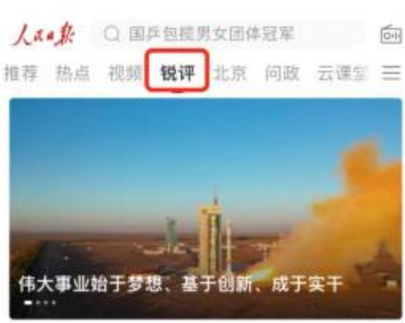
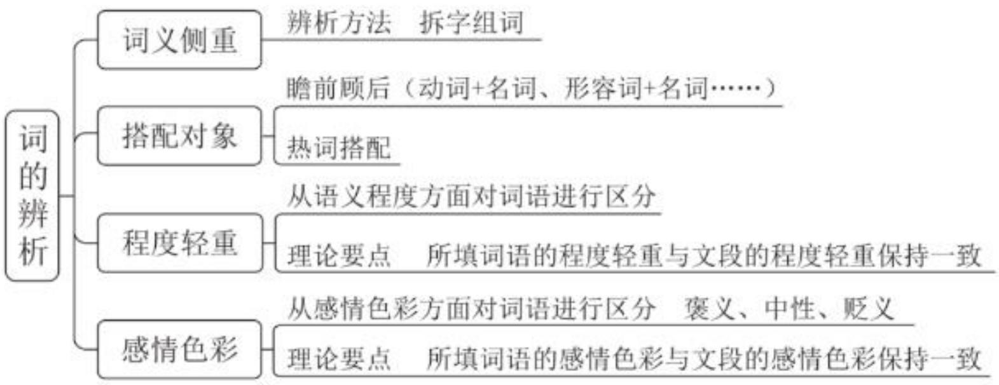

# 精讲精练-言语7

(笔记)

主讲教师：郭熙

授课时间：2025.02.26

  
粉笔公考·官方微信

# 精讲精练-言语7（笔记）

【注意】前面几节课重点讲解片段阅读、语句表达，从本节课开始讲解逻辑填空题。

# 第三章 逻辑填空

# 一、词的辨析

# 二、语境分析

【注意】逻辑填空：在国考中的题量很大，2025年之前，言语共40题，地市卷、行政执法卷中逻辑填空题考查20题，副省卷考查15道，在2025年，国考增加了政治理论，言语题量减少到30题，逻辑填空题考查15题，占言语一半的题量，重要性不言而喻，逻辑填空题是言语难度最高的题型。

问题 1: 语感不靠谱怎么办?

1. 无需舍弃语感，正确的语感可以带来有效预判  
2. 理解文段寻找线索，团队合作对比择优  
3. 正确答案不符合语感，输入记忆库，纠正错误的语感

【注意】问题 1: 语感不靠谱怎么办。

1. 无需完全舍弃语感，语感中一定有正确的部分，不会做 10 道/20 道题全错，正确的语感可以带来有效预判。  
2. 逻辑填空题更侧重对文段前后逻辑的考查，要想做对题，要在理解文段的基础上寻找解题线索，找到前后语句的提示，对于多空题，不能一空秒杀，团队合作的思维很关键，如单纯看第一空 A 项很合适，若第二空有 “猪队友”，要排除。要把握对比择优的做题原则，好的答案一定是比较出来的，刷题、总结时关注点应放在正确答案上（代表考点），很多时候选正确答案不是因为干扰选项是错的，单纯看意思可能两个选项都行，之所以选正确答案，是因为其与文段内容、逻辑的对应更恰当、更准确。  
3. 有些题的正确答案不符合语感，有同学甚至上来就先把正确答案排除了，如果正确答案不符合语感，这部分题目需重点积累，与出题人同频共振很关键，

把不符合语感的正确答案的用法输入记忆库，纠正错误的语感。

2. 词语没积累怎么办?

1. 微信小程序-粉笔快练：高频成语、必备实词  
2. 阅读材料：官媒评论文章（人民网、光明网、新华网、中国社会科学网、求是等）、学习强国（思想-重要讲话、重要文章）  
3. 刷题中积累，题目中出现的词语积累意思和用法

【注意】词语没积累怎么办：集中梳理国省考中考查的高频成语和实词，真题中  $80\% / 90\%$  的词都是历年常考的，不是过于生僻的词。

1. 微信小程序-粉笔快练：如上图，“粉笔快练”中有“每日练习”，每天会推送不同科目的题目，可以练习，下面有“公考加油站”，包含言语、数资，“数资运算”“资料找数”对学习数资起打基础的作用，“高频成语”“必备实词”与言语相关，利用碎片化时间积累、学习。  
2. 阅读材料：逻辑填空题的文段出自官方规范文章，平时建议多阅读官媒评论文章（人民网、光明网、新华网、中国社会科学网、求是等）、学习强国（思想-重要讲话、重要文章）。可以积累言语的规范语感，对申论的学习也有帮助（积累答题素材）。

3. 刷题中积累（比较高效），从现在开始每天刷15道/20道逻辑填空题，积累不认识、认识但用错的词（不是把所有题、所有词都抄一遍，效率较低），积累准确的意思和正确的用法，课上会带着大家进行一定的词语积累，在课件上会呈现需要大家积累的成语、实词的意思，不建议边听边记，关于词语的积累更建议大家在课下完成，课上集中精力听题目的考点、选出正确答案的角度。

  
人民日报：以科技的主动赢得国家发展的主动

  
人民日报54分钟前5评

  
习近平：新时代中国共产党的历史使命

# 【注意】

1. 人民日报：锐评（很多文章都是真题题源的出处）。  
2. 学习强国：思想（重要讲话、重要文章）。

第七次课学习重点内容:

词语辨析的方法与应用

【注意】第七次课学习重点内容：词语辨析的方法与应用。把握正确的做题思维，先读文段，寻找解题线索，再看选项辨析词语，把文段、选项进行匹配。词的辨析是基础，先学习。

# 第一节 词的辨析

一、词义侧重  
二、固定搭配

# 三、程度轻重

# 四、感情色彩

【注意】词的辨析：国省考考查的重点是固定搭配，做到心中有数。

1. 词义侧重。  
2. 固定搭配。  
3. 程度轻重。  
4. 感情色彩。

# 一、词义侧重

权力 泰然

权利 索然

【注意】词义侧重：是最基础的角度，真题会考形近音近词。

1. 权力 VS 权利: 对不一样的字拆字组词, “权力”中“力”可组词“力量”, “权利”中“利”可组词“利益”, 也可以整词搭配, “权力”如国家权力、公权力, 表示国家的力量, “权利”如维护农民工的权利, 还可以用英语区分, “权力”即 power, “权利”即 right。  
2. 泰然 VS 索然：拆字组词不好理解，可以整词搭配，“泰然”可组词“泰然处之、泰然自若”，强调很镇定；“索然”中“索”若组词为“索尼、索额图、索道”，与这个词的意思没有关系，可整词搭配为“索然无味”，表示没有意思。

# 【辨析方法】

1. 用不一样的字组词  
2. 整词进行固定搭配

例：权力 VS 泰然

权利 VS 索然

【注意】辨析方法：以下两种方式在考场上可以灵活运用。

1. 用不一样的字拆字组词：适合在考场上区分。  
2. 整词进行固定搭配：平时要积累词语常用的搭配对象，培养规范的语感。

【例 1】（2024 江西）腾冲地震台主要采取的是监测火山地震、地表变形、火山气体这三类手段。这也是世界范围内在火山监测中应用最多的传统“地基”监测手段。不过，如果仅依赖“地基”手段，由于监测点位____、范围小、成本高、效率低等问题，无法实现整个火山区的大范围场式监测，难以为火山活动____及危险性评估提供全面、准确的信息保障。

依次填入画横线部分最恰当的一项是:

A. 稀少 形态

B. 稀疏 状态

C. 稀奇 状况

D. 稀零 形状

【解析】1. 第一空，“无法实现整个火山区的大范围场式监测”说明前文应体现监测点位相对较少，没那么多、没那么全面，范围小。A项“稀少”中“少”可体现数量少，保留。B项“稀疏”中“疏”可体现数量不多，保留。C项“稀奇”中“奇”可组词“奇怪/奇特/奇葩”，文段未体现点位奇特、奇怪，排除。D项“稀零”中“零”如零散，有同学认为可体现少，若拿不定，先保留。

第二空，搭配“火山活动”，应为“活动状态”，锁定B项“状态”。D项“形状”如图形的形状是三角形还是正方形，表示外在的样子；A项“形态”如社会形态、意识形态，是整体的状况，相对抽象一些，均偏静态，而“状态”相对动态，横线前搭配“火山活动”，是不断变化的，“状态”更合适，排除。【选B】

# 【注意】

1. 稀疏：如点位分布稀疏，离得较远，只能监测周围区域，不能覆盖全局，可填入文段，不是只能搭配“头发”，搭配对象很广。  
2. 积累“火山活动状态”。

【例 2】（2022 山西）文化自信是更基础、更广泛、更深厚的自信，是一个国家、一个民族发展中最基本、最深沉、最持久的力量。人类社会与文明的每一次____，无不伴随着文化的历史性进步。纵览历史长河，无论是传统还是现代社会治理结构和治理体系中，文化发展无不____、推动着社会的发展和完善。

依次填入画横线部分最恰当的一项是:

A. 跨越 滋补

B. 跃进 滋养

C. 变迁 滋润

D. 突破 滋生

【解析】2. 第一空，如果拿不定，团队合作，先从第二空入手。

第二空，前面论述“文化”，后面搭配“社会的发展和完善”。A项“滋补”中“补”如大补、补身体，搭配“身体”，与“社会的发展和完善”搭配不当，排除。D项“滋生”如滋生细菌/腐败，搭配相对消极、不好的对象，“社会的发展和完善”是好的方向，排除。B项“滋养”搭配对象较广，如滋养身体/社会/心灵；C项“滋润”如滋润心田/万物，搭配对象也较广，均保留。

第一空，B项“跃进”，有同学想到历史上的大跃进运动，认为消极，需注意大跃进运动只是特殊时期的特殊产物，拆字组词，“跃”可组词“跳跃、飞跃”，“进”可组词“进步”，更强调进步；C项“变迁”只是强调变化，后文论述文化在进步，横线处也要体现进步，不单纯是变化，锁定B项。【选B】

# 【注意】

1. 跃进：跳跃前进，比喻极快地前进。  
2. 变迁: “变”即变化, “迁”即迁移, 可填入文段, 但对比择优, B项更好, 更契合文意。

【例 3】(2024 深圳) 将下列选项中的词语依次填入句子横线处, 最恰当的一项是:

“与君远相知，不道云海深”，从王昌龄的笔端缓缓流出，带着明显的盛唐气象和____气概，承载着厚重隽永的博爱，承载着古往今来人们对和平美好的期望，流播在____的时空里。

A. 豪放 开阔

B.豪爽 广阔

C.豪迈 广袤

D.豪情 宽广

【解析】3. 第一空，首句引出王昌龄的诗，搭配“气概”，如英雄气概，体现气势，“与君远相知，不道云海深”即距离较远，只要彼此相知、彼此了解，再远的云海也不会让我们分开，体现洒脱、豁达的气度。A项“豪放”中“放”可组词“奔放”，如某人很豪放，通常形容人的性格、行为，词坛有豪放派、婉

约派; B 项 “豪爽” 中 “爽” 可组词 “爽快”, 往往形容人性格很豪爽, 横线后搭配洒脱、豁达的气概、气度, 均保留。

C项“豪迈”如豪迈的情怀，如“论成败，人生豪迈，大不了从头再来”，体现豁达、洒脱的气势，搭配“气概”更合适，保留。D项“豪情”为名词，如豪迈的情怀，横线处应填形容词，词性不符，排除。

第二空，横线后搭配“时空”。A项“开阔”如开阔的眼界/思路；B项“广阔”如广阔的舞台/前景/天地，积累常用的搭配对象；C项“广袤”比较文艺，如果不认识，积累搭配对象，形容广阔得望不到边际，辽阔无边，可搭配为“广袤大地/田野/时空”，锁定C项。【选C】

# 【注意】

1. 广袤：在广袤时空中呈现时代感是新中国长篇小说创作70年提供给后人的一条重要启示。在这里，所谓“广袤”既是内容的时空也是艺术的天地，时代是包含历史与未来的当下。

2. 宽广：如宽广的道路/视野/胸怀。  
3. 积累“豪迈气概”“广袤时空”。

# 2. 固定搭配

1. 瞻前顾后（动词+名词、形容词+名词、……）

(2022 青海)与新一代人工智能相适用的操作系统正在______原有的垄断。(打破/破除)  
(2021 联考)量子计算将极大促进当前人工智能及其应用的发展, 深刻地_包括基础教育在内的众多领域 (改变/支持)。  
(2022 江苏) 白杨树娇嫩的新叶色泽浅淡发白, 还不能像大片叶子那样哗啦啦作响, 只在风中发出____的沙沙声。（微弱/娇弱）

# 2. 热词搭配

创新____（驱动/推动）____共识（凝聚/凝结）

京津冀 发展（协调/共同/协同）

【注意】固定搭配：除了国考，省考也会重点考，这个角度考试常考，要有

找搭配的意识。

1. 瞻前顾后寻找搭配对象，常考动词+名词、形容词+名词。

(1) 2022 青海: 填动词, 后面搭配的核心名词是 “垄断”, 选 “打破”。“破除”如破除封建思想/封建迷信, “除”体现完全去除, 文段论述 “正在”,说明“垄断”没有完全去除。  
(2) 2021 联考: 填动词, 横线后搭配 “领域”, 为名词, 横线前出现 “深刻地”, 瞻前顾后, 选 “改变”。不能表述为 “深刻支持”, 且 “支持” 很少搭配 “领域”, 可表述为 “大力/强烈支持”, 排除。  
(3) 2022 江苏: 填形容词, 搭配名词 “沙沙声”, 为声音, 选 “微弱”。 “娇弱”通常形容人的状态，与白杨树发出的声音不匹配，排除。

2. 热词搭配：不是网络热词，是政策文件、领导人讲话中的规范表述。

(1) 例 1: 应是 “创新驱动（强调内在的驱动力）”, “推动”往往是靠外力。  
(2) 例 2: 搭配 “共识”, 应是 “凝聚共识”。“凝结” 如凝结心血、水凝结成冰。  
(3) 例 3: 应是 “京津冀协同发展”。“协调/共同” 不错, 但规范表达用的是 “协同”, 真题往往考查热点词的原词表述。

【例 1】（2025 天津）长期以来，我国区域间、城乡间的金融资源 ________存在异质性差异，金融资源的不平衡分布会加速经济发展的“马太效应”。数字金融能够 ________区域间、群体间的“数字鸿沟”，促进资金的公平分配和经济的包容性增长。

依次填入画横线部分最恰当的一项是:

A. 规划 填平

B. 共享 跨越

C. 储备 淡化

D. 配置 弥合

【解析】1. 第一空，找搭配，填动词，横线前的核心名词是“资源”，“不平衡分布”说明横线处应体现资源分布情况不一样、有差异。A项“规划”，规划的是以后/未来的事情；B项“共享”即共同享有，不强调分布，均排除。若C项“储备”、D项“配置”拿不定，看第二空。

第二空，填动词，搭配名词“数字鸿沟”。C项“淡化”中“淡”可组词“变淡了”，如淡化痘印/色斑，与“鸿沟（有裂痕）”搭配不当，排除。D项“弥合”指填补、缝合，使愈合，“弥合鸿沟”搭配得当，当选。【选D】

# 【注意】

# 1. 粉笔积累:

(1) (人民网) 优化资源配置 (“资源配置” 可以当作固定搭配积累),释放发展潜力。  
(2) (人民网) 弥合数资鸿沟, 推动数字经济发展。

# 2. 淡化：弱化。

3. 第一空, “不平衡分布” 为问题, 是资源现有的情况, A、B 项更多强调解决问题, 资源配置不平衡的时候, 要规划, 实现资源共享, 排除 A、B 项。

【例 2】(2024 重庆) 据介绍, 光学产品的装配和调试, 直接影响成像效果。高精密复杂光学系统对性能有严苛的要求, 不仅要实现狭小空间内超精密光学镜片的精密装调, 还需____光学系统的稳定性。高精密复杂光学系统的装配和调试, 往往靠经验丰富的匠人____精密仪器完成, 存在装调难度大、周期长、制造加工一致性差等问题。

依次填入画横线部分最恰当的一项是:

A. 维持 制作

B. 确保 配合

C.保持 组合

D. 确认 搭配

【解析】2. 多空题要团队合作，若有“猪队友”，要果断排除。第一空，前文论述要求严苛，横线处填动词，搭配“稳定性”，体现对稳定性的要求很高。A项“维持”、B项“确保”、C项“保持”均可，保留。D项“确认”中“确”即明确，“认”即承认，文段不仅是确认有，还要让稳定性持续下去，选项无法体现此意，“确认”如确认这道题的答案，排除。

第二空，前文的动作是“装配和调试”，若要装配和调试产品，除了匠人，还要有精密仪器辅助完成，二者是辅助、配合的关系，锁定B项“配合”，“我配合机器”“机器配合我”都可以。A项“制作”，装配和调试产品时，不是自

己去制作精密的仪器，排除。C项“组合”中“组”有组装的意思，文段体现装配和调试工作要有两个方面，共同配合完成，一是要有匠人，二是要有精密仪器的辅助，排除。【选B】

【例 3】（2025 四川）一切器具都需要经历一个从原材料到终端器件的加工过程，期间材料会根据需要在不同物态间________。传统上，这些过程可能需要高温条件，并且依赖于________的物理化学反应，操作起来十分繁琐。这样就引申出一个极为重要的技术概念——常温制造。

依次填入画横线部分最恰当的一项是:

A. 转换 纷繁复杂

B. 切换 不计其数

C.变化 眼花缭乱

D. 转变 难以捉摸

【解析】3. 第一空，搭配“材料”。A项“转换”，体现在不同物态间转换，保留。B项“切换”如切换镜头/画面/模式，与“不同物态”搭配不当，排除。C项“变化”、D项“转变”如果拿不定，别纠结，看第二空。

第二空，搭配“物理化学反应”，“操作起来十分繁琐”说明物理化学反应很复杂，锁定A项“纷繁复杂”，强调复杂。C项“眼花缭乱”如看到很多美景、好的物品，令人/让人眼花缭乱，不能直接表述为“眼花缭乱的反应”，搭配不当，排除。D项“难以捉摸”强调让人捉摸不透，有同学想到女孩的心思，如果物理化学反应完全难以捉摸，就无法操作了，选项不强调复杂，排除。【选A】

# 【注意】

1. 纷繁复杂：事物或情况多而杂，头绪繁多，难以理清。  
2. 不计其数：数量多，数不过来。  
3. 眼花缭乱：现象复杂，无法辨清，使人感到迷乱或困惑。  
4. 难以捉摸：很难让人摸索、揣测清楚。  
5. 前后分句的内容在意思上要构成对应，物理化学反应纷繁复杂，操作起来十分繁琐，前后为顺承关系。

【例 4】(2025 四川)通常在含水率高、粒度细、黏度大的地层上留下的恐

龙足迹要深, 反之则浅; 但又不能太湿、太细或太黏。太湿、太细可能保存不住,马上会被踩塌的物质________; 太黏则会使留下的足迹变形而难以________。但也不能太干, 太干则根本留不下足迹。总而言之, 恐龙足迹的保存条件比较________,需要不多不少刚刚好。

依次填入画横线部分最恰当的一项是:

A. 遮盖 甄别 严格

B.淹没 保留 苛刻

C. 掩盖 采集 刃钻

D. 掩埋 识别 严苛

【解析】4. 第一空，横线处填动词，如果有踩塌的物质，就看不到恐龙足迹了。B项“淹没”含有“氵”，搭配“水”，如大水淹没家园、声音淹没了，与“恐龙足迹”搭配不当，排除。A项“遮盖”、C项“掩盖”、D项“掩埋”拿不定，往后看。

第二空，“足迹变形”说明识别不出来了。A项“甄别”如甄别假冒伪劣产品，往往表示仔细辨别真伪、好坏，文段没有此意，排除。C项“采集”、D项“识别”拿不定，往后看。

第三空，搭配“保存条件”，后文“需要不多不少刚刚好”强调条件很严格、苛刻，锁定D项“严苛”。C项“刁钻”如角度很刁钻，表示难以应对，与“保存条件”搭配不当，排除。【选D】

【注意】单纯看第三空，A、B项可填入文段，但不选A、B项，因为前面有“猪队友”，要团队合作。D项“严苛”中“严”即“严格”，“苛”即“苛刻”，语义很丰富。A、B、D项很接近，C项作为正确答案的概率相对较低，填入文段确实不合适。

【例 5】（2024 江西）20 世纪下半叶兴起的信息通信技术等高新科技，有两个明显特征：一是与每个人的日常生活____，无人能须臾脱离高新科技的影响；二是高新科技发展速度____，科技风险随之增加且难以预测。科技创新活动一旦脱靶，将造成不可逆的负面影响甚至巨大灾难。为此，需努力控制科技伦理问题的出现，避免被动治理局面。

依次填入画横线部分最恰当的一项是:

A. 休戚与共 惊人

B. 如影随形 迅速

C. 息息相关 迅猛

D. 一脉相连 飞快

【解析】5. 第一空，填成语，横线前搭配“高新科技”“日常生活”，“无人能须臾脱离高新科技的影响”说明二者关系非常密切。A项“休戚与共”中“休戚”表示有利害关系，“与共”强调共同承担祸福、荣辱，如两个人/两个国家休戚与共，表示有利害关系的双方，文段论述“高新科技”“日常生活”的关系，不是强调有利害关系的双方、共担祸福和荣辱，排除。

B 项 “如影随形”、C 项 “息息相关” 均可体现关系密切, 保留。D 项 “一脉相连” 指从同一血统、派别世代相承流传下来, 如某人和他的儿子一脉相连, “科技” “生活” 不是血脉相连、传承的关系, 排除。

第二空，搭配“速度”，B项“迅速”中“速”与“速度”搭配不当，语义重复，锁定C项“迅猛”，可搭配为“发展迅速”“速度迅猛”。【选C】

# 【注意】

1. 须臾：比喻极短的时间。  
2. “休戚与共”“息息相关”不一样，“休戚与共”程度更重，更亲密，形容的对象往往是有利害、祸福关系的双方，但文段只是强调科技和生活有关系，“休戚与共”不合适。

【例 6】（2024 吉林）过程决定结果，结果检验过程。对于调查研究来说，如果过程是____的粗糙，或者是____的肤浅，那结果一定是不伦不类，要么脱离实际、空中楼阁，要么适得其反、危害无穷。

依次填入画横线部分最恰当的一项是:

A. 粗枝大叶 浅尝辄止

B. 走马观花 蜻蜓点水

C. 马马虎虎 目睫之论

D. 不求甚解 略知皮毛

【解析】6. 本题需对比择优。第一空，横线后搭配“粗糙”。A项“粗枝大叶”中“粗”即粗糙，语义重复，排除。B项“走马观花”即骑在马上看花，看得不细致、不仔细，可体现粗糙的意思，且搭配得当，保留。C项“马马虎虎”可填入文段，保留。

D 项 “不求甚解” 强调不求深入理解, 横线后搭配 “粗糙”, 强调不细致,搭配不当, 没有 B、C 项更合适, 排除。前后列举了两种情况, 前文论述 “粗糙”,后文论述 “肤浅”, D 项 “不求甚解” 即不深入, 相对肤浅, 填入文段不合适。

第二空，体现过程肤浅的特点。A项“浅尝辄止”与“肤浅”重复，排除。B项“蜻蜓点水”指做事肤浅不深入，可体现“肤浅”；C项“目睫之论”强调肤浅的见解，为名词，横线处修饰“肤浅”，不能填名词，如果用“目睫之论”，应表述为“这种看法是一种目睫之论”，词性不合适，锁定B项。【选B】

# 【注意】

1. 粗枝大叶：工作粗糙，做事不认真、不细致。  
2. 走马观花：粗略地观察一下。  
3. 马马虎虎：做事不认真，不仔细。  
4. 不求甚解：只领会全文大意，不在字句上过分追究。  
5. 浅尝辄止：略微尝试一下就停下来，对知识、问题等不作深入研究。  
6. 略知皮毛: 对某个事物或领域只有一点点了解。往往用于自谦, 如某人是行业专家, 同学问 “你对言语的了解有多少”, 他回答 “略知皮毛”。文段论述 “调查研究”这一客观情况, D 项的两个词都没有那么合适。

【粉笔拓展】浮光掠影VS走马观花VS浅尝辄止VS蜻蜓点水

浮光掠影：比喻对事物观察不细致，印象不深。侧重强调印象不深的结果。

(2016 联考) 浅阅读虽能够收获一些印象式的谈资, 但浮光掠影之中透露出的是浮躁心气, 很难沉淀为提升阅读者主体素质的扎实 “文化准备”。

走马观花: 比喻粗略地观察事物, 常用于观光旅游或工作视察等。“走”“观”强调动作过程。

(2010 山东) 年来, 人们的生活条件越来越好, 对旅游品质的要求也越来越高, 从前到此一游、走马观花的旅游方式已逐渐被深度体验、注重文化与互动的旅游方式所替代。

浅尝辄止：略微尝试一下就停下来，指不深入钻研，多用于学习、研究、创作、授课等领域。

(2013 联考) 有些教育者讲授思政课之所以效果不佳, 一个重要的原因在于讲授的内容流于表面, 浅尝辄止, 往往是从书本到书本, 从理论到理论。

蜻蜓点水：比如做事情肤浅不深入。蜻蜓点水的目的是产卵。

(2020 江苏)执法检查是人大行使宪法法律赋予的监督权,也是保证法律得到全面有效实施的一把 “利剑”。既然是 “利剑”, 就必须锋利, 而不是蜻蜓点水、无关痛痒。

【注意】浮光掠影 VS 走马观花 VS 浅尝辄止 VS 蜻蜓点水：真题常放在一起考查，侧重点不同。

1. 浮光掠影：水面上浮起的光，一掠而过的影子，比喻对事物观察不细致，印象不深刻。侧重强调印象不深的结果。如 2016 联考，“印象”是结果，用“浮光掠影”。  
2. 走马观花: 比喻粗略地观察事物, 常用于观光旅游或工作视察等语境, “走” “观”强调动作过程。如 2010 山东, 用于旅游的语境; 又如例 6, 文段论述 “调查研究”, 为工作视察。  
3. 浅尝辄止: 略微尝试一下就停下来, 强调不深入钻研, 多用于学习、研究、创作、授课等领域。如 2013 联考, 用于讲课的语境, 体现流于表面, 不深入。“不求甚解”中“解”即理解, 强调理解不够深入; “浅尝辄止”强调尝试的动作, 做事不能浅尝辄止。  
4. 蜻蜓点水：比如做事情肤浅不深入，蜻蜓点水的目的是产卵。如 2020 江苏，执法检查不能像蜻蜓点水一样，要深入。

【例 7】（2024 贵州）电影黄金档期票房以及年度总票房在整个经济总量中占比不高，但电影产业的经济影响____，因为人们会通过这一数字，来_____经济、社会的运转状况，尝试从中寻找规律、得到启发。

依次填入画横线部分最恰当的一项是:

A.毋庸置喙 分析

B. 不容小觑 管窥

C.举足轻重 估量

D.兹事体大 洞察

【解析】7. 第一空, “但”表转折, 搭配“经济影响”, 前文论述 “占比不高”, 转折后与之语义相反, 体现影响非常大, 不容忽视。A 项 “毋庸置喙” 中

“喙”即鸟嘴，强调不允许别人插手或插嘴，“毋庸置疑”“毋庸置喙”不体现影响大，语义不当，排除。B项“不容小觑”指不能小看，不能轻视，体现影响大，保留。C项“举足轻重”没问题，保留。D项“兹事体大”指事情关系重大，如考公兹事体大，直接搭配事情，与“影响”搭配不当，排除。

第二空，“这一数字”为小的数字，“经济、社会的运转状况”为大的、总体的状况，横线处体现以小见大，通过小的票房数字可以了解整个社会经济的运转状况，A项“分析”、C项“估量”均不能体现此意，排除。B项“管窥”可表示以小见大，当选。【选B】

# 【注意】

1. 毋庸置喙：事实明显或理由充分，不必怀疑。  
2. 举足轻重：非常重要，一举一动都足以影响全局。

【粉笔拓展】管窥（窥见）、窥视、窥测

管窥（窥见）：侧重于以小见大，基本无贬义用法。

(2024 贵州) 人们会通过这一数字, 来管窥经济、社会的运转状况, 尝试从中寻找规律、得到启发。  
(中国日报网) 说到底, 博物馆礼仪根植在社会整体文明的基础上, 是管窥社会文明程度的一个窗口。  
(2023 甘肃) 年度热词勾勒大事小情, 不仅反映国家大事、蕴含时代主旋律, 还有对老百姓日常生活的深切体察。而透过 “内卷” “躺平” “鸡娃” “双减” “干饭人” 等热词, 我们还可窥见当下独特的社会景观。  
(2024 广东)回溯既往, 从一系列遗址遗迹和古代典籍的记录中, 可以窥见中国古代工业文化的一角  
(2022 北京) 我们为象群集体倒地睡觉的照片而惊叹, 也为竭力保证象群一路生活所需默默努力的人们而感动。象群为何不再害怕人类? 从受采访者的话语中, 我们能窥见端倪。

窥视：指暗中观察，偷看，以贬义用法居多

(人民网) 民法典第一千零三十三条规定, 除法律另有规定或者权利人明确

同意外，任何组织或者个人不得实施下列行为：进入、拍摄、窥视他人的住宅、宾馆房间等私密空间。

(2017 联考) 想要探寻几百年间法国乃至欧洲王宫贵胄间的权力斗争, 窥视波诡云谲的宫廷秘事, 就要从走进这一座座城堡开始。

窥测：指窥探揣测，褒贬用法都有

（人民网）我们分析问题可依据的材料，也不过是当时所遗存的一小部分，但我们却只能凭借这些“残余断片”，去窥测历史的全部内容。

(新华网) 然而, 演艺明星受自身文化水平、专业视野局限, 往往并不具备足够的专业知识储备, 因此他人更多是浅显的讨论、窥测他人的行为日的, 且言论普遍呈现娱乐倾倾向和商业痕迹。

【注意】粉笔拓展：管窥（窥见）、窥视、窥测。重点把握在真题中的用法，积累词语，要依托真题、规范文章的用法。

1. 管窥（窥见）：侧重以小见大，在真题、官媒中基本无贬义用法，往往用于中性或相对积极的语境。

(1) 2024 贵州: 以小见大。  
(2) 中国日报网: 以小见大, 博物馆是小窗口。  
(3) 2023 甘肃: “窥见” 不是贬义词, 表示以小见大。  
(4) 2024 广东: 回溯既往, 从一系列遗址遗迹和古代典籍的记录中, 可以窥见中国古代工业文化的一角。  
(5) 2022 北京: 从受采访者的话语中, 我们能窥见端倪。

2. 疑视：指暗中观察、偷看，以贬义用法居多。

(1)人民网: “进入、拍摄、窥视他人的住宅、宾馆房间等私密空间”是违法行为。  
(2) 2017 联考: “窥视波诡云谲的宫廷秘事”有偷窥的感觉。

3. 疑测：强调窥探、揣测，褒贬用法都有。

(1)人民网: “我们……全部内容”可体现以小见大。  
(2) 新华网：文段相对比较消极。

【例 8】(2023 江苏) 新一轮科技和产业革命风起云涌, 席卷全球。各大科

技强国的中心城市____，力图摘取全球“科创策源地”这一____，这是一个能够激起世界级城市管理者内心澎湃的宏伟目标。作为策源地，不仅意味着科学上的领先，还意味着最先进的高科技产业和最具创新能力的企业家的集聚，能够在城市中水乳交融，____，向外源源不断地释放出能量。

依次填入画横线部分最恰当的一项是:

A. 争先恐后

盛誉

交相辉映

B. 各显神通

美称

互通有无

C. 各尽所能

桂冠

相得益彰

D. 尽心尽力

殊荣

取长补短

【解析】8. 第一空，选项意思均可，拿不定，往后看。

第二空，填名词，搭配的动词是“摘取”，找准搭配对象，锁定C项“桂冠”。A项“盛誉”如获得/享有盛誉，与“摘取”搭配不当，排除。B项“美称”如得到美称，曾有同学叫老师“粉笔柯南”，与“摘取”搭配不当，排除。D项“殊荣”如获得某种殊荣，不能表述为“摘取殊荣”，排除。

验证第三空，前文论述“企业家”“高科技产业”，C项“相得益彰”体现  $1 + 1 > 2$  的效果，相互配合产生更好的效果。【选C】

# 【注意】

1. 争先恐后：争着向前，唯恐落后。  
2. 各显神通：在各自工作中大显身手。  
3. 各尽所能: 各人尽自己的能力去做。如各大名校的学生各尽所能, “各大”搭配“名校”, “各尽所能”搭配“学生”。  
4. 尽心尽力：费尽心力。  
5. 交相辉映：各种光亮、色彩等互相映照。  
6. 互通有无：拿出自己多余的东西给对方，交换自己所缺少的东西。  
7. 相得益彰：二者互相配合，双方的能力和作用更能显示出来。  
8. 取长补短：吸取别人的长处，来弥补自己的不足。

【例 9】（2022 山西）大力弘扬北京冬奥精神，要胸怀大局，牢记“国之大者”，勇于承担使命责任；要自信开放，增强做中国人的志气、骨气和底气，热情____世界；要迎难而上，保持知重负重、直面挑战的昂扬斗志，坚韧不拔，

百折不挠; 要追求卓越, 执着专注、一丝不苟, 在自我突破和奋斗中创造精彩人生; 要共创未来, _ 世界大势, 顺应时代潮流, 在推动文明交流互鉴、构建人类命运共同体中积极贡献力量。

依次填入画横线部分最恰当的一项是:

A.展望 迎合

B. 融入 紧跟

C. 拥抱 把握

D.面向预测

【解析】9. 第一空，横线前搭配“热情”，横线后搭配“世界”。选项可分组，A项“展望”、D项“面向”体现看、面对；B项“融入”、C项“拥抱”更强调行为、动作，文段不是单纯强调看，要加入世界，排除A、D项。有同学想到“我家大门常打开，开放怀抱等你”，“拥抱”与“热情”搭配更恰当，体现热情的姿态。

第二空，搭配“世界大势”，“积极贡献力量”强调积极主动去做，锁定C项“把握”，如果不顺应潮流，则无法把握世界大势，不是B项“紧跟”不行，只是C项更好。【选C】

【注意】考查热点词搭配，B、C 项代表两个不同时代的做法，20 年前，中国对外开放要融入世界、紧跟世界大势，而 20 年后的今天，我们要热情拥抱世界、积极主动把握世界大势，体现的是“大国自信（是现在国省考考查的方向）”。申论、面试可能会考北京冬奥精神的内涵，出自官方规范文章，为领导人讲话原文，注意积累、背诵，可借鉴到申论写作中。

【例 10】(2024 江西)从遏制“舌尖上的浪费”,到刹住“车轮上的腐败”,再到 “会所里的歪风”; 从多措并举遏制 “天价月饼” “天价烟酒”, 到厉行节约、反对浪费成为社会新风尚,再到婚事新办、丧事简办被越来越多人接受……党风政风 社风民风,人民群众成为了作风建设的参与者和受益者。

依次填入画横线部分最恰当的一项是:

A. 取缔 指引

B.遏止 引导

C. 整治 引领

D. 整顿 指点

【解析】10. 第一空，填动词，搭配“会所里的歪风”，即搭配歪风邪气。A

项“取缔”如取缔一个场所/黑作坊，往往搭配地点，与“歪风（风气）”搭配不当，排除。B项“遏止”，遏止的往往是某种行为、趋势，如遏止歪风的盛行，直接搭配风气不恰当，排除。C项“整治”、D项“整顿”拿不定，均保留。

第二空，横线前后为“党风政风”“社风民风”，锁定C项“引领”，党、政府起引领社会风尚的作用（领头羊）。D项“指点”，文段不是论述“指点江山，激扬文字”，如老师指点学生，与“党风政风”“社风民风”搭配不当，排除。【选C】

# 【注意】

1. 粉笔积累：考查热点规范词搭配。整治歪风邪气（“整治”即整顿、治理）、党风政风引领社风民风（很多规范文章都会出现）。  
2. 遏制 VS 遏止: 区别在于程度, “遏制”中“制”即控制, “遏止”中“止”即停止。

【例 11】（2024 广西）中华民族追求疆域领土统一、推崇中央政府权威、注重文化共识____，反对国家四分五裂、地方各自为政、价值观虚无混乱。尽管一些历史时期也曾出现过分裂局面，但统一始终是____。不论分裂的时间有多长、分裂的局面有多严重，最终都会重新走向统一。

依次填入画横线部分最恰当的一项是:

A.凝结 核心

B. 汇合 重心

C.凝聚 主流

D. 汇聚 主题

【解析】11. 第一空，考查热点词搭配，搭配“共识”，锁定C项“凝聚”。A项“凝结”，如水凝结成冰/凝结作者心血；B项“汇合”，如两条河汇合；D项“汇聚”，如资源汇聚/汇聚人才，搭配不当，均排除。

验证第二空, “主流”代表发展的主要趋势, 历史的发展过程中统一是主流,天下大事合久必分，分久必合，C项“主流”填入恰当。【选 C】

【注意】粉笔积累：凝聚文化共识、统一是历史发展的主流。

【例 12】（2024 陕西）碳达峰和碳中和“双碳”目标的提出是______生态环境发展趋势、推动经济方式升级的迫切需要。______碳达峰和碳中和的“双碳”目标，需要将长期绿色低碳发展战略纳入美丽中国建设总体框架，制定灵活的低碳发展战略目标和实施战略，强化国家战略科技力量和低碳前沿技术，深化生态环境领域的国际合作等。

依次填入画横线部分最恰当的一项是:

A. 顺乎 确定

B. 符合 实现

C. 顺应 锚定

D. 适应 明确

【解析】12. 两空搭配均可，题目并非单纯考查词语搭配，文段涉及热点话题。第一空，横线后搭配的名词是“趋势”。A项“顺乎”、D项“适应”没有C项“顺应”（既顺乎又适应）全面，排除A、D项。B项“符合”是对客观现象的描述，没有C项积极主动，排除。

第二空，“锚锭目标”在最新的领导人讲话中高频出现，锁定C项，更加强调实现目标的动态过程，在进行的过程中不断优化调整，一步步靠近目标。【选C】

【注意】锚定目标：是指在实现目标的过程中，先设定一定的标准或定位点，以确保行动的方向正确，并通过不断细化、补充、改善的方式，达成最终目标。

# 锚定“双碳”目标 建设美丽中国

碳达峰和碳中和的“双碳”目标是实现绿色高质量发展、建设人与自然和谐共生的现代化和美丽中国的必然要求，是践行以人民为中心的发展理念、保护人民利益的根本举措，是顺应生态环境发展趋势、推动经济方式升级的迫切需要。锚定碳达峰和碳中和的“双碳”目标，需要将长期绿色低碳发展战略纳入美丽中国建设总体框架，制定灵活的低碳发展战略目标和实施策略，强化国家战略科技力量和低碳前沿技术，深化生态环境领域的国际合作等。

锚定“双碳”目标是践行以人民为中心的发展理念、保护人民利益的根本举措。为助力生态环境建设，中国积极应对气候变化，向碳达峰和碳中和的“双碳”目标前进，努力减缓由于全球气候变暖的极端天气带来的自然灾害，驰而不息，

久久为功，方能不负人民，无愧时代。

——中国社会科学网《锚定“双碳”目标 建设美丽中国》

【注意】若自己的申论文章不够高级, 可以把“实现目标”换成“锚定目标”, 积累搭配。

【例 13】（2024 广东）实现博物馆业高质量发展，需要做好藏品推介。____自身资源，讲好文化故事，才能让博物馆里____的典籍珍宝绽放风采，受到更多观众的喜爱。

依次填入画横线部分最恰当的一项是:

A. 改造 凤毛麟角

B. 盘活 浩如烟海

C. 发掘 车载斗量

D. 优化 寒若晨星

【解析】13. 第一空，搭配“资源”，“推介”即推荐、让别人知道。“藏品推介”是一种宣传、推介。A项“改造”与文意不符，排除。D项“优化”，如优化资源配置，体现改变资源，与文意不符，排除。C项“发掘”搭配对象深藏在地下，如发掘文物，与文意不符，排除。B项“盘活”生动形象，博物馆中的藏品是死的东西，通过藏品的宣传让资源活起来，当选。

验证第二空，搭配“典籍珍宝”，B项“浩如烟海”多指书籍、文献等数量多，极其丰富，搭配文物、文化遗产，填入恰当。【选B】

# 【注意】

1. 粉笔积累：盘活资源。  
2. “凤毛麟角”比喻珍贵而稀少的人或物。  
3. “车载斗量”指数量很多，不足为奇，搭配范围广。  
4. “寥若晨星”形容数量稀少。

# 书痴乃是多情客

想一想，不同时代留下了浩如烟海的文化遗产，当下的我们真是多么富有，只要能识字阅读，不必缴纳遗产税，就能抱得财产归，此等好事何乐不为！曾有智者说，书其实是一种召唤，是引领你去见真实世界本身...https://melwen.gmw.cn/2024-04/23/content_37280720.htm来源：法治网 2024-04-23 16:05:41

中国正能量：点亮凡人微光，致敬每一位奋斗的“你”  
56项世界遗产、浩如烟海的文物典籍  
https://politics.gmw.cn/2024-04/16/content_37267249.htm  
来源：环球网 2024-04-16 21:36:21

# 一部建党百年的基本经济思想史

中国共产党成立以来，很多学者从不同视角对经济学原理、经济制度、经济运行、经济发展等诸多内容进行研究，形成了浩如烟海的研究成果。https://news.gmw.cn/2024-04/18/content_37265234.htm来源：光明网《光明日报》 2024-04-16 02:55:00

【注意】根据真题和规范文章积累成语用法，如“浩如烟海的文化遗产/文物典籍/研究成果”。

【例 14】(2024 广西)20 世纪 80 年代, 伴随乡村民俗及观念的日益_____,写实风格绘画也在快速地构建新的民间审美意趣, 反映社会生活、农村新貌的作品取代原来的民俗题材成为年画主体, 年画艺术与 “年” 的关系_____, 木版年画的雕版套印技术, 以及由此形成的传统审美趣味至此走到了_____的边缘。

依次填入画横线部分最恰当的一项是:

A. 弱化 形同陌路 式微

B. 淡化 渐行渐远 没落

C. 淡出 今非昔比 衰亡

D. 遗失 每况愈下 消弭

【解析】14. 第一空，搭配“民俗及观念”，D项“遗失”搭配具体的对象，如钱包遗失，与抽象的“观念”搭配不当，排除。A项“弱化”、B项“淡化”均保留。C项“淡出”，如明星淡出舞台/视野，搭配不当，排除。

第二空, 文段仅论述风格、题材发生变化, 并非体现年画艺术和年完全陌生。A项 “形同陌路” 指本来很熟悉的人, 因为一些事情而不再联系, 本来就是陌生人, 程度过重, 排除。B项 “渐行渐远” 指不断地行走, 分离得越来越远, 强调越来越远的过程, 当选。

验证第三空，B项“没落”填入恰当。【选B】

# 【注意】

1. “今非昔比”指现在不是过去能比得上的。  
2. “每况愈下”指一直在走下坡路，越变越坏。  
3. “式微”指由兴盛到衰落。  
4. “消弭”指消除，如消弭冲击。

【例 15】（2023 浙江）探索浩瀚宇宙，是中华民族数千年来____的追求。中国航天承载了一个大国的斑斓梦想，也____了新时代中国人的骄傲与情怀。依次填入画横线部分最恰当的一项是：

A. 矢志不渝 寄寓  
B. 志在必得 铭刻  
C.亘古不变 映射  
D.孜孜不倦 彰显

【解析】15. 第一空，“探索浩瀚宇宙”是目标，“数千年来”体现坚持的时间长。A项“矢志不渝”指一个人的意志坚定，永远不改变自己的想法；C项“亘古不变”指从古至今永远也不会改变；D项“孜孜不倦”指工作或学习勤奋不知疲倦，均保留。B项“志在必得”指想要得到的决心很大，如行测考一百分我志在必得，强调有把握、信心，无法体现时间长，排除。

第二空，“也”表并列，横线前后是并列的两方面，前面话题是中国航天，横线处匹配“承载”，即把中国人的骄傲情怀怎样在中国航天上，横线处体现骄傲情怀寄托在中国航天，锁定A项“寄寓”，体现把情感、精神寄寓在中国航天上。C项“映射”指反映，形容小与大、表象与根本的关系，如房地产映射出经济的不景气，排除。D项“彰显”指充分显示，文段并非强调充分展示，排除。

【选 A】

# 【注意】

1. 粉笔提示：寄寓 VS 彰显。

(1) 寄寓: 强调寄托, 常搭情怀、骄傲、精神等。

(2) 彰显: 强调充分显示, 常搭特色、气质、自信、魅力等。如中国式现代化彰显四个自信、京城秋色正浓彰显古都魅力。前面是取得的成就成绩, 后面是能力。

2. （2022 山西）中国空间站名为“天宫”，是一个长期在近地轨道运行的空间实验室。这个极具中国智慧的名字，不仅蕴含了希望航天员在太空工作生活得更为适意的愿望，更寄寓着中国人遨游太空的浪漫情怀和不懈探索的精神。

# 3. 程度轻重

缺陷-缺点-瑕疵

截然相反 大相径庭

【理论要点】所填词语的程度与文段意思的轻重保持一致

【粉笔提示】文段中出现更、甚至、乃至等词语时，语义程度前轻后重。

举个小例:

这篇文章的观点是存在____甚至错误的。

A. 正确

B. 分歧

C. 大错特错

D. 偏差

【注意】程度轻重：

1. 例:

(1) “缺陷”程度最重; “瑕疵”程度最轻。  
(2) “大相径庭” 强调差别大, 程度轻; “截然相反” 程度重。如买家秀与卖家秀大相径庭; 如果买个娃娃送个猪则是截然相反。  
2. 理论要点：所填词语的程度轻重与文段意思的程度轻重保持一致。  
3. 文段中出现“更、甚至、乃至”等词语时，表递进，语义程度前轻后重。  
4. 上述例题，“甚至”表递进, 横线处比“错误”程度轻, 锁定 D 项 “偏差”。 A 项 “正确”、C 项 “大错特错” 与文意不符, 均排除。B 项 “分歧”, 至少要有两个观点, 而文段只有一个观点, 且分歧不一定代表错误, 排除。

【例 1】（2024 辽宁）博物馆讲解，不是不能有“戏说”的成分，而是要在“戏说”的时候“事先告知”，在讲解正史之后可以告诉大家“还有一个民间的

传说”, 把民间传说讲解一下也未尝不可。但是绝不能 “把戏说当正史”, 故意历史和传说, 甚至添油加醋自己

依次填入画横线部分最恰当的一项是:

A.歪曲 伪造

B. 模糊 发挥

C.颠倒篡改

D. 混淆 杜撰

【解析】1. 第一空，“甚至”程度加重，搭配“历史传说”，且程度较轻。A项“歪曲”与“传说”搭配不当，排除。B项“模糊”、D项“混淆”均保留。C项“颠倒”，如颠倒是非黑白，把黑的完全当成白的，程度过重，填入体现把历史都当成传说，把传说都当成历史，排除。

第二空，前文论述“故意”“添油加醋”，感情色彩偏消极。D项“杜撰”指自己瞎编，当选。B项“发挥”为中性词，如考试时好好发挥，排除。【选D】

【注意】C项“篡改”即修改，“颠倒”指完全颠倒是非黑白，两空程度错误。

【例 2】（2024 浙江）先秦儒学传世文献与出土文献中，存在着大量的引诗叙事。这些引诗叙事或因其义理方式不够“纯粹”，或因其文献形态不够“经典”，往往被____，甚至被忽视乃至遗忘其思想价值。然而这些引诗叙事，并不是先秦儒学诸子____的。研究先秦儒学的引诗叙事，是还原先秦儒学的原始生命、____先秦儒学的诗性智慧、彰显先秦儒学的中国哲学特质的重要路径。

依次填入画横线部分最恰当的一项是:

A. 轻描淡写

率性而为

突出

B. 一带而过

随意而为

昭示

C. 弃如敝屣

随心所欲

揭示

D. 熟视无睹

随其所宜

凸显

【解析】2. 第一空，横线后出现“甚至”，表递进，程度加重，后文论述被忽视乃至遗忘，横线处程度较轻。A项“轻描淡写”指说话写文章把重要问题轻轻带过；B项“一带而过”指捎带着顺过去，程度较轻，均保留。C项“弃如敝屣”指像扔破鞋一样彻底抛弃，丢掉自认为没有价值的东西，程度过重，排除。D项“熟视无睹”指看到了却不加以注意或不予理睬，与“忽视”程度一致，排除。

第二空，“然而”之前是不好的事情，后文应体现引诗叙事很好，横线前出现“不是”，如我不是个坏人，故横线处消极否定，锁定B项“随意而为”，指任凭自己的意愿，随心所欲的做事。A项“率性而为”指按照自己的性情行事，是中性词，排除。

验证第三空，B项“昭示”指清楚明白地显示，填入体现把诗性智慧清楚明白地显示出来，填入恰当。【选B】

# 【注意】

1. “随心所欲”指想要干什么就干什么。  
2. “随其所宜”指根据实际情况灵活决定。

【例 3】（2021 国考）上世纪 80 年代初，SCI 作为一种____的、相对公平的量化指标被引进中国，这是建立科学、公平、公正的高校科研评价体系的初步尝试，在当时是一种进步。但如果启用先进的考核举措而长期____，甚至演变成“至上”的法宝和单一的指挥棒，最终都会____，弊大于利。

依次填入画横线部分最恰当的一项是:

A. 详细

奉为圭臬

画地为牢

B. 稳定

唯命是从

作茧自缚

C. 客观

一成不变

物极必反

D. 中立

墨守成规

贻笑大方

【解析】3. 第一空，横线处与“相对公平”并列，体现公平公正。A项“详细”、B项“稳定”不一定是公平的，可能是不公正的评价标准但特别详细/稳定，均排除。C项“客观”、D项“中立”均保留。

第二空，C项“一成不变”指一经形成，不再改变；D项“墨守成规”指思想保守，守着老规矩不肯改变，均保留。

第三空，“甚至”表递进，程度加重，后文论述“至上”的法宝和单一的指挥棒，锁定C项“物极必反”，指事物发展到极端，会向相反方向转化。D项“贻笑大方”指让内行人笑话，文段未体现内行人，排除。【选C】

# 【注意】

1. “奉为圭臬”的“圭臬”即原则、准则，指把某些言论或事当成自己的准则。  
2. “唯命是从”指是命令就服从，不敢有半点违抗。  
3. “画地为牢”指只许在规定的范围之活动，如孙悟空在唐僧的周围画了一个圈。  
4. “作茧自缚”指自己给自己找麻烦，即自作自受。

【例 4】（2023 辽宁）少数民族传统技艺是中华民族文化重要的组成部分之一，是各族人民劳动与智慧创造的结晶，更是铸牢中华民族共同体意识的重要________。然而，随着经济社会的不断发展，尤其是现代生产生活方式，给少数民族文化传承保护和发展工作带来了不少的________，许多民间技艺面临着核心内容流失严重、技艺失传，民族特色减弱，传承人才断层等________。

依次填入画横线部分最恰当的一项是:

A.标识 遗憾 风险

B. 载体 冲击 挑战

C.路径 牵绊 缺失

D. 媒介 疑惑 困扰

【解析】4. 第一空，不好判断。

第二空，“流失”“失传”“断层”说明程度很重，锁定B项“冲击”。A项“遗憾”、C项“牵绊”、D项“疑惑”强调情绪，如内心有遗憾；情感的牵绊；对某题有疑惑，而文段强调客观上带来的冲击，均排除。

验证第三空，B项“挑战”填入恰当。【选B】

【例 5】（2023 国考）在气候变暖背景下，冰川是变化最快速、最显著和最具____的地理要素之一。过去 50 年来，由于气候变暖，全球冰川加速消融，造成海平面上升、水循环变化、冰川灾害增加，引发人们高度关注。应用科学方法，____冰川消融、保持水资源的可持续利用，在当前区域迅速增温、冰川快速退缩的情境下，显得尤为重要。

依次填入画横线部分最恰当的一项是:

A. 指示性 缓解

B. 直观性 避免

C. 动态性 干预

D.通用性 防止

【解析】5. 第一空，不好判断。

第二空，搭配“冰川消融”，四个词语程度上有区别。A项“缓解”、C项“干预”一组；B项“避免”、D项“防止”一组，不能完全避免、防止冰川的消融，B、D项程度过重，通过科学的方法只能让冰川消融变缓/变慢。A项“缓解”是好的，C项“干预”可能是减缓，也可能是加速，不一定是好的，故锁定A项。

验证第一空，A项“指示性”指起到指示的作用，冰川加速消融指示气候变暖加快，填入恰当。【选A】

# 【注意】

1. 粉笔提示：注意选项的程度区别，“缓解、干预”VS“避免、防止”。  
2. 第一空横线前“最快速、最显著”是两个不同的方面，出题人根据“快速”设置“动态性”，根据“显著”设置“直观性”。

【例 6】(2024 江苏)北极和南极是地球的极巅, 它们遥相呼应, 各据一方。冰天雪地是极地的特色, 寒冷干燥是那里的常态, 那里_____, 生态环境却别有洞天, 企鹅在南极雪地疾走, 白熊在北极冰水游泳, 苍鹰在高峰之巅盘旋……神奇的世界、迷人的景象, 令人____。

依次填入画横线部分最恰当的一项是:

A. 与世隔绝

心旷神怡

B. 寸草不生

怦然心动

C. 人迹罕至

心驰神往

D. 冰冻三尺

赏心悦目

【解析】6. 第一空，文段论述“生态环境……盘旋”。B项“寸草不生”指土地贫瘠，环境恶劣，如果寸草不生就不会有企鹅、白熊、苍鹰，程度过重，排除。A项“与世隔绝”指隐居或人迹罕至的极偏僻地方；C项“人迹罕至”指荒凉偏僻，很少有人到的地方；D项“冰冻三尺”指事态的严重不是一天造成的，均保留。

第二空，“生态环境……盘旋”是南极的情况，文段“那里”说明不在南极，横线处体现向往、想去，锁定C项“心驰神往”，指心神奔向所向往的事物。A

项“心旷神怡”指心境开阔，精神愉快；D项“赏心悦目”指看到美好的景色而心情愉快，描述身临其境、置身其中，到了南极的情况，均排除。【选C】

# 【注意】

1. “怦然心动”指受某种事物的刺激，思想情感突然起了波动。  
2. 第一空“与世隔绝”程度过重，南北极还是有人去的，“冰冻三尺”，如冰冻三尺非一日之寒，强调事情是日积月累的过程，文段未体现。

# 4. 感情色彩

成果-结果-后果

蔚然成风 不胜枚举

大行其道 馨竹难书

# 【理论要点】

1. 褒义、贬义、中性  
2. 所填词语的感情色彩与文段的感情色彩保持一致

# 【注意】感情色彩：

# 1. 例:

(1) 成果 VS 结果 VS 后果: “成果”是积极的; “结果”是中性的; “后果”是消极贬义的, 如领导很生气, 后果很严重。  
(2) 蔚然成风 VS 大行其道: “蔚然成风”指形成良好的风气; “大行其道”中性偏消极。  
(3) 不胜枚举 VS 馨竹难书: “不胜枚举”指不一一列举, 形容数量多, 为中性词; “罄竹难书”形容罪行多, 数也数不过来, 为贬义词。

# 2. 理论要点:

(1) 褒义、贬义、中性。  
(2) 所填词语的感情色彩与文段的感情色彩保持一致。如文段是积极的语境，不能填消极的贬义词。

【例 1】(2024 黑龙江公安)儿童影视作品是家校之外培根铸魂的重要园地,

是孩子们的灵魂天空和精神运动场。通过文艺的力量____，帮助未成年人锻炼出强健的人格，为民族、为未来培育全面发展的时代新人，这是所有文艺工作者的使命担当。期待当代少儿影视焕发生机，在银幕荧屏上____出有时代特色的少儿形象，为历史留下当代少年儿童的身影。

依次填入画横线部分最正确的一项是:

A. 春风化雨 塑造

B. 潜移默化 渲染

C. 推波助澜 树立

D. 润物无声 凸显

【解析】1. 第一空, “文艺的力量” 指儿童影视作品, 横线处 “帮助未成年人锻炼出强健的人格” 起到教育、教化未成年人的作用, 感情色彩积极。C 项 “推波助澜” 指从旁鼓动、助长事物 (多指坏的事物) 的发展, 扩大影响, 与文段感情色彩不符, 排除。

A项“春风化雨”比喻良好的熏陶和教育；B项“潜移默化”指人的思想或性格不知不觉受到感染、影响而发生了变化，均保留。D项“润物无声”指有大胸怀者，做了贡献而不张扬，默默奉献，方式是无声无息的，强调默默奉献，儿童影视作品不是无声无息的，如《哪吒》《西游记》，排除。

第二空，搭配“少儿形象”，文段论述“留下身影”，锁定A项“塑造”。B项“渲染”最早是国画的手法，形容夸大、夸张的手法，如渲染气氛/氛围，搭配不当，排除。【选A】

【例 2】(2024 江西)金秋时节, 五彩斑斓的丰收画卷在广袤大地徐徐展开。14 亿人的饭碗, 依赖有限耕地上的产出, 良种的重要性不言而喻。“种地不选种, 累死落个空” “好种多打粮” “千算万算, 不如良种合算”……一句句______而直白的农谚, 道出一粒小小的种子如何承载粮食安全这“国之大者”。当良种与土地相遇, 丰收的希望便开始______。

依次填入画横线部分最恰当的一项是:

A. 质朴 发酵

B. 朴实 滋生

C.俭朴 点燃

D. 朴素 孕育

【解析】2. 第一空，前文是话语，“农谚”即谚语。C项“俭朴”，如生活俭朴，强调节俭，与“谚语”搭配不当，排除。A项“质朴”、B项“朴实”、D项“朴素”均保留。

第二空，搭配“丰收的希望”，偏积极，锁定D项“孕育”。B项“滋生”偏消极，排除。A项“发酵”，如热点事件经过微博/抖音/朋友圈的发酵，借助外力的影响，且应先孕育希望再发酵，排除。【选D】

【注意】（总书记讲话）青春孕育无限希望 青年创造美好明天。

【例 3】（2022 福建）处于农耕时代、以农为本的古人，农业生产活动和日常生活易受气候变化、时令更替的制约，对季节、月令变换的细微不同的感受远较今人____。在传统的“天人合一”“天人感应”等观念的影响下，他们将日常生活细节和天地时令结合起来，在四时流转中过着一种审美诗意的生活，节日成为平常生活里____的重要节点。

依次填入画横线部分最恰当的一项是:

A. 细腻 寒寥可数

B. 直接 念念不忘

C. 强烈 孜孜以求

D. 敏感 熔熠生辉

【解析】3. 第一空，不好区分，从第二空入手。

第二空, “审美诗意”感情色彩积极, 把节日和日常生活进行对比, 横线处体现节日积极的特征, 填入褒义词。A 项 “寥寥可数” 形容很少, 数得出来; B 项 “念念不忘” 形容牢记于心, 时刻不忘, 如念念不忘, 必有回响, 非褒义词,均排除。C 项 “孜孜以求” 指不知疲倦地探求, 文段体现节日自身的热点, 排除。D 项 “熠熠生辉” 形容光彩闪耀的样子, 与前文平淡的日常生活构成对比, 当选。

验证第一空，古人进行农业生产活动，对季节、月令的变换更加敏感。D项“敏感”填入恰当。【选D】

【例 4】（2024 广西）一些品牌随意挑选某个古代物件图样印在服饰上，再染上年画风格的配色，就为自己打出国潮的________。其实，这根本算不上真正意义的国潮，国潮不是简单的文化包装，而是传统文化与现代审美的深度________。

依次填入画横线部分最恰当的一项是:

A. 名头 交汇

B. 标签 结合

C. 标记 融汇

D. 嗽头 融合

【解析】4. 第一空, “其实” 表转折, 转折之后论述根本算不上真正意义的国潮, 是消极不好的做法, 锁定 D 项 “噱头”, 指花招、手段; 卖点、看点; 滑稽的话或举动, 如电影营销时故意制造宣传的噱头。A 项 “名头”、C 项 “标记”为中性词, 均排除。B 项 “标签”, 如打/贴标签, 与 “打出” 搭配不当, 排除。

验证第二空，B项“结合”指放在一起；D项“融合”程度更紧密，文段“深度”体现交融的状态，D项填入更好。【选D】

【例 5】（2024 贵州）一款零食以前能靠独特口味畅销十几年，这在今天几乎是天方夜谭。新爆款横空出世，模仿者很快____，消费者的新鲜感被迅速透支。当朝生暮死成为网红食品的常态，相比于____的零食巨头，轻资产的中小品牌反而更容易在时代变幻莫测的风向中____。

依次填入画横线部分最恰当的一项是:

A. 蜂拥而至 尾大不掉 闪转腾挪  
B. 后来居上 作茧自缚 捷足先登  
C. 青出于蓝 因循守旧 稳操胜券  
D. 龙争虎斗 老气横秋 脱颖而出

【解析】5. 第一空，“消费者的新鲜感被迅速透支”感情色彩偏消极。A项“蜂拥而至”指很多人乱哄哄地朝一个地方聚拢，一窝蜂拥上来，偏消极，当选。B项“后来居上”指称赞后起之秀超过前辈，如原来落后，后来居上成了全班第一，感情色彩积极，排除。

C项“青出于蓝”指后来的一代人比前辈更加优秀，如徒弟青出于蓝而胜于蓝，把师父拍死在沙滩上，感情色彩积极，排除。D项“龙争虎斗”指双方势均力敌，斗争或竞赛激烈，若当选，文段应论述模仿者之间彼此抢占市场，排除。

第二、三空，文段把零食巨头与中小品牌进行对比，两空语义相反，A项“尾大不掉”指孔雀的尾巴很大，调转方向不灵敏，形容机构庞大，指挥不灵；“闪转腾挪”指动作灵敏快捷，当选。B项“作茧自缚”比喻自己给自己找麻烦；“捷

足先登”指行动快的人先达到目的或先得到所求的东西，强调快人一步，反面是落后，排除。

C项“因循守旧”指思想保守，不解放，缺乏创新精神，反面是创新；“稳操胜券”指有把握取得胜利，排除。D项“老气横秋”指人的举止态度显得过于老成、沉稳，反面是有朝气、活力；“脱颖而出”指人的才能全部显现出来，反而是普通、不出众，排除。【选A】

【注意】粉笔提示：两空对应巧解题。

# 【词的辨析思维导图】

【注意】词的辨析：题目的技巧性不强，不能只靠语感，若正确答案不符合自己的语感，要纠正语感，积累正确答案，课后注重词语的积累。

1. 词义侧重：拆字组词、整词搭配。  
2. 搭配对象：重点，瞻前顾后找准横线处的搭配对象，如横线处填入动词/形容词，到前后文找搭配的名词。  
3. 只看搭配不好判断，可以对比选项在程度和感情色彩上的区别，正确答案在程度和感情色彩上与文段保持一致。

# 【答案汇总】

词义侧重 1-3: BBC

搭配对象 1-5: DBADC; 6-10: BBCCC; 11-15: CCBBA

程度轻重 1-5: DBCBA; 6: C

感情色彩 1-5: ADDDA

遇见不一样的自己

Be your better self