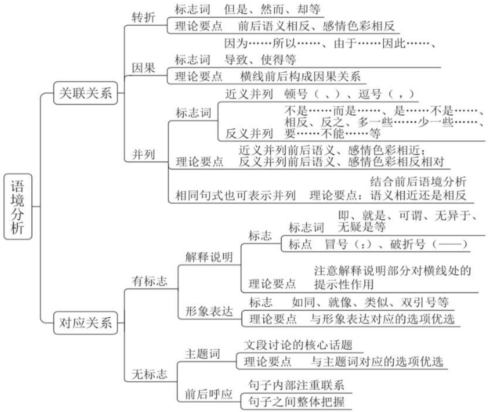

# 精讲精练一言语 8

(笔记)

主讲教师：郭熙

授课时间：2025.02.27

# 精讲精练一言语8（笔记）

【注意】本节课讲解逻辑填空题，最后三节课重点突破逻辑填空题，题量大，难度高，是言语最重要的题型。

第八次课学习重点内容:

(1) 关联关系在逻辑填空题中的应用  
②有标志对应—解释说明的标志与应用

# 二、语境分析

关联关系：转折、因果、并列

对应关系：有标志对应、无标志对应

# 【注意】

1. 语境分析：从文段中找线索（文段给提示），有的同学做题只靠感觉，更多把握文段的提示。

(1) 关联关系：转折、因果、并列。中心理解题也讲解了关联词，逻辑填空题也会出现。  
(2) 对应关系: 有标志对应、无标志对应。没有典型关键词找对应关系。

2. 有的题目有标志，有的题目没有标志。

1. 关联关系——转折

【标志词】但是、可是、然而、却、其实、实际上、看似……实则……等

【理论要点】前后语义相反

举个小例:

(2021 联考) 虽然这些鸟类很明显长得很相似, 有着共同的祖先, 但是它们的鸟喙形状却

A. 大相径庭

B. 毫无二致

# 【注意】

1. 标志词: “但是、可是、不过、然而、却、其实、实际上（事实上）、看

似……实则……”等。

2. 理论要点：前后语义相反。  
3. 2021 联考: 出现 “虽然……但是……”, “鸟喙” 是鸟嘴, 转折后强调不一样, 锁定 A 项 “大相径庭”, 表示不同。B 项 “毫无二致” 表达一致, 若填入, 无法构成转折。

例 1（2024 浙江）图画书以图为主，文字很少，看似简单，实则____，内涵很深，需要创作者有细腻的生活经验、丰厚的审美素养，并能洞悉儿童的认知特点。当前市场上图画书品质____，一个重要原因就是有些创作者脱离生活，且缺乏必要的相关素养。

依次填入画横线部分最恰当的一项是:

A. 自成一体 粗制滥造

B. 别有洞天 滥竽充数

C. 各有千秋 鱼龙混杂

D.包罗万象 参差不齐

【解析】1. 第一空，出现看似“简单……实则……”，表转折，横线处体现不简单/包含的内容很多。

A项“自成一体”（有独创的见解或独特的做法，形成自己的体系和风格），强调跟别人不同，与简单无法构成相反，排除。  
B项“别有洞天”（另有一个境界，常形容风景奇特或艺术创作引人入胜）；D项“包罗万象”（内容丰富，无所不有），拿不定，均保留。  
C项“各有千秋”（在同一层次内各人有各人的长处，各人有各人的特色），搭配的对象至少有两个，如A、B各有千秋，前面论述图画书一个主体，搭配错误，排除。

第二空，前面论述市场上图画书的品质，不一定都是次品，横线处体现图画书有好有坏，后文论述有些创作者不行，剩下的还可以，锁定D项“参差不齐”（形容很不整齐或水平不一）。A项“粗制滥造”（写文章或做东西马虎草率，只求数量，不顾质量），搭配的对象是假的/次品，和市场图画书搭配不当，排除。【选D】

# 【注意】

1. 借助真题做好积累。

2.B 项“滥竽充数”（比喻没有真才实学的人混在内行人之中，或以次充好）。  
3. C 项 “鱼龙混杂”（比喻坏的和好的混在一起）。  
4. D项“参差不齐”（形容很不整齐或水平不一）。【选D】

【粉笔积累】鱼目混珠 VS 鱼龙混杂

鱼目混珠：指用鱼眼冒充珍珠，强调假与真的关系，主语往往是假货、次品。

鱼龙混杂：指鱼和龙在一起，坏的和好的在一起，主语往往是个更大的、好坏均有的集合。

(2018 辽宁) 假货、仿冒品、残次品_____, 随之而来是一些消费者维权困难, 因此加强网购平台监管责任迫在眉睫。(鱼目混珠/鱼龙混杂)  
鱼龙混杂、龙蛇混杂、良莠不齐、泥沙俱下，不必区分，搭配对象广（人/物）  
(2019 联考) 现在的诗词普及, 还有许多需要留心和甄别的地方。如今市面上诗词普及的图书尤其多, 也尤为鱼龙混杂。  
(2016 河南)他不仅“吟”出了人间最好的律诗，同时也给后人提供了一把量尺，帮助我们从良莠不齐的诗歌遗产当中，选择出最好的诗来承传文学的吟诵。  
(2018 广州) 不可否认, 相比以往, 现在的信息来源更加芜杂, 信息质量也是泥沙俱下。  
(2022 国考) 互联网的普及让我们既为网络文艺评论生态的蓬勃生长感到惊喜, 也为其泥沙俱下的状况感到忧虑。

【注意】鱼目混珠 VS 鱼龙混杂:

1. 鱼目混珠：指用鱼眼冒充珍珠，强调假与真的关系，主语往往是假货、次品。跟“滥竽充数”接近，主语是假货/次品。  
2. 鱼龙混杂：指鱼和龙在一起，坏的和好的在一起，主语往往是个更大的、好坏均有的集合。和“参差不齐”接近，主语是有好与坏的集合体。  
3. 2018 辽宁：前面都是假货、次品，用的是“鱼目混珠”。  
4. 鱼龙混杂、龙蛇混杂、良莠不齐、泥沙俱下，搭配对象广（人/物）。意思一样，不必区分，强调好坏都有，重点把握在真题里面的搭配对象。虽然查词典，“鱼龙混杂”搭配好人坏人，但是要依照真题积累。

5. 2019 联考：搭配的是图书。  
6.2016河南：搭配诗歌遗产。  
7.2018 广州：搭配信息质量，信息质量有好有坏。  
8. 2022 国考：此处的泥沙俱下指有好有坏。

例 2（2021 国考）

现代社会获取盐分轻而易举，以至于人们认为吃盐是________的事情。而事实上，由于盐在地理上的分布不均以及交通不畅等原因，其在古代一直都属于________之物。在人类历史上的绝大部分时间里，人们都在寻找盐，甚至令盐业成为了历史上第一个由国家垄断的产业。可以说，盐贯穿着整个人类历史，并在人类文明的发展中起到了________的作用。

依次填入画横线部分最恰当的一项是:

A. 稀松平常 必需 举足轻重  
B. 理所当然 稀缺 至关重要  
C.天经地义 关键 承上启下  
D. 手到擒来 珍贵 一以贯之

【解析】2. 第一空，A项“稀松平常”（很平常，没什么特别的）；B项“理所当然”（按道理应当这样）；C项“天经地义”（理所当然，不容置疑的问题）；D项“手到擒来”（在某项任务中，能够轻松完成），符合文意，均保留。

第二空，“事实上”表转折，前后语义相反，转折后论述古代，转折前论述现代社会获取盐容易，横线处体现古代获取盐不容易，B项“必需”和C项“关键”，古代获取盐不容易，普通人没有盐吃，盐不是关键的，可以说稀缺、珍贵，均排除。

第三空，尾句论述盐的作用，“并”前后连接两个方面，对前文进行总结，前文论述盐重要，起到重要的作用，锁定B项“至关重要”（有特别重大影响或后果）。D项“一以贯之”（用一个根本性的事理贯通事情的始末或全部的道理）和前面的“贯穿”意思一样，“并”连接前后两个不同的方面，不会说温柔并且温柔，一般说温柔并美丽，若当选和“贯穿”重复，排除。【选B】

【注意】

1. A项“举足轻重”（处于重要地位，一举一动都足以影响全局）。  
2. C 项 “承上启下”（承接上面的，引起下面的内容）。  
3. D 项 “一以贯之”（用一个根本性的事理贯通事情的始末或全部的道理）。  
4. 第一空不容易排除，解题突破口在后两空。

例 3 (2022 江苏)

现如今，各行各业因品牌效应而带来持续的经济收益十分可观，然而农村电商在建立农业品牌的道路上可谓____。由于受到长久以来分散生产经营的影响，农村电商未能切实体会到农产品品牌效应所能带来的巨大收益，以至于对建立品牌的____不足，缺乏动力。所以，____农村电商主体强化品牌意识至关重要。

依次填入画横线处最恰当的一项是:

A. 举步维艰 兴趣 引导

B. 孤军奋战 认识 扶持

C.一筹莫展 经验 协助

D. 凤毛麟角 信心 敦促

【解析】3. 第一空，“然而”表转折，前后语义相反，转折前论述收益可观，是好的情况，转折后论述不好的情况，强调农村电商处境不好。

A项“举步维艰”（已陷入十分艰难的处境），可以体现处境不好，符合文意，保留。B项“孤军奋战”（在没有外力的援助的情况下仍然坚持斗争），“孤军”强调自己作战，若当选，转折前论述团结协作/一致，横线前的各行各业不强调团结协作、一致对外，填入不当，排除。C项“一筹莫展”（一点计策也施展不出），农村电商不是完全没有办法/一点办法都没有，与A项相比，程度重，排除。D项“凤毛麟角”（珍贵而稀少的人或物），凤凰的羽毛、麒麟的角，强调珍贵、难得、稀少，若填入无法构成转折，排除。

有的同学不仅看到了“然而”，还看到了“道路上”，对应A项“举步维艰”，走在前面的道路上，其他选项和“道路”对应不合适。

验证第二空，如 A 炒股买一个亏一个，其他人推荐 A 买股票，A 说没有兴趣，没有感受带来的巨大利益，A 项“兴趣”填入得当。

验证第三空，后面是农村电商，做法是强化意识，A项“引导”可以搭配意识，当选。B项“扶持”、C项“协助”D项“敦促”是做法，“敦促”是督促、催促，用在外交领域，如中方敦促美方，均排除。【选A】

1. 关联关系——因果关系

【标志词】因为……所以、由于……因此、从而、导致、使得、造成等

【理论要点】横线前后构成因果关系

举个小例:

由于小郭认真听课，大量刷题，所以他________了。

A. 上岸

B. 失恋

【注意】关联关系——因果关系：

1. 标志词：因为……所以、由于……因此、从而、导致、使得、造成等可以引导结果。  
2. 理论要点：横线前后构成因果关系。  
3. 举个小例：有的同学认为没有时间陪伴女朋友，就失恋了，误选 B 项，小郭可能是单身，没有对象，何谈失恋，误选是因为主观臆断。做题按照常规的思维解题，原因是认真听课，大量刷题，结果是成功上岸，锁定 A 项。

例 1（2025 四川）

面对农业现代化的现实需求，数字化能覆盖和作用的范围还相对有限。由于我国幅员辽阔，各地间情况差异较大，很难完全依靠一套技术就包打天下。倘若在技术上______，就很容易引发“橘生淮南则为橘、生于淮北则为枳”的问题。因此，在农业数字化进程中，技术引用也必须______，方能持续跑出加速度，为现代农业提供源源不断的数字化供给。

依次填入画横线部分最恰当的一项是:

A. 固步自封

循序渐进

B. 纸上谈兵

实事求是

C. 削足适履

因地制宜

D. 好高骛远

脚踏实地

【解析】1. 第二空，前面出现“因此”，表总结，“由于”是原因解释，各地的情况差异大，“因此”后提出对策，锁定C项“因地制宜”（根据各地的具体情况制定适宜的办法）。

A项“循序渐进”（根据各地的具体情况制定适宜的办法），不强调各地的情况不同，排除。B项“实事求是”（从实际对象出发，探求事物发展的规律性，认识事物的本质）：D项“脚踏实地”（做事踏实认真）无法体现根据各地不同情况采取不同的做法，均排除。

验证第一空，“引发”提示带来的结果，C项“削足适履”（不合理地迁就凑合或不顾具体条件，生搬硬套），联想到灰姑娘的姐姐，穿不上水晶鞋，就砍自己的脚后跟，强调不顾实际情况，各地情况差异不同，若照搬其他人的做法，就是削足适履，“橘生淮南则为橘、生于淮北则为枳”意味着不适应当地的情况，橘子适合在淮河以南，不顾适宜的条件，移植到了淮河以北，就变成枳了，特别涩，特别难吃，强调应该因地制宜，排除。【选C】

# 【注意】

1. A项“固步自封”（守着老一套，不求进步），强调保守、守旧，反面是进步创新，与因地制宜不匹配。  
2.B项“纸上谈兵”（空谈理论，不能解决实际问题），反面是要行动。  
3.D 项 “好高骛远”（脱离实际去追求过高的、难以实现的目标），反面是脚踏实地。

# 例 2（2025 国考）

无论采取哪种储存方式, 液氢对储存系统________的要求都比传统燃油系统更高、更复杂。这是因为氢分子远小于航空煤油, 更容易从管路缝隙中________; 对于液氢储存, 还必须考虑________条件的实现问题, 否则升温气化后体积膨胀的氢气有可能导致燃料箱因压强骤增而直接爆炸。

依次填入画横线部分最恰当的一项是:

A. 密封性

逃逸

恒温

B. 稳定性

泄漏

压力

C. 完整性

溢出

热量

D. 安全性

弥散

季节

【解析】2. 第一空, 有的同学认为正确搭配是肇事逃逸/人逃逸, 氢分子无法逃逸, 误排除 A 项, 其实 A 项 “逃逸” 可以形容气体/氢分子/离子, 搭配范围广, 在物理的领域经常出现, 从文段找线索, 不建议从语感排除, 其实从第三空入手比较容易。

第三空，“否则”之后强调升温带来严重的后果，反面是不让温度升高/保持温度不变，实现的条件是保持温度不变，不升温，锁定A项“恒温”。有的同学看到了压强，误选B项“压力”，“压强骤增而直接爆炸”核心问题是升温，控制的不是压强，而是温度不变，要对比择优，排除。C项“热量”指能量，不

等于温度，不知道高低，不知道变不变，排除。D项“季节”无法体现温度不变，四季温度变化，排除。

第一空，横线处后出现“这是因为”，前面是结论，后面是原因解释，通过原因解释进行分析，依然锁定A项“密封性”，横线处体现泄漏、溢出，对于系统的密封性要求高，密封性好不让分子逃跑。C项“完整性”，如果比较完整，但是密封不好，氢分子逃逸了/泄漏了，排除。【选A】

# 【注意】

1. 粉笔积累：逃逸，逃跑。肇事～、气体～、分子～、离子～等。  
2. 人民网: 科研人员发现高速火星离子的逃逸现象。物理学领域使用频率高。

# 例 3 (2025 国考)

当前，改革发展任务繁重，需要各级各部门和广大干部高质高效地完成各项任务，才能在日趋激烈的发展竞争中赢得________。而处理日常纷繁复杂的工作，就如同“十个指头弹钢琴”，需要合理分配力量和节奏。一味强求自加压力，势必使某个或多个指头的力量受到影响，导致工作________，工作效能不理想也就在意料之中了。

依次填入画横线部分最恰当的一项是:

A. 主动 左支右绌

B. 优势 进退维谷

C. 认可 手忙脚乱

D. 先机 拖泥带水

【解析】3. 第一空，本题代表国考命题的难度和水平。有的同学认为赢得主动错误，剩余选项比较纠结，用语感排除无法选择正确。前面是高质高效完成任务，说明要占据有利的位置，A项“主动若填入，”“赢得主动”是掌握主动权，语义正确，保留。C项“认可”，如认真工作是为了得到领导/群众的认可，是其他人承认/许可，文段不强调其他人认可，强调在激烈的市场竞争中，自己处在有利的位置，排除。

第二空，弹钢琴需要十个手指头配合，后面是“需要合理分配力量和节奏”，人的精力是有限的，一个方面付出的精力多，无法顾及其他方面。“导致”引导结论，前后是因果关系，如领导提出的目标是做到10分，但给自己加压做到12分，投入更多的时间，付出更多的精力，人的精力有限，导致的结果是其他的工

作完成不了，无法全面顾及，力量是有限的，应付不了这些工作。

A项“左支右绌”（力量不足，应付了这方面，那方面又出了问题），表示心有余而力不足，填入得当，与后文可以衔接，当选。B项“进退维谷”（处境艰难，进退两难），进也不是，退也不是，文段并没有体现处境艰难、进退两难，文段强调心有余而力不足，排除。D项“拖泥带水”（办事拖沓不爽快或语言不简明扼要），单纯看意思不算错误，形象理解，是力有余而心不足，不是主观上不行，办事拖沓是客观情况造成的，把握“导致”之前的内容，强调力量有限，排除。【选A】

# 【注意】粉笔积累：

1. （人民网）在坚持根本原则中赢得历史主动战略主动。  
2. (人民网) 把握机遇提升能力赢得战略主动。赢得主动是规范的热词表述。  
3. （2023 国考）传统的逆周期调节能够较好地应对经济的短期波动，面对国内外经济的长期结构性调整则常常左支右绌。  
4. (2017 国考) 晚清官员最害怕的就是和洋人直接打交道, 他们中的绝大部分人不外语, 不明世界大势, 不知国际公法, 在和洋人打交道时未免左支右绌。  
5. 正常是抢占先机。  
6. 积累高频出现的词语，国考考过的成语其实也会考查，左支右绌 2017 年国考考了；2023 年也考查了，强调力量不足，应付不过来；2025 年也考查了。“左支右绌”和“手忙脚乱”区分不大，单纯看第二空“手忙脚乱”也正确，多空题目团队合作，但有“猪队友”，要把握正确答案为什么正确。  
7. C项“手忙脚乱”（遇事慌张，不知如何是好）。

# 例 4 (2024 山东)

民营企业在发展“四新经济”方面有自身的独特优势，敏锐的市场嗅觉、灵活的市场行为、强烈的开拓意识以及持续的创新精神使得民营企业在“四新经济”发展进程中____。

填入画横线部分最恰当的一项是:

A. 游刃有余

B. 举足轻重

C. 大有可为

D. 事半功倍

【解析】4. 单空题目比较纠结，只有一次机会，国考在前面的两到三道题目会考查单空的题目，很多同学刚开始做题没有完全安静，大脑是空白的，感觉四个选项都可以，就崩溃了，保持一个平和稳定的心态是前提。单空题目文段有线索和提示，还要把握选项的区别。文段提到“四新经济”，是新的经济，且说有优势，“使得”引导结果，横线处形容新经济的发展。

A项“游刃有余”（形容技艺熟练，做事轻松利落），面对的是熟悉的领域，填入不当，排除。  
B 项 “举足轻重”（比喻地位极其重要；足以左右全局），排除。  
C项“大有可为”（事情有发展前途，很值得做），如例句，互联网非遗是新的现象，两者结合，填入得当，“四新经济”是新的经济模式，文段没有强调地位重要，面对新的经济有作为，排除。  
D项“事半功倍”（花一半力气，收到成倍效果；指做事得法，因此费力小，收效大），事半功倍强调做事得法，给出一个高效的方法，优势等于高效的方法，地位重要和优势没有必然联系，C项更加恰当，排除。【选C】

【注意】文段强调在新经济有前途、值得做，锁定C项。

【游刃有余】形容技艺熟练，做事轻松利落。

（粉笔模考）相比此前征战世界联赛时，蔡斌的临场指挥显得更游刃有余，多次利用暂停调整帮助球队走出困境。

(2022 国考) 思政课教师要有正确的党史观和过硬的党史知识, 只有自己观点正确、史料丰富, 才能准确无误地给学生指引方向、有力有理有据地反驳错误观点、游刃有余地选择恰当的教学方式, 推动党史教育入脑入心、开花结果。

【大有可为】事情有发展前途，很值得做。

（粉笔模考）“互联网文化”已经进入文化建设的战略层面而被广泛讨论，成为未来文化发展的重要方向。此外，互联网技术的不断进步给文化创新提供了无限可能性和持久动力。可以说，“互联网非遗”无论从大背景、大前提和大趋势，还是从文化实践层面来看，都将大有可为。

(2019 国考)《“健康中国 2030”规划纲要》中提出, 要努力实现从以治病为中心向以健康为中心转变, 从以 “治已病” 为中心向以 “治未病” 为中心转变, 从疾病管理向健康管理转变。在这种背景下, 中医药大有可为。

# 【注意】

1. 游刃有余：形容技艺熟练，做事轻松利落。  
2. 粉笔模考：想到了庖丁解牛，如教练的临场指挥游刃有余。  
3. 2022 国考：思政课的教师游刃有余的选择恰当的教学方式，面对的是熟悉的领域。  
4. 大有可为：事情有发展前途，很值得做。  
5. 2019 国考: 《“健康中国 2030”规划纲要》是未来的规划, 转变是新的,是努力的方向。

【举足轻重】指处于重要地位，一举一动都足以影响全局。

（粉笔模考）师范院校地位特殊，一个肩膀挑起高等教育，另一个肩膀挑起基础教育。师范院校从基础教育考生中录取招生，经历高校的人才培养，毕业后他们入职幼儿园和大中小学，成为了人民教师，所以师范院校办学质量会直接影响到师资质量、生源质量。可以说，在这一教育质量生态链条中，师范院校举足轻重。

【事半功倍】指做事得方法，因此费力小，收效大。

(2021 国考) “人民城市人民建”。搭建民意“直通车”、公众“议事厅”，有事好商量，大家来出力，很多工作就能做到事半功倍。比如上海能在短短一年内迅速形成垃圾分类的新风尚，靠的就是人民群众的主动性、积极性与创造性。

(2023 辽宁) 杂技天生具有惊险、高难、奇巧的审美特征, 擅长刻画英雄气概, 表现勇于征服困难的英雄主义精神。从这个角度来说, 找到最能凸显杂技 “险” “难” 特质的题材, 往往能使杂技剧的出新出彩事半功倍。

# 【注意】

1. 举足轻重：指处于重要地位，一举一动都足以影响全局。强调地位重要。  
2. 粉笔模考：前面体现地位重要。  
3. 事半功倍：指做事得方法，因此费力小，收效大。  
4. 2021 国考：前面给了高效的方法，给了效率高的做法/途径，产生了事半

功倍的结果。

5. 2023 辽宁: 找到题材是高效的方法/方式, 有优势不是高效的方法, 有的同学认为言语有优势, 但是做题正确率不高, 无法产生事半功倍的效果。

【四新经济】指“新技术、新产业、新业态、新模式”的经济形态，是在新一代信息技术革命、新工业革命以及制造业与服务业融合发展的背景下，以现代信息技术广泛嵌入和深化应用为基础，以市场需求为根本导向，以技术创新、应用创新、模式创新为内核并相互融合的新型经济形态。

【注意】四新经济指“新技术、新产业、新业态、新模式”。

1. 关联关系——并列

【标志词】

1. 同义并列：顿号（、）、逗号（，）

(2021 北京) 加强政企良性互动, 广泛听取企业心声, 充分了解企业诉求,有利于政府____、靶向发力。

A. 对症开方

B. 因地制宜

2. 反义并列：不是……而是……；是……不是……；相反；反之；多一些……少一些……；要……不能……等

(2020 国考) 原则问题要旗帜鲜明、立场坚定, 一点都不能_____。

A. 退缩

B. 含糊

【标志句式】句式相同或相近

【理论要点】根据标志判断语义相近或相反

【注意】关联关系——并列：近几年国考考查的重点，把握最新的趋势。

1. 标志词:

(1) 同义并列（近义并列）：顿号（、）、逗号（，）。  
(2) 2021 北京:

(1)横线处和“靶向发力”构成并列，说明射箭找准靶子，体现有针对性，锁定A项“对症开方”，强调精准。B项“因地制宜”强调根据地点/地域的不同，不强调企业的诉求。单纯看和靶向发力的并列，两个词语都可以，结合前文的内容理解，前文的对象是企业，而不是地域，排除B项。

(2)如习近平总书记讲话当中提到搞作风建设, 我们要做到踏石留印、抓铁有痕, 这不是重复。都能体现作风建设决心坚定, 起到了强调的作用。  
2. 反义并列: “不是……而是……; 是……不是……; 相反; 反之; 多一些……少一些……; 要……不能……”等。  
3. 2020 国考：前后语义相反，“旗帜鲜明、立场坚定”反面是模糊不清，锁定 B 项“含糊”。A 项“退缩”反面是勇往直前/勇敢前进，词性是动词，和鲜明、坚定无法构成相反。有的同学认为“含糊”过于口语化，习近平总书记讲话用词上平易近人，原话就是“一点不能含糊”。  
4. 标志句式：句式相同或相近。相同句式表并列，近义并列/反义并列都有可能。  
5. 理论要点：根据标志判断语义相近或相反。

# 例 1（2025 国考）

当前，各地纷纷布局，加快形成和发展新质生产力。然而，发展新质生产力是一项系统工程，不能盲目跟风、______，也不能脱离实际、急于求成，更不能简单复制一种模式，必须坚持从实际出发，从新质生产力的形成条件入手，考虑周全、______。

依次填入画横线部分最恰当的一项是:

A. 照猫画虎

厚积薄发

B. 一哄而上

谋定后动

C. 拾人牙慧

有备无患

D. 随波逐流

集思广益

【解析】1. 第一空，文段的话题很新，“新质生产力”是热词，横线前有顿号，和“盲目跟风”构成并列，“盲目跟风”对应的是很多人，四个词语不容易排除，均保留。

横线后“更”表递进，之后是复制模式，A项“照猫画虎”（比喻照着样子模仿），体现模仿，C项“拾人牙慧”（拾取人家的只言片语当作自己的话），剽窃抄袭，无法与横线后构成并列，均排除。有的同学认为D项语感比较好，就误选，要团队合作。

第二空，横线前有顿号，和“考虑周期”并列，意味着思虑周全，谋划想到方方面面，B项“谋定后动”（谋划完毕才开始行动），其中“谋”是谋划、考虑，考虑好了再行动，当选。D项“集思广益”（集中众人的智慧，广泛吸收有

益的意见），吸收其他人的想法和智慧，不是考虑谋划、考虑周期，排除。【选B】

# 【注意】

1. A 项 “厚积薄发”（大量地积累，只择其精要少量地表露出来），进行大量的积累，文段不强调积累，填入不当。  
2.C项“有备无患”（事先有准备就可以避免祸患），强调行动上的准备。  
3. D 项 “集思广益”（集中众人的智慧，广泛吸收有益的意见）。  
4. 两个空都出现顿号，做题不能只看一个词语，比较纠结，联系前后文的内容。第二空前面是不能盲目跟风，不能急于求成，“谋定而后动”和前文对应更好。  
5. 第一空看前文的提示，各地是多个主体，一哄而上对应多个主体，其他不是多个主体一起做。  
6. B 项 “一哄而上”（没有经过认真准备和严密组织，一下子行动起来）。  
7. C 项 “拾人牙慧”（拾取人家的只言片语当作自己的话）。  
8. D 项 “随波逐流”（没有主见，盲目地随着别人行动）。

# 例 2（2025 国考）

推进中国式现代化是一个探索性事业，还有许多未知领域，需要我们在实践中去大胆探索，通过改革创新来推动事业发展，决不能____、守株待兔。各地区各部门要结合各自具体实际开拓创新，特别是在前沿实践、未知领域，鼓励大胆探索、____，寻求有效解决新矛盾新问题的思路和办法，努力创造可复制、可推广的新鲜经验。

依次填入画横线部分最恰当的一项是:

A. 刻舟求剑

敢为人先

B. 坐井观天

踔厉奋发

C. 望梅止渴

推陈出新

D. 画地为牢

大展拳脚

【解析】2. 有的同学看到横线处跟“守株待兔”并列，但四个词语跟该词不构成并列，第二空和“大胆探索”表并列，就误选“大展拳脚”，两道题命题特点是一样的，两个空跟顿号连接，要整体把握文段的意思。横线处前后意思相反，前文论述大胆探索、改革创新，强调求变求新，横线处表达不求变、静止看待问

题。

A项“刻舟求剑”（办事刻板，拘泥成例而不知变通），符合文意，保留。B项“坐井观天”（眼界狭小，看到的有限），跟井底之蛙接近，强调视野局限，反面是目光长远、高瞻远瞩，和“大胆探索、改革创新”无关构成相反，不如A项合适，排除。

C项“望梅止渴”（用空想或假象安慰自己），反面是实事求是，和求新求变无法构成相反，排除。D项“画地为牢”（只准在指定范围内活动），拿不定，保留。

第二空，看到大胆探索，感觉A、D项均可，但前面是前沿的未知领域，后面提到要寻求新的思路和方法，创造出可以复制的新经验。说明没有人探索过/没有人做，“创造可复制、可推广的新鲜经验”说明其他人没有做，领先一步，A项“敢为人先”（敢于做别人没有做过的事情），用在未知领域；D项“大展拳脚”（充分施展本领），如A掌握了一门技术，在互联网大展拳脚，强调熟悉的、已知的领域，形容前沿、未知领域不合适，排除。【选A】

# 【注意】

1. B项“踔厉奋发”（精神振奋，斗志昂扬），C项“推陈出新”（去掉旧事物的糟粕，取其精华，并使它向新的方向发展），若形容前沿、未知领域，不如“敢为人先”合适。文段来自习近平总书记的讲话，如果感觉A项错误，和习近平总书记没有做到同频共振。通过本题理解刻舟求剑比较合适，横线处一方面和守株待兔并列，“决不能”体现前后相反，前面强调创新、求新、求变，横线处体现不变通、不创新，刻舟求剑是用静止的眼光看问题。守株待兔是被动等待，不是积极主动创新。  
2. 第二空, 形容前沿、未知领域, 敢为人先意味着对于没有探索过的积极做。  
3. 看到顿号连接的并列，不能只看一个词语，要整体理解文段的意思，命题上不能只看形式，比如看到大胆探索和大展拳脚都有“大”就选择，要注意形式上的陷阱。

# 例 3 (2023 深圳)

将下列选项中的成语填入横线处。最恰当的一项是:

十年来，面对严峻复杂的国际形势和接踵而至的巨大风险和挑战，党中央运筹帷幄，______，作出一系列重大科学判断，提出一系列重大战略策略，推动一系列重大工作，始终掌握新时代新征程党和国家事业发展的历史主动。

A. 处之泰然

B. 指挥若定

C. 稳操胜券

D. 应付裕如

【解析】3. 有的同学认为四个词语均可，要对比择优。“运筹帷幄”对应的是指挥的工作，像军师一样，A项“处之泰然”（自理事情沉着镇定，也指对待问题毫不在意），不是指挥，是面对危机的情况比较镇定，排除。

B项“指挥若定”（冷静周全，指挥起来就像一切都事先规定好了似的），符合文意，当选。  
C项“稳操胜券”（指有把握取得胜利），强调有把握获胜，文段没有强调一定会获胜，排除。  
D项“应付裕如”（从容对付，毫不费劲），不强调指挥，排除。【选B】

【注意】逗号连接两个语义接近的词语，表强调，若纠结，把握文段围绕核心话题是党中央，要做的事情是听党指挥，和党中央匹配最恰当的是“指挥若定”。

例 4 (2025 国考)

人才培养是循序渐进的过程，需认识、____、尊重人才成长规律，坚持“严管”和“厚爱”相结合。人才干事创业中难免有失误，如果培养者因为害怕犯错而顾虑重重、____，则违背了人才培育的初衷。所以，要为人才“松绑”，建立健全正向激励和容错纠错机制，为人才成长创造宽容的环境。

依次填入画横线部分最恰当的一项是:

A. 把握

因噎废食

B. 顺应

矫枉过正

C. 运用

半途而废

D. 归纳

瞻前顾后

【解析】4. 拿不定从第二空，顿号表并列，前面论述培养者因为害怕犯错有顾虑就不做了，不培养人才，A项“因噎废食”（要做的事情由于出了点小毛病或怕出问题就索性不去干），填入得当，保留。

B 项 “矫枉过正”（纠正错误超过了应有的限度），矫枉是纠正错误，文段论述因为害怕就不做，选项强调犯错之后纠正错误过了头，与文意不符，排除。

C项“半途而废”（指做事不能坚持到底，中途停顿，有始无终），走到半途没有坚持到底，文段没有强调坚持到最后，排除。D项“瞻前顾后”（形容顾虑太多，犹豫不决），看到顾虑重重会误选，单纯看不算错，但要对比第一空，排除。

第一空，A项“把握”、D项“归纳”，如把握世界大势更加积极主动，要区分“把握”和“归纳”的区别，以前没有，把规律归纳总结出来，是从无到有的过程，既然是认识、尊重规律，说明规律已经有了，不要求自己归纳，排除D项。

认识规律体现初步了解规律, 把握规律是掌握规律的本质, 尊重规律是遵循运用规律, 语义是顺畅的。B项 “顺应”、C项 “运用”, 搭配没有问题, 要把握 “矫枉过正” 和 “半途而废”的意思, 排除。【选 A】

【注意】如家教很严犯错误会挨打，可能因为害怕顾虑重重，犯错误了之后改正（不敢做了），而不是半途而废了。

例 5 (2024 四川)

从历史上看，世界文化交流互鉴的本质是在尊重差异、________的基础上，寻求不同文明之间的共同价值，一方面是________自我，不失去原有的文化根基与血脉；另一方面则是平等相待，吐故纳新。

依次填入画横线部分最恰当的一项是:

A. 求同存异 保有

B. 兼容并蓄 提高

C. 和衷共济 坚持

D.一视同仁 突破

【解析】5. 第一空，一方面和尊重差异并列，一方面是不同文明之间的共同价值，文段要体现不同/差异，A项“求同存异”（在对事物的看法或态度上找出共同点，保留不同点）；B项“兼容并蓄”（能够容纳和包容各种不同的事物、观点或意见，和谐共存），有不同的意思，符合文意，均保留。

C项“和衷共济”（比喻同心协力，克服困难）；D项“一视同仁”（对人同样看待，不分厚薄），只强调相同/同等对待，无法体现差异不同，均排除。

第二空，不能直接选择 B 项 “提高”，从文段中找线索，不强调提升自我，不失去原来的文化根基和血脉，提示前文是保持自我/保有自我，后文没有提升

和进步，排除。【选 A】

【注意】近义并列前后相近/一致，起到强调的作用。

例 6 (2024 国考)

生命科学界普遍认同“科学数据共享”，研究人员在使用数据库的同时，将自己研究发现的基因序列或蛋白质结构数据存入数据库，同时成为数据库的使用者和________。如今数据库已经成为生命史书最________的纪录载体和强大的数据分析平台，为整个生命科学研究所________。

依次填入画横线部分最恰当的一项是:

A. 维护者 完备 期待

B. 推广者 稳定 认可

C. 贡献者 可靠 依赖

D. 建设者 坚定 欢迎

【解析】6. 第一空，单纯看“使用者”不容易判断，从前文找线索。“同时”表并列，通过“和”可知，横线处和“使用者”表并列，横线处对应将自己的研究发现存入数据库，A项“维护者”，意味着出现问题，进行维修，排除。B项“推广者”是让更多的人知道，而不是把自己的发现存进去，排除。C项“贡献者”、D项“建设者”，符合文意，均保留。

第二空，搭配“纪录载体”，D项“坚定”搭配不当，形容态度，排除。C项“可靠”搭配得当，当选。

验证第三空，因为是可靠的载体，才会为整个生命科学研究所依赖，C项“依赖”是中性词，锁定C项。【选C】

# 【注意】

1. 粉笔提示：并列前后一一对应。  
2. 通过“和”可知，横线处和“使用者”表并列，“同时”表并列，使用数据库对应的是使用者，将自己研究发现存入数据库对应的是贡献者，不能只看一个小的词语。

【注意】有难度的题目单纯看顿号前后的某个词语、分句不好解题、容易掉坑, 要把握整体的内容解题, 如 “因为害怕犯错而顾虑重重” 表达不敢犯错, “因

噎废食”体现不敢犯错，前后语义有一致性、相关性，且做题时不能只看形式对应，语义  $>$  形式。

【例 7】(2025 天津) 领导干部特别是高级干部担负着推进改革的重要职责。要增强政治责任感、历史使命感, 以攻坚克难、迎难而上的政治勇气, 直面矛盾问题不_____, 铲除顽瘴痼疾不_____, 应对风险挑战不_____, 奋力打开改革发展新天地。

依次填入画横线部分最恰当的一项是:

A. 回避 含糊 退缩

B. 放弃 姑息 气馁

C. 推诿 迟疑 妥协

D.畏惧 宽纵 懒怠

【解析】7. 第三空，“不”为否定表述，前后意思相反，前文论述迎难而上，强调勇往直前，锁定A项“退缩”。B项“气馁”前提是失败了，文段未体现，排除。C项“妥协”反面是坚持自己的想法，与文意无关，排除。D项“懈怠”反面是勤奋，与文段无关，排除。

验证第一空，“直面”强调面对，反面是“回避”。

验证第二空，总书记说过对于铲除顽瘴痼疾态度要明确、立场要坚定，A项“含糊”填入恰当。【选A】

【例 8】（2025 国考）改进文风就要多写“短实新”的好文章。“实”就是讲符合实际的话不讲脱离实际的话，讲管用的话不讲空话，讲反映自己思考的话不讲 _______ 的话，讲有感而发的话不讲 _______ 的话，讲通俗明白的话不讲故作高深的话，____，用朴实的语言阐述深刻的理论。

依次填入画横线部分最恰当的一项是:

A. 故弄玄虚 装腔作势 由表及里  
B. 照本宣科 无病呻吟 深入浅出  
C. 人云亦云 言不由衷 举一反三  
D. 陈词滥调 冠冕堂皇 言简意赅

【解析】8. 第一空，“讲……不讲……”为反义词，前后意思相反，横线处体现没有自己的思考判断。A项“故弄玄虚”指故意玩弄使人迷惑的花招，与文

意不符，排除。B项“照本宣科”指死板地照现成文章或稿子宣读，不能灵活运用；C项“人云亦云”指人家说什么自己也跟着说什么，没有主见，均保留。D项“陈词滥调”指陈旧而不切合实际的话，为名词，无法修饰“的话”，应表述为“这种观点是陈词滥调/不要讲陈词滥调”，排除。

第二空，“有感而发”反面是没有真情实感、缺乏真情实感。B项“无病呻吟”指没有值得忧虑的事情却长吁短叹；C项“言不由衷”指说的话不是从内心发出来的，均保留。

第三空，“用朴实的语言阐述深刻的理论”提示横线处，体现语言朴实、理论深刻，锁定B项“深入浅出”，指文章或言论的内容很深刻，措辞却浅显易懂，“深入”对应语言朴实，“浅出”对应理论深刻。C项“举一反三”指从一件事情类推而知道其他许多事情，如掌握做题思维举一反三做对更多题目，与文段无关，排除。【选B】

# 【注意】

1. “装腔作势”指说的话不是从内心发出来的。  
2. “冠冕堂皇”指故意显得外表庄严体面的样子，实际并非如此。可以填入。  
3. “由表及里”指认识由浅入深，从表面现象到了解事物的本质。  
4. “言简意赅”指语言虽精练简洁, 但已概括要义。并非强调理论本身有多深刻, 没有 “深入浅出” 与文段对应恰当。

【例 9】（2023 山东）打造一个品牌，带活一个产业，富裕一方农民，不可能____，必须尊重农业发展规律和市场规律，扎扎实实、____。顺应消费需求升级，持续擦亮农业品牌，做大做强乡村特色产业，为全面推进乡村振兴、加快建设农业强国提供更加有力支撑。

依次填入画横线部分最恰当的一项是:

A. 迎刃而解 驰而不息

B. 一挥而就 坚持不懈

C. 一步登天 持之以恒

D. 一蹴而就 久久为功

【解析】9. 第一空，“不可能……必须……”前后语义相反，后文论述尊重规律、扎扎实实，故横线处体现不能一下实现。A项“迎刃而解”指处理事情，

解决问题非常顺利，搭配不当，排除。B项“一挥而就”形容才思敏捷，写字、写文章、画画速度快，搭配不当，排除。C项“一步登天”指一下子就达到很高的境界或程度，如小张一步登天当上了领导，文段未体现，排除。D项“一蹴而就”指一下子就能完成某件困难的事情，当选。

验证第二空，四个词语意思接近。D项“久久为功”指要持之以恒，锲而不舍，驰而不息，填入恰当。【选D】

# 【注意】

1. “驰而不息”指奔驰向前不停息。  
2. “坚持不懈”形容做事持之以恒，比喻有恒心，有毅力。  
3. “持之以恒”指长久地坚持下去。  
4. 两空是反义并列，意思相反，D项“一蹴而就”与“久久为功”为一组反义词，且“一蹴而就”常用于否定句，如备考公务员不是一蹴而就的，需要大家久久为功。

【例 10】（2021 国考）亲近百姓、接近生活是曲艺这门艺术的生命力所在。当然，任何人都不可能____生活的全部，所以创作者才有了“采风”一说。采风从来不是去____生活，而是深入其中，体会其中的乐与悲。然而，现在许多曲艺工作者没有耐心去深入百姓生活，于是只能写自己熟悉的生活，创作能力无疑也受到了____。

依次填入画横线部分最恰当的一项是:

A. 描摹 评判 质疑

B.洞察 记录 束缚

C. 掌握 体验 削弱

D.了解 审视 限制

【解析】10. 第一空，“采风”意思是指对民情风俗的采集；特指对地方民歌民谣的搜集，目的是了解百姓的生活、风俗，横线处体现了解、知道生活的全部是不可能的。A项“描摹”指照着底样写和画（临摹）；用语言文字表现人或事物的形象、情状、特性等，文段未体现，排除。B项“洞察”、D项“了解”均保留。C项“掌握”，如掌握知识/理论，与文意不符，排除。

第二空, “不是……而是……”前后意思相反, 考查反义并列, 后文论述深入生活中去体会。C 项 “体验” 本身要深入生活中, 无法与后文构成相反, 排除。B 项 “记录, 如在旁边记录, 保留。D 项 “审视” 体现站在旁观者的角度, 保留。

第三空，体现只局限在自己熟悉的生活方面。B项“束缚”即捆绑、捆住，如被绳子绑起来，程度过重，文段未体现完全无法创作，排除。D项“限制”，如孙悟空在唐僧的周围画了一个圈，只能在里面不能出去，限制唐僧的自由，当选。【选D】

# 【注意】

1. 描摹：搭配对象广。

(1) (2021 黑龙江) 当时的电影只是对原生态生活的描摹, 侧重的是电影的照相本性。  
(2) (2021 江苏) 通过现代的录音工具和记录手段, 我们已经能描摹今天汉语及各种方言、各个要素的现状。

2. “洞察”指深入仔细的观察，文段强调了解风俗民情，比“了解”的程度重。

【例 11】（2025 国考）我们想问题、作决策、办事情，首先要考虑人口基数问题，考虑我国城乡区域发展水平差异大等实际，既不能______，也不能因循守旧，要保持历史耐心，坚持稳中求进、循序渐进、持续推进。

填入画横线部分最恰当的一项是:

A. 朝令夕改

B. 寅吃卵粮

C. 好高骛远

D. 一厢情愿

【解析】11. “既不能……也不能……”前后语义相反，“因循守旧”强调保守、守旧、不创新，只看这一个成语无法选出答案，要整体把握文段意思。

B 项: “寅吃卯粮”指寅年吃卯年的粮食, 形容入不敷出, 预先挪用了以后的收入, 即透支, 与文意不符, 排除。  
D 项: “一厢情愿”指单方面的愿望或不考虑客观实际情况的主观意愿, 与文意不符, 排除。

A项：“朝令夕改”指政令多改，使人民无所适从，文段“想问题、作决策、办事情”是三个方面，选项只能体现政令、政策经常变化，搭配不当，排除。  
C项: “好高骛远”指不切实际地追求过高过远的目标, 横线前后强调稳、有耐心、循序渐进, 即要脚踏实地、踏踏实实、一步步来, 当选。【选 C】

【注意】粉笔积累：保持历史耐心和战略定力。

【例 12】（2024 国考）战场上未解之惑、未识之物、未通之理皆可疑。战场中的善疑并非一味多疑或疑而无度，而是要从全局出发，围绕作战目的、作战对手、作战体系而“疑”，观察战场态势，分析关联要点，力求对敌方的军事行动______，对敌方的结构体系心知肚明，从而把握重心，掌握大局。

填入画横线部分最恰当的一项是:

A. 洞若观火

B. 防患未然

C. 胸有成竹

D. 未卜先知

【解析】12. 前后两句话句式一致，表并列，横线处与“心知肚明”语义相近，强调了解透彻、到位，锁定A项“洞若观火”，指清楚得就像看火一样，形容观察事物透彻分明。

B 项: “防患未然”指在事故或灾害发生之前就采取措施加以防备, 强调提前做准备, 与文意不符, 排除。  
C 项: “胸有成竹”比喻做事之前心中已有充分的考虑, 形容对自己, 如经过一年的备考, 大家对上岸胸有成竹, 文段为 “敌方”, 排除。  
D 项: “未卜先知”比喻有预见, 打仗时不能未卜先知, 排除。【选 A】

【粉笔积累】洞若观火 VS 隔岸观火

洞若观火：清楚得就像看火一样，形容观察事物透彻分明。强调了解的清楚透彻。

（2020 深圳）她对这些诗人诗作的解析，洞若观火，丝丝入扣，毫无牵强，读她的文章，就像是面对着那个活生生的诗人。

(2023 浙江) 不让 “同款” 为山寨货遮羞, 平台责无旁贷。大数据时代,

平台坐拥先进的后台系统、人力技术优势，自能对平台内经营者侵犯知识产权行为洞若观火。

隔岸观火：隔着河看人家着火。比喻对别人的危难不去求助，在一旁看热闹。强调袖手旁观。

(人民网) 疫情就像一面镜子, 如果隔岸观火甚至以邻为壑, 别国的威胁迟早会变成自己的挑战。要跳出小圈子思维, 树立大家庭和合作共赢理念。

(粉笔模考) 在统筹疫情防控过程中, 全球性威胁和挑战只有通过强有力的全球性合作才能加以应对, 隔岸观火甚至以邻为壑最终只会搬起石头砸自己的脚。

【注意】洞若观火 VS 隔岸观火:

1. 洞若观火：指清楚得就像看火一样，形容观察事物透彻分明，强调了解的清楚透彻。  
2. 隔岸观火：指隔着河看人家着火，比喻对别人的危难不去求助，在一旁看热闹，强调袖手旁观。

【例 13】（2023 上海）京剧与中医、武术、国画并称中国的“四大国粹”，半个世纪前，那些名角、“头牌”演出时，往往______，一票难求。而在当今，年轻一代往往对本土传统文化弃之如敝屣，对带洋字的文化则______。

依次填入横线处的成语最恰当的一项是:

A. 万人空巷

趋之若鹜

B. 洛阳纸贵

炙手可热

C. 门庭若市

众星拱月

D. 万头攒动

敬而远之

【解析】13. 第一空，横线前搭配“演出”，“一票难求”体现演出非常火，看得人非常多。A项“万人空巷”形容庆祝、欢迎等盛况；D项“万头攒动”形容群众聚集的景象，均保留。B项“洛阳纸贵”比喻著作有价值，流传广，出自晋代左思《三都赋》，与“演出”搭配不当，排除。C项“门庭若市”形容往来人多，十分热闹，保留。

第二空，前后进行对比，意思相反，“弃之如敝屣”指像扔破鞋一样彻底抛弃，横线处体现追捧“带洋字的文化”，是崇洋媚外的行为，锁定A项“趋之若鹜”，比喻很多人争相趋附、前往，偏消极。C项“众星拱月”比喻众人拥戴一

人或众物围绕一物, 如八代单传的孩子在家里众星拱月, 为褒义词, 排除。D 项 “敬而远之” 表示尊敬却有所顾虑不愿接近, 与文意相悖, 排除。【选 A】

# 【注意】

1. 粉笔提示：不同主体/时间对比，提示前后语义相反。

2. “炙手可热”比喻气焰权势之盛。

3. 作者对年轻一代的两种做法都持消极不好的态度, A项“趋之若鹜”的“趋之”对应“弃之”, “若鹜”对应“如敝屣”。

2. 对应关系

有标志对应

无标志对应

【注意】文段没有典型关联词可以找对应关系。

# (一) 有标志对应——解释说明

标志词：即、就是、可谓、可以说、无异于、无疑是等

标点：冒号（：）、破折号（——）

【理论要点】注意解释说明部分对横线处的提示性作用

1. （2021 新疆）有些景区借助热播影视剧，不仅提高了人气，而且带来了可观的经济收入，可谓________。

A. 名利双收

B. 公私兼顾

2. (2020 湖南) 在不同历史时期就像改道的黄河一样, 在大地上留下深浅不一的痕迹: 有的____如巨龙蜿蜒, 有的湮灭如草蛇灰线。

A. 盘旋

B. 清晰

【注意】解释说明：横线前后出现分句，对横线处进行解释说明。

1. 标志词：即、就是、可谓、可以说、无异于、无疑是等。

2. 标点：冒号（：）、破折号（——）。

3. 理论要点：注意解释说明部分对横线处的提示性作用。

4. 例:

(1) 横线前出现 “可谓”, 前面的分句对横线处提示, 选择 A 项 “名利双收”。B 项 “公私兼顾” 与文段无关, 排除。  
(2) “: ”表解释说明, 横线后对深浅进行解释, “草蛇灰线” 强调痕迹浅, 故横线处体现痕迹深, 选择 B 项 “清晰”。

【例 1】（2024 江西）历史上的关羽之所以经历由人到神的____跃升，从根本上讲，是因为他的道德品行和人格气质满足了不同时代价值信仰重构的精神需求，即在关公身上蕴含着中华优秀文化____的核心价值。那么这种核心价值是什么？主张刚、毅、直、俭者有之，认为孝、悌、忠、信者有之，可谓众说多歧，____。

依次填入画横线部分最恰当的一项是:

A. 提高 一脉相承 鞭辟入里

B. 攀拔 一以贯之 莫衷一是

C. 提携 一如既往 各执一词

D. 攀用 自始至终 众口难调

【解析】1. 从第三空入手，“可谓”引导解释说明，“主张刚、毅、直、俭者有之，认为孝、悌、忠、信者有之”“众说多歧”说明横线处体现大家的意见、看法不同。A项“鞭辟入里”指能透彻说明问题，切中要害，分析透彻；D项“众口难调”指不容易使所有的人都满意，与文意不符，均排除。B项“莫衷一是”指意见分歧，没有一致的看法；C项“各执一词”指各人坚持各人的说法，形容意见不一致，均保留。

第一空，“由人到神”体现地位提升。C项“提携”，如领导提携下属，是长辈对晚辈的照顾，排除。B项“擢拔”指拔取、提拔，体现位置的提升，当选。

验证第二空，关羽的道德品行人格气质贯穿到不同时代，核心价值是一以贯之的。B项“一以贯之”指一种思想贯穿始终，填入恰当。【选B】

# 【注意】

1. “擢用”指提升重用。  
2. “一脉相承”指某种思想、行为或学说之间有继承关系。  
3. “自始至终”指从开始到结束，指一贯到底。  
4. “一如既往”指完全和过去一样。

【例 2】（2023 湖北选调）对流层厚度不超过 20 千米，相比整个日地空间乃至宇宙空间的尺度，可谓________。而对流层外也会发生各种天气现象。人们很早就发现太阳并非________，而是源源不断地往外喷发物质和能量，时而平缓、时而猛烈。黑子、耀斑、日冕物质抛射等太阳活动________，所引发的太阳风暴不断搅动着日地、太阳系空间和行星周围的环境，空间天气变化深刻影响人类的地面和太空活动。

依次填入画横线部分的词语最恰当的一项是:

A. 九牛一毛 纹丝不动 不绝如缕  
B. 绝无仅有 亘古不变 转瞬即逝  
C. 难能可贵 浑然一体 丰富多彩  
D. 薄如蝉翼 一成不变 此起彼伏

【解析】2. 第一空，“可谓”进行解释，前文对比厚度，故横线处体现薄，锁定D项“薄如蝉翼”，形容一样东西或事物很单薄。A项“九牛一毛”形容极大数量中的微不足道的数量；B项“绝无仅有”指只有一个，再没有别的，强调数量，均排除。C项“难能可贵”指做到了难做之事，十分可贵，不形容厚度，排除。

验证第二空，“时而平缓、时而猛烈”体现出有变化。D项“一成不变”指一经形成，不再改变，填入恰当。

验证第三空，搭配“太阳活动”。D项“此起彼伏”形容接连不断，填入恰当。【选D】

# 【注意】

1. “纹丝不动”形容动作没有丝毫改变。  
2. “亘古不变”指从古到今，没有变化。  
3. “浑然一体”指文章绘画布置匀整，结构谨严。  
4. “不绝如缕”指情势危急；声音等细微悠长。  
5. “转瞬即逝”形容时间极短。  
6. “丰富多彩”指内容充实，形式多样。

【例 3】(2024 黑龙江公安) 产品走红是一个口碑自然传播的过程, 放松对品质的追求, 专注走营销的捷径, 无异于_____。就此而言, 抓好质量、修炼内功, 才是赢得消费者的长久之计。

填入画横线部分正确的一项是:

A. 舍本逐末

B. 因小失大

C. 缘木求鱼

D. 南辕北辙

【解析】3. “无异于”即等于、可谓，前文论述放松对品质的追求，横线处体现放松对品质的要求，品质是产品的根本/核心，后文依旧强调品质为本，如果不去追求品质、根本，就是舍本逐末。

A 项: “舍本逐末”指轻重主次颠倒, 做事不从主要的方面着手, 只在细枝末节上用力气, 当选。  
B 项: “因小失大”指为了小的利益而失去大的利益, 无法体现以品质为本,排除。  
C 项: “缘木求鱼”指爬到树上找鱼, 形容方向或方法不对, 不可能达到目的, 文段强调追求品质, 排除。  
D 项: “南辕北辙”指行动和目的正好相反, 与文意不符, 排除。【选 A】

【例 4】(2024 黑龙江公安) 汽车货运作为物流行业的一个分支, 其自身运行充分遵循市场调节这只“看不见的手”。然而, 货车司机只是市场链条上的一环, 当整个市场链条出现问题时, 如果单就链条上的某一环节着力无异于____。

填入画横线部分最恰当的一项是:

A. 抱薪救火

B. 扬汤止沸

C. 饮鸠止渴

D. 刻舟求剑

【解析】4. “无异于”引导解释类对应，横线处体现只解决链条上某个环节，无法解决整个市场链条的问题，不能从根本解决问题、作用很小。

A 项: “抱薪救火”指抱着柴火救火, 形容用错误的方法去解决问题, 结果使问题变得更加严重, 文段未体现后果更严重, 排除。

C 项: “饮鸩止渴” 指吸毒酒解渴, 形容用错误的方法来解决眼前的困难,而不顾严重后果, 文段未体现后果更严重, 排除。  
B 项: “扬汤止沸” 指办法不彻底, 不能从根本上解决问题, 当选。  
D 项: “刻舟求剑”指死守教条, 拘泥固执, 不知道随着情势的变化而变化,文段还是在积极主动解决问题, 并不是完全不变通、死板, 排除。【选 B】

【注意】面对持续升高的物价，政府如果只是简单地增加补贴来应对，那根本就是扬汤止沸（简单的增加补贴不能从根本上解决问题，治标不治本）。

【例 5】（2022 四川）过去几十年中国发展总体上很成功，但也存在一些____的短视行为，比如优先上马“短平快”赢利项目而忽视更需长期投入和经营的基础科学，有些重要项目采取简单外购的“拿来主义”而没下大力气自己攻关。结果，我们在一些关键技术上存在被人“卡脖子”的____。

依次填入画横线部分最恰当的一项是:

A.急功近利 隐患

B. 好大喜功 短板

C. 顾此失彼 困境

D. 心浮气躁 威胁

【解析】5. 第一空，“比如”举例子，对前文内容进行提示，后文是急功近利的做法，想要急切见到效果。A项“急功近利”指贪图眼前的成效和利益，当选。B项“好大喜功”指不管条件是否许可，一心想做大事立大功，与文意不符，排除。D项“心浮气躁”指内心浮躁，文段未体现，排除。C项“顾此失彼”形容不能全面照顾，是由于客观力量受限应付不过来，横线后搭配“短视行为”，是主观的做法，排除。

验证第二空，文段论述我国过去几十年发展很成功，目前的状况相对良好，所以在关键技术上可能存在被“卡脖子”的隐患，A项“隐患”填入恰当。【选A】

【例 6】（2022 河南）儿童多动症的注意力缺陷症状延续到成人期，表现为做事拖延，时间管理能力差，组织性差，效率低等；而儿童期的多动或冲动症状，也常常以“____”的形式表现出来，比如计划多却难以坚持，频繁辞职更换工

作，情绪控制能力差等。

填入画横线部分最恰当的一项是:

A. 顾此失彼

B. 似是而非

C. 莫名其妙

D. 改头换面

【解析】6. 前后通过“；”“也”引导并列的两方面，儿童多动症的第一个缺陷是注意力缺陷，从儿童时期延续到了成人期，儿童期的症状也延续到了成人期，“比如”举例子，“更换工作”是成人的情况，围绕儿童期的多动冲动症状论述，儿童期的多动症表现发生了变化，如坐不住凳子、一会撒尿玩泥巴，一会吃零食、拼乐高、玩汽车，成年期“计划多却难以坚持，频繁辞职更换工作，情绪控制能力差”的本质是多动、冲动的症状，横线处体现形式发生变化，但内核、本质不变，换汤不换药。

D 项: “改头换面”指只改外表和形式, 内容实质不变, 当选。

A 项: “顾此失彼” 指顾了这个, 顾不了那个, 不能兼顾, 文段举了多个方面的例子, 排除。  
B 项: “似是而非” 指好像是对的, 实际上不对, 强调不明确、不确定, 与文意不符, 排除。  
C 项: “莫名其妙” 指事情很奇怪, 说不出道理来, 强调奇怪, 如题目出得莫名其妙, D 项与文段对应更恰当, 排除。【选 D】

【注意】（粉笔模考）一些网络评比中出现的问题提醒我们，形式主义种类多样，稍不注意就会改头换面，唯有坚持问题导向，突出靶向治疗，才能让基层干部对减负有实实在在的获得感（可能换一种形式，但本质、内核都是形式主义）。

【例 7】(2024 吉林) 大运河是一本很厚的书, 厚到可以用上一个词——“_”。成千上万的人是这本书的作者, 他们用智慧和汗水写了两千五百年。

填入横线处最恰当的一项是:

A. 汗牛充栋

B. 浩如烟海

C. 卷帙浩繁

D. 博大精深

【解析】7. “——”起到解释说明的作用，文段形容一本书，体现一本书很厚。

A 项: “汗牛充栋” 指书籍极多, 强调数量多, 无法形容一本书, 排除。  
B 项: “浩如烟海” 指文献、资料、文物等非常丰富, 强调数量多, 无法形容一本书, 排除。  
C 项: “卷帙浩繁” 指书籍很多或一部书的篇幅很长, 当选。  
D 项: “博大精深” 指思想、学说等广博高深, 强调内容, 文段指外在的长度、厚度, 排除。【选 C】

# 【注意】

1. (2024 山东) 从物质形态上看, 广义的历史典籍版本包括甲骨文、金文、简帛、石刻、唐宋元明清及近代的手写本、印刷品等, 可谓汗牛充栋。  
2. （2024 广东）盘活自身资源，讲好文化故事，才能让博物馆里浩如烟海的典籍珍宝绽放风采，受到更多观众的喜爱。

【例 8】（2022 江苏）以都市圈视角来看，超大城市的城区和郊区应该互相________、互相补充并________：城区是超大集聚，郊区则应该是中型或小型集聚；城区是尽显________的超级都市，郊区则是各有特色的市镇体系和生态田园；城区是高容积率和高密度的，郊区则是相对低容积率和低密度的。

依次填入画横线部分最恰当的一项是:

A. 提携 美美与共 气势

B. 呼应 融为一体 实力

C. 错位 相得益彰 魅力

D. 借鉴 珠联璧合 优势

【解析】8. 第一空，“：”进行解释说明，后文出现三个分句，根据“高低”可知城区和郊区的功能定位不同，故核心词体现城区和郊区的功能定位不同。C项“错位”，指功能、定位不一样，如错位经营/发展，保留。A项“提携”指长辈对晚辈的照顾，与文意不符，排除。B项“呼应”保留。D项“借鉴”，如别人考了高分，借鉴别人的经验，前提是双方有相似、相通的地方，后文强调不一样，排除。

第二空，B项“融为一体”指融合为一个整体，即变为一体、不分彼此，与后文矛盾，排除、C项“相得益彰”指相互帮助、互相补充，更能显出好处，即  $1 + 1 > 2$  ，当选。

验证第三空，C项“魅力”填入恰当。【选C】

# 【注意】

1. （人民网）主题百货是指商场在线下销售商品的时候会有一个主题，只针对特定的消费人群，因此与传统综合百货形成良好的错位经营，互为补充。  
2. “美美与共”指将自身之美和别人之美拼合在一起。

(1) 各美其美, 美人之美, 美美与共, 天下大同 (欣赏各自的美, 欣赏别人的美, 把各自的美和别人的美拼合, 天下才能大同)。——费孝通  
(2) (2019 青海) 各种文明应该交流互鉴、取长补短、美美与共（各种文明先交流互鉴，过程中取长补短，最后达到美美与共）。

3. “珠联璧合”比喻杰出的人才或美好的事物聚集在一起。  
4. 第一空是三方面的并列，语义顺承递进，城区和郊区首先互相错位，接着互相补充，最后产生相得益彰的效果。

【语境分析思维导图】

【注意】语境分析：从文段找线索，前提是理解文段的意思，为做题的基础。

1. 关联关系：并列是重点，国考的命题特征不能只看一个词语、小分句，把握前后文的内容整体理解，语义  $>$  形式。  
2. 对应关系：解释说明高频考查。

# 【答案汇总】

关联关系 1-3: DBA

因果关系 1-4: CAAC

并列关系 1-5: BABAA; 6-10: CABDD; 11-13: CAA

有标志对应 1-5: BDABA; 6-8: DCC

遇见不一样的自己

Be your better self