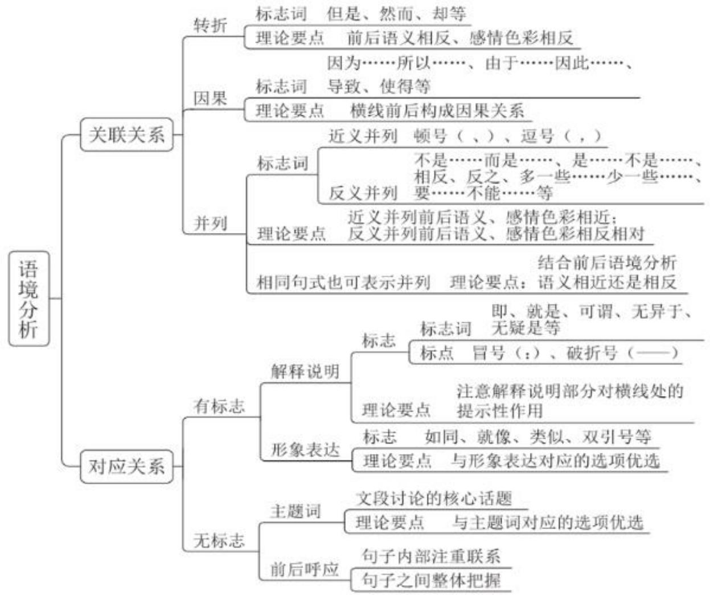

# 精讲精练-言语9

(笔记)

主讲教师：郭熙

授课时间：2025.02.28

# 精讲精练-言语9（笔记）

第九次课学习重点内容:

(1)有标志对应一形象表达的标志与应用  
(2)无标志对应的分类与应用

【注意】第九次课学习重点内容：学习逻辑填空，如果课前预习正确率不理想，是很正常的，因为后三节课讲解逻辑填空的题型，每节课的考点都不一样，接下来要讲的考点还没有掌握正确的解题思维。

1. 有标志对应一形象表达的标志与应用。  
2. 无标志对应的分类与应用。

# (一) 有标志对应——形象表达

标志：如同、有如、就像、类似、有异曲同工之妙、“

物+人的动作/状态（漆画不善于……）

答题要点：所填词语与形象表达的词语形成对应

1. (2021 国考) 这要求我们要把制度像种子一样种在头脑里, 如红线一般____于工作中。

A. 贯穿

B. 根植

2. （2021 联考）将细胞注射回人体，犹如将一艘艘小船放回航道，而人体内是一个密织交错的“航道网”，如果没有有效的、执行力强的“导航”设备，只能“________”。

A. 随波逐流

B. 返本还原

【注意】有标志对应一形象表达：言语喜欢考查形象表达，因为很多领导人在讲话中很喜欢用形象化表达，所以真题就常考。

1. 标志：出现拟人、比喻等修辞手法。

(1) 如同、有如、就像、类似、有异曲同工之妙、“”。如“人生如戏，全靠____”，A. 努力，B. 演技，把人生比作戏，横线处要匹配“戏”的特点，所以靠演技，

(2) 物+人的动作/状态。如“漆画不善于……”, 为拟人的形象表达。

2. 答题要点：所填词语与形象表达的词语形成对应。是对比择优的角度，优先考虑形象化表达的对应。

3. 示例:

(1) 横线前把制度比喻成红线, 横线处要匹配红线的特点, 锁定 A 项 “贯穿”。横线前出现 “种子”, 文段出现两个不同的比喻, 横线处真正对应红线的作用, 而不是种子。  
(2) 横线处出现双引号, 有可能考查形象化表达。看到 “航道网” “导航”,就好像在大海中航行的船, 缺了导航就会随着水流走, 锁定 A 项 “随波逐流”, B项 “返本还原”与“航道网”“导航”对应不当, 排除。

【例 1】(2024 江西) 蝌虫具有恐怖的吸血能力, 它会找到皮肤上隐蔽的角落______地吸血好几天, 人却无法察觉。这是因为蜱虫的唾液就像鸡尾酒一样,由各种蛋白质 “____” 而成, 其中一些让人不痛不痒, 一些让血液不会凝固,还有一些保证不会____人的免疫系统。多种病原体便会趁机入侵人体。

依次填入画横线部分最恰当的一项是:

A. 不声不响

搅拌 启动

B. 堂而皇之

调配

惊扰

C. 明目张胆

凝结 触发

D. 有恃无恐

混合

唤醒

【解析】1. 第一空, “却”表转折关系, 前后意思相反, 转折之后论述无法察觉, A 项 “不声不响” 指不说话、不出声, 若当选, 应该说 “蜱虫不声不响地吸血好几天, 所以人们无法察觉”, 填入文段无法与 “无法察觉” 构成转折, 排除。B 项 “堂而皇之” 指公开或不加掩饰; C 项 “明目张胆” 指公开地、无所顾忌地做坏事; D 项 “有恃无恐” 指因有所依仗而不害怕, 均可, 保留。

第二空，横线处有双引号，前文论述“就像鸡尾酒一样”，为打比方，横线处要匹配“鸡尾酒”的特点，常说“调酒师”，锁定B项“调配”。C项“凝结”，鸡尾酒不是直接凝结而成的，排除。D项“混合”，制作鸡尾酒时，不是直接把原料混合在一起，如果直接混合就可以，职业就不会叫做“调酒师”，没有B项准确，排除。

第三空，B项“惊扰”填入恰当。A项“启动”、C项“触发”、D项“唤醒”说明原来是沉睡的、不起作用的，横线后搭配“人的免疫系统”，在人体内是时

刻运行、保护身体的，故填入不当，均排除。【选B】

【例 2】（2023 吉林）红色，是强军文化最鲜亮的底色。展开历史画卷，红色基因犹如一条红线____历史，孕育了我党我军特有的忠诚品质、胜战精神、优良作风。善于传承才能更好创新，因此应站在红色江山永不变色、党的事业____的高度，与优良传统对接，汲取信仰力量，深入实施“红色基因代代传”工程，让强军文化在红色____上生发新枝叶，使这些超越时空限制、富有永恒魅力的宝贵精神财富，通过更加生动鲜活的表达方式弘扬起来。

依次填入画横线部分最恰当的一项是:

A. 标记

继往开来

基因

B. 穿越

承上启下

底蕴

C. 纵贯

薪火相传

根脉

D.联通

大展宏图

土壤

【解析】2. 第一空, “犹如”为打比方, 横线处要体现这条红线对历史的作用, A、B 项都不是红线的作用, 均排除。C、D 项均可, 保留。

第二空，前文强调善于传承，后文论述“红色基因代代传”，故横线处要体现传承，锁定C项“薪火相传”，比喻学问和技艺代代相传。D项“大展宏图”指放手实施宏伟的计划和设想，如很多同学说考上公务员之后要大展宏图，不强调传承，排除。

验证第三空，“根脉”填入文段很形象，C项当选。【选C】

# 【注意】

1. “继往开来”指继承前人的事业，开辟未来的道路。  
2. “承上启下”指承接上面的，引出下面的内容。

【例 3】(2023 吉林) 盗蛛是一种捕鱼蛛, 多生活在溪水面上, 有的盗蛛经常将两只长脚伸进水里探测小鱼的动向, 就好像 “姜太公” 钓鱼静待它们 “______”, 当小鱼游进捕猎范围, 盗蛛就会突然扑过去, 并用两只长脚将小鱼紧紧抱住, 将其拖入自己的洞穴。有的盗蛛还会用后面一对步足紧抓水面漂浮物, 将其余几对伸出去, _____, 一旦遇见合适的目标时, 便会迅速扑上去, 先用口器咬住猎物, 然后再将毒液注入其体内, 使猎物中毒昏迷。

依次填入画横线部分最恰当的一项是:

A.束手就擒 一探究竟

B.坐以待毙 见机行事

C. 自投罗网 随波逐流

D. 自取灭亡 静观其变

【解析】3. 第一空，横线处有双引号，通过姜太公钓鱼进行形象的打比方，常说“姜太公钓鱼，愿者上钩”，故横线处要体现自愿上钩，A项“束手就擒”指毫不抵抗，乖乖地让人捉住；B项“坐以待毙”形容在极端困难中，不积极想办法找出路，不是自愿的主动上钩，均排除。C项“自投罗网”比喻自己送死；D项“自取灭亡”指所作所为把自己引上绝路，均可，保留。对比C、D项，和“钓鱼”对应，C项“自投罗网”形象指代捕猎的范围。

第二空, “还”说明前后是并列关系, “有的盗蛛……有的盗蛛还会……”为并列的两种情况, 应该是两种不同的情况, 如果两种情况完全一致, 则没有必要说第二种, 第一种情况的 “静待” 体现的是 “静观其变”, 所以第二种情况不能再是静观其变, 排除 D 项。锁定 C 项 “随波逐流”, 此处用的是字面意思。【选 C】

# 【注意】

1. “一探究竟”指一直探索下去，弄清事情的原委。  
2. “见机行事”指看具体情况灵活办事。  
3. “静观其变”指看着事情的发展，根据发展的不同情况采取不同的措施。

【例 4】（2022 天津）仅靠未成年人发挥自律性，主动去抵御网络诱惑并不现实。通过学校和家长的共同努力，可以实现一定程度的控制，但这需要一直盯着孩子，也很困难，还容易____。此前，为彻底落实游戏防沉迷措施，监管部门发布了一系列严规，给游戏平台戴上了“____”，获得非常好的成效。

依次填入画横线部分最恰当的一项是:

A. 回落 保护套

B. 反弹 紧箍咒

C. 失效 防盗网

D.逆反 连环扣

【解析】4. 第二空，横线处有双引号，有可能为形象化表述，横线前论述监管部门发布了一系列严规，给游戏平台起的作用，应该起到约束、制约、限制作用，A项“保护套”起到保护作用；C项“防盗网”起防盗作用，不强调约束、

制约，均排除。B项“紧箍咒”比如唐僧给孙悟空念紧箍咒，为了约束、制约他，符合文意，当选。D项“连环扣”指连绵交织的情丝，还指错综复杂的矛盾，文段未体现，排除。

第一空, 前文论述 “通过学校和家长的共同努力, 可以实现一定程度的控制”,说明共同努力的效果, 横线处体现效果容易出现什么, 应该是效果会反弹, 锁定 B 项。D 项 “逆反” 如孩子会逆反, 横线处不是单纯强调孩子, 排除。【选 B】

【粉笔提示】“紧箍咒”——比喻起约束作用的事物

(人民网)《公共》的一系列具体要求, 为非学科类校外培训机构戴上了 “紧箍咒”。

(人民网) 给虚拟货币戴上 “紧箍咒”, 避免其成为资本泡沫的 “兴奋剂”是应有之义。

（人民网）为预付卡消费套上“紧箍咒”，促使其在法治轨道上运行，还需要多方参与共同努力。

(人民网) 面对春节这道 “廉” 题, 将通过上好新年 “廉政课”, 念好廉洁 “紧箍咒”, 加大监督检查力度, 切实把好 “廉洁关”, 确保党员干部过个 “廉洁年”。

(人民网)全面实施“闭环管理”, 筑起安全“防火墙”, 念好责任“紧箍咒”,使企业安全工作始终处于可控范围之内, 为高质量发展奠定了更加坚实的基础。

【注意】“紧箍咒”: 比喻起约束作用的事物。可以搭配“戴上、套上、念好”。

【例 5】（2021 国考）随着各种侦察手段的不断演进，可视侦察、红外侦察、雷达侦察等“________”，现代坦克在战场上越来越难以藏身。对此，现代坦克当然不会“________”。在讲求“发现即摧毁”的现代战场上，坦克必须实现对侦察手段的“免疫”，见招拆招，________，让对手对自己庞大的身躯“视若无睹”。

依次填入画横线部分最恰当的一项是:

A. 齐头并进 束手就擒 对症下药

B. 大显身手 自暴自弃 见机行事

C. 虎视眈眈 坐以待毙 有的放矢

D. 明察秋毫 知难而退 多管齐下

【解析】5. 第一空，横线处有双引号，要看后文讲了什么，首句重点强调坦克难以藏身，根据后文可知，坦克与侦察手段之间是对抗、对立关系，“视若无睹”形容侦察手段，为拟人的形象化表达，强调看，故横线处要体现二者之间是对立的姿态，且要和“视若无睹”构成形象对应。A项“齐头并进”指多件事不分先后地同时进行；B项“大显身手”指充分地显示出本领和才能，均排除。C项“虎视眈眈”指心怀不善，伺机攫取，填入恰当，当选。D项“明察秋毫”形容人能洞察事理，看得非常仔细，不强调对立、对抗，没有C项恰当，排除。

第二空，后文论述发现就摧毁，即干死他，故横线处要体现坦克当然不会坐着等着被摧毁、等着被干死，锁定C项“坐以待毙”，指在极端困难中，不积极想办法找出路。

验证第三空，C项“有的放矢”指说话、做事有针对性，横线前“见招拆招”即来一招拆一个招，可以体现针对性拆招，填入恰当，当选。A项“对症下药”指针对问题，确定解决的办法；B项“见机行事”指看具体情况灵活办事；D项“多管齐下”指做一件事从多个方面同时进行，不算错，但前两空有猪队友，均排除。【选C】

# 【注意】

1. “束手就擒”指毫不抵抗，乖乖地让人捉住。  
2. “自暴自弃”指自己甘心落后，不求上进。  
3. “知难而退”指知道事情困难就后退。

【例 6】（2024 黑龙江公安）战略管理体系，既是军队组织形态现代化的重要支撑，也是军队组织形态现代化的关键任务。紧紧扭住健全完善战略管理体系，就牢牢抓住了推进军队组织形态现代化的“牛鼻子”，可以起到 ______ 的作用。

填入画横线部分最恰当的一项是:

A. 标本兼治

B. 立竿见影

C. 高屋建瓴

D. 纲举目张

【解析】6. “牛鼻子”为形象化表达，说明这件事情非常关键，是要害，故

横线处要体现抓住关键，切中要害的意思。

A 项: “标本兼治”指表面和内在的问题同时治理, 不强调抓住关键, 排除。  
B 项: “立竿见影” 指在阳光下竖起竹竿, 立刻就看到了竹竿的影子。比喻立见功效, 不强调抓住关键, 排除  
C 项: “高屋建瓴” 指居高临下、不可阻挡的有利形势, 不强调抓住关键,排除  
D 项: “纲举目张” 比喻文章条理分明, 也指抓住事物的关键, 带动其他环节, 符合文意, 当选。【选 D】

【注意】牛鼻子：比喻事物的要害或关键。例：（总书记）党的领导当然要在中心工作中得到充分体现，抓住了中心工作这个“牛鼻子”，其他工作就可以更好展开。

【例 7】（2021 国考）发展扶贫产业不能眉毛胡子一把抓，必须立足当地自然禀赋，挖掘地方特色资源，按照“宜种则种、宜养则养”的原则，注重发展山地农业、生态农业、观光农业等特色产业，学会“靠山吃山唱山歌，靠海吃海念海经”，谨防产业“____”。应该看到，适合的才是最好的。

填入画横线部分最恰当的一项是:

A. 急功近利

B. 水土不服

C. 削足适履

D. 千篇一律

【解析】7. 后文论述要适合，横线前有“谨防”，故横线处要表达不适合。

A 项: “急功近利”指急于追求成效, 贪图眼前利益, 不强调不适合, 排除。

B项“水土不服”指人在不熟悉的环境中无法适应或适应困难，本身非常形象，可以体现不适合；C项“削足适履”指不合理地迁就凑合或不顾具体条件，生搬硬套，可以体现不适合，“谨防”前后语义相反，横线前有双引号“靠山吃山唱山歌，靠海吃海念海经”，故横线处的双引号和前文双引号在内容上要构成对应，与“山、海”对应，优选B项“水土不服”。C项与前文分句对应没有“水土不服”恰当，排除。

D 项: “千篇一律”指办事按一个格式, 非常机械, 泛指事物形式陈旧呆板、

呆滞，反面是有变化，文段不是单纯强调没有变化，没有 B、C 项恰当，若当选，前文要论述写文章要有自己的特点，要有变化，谨防千篇一律的情况，排除。【选 B】

【例 8】（2024 四川）秦国的强大在一定程度上得益于都江堰水利工程。秦国蜀守李冰为解决岷江的泛滥问题，考其地势，采用中流作堰的方法，因势利导，成功制服______的岷江，将其分为内江和外江。如此______的工程布局，堪称人类水利史上的奇迹。

依次填入画横线部分最恰当的一项是:

A. 波澜壮阔

出神入化

B. 势不可当

鬼斧神工

C. 一泻千里

匠心独具

D. 架驽不驯

巧夺天工

【解析】8. 第一空, 横线后为 “岷江”, 横线前为 “制服”, 为非常形象的词,是拟人的表达, 故横线处要体现出岷江不服管、不听话的特点, 锁定 D 项 “桀骜不驯”, 指性情暴烈, 不服管教。A 项 “波澜壮阔” 指声势雄壮浩大, 如波澜壮阔的英雄史; B 项 “势不可挡” 指来势迅猛, 不可抵挡, 均体现不出不服管, 排除。C 项 “一泻千里” 形容江河水流迅速, 或文笔奔放、流畅, 强调速度快, 文段不是单纯强调速度快, 排除。

第二空，搭配“工程布局”，是人工形成的，不是大自然的情况，对应D项“巧夺天工”，指精巧的人工胜过天然，形容技艺极其精巧。B项“鬼斧神工”指技艺精巧，非人力所能及，真题中通常搭配大自然，排除。A项“出神入化”指某种技艺或表演达到了令人惊叹的境界。C项“匠心独具”指具有独到的灵巧的心思，多指技术或艺术方面有创造性，有猪队友，排除。【选D】

【例 9】（2024 山东）药品安全事关广大人民群众身体健康和生命安全。不筑牢药品的安全底线，安全根基不稳，再多的创新也是________。持续强化药品全生命周期质量监管，落实药品安全“四个最严”要求，才能有效________药品安全形势的总体稳定。药品安全是设计出来的，也是生产出来的，更是监管出来的。

依次填入画横线部分最恰当的一项是:

A. 纸上谈兵

保障

B. 徒劳无功

提升

C. 空中楼阁 维护

D. 本末倒置 控制

【解析】9. 第一空，需要对比择优，“安全根基”为形象化比喻，把安全比作建造大楼的根基，横线处对应“根基”，锁定C项“空中楼阁”，指虚幻的事物或脱离实际的理论、计划。A项“纸上谈兵”指空谈理论，不能解决实际问题；B项“徒劳无功”指白费力气，没有成就或好处；D项“本末倒置”指把主要的和次要的、本质和非本质的关系弄颠倒了，与“安全根基”对应不当，均排除。

验证第二空，“维护稳定”搭配合适。B、D项与“稳定”搭配不当，均排除。A项可以，但第一空不行，排除。【选C】

# (二) 无标志对应——主题词

主题词：文段讨论的核心话题

答题要点：所填词语与主题词对应的选项优选

例：（2023 国考）“报得准”是气象监测预报预警的生命力。天气预报准确率高，防灾减灾才能______，为有关部门正确决策提供科学客观的支撑，应急处置才能有力有效。

A. 有条不紊

B. 有的放矢

【注意】无标志对应一主题词：纠结时可以考虑主题词，整个文段的主题词往往会高频出现。

1. 主题词：文段讨论的核心话题。  
2. 答题要点：所填词语与主题词对应的选项优选。  
3. 示例：文段“准”高频出现，横线处要体现防灾减灾要精准、准确，锁定B项“有的放矢”，指说话做事有针对性。A项“有条不紊”强调有条理，不一定精准，排除。

【例 1】（2021 国考）代入感是作品引发受众认同的机制，故事人物的某些方面召唤读者将自己替换为主人公，从而________，与角色同呼吸共命运。代入感是长篇网络小说________的属性，由于网络小说连载时间长，读者容易中途放弃。因此，作品绑定读者，将单纯浏览转变为情感认同便十分重要。

依次填入画横线部分最恰当的一项是:

A. 感同身受 不可或缺

B.惺惺相惜 独一无二

C. 身临其境 与生俱来

D. 触景生情 与众不同

【解析】1. 第一空，横线处围绕“代入感”论述，锁定A项“感同身受”，指虽未亲身经历，但感受就同亲身经历一样。B项“惺惺相惜”指性格、志趣、境遇相同的人互相爱护、同情、支持，如甲和乙惺惺相惜，不强调代入感，排除。D项“触景生情”指受到眼前景物的触动，引起联想，产生某种感情，不强调代入，排除。C项“身临其境”指亲自到了那个境地，体现不出理解主人公的感受，排除。

验证第二空，A项“不可或缺”指非常重要，不能有一点点的缺失，填入恰当。【选A】

# 【注意】

1. “独一无二”指没有相同的或没有可以相比的。  
2. “与生俱来”指一生下来就是如此。  
3. “与众不同”指与其它人不一样。

【例 2】（2022 福建）快门是相机中一个相当重要的装置，它以________的态度面对分分秒秒不停变化的现实，以及无法________的时间，最后，对着时间拉出一条线，决定我们所见的事物。这个动作，把现实中模糊存在的实像，转化为具有________方向性和意义的虚像，定影在底片上。

依次填入画横线部分最恰当的一项是:

A. 果断 捕捉 明确

B. 忠实 回忆 清晰

C. 冷静 复制 唯一

D. 严谨 定格 准确

【解析】2. 第一空，四个选项都形容人，说明用了拟人的形象化表达，“它”指“快门”，是核心话题，“快门”的特点应该是快，锁定A项“果断”。B项“忠实”不是快，排除。C、D项体现不果断，均排除。

第二空, “无法捕捉的时间”没有问题, A 项当选。D 项 “定格” 可以, 但有猪队友, 排除。

第三空，前文是“模糊”，后文用“明确”，对应准确，A项当选。D项“准

确”可以，但第一空不行，排除。【选A】

【例 3】（2024 国考）年轻干部要提高抓落实能力。干事业不能做样子，必须脚踏实地，抓工作落实要以上率下、______。特别是主要领导干部，既要带领大家一起定好盘子、理清路子、开对方子，又要做到重要任务亲自部署、关键环节亲自把关、落实情况亲自督查，不能高高在上、______，不能只挂帅不出征。干事业就要有钉钉子精神，抓铁有痕、踏石留印，______向前走，过了一山再登一峰，跨过一沟再越一壑，不断通过化解难题开创工作新局面。

依次填入画横线部分最恰当的一项是:

A.一马当先 刚愎自用 披荆斩棘  
B. 真抓实干 凌空蹈虚 稳扎稳打  
C.掷地有声 好高鹫远 久久为功  
D. 责无旁贷 坐而论道 虽兢业业

【解析】3. 第一空，首句论述年轻干部要提高抓落实能力，后文都在围绕首句展开论述，故首句相当于中心句，核心话题为“抓落实”，后文要围绕“抓落实”展开论述。“重要任务亲自部署、关键环节亲自把关、落实情况亲自督查”强调亲自去做，即真抓实干，锁定B项，“真抓实干”强调落实到实处，。A项“一马当先”指工作走在群众前面，积极带头，与文段整体强调的核心话题不匹配，排除。C项“掷地有声”指话语坚定有力、意义深远，不强调抓落实，排除。D项“责无旁贷”指自己应尽的责任，不能推卸给别人，强调承担责任，没有B项恰当，排除。

第二空，横线前出现否定词，前文强调要落实，和“高高在上”并列，反面即不落实、没落实，A项“刚愎自用”指十分固执自信，不考虑别人的意见，排除。B项“凌空蹈虚”指无史实根据的虚构，“虚”即虚构，与“实”相反，当选。

验证第三空，强调落实，B项“稳扎稳打”指有把握、有步骤地工作，填入恰当。【选B】

# 【注意】

1. 前两个空语义相反，所以要选一对反义词，“真抓实干”强调实，“凌空蹈虚”强调虚。  
2. “披荆斩棘”指前进道路上清除障碍，克服困难。  
3. “久久为功”指要持之以恒，锲而不舍，驰而不息。  
4. “兢兢业业”指做事小心谨慎，认真踏实。  
5. “好高骛远”指不切实际地追求过高过远的目标。  
6. “坐而论道”指坐着空谈大道理，口头说说，不见行动。

# 【粉笔积累】

年轻干部要提高抓落实能力。干事业不能做样子，必须脚踏实地，抓工作落实要以上率下、真抓实干。特别是主要领导干部，既要带领大家一起定好盘子、理清路子、开对方子，又要做到重要任务亲自部署、关键环节亲自把关、落实情况亲自督查，不能高高在上、凌空蹈虚，不能只挂帅不出征。干事业就要有钉钉子精神，抓铁有痕、踏石留印，稳扎稳打向前走，过了一山再登一峰，跨过一沟再越一壑，不断通过化解难题开创工作新局面。

——总书记《年轻干部要提高解决实际问题能力想干事能干事干成事》

【例 4】(2023 国考) 指尖上的形式主义是 “以痕迹论政绩” 的错误政绩观,关注点在于形式美观, 而____了根本政绩——人民群众的满意度。指尖上减负就是要把基层干部从____的 “虚功” 中解救出来, 务求实效、扎根基层, 用实践检验政绩, 把工作落实与否、群众满意与否作为衡量政绩的客观标准。

依次填入画横线部分最恰当的一项是:

A. 偏离 阳奉阴违

B. 遗忘 哔众取宠

C. 淡化 花拳绣腿

D. 忽视 华而不实

【解析】4. 第二空，文段强调的核心话题为要落实，“虚功”代表反面，故横线处要强调不实，A项“阳奉阴违”指表面上遵从，暗地里不执行；B项“哗众取宠”指以浮夸的言行迎合群众，骗取群众的信赖和支持，均不体现华而不实，排除。C项“花拳绣腿”比喻只做些表面上好看实际上并无用处的工作；D项“华而不实”指外表好看，内容空虚，可以与后文构成语义相反，均保留。

第一空，“关注点”是关注的地方，前后进行对比，横线处要体现忽视、没

关注，锁定D项。C项“淡化”指变淡，如淡化痘印、淡化雀斑，反面是变浓，排除。B项“遗忘”的反面是记住，没有D项好，排除。【选D】

【例 5】（2023 吉林）在深化不同文明之间的交流互鉴中，要构建一套中华思想文化术语对外翻译的标准本，把中国真正的文化精髓____世人。为此，需要加强国际传播能力建设，形成同我国综合国力和国际地位相匹配的国际话语权，以中国思想观念的本来思想意蕴对外传播，而不能靠他者误读了的内容去____。

依次填入画横线部分最恰当的一项是:

A. 昭示 以讹传讹

B. 告知 妄下雌黄

C. 灌输 道听途说

D.启迪 评头论足

【解析】5. 第一空，横线处表达把中国真正的文化精髓告诉世人、让世人知道，C项“灌输”指强行让你接受，与文意不符，排除。

第二空, “需要”引导对策, 做法是搞国际传播、对外传播, 横线处对应“传播”这个话题, 锁定 A 项 “以讹传讹”, 指把本来就不正确的话又错误地传出去,越传越错。B 项 “妄下雌黄”指不按客观标准, 任凭己意, 乱改文字, 乱加评论; D 项 “评头论足”指对人或事物随便议论, 百般挑剔, 不强调搞对外传播, 均排除。【选 A】

【注意】“昭示”指清楚明白的显示。

例 6（2024 山东）铁路是国民经济大动脉。一条铁路线的____，往往折射出一个地区发展变迁和现代化的崛起步伐。在山东发展史上，百廿胶济，就是这样一条担纲主动脉的铁路线。可以说，一部百廿胶济发展史，是一部铁路交通变迁史，更是一部____的沿线经济文化发展史。依次填入画横线部分最恰当的一项是：

A. 贯通 气势磅礴

B. 延展 活力四射

C. 演变 流光溢彩

D. 僧变 波澜壮阔

【解析】6. 第一空，有同学看到“铁路线”，直接误选A项“贯通”，也有同学不认识D项“嬗变”，直接排除，D项“嬗变”指彻底改变，强调变，从文段

找线索，不能只看搭配铁路线，后面变迁代表变化，“百廿胶济”为举例子，“可以说”表总结，后文变迁史，均强调变化，C项“演变”、D项“嬗变”更加强调变，均保留。文段强调随着时间发生了非常大的改变，A项“贯通”，如一条铁路线贯穿南北，“延展”更多是空间上的，A、B项均排除。

第二空，搭配发展史，D项“波澜壮阔”通常和历史、发展史搭配，当选。C项“流光溢彩”形容光彩照人，如华灯初上，流光溢彩，形容大街上的景象，与历史搭配不当，排除。【选D】

# 【注意】

1. 气势磅礴：气势雄伟壮大。  
2. 活力四射：非常有活力和精力充沛。  
3. 流光溢彩：美好，光彩照人。  
4. 波澜壮阔：声势浩大，规模宏伟。  
5. 粉笔积累：嬗变：彻底改变，变化非常大（如特征或条件的改变）；蜕变；演变。如（2014 广东）正如中国乡村在拥抱现代化的过程中不断嬗变一样，乡村道德也在剧烈变化的大时代里面临转型。文段强调随着时代发生非常大、非常彻底的改变。

例 7（2022 福建）大脑由数十亿个神经细胞组成，这些____的细胞需要在一个受保护的环境中才能正常工作，这个____的环境被 400 英里长的特殊血管系统保护着，这些血管能____与大脑接触的物质，这就是脑屏障，它对于保护脑组织免受毒素和病原体的侵害至关重要。

依次填入画横线部分最恰当的一项是:

A. 脆弱 微妙 限制

B. 高效 复杂 阻挡

C. 散乱 神奇 过滤

D. 微小 灵敏 抑制

【解析】7. 第一空，有同学看到“细胞”，误选C项“散乱”、D项“微小”，往后找线索，往后找线索，后文强调保护，把握核心话题“保护”，与“保护”对应，A项“脆弱”保留。B项“高效”强调效率高，反面是低效率，与保护无关，排除。C项“散乱”反面是变整齐，不是保护，排除。D项“微小”保留。

第二空，搭配环境，D项“灵敏”，如某人反应灵敏、嗅觉灵敏、动作灵敏，搭配不当，排除。A项“微妙”可以搭配环境，“微妙”可以表达非常丰富的意思，如某人相亲刚认识对方觉得约会的环境非常微妙，双方都是小心翼翼的感觉，彼此双方都呵护着微妙的环境，微妙的环境需要被保护，没问题，当选。

第三空，不让这些物质和大脑接触，是限制的作用，锁定 A 项“限制”。【选 A】

# 【注意】

1. 粉笔提示：高频话题：保护——脆弱。  
2. 不要忽略主题词，文段没有其他线索，可以把握文段核心话题，如果有中心句，可以先关注这句话的核心话题，整个文段的特征就是高频出现，纠结时，可以从主题词角度对比择优。

# (二) 无标志对应——前后呼应

(1) 句子内部注重联系  
(2) 句子之间整体把握

1. （2021 广西）从长远看，电影产业的发展必然要拥抱网络平台，但是院线依然具有____的优势，观影社交仪式感、巨幕、3D 沉浸式体验以及高度还原的环绕立体声，这些都是网上观影所不具备的。

A. 遥遥领先

B. 不可替代

2. （2024 国考）公正司法是维护社会公平正义的最后一道防线。在社会关系调节和纠纷解决中，司法具有 ______ 作用。党的十八大以来，我们着力深化司法体制改革，加快建设公正高效权威的社会主义司法制度。

A. 指导性

B. 终局性

【注意】无标志对应——前后呼应：没有解题线索，重点理解前后内容。

1. 句子内部要注重联系，句子内部可能有提示，可能前后分句对横线意思有提示。  
2. 单纯看横线所在句子不好把握，去前后语句中整体理解和把握。  
3. 上述例子:

(1) 横线有分句, 关注句子内部联系, “不具备”对应 B 项 “不可替代”。后文并非强调领先, A 项 “遥遥领先”, 排除。  
(2) 单纯读横线之前, 两个选项都可以, 首句论述司法作用, 横线依然围绕司法作用展开, 故横线与开头对应, B 项 “终局性” 对应 “最后一道防线”,当选。A 项 “指导性” 无法匹配 “最后一道防线”。

例 1（2023 重庆）由中国歌剧舞剧院推出的舞蹈剧《英雄儿女》以宏伟壮阔的叙事风格、史诗般的影像____、沉浸式的体验，带领观众走进抗美援朝那段激情燃烧的岁月。该剧汇集多种舞蹈形态，舞美运用高科技手段，为观众营造身临其境之感，并以油画的美术风格力图____那个时代的真实色彩。

依次填入划横线部分最恰当的一项是:

A. 艺术 描摹

B. 质感 还原

C. 效果 表现

D. 元素 展示

【解析】1. 第一空，A项“艺术”、B项“质感”、C项“效果”、D项“元素”不易判断。

第二空，身临其境的感觉，横线前面的分句有提示，关注句子内部的联系，“身临其境”体现让观众置身到了当时的那个时代，B项“还原”，前面是舞蹈剧，让观众身临其境，舞台妆造、布景、演员表演对党史的时代非常还原，当选。A项“描摹”有临摹的意思，指照着描和画，还可以表示用语言文字来展现，C项“表现”、D项“展示”，单纯从意思上看，“表现”和“展示”均可，文段的落脚点不是油画本身，而是通过舞蹈、舞美高科技手段让观众身临其境，让当时的色彩还原出来，故不合适，排除。

第一空，说一部电影非常有质感，意思是非常有品质，有审美的享受，文段是歌舞剧院退出的舞蹈剧，像电影一样非常有质感，让人有美的享受，B项“质感”恰当，当选。【选B】

例 2（2024 吉林）近年来随着小卫星市场的蓬勃发展，带来了小卫星发射需求的快速上升。在这种形势下，火箭拼单开始____，一箭多星的规模也越来越大。在多星分配器上，卫星根据各自特性的不同，有的是端坐在顶上，有的是侧

挂在壁上，还有的包装在释放装置内，保证大家______，都能够经受住火箭发射时的飞行环境，安全地进入到太空。

依次填入横线处最恰当的一项是:

A. 蒸蒸日上 一举多得  
B. 生机勃勃 箭无虚发  
C. 大行其道 各得其所  
D. 生意盎然 一箭双雕

【解析】2. 第一空，体现火箭拼单很流行，发展比较好，A 项“蒸蒸日上”、B 项“生机勃勃”、C 项“大行其道”、D 项“生意盎然”不易判断。C 项“大行其道”不是单纯的贬义词，可以用在中性的语境中，表示很流行的意思，也可以用于贬义语境，故不建议直接排除。

第二空, 横线前面的分句有提示, 横线对前文“有的……有的……还有的……”作了一个小总结, 分配卫星时要根据各自的特点安排, 适合坐在顶上的放在顶上,适合侧挂的把它侧挂, 适合放在里面的就放在里面, 锁定 C 项 “各得其所”, 各自找到自己合适的位置。A 项 “一举多得” 指通过一个行动能够获得多方面的好处, 文段 “有的……有的……还有的……” 是多个行动, 排除。D 项 “一箭双雕”指做一件事情能够达到两方面的好处, 前文不是只有一件事情, 有同学认为火箭只有一个, 误选 D 项, 横线所在的句子强调的是卫星的做法, 且后文都强调不同的卫星能够经受住环境, 而非讨论火箭, 故排除。B 项 “箭无虚发” 不能体现根据不同的特性把它安排在合适的位置上, 且文段并非强调火箭, 而是卫星, 排除。

第一空，C项“大行其道”表示广为流传，盛行一时，可以用于中性、消极贬义的语境中，当选。【选C】

# 【注意】

1. 蒸蒸日上：发展速度快。多指生活和生意。  
2. 生机勃勃：形容生命力旺盛的样子。  
3. 大行其道：指在某范围内广为流传，盛行一时。  
4. 生意盎然：形容生命力旺盛的样子。  
5. 一举多得：通过一次行动或决策，能够获得多重收益或达到多个目的。  
6. 箭无虚发：箭射得准，每发必中。  
7. 各得其所：每个人或事物都能够得到合适的位置或相应的回报。

8. 一箭双雕：做一件事情能达到两个目的或同时得到两种好处。

例 3（2024 辽宁）中国式现代化以______的观念统筹推进经济、政治、文化、社会和生态文明各领域工作，而构建新发展格局与推进中国式现代化是逻辑一致的，从生产力、经济体系、奋斗方向和实践路径等______为推进中国式现代化提供了重要基础。

依次填入画横线部分最恰当的一项是:

A. 整体 立场

B. 辩证 层面

C.系统 维度

D. 历史 视域

【解析】3. 第一空, 横线后为统筹推进各领域的工作, 是系统、整体的观念,经济、政治、文化、社会和生态文明就是五位一体, A 项 “整体”、C 项 “系统”均保留。B 项 “辩证” 往往是对一个现象要看到它好的一面, 也要看到它坏的一面, 从正反两个角度看待问题, 后文与辩证无关, 排除。D 项 “历史”, 更多是站在历史的维度, 而非强调系统、全局, 排除。

第二空，从这些方面代表一个一个的角度，C 项“维度”就是角度的意思，当选。A 项“立场”更多代表一种态度，如我的立场和总书记一致，前面不是强调态度、立场，排除。【选 C】

【注意】积累：系统观念/系统思维，不管解决什么问题都需要有系统观念/系统思维，如我们的课是系统班，是全方位、科学的备考方式。

例 4（2024 江西）中国汉字经历岁月洗礼，____，如今已发展出成熟而多样的字体系统。随着科学技术的____，激光照排技术替代活字印刷，让汉字的传播方式发生了革命性变化，而数字媒体的____使汉字字体的设计迎来了质的飞跃。当我们以全新的视角重新审视汉字时，会发现其创新的设计方法如万花筒般千姿百态、绚丽多彩。

依次填入划横线部分最恰当的一项是:

A. 久久为功

提升 创新

B. 历久弥新

增长

融合

C. 薪火相传

更迭 介入

D. 厚积薄发

普及

应用

【解析】4. 第一空，形容中国汉字，B项“历久弥新”体现时间久变得更鲜活，C项“薪火相传”指传承下来，均保留。A项“久久为功”、D项“厚积薄发”如果文段有经历岁月的洗礼本身就很形象，不要单纯从搭配人的角度排除。

第二空，横线后的分句有提示，C项“更迭”指更新换代，技术的更迭经常出现，可以与“替代”“革命性变化”对应，当选。A项“提升”、B项“增长”意思符合，但要把握和后文分句的对应，不能体现代替、革命性的变化，均排除。D项“普及”，如普及普通话，让更多人知道了解，起到推广的作用，文段更多强调更新换代、更迭，而非推广，排除。

第三空，C项“介入”为中性词，如（2013北京）在创造新知识和新思想的阶段，更多地需要政府介入，包括政府提供引导性投资和支持引进高端创新人才。这里的介入是参与其中的意思，如一个问题的解决需要有关部分的介入，文段体现数字媒体让汉字字体带来了质的飞跃，横线体现有了数字媒体的参与，才会让汉字字体迎来飞跃，C项“介入”填入文段符合文意，当选。横线不是单纯强调数字媒体自身的创新和融合，如果单纯强调数字媒体自身的创新和融合，横线后就不会说给别的东西带来作用，当选。【选C】

# 【注意】

1. 久久为功：要持之以恒，锲而不舍。  
2. 历久弥新：经历长久的时间而更加鲜活。  
3. 薪火相传：学问和技艺一代代地继承下去。  
4. 厚积薄发：经过长时间的积累和准备而获得大的成功。  
5. 粉笔积累：（2013 北京）在创造新知识和新思想的阶段，更多地需要政府介入，包括政府提供引导性投资和支持引进高端创新人才。  
6. 通过第二空入手，“更迭”与替代、革命性变化对应更恰当，更迭指更替、更新换代，技术的更迭就是新技术替代老技术，然后发生革命性变化。后文的创新是汉字字体本身的创新，前面是由于数字媒体的参与才让汉字字体的设计迎来了质的飞跃。

【粉笔积累】薪火相传：比喻学问技艺、民族文化等代代相传

1. （2021 四川）“一日为师，终身为父”，是传统师徒制的写照。历史上，师徒制保障了传统工艺技艺的薪火相传，可谓手工业时代的一种职业教育模式。  
2. （2022 重庆选调）在中国考古学百年发展过程中，中华文明起源与发展是最为重要的研究内容，也是几代考古人孜孜以求、潜心研究的重大课题。几代考古人勤奋耕耘，薪火相传，勾勒出中华文明起源与发展的轮廓。  
3. （2023 吉林）善于传承才能更好创新，因此应站在红色江山永不变色、党的事业薪火相传的高度，与优良传统对接，汲取信仰力量，深入实施“红色基因代代传”工程。  
4. （2021 广东）砥砺复兴之志，是一个古老民族生生不息的动力源泉。永葆赤子之心，是一个人民政党薪火相传的制胜法宝。  
5. （2022 广东）正是中华文化典籍的代代传承，中华民族历经磨难而坚强屹立，中华文明饱经沧桑而薪火相传。  
6. （2017 联考）中华文化延续着我们的国家和民族的精神血脉，既需要薪火相传、代代守护，也需要与时俱进、推陈出新。

【注意】薪火相传：比喻学问技艺、政党、民族文化等代代相传。

1. 技艺薪火相传。  
2. 考古人薪火相传。  
3. 党的事业薪火相传。  
4. 政党薪火相传。  
5. 中华文明薪火相传。  
6. 中华文化薪火相传。如上一题，汉字是文化的代表，也可以用薪火相传。

例 5（2024 贵州）正所谓沧海桑田，6000 年前的撒哈拉可能并非大沙漠，而是一片大草原，19 世纪中叶，德国探险家海因里希·巴特在______的撒哈拉沙漠中意外发现史前岩画，数 10 万幅精美的图像描绘着种族繁盛的大象、长颈鹿、河马和羚羊被猎人追捕的______场景，可以推想，史前人类______了撒哈拉由草原变成沙漠的过程。

依次填入画横线部分最恰当的一项是:

A. 沉寂

神秘

见证

B. 干燥

震撼

记录

C.荒凉 生动 经历

D.广袤壮观目睹

【解析】5. 第一空, “意外发现” 说明前后有对比, 往后找线索, 不能只看撒哈拉沙漠就选择干燥或者广袤, 后文论述这些动物种族非常繁盛, 体现生命力很旺盛, 种族非常繁荣, 横线要体现种族繁盛的反面, A 项 “沉寂”、C 项 “荒凉”均可, 在荒凉的撒哈拉沙漠意外地发现种族繁盛, 有非常多的动物繁衍生息, 保留。B 项 “干燥” 若当选, 后文应为意外地发现湿润, 排除。D 项 “广袤” 若当选, 后文应论述意外地发现范围非常狭小, 排除。

第二空, 大象、长颈鹿、河马和羚羊被猎人追捕很生活化, 电视中经常看到,不是神秘的, A 项 “神秘”, 排除。C 项 “生动” 符合文意, 当选。

第三空, 撒哈拉由草原变成沙漠不是一下子完成的, 经历了一个漫长的过程,经历了一代又一代才完成了由草原到沙漠的过程, 史前人类指的是历史上的一代又一代的人, 经历了由草原到沙漠的过程, C 项 “经历” 当选。D 项 “目睹” 指看到了全过程, 不符合文意, 排除。【选 C】

例 6（2025 天津）百年大党长期执政，思维惯性、行为惰性客观存在，一些老观念、老套路、老办法容易____，队伍不断发展壮大也带来干部良莠并存、参差不齐。我们必须____提高科学执政、民主执政、依法执政水平，克服干部队伍中存在的能力不足、本领恐慌，确保适应新时代要求、具备领导现代化建设能力，做到政治过硬、本领高强，堪当民族复兴重任。

依次填入画横线部分最恰当的一项是:

A. 积重难返 一如既往

B. 相沿成习 与时俱进

C. 画地为牢 坚定不移

D. 因循守旧 持之以恒

【解析】6. 第二空，横线搭配“老观念、老套路、老办法”，老的东西不太行，“必须”之后提对策，前面是问题，后面的对策是解决问题，问题是老的不行，B项“与时俱进”可以体现要创新，且后文适应新时代要求、具备领导现代化建设能力，都是与时俱进，符合文意，当选。

第一空，B项“相沿成习”指传下来的慢慢形成的习惯，形容“老观念、老套路、老办法”非常恰当，符合文意，当选。A项“积重难返”指长期形成的不良习惯、风俗不易改变，如农村赌博的恶习积重难返，排除。C项“画地为牢”、

D 项 “因循守旧” 指非常守旧、不创新, 往往是说人的做法, 如画地为牢、因循守旧, 搭配均不合适, 均排除。【选 B】

# 【注意】

1. 积重难返：长期形成的不良的风俗、习惯不易改变。  
2. 相沿成习：依照相传下来的一套慢慢地成了习惯。  
3. 画地为牢：只许在规定的范围之活动。  
4. 因循守旧：只许在规定的范围之活动。  
5. 一如既往：态度或做法没有任何变化，还是像从前一样。  
6. 与时俱进：随着时代的发展而不断发展、前进。  
7. 坚定不移：稳定坚强，毫不动摇，不放弃，不改变自己的想法。  
8. 持之以恒：长久坚持下去。

例 7（2023 山西）沙珠玉，曾是黄河上游风沙危害最严重的地区之一。20世纪 50 年代，沙珠玉九成草场已沙漠化。最严重的半年，沙丘向居民点推进了 47 米。______，沙珠玉人开始______。对他们来说，造林治沙，是一场用性命与风沙所做的生死搏斗。60 多年来，沙珠玉人营造起 18 道防风林，层层叠叠的树木，硬生生将狂风顶住、逼沙丘后退。

A. 山穷水尽

孤注一掷

B. 不进则退

迎难而上

C. 退无可退

绝地反击

D. 寸步难行

背水一战

【解析】7. 第一空，沙丘不断往前进，居民往后退，横线要体现后退，C项“退无可退”指往后退时发现没有退路，保留。A项“山穷水尽”不是往后退，指在前进的时候山穷了、水尽了，没有路了，排除。B项“不进则退”，如学习如逆水行舟，不进则退，强调要前进，排除。D项“寸步难行”指往前走，走一步都很困难，强调要前进，排除。

第二空，文段为“生死搏斗”，B项“迎难而上”指有困难往前上，生死搏斗指到了生死攸关的地步，C项“绝地反击”更合适，当选。且从选项设置来看，A、C、D项体现到了绝境，要做生死搏斗，B项“迎难而上”程度太弱，不能选。

第一空，横线前是沙丘向居民点推进，横线后才开始绝地反击，如果还有退

路还会往后退, 不会绝地反击, 正常情况下往后退, 发现退无可退时才绝地反击,所以是后退的意思, A 项 “山穷水尽”、D 项 “寸步难行” 都是往前走, 均排除。

【选C】

# 【注意】

1. 山穷水尽：无路可走陷入绝境。  
2. 不进则退：不前进就要后退。  
3. 退无可退：已经没有退路。  
4. 寸步难行：比喻处境艰难。  
5. 孤注一掷：危急时用尽所有力量做最后一次冒险。  
6. 迎难而上：不怕困难，不怕挫折。  
7. 绝地反击：在绝境中进行反抗。  
8. 背水一战：面临绝境，作最后一次努力。

例 8（2023 黑龙江）参照国际经验，生活垃圾收费主要有从量征收和定额征收两种模式。当前，我国大多数城市的居民生活垃圾处理费为定额征收。但早在 2018 年，国家已明确提出垃圾计量收费，一些城市也制定了居民生活垃圾处理费收费标准。无论是参照国际先进经验，还是促进生态环境质量改善，生活垃圾按量收费都是________。

填入画横线部分最恰当的一项是:

A. 必由之路

B. 势在必行

C. 大势所趋

D. 名正言顺

【解析】8. 横线在文段末尾，从文段找线索，把握词语的区别。前面先提出国际经验有两种模式，当前采用的是定额征收，虽然 2018 年已经提出垃圾计量收费，有标准，但是从量征收的方式没有被采用，当前的情况大部分是定额征收，参照国际经验，促进生态环境质量改善，按量收费是未来的趋势。

C 项: “大势所趋”指局势发展的趋势, 当选。

A 项: “必由之路” 指必须要走的路, 文段没有说必须要走, 过于绝对, 排除。

B 项: “势在必行”和“大势所趋”是兄弟词语, “大势所趋”是名词, 指局势发展的趋势, “势在必行”是动词, 强调必须要行动, 必须要去做, 横线前为 “是”, 后面应该是名词, 如传统文化艺术要想更好地传承, 抓住青年这个大群体势在必行; 融合发展是大势所趋。XXX 是大势所趋，行为/做法势在必行, “势在必行”用法不合适，排除。

D 项: “名正言顺” 若当选, 应表达为 “……是名正言顺的事情”, 用法不合适, 排除。

从选项设置来看，A、B、C 项相对比较接近，D 项“名正言顺”是凑数的。【选 C】

# 【注意】

1. 必由之路：事物发展必须遵循的规律或必须经历的过程。  
2. 势在必行：某事根据事物的发展趋势必须做。  
3. 大势所趋：指局势发展的趋向。  
4. 名正言顺：做某事名义正当，道理也说得通。  
5. 粉笔提示：大势所趋/势在必行。XXX 是大势所趋/XXX 势在必行。

(1) (2022 重庆选调) 传统文化艺术要想更好地传承, 抓住青年这个大群体势在必行。  
(2) (2019 山东选调) 融合发展是大势所趋, 传统的平台、介质或许会式微, 但是新闻没有消亡。

例 9（2024 黑龙江）“读万卷书，行万里路”虽是明代董其昌提出的观点，但却是中国历代许多文人所____的。在没有现代交通工具的古代，文人在著书立说之外，用简易的交通工具和双脚丈量大地，给我们留下了丰厚的文化遗存。填入画横线部分最恰当的一项是：

A. 推崇备至

B. 身体力行

C. 全力以赴

D. 孜孜以求

【解析】9. 只看横线所在的句子不好判断, 后文对前文的内容展开论述、解释说明, 后文的句子对于解题非常重要, 后文说 “用简易的交通工具和双脚丈量

大地”, 强调亲自去做、亲身实践, 身体力行, 锁定 B 项 “身体力行”。

A 项: “推崇备至”, 如我对总书记推崇备至, 只是强调内心非常敬佩、崇拜,不是强调身体力行、亲身实践, 与后文不匹配, 排除。

C项: “全力以赴”, 如上岸之后领导安排一项工作, 你会说 “我会全力以赴,保证完成任务”, 指用尽全力, 横线前搭配 “读万卷书, 行万里路” 的观点, 观点全力以赴搭配不当, 且后文为 “用简易的交通工具和双脚丈量大地”, 只是一种身体力行的做法, 不能代表用尽全力, 排除。

D 项: “孜孜以求”指不知疲倦地追求, 后文并非此意, 排除。【选 B】

# 【注意】

1. 推崇备至：极其推重和敬佩。  
2. 身体力行：身体验，努力实行。  
3. 全力以赴：把全部精力都投入进去。  
4. 孜孜以求：比喻不知疲倦地探求。

例 10(2023 广东)政府部门要制定政策、营造环境, 发挥宣传发动、组织协调、引导扶持作用, 但绝不能_____。要坚持有为政府和有效市场相促进, 充分发挥市场机制作用, 调动市场主体积极性, 以重点产业项目为_____, 促进资源要素更多向乡村流动, 以产业 “活水” 变输血为造血。

依次填入画横线部分最恰当的一项是 ( )。

A. 置身事外 核心

B. 越俎代庖 根本

C. 大包大揽 载体

D. 袖手旁观 导向

【解析】10. 第一空，选项分组，A项“置身事外”、D项“袖手旁观”都强调不参与，B项“越俎代庖”（越权）、C项“大包大揽”（全部包揽）指管得太多。横线前“不能”给出提示，后文强调发挥市场的作用，前面政府部门管得太多了，要给政府松绑，该交给市场的要交给市场，横线不是强调政府部门置身事外、袖手旁观，A、D项排除，B、C项保留。

第二空，搭配一个一个具体的项目，如投资项目是重点发展光伏产业，项目是载体，C项“载体”，作为载体能够承载产业的发展，当选。A项“核心”、B项“关键”、“关键性”等。

项“根本”不符合文意，均排除。【选C】

# 【注意】

1. 置身事外：把自己放在事情之外，毫不关心。  
2. 越俎代庖：超出自己业务范围去处理别人所管的事，即越权、越界。  
3. 大包大揽：把事情全部包揽过来。  
4. 袖手旁观：看到别人有困难，不帮助别人。  
5. 项目本身不是导向，可以说政府制定一个政策能够起到导向作用，调动市场的积极性，以重点产业项目作为载体，作用是促进资源要素更多向乡村流动，以产业“活水”变输血为造血。  
6. 第二空抓住“项目”的核心名词，只有“载体”更恰当，第一空四个词语都不太积极，往往都用于不太好的语境或者否定的语境中。现在的情况是政府管得太多，没有充分发挥市场的作用，要从管理型向服务型政府转变，说明原来政府管得太多，如考上公务员以后也要为人民服务，不是把自己定位到管理者。

例 11（2022 四川下）算法推荐凭借对用户浏览数据的精准分析，降低了人们获取信息的成本，同时也将人们推向了____的舒适圈。人们看似浏览了很多信息，实际只是在不断重复中强化固有的喜好和对事物的看法。一旦____其中，探索世界多样性的动力和欲望难免降低，加剧“信息茧房”效应。

依次填入画横线部分最恰当的一项是:

A. 悠然自得 陷溺

B. 画地为牢 束缚

C. 固步自封 沉浸

D. 按部就班 迷失

【解析】11. 第一空，横线后形容舒适圈，只读第一句话不能判断文段是积极还是消极，“只是”“降低”“加剧”说明文段为消极的感情色彩，横线也要体现消极，A项“悠然自得”为积极的词，形容自由清闲，心情舒畅，感情色彩不匹配，排除。B项“画地为牢”、C项“固步自封”相对消极，保留。D项“按部就班”为中性词，指按照一定的步骤、顺序做事情，不是消极的贬义词，排除。C项“固步自封”字面意思是停下脚步把自己封闭起来，填入文段符合文意，只看自己熟悉的，把自己封闭在这个小圈子里，保留。

第二空，C 项 “沉浸” 本身是中性词，B 项 “束缚是被动的，可能是被别人捆绑起来，被束缚住，‘沉浸’是主动的，如沉浸在听课中，体现非常投入，横线不是说这些人被别人束缚住，如本来想刷五分钟短视频，一看表三个小时过去了，说明非常投入、沉浸其中，可以说被算法束缚住，文段强调主动沉浸其中，C 项当选。【选 C】

# 【注意】

1. 悠然自得：自由清闲，心情舒畅。  
2. 画地为牢：只许在规定的范围之活动。  
3. 固步自封：安于现状，不求进步或革新。  
4. 按部就班：按照一定的步骤、顺序进行。

例 12（2025 国考）面对企业，干部洁身自好只是最低要求，担当作为才是责任所系。民营企业所遇到的困难和问题仍不少，干部不仅要守住廉洁底线，更应主动为企业________。干部同企业家打交道要把握分寸，并不意味着可以对企业家的正当要求________，对企业的合法权益不予保护，而是要积极主动为企业服务。

依次填入画横线部分最恰当的一项是:

A. 雪中送炭

充耳不闻

B. 保驾护航

退避三舍

C. 嘶寒问暖

熟视无睹

D. 排忧解难

置若罔闻

【解析】12. 第二空，前后为相同句式，表并列，横线与不予保护对应，横线后是积极主动，前面对企业家的要求是不重视，不作为，A项“充耳不闻”、C项“熟视无睹”、D项“置若罔闻”意思接近，保留。B项“退避三舍”是主动地退让，为了避免冲突，不是不关注、不重视，排除。

第一空，前面说遇到困难、问题，横线要体现主动为企业解决问题，锁定D项“排忧解难”，指解决问题。C项“嘘寒问暖”，如每次过年回家，周围都会有亲戚对你嘘寒问暖，他们不是解决问题的，排除。A项“雪中送炭”经常和锦上添花对比，锦上添花容易，雪中送炭难，雪中送炭指在别人急需的时候给以帮助，强调困难非常严重，不像锦上添花的帮助小，文段不是等到处在雪中才去解决问题，不管是大困难还是小困难，都要为企业排忧解难，排除。【选D】

# 【注意】

1. 雪中送炭：在别人急需的时候给以帮助。  
2. 保驾护航：保护某事物，让其能正常地发展。  
3. 嘶寒问暖：对人的生活十分关切，问冷问热。  
4. 排忧解难：排除忧虑，解除危难。  
5. 充耳不闻：有意不听别人的意见。  
6. 退避三舍：退让和回避，避免冲突。  
7. 熟视无睹：看到了却不加以注意或不予理睬。  
8. 置若罔闻：不重视、不关心。  
9. 充耳不闻和熟视无睹意思接近，只是动作发出的器官不同，一个是耳朵，一个是眼睛。

例 13（2023 国考）“双减”政策带给作业改革的最大变化，是理念的改变，让我们回到了作业的原点：为什么要布置作业？归根到底，是为了育人。这彻底扭转了之前作业管理中的“____”现象，改变了传统作业管理中“眼中有作业、有分数，但唯独没有人”的痼疾，厘清了“好作业”的标准或者尺度。

填入画横线部分最恰当的一项是:

A. 揭苗助长

B. 本末倒置

C. 缘木求鱼

D. 徒有其表

【解析】13. 横线在文段中间，单纯看这句话不好把握，看前后内容。“归根到底”强调布置作业的根本、本质是为了育人，布置作业如果只看到作业、分数，看不到人，前面说布置作业的根本、本质在于育人，作业和分数是次要的，横线体现的是本末倒置的做法，锁定 B 项“本末倒置”，只看到作业、分数是末，育人才是根本。

A 项: “揠苗助长” 强调违背规律, 急于求成, 与本末无关, 排除。  
C 项: “缘木求鱼” 指爬到树上找鱼, 方法错误, 达不到效果, 不能体现把根本的和次要的颠倒, 排除。  
D 项: “徒有其表”指空有外表, 不实在, 不能体现把根本的和次要的颠倒,

排除。【选 B】

# 【注意】

1. 握苗助长：违反事物的发展规律，急于求成，反而坏事。  
2. 本末倒置：把主要的和次要的、本质和非本质的关系弄颠倒。  
3. 缘木求鱼：行事方向、方法不对，一定达不到目的。  
4. 徒有其表：空有其外表，不实在。  
5. 双引号可以起到强调作用, 不是所有的双引号都是形象化, 使用词语首先要保证语义正确, 不能单纯看形象就选择, 文段提到了根本在于育人, 有分数、作业, 唯独没有人, 就是本末倒置的现象。缘木求鱼只是强调方法错了达不到效果, 不能体现归根结底的根本。

# 【语境分析思维导图】

# 【注意】语境分析:

1. 从文段中找线索, 正常是先看明显的线索, 明显的高频的线索是关联关系。

(1) 转折。  
(2) 因果。  
(3) 并列：近义并列、反义并列、相同句式表并列。国考更需要部分结合

整体去把握文段的整体意思。出题人很有可能在形式上挖坑，要优先考虑语义内容是否恰当。

2. 没有典型的关联词提示，找对应关系：

(1) 解释说明: 可能会通过即、就是、可是、无异于、无疑是、冒号、破折号作解释。  
(2) 形象表达: 如同、就像、类似、双引号、拟人。所填词语要和解释说明、形象表达对应。  
(3) 没有典型的线索:

(1)主题词: 看哪一个选项与核心话题对应更好, 主题词要么是这句话围绕的核心, 要么是文段高频出现的话题。  
(2)前后呼应: 先关注横线所在的句子, 看句子内部有没有提示, 如果没有提示, 可以关注句子之间整体的联系。

言语备考建议:

# 一、掌握方法

- 学习方法技巧，形成正确的做题思维

# 二、刷题训练

- 分题型刷题-按考点刷薄弱环节题目-按套题刷题  
- 粉笔 App-首页题库 分题型考点刷题/粉笔会员每日演练

# 三、做好总结

- 总结错题：考点、陷阱、误区  
- 总结做对但纠结不确定的题目：比对思路  
- 总结题目共性：文段特征、选项设计、方法技巧、挖坑方式等

# 【注意】备考建议：

1. 任何一个模块都要掌握做题的思维，要和出题人同频共振，这九节课就是给大家提供如何形成正确做题的思维方式，首先要理解文段，辅助方法，形成正确的做题思维，把正确的思维运用到解题中。  
2. 通过刷题训练巩固：先分题型刷题，然后按照考点刷薄弱环节的题目，再按套题刷题。现阶段建议先分题型刷题，粉笔 App- 首页题库，言语理解与表达

前面有小标记，点开之后会分题型，可以利用碎片时间做题。粉笔会员也有每日演练的功能，大礼包中还有专项题集，可以辅助练习，建议前期不要过多，正常一天刷 15-20 题足够，不要单纯追求刷题量。

3. 做好复盘总结，做错的题目要关注，纠结之后做对的题目也要复盘。做题时，要主动做标记，如练习了 15 题，其中有 5 题纠结，做标记，梳理时，纠结的题目也要重点关注。

(1) 总结错题: 考点、陷阱、误区。  
(2) 总结做对但纠结不确定的题目: 比对自己的思路和答案的思路。  
(3) 刷了一个月、两个月之后可以分类总结, 总结题目的共性特征, 如中心理解题把做错的题目放在一起, 总结文段特征有什么共性, 如中心句在中间的题目把握不到位、选项设计、方法技巧、挖坑方式等。逻辑填空题, 学会从文段中找线索, 日常要做好词语积累。

【注意】APP 上课程中有“更多”，课程讲义分成两个部分，一个是讲义，一个是助教笔记，可以借助笔记梳理，还有课前预习，听完课之后还有课后的巩固练习，还有AI课程脉络，高效把握这节课的脉络，还可以做课堂标记。

# 【答案汇总】

形象表达 1-5: BCCBC; 6-9: DBDC

主题词 1-5: AABDA; 6-7: DA

前后呼应 1-5: BCCCC; 6-10: BCCBC; 11-13: CDB

遇见不一样的自己

Be your better self