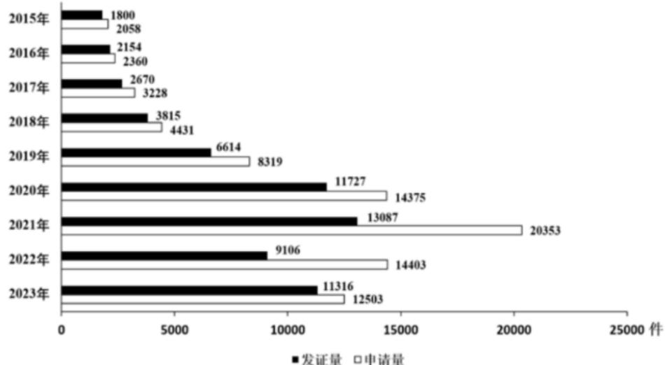
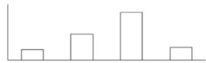
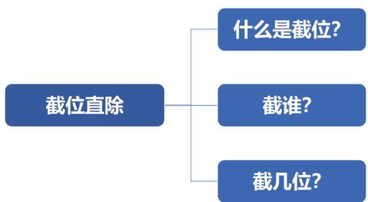
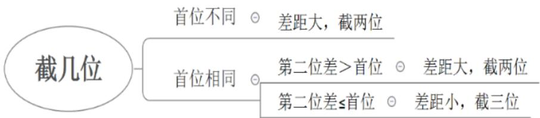
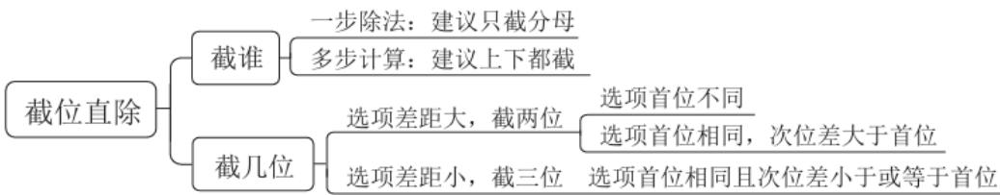
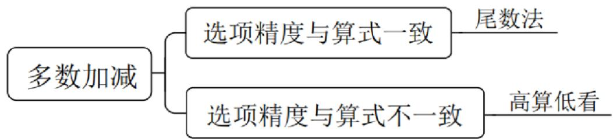
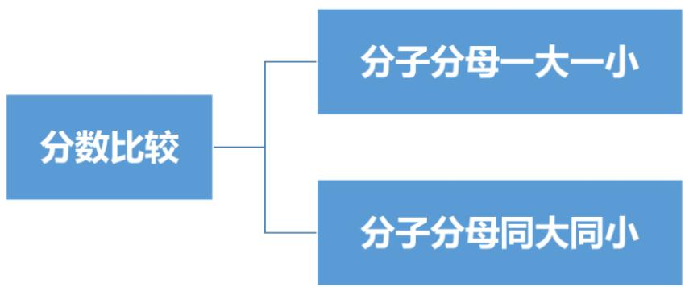

# 精讲精练-资料1（本节课笔记）

# 学习任务：

1. 课程内容：速算技巧  
2. 对应讲义：第  $310\sim 314$  页  
3. 重点内容：

（1）截位直除规则  
（2）多数加减规则  
（3）分数比较规则

# 课堂小贴士

本课程用书为蓝色《笔试系统讲义》（第310页开始）

若图书还未收到的同学可在课程列表处点击“下载讲义”即可获得电子版本讲义

(1) 尽量预习, 如果没有预习, 请课后务必重新做一遍讲义  
(2) 紧跟老师节奏, 疑问和重点内容课上都会讲到  
(3) 听懂打 1 , 不懂打 0 , 记住时间点无限次回放  
(4) 互相尊重, 和谐课堂, 一起上岸

上岸的同学都经历过现在的阶段，你需要做的，就是耐心+坚持！

# 【注意】

1. 本课程用书为蓝色的《笔试系统讲义》，资料分析从第310页开始。  
2. 任何科目的学习都是需要预习的，如果实在没有时间预习，请课后务必重新做一遍讲义。  
3. 紧跟老师节奏，疑问和重点内容课上都会讲到。课上不要着急记笔记，数学的笔记不是很多，上课的时候不要着急记笔记，重在理解，课后再整理笔记。  
4. 听懂打 1, 不懂打 0, 特别难的地方一定会反复重点强调, 如果有实在不理解的地方, 可以记住时间点无限次回放。  
5. 互相尊重，和谐课堂。  
6. 成功的同学都经历过现在的阶段, 早起的鸟儿有虫吃, 只要耐心坚持下去,

一定会成功的。

# 资料分析简介

考查形式：官方发布的统计材料，考查对统计术语的理解以及分析、处理数据的能力

截至2023年末，我国集成电路布图设计登记累计申请93147件，发证72378件，2024年1-4月，我国集成电路布图设计登记申请3503件，发证4189件。

  
2015-2023年我国集成电路布图设计登记申请和发证情况

111.截至2014年末，我国集成电路布图设计登记累计申请量在以下哪个范围内？

A.0.8万-1.5万件之间

B.不到0.8万件

C.1.5 万-2.2 万件之间

D.超过2.2万件

112.如2024年5-12月，我国集成电路布图设计登记月均发证量与1-4月水平相同，则2024年全年，我国集成电路布图设计登记发证量将比上年：

A.下降不到  $20\%$

B.下降20%以上

C.上升不到  $20\%$

D.上升20%以上

113.2019-2021年，我国集成电路布图设计登记申请量三年的同比增速：

A.先升后降

B.先降后升

C.逐年上升

D.逐年下降

114.2015-2023年，我国集成电路布图设计登记当年发证量与当年申请量比值大于0.9的年份有几个？

A. 2

B.3

C.4

D.5

115.以下柱状图反映了哪一时间段内，我国集成电路布图设计登记发证量同比增量的变化趋势（横轴位置表示增量为0）？

A.2017-2020年

B.2016-2019年

C.2019-2022年

D.2018-2021年

考试题量：4篇*5道=20道

考试目标：25分钟左右，正确率  $80\%$  以上

【注意】资料分析简介：

1. 考查形式：官方发布的统计材料，可能是国家统计局官网发布的，也可能是某个省、某个市统计局发布的，每篇材料配有5道题，考查对统计术语的理解，

不会考查死算，而是会考查分析、处理数据的能力。

2. 考试题量：每篇材料配有 5 道题，4 篇材料共有  $4 * 5 = 20$  道题。  
3. 考试目标：25分钟左右，正确率  $80\%$  以上，时间越短越好，正确率越高越好。资料分析一直被称为最有可能拿满分的模块。

资料分析课程安排  

<table><tr><td></td><td>内容</td><td>时长</td></tr><tr><td>资料1</td><td>速算技巧</td><td>2小时</td></tr><tr><td>资料2</td><td>基期量、现期量</td><td>2小时</td></tr><tr><td>资料3</td><td>一般增长率</td><td>2小时</td></tr><tr><td>资料4</td><td>增长量</td><td>2小时</td></tr><tr><td>资料5</td><td>比重</td><td>2.5小时</td></tr><tr><td>资料6</td><td>平均数、倍数</td><td>2.5小时</td></tr><tr><td>资料7</td><td>特殊增长率</td><td>2.5小时</td></tr><tr><td>资料8</td><td>综合训练</td><td>2.5小时</td></tr></table>

【注意】以前的资料分析只有 4 节课，现在的资料分析变成了 8 节课。原来的资料分析有 4 节课，每节课 3 小时，一共 12 小时，每节课内容很长，学得很辛苦。2026 年系统班进行了全新升级，前 7 节都是知识点，最后一节涉及实战，把课程拉长，尽量把每节课的时间变短，让大家既能学得全面，又能吃得透。前 4 节课，每节课都是 2 小时；后 4 节课，每节课都是 2.5 小时。本节课解决大家的核心痛点，即计算。

# 本节学习任务

最通用的三种速算技巧

1. 截位速算：解决最核心的除法运算  
2. 多数加减：解决多个大数字的加减运算  
3. 分数比较：解决多个分数比大小的问题

此外，还有很多补充技巧

例如：化除为乘、百亿分、等比例放缩（修正）等等都会在后续章节对应具

# 体题型时再讲解

# 【注意】本节学习任务：

1. 最通用的三种速算技巧：所有的题目多多少少都会用到这几个知识点。

(1) 截位速算: 解决最核心的除法运算。  
（2）多数加减：解决多个大数字的加减运算。  
(3) 分数比较: 解决多个分数、多个除法比大小的问题。

2. 此外，还有很多补充技巧，例如化除为乘、百亿分、等比例放缩（修正）等等都会在后续章节对应具体题型时再讲解，化除为乘就是在求基期量的过程中使用的，这些技巧不具有普适性。

# 第一节 速算技巧

# 一、截位直除

12345/34567

【注意】截位直除：解决除法运算，比如12345/34567，很难算，甚至想拿出计算器，但考试不能带计算器、手机和智能手表等工具，考试中没有辅助工具帮助计算，只能靠自己，大家肯定不愿意算，如果调整为12345/35，此时好像可以接受，这个操作就是截位直除，但可能会有很多疑问，认为误差很大，接下来老师会给出解释，包括什么是截位、截谁、截几位。

什么是“截位”？

答：就是从左到右保留几位有效数字，看下一位，进行四舍五入

注意有效数字从第一个非0数字开始

例：82325，截两位 结果为：82

练：65278，截两位  $\rightarrow$  截三位  $\rightarrow$

0.02827，截两位  $\rightarrow$  截三位  $\rightarrow$

【注意】什么是截位：

1. 截位：从左到右保留几位有效数字，看下一位，进行四舍五入，注意有效数字从左边第一个非0数字开始。  
2. 例：82325 截两位，从左边第一个有效数字 8 开始，四舍五入保留前两位有效数字，前两位是 82，第三位是  $3 \rightarrow$  比较小  $\rightarrow$  舍掉，截两位为 82。

3.练习：

(1) 65278, 截两位, 四舍五入保留前两位有效数字, 前两位是 65 , 第三位是  $2 \rightarrow$  比较小  $\rightarrow$  舍掉, 截两位为 65 ; 截三位, 前三位是 652 , 第四位数  $7 \rightarrow$  比较大  $\rightarrow$  进位, 截三位为 653。  
(2) 0.02827, 截两位, 前面两个 0 没有意义, 需要看左边第一个非 0 数字,四舍五入保留前两位有效数字, 前两位是 28 , 第三位是  $2 \rightarrow$  比较小  $\rightarrow$  舍掉, 截两位为 65 ; 截三位, 四舍五入保留前三位有效数字, 前三位是 282 , 第四位数  $7 \rightarrow$  进位, 截三位为 283。

截谁  $\rightarrow$  看算式形式（以截两位举例子，具体截几位后面会讲）

（1）一步除法：建议只截分母

34567/12345

(2) 多步除法: 建议分子、分母都截 (截完约分)

71674/47601*（12482/36283）

【注意】截谁：看算式形式，以截两位举例子，具体截几位后面会讲。分数 =分子/分母。

1. 一步除法：

(1) 一步除法，只除了一次，建议只截分母。  
(2) 例: 34567/12345, 一步除法, 只截分母, 以截两位举例子, 原式转化为 34567/12。

2. 多步除法：

(1) 多步乘除, 建议分子、分母都截, 截完之后约分化简。  
(2) 例: 71674/47601* (12482/36283), 多步乘除, 分子、分母都截, 以

截两位举例子，原式转化为  $72 / 48 * (12 / 36) = 2 / 4 = 1 / 2$ 。

3. 注意：截位直除不可能只截一位。  
4. 思考：对于一步除法，为什么建议只截分母，分子不用动？

答：比如 34567/12345，如果只截分母，原式转化为 34567/12，首位商 2，第二位商 8；如果分子、分母都截，原式转化为 35/12，首位商 2，第二位商 9，对比两个计算式子，计算量没有区别，计算量几乎可以说是一模一样的，计算结果有误差。在一步除法中，截不截分子并不影响计算量，反而有可能导致误差变大，不需要画蛇添足，没有必要。

截几位  $\rightarrow$  看选项差距

(一般来说，截两位计算快，截三位计算准)

例：6789/123.45≈54.99392467

1. 选项差距大（截两位）  
选项1.A.55、B.43  
2. 选项差距小（截三位）  
选项2.A.56、B.55

资料分析本质是选答案，不是计算答案

大家要改掉学生时代的计算习惯（刨根问底）

做题时都是根据选项差距估算出最接近的答案即可

【注意】截几位：看选项差距。

1. 数字越短越好算，截两位计算快；数字越长算得越慢，但算得越准，截三位计算准。  
2. 选项差距大，截两位。例：6789/123.45，选项分别为A.55、B.43，选项差距大，截两位，原式转化为6789/12，首位商5，最接近A项。  
3. 选项差距小，截两位不靠谱，必须截三位。例：6789/123.45，选项分别为A.56、B.55，如果还截两位，原式转化为6789/12，首位商5，第二位商6，会选A项，但实际上答案是B项。  
4. 6789/123.  $45 \approx 54.99392467$  ，资料分析的本质是从四个选项中选出答案，而不是计算答案，大家要改掉学生时代的计算习惯，现在不用刨根问底，做题时都是根据选项差距估算出最接近的答案即可。

截几位  $\rightarrow$  看选项差距

1. 选项差距大（截两位）

①首位均不同

选项1.A.11、B.22、C.33、D.44

②首位相同，第二位数字之差大于首位

选项2.A.11、B.22、C.33、D.39

2. 选项差距小（截三位）

首位相同，第二位数字之差小于等于首位

选项3.A.22、B.24、C.33、D.47

选项4.A.22、B.23、C.33、D.47

（看最接近的选项之间的差距）

【注意】截几位：看选项差距。

1. 选项差距大：截两位。

（1）首位均不同。选项 1: A. 11、B. 22、C. 33、D. 44，首位有效数字各不相同，依次为 1、2、3、4，选项差距大，放心大胆截两位。  
(2) 首位相同, 第二位差  $>$  首位。选项 2: A. 11、B. 22、C. 33、D. 39, C、D 项都是  $30^{+}$ , 比较接近, C、D 项首位相同, 第二位差  $9 - 3 = 6 >$  首位 3 , 选项差距大, 截两位。  
（3）注意：看最接近的两个选项之间的差距，不是随便挑两个判断差距，要做最坏的打算。

2. 选项差距小：截三位，首位相同，第二位差  $\leqslant$  首位。

（1）选项3：A.22、B.24、C.33、D.47，A、B项首位相同，第二位差  $4 - 2 = 2 =$  首位，选项差距小，截三位。  
（2）选项4：A.22、B.23、C.33、D.47，A、B项首位相同，第二位差  $3 - 2 = 1$  < 首位2，选项差距更小，截三位。

3. 注意：

（1）看的是最接近的两个选项之间的差距，如果有首位相同的，一定要先看首位相同的选项。  
(2) 不管是三位数、四位数, 还是五位数, 不管数字有多长, 都要先看首

位，再看第二位数字的差值。

(3) 如果是 0.5、0.7 这样的选项, 不管是截位, 还是看选项, 都要看有效数字, 从左往右看第一个非 0 数字, 分别是 5 和 7 , 首位不同, 差距大。  
(4) 不能全部截三位, 考场上绝大多数的题目都是选项差距大, 截两位就足够了, 截三位很难算, 不到万不得已没有必要截三位。只要稍微记一下区分,就能节省很多计算量。截位直除不可能截一位。

特殊情况①

万一选项是A.100、B.99、C.60、D.59

这怎么办？

判断差距的本质是看相对误差

相对误差  $>10\%$  ，差距大 相对误差  $\leqslant 10\%$  ，差距小

结论：

放心大胆使用我们总结的形式，简单便捷且实用

极端情况考场几乎不存在，真的出现了拿不准就按差距小截三位处理即可

# 【注意】

1. 万一选项分别是 A、B、C、D，对于这种特殊情况，A、B项的相对误差就是  $(100 - 99) / 99 = 1 / 99 \approx 1\% < 10\%$  ，这四个选项虽然看起来首位不同，但实际上非常接近，差距超级小。  
2. 判断资料分析选项差距的本质需要数学中相对误差的概念，两个数字之间的相对误差就是“（大数字-小数字）/小数字”，如果这个比例  $>10\%$  ，差距大；如果这个比例  $\leqslant 10\%$  ，属于差距小。  
3. 考场上没有这么多计算相对误差的时间，老师总结了前面简单好记的结论，既然简单好记，就要在一定程度上牺牲严谨性。不要担心，之所以敢于牺牲严谨性，是因为这是从考试实战出发的，真题中几乎没有这样的极端情况。即使真的出现了极端情况，也不用纠结，直接按照截三位处理即可。

特殊情况②

万一选项是A.25516、B.26576、C.27816、D.27986

这怎么办？

万一出现题目选项前两位数字甚至前三位数字都相同的

说明出题人就是存心刁难，我们要么算（精算）要么跑（去做别的题目）

【注意】万一选项是 A. 25516、B. 26576、C. 27816、D. 27986，选项数字很大，而且 C、D 项前两个数字一模一样，第三个数字只差了 1；甚至在真题中出现过 10684 和 10648 前三位数字都一模一样的选项。如果题目出现前两位数字甚至前三位数字都相同的选项，说明出题人存心刁难我们，性价比最高的方法就是“跑”，去做其他模块。这种情况在真题中极其罕见，考场上一道题特别难算，不如直接跳过性价比更高。

练一练

判断以下选项差距：

第一组：A.1479、B.2568、C.3159、D.4695

第二组：A.  $9\%$  、B.  $14\%$  、C.  $19\%$  、D.  $24\%$

第三组：A. 52973、B. 54921、C. 64938、D. 73942

看最接近的两个选项

【注意】判断以下选项差距：

1. 第一组：A. 1479、B. 2568、C. 3159、D. 4695。

答：选项首位各不相同，选项差距大，截两位。

2. 第二组：A.  $9\%$  、B.  $14\%$  、C.  $19\%$  、D.  $24\%$  。

答: 虽然有百分号, 不用管, 直接看有效数字, 首位依次为 9、1、1、2, B、C 项首位相同, 第二位差  $9 - 4 = 5 >$  首位 1 , 选项差距大, 放心大胆截两位。

3. 第三组：A. 52973、B. 54921、C. 64938、D. 73942。

答：数字很大，但也要看有效数字，A、B项首位相同，第二位差  $4 - 2 = 2 <$  首位5，选项差距小，截三位。

# 【截位直除运用】

看看看：

(1)看选项，差距大截两位、差距小截三位  
(2) 看式子, 一步除截分母、多步除都要截  
(3)看答案，能不算就不算

# 【注意】截位直除运用：

1. 看选项，选项差距大，截两位；选项差距小，截三位。  
2. 看式子，一步除法，只截分母；多步除法，分子、分母都要截。  
3. 看答案，不要算出答案，看选项，能少算就少算。

【例1】  $127.38 / 1.4508\approx ?$

A.61.3

B. 73.5

C. 87.8

D. 101.3

【解析】1. 选项首位依次为 6、7、8、1，首位各不相同，选项差距大，截两位；分子、分母只除了一次，一步除法，只截分母，分母截两位，四舍五入保留前两位有效数字，原式转化为  $127.38 / 15$  ，首位商 8，对应 C 项。【选 C】

【注意】可能纠结截位的时候小数点要不要考虑，如果计算 127.38/1.5，首位还是商 8，无论是 127.38/1.5，还是 127.38/15，都不影响答案的有效数字，我们做的是选择题，选项首位依次为 6、7、8、1，结果以 8 开头，一定选择 C项。

【例2】  $6470 / 42462\approx ?$

A.  $13\%$

B.  $15\%$

C.  $17\%$

D.  $19\%$

【解析】2. 选项首位都是 1，看第二位数字的差，随便挑两个相邻的选项，第二位差都是  $2>$  首位 1，选项差距大，截两位；一步除法，只除了一次，只截分母，分母截两位，原式转化为  $6470 / 42$ ，首位商 1，第二位商 5，结果的有效

数字无论是 153、154，还是 156，最接近 B 项。【选 B】

【例3】59260.61/（1+7.9%） $\approx$ ？

A. 52973.28

B. 54921.79

C. 56938.68

D. 63942.19

【解析】3.A、B、C项首位都是5，第二位差都是2<首位5，选项差距小，截三位；一步除法，只截分母，分母截三位，分母  $1 + 7.9\% \neq 1.79$  ，  $7.9\% = 0.079$  则  $1 + 7.9\% = 1.079$  ，四舍五入取前三位为108，小数点不用管，分子很长，没有必要全部都抄，分子后面的数字根本不重要，一般抄前面的  $3\sim 4$  位就足够了，“厂”除5926/108，首位商5，第二位商4，结果以54开头，对应B项。【选B】

【例4】  $384 / 43876\approx ?$

A.  $8.8\%$

B.  $3.9\%$

C.  $0.88\%$

D.  $0.40\%$

【解析】4. 先不管截几位，首位商 8，但不能锁定唯一答案，A、C 项的有效数字均以 8 开头，选项中出现相同的有效数字，此时考虑数量级，考虑答案的位数。A、C 项的有效数字都是 88，选项数字相同，需要考虑数量级。

选项的“分水岭”是  $1 \%$  ，A、B项超过了  $1 \%$  ，C、D项不到  $1 \%$  。500 的  $10 \%$  是50，  $10 \%$  就是  $1 / 10$  ，相当于除以10，小数点往左移动一位；500的  $1 \%$  就是5，相当于除以100，小数点往左移动两位。43876*  $10 \% = 4387.6$  ，43876*  $1 \% = 438.76$  如果是  $438.76 / 43876 = 1\%$  ，但  $384 <   438.76$  ，说明  $384 / 43876 <   1\%$  ，排除A、B项；剩下C、D项，看首位商几，首位不同，差距大，截两位，原式转化为384/44，首位商8，对应C项。【选C】

【例4改】  $384 / 43876 \approx$  （）。选项数不同  $\rightarrow$  直接截位

A.  $0.58\%$

B.  $0.69\%$

C.  $0.88\%$

D.  $0.40\%$

【例 4】384/43876 ≈ ( )。选项数相同  $\rightarrow$  需要考虑量级

A.  $8.8\%$

B.  $3.9\%$

C.  $0.88\%$

D.  $0.40\%$

# 【注意】

1. 例4改：  $384 / 43876 \approx$  （ ）。

A.  $0.58\%$

B.  $0.69\%$

C.  $0.88\%$

D.  $0.40\%$

答：首位商8，结果以8开头，直接选择C项。

2. 之所以例 4 改编之后可以放心大胆直接秒选 C 项, 归根结底, 核心点与例  $1 \sim$  例 3 是一样的, 首位各不相同, 一步除法, 分母截两位, 原式转化为  $384 / 44$ ,首位商 8 , 结果以 8 开头, 对应 C 项。只要选项的数字长得不一样, 做所有的乘除法都不用在意数量级、不用在意小数点、不用在意单位, 也不用在意有几个 0 ,直接截位, 看答案的有效数字。  
3. 回顾例 1～例 3：例 1 的选项数字都不一样，截位的时候不用管小数点，计算 127.38/15，首位商 8，直接选择 C 项；例 2 的选项数字都不一样，截位的时候不用管后面有几个 0，计算 6470/42，首位商 1，次位商 5，结果以 15 开头，选择 B 项；例 3 虽然选项数字很接近，选项差距小，但还是只算有效数字，不用管分母是 108，还是 1.08，结果以 54 开头，选择 B 项。

# 4.总结：

（1）选项数字不同，直接截位，不需要考虑量级，考场上  $99\%$  的题目都是这样。  
(2) 本题选项出现相同的有效数字 (A.  $8.8\%$  、C.  $0.88\%$  ), 计算之前需要先考虑数量级。  
（3）如何考虑：对比选项，A、B项  $>1\%$  ，C、D项  $< 1\%$  ，需要判断答案是否超过  $1\%$  。  
(4) 如何判断: 一个数的  $10\%$  就是小数点往左挪一位, 一个数的  $1\%$  就是小数点往左挪两位。  
(5) 43876 的  $1 \%$  就是 438.76, 分子  $384<438.76$ , 该分数不足  $1 \%$ , 排除 A、B 项; 剩余 C、D 项, 384/43876, 计算 384/44, 首位商 8, 选择 C 项。

【例5】  $4774 \div [2828 / (1 + 10.6\%)] \approx ?$

A. 1.3

B. 1.5

C. 1.7

D. 1.9

【解析】5. 选项首位都是 1，选项为等差排布，随便挑两个，第二位差都是  $2>$  首位 1，选项差距大，截两位；多步除法，分子、分母都要截位，原式  $= 4774 \div (2828 / 1.106)$ ，转化为  $48 \div (28 / 11) = 48 * (11 / 28) = 12 * 11 / 7$ ，除以一个数等于乘以它的倒数， $12 * 11 = 12 * (10 + 1) = 120 + 12 = 132$ ，计算  $132 / 7$ ，想到  $2 * 7 = 14$ ，首位差一点点商 2，结合选项，直接选择 D 项；如果不放心，“厂”除计算，首位商 1，第二位虽然商不到 9，但非常接近 9，最接近 D 项。【选 D】

【注意】在判断选项差距的时候，看的是有效数字，不要看小数点。

【例6】26352.1/32161.9÷（2254.7/6946.7）≈？

A. 2.5

B. 3.6

C. 5.3

D. 11.7

【解析】6. 选项首位依次为2、3、5、1，首位各不相同，选项差距大，截两位；明显是多步除法，上下都截，原式转化为  $26 / 32 \div (23 / 69) = 26 / 32 * (69 / 23)$ ，除以一个数等于乘以它的倒数，先约分化简， $26 / 32 * (69 / 23) = (13 / 16) * 3$ ，此时计算变得很简单。

方法一：直接算，（13/16）*3=39/16=2 $^+$ ，只有A项是2开头，A项当选。

方法二：结合选项分析答案范围，后续课程也会讲解， $(13 / 16)*3 = 1^{\prime \prime}3 < 3$ ，对应A项。【选A】

【练习】184.7/816÷（162.9/2438） $\approx$ ？

A. 1.8

B. 2.6

C. 3.4

D. 4.1

【解析】拓展. 选项首位各不相同，差距大，截两位；多步除法，上下都截，原式转化为  $18 / 82 \div (16 / 24) = 18 / 82 * (24 / 16)$ ，除以一个数等于乘以它的倒数，能约分就先约分， $18 / 82 * (24 / 16) = (9 / 82) * 3$ 。

方法一：直接算，（9/82）*3=27/82，首位商3，对应C项。

方法二：（9/82）*3 ≈ (9/81) *3 = (1/9) *3 = 3/9 = 1/3，结果以 33 开头，最接近 C 项。【选 C】

【注意】拓展：多步乘除，截位直除，选项差距大，截两位，可以在其中挑一个大于20的数+1、-1微调，方便约分。之所以要挑大于20的数， $10 \rightarrow 11$  的误差有点大， $30 \rightarrow 31$  的误差小，之所以分界线是20，是因为  $1/20 = 5\%$  ，相对误差  $>10\%$  ，选项差距大，控制  $5\%$  以内的误差就可以放心大胆使用。 $\pm 2$ 、 $\pm 3$  的误差很大， $\pm 1$  不会出问题，而且足够了。

特殊情况：若选项前两位/三位有效数字都相同时，精算

若选项数字相同，需要考虑数量级（位数）——例 4

多步乘除，选项差距大，可挑一个大于20的数字进行微调（±1）——拓展

【注意】截位直除：本节课最重要、最核心的内容，资料分析  $70\% \sim 80\%$  的题目都需要做除法，截位直除是最通用、最核心的技巧。

1. 截谁：一步除法，只截分母；多步乘除，分子、分母都截。  
2. 截几位：需要记忆。  
2. 特殊情况：

(1) 若选项前两位、前三位有效数字都相同, 比如 25678 和 25689, 必须精算。  
(2) 若选项数字相同, 需要考虑数量级、考虑位数, 参照例 4。  
（3）多步乘除，选项差距大，可以挑一个大于20的数字进行微调（±1），参照拓展题。

# 二、多数加减

考法一：精确计算（选项精度与算式一致）——尾数法（末位或者最后两位）

【引例】  $486 + 7726 =$  （

A. 8111

B. 8212

C. 8223

D. 8234

【引例】37792-28834=（）

A. 8958

B. 8968

C. 8948

D. 8938

# 【注意】

1. 精确计算（选项精度与算式一致）——尾数法（末位或者最后两位）  
2. 引例：  $486 + 7726 =$  （）

A. 8111

B. 8212

C. 8223

D. 8234

答：选项精确到个位、算式精确到个位，看尾数。看最后一位或者两位是多少。选项尾数各不相同，直接算尾数，尾  $6+$  尾  $6=$  尾 2，对应 B 项。

3. 引例：37792-28834=（）

A. 8958

B. 8968

C. 8948

D. 8938

答：尾2-尾4=尾8，选项都符合，尾一位不行算尾两位，尾92-尾34=尾58，对应A项。

【例1】  $23 + 25.1 + 29.3 + 28.5 + 31.8 = ?$

A. 77.5

B. 97.4

C. 117.2

D. 137.7

【解析】1. 选项、列式都精确到小数点后一位，计算尾数，尾  $1+$  尾  $3+$  尾  $5+$  尾  $8=$  尾7，选择D项。【选D】

【注意】选项与算式精度一致：尾数法。

【例2】  $10857 + 13035 + 32791 - 4054 - 4171 - 3758 = ?$

A. 42535

B. 44700

C. 43178

D. 45823

【解析】2. 多个加减，不要从头算到尾，特别是减法，需要借位，容易出错。

方法一：可以先把减法都加和， $10857 + 13035 + 32791 - 4054 - 4171 - 3758 = 10857 + 13035 + 32791 - (4054 + 4171 + 3758)$ ， $4054 + 4171 + 3758 =$  尾3， $10857 + 13035 + 32791 =$  尾3，尾3-尾3=尾0，对应B项。

方法二：两两抵消，尾1-尾1抵消；尾5-尾4=尾1，尾7-尾8=尾-1，所求=尾1+尾-1=尾0，对应B项。【选B】

# 【注意】

1. 如果问约为多少，选项改为 A. 4400、B. 4500，为选项精度和算式精度不一致。只要精度一致，就可以计算尾数，如果选项和最后一位都相同，则计算最后两位。  
2. 如果全部是减法，可能需要多次借位，这种情况，可以把后面全部加和，A-B-C-D-E-F=A-（B+C+D+E+F）。

# 多数加减

考法一：精确计算（选项精度与算式一致）——尾数法（末位或者最后两位）

考法二：估算（选项精度与算式不一致）——高算低看（高位精算低位看）

【注意】估算（选项精度与算式不一致）——高算低看（高位精算低位看）。比如一个月的工资是15578元，一定是前面的15000重要，后面的578不够重要。在一个大数字中，前面（位数高）的重要，后面的低位不是很重要，结合选项看一看即可。

考法二：估算（选项精度与算式不一致）——高算低看（高位精算低位看）

从前往后，高位（一般2位）精确算，低位（统一后几位）看进位或正负

(1) 两个数加减——高位数，一起算，低位只需看一看

38929-27871

78292-6795

8728+5395

# 【注意】

1. 从前往后，高位（一般前2位）精确算，低位（统一后几位）看进位或正负。  
2. 两个数加减——高位数，一起算，低位只需看一看。

# 3. 例:

(1) 38929-27871: 38000-27000=11000, 后面是否考虑看选项, 如果选项只有一个 11000 直接选, 后面 929-871=几十, 结合选项观察。  
(2) 78292-6795: 78000-6000=72000, 292-795 不够减, 则结果比 72000 少一点。如果选项为 A. 71500、B. 72500, 则选 A 项。  
(3)  $8728 + 5395: 8700 + 5300 = 14000; 28 + 95 = 100^{+}$ , 结果为  $14100^{+}$ 。

考法二：估算（选项精度与算式不一致）——高算低看（高位精算低位看）从前往后，高位（一般2位）精确算，低位（统一后几位）看进位或正负

(2) 多个数加减——高位数，逐位算，结合选项快速选

$$
8 7 2 3 + 2 3 1 0 + 3 8 2 9 + 3 2 0 7 + 6 2 2 1 + 5 2 1 8 \approx (\quad)
$$

A. 26500

B. 27500

C. 28500

D. 29500

# 【注意】

1. 多个数加减——高位数，逐位算，结合选项快速选  
2. 例：  $8723 + 2310 + 3829 + 3207 + 6221 + 5218 \approx$  （）

A. 26500

B. 27500

C. 28500

D. 29500

答：很多个数加减，高位逐位计算。千位：  $8 + 2 + 3 + 3 + 6 + 5 = 2$  （万位）7（千位），排除A项。百位：  $7 + 3 + 8 + 2 + 2 + 2 = 24$  ，则结果为  $270 + 24 = 294$  开头，选择D项。

【例3】  $27621 + 22703 + 23219 \approx ?$

A. 61300

B. 73500

C.83700

D. 85400

【解析】3. 多个数加减, 高算低看, 万位:  $2 + 2 + 2 = 6$ ; 千位:  $7 + 2 + 3 = 12$ ,  $60 + 12 = 72$ ,

此时为 72000, 答案比 72000 大, 后面为几百, 最多进位 1、2 千, 选择 B 项。【选 B】

【注意】只有三个数，数字敏感度高，可以随便看。如  $27621 + 23219 \approx 50000$ ，再加上22703，为70000多一些，选择B项。

【例4】  $9291 + 5597 + 5728 + 4927$  在以下哪个范围内？

A. 2.5万以下

B.2.5万～2.7万之间

C.2.7万～3万之间

D. 3 万以上

【解析】4. 四个数相加，高算低看（最准、最快），千位： $9 + 5 + 5 + 4 = 2$ （万位）3（千位）；百位： $2 + 5 + 7 + 9 = 23$ ， $230 + 23 = 253$ ，此时为2.53万，后面是几十的加和，最多加和为几百，不会到2.7万，选择B项。【选B】

【注意】选项精度：如果每一位数字都有，选项都精确到个位，是精度一致。例  $3 \sim$  例5是计算范围，是估算，为精度不一致。

【例5】  $204 + 58 + 254 + 2598 + 641 + 3230$  在以下哪个范围内？

A. 不到 5000

B.  $5000\sim 6000$

C.  $6000 \sim 7000$

D.  $7000 \sim 8000$

【解析】5. 千位：  $2 + 3 = 5$  ；百位：  $2 + 2 + 5 + 6 + 2 = 17$  ，  $50 + 17 = 67$  ，此时为6700，后面还有六个数的几十，有可能到300，因此要考虑十位。十位：  $0 + 5 + 5 + 9 + 4 + 3 = 26$ $6700 + 260 = 6960$  ，还是不能确定是C项还是D项，还要考虑个位。个位： $4 + 8 + 4 + 8 + 1 + 0 = 25$  。  $6960 + 25 = 6985$  ，选择C项。【选C】

2019-2023年我国厨房小家电全品类零售量及零售额  

<table><tr><td>年份</td><td>零售量
(万台)</td><td>零售额
(亿元)</td><td>线上零售额（亿元）</td></tr><tr><td>2019</td><td>26748</td><td>672.8</td><td>378</td></tr><tr><td>2020</td><td>27444</td><td>631.9</td><td>443</td></tr><tr><td>2021</td><td>23744</td><td>557.5</td><td>435</td></tr><tr><td>2022</td><td>22049</td><td>520.3</td><td>473</td></tr><tr><td>2023</td><td>26543</td><td>549.3</td><td>422</td></tr></table>

【练习】（2025国考）2019-2023年我国厨房小家电全品类零售总量在以下哪个范围？

A. 12 亿台-13 亿台之间

B. 13亿台-14亿台之间

C. 不到 12 亿台

D. 超过 14 亿台

【解析】练习. 问的是第一列数字加和, 先计算万万位: 有 5 个 2 , 加和为 10 万万  $= 10$  亿; 千万位:  $6 + 7 + 3 + 2 + 6 = 24$ ,  $100 + 24 = 124000$  万  $= 12.4$  亿。选项差距是 1 亿, 12.4 亿要到 13 亿还差 6000 万, 后面忽略的是几百的数, 不会加到 6000 万, 直接选择 A 项。【选 A】

核心：看选项

只有两个数的加减：口算

多个数的加减：逐位计算，结合选项及时止损

# 【注意】多数加减：

1. 选项精度与算式一致，即选项有效数字和算式有效数字精度相同，用尾数法。  
2. 选项精度与算式不一致（大多数情况），问答案约为多少，高算低加。核

# 心看选项:

（1）只有两个数的加减：口算。  
（2）多个数的加减：逐位计算，结合选项及时止损，能选出来答案就不要往后计算。

# 三、分数比较

【注意】分数比较：如 A/B、C/D、E/F 比较大小，每个都计算太麻烦，先观察分子和分母。分为分子分母一大一小、分子分母同大同小两种情况。

一大一小：分子比别人大，分母比别人小

送分, 直接看: 分子大的分数大 (钱多人少, 平均每人分的钱多)

# 【注意】

1.6/7与5/9：  $6 > 5$  、  $7 < 9$  ，属于一大一小。假设是分钱，6个亿分给7个人；5个亿分给9个人，要选择6个亿分给7个人的公司（钱多人少）。即一大一小就是分子大、分母小，钱多人少，平均每人分得钱多。  
2. 253/31与215/42：253分子更大、31分母更小，253/31属于钱多人少， $253 / 31 > 215 / 42$ 。

【例1】比较分数：（1）77.2/393.6和66.1/458.8；（2）303/41、377/31和315/45。

【解析】1.（1）77.2/393.6 的分子更大、分母更小，属于一大一小， $77.2 / 393.6 > 66.1 / 458.8$ 。【>】

(2)  $303 / 41$  、  $377 / 31$  和  $315 / 45$ , 其中  $377 / 31$  的分子大、分母小, 分数值更大, 则  $377 / 31$  最大。【377/31 最大】

同大同小: 分子分母都比别人大

竖着直接除：一般分母截两位计算即可

横着看倍数: 分子间倍数大, 看分子, 分子大的分数大

分母间倍数大，看分母，分母大的分数小

# 【注意】

1.6/7与49/56：6/7的分子、分母都更小，49/56的分子、分母都更大，横着看倍数，分子  $49 / 6 = 8^{+}$  倍；分母  $56 / 7 = 8$  ，分子倍数大，看分子，分子越大，分数越大， $6 / 7 < 49 / 56$ 。  
2. 224/23 与 440/47: 224/23 分子、分母都更小, 横着看倍数,  $440 / 224 = 2^{-}$  倍,  $47 / 23 = 2^{+}$  倍, 分母倍数大, 分母大的分数小 (一个公司人越多, 分到的钱越少), 则  $224 / 23 > 440 / 47$  。

【例2】比较分数：2580/3787和5770/7557。

【解析】2. 横着看倍数， $5770 / 2580 = 2^{+}$  倍， $7557 / 3787 = 2^{-}$  倍，分子倍数大，看分子，分子大的分数大， $2580 / 3787 < 5770 / 7557$ 。【<】

【例3】比较分数：3726/11178和1024/2755。

【解析】3. 分子、分母同大同小，横着看倍数，分子（ $1024 \rightarrow 3726$ ）为  $3^{+}$ 倍，分母（ $2755 \rightarrow 11178$ ）为  $4^{+}$ 倍，分母倍数大，看分母，分母大的分数小，则  $3726 / 11178 < 1024 / 2755$ 。【<】

【例 4】1442/7017、1240/5575、1289/4335、1386/3046 这四个分数中哪个最大？

A. 1442/7017

B. 1240/5575

C. 1289/4335

D. 1386/3046

【解析】4. 四个分数比大小，先找分子大、分母小的，其中  $1442 / 7017$  的分

子、分母都最大, 为同大同小, 先搁置。1240/5575、1289/4335、1386/3046 三个数中, 1386/3046 的分子最大、分母最小, 分数值最大, 排除 B、C 项。1442/7017、1386/3046 比较, 横着看倍数, 分子为  $1^{+}$  倍关系, 分母为  $2^{+}$  倍关系, 分母倍数大, 看分母, 分母大的分数小, A 项  $< D$  项, D 项最大。【选 D】

【例5】896/11823、925/12519、245/14347、120/13763这四个分数中哪个最小？

A. 896/11823

B. 925/12519

C. 245/14347

D. 120/13763

【解析】5. 问最小的，找分子小、分母大的。C、D项两个分子都很小，和A、B项比，A、B项的分子大、分母小，分数值更大，排除A、B项。C、D项比较，分子为  $2^{+}$  倍关系，分母为  $1^{+}$  倍关系，分子倍数大，分子大的分数大，C项  ${>}D$  项，D项最小。【选D】

【例6】9245/13.82、31379/74.06、441/2.36、3105/39.08这四个分数中哪个最大？

A. 9245/13.82

B. 31379/74.06

C.  ${441}/{2.36}$

D. 3105/39.08

【解析】6.C项的分子、分母量级（位数）都和其他数不一样，比较大小比较困难，先调整为一致的情况。对C项分子、分母都乘以10，转化为441/2.36=4410/23.6。问最大，先找分子大、分母小的，B项分子最大、分母也最大，先保留。A、C、D项比较，A项分子（9245）最大、分母（13.82）最小，分数值最大，排除C、D项。A、B项比较，分子为  $3^{+}$ 倍关系，分母为  $5^{+}$ 倍关系，分母倍数大，看分母，分母大的分数小，B项  $< A$  项，最大的为A项。【选A】

# 【注意】

1. 若分子和分母的位数均不一致，可先统一成相同的位数再比较。  
2. 如果基础够好，最快的方法是直除，A项  $\approx 700$  、B项  $< 500$  、C项  $\approx 200$  、D项  $< 100$  ，A项最大。如果数字敏感度高，数学基础好，许多题目不需要方法就

可以估算出来，但是大多数同学能力不足，先学习系统性方法，通过方法先解决问题，通过方法的运用、题目的练习，慢慢培养能力。

【练习】这四个分数中最大的是：

A. 16.06/42.70

B. 8. 46/49. 74

C. 8.22/39.54

D. 9.65/43.23

【解析】拓展1. 问最大的，找分子大、分母小的，A项分子最大，分母比B、D项小，则A项比B、D项更大，排除B、D项。A、C项比较，分母接近，A项分子明显很大，可以看出来是A项最大。如果看不出来，横着比，分子约为2倍，分母为  $1^{+}$  倍，分子倍数大，分子大的分数大，A项最大。【选A】

【再拓展】这四个分数中最小的是：

A. 16.06/42.70

B. 8. 46/49. 74

C. 8.22/39.54

D. 9.65/43.23

【解析】拓展2.问最小，找分子小且分母大的，分子最小的是C项，分母也最小，则要保留。A、B、D项比较，B项分子最小、分母最大，分数值最小，排除A、D项。B、C项比较，分子、分母都是  $1^{+}$ 倍，如果硬要看，一个是1.05倍、一个是1.2倍，也可以看，但对同学要求太高。横着不好看，还可以竖着除。 $8.46 / 49.74 \approx 8.46 / 50$  ，首位商1；  $8.22 / 39.54 \approx 8.22 / 40$  ，首位商2，则B项  $< C$  项，B项最小。【选B】

# 【比较分数大小总结】

一大一小，直接看：分子大的分数大（钱多人少）

同大同小：竖着直接除：（一般分母截2位即可）

横着看倍数：分子倍数大，分子大的分数大

分母倍数大，分母大的分数小

横还是竖？

根据个人习惯，哪个好看就看哪个，灵活运用

建议优先练习横着看

# 【注意】

1.2 个、3 个、4 个分数比较，先找一大一小，不需要动笔，直接排除。之后同大同小，横着看倍数，分子倍数大，分子大的分数大；分母倍数大，分母大的分数小，横着不好看，竖着直接除。  
2. 横还是竖？根据个人习惯，哪个好看就看哪个，灵活运用，根据个人能力，哪个好看用哪个，建议优先练习横着看，如果横着看倍数看不出来，可以灵活一些，竖着直接除。

# 课后两件事

(1)复习: 整理课堂笔记, 把讲义题目独立再过一遍  
(2)预习：315页-324页（基期与现期）

把题做一遍，不求快，重要的是过程

# 【答案汇总】

截位直除 1-5: CBBCD; 6: A

多数加减1-5：DBBBC

分数比较 1: >、377/31 最大; 2-6: <<DDAA

遇见不一样的自己

Be your better self