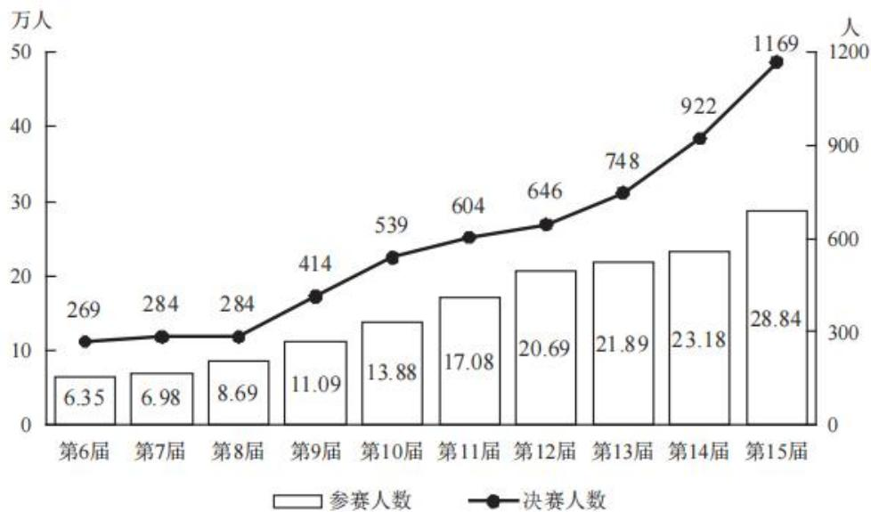
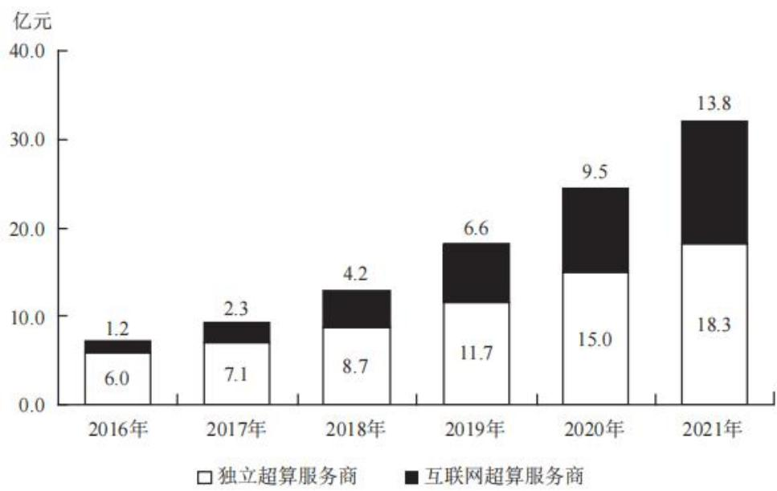
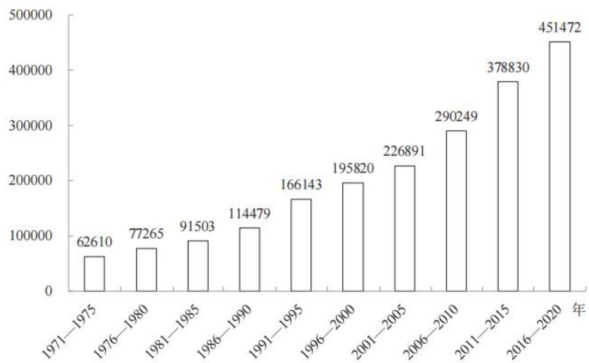
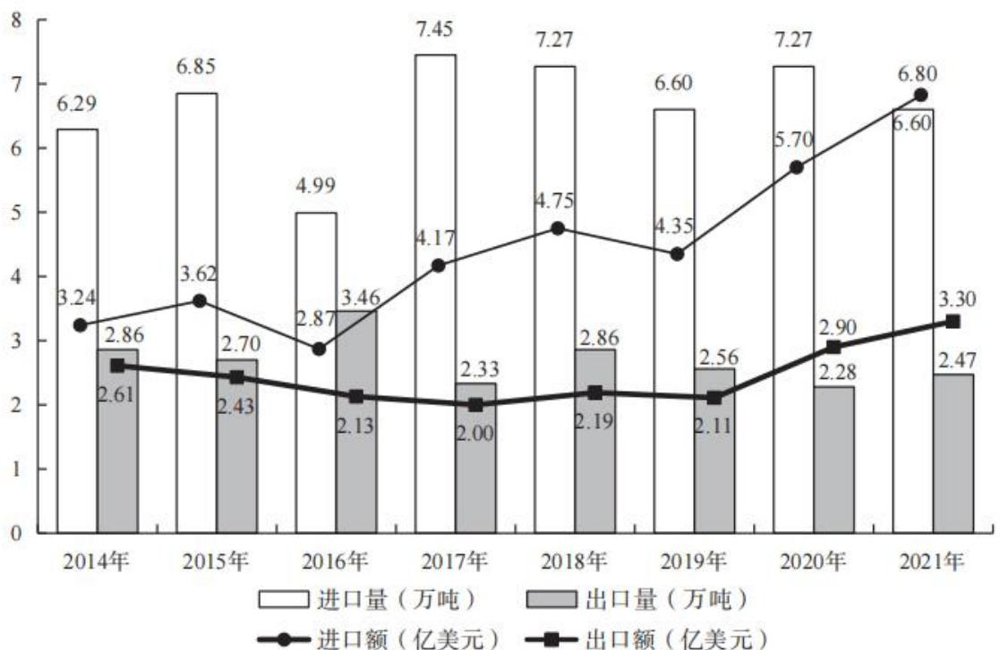
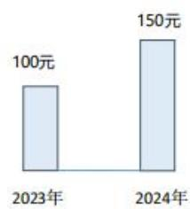
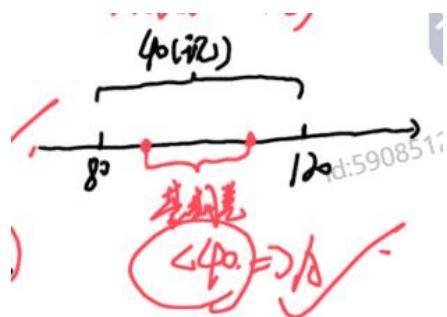
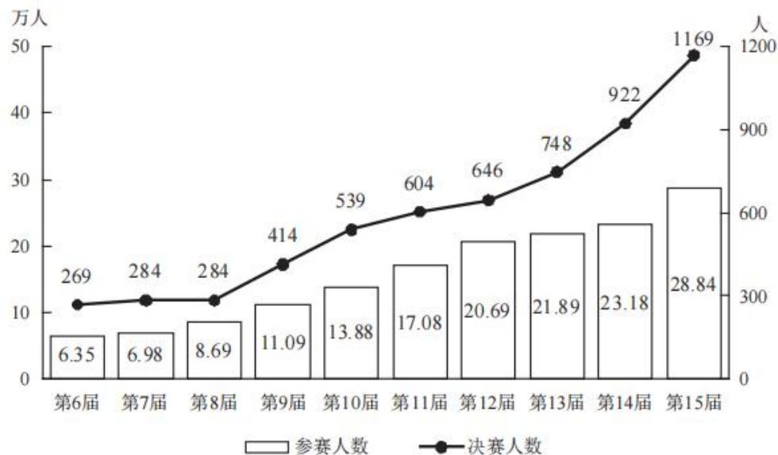
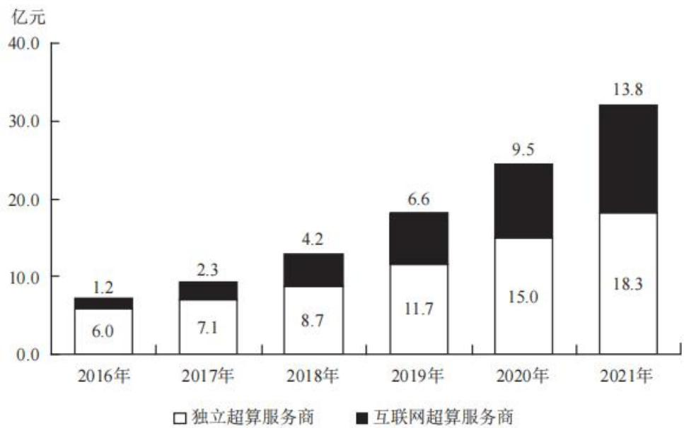
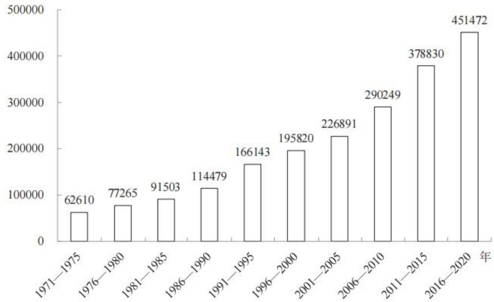
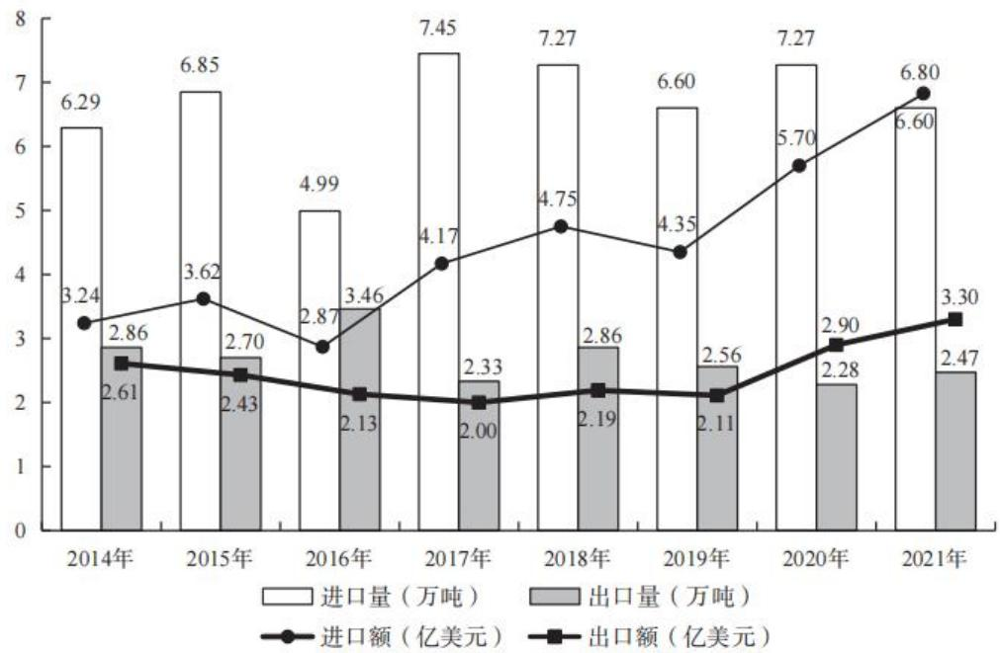

# 精讲精练一资料 2

(讲义+笔记)

主讲教师：邓健

授课时间：2025.03.03

# 精讲精练一资料2（讲义）

# 资料分析 精讲精练2

# 学习任务：

1. 课程内容：基期与现期  
2. 对应讲义：第  $315\sim 324$  页  
3. 重点内容：

(1) 基期的识别与公式  
(2) 现期的识别与公式

# 第二节 基期与现期

# 基本术语：

基期量与现期量

资料分析中常涉及两个量的比较，作为对比参照的时期称为基期，对应的量称为基期量；而相对于基期的时期称为现期，所对应的量称为现期量。

增长量与增长率

增长量：用来表述基期量与现期量变化的绝对量。

增长率：用来表述基期量与现期量变化的相对量。

同比与环比

同比：一般与上年同期相比较。

环比：与相邻的上一个时期相比较。

# 一、基期量

2019年，全国棉花产量588.9万吨，比上年减少21.3万吨。其中，新疆棉花产量500.2万吨，比上年减少10.8万吨。全国棉花种植面积为3339.2千公顷，比上年减少15.2千公顷。新疆的棉花种植面积比上年增加49.2千公顷。长江流域棉花种植面积比上年减少32.4千公顷，同比下降  $8.7\%$  。黄河流域棉花种植面

积比上年减少28.1千公顷，同比下降  $6.2\%$

2019年棉花种植面积排名前7省区棉花种植情况  

<table><tr><td>地区</td><td>种植面积(千公顷)</td><td>总产量(万吨)</td></tr><tr><td>河北</td><td>203.9</td><td>22.7</td></tr><tr><td>安徽</td><td>60.3</td><td>5.6</td></tr><tr><td>江西</td><td>42.6</td><td>6.6</td></tr><tr><td>山东</td><td>169.3</td><td>19.6</td></tr><tr><td>湖北</td><td>162.8</td><td>14.4</td></tr><tr><td>湖南</td><td>63.0</td><td>8.2</td></tr><tr><td>新疆</td><td>2540.5</td><td>500.2</td></tr></table>

【例1】（2021山东）2018年除新疆外，全国其他地区棉花种植总面积在以下哪个范围内？

A. 不到 700 千公顷

B.  $700 \sim 800$  千公顷之间

C.  $800 \sim 900$  千公顷之间

D. 900 千公顷以上

2018年，M省煤、锯材、铜矿砂为进口值前三的商品，三者合计占同期进口总值的  $55.8\%$  ；钢材、机电产品、农产品为出口值前三的商品，三者合计占同期出口总值的  $53.9\%$  。2018年M省对“一带一路”沿线国家外贸进出口699.3亿元，增长  $14.6\%$  ，占同期外贸进出口总值的  $67.6\%$  。其中对蒙古国外贸进出口327.7亿元，增长  $24.1\%$  。

【例2】（2020联考）2017年M省对“一带一路”沿线国家外贸进出口总值为多少亿元？

A. 509.2

B.610.2

C. 699.3

D. 819.3

2021年，全国城市供水总量673.34亿立方米，同比增长  $6.96\%$  ；城市供水管道长度105.99万公里，同比增长  $5.26\%$  ；人均日生活用水量185.03升；供水普及率  $99.38\%$  ，比上年增加0.39个百分点。天津、河北、上海、江苏、浙江和广东6个省（市）城市供水普及率达到  $100\%$  ；福建、山东、湖北、广西、安徽、辽宁、宁夏、新疆、内蒙古、山西、甘肃、河南、黑龙江、江西、云南和湖南16个省（区）超过  $99\%$  （含)；西藏、青海、北京、四川、贵州和陕西6个省（区、

市）超过  $98\%$  ；重庆、吉林、海南3个省（市）和新疆建设兵团超过  $95\%$  。

【例3】（2023联考）2020年，全国城市供水总量约为：

A. 600亿立方米

B.620亿立方米

C. 630 亿立方米

D. 724 亿立方米

截至2019年3月31日，证券业协会对证券公司2019年第一季度经营数据进行了统计，131家证券公司当期实现营业收入1018.94亿元，同比增长  $54.47\%$

其中，各主营业务收入分别为代理买卖证券业务净收入（含席位租赁）221.49亿元，同比增长  $13.77\%$  ；证券承销与保荐业务净收入66.73亿元，同比增长  $19.5\%$  ；财务顾问业务净收入20.95亿元，同比增长  $15.17\%$  ；投资咨询业务净收入7.15亿元，同比增长  $5.15\%$  ；资产管理业务净收入57.33亿元，同比下降  $15.43\%$  ；证券投资收益（含公允价值变动）514.05亿元，同比增长  $215.17\%$  ；利息净收入69.04亿元，同比增长  $4.94\%$  ；当期实现净利润440.16亿元，同比增长  $86.83\%$  ；119家公司实现盈利，同比增长  $10.19\%$  。

【例4】（2021联考）2018年第一季度，131家证券公司资产管理业务净收入约为多少亿元？

A. 49.7

B. 58.6

C. 67.8

D. 75.6

2020年H省秋粮平均生产成本及同比增速  
单位：元/亩（成本），%（增速）  

<table><tr><td rowspan="2"></td><td colspan="2">秋粮</td><td colspan="2">玉米</td><td colspan="2">稻谷</td></tr><tr><td>成本</td><td>增速</td><td>成本</td><td>增速</td><td>成本</td><td>增速</td></tr><tr><td>生产成本</td><td>440.6</td><td>-2.1</td><td>430.5</td><td>-1.9</td><td>525.7</td><td>-4.0</td></tr><tr><td>其中:物质费用</td><td>203.9</td><td>-0.3</td><td>205.4</td><td>-0.3</td><td>210.6</td><td>0.4</td></tr><tr><td>其中:种子</td><td>51.3</td><td>0.4</td><td>48.5</td><td>-0.1</td><td>68.4</td><td>1.8</td></tr><tr><td>化肥</td><td>125.3</td><td>-2.2</td><td>131.0</td><td>-2.6</td><td>107.7</td><td>-0.3</td></tr><tr><td>农药</td><td>26.9</td><td>8.6</td><td>25.6</td><td>14.0</td><td>34.3</td><td>-1.2</td></tr><tr><td>生产服务支出</td><td>130.3</td><td>-3.5</td><td>120.7</td><td>-5.8</td><td>194.4</td><td>4.3</td></tr><tr><td>其中:机耕</td><td>22.1</td><td>0.3</td><td>15.4</td><td>-3.1</td><td>61.8</td><td>3.0</td></tr><tr><td>机播</td><td>21.7</td><td>-1.1</td><td>21.2</td><td>-6.4</td><td>24.0</td><td>37.4</td></tr><tr><td>机收</td><td>62.3</td><td>-2.0</td><td>61.0</td><td>-1.2</td><td>78.4</td><td>-0.7</td></tr><tr><td>排灌</td><td>24.3</td><td>-12.0</td><td>23.1</td><td>-17.2</td><td>30.2</td><td>0.7</td></tr><tr><td>人工成本</td><td>106.5</td><td>-3.5</td><td>104.4</td><td>-0.4</td><td>120.7</td><td>-20.3</td></tr></table>

注：部分数据因四舍五入，存在总计与分项合计不等的情况。

【例 5】(2022 国考) 2019 年, H 省秋粮稻谷的平均生产成本约为多少元/亩?

A. 439

B. 450

C. 533

D. 548

（2024黑龙江公安）2022年全年全国批发和零售业增加值114518亿元，同比增长  $0.9\%$  ；交通运输、仓储和邮政业增加值49674亿元，同比下降  $0.8\%$  ；住宿和餐饮业增加值17855亿元，同比下降  $2.3\%$  ；金融业增加值96811亿元，同比增长  $5.6\%$  ；房地产业增加值73821亿元，同比下降  $5.1\%$  ；信息传输、软件和信息技术服务业增加值47934亿元，同比增长  $9.1\%$  ；租赁和商务服务业增加值39153亿元，同比增长  $3.4\%$  。

【例6】2021年全国住宿和餐饮业增加值约为：

A. 17454 亿元

B. 18275 亿元

C. 18775 亿元

D. 19264 亿元

2021年1—5月，全国共破获电信网络诈骗案件11.4万起，打掉犯罪团伙1.4万个，抓获犯罪嫌疑人15.4万名，同比分别上升  $60.4\%$  、  $80.6\%$  和  $146.5\%$  。2021年5月，全国共立电信网络诈骗案件8.46万起，与4月相比下降  $14.3\%$  。

【例7】（2022国考）2021年  $4\sim 5$  月，全国共立电信网络诈骗案件约多少万起？

A. 12

B. 14

C. 16

D. 18

2021年第2季度百城通勤高峰交通拥堵榜TOP10  

<table><tr><td rowspan="2">排序</td><td rowspan="2">城市</td><td colspan="3">2021Q2通勤高峰拥堵指数</td><td rowspan="2">2021Q2通勤高峰实际速度(km/h)</td><td colspan="2">2021Q2平均通勤时耗</td></tr><tr><td>拥堵指数</td><td>同比增速(%)</td><td>环比增速(%)</td><td>时耗(min)</td><td>环比增速(%)</td></tr><tr><td>1</td><td>北京</td><td>2.147</td><td>-3.13</td><td>15.01</td><td>24.36</td><td>46.99</td><td>-2.20</td></tr><tr><td>2</td><td>贵阳</td><td>2.059</td><td>-9.23</td><td>10.53</td><td>24.80</td><td>34.33</td><td>-1.21</td></tr><tr><td>3</td><td>重庆</td><td>2.057</td><td>-21.39</td><td>10.22</td><td>24.28</td><td>40.93</td><td>-4.62</td></tr><tr><td>4</td><td>长春</td><td>2.046</td><td>11.90</td><td>21.34</td><td>24.20</td><td>37.04</td><td>2.75</td></tr><tr><td>5</td><td>哈尔滨</td><td>1.928</td><td>32.85</td><td>23.68</td><td>23.64</td><td>36.66</td><td>5.58</td></tr><tr><td>6</td><td>上海</td><td>1.904</td><td>-9.79</td><td>6.32</td><td>24.87</td><td>42.97</td><td>-2.63</td></tr><tr><td>7</td><td>西安</td><td>1.872</td><td>-20.28</td><td>10.96</td><td>26.69</td><td>33.89</td><td>-5.00</td></tr><tr><td>8</td><td>武汉</td><td>1.843</td><td>4.96</td><td>8.81</td><td>26.24</td><td>38.49</td><td>-4.67</td></tr><tr><td>9</td><td>青岛</td><td>1.838</td><td>-3.18</td><td>11.53</td><td>26.64</td><td>35.95</td><td>3.54</td></tr><tr><td>10</td><td>大连</td><td>1.833</td><td>-3.69</td><td>14.69</td><td>24.19</td><td>39.13</td><td>4.49</td></tr></table>

注：表中 Q2 表示第二季度。

【例8】（2022上海）按照2021年第一季度通勤高峰拥堵指数从大到小排序，下列城市的排序依次为：

A. 重庆、长春、哈尔滨

B. 重庆、哈尔滨、长春

C. 长春、哈尔滨、重庆

D.哈尔滨、长春、重庆

2021年，中国向“一带一路”沿线国家出口纺织品服装1137.9亿美元，同比增长  $24.5\%$  ，较2019年增长  $17.3\%$  ；同时，中国自“一带一路”沿线国家进口纺织品服装131.6亿美元，同比增长  $24.5\%$  。

【例9】（2023国考）2020年，中国对“一带一路”沿线国家纺织品服装贸易顺差额约为多少亿美元？

A. 1129

B. 1253

C. 808

D. 1006

2022年交通固定资产投资额及同比增长率  

<table><tr><td></td><td>交通固定资产投资额(亿元)</td><td>同比增长率 (%)</td></tr><tr><td>铁路</td><td>7109</td><td>-5.1</td></tr><tr><td>公路</td><td>28527</td><td>9.7</td></tr><tr><td>其中:高速公路</td><td>16262</td><td>7.3</td></tr></table>

<table><tr><td></td><td>交通固定资产投资额(亿元)</td><td>同比增长率 (%)</td></tr><tr><td>普通国省道</td><td>5973</td><td>6.5</td></tr><tr><td>农村公路</td><td>4733</td><td>15.6</td></tr><tr><td>水路</td><td>1679</td><td>10.9</td></tr><tr><td>其中:内河建设</td><td>867</td><td>16.7</td></tr><tr><td>沿海建设</td><td>794</td><td>9.9</td></tr><tr><td>民航</td><td>1231</td><td>0.7</td></tr></table>

【例10】（2024黑龙江）2021年公路交通固定资产投资额与水路交通固定资产投资额共：

A. 不到 2 万亿元

B.  $2 \sim 3$  万亿元

C.  $3 \sim 4$  万亿元

D. 超过 4 万亿元

2017年A市现代农业生态服务价值及增速表  

<table><tr><td rowspan="2">指标名称</td><td colspan="2">年值</td><td colspan="2">贴现值</td></tr><tr><td>2017年(亿元)</td><td>比上年增长(%)</td><td>2017年(亿元)</td><td>比上年增长(%)</td></tr><tr><td>现代农业生态服务价值</td><td>3635.46</td><td>3.0</td><td>10769.36</td><td>1.9</td></tr><tr><td>一、直接经济价值</td><td>372.60</td><td>-6.0</td><td>372.60</td><td>-6.0</td></tr><tr><td>1.农林牧渔业总产值</td><td>308.32</td><td>-8.8</td><td>308.32</td><td>-8.8</td></tr><tr><td>2.供水价值</td><td>64.28</td><td>10.2</td><td>64.28</td><td>10.2</td></tr><tr><td>二、间接经济价值</td><td>1214.15</td><td>5.6</td><td>1214.15</td><td>5.6</td></tr><tr><td>1.旅游服务价值</td><td>804.78</td><td>8.4</td><td>804.78</td><td>8.4</td></tr><tr><td>2.水力发电价值</td><td>8.68</td><td>-10.1</td><td>8.68</td><td>-10.1</td></tr><tr><td>3.景观增值价值</td><td>400.70</td><td>0.8</td><td>400.70</td><td>0.8</td></tr><tr><td>三、生态与环境价值</td><td>2048.71</td><td>3.2</td><td>9182.61</td><td>1.8</td></tr><tr><td>其中:气候调节价值</td><td>732.34</td><td>5.6</td><td>2328.74</td><td>2.7</td></tr><tr><td>水源涵养价值</td><td>287.78</td><td>10.2</td><td>402.98</td><td>7.5</td></tr><tr><td>环境净化价值</td><td>118.83</td><td>-3.3</td><td>984.83</td><td>0.9</td></tr><tr><td>生物多样性价值</td><td>670.07</td><td>0.3</td><td>2898.67</td><td>1.2</td></tr><tr><td>防护与减灾价值</td><td>222.58</td><td>0.3</td><td>1540.38</td><td>1.2</td></tr><tr><td>土壤保持价值</td><td>3.37</td><td>-12.6</td><td>9.77</td><td>-4.7</td></tr><tr><td>土壤形成价值</td><td>13.74</td><td>1.6</td><td>288.54</td><td>1.6</td></tr></table>

注：部分数据因四舍五入，存在总计与分项合计不等的情况。

【例11】（2020联考）2016年，A市旅游服务价值年值比农林牧渔业总产值年值多：

A. 494.46 亿元

B. 462.79 亿元

C. 441.85 亿元

D. 404.35 亿元

# 二、现期量

  
第6—15届CMC（全国大学生数学竞赛）参赛情况

【例1】（2025国考）若保持第15届CMC参赛人数环比增量不变，问哪一届CMC参赛人数将第一次超过50万人？

A. 第19届

B. 第20届

C. 第21届

D. 第22届

  
2016—2021年中国第三方超算服务市场规模

【例2】（2023国考）如保持2021年同比增量不变，则到哪一年第三方互联网超算服务商提供的服务市场规模将第一次超过第三方独立超算服务商？

A.2025年

B.2026年

C. 2027年

D.2028年

近年来，随着互联网、云计算、大数据以及社交媒体应用的快速发展，我国电子政务也发展迅速。2018年我国电子政务市场规模3106.9亿元，同比2017年的2861.8亿元增长了  $8.6\%$

【例3】（2020广东选调）根据2018年的增长率预测，2019年我国电子政务市场的规模约为多少亿元？

A. 3270

B. 3370

C. 3470

D. 3570

  
1971—2020年全球脑科学领域发表论文的数量（单位：篇）

# 2016—2020年主要国家在脑科学领域的论文发表情况

单位：篇  

<table><tr><td rowspan="2">国家</td><td rowspan="2">发表量</td><td colspan="2">被引情况</td><td colspan="2">CNS及其子刊论文</td><td colspan="2">ESI高水平论文</td></tr><tr><td>总被引频次</td><td>篇均被引频次</td><td>数量</td><td>占比</td><td>数量</td><td>占比</td></tr><tr><td>美国</td><td>149978</td><td>1080279</td><td>7.20</td><td>5802</td><td>3.87%</td><td>1781</td><td>1.19%</td></tr><tr><td>德国</td><td>36010</td><td>471966</td><td>13.11</td><td>1627</td><td>4.52%</td><td>479</td><td>1.33%</td></tr><tr><td>加拿大</td><td>25790</td><td>334719</td><td>12.98</td><td>3096</td><td>12.00%</td><td>334</td><td>1.30%</td></tr><tr><td>日本</td><td>23912</td><td>204348</td><td>8.55</td><td>4631</td><td>19.37%</td><td>126</td><td>0.53%</td></tr><tr><td>意大利</td><td>23847</td><td>288939</td><td>12.12</td><td>3363</td><td>14.10%</td><td>251</td><td>1.05%</td></tr><tr><td>法国</td><td>19442</td><td>261242</td><td>13.44</td><td>689</td><td>3.54%</td><td>240</td><td>1.23%</td></tr><tr><td>澳大利亚</td><td>17455</td><td>243044</td><td>13.92</td><td>286</td><td>1.64%</td><td>259</td><td>1.48%</td></tr><tr><td>英国</td><td>13740</td><td>197768</td><td>14.39</td><td>605</td><td>4.40%</td><td>613</td><td>4.46%</td></tr><tr><td>中国</td><td>9861</td><td>72142</td><td>7.32</td><td>214</td><td>2.17%</td><td>225</td><td>2.28%</td></tr></table>

【例4】（2022上海）按照全球脑科学领域论文发表量上个五年的同比增速预测， $2021\sim 2025$ 年我国在脑科学领域的论文发表数量约为多少万篇？

A. 1.2

B.2.1

C. 8.6

D. 9.4

  
2014—2021年中国农作物种子进出口贸易数据

【例5】(2022联考)如按2021年我国农作物种子出口量同比增速推算，2022年我国农作物种子出口量约为多少万吨？

A. 2.58

B. 2. 68

C. 2.78

D. 2.88

# 精讲精练一资料2（笔记）

# 基期与现期

官方定义：作为对比参照的是基期，而相对于基期比较的是现期

通俗说法：时间靠前的为基期，时间靠后的为现期

# 【注意】基期与现期：

1. 官方定义：作为对比参照的是基期，而相对于基期比较的是现期。  
2. 通俗说法：资料分析一般是统计某一年的数据，要求另外某一年的数据，会有两个时间，时间靠前的为基期，时间靠后的为现期。  
3. 如例，2023 年为基期，2024 年为现期，对应的数据是基期量和现期量，基期量为 100 元，现期量为 150 元。

# 增长量与增长率

增长量用来表述基期量与现期量变化的绝对量；

增长率用来表述基期量与现期量变化的相对量。

例:

增长量：老邓2024年的工资比2023年增长了50元

增长率：老邓2024年的工资比2023年增长了  $50\%$

# 【注意】增长量与增长率：

1. 增长量用来表述基期量与现期量变化的绝对量。

2. 增长率用来表述基期量与现期量变化的相对量。  
3. 例:

（1）增长量：老邓2024年的工资比2023年增长了50元，增长量=现期量-基期量。  
（2）增长率：老邓2024年的工资比2023年增长了  $50\%$  ，增长率  $(r) =$  增长量/基期量  $= 50 / 100 = 50\%$  。

# 一、基期量

特征：材料给现在，问题问过去

例：2024年末，全国铁路路网密度……问：2023年末，我国铁路路网密度是……

考查方式：

(1)材料给现期量和增长量：基期=现期-增长量  
(2)材料给现期量和增长率：基期  $=$  现期/  $(1 + r)$

# 【注意】基期量：

1. 特征：材料给现在，问题问过去。  
2. 例：2024 年末，全国铁路路网密度……。问：2023 年末，我国铁路路网密度是……。

答：给2024年，求2023年，即求基期量。

3. 考查方式:

(1) 材料给现期量和增长量: 基期  $=$  现期- 增长量。  
(2) 材料给现期量和增长率: 基期  $=$  现期/  $(1 + r)$  。

# 基期

公式一：基期=现期-增长量

例 2024 年, 老邓的工资为 1234567 欢乐豆, 比去年增长了 6789 欢乐豆。2023 年, 老邓的工资为多少欢乐豆?

A. 1227779

B. 1227778

C. 122777

D. 1227776

精确加减计算，用尾数法

# 【注意】

1. 基期=现期-增长量。  
2. 例：2024年，老邓的工资为1234567欢乐豆，比去年增长了6789欢乐豆。2023年，老邓的工资为多少欢乐豆？

A. 1227779

B. 1227778

C. 122777

D. 1227776

答：材料给2024年，求2023年，为求基期；基期量=现期量-增长量=1234567-6789，材料和选项均精确到个位，考虑尾数法，尾数7-位数9=尾数8，选择B项。

2019年，全国棉花产量588.9万吨，比上年减少21.3万吨。其中，新疆棉花产量500.2万吨，比上年减少10.8万吨。全国棉花种植面积为3339.2千公顷，比上年减少15.2千公顷。新疆的棉花种植面积比上年增加49.2千公顷。长江流域棉花种植面积比上年减少32.4千公顷，同比下降  $8.7\%$  。黄河流域棉花种植面积比上年减少28.1千公顷，同比下降  $6.2\%$  。

2019年棉花种植面积排名前7省区棉花种植情况  

<table><tr><td>地区</td><td>种植面积(千公顷)</td><td>总产量(万吨)</td></tr><tr><td>河北</td><td>203.9</td><td>22.7</td></tr><tr><td>安徽</td><td>60.3</td><td>5.6</td></tr><tr><td>江西</td><td>42.6</td><td>6.6</td></tr><tr><td>山东</td><td>169.3</td><td>19.6</td></tr><tr><td>湖北</td><td>162.8</td><td>14.4</td></tr><tr><td>湖南</td><td>63.0</td><td>8.2</td></tr><tr><td>新疆</td><td>2540.5</td><td>500.2</td></tr></table>

【例1】（2021山东）2018年除新疆外，全国其他地区棉花种植总面积在以下哪个范围内？

A. 不到 700 千公顷

B.  $700 \sim 800$  千公顷之间

C.  $800 \sim 900$  千公顷之间

D. 900 千公顷以上

【解析】1. 材料时间为 2019 年, 问题时间为 2018 年, 求基期; “除新疆外”  $\rightarrow$  其他=全国-新疆；基期量=现期-增长量,注意正负,所求=18 年全国面积-18

年新疆面积  $= [3339.2 - (-15.2)] - (2540.5 - 49.2) \approx (3339 + 15) - (2540 - 49) = 3354 - 2500 = 800^{+}$ , 资料分析是选答案, 不是算答案, 本题纠结小数点不会影响选答案, 选择 C 项。【选 C】

【注意】三位数及以上的运算，不用在意小数点后的数字，如一天赚了5000.5元，老板只给了5000元，不会去纠结没给的0.5元。

基期

公式二：基期  $=$  现期/（1+r）（重点）

例 2024 年, 老邓的身高 2 米 2 , 比去年增长了  $10\%$

2023年，老邓的身高是多少？

A. 2 米

B.2米1

C. 1 米 9

D. 1 米 8

# 【注意】

1. 基期=现期/（1+r）（重点）。

2. 例：2024年，老邓的身高2米2，比去年增长了  $10\%$  。2023年，老邓的身高是多少？

A. 2 米

B.2米1

C. 1 米 9

D. 1 米 8

答：给2024年，求2023年，求基期；2米2是现期量， $10\%$  是增长率，所求=现期/（ $1 + r$ ）=2.2/（ $1 + 10\%$ ）=2.2/1.1=2，对应A项。如果是减少 $10\%$ ，则所求=2.2/（ $1 - 10\%$ ）。

2018年，M省煤、锯材、铜矿砂为进口值前三的商品，三者合计占同期进口总值的  $55.8\%$  ；钢材、机电产品、农产品为出口值前三的商品，三者合计占同期出口总值的  $53.9\%$  。2018年M省对“一带一路”沿线国家外贸进出口699.3亿元，增长  $14.6\%$  ，占同期外贸进出口总值的  $67.6\%$  。其中对蒙古国外贸进出口327.7亿元，增长  $24.1\%$  。

【例2】（2020联考）2017年M省对“一带一路”沿线国家外贸进出口总值

为多少亿元？

A. 509.2

B.610.2

C. 699.3

D. 819.3

【解析】2. 材料时间为 2018 年，问题时间为 2017 年，求基期；主体为一带一路外贸进出口总值，699.3 为现期量， $14.6\%$  为增长率，基期=现期/(1+r)，代入数据，所求  $= 699.3 / (1 + 14.6\%)$ ，做资料分析常用的方法是看结果变大还是变小， $A / 1^{+} < A$ 、 $A / 1^{-} > A$ ；增长率一般不会  $-100\%$ ，即从右降到无，如果降完了就不需要再研究了，基于现在国情，统计数据大多数是增长的； $699.3 / (1 + 14.6\%)< 699.3$ ，或者换一个角度理解，今年比去年增长之后到 699.3，则去年不到 699.3，排除 C、D 项。A、B 项首位不同，选项差距大，分母截两位计算，原式转化为 699/11，首位商 6，选择 B 项。【选 B】

2021年，全国城市供水总量673.34亿立方米，同比增长  $6.96\%$  ；城市供水管道长度105.99万公里，同比增长  $5.26\%$  ；人均日生活用水量185.03升；供水普及率  $99.38\%$  ，比上年增加0.39个百分点。天津、河北、上海、江苏、浙江和广东6个省（市）城市供水普及率达到  $100\%$  ；福建、山东、湖北、广西、安徽、辽宁、宁夏、新疆、内蒙古、山西、甘肃、河南、黑龙江、江西、云南和湖南16个省（区）超过  $99\%$  （含)；西藏、青海、北京、四川、贵州和陕西6个省（区、市）超过  $98\%$  ；重庆、吉林、海南3个省（市）和新疆建设兵团超过  $95\%$  。

【例3】（2023联考）2020年，全国城市供水总量约为：

A. 600亿立方米

B.620亿立方米

C. 630 亿立方米

D.724亿立方米

【解析】3. 材料时间为 2021 年，问题时间为 2020 年，求基期；主体是“供水总量”，现期量为 673.34，增长率为  $6.96\%$  ，基期=现期/（ $1 + r$ ），代入数据，所求=673.34/（ $1 + 6.96\%$ ） $\approx 673 / 1.07 < 673$ ，排除 D 项。选项差距小，截三位计算，原式转化为 673/107，首位商 6，次位商不到 3，但是不能据此选择 B 项，因为资料分析选答案要选择最接近的，商 3 只超过了一点点，说明答案无限接近 630，肯定不可能是 620 整；如果实在纠结可以商到第 3 位，为 629，选择 C 项。

【选C】

【注意】如考试得了99分，问约为多少分，肯定是接近100分，与本题计算是一个逻辑。

截至2019年3月31日，证券业协会对证券公司2019年第一季度经营数据进行了统计，131家证券公司当期实现营业收入1018.94亿元，同比增长  $54.47\%$

其中，各主营业务收入分别为代理买卖证券业务净收入（含席位租赁）221.49亿元，同比增长  $13.77\%$  ；证券承销与保荐业务净收入66.73亿元，同比增长  $19.5\%$  ；财务顾问业务净收入20.95亿元，同比增长  $15.17\%$  ；投资咨询业务净收入7.15亿元，同比增长  $5.15\%$  ；资产管理业务净收入57.33亿元，同比下降  $15.43\%$  ；证券投资收益（含公允价值变动）514.05亿元，同比增长  $215.17\%$  ；利息净收入69.04亿元，同比增长  $4.94\%$  ；当期实现净利润440.16亿元，同比增长  $86.83\%$  ；119家公司实现盈利，同比增长  $10.19\%$  。

【例4】（2021联考）2018年第一季度，131家证券公司资产管理业务净收入约为多少亿元？

A. 49.7

B. 58.6

C. 67.8

D. 75.6

【解析】4. 材料时间为 2019 年一季度, 问题时间为 2018 年一季度, 求基期; 主体为资产管理业务净收入, 现期量为 57.33 , 增长率为  $-15.43\%$  ，基期  $=$  现期/  $(1 + r)$ , 代入数据, 所求  $= 57.33 / (1 - 15.43\%) > 57.33$ , 排除 A 项; 实际 B 项也可以排除, 因为 57 和 58 比较接近。选项首位各不相同, 差距大, 分母截两位, 原式转化为 57.33/85, 首位商 6, 对应 C 项。【选 C】

# 【注意】

1. 三位数及以上的计算可以不看小数点，个位数或十位数有小数点最好要带着计算。  
2.1-15.43%=84.57%，四舍五入取前两位为85。

知识点链接——同比与环比

同比：和去年同时期相比（年份前推）

环比：和上一个统计周期相比（上个月份或者上个季度）

例:

<table><tr><td>现期</td><td>同比增长</td><td>环比增长</td></tr><tr><td>2017年6月</td><td>与2016年6月相比</td><td>与2017年5月相比</td></tr><tr><td>2017年第一季度</td><td>与2016年第一季度相比</td><td>与2016年第四季度相比</td></tr></table>

例：老邓 2024 年 7 月有 100 栋别墅，同比增长  $20 \%$ , 环比增长  $10 \%$

(1)老邓 2024 年 6 月有多少别墅?  
②老邓2023年7月有多少别墅

【注意】同比与环比：如某车企发布2月份销量，会说明同比和环比，因为要和去年对照，也要和上个月对照，这样观察增长趋势是最全面的。

1. 同比：和去年同时期相比（年份前推）。  
2. 环比：和上一个统计周期相比（上个月份或者上个季度）。  
3. 例：2017 年 6 月的同比是 2016 年 6 月；2017 年一季度的同比是 2016 年一季度。2017 年 6 月的环比是 2017 年 5 月，2017 年一季度的环比是 2016 年四季度。  
4. 例：老邓2024年7月有100栋别墅，同比增长  $20\%$  ，环比增长  $10\%$

(1) 老邓 2024 年 6 月有多少别墅?

答：求基期，基期=现期/（1+r），2024年6月是环比，所求=100/（1+10%）。

(2) 老邓 2023 年 7 月有多少别墅?

答：求基期，基期  $=$  现期/（1+r），2023年7月为同比，所求  $= 100 / (1 + 20\%)$

2020年H省秋粮平均生产成本及同比增速  
单位：元/亩（成本），%（增速）  

<table><tr><td rowspan="2"></td><td colspan="2">秋粮</td><td colspan="2">玉米</td><td colspan="2">稻谷</td></tr><tr><td>成本</td><td>增速</td><td>成本</td><td>增速</td><td>成本</td><td>增速</td></tr><tr><td>生产成本</td><td>440.6</td><td>-2.1</td><td>430.5</td><td>-1.9</td><td>525.7</td><td>-4.0</td></tr><tr><td>其中:物质费用</td><td>203.9</td><td>-0.3</td><td>205.4</td><td>-0.3</td><td>210.6</td><td>0.4</td></tr><tr><td>其中:种子</td><td>51.3</td><td>0.4</td><td>48.5</td><td>-0.1</td><td>68.4</td><td>1.8</td></tr><tr><td>化肥</td><td>125.3</td><td>-2.2</td><td>131.0</td><td>-2.6</td><td>107.7</td><td>-0.3</td></tr><tr><td>农药</td><td>26.9</td><td>8.6</td><td>25.6</td><td>14.0</td><td>34.3</td><td>-1.2</td></tr><tr><td>生产服务支出</td><td>130.3</td><td>-3.5</td><td>120.7</td><td>-5.8</td><td>194.4</td><td>4.3</td></tr></table>

<table><tr><td rowspan="2"></td><td colspan="2">秋粮</td><td colspan="2">玉米</td><td colspan="2">稻谷</td></tr><tr><td>成本</td><td>增速</td><td>成本</td><td>增速</td><td>成本</td><td>增速</td></tr><tr><td>其中:机耕</td><td>22.1</td><td>0.3</td><td>15.4</td><td>-3.1</td><td>61.8</td><td>3.0</td></tr><tr><td>机播</td><td>21.7</td><td>-1.1</td><td>21.2</td><td>-6.4</td><td>24.0</td><td>37.4</td></tr><tr><td>机收</td><td>62.3</td><td>-2.0</td><td>61.0</td><td>-1.2</td><td>78.4</td><td>-0.7</td></tr><tr><td>排灌</td><td>24.3</td><td>-12.0</td><td>23.1</td><td>-17.2</td><td>30.2</td><td>0.7</td></tr><tr><td>人工成本</td><td>106.5</td><td>-3.5</td><td>104.4</td><td>-0.4</td><td>120.7</td><td>-20.3</td></tr></table>

注：部分数据因四舍五入，存在总计与分项合计不等的情况。

【例 5】(2022 国考) 2019 年, H 省秋粮稻谷的平均生产成本约为多少元/亩?

A. 439

B. 450

C. 533

D. 548

【解析】5. 材料时间为 2020 年，问题时间为 2019 年，求基期；主体为“秋粮稻谷的平均生产成本”，玉米、稻谷在秋粮的范围内，根据图表构成可知是包含关系，即秋天收获很多粮食，有玉米、稻谷、小麦、大豆，题干给出秋粮、玉米、稻谷的情况，如主体为中国武汉，求的是中国里面的武汉，秋粮稻谷也是一样，算的是秋粮中的稻谷。基期=现期/(1+r)，代入数据，所求=525.7/(1-4%) =525.7/96%，勉强也能算，但是不快，考虑化除为乘，原式转化为 525.7* (1+4%) ≈ 525+525*4%=525+5^4*4=525+20^4=545^4，选择D项。【选D】

# 【注意】

1. 表格给出的数据都是平均生产成本，或者可以联系实际想一想，不可能挨家挨户统计，大数据肯定是平均值。  
2. 如男生平均身高  $180 \mathrm{~cm}$ , 女生平均身高  $170 \mathrm{~cm}$ , 平均身高肯定在  $170 \sim 180 \mathrm{~cm}$  之间, 平均数不是直接相加。

# 【化除为乘】

何时用：求基期，若  $|\mathbf{r}|\leqslant 5\%$

怎么用：基期  $=$  现期/（1+r）=[现期\*（1-r）]/[（1+r）\*（1-r）]=[现期\*（1-r）]/（1-r）²  $\approx$  现期\*（1-r）=现期-现期\*r

操作：除变乘，加减变号

# 【注意】化除为乘：

1. 何时用：求基期，  $|\mathbf{r}| \leqslant 5\%$  
2.怎么用：基期  $=$  现期/（1+r）=[现期\*（1-r）]/[（1+r）\*（1-r）]=[现期\*（1-r）]/（1-r²）≈现期\*（1-r）=现期-现期\*r。假设r=5%，则  $\mathrm{r}^2 = 5\%$ $= 25 / 10000 = 0.0025$  ，对结果影响微乎其微，所以可以忽略。  
3. 操作：除变乘，加减变号。  
4.如  $110 / (1 - 2\%)\approx 110*(1 + 2\%) = 110*1 + 110*2\% = 110 + 1.1*2 = 110 + 2.2 = 112.2$  
5. r 越大,  $r^{2}$  越大, 如果忽略, 误差就会越大, 所以如果超过  $5 \%$  能不能用没有绝对标准, 这里设定为  $5 \%$ , 是结合理论与真题实际情况总结出来的比较好用的标准, 所以建议在 5 个百分点之内大胆用。

# 【练一练】

$$
12385.2 / (1 - 0.2\%) \approx ()
$$

A. 12392.3

B. 12637.9

C. 12410.0

D. 10321.0

【解析】拓展. 12385.2/(1-0.2%) 比 12385.2 略大一点点, 可能会错选 A 项, 但是 A、B、C 项都比 12385.2 大一点。|-0.2%|<5%, 考虑化除为乘, 原式转化为  $12385 * (1 + 0.2\%) \approx 12385 + 123 * 0.2 \approx 12385 + 24 = 12409$ , 选择 C 项。【选 C】

（2024黑龙江公安）2022年全年全国批发和零售业增加值114518亿元，同比增长  $0.9\%$  ；交通运输、仓储和邮政业增加值49674亿元，同比下降  $0.8\%$  ；住宿和餐饮业增加值17855亿元，同比下降  $2.3\%$  ；金融业增加值96811亿元，同比增长  $5.6\%$  ；房地产业增加值73821亿元，同比下降  $5.1\%$  ；信息传输、软件和信息技术服务业增加值47934亿元，同比增长  $9.1\%$  ；租赁和商务服务业增加值39153亿元，同比增长  $3.4\%$  。

【例6】2021年全国住宿和餐饮业增加值约为：

A. 17454 亿元

B. 18275 亿元

C. 18775 亿元

D. 19264 亿元

【解析】6. 材料时间为 2022 年，问题时间为 2021 年，求基期；“增加值”是统计学中的专有名词，可以理解为某行业的 GDP，不是增长量，不要混为一谈。所求  $= 17855 / (1 - 2.3\%)$ ，考虑化除为乘，原式转化为  $17855 * (1 + 2.3\%) \approx 17855 + 178 * 2.3 = 17855 + 300^+ = 18100^+$ ，接近 B 项。【选 B】

2021年  $1\sim 5$  月，全国共破获电信网络诈骗案件11.4万起，打掉犯罪团伙1.4万个，抓获犯罪嫌疑人15.4万名，同比分别上升  $60.4\%$  、  $80.6\%$  和  $146.5\%$  。2021年5月，全国共立电信网络诈骗案件8.46万起，与4月相比下降  $14.3\%$  。

【例7】（2022国考）2021年  $4\sim 5$  月，全国共立电信网络诈骗案件约多少万起？

A. 12

B. 14

C. 16

D. 18

【解析】7. 材料时间为 2021 年  $1 \sim 5$  月，问题时间为 2021 年  $4 \sim 5$  月，已知 5 月的情况，需要求出 4 月的情况，即求基期，4 月  $= 8.46 / (1 - 14.3\%) > 8.46$  所求  $= 4$  月 +5 月  $> 8.46 + 8.46 \approx 17$  ，选择 D 项。【选 D】

【注意】8.46/（1-14.3%）=8.46/85.7%≈10。

2021年第2季度百城通勤高峰交通拥堵榜TOP10  

<table><tr><td rowspan="2">排序</td><td rowspan="2">城市</td><td colspan="3">2021Q2通勤高峰拥堵指数</td><td rowspan="2">2021Q2通勤高峰实际速度(km/h)</td><td colspan="2">2021Q2平均通勤时耗</td></tr><tr><td>拥堵指数</td><td>同比增速(%)</td><td>环比增速(%)</td><td>时耗(min)</td><td>环比增速(%)</td></tr><tr><td>1</td><td>北京</td><td>2.147</td><td>-3.13</td><td>15.01</td><td>24.36</td><td>46.99</td><td>-2.20</td></tr><tr><td>2</td><td>贵阳</td><td>2.059</td><td>-9.23</td><td>10.53</td><td>24.80</td><td>34.33</td><td>-1.21</td></tr><tr><td>3</td><td>重庆</td><td>2.057</td><td>-21.39</td><td>10.22</td><td>24.28</td><td>40.93</td><td>-4.62</td></tr><tr><td>4</td><td>长春</td><td>2.046</td><td>11.90</td><td>21.34</td><td>24.20</td><td>37.04</td><td>2.75</td></tr><tr><td>5</td><td>哈尔滨</td><td>1.928</td><td>32.85</td><td>23.68</td><td>23.64</td><td>36.66</td><td>5.58</td></tr><tr><td>6</td><td>上海</td><td>1.904</td><td>-9.79</td><td>6.32</td><td>24.87</td><td>42.97</td><td>-2.63</td></tr><tr><td>7</td><td>西安</td><td>1.872</td><td>-20.28</td><td>10.96</td><td>26.69</td><td>33.89</td><td>-5.00</td></tr><tr><td>8</td><td>武汉</td><td>1.843</td><td>4.96</td><td>8.81</td><td>26.24</td><td>38.49</td><td>-4.67</td></tr><tr><td>9</td><td>青岛</td><td>1.838</td><td>-3.18</td><td>11.53</td><td>26.64</td><td>35.95</td><td>3.54</td></tr><tr><td>10</td><td>大连</td><td>1.833</td><td>-3.69</td><td>14.69</td><td>24.19</td><td>39.13</td><td>4.49</td></tr></table>

注：表中 Q2 表示第二季度。

【例8】（2022上海）按照2021年第一季度通勤高峰拥堵指数从大到小排序，下列城市的排序依次为：

A. 重庆、长春、哈尔滨

B. 重庆、哈尔滨、长春

C. 长春、哈尔滨、重庆

D.哈尔滨、长春、重庆

【解析】8. 材料时间为 2021 年第二季度，问题时间为 2021 年第一季度，为环比关系，计算时要用环比增长率。基期排序即基期比较大小，基期=现期/(1+r)，重庆的现期量大、增长率小，所以重庆的基期量最大，排除 C、D 项；长春和哈尔滨比较，长春的现期大、增长率小，所以长春>哈尔滨，选择 A 项。【选 A】

# 基期比较——实质为分数比较

1. 若一个量的现期大、增长率小，那么它的基期量就大（一大一小型）

A 现期 6281 增长率  $8.7\%$ ；B 现期 5626，增长率  $18.3\%$

A 现期 1376 增长率-20%；B 现期 1218，增长率-10%

2. 若一个量的现期大、增长率也大，需要列出分数进行比较（同大同小型）

18326/（1+14.5%）

37181/（1+57.3%）

【注意】基期比较：实质为分数比较。

1. 若一个量的现期大、增长率小，那么它的基期量就大（一大一小型）：基期  $=$  现期/  $(1 + r)$ ，1 是固定的，要想基期量大，钱多人少，要找分子大且分母小的，即现期大、增长率小的，此时基期量一定大。

(1) A 现期 6281、增长率  $8.7 \%$ , B 现期 5626、增长率  $18.3 \%$ , A 基期  $= 6281 / (1 + 8.7%) = 6281 / 1.087$ , B 基期  $= 5626 / (1 + 18.3%) = 5626 / 1.183$ , A 的现期量大、增长率小, 所以基期量大。  
(2) A 现期 1376、增长率  $-20\%$  ，B 现期 1218、增长率  $-10\%$  ，带着符号比较，A 基期  $= 1376 / 80\%$  ，B 基期  $= 1218 / 90\%$  ，A 现期量大、增长率小，所以 A 基期量大。

2. 若一个量的现期大、增长率也大，需要列出分数进行比较（同大同小型）：如  $18326 / (1 + 14.5\%)$  、  $37181 / (1 + 57.3\%)$  ，18326 和 37181 之间约为 2 倍，1.14 和 1.57 之间为  $1^{+}$  倍，分子倍数大就看分子，分子大的分数大，因此  $18326 / (1 + 14.5\%) < 37181 / (1 + 57.3\%)$  。

概念辨析：

顺差：出口  $>$  进口时，呈贸易顺差状态

逆差：出口<进口时，呈贸易逆差状态

简单来说：顺差就是赚钱，逆差就是亏钱

例如:

2024年中国对美国出口1万亿美元，进口5000亿美元。那么？

2024年中国对俄罗斯出口1000亿美元，进口4000亿美元。那么？

# 【注意】概念辨析：

1. 如中国和美国，中国出口给美国，是卖出去商品卖了多少钱，进口是买回来商品买了多少钱，所以出口  $>$  进口  $\rightarrow$  顺差，出口  $<$  进口  $\rightarrow$  逆差，简单来说，顺差就是赚钱、逆差就是亏钱。

# 2.例如：

(1) 2024年中国对美国出口1万亿美元，进口5000亿美元。那么？

答：1万亿  $>5000$  亿  $\rightarrow$  出口  $\rightarrow$  进口  $\rightarrow$  顺差，1万亿-5000亿=5000亿美元，即贸易顺差5000亿美元，简单来说就是赚了美国5000亿美元。

(2) 2024年中国对俄罗斯出口1000亿美元，进口4000亿美元。那么？

答：1000亿美元  $< 4000$  亿美元  $\rightarrow$  出口  $\rightarrow$  进口  $\rightarrow$  逆差，4000-1000=3000亿美元，即贸易逆差3000亿美元，就是亏了3000亿美元。

2021年，中国向“一带一路”沿线国家出口纺织品服装1137.9亿美元，同比增长  $24.5\%$  ，较2019年增长  $17.3\%$  ；同时，中国自“一带一路”沿线国家进口纺织品服装131.6亿美元，同比增长  $24.5\%$  。

【例9】（2023国考）2020年，中国对“一带一路”沿线国家纺织品服装贸易顺差额约为多少亿美元？

A. 1129

B. 1253

C. 808

D. 1006

【解析】9. 问题时间为 2020 年，材料时间为 2021 年，基期时间。贸易顺差  $=$  出口-进口，基期差值计算，基期  $=$  现期/（1+r），则所求  $=$  基期出口-基期进口  $= 1137 / (1 + 24.5\%) - 131 / (1 + 24.5\%) = (1137 - 131) / (1 + 24.5\%) = 1006 / 1.245$ ，计算之前看选项， $1006 / 1^{+} < 1006$ ，B 项是现期坑，排除 B 项，选择 C 项。【选 C】

# 【注意】

1. 题型：给 2021 年，求 20 年的贸易顺差，基期差值计算。  
2. 公式：给了现期和  $r$ ，现期/（ $1 + r$ ）。  
3. 计算：1137/（1+24.5%）-131/（1+24.5%）=（1137-131）/（1+24.5%）=1006/1.245<1006，选C项。

补充思维：基期和差

特征：去年A比B多多少

<table><tr><td></td><td>今年收入</td><td>同比增长率</td></tr><tr><td>小帅</td><td>120万</td><td>10%</td></tr><tr><td>小美</td><td>80万</td><td>-15%</td></tr></table>

例：去年小帅收入比小美约高多少万？

A. 15 万

B. 40 万

C. 53 万

D. 63 万

方法:

1. 先判断现期的结果，排除；再看变大或变小，选择。  
2. 若无法选择，就算一步、看一步。

【注意】补充思维：基期和差。

1. 特征：去年A比B多多少。  
2. 例：小帅今年收入120万，同比增长率为  $10\%$  ，小美今年收入为80万，同比增长率为  $-15\%$  ，问：去年小帅收入比小美约高多少万？

A. 15 万

B. 40 万

C. 53 万

D. 63 万

答：所求  $=$  基期小帅-基期小美，基期  $=$  现期/（1+r），所求  $= 120 / (1 + 10\%) - 80 / (1 - 15\%)$ ，可以分别求出结果，然后再相减，但是比较慢，资料分析中最容易忽略时间，基期问题容易因为忽略时间而求出现期结果，反过来以坑治坑，所以基期和差不着急算除法，而是先算出现期的结果，排除1个选项，现期差  $= 120 - 80 = 40$  万，B项是今年的差值，求的是去年的差值，排除B项；在现期差的基础上看变大还是变小，通过范围选答案， $120 / (1 + 10\%) = 120^{-}$ ， $80 / (1 - 15\%) = 80^{+}$ ，则所求  $= 120^{-} - 80^{+} < 40$ ，选择A项。如果无法理解，可以通过画数轴观察，40是现期的结果， $120 / (1 + 10\%)$ 会变小，所以往左挪， $80 / (1 - 15\%)$ 会变大，所以往右挪，2个红色点就是基期的差值，明显在40内，所以  $< 40$ 。如果认为基期差  $=$  现期差  $= 40$ ，或者认为基期差  $= 38$  或39，仍然选择40，即认为现期差值和基期差值都对应B项，说明做题处于死算的阶段，如果基期差值和现期差值都能选到B项，意味着无论会不会做、认不认真，都可以选对答案，因此现期差和基期差一定不一样。

3. 方法：

(1) 先判断现期的结果，排除；再看变大或变小，选择。  
(2) 若无法选择, 就算一步、看一步。

2022年交通固定资产投资额及同比增长率  

<table><tr><td></td><td>交通固定资产投资额(亿元)</td><td>同比增长率 (%)</td></tr><tr><td>铁路</td><td>7109</td><td>-5.1</td></tr><tr><td>公路</td><td>28527</td><td>9.7</td></tr><tr><td>其中:高速公路</td><td>16262</td><td>7.3</td></tr></table>

<table><tr><td></td><td>交通固定资产投资额(亿元)</td><td>同比增长率 (%)</td></tr><tr><td>普通国省道</td><td>5973</td><td>6.5</td></tr><tr><td>农村公路</td><td>4733</td><td>15.6</td></tr><tr><td>水路</td><td>1679</td><td>10.9</td></tr><tr><td>其中:内河建设</td><td>867</td><td>16.7</td></tr><tr><td>沿海建设</td><td>794</td><td>9.9</td></tr><tr><td>民航</td><td>1231</td><td>0.7</td></tr></table>

【例10】（2024黑龙江）2021年公路交通固定资产投资额与水路交通固定资产投资额共：

A. 不到 2 万亿元

B.  $2 \sim 3$  万亿元

C.  $3 \sim 4$  万亿元

D. 超过 4 万亿元

【解析】10. 给 2022 年，求 2021 年，基期时间；求 2021 年的公路+水路，为基期和计算。主体为“公路、水路”，对应表格找数据，给现期量、r，基期=现期/(1+r)，所求=28527/(1+9.7%) +1679/(1+10.9%)，先算现期，28527+1679=30000 $^+$ ，C项是现期坑，所求=30000 $^+$ /1 $^+$ ，只变小一点，但不能小到20000，在B项的范围内。【选B】

# 【注意】

# 1. 方法：

(1) 先判断现期的结果，排除；再看变大或变小，选择。  
(2) 若无法选择, 就算一步、看一步。

# 2.梳理：

(1) 题型: 给 2022 年, 求 21 年的和, 基期和计算。

（2）公式：给了现期和  $\mathbf{r}$  ，现期/（1+r）。  
(3) 计算:  $28527 / (1 + 9.7\%) + 1679 / (1 + 10.9\%)$  。先看现期结果 3 万多一点, 基期变小, 直接选 B 项。

3.  $1 + 9.7\% \approx 1.1$  、  $1 + 10.9\% \approx 1.1$  ，  $30000 / 1.5 = 20000$  ，1.1要比1.5小很多，所以结果不会有20000这么小。

2017年A市现代农业生态服务价值及增速表  

<table><tr><td rowspan="2">指标名称</td><td colspan="2">年值</td><td colspan="2">贴现值</td></tr><tr><td>2017年(亿元)</td><td>比上年增长(%)</td><td>2017年(亿元)</td><td>比上年增长(%)</td></tr><tr><td>现代农业生态服务价值</td><td>3635.46</td><td>3.0</td><td>10769.36</td><td>1.9</td></tr><tr><td>一、直接经济价值</td><td>372.60</td><td>-6.0</td><td>372.60</td><td>-6.0</td></tr><tr><td>1.农林牧渔业总产值</td><td>308.32</td><td>-8.8</td><td>308.32</td><td>-8.8</td></tr><tr><td>2.供水价值</td><td>64.28</td><td>10.2</td><td>64.28</td><td>10.2</td></tr><tr><td>二、间接经济价值</td><td>1214.15</td><td>5.6</td><td>1214.15</td><td>5.6</td></tr><tr><td>1.旅游服务价值</td><td>804.78</td><td>8.4</td><td>804.78</td><td>8.4</td></tr><tr><td>2.水力发电价值</td><td>8.68</td><td>-10.1</td><td>8.68</td><td>-10.1</td></tr><tr><td>3.景观增值价值</td><td>400.70</td><td>0.8</td><td>400.70</td><td>0.8</td></tr><tr><td>三、生态与环境价值</td><td>2048.71</td><td>3.2</td><td>9182.61</td><td>1.8</td></tr><tr><td>其中:气候调节价值</td><td>732.34</td><td>5.6</td><td>2328.74</td><td>2.7</td></tr><tr><td>水源涵养价值</td><td>287.78</td><td>10.2</td><td>402.98</td><td>7.5</td></tr><tr><td>环境净化价值</td><td>118.83</td><td>-3.3</td><td>984.83</td><td>0.9</td></tr><tr><td>生物多样性价值</td><td>670.07</td><td>0.3</td><td>2898.67</td><td>1.2</td></tr><tr><td>防护与减灾价值</td><td>222.58</td><td>0.3</td><td>1540.38</td><td>1.2</td></tr><tr><td>土壤保持价值</td><td>3.37</td><td>-12.6</td><td>9.77</td><td>-4.7</td></tr><tr><td>土壤形成价值</td><td>13.74</td><td>1.6</td><td>288.54</td><td>1.6</td></tr></table>

注：部分数据因四舍五入，存在总计与分项合计不等的情况。

【例11】（2020联考）2016年，A市旅游服务价值年值比农林牧渔业总产值年值多：

A. 494.46 亿元

B. 462.79 亿元

C. 441.85 亿元

D. 404.35 亿元

【解析】11. 问题时间为 2016 年，材料时间为 2017 年，基期时间，基期差计算。三位数及以上可以忽略小数点，对应表格找数据，所求=旅游服务价值年值基期- 农林牧渔业总产值年值基期≈804/（1+8.4%）-308/（1-8.8%），先算现

期差，现期坑  $\approx 804 - 308 = 496$  ，A项是现期坑，排除A项；不需要分析结果比现期坑大还是小，因为所有选项都比现期坑小，B、C项次位差  $= 6 - 4 = 2 <$  首位4，选项差距小，截三位，只看有效数字，  $804 / (1 + 8.4\%)$  转化为  $804 / 108 \approx 744$  ，算一步、看一下，判断式子的范围，结合选项去选，  $308 / (1 - 8.8\%) > 308$  ，故结果  $< 744 - 308 = 436$  ，选择D项。【选D】

# 【注意】

1. 题型：给 2017 年，求 2016 年的差，基期差计算。  
2. 公式：给了现期和  $\mathrm{r}$ ，现期/（1+r）。  
3. 计算： $804 / (1 + 8.4\%) - 308 / (1 - 8.8\%)$ 。先看现期差是496，选项均小于，继续分析也无法选择，算一步，看一下。先算左边744，右边大于308，故结果  $< 744 - 308 = 436$ ，选D项。

# 基期量总结

题型特征：给现在，求过去的量（例：给20年的数据，求19年）

题型1：基期量=现期量-增长量

题型 2: 基期量  $=$  现期量/  $(1 + r)$  tips: 文字材料注意 “下降”

方法：正常情况截位直除；若  $|r| \leqslant 5\%$  时，可以化除为乘，现期  $1 + r \approx$  现期-现期/r

题型3：基期量比大小

方法：现期量大且 r 小时，基期量更大；现期量和 r 同大同小时，分数比较

题型4：基期和/差

（1）先判断现期的结果，排除；再看变大或变小，选择。  
(2) 若无法选择, 就算一步、看一步。

# 【注意】基期量总结：

1. 题型特征：给 2020 年求 2019 年，给 2022 年求 2021 年，给现在，求过去。  
2. 题型 1: 给现期量、增长量, 基期量=现期量-增长量。  
3. 题型 2: 给现期量、r, 基期量  $=$  现期量/  $(1 + r)$  。

(1) 注意: 如果为下降, 则  $r$  为负。

(2) 方法: 正常情况截位直除; 若  $|r| \leqslant 5\%$  时, 可以化除为乘, 现期/ (1+r) ≈ 现期 * (1-r)。  
4. 题型 3: 基期量比大小, 本质上是分数比大小。方法: 现期量大且 r 小时, 基期量更大; 现期量和 r 同大同小时, 分数比较。  
5. 题型 4: 基期和/差。

(1) 先判断现期的结果，排除；再看变大或变小，选择。  
(2) 若无法选择, 就算一步、看一步。

# 二、现期量

题型识别: 给现在的值, 求将来的值是多少

考法一：保持增长量不变 现期量  $=$  基期量 + 增长量

问法①：2023年老邓体重140斤，比去年增加20斤

若老邓保持 2023 年体重增长量不变, 2027 年体重为多少斤?

问法②：2023年，老邓体重140斤，比去年增加10斤；小邓体重33斤，比去年增加20斤

若保持2023年同比增量不变，哪一年小邓体重能超过老邓？

# 【注意】现期量：

1. 题型识别: 给现在的值, 求将来的值是多少。如今年比去年长高了  $10 \mathrm{~cm}$ ,如果每年都长高  $10 \mathrm{~cm}, 3$  年后就可以达到 XXXcm, 再如这次考试比上次考试提高了 10 分, 如果每次都提高 10 分, 则考试时就可以考 XXX 分, 这样的畅想大家都做过, 假设一个前提去畅想美好的未来。  
2. 考法一：保持增长量不变。基期量=现期量-增长量  $\rightarrow$  现期量=基期量+增长量。

(1) 问法①: 2023 年老邓体重 140 斤, 比去年增加 20 斤。若老邓保持 2023 年体重增长量不变, 2027 年体重为多少斤?  
答：增长量  $= 20$  斤，2027年-2023年  $= 4$  ，即2023年  $\rightarrow 2017$  年增长了4次，所求  $= 140 + 20*4 = 220$  斤。  
(2) 问法②: 2023 年, 老邓体重 140 斤, 比去年增加 10 斤; 小邓体重 33 斤, 比去年增加 20 斤。若保持 2023 年同比增量不变, 哪一年小邓体重能超过老

邓？

答：追赶类题目，直接看差距，2023年老邓比小邓多了  $140 - 33 = 107$  斤，1年小邓可以追赶  $20 - 10 = 10$  斤，则  $107 / 10 = 10.7$  ，10年不够，一定要取整，数据是按年统计的，需要11年才能追上，则  $2023 + 11 = 2034$  年可以超过。

  
第6—15届CMC（全国大学生数学竞赛）参赛情况

【例1】（2025国考）若保持第15届CMC参赛人数环比增量不变，问哪一届CMC参赛人数将第一次超过50万人？

A.第19届

B. 第20届

C. 第21届

D. 第22届

【解析】1. 给第 15 届，问未来哪一届，为现期量计算。保持环比增量不变，环比是和上一届比，分开计算，第 15 届 CMC 参赛人数环比增长量  $= 28.84 - 23.18 = 5.66$  ，假设 n 年后超过，列式： $28.84 + n * 5.66 > 50 \rightarrow n * 5.66 > 21.16$  ，解得 n 最少取 4，所求  $= 15 + 4 = 19$  ，即第 19 届 CMC 参赛人数将第一次超过 50 万人，选择 A 项。【选 A】

# 【注意】

1. 题型：给 15 届，求未来哪一届，现期计算。  
2. 公式：保持增量不变，现期=基期+增长量。  
3. 计算:  $28.84 + n * 5.66 > 50$ , 解得  $n$  最少取 4 , 选 A 项。

4. 不会设置为 4 年超过，如果恰好是某一年，就不会问超过，而是会问相等，不会考查临界年份。

  
2016—2021年中国第三方超算服务市场规模

【例2】（2023国考）如保持2021年同比增量不变，则到哪一年第三方互联网超算服务商提供的服务市场规模将第一次超过第三方独立超算服务商？

A. 2025年

B.2026年

C. 2027年

D.2028年

【解析】2. 给 2021 年，求未来哪一年，为现期量计算。保持 2021 年同比增量不变，将问题转化为“过几年黑色（互联网）的部分超过白色（独立）的？”，追及类问题，看差距，今年相差  $18.3 - 13.8 = 4.5$  ，黑色增长量  $= 13.8 - 9.5 = 4.3$  ，白色增长量  $= 18.3 - 15.0 = 3.3$  ，每年黑色比白色多  $4.3 - 3.3 = 1$  ，即 1 年能追上 1，则 4 年只能追上 4，5 年才能追上 4.5，故 2021 年  $+5$  年  $= 2026$  年第一次超过，选择 B 项。【选 B】

# 【注意】

1. 题型：给 2021 年，求未来哪一年，现期计算。  
2. 公式：保持增量不变，现期=基期+增长量。  
3. 计算：2021年，黑白之差  $18.3 - 13.8 = 4.5$ ；每一年黑色比白色多增长： $4.3 - 3.3 = 1$ ；因此至少需要5年才能超过。

4. 如果需要 4.1 年才能追上，意味着至少需要 5 年，不能认为 4 年就差不多了，不存在“差不多”这个说法，无论差了多少，永远都是下一年才可以满足。如想要达到 GDP100 万亿的目标，今年只有 99 万亿，不能认为差不多就可以，今年就是没有达到，国家大事不可儿戏。

# 二、现期量

题型识别: 给现在的值, 求将来的值是多少

考法一：保持增长量不变 现期量=基期量+增长量

考法二：保持增长率不变 现期量  $=$  基期量  $\ast$  （1+r）

例：2022年老邓身高180公分，同比增长  $10\%$

若老邓保持2022年身高增长率不变，2023年老邓有多高？

# 【注意】现期量：

1. 题型识别：给现在的值，求将来的值是多少。  
2. 考法一：保持增长量不变，现期量=基期量+增长量。  
3. 考法二：保持增长率不变，现期量  $=$  基期量  $(1 + r)$  。  
4. 例：2022年老邓身高180公分，同比增长  $10\%$  ，若老邓保持2022年身高增长率不变，2023年老邓有多高？

答：保持  $r$  不变，基期量  $=$  现期量/（ $(1 + r) \rightarrow$  现期量  $=$  基期量  $* (1 + r)$ ，所求  $= 180 * (1 + 10\%) = 180 * 1.1$ ，错位相加，原式  $= 180 + 18 = 198$  公分。

近年来，随着互联网、云计算、大数据以及社交媒体应用的快速发展，我国电子政务也发展迅速。2018年我国电子政务市场规模3106.9亿元，同比2017年的2861.8亿元增长了  $8.6\%$

【例3】（2020广东选调）根据2018年的增长率预测，2019年我国电子政务市场的规模约为多少亿元？

A. 3270

B. 3370

C. 3470

D. 3570

【解析】3. 问题时间为 2019 年, 材料时间为 2018 年, 现期计算。“根据 2018 年的增长率预测”  $\rightarrow$  保持  $r$  不变, 2018 年是基期, 现期量  $=$  基期量  $* (1 + r)$ , 2019

年=2018 年*(1+r) =3106*(1+8.6%) ≈ 3106+31*8.6=3000+240=3300+, 选择 B项。【选 B】

# 【注意】

1. 题型：给 2018 年，求 2019 年，现期计算。  
2. 公式：根据增长率预测，现期  $=$  基期  $\times (1 + r)$  。  
3. 计算:  $3107 * (1 + 8.6\%) = 3107 + 3107 * 8.6\% \approx 3107 + 31 * 8.6(200^{+})$ , 答案 3300 多, 选 B 项。  
4.  $3106 * 8.6\% \approx 31 * 8.6$ ，小数点往前挪2位，去掉百分号。  
5. 如果担心结果会达到 3400，可以将  $31 * 8.6$  往大了算， $31 * 9 = 270, 3106 + 270 \approx 3370$ ，选择 B 项。  
6. 有同学认为, 如果根据 2018 年的增长率预测 5 年后的结果, 列式为  $3106 * (1.86\%)^{5}$ , 但不会这样考, 这是年均增长率的知识点, 资料分析第 7 节课会讲解, 按照 r 不变求现期, 一般都是求 1 年后的。

类比理解：

按照老邓这5年的增长率预测，小邓2020年年收入预计能达到多少万？

<table><tr><td>年收入</td><td>2015年</td><td>2020年</td></tr><tr><td>老邓</td><td>180万</td><td>360万</td></tr><tr><td>小邓</td><td>10万</td><td>?</td></tr></table>

<table><tr><td>年收入</td><td>2015年</td><td>2020年</td></tr><tr><td>老邓</td><td>100万</td><td>140万</td></tr><tr><td>小邓</td><td>20万</td><td>?</td></tr></table>

结论：A 按照 B 的增速预测未来，两者现期和基期的倍数是一致的

# 【注意】

2. 例 1: 老邓 2015 年年收入为 180 万, 2020 年年收入为 360 万, 小邓 2015 年年收入为 10 万, 按照老邓这 5 年的增长率预测, 小邓 2020 年年收入预计能达到多少万?

答：老邓180万  $\rightarrow 360$  万，翻倍了，  $r = 100\%$  ，则小邓也要增长  $100\%$  、也要翻倍，所求  $= 10*2 = 20$  万。

<table><tr><td>年收入</td><td>2015年</td><td>2020年</td></tr><tr><td>老邓</td><td>180万</td><td>360万</td></tr><tr><td>小邓</td><td>10万</td><td></td></tr></table>

2. 例 2: 老邓 2015 年年收入为 100 万, 2020 年年收入为 140 万, 小邓 2015 年年收入为 20 万, 按照老邓这 5 年的增长率预测, 小邓 2020 年年收入预计能达到多少万?

答：老邓：现期量/基期量  $= 140 / 100 = 1.4$  倍，则所求  $/20 = 1.4$  倍  $\rightarrow$  所求 $= 20*1.4 = 28$  万。

<table><tr><td>年收入</td><td>2015年</td><td>2020年</td></tr><tr><td>老邓</td><td>100万</td><td>140万</td></tr><tr><td>小邓</td><td>20万</td><td></td></tr></table>

3. 结论：A 按照 B 的增速预测未来，两者现期和基期的倍数是一致的。

(1) 例 1: 老邓:  $360 / 180 = 2$  倍, 则小邓也要乘以 2 , 所求  $= 10 * 2 = 20$  万。  
(2) 例 2: 老邓:  $140 / 100 = 1.4$  倍, 则小邓也要乘以 1.4 , 所求  $= 20 * 1.4 = 28$  万。

4. 例1中， $\mathrm{r}_{\text {老邓}} = (360 - 180) / 180 = 180 / 180 = 100\%$ ， $\mathrm{r}_{\text {小邓}}$ 也为  $100\%$ ，则现期量  $=$  基期量  $(1 + \mathrm{r}) = 10 + (1 + 100\%) = 10 * 2 = 20$  万， $(1 + \mathrm{r})$  就是倍数，360是180的2倍，增长了  $100\%$ ；同理，例2中， $\mathrm{r}_{\text {老邓}} = (140 - 100) / 100 = 40\%$ ， $\mathrm{r}_{\text {小邓}}$ 也为  $40\%$ ，则现期量  $=$  基期量  $(1 + \mathrm{r}) = 20 \times (1 + 40\%) = 20 * 1.4 = 28$  万， $\mathrm{r}$  相同就是倍数相同。

  
1971—2020年全球脑科学领域发表论文的数量（单位：篇）  
2016—2020年主要国家在脑科学领域的论文发表情况

单位：篇  

<table><tr><td rowspan="2">国家</td><td rowspan="2">发表量</td><td colspan="2">被引情况</td><td colspan="2">CNS及其子刊论文</td><td colspan="2">ESI高水平论文</td></tr><tr><td>总被引频次</td><td>篇均被引频次</td><td>数量</td><td>占比</td><td>数量</td><td>占比</td></tr><tr><td>美国</td><td>149978</td><td>1080279</td><td>7.20</td><td>5802</td><td>3.87%</td><td>1781</td><td>1.19%</td></tr><tr><td>德国</td><td>36010</td><td>471966</td><td>13.11</td><td>1627</td><td>4.52%</td><td>479</td><td>1.33%</td></tr><tr><td>加拿大</td><td>25790</td><td>334719</td><td>12.98</td><td>3096</td><td>12.00%</td><td>334</td><td>1.30%</td></tr><tr><td>日本</td><td>23912</td><td>204348</td><td>8.55</td><td>4631</td><td>19.37%</td><td>126</td><td>0.53%</td></tr><tr><td>意大利</td><td>23847</td><td>288939</td><td>12.12</td><td>3363</td><td>14.10%</td><td>251</td><td>1.05%</td></tr><tr><td>法国</td><td>19442</td><td>261242</td><td>13.44</td><td>689</td><td>3.54%</td><td>240</td><td>1.23%</td></tr><tr><td>澳大利亚</td><td>17455</td><td>243044</td><td>13.92</td><td>286</td><td>1.64%</td><td>259</td><td>1.48%</td></tr><tr><td>英国</td><td>13740</td><td>197768</td><td>14.39</td><td>605</td><td>4.40%</td><td>613</td><td>4.46%</td></tr><tr><td>中国</td><td>9861</td><td>72142</td><td>7.32</td><td>214</td><td>2.17%</td><td>225</td><td>2.28%</td></tr></table>

【例4】（2022上海）按照全球脑科学领域论文发表量上个五年的同比增速预测， $2021\sim 2025$ 年我国在脑科学领域的论文发表数量约为多少万篇？

A. 1.2

B.2.1

C. 8.6

D. 9.4

【解析】4. 用的是全球脑科学领域论文发表量五年的同比增速，“我国”是中国，问题时间为  $2021\sim 2025$  年，材料时间为  $2016\sim 2020$  年，给上一个五年的情况，要计算下一个五年的情况，求现期量，现期量  $= \text{基期量} * (1 + r) = 9861 * (1 + r)$ ，

$\mathrm{r} = (451472 - 378830) / 378830$  ，数据很大、很难算，直接用结论，因为中国和全球的  $\mathrm{r}$  一致，则和全球的“现期/基期”倍数是一致的，全球：  $451472 / 378830 = 1^{+}$ $9861 \approx 10000$  ，所求  $= 10000 * 1^{+}$  ，最接近A项。【选A】

【注意】结论：A 按照 B 的增速预测未来，两者现期和基期的倍数是一致的。

若现期和基期很接近（1倍出头）时，要保持增长率算明年的值，此时用增长量估算，实际答案略大于估算结果，误差很小

<table><tr><td>年收入</td><td>2023年</td><td>2024年</td><td>2025年</td></tr><tr><td>老邓</td><td>100万</td><td>110万</td><td>?</td></tr><tr><td>保持增长率</td><td></td><td></td><td></td></tr><tr><td>保持增长量</td><td></td><td></td><td></td></tr></table>

# 【注意】

1. 若现期和基期很接近（1 倍出头）时，要保持增长率算明年的值，此时用增长量估算，实际答案略大于估算结果，误差很小，选择最接近的选项。  
2. 老邓 2023 年年收入为 100 万，2024 年年收入为 110 万，问 2025 年老邓的年收入为多少？

（1）保持增长率不变：  $r = (110 - 100) / 100 = 10\%$ ，则2024年  $= 110 * (1 + 10\%) = 121$ 。  
（2）保持增长量不变：增长量  $= 110 - 100 = 10$  万，则2024年  $= 110 + 10 + 120$  万。  
(3) 120 万与 121 万只相差 1 万, 而且保持增长率不变的结果略大一点。

<table><tr><td>年收入</td><td>2023年</td><td>2024年</td><td>2025年</td></tr><tr><td>老邓</td><td>100万</td><td>110万</td><td>?</td></tr><tr><td>保持增长率</td><td>10%→</td><td>110x(1+1/10)→</td><td>121(20%+1)</td></tr><tr><td>保持增长量</td><td>10%→</td><td>110+10→</td><td>120</td></tr></table>

  
2014—2021年中国农作物种子进出口贸易数据

【例5】(2022联考)如按2021年我国农作物种子出口量同比增速推算，2022年我国农作物种子出口量约为多少万吨？

A. 2.58

B. 2.68

C. 2.78

D. 2.88

【解析】5. 本题是近几年考查现期量计算中最麻烦的题目，要求按照2021年我国农作物种子出口量同比增速推算，“出口量”定位灰色柱子，同比  $r = (2.47 - 2.28) / 2.28$ ，可以计算，但是选项差距太小，现期量和基期量很接近，考查的不是  $r$  计算，而是考查思维，用增长量估算，增长量  $= 2.47 - 2.28 = 0.19$ ，所求  $= 2.47 + 0.19 = 2.66$ ，结果只比2.66大一点，选择B项。【选B】

# 【注意】

1. 若现期和基期很接近（1倍出头）时，要保持增长率算明年的值，此时用增长量估算，实际答案略大于估算结果，误差很小。  
2. 隔的年份越多误差越大，但一般不会考查隔很多年，基本都考查明年。

2019年7月上旬流通领域部分生产资料市场价格变动情况表  

<table><tr><td>产品名称</td><td>本期价格（元/吨）</td><td>比上期价格涨跌（元/吨）</td></tr><tr><td>四、化工产品</td><td></td><td></td></tr><tr><td>聚乙烯</td><td>8081.7</td><td>152.6</td></tr></table>

注：上期为2019年6月下旬。

【练习】（2021联考）按照2019年7月上旬的环比涨跌幅，2019年7月中旬聚乙烯的价格约为：

A. 7929.1元/吨

B.8031.5元/吨

C.8134.3元/吨

D. 8236.9元/吨

【解析】拓展。“按照2019年7月上旬的环比涨跌幅”，涨幅是增长的幅度、降幅是下降的幅度，按照环比涨跌幅  $\rightarrow$  按照环比r不变，没有给出r，而是直接给出增长量（152.6），增长量很小，意味着基期量和现期量很接近，r不好算，可以用增长量估算，所求  $= 8081.7 + 152.6 \approx 8233$  ，实际答案要略大于估算结果，所以答案要比8233略大，选择D项。【选D】

# 【注意】

1. 只增长一点点就是 1 倍出头，如 110 和 105 是接近 1 倍出头的关系，150 和 80 接近 2 倍，不是 1 倍出头的关系。  
2. 若现期和基期很接近（1倍出头）时，要保持增长率算明年的值，此时用增长量估算，实际答案略大于估算结果，误差很小。  
3. 基期量  $= 8081.7 - 152.6 \approx 7930$  ，增长量很小，意味着现期量和基期量很接近，比如今年考了 80 分，比去年高了 0.5 分，意味着去年考了  $80 - 0.5 = 79.5$  分。

现期量总结

题型特征：给现在，求未来的量（例：给20年的数据，求21年）

注意区分问法，看清楚是保持增长量不变还是保持增长率不变

题型 1: 保持增量不变——现期量=基期量+增长量

题型2：保持增速不变——现期量=基期量*（1+r）

若材料已知增长率，直接套公式分开计算即可

若材料未知增长率，根据倍数相同结合选项快速估算

特殊情况：现期和基期很接近（1倍出头）时，用增长量来估算，选一个略大的结果

【注意】现期量总结：

1. 题型特征：给现在，求未来的量（例：给20年的数据，求21年）。注意区分问法，看清楚是保持增长量不变（题型1）还是保持增长率不变（题型2）。

(1) 题型 1: 保持增量不变——现期量 = 基期量 + 增长量。  
(2) 题型 2: 保持增速不变——现期量  $= \text{基期量} * (1 + r)$  。

2. 若材料已知增长率，如例3，直接套公式分开计算即可。  
3. 若材料未知增长率，如例 4，根据倍数相同结合选项快速估算。  
4. 特殊情况：现期和基期很接近（1 倍出头）时，用增长量来估算，选一个略大的结果，如例 5。

# 课后两件事

1. 复习：整理课堂笔记——看我的每一题的梳理、拓展、最后的总结。明天白天用老师的方法和思维把讲义题目再做一遍  
2.预习：325页～334页（一般增长率）把题做一遍，不求快，重要的是过程

# 【注意】

1. 复习：整理课堂笔记。几乎每道题都写了三步走的梳理（题型、公式、计算、技巧、注意点），每一章节都有题型总结、注意点，将这些内容进行梳理、总结，变成自己的笔记。明天白天用老师的方法和思维把讲义题目再做一遍。  
2. 预习：325 页  $\sim 334$  页（一般增长率），把题做一遍，不求快，重要的是过程。建议预习时用铅笔，听完课后将字迹擦掉，又变成了新的讲义。

# 【答案汇总】

基期量1-5：CBCCD；6-10：BDACB；11：D

现期量 1-5: ABBAB

遇见不一样的自己

Be your better self