# 精讲精练一资料 3

（笔记）

主讲教师：邓健

授课时间：2025.03.04

# 精讲精练一资料3（笔记）

03一般增长率

常考术语辨析

计算类

比较类

常见术语辨析

①百分数与百分点  
(2)增长率与倍数  
(3)成数与翻番  
(4)增幅、降幅与变化幅度

1. 百分数与百分点的关系

百分点表示两个百分数的差，一个百分点就是  $1\%$

例：2024年老邓体重的增速是  $50\%$  ，比身高的增速高30个百分点，则2024年老邓身高的增速为？

增速就是增长率的简称

# 【注意】

1. 百分数如  $50\%$  、 $30\%$ ；百分点是服务于百分数出现的，百分点表示两个百分数的差，一个百分点就是  $1\%$  。书面表达中，要说  $10\%$  比  $8\%$  高 2 个百分点（官方）。如果说  $10\%$  比  $8\%$  高  $2\%$  ，存在歧义。高  $2\%$  表示的是类似增长率的关系，百分数不计算增长率，因此这种表述在书面表达中不成立。统计材料中，经常出现给一个增长率 r，比另一个增长率高/低多少个百分点，求另一个增长率。  
2. 例：2024年老邓体重的增速是  $50\%$  ，比身高的增速高30个百分点，则2024年老邓身高的增速为？高30个百分点，就是多  $30\%$  的意思，则2024年身高增速为  $50\% - 30\% = 2\%$  。  
3. 增速（增长速度）就是增长率的简称，r最传统的表达是增长率，题目中经常简称为增速。

2. “增长率”与“倍数”

例：2019 年小张收入 170 元，2018 年 100 元，问 2019 年收入是 2018 年的（）倍

例：2019年小张收入170元，2018年100元，问2019年收入比2018年增长（）%

两者的关系：倍数  $=$  增长率  $+1$

练：已知老邓2024年收入比去年增长  $50\%$  ，则老邓24年的收入是23年的多少倍？

# 【注意】

1. 例：2019 年小张收入 170 元，2018 年 100 元，问 2019 年收入是 2018 年的（）倍？ $170 / 100 = 1.7$  倍。  
2. 例：2019 年小张收入 170 元，2018 年 100 元，问 2019 年收入比 2018 年增长（） $\%$ ？（170-100）/100=70%=0.7。  
3. 同样的一组数据，倍数和增长率之间差 1， $1.7 = 0.7 + 1$ ，同样两个主体，之间的倍数和增长率存在  $+1$  的关系，两者的关系：倍数  $=$  增长率  $+1$ 。实际做题，给增长率，可以得到倍数；给倍数，可以得到增长率。  
4. 练：已知老邓 2024 年收入比去年增长  $50\%$ ，则老邓 2024 年的收入是 2023 年的多少倍？倍数  $= r + 1 = 50\% + 1 = 1.5$  倍。  
5. 如果给现期/基期  $= 1.25$  倍，则  $r =$  倍数  $-1 = 1.25 - 1 = 0.25 = 25\%$  
3. “成数”、“翻番”

成数：几成相当于十分之几

翻番：翻一番为原来的2倍；翻两番为原来的4倍；

依此类推，翻  $\mathrm{n}$  番为原来的  $2^{\prime} \mathrm{n}$  倍

# 【注意】

1. 武侠剧中可能说使出了三成功力、五成功力，五成功力即一半，成数：几成相当于十分之几。如一成  $= 1 / 10 = 10\%$ ；三成  $= 3 / 10 = 30\%$ 。个别题目可能会描述增长达到三成，即增长率达到  $30\%$ 。

2. 翻番: 翻一番为原来的 2 倍; 翻两番为原来的  $2 * 2 = 4$  倍; 翻三番为原来的  $2 * 2 * 2 = 8$  倍; 依此类推, 翻 n 番为原来的  $2^{n}$  倍。

4. “增幅”、“降幅”、“变化幅度”

增幅（就是增长率）

可升可降，带符号

降幅

看下降，取绝对值

变化幅度

可升可降，取绝对值

记住规则，切勿纠结

记住规则，切勿纠结

【注意】“增幅”、“降幅”、“变化幅度”：

1. 增幅、增长幅度，就是增长率（特定材料中，可能还会表述为增值率），可升可降，带符号计算或比大小。  
2. 降幅：看下降，看下降的幅度，取绝对值。  
3. 变化幅度：对于增长率而言，可以是正的，可以是负的。可升可降，取绝对值。

A.比去年增长  $60\%$

B.比去年增长  $40\%$

C. 比去年下降  $50\%$

D. 比去年下降  $30\%$

# 【注意】

1.A项增幅为  $60\%$  、B项增幅为  $40\%$  、C项增幅为  $-50\%$  、D项增幅为  $-30\%$  。  
2.A项和B项没有降幅，C项和D项看下降的绝对值，C项降幅为  $50\%$  、D项降幅为  $30\%$  。  
3.A项变化幅度为  $60\%$  、B项变化幅度为  $40\%$  、C项变化幅度为  $50\%$  、D项变化幅度为  $30\%$  。

2022年，全国软件业利润总额12648亿元，同比增长  $5.7\%$  ，增速较上年同

期回落1.9个百分点。软件业务出口额524.1亿美元，同比增长  $3.0\%$  ，增速较上年同期回落5.8个百分点。

【例1】（2024四川）2021年，全国软件业利润总额同比增速比软件业务出口额同比增速：

A. 低 1.2 个百分点

B. 低 2.7 个百分点

C. 高 1.2 个百分点

D. 高 2.7 个百分点

【解析】1. 时间2021年，材料时间2022年，2022年增长率为  $5.7\%$ ，“回落”就是掉下来了，是“低”的意思，比上一年低1.9个百分点，上年全国软件业利润总额同比增速  $= 5.7\% + 1.9\% = 7.6\%$ 。同理，上年软件业务出口额同比增速  $= 3.0\% + 5.8\% = 8.8\%$ ， $7.6\%$  比  $8.8\%$  低1.2个百分点，A项当选。【选A】

# 高频易错点

2017年收入10万元，同比增长  $10\%$  ，增速比去年提高5个百分点。则2016年的增长率为：

2017年收入10万元，同比增长  $10\%$  ，增速比去年降低5个百分点。则2016年的增长率为：

“高减低加”: 比去年高就用减法, 比去年低就用加法

【注意】“高减低加”：比去年高就用减法，比去年低就用加法。

1.2017年收入10万元，同比增长  $10\%$  ，增速比去年提高5个百分点。则2016年的增长率为：高则减，  $10\% - 5\% = 5\%$  。  
2. 2017年收入10万元，同比增长  $10\%$  ，增速比去年降低5个百分点。则2016年的增长率为：低则加，  $10\% + 5\% = 15\%$  。

# 高频易错点

2017年收入10万元，同比增长  $10\%$  ，增速比去年提高5个百分点。则2016年的增长率为：  $10\% - 5\% = 5\%$

2017年收入10万元，同比增长  $10\%$  ，增速比去年降低5个百分点。则2016年的增长率为：  $10\% + 5\% = 15\%$

看看降幅的分析：

2017年收入10万元，同比下降  $10\%$  ，降幅比去年扩大5个百分点。则2016年的增长率为：

2017年的降幅（），2016年的降幅（），2016年的增长率（）

2017年收入10万元，同比下降  $10\%$  ，降幅比去年收窄5个百分点。则2016年的增长率为：

2017年的降幅（），2016年的降幅（），2016年的增长率（）

# 【注意】

1. 2017年收入10万元，同比下降  $10\%$  ，降幅比去年扩大5个百分点。则2016年的增长率为：下降  $10\%$  ，2017年的降幅为  $10\%$  ；高则减，2016年的降幅为  $10\% - 5\% = 5\%$  。降幅的前提是下降，转化为增长率，补上负号，2016年的增长率为  $-5\%$  。  
2. 2017年收入10万元，同比下降  $10\%$  ，降幅比去年收窄5个百分点。则2016年的增长率为：2017年的降幅为  $10\%$  ；收窄就是变小、变低，根据高减低加，比去年变低5个百分点，则用加法，2016年的降幅为  $10\% + 5\% = 15\%$  ；转化为增长率，加上负号，2016年的增长率为  $-15\%$  。  
3. “高减低加”: 比去年高就用减法, 比去年低就用加法。  
4. 已知降幅，求增长率时：记得添加负号。

2020年全年，汽车产销降幅收窄至  $2\%$  以内。汽车产量为2522.5万辆，销量为2531.1万辆，同比分别下降  $2.0\%$  和  $1.9\%$  ，降幅分别比2020年上半年收窄14.8和15.0个百分点。2020年全年，新能源汽车销量为136.7万辆，同比增长  $10.9\%$  。

【例2】（2021联考）2020年上半年汽车销量降幅估计在：

A. 10 个百分点以内

B. 10-12 个百分点

C. 12-14 个百分点

D. 15 个百分点以上

【解析】2. 时间2020年上半年，材料给2020年全年，时间不一致。找销量的数据，2020年全年下降  $1.9\%$  ，降幅收窄15.0个百分点，收窄即变低，根据高减低加，2020年上半年降幅  $= 1.9\% + 15\% = 16.9\%$  ，D项当选。【选D】

# 【注意】

1. 翻译一下：2020年汽车销量同比下降  $1.9\%$  ，降幅比2020年上半年收窄15

个百分点。

2. “高减低加”: 比去年高就用减法, 比去年低就用加法。

2021年H省商品、服务类电子商务交易额为11526.13亿元，比上年同期增长  $21.8\%$  ，高于全国增速2.3个百分点。

【练习】（2023国考）2021年，全国商品、服务类电子商务交易额同比增长了：

A.  $17.2\%$

B.  $19.5\%$

C.  $21.8\%$

D.  $24.1\%$

【解析】练习.时间2021年，问增长  $+ \%$  ，求增长率，已知2021年H省增速为  $21.8\%$  ，比全国高2.3个百分点，根据高减低加，  $21.8\% - 2.3\% = 19.5\%$  （也可以看尾数，尾8-尾3=尾5)，B项当选。【选B】

增长率的计算

识别：问增长率或增长/下降+%（选项）

公式：r=增长量/基期量=(现期- 基期)/基期=增长量/(现期-增长量)

速算：截位直除

注意：增长率的计算，分母一定是基期

24年老邓有存款10亿，23年8亿，求同比r？

24年老邓有10套别墅，同比增长4套，求同比r？

【注意】增长率的计算：

1. 识别：问增长率增速是多少；或问增长/下降  $+ \%$  （选项），看选项单位，如果选项是百分数，求增长率。选项是xx元/万，求增长量。  
2. 公式：r=增长量/基期量=(现期- 基期)/基期=增长量/(现期-增长量)。

(1) 例: 2024 年老邓有存款 10 亿, 2023 年 8 亿, 求同比  $r? r = (10 - 8)/8 = 2/8 = 1/4 = 25\%$ .  
(2) 例: 2024 年老邓有 10 套别墅, 同比增长 4 套, 求同比  $r$ ? 2024 年为现期, 同比增长 4 套为增长量,  $r$  是和上年比的增长情况, 分母为基期, 不能直接用  $4 / 10, r = 4 / (10 - 4) = 4 / 6 = 2 / 3 = 66.6 \%$ .

3. 速算：截位直除。  
4. 注意：增长率的计算，分母一定是基期。

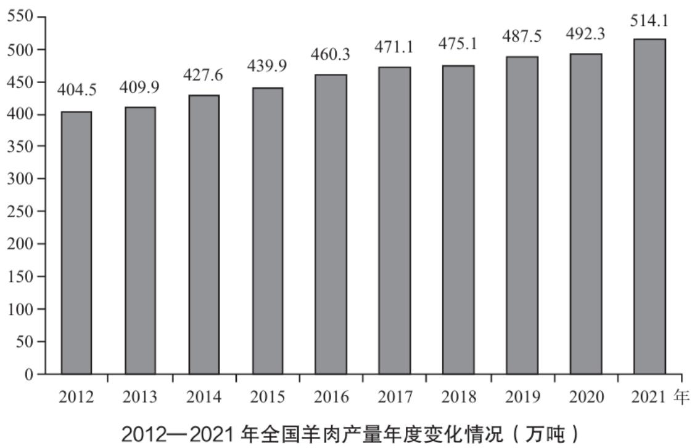

【例3】（2023联考）2021年，全国羊肉产量同比增长率约为：

A.  $2.4\%$

B.  $3.4\%$

C.  $4.4\%$

D.  $5.4\%$

【解析】3. 时间2021年，问同比增长率，同比是和上年相比，已知现期和基期的数据，r=增长量/基期=(现期- 基期)/基期=(51|4.1-49|2.3)/192.3≈22/492，选项差距大，直接截两位直除，22/49，首位商不到5，首位商4，结果为  $4. \mathrm{x}\%$  ，C项当选。【选C】

【注意】三位数及以上，小数点可以忽略。

2012—2022年Z省城乡低保、特困资金发放情况  

<table><tr><td>指标</td><td>2012年</td><td>2013年</td><td>2014年</td><td>2015年</td><td>2016年</td><td>2017年</td><td>2018年</td><td>2019年</td><td>2020年</td><td>2021年</td><td>2022年</td></tr><tr><td>低保资金(亿元)</td><td>22.19</td><td>24.32</td><td>24.42</td><td>26.44</td><td>35.10</td><td>42.13</td><td>45.71</td><td>48.42</td><td>48.62</td><td>55.43</td><td>61.48</td></tr><tr><td>特困资金(亿元)</td><td>2.53</td><td>2.61</td><td>2.85</td><td>2.94</td><td>3.04</td><td>3.02</td><td>3.37</td><td>4.24</td><td>5.21</td><td>6.48</td><td>8.09</td></tr></table>

【例4】（2024浙江选调）2022年Z省特困资金发放额比2015年增长了约（）。

A.  $233\%$

B.  $175\%$

C.  $157\%$

D.  $82\%$

【解析】4. 方法一：时间 2022 年和 2015 年比，增长率也可以和多年前去比。现期为 2022 年，基期为 2015 年，已知现期和基期， $r = (8.09 - 2.94) / 2.94 = 5.15 / 2.94$ ，分母有效数字为 294，与 300 非常接近，选项差距大，近似处理为 3 没有问题，如果不敢肯定，就严格按照差距大，截两位来处理。截两位直除 515/29，首位商 1，排除 A、D 项，结合选项，次位看商 5 还是 7 哪一个更合适即可，次位商 7，对应 B 项。

方法二：选项的增长率很大，意味着“现期/基期”倍数明显，可以直接用“现期/基期-1”来计算。（现期- 基期）/基期=现期/基期-1。故可以直接用现期/基期=8.09/2.94，选项差距大，截两位计算809/29，首位商2，次位商7，倍数-1=2.7+倍-1=1.7+=170%，也能选到B项。【选B】

# 【注意】

1. 选项差距大，且本身294和300非常接近，分母可以看作3。  
2. 方法一为通用思路，方法二为特殊情况。

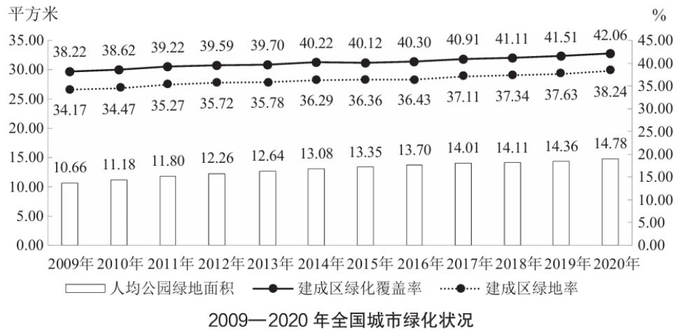

【例 5】(2022 联考) 表中全国城市建成区绿地率首次超过  $35\%$  的年份, 当年人均公园绿地面积同比约上升了:

A.  $4\%$

B.  $6\%$

C.  $8\%$

D.  $10\%$

【解析】5. 绿地率找虚线折线，定位首次超过  $35\%$  的年份，为 2011 年，求这一年的增长率。 $r =$  （现期- 基期）/基期  $= (11.8 - 11.18) / 11.18 = 0.62 / 11.18$ ，选项首位不同，差距大，截两位，看作  $0.62 / 11$ ，首位商不到 6，接近商 6，B 项当选。【选 B】

【注意】如果用现期/基期-1，差距大，截两位，如果用11.8/11，首位商1，次位商0，第三位商7，计算出倍数  $= 1.07^{+}$  倍，r=倍数  $-1 = 1.07^{+} - 1 = 7\%$  ，会错选C项。这种方法的计算量不会比上面更简单，且容易出错。绝大多数题目增长率比较小，这种情况倍数很接近，稍微动一点基期量，误差都会很大，容易出错。故绝大多数情况，用现期/基期-1容易出错，且不会简单。

2022年全年，全国完成邮政行业业务总量14317亿元，同比增长  $4.5\%$  ，全年完成电信业务总量17498亿元，同比增长  $21.3\%$  ，年末移动电话基站数1083万个，其中4G基站603万个，5G基站231万个，年末固定互联网宽带接入用户58965万户，比上年末增加5386万户，其中100M速率及以上的宽带接入用户55380万户，增加5513万户，蜂窝物联网终端用户18.45亿户，增加4.47亿户。

【例 6】(2024 黑龙江公安) 2022 年末, 全国蜂窝物联网终端用户的同比增

速约为：

A.  $24\%$

B.  $28\%$

C.  $32\%$

D.  $36\%$

【解析】6. 增速计算，公式： $r =$  （现期-基期）/基期。已知现期  $= 18.45$ ，增长量  $= 4.47, r = 4.47 / (18.45 - 4.47)$ ，选项差距大，分母截两位，近似为  $4.47 / 14$ ，首位商3，次位商2，结果为  $32\%$  左右，C项当选。【选C】

【注意】一定要注意：分母是基期，不要误用现期。

多个年份（月份）增长率  $>10\%$

$\mathrm{r} =$  （现期- 基期）/基期  $>10\%$

现期- 基期  $>10\%$  基期

现期  $>$  （1+10%）基期（错位相加）

用减法算增长量或者用加法去错位相加都可以，没有优劣之分，看个人习惯

【注意】多个年份（月份）增长率  $>10\%$

1. 列式：r=（现期- 基期）/基期>10%。  
2. 变形：（现期- 基期）/基期  $>10\% \rightarrow$  现期- 基期  $>10\%$  基期  $\rightarrow$  增长量  $\rightarrow$  基期  $+10\%$  。  
3. 继续变形: 现期- 基期  $>10 \%$  基期  $\rightarrow$  现期  $>$  基期 + 基期 *  $10 \%$ , 方法是错位相加。例如  $150 + 150 * 10 \% = 150 + 15 = 165$  。如果觉得减法不好算, 可以转化为加法。

2012年-2014年增长率超过  $10\%$  的年份有几个？

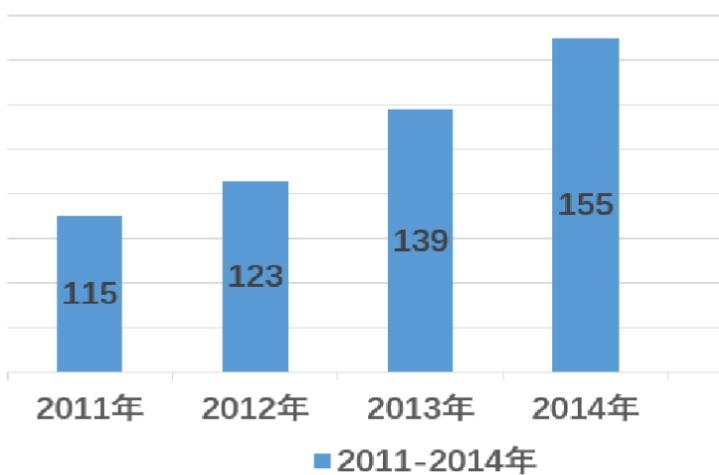

# 【注意】

1. 减法思维: 要  $r > 10\%$ , 即满足增长量  $>$  基期  $*10\%$ . 2012 年: 和 2011 年比,  $123 - 115 = 8 < 115 * 10\% = 11.5$ , 不满足; 2013 年:  $139 - 123 = 16 > 123 * 10\% = 12.3$ , 满足; 2014 年:  $155 - 139 = 16 > 139 * 10\% = 13.9$ , 满足, 共 2 年满足。  
2. 加法思维：2012年：2011年为基期， $115 + 11.5 = 126.5 > 123$ ，不满足；2013年： $123 + 12.3 = 135^{+} < 139$ ，满足；2014年： $139 + 13.9 = 152^{+} < 155$ ，满足。

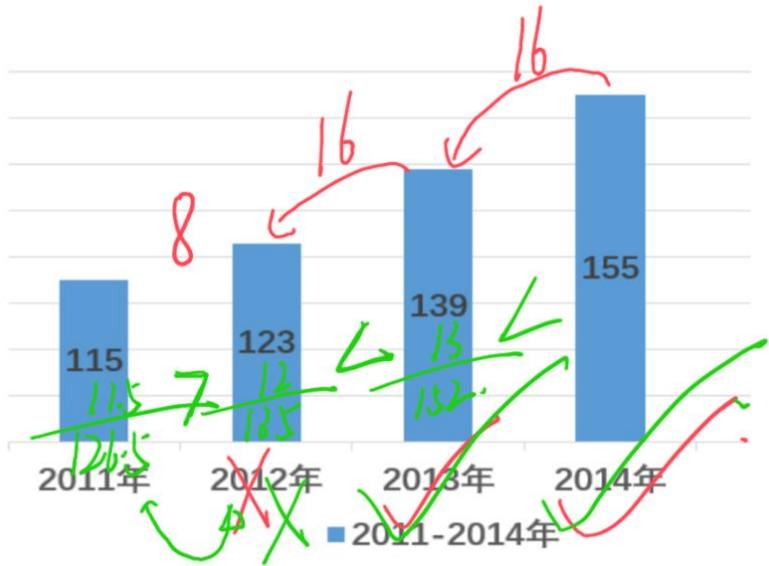

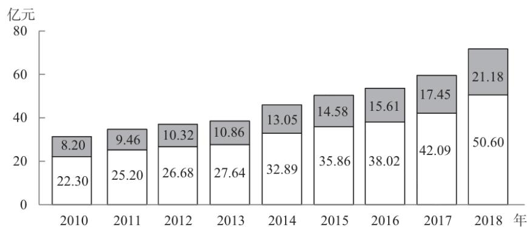  
□门票收入 □非门票收入  
2010—2018年我国海洋主题公园收入构成

【例7】（2020国考）2011—2018年间，我国海洋主题公园非门票收入同比增速超过  $10\%$  的年份有几个？

A. 5

B. 6

C. 3

D. 4

【解析】7. 问非门票收入，定位深色柱子。问  $2011 \sim 2018$  年增速超过  $10\%$  的年份有几个，看似需要计算 8 个增长率，非常麻烦。

方法一：减法思维。2011年：  $9.46 - 8.2 = 1.26 > 8.2 * 10\% = 0.8$  ，符合；2012年： $10.32 - 9.46 = 0.9 < 0.94$  ，不符合，排除；2013年：  $10.86 - 10.32 = 0.5^{+} < 1.\mathrm{x}$  ，不符合；2014年：从  $10.86 \rightarrow 13.05$  ，增长非常明显，  $13.05 - 10.86 = 2^{+} > 1.\mathrm{x}$  ，符合；2015年：  $14.58 - 13.05 \approx 1.5 > 1.3^{+}$  ，符合；2016年：  $15.61 - 14.58 \approx 1.1 < 1.4^{+}$  不符合；2017年：  $17.45 - 15.61 \approx 1.8 > 1.5^{+}$  ，符合；2018年：  $21.18 - 17.45 = 3.7^{+} > 1.7^{+}$  ，符合，共5年。

方法二：加法思维。2011年：  $8.2 + 0.82 = 9.02 < 9.4$  ，符合；2012年： $9.46 + 0.946 = 10.4^{+} > 10.32$  ，不符合；2013年：  $10.32 + 1.032 = 11.3^{+} > 10.86$  ，不符合；2014年：  $10.86 + 1.086 = 11^{+} < 13.05$  ，符合；2015年：  $13.05 + 1.3^{+} = 14.3^{+} < 14.58$  ，符合；2016年：  $14.58 + 1.4^{+} = 15.9^{+} > 15.61$  ，不符合；2017年：  $15.61 + 1.5^{+} = 17.1^{+} < 17.45$  ，符合；2018年：  $17.45 + 1.7^{+} = 19.1^{+} < 21.18$  ，符合，共5年。【选A】

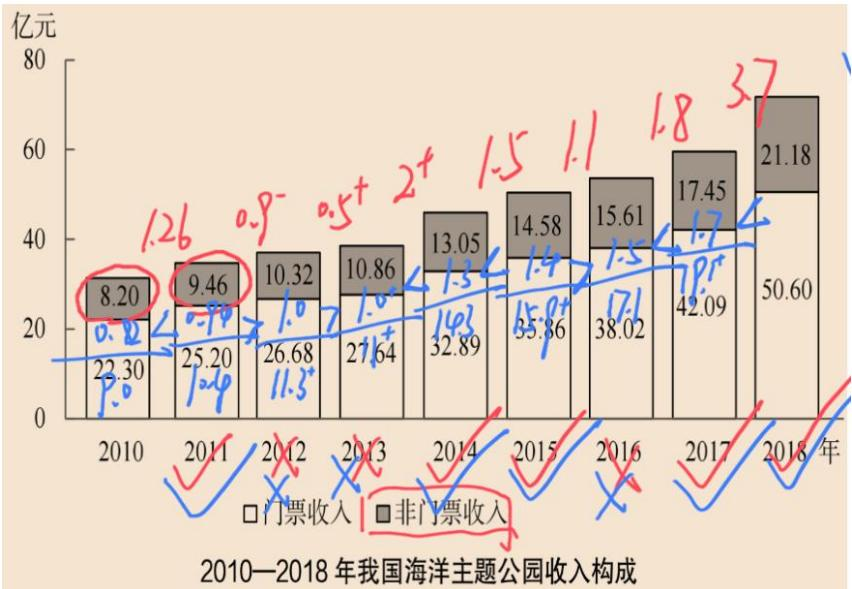  
【注意】增长率看的是比例，无法测量。

多个年份增长率  $>10\%$  （20%、50%、100%）

$\mathrm{r} =$  （现期- 基期）/基期  $>50\%$

现期- 基期  $>50\%$  基期

现期  $>$  （1+50%）基期

用减法算增长量或者用加法去错位相加都可以，没有优劣之分，看个人习惯不用想太多， $10\%$ 是最常考的，技巧性最强。

其他的偶尔会考，考了也不会让你算很多组数据

【注意】多个年份增长率  $>10\%$  （20%、50%、100%）：方法思维和 10%一样。以 50%为例。

1.  $r =$  （现期- 基期）/基期  $>50\% \rightarrow$  现期- 基期  $>50\%$  基期  $\rightarrow$  现期  $\geqslant$  （ $1 + 50\%$ ）基期。“1.5*基期”即“基期加自己的一半”。  
2.  $20\%$  ：  $\mathrm{r} =$  （现期- 基期）/基期  $>20\% \rightarrow$  现期- 基期  $>20\% *$  基期  $\rightarrow$  现期  $\geqslant$  （1+20%）基期，20%即10%的2倍，计算出10%对应的数字再乘以2，比如 $166*20\% = 16.6 + 16.6 = 33.2$  ，  $166 + 33.2 = 199.2$  。  
3. 用减法算增长量或者用加法去错位相加都可以，没有优劣之分，看个人习惯。  
4. 不用想太多， $10\%$ 是最常考的，技巧性最强。不会考查例如  $27.88\%$  这样的数字，不要杞人忧天，资料分析不是招聘计算器，其他的（ $20\%$ 、 $50\%$ 、 $100\%$ ）偶尔会考，考了也不会让你算很多组数据。

【例8】（2023联考）

2012—2021年全国主要畜禽产品批发与零售价格年度变化情况（元/公斤）  

<table><tr><td rowspan="2">年份</td><td colspan="2">猪肉</td><td colspan="2">牛肉</td><td colspan="2">羊肉</td><td colspan="2">鸡肉</td><td colspan="2">鸡蛋</td></tr><tr><td>批发价格</td><td>零售价格</td><td>批发价格</td><td>零售价格</td><td>批发价格</td><td>零售价格</td><td>批发价格</td><td>零售价格</td><td>批发价格</td><td>零售价格</td></tr><tr><td>2012</td><td>21.15</td><td>33.22</td><td>39.30</td><td>48.12</td><td>46.06</td><td>54.15</td><td>14.14</td><td>18.56</td><td>8.11</td><td>9.06</td></tr><tr><td>2013</td><td>21.05</td><td>35.21</td><td>51.71</td><td>59.59</td><td>53.34</td><td>60.25</td><td>14.26</td><td>18.70</td><td>8.43</td><td>9.53</td></tr><tr><td>2014</td><td>18.94</td><td>34.97</td><td>54.33</td><td>62.76</td><td>55.40</td><td>62.37</td><td>14.61</td><td>19.42</td><td>9.57</td><td>10.62</td></tr><tr><td>2015</td><td>20.80</td><td>27.64</td><td>53.96</td><td>70.87</td><td>49.39</td><td>60.30</td><td>14.70</td><td>19.99</td><td>8.11</td><td>9.57</td></tr><tr><td>2016</td><td>24.87</td><td>28.46</td><td>53.24</td><td>72.86</td><td>45.05</td><td>55.59</td><td>14.90</td><td>20.11</td><td>7.49</td><td>8.91</td></tr><tr><td>2017</td><td>21.24</td><td>25.98</td><td>53.82</td><td>72.08</td><td>47.49</td><td>55.48</td><td>13.93</td><td>20.19</td><td>6.92</td><td>8.28</td></tr><tr><td>2018</td><td>18.66</td><td>28.01</td><td>57.46</td><td>71.94</td><td>55.76</td><td>60.90</td><td>15.00</td><td>21.89</td><td>8.55</td><td>9.67</td></tr><tr><td>2019</td><td>28.51</td><td>50.81</td><td>63.85</td><td>74.60</td><td>63.81</td><td>69.47</td><td>17.55</td><td>25.55</td><td>9.26</td><td>10.52</td></tr><tr><td>2020</td><td>45.22</td><td>69.51</td><td>73.03</td><td>86.81</td><td>69.27</td><td>77.01</td><td>16.82</td><td>26.66</td><td>7.53</td><td>8.79</td></tr><tr><td>2021</td><td>28.53</td><td>54.71</td><td>77.08</td><td>89.48</td><td>73.65</td><td>81.40</td><td>17.14</td><td>25.71</td><td>9.51</td><td>10.72</td></tr></table>

表中所列的主要畜禽产品中，相较于2012年，2021年零售价格增长幅度超过  $50\%$  的是：

A. 猪肉、牛肉、羊肉

B. 猪肉、羊肉、鸡肉

C.牛肉、羊肉、鸡肉

D. 羊肉、鸡肉、鸡蛋

【解析】8. 增长幅度即增长率，要求增长率超过  $50\%$  ，增量  $>$  基期  $50\%$  或现期  $>$  基期  $1.5$  ，用“增量  $>$  基期  $50\%$  ”，不要找批发价，看零售价。

猪肉：54.71-33.22>33.22/2，符合，排除C、D项；牛肉：89.48-48.12>48.12/2，符合，对应A项。羊肉不需要算，一定满足，因为羊肉在四个选项中都有，A项一定正确。【选A】

增长率的计算

识别：增长  $+\%$  （选项）

题型1：给百分点

方法：高减低加

题型 2: 给具体量

公式：r=增长量/基期量=(现期- 基期)/基期=增长量/(现期-增长量)

方法：截位直除

题型 3: 判断多个年份/主体的增速超过  $10\%$  (20%、50%、100%)

核心：不是直接算增速，而是利用所给数据进行变形，简化计算

【注意】增长率的计算：

1. 识别：增长  $+ \%$  （选项）。  
2. 题型 1: 给百分点。(例  $1 \sim$  例 2), 方法: 高减低加。  
3. 题型 2: 给具体量 (例  $3 \sim$  例 6)。  
(1) 公式:  $r =$  增长量/基期量 = （现期- 基期）/基期 = 增长量 / （现期- 增长量）。  
(2) 方法: 截位直除。

# 4. 题型3：

(1) 判断多个年份/主体的增速超过  $10\%$  (20%、50%、100%) (例 7~例 8)。  
(2) 核心: 不是直接算增速, 而是利用所给数据进行变形, 简化计算。

# 二、增长率的比较

识别：增长+最快/慢

考法一：

已知：现期、基期

比较：增长率  $\rightarrow \mathrm{r} =$  （现期-基期）/基期  $=$  现期/基期-基期/基期  $=$  现期/基期-1

A和B谁增长的更快？  

<table><tr><td></td><td>基期</td><td>现期</td></tr><tr><td>A</td><td>100</td><td>600</td></tr><tr><td>B</td><td>200</td><td>1000</td></tr></table>

方法：看现期和基期的倍数关系，倍数越大，增长率就越大

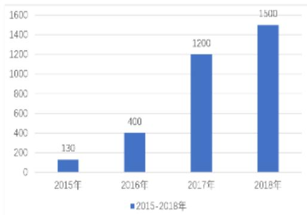

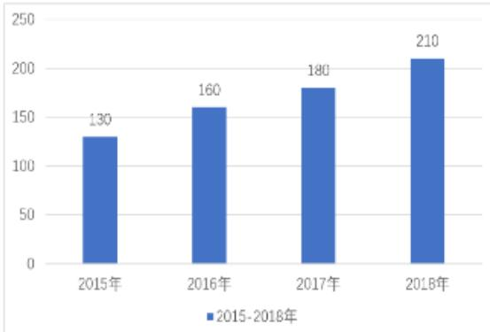

问：（2016～2018）哪一年的同比增速最快？

注：增长率与以前学的斜率没有半毛钱关系，请忘记斜率

两步走

第一步，先看“现期/基期”能否得到唯一答案

第二步，不能得出，再比较“（现期- 基期）/基期=增长量/基期”

【注意】一般增长率比较：

1. 识别：增长+快/慢。

(1) 增长+快/慢，快慢是形容速度，比如做题速度、跑步速度快、慢。  
(2) 增长 + 多/少, 多少形容具体量, 比如钱很多、收入很少, 问多少为增长量的比较。

2. 公式： $r =$  增长量/基期量=（现期- 基期）/基期=现期/基期- 基期/基期=现期/基期-1。即  $r =$  现期/基期（倍数）-1，计算的时候用倍数-1 误差会大，但是比较的时候可以用。

3. 例：A 的基期量为 100、现期量为 600，B 的基期量为 200、现期量为 1000，问 A 和 B 谁增长更快？

答：先算倍数，A：现期量/基期量  $= 600 / 100 = 6$  倍，  $r = 6 - 1 = 5$  （  $500\%$  ）；B：现期量/基期量  $= 1000 / 200 = 5$  倍，  $r = 5 - 1 = 4$  （  $400\%$  ），A的增长率更大。若不要求计算增长率，只是要求比较大小，不必要“-1”，原来6倍  $>5$  倍，都-1，大小关系不变，故增长率的比较可以直接看现期和基期的倍数关系。

4. 方法：看现期和基期的倍数关系，倍数越大，增长率就越大。  
5. 问：（2016～2018）哪一年的同比增速最快。

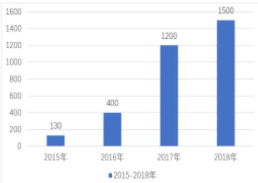

(1) 增长率与以前学的斜率没有半毛钱关系, 请忘记斜率: 如果看图,认为 2017 年增长最陡、2017 年增长最快, 这种方法错误, 错误是因为看了斜率, 增长率 = 增长量 / 基期量, 斜率  $k = \triangle y / \triangle x$ , 例如  $2016 \rightarrow 2017$  年的斜率, 为  $\tan \theta = k =$  对边/邻边  $= \triangle y / \triangle x$ ,  $\triangle y =$  增长量, 基期是基期柱状图的高度, 分母  $\triangle x$  是横坐标之差, 故增长率和斜率没有关系。

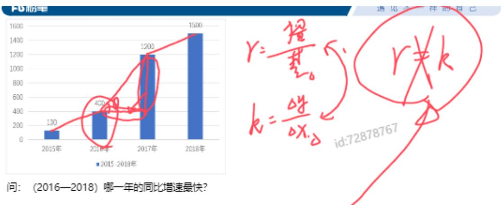

(2) 看现期/基期。2016年： $400 / 130 = 3^{+}$ ；2017年： $1200 / 400 = 3$ ；2018年： $1500 / 1200 = 1^{+}$ 。2016年的倍数最大，则2016年的同比增速最快。

6. 问：（2016～2018）哪一年的同比增速最快。

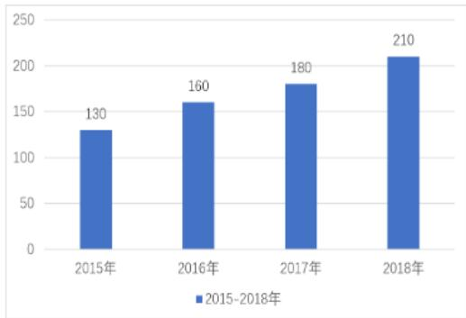

答：现期/基期比较不出来，用  $r =$  增长量/基期，2016 年：（160-130）/130=30/130；2017 年：（180-160）/160=20/160；2018 年：（210-180）/180=30/180。分数比较，2016 年的分子最大、分母最小，分数值最大，2016 年的同比增速最快。

# 7. 两步走：

(1) 第一步，先看“现期/基期”能否得到唯一答案。  
(2) 第二步, 不能得出, 再比较 “ (现期- 基期) / 基期=增长量/基期”。

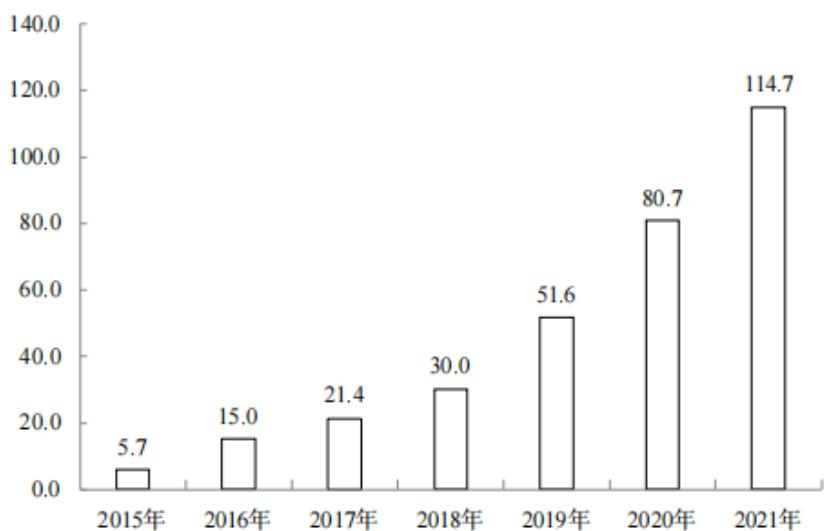  
2015—2021年我国公共充电桩数量（单位：万台）

【例1】（2022联考） $2016\sim 2021$ 年我国公共充电桩数量同比增速最大的年份是：

A.2016年

B.2019年

C. 2020年

D.2021年

【解析】1. 增速即增长率，增长率的比较。只看选项的四个年份，同比是和上年相比，比较增长率，先看现期/基期。2016年： $15 / 5.7 = 3^{-}$ ；2019年： $51.6 / 30 = 2^{-}$ ；

2020年：80.7/51.6=2；2021年：114.7/80.7=1 $^+$ ，2016年的倍数最大，则增长率最大，对应A项。【选A】

【例2】（2023联考）

2022年1—12月全国彩票销售情况表（单位：百万元）  

<table><tr><td rowspan="2">月份</td><td colspan="4">体育彩票</td><td colspan="3">福利彩票</td></tr><tr><td>乐透数字型</td><td>竞猜型</td><td>即开型</td><td>视频型</td><td>乐透数字型</td><td>即开型</td><td>基诺型</td></tr><tr><td>1月</td><td>5319.51</td><td>8244.62</td><td>3276.97</td><td>0.05</td><td>7545.30</td><td>4375.62</td><td>2058.52</td></tr><tr><td>2月</td><td>3868.84</td><td>7010.10</td><td>2219.85</td><td>0.11</td><td>5210.51</td><td>2725.33</td><td>1446.36</td></tr><tr><td>3月</td><td>5855.35</td><td>10737.77</td><td>3040.46</td><td>0.11</td><td>8304.09</td><td>2668.08</td><td>2337.71</td></tr><tr><td>4月</td><td>6003.76</td><td>10665.55</td><td>2433.12</td><td>0.01</td><td>7261.26</td><td>2421.86</td><td>2286.67</td></tr><tr><td>5月</td><td>6175.17</td><td>10896.80</td><td>2551.47</td><td>0.03</td><td>7817.46</td><td>2535.34</td><td>2789.11</td></tr><tr><td>6月</td><td>5864.59</td><td>10449.17</td><td>2588.32</td><td>0.15</td><td>7169.67</td><td>2834.29</td><td>3074.40</td></tr><tr><td>7月</td><td>5802.25</td><td>10873.70</td><td>2313.56</td><td>0.06</td><td>7466.64</td><td>2280.66</td><td>2632.94</td></tr><tr><td>8月</td><td>5874.08</td><td>13739.23</td><td>2191.68</td><td>0.02</td><td>7453.13</td><td>2611.24</td><td>2606.57</td></tr><tr><td>9月</td><td>5358.91</td><td>12891.92</td><td>2762.24</td><td>0.01</td><td>7569.92</td><td>2202.47</td><td>2546.22</td></tr><tr><td>10月</td><td>5296.72</td><td>11341.84</td><td>2088.74</td><td>0.01</td><td>6614.96</td><td>2184.98</td><td>2191.07</td></tr><tr><td>11月</td><td>5743.78</td><td>31081.42</td><td>1941.06</td><td>0.02</td><td>8734.88</td><td>1947.31</td><td>2395.72</td></tr><tr><td>12月</td><td>5331.21</td><td>42994.68</td><td>1692.49</td><td>0.02</td><td>7775.85</td><td>1559.68</td><td>2495.05</td></tr></table>

下列折线图中，能准确反映2022年第四季度竞猜型彩票月销售额的环比增长率变化趋势的是：

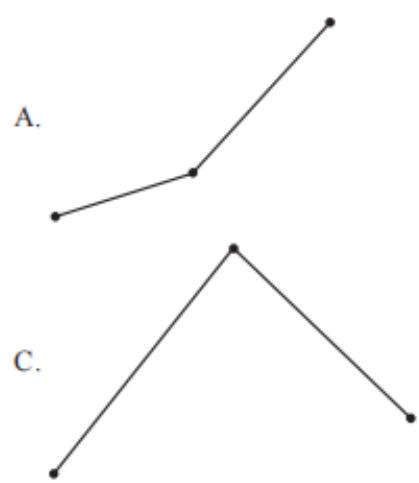

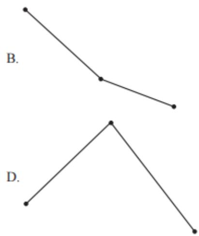

【解析】2. “环比”是和上个统计周期比，会认为四季度和三季度比，但注意是“月销售额”的环比增长率，实际题干是“2022年  $10\sim 12$  月竞猜型彩票月销售额的环比增长率变化趋势”，环比是和上个月比；选项出现折线图，重点看黑点，数据大小反应点的高低。先观察数据，10月<9月，10月增长率<0，11、12月的增长率都是正数，故选项第一个点应该最低，排除B、D项。比较11、12

月的增长率，11月的现期/基期为  $3^{-}$ 倍，12月的现期/基期是  $1^{+}$ 倍，11月增长率最大，点最高，对应C项。【选C】

主要年份广东经济特区人均地区生产总值情况  
单位：元  

<table><tr><td>年份</td><td>全省</td><td>经济特区</td><td>其中: 深圳</td><td>其中: 珠海</td><td>其中: 汕头</td></tr><tr><td>1980</td><td>481</td><td>443</td><td>835</td><td>720</td><td>366</td></tr><tr><td>1990</td><td>2484</td><td>4917</td><td>11097</td><td>6678</td><td>2026</td></tr><tr><td>2000</td><td>12817</td><td>24067</td><td>33276</td><td>28068</td><td>9741</td></tr><tr><td>2010</td><td>44669</td><td>73066</td><td>99095</td><td>80024</td><td>21208</td></tr><tr><td>2019</td><td>94172</td><td>158610</td><td>203489</td><td>175533</td><td>47669</td></tr></table>

【练习】（2021广东选调）下列年份中，与上一个主要年份相比，汕头人均地区生产总值增长速度最快的是：

A. 1990年

B.2000年

C. 2010年

D.2019年

【解析】拓展. 增长率比较, 先看现期/基期的倍数关系。1990 年: 2026/366=6\%; 2000 年: 9741/2026≈4; 2010 年: 21208/9741=2\%; 2019 年: 47669/21208=2\%, 1990 年的倍数最大, 增长率也最大, 对应 A 项。【选 A】

部分国家全球创新指数（GII）情况比较  

<table><tr><td>年份 国家</td><td>2012 年</td><td>2021 年</td><td>2022 年</td></tr><tr><td>瑞士</td><td>68.2</td><td>65.5</td><td>64.6</td></tr><tr><td>美国</td><td>57.7</td><td>61.3</td><td>61.8</td></tr><tr><td>瑞典</td><td>64.8</td><td>63.1</td><td>61.6</td></tr><tr><td>英国</td><td>61.2</td><td>59.8</td><td>59.7</td></tr><tr><td>荷兰</td><td>60.5</td><td>58.6</td><td>58.0</td></tr><tr><td>韩国</td><td>53.9</td><td>59.3</td><td>57.8</td></tr><tr><td>新加坡</td><td>63.5</td><td>57.8</td><td>57.3</td></tr><tr><td>德国</td><td>56.2</td><td>57.3</td><td>57.2</td></tr><tr><td>芬兰</td><td>61.8</td><td>58.4</td><td>56.9</td></tr><tr><td>丹麦</td><td>59.9</td><td>57.3</td><td>55.9</td></tr><tr><td>中国</td><td>45.4</td><td>54.8</td><td>55.3</td></tr><tr><td>巴西</td><td>36.6</td><td>34.2</td><td>32.5</td></tr><tr><td>俄罗斯</td><td>37.9</td><td>36.6</td><td>34.3</td></tr><tr><td>印度</td><td>35.7</td><td>36.4</td><td>36.6</td></tr><tr><td>南非</td><td>37.4</td><td>32.7</td><td>29.8</td></tr></table>

【例 3】(2024 联考) 表格所列国家中, 相较于 2012 年, 2022 年全球创新

指数增长最快的国家是：

A. 美国

B. 中国

C. 英国

D. 印度

【解析】3.2022年和2012年比较，问增长最快，找增长率最大的。找到对应数据，英国：  $61.2\rightarrow 59.7$  为下降，排除；印度：  $35.7\rightarrow 36.6$  基本不变，排除；比较中国和美国，看倍数看不出来，比较增长量/基期，美国：（61.8-57.7）/57.7=4.1/57.7；中国：（55.3-45.4）/45.4=9.9/45.4，分数比较，中国的分子大、分母小，分数值更大，对应B项。【选B】

# 【注意】

1. 增长率比较：先观察倍数和升降，看不出来的再用增长量÷基期（分数比较）。  
2. 基于客观事实、常识角度，题干中涉及国家和国家之间好的指标的比较时（比如比较增长速度），选项有中国的话，可以直接选中国。

（1）很多发达国家虽然优秀，但底子就好；咱们国家从之前的状态发展到现在这样，增长率一定比很多发达国家快很多。  
(2) 公务员考试是要彰显国家实力和自信的, 故好的方面可以选中国, 如果问下降快、坏的方面, 则不能选中国。

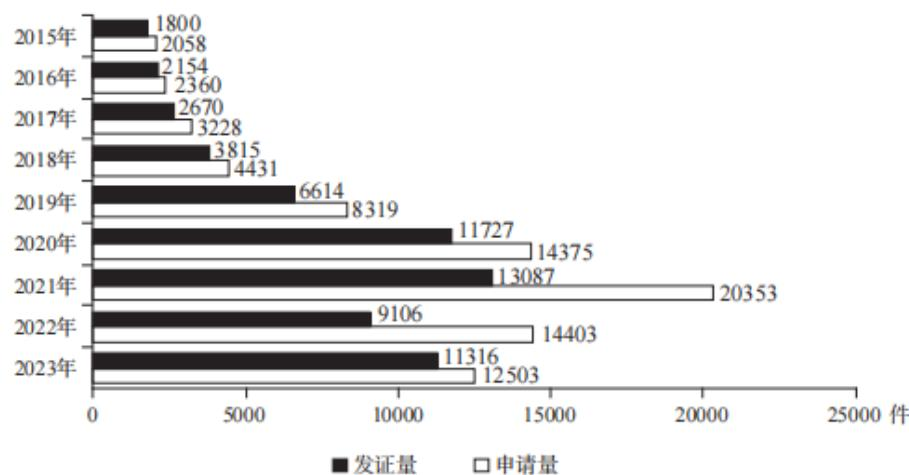  
【例4】（2025国考）  
2015—2023年我国集成电路布图设计登记申请和发证情况

2019—2021年，我国集成电路布图设计登记申请量三年的同比增速：

A. 先升后降  
B. 先降后升  
C. 逐年上升  
D. 逐年下降

【解析】4. 申请量定位白色柱状图，2019年和2018年比，倍数约为2倍；2020年和2019年是  $1^{+}$  倍，2021年和2020年是  $1^{+}$  倍，2019年一定最高；如果计算能力好，能看出2020年比2021年高，可以选择D项，如果看不出，计算增量/基期，2020年：增长率  $\approx 6000 / 8319$  ，2021年：增长率  $\approx 6000 / 14375$  ，2021年分母大、分数小，2019年增长率  $>2020$  年增长率  $>2021$  年增长率，对应D项。

【选D】

增长率的比较

识别：增长+最快/慢；增速排序

考法二：已知现期、增量

方法：比较增量/现期，r=增长量/基期量=增长量/(现期量-增长量)=1/(现期量/增长量-1)

<table><tr><td></td><td>现期</td><td>增量</td><td></td></tr><tr><td>A</td><td>120</td><td>20</td><td></td></tr><tr><td>B</td><td>150</td><td>30</td><td></td></tr></table>

结论：增量/现期越大，r 就越大，不需要算基期量

注意：只有比较的时候可以用，计算的时候分母一定是基期

【注意】增长率的比较：

1. 识别：增长+最快/慢；增速排序。  
2. 考法二：已知现期、增量。  
3. 方法：

（1）常规思维是“算出基期，A的基期为100，B的基期为120，A的增长率为  $20 / 100 = 1 / 5$  ，B的增长率为  $30 / 120 = 1 / 4$  ，B的增长率大”，这个思维对，但是题目一般有4个选项，需要计算4次，且数据不像例子这么整齐，这样的思维太麻烦。

<table><tr><td></td><td>现期</td><td>增量</td><td></td></tr><tr><td>A</td><td>120</td><td>20</td><td></td></tr><tr><td>B</td><td>150</td><td>30</td><td></td></tr></table>

(2) 直接比较增量/现期,  $r =$  增长量/基期量  $=$  增长量/(现期量-增长量)  $= 1 /$  (现期量/增长量-1)。当“增长量/现期量”越大, 其倒数 “现期量/增长量”越小  $(6 > 5, 1 / 5 > 1 / 6)$ , 则整个分数的分母小, 对于一个分数, 分母越小, 分数值越大, 分数值即 “1/(现期量/增长量-1)  $\rightarrow$  增长率”, 即当 “增长量/现期量” 越大, 增长率就越大。

5. 结论：增量/现期越大，r 就越大，不需要算基期量。  
6. 注意：只有比较的时候可以用，计算的时候分母一定是基期。

【例5】（2022广东）2020年，全国职工基本医疗保险（以下简称职工医保）参保人数持续增加，基金收支规模基本稳定。参加职工医保34455万人，比上年同比增加1530万人。其中在职职工25429万人，比上年增长  $5.0\%$  ；退休职工9026万人，比上年增长  $3.7\%$  。企业、机关事业、灵活就业等其他人员三类参保人员（包括在职职工和退休人员）分别为23317万人、6387万人、4751万人，分别比上年增加1050万人、155万人、325万人。

根据资料，判断“2020年，三类职工医保参保人员中，灵活就业等其他人员参保人数同比增速最快”这一说法是否正确。

A. 正确

B. 错误

【解析】5. 给出“三类职工医保参保人员”的现期量和增长量，直接比较增长量/现期量，企业  $\rightarrow 1050 / 23317$  、机关事业  $\rightarrow 155 / 6387$  、灵活就业  $\rightarrow 325 / 4751$  ，325/4751 和 155/6387 比，分子大、分母小，故灵活就业大；剩余两个分数横着看倍数，  $1050 / 325 \approx 3$  倍，  $23317 / 4751 \approx 5$  倍，分母倍数大，分母大的分数小，325/4751 最大，说法正确。【选 A】

【注意】本题是从一道题中单拎出一个选项来给大家判断, 讲义每年在更新,

在比较新的考卷中，这样的考法并不多见，故只能从资料分析中挑选出一个选项来给大家讲解。

【例6】（2024国考）2022年，S省各级12315工作机构共接收诉求220.4万件，同比增长  $21.41\%$  。其中，投诉55.6万件、举报26.3万件、咨询138.5万件，比上一年分别增加14.0万件、8.9万件、16.0万件。

将S省各级12315工作机构接收的投诉、举报和咨询三类诉求量按2022年同比增速从高到低排序，以下正确的是：

A. 投诉量、举报量、咨询量  
B. 咨询量、投诉量、举报量  
C. 举报量、咨询量、投诉量  
D. 举报量、投诉量、咨询量

【解析】6. 三类同比增速排序，增长率比较，投诉量、举报量、咨询量都给出现期和增长量，直接比较增长量/现期，小数点可以适当忽略，列式：投诉→14/55.6，举报→8.9/26.3，咨询→16/138，三个分数同大同小，可以横着看倍数，也可以竖着看首位。

方法一：横着看倍数，投诉和举报比，分子之间1倍多，分母之间2倍多，分母倍数大，分母大的分数小，举报大于投诉，排除A、B项，比较投诉和咨询，分子之间1倍多，分母之间2倍多，分母倍数大，分母大的分数小，投诉大于咨询，咨询最小，对应D项。

方法二：计算首位，投诉、举报、咨询首位依次为2、3、1，排序为举报、投诉、咨询，对应D项。【选D】

增长率的比较

识别：增长+最快/慢

考法一：已知现期、基期

方法：看“现期÷基期”的倍数，看不出来就用“增量÷基期（分数比较）”

考法二：已知现期、增量

方法：“增量/现期”越大，r 就越大，不需要算基期量

【注意】增长率的比较：

1. 识别：增长+最快/慢。

2. 考法一（更重要，材料多半是这种类型）：已知现期、基期，看“现期÷基期”的倍数，看不出来就用“增量÷基期（分数比较）”。  
3. 考法二：已知现期、增量，“增量/现期”越大，r 就越大，不需要算基期量。

# 课后两件事

①复习：整理课堂笔记——看老师的每一题的梳理，拓展，最后的总结，明天白天用老师的方法和思维把讲义题目再做一遍  
(2)预习: 335页  $\sim 343$  页（第四节增长量), 把题做一遍, 不求快, 重要的是过程

# 【答案汇总】

增长率计算 1-5: ADCBB; 6-8: CAA

增长率比较 1-5: ACBDA; 6: D

遇见不一样的自己

Be your better self