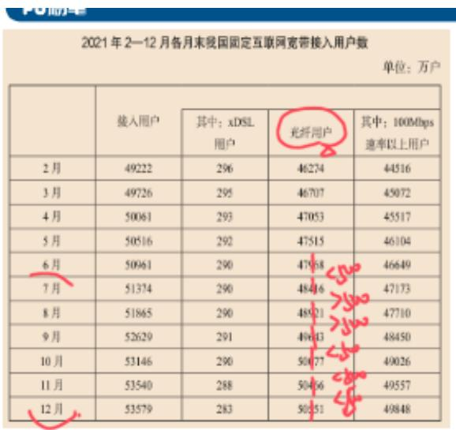
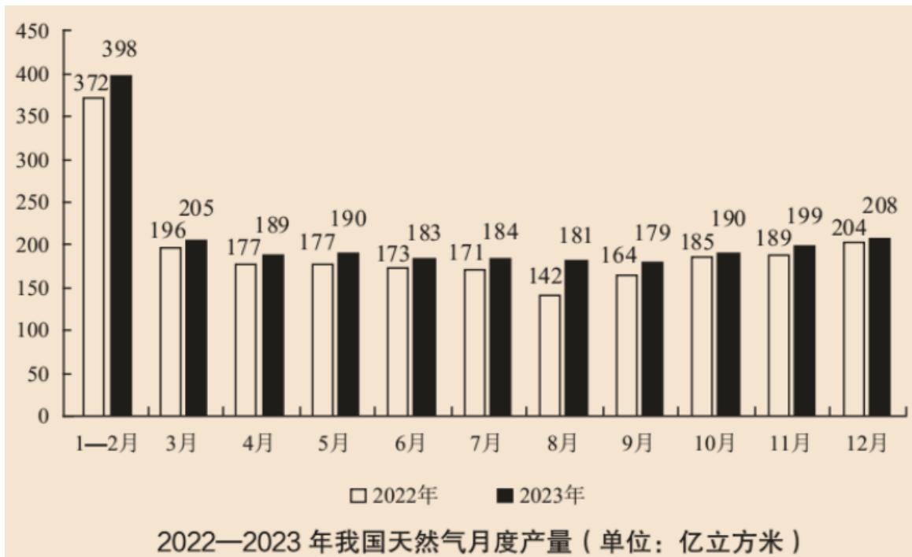
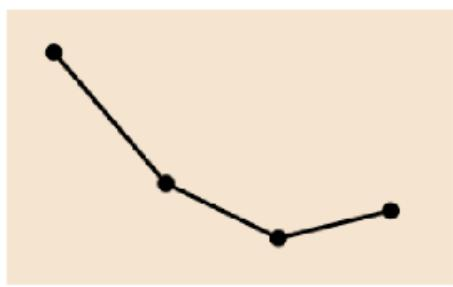

# 精讲精练-资料4

（笔记）

主讲教师：邓健

授课时间：2025.03.05

# 精讲精练-资料4（笔记）

# 资料分析 精讲精练4

# 学习任务：

1.课程内容：增长量  
2.对应讲义：第  $335\sim 343$  页  
3.重点内容：

（1）年均增长量的计算公式  
（2）增长量的计算公式及技巧  
（3）增长量的比较技巧

# 第四节 增长量

# 基本术语：

增长量是用来表述基期量与现期量变化的绝对量，增长率则是用来表述两者变化

的相对量。

年均增长量  $=$  （现期量-基期量）÷年份差。

# 一、计算

识别：增长+具体单位

题型 1: 给现期量、基期量, 求增长量

题型2：年均增长量

题型 3: 已知现期、增长率, 计算增长量/减少量

# 【注意】增长量计算：

1.识别：增长+具体单位。  
2. 题型 1: 给现期量、基期量, 求增长量。  
3. 题型 2: 年均增长量。  
4. 题型 3: 已知现期、增长率, 计算增长量/减少量。

【例1】（2023国考）

2021年2—12月各月末我国固定互联网宽带接入用户数  
单位：万户  

<table><tr><td></td><td>接入用户</td><td>其中: xDSL 用户</td><td>光纤用户</td><td>其中: 100Mbps 速率以上用户</td></tr><tr><td>2月</td><td>49222</td><td>296</td><td>46274</td><td>44516</td></tr><tr><td>3月</td><td>49726</td><td>295</td><td>46707</td><td>45072</td></tr><tr><td>4月</td><td>50061</td><td>293</td><td>47053</td><td>45517</td></tr><tr><td>5月</td><td>50516</td><td>292</td><td>47515</td><td>46104</td></tr><tr><td>6月</td><td>50961</td><td>290</td><td>47968</td><td>46649</td></tr><tr><td>7月</td><td>51374</td><td>290</td><td>48416</td><td>47173</td></tr><tr><td>8月</td><td>51865</td><td>290</td><td>48921</td><td>47710</td></tr><tr><td>9月</td><td>52629</td><td>291</td><td>49643</td><td>48450</td></tr><tr><td>10月</td><td>53146</td><td>290</td><td>50077</td><td>49026</td></tr><tr><td>11月</td><td>53540</td><td>288</td><td>50466</td><td>49557</td></tr><tr><td>12月</td><td>53579</td><td>283</td><td>50551</td><td>49848</td></tr></table>

2021年下半年，我国固定互联网宽带接入用户中，光纤用户数增量超过500万户的月份有几个？

A. 2

B. 3

C. 4

D. 5

【解析】1. 上半年是  $1 \sim 6$  月，下半年是  $7 \sim 12$  月，主体是光纤用户数，要增量超过 500 万户，用每个月和上个月比较，至少要计算到百位，比较题不要硬算，满足增量大于 500 的只有 8、9 月份，对应 A 项。【选 A】

  
【例2】（2024江苏）

2022—2023年上半年某地区社会经济发展主要指标  

<table><tr><td rowspan="2">指标</td><td colspan="4">2022年</td><td colspan="2">2023年</td></tr><tr><td>1-3月累计</td><td>1-6月累计</td><td>1-9月累计</td><td>1-12月累计</td><td>1-3月累计</td><td>1-6月累计</td></tr><tr><td>地区生产总值(亿元)</td><td>4004.0</td><td>7879.0</td><td>12221.0</td><td>16908.0</td><td>4230.0</td><td>8317.0</td></tr><tr><td>第三产业增加值占比(%)</td><td>64.3</td><td>63.3</td><td>62.9</td><td>62.2</td><td>65.4</td><td>64.8</td></tr><tr><td>固定资产投资(亿元)</td><td>1323.0</td><td>3040.0</td><td>4512.0</td><td>5875.0</td><td>1406.0</td><td>3111.0</td></tr><tr><td>社会消费品零售总额(亿元)</td><td>2112.0</td><td>4000.0</td><td>5833.0</td><td>7832.0</td><td>2252.0</td><td>4358.0</td></tr><tr><td>进出口总额(亿元)</td><td>1388.0</td><td>2988.0</td><td>4566.0</td><td>6292.0</td><td>1443.0</td><td>2915.0</td></tr><tr><td>出口占进出口总额的比重(%)</td><td>58.1</td><td>59.9</td><td>59.7</td><td>60.8</td><td>57.8</td><td>58.1</td></tr><tr><td>实际利用外资(亿美元)</td><td>22.8</td><td>35.3</td><td>41.3</td><td>48.5</td><td>33.0</td><td>39.6</td></tr><tr><td>工业用电量(亿千瓦时)</td><td>81.6</td><td>169.8</td><td>264.3</td><td>355.3</td><td>81.3</td><td>173.3</td></tr></table>

2023年第二季度，该地区工业用电量同比增加：

A. 4.5亿千瓦时

B.3.8亿千瓦时

C. 11.7 亿千瓦时

D. 3.0 亿千瓦时

【解析】2. 增加+单位，求增长量，同比即和上年同期相比，没有给出二季度，二季度（4～6月）=1～6月-1～3月，所求=2023年二季度-2022年二季度=（173.3-81.3）-（169.8-81.6），选项和材料都精确到小数点后一位，看尾数，尾数0-尾数0.2=尾数0.8，对应B项。【选B】

题型 2: 年均增长量

识别：年均增长+单位

例：2018～2020年，老邓的体重年均增长多少斤？

<table><tr><td>2018年</td><td>2019年</td><td>2020年</td></tr><tr><td>120斤</td><td>130斤</td><td>150斤</td></tr></table>

公式：年均增长量  $=$  （现期量-基期量）/年份差

【注意】年均增长量：

1. 识别：年均增长+单位。  
2. 公式：年均增长量  $=$  （现期量- 基期量）/年份差。  
3. 例：2018～2020 年，老邓的体重年均增长多少斤？

答：总增长量为  $2020 - 2018 = 150 - 120 = 30$  斤， $n = 2020 - 2018 = 2$ ，年均增长量  $= 30 / 2 = 15$  斤。如果认为  $n$  为3，是误算出10，2018、2019、2020年虽然有3年，但是只增长2次（ $2018 \rightarrow 2019$ 、 $2019 \rightarrow 2020$ ），计算的是增长量的年均值，要除以增长的次数。不需要数，直接用现期-基期=年份差。

【例3】（2024国考）2022年，京津冀地区生产总值合计10.0万亿元，是2013年的1.8倍。其中，北京、河北跨越4万亿元量级，均为4.2万亿元，分别是2013年的2.0倍和1.7倍；天津1.6万亿元，是2013年的1.6倍。京津冀第一产业、第二产业、第三产业增加值占生产总值比重构成由2013年的6.2：35.7：58.1变化为2022年的4.8：29.6：65.6。京津冀三地第三产业增加值占生产总值比重分别为  $83.8\%$  、  $61.3\%$  和  $49.4\%$  ，较2013年分别提高4.3、7.2和8.4个百分点。

以2013年为基期，则  $2013\sim 2022$  年京津冀地区生产总值年均约增加多少万亿元？

A. 1. 1

B. 0.9

C. 0.7

D. 0.5

【解析】3. 说明“以2013年为基期”，2022-2013=9，所求=(2022年-2013年)/9，2013年的数据没有给出，已知2022年，京津冀地区生产总值合计10.0万亿元，是2013年的1.8倍，则2013年=10/1.8=5.5，所求=(10-5.5)/9=0.5

万亿，对应D项。【选D】

（2021国考）在表中所列各类LED应用市场中， $2013\sim 2019$  年产值年均增速（以2013年为基期）最快的应用市场，2019年产值约占LED行业总产值的（）。

(2023 国考)将①甘肃、②广东、③上海和④浙江按 2016~2021 年集成电路产量年均增速（以 2016 年为基期计算）从高到低排列，以下正确的是:

（2024国考）以2013年为基期，则  $2013\sim 2022$  年京津冀地区生产总值年均约增加多少万亿元？

【注意】通过以上三道年均增长类的国考真题，可以看出只要给出“A年～B年”，A年就是基期，B年就是现期。

年均增长类问题基期的选择

一般情况（除江苏外）：2012年～2018年：年份差为6；基期：2012年；现期：2018年

五年规划（全国统一）：“十三五”期间：年份差为5（基期往前推一年）；基期：2015年，现期：2020年

五年计划，全称为中华人民共和国国民经济和社会发展五年计划纲要，是中国国民经济长期计划的重要部分。

中国从1953年开始制订第一个“五年计划”，“十一五”起，改称为“五年规划”。

“十一五”2006～2010年

“十二五”2011～2015年

“十三五”2016～2020年

“十四五”  $2021\sim 2025$  年

江苏省考（刷题遇到、了解即可）：2012～2018年，年份差为7（基期往前推一年），基期：2011年，现期：2018年

【注意】年均增长类问题年份差的确定：

1. 一般情况（除江苏考试外）：2012年～2018年：年份差为6；基期：2012

年；现期：2018年。

# 2.五年规划（全国考试统一）：

（1）五年计划（五年规划），全称为中华人民共和国国民经济和社会发展五年计划纲要，是中国国民经济长期计划的重要部分。中国从1953年开始制订第一个“五年计划”，“十一五”起，改称为“五年规划”。

(1) “十一五”是  $2006 \sim 2010$  年。  
(2) “十二五”是  $2011 \sim 2015$  年。  
(3) “十三五”是  $2016 \sim 2020$  年。  
(4) “十四五”是  $2021 \sim 2025$  年。现在正处于“十四五”的最后一年。考试遇到的大都是 “十三五”, 因为 “十四五” 还没结束, 数据还没出来, 建议记住 “十三五”, 其余五年规划的时间可以推出来。

(2) “十三五”期间（2016~2020年），年份差为5（基期往前推一年），基期为2015年，现期为2020年。记忆为“三五一十五，基期为2015年”。  
（3）原理：“十三五”对应的完整时间是2016年1月1日～2020年12月31日，年均增长量=（现期-基期）/年份差，现期是2020年12月31日，基期是2016年1月1日，但是2016年1月1日是元旦，没有数据，2016年1月1日用的应该是2015年12月31日的数据，年均增长量=（2020年12月31日-2015年12月31日）/5=（2020年-2015年）/5。  
3. 江苏省考（题库中刷题时可能会遇到，了解规则，以防做错）：时间段为  $2012 \sim 2018$  年，基期往前推一年，江苏考试不需要记忆五年规划还是普通年份，基期一律前推，年份差为 7，基期：2011 年，现期：2018 年，江苏出题人认为 “ $2012 \sim 2018$  年” 这种表述，2012 年也要计算增长量，2012 年要和 2011 年相比，故基期前推为 2011 年。

【例4】（2022江苏）

2015—2020年我国住房公积金实缴额和实缴余额  
单位：万亿元  

<table><tr><td>年份</td><td>实缴额</td><td>实缴余额</td><td>年份</td><td>实缴额</td><td>实缴余额</td></tr><tr><td>2015</td><td>1.45</td><td>4.07</td><td>2018</td><td>2.11</td><td>5.79</td></tr><tr><td>2016</td><td>1.66</td><td>4.56</td><td>2019</td><td>2.37</td><td>6.54</td></tr><tr><td>2017</td><td>1.87</td><td>5.16</td><td>2020</td><td>2.62</td><td>7.30</td></tr></table>

“十三五”时期，我国住房公积金实缴余额年均增量为：

A. 0.39 万亿元

B. 0.43 万亿元

C. 0.54 万亿元

D. 0.65 万亿元

【解析】4. 年均增长量计算，年均增长量  $=$  （现期- 基期）/年份差，“十三五”时期为  $2016 \sim 2020$  年，基期需要前推，年份差为5，现期为2020年，基期为2015年，所求  $=$  （2020年-2015年）/5  $=$  （7.3-4.07）/5=3.23/5=0.6 $^+$ ，对应D项。【选D】

【再看例3】以2013年为基期，则  $2013\sim 2022$  年京津冀地区生产总值年均约增加多少万亿元？

# 【注意】

1. 再看例 3: 说明了 “以 2013 年为基期”, 即使没有说明, 只要不是江苏省考的题目, 直接用给出的年份  $\rightarrow 2022 - 2013 = 9$ , 所求  $=$  (2022 年-2013 年) /9。

2. 只有两种情况：

(1) 普通年份，给哪两年直接用。  
(2) 五年规划，基期前推，年份差为5。

已知现期量、增长率，求增长量

2024年老邓零花钱是100万元，同比增长  $33.3\%$  。求2024年老邓零花钱同比增长了多少万元？

公式：增长量=基期量*r=现期量/(1+r)*r

(1) 增长率 百化分:  $|\mathrm{r}| \approx 1 / \mathrm{n}$  (n 是分母)  
(2)增长量=现期量/（n+1）（r>0）；减少量=现期量/（n-1）（r<0）

练习①：老邓资产300亿，同比增长  $50\%$  ，求同比增量？

练习②：老邓身高2米4，同比增长  $20\%$  ，求同比增量？

练习③：老邓体重200斤，同比减少  $25\%$  ，求同比减少量？

【注意】已知现期量、增长率，求增长量：

1.2024年老邓零花钱是100万元，同比增长  $33.3\%$  。求2024年老邓零花钱同比增长了多少万元？

（1）原来的做法是基期量  $=$  现期/  $(1 + r) = 100 / (1 + 33.3\%)$ ，再用现期-基期求出增长量。  
（2）技巧：增长量  $=$  基期量  $*\mathrm{r} =$  现期量/（1+r）  $*\mathrm{r}$ ，将  $\mathbf{r}$  化为  $1 / \mathrm{n}$ ， $33.3\% \approx 1 / 3$ ，替换进去，增长量  $=$  现期量  $\div (1 + 1 / \mathrm{n}) * (1 / \mathrm{n}) =$  （现期量  $*1$ ） $\div [(1 + 1 / \mathrm{n}) * \mathrm{n}] =$  现期量/（n+1）。例子中  $\mathrm{n}$  为3， $\mathrm{n}$  为增长率化为  $1 / \mathrm{n}$  之后的分母。本题可以转化为增长量  $\approx 100 / (3 + 1) = 100 / 4 = 25$ 。

2. 公式：增长量  $=$  基期量  $\ast \mathrm{r} =$  现期量/（1+r）\*r。

(1) 增长率百化分:  $|\mathrm{r}| \approx 1 / \mathrm{n}$  (n 是分母)。  
(2) 计算:

(1)增长量=现期量/(n+1)(r>0)。  
② 减少量=现期量/(n-1) (r<0)。当 r<0, r=-1/n, 增长量=现期/[1+(-1/n)]*(-1/n)=[现期*1/(1-1/n)*n]=-现期/(n-1)。“-”代表减少，减少的是减少量→“现期/(n-1)”。如果例子是“2024年老邓零花钱是100万元，同比下降33.3%。求2024年老邓零花钱同比减少了多少万元？”，|-33.3%|≈1/3（百亿分不需要管正负号），减少量≈100/(3-1)=50。

# 3.练习：

(1) 老邓资产 300 亿, 同比增长  $50 \%$ , 求同比增量?

答： $r = 50\% = 1 / 2$ ， $n = 2$ ，增长量=现期量/（ $n + 1$ ）=300亿/（ $2 + 1$ ）=100亿。

(2) 老邓身高 2 米 4 , 同比增长  $20 \%$ , 求同比增量?

答： $r = 20\% = 1 / 5$ ， $n = 5$ ，增长量=现期量/（ $n + 1$ ）=2.4米/（ $5 + 1$ ）=0.4米。

(3): 老邓体重 200 斤, 同比减少  $25 \%$ , 求同比减少量?

答： $|r| = 25\% = 1/4$ ， $n = 4$ ，减少量=现期量/(n-1)=200斤/(4-1)≈66.66斤。

【例5】（2023联考）国家能源局发布2022年1—7月，全社会用电量累计49303亿千瓦时，同比增长  $3.4\%$  。分产业看，第一产业用电量634亿千瓦时，同比增长  $11.1\%$  ；第二产业用电量32552亿千瓦时，同比增长  $1.1\%$  ；第三产业用电量8531亿千瓦时，同比增长  $4.6\%$  ；城乡居民生活用电量7586亿千瓦时，同比

增长  $12.5\%$  。7月份，全社会用电量8324亿千瓦时，同比增长  $6.3\%$  。分产业看，第一产业用电量121亿千瓦时，同比增长  $14.3\%$  ；第二产业用电量5132亿千瓦时，同比下降  $0.1\%$  ；第三产业用电量1591亿千瓦时，同比增长  $11.5\%$  ；城乡居民生活用电量1480亿千瓦时，同比增长  $26.8\%$  。

2022年  $1\sim 7$  月份，全国城乡居民生活用电量比2021年  $1\sim 7$  月份约多：

A. 672亿千瓦时

B.843亿千瓦时

C. 925 亿千瓦时

D. 1020 亿千瓦时

【解析】5. 多+具体单位，增长量计算问题。主体为“全国城乡居民生活用电量”，对应材料找数据，“城乡居民生活用电量7586亿千瓦时，同比增长  $12.5\%$  ”，已知现期量、r，求增长量，百亿分，r=12.5%=1/8，增长量=现期量/(n+1)=7586/(8+1)=7586/9，首位商8，对应B项。【选B】

# 【常见百亿分记忆】

$1 / 2 = 50\%$  、  $1 / 4 = 25\%$  、  $1 / 8 = 12.5\%$  、  $1 / 16 = 6.25\%$  （倍数）

$1 / 3 \approx 33.3\%$  、  $1 / 6 \approx 16.7\%$  、  $1 / 12 \approx 8.3\%$  （倍数）

1/5=20%、1/10=10%、1/20=5%（倍数）

$1 / 7 \approx 14.3\%$  、  $1 / 14 \approx 7.1\%$  （互换）

$1 / 9 \approx 11.1\%$  、  $1 / 11 \approx 9.1\%$  （互换）

$1 / 13 \approx 7.7\%$  （一生七夕）、  $1 / 15 \approx 6.7\%$  （要我录取）

$1 / 17\approx 5.9\%$  、  $1 / 18\approx 5.6\%$  、  $1 / 19\approx 5.3\%$  （5.0369等差数列）

# 【注意】常见百亿分记忆：

1.  $1/2 = 50\%$ ， $1/4 = 25\%$ ， $1/8 = 12.5\%$ ， $1/16 = 6.25\%$ ：倍数。  
2.  $1 / 3 \approx 33.3\%$  ，  $1 / 6 \approx 16.7\%$  ，  $1 / 12 \approx 8.3\%$  ：倍数。  
3.  $1 / 5 = 20\%$  ，  $1 / 10 = 10\%$  ，  $1 / 20 = 5\%$  ：倍数。  
4.  $1 / 7 \approx 14.3\%$  ，  $1 / 14\% \approx 7.1\%$  ：互换。  
5.  $1 / 9 \approx 11.1\%$  ，  $1 / 11 \approx 9.1\%$  ：互换。  
6.  $1 / 13 \approx 7.7\%$  （谐音“一生七夕”）， $1 / 15 \approx 6.7\%$  （谐音“要我录取”）。  
7.  $1 / 17 \approx 5.9\%$  ， $1 / 18 \approx 5.6\%$  ， $1 / 19 \approx 5.3\%$  （5.0369 等差数列）。“ $1 / 19 \approx 5.3\%$ ”近几年考查很多。

增长率百化分之抢救法

如果遇到百分数实在想不起来

那么请记住： $n = 100$  / 百分号前的数字（保留小数点后一位）

【注意】增长率百亿分之抢救法：

1. 如果遇到百分数实在想不起来，那么请记住： $n = 100 /$  百分号前的数字（保留小数点后一位）。比如  $50\% = 1 / 2$ ， $2 = 100 / 50$ 。  
2. 规律——百分号前面的数字越大（小），n就越小（大）： $20\% = 1/5$ ，如果考查  $19\%$ ， $19\%$  比  $20\%$  小一点，分数的分母就会变大一点点，如果是  $18\%$ ，分数的分母又会变大一点点。  
2.练习：  $37\%$  ：  $\mathrm{n = 100 / 37\approx 2.7}$  ，  $37\% \approx 1 / 2.7$  。

【例6】（2025四川）2023年上半年，全国办理机动车转让登记业务1134万辆。其中，办理汽车转让登记业务1057万辆，同比增长  $5.3\%$  ；异地直接办理交易登记二手小客车157万辆。

2023年上半年，我国办理汽车转让登记业务同比增加：

A. 不到 40 万辆

B.40 多万辆

C. 50 多万辆

D. 60 万辆以上

【解析】6. 增加+单位，求增长量，给出现期和  $r$ ，百化分，  $|r| = 5.3\% \approx 1 / 19$  增长量=现期/（ $n + 1$ ）≈1057/20=50，对应C项。【选C】

【例7】（2023浙江选调）2020年，J省新增发放创业担保贷款192.7亿元，同比增长  $24.4\%$  ，完成全年计划的  $175.2\%$  ；其中直接扶持个人创业149.37亿元，同比增长  $23.1\%$  ，完成全年计划的  $226.3\%$  。通过创业担保贷款直接扶持个人创业13.78万人次，同比增长  $25.3\%$  ，带动就业51.43万人次。到期贷款回收率达 $99.95\%$  ，高于全年计划。2020年企业职工岗位技能培训73.52万人，完成全年计划的  $408.5\%$  ；创业培训16.66万人，完成全年计划的  $138.8\%$  。

2020年，J省新增发放创业担保贷款约比上年增长了多少亿元？

A. 37.8

B. 39.6

C. 41.2

D. 43.5

【解析】7. 增长+亿元，增长量计算，已知现期和 r，百亿分， $24.4\% \approx 1/4$ ，增长量≈192.7/(4+1)=192.7/5=38 $^+$ ，介于 A、B 之间，误差分析，在现期不变的情况下，增长率变大、增长量变大，将  $24.4\%$  看成  $25\% \approx 1/4$  是看大了，算出的结果也是偏大的，故要选择偏小于  $38^+$  的，选择 A 项。【选 A】

【注意】当  $r < 0$ ，比如增长率为  $-12\%$ ，将  $-12\%$  看成  $-12.5\%$ ，相当于把降幅看大了，计算出的减少量也变多了，实际减少量要比计算结果小。

【例8】（2023河北事业单位）2023年4月份，我国社会消费品零售总额34910亿元，同比增长  $18.4\%$  。其中，除汽车以外的消费品零售额31290亿元，增长  $16.5\%$  。

2023年4月，我国社会消费品零售总额同比增加：

A. 4678 亿元

B. 5425 亿元

C. 6414 亿元

D. 7212 亿元

【解析】8. 增加+单位（亿元），增长量计算问题。主体为“我国社会消费品零售总额”，定位材料，“我国社会消费品零售总额34910亿元，同比增长  $18.4\%$  ”，已知现期量、r，求增长量，百亿分，r=18.4%，介于  $16.7\%$  （1/6）和  $20\%$  （1/5）之间，取中为1/5.5，增长量=现期量/(n+1)≈34910/(5.5+1)=34910/6.5，首位商5，对应B项。【选B】

增长率百亿分之取中法

如果遇到百分数左右难取舍，取中即可。

练习：

15.  $4\% \approx$

18.  $4\% \approx$

【注意】增长率百亿分之取中法：

1. 如果遇到百分数左右难取舍，取中即可。

2.练习：

(1)  $18.4\%$  : 介于  $16.7\% (1 / 6)$  和  $20\% (1 / 5)$  之间, 取中为  $1 / 5.5$  。如果看成  $18.4\% \approx 9\%$ *2 ≈ 2/11, 再转化为  $1 / 5.5$ , 也是殊途同归。  
(2)  $15.4\%$  ：介于  $14.3\% (1 / 7)$  和  $16.7\% (1 / 6)$  之间，取中为  $1 / 6.5$  。  
(3)  $15\%$  : 介于  $14.3\% (1 / 7)$  和  $16.7\% (1 / 6)$  之间, 更接近  $14.3\%$ , 可以取  $1 / 6.7$  。

【例9】（2020江苏）2019年  $1\sim 10$  月，江苏民航机场旅客吞吐量4901万人次，同比增长  $13.4\%$  ，增速比华东地区（六省一市）高6.2个百分点，比上海高9.7个百分点，比浙江高5.7个百分点，比山东高4.4个百分点，比福建高8.7个百分点，比江西高6.9个百分点，与安徽持平。

2019年  $1\sim 10$  月，江苏民航机场旅客吞吐量同比增加：

A. 398 万人次

B.435万人次

C. 579 万人次

D. 657 万人次

【解析】9. 增加+万人次，求增长量，给出现期、r，百亿分，增长率=13.4%，介于  $12.5\%$  （1/8）和  $14.3\%$  （1/7）之间，取中为1/7.5，增长量=现期量/(n+1)≈4901/8.5，首位商不到6，只能商5，对应C项。【选C】

增长率百亿分之倍数法

利用与背过的百分数的倍数关系，实现百化分

练习：  $1.25\% \approx$

$$
65 \% \approx
$$

【注意】增长率百亿分之倍数法：

1. 百分数特别小或特别大，利用与背过的百分数的倍数关系，实现百化分。

2.练习：

（1） $1.25\% = 12.5\% / 10 = 1 / 8 \div 10 = 1 / 80$ 。  
(2)  $65\% \approx 33\%$ *2≈2/3=1/1.5。

2023年前5个月，汽车出口带动天津口岸整体出口同比增加。汽车出口占同期天津口岸出口商品总值的  $2.2\%$  ，较上年同期提升0.3个百分点。1～5月民

营企业出口活力明显，民营企业出口约10.6万辆，同比增长  $64.3\%$  ，占同期天津口岸汽车出口总量的  $61.6\%$  ，占比较上年同期提升13个百分点。新能源汽车出口成为新的增长点，出口约11万辆，同比增长  $50.2\%$  。

【例10】（2024贵州）2023年  $1\sim 5$  月，民营企业出口汽车同比约增加了多少万辆？

A. 3

B. 4

C. 5

D. 6

【解析】10. 问题时间为 2023 年  $1 \sim 5$  月，增加+单位，求增长量。主体为“民营企业出口汽车”，材料给出现期、r，考虑百亿分。r=64.3%≈32%*2≈2/3=1/1.5，增长量=现期/(n+1)=10.6/2.5≈4.2，最接近B项。如果误差分析，64%看成66%，增长率看大了，增长量算大了，则实际增长量比4.2小一点点，对应B项。【选B】

2016年国产工业机器人销量继续增长，全年累计销售29144台，较上年增长  $16.8\%$  ，增速较上年提升。

【练习】（2020山东）2016年国产工业机器人累计销售量较上年约增加了多少万台？

A. 0.20

B. 0.31

C. 0.42

D. 0.53

【解析】拓展 1. 现期时间，增加 + 单位，求增长量。主体为“国产工业机器人累计销售量”，材料给出现期、r，考虑百亿分。r=16.8%≈16.7%≈1/6，增长量=现期/(n+1)=29144/7，首位商 4，对应 C 项。【选 C】

2021年，全国城市供水总量673.34亿立方米，同比增长  $6.96\%$  ；城市供水管道长度105.99万公里，同比增长  $5.26\%$  ；人均日生活用水量185.03升；供水普及率  $99.38\%$  ，比上年增加0.39个百分点。

【练习】（2023联考）2021年全国城市供水管道长度比2020年增长约：

A. 5 万公里

B.5.3万公里

C. 5.6 万公里

D. 6 万公里

【解析】拓展2.现期时间，增长  $+$  单位，求增长量。主体为“全国城市供水管道长度”，材料给出现期、r，考虑百亿分。r=5.26%≈5.3%≈1/19，增长量=现期/(n+1)=105.99/20=5.3，对应B项。【选B】

# 【注意】

1. 如果看作  $5.26\% \approx 1 / 20$  ，所求  $= 105.99 / 21 = 5.0x$  ，会错选A项。因为选项差距小，且已经存在  $5.3\% \approx 1 / 19$  ，直接用即可，不要再额外处理。  
2. 本题  $5.26\%$  四舍五入就是  $5.3\% \approx 1 / 19$  ，不需要先取  $1 / 20$  ，再误差分析。

2020年上半年我国部分类别农产品进出口情况  

<table><tr><td>类别</td><td>进口额(亿美元)</td><td>同比增长(%)</td><td>出口额(亿美元)</td><td>同比增长(%)</td></tr><tr><td>谷物</td><td>33.9</td><td>25.2</td><td>5.5</td><td>-7.0</td></tr><tr><td>食用蔬菜</td><td>9.6</td><td>4.0</td><td>44.9</td><td>-4.8</td></tr><tr><td>禽类产品</td><td>17.0</td><td>66.0</td><td>11.7</td><td>-24.5</td></tr><tr><td>畜类产品</td><td>222.0</td><td>43.2</td><td>12.4</td><td>-16.6</td></tr><tr><td>水、海产品</td><td>65.8</td><td>-6.4</td><td>48.7</td><td>-19.6</td></tr><tr><td>饮料、酒及醋</td><td>21.3</td><td>-23.9</td><td>10.1</td><td>3.3</td></tr><tr><td>食用水果及坚果</td><td>68.0</td><td>10.2</td><td>22.9</td><td>24.4</td></tr><tr><td>咖啡、茶、马黛茶及调味香料</td><td>5.3</td><td>20.1</td><td>20.4</td><td>15.5</td></tr></table>

【例11】（2021广东）2020年上半年，我国水、海产品出口额同比减少约多少亿美元？

A. 6

B. 8

C. 10

D. 12

【解析】11. 现期时间，减少  $+$  单位，求减少量。主体为“我国水、海产品出口额”，材料给出现期、r，考虑百亿分。r=-19.6%，|r|  $\approx$  20%=1/5，减少量=现期/(n-1)=48.7/4≈12，对应D项。【选D】

2020年长三角地区41个城市及其中上海市六项污染物年平均浓度  

<table><tr><td>地区</td><td>指标</td><td>浓度单位</td><td>浓度</td><td>比2019年(%)</td></tr><tr><td rowspan="6">长三角地区</td><td>PM2.5</td><td>微克/立方米</td><td>35.0</td><td>-14.6</td></tr><tr><td>PM10</td><td>微克/立方米</td><td>56.0</td><td>-13.8</td></tr><tr><td>O3</td><td>微克/立方米</td><td>152.0</td><td>-7.3</td></tr><tr><td>SO2</td><td>微克/立方米</td><td>7.0</td><td>-22.2</td></tr><tr><td>NO2</td><td>微克/立方米</td><td>29.0</td><td>-9.4</td></tr><tr><td>CO</td><td>毫克/立方米</td><td>1.1</td><td>-8.3</td></tr><tr><td rowspan="6">上海</td><td>PM2.5</td><td>微克/立方米</td><td>32.0</td><td>-8.6</td></tr><tr><td>PM10</td><td>微克/立方米</td><td>41.0</td><td>-8.9</td></tr><tr><td>O3</td><td>微克/立方米</td><td>152.0</td><td>0.7</td></tr><tr><td>SO2</td><td>微克/立方米</td><td>6.0</td><td>-14.3</td></tr><tr><td>NO2</td><td>微克/立方米</td><td>37.0</td><td>-11.9</td></tr><tr><td>CO</td><td>毫克/立方米</td><td>1.1</td><td>0.0</td></tr></table>

【例12】（2021广东）2020年，长三角地区41个城市  $0_{3}$  平均浓度同比下降了多少微克/立方米？

A. 10

B. 12

C. 14

D. 16

【解析】12. 现期时间，下降+单位，求减少量。主体为“长三角地区41个城市  $O_{3}$  平均浓度”，材料给出现期、r，考虑百亿分。 $\mathrm{r} = -7.3\%$  ， $|\mathrm{r}| \approx 1 / 14$  ，增长量=现期/（n-1）=152/13≈12，对应B项。【选B】

增长量计算

识别：增长+单位

题型1：已知现期和基期——增长量=现期- 基期

题型2：年均增长量=（现期-基期）/年份差

注意规则：常规情况从 A-B，A 为基期、B 为现期，年份差为 B-A

特殊情况“十几五”，基期前推一年，年份差是5

题型3：已知现期和  $\mathbf{r}$

方法：① 百化分，  $|r| = 1 / N$

(2)增长量=现期/(N+1); 减少量=现期/(N-1)

重点：熟记常见百分数的转化、掌握取中、倍数等技巧

【注意】增长量计算：

1. 识别：增长+单位。  
2. 题型 1: 已知现期和基期——增长量=现期- 基期。  
3. 题型 2: 年均增长量  $=$  （现期- 基期）/年份差。

(1) 常规情况从 A-B, A 为基期、B 为现期, 年份差为 B-A。  
(2) 特殊情况 “十几五”, 基期前推一年, 年份差是 5 。

3. 题型 3: 已知现期和  $r$  。

（1）方法：

(1) 百化分,  $|r|=1 / N$  。  
(2)增长量 = 现期 / (N+1); 减少量 = 现期 / (N-1)。

(2) 重点: 熟记常见百分数的转化、掌握取中、倍数等技巧。

# 二、增长量比较

题型识别：增长/下降+最多/少

考法一：给现期和基期：增长量=现期量- 基期量

柱形图可以观察高度差

【注意】增长量比较：

1. 题型识别：增长/下降+最多/少。  
2. 考法一：给现期和基期。

(1) 增长量=现期量- 基期量。  
(2) 柱形图可以观察高度差。

【例1】（2025天津）以下折线图最能反映2023年哪几个月天然气月度产量同比增量的变化趋势？

A.  $5 \sim 8$  月

B.  $6 \sim 9$  月

C.  $7 \sim 10$  月

D.  $8 \sim 11$  月

【解析】1. 折线图的 4 个点反应增长量的大小。注意问的事“同比增量”，要黑色与白色相比。增长量=现期-基期，代入数据，分别计算增长量：5月=190-177=13；6月=10，7月=13，8月=39，9月=15，10月=5，11月=10。只有D项满足趋势。【选D】

# 【注意】

1. 是同比不是环比，要看黑色柱子比白色柱子多的部分。  
2. 马后炮思维：每个选项都有 8 月，扫一眼高度差，8 月明显最高，说明 8 月那个点得是所有月份里面最高的，结合折线图必须是第一个点，因此对应 D 选

项。

3. 高度差对应增长量。斜率  $= \Delta y / \Delta x$ , 增长量对应  $\Delta y$ , 从定义上就不是一个东西。本题看斜率做对了, 是因为横坐标之差都是相邻的两个柱子, 没有横坐标, 所以感觉看的是斜率, 实际上看的是高度差。

中国民航2022年及2023年1—3月份主要业务指标统计  

<table><tr><td rowspan="2"></td><td colspan="2">2022年</td><td colspan="3">2023年</td></tr><tr><td>12月</td><td>1-12月</td><td>1月</td><td>2月</td><td>3月</td></tr><tr><td>旅客运输量（万人次）</td><td>1871.4</td><td>25171.3</td><td>3977.5</td><td>4320.0</td><td>4570.4</td></tr><tr><td>其中：国内航线</td><td>1840.6</td><td>24985.2</td><td>3933.2</td><td>4249.5</td><td>4461.1</td></tr><tr><td>其中：港澳台航线</td><td>9.2</td><td>46.9</td><td>20.1</td><td>26.4</td><td>41.0</td></tr><tr><td>国际航线</td><td>30.8</td><td>186.1</td><td>44.2</td><td>70.6</td><td>109.4</td></tr><tr><td>货邮运输量（万吨）</td><td>47.9</td><td>607.6</td><td>49.0</td><td>45.2</td><td>55.3</td></tr><tr><td>其中：国内航线</td><td>27.1</td><td>343.8</td><td>32.0</td><td>27.3</td><td>33.1</td></tr><tr><td>其中：港澳台航线</td><td>1.3</td><td>14.7</td><td>0.8</td><td>1.0</td><td>1.3</td></tr><tr><td>国际航线</td><td>20.7</td><td>263.8</td><td>17.0</td><td>17.8</td><td>22.1</td></tr></table>

【例 2】(2025 浙江) 以下柱状图中, 最能准确反映 2023 年  $1 \sim 3$  月我国民航港澳台航线货邮运输量环比增量变化趋势的是 (横轴位置代表增量为 0):

  
A.

  
B.

  
C.

  
D.

【解析】2. 时间为 2023 年  $1 \sim 3$  月, 主体为 “我国民航港澳台航线货邮运输量”, 对应倒数第二行数据, 比较环比的增长量, 3 月比 2 月, 2 月比 1 月, 1 月比上年 12 月。增长量=现期 -基期, 分别计算增长量: 1 月=-0.5, 2 月=0.2, 3 月=0.3, 第一个柱子朝下且最长, 后两个柱子均朝上, 对应 B 项。【选 B】

考法二：已知现期、增长率，比较增长量

口诀: 一、大大则大

现期量大，且r也大，则其增长量大；

现期量大，且降幅也大，则其减少量大。

①小邓有200亿，同比增长  $10\%$  ；小马有100亿，同比增长  $5\%$  
②小邓有 200 亿, 同比下降 15%; 小马有 100 亿, 同比下降 10%

【注意】已知现期、增长率，比较增长量：

1. 口诀：大大则大。比如上岸的指标有 2 个，一个是行测、一个是申论，如果 A 同学行测和申论都比 B 好，则 A、B 中 A 上岸。同理，增长量有两个指标，一个是增长率、一个是现期。

(1) 现期量大, 且 r 也大, 则其增长量大。  
(2) 现期量大, 且降幅也大, 则其减少量大。

# 2. 例:

(1) 小邓有 200 亿, 同比增长  $10\%$ ; 小马有 100 亿, 同比增长  $5\%$  。则小邓的增长量大。  
(2) 小邓有 200 亿, 同比下降  $15\%$ ; 小马有 100 亿, 同比下降  $10\%$  。则小邓的减少量大。  
(3) A 有 200 亿, 增长率为  $10 \%$ , B 有 100 亿, 增长率为  $10 \%$ , 则 A 的增长量大。增长率相同时, 现期大的基期也大, 因为基期 = 现期 / (1 + r), 故不需要纠结基期, 这是必然成立的结论。

2018年木家具进口金额9.24亿美元，同比增长  $3.6\%$  ，木框架坐具进口金额3.32亿美元，增长  $13.8\%$  。刨花板2016年进口增幅  $41\%$  ，2017年增幅  $21\%$  ，2018年进口69.2万吨，为负增长  $(-2.7\%)$  。2018年木制品出口金额仅增长  $2\%$  。2018年木家具出口数量增长  $5.68\%$  ，金额负增长  $1.6\%$  ；木地板出口26.6万吨、3.85亿美元，分别下降  $24.8\%$  和下降  $25.9\%$  ；胶合板出口1137.8万立方米、55.56亿美元，数量增长  $5\%$  ，金额增长  $9\%$  ；纤维板出口179万吨、38.35亿美元，数量下降  $14.9\%$  ，金额增长  $6.2\%$  。木制品出口企业普遍效益下降。2018年进口针叶原木

4159.7万立方米，金额57.86亿美元，同比分别增长  $8.8\%$  和  $12.6\%$

【例3】（2021新疆兵团）2018年，下列三种产品出口金额增长值从大到小的顺序排列正确的是：

A. 木地板、胶合板、纤维板

B. 胶合板、纤维板、木地板

C. 木地板、纤维板、胶合板

D. 胶合板、木地板、纤维板

【解析】3. 比较增长量，材料分别给出现期、r。木地板：3.85、-25.9%；胶合板：55.56、9%；纤维板：38.35、6.2%，比较增长量，负数<正数，则木地板一定在最后，对应B项。【选B】

已知现期、增长率，比较增长量

口诀: 一、大大则大

(1)小邓有 200 亿, 同比增长  $10\%$ ; 小马有 100 亿, 同比增长  $5\%$  
(2)小邓有 200 亿, 同比下降  $15\%$ ; 小马有 100 亿, 同比下降  $10\%$

# 二、一大一小，百亿分计算增量比大小

考场思维——看倍数

③小邓有 250 亿, 同比增长 11%; 小马有 120 亿, 同比增长 20%

【注意】一大一小，百亿分计算增量比大小：

1. 考场思维——看倍数。  
2. 例：小邓有 250 亿，同比增长  $11\%$ ；小马有 120 亿，同比增长  $20\%$ 。小邓钱多，但小马更努力（发展好），小马的现期小、增长率大，属于一大一小。  
(1) 百化分,  $11\% \approx 1 / 9, 20\% = 1 / 5$ , 小邓增长量  $= 250 / 10 = 25$ , 小马增长量  $= 120 / 6 = 20$ , 小邓 > 小马。  
(2) 看倍数, 现期倍数  $= 250 / 120 = 2^{+}$  倍, 增长率倍数  $= 20\% / 11\% = 2^{-}$  倍, 现期倍数大, 看现期, 现期大的增长量大, 小邓增长量  $>$  小马增长量。  
（3）比如 A 的行测、申论分别是 90、70，B 的行测、申论分别是 50、75，虽然 B 的申论比 A 好一点，但 A 的行测比 B 好很多，则 A 的成绩比 B 好。

2022年全年全国批发和零售业增加值114518亿元，同比增长  $0.9\%$  ；交通运输、仓储和邮政业增加值49674亿元，同比下降  $0.8\%$  ；住宿和餐饮业增加值17855亿元，同比下降  $2.3\%$  ；金融业增加值96811亿元，同比增长  $5.6\%$  ；房地产业增

- 加值73821亿元，同比下降  $5.1\%$  ；信息传输、软件和信息技术服务业增加值47934亿元，同比增长  $9.1\%$  ；租赁和商务服务业增加值39153亿元，同比增长  $3.4\%$  。

【例4】（2024黑龙江公安）2022年全年，全国下列服务业增加值中同比增量最多的是：

A. 批发和零售业  
B.金融业  
C. 信息传输、软件和信息技术服务业  
D. 租赁和商务服务业

【解析】4. 比较增长量。“增加值”是一个专业统计数据，是今年新增加的产值，可以理解为具体某一个行业的GDP。A项：114518、0.9%；B项：96811、5.6%；C项：47934、9.1%；D项：39153、3.4%。先根据“大大则大”排除D项（D项与B、C项相比，现期和增长率都最小）。A、B项比较，现期是1倍多，增长率是6倍多，增长率倍数大，增长率大的增长量大，故B项>A项，排除A项。B、C项比较，现期是2倍多，增长率不到2倍，现期倍数大，现期大的增长量大，故B项>C项，对应B项。【选B】

2021年，中国对美国、东盟、欧盟和日本的纺织品服装出口合计1724.9亿美元。其中，对美国出口额为563.5亿美元，同比增长  $4.0\%$

向东盟十国出口纺织品服装491.2亿美元，同比增长  $24.9\%$

对欧盟27国出口纺织品服装469.9亿美元，同比下降  $11.1\%$

对日本出口纺织品服装200.3亿美元，同比下降  $7.2\%$

【例 5】(2023 国考) 将①美国、②东盟十国、③欧盟 27 国和④日本按 2021 年自中国进口纺织品服装金额同比增量从高到低排列, 以下正确的是:

A. ①②③④

B. ①②④③

C. ②①③④

D. ②①④③

【解析】5. 比较增长量。两个上升、两个下降，增长量比较，正数  $>$  负数，则①②在前面，③④在后面。①②比较，现期是1倍多，增长率是6倍多，增长率倍数大，增长率大的增长量大，故②  $>①$  。③④比较，大大则大，③现期、降幅都大，故下降得多，比较的是增长量（比如-10亿<-5亿），故③的增长量更

小, ④  $>③$ , 对应 D 项。【选 D】

【注意】问“自中国进口”，题干给的是“中国对……出口”，虽然看起来进口、出口不是一样的，但从中国买就相当于中国对其他国家卖，二者是等价的。

2021年1—7月东部、中部、西部和东北地区房地产开发投资情况  

<table><tr><td rowspan="2">地区</td><td rowspan="2">投资额(亿元)</td><td colspan="2">同比增长(%)</td></tr><tr><td>住宅</td><td>住宅</td></tr><tr><td>全国总计</td><td>84895</td><td>63980</td><td>12.7</td></tr><tr><td>东部地区</td><td>45306</td><td>33231</td><td>11.5</td></tr><tr><td>中部地区</td><td>17720</td><td>14330</td><td>20.0</td></tr><tr><td>西部地区</td><td>18717</td><td>14002</td><td>10.0</td></tr><tr><td>东北地区</td><td>3152</td><td>2417</td><td>8.1</td></tr></table>

【练习】（2021黑龙江公检法）2021年  $1\sim 7$  月，住宅投资额较去年同时期增长量最大的地区是：

A. 东部地区  
B. 中部地区  
C. 西部地区  
D. 东北地区

【解析】拓展. 比较增长量。主体为“住宅投资额”，“大大则大”排除西部和东北（东部的现期、r均大于西部和东北），排除C、D项。剩余东部和中部，现期2倍多，增长率不到2倍，现期倍数大，现期大的增长量大，东部>中部，对应A项。【选A】

增长量比较

识别：增长量排序或增长+多/少

题型 1: 已知现期和基期——增长量=现期- 基期

柱形图可以看高度差

题型 2: 已知现期和增速——大大则大、一大一小看倍数 (百亿分)

思维：现期量大且增速大，增长量大；现期量大且降幅大，减少量大

若现期大但增速小或现期小但增速大，考场思维就是分别看现期量和  $r$  之间的倍数

现期量之间倍数大就看现期，现期大的增量大

增速之间倍数大就看增速，增速大的增量大

极端情况：若现期量和增速的倍数很接近（看不出来）时，建议百化分更稳妥

# 【注意】增长量比较：

1. 识别：增长量排序或增长+多/少。  
2. 题型 1: 已知现期和基期——增长量=现期- 基期。柱形图可以看高度差。  
3. 题型 2: 已知现期和增速——大大则大、一大一小看倍数 (百亿分)。

(1) 思维: 现期量大且增速大, 增长量大; 现期量大且降幅大, 减少量大。

(1)若现期大但增速小或现期小但增速大, 考场思维就是分别看现期量和  $r$  之间的倍数。  
(2)现期量之间倍数大就看现期，现期大的增量大。  
(3) 增速之间倍数大就看增速, 增速大的增量大。

（2）极端情况：若现期量和增速的倍数很接近（看不出来，比如都是2倍多）时，建议百化分更稳妥。

# 课后两件事

①复习：整理课堂笔记——看我的每一题的梳理，拓展，最后的总结

明天白天用老师的方法和思维把讲义题目再做一遍

(2)预习: 344页  $\sim$  354页（第五节比重）

把题做一遍，不求快，重要的是过程

# 【答案汇总】

增长量的计算 1-5: ABDDB; 6-10: CABCB; 11-12: DB

增长量的比较 1-5: DBBBD

遇见不一样的自己

Be your better self