# 精讲精练-资料5

（笔记）

主讲教师：邓健

授课时间：2025.03.06

# 精讲精练-资料5（笔记）

# 资料分析 精讲精练5

# 学习任务：

1. 课程内容：比重  
2. 对应讲义：第  $344\sim 354$  页  
3. 重点内容：

(1) 现期比重的基本公式及其变形  
(2) 基期比重公式  
(3) 两期比重问题

# 第五节 比重

# 基本术语：

比重

比重指部分在整体中所占的比率，贡献率、利润率等也可以看成比重。

增长贡献率

增长贡献率指部分增量在整体增量中所占的比例。

利润率

资料分析中的利润率特指利润在收入中的占比。

关键字：占

题型：一、现期比重（考得多，简单）

二、基期比重（考得少，分析）  
三、两期比重（常考，技巧强）

【注意】比重：是整个资料分析中最重要的考点，在国考曾1年考查9个比重问题，其中有7个现期比重，2个两期比重；考查较少的年份也会考查5题左右。预习时可能会觉得前面的例题（现期比重部分）能做懂，基期比重、两期比重部分可能会比较麻烦。

1. 关键字：占。

# 2. 题型：

(1) 现期比重 (考得多, 简单)。  
(2) 基期比重（考得少，分析）。  
(3) 两期比重 (常考, 技巧强)。

# 一、现期比重

题型识别：求现在，出现“占”

考点一：比重=部分/总体，总体=部分/占比，部分=总体*占比

考点二：特殊概念：A对B的贡献率=A/B；A对B的增长贡献率=A增长量/B增长量；

资料分析中的利润率=利润/收入

【注意】现期比重：现期+比重。现期  $\rightarrow$  与材料时间一致，如给2019年求2019年，给2020年求2020年，比重的概念比较生活化，如班级中男生的占比为男生/总人数，班级中女生的占比为女生/总人数。

1. 题型识别：求现在，出现“占”。  
2. 考点：

(1) 基本概念: 主要考法。

(1)比重  $=$  部分 / 总体, 如男生有 50 人, 班级中有 200 人, 则男生的占比为  $50 / 200 = 25 \%$ .  
(2) 总体 = 部分 / 占比，如男生有 300 人，所占全班的比重为  $20\%$  ，则班级总人数为  $300 / 20\% = 1500$  人。  
(3)部分 = 总体 * 占比，如班级中人数为 2563 人，男生的占比为  $40\%$  ，则男生人数为  $2563 * 40\%$  。

(2) 特殊概念: 少见, 但近些年偶尔会出现, 在后面套题阶段遇到题目还会讲解。

(1) A 对 B 的贡献率  $= \mathrm{A} / \mathrm{B}$  。如邓健老师全家的年收入为 10 万，老邓一年的收入为 6 万元，则老邓对家庭收入的贡献率为 6 万/10 万  $= 60\%$  。  
(2) A 对 B 的增长贡献率 = A 增长量 / B 增长量。老邓为 6 万元, 家庭总收入为 10 万, 但去年老邓赚 5 万, 去年老邓家庭总收入为 6 万, 则老邓对家庭的增长

贡献率为（6万-5万）/（10万-6万）=1万/4万=25%。

(3) 资料分析中的利润率 = 利润 / 收入，资料分析研究的是大数据，因此是利润 / 收入；数量关系的经济利润问题中利润率 = 利润 / 成本。利润率在统计学中有两个公式，分别为收入利润率和成本利润率，资料分析是大数据，研究的是收入利润率，为利润 / 收入。

2022年一季度及上半年我国软件与信息技术服务业收入  
单位：亿元  

<table><tr><td rowspan="2"></td><td rowspan="2">时段</td><td rowspan="2" colspan="5">总收入</td></tr><tr><td>软件产品</td><td>信息技术服务</td><td>信息安全</td><td>嵌入式系统软件</td></tr><tr><td rowspan="2">全国</td><td>一季度</td><td>20059</td><td>5097</td><td>13102</td><td>338</td><td>1522</td></tr><tr><td>上半年</td><td>46266</td><td>11427</td><td>30296</td><td>755</td><td>3788</td></tr><tr><td rowspan="2">东部地区</td><td>一季度</td><td>16564</td><td>4062</td><td>10893</td><td>256</td><td>1353</td></tr><tr><td>上半年</td><td>38022</td><td>9032</td><td>25040</td><td>597</td><td>3353</td></tr><tr><td rowspan="2">中部地区</td><td>一季度</td><td>666</td><td>262</td><td>349</td><td>5</td><td>50</td></tr><tr><td>上半年</td><td>2174</td><td>751</td><td>1257</td><td>19</td><td>147</td></tr><tr><td rowspan="2">西部地区</td><td>一季度</td><td>2472</td><td>627</td><td>1686</td><td>46</td><td>113</td></tr><tr><td>上半年</td><td>5096</td><td>1234</td><td>3523</td><td>89</td><td>250</td></tr><tr><td rowspan="2">东北地区</td><td>一季度</td><td>356</td><td>145</td><td>174</td><td>32</td><td>5</td></tr><tr><td>上半年</td><td>974</td><td>410</td><td>477</td><td>50</td><td>37</td></tr></table>

【例1】（2025四川）2022年上半年，我国东部地区信息技术服务收入在全国软件与信息技术服务业总收入中的占比在以下哪个范围内？

A. 不到  $50\%$

B.  $50\% \sim 60\%$  之间

C.  $60\% \sim 70\%$  之间

D. 超过  $70\%$

【解析】1. 时间为2022年上半年，材料时间为2022年一季度及上半年，现期时间，出现占比，为现期比重问题，找部分和总体，部分为上半年东部地区信息技术服务收入  $= 25040$  ，有同学找总收入数据，错用38022，此处是东部地区总收入，要全国总收入，还有同学错用30296，会错选D项，正确的数据为46266，要仔细核对主体，总体量为全国软件与信息技术服务业的总收入，对应的数据为46266，这种表格若第一次遇到会很陌生，但第二节课“秋粮稻谷”的题目有遇到这种类型的表格，问总收入，要找总收入的数据，不要错找，所求  $= 25040 / 46266$  首位商  $5^{+}$  ，对应B项。【选B】

# 【注意】梳理：

1. 题型：2022 年上半年+占比——现期比重。  
2. 公式：比重  $=$  部分/总体  $=$  东部信息技术收入/全国总收入。  
3. 计算：25040/46266，首位商5，选B项。  
4. 注意：现期比重的计算都很简单，但是一定要找准部分与总体，不要想当然。总量为全国软件与信息技术服务业总收入，有同学将软件产品和信息技术服务的数据加和，若出题人考查两个数据加和，题干描述应为“占软件产品和信息技术服务收入的和的比重”。

2022年，我国风电、光伏发电新增装机达到1.25亿千瓦，再创历史新高。全年可再生能源新增装机1.52亿千瓦，占全国新增发电装机的  $76.2\%$  ，其中风电新增3763万千瓦，太阳能发电新增8741万千瓦，生物质发电新增334万千瓦，常规水电新增1507万千瓦，抽水蓄能新增880万千瓦。截至2022年年底，可再生能源装机达到12.13亿千瓦，占全国发电总装机的  $47.3\%$  ，较2021年提高2.5个百分点。其中风电3.65亿千瓦，太阳能发电3.93亿千瓦，生物质发电0.41亿千瓦，常规水电3.68亿千瓦，抽水蓄能0.45亿千瓦。

【例2】（2024山东）截至2022年年底，各类可再生能源发电装机中占比最大与最小的大约相差：

A. 27 个百分点

B. 29 个百分点

C. 36 个百分点

D. 55 个百分点

【解析】2. 问题时间与材料时间一致，计算占比最大和占比最小的差值  $\rightarrow$  算比重差值，在“各类可再生能源发电装机中”找数据，注意不要错找“可再生能源新增数据”，新增  $\rightarrow$  增长量，但要的是总量，不是新增数据，“可再生能源装机达到12.13亿千瓦，占全国发电总装机的  $47.3\%$  ，较2021年提高2.5个百分点。其中风电3.65亿千瓦，太阳能发电3.93亿千瓦，生物质发电0.41亿千瓦，常规水电3.68亿千瓦，抽水蓄能0.45亿千瓦”，占比最大的是太阳能，占比最小的是生物质，所求  $= 3.93 / 12.13 - 0.41 / 12.13 = 3.52 / 12.13$  ，首位商不到3，但只差一点点，结合选项，选择B项。【选B】

【注意】梳理：

1. 题型：2022年+占比——现期比重。  
2. 公式：比重=部分/总体。  
3. 计算：3.93/12.13-0.41/12.13=3.52/12.13，接近商3但不到，选B项。  
4. 注意：本题找的是发电装机不要找到新增装机。

2023年前5个月，天津口岸出口汽车约17.2万辆，同比增长  $29.5\%$  ；总价值约100.1亿元人民币，同比增长  $40.2\%$  。

2023年前5个月，汽车出口带动天津口岸整体出口同比增加。汽车出口占同期天津口岸出口商品总值的  $2.2\%$  ，较上年同期提升0.3个百分点。  $1\sim 5$  月民营企业出口活力明显，民营企业出口约10.6万辆，同比增长  $64.3\%$  ，占同期天津口岸汽车出口总量的  $61.6\%$  ，占比较上年同期提升13个百分点。新能源汽车出口成为新的增长点，出口约11万辆，同比增长  $50.2\%$  。

【例3】（2024联考）2023年  $1\sim 5$  月，天津口岸出口商品总值在以下哪个范围内？

A. 不到 4000 亿元

B.  $4000 \sim 4400$  亿元之间

C.  $4400 \sim 4800$  亿元之间

D. 4800 亿元以上

【解析】3. 问题时间与材料时间一致，没有“占”字，找主体，主体为“天津口岸出口商品总值”，第一段与出口汽车相关，定位第二段，“汽车出口占同期天津口岸出口商品总值的  $2.2\%$  ”，即汽车/出口总值  $= 2.2\%$  ，故出口总值  $=$  汽车/2.2%，一定要好数据之间的对应关系，不要用17.2万辆计算，要算的单位是亿元，对应总值（总价值、总钱数），因此要钱数对应的数据，“总价值约100.1亿元人民币”，所求  $\approx 100 / 2.2\% = 4500^{+}$ ，对应C项。【选C】

# 【注意】梳理：

1. 题型：2023 年+材料已知部分量和占比，求总体——现期比重。  
2. 公式：比重=部分/总体  $\rightarrow$  总体=部分/占比。  
3. 计算：100/2.2%，前两位商45，选C项。

4. 由于上节课讲解过百亿分，有同学考虑用百亿分计算， $2.2\% \approx 2\% = 1 / 50$ ， $100 \div (1 / 50) = 5000$ ，但答案是C项，说明这样算是错误的，所有乘除法最少要保留两位计算， $2.2\%$  已经是2个有效数字，若将其看作是  $2\%$ ，只保留一位，此时误差很大。

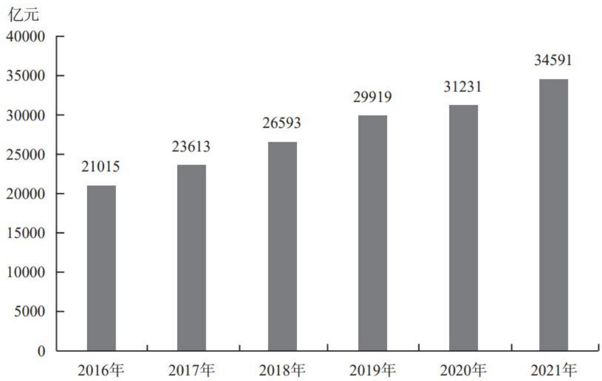  
中国母婴商品消费规模

2021年中国母婴商品消费品类构成  

<table><tr><td>种类</td><td>占比(%)</td></tr><tr><td>保健品</td><td>4.5</td></tr><tr><td>玩具</td><td>4.8</td></tr><tr><td>喂养及床具</td><td>5.1</td></tr><tr><td>洗护用品</td><td>6.9</td></tr><tr><td>辅食</td><td>9.3</td></tr></table>

续表  

<table><tr><td>种类</td><td>占比(%)</td></tr><tr><td>纸尿裤</td><td>12.1</td></tr><tr><td>奶粉</td><td>22.7</td></tr><tr><td>服装鞋帽</td><td>26.0</td></tr><tr><td>其他</td><td>8.6</td></tr></table>

【例4】（2023联考）2021年，我国消费最多的母婴商品金额约为：

A. 9638 亿元

B.8994亿元

C. 7852 亿元

D. 4186 亿元

【解析】4. 问题时间与材料时间一致，柱形图是中国母婴商品消费规模，消费最多的要找占比最大的，不要想当然，要以数据为准，占比最大的是服装鞋帽，所求=总体*比重=34591*26%，选项差距大，26%非常接近25%=1/4，误差很小，原式≈34591*(1/4)=34591/4=8600+，选择最接近的一项，对应B项。【选B】

【注意】尾数法是在多位数的加紧运算，且选项和材料精度一致时，可以用尾数法，所有的乘除法，都是四舍五入以后的结果，34591*0.26的标准答案是小数点后两位，选项是个位。

【变形上难度】（2023联考）2021年，我国消费最多的母婴商品金额约为：

A. 8648 亿元

B.8994亿元

C. 8852 亿元

D.8786亿元

【解析】拓展.数据和题干不变，选项改变。乘法计算考查很少，一般只有在计算部分量时才会出现，把数据进行拆分，拆分为两个好算的百分数， $26\% = 25\% +1\%$  ，原式  $= 34591*(1 / 4) + 34591*1\% = 8600^{+} + 345.91 = 8900^{+}$  ，对应B项。【选B】

# 【注意】

# 1. 乘法的计算：

(1) 选项差距大时, 近似取整估算。  
(2) 选项差距小时, 拆分 (拆成两个数加减的形式), 变成加减的形式, 再计算。  
(3) 注意: 乘除法都是四舍五入之后的结果, 不能用尾数法。

2.35000*15.  $3\% = 35000*(14.3\% +1\%)\approx 35000*(1 / 7) + 350 = 5000 + 350 = 5350$

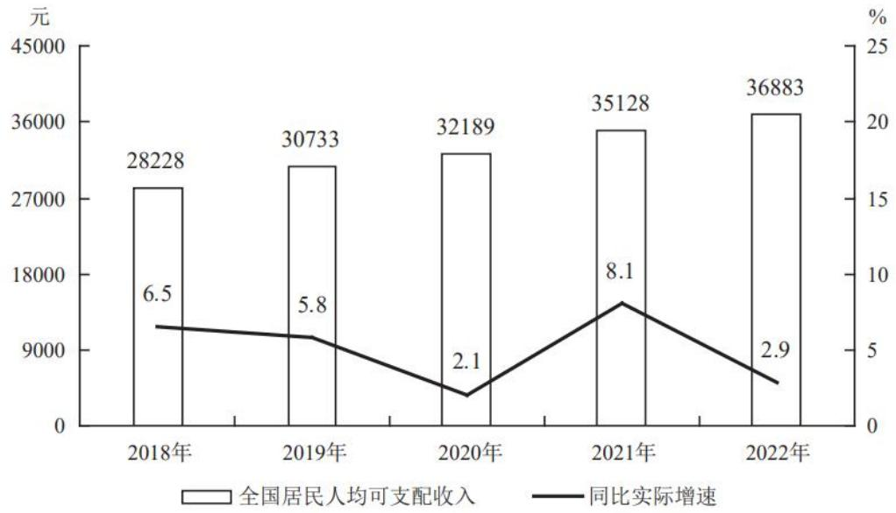  
图12018—2022年全国居民人均可支配收入及同比实际增速

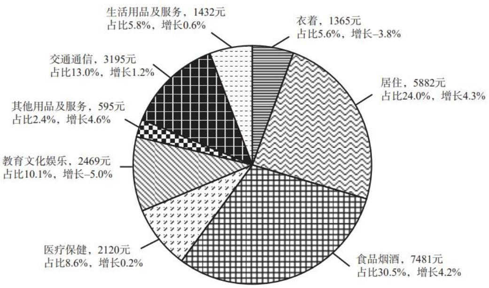  
图2 2022年全国居民人均消费支出

【例5】（2024深圳）2022年，全国居民人均消费支出约占全国居民人均可支配收入的：

A.  $50\%$

B.  $55\%$

C.  $60\%$

D.  $67\%$

【解析】5. 现期时间，收入对应柱状图为 36883，消费支出对应柱形图，有同学会将数据全都加和，利用多位数的加减运算，高算低看，人均消费支出蕴含了比重的概念，都给出占比，相当于给出每一类消费以及占总消费的比重，要求

总消费，所求=某一类数据/所占比重，挑占比最好算的一组数，教育文化娱乐最好算，总量≈2469/10%=24690，所求=24690/36883，结合选项，首位商不到7，但差一点商7，对应D项。【选D】

# 【注意】梳理：

1. 题型：2022年+占——现期比重。  
2. 公式：比重  $=$  部分/总体  $=$  支出/收入。  
3. 计算：支出  $=$  某一类支出/所占比重，挑最好算的教育文化。  
4. 支出  $= 2469 / 10.1\% \approx 24690$  ，占比  $= 24690 / 36883$  ，接近商7，选D项。  
5. 若数字敏感度够高，24690/36883≈2/3≈66.6%。

2022年中国锂电池出货量658GWh，同比增长  $101.1\%$  。2022年中国动力锂电池装车量达294.6GWh，同比增长  $90.7\%$  ，高于全球同比增速18.9个百分点，占全球动力锂电池装车量的  $56.9\%$  。

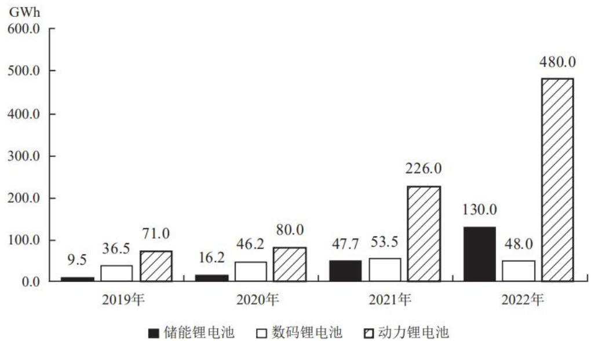  
2019—2022年中国锂电池出货量

【例 6】(2024 联考) 以下饼图中, 最能准确反映 2022 年中国锂电池出货量中, 储能锂电池、数码锂电池和动力锂电池占比关系的是 (黑色: 储能锂电池; 白色: 数码锂电池; 斜杠: 动力锂电池):

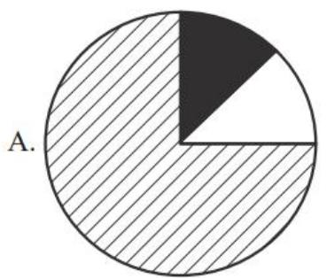

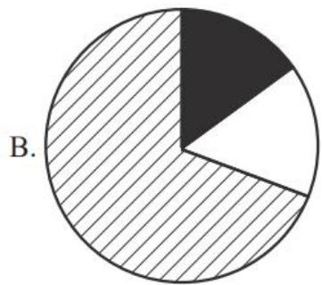

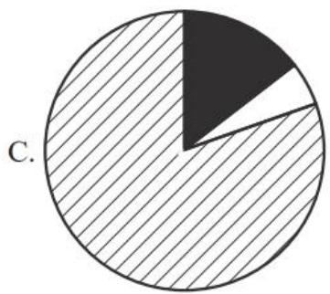

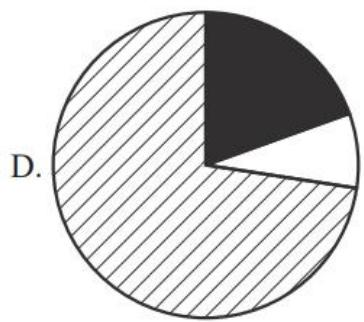

【解析】6. 问题时间为 2022 年, 材料时间为 2022 年, “2022 年中国锂电池出货量 658GWh”, 观察数据, 白色 (数码锂电池) 最小, 排除 A、B 项; 观察 C、D 项的区别, C 项: 黑 + 白 < 1/4, D 项: 黑 + 白 > 1/4, 总量 * 1/4 = 658 * 1/4 = 160+, 黑色 + 白色 = 130 + 48 = 178 > 160 , 故黑色 + 白色的占比超过 1/4 , 对应的角度超过  $90^{\circ}$ , 对应 D 项。【选 D】

# 【注意】

1. 饼状图核心是看“1/4”，在一个饼状图中“1/4”的特点是  $90^{\circ}$ ，对应一个直角。  
2. 看倍数,  $480 / 3 = 160$ ,  $480 / 160 = 3 / 1$ , 则对应一个是  $90^{\circ}$ , 另一个是  $270^{\circ}$ , 但剩下的部分为  $130 + 48 = 178 > 160$ , 故占比要大于  $1 / 4$  。

分领域看，2020年，软件产品实现收入22758亿元，同比增长  $10.1\%$  ；其中，工业软件产品实现收入1974亿元，增长  $11.2\%$  。信息技术服务实现收入49868亿元，比上年同期增加6579亿元；其中，电子商务平台技术服务收入9095亿元，同比增长  $10.5\%$  ；云服务、大数据服务共实现收入4116亿元，同比增长  $11.1\%$  。信息安全产品和服务实现收入1540亿元，同比增长  $10.0\%$  ，增速较上年回落2.4个百分点。嵌入式系统软件实现收入7492亿元，比上年同期增加803亿元，增速较上年提高4.2个百分点。

【例7】（2023四川）以下饼图中，最能准确反映2020年信息技术服务实现收入中，电子商务平台技术服务收入（黑色），云服务、大数据服务收入（竖线）和其他收入（白色）占比关系的是：

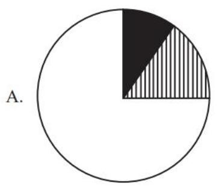

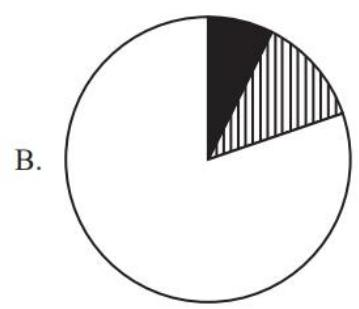

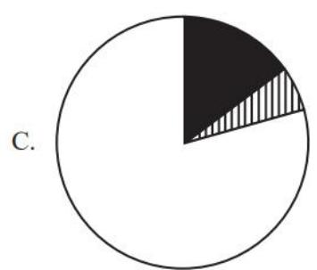

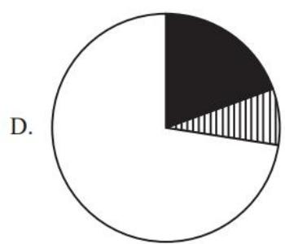

【解析】7. 问题时间与材料时间一致，总量为信息技术实现收入  $= 49868$ ，“电子商务平台技术服务收入9095亿元……云服务、大数据服务共实现收入4116亿元”， $9095 > 4116 \rightarrow$  黑色  $\rightharpoondown$  竖线，排除A、B项；看C、D项的区别，区别在于1/4。总量 $*1 / 4 \approx 50000 * 1 / 4 = 12500$ 亿，黑色+竖线  $= 9095 + 4116 \approx 13000 > 12500 \rightarrow$  黑色+竖线  $>1 / 4$ ，对应D项。【选D】

2022年，规模以上工业企业中，分行业看：采矿业实现利润总额15573.6亿元，同比增长  $48.6\%$  ；制造业实现利润总额64150.2亿元，同比下降  $13.4\%$  ；电力、热力、燃气及水生产和供应业实现利润总额4314.7亿元，同比增长  $41.8\%$  。

2022年，在41个工业大类行业中，利润总额由高到低的前十个行业的利润情况如下：煤炭开采和洗选业实现利润总额10202亿元，同比增长  $44.3\%$  ；计算机、通信和其他电子设备制造业实现利润总额7389.5亿元，同比下降  $13.1\%$  ；化学原料和化学制品制造业实现利润总额7302.6亿元，同比下降  $8.7\%$  ；电气机械和器材制造业实现利润总额5915.6亿元，同比增长  $31.2\%$  ；汽车制造业实现利润总额5319.6亿元，同比增长  $0.6\%$  ；非金属矿物制品业实现利润总额4759亿元，同比下降  $15.5\%$  ；医药制造业实现利润总额4288.7亿元，同比下降  $31.8\%$

石油和天然气开采业实现利润总额3545亿元，同比增长  $109.8\%$  ；通用设备制造业实现利润总额3250.3亿元，同比增长  $0.4\%$  ；电力、热力生产和供应业实现利润总额3154亿元，同比增长  $86.3\%$  。

【例1】（2023联考）2021年，石油和天然气开采业利润总额占采矿业利润总额的：

A.不足  $10\%$

B.  $10\% \sim 20\%$  之间

C.  $20\% \sim 30\%$  之间

D.  $30\%$  以上

【解析】1. 方法一：问题时间为2021年，材料时间为2022年，求去年，定位材料找数据，“石油和天然气开采业实现利润总额3545亿元，同比增长  $109.8\%$  ”在没有学习方法和公式之前，会用现期/（1+r）计算，采矿业利润总额：15573/  $(1 + 48.6\%)\approx 15573 / 1.5\approx 10000$  ，石油和天然气开采利润总额：3545/（1+109.8%） $\approx 3545 / 2.1\approx 1700$  ，  $1700 / 10000\approx 17\%$  ，选择B项。

方法二：套公式分析，石油和天然气开采业利润总额  $\rightarrow$  A、a，采矿业利润总额  $\rightarrow$  B、b，代入数据，所求  $\approx 3545 / 15573 * \left[ \left( 1 + 49\% \right) / \left( 1 + 110\% \right) \right]$ ，3545/15573首位商2，结果为  $20^{+}$ ，对应C项，说明C项对应现期陷阱，排除C项；再看右边， $(1 + 49\%) / (1 + 110\%) = 1.49 / 2.1 < 1$ ，C项 $*1^{-} < C$ 项，对应B项。【选B】

传统思维：分别计算基期，再算比重，需要除3次，计算量大

分析思维：套公式A/B*[（1+b）/（1+a）]，立足现期的结果，看右边结合选项分析基期的答案

# 【注意】

1. 这种计算方法要做 3 次除法, 整个过程很麻烦, 且计算量大, 本题计算的比较快是因为数据设计的很巧妙, 若所有的基期比重都做三次除法, 会很麻烦。  
2. 如果拿不准可以看右边， $(1 + 49\%) / (1 + 110\%) \approx 1.5 / 2.1 = 0.7, 20\% * 0.7 = 10\%$  对应B项。

# 二、基期比重

识别：求去年，出现“占”

公式：A/B*[（1+b）/（1+a）]

A：分子的现期量（部分）

B：分母的现期量（总体）

a: 分子的增长率

b：分母的增长率

推导了解即可，不耽误做题

例：2021年小张收入A万，较上年增速为a；家庭收入B万，较上年增速为b。

求：2020年小张收入占家庭的比重为：

例：2024年全国GDP120万亿，同比增长  $5\%$

其中，湖北GDP6万亿，同比增长  $8\%$

求：2023年湖北GDP占全国的比重？

A.  $4.86\%$

B.  $5\%$

C.  $5.2\%$

D.  $6\%$

速算: 先算左边  $\mathrm{A} / \mathrm{B}$ , 再看右边  $(1 + \mathrm{b}) / (1 + \mathrm{a})$ , 结合选项分析

【注意】基期比重：

1. 识别：求去年，出现“占”。  
2. 公式：A/B*[（1+b）/（1+a）]，A：分子的现期量（部分），B：分母的现期量（总体），a：分子的增长率，b：分母的增长率。  
3. 推导（推导了解即可，不耽误做题）：2021年小张收入A万，较上年增速为a；家庭收入B万，较上年增速为b，求：2020年小张收入占家庭的比重为：

答：给2021年，求2020年，问占比，基期比重问题，所求=小张（A、a）/家庭总收入（B、b），2020年小张=A/(1+a)，2020年家庭=B/(1+b)。比重=部分/总体=A/(1+a)÷[B/(1+b)]=A/(1+a)*(1+b)/B=A/B*[（1+b)/(1+a)]。

4. 例：2024年全国GDP120万亿，同比增长  $5\%$  ，其中，湖北GDP6万亿，同比增长  $8\%$  。

求：2023年湖北GDP占全国的比重？

A.  $4.86\%$

B.  $5\%$

C.  $5.2\%$

D.  $6\%$

答：给 2024 年，求 2023 年，基期比重，套公式，比重  $=$  湖北（A、a）/全国（B、b），代入公式，所求  $= 6 / 120 * (1 + 5\%) / (1 + 8\%)$ ，选项差距很小，无法精确计算，所有复杂的基期类计算都有分析的方法，在第二节课讲解基期和差时，讲

过排除的思维，先找现期差值，所有复杂的基期计算，都是先找现期，可以帮助排除易错项，同时可以在现期的基础上，再分析变大或变小，找到答案的范围；本题求基期比重，考场上容易忽略时间，错算现期比重，先算左边的现期比重，A/B=6/120=5%，对应B项（现期坑），看右边的分数与1的大小关系， $(1 + 5\%)$  /  $(1 + 8\%) = 1.05 / 1.08$ ， $1.05 < 1.08$ ，故  $(1 + 5\%)$  /  $(1 + 8\%) < 1$ ， $5\%$ * $1^{-} < 5\%$ ，对应A项。

5. 速算: 先算左边  $\mathrm{A} / \mathrm{B}$ , 再看右边  $(1 + \mathrm{b}) / (1 + \mathrm{a})$ , 结合选项分析。

2018年  $1\sim 10$  月份，全国房地产开发投资99325亿元，同比增长  $9.7\%$  ，增速比1-9月份回落0.2个百分点。其中，住宅投资70370亿元，增长  $13.7\%$  ，增速回落0.3个百分点。住宅投资占房地产开发投资的比重为  $70.8\%$  。

【练习】（2019青海）2017年  $1\sim 10$  月，住宅投资占房地产开发投资的比重约为：

A.  $68.4\%$

B.  $70.8\%$

C.  $72.8\%$

D.  $73.4\%$

【解析】拓展. 给 2018 年, 求 2017 年, 问比重, 为基期比重问题, 比重=住宅 (A、a) / 房地产 (B、b), 定位材料找数据, 代入数据, 所求  $= 70370 / 99352 * \left[ \left( 1 + 9.7\% \right) / \left( 1 + 13.7\% \right) \right]$ , 先分析现期 “坑”,  $70.8\%$  对应现期比重, 若没有注意时间会错选, 且题目中直接给出 “住宅投资占房地产开发投资的比重为  $70.8\%$ ”, 无需计算,  $9.7\% < 13.7\%, (1 + 9.7\%) / (1 + 13.7\%) < 1, 70.8\% * 1^{-}< 70.8\%$ , 对应 A 项。【选 A】

分析思维：套公式  $\mathrm{A} / \mathrm{B} * \left[ \left(1 + \mathrm{b}\right) / \left(1 + \mathrm{a}\right) \right]$ ，算左边，看右边，选答案

2021年专利授权和有效专利情况  

<table><tr><td>指标</td><td>专利数(万件)</td><td>同比增长(%)</td></tr><tr><td>专利授权数</td><td>460.1</td><td>26.4</td></tr><tr><td>其中:境内专利授权</td><td>445.1</td><td>27.0</td></tr><tr><td>其中:发明专利授权</td><td>69.6</td><td>31.3</td></tr><tr><td>其中:境内发明专利</td><td>57.8</td><td>33.2</td></tr><tr><td>年末有效专利数</td><td>1542.1</td><td>26.5</td></tr><tr><td>其中:境内有效专利</td><td>1429.5</td><td>28.6</td></tr><tr><td>其中:有效发明专利</td><td>359.7</td><td>17.6</td></tr><tr><td>其中:境内有效发明专利</td><td>270.4</td><td>22.2</td></tr></table>

【例2】（2023联考）2020年，境内发明专利占专利授权数的比重为：

A.  $11.9\%$

B.  $12.6\%$

C.  $13.5\%$

D.  $14.3\%$

【解析】2. 选项差距小，若都截三位会很难计算，可以算左边，看右边，时间为2020年，材料时间为2021年，比重=境内发明专利（A、a）/专利授权数（B、b），代入公式，57.8/460.1*[（1+26.4%）/（1+33.2%）]，没给现期比重，需要老老实实算，578/460，首位商1，次位商2，对应B项（12.6%），即现期比重为12.6%，26.4%<33.2%，故（1+26.4%）/（1+33.2%）<1，12.6%*1<12.6%，对应A项。【选A】

分析思维：算左边，立足现期的结果；看右边，结合选项分析基期的答案

2021年专利授权和有效专利情况  

<table><tr><td>指标</td><td>专利数(万件)</td><td>同比增长(%)</td></tr><tr><td>专利授权数</td><td>460.1</td><td>26.4</td></tr><tr><td>其中:境内专利授权</td><td>445.1</td><td>27.0</td></tr><tr><td>其中:发明专利授权</td><td>69.6</td><td>31.3</td></tr><tr><td>其中:境内发明专利</td><td>57.8</td><td>33.2</td></tr></table>

【拓展拔高】（2023联考）2020年，境内发明专利占专利授权数的比重为：

A.  $11.9\%$

B.  $12.6\%$

C.  $12.3\%$

D.  $11.5\%$

【解析】拓展. 基期比重  $= \mathrm{A} / \mathrm{B} * \left[ (1 + \mathrm{b}) / (1 + \mathrm{a}) \right] = 57.8 / 460 * \left[ (1 + 26.4\%) / \right.$

$(1 + 33.2\%) = 12.6\% * 1^{-} < 12.6\%, \mathrm{A}, \mathrm{C}, \mathrm{D}$  项都满足，此时运用等比例放缩（修正）。截三位计算，分子  $+7$  或者分母-7。

方法一：分子  $+7,460 / 126 = 4$  ，原式转化为  $578 / 460*(126 / 133)\approx 578 / (460 + 26)$ $\ast [(126 + 7) / 133] = 578 / 486\rightarrow 119$  ，选择A项。

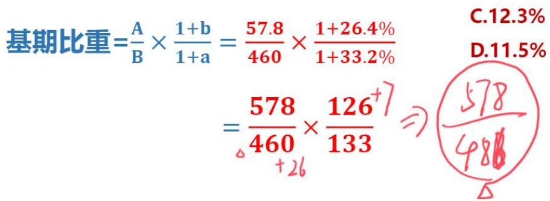

方法二：最后的计算要看左边，分母460只有两位数字，如果变460会变得不好计算，分母-7， $578 / 133 = 4^{+}$ ， $578 / 460 * (126 / 133) \approx (578 - 30) / 460 * [126 / (133 - 7)] = 548 / 460 \rightarrow 119$ ，选择A项。【选A】

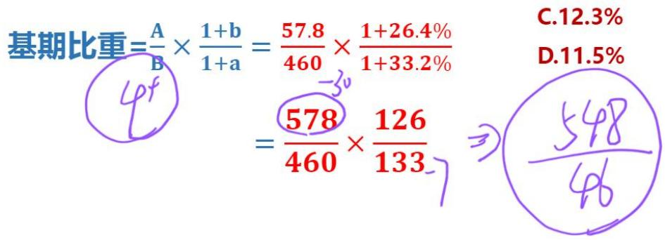

【注意】满足你的万一，如果分析都搞不定了；或者你觉得分析拿不准，那么如何计算呢？别怕，等比例放缩（修正）可以解决。

速算技巧补充：等比例放缩（修正）

观察分子和分母的倍数，加上或减去相同倍数的数字，该分数结果不变M/N，若  $\mathrm{M} = 3\mathrm{N}$  ，则M（3N）/N=3N/N

分子是分母的3倍，分母  $+1$  ，分子就要  $+3$  ；分母-1，分子就要-3。结果不变

【注意】速算技巧补充：等比例放缩（修正）。

1. 观察分子和分母的倍数，加上或减去相同倍数的数字，该分数结果不变。  
2. M/N，若  $M = 3N$  ，则  $\mathrm{M} / \mathrm{N} = 3\mathrm{N} / \mathrm{N}$  。分子是分母的3倍，分母  $+1$  ，分子就要  $+3$  分母-1，分子就要-3。结果不变。验证：（  $3\mathrm{N} + 3$  ）/（  $(\mathrm{N} + 1) = 3(\mathrm{N} + 1) / (\mathrm{N} + 1) = 3$

$$
(3 N - 3) / (N - 1) = 3 (N - 1) / (N - 1) = 3 。
$$

3. 例：1/2，分子是分母的2倍，分子+1，分母就要+2， $1 / 2 = (1 + 1) / (2 + 2) = 2 / 4 = 1 / 2$ ，结果不变。

速算技巧补充：等比例放缩（修正）

什么时候用：选项差距小的基期类计算

为什么？选项差距大：截两位，直接除最简单

怎么用：观察分子和分母的倍数，加上或减去相同倍数的数字，该分数结果不变

资料2的例3：673/（1+6.96%）≈673/107

A. 600 亿立方米

B.620亿立方米

C. 630 亿立方米

D. 724 亿立方米

【注意】速算技巧补充：等比例放缩（修正）。

1. 什么时候用：选项差距小的基期类计算。  
2. 为什么？选项差距大：截两位，直接除最简单，用技巧反而更复杂。  
3.怎么用：观察分子和分母的倍数，加上或减去相同倍数的数字，该分数结果不变。  
4. 资料 2 的例 3: 673/ (1+6.96%) ≈ 673/107

A. 600亿立方米

B. 620 亿立方米

C. 630 亿立方米

D. 724 亿立方米

答：选项差距小，截三位，原式转化为673/107，直接除比较麻烦，利用等比例放缩，分母变成100时最好计算， $107 \rightarrow 100$ 需要-7，分子约是分母的6倍，等比例放缩，分母-7，分子就要-42，原式 $\approx$ （673-42）/（107-7）=631/100→631，对应C项。

5. 资料分析中，动的数据越大，误差越大，如果用  $107 - 100 = 7$  ，要严谨计算出分子和分母的倍数关系，否则很危险。一般把分母变成好除的数字，107 只减 7，分子-42，此时的误差可以忽略不计。如果用  $107 - 106$  ，106 的 6 倍  $\rightarrow 636$  ，106 的 6.1 倍  $\rightarrow 646.6$  ，如果分母动的很大，需要精准计算，属于为难自己，所以动的越少越好。

等比例放缩（修正）在基期比重中的运用

【例】57.9/163*[（1+19.2%）/(1+17.3%)] ≈

A.  $35.4\%$

B.  $36.1\%$

C.  $36.7\%$

D.  $37.2\%$

具体操作：让后面（1+b）/（1+a）约掉，交叉着看倍数，怎么好算怎么来

【注意】等比例放缩（修正）在基期比重中的运用：

1. 例：57.9/163*[（1+19.2%）/(1+17.3%)] ≈

A.  $35.4\%$

B.  $36.1\%$

C.  $36.7\%$

D.  $37.2\%$

答：选项差距很小，算左边，看右边， $35. \mathrm{x\%} * 1^{+} > 35. \mathrm{x\%}$ ，无法排除选项。截三位计算，原式转化为  $579 / 163* (119 / 117)$ ，考虑等比例放缩， $(1 + b) / (1 + a)$  很接近，让后面  $(1 + b) / (1 + a)$  约掉，分子-2或者分母+2，交叉看倍数，163约是119的1.5倍， $579 / 163* (119 / 117) \approx 579 / (163 - 3)* [(119 - 2) / 117] = 579 / 160* (117 / 117) = 579 / 160 \rightarrow 362$ ，对应B项。

2. 具体操作：让后面（1+b）/（1+a）约掉，交叉着看倍数，怎么好算怎么来。

2022年交通固定资产投资额及同比增长率  

<table><tr><td></td><td>交通固定资产投资额(亿元)</td><td>同比增长率 (%)</td></tr><tr><td>铁路</td><td>7109</td><td>-5.1</td></tr><tr><td>公路</td><td>28527</td><td>9.7</td></tr><tr><td>其中:高速公路</td><td>16262</td><td>7.3</td></tr><tr><td>普通国省道</td><td>5973</td><td>6.5</td></tr><tr><td>农村公路</td><td>4733</td><td>15.6</td></tr><tr><td>水路</td><td>1679</td><td>10.9</td></tr><tr><td>其中:内河建设</td><td>867</td><td>16.7</td></tr><tr><td>沿海建设</td><td>794</td><td>9.9</td></tr><tr><td>民航</td><td>1231</td><td>0.7</td></tr></table>

【例3】（2024黑龙江）2021年农村公路交通固定资产投资额占公路交通固定资产投资额的比重为：

A.  $15.7\%$

B.  $16.5\%$

C.  $17.4\%$

D.  $19.5\%$

【解析】3. 问题时间为 2021 年, 材料时间为 2022 年, 求去年农村占公路比重, 比重  $=$  农村 (A、a) / 公路 (B、b), 对应材料找数据, 代入公式: 基期比重  $= \mathrm{A} / \mathrm{B} * \left[ \left(1 + \mathrm{b}\right) / \left(1 + \mathrm{a}\right) \right] = 4733 / 28527 * \left[ \left(1 + 9.7\%\right) / \left(1 + 15.6\%\right) \right]$  。

方法一：分析思维。选项差距小，截三位计算，先算左边：  $4733 / 285 = 16.6$  对应B项；看右边：  $(1 + 9.7\%)$  /  $(1 + 15.6\%) = 1^{-}$  ，所求  $= 16.6\% *1^{-} <   16.6\%$  ，选择A项。

方法二：等比例放缩。截三位，原式转化为  $473 / 285* (110 / 116)$ ，分子  $+6$ ， $285 / 110 = 2^{+}$ ， $473 / 285* (110 / 116) \approx 473 / (285 + 15)* [(110 + 6) / 116] = 473 / 300 \rightarrow 157$ ，选择A项。【选A】

# 【注意】

1. 分析思维：算左边，看右边，结合选项选答案。  
2. 计算思维：等比例放缩（修正），把后面分子、分母变相同，约掉。

基期比重

识别：求去年的比重

公式：A/B*[（1+b）/（1+a）]

A：分子的现期量（部分）

B：分母的现期量（总体）

a: 分子的增长率

b：分母的增长率

方法:

分析的思维：算左边的现期比重 A/B，再看右边  $(1 + b) / (1 + a)$  与 1 的大小关系，判断基期比重的范围，选答案

计算的思维：范围搞不定，选项差距小截三位之后太难算，等比例放缩之后把后面约掉

注意：绝大多数题目靠分析就足够了，不要总想着去算答案，实在分析不出来才去计算

【注意】基期比重：

1. 识别：求去年的比重。

2. 公式：A/B*[（1+b）/（1+a）]。A：分子的现期量（部分）；B：分母的现期量（总体）；a：分子的增长率；b：分母的增长率。  
3. 方法：

(1) 分析的思维: 算左边的现期比重 A/B, 再看右边  $(1 + b) / (1 + a)$  与 1 的大小关系, 判断基期比重的范围, 选答案。  
(2) 计算的思维: 范围搞不定, 选项差距小截三位之后太难算, 等比例放缩之后把后面约掉。

4. 注意：绝大多数题目靠分析就足够了，不要总想着去算答案，实在分析不出来才去计算。

# 三、两期比重

考法一：升降判断

识别：今年比去年+比重+升降

例：2021 年, 小马收入占家庭总收入的比重与去年相比:

A. 提高

B. 降低

C. 不变

【注意】两期比重考法一：升降判断。

1. 识别：今年比去年+比重+升降。  
2. 例：2021 年,小马收入占家庭总收入的比重与去年相比：

A. 提高

B. 降低

C. 不变

答：2021年是现期比重，去年是基期比重，问现期比重比基期比重高还是低，判断两期比重的升降。

两期比重的升降判断结论推导

现期比重=A/B

基期比重=A/B*[（1+b）/（1+a）]

当  $a > b$  时， $(1 + b) / (1 + a) < 1$ ，则  $A / B * [(1 + b) / (1 + a)]$ $(1 - ) < A / B$ ，可得现期比重  $>$  基期比重

当  $a < b$  时， $(1 + b) / (1 + a) > 1$ ，则  $A / B*[ (1 + b) / (1 + a)] (1+) > A / B,$  可得现期比重  $<$  基期比重

当  $a = b$  时， $(1 + b) / (1 + a) = 1$ ，则  $A / B*[ (1 + b) / (1 + a)]$ （ $1) = A / B$ ，可得现期比重=基期比重

【注意】两期比重的升降判断结论推导：

1. 例：中国和全世界是部分和整体的关系，中国的增速为 a，全世界的增速为 b，现在中国是世界第二大经济体，仅次于美国，但是  $10 \sim 20$  年之前，中国不是第二大经济体，改革开放之后才逐渐提升的，中国的经济地位越来越高，疫情之前我国 GDP 每年平均增长率为  $8\%$  ，全世界 GDP 的平均增长率为  $2\%$  左右，因为中国的增长率远超世界增长的平均水平，所以我国的经济地位/占比一直在提升。

2. 结论： $a > b$ ，比重上升； $a < b$ ，比重下降； $a = b$ ，比重不变。  
3.推导：

（1）当  $a > b$  时， $(1 + b) / (1 + a) < 1$ ，如  $a = 10\%$ 、 $b = 5\%$ ， $(1 + 5\%) / (1 + 10\%) = 1.05 / 1.1 = 1^{-}$ ，则  $\mathrm{A} / \mathrm{B}*[1 + \mathrm{b}) / (1 + \mathrm{a})]$ $(1^{-}) < \mathrm{A} / \mathrm{B}$ ，可得现期比重  $>$  基期比重  $\rightarrow$  比重上升。  
（2）当  $a < b$  时， $(1 + b) / (1 + a) > 1$ ，则  $\mathrm{A} / \mathrm{B} * \left[ \frac{(1 + b)}{(1 + a)} \right] (1^{+}) > \mathrm{A} / \mathrm{B}$ ，可得现期比重  $<$  基期比重  $\rightarrow$  比重下降。  
（3）当  $a = b$  时， $(1 + b) / (1 + a) = 1$ ，则  $A / B * [(1 + b) / (1 + a)]$  （ $1$ ） $= A / B$ ，可得现期比重  $=$  基期比重  $\rightarrow$  比重不变。

# 三、两期比重

考法一：升降判断

识别：今年比去年+比重+升降

判断方法：

a>b，比重比去年上升；

a  $<$  b，比重比去年下降；

a=b，比重不变。

a: 分子的增长率 b: 分母的增长率

比较时需带正负号比较

练习：2019年总收入10万元，同比增长  $10\%$  。工资收入8万，同比增长  $5\%$  则2019年工资收入占总收入的比重比上年上升还是下降？

【注意】两期比重考法一：升降判断。

1. 识别：今年比去年+比重+升降。  
2. 判断方法：找部分的增速 a、整体的增速 b，比较大小。

(1)  $a > b$ , 比重比去年上升。  
(2)  $a < b$ , 比重比去年下降。  
(3)  $a = b$ , 比重不变。  
(4) a: 分子的增长率, b: 分母的增长率。比较时需带正负号比较。

3. 练习：2019年总收入10万元，同比增长  $10\%$  。工资收入8万，同比增长 $5\%$  。则2019年工资收入占总收入的比重比上年上升还是下降？

答：两期比重的升降判断，比重  $=$  工资（a）/总收入（b），a  $(5\%)$ $<  b$  （  $10\%$  ），比重下降。

2023年，我国互联网企业完成互联网业务收入17483亿元，同比增长  $6.8\%$  。实现利润总额1295亿元，同比增长  $0.5\%$  。共投入研发经费943.2亿元，同比下降  $3.7\%$  。

2023年，东部地区互联网企业完成互联网业务收入15608亿元，同比增长 $7.3\%$ ；中部地区互联网企业完成互联网业务收入781.6亿元，同比增长  $8.1\%$ ；西部地区互联网企业完成互联网业务收入1054亿元，同比增长  $0.2\%$ ；东北地区互联网企业完成互联网业务收入39.4亿元，同比下降  $25.1\%$ 。

【例1】（2025天津）根据资料，判断“2023年，西部地区互联网企业完成互联网业务收入占全国比重高于上年水平”这一说法是否正确。

A. 正确

B. 错误

【解析】1. 比重  $+$  高于上年，两期比重升降判断。比重  $=$  西部（a）/全国（b），根据材料找数据，西部增速  $a = 0.2\%$  ，全国增速  $b = 6.8\%$  ， $a < b$  ，比重下降，说法错误。【选B】

2022年，全球对外直接投资流量1.5万亿美元，比上年下降  $14\%$  。其中发达经济体对外直接投资1.03万亿美元，比上年下降  $17.2\%$  ；发展中经济体对外直接投资4589亿美元，比上年下降  $5.4\%$  。

【例2】（2024广东）根据资料，判断“2022年，发展中经济体对外直接投资流量在全球的占比同比有所下降”这一说法是否正确。

A. 正确

B. 错误

【解析】2. 占比+同比（与上年相比）+下降，两期比重升降判断。比重=发展中经济体（a）/全球（b），根据材料找数据，a  $(-5.4\%)$  > b  $(-14\%)$ ，负得越小值越大，比重上升，说法错误。【选B】

据对全国6.4万家规模以上文化及相关产业企业调查，2021年前三季度，上述企业实现营业收入84205亿元，按可比口径计算，同比增长  $21.8\%$  ；两年平均增长  $10.0\%$  。

分行业类别营业收入情况：新闻信息服务9847亿元，同比增长  $22.1\%$  ；内容创作生产17693亿元，同比增长  $18.6\%$  ；创意设计服务13787亿元，同比增长 $24.0\%$  ；文化传播渠道9309亿元，同比增长  $30.1\%$  ；文化投资运营359亿元，同比增长  $13.8\%$  ；文化娱乐休闲服务916亿元，同比增长  $35.3\%$  ；文化辅助生产和中介服务11441亿元，同比增长  $18.3\%$  ；文化装备生产4880亿元，同比增长  $17.8\%$  ；文化消费终端生产15974亿元，同比增长  $22.0\%$  。

【例3】（2023联考）与上一年相比，2021年前三季度分行业类别中，占全国6.4万家规模以上文化及相关产业企业营业总收入比重增加的行业个数是：

A. 3 个

B. 4 个

C. 5 个

D. 6 个

【解析】3. 比上年比重增加  $\rightarrow \mathrm{a} > \mathrm{b}$  。各个行业增速为 a，全国增速为 b，“全国……同比增长  $21.8\%$ ”  $\rightarrow \mathrm{b} = 21.8\%$  ，找各行业增速大于 b（ $21.8\%$ ）的有几个，新闻（ $22.1\%$ ）、创意（ $24.0\%$ ）、文化传播（ $30.1\%$ ）、文化娱乐（ $35.3\%$ ）、文化消费（ $22.0\%$ ）共 5 个，对应 C 项。【选 C】

分行业类别营业收入情况：新闻信息服务9847亿元，同比增长22.1%；内容创作生产17693亿元，同比增长13.6%；创意设计服务13787亿元，同比增长24.0%；文化传播渠道9309亿元，同比增长30.1%；文化投资运营359亿元，同比增长13.8%；文化娱乐休闲服务916亿元，同比增长35.3%；文化辅助生产和中介服务11441亿元，同比增长18.3%；文化装备生产4880亿元，同比增长17.8%；文化消费终端生产15974亿元，同比增长22.0%。

2019年，我国电信业务收入完成1.31万亿元，比上年增长  $0.8\%$  。其中：固定数据及互联网业务收入完成2175亿元，比上年增长  $5.1\%$  ；移动数据及互联网业务收入6082亿元，比上年增长  $1.5\%$  ；固定增值业务收入1371亿元，比上年增长  $21.2\%$  ，其中，IPTV（网络电视）业务收入294亿元，比上年增长  $21.1\%$  ；物联网业务收入比上年增长  $25.5\%$  。

【练习】（2021四川）下列指标中，2019年的数值高于2018年的有几项？

(1)固定数据及互联网业务收入占电信业务收入比重  
②移动数据及互联网业务收入占电信业务收入比重  
(3) IPTV 业务收入占固定增值业务收入比重

A. 0

B. 1

C. 2

D. 3

【解析】拓展.2019年的数值（比重）高于2018年  $\rightarrow \mathrm{a} > \mathrm{b}$  。

①比重=固定数据（a）/电信业务（b），根据材料可知，固定数据  $a = 5.1\% >$  电信业务  $b = 0.8\%$ ，比重上升，符合。  
②比重=移动数据（a）/电信业务（b），根据材料可知，移动数据  $a = 1.5\% >$  电信业务  $b = 0.8\%$ ，比重上升，符合。  
③比重=IPTV业务(a)/固定增值业务(b)，根据材料可知，IPTV业务a=21.1% <固定增值业务b=21.2%，比重下降，不符合。

综上，共有2个满足，对应C项。【选C】

# 三、两期比重

考法二：差值计算

识别：今年比去年+比重+升降+多少个百分点

例：2021年，小马收入占家庭总收入的比重与去年相比：

A. 提高 3 个百分点

B. 降低 4 个百分点

【注意】两期比重考法二：差值计算。

1. 识别：今年比去年+比重+升降+多少个百分点。  
2. 比如 2019 年占比为  $50\%$  ，2018 年占比为  $40\%$  ，则 2019 年比 2018 年提高了 10 个百分点。做题时肯定不会给出现期比重和基期比重，需要记住公式。

举例证明结论

公式：现期比重- 基期比重=A/B-A/B*[（1+b）/（1+a）]=A/B*[（a-b）/（1+a）]

假设：

现期比重  $\mathrm{A} / \mathrm{B} =$

部分量增速  $a =$

【注意】举例证明结论：

1. 公式：现期比重- 基期比重  $= \mathrm{A} / \mathrm{B} - \mathrm{A} / \mathrm{B} * \left[ (1 + \mathrm{b}) / (1 + \mathrm{a}) \right] = \mathrm{A} / \mathrm{B} * [1 - (1 + \mathrm{b}) / (1 + \mathrm{a})] = \mathrm{A} / \mathrm{B} * \left\{\left[ 1 + \mathrm{a} - (1 + \mathrm{b}) \right] / (1 + \mathrm{a}) \right\} = \mathrm{A} / \mathrm{B} * \left[ (\mathrm{a} - \mathrm{b}) / (1 + \mathrm{a}) \right]$ 。

公式：现期比重 - 基期比重  $= \frac{\mathrm{A}}{\mathrm{B}} - \frac{\mathrm{A}}{\mathrm{B}} \times  \frac{1 + \mathrm{b}}{1 + \mathrm{a}} = \frac{\mathrm{A}}{\mathrm{B}} \times  \frac{\mathrm{a} - \mathrm{b}}{1 + \mathrm{a}}$

2. 假设：

(1) 现期比重  $A / B = 16\%$ , 部分量增速  $a = 15\%$ , 代入公式:  $16\% * \left[ (a - b) / (1 + 15\%) \right] = 16\% * (a - b) / 115\% = (a - b) * l^{-} < a - b$ 。  
(2) 现期比重  $A / B = 15\%$ , 部分量增速  $a = -20\%$ , 代入公式:  $15\% * \left[ (a - b) / (1 - 20\%) \right] = 15\% * (a - b) / 80\% = (a - b) * 1^{-} < a - b$ 。

# 三、两期比重

考法二：差值计算

识别：比重+上升/下降几个百分点

公式：现期比重- 基期比重=A/B*[（a-b）/（1+a）]

方法：1、判升降（a>b，上升；a<b，下降）

2、定大小: 比重差  $< |a - b|$

【注意】两期比重考法二：差值计算。

1. 识别：比重+上升/下降几个百分点。  
2. 公式：现期比重- 基期比重=A/B*[（a-b）/（1+a）]。  
3. 方法：

(1) 判升降： $a > b$ ，上升； $a < b$ ，下降。  
(2) 定大小: 比重差  $< |a - b|$  。

>解题步骤：

1、判升降（a>b，上升；a<b，下降）  
2、定大小比重差  $< |a - b|$

【例1】  $a = 13.8\%$  ，  $b = 12.5\%$

A. 增加了 0.5 个百分点  
B. 增加了 1.3 个百分点  
C. 减少了 0.5 个百分点  
D. 减少了 1.3 个百分点

【例2】  $a = 8.5\%$  ，  $b = 9.5\%$

A. 增加了 3 个百分点  
B. 减少了 3 个百分点  
C. 增加了 0.3 个百分点  
D. 减少了 0.3 个百分点

【例3】  $a = 10\%$  ，  $b = -5\%$

A. 增加了 17 个百分点  
B. 增加了 1.3 个百分点  
C. 减少了 17 个百分点  
D. 减少了 1.3 个百分点

【注意】

1. 解题步骤：

（1）判升降（a>b，上升；a<b，下降）。  
(2) 定大小比重差  $< |a - b|$  。

2. 例 1: a=13.8%, b=12.5%

A. 增加了 0.5 个百分点  
B. 增加了 1.3 个百分点  
C. 减少了 0.5 个百分点  
D. 减少了 1.3 个百分点

答：a>b，比重上升，排除C、D项；比重差  $< 13.8\% - 12.5\% = 1.3$  个百分点，选择A项。

3. 例2：  $a = 8.5\%$  ，  $b = 9.5\%$

A. 增加了 3 个百分点

B. 减少了 3 个百分点

C. 增加了 0.3 个百分点

D. 减少了 0.3 个百分点

答：a  $< \mathrm{b}$  ，比重下降，排除A、C项；第一步已经判断出升降，第二步只需要判断数值即可，比重差  $< 9.5\% -8.5\% = 1$  个百分点，对应D项。

4. 例3：  $a = 10\%$  ，  $b = -5\%$

A. 增加了 17 个百分点

B. 增加了 1.3 个百分点

C. 减少了 17 个百分点

D. 减少了 1.3 个百分点

答：a>b，比重上升，排除C、D项；比重差  $< 10\% - (-5\%) = 15$  个百分点，对应B项。

五年来，我国积极推进网络强国和数字中国建设，着力深化数字经济与实体经济融合，为打造数字经济新优势、增强经济发展新动能提供有力支撑。2022年，我国电信业务收入累计完成1.58万亿元，比上年增长  $8\%$  ，较2018年增长超2800亿元。

2022年移动数据流量业务收入6397亿元，比上年增长  $0.3\%$  ，在电信业务收入中占比约为  $40.5\%$  。数据中心、云计算、大数据、物联网等新兴业务快速发展，对我国电信业务拉动作用持续增强。2022年新兴业务收入达3072亿元，在电信业务收入中占比由上年的  $16.1\%$  提升至  $19.4\%$  。其中，数据中心、云计算、大数据、物联网业务比上年分别增长  $11.5\%$  、  $118.2\%$  、  $58\%$  和  $24.7\%$  。

【例4】（2023广东）与2021年相比，2022年我国移动数据流量业务收入在电信业务收入中的占比：

A. 增加了约 3 个百分点

B. 减少了约 3 个百分点

C. 增加了约 13 个百分点

D. 减少了约 13 个百分点

【解析】4. 占比+增加/减少+百分点，两期比重差值计算。两步走，找a、b，判升降，定大小。比重=移动（a）/电信业务（b），根据材料找数据，“我国电信业务收入累计完成1.58万亿元，比上年增长  $8\%$ ”  $\rightarrow \mathrm{b} = 8\%$ ，“2022年移动数据流量业务收入6397亿元，比上年增长  $0.3\%$ ”  $\rightarrow \mathrm{a} = 0.3\%$  ，第一步，判升降，a（0.3%）<b（8%），比重下降，排除A、D项；第二步，定大小，比重差  $< 8\% - 0.3\% = 7.7$  个百分点，对应B项。【选B】

# 【注意】方法：

1. 判升降： $a > b$ ，上升； $a < b$ ，下降。  
2. 定大小：比重差  $< |a - b|$  。

2021年H省商品、服务类电子商务交易额为11526.13亿元，比上年同期增长  $21.8\%$  ，高于全国增速2.3个百分点。H省跨境电商进出口交易额为2018.3亿元，其中，出口1475.5亿元，同比增长  $15.7\%$  ；进口542.8亿元，同比增长 $16.0\%$  。H省网上零售额为2948.2亿元，同比增长  $12.5\%$  ，其中，实物商品网上零售额为2426.4亿元，同比增长  $10.1\%$

【例5】（2023国考）2021年，H省实物商品网上零售额占网上零售额的比重比上年同期：

A. 下降了不到 3 个百分点  
B. 下降了 3 个百分点以上  
C.上升了不到3个百分点  
D.上升了3个百分点以上

【解析】5. 比重+上升/下降+百分点，两期比重差值计算。比重=实物商品网上零售额(a)/网上零售额(b)，对应材料找数据，“实物商品网上零售额为2426.4亿元，同比增长  $10.1\%$ ”  $\rightarrow \mathrm{a} = 10.1\%$ ，“H省网上零售额为2948.2亿元，同比增长 $12.5\%$ ”  $\rightarrow \mathrm{b} = 12.5\%$ ，第一步：判升降，a（10.1%）<b（12.5%），比重下降，排除C、D项；第二步：定大小，比重差  $< 12.5\% - 10.1\% = 2.4$  个百分点，选择A项。

【选A】

你的担心：比重差会不会大于增速差？

会，但是你别急，听我讲

公式：现期比重- 基期比重=A/B-A/B*[（1+b）/（1+a）]=A/B*[（a-b）/（1+a）]

假设：

现期比重  $\mathrm{A} / \mathrm{B} =$

部分量增速  $a =$

总结：当且仅当现期比重很大接近于1且a小于0且降幅较大这三个因素同时满足时，才会出现反例。这样的材料极其罕见，真的存在也几乎不会拿出来考

试用。

综上所述，请放心用下述方法和公式。

【注意】你的担心：比重差会不会大于增速差？会，但是你别急，听我讲。

1. 公式：现期比重- 基期比重  $= \mathrm{A} / \mathrm{B} - \mathrm{A} / \mathrm{B} * \left[ (1 + \mathrm{b}) / (1 + \mathrm{a}) \right] = \mathrm{A} / \mathrm{B} * \left[ (\mathrm{a} - \mathrm{b}) / (1 + \mathrm{a}) \right]$ 。  
2. 假设：现期比重  $\mathrm{A} / \mathrm{B} = 90\%$ ，部分量增速  $a = -30\%$ ，代入公式： $90\% * \left[ (a - b) / (1 - 30\%) \right] = \left[ 90\% * (a - b) \right] / 70\% = (a - b) * 1^+ > a - b$ 。  
3. 总结：当且仅当现期比重很大接近于 1 且 a 小于 0 且降幅较大这三个因素同时满足时，才会出现反例。只有广东 2022 年省考出过这一个反例，因为用的是 2020 年航空的数据，疫情期间无法坐飞机，这一年旅游业受到了重创，民航降了  $30\%$  ，而且计算的是国内航线的占比，国内航线的占比非常大，几乎是垄断的地位，a<0，而且降幅非常大，所以这三个因素同时满足了，就会了这样的极端反例。这样的材料极其罕见，真的存在也几乎不会拿出来考试用。综上所述，请放心用下述方法和公式。

# 三、两期比重——差值计算

识别：比重+上升/下降几个百分点

公式：A/B*[（a-b）/（1+a）]

方法:

1、判升降（a>b，上升；a<b，下降）  
2、定大小：比重差  $< |a - b|$

注:

(1)若选项中只有一个小于  $\left|a - b\right|$ , 秒杀 (80%的题目如此)  
(2)若选项中有多个小于  $\left|a - b\right|$  或没有，代公式快速估算

# 【注意】两期比重——差值计算：

1. 识别：比重+上升/下降几个百分点。  
2. 公式：A/B*[（a-b）/（1+a）]。  
3. 方法：

(1) 找 a、b，判升降（a>b，上升；a<b，下降）。

(3) 定大小: 比重差  $< |a - b|$  。

4. 注:

(1) 若选项中只有一个小于  $\left|a - b\right|$ , 秒杀 (80%的题目如此)。  
(2) 若选项中有多个小于  $|a - b|$  或没有, 代公式快速估算。

2023年三季度，人民银行清算总中心系统共处理支付业务54.79亿笔，金额2379.52万亿元，同比分别增长  $0.92\%$  和  $9.53\%$  ，其中，大额实时支付系统处理业务9518.17万笔，同比下降  $10.39\%$  ，金额2254.07万亿元，同比增长  $9.72\%$  ；小额批量支付系统处理业务11.51亿笔，金额46.69万亿元，同比分别增长  $5.73\%$  和  $10.03\%$  ；网上支付跨行清算系统处理业务42.31亿笔，同比下降  $0.03\%$  ，金额74.66万亿元，同比增长  $5.38\%$  ；境内外币支付系统处理业务134.46万笔，同比增长  $2.83\%$  ，金额5707.35亿美元，同比下降  $14.63\%$  。

【例6】（2025国考）2023年三季度，人民银行清算总中心系统处理支付业务中，小额批量支付系统处理业务笔数的占比同比：

A. 下降了 2 个百分点以上  
B. 下降了不到 2 个百分点  
C.上升了2个百分点以上  
D.上升了不到2个百分点

【解析】6. 占比+同比+上升/下降+百分点，两期比重差计算，比重=小额批量支付系统处理业务笔数（a）/人民银行清算总中心系统处理支付业务（b），对应材料找数据，a（5.73%）>b（0.92%），比重上升，排除A、B项；比重差<5.73%-0.92%≈4.8个百分点，无法排除选项。代入公式进行估算：A/B*[（a-b)/(1+a)]=11.51/54.79*[4.8%/（1+5.7%）]≈0.2*4.8%/1.05=0.96%/1 $^+$ ，结果远远小于2个百分点，对应D项。【选D】

【注意】无法秒杀不要慌，代入公式估算即可。

# 两期比重

题型一：升降判断——问今年比去年的占比升高/降低

方法：a>b，比重比去年上升；a<b，比重比去年下降；a=b，比重不变。

题型二：差值计算——问今年比去年的占比升高/降低多少个百分点（选项）

方法：1、判升降（a>b，上升；a<b，下降）  
2、定大小：比重差  $< |a - b|$

若范围无法选出答案，再代入公式快速估算：A/B*[（a-b）/（1+a）]

【注意】两期比重：

1. 题型一:

(1) 升降判断: 问今年比去年的占比升高/降低。  
(2) 方法:  $a > b$ , 比重比去年上升;  $a < b$ , 比重比去年下降;  $a = b$ , 比重不变。

2. 题型二：

(1) 差值计算：问今年比去年的占比升高/降低多少个百分点（选项）。  
(2) 方法:

(1)判升降 (a>b, 上升; a<b, 下降)。  
(2)定大小: 比重差  $< |a - b|$  。  
(3)若范围无法选出答案, 再代入公式快速估算:  $A / B * \left[\frac{(a - b)}{(1 + a)}\right]$  。

课后两件事

(1)复习: 整理课堂笔记——看我的每一题的梳理, 拓展, 最后的总结  
明天白天用老师的方法和思维把讲义题目再做一遍  
(2)预习：355页～365页（平均数、倍数）

把题做一遍，不求快，重要的是过程

学得越多就会感觉好像越乱，所以及时的温故而知新是很重要的。

建议大家前面的课程最好倍速再听一遍，只有把每一类都记得清清楚楚，放一起才不会乱

【注意】学得越多就会感觉好像越乱，这是学习新知识必然要经历的过程，消化吸收需要时间，尤其资料分析是全新的内容，所以及时的温故而知新是很重要的。建议大家前面的课程最好倍速再听一遍，只有把每一类的使用前提、方法、结论都记得清清楚楚，放一起才不会乱。

# 【答案汇总】

现期比重 1-5: BBCBD; 6-7: DD

基期比重 1-3: BAA

两期比重 1-5: BBCBA; 6: D

遇见不一样的自己

Be your better self