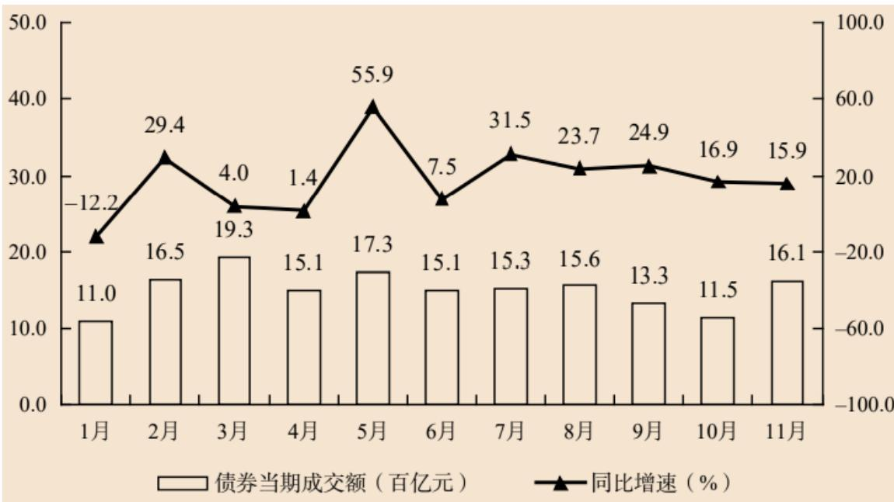
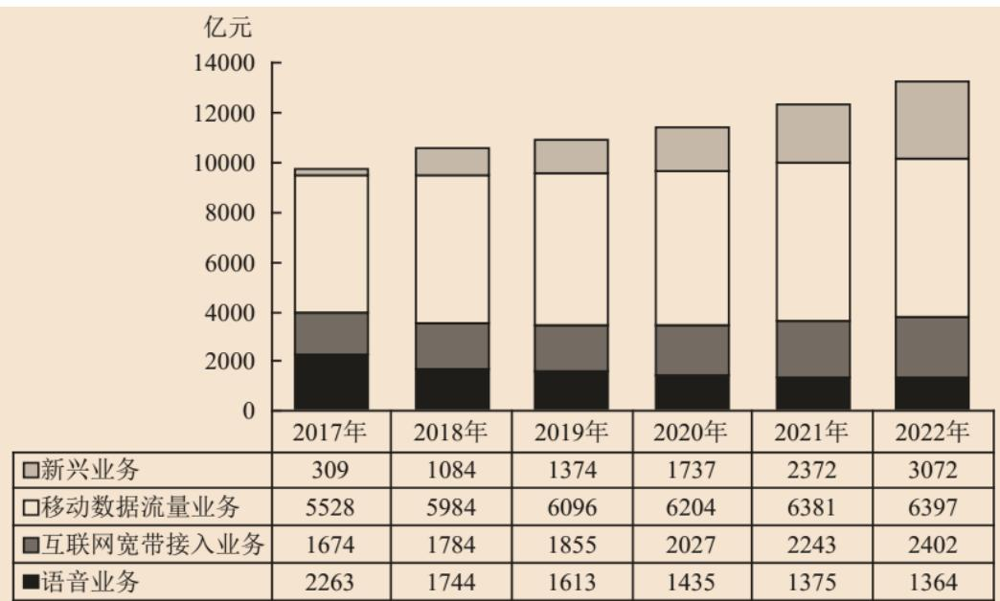
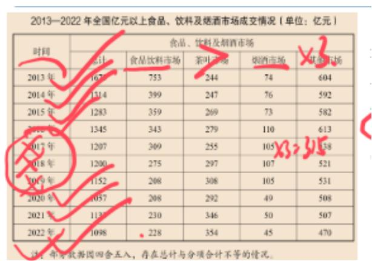
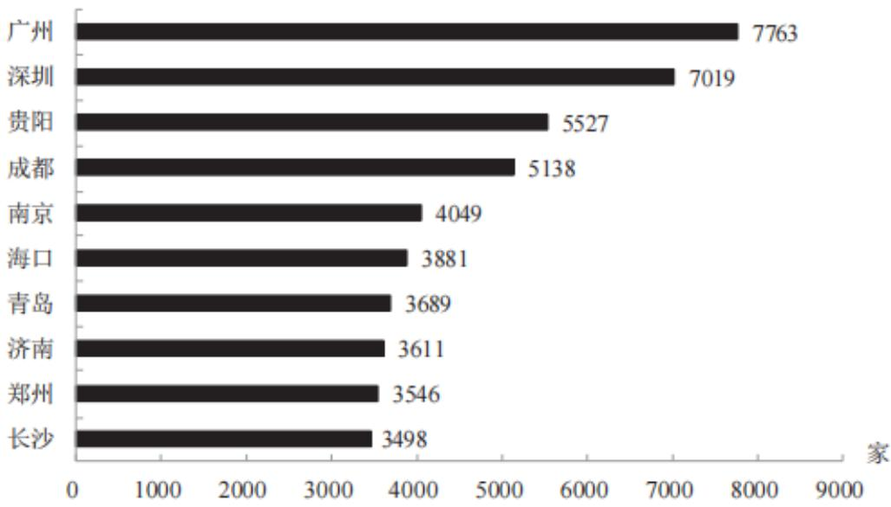

# 精讲精练一资料 6

（笔记）

主讲教师：邓健

授课时间：2025.03.07

# 精讲精练一资料6（笔记）

# 资料分析 精讲精练6

# 学习任务：

1.课程内容：平均数、倍数  
2. 对应讲义：第  $355 \sim 365$  页  
3. 重点内容：

（1）不同条件下的现期平均数计算  
(2) 基期平均数公式  
（3）两期平均数问题  
（4）倍数与增长率的相互转化

# 第六节 平均数

关键字：平均每

题型：一、现期平均数（重点必考）

二、基期平均数（几乎不考）  
三、两期平均数（常考，技巧性强）

【注意】平均数：比重问题关键词是“占”字，平均数问题有“平均每、人均、户均、月均”等，出现均字，结合时间确定具体考点。

1. 关键字：平均每。  
2. 题型：

(1) 现期平均数（重点必考）。  
(2) 基期平均数（几乎不考，讲义上没有设置基期平均数）。  
(3) 两期平均数（常考，技巧性强）。

# 一、现期平均数

识别：求现在  $+$  平均每（人均/单价）

公式：平均数  $=$  总数（A）/个数（B）

计算形式：后/前

（1）人均收入  $=$  收入/人数  
(2) 平均每所学校的人数 = 学生人数 / 学校数量

速算技巧：截位直除

【注意】现期平均数：

1. 识别：求现在+平均每（人均/单价）。  
2. 公式：平均数 = 总数（A）/个数（B）。出现 A/B 的形式，A → 分子的数据、B → 分母的数据，所有比例类都用 A、B 表示公式，可以解决很多题目。比重中 A/B = 部分/总体，平均数中有很多专有名词。  
3. 计算形式：后/前。

（1）人均收入  $=$  收入/人数。均  $\rightarrow$  平均数，后/前  $=$  收入/人数。  
（2）平均每所学校的人数  $=$  学生人数/学校数量，平均每  $\rightarrow$  平均数，后/前=学生人数/学校数量。

4. 速算技巧：截位直除。

2021年H省共有电子商务平台87个，在本省电商平台上实现交易金额为5354.93亿元，同比增长  $41.0\%$  ，收取的平台交易服务费为3.17亿元，同比增长 $49.5\%$  。从地区分布来看，2021年本地电子商务平台拥有量最多的为Z市，有44个平台，实现交易金额4239.04亿元。

【例1】（2023国考）2021年，H省除Z市外其他地区的电子商务平台平均每个平台实现的交易金额约为多少亿元？

A. 5

B. 12

C. 26

D. 62

【解析】1. 问题时间与材料时间一致，现期时间，出现平均每，平均数问题，所求  $=$  后/前  $=$  交易金额/平台个数，定位材料找数据，有同学错用5354.93/87，错选D项；主体为“H省除Z市外其他地区”，因此分子、分母需要做减法，把Z市数据减掉，所求  $= (5354 - 4239) / (87 - 44)$ ，选项差距很大，所求  $= 1100^{+} / 43 = 20^{+}$ ，对应C项。【选C】

# 【注意】梳理：

1. 题型：2021年+平均每——现期平均数。  
2. 公式：平均数  $=$  后/前  $=$  交易金额/电商平台数量。  
3. 计算: (5354-4239) / (87-44) ≈ 1100/43, 首位商 2, 选 C 项。  
4. 注意：现期平均的题目太简单，出题老师会设置一些小陷阱，读题需仔细。

第15届CMC部分赛区参赛情况  

<table><tr><td>赛区</td><td>参赛学校数</td><td>参赛人数</td><td>决赛人数</td></tr><tr><td>重庆</td><td>22</td><td>12844</td><td>46</td></tr><tr><td>北京</td><td>53</td><td>20150</td><td>90</td></tr><tr><td>广东</td><td>62</td><td>12118</td><td>48</td></tr><tr><td>河北</td><td>40</td><td>11970</td><td>40</td></tr><tr><td>河南</td><td>58</td><td>18278</td><td>59</td></tr><tr><td>湖北</td><td>60</td><td>16637</td><td>57</td></tr><tr><td>江苏</td><td>63</td><td>19889</td><td>80</td></tr><tr><td>山东</td><td>73</td><td>23871</td><td>86</td></tr><tr><td>陕西</td><td>55</td><td>28549</td><td>90</td></tr><tr><td>四川</td><td>45</td><td>11346</td><td>46</td></tr></table>

2021年上半年，湖北省676家规上信息软件业企业中营业收入前20的企业共实现营业收入355.46亿元，同比增长  $8.3\%$  ，拉动规上服务业营业收入增长1.1个百分点。

【例3】（2022湖北选调）2021年上半年湖北省规上信息软件业中营业收入前20的企业，平均每家每月营业收入约为多少亿元？

A. 1. 18

B. 2.25

C. 2.32

D. 2.96

【解析】3. 先讲例 3，平均每  $\rightarrow$  平均数问题，所求  $=$  后/前  $=$  收入/企业个数，定位材料找数据，收入  $\approx 355$  ，有同学用 355/676、355/676÷6、355/20、355/20÷12，以上都是错误的列式，正确列式为  $355 / 20 \div 6$  ，分子一定约是 355（湖北省 676 家规上信息软件业企业中营业收入前 20 的企业共实现营业收入 355.46 亿元），问的是前 20 的企业，故企业数不可能是 676，一定是 20；涉及到每月的计算，且数据为上半年数据，对应 6 个月，要每个月，需要在上半年的基础上除

以6，所求  $\approx 355 / 20\div 6 = 355 / (20*6)\approx 3$  ，对应D项。【选D】

# 【注意】梳理：

1. 题型：2021年+平均每——现期平均数。  
2. 公式：平均数  $=$  后/前  $=$  收入/企业数量/月份数。  
3. 计算： $355 / 20 / 6 = 355 / 120$ ，接近商3，选D项。  
4. 注意: 现期平均的题目太简单, 出题老师会设置一些小陷阱, 读题需仔细。

【例2】（2025国考）表中所列赛区中，第15届CMC平均每个参赛学校参赛人数最少的是：

A. 河北

B. 湖北

C. 四川

D. 广东

【解析】2. 平均每  $\rightarrow$  平均数问题, 所求  $=$  后/前  $=$  参赛人数/学校数量, 选项有四个省份, 分数比较问题, 可以先找一大一小, 同大同小看倍数, 但本题无需动笔计算, 可以直接看出答案, 一边找数据, 一边口算即可, 因为学校的数量很少,分母很 “整”, 参赛人数都是  $10000^{+}$ , 故可以口算直除, 河北:  $11970 / 40 \approx 300$ ,湖北:  $16637 / 60 = 200^{+}$ , 四川:  $11346 / 45 = 200^{+}$ , 广东:  $12118 / 62 \approx 200$ , 不要错选A项,A项最多,要找最少的,对应D项。【选D】

# 【解析】梳理：

1 题型：平均每……最少——现期平均数的比较。  
2. 公式：平均数  $=$  后/前  $=$  参赛人数/学校数量。  
3. 计算：分数比较，分母数字比较整时可以直接除。

2013年全国1~5月保险业经营状况  

<table><tr><td rowspan="2"></td><td colspan="5">经营状况(亿元)</td><td rowspan="2">5月同比增速(%)</td></tr><tr><td>1月</td><td>2月</td><td>3月</td><td>4月</td><td>5月</td></tr><tr><td colspan="7">......</td></tr><tr><td>业务及管理费</td><td>185</td><td>166</td><td>195</td><td>189</td><td>190</td><td>21</td></tr></table>

【拓展】2013年  $1\sim 5$  月，保险业平均每月业务及管理费用约为多少亿元？

A. 180

B. 185

C. 190

D. 195

【解析】拓展. 给  $1 \sim 5$  月每个月的值，求平均每个月的值，常规思路是将 5 个月的数据加和除以 5，可以高算低看，也可以用削峰填谷的思维解决，观察数据，假设 185 为平均数，峰谷依次为  $-19$ 、 $+10$ 、 $+4$ 、 $+5$ ， $-19 + 10 + 4 + 5 = 0$ ，峰谷抵消，说明平均值刚好是 185，对应 B 项。【选 B】

# 【注意】

1. 多个数加和求平均值：削峰填谷（选一个选项中间好算的值，假设是平均数，再看实际数据多多少或少多少，最接近答案，计算量最小）。  
2. 若假设 190 为平均值，峰谷依次为  $-5$ 、 $-24$ 、 $+5$ 、 $-1$ 、0，峰谷相加， $-5 - 24 + 5 - 1 = -25$ ，将总共剩余的平摊到每个月上，平均值  $= 190 - 25 / 5 = 190 - 5 = 185$ 。

  
2023年1—11月J省深圳证券交易所债券成交额情况

【例4】(2024联考)2023年上半年J省深圳证券交易所债券平均成交额为：

A. 不到 15 百亿元

B.  $15 \sim 16$  百亿元

C.  $16 \sim 17$  百亿元

D. 超过 17 百亿元

【解析】4. 上半年  $\rightarrow 1 \sim 6$  月，即求  $1 \sim 6$  月的平均值，对应柱状图找数据，挑中间好算的数，以16为基准值，峰谷依次为-5、+0.5、+3.3、-0.9、+1.3、

-0.9, 正负抵消,  $-5 + 0.5 + 3.3 - 0.9 + 1.3 - 0.9 = -1.7$ , 所求  $= 16 - 1.7 / 6 \approx 16 - 0.3 = 15.7$ , 对应 B 项。【选 B】

# 【注意】

1. 观察数据，有2个数据为15.1，可以假设平均数为15.1，15.1在选项中间，且有2个数的峰谷无需计算，峰谷依次为-4.1、+1.4、+4.2、+2.2，正负抵消，-4.1+1.4+4.2+2.2≈+3.6，15.1+3.6/6=15.1+0.6=15.7，对应B项。  
2. 本题可以直接加减，数据比较巧，加和  $= 94. \mathrm{X}$ ，在 B 项之间，选择 B 项，但这种方法对基础要求很高，纯靠个人能力做出来的方法一般不讲，因为没有普适性，如果个人能力很强，不需要再去整理额外的技巧，可以硬算、口算，但老师会提供更系统性的方法，若计算 12 个月的数据，计算整年的平均值，此时若将 12 个月的数据加和会很麻烦。

# 3.梳理：

(1) 题型: 多个数加和求平均值。  
(2) 方法: 削峰填谷。  
（3）操作：假设平均数为16（选项中间的），依次为-5、+1.5、+3.3、-0.9、+1.3、-0.9，抵消后为-1.7。答案=16-(1.7/6)≈15.9，选B项。

  
2017—2022年全国主要电信业务收入

【例5】（2024国考） $2017\sim 2022$  年，全国移动数据流量业务收入总额在以下哪个范围内？

A. 不到 3.4 万亿元

B. 超过 3.6 万亿元

C. 3.4 万亿  $\sim$  3.5 万亿元之间

D. 3.5 万亿  $\sim$  3.6 万亿元之间

【解析】5. 移动数据定位表格材料第二行。

方法一：若口算能力很强，5个数据大于6000，1个数据为  $5500^{+}$ ， $6000*5 + 5500 = 35500$ ，能看出来结果大约为  $35500 + 800 > 3.6$  万，选择B项。

方法二：多个数字加和，高算低看，千位：  $5 + 5 + 6 + 6 + 6 + 6 = 34$  、百位： $5 + 9 + 2 + 3 + 3 = 22$  ，  $34000 + 2200 = 36200 > 36000$  ，选择B项。

方法三（分析）：相当于除了 2017 年，剩余的年份都是 6000，若将多出的数据补给 2017 年，则 2017 年也能超过 6000，说明平均值一定在 6000 以上，6 年每年的平均值都在 6000 以上，则 6 年总和超过  $6000 * 6 = 36000$ ，对应 B 项。【选 B】

【注意】思维拓展：国考很爱考查，所有这类问题都可以逆向思考。

(1)求  $n$  年之和可以反过来看平均数，省掉加法的过程，如2年之和  $> 10000$ ，则平均每一年要超过5000。  
(2) 5 年之和超过 1 万等价于平均每年超过 2000。即 5 年之和  $>1$  万  $\rightarrow$  平均值  $>2000$  。

2016—2021年中国超算服务细分市场规模  
单位：亿元  

<table><tr><td></td><td>尖端超算</td><td>通用超算</td><td>业务超算</td><td>人工智能超算</td></tr><tr><td>2016年</td><td>20.9</td><td>23.9</td><td>15.6</td><td>4.7</td></tr><tr><td>2017年</td><td>23.1</td><td>26.9</td><td>24.1</td><td>7.9</td></tr><tr><td>2018年</td><td>24.2</td><td>29.7</td><td>34.8</td><td>12.5</td></tr><tr><td>2019年</td><td>26.4</td><td>32.2</td><td>48.1</td><td>18.8</td></tr><tr><td>2020年</td><td>28.3</td><td>37.8</td><td>64.4</td><td>27.7</td></tr><tr><td>2021年</td><td>31.4</td><td>40.3</td><td>85.6</td><td>38.3</td></tr></table>

【例6】（2023国考）根据材料判断该说法是否正确：

2016～2020年，通用超算服务市场累计规模超过160亿元

A. 正确

B. 错误

【解析】6. 时间为  $2016 \sim 2020$  年，求5年之和  $>160$  ，则平均每年要超过  $160 / 5 = 32$  ，观察数据，主体为通用超算，2019年为32，2020年比32多5，前 $2016 \sim 2018$  年都缺，且缺很多，故总体不够，平均值  $< 32$  ，则总和  $< 160$  ，错误，对应B项。【选B】

<table><tr><td colspan="5">2013~2018年中国集成电路进出口状况</td></tr><tr><td></td><td colspan="2">进口</td><td colspan="2">出口</td></tr><tr><td></td><td>数量(亿块)</td><td>金额(亿美元)</td><td>数量(亿块)</td><td>金额(亿美元)</td></tr><tr><td>2013年</td><td>2663.1</td><td>2313.4</td><td>1426.7</td><td>877.0</td></tr><tr><td>2014年</td><td>2856.5</td><td>2176.2</td><td>1535.2</td><td>608.6</td></tr><tr><td>2015年</td><td>3140.0</td><td>2300.0</td><td>1827.7</td><td>693.2</td></tr><tr><td>2016年</td><td>3425.5</td><td>2270.7</td><td>1810.1</td><td>613.8</td></tr><tr><td>2017年</td><td>3770.1</td><td>2601.4</td><td>2043.5</td><td>668.8</td></tr><tr><td>2018年</td><td>4175.7</td><td>3120.6</td><td>2171.0</td><td>846.4</td></tr></table>

【练习】（2023国考）根据材料判断该说法是否正确：

2014～2018年，出口总量超过1万亿块

A. 正确

B. 错误

【解析】拓展。时间为  $2014 \sim 2018$  年（5年），主体为出口总量，要求5年之和超过1万亿，则平均每年  $>2000$  ，观察数据，2017年卡在2000，2018年比2000多  $100^{+}$  ，但2014年比200少  $500^{-}$  ，故总体上比2000少，平均数不到2000，则5年之和不超过1万亿，对应B项。【选B】

# 二. 基期平均数

识别：求去年+平均数

公式：A/B*[（1+b）/（1+a）]

A: 分子现期量

B：分母现期量

a: 分子增长率

b: 分母增长率

速算：

选项差距大：多步除法上下截两位约分化简

选项差距小：先计算现期平均A/B，再观察（1+b）/（1+a）和1的关系，结合选项分析

【注意】基期平均数：

1.识别：求去年  $^+$  平均数。  
2. 公式:  $\mathrm{A} / \mathrm{B} * \left[ (1 + \mathrm{b}) / (1 + \mathrm{a}) \right]$  (同基期比重公式, 无需进行区分, 只需要记住  $\mathrm{A} \rightarrow$  分子、 $\mathrm{B} \rightarrow$  分母即可, 比重  $=$  部分/总体, 平均数  $=$  后/前, 也是  $\mathrm{A} / \mathrm{B}$  的形式, 从数学本质上讲结构相同, 最终化简出公式的结构也相同),  $\mathrm{A}$ : 分子现期量、 $\mathrm{B}$ : 分母现期量、 $\mathrm{a}$ : 分子增长率、 $\mathrm{b}$ : 分母增长率。  
3. 推导：2017年收入的现期量为A、r=a；人数的现期量=B、r=b，问2016年人均收入。人均收入=后/前=收入（A、a）/人（B、b），收入基期=A/(1+a)、人数基期=B/(1+b)，所求=A/(1+a)÷[B/(1+b)]=(A/(1+a)*(1+b)/B=A/B*[1+(1+a)]，只要现期是A/B的形式，则基期比例都是A/B*[(1+b)/(1+a)]的形式。  
3. 速算：基期比重问题考查很多，且比重变化很小，选项差距很小，必须要算左边，看右边进行分析，用到等比例放缩；但基期平均和基期倍数考查很少，若考查一般属于选项差距大，直接截两位处理。

(1) 选项差距大: 多步除法上下截两位约分化简。

(2) 选项差距小: 先计算现期平均 A/B, 再观察  $(1 + b) / (1 + a)$  和 1 的关系, 结合选项分析。

2017年  $1\sim 12$  月，全国内燃机累计销量5645.38万台，同比增长  $4.11\%$  ，累计完成功率266879.47万千瓦，同比增长  $9.15\%$  ，其中柴油内燃机功率同比增长 $34\%$  。

【例7】（2019浙江）2016年，我国销售的内燃机平均功率约为：

A. 35 千瓦

B. 45 千瓦

C. 55 千瓦

D. 65 千瓦

【解析】7. 求 2016 年，给 2017 年，求去年，平均功率  $=$  后/前  $=$  功率（A、a）/内燃机个数（B、b），定位材料找数据，代入公式， $\mathrm{A} / \mathrm{B} * \left[ \left(1 + \mathrm{b}\right) / \left(1 + \mathrm{a}\right) \right] \approx$  266879/5645*[（1+4.11%）/（1+9.15%）]。基期比重的选项非常接近，差距小，

需要截三位，因此要分析；若选项差距大，无需技巧，直除、估算即可，资料分析选项是核心。只有选项差距小，在复杂题型中，才需要技巧（因为无法计算），本题多步除法，选项差距大，分子、分母截两位，能约分的先约分，原式转化为  $27 / 56 * 10 / 11 = 27 / 28 * 5 / 11$  ，进行“+1、-1”微调，原式转化为  $(27 + 1) / 28 * 5 / 11 = 5 / 11$  ，首位商  $4^{+}$ ，对应B项。【选B】

# 【注意】

1. 目前只遇到了一个 2019 年的题目，因为没有这种考点的新题，这个知识点考查的很少。  
2. 选项差距大，多步除法，上下截两位，约分化简（选一个20以上的数字  $\pm 1$  微调）。  
3. 资料分析的逻辑是计算之前先看选项，只要差距大，不用任何方法，截两位计算即可；若差距小，截三位后不好计算，此时才补充一些分析的方法。

2020年  $1\sim 6$  月，全国电池制造业主要产品中，锂离子电池产量71.5亿只，同比增长  $1.3\%$  ；铅酸蓄电池产量9635.6万千伏安时，同比增长  $6.1\%$  ；原电池及原电池组（非扣式）产量178.2亿只，同比下降  $0.7\%$  。

【例8】（2022国考）2019年上半年，全国铅酸蓄电池月均产量约为多少亿千伏安时？

A. 0.13

B. 0.14

C. 0.15

D. 0.16

【解析】8. 求月均值，不需要用  $\mathrm{A} / \mathrm{B} * \left[ \left(1 + \mathrm{b}\right) / \left(1 + \mathrm{a}\right) \right]$  计算，因为分母是固定的，无论是 2020 年还是 2019 年，月均值都是 6 个月，所求  $= 2019$  年产量/6 个月，只需要求产量基期即可，定位材料找数据，2019 年产量  $\approx 9635 / (1 + 6.1\%)$ ，所求  $\approx 9635 / (1 + 6.1\%) \div 6$ ，选项差距小，截三位，原式转化为  $9635 / (106 * 6) = 9635 / 636$ ，首位商 1，次位商 5，对应 C 项。【选 C】

# 【注意】

1. 等比例放缩，所求  $\approx 9635 / 106 \div 6$  ，选项差距小的复杂类基期问题，考虑

等比例放缩，分母“-6”，9635/106是90倍左右，则分子要“-90*6=540”，原式转化为（9635-540）/（106-6）÷6=9095/6，首位商1，次位商5，选择C项。

2. 截三位计算，原式转化为  $964 / 106 \div 6, 964 / 106 \approx 9$  ，分母-6，则分子-54，转化为（964-54）/（106-6）÷6=910/6=15，对应C项。

现期平均和基期平均

如何确定分子分母：后/前

题型1：求今年  $+$  平均每

注意：题型简单就会设计陷阱，读题要仔细

多数加和求平均值：削峰填谷——从选项挑一个中间值，看余数

逆向思维：求5年之和达到1万，可观察平均数是否到2000

题型2：求去年  $+$  平均每

公式：A/B*[（1+b）/（1+a）]

速算：差距大截位、差距小算左边看右边

注：该考点很冷门

【注意】现期平均和基期平均：

1. 如何确定分子分母：后/前。

2. 题型：

（1）题型1：求今年  $+$  平均每。

(1)注意: 题型简单就会设计陷阱, 读题要仔细。  
(2) 多数加和求平均值: 削峰填谷, 从选项挑一个中间值, 看余数, 余数要均摊到每个月。  
(3)逆向思维: 求 5 年之和达到 1 万, 可观察平均数是否到 2000。

(2) 题型 2: 求去年 + 平均每。

$①$  公式：A/B\*[（1+b）/（1+a）]。  
(2)速算: 差距大截位、差距小算左边看右边。能用简单的方法就用简单的方法。  
(3)注：该考点很冷门。

# 三、两期平均——比较（与两期比重升降方法相同）

识别：两个时间+平均数上升/下降

例：2019年，人均收入与2018年相比？

A.上升

B. 下降

C. 不变

D. 无法推出

方法：  $a > b$  ，平均数上升；

$\mathrm{a} < \mathrm{b}$  ，平均数下降；

$a = b$  ，平均数不变。

注：a：分子的增长率、b：分母的增长率

比较时需带正负号比较

【注意】两期平均——比较（与两期比重升降方法相同）：

1. 识别：两个时间+平均数上升/下降。

2. 例：2019 年，人均收入与 2018 年相比？

A.上升

B. 下降

C. 不变

D. 无法推出

答：人均收入  $=$  收入（a）/人（b），邓健老师家里有3口人，若邓健老师工资上涨，则人均收入一定上升，人没变，即  $b = 0$  ，收入增长，  $a > 0$  ，  $a > b \rightarrow$  平均数上升；若邓健老师收入没有增长，  $a = 0$  ，但人口多了1人  $\rightarrow b > 0$  ，此时人均收入下降，即  $a < b \rightarrow$  人均收入下降；若人和收入都没变，  $a = 0$  、  $b = 0$  ，则人均收入不变。

3. 方法：与两期比重方法一样，现期平均，现期比重都是 A/B 的形式，基期比重、基期平均都是 A/B*[（1+b）/（1+a）]，则两期升降判断的结论也相同。

(1)  $a > b$ , 平均数上升。  
(2)  $a < b$ , 平均数下降。  
(3)  $a = b$ , 平均数不变。

4. 注：a: 分子的增长率、b: 分母的增长率，比较时需带正负号比较。

2023年一季度，新疆金属矿及矿砂、未锻轧铜及铜材、煤炭分别进口35.5亿元、11.4亿元、3.7亿元，同比分别增长  $134.1\%$  、  $65.3\%$  、  $79.6\%$  ，进口量同

比分别增长  $102.5\%$  、  $69.4\%$  、  $78.8\%$  。同期，进口农产品15.2亿元，同比增长  $20.5\%$  。

【例1】（2024联考）根据材料判断该说法是否正确：2023年一季度，新疆煤炭进口单价高于上年同期水平

A. 正确

B. 错误

【解析】1. 资料分析都是经济类指标，经常会计算平均价格、单价，不要考虑后/前，平均价格、单价  $=$  钱数/个数（固定），则进口单价  $=$  进口金额（a）/进口量（b），定位材料找数据，  $a = 79.6\%$  ，  $b = 78.8\%$  ，  $a > b \rightarrow$  平均数上升，说法正确，对应A项。【选A】

# 【注意】梳理：

1. 题型：单价高于上年——两期平均升降判断。  
2. 方法：a（79.6%）>b（78.8%），平均数同比升高，说法正确。

2018年我国各种运输方式完成货物运输量及其增长速度  

<table><tr><td>指标</td><td>单位</td><td>绝对数</td><td>同比增长(%)</td></tr><tr><td>货物运输总量</td><td>亿吨</td><td>514.6</td><td>7.1</td></tr><tr><td>其中:铁路</td><td>亿吨</td><td>40.3</td><td>9.2</td></tr><tr><td>公路</td><td>亿吨</td><td>395.9</td><td>7.4</td></tr><tr><td>水运</td><td>亿吨</td><td>69.9</td><td>4.7</td></tr><tr><td>民航</td><td>万吨</td><td>738.5</td><td>4.6</td></tr><tr><td>管道</td><td>亿吨</td><td>8.5</td><td>5.4</td></tr><tr><td>货物运输周转量</td><td>亿吨公里</td><td>205451.5</td><td>4.1</td></tr><tr><td>其中:铁路</td><td>亿吨公里</td><td>28821.0</td><td>6.9</td></tr><tr><td>公路</td><td>亿吨公里</td><td>71202.5</td><td>6.6</td></tr><tr><td>水运</td><td>亿吨公里</td><td>99303.6</td><td>0.7</td></tr><tr><td>民航</td><td>亿吨公里</td><td>262.4</td><td>7.7</td></tr><tr><td>管道</td><td>亿吨公里</td><td>5862.0</td><td>22.5</td></tr></table>

【例2】（2022山东）已知货物平均运输距离（公里）=货物运输周转量/货物运输总量。

在①铁路、②公路、③水运和④民航四种运输方式中，2018年我国货物平均运输距离高于2017年水平的是：

A. 仅①和②

B. 仅③和④

C. 仅①、②和③

D. 仅④

【解析】2. 出现“平均运输距离”，一般考试都会给公式，但也可以积累一下，以防不给，货物平均运输距离（公里）=货物运输周转量（a）/货物运输总量（b），不需要理解专有名词，问2018年平均值高于2017年的  $\rightarrow$  平均数高于，为两期平均数的升降判断，找a、b，高于  $\rightarrow a > b$  ，定位材料找数据，货物运输周转量的增速为a，货物运输总量的增速为b，①铁路：  $a = 6.9\% < b = 9.2\%$  ，排除；②公路：  $a = 6.6\% < b = 7.4\%$  ，排除；③水运：  $a = 0.7\% < b = 4.7\%$  ，排除，①、②、③都不行，对应D项。【选D】

【注意】民航： $7.7\% > 4.6\%$ ，平均数上升，满足。

# 三、两期平均一计算：平均数的增长量和增长率

识别：平均数+上升/下降+单位/%

【例】……从业人员人均收入约比上年同期增长：

A. 2000元

B. 4000元

C. 6000 元

D. 8000 元

$$
\begin{array}{l} \text {平 均 数 增 长 量} = \text {现 期 平 均 数} - \text {基 期 平 均 数} = A / B - A / B * [ (1 + b) / (1 + a) ] = A / B * [ (a - b) / (1 + a) ] \end{array}
$$

(同两期比重差值公式，但只能截位或估算)

可以先 ab 比大小判断升降，但是没有结论，具体数值必须估算

【注意】平均数的增长量：

1. 识别：平均数+上升/下降+单位。  
2. 例：……从业人员人均收入约比上年同期增长：

A. 2000元  
B. 4000 元  
C. 6000 元  
D. 8000 元

答：人均收入（平均数）+增长+单位，平均数的增长量问题。

3. 平均数增长量 = 现期平均数 - 基期平均数  $= \mathrm{A} / \mathrm{B} - \mathrm{A} / \mathrm{B} * \left[ (1 + \mathrm{b}) / (1 + \mathrm{a}) \right] = \mathrm{A} / \mathrm{B} * \left[ (\mathrm{a} - \mathrm{b}) / (1 + \mathrm{a}) \right]$ 。  
4. 现期都是 A/B，基期都是 A/B*[（1+b）/（1+a）]，故平均数增长量的公式同两期比重差值公式，但估算方法不同，平均数的增长量只能截位或估算，可

以先 ab 比大小判断升降，但是没有结论，因为平均数增长量是具体数值，必须估算。  
5. 国考在 2025 年之前没考过平均数的增长量，联考近十年只考过 1 次，最新 2025 年国考考过一次。

【例3】（2023浙江选调）2020年，J省新增发放创业担保贷款192.7亿元，同比增长  $24.4\%$  ，完成全年计划的  $175.2\%$  ；其中直接扶持个人创业149.37亿元，同比增长  $23.1\%$  ，完成全年计划的  $226.3\%$  。通过创业担保贷款直接扶持个人创业13.78万人次，同比增长  $25.3\%$  ，带动就业51.43万人次。到期贷款回收率达 $99.95\%$  ，高于全年计划。2020年企业职工岗位技能培训73.52万人，完成全年计划的  $408.5\%$  ；创业培训16.66万人，完成全年计划的  $138.8\%$  。

2020年，J省通过创业担保贷款直接扶持个人创业平均每人次获得的创业担保贷款比上年同期：

A. 高不到 3000 元  
B. 高 3000 元以上  
C. 低不到 3000 元  
D. 低 3000 元以上

【解析】3. 题干不好理解，但出现“平均每”，是平均数，出现高、低+元，增长量问题，为平均数的增长量计算。平均数  $=$  后/前  $=$  个人创业贷款/个人创业人次数，找数列式，注意找“扶持个人创业”，A/B*[（a-b）/（1+a）]  $\approx$  149亿元/13.8万人次*[(23.1%-25.3%)/(1+23.1%)], a<b, 为下降，排除A、B项；选项是范围，假设首位商2，不确定选C项还是选D项，不知道是200还是2000还是20000，故需要带着单位计算，确定好量级，亿/万=万。149/13.8=10 $^+$ ，故149亿元/13.8万人次=10 $^+$ 万元/人次，(23.1%-25.3%)/(1+23.1%)  $\approx$  -2.21%/1.23，负号代表下降，可以不看，所求=10 $^+$ 万元/人次*2.21%/1.23=2200 $^+$ /1 $^+$ <2200 元，对应C项。【选C】

【拓展1】（2022四川下）2020年，全国艺术表演团体共演出225.61万场，比上年下降  $24.0\%$  ；国内观众8.93亿人次，下降  $27.4\%$  ；演出收入86.63亿元，下降  $31.7\%$  。

2020年，全国艺术表演团体平均每场演出创造收入比上年：

A. 减少了不到 1000 元

B. 减少了 1000 元以上

C. 增加了不到 1000 元

D. 增加了 1000 元以上

【解析】拓展 1. 平均每+增加/减少+元，平均数的增长量问题，公式：A/B*[（a-b）/（1+a）] = 86.63亿/225.61万*[（-31.7%+24%）/（1-31.7%）]，和上一题类似，选项有2个增加、2个减少，选项是范围，具体数值是分界线，a<b，为减少，排除C、D项；所求≈4000*7.7%/0.68（判断出是减少之后可以不写负号）≈300/0.68≈500<1000，选择A项。【选A】

【注意】平均数增长量的计算（小经验）：无法取巧，选项是范围还需要考虑量级，实在没时间算，可以判断完升降后蒙一个较小的结果（近几年考过的平均数增长量都是这样，无一例外），比如本题，判断出下降，排除C、D项，直接选择较小的A项，是因为我国就算会有各方面发展的问题，但整体各行各业都是比较稳定的状态，比如房价，房地产市场已经很不好，但在国家的宏观调控下，降价也没有降得很厉害，行情稳定，相邻两年的变化一般都不会太大。

2023年三季度，支付系统共处理支付业务3358.88亿笔，金额3151.37万亿元，同比分别增长  $12.59\%$  和  $6.97\%$  。

【拓展2】（2025国考）2023年三季度，支付系统平均每笔支付业务金额比上年同期：

A. 下降了不到 1000 元

B. 下降了 1000 元以上

C.上升了不到1000元

D.上升了1000元以上

【解析】拓展 2. 平均+上升、下降+元，平均数的增长量计算，找数列式为 A/B*[（a-b）/（1+a）] = 3150 万亿/3360 亿笔*[（7%-12.6%）/（1+7%）]，不好算，判断升降，a>b，为上升，蒙较小的，选择 A 项。【选 A】

# 三、两期平均——计算：平均数的增长量和增长率

识别：平均数+上升/下降+单位/%

【例】……从业人员人均收入约比上年同期增长：

A. 2000元

B. 4000元

C. 6000 元

D. 8000元

A.  $2.5\%$

B.  $8.4\%$

C.  $10.8\%$

D.  $13.4\%$

平均数增长量  $=$  现期平均数-基期平均数  $\mathrm{=A / B - A / B*}$  （1+b）/（1+a）  $) = \mathrm{A} / \mathrm{B}*\left[\mathrm{(a - b)} / \mathrm{(1 + a)}\right]$

平均数增长率  $=$  增长量/基期  $= \{\mathrm{A} / \mathrm{B} * \left[ \left(\mathrm{a} - \mathrm{b}\right) / \left(1 + \mathrm{a}\right) \right]\} \div \{\mathrm{A} / \mathrm{B} * \left[ \left(1 + \mathrm{b}\right) / \left(1 + \mathrm{a}\right) \right] \} = \left(\mathrm{a} - \mathrm{b}\right) / \left(1 + \mathrm{b}\right)$

（代公式就行，很简单）

【注意】平均数的增长率：比重是百分数，百分数不计算增长率，平均数是具体数值，具体数值可以计算增长率。

1. 识别：平均数+增长+%。  
2. 例：……从业人员人均收入约比上年同期增长：

A.  $2.5\%$

B.  $8.4\%$

C.  $10.8\%$

D.  $13.4\%$

答：出现“人均”，增长  $+ \%$  ，求平均数的增长率。

2. 推导：平均数增长率  $=$  增长量/基期  $= \{A / B*[ (a - b) / (1 + a)]\} \div \{A / B[(1 + b) / (1 + a)]\} = (a - b) / (1 + b)$ 。  
3. 公式： $r = (a - b) / (1 + b)$ ，代公式即可。

2023年一季度，新疆外贸进出口总值680.7亿元，同比增长  $80.3\%$  。其中，出口584.7亿元，同比增长  $86.9\%$  。3月当月，新疆外贸进出口总值236.9亿元，同比增长  $70\%$  。其中，出口203.4亿元，同比增长  $78.9\%$  ；进口33.5亿元，同比增长  $30.8\%$  。

2023年一季度，新疆实有备案外贸企业15486家，同比增长  $6.5\%$  ；一季度，新疆有进出口实绩的外贸企业1535家，同比增长  $12\%$  。新疆民营企业进出口650.1亿元，同比增长  $94.2\%$  。一季度，新疆国有企业进出口25.7亿元；外商投资企业进出口4.9亿元。

【例4】（2024联考）2023年一季度，新疆有进出口实绩的外贸企业平均每家进出口值同比增长约：

A.  $61\%$

B.  $73\%$

C.  $78\%$

D.  $81\%$

【解析】4. 平均每家  $+$  增长  $+ \%$  ，平均数的增长率，平均数  $=$  后/前  $=$  进出口总值/进出口企业数量，平均数增长率  $r = (a - b) / (1 + b)$  ，找数，所求  $= (80.3\% - 12\%)$ $/ (1 + 12\%) \approx 68.3\% / 1^{+} < 68.3\%$  ，对应A项。【选A】

【注意】本题难点：分子找不到。有实绩就是创造了业绩的，外贸进出口总值就是由有进出口实绩的企业创造的，跟其他企业没关系。

2018年前三季度，S省社会物流总额35357.26亿元，同比增长  $6.4\%$  ，增速比上半年放缓0.7个百分点。其中，工业品物流总额16636.15亿元，同比增长 $0.2\%$  ，增速比上半年放缓2.1个百分点；外部流入（含进口）货物物流总额17357.31亿元，同比增长  $12.1\%$  ，增速比上半年加快0.8个百分点；农产品物流总额875.06亿元，同比增长  $11.6\%$  ，增速比上半年加快0.5个百分点；单位与居民物品物流总额457.86亿元，同比增长  $40.7\%$  ，增速比上半年放缓3个百分点；再生资源物流总额30.88亿元，同比下降  $7.0\%$  ，降幅比上半年扩大4.3个百分点。

2018年前三季度，S省社会物流总费用2682.1亿元，同比增长  $6.3\%$  ，比上半年放缓0.9个百分点。其中：物流运输环节总费用1854.6亿元，同比增长  $6.3\%$  ；保管环节总费用612.4亿元，同比增长  $6.4\%$  ；管理环节总费用214.9亿元，同比增长  $6.4\%$  。

【例5】（2020国考）2018年前三季度，平均每万元社会物流总额产生的物流费用比上年同期：

A.上升了不到  $1\%$

B.上升了  $1 \%$  以上

C. 下降了不到  $1\%$

D.下降了  $1\%$  以上

【解析】5. 平均+上升/下降+%，求平均数的增长率，公式：（a-b）/（1+b）。平均每万元社会物流总额产生的物流费用=后/前=物流费用（a）/物流总额（b），代入数据，所求=（6.3%-6.4%）/（1+6.4%）≈-0.1%/1.06，下降不到1%，对应C项。【选C】

【注意】前面的每万元只是一个计量单位，不影响平均数增长率的计算。

2023年前5个月，天津口岸出口汽车约17.2万辆，同比增长  $29.5\%$  ，总价值约100.1亿元人民币，同比增长  $40.2\%$  。

【练习】（2024联考）2023年  $1\sim 5$  月，天津口岸出口汽车均价同比上涨：

A.  $8\%$

B.  $12\%$

C.  $16\%$

D.  $20\%$

【解析】拓展1. 均+上涨+%，平均数的增长率，公式：（a-b）/（1+b）。出口均价=钱（a）/量（b），代入数据，所求=（40.2%-29.5%）/（1+29.5%）≈11%/1<11%，对应A项。【选A】

2017年，A省完成客运总量148339万人次，同比增长  $5.4\%$  ，增幅比前三季度提高0.2个百分点，比上年提高0.5个百分点；完成旅客周转总量4143.84亿人公里，增长  $7.7\%$  ，增幅比前三季度提高0.7个百分点，比上年提高1.8个百分点。

【练习】（2019国考）2017年前三季度，A省平均每人次客运旅客运输距离（旅客周转量÷客运总量）同比：

A. 下降了不到  $2\%$

B. 下降了  $2\%$  以上

C.上升了不到  $2\%$

D.上升了  $2 \%$  以上

【解析】拓展2. 平均+上升/下降+%，求平均数的增长率，公式：(a-b)/(1+b)。平均每人次客运旅客运输距离=旅客周转量（a）/客运总量（b），代入数据，不要找“7.7%”和“5.4%”，注意时间为“2017年前三季度”，高减低加，a=7.7%-0.7%=7%，b=5.4%-0.2%=5.2%，所求=(7%-5.2%)/(1+5.2%) = 1.8%/1<1.8%，对应C项。【选C】

# 两期平均数

题型一：升降判断——问平均数比去年 升高/降低

方法：a>b，上升；a<b，下降；a=b，不变。

题型二：增长量计算——问平均数 升降+单位

方法：1、判升降（a>b，上升；a<b，下降）

2、套公式：A/B*[（1+b）/（1+a）]若来不及算，可以猜较小的

题型三：增长率计算——问平均数 升降+%

方法：套公式即可——r=（a-b）/（1+b）

【注意】两期平均数：

1. 题型一：升降判断。

(1) 问平均数比去年升高/降低。  
(2) 方法:  $a > b$ , 上升;  $a < b$ , 下降;  $a = b$ , 不变。

2. 题型二：增长量计算。

（1）问平均数  $+$  升降  $+$  单位。  
(2) 方法:

(1)判升降 (a>b, 上升; a<b, 下降)。  
(2) 套公式:  $A / B * \left[ \left(1 + b\right) / \left(1 + a\right) \right]$ , 若来不及算, 可以猜较小的。

3. 题型三：增长率计算。

（1）问平均数  $+$  升降  $+ \%$  
(2) 方法: 套公式即可—— $r = (a - b) / (1 + b)$ 。

# 第七节 倍数

关键字：倍

题型：

一、现期倍数（多）  
二、基期倍数（少）

【注意】倍数：资料分析最简单的知识点。关键字  $\rightarrow$  倍。

1. 现期倍数。  
2. 基期倍数。  
3. 两期倍数没有意义, 比如今年 5 倍, 去年 4 倍, 讨论 “今年倍数比去年高” 没有意义, 故不考。

# 一、现期倍数

识别：求现在，A是B的多少倍

公式：A/B

速算：截位直除

# 【注意】现期倍数：

1. 识别：求现在，A是B的多少倍。  
2. 公式：A/B。  
3. 速算：截位直除。

# 概念辨析：

1.A是B的几倍：A/B  
2.A比B多（高）几倍：（A-B）/B=A/B-1

A 比 B 多（高）的部分是 B 的几倍？  
3.A 超过 B 的 n 倍：超过就是大于

例如：我的身高超过1米7（你以为1米7几，实际上不封顶）

A 超过 B 的 3 倍即  $\mathrm{A} > 3 * \mathrm{B}$

# 【注意】易混概念辨析：

1. A是B的几倍：A/B。  
2.A比B多（高）几倍：实际问的是“A比B多（高）的那部分是B的多少倍”，所求  $= (A - B) / B = A / B - 1$  。  
3.A 超过 B 的 n 倍:

(1) “超过”就是大于, 例如 “我的身高超过 1 米 7”, 可能就会以为是 1 米 7 几, 但实际上可以是 2 米、2.3 米, 只要大于 1.7 米就可以, 或者说 “我的收入超过 1000”, 实际收入上不封顶, 只要大于 1000 就是严谨表述。

（2）A 超过 B 的 3 倍即  $A > 3 * B$ 。

【例1】（2025四川）

# 2022年一季度及上半年我国软件与信息技术服务业收入

单位：亿元  

<table><tr><td></td><td>时段</td><td>总收入</td><td>软件产品</td><td>信息技术服务</td><td>信息安全</td><td>嵌入式系统软件</td></tr><tr><td rowspan="2">全国</td><td>一季度</td><td>20059</td><td>5097</td><td>13102</td><td>338</td><td>1522</td></tr><tr><td>上半年</td><td>46266</td><td>11427</td><td>30296</td><td>755</td><td>3788</td></tr><tr><td rowspan="2">东部地区</td><td>一季度</td><td>16564</td><td>4062</td><td>10893</td><td>256</td><td>1353</td></tr><tr><td>上半年</td><td>38022</td><td>9032</td><td>25040</td><td>597</td><td>3353</td></tr><tr><td rowspan="2">中部地区</td><td>一季度</td><td>666</td><td>262</td><td>349</td><td>5</td><td>50</td></tr><tr><td>上半年</td><td>2174</td><td>751</td><td>1257</td><td>19</td><td>147</td></tr><tr><td rowspan="2">西部地区</td><td>一季度</td><td>2472</td><td>627</td><td>1686</td><td>46</td><td>113</td></tr><tr><td>上半年</td><td>5096</td><td>1234</td><td>3523</td><td>89</td><td>250</td></tr><tr><td rowspan="2">东北地区</td><td>一季度</td><td>356</td><td>145</td><td>174</td><td>32</td><td>5</td></tr><tr><td>上半年</td><td>974</td><td>410</td><td>477</td><td>50</td><td>37</td></tr></table>

2022年二季度，我国中部地区软件与信息技术服务业总收入约是东北地区的：

A. 不到 2 倍

B.  $2 \sim 3$  倍之间

C.  $3 \sim 4$  倍之间

D. 4 倍以上

【解析】1. 问倍数，明确主体是“总收入”，问题时间是2022年二季度，第二季度  $=$  上半年-第一季度，所求  $= (2174 - 666) / (974 - 356) \approx 1500 / 620 = 2^{+}$ ，对应B项。【选B】

【例2】（2024辽宁）

2013—2022年全国亿元以上食品、饮料及烟酒市场成交情况（单位：亿元）  

<table><tr><td rowspan="2">时间</td><td colspan="5">食品、饮料及烟酒市场</td></tr><tr><td>总计</td><td>食品饮料市场</td><td>茶叶市场</td><td>烟酒市场</td><td>其他市场</td></tr><tr><td>2013年</td><td>1675</td><td>753</td><td>244</td><td>74</td><td>604</td></tr><tr><td>2014年</td><td>1314</td><td>399</td><td>247</td><td>76</td><td>592</td></tr><tr><td>2015年</td><td>1283</td><td>359</td><td>269</td><td>73</td><td>582</td></tr><tr><td>2016年</td><td>1345</td><td>343</td><td>279</td><td>110</td><td>613</td></tr><tr><td>2017年</td><td>1207</td><td>309</td><td>255</td><td>105</td><td>538</td></tr><tr><td>2018年</td><td>1200</td><td>275</td><td>297</td><td>107</td><td>521</td></tr><tr><td>2019年</td><td>1152</td><td>208</td><td>308</td><td>105</td><td>531</td></tr><tr><td>2020年</td><td>1057</td><td>208</td><td>292</td><td>49</td><td>508</td></tr><tr><td>2021年</td><td>1133</td><td>230</td><td>346</td><td>50</td><td>507</td></tr><tr><td>2022年</td><td>1098</td><td>228</td><td>354</td><td>45</td><td>470</td></tr></table>

注：部分数据因四舍五入，存在总计与分项合计不等的情况。

2013～2022年，全国亿元以上食品饮料市场成交额超过烟酒市场3倍以上的年份有：

A. 6 个

B. 7 个

C. 8 个

D. 9 个

【解析】2. 问题时间为“2013～2022年”，出现“超过”，要求食品  $>$  烟酒 *3，只是比较大小，满足的有7个，对应B项。【选B】

【例3】（2022山东）

  
2021年9月月末我国养老相关企业数量排名前十的城市

2021年9月月末，广州市养老相关企业数量比青岛市约多多少倍？

A. 1. 1

B. 1.4

C. 2.1

D. 2.4

【解析】3. 易错 C 项。问“多几倍”，所求  $=$  广州/青岛-1，A、C 项之间差 1，B、D 项之间差 1，忘记-1 就会错选。选项差距大，直接截位列式，计算 7763/37，21 开头，即 2.1 倍，-1 之后是 1.1 倍，对应 A 项。【选 A】

【例4】（2022四川）2020年末，全国共有艺术表演团体17581个，比上年末减少214个；从业人员43.69万人，增加2.44万人。其中各级文化和旅游部门所属艺术表演团体2060个，占  $11.7\%$  ，从业人员10.75万人，占  $24.6\%$  。

2020年末，平均每个各级文化和旅游部门所属艺术表演团体的从业人数约是全国所有艺术表演团体的多少倍？

A. 0.5

B. 0.8

C. 1.3

D. 2.1

【解析】4. 本题关键是读题，题干是表达中常见的承前省略，比如“我的收入是你的多少倍”，是和你的收入比，和前文保持一致；再比如“一般的平均身高是二班的多少倍”，保持一致，比较的是“平均身高”。本题前后比较的都是平均数，所求  $=$  （各级的从业人员/各级团体数量）  $\div$  （全国从业人员/全国团体数量），找数列式，所求  $\approx$  （10.8万/2060）  $\div$  （43.7万/17581）  $= 50^{+} / 20^{+} = 2^{+}$ ，对

应D项。【选D】

# 二、基期倍数

识别：求去年，A是B的多少倍

公式：A/B*[（1+b）/（1+a）]

A: 分子的现期量

B：分母的现期量

a: 分子的增长率

b: 分母的增长率

（多步除法）速算：

选项差距大：上下截两位，约分计算

选项差距小：先算 A/B，再看  $(1 + b) / (1 + a)$  与 1 的关系，结合选项

例：2023 年，老邓体重为 A，增速为 a；小邓体重为 B，增速为 b，问 2022 年老邓体重是小邓的多少倍？

# 【注意】基期倍数：

1. 识别：求去年，A是B的多少倍。

2. 公式：A/B*[（1+b）/（1+a）]。倍数、比重、平均数都是 A/B 的形式，故基期的公式都相同。A：分子的现期量，B：分母的现期量，a：分子的增长率，b：分母的增长率。

# 3. 速算：

(1) 选项差距大: 上下截两位, 约分计算。  
(2) 选项差距小: 先算 A/B, 再看 “ $(1 + b) / (1 + a)$ ” 与 1 的关系, 结合选项。  
4. 例：基期倍数  $= \mathrm{A} / (1 + \mathrm{a}) \div [\mathrm{B} / (1 + \mathrm{b})] = \mathrm{A} / \mathrm{B} * [(\mathrm{1} + \mathrm{b}) / (\mathrm{1} + \mathrm{a})]$ 。

【例1】（2024湖北选调）

2023年全国新能源汽车销量表  

<table><tr><td>月份</td><td>国内(万辆)</td><td>同比增长(%)</td><td>出口(万辆)</td><td>同比增长(%)</td></tr><tr><td>1-12</td><td>829.2</td><td>33.5</td><td>120.3</td><td>77.6</td></tr><tr><td>7</td><td>67.9</td><td>26.0</td><td>10.1</td><td>87.0</td></tr><tr><td>8</td><td>75.6</td><td>29.7</td><td>9.0</td><td>8.1</td></tr><tr><td>9</td><td>80.8</td><td>22.8</td><td>9.6</td><td>92.8</td></tr><tr><td>10</td><td>83.2</td><td>37.3</td><td>12.4</td><td>12.8</td></tr><tr><td>11</td><td>92.9</td><td>33.9</td><td>9.7</td><td>1.6</td></tr><tr><td>12</td><td>108.0</td><td>47.5</td><td>11.1</td><td>36.5</td></tr></table>

2022年我国新能源汽车国内销量是出口销量的约多少倍？

A. 7

B. 8

C. 9

D. 10

【解析】1. 问题时间是 2022 年，材料时间是 2023 年，基期时间求倍数，基期倍数问题，倍数 = 国内（A、a、）/出口（B、b），所求 = A/B*[（1+b）/(1+a)] ≈ 829/120*[（1+77.6%）/(1+33.5%)]，选项差距大，截两位转化为 83/12*(18/13)→83/2*3/13=249/26，260/26=10，249 只比 260 小一点点，选择 C 项，不放心就计算，首位能够商 9，为 9.5X 倍，算出来的答案卡在中间，误差分析，在截位的过程中，分母看小了（1+33.5%→13），分子看大了（1+77.6%→18），计算结果是偏大的，选择偏小的 C 项。【选 C】

【例2】（2022联考）2020年全国人口共141178万人，比2010年增长了约 $5.38\%$ 。从地区分布上看，2020年东部地区人口占  $39.93\%$  ，中部地区占  $25.83\%$  西部地区占  $27.12\%$  ，东北地区占  $6.98\%$  。与2010年相比，东部地区人口所占比重上升2.15个百分点，中部地区下降0.79个百分点，西部地区上升0.22个百分点，东北地区下降1.20个百分点。

2010年，东部地区人口是东北地区人口的：

A.约4.6倍

B.约5.7倍

C.约6.5倍

D.约7.3倍

【解析】2. 给出 2020 年的数据和占比，2020 年东部地区人口和东北地区人口的倍数  $= (2020$  年总体  $*39.9\%)$ $\div$  （2020 年总体  $*6.98\%$ ），在计算过程中，总体会被约掉，故计算比重的倍数即可；问的是 2010 年的倍数，2020 年东部占比

约  $40\%$  ，东北占比约  $7\%$  ，与10年前相比，东部比重上升2.15个百分点，东北比重下降1.2个百分点，求2010年，高减低加，东部占比  $\approx 40\% - 2.15\% \approx 37.9\%$  ，东北占比  $\approx 7\% + 1.2\% \approx 8.4\%$  ，所求  $\approx 37.9\% / 8.4\% = 4^+$  倍，对应A项。【选A】

【注意】Tips：总量相同，可以直接看比重的倍数

从输入地看，2020年在东部地区就业的农民工15132万人，比上年减少568万人，下降  $3.6\%$  ，占农

民工总量的  $53\%$  ……在西部地区就业农民工6279万人，比上年增加106万人，增长  $1.7\%$  ，占农民工总量的  $22.0\%$  。在东北地区就业农民工853万人，比上年减少42万人，下降  $4.7\%$  ，占农民工总量的  $3.0\%$  。

【练习】（2021广东）2020年，在西部地区就业农民工约比在东北地区就业农民工多多少倍？

A. 9.3

B. 8.3

C. 7.4

D. 6.4

【解析】练习. 问 “多多少倍”, 注意 “-1”。所求=西部/东北-1, 给出总量和东北、西部的占比, 总量相同, 可以直接看比重的倍数, 所求  $=22\% /3\%-1=7^{+}-1=6^{+}$ ,对应 D 项。【选 D】

倍数

题型一：求今年，A和B的倍数关系

特殊问法：A比B多几倍？A/B-1；

A 超过 B 的 n 倍? A >n*B

题型二：求去年，A是B的多少倍？

公式：A/B*[（1+b）/（1+a）]，计算和基期平均数一样

注意：总量相同时，求两个部分量的倍数关系，直接看比重的倍数即可。

# 【注意】倍数

1. 题型一：求今年，A 和 B 的倍数关系。

(1) A 比 B 多几倍？——A/B-1。

(2) A 超过 B 的 n 倍? ——A >n*B。

2. 题型二：求去年，A 是 B 的多少倍？

（1）公式：A/B*[（1+b）/（1+a）]，计算和基期平均数一样。  
(2) 注意: 总量相同时, 求两个部分量的倍数关系, 直接看比重的倍数即可。

# 【答案汇总】

现期平均数和基期平均数 1-5: CDDBB; 6-8: BBC

两期平均数1-5：ADCAC

现期倍数 1-4: BBAD

基期倍数1-2：CA

遇见不一样的自己

Be your better self