# 精讲精练-资料7

（笔记）

主讲教师：邓健

授课时间：2025.03.08

# 精讲精练-资料7（笔记）

# 第八节特殊增长率

间隔增长率（常考，简单、套路）

年均增长率（常考比较，计算几乎不考）

混合增长率（必考重点，技巧性强）

# 【注意】特殊增长率：

1. 间隔增长率（常考，简单、套路）。  
2. 年均增长率（常考比较，计算几乎不考，感觉挺难，但其实简单）。  
3. 混合增长率（必考重点，技巧性强）。

# 一、间隔增长率

识别：2020年比2018年增长  $+ \%$  （隔一年，求增长率）

已知: 2020 年收入同比增长率为  $r_{1}$ , 2019 年同比增长率为  $r_{2}$

求：2020年与2018年相比的增长率是多少？

现期  $=$  基期  $\ast$  （1+r）

2020年  $= 2019$  年  $\ast (1 + r_1) = 2018$  年  $\ast (1 + r_2)\ast (1 + r_1)$

r=（现期- 基期）基期=（2020年-2018年）/2018年

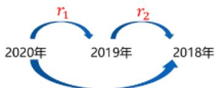  
和 + 积

$$
\textbf {r} _ {\text {间 隔}} = \textbf {r} _ {1} + \textbf {r} _ {2} + \textbf {r} _ {1} * \textbf {r} _ {2}
$$

$r_1$  ：今年的增长率

$\mathbf{r}_2$  ：去年的增长率

# 【注意】间隔增长率

1. 识别：2020年比2018年增长  $+ \%$  （隔一年，求增长率）。  
2. 已知: 2020 年收入同比增长率为  $r_{1}$ , 2019 年同比增长率为  $r_{2}$  。求: 2020 年与 2018 年相比的增长率是多少?

（1）求增长率，  $r =$  （现期-基期）基期  $=$  （2020年-2018年）/2018年，材料不会直接给出2018年数据，考虑用“现期  $=$  基期  $* (1 + r)$ ”将  $r_1$  、  $r_2$  联系起来，2020年  $= 2019$  年  $* (1 + r_1) = 2018$  年  $* (1 + r_2) * (1 + r_1)$ ，代回原始公式，[2018年  $* (1 + r1) * (1 + r2) - 1] / 2018$  年  $= 1 + r_1 + r_2 + r_1 * r_2 - 1 = r_1 + r_2 + r_1 * r_2$ 。  
(2)  $r_{1}$ : 今年（2020年）的增长率； $r_{2}$ : 去年（2019年）的增长率。

3. 通过“笑脸”图形象记忆，已知2020年比2019年的增长率  $r_1$ 、2019年比2018年的增长率  $r_2$ ，可以求出2020年比2018年的增长率  $r_间$ ，记忆为“和+积”。

速算技巧：  $\mathbf{r} = \mathbf{r}_1 + \mathbf{r}_2 + \mathbf{r}_1*\mathbf{r}_2$

1. 先计算  $\mathrm{r}_1 + \mathrm{r}_2$  ，结合选项

【练习1】  $8.5\% + 36\% + 8.5\% * 36\% \approx$  （）

A.  $47.6\%$

B.  $40.4\%$

C.  ${34.5}\%$

D.  $27.6\%$

2. 若  $r_1$  、  $r_2$  的绝对值均小于  $10\%$  （  $r_1 * r_2 < 1\%$  ），结合选项乘积可忽略

【练习2】  $5.6\% + 6.3\% + 5.6\% * 6.3\% \approx$  （）

A.  ${12.26}\%$

B.  $10.87\%$

C.  $13.21\%$

D.  $9.69\%$

3. 结合选项不能排除：挑一个百化分

【练习3】  $11.9\% + 25.1\% + 11.9\% * 25.1\% \approx$  （）

A.  $38.8\%$

B.  $39.9\%$

C.  $37.7\%$

D.  $36.6\%$

【注意】速算技巧：  $\mathrm{r} = \mathrm{r}_1 + \mathrm{r}_2 + \mathrm{r}_1 * \mathrm{r}_2$ 。

1. 先计算  $\mathrm{r}_1 + \mathrm{r}_2$  ，结合选项。

例：  $8.5\% +36\% +8.5\% *36\% \approx$  （ ）。

A.  $47.6\%$

B.  $40.4\%$

C.  $34.5\%$

D.  $27.6\%$

答:  $8.5\% + 36\% = 44.5\%$ ,  $8.5\% * 36\%$  为正数, 答案比  $44.5\%$  大, 对应 A 项。

2. 若  $r_1$  、  $r_2$  的绝对值均小于  $10\%$  （  $r_1 * r_2 < 1\%$  ），结合选项乘积可忽略。

例：  $5.6\% + 6.3\% + 5.6\% * 6.3\% \approx$  （ ）。

A.  $12.26\%$  
B.  $10.87\%$  
C.  $13.21\%$  
D.  $9.69\%$

答： $5.6\% + 6.3\% = 11.9\%$ ， $5.6\% * 6.3\%$  为正数，答案比  $11.9\%$  大，锁定 A、C 项。 $5.6\% * 6.3\% < 10\% * 10\% = 1\%$ ，对结果的影响很小，一般可以忽略，所求  $= 11.9\% + 1 - \%$ , 对应 A 项。

3. 结合选项不能排除：挑一个百亿分。比如  $63\% * 14.3\% \approx 63\% * (1 / 7) = 9\%$

例：  $11.9\% +25.1\% +11.9\% *25.1\% \approx$  （ ）。

A.  $38.8\%$

B.  $39.9\%$

C.  $37.7\%$

D.  $36.6\%$

答： $11.6\% + 25.4\% = 37\%$ ， $11.9\% * 25.1\%$  为正数，答案比  $37\%$  大，但选项均满足。 $11.9\% * 25.1\% \approx 12\%$ (1/4)  $= 3\%$ ，所求  $= 37\% + 3\% = 40\%$ ，对应 B 项。

# 一、间隔增长率

识别：中间隔一年，求增长率

公式：  $\mathrm{r} = \mathrm{r}_1 + \mathrm{r}_2 + \mathrm{r}_1 * \mathrm{r}_2$  （和+积）

计算: ①先算加法, 结合选项排除

(2) 再算乘法: 若  $r_{1} 、 r_{2}$  均小于  $10 \%$ , 则乘积小于  $1 \%$ , 一般可忽略有超过  $10 \%$ , 可百化分快速计算

# 【注意】间隔增长率：

1. 识别：中间隔一年（比如2020年比2018年，2016年比2014年，如果隔好几年的数据，则不是间隔增长率的知识点，而是年均增长率相关问题），求增长率。  
2. 公式： $\mathbf{r} = \mathbf{r}_1 + \mathbf{r}_2 + \mathbf{r}_1 * \mathbf{r}_2$  （和+积）。  
3.计算：

(1) 先算加法，结合选项排除。  
(2) 再算乘法:

(1) 若  $\mathrm{r}_{1} 、 \mathrm{r}_{2}$  均小于  $10 \%$ , 则乘积小于  $1 \%$ , 一般可忽略。  
(2)有超过  $10 \%$ , 可以将其中一个化为  $1 / n$  的形式计算。

【例1】（2024四川）2022年，全国软件和信息技术服务业规模以上企业超3.5万家，累计完成软件业务收入108126亿元，同比增长  $11.2\%$  ，增速较上年同期回落6.5个百分点。

2022年，全国软件和信息技术服务业规模以上企业累计完成软件业务收入约比2020年增长了：

A.  $16\%$

B.  $23\%$

C.  $29\%$

D.  $31\%$

【解析】1. 增长  $+ \%$  ，2022年与2020年间隔一年，求增长率，间隔增长率问题，公式：  $\mathrm{r} = \mathrm{r}_1 + \mathrm{r}_2 + \mathrm{r}_1*\mathrm{r}_2$  。主体为“国软件和信息技术服务业规模以上企业累计完成软件业务收入”，已知“累计完成软件业务收入108126亿元，同比增长  $11.2\%$  增速较上年同期回落6.5个百分点”，给出增长率和百分点，则  $\mathrm{r}_1 = 11.2\%$  ，高减低加，  $\mathrm{r}_2 = 11.2\% + 6.5\% = 17.7\%$  。代入数据，所求  $= 11.2\% + 17.7\% + 11.2\% * 17.7\% > 28.9\%$  增长率均大于  $10\%$  ，不能忽略，  $11.2\% * 17.7\% > 1\%$  ，所求  $= 28.9\% + 1^{\%} > 30\%$  ，对应D项。【选D】

【注意】如果计算： $11.2\% * 17.7\% \approx 1 / 9 * 18\% = 2\%$ ，所求  $= 28.9\% + 2\% = 30.9\%$ ，对应D项。

【例2】（2024联考）2022年，全国共有260家银行机构和29家理财公司累计新发理财产品2.94万只，同比下降  $38.23\%$  ，降幅比上年同期扩大7.22个百分点；累计募集资金89.62万亿元，同比减少32.57万亿元。

2022年全国银行机构和理财公司累计新发理财产品只数与2020年相比约：

A.下降  $45\%$

B.下降  $57\%$

C.下降  $66\%$

D.下降  $69\%$

【解析】2. 下降  $+ \%$  ，求增长率，2022年与2020年隔一年，间隔增长率问题，公式：r间  $= \mathrm{r}_1 + \mathrm{r}_2 + \mathrm{r}_1*\mathrm{r}_2$  。主体为“全国银行机构和理财公司累计新发理财产品只数”，已知“2022年，全国共有260家银行机构和29家理财公司累计新发理财产品2.94万只，同比下降  $38.23\%$  ，降幅比上年同期扩大7.22个百分点”，给出

增长率和百分点， $r_1 = -38.23$ , 高减低加,  $r_2 = -(38.23\% - 7.22\%) \approx -31\%$ , 代入数据, 所求  $= -38.23\% - 31\% + 38.23\%$ * $31\%$ ,  $|r|$  均大于  $10\%$ , 不能忽略, 所求  $\approx -69\% + 38\%$ ;  $(1/3) \approx -69\% + 12\% = 57\%$ , 对应 B 项。【选 B】

【注意】降幅的变化分析：先对降幅的高减低加，求增长率补上负号。比如老邓亏了5万，亏损比去年扩大了2万，则去年亏算了3万。高减低加，去年亏损  $= 5 - 2 = 3$  万，利润  $= -3$  万。

题型延伸①：间隔倍数

特征：隔一年，求倍数

2020年工资同比增长了  $25\%$  ，2019年同比增长了  $20\%$

则2020年工资是2018年的多少倍？

两步走：

(1) 先求出间隔增长率  
②间隔倍数=间隔增长率+1

# 【注意】间隔倍数：

1. 特征：隔一年，求倍数。比如今年比去年的增长率为  $35\%$  ，则今年是去年的 1.35 倍（倍数  $= r + 1$ ）。  
2. 两步走：

(1) 先求出间隔增长率。  
(2) 间隔倍数  $=$  间隔增长率 +1。

3. 例：2020年工资同比增长了  $25\%$  ，2019年同比增长了  $20\%$  ，则2020年工资是2018年的多少倍？

答：问2020年是2018年的多少倍，先求间隔增长率，再“+1”， $r_1 = 25\%$ 、 $r_2 = 20\%$ ， $r_{间} = 25\% + 20\% + 25\% * 20\% = 45\% + 25\% \times (1/5) = 45\% + 5\% = 50\%$ ，间隔增长率  $50\%$  则间隔倍数为1.5倍。

题型延伸②：间隔基期量

特征：隔一年，求基期

2020年工资额是400元，同比增长了  $10\%$  ，2019年同比增长了  $20\%$

则 2018 年的工资是多少元？

两步走：

(1) 先求出间隔增长率  
(2)间隔基期=现期量/（1+间隔增长率）

【注意】间隔基期量：

1. 特征：隔一年，求基期。  
2. 计算方法：两步走。

(1) 先求出间隔增长率。  
(2) 间隔基期=现期量/（1+间隔增长率）。

3. 例：2020年工资额是400元，同比增长了  $10\%$  ，2019年同比增长了  $20\%$  则2018年的工资是多少元？

（1）常规思路：2020年/  $(1 + 10\%) = 400 / (1 + 10\%) = 2019$  年，2019年/  $(1 + 20\%)$ $= 2018$  年。  
（2）先算出间隔增长率，基期  $=$  现期/（1+间隔增长率）。r间 $= 10\% +20\% +10\% *20\% = 32\%$  ，所求  $= 400 / (1 + 32\%) = 400 / 1.32\approx 300.$

【例3】（2024联考）2023年，全国软件和信息技术服务业规模以上企业超3.8万家，累计完成软件业务收入123258亿元，同比增长  $13.4\%$  ，较上年同期增长2.2个百分点。

2021年，全国软件和信息技术服务业规模以上企业的软件业务收入约为：

A. 不到 9 万亿元

B. 9 万亿～10 万亿元

C. 10 万亿  $\sim 11$  万亿元

D. 11 万亿元以上

【解析】3. 间隔一年求基期，先求间隔增长率。主体为“全国软件和信息技术服务业规模以上企业的软件业务收入”，已知“同比增长  $13.4\%$  ，较上年同期增长2.2个百分点”，给出增长率、百分点，  $\mathrm{r}_1 = 13.4\%$  ，高减低加，则  $\mathrm{r}_2 = 13.4\% - 2.2\% = 11.2\%$  ，  $\mathrm{r}_{\text{间}} = \mathrm{r}_1 + \mathrm{r}_2 + \mathrm{r}_1*\mathrm{r}_2 = 13.4\% + 11.2\% + 13.4\% * 11.2\% = 24.6\% + 1\% \approx 26\%$  ，间隔基期=现期/（1+间隔增长率）  $\approx 12.3$  万亿/（1+26%）=12.3/1.26=10，对应B项。

【选B】

题型延伸③：间隔增长率逆向公式

常规情况：给  $\mathbf{r}_1$  和  $\mathbf{r}_2$  ，求  $\mathbf{r}_{\text{间隔}}$

逆向考查：给  $\mathbf{r}_1$  和  $\mathbf{r}_{\text{间隔}}$  ，求  $\mathbf{r}_2$

$$
\begin{array}{l} \textbf {r} _ {\text {间 隔}} = \textbf {r} _ {1} + \textbf {r} _ {2} + \textbf {r} _ {1} * \textbf {r} _ {2} \\ \mathrm {r} _ {2} = \left(\mathrm {r} _ {\text {间}} - \mathrm {r} _ {1}\right) / \left(1 + \mathrm {r} _ {1}\right) \\ \end{array}
$$

【引例】已知2021年比2020年增长  $15\%$  ，2021比2019年增长  $30\%$  ，求2020比2019年增长大约多少？

A.  $-16\%$

B.  $-13\%$

C.  $13\%$

D.  $16\%$

【注意】题型延伸③：间隔增长率逆向公式。

1. 常规情况：给  $\mathbf{r}_1$  和  $\mathbf{r}_2$ ，求  $\mathbf{r}$  间隔。  
2. 逆向考查：给  $r_1$  和  $r_{\text{间隔}}$ ，求  $r_2$ 。三个量知道其中两个，一定能求出第三个量。  
3. 公式推导： $\mathbf{r}_{\text{间隔}} = \mathbf{r}_1 + \mathbf{r}_2 + \mathbf{r}_1 * \mathbf{r}_2 \rightarrow \mathbf{r}_{\text{间}} - \mathbf{r}_1 = \mathbf{r}_2 * (1 + \mathbf{r}_1) \rightarrow \mathbf{r}_2 = (\mathbf{r}_{\text{间}} - \mathbf{r}_1) / (1 + \mathbf{r}_1)$ 。  
4. 引例：已知2021年比2020年增长  $15\%$  ，2021比2019年增长  $30\%$  ，求2020比2019年增长大约多少？

A.  $-16\%$

B.  $-13\%$

C.  $13\%$

D.  $16\%$

答：给  $\mathbf{r}_{\text{间}}$ 、 $\mathbf{r}_{1}$ ，求  $\mathbf{r}_{2}$ ，代入数据，所求  $= (30\% - 15\%) / (1 + 15\%) = 15\% / (1^{+}) < 15\%$ ，对应C项。

【例4】（2023国考）2021年，全国纺织品服装出口3155亿美元，同比增长  $8.4\%$  。其中，纺织品出口1452.2亿美元，同比下降  $5.6\%$  ，较2019年增长 $22.0\%$  ；服装出口1702.8亿美元，同比增长  $24.0\%$  ，较2019年增长  $16.0\%$  。其中，针织服装及衣着附件出口864.8亿美元，同比增长  $39.0\%$  ；梭织服装及衣着附件出口701.2亿美元，同比增长  $12.6\%$  。

2020年，全国服装出口额比2019年：

A. 增长了  $10\%$  以上

B. 下降了  $10\%$  以上

C. 增长了不到  $10\%$

D. 下降了不到  $10\%$

【解析】4. 增长/下降  $+ \%$  ，求增长率。主体为“服装出口1702.8亿美元，同比增长  $24.0\%$  ，较2019年增长  $16.0\%$  ”，已知2021年的同比增速  $\mathrm{r}_{1}$  、2021年比2018年的增长率  $\mathrm{r}_{\text{间}}$  ，求2020年比2019年的增长率  $\mathrm{r}_{2}$  ，代入公式：  $\mathrm{r}_{2} = (\mathrm{r}_{\text{间}} - \mathrm{r}_{1}) / (1 + \mathrm{r}_{1}) = (16\% - 24\%) / (1 + 24\%) = -8\% / (1^{+})$  ，负数代表下降，排除A、C项，数据小于  $8\%$  ，对应D项。【选D】

【例5】（2023深圳）2021年  $1\sim 2$  月，全国房地产开发投资13986亿元，同比增长3873亿元；房屋施工面积770629万平方米，同比增长  $11.0\%$  。其中，住宅542503万平方米，增长  $11.2\%$  ；办公楼31802万平方米，增长  $7.3\%$  ；商业营业用房76346万平方米，增长  $2.5\%$  ；其他类型119978万平方米。房屋新开工面积17037万平方米，增长  $64.3\%$  ，其中，住宅12736万平方米，增长  $68.5\%$  。商品房销售面积17363万平方米，同比增长1.05倍，比2019年  $1\sim 2$  月增长 $23.3\%$  ；商品房销售额19151亿元，同比增长1.33倍，比2019年同期增长  $49.6\%$  。

2020年  $1\sim 2$  月，全国商品房销售面积同比增长：

A.  $-40.0\%$

B.  $-32.5\%$

C.  $40.0\%$

D.  $17.2\%$

【解析】5. 求 2020 年  $1 \sim 2$  月的同比增长率，主体为“全国商品房销售面积”，已知“商品房销售面积 17363 万平方米，同比增长 1.05 倍，比 2019 年  $1 \sim 2$  月增长  $23.3\%$  ，“增长 1.05 倍”即  $r = 1.05$  ，说明增长率为  $105\%$  ，材料给出  $r_{\text{间}}$ 、 $r_{1}$ ，求  $r_{2}$ ，代入公式： $r_{2} = (r_{\text{间}} - r_{1}) / (1 + r_{1}) = (23\% - 105\%) / (1 + 105\%) = -82\% / (2^{+}) \approx -40\%$  ，对应 A 项。【选 A】

【注意】概念辨析：增长1.05倍的意思就是  $r = 1.05$  （ $105\%$ ）。

1. 有同学认为增长率为  $1.05 - 1 = 0.05 = 5\%$  ，可以结合例子理解，老邓今年收入为10万，同比增长0.5倍，如果按照上述逻辑，增长率  $= 0.5 - 1 = -0.5 = -50\%$  ，即收入下降  $50\%$  ，明显不合理。  
2. 问题是只看到了“1.05倍”，没有看到前面的“增长”。如果表述为“今年是去年的1.05倍”，则  $r = 1.05 - 1 = 5\%$ ；本题的表述为“今年比去年增长1.05倍”，

则增长率为  $105\%$

2021年  $1\sim 7$  月，我国原油产量11561万吨，同比增长  $2.4\%$  ，比2019年同期增长  $3.9\%$  。其中，7月我国原油产量1686万吨，增长  $2.5\%$  ，比2019年同期增长  $3.1\%$  。

【练习】（2022江苏）2020年  $1\sim 7$  月，我国原油产量的同比增速是：

A.  $1.46\%$

B.  $1.90\%$

C.  $2.36\%$

D.  $3.15\%$

【解析】拓展.课堂正确率为  $92\%$  。求增长率，主体为“我国原油产量”，已知“2021年  $1 \sim 7$  月，我国原油产量11561万吨，同比增长  $2.4\%$  ，比2019年同期增长  $3.9\%$  ”，直接给出  $\mathrm{r}_{\text{间}}$ 、 $\mathrm{r}_{1}$ ，求  $\mathrm{r}_{2}$ ，代入公式： $\mathrm{r}_{2} = (\mathrm{r}_{\text{间}} - \mathrm{r}_{1}) / (1 + \mathrm{r}_{1}) = (3.9\% - 2.4\%) / (1 + 3.9\%) = 1.5\% / (1^{+}) < 1.5\%$  ，对应A项。【选A】

# 二、年均增长率

例：2015 年存款 100 万，每年利率都是  $10\%$ （复利），18 年有多少钱？

<table><tr><td>基期</td><td></td><td></td><td>现期</td></tr><tr><td>2015年</td><td>2016年</td><td>2017年</td><td>2018年</td></tr><tr><td>100万</td><td>100×(1+10%)</td><td>100×(1+10%)2</td><td>100×(1+10%)3</td></tr></table>

$$
\text {现 期} = \text {基 期} \times \left(\mathbf {1} + \mathrm {r} _ {\text {年 均}}\right) ^ {3} \longrightarrow \left(\mathbf {1} + \mathrm {r} _ {\text {年 均}}\right) ^ {n} = \frac {\text {现 期 量}}{\text {基 期 量}}
$$

年均增长率——比较大小

识别：年均增长最快、年均增速排序

公式：  $(1 + r_{\text{年均}})^n =$  现期量/基期量（n为现期和基期的年份差）

技巧：n相同，直接比较“现期/基期”

注：n 的确定和年均增长量一样

【注意】年均增长率：每年增速都相同。

1. 例：2015 年存款 100 万，每年利率都是  $10\%$  （复利），2018 年有多少钱？

（1）假如存 100 万，如果单利是  $5\%$  ，则存 1 年是 5 万，2 年是 10 万，10 年是 50 万。

(2) 如果复利是  $10\%$ , 相当于 “利滚利”, 2015 年  $= 100$  万, 2016 年  $= 100 * (1 + 10\%)$ , 2017 年  $= 100 * (1 + 10\%) * (1 + 10\%) = 100 * (1 + 10\%)^{2}$ , 2018 年  $= 100 * (1 + 10\%)^{3}$ , 得到年均增长率公式: 基期  $\left(1 + r_{\text {年均}}\right)^{3}=$  现期  $\rightarrow\left(1 + r_{\text {年均}}\right)^{n}=$  现期量/基期量。

2. 年均增长率——比较大小：

(1) 识别：年均增长最快、年均增速排序。  
(2) 公式:  $\left(1 + r_{\text {年均}}\right)^{n}$  = 现期量/基期量 (n 为现期和基期的年份差)。  
(3) 技巧: n 相同, 直接比较 “现期/基期”。  
(4) 注: n 的确定和年均增长量相同。

3. 例：小邓2016年有100万，2024年有800万；小邓2016年有1000亿，小马2024年有3000亿，问谁的年均增长率大。

答：增长率比较，看“现期/基期”，都是  $2016 \sim 2024$  年，年份差  $n$  相同，都有“ $1+$ ”，则不需要考虑，只看“现期/基期”即可。小邓：800万/100万=8倍，小马：3000亿/1000亿=3倍，故小邓年均增长率更大。

【例1】（2023联考）

2012—2021年辽宁、河北等8省份海水冷却用水量（亿吨）  

<table><tr><td></td><td>2012</td><td>2013</td><td>2014</td><td>2015</td><td>2016</td><td>2017</td><td>2018</td><td>2019</td><td>2020</td><td>2021</td></tr><tr><td>辽宁</td><td>56.2</td><td>58.4</td><td>116.2</td><td>113.8</td><td>80.0</td><td>92.9</td><td>104.2</td><td>99.1</td><td>139.1</td><td>49.0</td></tr><tr><td>河北</td><td>30.1</td><td>33.8</td><td>39.1</td><td>29.3</td><td>31.6</td><td>38.7</td><td>39.0</td><td>39.0</td><td>40.1</td><td>54.6</td></tr><tr><td>山东</td><td>83.7</td><td>56.3</td><td>56.4</td><td>56.6</td><td>63.7</td><td>83.1</td><td>87.3</td><td>121.8</td><td>123.1</td><td>145.1</td></tr><tr><td>江苏</td><td>44.2</td><td>42.4</td><td>42.4</td><td>42.4</td><td>42.4</td><td>42.4</td><td>50.3</td><td>89.6</td><td>112.3</td><td>117.5</td></tr><tr><td>浙江</td><td>199.1</td><td>206.2</td><td>253.6</td><td>336.0</td><td>305.6</td><td>306.8</td><td>315.4</td><td>331.6</td><td>333.7</td><td>338.7</td></tr><tr><td>福建</td><td>69.8</td><td>102.3</td><td>102.9</td><td>142.3</td><td>178.2</td><td>225.2</td><td>234.5</td><td>227.5</td><td>249.2</td><td>264.3</td></tr><tr><td>广东</td><td>275.5</td><td>299.6</td><td>318.5</td><td>332.2</td><td>386.1</td><td>418.4</td><td>416.9</td><td>466.1</td><td>564.1</td><td>571.3</td></tr><tr><td>广西</td><td>24.5</td><td>24.2</td><td>22.8</td><td>17.6</td><td>38.8</td><td>54.2</td><td>61.4</td><td>58.1</td><td>70.8</td><td>70.6</td></tr></table>

根据资料，判断“2012～2021年表中的8个省份中福建的海水冷却用水量年平均增速最快”这一说法是否正确。

A. 正确

B. 错误

【解析】1. 比较“年均平均增速”，年均增长率的比较。2012～2021年，年份差相同，材料给出现期、基期，直接比较“现期/基期=2021年/2012年”。福

建： $260^{+} / (60^{+}) = 4^{+}$ ；其他年份都是1倍多、2倍多，说法正确，对应A项。【选 A】

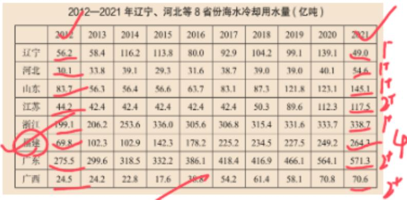

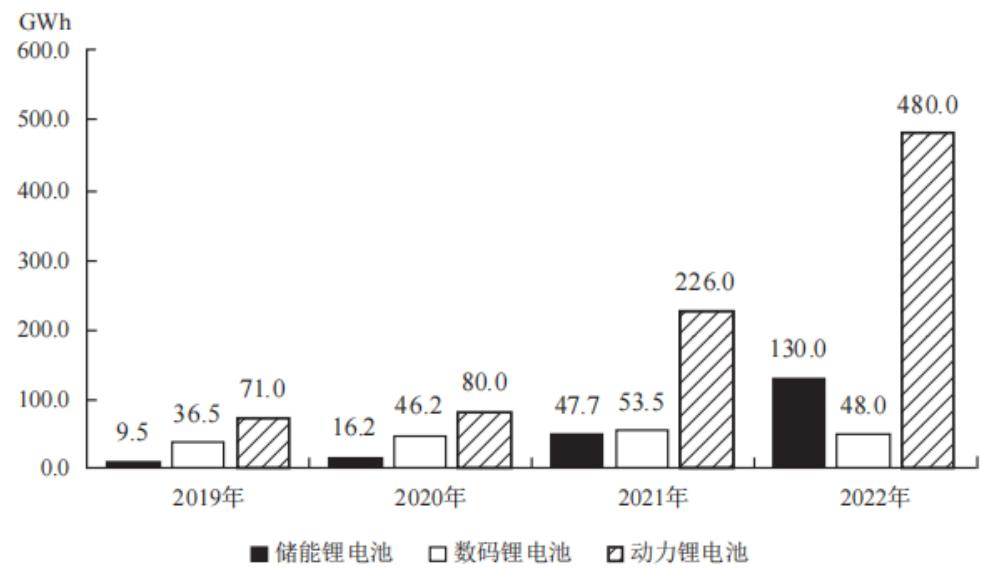  
【例 2】(2024 联考)  
2019—2022年中国锂电池出货量

根据资料，判断“2019～2022年，中国储能锂电池出货量年均增速为3类锂电池中最快”这一说法是否正确。

A. 正确

B. 错误

【解析】2. 问“年均增速最快”，年均增长率的比较。2019～2022年，年份差  $n$  相同，给出现期、基期，直接比较“现期/基期=2022年/2019年”（不要看斜率，要看数据之间的倍数关系）。储能： $130 / 9.5 = 10^{+}$ ，数码： $48 / 36.5 = 1^{+}$ ，动力： $480 / 71 = 6^{+}$ ，储能最大，说法正确，对应A项。【选A】

【例3】（2022北京）

# 2014—2020年中国各类耐磨材料消费量

单位：万吨  

<table><tr><td></td><td>金属耐磨材料</td><td>陶瓷耐磨材料</td><td>树脂耐磨材料</td></tr><tr><td>2014年</td><td>359</td><td>30</td><td>50</td></tr><tr><td>2015年</td><td>363</td><td>25</td><td>46</td></tr><tr><td>2016年</td><td>366</td><td>24</td><td>48</td></tr><tr><td>2017年</td><td>373</td><td>25</td><td>51</td></tr><tr><td>2018年</td><td>386</td><td>26</td><td>49</td></tr><tr><td>2019年</td><td>401</td><td>25</td><td>47</td></tr><tr><td>2020年</td><td>416</td><td>24</td><td>48</td></tr></table>

将①金属耐磨材料、②陶瓷耐磨材料和③树脂耐磨材料按2014～2020年消费量年均增速（以2014年为基础）从高到低排列，以下正确的是：

A. ①②③

B. ③②①

C. ②③①

D. ①③②

【解析】3. 比较年均增速。给出现期、基期，年份差  $n$  相同，直接比较“现期/基期  $= 2020$  年/2014 年”。①： $416 / 359 = 1^{+}$ ，②： $24 / 30 = 0.8$ ，③： $48 / 50 = 0.9^{+}$ ，① 最大，② 最小，对应 D 项。【选 D】

【注意】现期/基期  $< 1$  ，增长率为负数，但“现期/基期越大，增长率越大”是恒成立的，比如基期为100，现期为90，则倍数为  $90 / 100 = 0.9$  倍， $r = -10\%$ ；现期为80，倍数为  $80 / 100 = 0.8$  倍， $r = -20\%$ ， $0.9 > 0.8$ ， $-10\% > -20\%$ ，满足“现期/基期越大，增长率越大”。

年均增长率计算（考得非常少）

识别：年均增长率为……

公式：  $(1 + r_{\text{年均}})^n =$  现期量/基期量（n为现期和基期的年份差）

方法：居中代入

【注意】年均增长率计算（国考从来没有考查过，广东省考和深圳市考基本每年考查1题）：

1. 识别：年均增长率为……  
2. 公式:  $\left(1 + r_{\text {年均}}\right)^{n}$  =现期量/基期量 (n 为现期和基期的年份差)。

3. 方法：居中代入。

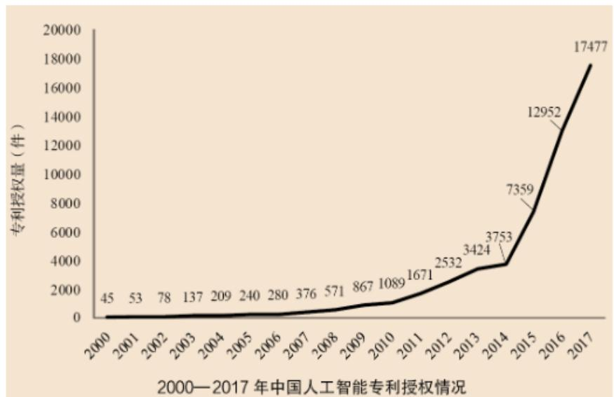

【拓展】根据资料，下列关于我国  $2000 \sim 2017$  年相关信息说法正确的是：

B.2014年至2017年人工智能领域专利授权量年均增速为  $120\%$

【解析】拓展. 综合分析，问正确的，只看 B 项即可。

B 项: “2014 年至 2017 年”的年份差为 3 , 求年均增长率,  $(1 + r_{\text {年均}})^{n} =$  现期量/基期量, 代入数据, 左边为  $(1 + 120\%)$ $^{3} > 2^{3} = 8$ , 右边为  $17477 / 3753 \approx 5$ , 左右两边不相等, 说法错误。【不选】

【例4】（2024广东）

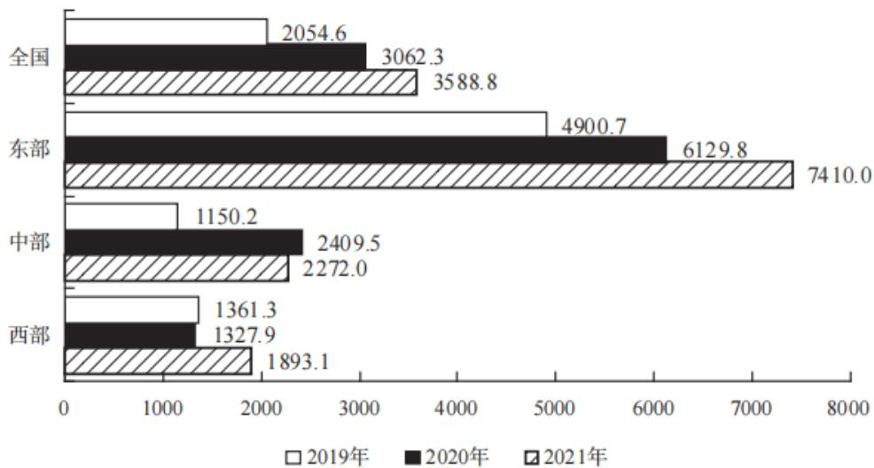

2019～2021年，全国县域农业农村信息化建设县均社会资本投入的年均增

# 长率约为：

A.  $10\%$

B.  $21\%$

C.  $32\%$

D.  $43\%$

【解析】4. 求年均增长率，公式： $(1 + r_{\text{年均}})^n =$  现期量/基期量。问题时间为“2019～2021年”，现期为2021年，基期为2019年，年份差为2。右边=现期/基期=3588/2050，截两位看作3588/21，首位商1，次位商7，结果为  $1.7^{+}$ ；居住代入  $30\%$  ，左边  $= (1 + 30\%)^2 = 1.69$  ，代入的  $30\%$  略小一点，实际年均增长率比  $30\%$  略大一点点，对应C项。【选C】

【注意】D项：  $1.4^{2} = 1.96 > 1.7$  ，排除D项。

# 三、混合增长率

# 三、混合增长率

题型识别：

(1)求增长率, 无法直接计算  
(2) 主体之间有和差关系

例：已知前三季度增长率，四季度增长率，求全年增长率。

例如：

(1)固定搭配：进口+出口=进出口、城镇+农村=全国、邮政+电信=邮电  
(2)时间累计型: 1至11月+12月=全年、一季度+二季度=上半年  
(3)逻辑型：A+非 A=全部（实物+非实物=所有商品）

判断口诀：

(1) 混合后总体居中（最小  $r<$  总体  $r<$  最大  $r$ ）

补例1：2019年进口增长了  $10\%$  ，出口增长了  $20\%$  ，则进出口可能增长了多少？

A.  $8\%$

B.  $9\%$

C.  $14\%$

D.  $21\%$

补例2：2019年进出口增长了  $10\%$  ，出口增长了  $20\%$  ，则进口可能增长了多少？

A.  $8\%$

B.  $12\%$

C.  $14\%$

D.  $21\%$

【注意】混合增长率：

# 1. 题型识别:

（1）求增长率，没有数据，无法直接计算。  
(2) 求的主体和材料之间有和差关系。  
(3) 例: 已知前三季度增长率、四季度增长率, 求全年增长率? 材料中没有全年, 前三季度+第四季度=全年（是量有加和关系, 不是率）。

# 2. 和差关系：

（1）固定搭配：进口+出口=进出口、邮政+电信=邮电。出现邮电方面和进出口方面的材料可以想到考查混合增长率。  
(2) 时间累计型: 1 至 11 月+12 月=全年、一季度+二季度=上半年。  
(3) 逻辑型: A+非 A=全部。比如男生+女生=总人数; 实物+非实物=全部。

3. 判断口诀: 混合后总体居中 (最小  $r<$  总体  $r<$  最大  $r$  )。

（1）如男生人均身高  $190\mathrm{cm}$  、女生人均身高  $170\mathrm{cm}$ ，男生、女生混合后，身高不可能是  $360\mathrm{cm}$ ，人均身高在  $170\sim 190\mathrm{cm}$  之间，增长率混合同理，混合之后总体居中，最小  $r<$  总体  $r<$  最大  $r$ 。  
(2) 补例 1: 2019 年进口增长了  $10 \%$ , 出口增长了  $20 \%$ , 则进出口可能增长了多少?

A.  $8\%$

B.  $9\%$

C.  $14\%$

D.  $21\%$

答：进口+出口=进出口，混合后总体居中，则  $10\% < r_{\text{进出口}} < 20\%$  ，只有C项符合。  
(3) 补例 2: 2019 年进出口增长了  $10 \%$ , 出口增长了  $20 \%$ , 则进口可能增长了多少?

A.  $8\%$

B.  $12\%$

C.  $14\%$

D.  $21\%$

答：进口+出口=进出口，r进出口居中，r进口<r进出口（10%）<r出口（20%），只有A项符合。

【例1】（2023山东）2021年，中国跨境电商交易规模达14.2万亿元，占我国货物进出口总额的比例为  $36.3\%$  。其中出口跨境电商交易规模11万亿元，同比增速  $13.4\%$  ；进口跨境电商交易规模3.2万亿元，同比增速  $14.3\%$  。2017—2022年第一季度，中国跨境电商领域共发生262次投资，投资总金额654.91亿元。

2021年，我国跨境电商交易规模同比增长：

A.  $12.8\%$

B.  $13.4\%$

C.  $13.6\%$

D.  $14.3\%$

【解析】1. 求我国跨境电商交易规模的增长率，本题模仿国考，国考说的是“跨境进出口”，本题没写全，“跨境”即和境外做买卖，就是进出口的情况，材料中分为进口和出口，进出口=进口+出口，混合后总体居中，则  $r_{\text{进出口}}$  介于  $13.4\% \sim 14.3\%$  之间，只有C项符合。【选C】

【注意】选项设计：B项为出口、D项为进口，C项刚好居中。

【例2】(2022江苏)2020年江苏省全省网上零售额10602亿元，增长  $10.0\%$  。其中，实物商品网上零售额增长  $13.9\%$  ，增速比上年快5.2个百分点，占社会消费品零售总额37086亿元的比重为  $24.9\%$  ，提高2.7个百分点。

根据资料，判断“2020年江苏非实物商品网上零售额增速高于  $13.9\%$ ”这一说法是否正确。

A. 正确

B. 错误

【解析】2. 出现非实物，求增速，非实物+实物=总体，考虑混合增长率。混合后总体居中，r全省=10%，r实物=13.9%，则r非实物<10%<13.9%，说法错误，对应B项。【选B】

【注意】多年没有考查过3者混合，之前江苏考查过，可以先两者混合，得到范围后再和另一个混合，方法是一样的。

【例3】（2025四川）2022年上半年，我国软件与信息技术服务业总收入同比增长  $10.9\%$  ，增速较1—5月份提高0.3个百分点。软件与信息技术服务业收入中，软件产品收入、信息技术服务收入、信息安全收入、嵌入式系统软件收入同比分别增长  $10.2\%$  、  $12\%$  、  $11.4\%$  和  $5\%$  。信息技术服务收入中，云计算、大数据服务收入4790亿元，同比增长  $9.3\%$  ；集成电路设计收入1279亿元，同比增长 $15.2\%$

根据资料，判断“2022年6月，我国软件与信息技术服务业总收入增速超过  $10\%$ ”这一说法是否正确。

A. 正确

B. 错误

【解析】3. 求6月的增速，给出  $1 \sim 6$  月和  $1 \sim 5$  月，上半年  $= 6$  月  $+ 1 \sim 5$  月，考虑混合增长率，混合之后整体居中，上半年增速  $10.9\%$  ， $1 \sim 5$  月增速  $= 10.9\% - 0.3\% = 10.6\%$  ， $1 \sim 5$  月增速  $10.6\% <$  上半年增速  $10.9\% < 6$  月增速，正确，对应A项。【选A】

【例4】（2023广东）2022年，全国居民人均可支配收入36883元，比上年增长（以下如无特别说明，均为同比名义增长） $5.0\%$ 。分城乡看，城镇居民人均可支配收入49283元，增长 $3.9\%$ ；农村居民人均可支配收入20133元，增长 $6.3\%$ 。

2022年，全国居民人均消费支出24538元，比上年增长  $1.8\%$  。分城乡看，城镇居民人均消费支出30391元，增长  $0.3\%$  ；农村居民人均消费支出16632元，增长  $4.5\%$  。

2022年，全国居民人均收支盈余比上一年：（注：收支盈余=收入-消费支出）

A. 增加了约  $5\%$

B. 减少了约  $5\%$

C. 增加了约  $12\%$

D. 减少了约  $12\%$

【解析】4. 比如一个月收入10000，支出8000还房贷，盈余  $10000 - 8000 = 2000$  收支盈余  $=$  收入-消费支出  $\rightarrow$  收入  $=$  消费支出  $+$  收支盈余，存在加和关系，求增长率，为混合增长率问题。混合后总体居中， $\mathrm{r}_{\text {支出}}(1.8\%) < \mathrm{r}_{\text {收入}}(5\%) < \mathrm{r}_{\text {盈余}}$ ，仅C项符合。【选C】

【注意】偏向量大的，支出的量为24538，盈余的量为  $36883 - 24538 \approx 12000$

支出量大，总体的增长率偏向支出增长率  $1.8\%$  ，即左边距离小于右边距离，  $5\% - 1.8\% = 3.2\%$  ，则右边距离大于  $3.2\%$  ，所求  $>5\% + 3.2\% = 8.2\%$  ，不能选择  $5\%$  。

(2)偏向基数较大的（材料无基期，做题时用现期近似代替基期）

例：100gA 溶液浓度  $5\%$  ，100gB 溶液浓度  $10\%$  ，混合之后浓度？

A.  $6\%$

B.  $7.5\%$

C.  $9\%$

例：100gA 溶液浓度 5%，400gB 溶液浓度 10%，混合之后浓度？

A.  $6\%$

B.  $7.5\%$

C.  $9\%$

例：出口 400 万同比增速  $5 \%$ , 进口 100 万同比增速  $10 \%$ , 混合之后增速约?

A.  $6\%$

B.  $7.5\%$

C.  $9\%$

【注意】偏向基数较大的：

1. 例：男生人均身高  $190\mathrm{cm}$  、女生人均身高  $170\mathrm{cm}$ ，如果男生人数  $=$  女生人数，全班人均身高  $= 180\mathrm{cm}$  。如果男生人数  $>$  女生人数，则全班人均身高在  $180\sim 190\mathrm{cm}$  之间；如果男生人数  $<$  女生人数，则全班人均身高在  $170\sim 180\mathrm{cm}$  之间。线段法可以看成一个天平或者拔河，如果左右两边势均力敌，则会在中间维持平衡，如果右边量多，则向右边倾斜，靠近右边，如果左边量多，则向左边倾斜。  
2. 增长率 = 增长量 / 基期，增长率的量是基期量，但是题目一般都给现期量，看偏向用现期近似代替基期，偏向现期量大的。  
3. 例 1:  $100 \mathrm{~g} \mathrm{A}$  溶液浓度  $5 \%$ ,  $100 \mathrm{~g} \mathrm{B}$  溶液浓度  $10 \%$ , 混合之后浓度?

A.  $6\%$

B.  $7.5\%$

C.  $9\%$

答：等量混合，混合后浓度正好在中点， $(5\% + 10\%) / 2 = 7.5\%$ ，选择B项。

4. 例 2:  $100 \mathrm{~g} \mathrm{A}$  溶液浓度  $5 \%$ ,  $400 \mathrm{~g} \mathrm{B}$  溶液浓度  $10 \%$ , 混合之后浓度?

A.  $6\%$

B.  $7.5\%$

C.  $9\%$

答：B 溶液更多，偏向  $10\%$  ，在  $7.5\% \sim 10\%$  之间，选择 C 项。

4. 例：出口400万同比增速  $5\%$  ，进口100万同比增速  $10\%$  ，混合之后增速约？

A.  $6\%$

B.  $7.5\%$

C.  $9\%$

答：出口量更多，应该更靠近  $5\%$  ，则总体在  $5\% \sim 7.5\%$  之间，选择A项。

【例5】（2021新疆兵团）2018年H市完成邮电业务总量108.2亿元。其中，邮政业务总量40.8亿元，同比增长  $26.5\%$  ；电信业务总量67.4亿元，同比增长 $56.7\%$  。

年末移动电话用户达到341万户，其中，3G移动电话用户达到25.7万户，4G移动电话用户达到241.4万户。全市互联网接入用户89.9万户，其中，新增互联网用户23.8万户。

2018年H市邮电业务总量同比增速在下列哪一个范围内？

A.  $23\% \sim 41\%$

B.  $41\% \sim 57\%$

C.  $57\% \sim 71\%$

D. 高于  $71\%$

【解析】5. 邮电业务后面有“其中”，邮电业务分为邮政业务和电信业务两部分，考虑混合增长率，混合后居中，邮电业务增速介于  $26.5\% \sim 56.7\%$  之间，排除C、D项。邮政业务： $r = 26.5\%$  、量  $\approx 40$  亿元，电信业务： $r = 56.7\%$  、量  $\approx 67$  亿元，电信业务的量大，应该偏向电信业务，结合选项，选择B项。

不结合选项，自己看偏向的话，需要找中点，中点  $= (26.5\% + 56.7\%) / 2 = 41.6$ ,  $\mathrm{r}_{\text {邮电业务}}$  介于  $41.6\% \sim 56.7\%$  之间，选择B项。【选B】

【注意】r邮电业务介于  $41.6\% \sim 56.7\%$  之间，选项范围要大于标准答案的范围才能够选，假设月收入是5万，选项分别是A.  $1\sim 3$  万，B.  $4\sim 6$  万，选择B项；标准结果是  $\mathrm{r}_{\text {邮电业务}}$  介于  $41.6\% \sim 56.7\%$  之间，B项范围全部包含标准结果，在标准结果中取任意值，都包含在B项中，故可以选择B项。

【例6】（2025四川）2023年上半年，全国新注册登记机动车1688万辆，

同比增长  $1.9\%$  。新注册登记汽车1175万辆，同比增长  $5.8\%$  。其中，新注册登记载客汽车1034万辆，同比增长  $5.6\%$  ；新注册登记载货汽车133万辆，同比增长 $8.1\%$  。新注册登记新能源汽车313万辆，同比增长  $41.6\%$

2023年上半年，全国新注册登记非汽车类机动车数量比上年同期：

A. 增长了不到  $2\%$  
B. 增长了  $2\%$  以上  
C. 减少了不到  $2\%$  
D. 减少了  $2\%$  以上

【解析】6. 问题时间是 2023 年上半年，出现“非”，机动车=汽车+非汽车，求增长率，混合增长率，混合之后整体居中，非汽车增速<机动车增速  $1.9\% <$  汽车增速  $5.8\%$  ，只能排除B项；再看偏向，偏向量大的，汽车量为1175，机动车量为1688，非汽车量为  $1688 - 1755 \approx 500$  ，偏向汽车，左边距离小，右边距离为  $5.8\% - 1.9\% = 3.9\%$  ，左边距离  $< 3.9\%$  ，所求  $< 1.9\% - 3.9\% = -2\%$  ，临界值是  $-2\%$  ，距离比3.9个百分点更大，故减少了  $2\%$  以上，对应D项。【选D】

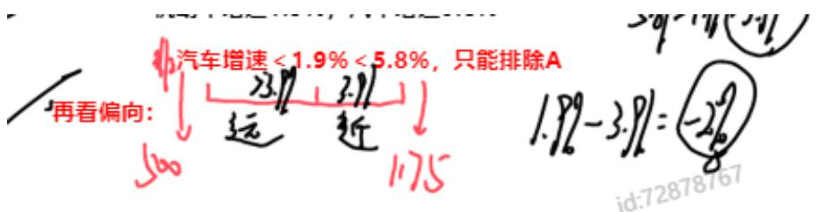

知识点拓展——线段法（用于混合增长率的精确计算）

解题逻辑：

混合增长率的题目先用口诀“混合之后总体居中，偏向量大的”来解决（90%以上）；

如果无法锁定唯一答案才需要用线段法计算

线段法的运用口诀：

1. 部分在两边，总体在中间；  
2. 距离和量成反比。

例：溶液 A 克，浓度 a%；溶液 B 克，浓度 b%。混合后的溶液浓度为 x%（a< x < b）

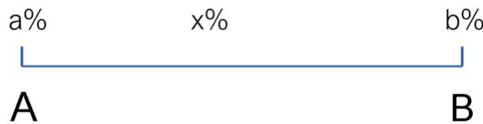

3分钟证明原理，感兴趣就听，不感兴趣就记操作

练习1：全年消费4000元，同比增长  $5\%$  ，上半年消费1000元，同比增长 $2\%$  ，下半年消费3000元，问下半年消费同比增长率为多少？

练习：上半年收入5万元，同比增长  $12\%$  ， $1\sim 5$  月收入4万元，同比增长 $10\%$  ，问6月收入同比增速约为多少？

# 【注意】线段法:

1. 例：溶液 A 克，浓度 a%；溶液 B 克，浓度 b%。混合后的溶液浓度为 x%（a <x<b）。

（1）比如盐水中，盐是溶质，水是溶剂，盐水是溶液，溶液*浓度=溶质，A溶质+B溶质=总溶质，则  $\mathrm{A*a\% + B*b\% = (A + B)*x\%\rightarrow Aa + B*b = A*x + B*x\rightarrow Bb - Bx = Ax - }$ $\mathrm{Aa}\to \mathrm{B(b - x)} = \mathrm{A(x - a)}\to (\mathrm{b - x}) / (\mathrm{x - a}) = \mathrm{A} / \mathrm{B}_{\circ}$  
(2) 用线段的形式体现, 下面是  $\rightarrow$ , A 和 B, 上面有三个点, 三个点之间的距离为  $x - a$  和  $b - x$ , 距离和量成反比,  $A: B = (b - x) / (x - a)$  。

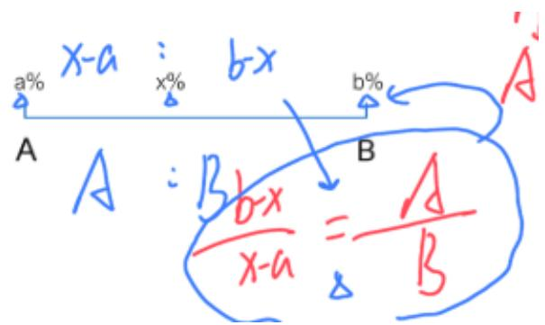

# 2. 练习：

(1) 练习 1: 全年消费 4000 元, 同比增长  $5 \%$ , 上半年消费 1000 元, 同比增长  $2 \%$ , 下半年消费 3000 元, 问下半年消费同比增长率为多少?

答：上半年（1000元、 $2\%$ ）写左边，下半年（3000元、？）写右边，全年（ $5\%$ ）写中间，量之比  $= 1000: 3000 = 1: 3$ ，距离和量成反比，则距离之比  $= 3: 1$ ， $2\%$  到  $5\%$  的距离是  $3\%$ ， $3\%$  对应 3 份，则 1 份对应  $1\%$ ， $r_{\text{下半年}} = 5\% + 1\% = 6\%$ 。

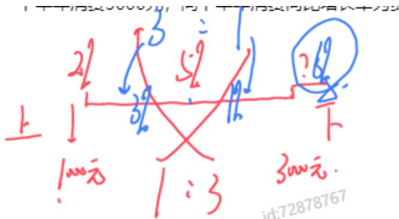

（2）练习2：上半年收入5万元，同比增长  $12\%$  ， $1\sim 5$  月收入4万元，同比增长  $10\%$  ，问6月收入同比增速约为多少？

答：上半年（5万元、 $12\%$ ）是总体，写中间， $1 \sim 5$  月（4万元、 $10\%$ ）写左边，6月（量  $= 5$  万-4万  $= 1$  万，r用？表示）写右边，距离和量成反比，量之比为4：1，距离之比为1：4，1份对应  $2\%$  ，则4份对应  $8\%$  ，？ $= 12\% + 8\% = 20\%$ 。

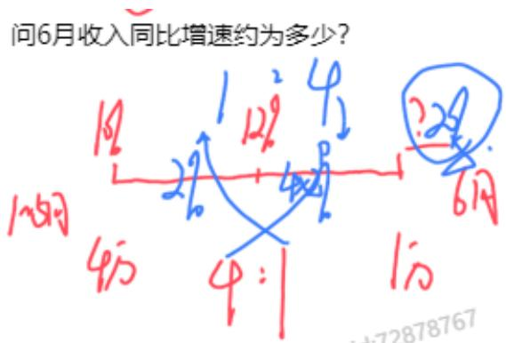

2019年，A地区社会消费品零售总额为6582亿元，同比增长  $6.7\%$  …

2019年  $1\sim 11$  月，A地区社会消费品零售总额为5925亿元，同比增长 $6.3\%$

【拓展】（2021山东）2019年12月，A地区社会消费品零售总额同比增速约为？

A.  $3\%$

B.  $6\%$

C.  $10\%$

D.  $15\%$

【解析】拓展. 材料给 2019 年、2019 年  $1 \sim 11$  月， $1 \sim 11$  月+12 月=全年，考虑混合增长率， $r_{1 \sim 11\text{月}}(6.3\%) < r_{1 \sim 12\text{月}}(6.7\%) < r_{12\text{月}}$ ，排除 A、B 项。

2019年  $1\sim 11$  月的零售总额为5925亿元，2019年A地区社会消费品零售总额为6582亿元，则2019年12月的零售总额  $= 6582 - 5925 = 600^{+}$  亿元，选项差距大，

不用很精确，量之比近似为  $5900: 600^{+} \approx 10: 1$  ，距离和量成反比，则距离之比  $\approx 1: 10$  ，左边  $6.7\% - 6.3\% = 0.4\%$  对应 1 份，10 份对应  $4\%$  ， $r_{12\text{月}} \approx 6.7\% + 4\% = 10.7\%$  ，对应 C 项。【选 C】

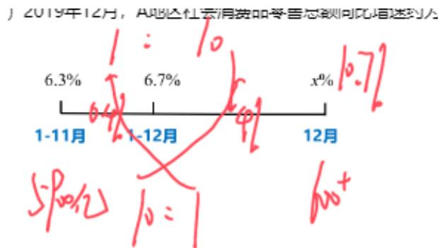  
问题：

# 思维导图

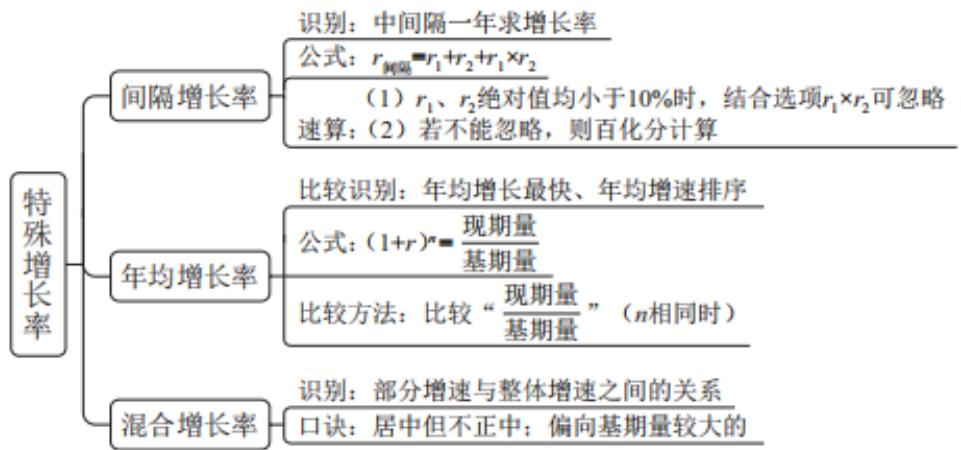

<table><tr><td>截位直除</td><td>截谁:一步除法截分母多步除法上下都截</td><td>选项差距:差距大、截两位:首位均不同;首位相同时次位差大于首位差距小、截三位:首位相同次位差小于等于首位</td><td>选项数字不同时,截位不考虑量级选项数字相同时(例0.88%、8.8%),要判断量级若选项前三位数字都一样,此时至少需要截4位(精算,很罕见)</td></tr><tr><td>分数比较</td><td>分子大且分母小分数大(钱多人少)</td><td colspan="2">分子分母同大同小时:竖着直接除横着看倍数,谁的倍数大就看谁——分子大的分数大、分母大的分数小要灵活运用,例如横着倍数看不出来可以竖着除一下</td></tr><tr><td></td><td>识别</td><td>公式</td><td>技巧</td></tr><tr><td>基期量(必考)</td><td>求过去的量</td><td>①基期量=现期量-增长量
②基期量 = 现期量/1+r</td><td>1.加减法精确计算，可用尾数
2.截位直除：若|r|≤5%，求基期可化除为乘
3.基期比较，现期大且r小的基期更大
4.基期和差：先算现期结果（排除），再结合大小分
析范围；无法分析先算一半，再看选项</td></tr><tr><td>现期量(考的较少)</td><td>求未来的量</td><td>①现期量=基期量+增长量
②现期量 = 基期量 × (1+r)</td><td>注意问法：保持增量还是保持增速
若材料未知增长率，根据倍数相同结合选项快速估算
特殊情况：现期和基期很接近（1倍出头）时，用增
长量来估算，选一个略大的结果</td></tr></table>

<table><tr><td>识别</td><td>公式</td><td>技巧</td></tr><tr><td>计算:增长+%</td><td>r=增长量/基期量</td><td>1.给百分点高减低加2.给具体量,套公式截位直除,注意分母是基期3.多年份r&gt;10%即现期&gt;1.1基期</td></tr><tr><td>比较:增长+快/慢</td><td>增长率=现期-基期/现期-增量=基期</td><td>1.给现期、基期时先看现期÷基期的倍数,看不出来就用增量÷基期2.给现期、增量时直接比增量÷现期即可</td></tr></table>

<table><tr><td colspan="2">Fb粉笔</td><td colspan="2">遇见不一样的自己</td></tr><tr><td></td><td>识别</td><td>公式</td><td>技巧</td></tr><tr><td rowspan="2">增长量(必考)</td><td>计算:增长+单位</td><td>①增长量=现期-基期;②年均增长量=N(年份差)</td><td>1.年均规则
常规情况:从A-B,A为基期、B为现期,年份差为B-A
特殊情况:“十几五”,基期前推一年,年份差是5
2.熟练掌握百化分及补充技巧(抢救法、取中、倍数)</td></tr><tr><td>比较:增长+多/少</td><td>③百化分:|r|≈1/N
增长量=N+1;减少量=N-1</td><td>口诀:大大则大、一大一小看倍数
补充:若倍数看不出来(很接近)时,百亿分计算最稳妥</td></tr><tr><td>比重问题</td><td>识别</td><td>公式</td><td>技巧</td></tr><tr><td>现期比重(必考)</td><td>求今年的占比</td><td>比重=部分(A)/总体(B),增长贡献率=部分的增长量/总体的增长量</td><td>截位直除饼状图重点看四分之一(90°)</td></tr><tr><td>基期比重(常考)</td><td>求去年的占比</td><td>A/B×1+b/1+a</td><td>分析的思维:算左边,看右边,选答案计算的思维:选项差距小截三位之后太难算,等比例放缩把后面约掉</td></tr><tr><td>两期比重(必考)</td><td>问今年比重与去年相比</td><td>A/B×a-b/1+a</td><td>1.判升降(a&gt;b,上升;a&lt;b,下降)2.定大小:比重差&lt;|a-b|3.代公式:若范围无法选出 A/B × a-b/1+a</td></tr></table>

<table><tr><td>平均数问题</td><td>识别</td><td>公式</td><td>技巧</td></tr><tr><td>现期平均(必考)</td><td>求今年的平均数</td><td>平均数=后(A)/前(B)</td><td>1.截位直除2.多数加和求平均:削峰填谷</td></tr><tr><td>基期平均(很少考)</td><td>求去年的平均数</td><td>A/B×1+b/1+a</td><td>差距大,上下截两位约分差距小,和基期比重相同</td></tr><tr><td>两期平均(必考)</td><td>问今年平均数与去年相比</td><td>平均数的增长量=A/B×a-b/1+a平均数的增长率=a-b/1+b</td><td>1.增长量考的少,没时间算可以先判断升降,然后猜一个较小的2.增长率就是代公式送分</td></tr></table>

<table><tr><td>倍数问题</td><td>识别</td><td>公式</td><td>注意</td></tr><tr><td>现期倍数 (必考)</td><td>求今年的倍数关系</td><td>倍数 \( = \frac{\text{ 前(A) }}{\text{ 后(B) }} \)</td><td>1.A比B多几倍? \( \frac{A}{B} - 1 \) ; 2.A超过B的n倍？ \( A &gt; n \times  B \) 3.总量相同时,可用比重代替计算倍数</td></tr><tr><td>基期倍数 (很少考)</td><td>求去年的倍数关系</td><td>\( \frac{\mathrm{A}}{\mathrm{B}} \times  \frac{1 + \mathrm{b}}{1 + \mathrm{a}} \)</td><td>和基期平均数一样</td></tr><tr><td>翻笔</td><td></td><td></td><td>遇见不一样的自己</td></tr><tr><td></td><td>识别</td><td>公式</td><td>技巧</td></tr><tr><td>间隔增长率(常考, 套路)</td><td>时间上隔一年,求增长率/倍数/基期</td><td>r1+r2+r1r2和 + 积</td><td>1.计算很简单,结合选项2.间隔倍数=间隔r+13.间隔基期=现期÷(1+间隔r)4.逆向考查: r2=r间-r1/1+r1</td></tr><tr><td>年均增长率(常考比较, 计算极少)</td><td>年均+增长率</td><td>(1+r)^n=现期量÷基期量</td><td>1.比较: 看现期量÷基期量2.计算: 居中代入</td></tr><tr><td>混合增长率(必考, 重难点)</td><td>有加和的关系,求其中某个量的增长率</td><td colspan="2">1.混合总体居中: 最小r&lt;总体r&lt;最大r2.偏向量较大的: 总体增速离基数大的更近3.线段法的拓展: 距离与量成反比</td></tr></table>

复习建议（最后再唠叨几句）

1、课程至少再看一遍，重点看不懂的地方，查缺补漏，不留死角。  
2、把每天上课的知识点、思维导图，手写整理成笔记。

要求：根据我给的模板内容调整成自己的内容

3、找数与速算的练习：微信小程序“粉笔快练”  
4、基础扎实后，每天做  $3 \sim 4$  篇资料分析。

注意：前期以正确率为主，准确率达到  $80\%$  左右后掐时间

5、请你坚持，资料分析一定会提高

【注意】复习建议（最后再唠叨几句）：

1. 课程至少再看一遍，重点看不懂的地方，查缺补漏，不留死角。  
2. 把每天上课的知识点、思维导图，手写整理成笔记。要求根据老师给的模板内容调整成自己的内容。  
3. 找数与速算的练习: 微信小程序 “粉笔快练”, 最重要的如上图, 是老师

圈出来的首位计算和百分数与分数。

4. 基础扎实后，每天做  $3 \sim 4$  篇资料分析。注意前期以正确率为主，准确率达到  $80\%$  左右后掐时间。  
5. 请你坚持，资料分析一定会提高。  
6. 系统班使用说明书：

(1) 精讲精练阶段: 对应《笔试系统讲义》。  
(2) 刷题巩固阶段: 每个科目会给大家讲解三套真题, 配套讲义是《极致试题》。  
（3）拔高突破阶段：对应讲义是《拔高突破讲义》。  
(4) 考前冲刺阶段: 讲义是课前老师结合最新真题来给大家现做的。  
(5) 除了核心课程还有补充课程, 补充课程一般会有  $300^{+}$ 节, 公安专业理论微课、常识及政治理论热点课、常识补充考点课是提前添加的录播课; 阶段梳理课是跟随精讲精练科目的进行而添加的。一些稀奇古怪考法还会陆续添加补充课, 大家可以按需听。  
(6) 图书大礼包: 《行测的思维》和《申论的规矩》可以当成工具书、百科全书来用, 《行测考点一本通》和《申论技巧与热点解读》是知识点小册子, 《常识通关三百问》和《公安必备考点》也是包含在大礼包中, 大家可以结合使用。

# 【答案汇总】

间隔增长率1-5：DBBDA

年均增长率 1-4: AADC

混合增长率 1-5: CBACB; 6: D

遇见不一样的自己

Be your better self