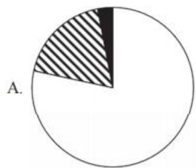
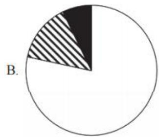
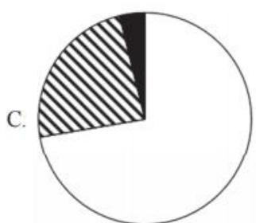
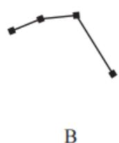
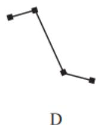
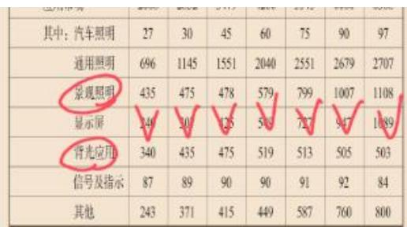
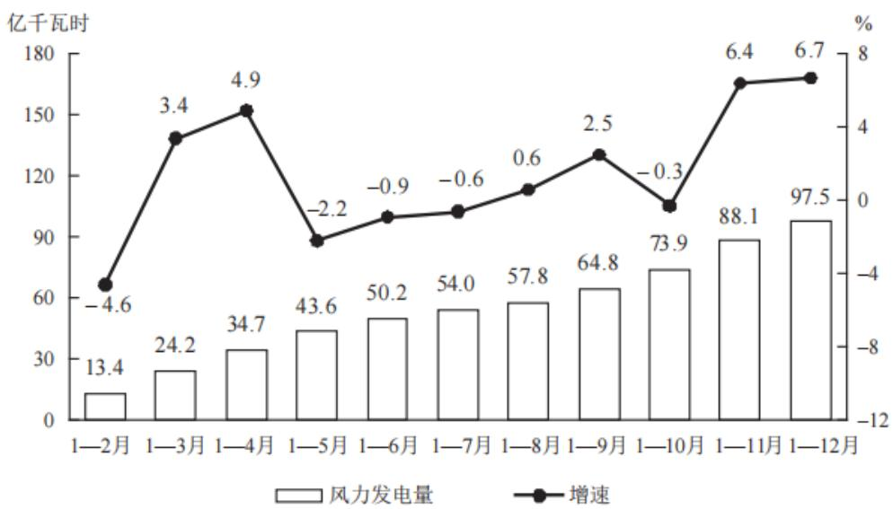
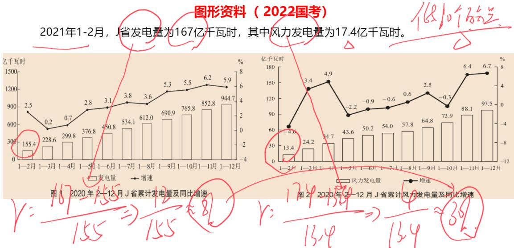
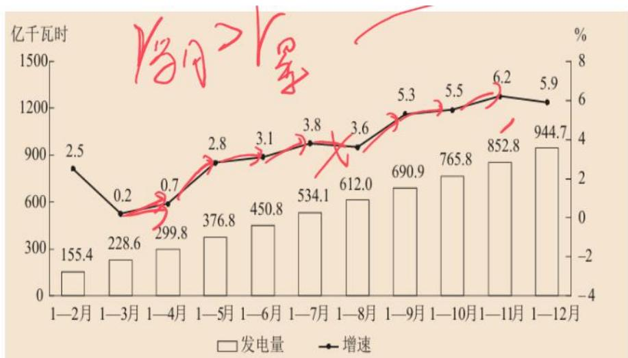
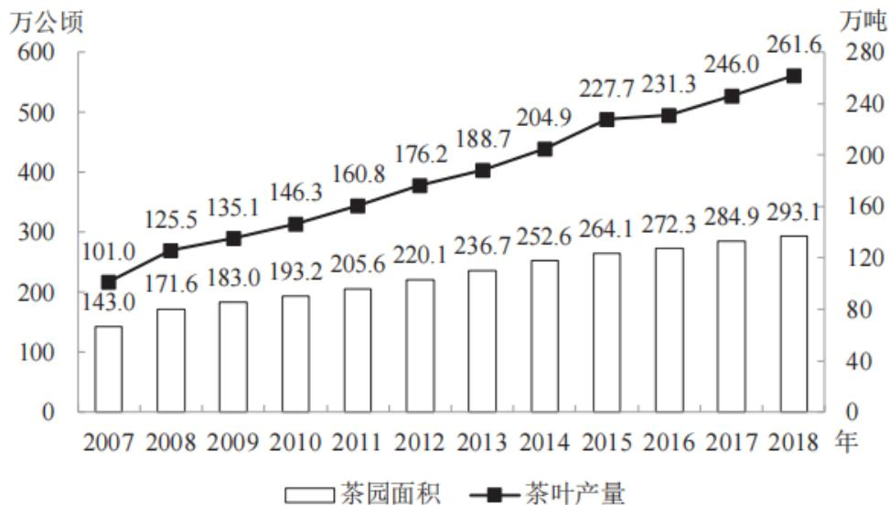

# 精讲精练-资料8

（笔记）

主讲教师：邓健

授课时间：2025.03.10

# 精讲精练-资料8（笔记）

# 资料分析 精讲精练8

# 学习任务：

1.课程内容：资料综合训练  
2.对应讲义：第  $373\sim 379$  页  
3.重点内容：

（1）不同类型资料的找数技巧  
（2）知识点综合巩固

【注意】本节课讲解四篇国考真题资料，国考真题对于本班最有针对性，除了第一篇是2025年的新题，剩下的几篇都是2021、2020年的老题，因为后期真题课阶段会给大家讲解2022、2023、2024年的国考真题，故本节课的选题避开了新题，由于国考有地市级、副省级、行政执法类，会有差异材料，故第一篇在不和后面真题阶段冲突的基础上，选择了2025年的真题。

# 第九节 资料综合训练

文字资料

表格资料

图形资料

综合资料

【注意】本节课的分别讲解文字、表格、图形、综合材料（有文字、表格、图形）的资料分析。

# 做题逻辑

1. 浏览材料：20秒左右快速看一下时间、结构、主体  
2. 读题：看时间、找关键词（我们讲的题型识别）

——确定考点（大脑开始检索公式和技巧）

3.找数据——代入公式，列算式  
4. 看选项，能看出就选，看不出来根据选项差距开始计算

# 【注意】做题逻辑：

1.20秒左右快速浏览材料：看时间、结构、主体，主要是文字材料需要看，做题可以发现，后几篇有图表的材料找数快，主要是第一篇找数慢，故文字材料可以看一下材料。  
2. 读题：看时间、找关键词（我们讲的题型识别），确定考点（大脑开始检索公式和技巧）。比如看到“占”，想到比重，结合时间（假设是现期时间），想到现期比重，现期比重=部分/总体。  
3.找数据，代入公式，列算式。  
4. 看选项，能看出就选，看不出来根据选项差距开始计算，以本套题为例，没有选项差距小到极致的，选项永远是最给力的好伙伴，一定要结合选项来做题。

# 一、文字资料

【例】（2025国考）根据以下资料，完成下列各题。

2023年一季度，我国外贸进出口总额为9.89万亿元，同比增加0.45万亿元。其中，东部地区进出口7.75万亿元，同比增长  $2.9\%$  ；中西部、东北地区分别进出口1.84万亿元、2975.4亿元，同比分别增长  $12.6\%$  、  $9.4\%$  。

2月份，东部地区进出口同比增速由1月份的下降  $11.1\%$  转为增长  $7\%$  ，3月份增速扩大至  $15.8\%$  。一季度有进出口实绩企业数量38.7万家，同比增长  $5.2\%$  。一季度，东部地区出口高技术产品7741.7亿元，同比增长  $9.8\%$  ，占东部地区出口额比重为  $17.9\%$  ，同比提升0.7个百分点，其中3月增速为  $21\%$  。

一季度，中西部地区民营企业进出口1.08万亿元，同比增长  $32.8\%$  ，中西部地区对“一带一路”沿线国家进出口7400.9亿元，同比增长  $38\%$  。一般贸易占中西部地区进出口总额的  $56.6\%$  ，同比提升4.9个百分点。

一季度，东北地区黑色金属冶炼和压延加工业、汽车制造业、铁路船舶等其他运输设备制造业出口同比分别增长  $42.9\%$  、  $62.3\%$  、  $136.4\%$  。化肥、种子分别进口25亿元、5867.6万元，同比分别增长  $117.8\%$  、  $119.9\%$  。

# 【注意】

1. 正常写文章、材料都是总分结构或者并列结构。大部分是总分结构，小部分是并列结构。  
2. 总分结构先给出总的情况，再分地区、部门或行业给出分的情况。  
3. 本篇：时间是2023年一季度，第一段说外贸进出口总量，出现“其中”，分为东、中西、东北部（各个地区）；后三段分别说了东部、中西部、东北部的具体情况，根据对应主体来找数据即可。

1. 以下饼状图中，最能准确反映2023年一季度我国外贸进出口总额中，东部地区（白色）、中西部地区（斜线）和东北地区（黑色）外贸进出口额占比关系的是：

【解析】1. 饼状图，现期比重问题，找到对应的量来解题，结合第一段来找数，东部地区进出口7.75万亿元，中西部、东北地区分别进出口1.84万亿元、2975.4亿元，有量级差距，东部、中西部、东北地区占比依次是大、中小，且东北很小，结合选项，看“斜线+黑色”是否到达总体的1/4，总体*1/4=9.89万元*1/4≈2.4万，中西部+东北部≈1.84万+3000≈2.14万<2.4万，不到总体的1/4，排除C、D项。

A、B项区别在于斜线部分和黑色部分的倍数关系，1.84万/3000约等于6倍，B项斜线部分顶多是黑色部分的3倍，不可能有6倍，排除B项，选择A项。

【选A】

【注意】饼状图：核心是看四分之一，还可以观察部分量之间的倍数关系。

2. 2023年一季度，东部地区外贸进口额约为多少万亿元？

A. 2.2

B.2.8

C. 3.4

D. 4.0

【解析】2. 问题时间是 2023 年一季度，出现东部，问总的情况定位第一段，问具体情况定位第二段。问进口额，给出一季度的出口额，存在加和的关系，如果求增长率为混合增长率，但是本题不求增长率，求的是量，进口额=进出口-出口。没有直接给出出口额，给出东部高技术产品出口量和所占比重，故东部出口≈0.77万亿/18%=4+万，进口额=进出口-出口=7.75万-4+万=3.X，对应C项。【选C】

3.2023年一季度，中西部地区对“一带一路”沿线国家进出口贸易额同比增量约占同期中西部地区外贸进出口总额同比增量的：

A.  $33\%$

B.  $55\%$

C.  $77\%$

D.  $99\%$

【解析】3. 问题时间是现期时间，出现“占”和“增量”，需要算增量和比重，“占”前为部分，“占”后为总体，中西部定位第一段或者第三段，“一带一路”可以根据双引号定位，给出现期和  $r$ ，求增长量，百亿分， $r = 1 / n$ ，增长量=现期/(n+1)，结合选项，选项差距很大，可以估算，一带一路： $38\% \approx 40\% = 1 / 2.5$ ，增长量≈7400/3.5=2000；中西部：增长率=12.6%≈12.5%=1/8，增长量≈1.84万/9=2000，所求=2000%/2000≈99%，可能会不敢选，但其实中西部地区进出口的“增量”主要就是靠一带一路战略，D项当选。【选D】

4.2023年一季度，东部地区外贸进出口额占我国外贸进出口总额比重比上年同期：

A.上升了5个百分点以上

B.上升了不到5个百分点

C. 下降了 5 个百分点以上

D. 下降了不到 5 个百分点

【解析】4.2023年一季度+比上年同期+比重+上升下降+百分点，两期比重

计算问题，先比较 a 和 b，再根据比重差  $< |a - b|$  来选择答案，如果还不行，代公式  $\rightarrow A / B * [(a - b) / (1 + a)]$ 。“占” 前为 A，增长率为 a；“占” 后为 B，增长率为 b， $a = 2.9\%$ ，b 没有直接给出，而是给出增长量和现期，需要计算， $b =$  增长量/基期  $= 0.45 / (9.89 - 0.45)$ （分母可以口算） $= 0.45 / 9.44 \approx 5\%$ ， $a < b$ ，为下降，排除 A、B 项；b 才  $5\%$ ，a 和 b 的差值肯定不到 5 个百分点，对应 D 项。【选 D】

5. 关于我国外贸进出口状况，能够从上述资料中推出的是：

A. 2023 年 3 月东部地区高技术产品出口额  
B. 2022 年一季度中西部地区一般贸易进出口额  
C. 2023 年一季度全国高技术产品出口额  
D. 2022年东北地区汽车制造业出口额同比增量

【解析】5.C项：选项时间2023年一季度，“全国”定位第一段，第一段没有初选“高技术产品”，只有第二段出现过“高技术”，只能推算出东部地区高技术产品相关数据，无法推出全国高技术产品相关数据，排除。

D项：选项时间是2022年，基期时间，东北地区定位最后一段，问增长量，只给出2023年增长率，没有基期和现期，增长率的年份也不适用，没有对应年份的任何数据，无法推出，排除。

A项：选项时间是2023年3月，东部定位第二段，3月的相关数据只有企业数量，高技术产品相关数据对应的时间是一季度，没有相关数据，无法推出，排除。  
B项：选项时间是基期时间，给出2023年一般贸易占中西部地区进出口总额的比重和比上年提升的百分点，故可以求出2022年一般贸易占中西部地区进出口总额的比重；第一段给出2023年中西部地区进出口总额及增长率，可以求出2022年中西部地区进出口总额，可以推出2022年一季度中西部地区一般贸易进出口额，列式为  $1.84 / (1 + 12.6\%) * (56.6\% - 4.9\%)$ ，当选。【选B】

关于综合分析：

(1)没有必然的顺序, 一般建议先 CD 后 AB (此顺序适用省考, 国考花卷)  
(2)结合题目灵活选取：优先挑现期、题干短的，遇难跳过

(3)注意选正确的还是错误的, 选完就走, 不要做验证

【注意】关于综合分析：

1. 没有必然的顺序, 假设你是出题人, 精心设计了 4 个选项, 如果考生看了 A 项就选出答案就走了, 会感到失望, 故一般建议先 C、D 项, 后 A、B 项, 且结合真题的概率, 答案在 C、D 项的概率高。不过此顺序适用省考, 因为国考是花卷, 花卷是一种防作弊的手段, 同一套题, 不同省份卷的选项顺序可能不同, 正确答案在哪里都有可能, 故不适用。  
2. 结合题目灵活选取：优先挑现期、题干短的，遇难跳过，选择题可以用排除法。  
3. 注意选正确的还是错误的，前几年都是选正确的，但近几年选非题出现次数越来越多，故需要看清楚。  
4. 选完就走，不要做验证：大家在预习的时候，做第5题可能看出B项是答案后，C、D项也都看完才敢选B项，一定要克服自己这个心理，因为学生时代的考试时间充裕，有时间验算，但是公考没有那么多时间，不要觉得验算的正确率就高，因为不保证验证的过程就是正确的，可能验证的选项做错了，导致不知道选谁，浪费了时间也没提高正确率。

# 二、表格资料

【例】（2021国考）根据以下资料，完成下列各题。

# 2013—2019年我国LED产业不同领域产值规模

单位：亿元  

<table><tr><td>年份</td><td>2013</td><td>2014</td><td>2015</td><td>2016</td><td>2017</td><td>2018</td><td>2019</td></tr><tr><td>总产值</td><td>2576</td><td>3507</td><td>4245</td><td>5216</td><td>6538</td><td>7374</td><td>7548</td></tr><tr><td>其中:封装</td><td>403</td><td>517</td><td>615</td><td>748</td><td>963</td><td>1054</td><td>959</td></tr><tr><td>外延芯片</td><td>105</td><td>138</td><td>151</td><td>182</td><td>232</td><td>240</td><td>201</td></tr><tr><td>应用市场</td><td>2068</td><td>2852</td><td>3479</td><td>4286</td><td>5343</td><td>6080</td><td>6388</td></tr><tr><td>其中:汽车照明</td><td>27</td><td>30</td><td>45</td><td>60</td><td>75</td><td>90</td><td>97</td></tr><tr><td>通用照明</td><td>696</td><td>1145</td><td>1551</td><td>2040</td><td>2551</td><td>2679</td><td>2707</td></tr><tr><td>景观照明</td><td>435</td><td>475</td><td>478</td><td>579</td><td>799</td><td>1007</td><td>1108</td></tr><tr><td>显示屏</td><td>240</td><td>307</td><td>425</td><td>549</td><td>727</td><td>947</td><td>1089</td></tr><tr><td>背光应用</td><td>340</td><td>435</td><td>475</td><td>519</td><td>513</td><td>505</td><td>503</td></tr><tr><td>信号及指示</td><td>87</td><td>89</td><td>90</td><td>90</td><td>91</td><td>92</td><td>84</td></tr><tr><td>其他</td><td>243</td><td>371</td><td>415</td><td>449</td><td>587</td><td>760</td><td>800</td></tr></table>

【注意】表格资料：注意总分结构，第一行或者最后一行一般是总量。且表格是通过首行缩进来区分，缩进一级就是分类一次。越靠近左边级别越高。

1. “十三五”（2016～2020年）最后一年我国LED产业总产值要实现比“十二五”（2011～2015年）最后一年翻番的目标，总产值至少要同比增长：

A.  $9.6\%$

B.  $12.5\%$

C.  $16.3\%$

D.  $22.1\%$

【解析】1. “十三五”最后一年是2020年，“十二五”最后一年是2015年，“翻番”即变成原来的2倍，要求2020年实现2015年的2倍，2015年 $*2 = 4245*2 = 8490$ ；增长  $+ \%$  ，求增长率，给出现期、基期，选项差距大，r=增量/基期  $=$  （8490-7548）/7548=942/7548，可以截位直除，也可以根据942略大于 $7548*10\%$  ，对应B项。或者根据  $942 / 7548 \approx 1 / 8 = 12.5\%$  ，对应B项。【选B】

2.  $2014\sim 2019$  年间，我国LED产业封装、外延芯片和应用市场产值同比增速均超过  $10\%$  的年份有几个？

A. 1

B. 2

C. 3

D. 4

【解析】2. 问增长率超过  $10\%$  的年份有几个，要  $r > 10\%$  ，现期-基期  $>10\%$  基期，现期  $>1.1$  基期。LED产业封装、外延芯片和应用市场都要看。

先看LED产业封装，2014年：403增长  $10\%$  的增长量约为40，对于几百的数，增长  $10\%$  对应的增长量为几十，  $403\rightarrow 517$  ，增量超过  $100>$  几十，故增长率 $>10\%$  ，满足；同理，2015年：  $517\rightarrow 615$  ，增长量  $\approx 100>$  几十，满足；2016、2017年的增长量都超过100，都满足增长率大于  $10\%$  。选项最多是4年，故先看前四年，前四年都满足。

再看外延芯片，2014年：对应的基期是105，在100左右的数据的基础上增长  $10\%$  ，增量要大于10，故外延芯片的增量只要达到20，增速就能达到  $10\%$  ，105 $\rightarrow 138$  ，增长量大于20，增长率大于  $10\%$  ，满足；2015年：  $138\rightarrow 151$  ，增长量为 $13,13 < 138*10\%$  ，不满足；2016年：  $151\rightarrow 182$  ，增长量为31，增长率大于  $10\%$  满足；2017年：  $182\rightarrow 232$  ，增长量为50，增长率大于  $10\%$  ，满足。

目前共有3个年份满足，继续看后面的年份，外延芯片2018年：  $232\rightarrow 240$  现期、基期接近，增长率肯定不到  $10\%$  ，2019年：  $240\rightarrow 201$  ，为下降，增长率不到  $10\%$  ，不满足。

应用市场只需要看2014、2016、2017年，2014年： $2068 \rightarrow 2852$ ，增长量大于200多就满足增长率大于  $10\%$ ，增长量为800左右，满足增长率大于  $10\%$ ；2016年： $3479 \rightarrow 4286$ ，增长量大于347.9，满足；2017年： $4286 \rightarrow 5343$ ，增长量约为900，超过428.6，满足。

综上，满足的年份有 2014、2016、2017 年，共 3 个年份，对应 C 项。【选 C】

（2021国考） $2014\sim 2019$  年间，我国LED产业封装、外延芯片和应用市场产值同比增速均超过  $10\%$  的年份有几个？

(2020 国考) 2011~2018 年间, 我国海洋主题公园非门票收入同比增速超过  $10\%$  的年份有几个?

(2020 国考) C.  $2008 \sim 2010$  年, 全国茶园面积同比增速逐年持续下降

以上都是问这些年份中满足同比增速要求的情况，因此每一年都是要分析的，第一年同比就是和上一年相比

以下都是年均增长类的考查，是看从A-B的整体情况，A为起点，B为终点，

# 不需要往前看

（2024联考） $2019\sim 2022$  年，中国储能锂电池出货量年均增速为3类锂电池中最快  
(2022 北京)将①金属耐磨材料、②陶瓷耐磨材料和③树脂耐磨材料按 2014-2020 年消费量年均增速（以 2014 年为基础）从高到低排列

# 【注意】

1. 前三题是问这些年份中满足同比增速要求的情况，每一年都是要同比的，因此每一年都是要分析的，第一年同比就是和上一年相比。  
2. 后两题是年均增长类问题出现时间段，看这个时间段的整体情况，时间段是 A～B，A 为起点，B 为终点，不需要往前看。  
3. 在表中所列各类LED应用市场中，2013—2019年产值年均增速（以2013年为基期）最快的应用市场，2019年产值约占LED行业总产值的：

A.  $14\%$

B.  $17\%$

C.  $36\%$

D.  $85\%$

【解析】3.2013年为基期，2019年为现期，问年均增速最快，找现期/基期最大的，在应用市场中找，汽车照明、通用照明为  $3^{+}$  倍，景观照明为  $2^{+}$  倍，显示屏为  $4^{+}$  倍，背光应用和信号及指示为  $1^{+}$  倍，其他为  $3^{+}$  倍，最大的是显示屏，问2019年显示屏产值约占LED行业总产值的多少，不要错算成1089/6388，所求 $= 1089 / 7548\approx 1 / 7\approx 14.3\%$  ，对应A项。【选A】

4. 以下折线图中，能准确反映2015—2018年间通用照明类LED应用市场产值同比增量变化趋势的是：

【解析】4. 问同比增量变化趋势，选项的折线图有 4 个点，2015～2018 年这 4 年都要看（2015 年、2016 年、2017 年、2018 年），2015～2018 年的通用照

明类LED应用市场产值同比增量依次为406、 $500^{-}$ 、 $500^{+}$ 、100左右，趋势为升、升、降到最低，对应B项。【选B】

5. 关于  $2013 \sim 2019$  年我国 LED 产业，能够从上述资料中推出的是：

A. 2016 年总产值同比增量低于 2015 年  
B. 2019 年封装产值占行业总产值比重高于 5 年前水平  
C. 7 年间汽车照明应用累计产值规模超过 500 亿元  
D. 每年景观照明应用的产值均高于背光应用产值

【解析】5. 遇难跳过。

C 项：7 年间汽车照明应用累计产值规模可以加出来，但是没有必要，7 年要求超过 500，则平均到每年是  $500 / 7 = 70^{+}$ ，结合数据，前四个数据都小于 70，最后三个数据比 70 多一点点，后面多的 3 年连前两年的缺少都补不上，多的不够补上少的，平均下来小于 70，总计小于 500，排除。  
D 项：要求每年景观照明应用的产值均高于背光应用产值，结合材料，确实都大于，满足，当选。

A 项：要求 2016 年总产值同比增量低于 2015 年，2016 年增量  $= 5216 - 4245 = 1000$ ，2015 年增量  $= 4245 - 3507 \approx 700$ ，实际是高于，说法错误，排除。  
B 项：2019 年封装产值占行业总产值比重  $= 959 / 7548 \approx 1 / 8$ ，5 年前即 2014 年，2014 年封装产值占行业总产值比重  $= 517 / 3507 \approx 1 / 7$ ， $1 / 8 < 1 / 7$ ，并非高于，而是低于，说法错误，排除。【选 D】

# 三、图形资料

【例】（2022国考）根据以下资料，完成下列问题。

2021年  $1\sim 2$  月，J省发电量为167亿千瓦时，其中风力发电量为17.4亿千瓦时。

  
图12020年2—12月J省累计发电量及同比增速

  
图2 2020年2—12月J省累计风力发电量及同比增速

【注意】图形资料：

1. 图 1: 2020 年 2~12 月 J 省累计发电量及同比增速。  
2. 图2：2020年  $2\sim 12$  月J省累计风力发电量及同比增速。  
3. 文字材料：2021年  $1 \sim 2$  月，J省发电量为167亿千瓦时，其中风力发电量为17.4亿千瓦时。

1.2020年第二季度，J省除风力发电之外的发电量在以下哪个范围内？

A. 不到 200 亿千瓦时

B.在200亿～215亿千瓦时

C. 在 215 亿  $\sim 230$  亿千瓦时

D. 超过 230 亿千瓦时

【解析】1. 问题时间为 2020 年第二季度, 材料给的是累计数据, 第二季度  $= 1 \sim 6$  月  $-1 \sim 3$  月; 问 “除风力发电之外的发电量” (现期平均数例 1 问的是 “某

省除 Z 市之外”, 遇到 “除……外”, 做减法), 三位数及以上的运算不用管小数点, J 省  $\approx 450 - 228 = 222$ , 风力发电  $= 50.2 - 24.2 = 26$ , 所求  $\approx 222 - 26$ , 对应 A 项。

【选A】

# 【注意】

1. 累计材料，二季度（4～6月）=1～6月-1～3月。  
2. 除……之外，用减法：总发电-风力发电。  
2. 2021年  $1\sim 2$  月J省累计发电量同比增速比同期风力发电量同比增速：

A. 高不到 10 个百分点

B. 低不到 10 个百分点

C. 高 10 个百分点以上

D. 低 10 个百分点以上

【解析】2. 需要计算 J 省累计发电量同比增速、风力发电量同比增速，已知现期、基期，求增长率，对应材料找数据， $r_{\text{省}} \approx (167 - 155) / 155 = 12 / 155 \approx 8\%$ ， $r_{\text{风力}} \approx (17.4 - 13.4) / 13.4 = 4 / 13.4 \approx 30\%$ ，所求  $\approx 8\% - 30\%$ ，结果为低 10 个百分点以上，对应 D 项。【选 D】

3.2020年  $3\sim 12$  月，J省当月发电量同比增速快于当月累计发电量同比增速的月份有几个？

A. 5

B. 6

C. 7

D. 8

【解析】3. 问当月同比增速快于当月累计增速的月份有几个，以5月为例，

要求  $r_{5 \text{月}} > r_{1 \sim 5 \text{月}}$ ,  $5 \text{月} + 1 \sim 4 \text{月} = 1 \sim 5 \text{月}$ , 存在加和关系, 比较增长率, 为混合增长率, 总体居中, 即  $r_{5 \text{月}} > r_{1 \sim 5 \text{月}} \rightarrow r_{1 \sim 4 \text{月}} < r_{1 \sim 5 \text{月}} < r_{5 \text{月}}, r_{1 \sim 4 \text{月}} = 0.7 \%$  、  $r_{1 \sim 5 \text{月}} = 2.8 \%$ , 故 5 月符合。

结合图形理解， $r_{1\sim 4\text{月}} = 0.7\%$ 、 $r_{1\sim 5\text{月}} = 2.8\%$ ，说明是5月比较“给力”，如果 $r_{5\text{月}} = 2.8\%$ ，那么 $r_{1\sim 5\text{月}}$ 应该居中，介于 $0.7\% \sim 2.8\%$ 之间，但到不了 $2.8\%$ ，故反推出 $r_{5\text{月}}$ 远远超过 $2.8\%$ ；比如3个人的平均分是50分，加入邓同学之后，4个人的平均分是60分，说明邓同学的分数远远超过60分。

结论：只要累计增速的折线上升，就说明当月增速  $>$  累计增速，如图，共有7个月份符合，选择C项。【选C】

  
图12020年2—12月J省累计发电量及同比增速

# 【注意】

1. 切入点：看到当月和累计，比较增长率，想时间的混合。  
2. 结论：当月增速  $>$  累计增速，即累计增速的折线上升（只要折线不滑坡，当月就比累计多）。  
4. 将 2020 年四个季度按 J 省风力发电量由高到低的顺序排列，以下正确的是：

A.第三季度、第一季度、第二季度、第四季度  
B.第四季度、第二季度、第一季度、第三季度  
C.第四季度、第三季度、第一季度、第二季度

D.第三季度、第一季度、第四季度、第二季度

【解析】4. 问 2020 年四个季度按 J 省风力发电量由高到低的顺序排列，材料给出的是累计数据，需要加减运算。第一季度（1～3月）=24.2，第二季度=1～6月-1～3月=50.2-24.2=26，第二季度>第一季度，排除 A、C、D 项，选择 B 项。

【选B】

【注意】排序题：利用选项。

5. 以下折线图反映了 2020 年哪个时间段内 J 省单月发电量的变化趋势？

A.  $3 \sim 7$  月

B.  $4 \sim 8$  月

C.  $5 \sim 9$  月

D.  $6 \sim 10$  月

【解析】5. 问折线图反映了哪个时间段内 J 省单月发电量的变化趋势，发电量定位图 1 的柱状图，四个选项逐一分析比较麻烦，尽量从选项的相同之处入手，即 6 月和 7 月，6 月  $= 1 \sim 6$  月  $-1 \sim 5$  月  $= 450.8 - 376.8 = 74$  ，7 月  $= 1 \sim 7$  月  $-1 \sim 6$  月  $= 534.1 - 450.8 \approx 84$  ，A 项的 6 月、7 月对应最后 2 个点，A 项最后 2 个点是下降的，而实际上 6 月  $\rightarrow 7$  月是上升的；B 项的 6 月、7 月对应倒数第 2 个、第 3 个点，符合上升；C 项的 6 月、7 月对应第 2 个、第 3 个点，选项是下降的；D 项的 6 月、7 月对应前面 2 个点，符合上升，故排除 A、C 项。剩余 B、D 项，验证 D 项，8 月  $= 1 \sim 8$  月  $-1 \sim 7$  月  $= 612 - 534.1 \approx 78$  ，9 月  $= 1 \sim 9$  月  $-1 \sim 8$  月  $= 690.9 - 612 \approx 78$  ，D 项中第 4 个点比第 3 个点高很多，排除 D 项，选择 B 项。【选 B】

（2023联考）下列折线图中，能准确反映2022年第四季度竞猜型彩票月销售额的环比增长率变化趋势的是：

（2022国考）以下折线图中，能准确反映  $2015\sim 2018$  年间通用照明类LED应用市场产值同比增量变化趋势的是：

（2022国考）以下折线图反映了2020年哪个时间段内J省单月发电量的变化趋势

# 【注意】

1. 变化趋势只是固定搭配的表达，并不是代表求增长率或增长量，要看题目说的谁的变化趋势。如以上3道题目，问的都是“变化趋势”，只是看哪幅图吻合，求谁要看变化趋势前面的表述。  
2. 一个折线图对应时间段的题目，找选项中相同的月份入手。

# 四、综合资料

【例】（2020国考）根据以下资料，完成下列问题。

  
2007—2018年全国茶园面积及茶叶产量

2018年全国产茶省份茶园面积及茶叶产量  
单位：万公顷、万吨  

<table><tr><td>省份</td><td>面积</td><td>产量</td><td>省份</td><td>面积</td><td>产量</td></tr><tr><td>江苏</td><td>3.37</td><td>1.46</td><td>广东</td><td>6.20</td><td>9.65</td></tr><tr><td>浙江</td><td>19.92</td><td>18.60</td><td>广西</td><td>7.71</td><td>7.30</td></tr><tr><td>安徽</td><td>16.97</td><td>13.49</td><td>海南</td><td>0.24</td><td>0.06</td></tr><tr><td>福建</td><td>20.72</td><td>40.16</td><td>重庆</td><td>4.49</td><td>3.96</td></tr><tr><td>江西</td><td>11.42</td><td>7.09</td><td>四川</td><td>36.34</td><td>29.50</td></tr><tr><td>山东</td><td>2.20</td><td>2.88</td><td>贵州</td><td>45.62</td><td>19.93</td></tr><tr><td>河南</td><td>11.63</td><td>7.40</td><td>云南</td><td>44.45</td><td>39.81</td></tr><tr><td>湖北</td><td>29.93</td><td>31.45</td><td>陕西</td><td>13.80</td><td>7.35</td></tr><tr><td>湖南</td><td>16.89</td><td>21.36</td><td>甘肃</td><td>1.15</td><td>0.14</td></tr></table>

【注意】综合资料：

1. 图形材料：2007～2018年全国茶园面积及茶叶产量。  
2. 表格材料：2018年全国产茶省份茶园面积及茶叶产量。

1. 2016～2018年，全国茶叶产量之和比2013～2015年产量之和增加了：

A.  $100 \sim 150$  万吨之间  
B. 不到 100 万吨  
C. 超过 200 万吨  
D.  $150 \sim 200$  万吨之间

【解析】1. 问产量，定位折线图，2016～2018年与  $2013\sim 2015$  年相比，可以先加和、再作差，但是比较慢，都是三个数据加和，尽量先抵消，2016年-2013年=231.3-188.7≈43, 2017年-2014年=246-204.9≈42, 2018年-2015年=261.6-227.7≈34，所求≈43+42+34=120 $^+$ ，对应A项。【选A】

【注意】速算小技巧：多个量先加和再作差，可以先作差再加和。

2.  $2007 \sim 2018$  年间，全国茶园面积首次超过 200 万公顷的年份，当年茶园单位面积茶叶产量比上年：

A.下降了  $10\%$  以上  
B. 下降了不到  $10\%$  
C. 增加了  $10\%$  以上  
D. 增加了不到  $10\%$

【解析】2. 问面积首次超过 200 万公顷的年份, 根据柱状图可知是 2011 年; 问当年茶园单位面积茶叶产量+上升/下降+, 为平均数的增长率问题。单位面积产量=后/前=产量/面积, 产量增速对应 a、面积增速对应 b, 材料没有直接给出 a、b, 需要计算,  $a \approx (160 - 146) / 146 = 14 / 146 \approx 10\%$ ,  $b \approx (205 - 193) / 193 = 12 / 193 = 10^{-}\%$ ,  $a > b \rightarrow$  平均数上升, 排除 A、B 项;  $r = (a - b) / (1 + b) = (10\% - 10^{-}) / (1 + 10^{-})$ , 结合公式和选项, 结果一定<10%, 选择 D 项。【选 D】

# 【注意】

1. 题型识别：单位面积产量+增长+%——平均数的增长率  
2. 对应思维：后/前，找a和b，代入公式  $r = (a - b) / (1 + b)$ 。  
3. 列式计算: 产量/面积, 定位 2011 年, a=增量/基期=(160-146)/146=14/146 (10%), b=增量/基期=(205-193)/193=12/193 (10%)。a>b, 上升, 排除 A、

B 项；结合公式和选项,结果小于  $10\%$  ，选 D 项。

4. 单位面积产量是农业相关材料几乎必考的指标，比如亩产500斤，500斤/亩就是单位面积产量。  
5. 材料没有给出 a、b，给出产量和面积的数据，可以直接计算，2011 年单位面积产量  $\approx 160 / 205$  ，2010 年单位面积产量  $\approx 146 / 193$  ，算出现期平均数、基期平均数，再去计算增长率，r=现期/基期-  $1 \approx 160 / 205 \div (146 / 193) - 1 = 160 / 205 * (193 / 146) - 1$  ，考虑约分、等比例放缩， $193 \rightarrow 146$  为  $1^{+}$  倍，原式  $\approx 160 / 205 * [(193 + 20) / (146 + 14)] - 1 = 213 / 205 - 1 = 1^{+} - 1$  ，即增加了，但是增加得非常少，不到  $10\%$  （213/205 首位商 1、次位商 0、第三位商 4）。

3. 2018年全国产茶省份中，有几个省份的茶园单位面积茶叶产量高于1吨/公顷？

A. 5

B. 4

C. 7

D. 6

【解析】3. 要求高于 1 吨/公顷，即产量/面积  $>1 \rightarrow$  产量  $>$  面积，定位表格找数据，福建、山东、湖北、湖南、广东符合，选择 A 项。【选 A】

<table><tr><td>省份</td><td>面积</td><td>产量</td><td>省份</td><td>面积</td><td>产量</td></tr><tr><td>江苏</td><td>3.37</td><td>1.46</td><td>广东</td><td>6.20</td><td>9.65</td></tr><tr><td>浙江</td><td>19.92</td><td>18.60</td><td>广西</td><td>7.71</td><td>7.30</td></tr><tr><td>安徽</td><td>16.97</td><td>13.49</td><td>海南</td><td>0.24</td><td>0.06</td></tr><tr><td>福建</td><td>20.72</td><td>40.16</td><td>重庆</td><td>4.49</td><td>3.96</td></tr><tr><td>江西</td><td>11.42</td><td>7.09</td><td>四川</td><td>36.34</td><td>29.50</td></tr><tr><td>山东</td><td>2.20</td><td>2.88</td><td>贵州</td><td>45.62</td><td>19.93</td></tr><tr><td>河南</td><td>11.63</td><td>7.40</td><td>云南</td><td>44.45</td><td>39.81</td></tr><tr><td>湖北</td><td>29.93</td><td>31.45</td><td>陕西</td><td>13.80</td><td>7.35</td></tr><tr><td>湖南</td><td>16.89</td><td>21.36</td><td>甘肃</td><td>1.15</td><td>0.14</td></tr></table>

4. 2018 年茶园面积最大的 4 个省份中，茶叶产量也是全国前 4 名的省份有几个？

A. 3

B. 4

C. 1

D. 2

【解析】4. 定位表格找数据, 茶园面积最大的 4 个省份是湖北、四川、贵州、云南, 茶叶产量全国前 4 名是福建、湖北、四川、云南, 其中两项都符合的有湖北、四川、云南, 选择 A 项。【选 A】

2018年全国产茶省份茶园面积及茶叶产量  
单位：万公顷、万吨  

<table><tr><td>省份</td><td>面积</td><td>产量</td><td>省份</td><td>面积</td><td>产量</td></tr><tr><td>江苏</td><td>3.37</td><td>1.46</td><td>广东</td><td>6.20</td><td>9.65</td></tr><tr><td>浙江</td><td>19.92</td><td>18.60</td><td>广西</td><td>7.71</td><td>7.30</td></tr><tr><td>安徽</td><td>16.97</td><td>13.49</td><td>海南</td><td>0.24</td><td>0.06</td></tr><tr><td>福建</td><td>20.72</td><td>40.16</td><td>重庆</td><td>4.49</td><td>3.96</td></tr><tr><td>江西</td><td>11.42</td><td>7.09</td><td>四川</td><td>36.34</td><td>29.50</td></tr><tr><td>山东</td><td>2.20</td><td>2.88</td><td>贵州</td><td>45.62</td><td>19.93</td></tr><tr><td>河南</td><td>11.63</td><td>7.40</td><td>云南</td><td>44.45</td><td>39.81</td></tr><tr><td>湖北</td><td>29.93</td><td>31.45</td><td>陕西</td><td>13.80</td><td>7.35</td></tr><tr><td>湖南</td><td>16.89</td><td>21.36</td><td>甘肃</td><td>1.15</td><td>0.14</td></tr></table>

5. 能够从上述资料中推出的是：

A. 2018 年全国茶叶产量比 9 年前翻了一番  
B. 2018 年全国茶园面积最小的产茶省份, 单位面积产量也最低  
C.  $2008 \sim 2010$  年, 全国茶园面积同比增速逐年持续下降  
D. 2018 年湖南、湖北的茶园面积占全国茶园总面积的两成以上

【解析】5. 综合分析题，先看 C、D 项。

C项：要求  $r_{2008\text{年}} > r_{2009\text{年}} > r_{2010\text{年}}$ ，面积定位柱状图， $r_{2008\text{年}} = (171.6 - 143) / 143 \approx 28 / 143$ 、 $r_{2009\text{年}} = (183 - 171.6) / 171.6 \approx 12 / 171$ 、 $r_{2010\text{年}} = (193.2 - 183) / 183 \approx 10 / 183$ ，分数比较，2008年的分子最大、分母最小，故2008年的增速最大；2009年和2010年相比，2009年的分子大、分母小，故2009年的增速大于2010年的增速，说法正确，当选。

D 项：两成是  $20\%$  ，湖南  $+ \text{湖北} = 16.89 + 29.93 = 46^{+}$  ，全国总面积是 293.1， $293.1 * 20\% \approx 58$  ，不到两成以上，说法错误（如果改为“一成”则正确），排除。  
A项：翻了一番就是2倍，2018年全国茶叶产量为261.6万吨，2009年全国茶叶产量为135.1万吨，不到2倍，排除。  
B 项: 单位面积产量 = 产量 / 面积, 海南的面积最小, 海南的单位面积产量  $= 0.06 / 0.24 = 1 / 4 = 25\%$ ; 单位面积产量低, 说明不适合种茶叶, 即面积少、产量小,甘肃的产量最少, 甘肃的单位面积产量  $= 0.14 / 1.15 = 10^{+}$ , 甘肃 < 海南, 说法错误,排除。【选 C】

聊一聊

现阶段：乱、记不住、听得懂不会用、一做就懵了想不起来方法

这是意料之外但是情理之中的: 你以为听完了课自己就无所不能强的可怕啦?

醒醒，学习是得一步一个脚印的同学

所以，先听懂——再记住——然后运用——查缺补漏——再熟练运用

从此：初窥门径——登堂入室——炉火纯青——登峰造极——鱼跃龙门——平步青云——扶摇直上

微博：粉笔邓健

# 【答案汇总】

文字资料1-5：ACDDB

表格资料 1-5: BCABD

图形资料 1-5: ADCBB

综合资料1-5：ADAAC

遇见不一样的自己

Be your better self